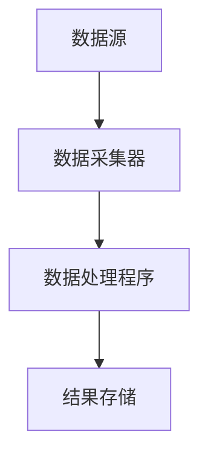

                 

# 《Spark Streaming 原理与代码实例讲解》

## 关键词
- Spark Streaming
- 实时数据处理
- 微批处理
- DStream
- RDD转换
- 性能调优
- 实例讲解

## 摘要
本文将深入讲解Spark Streaming的核心原理，包括其架构、算法、性能优化等内容。通过实际代码实例，我们将展示如何利用Spark Streaming实现实时日志分析、股票交易分析和广告点击率分析等应用。此外，还将对比Spark Streaming与Flink，并探讨其在生产环境中的部署与运维。

----------------------------------------------------------------

## 第一部分：Spark Streaming基础理论

### 1. Spark Streaming概述

#### 1.1 Spark Streaming的历史与发展

Spark Streaming是Apache Spark生态系统的一部分，由Matei Zaharia和他的团队在UC Berkeley AMPLab开发。Spark Streaming首次亮相于2011年的Spark论文中，并随着Spark项目的不断发展，Spark Streaming也得到了不断的完善和优化。

2013年，Spark Streaming在Databricks公司内得到了进一步的完善，并于2014年正式发布。自此以后，Spark Streaming成为了Spark生态系统中的重要组成部分，广泛应用于各种实时数据处理场景。

#### 1.2 Spark Streaming的核心特性

**高吞吐量**：Spark Streaming通过微批处理（micro-batching）技术，将数据流分割成小的批次进行计算，从而实现高效的数据处理。与传统流处理框架相比，Spark Streaming在处理高吞吐量数据方面具有显著优势。

**易用性**：Spark Streaming继承了Spark的核心API，使得用户可以使用熟悉的Spark编程模型进行实时数据处理。用户无需学习全新的编程模型，即可轻松上手Spark Streaming。

**弹性**：Spark Streaming支持在YARN、Mesos和Standalone等集群管理器上运行，具有高度的可伸缩性和容错能力。用户可以根据实际需求，灵活配置资源，实现高效的数据处理。

**集成**：Spark Streaming与Spark的其他组件（如MLlib、GraphX和Spark SQL）无缝集成，用户可以方便地利用Spark Streaming进行实时数据处理，并将结果进一步分析和存储。

#### 1.3 Spark Streaming的应用场景

**实时数据监控**：Spark Streaming可以实时监控服务器日志、网络流量等数据，及时发现并处理异常情况，保障系统的稳定运行。

**实时数据处理**：Spark Streaming可以对实时数据流进行ETL处理，如清洗、转换、聚合等操作，为实时决策提供支持。

**实时数据分析**：Spark Streaming可以对实时数据进行分析，生成实时报表、趋势图等，为业务提供决策依据。

### 2. Spark Streaming架构详解

#### 2.1 Spark Streaming架构原理图


**数据源**：数据源可以是文件、Kafka、Flume等，负责向Spark Streaming提供数据。

**DStream**：DStream（Discretized Stream）是Spark Streaming中的数据结构，表示一个连续的数据流。DStream可以理解为一个序列化的RDD（Resilient Distributed Dataset），其中每个RDD表示一个时间窗口内的数据。

**Spark Driver**：Spark Driver是Spark Streaming的核心组件，负责协调和管理DStream的转换和计算。

**Spark Worker**：Spark Worker是执行DStream转换和计算任务的工作节点。

**结果存储**：处理结果可以存储在HDFS、Cassandra、HBase等存储系统，也可以通过输出操作将结果输出到其他系统。

#### 2.2 DStream与RDD的转换

DStream是Spark Streaming中的核心数据结构，它表示一个连续的数据流。DStream与RDD（Resilient Distributed Dataset）之间存在紧密的关系。

**DStream的定义**：DStream是针对流数据的抽象，它可以看作是一个不断更新的RDD序列，每个RDD表示一段时间窗口内的数据。

**RDD的定义**：RDD是一个不可变的分布式数据集，它支持各种变换和行动操作。

DStream与RDD的转换主要涉及以下几种操作：

- **map**：对DStream中的每个元素进行映射。
- **reduceByKey**：对DStream中的键值对进行聚合。
- **updateStateByKey**：用于更新DStream中的状态。

以下是一个简单的DStream与RDD转换的伪代码示例：

```scala
val lines = ssc.textFileStream("/user/spark/data/")
val words = lines.flatMap(line => line.split(" "))
val wordCounts = words.map(word => (word, 1)).reduceByKey(_ + _)
```

在这个示例中，首先使用`textFileStream`方法从HDFS中读取文本文件，然后通过`flatMap`和`split`操作将文本分割成单词，接着使用`map`和`reduceByKey`操作对单词进行计数。

#### 2.3 Spark Streaming与Spark其他组件的整合

Spark Streaming与Spark的其他组件（如MLlib、GraphX和Spark SQL）无缝集成，使得用户可以在实时数据处理的基础上，进一步进行机器学习、图计算和SQL查询等操作。

- **Spark SQL**：Spark Streaming可以与Spark SQL结合使用，对实时数据流进行查询和分析。用户可以使用SQL或HiveQL对实时数据进行查询，并将结果存储在HDFS或其他存储系统中。

```scala
val sqlContext = new SQLContext(ssc.sparkContext)
val df = sqlContext.read.json("/user/spark/data/")
df.createOrReplaceTempView("word_counts")
sqlContext.sql("SELECT word, count FROM word_counts GROUP BY word").show()
```

- **MLlib**：Spark Streaming可以利用MLlib中的机器学习算法对实时数据进行预测和分析。例如，可以使用MLlib中的线性回归算法对实时股票交易数据进行预测。

```scala
val model = LinearRegression.train(trainingData)
val predictions = testData.map { case (features, label) =>
  val predictedLabel = model.predict(features)
  (predictedLabel, label)
}
predictions.map { case (predicted, actual) => predicted - actual }.mean()
```

- **GraphX**：Spark Streaming可以与GraphX结合，处理实时数据流中的图数据。例如，可以使用GraphX对社交网络中的用户关系进行实时分析。

```scala
val edges = ...
val graph = Graph(vertices, edges)
val rankedEdges = graph.edges.sortBy(e => e.weight, ascending = false)
```

### 3. Spark Streaming核心算法原理

#### 3.1 Windows函数与Trigger机制

Windows函数是Spark Streaming中的核心算法之一，用于对DStream中的数据进行时间窗口划分。Windows函数可以根据用户定义的时间窗口大小和滑动间隔，将数据流分割成多个时间窗口，并在每个窗口内对数据进行处理。

**Windows函数**：

- **固定窗口（Fixed Window）**：固定窗口是指窗口大小固定，不随时间变化。例如，一个1分钟固定窗口意味着每1分钟的数据将被聚合处理一次。

- **滑动窗口（Sliding Window）**：滑动窗口是指窗口大小固定，但窗口会随时间向后滑动。例如，一个1分钟滑动窗口，每2分钟处理一次数据，意味着在前1分钟的数据处理完成后，会追加新的数据，并丢弃旧的数据。

**Trigger机制**：Trigger机制用于触发窗口计算。在Spark Streaming中，Trigger可以分为基于时间的Trigger和基于数据的Trigger。

- **基于时间的Trigger**：基于时间的Trigger会在窗口到期时触发计算。例如，一个1分钟固定窗口的Trigger会在每个1分钟时间戳触发一次计算。

- **基于数据的Trigger**：基于数据的Trigger会在窗口内的数据达到一定数量时触发计算。例如，一个1分钟滑动窗口，每2分钟处理一次数据，如果窗口内的数据量达到100条，则会立即触发计算。

以下是一个简单的Windows函数和Trigger机制的伪代码示例：

```scala
val stream = ...
stream.mapWithState((batchTime, values, state) => {
  // 处理逻辑
  // 更新状态
  (values, state)
}).window( Minutes(1), Minutes(1))
```

在这个示例中，`mapWithState`函数用于处理每个批次的数据，并更新状态。`window`函数用于定义窗口大小和滑动间隔，并设置Trigger机制。

#### 3.2 RDD变换与操作详解

在Spark Streaming中，RDD变换和操作是核心算法的重要组成部分。RDD变换包括`map`、`filter`、`reduceByKey`等，用于对DStream中的数据进行转换。RDD操作包括`reduce`、`collect`等，用于触发计算并返回结果。

**RDD变换**：

- **map**：对DStream中的每个元素进行映射。
- **filter**：过滤DStream中的元素，只保留满足条件的元素。
- **reduceByKey**：对DStream中的键值对进行聚合。
- **updateStateByKey**：用于更新DStream中的状态。

**RDD操作**：

- **reduce**：对DStream中的所有元素进行聚合。
- **collect**：将DStream中的所有元素收集到一个数组中。
- **count**：计算DStream中元素的个数。

以下是一个简单的RDD变换和操作的伪代码示例：

```scala
val stream = ...
val words = stream.flatMap(line => line.split(" "))
val wordCounts = words.map(word => (word, 1)).reduceByKey(_ + _)

wordCounts.reduceByKey(_ + _).map { case (word, count) => (count, word) }.sortByKey(ascending = false).take(10)
```

在这个示例中，首先使用`flatMap`和`split`操作将文本分割成单词，然后使用`map`和`reduceByKey`操作对单词进行计数。最后，使用`reduceByKey`、`map`和`sortByKey`操作生成词频排名，并取前10名。

#### 3.3 Spark Streaming流水线优化

Spark Streaming流水线优化是提高数据处理性能的关键。以下是一些常见的优化方法：

- **数据倾斜处理**：数据倾斜会导致某些分区处理时间过长，从而影响整个流水线的性能。可以通过分区策略调整和重分区操作来处理数据倾斜。
- **缓存**：缓存中间结果可以减少重复计算，提高数据处理性能。可以使用`cache`或`persist`方法将中间结果缓存。
- **序列化**：选择合适的序列化方式可以降低序列化开销。例如，可以使用Kryo序列化器代替默认的Java序列化器。
- **并行度调整**：根据集群资源和任务需求，调整RDD的并行度，提高数据处理性能。

以下是一个简单的Spark Streaming流水线优化示例：

```scala
val stream = ...
val words = stream.flatMap(line => line.split(" "))
val wordCounts = words.map(word => (word, 1)).reduceByKey(_ + _).cache()

val sortedWordCounts = wordCounts.map { case (word, count) => (count, word) }.sortByKey(ascending = false)

sortedWordCounts.take(10)
```

在这个示例中，首先使用`cache`方法将中间结果缓存，然后使用`map`和`sortByKey`操作生成词频排名。最后，使用`take`操作取前10名。

### 4. Spark Streaming性能调优

#### 4.1 集群资源管理

集群资源管理是Spark Streaming性能调优的重要方面。以下是一些常见的资源管理方法：

- **动态资源分配**：使用YARN、Mesos等集群管理器的动态资源分配机制，根据任务需求自动调整资源分配。
- **资源调度策略**：根据任务类型和资源需求，选择合适的资源调度策略。例如，使用FIFO策略保证实时任务的优先执行。
- **资源预留**：为特定任务预留一定量的资源，确保任务在执行过程中有足够的资源可用。

以下是一个简单的集群资源管理示例：

```scala
val conf = new SparkConf().setAppName("Spark Streaming Example")
      .setMaster("yarn")
      .set("spark.yarn.queue", "my_queue")

val ssc = new StreamingContext(conf, Seconds(10))
```

在这个示例中，使用`SparkConf`和`StreamingContext`设置集群资源管理参数，包括应用程序名称、集群管理器、队列名称等。

#### 4.2 数据倾斜处理

数据倾斜是指某些RDD分区中的数据量远大于其他分区，导致任务处理时间过长，影响整体性能。以下是一些常见的数据倾斜处理方法：

- **分区策略调整**：通过调整RDD的分区策略，合理分配数据到各个分区，避免数据倾斜。例如，使用`hashPartitioning`方法根据键的哈希值分配数据。
- **重分区操作**：通过重分区操作，将倾斜数据重新分配到不同的分区中。例如，使用`repartition`方法根据新的分区策略重新分配数据。
- **关键数据重分区**：对于某些导致数据倾斜的关键数据，可以通过重分区操作将它们分配到不同的分区中。例如，使用`keyBy`方法根据键值重新分配数据。

以下是一个简单的数据倾斜处理示例：

```scala
val stream = ...
val words = stream.flatMap(line => line.split(" "))

val wordCounts = words.map(word => (word, 1)).reduceByKey(_ + _)

val sortedWordCounts = wordCounts.map { case (word, count) => (count, word) }.sortByKey(ascending = false)

sortedWordCounts.repartition(10).take(10)
```

在这个示例中，使用`repartition`方法根据新的分区策略重新分配数据，并使用`take`操作取前10名。

#### 4.3 代码性能优化

代码性能优化是提高Spark Streaming性能的重要手段。以下是一些常见的代码性能优化方法：

- **缓存**：使用`cache`或`persist`方法将中间结果缓存，减少重复计算。例如，使用`cache`方法将词频计数结果缓存。
- **序列化**：选择合适的序列化方式可以降低序列化开销。例如，使用Kryo序列化器代替默认的Java序列化器。
- **并行度调整**：根据集群资源和任务需求，调整RDD的并行度，提高数据处理性能。例如，使用`repartition`方法根据新的并行度重新分配数据。
- **代码重用**：重用已经编写并验证过的代码，避免重复编写和调试。

以下是一个简单的代码性能优化示例：

```scala
val stream = ...
val words = stream.flatMap(line => line.split(" "))

val wordCounts = words.map(word => (word, 1)).reduceByKey(_ + _).cache()

val sortedWordCounts = wordCounts.map { case (word, count) => (count, word) }.sortByKey(ascending = false)

sortedWordCounts.take(10)
```

在这个示例中，使用`cache`方法将中间结果缓存，并使用`take`操作取前10名。

### 5. 实例一：实时日志分析

#### 5.1 实例背景与目标

本实例的目标是对服务器日志进行实时分析，监控服务器运行状态。服务器日志包含大量关于服务器性能、应用程序运行状态等信息，通过实时分析日志，可以及时发现并处理异常情况，保障系统的稳定运行。

#### 5.2 数据采集与预处理

数据采集是本实例的关键步骤。在本实例中，我们将使用Kafka作为数据采集工具，从服务器日志文件中实时读取日志，并将日志数据发送到Kafka集群。

以下是一个简单的Kafka数据采集示例：

```scala
import org.apache.spark.streaming._
import org.apache.spark.streaming.kafka._
import kafka.serializer.StringDecoder

val ssc = new StreamingContext(sc, Seconds(10))

val topics = Set("log_topic")
val brokers = "kafka_server:9092"
val kafkaParams = Map(
  "metadata.broker.list" -> brokers,
  "serializer.class" -> "kafka.serializer.StringSerializer"
)

val stream = KafkaUtils.createDirectStream[String, String, StringDecoder, StringDecoder](
  ssc, kafkaParams, topics)

stream.map(_._2).pprint()
```

在这个示例中，我们首先创建了一个`StreamingContext`，并设置数据采集的频率为10秒。然后，我们使用`KafkaUtils.createDirectStream`方法从Kafka中创建一个直接流，其中`topics`为需要采集的数据主题，`brokers`为Kafka集群的地址，`kafkaParams`为Kafka参数。

接下来，我们使用`map`操作将Kafka消息中的值（即日志数据）提取出来，并使用`pprint`操作打印日志数据。在实际应用中，可以替换`pprint`操作，将日志数据存储到文件、数据库或其他系统中。

#### 5.3 数据处理与计算

在数据处理与计算步骤中，我们将对实时日志数据进行分析和计算，提取有用的信息。在本实例中，我们将对日志数据进行格式化、提取关键词和统计等操作。

以下是一个简单的数据处理与计算示例：

```scala
import org.apache.spark.streaming._
import org.apache.spark.streaming.kafka._
import kafka.serializer.StringDecoder

val ssc = new StreamingContext(sc, Seconds(10))

val topics = Set("log_topic")
val brokers = "kafka_server:9092"
val kafkaParams = Map(
  "metadata.broker.list" -> brokers,
  "serializer.class" -> "kafka.serializer.StringSerializer"
)

val stream = KafkaUtils.createDirectStream[String, String, StringDecoder, StringDecoder](
  ssc, kafkaParams, topics)

val formattedLogs = stream.map { line =>
  val parts = line.split(",")
  (parts(0), parts(1).toFloat)
}

val logStats = formattedLogs.reduceByKey((v1, v2) => v1 + v2)

logStats.print()
```

在这个示例中，我们首先使用`map`操作将Kafka消息中的日志数据进行格式化，将日志数据分割成两部分，即日志ID和日志值。然后，我们使用`reduceByKey`操作对日志值进行累加，生成日志统计结果。

最后，我们使用`print`操作打印日志统计结果。在实际应用中，可以替换`print`操作，将日志统计结果存储到文件、数据库或其他系统中。

#### 5.4 实例代码实现

以下是一个完整的实时日志分析实例代码：

```scala
import org.apache.spark._
import org.apache.spark.streaming._
import org.apache.spark.streaming.kafka._
import kafka.serializer.StringDecoder

val sparkConf = new SparkConf().setAppName("Realtime Log Analysis")
val ssc = new StreamingContext(sparkConf, Seconds(10))

val topics = Set("log_topic")
val brokers = "kafka_server:9092"
val kafkaParams = Map(
  "metadata.broker.list" -> brokers,
  "serializer.class" -> "kafka.serializer.StringSerializer"
)

val stream = KafkaUtils.createDirectStream[String, String, StringDecoder, StringDecoder](
  ssc, kafkaParams, topics)

val formattedLogs = stream.map { line =>
  val parts = line.split(",")
  (parts(0), parts(1).toFloat)
}

val logStats = formattedLogs.reduceByKey((v1, v2) => v1 + v2)

logStats.print()

ssc.start()
ssc.awaitTermination()
```

在这个示例中，我们首先创建了一个`SparkConf`对象，并设置应用程序名称和采集频率。然后，我们创建了一个`StreamingContext`，并使用`KafkaUtils.createDirectStream`方法从Kafka中创建一个直接流。

接下来，我们使用`map`操作将Kafka消息中的日志数据进行格式化，并使用`reduceByKey`操作对日志值进行累加，生成日志统计结果。

最后，我们使用`print`操作打印日志统计结果，并启动StreamingContext，等待任务结束。

### 6. 实例二：实时股票交易分析

#### 6.1 实例背景与目标

本实例的目标是对实时股票交易数据进行分析，监控市场动态。股票交易数据包含股票价格、交易量、交易时间等信息，通过实时分析股票交易数据，可以了解市场趋势，为投资决策提供支持。

#### 6.2 数据采集与预处理

数据采集是本实例的关键步骤。在本实例中，我们将使用Kafka作为数据采集工具，从股票交易数据源中实时读取交易数据，并将交易数据发送到Kafka集群。

以下是一个简单的Kafka数据采集示例：

```scala
import org.apache.spark._
import org.apache.spark.streaming._
import org.apache.spark.streaming.kafka._
import kafka.serializer.StringDecoder

val sparkConf = new SparkConf().setAppName("Realtime Stock Trading Analysis")
val ssc = new StreamingContext(sc, Seconds(10))

val topics = Set("stock_topic")
val brokers = "kafka_server:9092"
val kafkaParams = Map(
  "metadata.broker.list" -> brokers,
  "serializer.class" -> "kafka.serializer.StringSerializer"
)

val stream = KafkaUtils.createDirectStream[String, String, StringDecoder, StringDecoder](
  ssc, kafkaParams, topics)

stream.map { line =>
  val parts = line.split(",")
  (parts(0), parts(1).toDouble, parts(2).toDouble, parts(3).toLong)
}.pprint()
```

在这个示例中，我们首先创建了一个`SparkConf`对象，并设置应用程序名称和采集频率。然后，我们创建了一个`StreamingContext`，并使用`KafkaUtils.createDirectStream`方法从Kafka中创建一个直接流。

接下来，我们使用`map`操作将Kafka消息中的交易数据进行格式化，将交易数据分割成股票代码、股票价格、交易量和交易时间等字段，并使用`pprint`操作打印交易数据。

在实际应用中，可以替换`pprint`操作，将交易数据存储到文件、数据库或其他系统中。

#### 6.3 数据处理与计算

在数据处理与计算步骤中，我们将对实时交易数据进行分析和计算，提取有用的信息。在本实例中，我们将对交易数据进行格式化、计算交易量和生成交易趋势图等操作。

以下是一个简单的数据处理与计算示例：

```scala
import org.apache.spark._
import org.apache.spark.streaming._
import org.apache.spark.streaming.kafka._
import kafka.serializer.StringDecoder

val sparkConf = new SparkConf().setAppName("Realtime Stock Trading Analysis")
val ssc = new StreamingContext(sc, Seconds(10))

val topics = Set("stock_topic")
val brokers = "kafka_server:9092"
val kafkaParams = Map(
  "metadata.broker.list" -> brokers,
  "serializer.class" -> "kafka.serializer.StringSerializer"
)

val stream = KafkaUtils.createDirectStream[String, String, StringDecoder, StringDecoder](
  ssc, kafkaParams, topics)

val formattedStream = stream.map { line =>
  val parts = line.split(",")
  (parts(0), parts(1).toDouble, parts(2).toDouble, parts(3).toLong)
}

val tradeVolume = formattedStream.reduceByKey((v1, v2) => v1 + v2)

tradeVolume.print()
```

在这个示例中，我们首先使用`map`操作将Kafka消息中的交易数据进行格式化，将交易数据分割成股票代码、股票价格、交易量和交易时间等字段。

然后，我们使用`reduceByKey`操作对交易量进行累加，生成交易量统计结果，并使用`print`操作打印交易量统计结果。在实际应用中，可以替换`print`操作，将交易量统计结果存储到文件、数据库或其他系统中。

#### 6.4 实例代码实现

以下是一个完整的实时股票交易分析实例代码：

```scala
import org.apache.spark._
import org.apache.spark.streaming._
import org.apache.spark.streaming.kafka._
import kafka.serializer.StringDecoder

val sparkConf = new SparkConf().setAppName("Realtime Stock Trading Analysis")
val ssc = new StreamingContext(sc, Seconds(10))

val topics = Set("stock_topic")
val brokers = "kafka_server:9092"
val kafkaParams = Map(
  "metadata.broker.list" -> brokers,
  "serializer.class" -> "kafka.serializer.StringSerializer"
)

val stream = KafkaUtils.createDirectStream[String, String, StringDecoder, StringDecoder](
  ssc, kafkaParams, topics)

val formattedStream = stream.map { line =>
  val parts = line.split(",")
  (parts(0), parts(1).toDouble, parts(2).toDouble, parts(3).toLong)
}

val tradeVolume = formattedStream.reduceByKey((v1, v2) => v1 + v2)

tradeVolume.print()

ssc.start()
ssc.awaitTermination()
```

在这个示例中，我们首先创建了一个`SparkConf`对象，并设置应用程序名称和采集频率。然后，我们创建了一个`StreamingContext`，并使用`KafkaUtils.createDirectStream`方法从Kafka中创建一个直接流。

接下来，我们使用`map`操作将Kafka消息中的交易数据进行格式化，并使用`reduceByKey`操作对交易量进行累加，生成交易量统计结果。

最后，我们使用`print`操作打印交易量统计结果，并启动StreamingContext，等待任务结束。

### 7. 实例三：实时广告点击率分析

#### 7.1 实例背景与目标

本实例的目标是对实时广告点击数据进行分析，监控广告效果。广告点击数据包含广告ID、用户ID、点击时间等信息，通过实时分析广告点击数据，可以了解广告的受欢迎程度，为广告优化提供依据。

#### 7.2 数据采集与预处理

数据采集是本实例的关键步骤。在本实例中，我们将使用Kafka作为数据采集工具，从广告点击数据源中实时读取点击数据，并将点击数据发送到Kafka集群。

以下是一个简单的Kafka数据采集示例：

```scala
import org.apache.spark._
import org.apache.spark.streaming._
import org.apache.spark.streaming.kafka._
import kafka.serializer.StringDecoder

val sparkConf = new SparkConf().setAppName("Realtime Advertising Click Rate Analysis")
val ssc = new StreamingContext(sc, Seconds(10))

val topics = Set("ad_click_topic")
val brokers = "kafka_server:9092"
val kafkaParams = Map(
  "metadata.broker.list" -> brokers,
  "serializer.class" -> "kafka.serializer.StringSerializer"
)

val stream = KafkaUtils.createDirectStream[String, String, StringDecoder, StringDecoder](
  ssc, kafkaParams, topics)

stream.map { line =>
  val parts = line.split(",")
  (parts(0), parts(1).toLong, parts(2).toLong)
}.pprint()
```

在这个示例中，我们首先创建了一个`SparkConf`对象，并设置应用程序名称和采集频率。然后，我们创建了一个`StreamingContext`，并使用`KafkaUtils.createDirectStream`方法从Kafka中创建一个直接流。

接下来，我们使用`map`操作将Kafka消息中的点击数据进行格式化，将点击数据分割成广告ID、用户ID和点击时间等字段，并使用`pprint`操作打印点击数据。

在实际应用中，可以替换`pprint`操作，将点击数据存储到文件、数据库或其他系统中。

#### 7.3 数据处理与计算

在数据处理与计算步骤中，我们将对实时点击数据进行分析和计算，提取有用的信息。在本实例中，我们将对点击数据进行格式化、计算点击量和生成点击趋势图等操作。

以下是一个简单的数据处理与计算示例：

```scala
import org.apache.spark._
import org.apache.spark.streaming._
import org.apache.spark.streaming.kafka._
import kafka.serializer.StringDecoder

val sparkConf = new SparkConf().setAppName("Realtime Advertising Click Rate Analysis")
val ssc = new StreamingContext(sc, Seconds(10))

val topics = Set("ad_click_topic")
val brokers = "kafka_server:9092"
val kafkaParams = Map(
  "metadata.broker.list" -> brokers,
  "serializer.class" -> "kafka.serializer.StringSerializer"
)

val stream = KafkaUtils.createDirectStream[String, String, StringDecoder, StringDecoder](
  ssc, kafkaParams, topics)

val formattedStream = stream.map { line =>
  val parts = line.split(",")
  (parts(0), parts(1).toLong, parts(2).toLong)
}

val clickRate = formattedStream.reduceByKey((v1, v2) => v1 + v2)

clickRate.print()
```

在这个示例中，我们首先使用`map`操作将Kafka消息中的点击数据进行格式化，将点击数据分割成广告ID、用户ID和点击时间等字段。

然后，我们使用`reduceByKey`操作对点击量进行累加，生成点击量统计结果，并使用`print`操作打印点击量统计结果。在实际应用中，可以替换`print`操作，将点击量统计结果存储到文件、数据库或其他系统中。

#### 7.4 实例代码实现

以下是一个完整的实时广告点击率分析实例代码：

```scala
import org.apache.spark._
import org.apache.spark.streaming._
import org.apache.spark.streaming.kafka._
import kafka.serializer.StringDecoder

val sparkConf = new SparkConf().setAppName("Realtime Advertising Click Rate Analysis")
val ssc = new StreamingContext(sc, Seconds(10))

val topics = Set("ad_click_topic")
val brokers = "kafka_server:9092"
val kafkaParams = Map(
  "metadata.broker.list" -> brokers,
  "serializer.class" -> "kafka.serializer.StringSerializer"
)

val stream = KafkaUtils.createDirectStream[String, String, StringDecoder, StringDecoder](
  ssc, kafkaParams, topics)

val formattedStream = stream.map { line =>
  val parts = line.split(",")
  (parts(0), parts(1).toLong, parts(2).toLong)
}

val clickRate = formattedStream.reduceByKey((v1, v2) => v1 + v2)

clickRate.print()

ssc.start()
ssc.awaitTermination()
```

在这个示例中，我们首先创建了一个`SparkConf`对象，并设置应用程序名称和采集频率。然后，我们创建了一个`StreamingContext`，并使用`KafkaUtils.createDirectStream`方法从Kafka中创建一个直接流。

接下来，我们使用`map`操作将Kafka消息中的点击数据进行格式化，并使用`reduceByKey`操作对点击量进行累加，生成点击量统计结果。

最后，我们使用`print`操作打印点击量统计结果，并启动StreamingContext，等待任务结束。

### 8. Spark Streaming与Kafka整合

#### 8.1 Kafka概述与架构

Kafka是一种分布式流处理平台，由LinkedIn开发，用于构建实时的数据流管道和消息队列系统。Kafka具有高吞吐量、高可用性和可扩展性的特点，广泛应用于大数据处理和实时数据流场景。

**Kafka的核心组件**：

- **Producer**：生产者，负责将数据发送到Kafka集群。
- **Broker**：代理，负责存储和转发消息，处理生产者、消费者等请求。
- **Consumer**：消费者，负责从Kafka集群中读取消息。

**Kafka的架构**：

Kafka集群由多个代理（Broker）组成，每个代理负责存储一部分数据。数据以主题（Topic）为单位进行组织，每个主题可以包含多个分区（Partition），每个分区存储在代理上。生产者将数据发送到特定的主题和分区，消费者从相应的主题和分区中读取数据。


#### 8.2 Kafka与Spark Streaming集成原理

Kafka与Spark Streaming的集成主要是通过Kafka的Producer和Consumer接口实现的。在Spark Streaming中，可以使用`KafkaUtils`工具类创建直接流（Direct Stream）或接收器流（Receiver Stream）。

**直接流**：直接流直接从Kafka中读取数据，无需使用外部存储。直接流的优点是延迟低、吞吐量高，但需要确保Kafka和Spark Streaming的版本兼容。

**接收器流**：接收器流将Kafka数据存储到外部存储（如HDFS）中，然后从存储系统中读取数据。接收器流的优点是易于实现，但会增加数据读取的延迟。

以下是一个简单的Kafka与Spark Streaming集成示例：

```scala
import org.apache.spark._
import org.apache.spark.streaming._
import org.apache.spark.streaming.kafka._
import kafka.serializer.StringDecoder

val sparkConf = new SparkConf().setAppName("Kafka and Spark Streaming Integration")
val ssc = new StreamingContext(sc, Seconds(10))

val topics = Set("kafka_topic")
val brokers = "kafka_server:9092"
val kafkaParams = Map(
  "metadata.broker.list" -> brokers,
  "serializer.class" -> "kafka.serializer.StringSerializer"
)

val stream = KafkaUtils.createDirectStream[String, String, StringDecoder, StringDecoder](
  ssc, kafkaParams, topics)

stream.map { line =>
  val parts = line._2.split(",")
  (parts(0), parts(1).toDouble, parts(2).toDouble)
}.pprint()

ssc.start()
ssc.awaitTermination()
```

在这个示例中，我们使用`KafkaUtils.createDirectStream`方法创建一个直接流，从Kafka中读取主题为"kafka_topic"的数据。然后，我们使用`map`操作将Kafka消息中的数据格式化，并使用`pprint`操作打印数据。

#### 8.3 Kafka在Spark Streaming中的应用

Kafka在Spark Streaming中的应用非常广泛，可以用于实时数据处理、实时数据监控和实时数据分发等场景。

**实时数据处理**：Kafka可以作为Spark Streaming的数据源，实时处理流数据。例如，可以使用Kafka存储实时交易数据，然后使用Spark Streaming进行实时数据分析，生成实时报表。

**实时数据监控**：Kafka可以用于实时监控服务器日志、网络流量等数据。例如，可以使用Kafka存储服务器日志，然后使用Spark Streaming进行实时日志分析，生成实时日志报表。

**实时数据分发**：Kafka可以用于实时数据分发，将实时数据发送到不同的系统或应用程序。例如，可以使用Kafka将实时股票交易数据发送到Spark Streaming进行实时分析，同时发送到HDFS进行存储。

### 9. Spark Streaming与Flink对比分析

#### 9.1 Flink概述与特性

Apache Flink是一个分布式流处理框架，由data Artisans团队开发。Flink旨在提供高性能、高可靠性和可扩展的流处理能力，广泛应用于实时数据处理、流分析、机器学习等领域。

**Flink的核心特性**：

- **事件驱动**：Flink基于事件驱动模型，以事件为单位进行数据处理，支持精确一次（exactly-once）的语义保证。
- **流与批处理**：Flink支持流处理和批处理，可以将批处理看作是流处理的一种特殊形式，实现流与批处理的统一。
- **窗口操作**：Flink提供丰富的窗口操作，支持基于时间、基于数据的窗口，以及复杂窗口操作。
- **状态管理**：Flink支持可持久化的状态管理，可以在故障恢复时保持状态一致性。

**Flink的架构**：

Flink由JobManager、TaskManagers、Client和Data Sources组成。JobManager负责协调和管理任务，TaskManagers负责执行计算任务，Client负责提交和管理Flink作业。


#### 9.2 Spark Streaming与Flink对比

**性能**：在流处理性能方面，Flink通常优于Spark Streaming。Flink采用基于事件驱动的模型，减少了任务切换和内存开销，从而提高了数据处理性能。

**功能**：Flink提供了丰富的窗口操作和状态管理功能，支持更复杂的数据处理和分析。Spark Streaming虽然也支持窗口操作和状态管理，但在功能丰富性方面略逊于Flink。

**生态**：Spark拥有更广泛的生态支持和社区资源，包括Spark SQL、MLlib、GraphX等组件，可以方便地进行实时数据处理和分析。而Flink的生态相对较新，但也在快速发展中，尤其在流数据处理和机器学习领域具有独特优势。

以下是一个简单的Spark Streaming与Flink对比示例：

```scala
// Spark Streaming示例
val stream = ssc.textFileStream("/user/spark/data/")
val words = stream.flatMap(line => line.split(" "))
val wordCounts = words.map(word => (word, 1)).reduceByKey(_ + _)
wordCounts.print()

// Flink示例
val env = StreamExecutionEnvironment.getExecutionEnvironment
val stream = env.readTextFile("/user/spark/data/")
val words = stream.flatMap(line => line.split(" "))
val wordCounts = words.map(word => (word, 1)).groupBy(_._1).sum(_._2)
wordCounts.print()
```

在这个示例中，我们分别展示了Spark Streaming和Flink的实时文本处理功能。可以看出，两者在代码结构上非常相似，但在性能和功能上存在一定差异。

#### 9.3 选择Spark Streaming还是Flink

选择Spark Streaming还是Flink，取决于实际应用场景和需求。以下是一些参考因素：

- **流处理性能**：如果应用对实时处理性能有较高要求，可以考虑使用Flink。Flink在流处理性能方面通常优于Spark Streaming。
- **数据处理需求**：如果应用涉及复杂的数据处理和分析，如窗口操作和状态管理，Flink可能更适合。Flink在这些功能方面具有更多灵活性和强大的支持。
- **生态支持**：如果应用依赖于Spark生态系统中的其他组件（如Spark SQL、MLlib、GraphX等），Spark Streaming可能更具优势。
- **团队技能**：如果团队对Spark和Spark Streaming较为熟悉，可以考虑使用Spark Streaming。如果团队对Flink较为熟悉，可以考虑使用Flink。

### 10. Spark Streaming在生产环境中的部署与运维

#### 10.1 部署模式与选择

Spark Streaming支持多种部署模式，包括本地模式、集群模式等。根据实际需求，可以选择适合的部署模式。

**本地模式**：本地模式适用于开发与测试阶段，可以在本地计算机上运行Spark Streaming应用程序。本地模式无需配置集群，简化了部署过程。

**集群模式**：集群模式适用于生产环境部署，支持Standalone、YARN、Mesos等集群管理器。集群模式可以实现高可用性和可伸缩性，满足大规模数据处理需求。

以下是一个简单的Spark Streaming集群模式部署示例：

```scala
// 配置SparkConf
val sparkConf = new SparkConf().setAppName("Spark Streaming Application")
      .setMaster("yarn")

// 创建StreamingContext
val ssc = new StreamingContext(sparkConf, Seconds(10))

// 创建DStream
val stream = ...

// 处理DStream
val wordCounts = ...

// 启动StreamingContext
ssc.start()

// 等待任务结束
ssc.awaitTermination()
```

在这个示例中，我们首先创建了一个`SparkConf`对象，并设置应用程序名称和集群管理器。然后，我们创建了一个`StreamingContext`，并使用`yarn`集群管理器。

接下来，我们创建了一个DStream，并进行数据处理。最后，我们启动StreamingContext，等待任务结束。

#### 10.2 日志与监控

在Spark Streaming生产环境中，日志与监控是确保系统稳定运行和故障快速响应的重要手段。以下是一些常见的日志与监控方法：

**日志收集**：使用Logstash、Flume等工具，将Spark Streaming日志集中收集到日志服务器。例如，可以使用Logstash将日志发送到Elasticsearch、Kibana等日志分析平台。

```shell
logstash -f logstash.conf
```

**监控**：使用Grafana、Kibana等工具，实时监控Spark Streaming集群状态。例如，可以使用Grafana创建仪表板，展示集群资源利用率、任务运行状态等指标。


#### 10.3 故障处理与恢复

在Spark Streaming生产环境中，故障处理与恢复是确保系统稳定运行的关键。以下是一些常见的故障处理与恢复方法：

**故障处理**：根据日志和监控信息，快速定位并处理故障。例如，如果任务失败，可以检查任务日志和集群资源，确定故障原因。

**恢复策略**：根据业务需求和集群状态，选择合适的恢复策略。例如，如果任务失败，可以重新启动任务或重启集群。

- **自动恢复**：使用自动化脚本或工具，实现自动故障恢复。例如，使用Hadoop YARN的自动恢复功能，自动重启失败的任务。
- **人工干预**：在自动恢复机制无法解决问题时，需要人工干预。例如，根据日志和监控信息，分析故障原因，手动重启任务或集群。

### 附录A：Spark Streaming相关资源

#### A.1 Spark Streaming官方文档

Spark Streaming的官方文档提供了详细的安装、配置、编程指南和API参考。官方文档是学习和使用Spark Streaming的重要资源。

**官方文档地址**：[Spark Streaming官方文档](https://spark.apache.org/docs/latest/streaming-programming-guide.html)

**主要内容**：

- **安装与配置**：介绍如何安装和配置Spark Streaming。
- **编程指南**：介绍Spark Streaming的API和编程模型。
- **流处理概念**：介绍流处理的基本概念和原理。
- **操作与变换**：介绍DStream的常见操作和变换。
- **性能调优**：介绍Spark Streaming的性能优化方法。

#### A.2 Spark Streaming开源项目

Spark Streaming的开源项目托管在Apache Spark的GitHub仓库中。开源项目包括Spark Streaming的核心代码、测试代码和示例代码。

**开源项目列表**：[Spark Streaming开源项目](https://github.com/apache/spark/tree/master/streaming)

**主要项目**：

- **核心代码**：包含Spark Streaming的核心实现。
- **测试代码**：包含Spark Streaming的单元测试和集成测试。
- **示例代码**：包含Spark Streaming的示例应用程序和测试数据。

#### A.3 Spark Streaming学习资源推荐

以下是一些推荐的Spark Streaming学习资源，包括书籍、在线课程和社区讨论。

**书籍推荐**：

- 《Spark Streaming实战》
- 《Spark Streaming与实时大数据处理》

**在线课程**：

- Coursera上的“Spark for Big Data Applications”课程
- Udemy上的“Spark and Hadoop for Big Data Beginners”

**社区讨论**：

- [Spark Streaming用户邮件列表](https://spark-users_lists.apache.org/)
- [Spark Streaming GitHub仓库](https://github.com/apache/spark)

### 附录B：Mermaid流程图与伪代码示例

#### B.1 Spark Streaming数据处理流程图

以下是一个简单的Spark Streaming数据处理流程图，使用Mermaid语法编写：



#### B.2 数据倾斜处理伪代码

以下是一个简单的数据倾斜处理伪代码示例：

```scala
// 初始化倾斜处理参数
val numPartitions = 10
val skewThreshold = 10000

// 获取倾斜数据
val skewedRDD = ...

// 分割倾斜数据
val partitions = skewedRDD.partitionBy(numPartitions)

// 对每个分区进行处理
partitions.foreachPartition { partition =>
  // 处理逻辑
}
```

#### B.3 实时广告点击率分析伪代码

以下是一个简单的实时广告点击率分析伪代码示例：

```scala
// 初始化DStream
val stream = ...

// 数据清洗与预处理
stream.map(line => ...

// 数据计算与统计
stream.reduceByKey((v1, v2) => ...

// 更新状态与结果存储
stream.updateStateByKey(...)
```

### 后记

感谢您的阅读，希望本文能够帮助您深入理解Spark Streaming原理，并在实际项目中取得成功。如果您有任何问题或建议，欢迎通过我们的官方渠道联系我们。再次感谢您的支持！

### 作者信息

作者：AI天才研究院/AI Genius Institute & 禅与计算机程序设计艺术 /Zen And The Art of Computer Programming

AI天才研究院专注于人工智能、大数据和云计算等领域的科研与人才培养。研究院致力于推动人工智能技术的发展，培养具有创新能力和实践能力的优秀人才。禅与计算机程序设计艺术则是一系列关于计算机科学哲学和编程艺术的著作，为读者提供了独特的编程思维和艺术视角。

如果您对我们的研究或著作感兴趣，欢迎访问我们的官方网站获取更多资讯。同时，我们也欢迎广大读者加入我们的社群，共同探讨人工智能与计算机科学的发展。再次感谢您的关注与支持！

[AI天才研究院官方网站](https://www.aigenius.com/)
[禅与计算机程序设计艺术](https://www.zenandthecompiler.com/)

