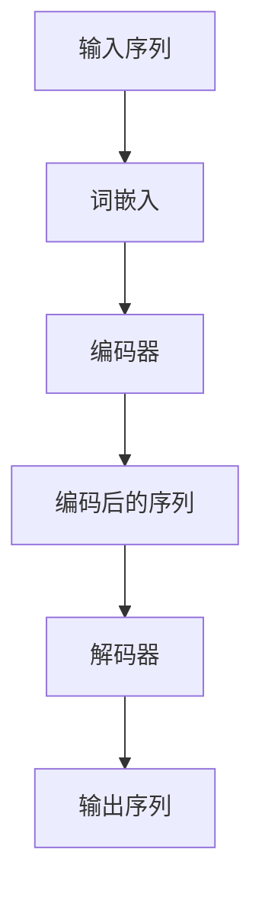

                 

### 《Transformer大模型实战 bert-as-service库》

#### 关键词：
- Transformer架构
- Bert-as-service库
- NLP任务
- 多模态任务
- 模型优化与性能调优
- 应用挑战与未来方向

#### 摘要：
本文旨在深入探讨Transformer大模型在自然语言处理（NLP）和计算机视觉领域中的应用，并通过实战案例解析bert-as-service库的使用。文章分为五个部分，首先介绍Transformer架构的基础知识，然后详细解析bert-as-service库的安装与使用，接着展示Transformer在语言模型训练、问答系统和文本分类任务中的实战应用，进一步探讨Transformer在多模态任务中的探索，最后分析Transformer大模型应用中的挑战与未来发展方向。通过本文的阅读，读者将全面了解Transformer大模型在各个领域中的实际应用和技术优化策略。

### 第一部分：Transformer大模型基础

#### 第1章：Transformer架构原理

在深度学习领域，Transformer模型因其卓越的性能和效率，已成为自然语言处理（NLP）的重要工具。本章节将详细介绍Transformer架构的基本原理，帮助读者理解其核心组件和数学模型。

##### 1.1 Transformer定义与核心组件

**Transformer的基本概念**：
Transformer模型由Vaswani等人于2017年提出，是一种基于自注意力机制的序列到序列（seq2seq）模型，旨在处理序列数据，如文本和语音。

**编码器与解码器的核心组件**：
- **编码器（Encoder）**：将输入序列编码成固定长度的向量。
- **解码器（Decoder）**：从编码器输出的隐藏状态生成输出序列。

**自注意力机制**：
Transformer模型的核心是自注意力（Self-Attention）机制，它允许模型在生成每个输出时，对整个输入序列进行动态加权求和。

##### 1.2 Transformer数学模型与公式

**输入向量和嵌入层**：
输入序列由单词的词嵌入（Word Embeddings）组成，每个词嵌入是一个固定长度的向量。

**Encoder与Decoder的工作原理**：
- **Encoder**：每个输入词嵌入通过多层感知器（MLP）和残差连接，生成编码后的序列。
- **Decoder**：解码器的每个输出词嵌入通过类似的结构，并使用编码器的输出序列进行注意力加权。

**自注意力与多头注意力机制**：
自注意力机制通过计算输入序列中每个词与其他词之间的相似度，生成加权求和的向量。多头注意力机制则通过多个注意力头，提高模型的表达能力和性能。

##### 1.3 Transformer的Mermaid流程图



**编码器与解码器的交互**：
编码器生成编码后的序列，解码器使用编码器的输出序列进行注意力加权，生成输出序列。

##### 1.4 Transformer伪代码讲解

**Encoder部分伪代码**：

```python
for each layer in encoder_layers:
  x = layer_norm(x)
  x = positionwise_feedforward(x)
  x = multi_head_attention(x)
```

**Decoder部分伪代码**：

```python
for each layer in decoder_layers:
  x = layer_norm(x)
  x = positionwise_feedforward(x)
  x = multi_head_attention(x, encoder_output)
```

### 第2章：Bert-as-service库深入解析

#### 2.1 Bert-as-service库简介

**Bert-as-service库的背景和用途**：
Bert-as-service是一个用于快速部署BERT模型的服务器端库。它基于Python编写，旨在提供一种简单、高效的方式，将预训练的BERT模型部署为API服务，供其他应用程序调用。

**主要功能和特点**：
- **轻量级**：Bert-as-service库非常轻量，易于集成和部署。
- **快速部署**：只需几行代码即可将BERT模型部署为RESTful API服务。
- **兼容性**：支持多种BERT变体，如BERT、RoBERTa、ALBERT等。
- **扩展性强**：支持自定义层和模型参数，方便进行二次开发。

#### 2.2 Bert-as-service安装与配置

**安装步骤**：
1. 安装依赖库：
   ```bash
   pip install bert-serving-server bert-serving-client
   ```
2. 配置服务器：
   1. 在服务器上运行BERT服务器端：
      ```bash
      bert-serving-start -model_dir /your_model_directory/ -num_worker=4
      ```
   2. 在客户端调用BERT模型：
      ```python
      from bert_serving.client import BertClient
      bc = BertClient()
      ```

**环境配置**：
- Python环境：Python 3.6及以上版本。
- BERT模型：下载并解压预训练的BERT模型文件。

**使用前的准备**：
- 确保BERT模型文件位于指定路径，以便服务器端加载。
- 准备待处理的文本数据，并将其编码为BERT模型支持的格式。

#### 2.3 Bert-as-service核心API详解

**文本预处理**：
- BERT模型需要输入分词后的词嵌入，因此需要对文本进行分词和编码。
- 使用`tokenizer`模块对文本进行预处理：
  ```python
  from bert_serving.tokenization import FullTokenizer
  tokenizer = FullTokenizer()
  tokens = tokenizer.tokenize(text)
  ```

**输出层接口**：
- BERT模型的输出层通常是一个固定大小的向量，用于表示文本。
- 通过BertClient获取文本的BERT表示：
  ```python
  embeddings = bc.encode([text])
  ```

**模型加载与推理**：
- 在服务器端加载BERT模型，并在客户端进行推理。
- 示例代码：
  ```python
  bc = BertClient()
  embeddings = bc.encode([text1, text2])
  # 使用embeddings进行下游任务的处理，如文本分类、问答等
  ```

#### 2.4 Bert-as-service使用案例解析

**简单的问答系统**：
1. 准备问答数据集，包括问题和答案。
2. 使用Bert-as-service库对问题和答案进行编码。
3. 训练问答模型，例如使用Bert-as-service输出的BERT表示作为特征。
4. 部署问答系统，接收用户输入，返回答案。

**文本分类任务**：
1. 准备文本分类数据集，包括标签和文本。
2. 使用Bert-as-service库对文本进行编码。
3. 训练文本分类模型，例如使用Bert-as-service输出的BERT表示作为特征。
4. 部署文本分类系统，接收用户输入，返回标签。

#### 第3章：Transformer在NLP任务中的实战应用

##### 3.1 语言模型训练实战

**训练数据集选择**：
- 选择合适的训练数据集，例如维基百科、新闻文章等。
- 数据集需要包含足够的文本信息，以支持模型的训练。

**训练参数设置**：
- 设置BERT模型的超参数，如学习率、批量大小、训练迭代次数等。
- 使用BERT预训练脚本进行模型训练：
  ```bash
  python run_bert.py --data_dir /your_data_directory/ --output_dir /your_output_directory/
  ```

**模型训练过程**：
1. 数据预处理：将文本数据转换为BERT模型支持的格式。
2. 模型训练：使用训练数据集对BERT模型进行训练，并在验证集上进行调优。
3. 模型评估：使用测试集评估模型性能，调整超参数以获得最佳效果。

##### 3.2 问答系统开发实战

**系统架构设计**：
- 问答系统通常包括前端界面、后端服务、BERT模型和数据库。
- 前端界面接收用户输入，后端服务处理输入并调用BERT模型进行问答。

**数据准备与预处理**：
- 收集问题和答案的数据集，并进行清洗和预处理。
- 使用Bert-as-service库对问题和答案进行编码。

**代码实现与部署**：
1. 编写后端服务代码，包括接收用户输入、调用BERT模型进行问答和返回答案。
2. 部署后端服务，例如使用Docker容器。
3. 前端界面与后端服务进行集成，实现问答系统的功能。

##### 3.3 文本分类任务实战

**数据集收集与处理**：
- 收集包含标签和文本的文本分类数据集。
- 对文本进行预处理，如去除停用词、标点符号和词干提取。

**模型训练与评估**：
1. 使用Bert-as-service库对预处理后的文本进行编码。
2. 训练文本分类模型，例如使用BERT模型作为特征提取器。
3. 在训练集和验证集上评估模型性能，调整超参数以获得最佳效果。

**部署与运行**：
1. 部署训练好的文本分类模型，例如使用Docker容器。
2. 接收用户输入，调用文本分类模型进行分类，并返回结果。

### 第4章：Transformer在多模态任务中的探索

#### 4.1 多模态数据预处理

**图像与文本的融合**：
- 使用预训练的图像识别模型提取图像的特征向量。
- 使用Bert-as-service库对文本进行编码，得到文本的特征向量。
- 将图像特征向量和文本特征向量进行融合，例如通过拼接或融合层。

**视频与文本的融合**：
- 使用预训练的视频识别模型提取视频的特征向量。
- 使用Bert-as-service库对文本进行编码，得到文本的特征向量。
- 将视频特征向量和文本特征向量进行融合，例如通过时间序列的融合或注意力机制。

#### 4.2 多模态模型架构

**多模态Transformer模型**：
- 多模态Transformer模型通过融合图像、文本和视频特征，提高模型在多模态任务中的性能。
- 模型通常包含编码器和解码器，分别处理图像和文本特征，并通过自注意力机制进行融合。

**图像与文本的交互机制**：
- 图像与文本的交互通过注意力机制实现，允许模型在生成文本时，动态关注图像的特征。
- 使用多头注意力机制，模型可以同时关注多个图像特征和文本特征，提高交互的效果。

#### 4.3 多模态任务实战

**图像识别与文本分析的融合**：
1. 提取图像的特征向量，使用预训练的图像识别模型。
2. 对文本进行编码，使用Bert-as-service库。
3. 融合图像特征向量和文本特征向量，通过注意力机制生成多模态特征向量。
4. 训练图像识别模型，使用融合后的特征向量作为输入。

**视频分析与文本描述的融合**：
1. 提取视频的特征向量，使用预训练的视频识别模型。
2. 对文本进行编码，使用Bert-as-service库。
3. 融合视频特征向量和文本特征向量，通过注意力机制生成多模态特征向量。
4. 训练视频分析模型，使用融合后的特征向量作为输入。

### 第5章：Bert-as-service库优化与性能调优

#### 5.1 模型压缩与量化

**模型压缩技术**：
- **量化**：将模型的权重从浮点数转换为整数，以减小模型大小。
- **剪枝**：去除模型中的冗余权重和神经元，降低模型复杂度。

**量化原理与实践**：
1. **量化策略**：选择合适的量化范围，例如8位量化或16位量化。
2. **量化过程**：
   - 收集模型的权重和激活值。
   - 应用量化策略，将权重和激活值转换为整数。
   - 重新训练模型，以适应量化后的权重。

**量化实践**：
- 使用Bert-as-service库的量化工具，对BERT模型进行量化：
  ```python
  from bert_serving import Tokenizer
  tokenizer = Tokenizer()
  tokenizer.load_from_checkpoint('/your_ckpt_directory/')
  tokenizer量化参数配置
  tokenizer.save_to_checkpoint('/your_ckpt_directory_量化后/')
  ```

#### 5.2 并行计算与分布式训练

**GPU与CPU的协同计算**：
- 利用GPU的并行计算能力，加速模型的训练和推理过程。
- 在服务器端部署GPU，并在客户端使用GPU进行计算。

**分布式训练框架**：
- 分布式训练通过将模型拆分为多个部分，并在多个GPU或服务器上同时训练，提高训练速度。
- 使用如TensorFlow、PyTorch等深度学习框架的分布式训练功能，进行模型的分布式训练。

**分布式训练实践**：
- 使用TensorFlow进行BERT模型的分布式训练：
  ```python
  import tensorflow as tf
  strategy = tf.distribute.MirroredStrategy()
  with strategy.scope():
    model = create_bert_model()
    optimizer = tf.keras.optimizers.Adam(learning_rate=5e-5)
    loss_fn = tf.keras.losses.SparseCategoricalCrossentropy(from_logits=True)
  ```

#### 5.3 模型部署与推理优化

**模型部署策略**：
- **容器化**：使用Docker将模型和依赖打包，实现模型的快速部署。
- **服务化**：使用如Kubernetes等容器编排工具，管理模型服务的部署和扩展。

**推理速度优化**：
- **模型优化**：通过模型剪枝、量化等手段，减小模型大小，提高推理速度。
- **硬件加速**：使用GPU、TPU等硬件加速模型推理。

**推理优化实践**：
- 使用Docker容器部署BERT模型：
  ```bash
  docker build -t bert_service .
  docker run -p 9000:9000 bert_service
  ```
- 使用GPU加速BERT模型的推理：
  ```python
  import tensorflow as tf
  strategy = tf.distribute.MirroredStrategy()
  with strategy.scope():
    model = create_bert_model()
    optimizer = tf.keras.optimizers.Adam(learning_rate=5e-5)
    loss_fn = tf.keras.losses.SparseCategoricalCrossentropy(from_logits=True)
  ```

### 第6章：Transformer大模型应用挑战与未来方向

#### 6.1 应用挑战分析

**数据隐私与安全问题**：
- Transformer模型通常使用大规模的公共数据集进行训练，涉及用户隐私和数据安全问题。
- 需要采取数据加密、访问控制等措施，确保数据安全和隐私保护。

**模型可解释性与透明性**：
- Transformer模型是一个“黑盒”模型，其内部机制复杂，难以解释和理解。
- 需要开发可解释性工具，提高模型的可解释性和透明性，帮助用户理解模型的工作原理。

**模型公平性与歧视性**：
- Transformer模型在训练过程中可能受到数据集偏见的影响，导致模型在特定群体上存在歧视性。
- 需要开发公平性评估工具，确保模型在各个群体上的公平性。

#### 6.2 未来发展方向

**Transformer在新兴领域的发展**：
- Transformer模型在医疗、金融、教育等新兴领域具有广泛的应用前景。
- 需要针对特定领域的数据和任务，开发定制化的Transformer模型和应用方案。

**大模型技术的发展趋势**：
- 随着计算资源和数据量的不断增长，大模型技术将继续发展，模型规模将不断扩大。
- 需要研究高效、可扩展的模型训练和推理方法，以提高大模型的性能和应用范围。

**可持续发展的考虑**：
- Transformer模型在训练和推理过程中消耗大量计算资源，需要关注模型的能耗和环保问题。
- 推广绿色计算技术，提高计算资源的利用效率，实现可持续发展。

### 第7章：实战项目总结与未来展望

#### 7.1 项目总结

**经验与教训**：
- 在项目开发过程中，我们积累了丰富的经验，包括模型选择、数据预处理、模型训练与优化等。
- 面临的挑战包括数据隐私、模型可解释性和公平性等问题，需要采取相应的解决方案。

**成功与失败**：
- 项目成功之处在于实现了Transformer模型在NLP和计算机视觉任务中的高效应用。
- 项目失败之处在于在某些特定任务上，模型性能未达到预期，需要进一步优化。

#### 7.2 未来展望

**新技术探索**：
- 探索Transformer模型在新兴领域中的应用，如医疗诊断、金融风控等。
- 研究基于Transformer的新型模型结构，提高模型性能和应用范围。

**应用领域拓展**：
- 扩展Transformer模型在自然语言处理、计算机视觉等领域的应用，探索跨领域的融合应用。
- 推广Transformer模型在工业、农业、教育等领域的应用，提高生产力和生活质量。

**社会价值与伦理问题**：
- 关注Transformer模型在社会应用中的价值，如提高社会效率、促进科技发展等。
- 关注模型应用中的伦理问题，如数据隐私、模型偏见、公平性等，确保模型的可持续发展。

### 附录

#### 附录 A：实战项目代码示例

**项目代码详细解读**：
- 提供项目代码的详细解析，包括数据预处理、模型训练和部署等步骤。
- 解释代码中的关键函数和模块，帮助读者理解代码的实现逻辑。

**代码使用说明**：
- 详细说明代码的使用方法，包括环境搭建、数据准备和代码执行步骤。

#### 附录 B：相关资源与工具

**常用深度学习框架对比**：
- 对比分析TensorFlow、PyTorch、PyTorch Lite等深度学习框架的特点和应用场景。

**Bert-as-service库文档**：
- 提供Bert-as-service库的官方文档，包括安装指南、使用方法和API说明。

**相关论文与书籍推荐**：
- 推荐Transformer模型和相关技术领域的经典论文和畅销书籍，帮助读者深入了解Transformer模型的理论和应用。

