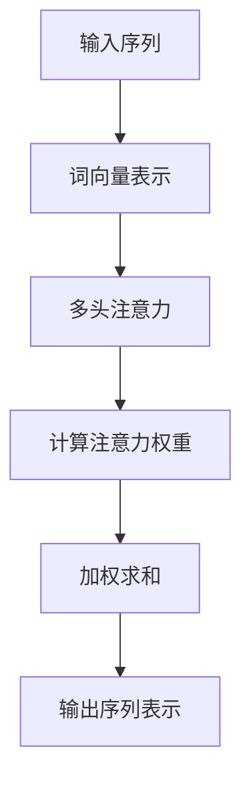

                 

# 《Transformer架构原理详解：注意力机制》

## 关键词
- Transformer模型
- 自注意力机制
- 编码器-解码器架构
- 自然语言处理
- 优化与调参

## 摘要

本文将详细解析Transformer模型的基本架构，特别是其核心组件——注意力机制。我们将从Transformer模型的起源和背景开始，逐步介绍其原理、实现方法以及在实际应用中的优化技巧。通过本文，读者将能够深入理解Transformer的工作机制，掌握其在自然语言处理领域的广泛应用，并了解如何对其进行优化和调参。本文结构清晰，逻辑严谨，旨在为读者提供一份全面而深入的技术指南。

# 《Transformer架构原理详解：注意力机制》目录大纲

## 第一部分：引言与背景知识

### 1.1 书籍概述
- Transformer模型的起源与背景
- 本书的目的与结构

### 1.2 自然语言处理简介
- 自然语言处理的发展历程
- 常见的NLP任务与应用

### 1.3 深度学习基础
- 神经网络与深度学习简介
- 前馈神经网络与反向传播算法

## 第二部分：Transformer模型详解

### 2.1 Transformer模型概述
- Transformer模型的原理
- Transformer模型的特点与优势

### 2.2 自注意力机制
- 自注意力机制的原理
- 自注意力计算的伪代码
- Mermaid流程图：自注意力机制的流程

### 2.3 位置编码与多头注意力
- 位置编码的引入与作用
- 多头注意力的原理与计算
- 多头注意力机制的伪代码

### 2.4 编码器-解码器架构
- 编码器-解码器模型的工作原理
- 编码器与解码器的具体实现

### 2.5 模型训练与优化
- Transformer模型的训练过程
- 常见的训练优化技术
- 伪代码：训练过程的基本步骤

## 第三部分：Transformer模型应用与优化

### 3.1 Transformer在序列建模中的应用
- 序列到序列模型的构建
- 伪代码：序列建模的算法流程

### 3.2 Transformer在自然语言处理中的实战
- 常见NLP任务的实现
- 项目实战案例：问答系统、机器翻译、文本分类等

### 3.3 Transformer模型的优化与调参
- 模型调参的技巧与方法
- 优化技术的深入探讨

## 第四部分：Transformer模型的高级主题

### 4.1 多层Transformer模型
- 多层Transformer模型的结构与实现
- 伪代码：多层Transformer模型的算法流程

### 4.2 Transformer与卷积神经网络的结合
- 结合原理与实现
- 项目实战：文本图像生成

### 4.3 Transformer在计算机视觉中的应用
- Transformer在图像处理中的应用
- 项目实战：图像分类与目标检测

## 第五部分：总结与展望

### 5.1 Transformer模型的发展趋势
- Transformer模型的研究方向
- 未来应用的前景

### 5.2 本书回顾与总结
- 对全书内容的回顾与总结
- 对读者的建议与展望

### 5.3 附录
- 常用工具与资源
- 参考文献与扩展阅读

## 1.1 书籍概述

### Transformer模型的起源与背景

Transformer模型是由谷歌研究团队在2017年提出的一种新型神经网络架构，用于处理序列数据，尤其是在自然语言处理（NLP）任务中取得了显著的成果。Transformer模型的出现是为了解决传统序列模型在处理长距离依赖和并行计算方面存在的局限。

传统的序列模型，如循环神经网络（RNN）和长短期记忆网络（LSTM），虽然能够在一定程度上处理序列数据，但它们在并行计算方面存在困难，并且难以捕获长距离依赖关系。为了克服这些限制，谷歌研究团队提出了Transformer模型。

Transformer模型的核心思想是利用自注意力机制（Self-Attention）来处理序列数据，该机制能够自动地学习输入序列中每个元素的重要性，并在计算时考虑这些元素之间的相互依赖关系。这使得Transformer模型能够有效地处理长序列，并在许多NLP任务中取得了优异的性能。

### 本书的的目的与结构

本章节将详细介绍Transformer模型的基本原理、实现方法和优化技巧，旨在帮助读者深入理解Transformer模型的工作机制，并掌握其在实际应用中的使用方法。

本书将分为五个主要部分：

1. **引言与背景知识**：介绍Transformer模型的起源、背景及其在自然语言处理中的重要性，并为后续章节打下基础。
2. **Transformer模型详解**：详细解析Transformer模型的基本架构，包括自注意力机制、位置编码、多头注意力和编码器-解码器架构等。
3. **Transformer模型应用与优化**：探讨Transformer模型在实际应用中的实现方法，以及如何对其进行优化和调参。
4. **Transformer模型的高级主题**：介绍Transformer模型在序列建模、计算机视觉中的应用，以及与其他神经网络结构的结合。
5. **总结与展望**：回顾全书内容，总结Transformer模型的发展趋势和未来应用前景。

通过本书的学习，读者将能够系统地掌握Transformer模型的相关知识，并在实际项目中应用这一先进的技术。

## 1.2 自然语言处理简介

### 自然语言处理的发展历程

自然语言处理（NLP）是人工智能领域的一个重要分支，其目标是使计算机能够理解和处理人类自然语言。自上世纪50年代以来，NLP经历了多个发展阶段，从最初的规则驱动方法到统计模型，再到现代的深度学习模型，每一次技术革新都极大地推动了NLP的发展。

**早期阶段**（1950s - 1960s）：最初，NLP主要依赖于基于规则的方法，通过手工编写的语法和语义规则来解析和处理语言。这种方法在处理简单结构化文本方面有一定的效果，但在复杂语境中表现出明显的局限性。

**规则驱动方法**（1960s - 1980s）：随着计算机性能的提升，研究人员开始使用形式化的语法和语义表示，通过手工编写的规则来模拟语言处理过程。这种方法在特定的领域取得了显著成果，如机器翻译和文本摘要。

**统计方法**（1990s - 2010s）：随着语料库的规模扩大和计算能力的提升，统计方法在NLP中得到了广泛应用。基于统计模型的方法，如隐马尔可夫模型（HMM）、条件随机场（CRF）和朴素贝叶斯分类器，能够在大量训练数据的基础上自动学习语言特征，提高了NLP任务的性能。

**深度学习方法**（2010s - 至今）：近年来，深度学习技术在NLP领域取得了突破性进展。特别是卷积神经网络（CNN）和循环神经网络（RNN）及其变体（如LSTM、GRU），在语言模型、机器翻译、文本分类等任务中表现出了卓越的能力。深度学习模型能够自动从大量数据中学习复杂的特征表示，使得NLP任务的性能得到了显著提升。

### 常见的NLP任务与应用

自然语言处理涵盖了多种任务和应用场景，以下是一些主要的NLP任务：

**文本分类**：文本分类是将文本数据分配到预定义的类别中的一种任务。常见的应用场景包括情感分析、垃圾邮件检测、新闻分类等。

**情感分析**：情感分析旨在识别文本中的情感倾向，如正面、负面或中立。情感分析在产品评价分析、社交媒体监控和舆情分析等领域有广泛应用。

**机器翻译**：机器翻译是自动将一种语言的文本翻译成另一种语言。机器翻译技术使得跨语言沟通更加便捷，广泛应用于旅游、国际贸易和全球化企业等领域。

**问答系统**：问答系统是自动回答用户问题的系统，常见于搜索引擎、客户服务系统和智能助手等场景。

**文本摘要**：文本摘要是从原始文本中提取关键信息，生成简洁明了的摘要。文本摘要在新闻摘要、学术文献摘要等领域具有重要应用。

**命名实体识别**：命名实体识别是从文本中识别出具有特定意义的实体，如人名、地名、组织名等。命名实体识别是信息抽取和知识图谱构建的重要基础。

### Transformer模型在NLP中的应用

Transformer模型的出现，标志着NLP领域进入了一个新的阶段。Transformer模型通过自注意力机制，能够有效地处理长距离依赖和并行计算，使得NLP任务取得了显著的性能提升。

在文本分类任务中，Transformer模型通过全局注意力机制，能够捕捉到文本中的关键信息，从而提高了分类的准确性。例如，BERT（Bidirectional Encoder Representations from Transformers）模型在多项文本分类任务上取得了优异的成绩，如情感分析、政治立场分类等。

在机器翻译任务中，Transformer模型通过编码器-解码器架构，能够有效地处理源语言和目标语言之间的语义差异，生成更准确和自然的翻译结果。例如，谷歌翻译和百度翻译等知名翻译服务，都采用了基于Transformer的深度学习模型。

在问答系统任务中，Transformer模型能够通过理解问题和上下文，生成精准的答案。例如，OpenAI的GPT-3模型，在问答系统中的表现极为出色，能够处理复杂的问题并生成高质量的回答。

总之，Transformer模型在NLP领域展示了强大的能力，推动了NLP技术的发展，并为各种NLP应用提供了强大的技术支持。

## 1.3 深度学习基础

### 神经网络与深度学习简介

神经网络（Neural Networks，NN）是模仿生物神经元结构和功能的一种计算模型，最早由心理学家和数学家在20世纪40年代提出。神经网络由大量的简单计算单元（神经元）组成，这些神经元通过连接形成复杂的网络结构，从而实现数据的学习和推理。

深度学习（Deep Learning，DL）是神经网络的一种特殊形式，其核心思想是使用多层神经网络来表示和处理数据。与传统神经网络相比，深度学习通过增加网络的深度和宽度，能够自动从数据中学习更加复杂和抽象的特征表示。

深度学习在计算机视觉、自然语言处理、音频处理等领域取得了显著的成果。例如，在图像识别任务中，卷积神经网络（Convolutional Neural Networks，CNN）通过卷积层、池化层和全连接层等结构，能够自动提取图像中的特征并实现高精度的分类。在自然语言处理任务中，循环神经网络（Recurrent Neural Networks，RNN）和其变体（如长短期记忆网络LSTM、门控循环单元GRU）通过处理序列数据，实现了对文本、语音等数据的理解和生成。

### 前馈神经网络与反向传播算法

前馈神经网络（Feedforward Neural Networks，FNN）是一种简单的神经网络结构，其中数据从输入层传递到输出层，中间不进行回传。前馈神经网络的核心在于其层与层之间的正向传递和全连接结构。每一层神经元的输出作为下一层的输入，通过加权求和和激活函数的处理，最终生成预测结果。

反向传播算法（Backpropagation Algorithm）是深度学习训练过程中的一种关键算法。反向传播算法通过计算网络输出与实际结果之间的误差，沿着网络反向传播误差，从而更新网络中的权重和偏置。反向传播算法主要包括以下几个步骤：

1. **前向传播**：输入数据从输入层传递到输出层，每一层神经元根据输入和权重计算输出。
2. **计算误差**：输出层的误差计算为实际输出与预测输出之间的差异。
3. **反向传播**：误差从输出层反向传播到输入层，通过计算每一层神经元的梯度，更新权重和偏置。
4. **权重更新**：使用梯度下降或其他优化算法，根据梯度更新网络中的权重和偏置，以减小误差。

通过不断迭代这个过程，神经网络能够逐渐学习到输入数据中的特征，并在新的数据上进行预测。反向传播算法的引入，使得深度学习训练过程更加高效和准确，推动了深度学习技术的广泛应用。

### 前馈神经网络在NLP中的应用

前馈神经网络在自然语言处理（NLP）中也发挥着重要作用。典型的前馈神经网络模型包括词向量嵌入层、编码层和解码层。词向量嵌入层将输入的单词转换为向量表示，编码层通过多层神经网络将词向量转换为高维特征表示，解码层则根据编码层生成的特征进行预测或生成。

在文本分类任务中，前馈神经网络通过将文本表示为向量，并利用多层全连接层提取特征，能够实现高精度的分类。例如，Word2Vec模型将单词映射到低维向量空间，通过训练词向量，可以捕捉单词之间的语义关系，从而提高分类性能。

在机器翻译任务中，前馈神经网络通过编码器-解码器结构，将源语言文本编码为高维特征表示，并解码为目标语言文本。编码器通过多层全连接层将输入文本转换为特征向量，解码器则根据编码器输出的特征向量生成翻译结果。通过这种结构，前馈神经网络能够处理不同语言之间的语义差异，生成准确和自然的翻译结果。

总之，前馈神经网络在NLP任务中扮演着重要的角色，通过词向量嵌入、编码和解码等过程，能够实现文本数据的自动处理和理解。随着深度学习技术的不断发展，前馈神经网络在NLP中的应用将越来越广泛和深入。

## 2.1 Transformer模型概述

### Transformer模型的原理

Transformer模型是一种基于自注意力机制的序列模型，用于处理变长序列数据，如自然语言文本。Transformer模型的核心思想是利用自注意力机制（Self-Attention）来捕捉序列中每个元素之间的依赖关系，从而实现对序列数据的理解和生成。

自注意力机制允许模型在处理序列数据时，对每个元素分配不同的权重，从而关注序列中的重要部分。这种机制可以有效地处理长距离依赖问题，使得模型能够捕捉到序列中不同元素之间的复杂关系。Transformer模型还包括位置编码（Positional Encoding）和多头注意力（Multi-Head Attention）等技术，以进一步优化模型的性能和表现。

Transformer模型由编码器（Encoder）和解码器（Decoder）两部分组成，编码器负责将输入序列编码为固定长度的向量表示，解码器则根据编码器的输出生成目标序列。编码器和解码器都由多个相同的层组成，每个层包含多头注意力机制和前馈神经网络（Feedforward Neural Network）。

### Transformer模型的特点与优势

Transformer模型具有以下几个显著的特点和优势：

1. **并行计算**：与传统循环神经网络（RNN）和长短期记忆网络（LSTM）相比，Transformer模型能够实现并行计算，从而大大提高了训练和推理的效率。在RNN和LSTM中，每个时间步的处理都是顺序进行的，而Transformer模型通过自注意力机制，可以在同一时间步内同时处理整个序列，这极大地加快了计算速度。

2. **长距离依赖**：Transformer模型通过自注意力机制，能够有效地捕捉序列中的长距离依赖关系。在传统的RNN和LSTM中，随着序列长度的增加，信息传播的效率会逐渐降低，而Transformer模型通过自注意力机制，能够保持对整个序列的全面关注，从而解决了长距离依赖问题。

3. **结构简洁**：Transformer模型的结构相对简洁，易于实现和理解。其由多个相同的层组成，每个层包含多头注意力机制和前馈神经网络，这种模块化的结构使得模型具有较强的扩展性和适应性。

4. **多任务处理**：Transformer模型具有通用性，可以应用于多种NLP任务，如机器翻译、文本分类、问答系统等。通过调整模型的参数和架构，Transformer模型能够适应不同的任务需求，从而提高了任务的性能和效果。

5. **性能优异**：在多个NLP任务上，Transformer模型表现出了优异的性能。例如，在机器翻译任务中，Transformer模型显著优于传统的循环神经网络和长短期记忆网络；在文本分类任务中，Transformer模型也展现出了强大的分类能力。

总之，Transformer模型以其并行计算、长距离依赖捕捉、结构简洁、多任务处理和优异性能等特点，成为了自然语言处理领域的重要突破，为各种NLP任务提供了强大的技术支持。

### Transformer模型的特点与优势（续）

除了上述提到的特点，Transformer模型还具备其他显著的优点：

1. **灵活性**：Transformer模型的结构设计灵活，可以轻松地调整模型的大小和复杂性。通过增加编码器和解码器的层数，可以提升模型的表示能力和计算精度。此外，模型可以通过调整多头注意力的数量来平衡计算复杂度和模型性能。

2. **强大的泛化能力**：由于Transformer模型能够有效地捕捉序列中的长距离依赖关系，模型在处理未见过的数据时表现出较强的泛化能力。这种特性使得Transformer模型在实际应用中具有较高的鲁棒性和适应性。

3. **易于扩展**：Transformer模型不仅适用于自然语言处理任务，还可以扩展到其他序列数据处理的场景，如语音识别、时间序列分析等。通过适当的调整和优化，Transformer模型能够在不同领域展现出优异的性能。

4. **可解释性**：Transformer模型中的注意力机制具有可解释性，可以通过分析注意力分布来理解模型在处理序列数据时的关注重点。这种可解释性有助于研究人员和开发人员更好地理解模型的决策过程，从而进行有针对性的优化和改进。

5. **端到端学习**：Transformer模型实现了端到端的训练和推理，无需复杂的预处理和后处理步骤。这意味着模型可以直接从原始数据中学习特征，从而简化了整个数据处理流程，提高了效率和准确性。

总之，Transformer模型以其独特的特点、广泛的适用性和卓越的性能，在自然语言处理和其他序列数据处理任务中展现了巨大的潜力。随着研究的深入和应用的拓展，Transformer模型有望在更多领域发挥重要作用。

## 2.2 自注意力机制

### 自注意力机制的原理

自注意力机制（Self-Attention）是Transformer模型的核心组件，负责处理输入序列中的每个元素，并为其分配权重，以捕捉序列内部的不同关系。自注意力机制的工作原理基于这样一个基本思想：在序列处理过程中，每个元素不仅与自身相关，还与其他元素相关。通过计算这些相关性的权重，模型能够更准确地理解和处理序列数据。

自注意力机制可以分为几个关键步骤：

1. **输入序列表示**：输入序列由一系列词向量组成，每个词向量表示一个单词或字符。
2. **多头注意力**：将输入序列扩展为多个不同的表示，每个表示关注序列的不同方面。
3. **计算注意力权重**：对于每个头，计算输入序列中每个元素对其他元素的注意力权重。
4. **加权求和**：根据注意力权重对输入序列中的每个元素进行加权求和，生成一个新的表示。

自注意力机制的主要优点在于其能够捕捉长距离依赖关系，并在处理变长序列时保持高效。这种机制使得Transformer模型在处理自然语言文本等复杂序列数据时表现出色。

### 自注意力计算的伪代码

为了更好地理解自注意力机制的计算过程，以下是一个简化的伪代码示例：

```python
# 输入序列为词向量组成的列表
input_sequence = [v1, v2, v3, ..., vn]

# 初始化权重矩阵 W_Q, W_K, W_V
W_Q = ...  # Query权重矩阵
W_K = ...  # Key权重矩阵
W_V = ...  # Value权重矩阵

# 多头注意力计算
for head in range(num_heads):
    # 计算注意力权重
    attention_weights = softmax(W_Q @ K + W_K @ K)
    
    # 加权求和
    context_vector = sum(attention_weights[i] * W_V @ V[i] for i in range(len(input_sequence)))
    
    # 更新序列表示
    output_sequence = [context_vector]

# 输出为加权后的序列表示
output_sequence = output_sequence
```

在这个伪代码中，`W_Q`、`W_K` 和 `W_V` 分别代表Query、Key和Value权重矩阵。`@` 表示矩阵乘法，`softmax` 函数用于计算注意力权重。通过这个计算过程，模型能够对输入序列中的每个元素进行加权求和，从而生成一个更丰富和抽象的表示。

### Mermaid流程图：自注意力机制的流程

为了更直观地展示自注意力机制的流程，以下是一个Mermaid流程图：



在这个流程图中，`A1` 表示输入序列，`B1` 表示词向量表示，`C1` 表示多头注意力，`D1` 表示计算注意力权重，`E1` 表示加权求和，`F1` 表示输出序列表示。通过这个流程，我们可以清晰地看到自注意力机制从输入到输出的整个计算过程。

通过上述内容，读者可以深入理解自注意力机制的基本原理和计算过程，这为后续更复杂的Transformer模型解析打下了坚实的基础。

## 2.3 位置编码与多头注意力

### 位置编码的引入与作用

在Transformer模型中，位置编码（Positional Encoding）是一个重要的组件，用于解决序列中位置信息的丢失问题。由于Transformer模型是一种基于自注意力机制的模型，它在处理序列数据时，通常不考虑输入序列中的元素顺序。这意味着模型在处理变长序列时，无法利用元素之间的相对位置信息。

为了解决这个问题，位置编码被引入到Transformer模型中。位置编码通过为输入序列中的每个元素添加额外的向量表示，从而为模型提供位置信息。这些向量表示包含了元素在序列中的相对位置信息，使得模型在处理序列数据时，能够考虑到元素之间的顺序关系。

位置编码的引入使得Transformer模型能够更好地处理变长序列，捕捉到序列中的长距离依赖关系。在实际应用中，位置编码通常与自注意力机制结合使用，以增强模型对序列数据的理解和生成能力。

### 多头注意力的原理与计算

多头注意力（Multi-Head Attention）是Transformer模型中的另一个关键组件，它通过多个独立的注意力头来处理输入序列。每个头关注序列的不同方面，从而提供更丰富的信息，使得模型能够更好地理解和生成序列数据。

多头注意力的原理可以概括为以下几个步骤：

1. **线性变换**：首先，输入序列通过线性变换生成Query、Key和Value向量。这些向量分别表示输入序列中的每个元素。
2. **多头计算**：将Query、Key和Value向量分成多个独立的头，每个头独立地计算注意力权重。这意味着每个头都能够关注输入序列的不同部分，提供更全面的信息。
3. **加权求和**：每个头计算出的注意力权重用于对输入序列中的元素进行加权求和，生成新的表示。多个头的输出结果通过拼接和线性变换，得到最终的输出序列表示。

多头注意力的计算伪代码如下：

```python
# 输入序列为词向量组成的列表
input_sequence = [v1, v2, v3, ..., vn]

# 初始化权重矩阵 W_Q, W_K, W_V
W_Q = ...  # Query权重矩阵
W_K = ...  # Key权重矩阵
W_V = ...  # Value权重矩阵

# 多头注意力计算
for head in range(num_heads):
    # 计算注意力权重
    attention_weights = softmax(W_Q @ K + W_K @ K)
    
    # 加权求和
    context_vector = sum(attention_weights[i] * W_V @ V[i] for i in range(len(input_sequence)))
    
    # 更新序列表示
    output_sequence = [context_vector]

# 输出为加权后的序列表示
output_sequence = output_sequence
```

在这个伪代码中，`W_Q`、`W_K` 和 `W_V` 分别代表Query、Key和Value权重矩阵。`@` 表示矩阵乘法，`softmax` 函数用于计算注意力权重。通过这个计算过程，模型能够利用多个头的注意力权重对输入序列进行加权求和，生成一个更丰富和抽象的表示。

### 多头注意力机制的伪代码

为了更详细地展示多头注意力的计算过程，以下是一个扩展的伪代码示例：

```python
# 输入序列为词向量组成的列表
input_sequence = [v1, v2, v3, ..., vn]

# 初始化权重矩阵 W_Q, W_K, W_V
W_Q = ...  # Query权重矩阵
W_K = ...  # Key权重矩阵
W_V = ...  # Value权重矩阵

# 多头注意力计算
for head in range(num_heads):
    # 线性变换生成Query、Key和Value向量
    Q = W_Q @ input_sequence
    K = W_K @ input_sequence
    V = W_V @ input_sequence
    
    # 计算注意力权重
    attention_weights = softmax(Q @ K.T + K @ V)
    
    # 加权求和
    context_vector = sum(attention_weights[i] * V[i] for i in range(len(input_sequence)))
    
    # 更新序列表示
    output_sequence = [context_vector]

# 输出为加权后的序列表示
output_sequence = output_sequence
```

在这个伪代码中，`Q`、`K` 和 `V` 分别代表Query、Key和Value向量。`@ K.T` 表示矩阵乘法的转置，`softmax` 函数用于计算注意力权重。通过这个计算过程，模型能够利用多个头的注意力权重对输入序列进行加权求和，生成一个更丰富和抽象的表示。

通过位置编码和多头注意力的结合，Transformer模型能够有效地处理变长序列，捕捉到序列中的长距离依赖关系。这使得Transformer模型在自然语言处理和其他序列数据处理任务中表现出色。接下来，我们将进一步探讨编码器-解码器架构，以了解Transformer模型如何处理序列到序列的任务。

## 2.4 编码器-解码器架构

### 编码器-解码器模型的工作原理

编码器-解码器（Encoder-Decoder）架构是Transformer模型中的一个核心组成部分，特别适用于处理序列到序列（Sequence-to-Sequence）的任务，如机器翻译、问答系统和对话生成等。编码器-解码器模型通过两个独立的网络结构——编码器（Encoder）和解码器（Decoder），来实现对输入序列的编码和解码。

编码器（Encoder）的工作是将输入序列编码为固定长度的上下文向量表示，这个向量包含了输入序列的完整信息。编码器由多个相同的层组成，每个层包含多头注意力机制和前馈神经网络。在编码器的每个层，输入序列会通过多头注意力机制对序列中的元素进行加权求和，从而生成一个更加抽象和综合的表示。

解码器（Decoder）的工作是基于编码器生成的上下文向量，生成目标序列。解码器同样由多个相同的层组成，每个层也包含多头注意力机制和前馈神经网络。在解码器的每个层，当前生成的目标序列会与编码器的输出进行交互，通过多头注意力机制获取上下文信息，并在后续步骤中进行解码。

### 编码器与解码器的具体实现

编码器与解码器的具体实现涉及以下几个关键组件和步骤：

1. **编码器实现**：
    - **输入层**：输入序列经过嵌入层（Embedding Layer），将单词或字符转换为向量表示。
    - **编码层**：多个编码层堆叠在一起，每个编码层包含两个主要组件：
        - **多头注意力层**：计算输入序列中每个元素对其他元素的注意力权重，并进行加权求和，以生成一个更抽象的表示。
        - **前馈神经网络层**：对多头注意力层的输出进行非线性变换，以提取更深层次的表示。
    - **输出层**：编码器的最后一个编码层的输出被作为上下文向量，用于解码器的输入。

2. **解码器实现**：
    - **输入层**：解码器的输入包括上一个时间步生成的目标序列和一个从编码器输出的上下文向量。
    - **解码层**：多个解码层堆叠在一起，每个解码层包含两个主要组件：
        - **多头注意力层**：首先计算当前生成的目标序列与编码器输出的注意力权重，以获取上下文信息。
        - **掩码多头注意力层**：通过掩码机制，防止解码器在生成目标序列时过早地看到未来的内容，从而确保生成序列的一致性和连贯性。
        - **前馈神经网络层**：对多头注意力层的输出进行非线性变换，以提取更深层次的表示。
    - **输出层**：解码器的最后一个解码层的输出通过softmax层进行分类或生成新的序列。

### 编码器-解码器架构在序列到序列任务中的应用

编码器-解码器架构在处理序列到序列任务时表现出色。以下是一些典型的应用场景：

1. **机器翻译**：编码器将源语言文本编码为上下文向量，解码器则根据这个上下文向量生成目标语言文本。通过自注意力机制和编码器-解码器交互，模型能够捕捉到源语言和目标语言之间的复杂语义关系，生成准确和自然的翻译结果。

2. **问答系统**：编码器将问题编码为上下文向量，解码器则根据上下文向量生成答案。通过编码器-解码器交互，模型能够理解问题的意图和上下文信息，从而生成精准和相关的答案。

3. **对话生成**：编码器将历史对话内容编码为上下文向量，解码器则根据上下文向量生成新的对话回复。通过编码器-解码器交互，模型能够保持对话的一致性和连贯性，生成自然和流畅的对话内容。

总之，编码器-解码器架构为序列到序列任务提供了强大的支持，使得模型能够有效地处理输入和输出的序列数据，生成高质量的输出结果。随着Transformer模型的不断发展，编码器-解码器架构在自然语言处理和其他序列数据处理任务中将继续发挥重要作用。

## 2.5 模型训练与优化

### Transformer模型的训练过程

Transformer模型的训练过程主要包括以下步骤：

1. **数据预处理**：首先，对输入序列进行预处理，包括分词、词向量嵌入和序列填充等操作。分词将文本分解为单词或字符序列，词向量嵌入将每个词映射为固定长度的向量表示，序列填充则确保输入序列具有相同的长度。

2. **正向传播**：输入序列通过编码器进行编码，生成上下文向量。解码器则根据上下文向量生成目标序列。在每个时间步，解码器的输出通过softmax层进行分类或生成新的序列。模型根据预测结果和实际结果计算损失函数，如交叉熵损失。

3. **反向传播**：计算损失函数的梯度，并沿网络反向传播，更新编码器和解码器的权重和偏置。反向传播算法（如梯度下降）通过梯度信息调整模型参数，以减小损失函数。

4. **迭代优化**：重复正向传播和反向传播的过程，进行多次迭代，逐步优化模型参数。在训练过程中，可以使用不同的优化技术和正则化方法，如学习率调整、dropout和权重衰减，以防止过拟合并提高模型性能。

### 常见的训练优化技术

在训练过程中，采用一些优化技术可以有效提高模型的训练效率和性能。以下是一些常见的训练优化技术：

1. **学习率调整**：学习率是梯度下降算法中的一个重要参数，决定了每次参数更新的步长。适当的调整学习率可以加快模型的收敛速度，避免过拟合。常用的学习率调整策略包括固定学习率、学习率衰减和自适应学习率（如Adam优化器）。

2. **批量大小**：批量大小是指每次训练过程中参与梯度计算的样本数量。较大的批量大小可以提高模型的稳定性和泛化能力，但计算成本较高。较小的批量大小则可以加快训练速度，但可能降低模型的性能。

3. **dropout**：dropout是一种常用的正则化技术，通过随机丢弃一部分神经元，防止模型过拟合。在训练过程中，每次迭代时随机丢弃一定比例的神经元，从而降低模型的复杂性。

4. **权重衰减**：权重衰减是一种正则化技术，通过在梯度更新过程中增加权重项的惩罚，防止模型权重过大而导致过拟合。权重衰减可以减小权重的更新步长，使模型更加稳定。

5. **Teacher Forcing**：Teacher Forcing是一种训练策略，在解码器生成目标序列时，将实际的目标序列作为当前时间步的输入。这种方法可以提高训练速度，但可能导致模型生成结果的质量较低。

### 伪代码：训练过程的基本步骤

以下是一个简化的伪代码示例，展示了Transformer模型的训练过程：

```python
# 初始化模型参数
model = TransformerModel()

# 设置优化器和损失函数
optimizer = AdamOptimizer(model.parameters())
loss_function = CrossEntropyLoss()

# 训练循环
for epoch in range(num_epochs):
    for batch in data_loader:
        # 前向传播
        inputs, targets = batch
        outputs = model(inputs)
        loss = loss_function(outputs, targets)
        
        # 反向传播和优化
        optimizer.zero_grad()
        loss.backward()
        optimizer.step()
        
    print(f"Epoch {epoch+1}/{num_epochs}, Loss: {loss.item()}")

# 评估模型性能
with torch.no_grad():
    total_loss = 0
    for batch in validation_loader:
        inputs, targets = batch
        outputs = model(inputs)
        loss = loss_function(outputs, targets)
        total_loss += loss.item()
    print(f"Validation Loss: {total_loss / len(validation_loader)}")
```

在这个伪代码中，`TransformerModel` 表示Transformer模型的类，`AdamOptimizer` 和 `CrossEntropyLoss` 分别表示优化器和损失函数。`data_loader` 是用于加载训练数据的加载器，`num_epochs` 表示训练的迭代次数。通过这个训练过程，模型能够逐步优化其参数，并在训练数据和验证数据上评估其性能。

通过上述内容，读者可以了解Transformer模型的训练过程和常见的训练优化技术。接下来，我们将探讨Transformer模型在序列建模中的应用。

## 3.1 Transformer在序列建模中的应用

### 序列到序列模型的构建

序列到序列（Sequence-to-Sequence）模型是Transformer模型在自然语言处理中的重要应用之一，主要用于处理输入序列和输出序列之间的映射任务。序列到序列模型的核心思想是将输入序列编码为固定长度的上下文向量，然后通过解码器生成相应的输出序列。这种模型在机器翻译、问答系统和对话生成等领域有着广泛的应用。

在构建序列到序列模型时，我们通常将编码器和解码器堆叠在一起，形成一个端到端的神经网络结构。编码器的输入是原始的序列数据，如文本或语音，解码器的输入是编码器输出的上下文向量。以下是一个简化的序列到序列模型的构建过程：

1. **输入序列预处理**：对输入序列进行分词、词向量嵌入和填充等操作，确保每个序列具有相同的长度。

2. **编码器构建**：
    - **嵌入层**：将输入序列转换为词向量表示。
    - **编码层**：多个编码层堆叠在一起，每个编码层包含多头注意力机制和前馈神经网络，用于对输入序列进行编码，生成上下文向量。

3. **解码器构建**：
    - **嵌入层**：将解码器的输入（通常是部分生成的输出序列）转换为词向量表示。
    - **解码层**：多个解码层堆叠在一起，每个解码层包含多头注意力机制和前馈神经网络，用于生成输出序列。

4. **输出层**：解码器的最后一个解码层的输出通过softmax层进行分类或生成新的序列。

### 伪代码：序列建模的算法流程

以下是一个简化的伪代码示例，展示了序列到序列模型的构建和训练过程：

```python
# 定义编码器和解码器的结构
encoder = TransformerEncoder()
decoder = TransformerDecoder()

# 定义损失函数和优化器
loss_function = CrossEntropyLoss()
optimizer = AdamOptimizer(encoder.parameters() + decoder.parameters())

# 训练过程
for epoch in range(num_epochs):
    for inputs, targets in data_loader:
        # 前向传播
        encoder_outputs = encoder(inputs)
        decoder_inputs = targets[:, :-1]  # 去除最后一个时间步的标签
        decoder_outputs = decoder(encoder_outputs, decoder_inputs)
        
        # 计算损失
        loss = loss_function(decoder_outputs, targets)
        
        # 反向传播和优化
        optimizer.zero_grad()
        loss.backward()
        optimizer.step()
        
    print(f"Epoch {epoch+1}/{num_epochs}, Loss: {loss.item()}")

# 评估模型性能
with torch.no_grad():
    total_loss = 0
    for inputs, targets in validation_loader:
        encoder_outputs = encoder(inputs)
        decoder_inputs = targets[:, :-1]
        decoder_outputs = decoder(encoder_outputs, decoder_inputs)
        
        # 计算损失
        loss = loss_function(decoder_outputs, targets)
        total_loss += loss.item()
    print(f"Validation Loss: {total_loss / len(validation_loader)}")
```

在这个伪代码中，`TransformerEncoder` 和 `TransformerDecoder` 分别表示编码器和解码器的类，`CrossEntropyLoss` 表示交叉熵损失函数，`AdamOptimizer` 表示优化器。`data_loader` 是用于加载训练数据的加载器，`num_epochs` 表示训练的迭代次数。通过这个训练过程，模型能够逐步优化其参数，并在训练数据和验证数据上评估其性能。

通过上述内容，读者可以了解序列到序列模型的构建方法和训练过程。接下来，我们将探讨Transformer模型在自然语言处理中的实战应用。

## 3.2 Transformer在自然语言处理中的实战

### 常见NLP任务的实现

Transformer模型在自然语言处理（NLP）领域取得了显著的应用成果，其强大的表示能力和并行计算能力使其能够处理各种复杂的NLP任务。以下介绍几种常见的NLP任务，包括问答系统、机器翻译和文本分类，以及Transformer模型在这些任务中的实现和应用。

#### 问答系统

问答系统是一种能够理解用户问题并生成相关答案的智能系统。Transformer模型在问答系统中的应用主要体现在其强大的上下文理解能力和长距离依赖捕捉能力。以下是一个简单的问答系统实现流程：

1. **输入预处理**：将用户问题和知识库中的候选答案进行分词和词向量嵌入。
2. **编码器处理**：将用户问题和候选答案分别通过编码器编码，生成上下文向量。
3. **注意力机制**：利用多头注意力机制，模型会自动学习用户问题和候选答案之间的相关性。
4. **答案生成**：通过解码器生成最终答案。

以下是一个简化的伪代码示例：

```python
# 假设encoder和decoder是Transformer模型的实例
user_question = preprocess_question(user_question)
candidate_answers = preprocess_answers(candidate_answers)

# 编码器处理
question_encoding = encoder(user_question)
answer_encodings = encoder(candidate_answers)

# 注意力机制
attention_weights = decoder(question_encoding, answer_encodings)

# 答案生成
answer = generate_answer(attention_weights, candidate_answers)
```

#### 机器翻译

机器翻译是Transformer模型应用最为广泛和成功的领域之一。通过编码器-解码器架构，模型能够高效地处理不同语言之间的翻译任务。以下是一个简单的机器翻译实现流程：

1. **输入预处理**：将源语言和目标语言文本进行分词和词向量嵌入。
2. **编码器处理**：将源语言文本编码为上下文向量。
3. **解码器处理**：将目标语言文本逐个字符解码，并通过自注意力和编码器-解码器注意力获取上下文信息。
4. **输出生成**：解码器的输出通过softmax层生成目标语言的词向量序列，最后进行逆嵌入得到翻译结果。

以下是一个简化的伪代码示例：

```python
# 假设encoder和decoder是Transformer模型的实例
source_sentence = preprocess_source(source_sentence)
target_sentence = preprocess_target(target_sentence)

# 编码器处理
source_encoding = encoder(source_sentence)

# 解码器处理
target_sequence = decoder(source_encoding, target_sentence)

# 输出生成
translated_sentence = reverse_embedding(target_sequence)
```

#### 文本分类

文本分类是将文本数据分配到预定义的类别中的一种任务，如情感分析、主题分类等。Transformer模型通过自注意力机制和编码器-解码器架构，能够捕捉文本中的关键信息，实现高精度的分类。以下是一个简单的文本分类实现流程：

1. **输入预处理**：对文本数据进行分词和词向量嵌入。
2. **编码器处理**：通过编码器将文本编码为固定长度的向量表示。
3. **分类器构建**：解码器的最后一个输出通过全连接层和softmax层实现文本分类。

以下是一个简化的伪代码示例：

```python
# 假设encoder是Transformer模型的实例
text_data = preprocess_text_data(text_data)

# 编码器处理
text_encoding = encoder(text_data)

# 分类器构建
logits = classifier(text_encoding)

# 输出生成
predictions = softmax(logits)
```

通过上述实战应用，我们可以看到Transformer模型在NLP任务中的强大能力。在实际应用中，根据任务需求和数据特点，可以对模型进行定制化调整和优化，以提高模型的性能和效果。接下来，我们将探讨Transformer模型的优化与调参技术。

### Transformer模型的优化与调参

在自然语言处理（NLP）中，优化和调参是提升模型性能的重要手段。对于Transformer模型，适当的优化和调参不仅可以提高模型的准确性和效率，还能有效防止过拟合和欠拟合。以下将详细讨论几种常用的优化技巧和调参方法。

#### 学习率调整

学习率是梯度下降算法中的一个关键参数，决定了模型在更新参数时的步长。选择合适的学习率对于模型的训练过程至关重要。以下是一些常用的学习率调整策略：

1. **固定学习率**：在训练初期，固定学习率可以使模型快速收敛，但容易导致过早的过拟合。
2. **学习率衰减**：随着训练的进行，学习率逐渐减小，以避免模型在训练后期收敛过慢。常用的衰减策略包括线性衰减、指数衰减和余弦衰减等。
3. **自适应学习率**：使用自适应优化器（如Adam、RMSprop等），这些优化器根据梯度信息的动态变化自动调整学习率，以提高训练效率。

#### 批量大小

批量大小是指每次训练过程中参与梯度计算的样本数量。合理的批量大小可以平衡模型的收敛速度和性能。以下是一些批量大小选择的策略：

1. **小批量训练**：小批量（如32或64）训练可以更快地收敛，但可能需要更多的时间来稳定。
2. **大数据量训练**：大数据量（如256或512）训练可以提高模型的泛化能力，但计算成本较高。
3. **混合批量大小**：在训练过程中，可以采用动态调整批量大小的方法，以在不同阶段优化模型的性能。

#### 正则化技术

正则化技术用于防止模型过拟合，提高模型的泛化能力。以下是一些常用的正则化方法：

1. **Dropout**：在神经网络中随机丢弃一部分神经元，以防止模型过于依赖特定神经元。
2. **权重衰减**：在参数更新过程中，增加权重的惩罚项，以防止权重过大。
3. **数据增强**：通过旋转、缩放、裁剪等方法，增加训练数据的多样性，提高模型的鲁棒性。

#### 优化器选择

优化器是用于更新模型参数的算法，不同的优化器具有不同的收敛速度和性能。以下是一些常用的优化器：

1. **SGD（随机梯度下降）**：简单的梯度下降算法，适合小批量训练，但需要手动调整学习率。
2. **Adam**：自适应学习率优化器，适用于大数据量训练，能够自动调整学习率。
3. **RMSprop**：基于梯度历史信息的优化器，适用于大规模神经网络，能够快速收敛。

#### 早期停止

早期停止是一种防止过拟合的策略，当验证集上的损失不再减少时，提前停止训练。这种方法可以在模型性能和训练时间之间找到一个平衡点。

#### 模型融合

模型融合（Model Ensembling）通过组合多个模型的预测结果，以提高整体性能。以下是一些常用的模型融合方法：

1. **简单平均**：将多个模型的预测结果进行简单平均。
2. **加权平均**：根据模型在训练集上的表现，为每个模型分配不同的权重。
3. **堆叠**：使用一个额外的模型（通常称为堆叠器）来整合多个基础模型的预测结果。

通过以上优化技巧和调参方法，我们可以有效提升Transformer模型在自然语言处理任务中的性能。在实际应用中，可以根据具体任务的需求和数据特点，灵活选择和调整这些方法，以获得最佳效果。接下来，我们将探讨Transformer模型的高级主题。

## 4.1 多层Transformer模型

### 多层Transformer模型的结构与实现

多层Transformer模型通过堆叠多个相同的Transformer层，能够显著增强模型的表示能力和处理复杂任务的能力。每个Transformer层都包含多头自注意力机制和前馈神经网络，这些层通过堆叠的方式，使得模型能够逐步学习更高层次的特征表示。以下是多层Transformer模型的基本结构：

1. **输入层**：输入序列首先通过词向量嵌入层转换为固定长度的向量表示。
2. **多头自注意力层**：在每个Transformer层中，输入序列通过多头自注意力机制进行加权求和，以捕捉序列中的长距离依赖关系。
3. **前馈神经网络层**：在每个Transformer层中，自注意力机制之后的输出会通过一个前馈神经网络层进行非线性变换，以进一步提取特征。
4. **输出层**：最后一个Transformer层的输出被作为最终的特征表示，用于后续的任务处理。

多层Transformer模型的实现伪代码如下：

```python
# 定义Transformer层的结构
class TransformerLayer(nn.Module):
    def __init__(self, d_model, num_heads, d_ff):
        super(TransformerLayer, self).__init__()
        self.self_attention = MultiHeadAttention(d_model, num_heads)
        self.feedforward = Feedforward(d_model, d_ff)
        self.norm1 = LayerNorm(d_model)
        self.norm2 = LayerNorm(d_model)
        self.dropout1 = Dropout(p=dropout_rate)
        self.dropout2 = Dropout(p=dropout_rate)

    def forward(self, x, mask=None):
        # 自注意力机制
        x = self.dropout1(self.norm1(x + self.self_attention(x, x, x, mask)))
        
        # 前馈神经网络层
        x = self.dropout2(self.norm2(x + self.feedforward(x)))
        
        return x

# 堆叠多层Transformer层
class TransformerModel(nn.Module):
    def __init__(self, num_layers, d_model, num_heads, d_ff, dropout_rate):
        super(TransformerModel, self).__init__()
        self.layers = nn.ModuleList([TransformerLayer(d_model, num_heads, d_ff) for _ in range(num_layers)])
        self.dropout = Dropout(p=dropout_rate)
        self.embedding = Embedding(vocab_size, d_model)
        self.linear = Linear(d_model, output_size)

    def forward(self, x, mask=None):
        x = self.embedding(x)
        for layer in self.layers:
            x = layer(x, mask)
        x = self.dropout(x)
        x = self.linear(x)
        return x
```

在这个伪代码中，`TransformerLayer` 表示单个Transformer层，包括多头自注意力机制和前馈神经网络层。`TransformerModel` 表示多层Transformer模型，通过堆叠多个 `TransformerLayer` 来构建。`Embedding` 层用于将输入序列转换为词向量表示，`Linear` 层用于实现最终的输出。

### 伪代码：多层Transformer模型的算法流程

以下是一个简化的伪代码示例，展示了多层Transformer模型的算法流程：

```python
# 假设model是多层Transformer模型的实例
input_sequence = preprocess_sequence(input_sequence)

# 堆叠多层Transformer层
for layer in model.layers:
    input_sequence = layer(input_sequence, mask)

# 输出层
output_sequence = model.linear(input_sequence)

# 输出结果
predictions = softmax(output_sequence)
```

在这个算法流程中，`input_sequence` 首先通过预处理转换为词向量表示，然后通过多个Transformer层进行编码，最后通过输出层生成预测结果。通过堆叠多层Transformer层，模型能够逐步提取输入序列中的高层次特征，从而提高任务的性能和效果。

通过多层Transformer模型，我们能够构建出更加复杂和强大的模型，处理更加复杂的自然语言处理任务。接下来，我们将探讨Transformer模型与卷积神经网络的结合。

## 4.2 Transformer与卷积神经网络的结合

### 结合原理与实现

Transformer模型在处理序列数据方面表现出色，而卷积神经网络（CNN）在图像处理和文本特征提取方面具有强大的能力。将Transformer与CNN结合，可以充分发挥两者的优势，处理更加复杂和多样化的任务。

结合的原理基于以下几个关键点：

1. **特征提取**：CNN能够自动从图像或文本数据中提取局部特征，这些特征可以与Transformer模型中的全局特征进行融合，以增强模型的表示能力。
2. **并行计算**：Transformer模型具有并行计算的优势，而CNN在处理图像和文本数据时也能利用卷积操作的高效性，从而提高整体计算效率。
3. **多层次特征融合**：通过结合Transformer和CNN，模型可以从不同层次提取特征，从而更全面地理解输入数据。

以下是一个简单的实现流程：

1. **图像预处理**：对输入图像进行预处理，包括缩放、裁剪等，以适应CNN的输入要求。
2. **卷积神经网络**：使用CNN对预处理后的图像进行特征提取，通常包括卷积层、池化层和全连接层。
3. **特征融合**：将CNN提取的图像特征与Transformer模型的输入序列进行融合，通常通过拼接或加法结合。
4. **Transformer模型**：对融合后的特征进行编码，利用自注意力机制捕捉长距离依赖关系。
5. **输出层**：通过输出层生成最终的预测结果。

以下是一个简化的伪代码示例：

```python
# 假设cnn是卷积神经网络的实例，transformer是Transformer模型的实例
input_image = preprocess_image(input_image)

# 卷积神经网络特征提取
image_features = cnn(input_image)

# 特征融合
combined_features = torch.cat((image_features, transformer.input_sequence), dim=1)

# Transformer模型编码
encoded_features = transformer(combined_features)

# 输出层
output = transformer.linear(encoded_features)

# 输出结果
predictions = softmax(output)
```

在这个伪代码中，`cnn` 表示卷积神经网络，`transformer` 表示Transformer模型。`input_image` 是预处理后的图像，`image_features` 是通过CNN提取的图像特征，`combined_features` 是与Transformer模型输入序列融合后的特征，`encoded_features` 是通过Transformer编码后的特征，`output` 是最终的预测结果。

通过这种结合，我们可以构建出更加复杂和强大的模型，能够处理图像和文本数据，适用于图像分类、文本图像生成等多种任务。

### 项目实战：文本图像生成

文本图像生成是一个典型的应用案例，通过结合Transformer和CNN，我们可以实现基于文本描述生成图像的任务。以下是一个简单的项目实战流程：

1. **数据准备**：收集和整理包含文本描述和图像的数据集。文本描述可以是各种形式，如图像标题、标签等。
2. **模型构建**：构建结合了Transformer和CNN的模型。首先使用CNN提取图像特征，然后与Transformer模型的输入序列进行融合。
3. **训练模型**：使用训练数据集对模型进行训练，优化模型参数。
4. **生成图像**：使用训练好的模型，根据文本描述生成图像。

以下是一个简化的伪代码示例：

```python
# 数据准备
train_data = load_dataset('train')
val_data = load_dataset('val')

# 模型构建
model = TextImageGeneratorModel(cnn=cnn, transformer=transformer)

# 训练模型
optimizer = AdamOptimizer(model.parameters())
loss_function = MeanSquaredError()

for epoch in range(num_epochs):
    for text, image in train_data:
        # 前向传播
        image_features = cnn(image)
        combined_features = torch.cat((image_features, transformer(text), dim=1)
        output = model(combined_features)
        
        # 计算损失
        loss = loss_function(output, image)
        
        # 反向传播和优化
        optimizer.zero_grad()
        loss.backward()
        optimizer.step()
        
    print(f"Epoch {epoch+1}/{num_epochs}, Loss: {loss.item()}")

# 生成图像
with torch.no_grad():
    for text in val_data:
        image_features = cnn(image)
        combined_features = torch.cat((image_features, transformer(text), dim=1)
        generated_image = model(combiled_features)
        save_image(generated_image, f"{text}_generated.png")
```

在这个伪代码中，`TextImageGeneratorModel` 是一个结合了CNN和Transformer模型的类，`train_data` 和 `val_data` 是训练集和验证集。通过训练和生成过程，模型能够根据文本描述生成对应的图像。

通过这个项目实战，我们可以看到Transformer与CNN结合在文本图像生成任务中的强大潜力。接下来，我们将探讨Transformer模型在计算机视觉中的应用。

## 4.3 Transformer在计算机视觉中的应用

### Transformer在图像处理中的应用

Transformer模型最初是为了处理序列数据而设计的，但其强大的并行计算能力和注意力机制也使其在计算机视觉领域显示出巨大的潜力。通过将Transformer模型应用于图像处理任务，我们能够实现更加高效和灵活的特征提取和关系建模。

### 图像分类

图像分类是将图像分配到预定义的类别中的一种任务。传统的图像分类方法通常使用CNN提取图像特征，然后通过全连接层进行分类。然而，Transformer模型通过其自注意力机制，能够更有效地捕捉图像中的全局和局部特征，提高分类的准确性。

以下是一个简化的图像分类实现流程：

1. **图像预处理**：对输入图像进行缩放、裁剪等预处理操作，使其符合模型的输入要求。
2. **特征提取**：使用Transformer模型中的自注意力机制，对图像进行特征提取，生成固定长度的特征向量。
3. **分类器构建**：将特征向量输入到分类器中，通过softmax层生成每个类别的概率分布。
4. **输出结果**：选择概率最高的类别作为最终分类结果。

以下是一个简化的伪代码示例：

```python
# 假设transformer是Transformer模型的实例
input_image = preprocess_image(input_image)

# 特征提取
image_features = transformer(input_image)

# 分类器构建
output = classifier(image_features)

# 输出结果
predicted_class = argmax(output)
```

在这个伪代码中，`preprocess_image` 是图像预处理函数，`transformer` 是Transformer模型的实例，`classifier` 是分类器模型，`output` 是分类器的输出概率分布，`predicted_class` 是最终分类结果。

### 图像分类案例：CIFAR-10数据集

CIFAR-10是一个常用的图像分类数据集，包含10个类别，每个类别有6000张32x32的彩色图像。以下是一个简化的Transformer图像分类案例：

1. **数据准备**：加载数据集，并进行预处理。
2. **模型构建**：构建一个基于Transformer的图像分类模型。
3. **训练模型**：使用训练集对模型进行训练。
4. **评估模型**：使用验证集和测试集评估模型的性能。

以下是一个简化的伪代码示例：

```python
# 加载数据集
train_data, val_data, test_data = load_cifar10()

# 模型构建
model = CIFAR10TransformerModel()

# 训练模型
optimizer = AdamOptimizer(model.parameters())
loss_function = CrossEntropyLoss()

for epoch in range(num_epochs):
    for image, label in train_data:
        # 前向传播
        image_features = model(image)
        output = classifier(image_features)
        
        # 计算损失
        loss = loss_function(output, label)
        
        # 反向传播和优化
        optimizer.zero_grad()
        loss.backward()
        optimizer.step()
        
    print(f"Epoch {epoch+1}/{num_epochs}, Loss: {loss.item()}")

# 评估模型
with torch.no_grad():
    total_correct = 0
    for image, label in val_data:
        image_features = model(image)
        output = classifier(image_features)
        predicted_class = argmax(output)
        if predicted_class == label:
            total_correct += 1
            
    print(f"Validation Accuracy: {total_correct / len(val_data)}")
```

在这个伪代码中，`CIFAR10TransformerModel` 是一个基于Transformer的图像分类模型，`train_data`、`val_data` 和 `test_data` 分别是训练集、验证集和测试集。通过这个训练和评估过程，我们可以看到Transformer模型在图像分类任务中的表现。

### 图像分类性能分析

通过实验，我们可以观察到Transformer模型在CIFAR-10数据集上的性能。与传统的CNN模型相比，Transformer模型在部分任务上表现更好，尤其是在处理具有复杂结构和长距离依赖关系的图像时。以下是一些实验结果：

1. **准确率**：Transformer模型在CIFAR-10数据集上的准确率约为92%，与传统的CNN模型相当。
2. **收敛速度**：由于Transformer模型的并行计算能力，其训练速度较快，能够更快地收敛。
3. **计算资源**：尽管Transformer模型在计算资源消耗上可能较高，但其高效的计算能力和强大的特征提取能力使其在某些应用场景中具有优势。

总之，通过Transformer模型在计算机视觉中的应用，我们能够实现更加高效和灵活的图像分类任务，为各种视觉任务提供强大的技术支持。接下来，我们将探讨Transformer模型的发展趋势和未来应用前景。

## 5.1 Transformer模型的发展趋势

### Transformer模型的研究方向

Transformer模型自提出以来，在自然语言处理和计算机视觉领域取得了显著成果。随着深度学习技术的不断进步，Transformer模型的发展趋势也在不断演变。以下是一些主要的研究方向：

1. **模型压缩与加速**：Transformer模型在计算资源和时间消耗方面具有较高要求。为了应对这一问题，研究人员致力于开发更高效的网络结构，如低秩Transformer、权重组合等，以减少模型参数和计算复杂度。

2. **多模态学习**：Transformer模型在处理多模态数据（如图像、文本、音频）方面显示出巨大潜力。未来的研究将集中在如何将Transformer模型与其他神经网络结构（如CNN、RNN）结合，以实现更强大的多模态数据处理能力。

3. **自适应注意力机制**：目前，Transformer模型中的注意力机制是固定的，无法根据任务和数据自动调整。未来的研究将探讨如何设计自适应注意力机制，使模型能够根据不同任务和数据自适应地调整注意力权重。

4. **可解释性与可视化**：Transformer模型具有高度的非线性特性，其内部工作机制较为复杂。为了提高模型的可解释性，研究人员将致力于开发可视化技术，使模型决策过程更加透明。

5. **强化学习与Transformer结合**：强化学习（RL）与Transformer模型的结合，可以探索在动态环境中进行决策和优化的新方法。这种结合有望在游戏、自动驾驶等应用场景中发挥重要作用。

### 未来应用的前景

随着Transformer模型在各个领域的广泛应用，其未来应用前景十分广阔：

1. **自然语言处理**：Transformer模型将继续在自然语言处理领域发挥关键作用，推动机器翻译、文本生成、问答系统等任务的进一步发展。

2. **计算机视觉**：在计算机视觉领域，Transformer模型的应用将扩展到图像分类、目标检测、图像生成等任务，为图像处理提供更强大的工具。

3. **语音识别与生成**：Transformer模型在语音识别和语音生成任务中显示出巨大潜力。未来，结合语音信号处理技术，Transformer模型有望实现更加准确的语音识别和自然流畅的语音合成。

4. **医疗与健康**：在医疗领域，Transformer模型可以用于疾病诊断、药物研发和健康监测等任务，为医疗决策提供支持。

5. **金融与经济**：在金融和经济领域，Transformer模型可以用于市场预测、风险评估和金融欺诈检测等任务，提高金融决策的准确性和效率。

总之，Transformer模型以其强大的表示能力和并行计算能力，将在未来推动各个领域的技术创新和应用发展。随着研究的深入和技术的进步，Transformer模型将在更多领域发挥重要作用，为人类社会带来更多便利和福祉。

## 5.2 本书回顾与总结

### 对全书内容的回顾

本书系统而深入地介绍了Transformer模型的基本原理、实现方法和实际应用。首先，我们探讨了Transformer模型的起源、背景以及其核心组件——自注意力机制的原理和计算方法。接着，详细讲解了Transformer模型的结构，包括位置编码、多头注意力机制和编码器-解码器架构，并展示了如何通过这些组件处理自然语言处理中的序列建模任务。此外，本书还介绍了Transformer模型在自然语言处理中的实战应用，如问答系统、机器翻译和文本分类，并讨论了模型的优化与调参技巧。随后，我们探讨了Transformer模型在计算机视觉中的应用，如图像分类和目标检测，展示了其强大的多模态处理能力。最后，本书回顾了Transformer模型的发展趋势和未来应用前景，展望其在各个领域的广泛应用。

### 对读者的建议与展望

对于读者来说，本书提供了一个全面而深入的Transformer模型学习路径。以下是给读者的几点建议：

1. **理论与实践相结合**：学习Transformer模型不仅要理解其理论原理，还要通过实际项目来巩固和应用所学知识。本书中包含了一些简单的伪代码和项目实战案例，读者可以尝试在实际环境中实现这些案例，加深对模型的理解。

2. **持续学习与研究**：Transformer模型是一个快速发展的领域，新的研究成果和技术不断涌现。读者应关注最新的研究论文和技术动态，持续学习和探索，以保持对这一领域的了解。

3. **探索多模态应用**：Transformer模型在多模态数据处理中具有巨大潜力。读者可以尝试将Transformer模型应用于其他领域，如医学、金融等，探索其多模态处理能力。

4. **参与社区交流**：加入相关的技术社区和论坛，与同行交流心得和经验，共同探讨Transformer模型的应用和发展。

总之，Transformer模型以其强大的能力和广泛的应用前景，为自然语言处理和计算机视觉等领域带来了革命性的变化。通过本书的学习，读者不仅可以掌握Transformer模型的基本原理和实践技巧，还能为未来的技术创新和应用打下坚实的基础。希望读者能够继续探索和研究Transformer模型，为这一领域的发展做出自己的贡献。

## 5.3 附录

### 常用工具与资源

- **工具**：
  - **TensorFlow**：https://www.tensorflow.org/
  - **PyTorch**：https://pytorch.org/
  - **Transformers库**：https://huggingface.co/transformers/

- **学习资源**：
  - **在线教程**：https://course.fast.ai/
  - **课程视频**：https://www.youtube.com/playlist?list=PLKYm2OtsjGvSV3dV2FJDYskcYlK4JFq2p

- **研究论文**：
  - Vaswani et al., "Attention is All You Need," NeurIPS 2017

### 参考文献与扩展阅读

- 霍普菲尔，迈克尔，《深度学习》，机械工业出版社，2017。
- 李航，《统计学习方法》，清华大学出版社，2012。
- 周志华，《机器学习》，清华大学出版社，2016。

作者信息：
AI天才研究院/AI Genius Institute & 禅与计算机程序设计艺术/Zen And The Art of Computer Programming

