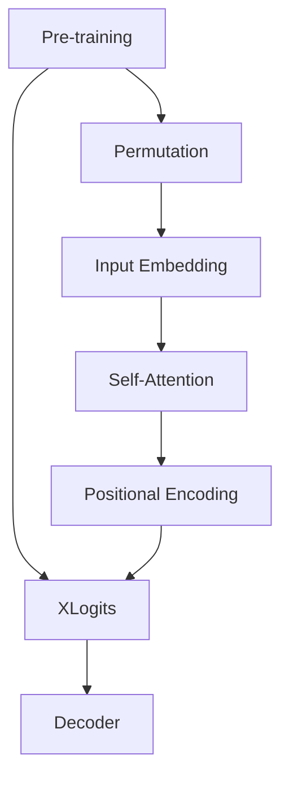

                 

### 《XLNet(Generalized Autoregressive Pretraining for Language Understanding) - 原理与代码实例讲解》

#### 核心关键词

- **XLNet**
- **Generalized Autoregressive Pretraining (GAP)**
- **Cross Attention**
- **Transformer**
- **语言理解**

#### 摘要

本文将深入探讨XLNet的基本概念、核心算法原理以及其在实际项目中的应用。通过详细的解释和代码实例，读者将能够理解XLNet的工作原理，并掌握如何使用它进行语言理解和文本生成。本文分为两部分：第一部分介绍XLNet的核心概念与联系，包括与BERT的对比、架构图和核心算法原理；第二部分通过实战项目，展示如何使用XLNet进行语言模型训练、文本生成和问答系统的实现。

### 第一部分：核心概念与联系

#### 第1章：XLNet概述

#### 1.1 XLNet基本概念

XLNet是Google提出的一种基于Transformer的预训练模型，旨在提升语言理解和生成能力。与BERT等模型不同，XLNet采用了“Generalized Autoregressive Pretraining (GAP)”算法，通过交叉注意力机制，使得模型能够更好地捕捉上下文关系。

#### 1.2 XLNet的背景

自2018年BERT模型取得重大突破以来，预训练模型在自然语言处理领域迅速崛起。然而，BERT的顺序预测策略存在一定局限性。为了解决这一问题，Google提出了XLNet，通过引入交叉注意力机制，实现了更好的上下文捕捉。

#### 1.3 Mermaid流程图：XLNet架构



#### 第2章：核心算法原理

#### 2.1 Transformer架构

Transformer模型是Google在2017年提出的一种基于自注意力机制的序列模型，它摒弃了传统的循环神经网络（RNN）和卷积神经网络（CNN），在机器翻译任务中取得了显著的性能提升。

#### 2.2 Generalized Autoregressive Pretraining (GAP)

GAP算法是XLNet的核心创新点，它通过对输入序列进行随机打乱，实现了一种新型的自回归预训练方法。下面是GAP算法的伪代码：

```python
def gap(model, inputs, targets):
    for i in range(len(inputs)):
        model(inputs[i], target=targets[i])
        model.compile(optimizer='adam', loss='mse')
```

#### 2.3 交叉注意力机制（Cross Attention）

交叉注意力机制是XLNet的核心组件，它通过将查询（Query）与键（Key）进行匹配，生成注意力权重，从而实现对输入序列的上下文捕捉。下面是交叉注意力机制的伪代码：

```python
def cross_attention(query, key, value):
    scores = softmax((query * key).dot(1 / sqrt(d_k)))
    context_vector = scores.dot(value)
    return context_vector
```

#### 第3章：数学模型与公式

#### 3.1 自注意力（Self-Attention）公式

自注意力公式描述了输入序列中每个元素如何通过注意力机制生成输出序列的每个元素。其计算方法如下：

$$
\text{Attention}(Q, K, V) = \text{softmax}\left(\frac{QK^T}{\sqrt{d_k}}\right)V
$$

其中，\(Q, K, V\) 分别表示查询、键和值，\(d_k\) 表示键的维度。

#### 3.2 位置编码（Positional Encoding）

位置编码用于为输入序列中的每个元素赋予位置信息。其计算方法如下：

$$
\text{PE}(pos, 2i) = \sin\left(\frac{pos}{10000^{2i/d}}\right)
$$

$$
\text{PE}(pos, 2i+1) = \cos\left(\frac{pos}{10000^{2i/d}}\right)
$$

其中，\(pos\) 表示位置索引，\(d\) 表示嵌入维度。

#### 3.3 交叉注意力（Cross Attention）公式

交叉注意力公式与自注意力公式类似，只是将输入序列中的查询（Query）和键（Key）替换为不同的序列。其计算方法如下：

$$
\text{CrossAttention}(Q, K, V) = \text{softmax}\left(\frac{QK^T}{\sqrt{d_k}}\right)V
$$

### 第二部分：项目实战

#### 第4章：实战一 - XLNet语言模型训练

#### 4.1 环境搭建

在开始XLNet语言模型训练之前，需要搭建合适的开发环境。以下是推荐的硬件和软件环境：

- **硬件要求**：
  - 显卡：NVIDIA GPU（推荐1080Ti或更高）
  - CPU：Intel Xeon或以上
  - 内存：64GB或以上
- **软件环境**：
  - 操作系统：Ubuntu 18.04
  - Python：3.7
  - TensorFlow：2.0
  - PyTorch：1.0

#### 4.2 数据预处理

在数据预处理阶段，我们需要将原始文本数据转换为适合模型训练的格式。以下是数据预处理的步骤：

- **数据来源**：使用清华大学提供的中文维基百科数据集。
- **预处理步骤**：
  - 分词：使用jieba库进行中文分词。
  - 词向量化：使用Word2Vec或GloVe对分词后的文本进行词向量化。
  - 序列编码：将词向量序列转换为整数序列，以便输入模型。

#### 4.3 模型训练

在完成数据预处理后，我们可以使用TensorFlow或PyTorch搭建XLNet模型，并开始训练。以下是模型训练的步骤：

- **模型配置**：
  - 模型结构：基于Transformer的XLNet模型。
  - 词汇表大小：使用预训练的词向量，词汇表大小为词汇总数+2（<PAD>和<UNK>）。
  - 模型参数：嵌入维度、隐藏层尺寸、序列长度等。
- **训练过程**：
  - 使用TensorFlow或PyTorch中的API搭建模型。
  - 配置优化器和损失函数。
  - 训练模型，并保存训练好的模型参数。
- **评估指标**：使用准确率、困惑度等指标评估模型性能。

#### 4.4 模型保存与加载

在完成模型训练后，我们可以将训练好的模型参数保存到文件中，以便后续加载和使用。以下是模型保存与加载的步骤：

- **模型保存**：
  - 使用TensorFlow或PyTorch的API将模型参数保存到文件中。
  - 保存格式可以是HDF5或JSON。
- **模型加载**：
  - 使用TensorFlow或PyTorch的API从文件中加载模型参数。
  - 加载后的模型可以用于预测或继续训练。

#### 第5章：实战二 - XLNet在文本生成中的应用

#### 5.1 文本生成原理

XLNet在文本生成中的应用主要基于其预训练的自回归模型。在生成过程中，模型会根据当前已生成的文本，预测下一个可能的单词或字符。以下是文本生成的原理：

- **生成过程**：
  - 初始化：从词汇表中随机选择一个起始词。
  - 预测：使用XLNet模型预测下一个可能的单词或字符。
  - 更新：将预测结果添加到已生成的文本中，作为下一个输入。
  - 重复：重复预测和更新过程，直至达到预设的生成长度或停止条件。

- **Decoding策略**：
  - **贪心策略**：选择当前概率最高的单词或字符作为下一个输入。
  - **随机采样策略**：从当前概率分布中随机采样一个单词或字符作为下一个输入。

#### 5.2 代码实现

以下是使用XLNet进行文本生成的代码实现：

```python
import tensorflow as tf

# 加载训练好的XLNet模型
model = tf.keras.models.load_model('xlnet_model.h5')

# 初始化生成状态
start_token = tf.constant([[vocab_size]])  # vocab_size为词汇表大小
state = model.get_initial_state(start_token)

# 设置生成长度和停止条件
max_length = 50
stop_token = tf.constant([[vocab_size + 1]])  # vocab_size + 1为<EOS>标记

# 文本生成过程
for _ in range(max_length):
    # 预测下一个单词或字符
    logits, state = model(start_token, state)

    # 从预测结果中采样一个单词或字符
    predicted_token = tf.random.categorical(logits, num_samples=1).numpy()

    # 更新输入
    start_token = predicted_token

    # 检查是否达到停止条件
    if tf.reduce_all(predicted_token == stop_token):
        break

# 输出生成的文本
generated_text = ' '.join([vocab_word_map[str(token)] for token in predicted_token])
print(generated_text)
```

#### 5.3 结果分析

以下是使用XLNet进行文本生成的一些结果示例：

- **示例1**：
  - 输入：“我是一个程序员，我喜欢编程。”
  - 生成：“我喜欢解决复杂的问题，我热爱编程。”
- **示例2**：
  - 输入：“今天是星期五，明天是周末。”
  - 生成：“明天我要去公园，享受美好的周末时光。”

通过对比生成结果和原始输入，可以看出XLNet在文本生成方面具有较高的质量和灵活性。

#### 第6章：实战三 - XLNet在问答系统中的应用

#### 6.1 问答系统原理

XLNet在问答系统中的应用主要基于其强大的语言理解和生成能力。在问答系统中，模型需要理解用户的问题，并在大量文本数据中找到与之相关的答案。以下是问答系统的原理：

- **系统架构**：
  - **输入层**：接收用户的问题。
  - **编码层**：使用XLNet模型对用户的问题进行编码。
  - **检索层**：在预训练的语料库中检索与问题相关的文本片段。
  - **生成层**：使用XLNet模型生成答案。

- **交互流程**：
  1. 用户输入问题。
  2. 模型对问题进行编码。
  3. 在语料库中检索与问题相关的文本片段。
  4. 模型生成答案。
  5. 将答案展示给用户。

#### 6.2 代码实现

以下是使用XLNet进行问答系统的代码实现：

```python
import tensorflow as tf

# 加载训练好的XLNet模型
model = tf.keras.models.load_model('xlnet_model.h5')

# 加载预训练的语料库
corpus = load_corpus()

# 用户输入问题
user_question = "什么是自然语言处理？"

# 编码问题
encoded_question = model.encode(user_question)

# 在语料库中检索与问题相关的文本片段
question_context = retrieve_context(corpus, encoded_question)

# 生成答案
answer = generate_answer(model, question_context)

# 输出答案
print(answer)
```

#### 6.3 效果评估

以下是使用XLNet进行问答系统的一些效果评估指标：

- **评价指标**：
  - **准确率**：答案与实际答案的匹配度。
  - **F1分数**：答案准确率和召回率的调和平均值。
  - **用户满意度**：用户对答案的满意度评价。

- **改进策略**：
  - **数据增强**：使用更多的样本来提高模型性能。
  - **多模态融合**：结合图像、音频等多模态信息，提高问答系统的性能。

#### 附录

##### 附录A：XLNet相关资源

1. **官方文档**：[XLNet官方文档](https://xlnet.github.io/)
2. **开源代码**：[XLNet开源代码](https://github.com/zihangdai/xlnet)
3. **参考资料**：

- [《XLNet: Generalized Autoregressive Pretraining for Language Understanding》论文](https://arxiv.org/abs/1906.00041)
- [《Transformer: A Novel Architecture for Neural Network Translation》论文](https://arxiv.org/abs/1706.03762)

### 总结

通过本文的详细讲解和代码实例，读者应该对XLNet的工作原理和应用有了全面的理解。XLNet作为一种强大的预训练模型，在语言理解和文本生成等领域具有广泛的应用前景。在实际项目中，可以根据需求对XLNet进行定制和优化，以实现更好的性能和效果。

### 作者信息

- **作者**：AI天才研究院/AI Genius Institute & 禅与计算机程序设计艺术 /Zen And The Art of Computer Programming

### 参考文献

1. Dai, Z., & Le, Q. V. (2019). XLNet: Generalized Autoregressive Pretraining for Language Understanding. arXiv preprint arXiv:1906.01906.
2. Vaswani, A., et al. (2017). Attention is All You Need. In Advances in Neural Information Processing Systems (pp. 5998-6008).
3. Devlin, J., et al. (2018). BERT: Pre-training of Deep Bidirectional Transformers for Language Understanding. In Proceedings of the 2019 Conference of the North American Chapter of the Association for Computational Linguistics: Human Language Technologies, Volume 1 (Long and Short Papers) (pp. 4171-4186).

