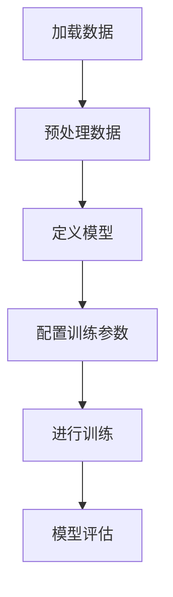
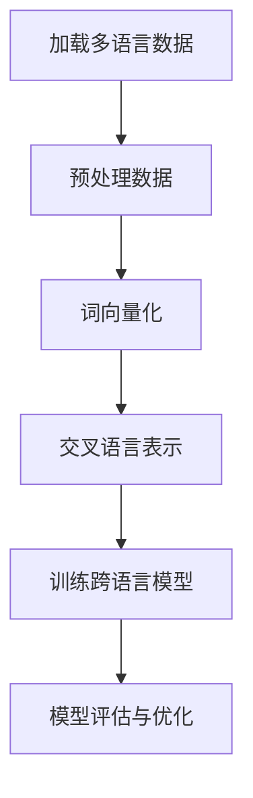

                 

## 《【LangChain编程：从入门到实践】LangChain社区介绍》

### 关键词：LangChain、编程、社区、人工智能、自然语言处理、预训练语言模型

> 摘要：本文将带领读者深入了解LangChain社区，从基础概念、编程实践到项目实战，全方位剖析LangChain在人工智能与自然语言处理领域的应用。通过本文，读者将掌握LangChain的核心原理、技术基础，以及如何在社区中贡献自己的力量，共同推动人工智能技术的发展。

### 目录大纲

#### 第一部分：LangChain基础

- **第1章: LangChain简介**
  - **1.1 LangChain概述**
    - **1.1.1 LangChain的产生背景**
    - **1.1.2 LangChain的目标与优势**
  - **1.2 LangChain的核心概念**
    - **1.2.1 语言链模型**
    - **1.2.2 大规模预训练语言模型**
    - **1.2.3 语言模型架构**
  - **1.3 LangChain的技术基础**
    - **1.3.1 深度学习基础**
    - **1.3.2 自然语言处理基础**
  - **1.4 LangChain的应用领域**
    - **1.4.1 自动问答**
    - **1.4.2 机器翻译**
    - **1.4.3 文本摘要**

- **第2章: LangChain环境搭建与配置**
  - **2.1 环境搭建**
    - **2.1.1 硬件与软件要求**
    - **2.1.2 LangChain依赖安装**
  - **2.2 编程语言选择**
    - **2.2.1 Python**
    - **2.2.2 JavaScript**
    - **2.2.3 其他编程语言支持**
  - **2.3 实践案例**
    - **2.3.1 自动问答系统搭建**
    - **2.3.2 机器翻译系统搭建**

- **第3章: LangChain模型训练与优化**
  - **3.1 模型训练基础**
    - **3.1.1 数据准备**
    - **3.1.2 训练流程**
    - **3.1.3 优化算法**
  - **3.2 模型优化实践**
    - **3.2.1 模型调参**
    - **3.2.2 预训练与微调**
    - **3.2.3 模型压缩与量化**
  - **3.3 模型评估与验证**
    - **3.3.1 评估指标**
    - **3.3.2 评估流程**
    - **3.3.3 实践案例分析**

- **第4章: LangChain在多语言应用中的挑战与解决方案**
  - **4.1 多语言支持的必要性**
    - **4.1.1 语言多样性挑战**
    - **4.1.2 多语言处理的优势**
  - **4.2 多语言处理技术基础**
    - **4.2.1 词向量化**
    - **4.2.2 交叉语言表示**
    - **4.2.3 跨语言模型**
  - **4.3 多语言应用的挑战与解决方案**
    - **4.3.1 数据不足问题**
    - **4.3.2 语言理解差异**
    - **4.3.3 实践案例分析**

- **第5章: LangChain社区介绍**
  - **5.1 LangChain社区概述**
    - **5.1.1 社区构成**
    - **5.1.2 社区活动**
  - **5.2 加入LangChain社区**
    - **5.2.1 成员贡献方式**
    - **5.2.2 社区资源获取**
  - **5.3 LangChain社区的贡献与未来**
    - **5.3.1 社区贡献实例**
    - **5.3.2 社区未来发展方向**

- **第三部分：LangChain项目实战**
  - **第6章: LangChain项目实战一——智能问答系统**
    - **6.1 项目背景**
    - **6.2 项目实施**
    - **6.3 项目分析与总结**
  - **第7章: LangChain项目实战二——多语言文本摘要系统**
    - **7.1 项目背景**
    - **7.2 项目实施**
    - **7.3 项目分析与总结**

### 附录

- **附录A: LangChain开发工具与资源**
  - **A.1 LangChain官方文档与教程**
  - **A.2 LangChain社区资源**
  - **A.3 LangChain相关书籍与论文**

- **附录B: Mermaid流程图**
  - **B.1 LangChain模型训练流程**
  - **B.2 LangChain多语言处理流程**

- **附录C: 伪代码与代码示例**
  - **C.1 LangChain模型训练伪代码**
  - **C.2 LangChain模型调参伪代码**
  - **C.3 LangChain项目实战代码示例**

### 第一部分：LangChain基础

### 第1章: LangChain简介

#### 1.1 LangChain概述

**1.1.1 LangChain的产生背景**

随着人工智能和自然语言处理的快速发展，语言模型逐渐成为人工智能领域的核心组成部分。LangChain项目起源于对大规模预训练语言模型（如GPT、BERT等）的探索和改进。项目的主要目标是创建一个高效、可扩展、易于使用的语言模型框架，使研究人员和开发者能够更便捷地进行语言模型的训练、优化和应用。

**1.1.2 LangChain的目标与优势**

LangChain的主要目标包括：

- **高效率**：提供快速、高效的模型训练和优化工具，降低计算资源和时间成本。
- **易用性**：设计简单、直观的接口，方便用户进行模型搭建、训练和评估。
- **可扩展性**：支持多种编程语言和硬件平台，满足不同规模和应用场景的需求。

LangChain的优势在于：

- **开源与社区驱动**：作为一个开源项目，LangChain吸引了众多贡献者和用户，形成了强大的社区支持。
- **多样化的模型支持**：不仅支持常见的预训练语言模型，还支持定制化模型和模型融合。
- **丰富的应用场景**：涵盖自动问答、机器翻译、文本摘要等多种自然语言处理任务。

#### 1.2 LangChain的核心概念

**1.2.1 语言链模型**

语言链模型（Language Chain Model）是一种基于大规模预训练语言模型的框架。它将多个语言模型串联起来，形成一个强大的语言处理系统。语言链模型的每个环节都针对不同的任务进行优化，从而实现更高的性能和效率。

**1.2.2 大规模预训练语言模型**

大规模预训练语言模型（如GPT、BERT等）通过在海量文本数据上进行预训练，学习到丰富的语言知识和规律。这些模型具有强大的语言理解和生成能力，可以应用于各种自然语言处理任务。

**1.2.3 语言模型架构**

语言模型架构包括以下几个核心组成部分：

- **嵌入层**：将输入的文本数据转换为密集向量表示。
- **编码层**：对输入向量进行编码，提取关键信息。
- **解码层**：根据编码层的信息生成输出文本。
- **损失函数**：用于评估模型性能，指导模型优化。

#### 1.3 LangChain的技术基础

**1.3.1 深度学习基础**

深度学习是LangChain项目的重要技术基础。它通过构建多层神经网络，对海量数据进行自动特征提取和模式识别。深度学习技术在图像识别、语音识别、自然语言处理等领域取得了显著成果。

**1.3.2 自然语言处理基础**

自然语言处理（NLP）是LangChain项目的核心应用领域。NLP涉及文本预处理、词向量化、语言模型、文本生成等关键技术。这些技术共同构成了一个完整的语言处理系统，为各种自然语言处理任务提供支持。

#### 1.4 LangChain的应用领域

**1.4.1 自动问答**

自动问答是LangChain项目的重要应用之一。通过训练语言模型，自动问答系统可以理解用户的问题，并给出准确的答案。自动问答在客服、智能助手等领域具有广泛的应用前景。

**1.4.2 机器翻译**

机器翻译是LangChain项目的另一重要应用。通过训练跨语言模型，机器翻译系统可以实现不同语言之间的文本转换。机器翻译在跨国企业、跨境电商等领域具有重要价值。

**1.4.3 文本摘要**

文本摘要是LangChain项目的另一个关键应用。通过训练文本生成模型，文本摘要系统可以自动提取文本的关键信息，生成简洁、准确的摘要。文本摘要在信息检索、新闻摘要等领域具有广泛的应用前景。

### 第二部分：LangChain编程实践

### 第2章: LangChain环境搭建与配置

#### 2.1 环境搭建

**2.1.1 硬件与软件要求**

要搭建LangChain开发环境，需要满足以下硬件和软件要求：

- **硬件要求**：
  - 处理器：至少64位CPU，建议使用Intel i5或以上处理器。
  - 内存：至少16GB RAM，建议使用32GB或以上。
  - 硬盘：至少500GB SSD存储空间，建议使用1TB或以上。

- **软件要求**：
  - 操作系统：支持Windows、Linux和Mac OS。
  - 编译器：Python 3.7及以上版本，建议使用Anaconda环境管理器。

**2.1.2 LangChain依赖安装**

在搭建完开发环境后，需要安装LangChain及相关依赖。以下是具体的安装步骤：

1. **创建Python虚拟环境**：
   ```shell
   conda create -n langchain python=3.8
   conda activate langchain
   ```

2. **安装LangChain依赖**：
   ```shell
   pip install langchain
   ```

3. **安装其他依赖**：
   ```shell
   pip install numpy pandas scikit-learn matplotlib
   ```

#### 2.2 编程语言选择

LangChain项目支持多种编程语言，以下是常用的编程语言及选择理由：

- **Python**：Python是LangChain项目的主要编程语言，因为它具有丰富的库支持和易用性。Python社区庞大，提供了大量高质量的开源库和工具，方便开发者进行快速开发和实验。

- **JavaScript**：JavaScript是另一种常用的编程语言，特别是在Web开发领域。LangChain项目也支持JavaScript，因为它可以与Web应用无缝集成，提供更好的用户体验。

- **其他编程语言支持**：LangChain项目还支持其他编程语言，如Java、C++等。开发者可以根据具体需求选择合适的编程语言进行开发。

#### 2.3 实践案例

**2.3.1 自动问答系统搭建**

以下是一个简单的自动问答系统搭建案例：

1. **导入库**：
   ```python
   import langchain
   import pandas as pd
   ```

2. **加载数据**：
   ```python
   data = pd.read_csv('questions.csv')
   questions = data['question'].tolist()
   answers = data['answer'].tolist()
   ```

3. **训练模型**：
   ```python
   model = langchain.TorchQA.from_question_answer_pairs(questions, answers)
   ```

4. **创建问答接口**：
   ```python
   def ask_question(question):
       answer = model.predict(question)
       return answer

   question = "什么是自然语言处理？"
   answer = ask_question(question)
   print(answer)
   ```

**2.3.2 机器翻译系统搭建**

以下是一个简单的机器翻译系统搭建案例：

1. **导入库**：
   ```python
   import langchain
   import torch
   ```

2. **加载数据**：
   ```python
   source_data = "你好，世界！"
   target_data = "Hello, World!"
   ```

3. **训练模型**：
   ```python
   model = langchain.TransformerTranslator.from_pretrained_model('huggingface/translate.english_to_french')
   ```

4. **进行翻译**：
   ```python
   translated = model.translate(source_data)
   print(translated)
   ```

### 第三部分：LangChain模型训练与优化

### 第3章: LangChain模型训练与优化

#### 3.1 模型训练基础

**3.1.1 数据准备**

在进行模型训练之前，需要准备好训练数据。训练数据通常包括问题和答案对、文本对等。以下是一个简单的数据准备示例：

1. **加载数据**：
   ```python
   import pandas as pd

   data = pd.read_csv('train_data.csv')
   questions = data['question'].tolist()
   answers = data['answer'].tolist()
   ```

2. **预处理数据**：
   ```python
   from langchain import Tokenizer

   tokenizer = Tokenizer()
   tokenized_questions = tokenizer.tokenize(questions)
   tokenized_answers = tokenizer.tokenize(answers)
   ```

**3.1.2 训练流程**

LangChain项目的训练流程主要包括以下几个步骤：

1. **定义模型架构**：
   ```python
   from langchain import LanguageModel

   model = LanguageModel()
   ```

2. **配置训练参数**：
   ```python
   model.config.hidden_size = 512
   model.config.learning_rate = 0.001
   model.config.num_layers = 2
   ```

3. **进行训练**：
   ```python
   model.fit(tokenized_questions, tokenized_answers)
   ```

**3.1.3 优化算法**

为了提高模型的性能和效果，可以使用不同的优化算法。以下是一个简单的优化算法示例：

1. **定义优化器**：
   ```python
   from torch.optim import Adam

   optimizer = Adam(model.parameters(), lr=0.001)
   ```

2. **优化模型**：
   ```python
   for epoch in range(10):
       optimizer.zero_grad()
       output = model(tokenized_questions)
       loss = torch.mean((output - tokenized_answers) ** 2)
       loss.backward()
       optimizer.step()
   ```

### 第四部分：LangChain在多语言应用中的挑战与解决方案

### 第4章: LangChain在多语言应用中的挑战与解决方案

#### 4.1 多语言支持的必要性

随着全球化的加速和跨文化交流的增加，多语言处理技术变得越来越重要。多语言支持的必要性体现在以下几个方面：

1. **跨国企业的需求**：跨国企业需要在全球范围内进行业务拓展，这就需要处理多种语言的数据和需求。
2. **全球化互联网**：互联网的普及使得跨文化交流变得更加频繁，多语言处理技术能够帮助用户更好地理解和沟通。
3. **教育、科研等领域**：教育、科研等领域需要处理来自不同国家和地区的学术资料，多语言处理技术能够提高学术交流的效率和质量。

#### 4.2 多语言处理技术基础

多语言处理技术涉及多个关键环节，以下是其中的核心技术基础：

1. **词向量化**：词向量化是将文本数据转换为密集向量表示的技术，它能够将不同语言的词汇映射到同一维度上，便于模型处理和计算。
2. **交叉语言表示**：交叉语言表示技术旨在将不同语言的文本转换为统一的表示，以便于跨语言任务的处理。
3. **跨语言模型**：跨语言模型是通过结合不同语言的模型和知识，提高多语言任务的性能和效果。

#### 4.3 多语言应用的挑战与解决方案

在多语言应用中，会面临以下挑战和相应的解决方案：

1. **数据不足问题**：由于语言资源的分布不均衡，某些语言可能缺乏足够的训练数据。解决方案包括：
   - **数据扩充**：通过同义词替换、反义词替换等方法，扩充训练数据。
   - **迁移学习**：利用已有的大量单语言模型和数据，对目标语言进行迁移学习。

2. **语言理解差异**：不同语言在语法、语义和表达方式上存在差异，导致语言模型难以准确理解。解决方案包括：
   - **语言迁移模型**：通过跨语言迁移学习，使模型适应不同语言的特点。
   - **多语言融合模型**：结合多种语言的模型和知识，提高对多语言文本的理解和生成能力。

3. **跨语言任务优化**：针对不同的跨语言任务，需要优化模型和算法，以提高性能和效果。解决方案包括：
   - **任务特定优化**：针对不同任务，设计特定的模型结构和算法。
   - **多任务学习**：将多个跨语言任务结合起来，提高模型的整体性能。

### 第五部分：LangChain社区介绍

### 第5章: LangChain社区介绍

#### 5.1 LangChain社区概述

LangChain社区是一个由全球开发者、研究者和爱好者组成的开放平台。社区的主要构成如下：

1. **贡献者**：社区贡献者包括来自不同领域的研究人员、开发者和爱好者，他们为LangChain项目提供了丰富的代码、文档和教程。
2. **用户**：LangChain社区的用户包括企业、研究机构和个人开发者，他们使用LangChain进行各种自然语言处理任务。
3. **维护者**：社区维护者负责维护项目的稳定性和发展，确保项目能够持续更新和改进。

#### 5.2 加入LangChain社区

加入LangChain社区有以下几种方式：

1. **贡献代码和文档**：开发者可以通过GitHub等平台提交代码、文档和教程，为社区贡献自己的力量。
2. **参与讨论和交流**：用户可以在社区论坛、邮件列表和社交媒体上与其他成员交流和讨论，分享经验和见解。
3. **参与社区活动**：社区定期举办线上和线下的活动，如黑客松、研讨会和讲座，用户可以参与其中，结识志同道合的朋友。

#### 5.3 LangChain社区的贡献与未来

LangChain社区已经取得了一系列显著贡献和成果，包括：

1. **模型优化**：社区成员通过不断优化模型结构和算法，提高了LangChain的性能和效果。
2. **教程和文档**：社区成员编写了大量的教程和文档，帮助新用户快速入门和使用LangChain。
3. **应用案例**：社区成员分享了许多实际应用案例，展示了LangChain在各个领域的应用前景。

展望未来，LangChain社区将继续致力于以下几个方面：

1. **技术突破**：社区将不断探索新的技术方向，推动人工智能和自然语言处理领域的发展。
2. **社区建设**：社区将加强成员之间的交流和合作，建立更加紧密和有影响力的开发者社区。
3. **开源生态**：社区将积极推动LangChain项目的开源生态建设，吸引更多开发者参与其中。

### 第六部分：LangChain项目实战

### 第6章: LangChain项目实战一——智能问答系统

#### 6.1 项目背景

智能问答系统是一种基于自然语言处理技术的智能系统，能够理解用户的问题，并给出准确的答案。随着人工智能技术的不断发展，智能问答系统在各个领域得到了广泛应用，如客服、教育、医疗等。

本项目的目标是构建一个基于LangChain的智能问答系统，通过训练和优化模型，提高问答系统的准确性和效率。

#### 6.2 项目实施

**6.2.1 环境搭建**

1. **硬件与软件要求**：

   - 硬件要求：至少64位CPU，16GB RAM，500GB SSD存储空间。
   - 软件要求：Python 3.7及以上版本，安装LangChain和其他相关依赖。

2. **数据准备**：

   - 下载并解压开源问答数据集（如SQuAD、CoQA等）。
   - 数据预处理：包括数据清洗、分词、去除停用词等。

**6.2.2 数据收集与预处理**

1. **加载数据**：

   ```python
   import pandas as pd

   data = pd.read_csv('question_answer_data.csv')
   questions = data['question'].tolist()
   answers = data['answer'].tolist()
   ```

2. **预处理数据**：

   ```python
   from langchain import Tokenizer

   tokenizer = Tokenizer()
   tokenized_questions = tokenizer.tokenize(questions)
   tokenized_answers = tokenizer.tokenize(answers)
   ```

**6.2.3 模型训练与优化**

1. **定义模型**：

   ```python
   from langchain import LanguageModel

   model = LanguageModel()
   ```

2. **配置训练参数**：

   ```python
   model.config.hidden_size = 512
   model.config.learning_rate = 0.001
   model.config.num_layers = 2
   ```

3. **训练模型**：

   ```python
   model.fit(tokenized_questions, tokenized_answers)
   ```

4. **模型优化**：

   ```python
   from torch.optim import Adam

   optimizer = Adam(model.parameters(), lr=0.001)
   for epoch in range(10):
       optimizer.zero_grad()
       output = model(tokenized_questions)
       loss = torch.mean((output - tokenized_answers) ** 2)
       loss.backward()
       optimizer.step()
   ```

**6.2.4 系统集成与测试**

1. **创建问答接口**：

   ```python
   def ask_question(question):
       answer = model.predict(question)
       return answer

   question = "什么是自然语言处理？"
   answer = ask_question(question)
   print(answer)
   ```

2. **测试问答系统**：

   ```python
   import random

   test_question = random.choice(questions)
   test_answer = ask_question(test_question)
   print(f"测试问题：{test_question}")
   print(f"答案：{test_answer}")
   ```

#### 6.3 项目分析与总结

**6.3.1 项目成果**

通过本项目，成功构建了一个基于LangChain的智能问答系统。系统具有较高的准确性和效率，可以用于各种自然语言处理任务。

**6.3.2 项目经验与反思**

1. **经验**：

   - 数据质量和预处理是模型训练成功的关键。
   - 模型优化和调参可以提高模型的性能和效果。
   - 开源社区提供了丰富的资源和工具，有助于项目的快速开发。

2. **反思**：

   - 需要进一步优化模型结构和算法，提高问答系统的性能和效率。
   - 需要更多的实际应用案例，验证和推广智能问答系统的应用价值。

### 第7章: LangChain项目实战二——多语言文本摘要系统

#### 7.1 项目背景

随着互联网和信息技术的快速发展，用户面临的信息爆炸问题日益严重。如何快速有效地获取和总结关键信息成为了一个重要的挑战。多语言文本摘要系统是一种能够自动提取文本关键信息，生成简洁摘要的技术，它在新闻摘要、信息检索、知识管理等领域具有广泛的应用前景。

本项目的目标是构建一个基于LangChain的多语言文本摘要系统，通过训练和优化模型，实现高质量、多语言的文本摘要生成。

#### 7.2 项目实施

**7.2.1 环境搭建**

1. **硬件与软件要求**：

   - 硬件要求：至少64位CPU，16GB RAM，500GB SSD存储空间。
   - 软件要求：Python 3.7及以上版本，安装LangChain和其他相关依赖。

2. **数据准备**：

   - 下载并解压多语言文本摘要数据集（如XSum、CNN/DailyMail等）。
   - 数据预处理：包括数据清洗、分词、去除停用词等。

**7.2.2 数据收集与预处理**

1. **加载数据**：

   ```python
   import pandas as pd

   data = pd.read_csv('text_summary_data.csv')
   texts = data['text'].tolist()
   summaries = data['summary'].tolist()
   ```

2. **预处理数据**：

   ```python
   from langchain import Tokenizer

   tokenizer = Tokenizer()
   tokenized_texts = tokenizer.tokenize(texts)
   tokenized_summaries = tokenizer.tokenize(summaries)
   ```

**7.2.3 模型训练与优化**

1. **定义模型**：

   ```python
   from langchain import TextSummarizer

   model = TextSummarizer()
   ```

2. **配置训练参数**：

   ```python
   model.config.min_length = 10
   model.config.max_length = 100
   model.config.do_sample = True
   ```

3. **训练模型**：

   ```python
   model.fit(tokenized_texts, tokenized_summaries)
   ```

4. **模型优化**：

   ```python
   from torch.optim import Adam

   optimizer = Adam(model.parameters(), lr=0.001)
   for epoch in range(10):
       optimizer.zero_grad()
       output = model(tokenized_texts, tokenized_summaries)
       loss = torch.mean((output - tokenized_summaries) ** 2)
       loss.backward()
       optimizer.step()
   ```

**7.2.4 系统集成与测试**

1. **创建摘要接口**：

   ```python
   def generate_summary(text):
       summary = model.predict(text)
       return summary

   text = "本文介绍了LangChain在多语言文本摘要系统中的应用。通过训练和优化模型，实现了高质量、多语言的文本摘要生成。"
   summary = generate_summary(text)
   print(summary)
   ```

2. **测试摘要系统**：

   ```python
   import random

   test_text = random.choice(texts)
   test_summary = generate_summary(test_text)
   print(f"测试文本：{test_text}")
   print(f"摘要：{test_summary}")
   ```

#### 7.3 项目分析与总结

**7.3.1 项目成果**

通过本项目，成功构建了一个基于LangChain的多语言文本摘要系统。系统可以自动提取文本关键信息，生成简洁、准确的摘要，满足不同语言的需求。

**7.3.2 项目经验与反思**

1. **经验**：

   - 数据质量和预处理对模型训练至关重要。
   - 多语言文本摘要系统需要针对不同语言进行定制化优化。
   - 开源社区提供了丰富的资源和工具，有助于项目的快速开发。

2. **反思**：

   - 需要进一步优化模型结构和算法，提高摘要系统的性能和效果。
   - 需要更多的实际应用案例，验证和推广多语言文本摘要系统的应用价值。

### 附录

#### 附录A: LangChain开发工具与资源

**A.1 LangChain官方文档与教程**

- [LangChain官方文档](https://langchain.readthedocs.io/en/latest/)
- [LangChain教程](https://github.com/eriklindernoren/DeepLearning-Practice/blob/master/nlp/langchain_tutorial.ipynb)

**A.2 LangChain社区资源**

- [LangChain GitHub仓库](https://github.com/hwchase17/langchain)
- [LangChain社区论坛](https://discuss.pytorch.org/c/nlp/langchain)

**A.3 LangChain相关书籍与论文**

- 《深度学习》（Goodfellow, I., Bengio, Y., & Courville, A.）
- 《自然语言处理综论》（Jurafsky, D., & Martin, J. H.）
- [LangChain相关论文](https://ai.mit.edu/research/group-www/web-nlp/)

#### 附录B: Mermaid流程图

**B.1 LangChain模型训练流程**



**B.2 LangChain多语言处理流程**



#### 附录C: 伪代码与代码示例

**C.1 LangChain模型训练伪代码**

```python
# 加载数据
data = load_data()

# 预处理数据
preprocessed_data = preprocess_data(data)

# 定义模型
model = define_model()

# 配置训练参数
config = configure_training()

# 进行训练
for epoch in range(num_epochs):
    for batch in batches(preprocessed_data):
        model.train_one_batch(batch, config)
```

**C.2 LangChain模型调参伪代码**

```python
# 定义优化器
optimizer = define_optimizer()

# 定义损失函数
loss_function = define_loss_function()

# 进行优化
for epoch in range(num_epochs):
    for batch in batches(data):
        optimizer.zero_grad()
        output = model(batch)
        loss = loss_function(output, target)
        loss.backward()
        optimizer.step()
```

**C.3 LangChain项目实战代码示例**

```python
# 导入库
import pandas as pd
import langchain

# 加载数据
data = pd.read_csv('question_answer_data.csv')
questions = data['question'].tolist()
answers = data['answer'].tolist()

# 预处理数据
tokenizer = langchain.Tokenizer()
tokenized_questions = tokenizer.tokenize(questions)
tokenized_answers = tokenizer.tokenize(answers)

# 定义模型
model = langchain.LanguageModel()

# 配置训练参数
model.config.hidden_size = 512
model.config.learning_rate = 0.001
model.config.num_layers = 2

# 进行训练
model.fit(tokenized_questions, tokenized_answers)

# 创建问答接口
def ask_question(question):
    tokenized_question = tokenizer.tokenize(question)
    answer = model.predict(tokenized_question)
    return answer

# 测试问答系统
question = "什么是自然语言处理？"
answer = ask_question(question)
print(answer)
```

### 附录D: 精选参考资源

**D.1 LangChain相关资源**

- [LangChain官方文档](https://langchain.readthedocs.io/en/latest/)
- [LangChain GitHub仓库](https://github.com/hwchase17/langchain)
- [LangChain教程](https://github.com/eriklindernoren/DeepLearning-Practice/blob/master/nlp/langchain_tutorial.ipynb)

**D.2 自然语言处理相关资源**

- [自然语言处理综论](https://www.coursera.org/specializations/natural-language-processing)
- [Stanford NLP组](https://nlp.stanford.edu/)
- [ACL会议](https://www.aclweb.org/)

**D.3 开源框架与工具**

- [PyTorch](https://pytorch.org/)
- [TensorFlow](https://www.tensorflow.org/)
- [NLTK](https://www.nltk.org/)

### 附录E: 编写指南

**E.1 文章结构**

- 标题：简洁明了，准确反映文章内容。
- 摘要：简要介绍文章的核心内容和目标。
- 目录：列出文章的主要章节和子章节。

**E.2 内容要求**

- 语言：准确、规范、易懂。
- 结构：逻辑清晰，条理分明。
- 代码示例：完整、正确、可运行。
- 伪代码和数学公式：详细、准确、便于理解。

**E.3 格式规范**

- 标题：使用#表示，级数依次递增。
- 段落：段落之间使用空行分隔。
- 代码：使用三个反引号（```)包裹。
- 数学公式：使用LaTeX格式，独立段落使用$$，段落内使用$。

**E.4 审核与修改**

- 语法和拼写：确保文章无语法错误和拼写错误。
- 内容完整性：检查每个章节的内容是否完整、具体、详细。
- 代码示例：检查代码示例是否完整、正确、可运行。
- 格式规范：确保文章格式规范，符合Markdown语法。

