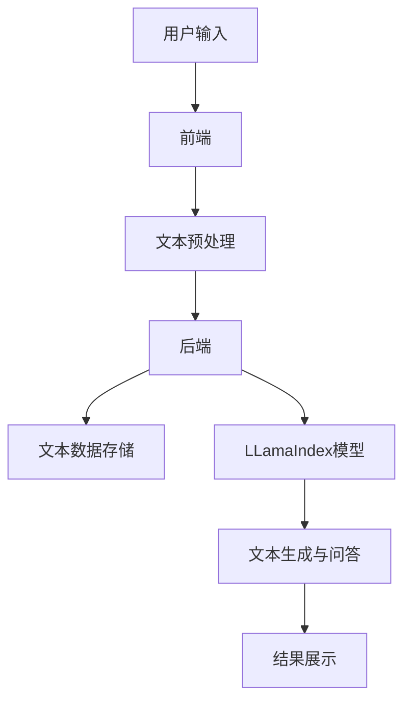
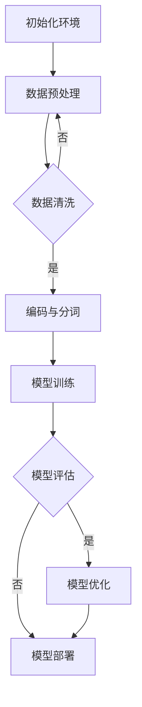

                 

### 大模型应用开发 动手做AI Agent

在当今数字化时代，人工智能（AI）技术正以前所未有的速度发展，并逐渐渗透到我们日常生活的方方面面。从自动驾驶汽车到智能语音助手，从医疗诊断到金融风险评估，AI正在改变我们的生活方式。而大模型（Large Models）作为AI技术的核心组成部分，其应用开发更是引起了广泛关注。本文将带领读者深入了解大模型应用开发，特别是LlamaIndex这个具体的大模型，帮助读者动手做AI Agent。

首先，我们需要理解大模型的基本概念和其在各个领域的应用现状。然后，我们将深入探讨LlamaIndex的核心功能、架构设计和技术原理，并通过数学模型和算法原理的详细讲解，帮助读者掌握其内在工作机制。接下来，我们将通过实战应用和代码案例，让读者亲自动手构建AI Agent，体验大模型应用开发的魅力。最后，我们将讨论LlamaIndex的优化与部署策略，以及其未来发展的前景和挑战。

通过这篇文章，读者将不仅对大模型应用开发有全面的了解，还能学会如何动手实现一个AI Agent，开启自己的AI应用之旅。

---

**关键词**：大模型、LlamaIndex、AI应用开发、Transformer、自监督学习、迁移学习、模型压缩、模型部署、AI Agent。

---

**摘要**：

本文旨在深入探讨大模型应用开发的实践之路，特别聚焦于LlamaIndex这个具有代表性的大模型。文章首先概述了当前大模型在各个行业中的应用现状，接着详细介绍了LlamaIndex的核心功能、架构设计和技术原理。通过数学模型和算法原理的讲解，读者将了解LlamaIndex的内在工作机制。文章后半部分通过实战应用和代码案例，让读者亲自动手构建AI Agent，体验大模型应用开发的实际操作。最后，文章讨论了LlamaIndex的优化与部署策略，并展望了其未来的发展趋势。通过本文，读者将掌握大模型应用开发的核心知识，并具备实际动手能力。

---

### 第一部分：大模型应用开发概述

#### 第1章：何谓LlamaIndex

随着人工智能技术的迅猛发展，大模型（Large Models）作为AI技术的核心组件，正在扮演越来越重要的角色。在这个章节中，我们将详细介绍LlamaIndex，一个备受瞩目的开源大模型，探讨其核心功能、架构设计以及与其他大模型的区别。

#### 1.1 大模型的应用现状

##### 1.1.1 大模型的技术背景与发展历程

大模型的概念起源于深度学习领域，特别是神经网络的研究。最初的神经网络模型规模较小，性能有限。随着计算能力和数据资源的不断提升，研究人员开始探索更大规模的神经网络模型，以实现更复杂的任务。这一探索历程可以追溯到20世纪80年代，当时LeCun等人提出了卷积神经网络（CNN）用于图像识别。随后，Hinton等人提出了深度信念网络（DBN）和 Restricted Boltzmann Machine（RBM），为深度学习的发展奠定了基础。

进入21世纪，随着GPU等硬件设备的普及，以及大数据和云计算技术的发展，深度学习取得了显著的突破。2012年，AlexNet在ImageNet图像识别竞赛中取得了显著成绩，标志着深度学习的崛起。此后，各种更大规模的深度学习模型如GPT、BERT、Turing模型等相继推出，这些模型在自然语言处理、图像识别、语音识别等领域取得了卓越的表现。

##### 1.1.2 大模型在各个行业的应用案例

大模型的应用已经渗透到各行各业，以下是一些典型应用案例：

- **自然语言处理（NLP）**：GPT和BERT等大型语言模型在文本生成、机器翻译、问答系统等方面取得了显著成就。例如，GPT-3能够生成高质量的文章、新闻、代码等，而BERT在问答系统中展现了强大的语义理解能力。
- **计算机视觉**：ImageNet竞赛的成功推动了深度学习在计算机视觉领域的发展。如今，深度学习模型被广泛应用于图像分类、目标检测、图像生成等任务，如YOLO、ResNet等模型在图像识别任务中表现出色。
- **语音识别**：WaveNet和Transformer-XL等模型在语音识别领域取得了突破，使得语音识别的准确率和实时性大幅提升，被广泛应用于智能语音助手、自动语音翻译等领域。
- **推荐系统**：深度学习模型在推荐系统中的应用也逐渐增多，通过分析用户行为和兴趣，实现个性化的推荐服务。如Netflix、Amazon等平台使用的深度学习推荐算法，大幅提升了用户满意度和平台收益。
- **医学诊断**：深度学习模型在医学图像分析、基因测序、疾病预测等方面展现出巨大的潜力。如DeepMind的AlphaGo在医学图像诊断中表现出色，AI模型在癌症、心血管疾病等领域的诊断和治疗辅助中发挥重要作用。

#### 1.2 LlamaIndex的概念与架构

##### 1.2.1 LlamaIndex的核心功能

LlamaIndex是一个开源的大规模语言模型，由Meta AI（原Facebook AI Research）开发。它基于Transformer架构，采用了自监督学习和迁移学习技术，旨在为各种自然语言处理任务提供强大的支持。LlamaIndex的核心功能包括：

- **文本生成**：LlamaIndex能够生成高质量的自然语言文本，适用于文章写作、新闻生成、对话系统等场景。
- **文本分类**：LlamaIndex能够对文本进行分类，如情感分析、主题分类等，为信息过滤、舆情监控等提供支持。
- **问答系统**：LlamaIndex能够处理开放域问答任务，从大量文本中检索并生成答案，适用于智能客服、知识图谱等应用。
- **翻译**：LlamaIndex支持多种语言之间的翻译，为多语言交流提供便利。
- **对话生成**：LlamaIndex能够生成自然流畅的对话文本，应用于聊天机器人、虚拟助手等场景。

##### 1.2.2 LlamaIndex的架构设计

LlamaIndex的架构设计遵循Transformer编码器-解码器（Encoder-Decoder）模型，具有以下几个关键组件：

- **编码器（Encoder）**：编码器负责处理输入文本，将其编码为固定长度的向量表示。编码器采用多个自注意力层（Self-Attention Layers），能够捕捉文本中的长距离依赖关系。
- **解码器（Decoder）**：解码器负责生成输出文本，解码输入编码器的文本表示。解码器同样采用多个自注意力层，并在每个时间步使用上一个时间步的输出作为输入，实现逐词生成。
- **嵌入层（Embedding Layer）**：嵌入层将输入和输出的单词映射为向量，是Transformer模型的基础组成部分。LlamaIndex采用了预训练的词嵌入层，能够处理多种语言和文本格式。
- **位置编码（Positional Encoding）**：为了在编码器和解码器中保留文本的位置信息，LlamaIndex采用了位置编码技术。位置编码通过为每个词添加额外的向量实现，确保模型能够理解文本的顺序和结构。
- **多头自注意力（Multi-Head Self-Attention）**：多头自注意力是Transformer模型的核心机制，通过将输入文本分解为多个子序列，同时计算多个自注意力权重，提高模型的表示能力和灵活性。

##### 1.2.3 LlamaIndex与其他大模型的区别

LlamaIndex作为一款开源大模型，与其他知名大模型如GPT-3、BERT等在某些方面存在区别：

- **模型规模**：LlamaIndex的模型规模介于GPT-3和BERT之间。GPT-3拥有1750亿个参数，是当前最大的语言模型，而LlamaIndex的规模则更加适中，便于部署和应用。
- **预训练数据**：LlamaIndex采用自监督学习技术进行预训练，主要使用公共文本数据集，如WebText和BooksCorpus等。与BERT等基于监督学习的模型相比，LlamaIndex能够更好地处理未标记的数据，提高模型的泛化能力。
- **应用场景**：LlamaIndex在设计上更加注重文本生成和对话生成等应用，如智能客服、聊天机器人等。而BERT等模型则更适用于文本分类、情感分析等任务，拥有更强的语义理解能力。

总的来说，LlamaIndex是一款具有广泛应用前景的开源大模型，通过其核心功能和架构设计，为各种自然语言处理任务提供了强大的支持。

#### 1.3 LlamaIndex的技术原理

##### 1.3.1 基于Transformer的编码器-解码器架构

LlamaIndex的技术原理基于Transformer编码器-解码器（Encoder-Decoder）架构，这是当前自然语言处理领域的主流模型架构。Transformer模型由Vaswani等人于2017年提出，并在论文《Attention Is All You Need》中详细描述。相比传统的循环神经网络（RNN）和长短期记忆网络（LSTM），Transformer模型采用自注意力机制（Self-Attention），能够更加高效地处理长距离依赖关系。

Transformer编码器-解码器架构的核心组成部分包括编码器（Encoder）、解码器（Decoder）、嵌入层（Embedding Layer）和位置编码（Positional Encoding）。以下是这些组件的详细解释：

- **编码器（Encoder）**：编码器负责将输入文本编码为固定长度的向量表示。编码器由多个自注意力层（Self-Attention Layers）和前馈神经网络（Feedforward Neural Network）组成。每个自注意力层包含多头自注意力（Multi-Head Self-Attention）和残差连接（Residual Connection），能够捕捉文本中的长距离依赖关系。编码器的输出用于生成解码器的输入。

- **解码器（Decoder）**：解码器负责生成输出文本，解码输入编码器的文本表示。解码器同样由多个自注意力层和前馈神经网络组成，每个自注意力层包含多头自注意力、编码器-解码器自注意力（Encoder-Decoder Self-Attention）和残差连接。解码器在每个时间步使用上一个时间步的输出作为输入，实现逐词生成。

- **嵌入层（Embedding Layer）**：嵌入层将输入和输出的单词映射为向量，是Transformer模型的基础组成部分。嵌入层通常包括词嵌入（Word Embedding）和位置嵌入（Positional Embedding）。词嵌入将单词映射为固定大小的向量，位置嵌入为每个词添加额外的向量，保留文本的位置信息。

- **位置编码（Positional Encoding）**：为了在编码器和解码器中保留文本的位置信息，Transformer模型采用了位置编码技术。位置编码通过为每个词添加额外的向量实现，确保模型能够理解文本的顺序和结构。

- **多头自注意力（Multi-Head Self-Attention）**：多头自注意力是Transformer模型的核心机制，通过将输入文本分解为多个子序列，同时计算多个自注意力权重，提高模型的表示能力和灵活性。每个子序列的自注意力权重通过不同的权重矩阵计算，多头自注意力机制使模型能够并行处理文本的不同部分。

##### 1.3.2 自监督学习与预训练技术

自监督学习（Self-Supervised Learning）是LlamaIndex预训练的核心技术。自监督学习利用未标记的数据，通过预测数据中的某些部分来训练模型。这种技术能够大幅提高模型的泛化能力，使其在多种任务中表现出色。

LlamaIndex的预训练过程主要包括以下几个步骤：

1. **数据集准备**：LlamaIndex主要使用公共文本数据集进行预训练，如WebText和BooksCorpus等。这些数据集包含大量的文本数据，涵盖了多种语言、主题和风格，为模型提供了丰富的训练素材。

2. **词嵌入生成**：在预训练过程中，首先对文本数据进行词嵌入（Word Embedding），将每个单词映射为固定大小的向量表示。词嵌入通过学习文本数据中的上下文关系，能够捕捉单词的语义信息。

3. **位置编码**：在生成词嵌入后，为每个词添加位置编码（Positional Embedding），保留文本的位置信息。位置编码通过为每个词添加额外的向量实现，确保模型能够理解文本的顺序和结构。

4. **自注意力训练**：预训练过程中，模型通过自注意力机制（Self-Attention）训练编码器和解码器。自注意力机制能够捕捉文本中的长距离依赖关系，提高模型的表示能力和语义理解能力。

5. **正负样本对比**：在预训练过程中，模型通过对比正负样本来训练自注意力机制。正样本是输入文本本身，负样本是通过随机打乱输入文本生成的。通过对比正负样本，模型能够更好地学习文本的语义信息。

##### 1.3.3 迁移学习与微调技术

迁移学习（Transfer Learning）是LlamaIndex在实际应用中的关键技术。迁移学习利用预训练模型在特定任务上的表现，通过微调（Fine-Tuning）进一步优化模型，提高其在特定任务上的性能。

LlamaIndex的迁移学习过程主要包括以下几个步骤：

1. **加载预训练模型**：在实际应用中，首先加载LlamaIndex的预训练模型，包括编码器和解码器。预训练模型已经在大规模数据集上进行了训练，具备较强的语义理解能力。

2. **数据集准备**：为特定任务准备训练数据集，包括输入文本和相应的标签。数据集需要经过预处理，如清洗、编码和分割等步骤。

3. **模型微调**：在训练过程中，使用微调策略进一步优化模型。微调过程通过调整模型参数，使其在特定任务上表现更好。微调过程中，通常使用较大的学习率，并在少量数据上进行多次迭代。

4. **评估与调整**：在微调过程中，定期评估模型在验证集上的性能，并根据评估结果调整模型参数。通过多次迭代和评估，最终找到最优的模型参数。

5. **模型部署**：在微调完成后，将优化后的模型部署到生产环境中，进行实际任务的处理。部署过程中，需要考虑模型的计算效率、资源消耗和稳定性等因素。

通过自监督学习和迁移学习技术，LlamaIndex在多种自然语言处理任务中表现出色，成为当前开源大模型中的佼佼者。其核心功能、架构设计和技术原理，为开发者提供了丰富的选择和灵活的应用场景。

### 第2章：LlamaIndex的数学模型与算法原理

在了解了LlamaIndex的基本概念和架构后，接下来我们将深入探讨其背后的数学模型与算法原理。这一章节将详细介绍LlamaIndex的核心数学机制，包括自注意力机制、位置编码以及Transformer架构的详细解释。此外，我们还将通过伪代码展示模型训练和推理过程，帮助读者更好地理解LlamaIndex的工作原理。

#### 2.1 数学模型

##### 2.1.1 自注意力机制（Self-Attention）

自注意力机制是Transformer模型的核心组成部分，它允许模型在处理每个词时，动态地考虑整个输入序列的所有信息。自注意力机制通过计算每个词与其余词之间的相似性权重，从而生成一个加权表示。具体来说，自注意力机制包括以下几个关键步骤：

1. **词嵌入（Word Embedding）**：首先，输入文本中的每个词被映射为一个向量，称为词嵌入向量。词嵌入向量通常由预训练模型学习得到，能够捕捉词的语义信息。

2. **查询（Query）、键（Key）和值（Value）**：对于输入序列中的每个词，生成三个向量：查询向量（Query）、键向量（Key）和值向量（Value）。这三个向量通常由词嵌入向量通过线性变换得到。具体公式如下：

   $$
   \text{Query} = \text{Word\_Embedding} \cdot Q \\
   \text{Key} = \text{Word\_Embedding} \cdot K \\
   \text{Value} = \text{Word\_Embedding} \cdot V
   $$

   其中，$Q$、$K$和$V$是权重矩阵。

3. **相似性计算**：计算每个词与其余词之间的相似性分数。通常使用点积（Dot Product）或 scaled dot product attention 来计算相似性分数。具体公式如下：

   $$
   \text{Similarity} = \text{Query} \cdot \text{Key}^T \\
   \text{或} \\
   \text{Scaled Similarity} = \frac{\text{Query} \cdot \text{Key}^T}{\sqrt{d_k}}
   $$

   其中，$d_k$是键向量的维度。

4. **权重求和**：根据相似性分数计算每个词的加权表示。具体公式如下：

   $$
   \text{Weighted Value} = \text{Value} \cdot \text{Attention} \\
   \text{其中，} \\
   \text{Attention} = \text{softmax}(\text{Scaled Similarity})
   $$

   $softmax$函数将相似性分数归一化，得到每个词的权重。

5. **输出**：将加权值相加，得到每个词的最终表示。具体公式如下：

   $$
   \text{Output} = \sum_{i} \text{Weighted Value}_i
   $$

##### 2.1.2 位置编码（Positional Encoding）

虽然自注意力机制能够捕捉输入序列中的长距离依赖关系，但它无法保留文本的位置信息。为了解决这个问题，Transformer模型采用了位置编码（Positional Encoding）技术。位置编码为每个词添加额外的向量，保留文本的顺序和结构。具体来说，位置编码包括以下几个步骤：

1. **生成位置向量**：为输入序列中的每个位置生成一个向量。通常使用正弦和余弦函数生成位置向量，以保证向量的正交性。具体公式如下：

   $$
   \text{PosEnc}(i, j) = 
   \begin{cases} 
   \sin\left(\frac{pos_i}{10000^{j/i}}\right) & \text{if } i \% 2 == 0 \\
   \cos\left(\frac{pos_i}{10000^{j/i}}\right) & \text{if } i \% 2 == 1 
   \end{cases}
   $$

   其中，$pos_i$是第$i$个位置，$j$是维度索引。

2. **添加位置向量**：将位置向量添加到词嵌入向量中，形成最终的输入向量。具体公式如下：

   $$
   \text{Input} = \text{Word\_Embedding} + \text{PosEnc}
   $$

##### 2.1.3 转换器架构详解（Transformer Architecture）

Transformer模型由多个编码器和解码器层堆叠而成，每个层都包含多个自注意力层和前馈神经网络。以下是Transformer架构的详细解释：

1. **编码器（Encoder）**：编码器由多个层组成，每层包含两个子层：自注意力层和前馈神经网络。自注意力层用于计算输入序列的加权表示，前馈神经网络用于进一步处理和变换输入。编码器的输出作为解码器的输入。

2. **解码器（Decoder）**：解码器同样由多个层组成，每层包含两个子层：编码器-解码器自注意力层、自注意力层和前馈神经网络。编码器-解码器自注意力层用于计算解码器输入和编码器输出的加权表示，自注意力层用于计算解码器输入的加权表示，前馈神经网络用于进一步处理和变换输入。解码器的输出是最终的输出序列。

3. **嵌入层（Embedding Layer）**：嵌入层将输入和输出的单词映射为向量，是Transformer模型的基础组成部分。嵌入层通常包括词嵌入（Word Embedding）和位置嵌入（Positional Encoding）。词嵌入将单词映射为固定大小的向量表示，位置嵌入为每个词添加额外的向量，保留文本的位置信息。

4. **多头自注意力（Multi-Head Self-Attention）**：多头自注意力是Transformer模型的核心机制，通过将输入序列分解为多个子序列，同时计算多个自注意力权重，提高模型的表示能力和灵活性。每个子序列的自注意力权重通过不同的权重矩阵计算，多头自注意力机制使模型能够并行处理文本的不同部分。

5. **残差连接（Residual Connection）**：为了防止梯度消失和梯度爆炸问题，Transformer模型引入了残差连接（Residual Connection）。残差连接通过将输入序列与输出序列相加，实现信息的有效传递，提高模型的训练稳定性。

6. **层归一化（Layer Normalization）**：为了提高模型的训练速度和稳定性，Transformer模型采用层归一化（Layer Normalization）。层归一化通过对每个层的输入和输出进行归一化处理，抑制了内部协变量转移（Internal Covariate Shift），有助于模型的稳定训练。

7. **前馈神经网络（Feedforward Neural Network）**：前馈神经网络用于对自注意力层和编码器-解码器自注意力层的输出进行进一步处理和变换。通常，前馈神经网络包含两个线性变换层，中间加入ReLU激活函数，增强模型的非线性能力。

通过自注意力机制、位置编码和Transformer架构，LlamaIndex能够高效地处理自然语言处理任务，生成高质量的文本表示和预测。以下是一个简单的伪代码示例，展示了LlamaIndex的编码器和解码器层的计算过程：

```python
# 编码器层
def encoder_layer(inputs, pos_encoding):
    # 自注意力层
    attn_output = self_attention(inputs, pos_encoding)
    # 残差连接
    residual = inputs + attn_output
    # 层归一化
    normalized = layer_norm(residual)
    
    # 前馈神经网络
    feedforward_output = feedforward(normalized)
    # 残差连接
    residual_output = normalized + feedforward_output
    # 层归一化
    output = layer_norm(residual_output)
    
    return output

# 解码器层
def decoder_layer(inputs, enc_output, pos_encoding):
    # 编码器-解码器自注意力层
    enc_dec_attn_output = encoder_decoder_attention(inputs, enc_output, pos_encoding)
    # 残差连接
    residual = inputs + enc_dec_attn_output
    # 层归一化
    normalized = layer_norm(residual)
    
    # 自注意力层
    attn_output = self_attention(normalized, pos_encoding)
    # 残差连接
    residual = normalized + attn_output
    # 层归一化
    normalized = layer_norm(residual)
    
    # 前馈神经网络
    feedforward_output = feedforward(normalized)
    # 残差连接
    residual_output = normalized + feedforward_output
    # 层归一化
    output = layer_norm(residual_output)
    
    return output
```

通过以上数学模型和算法原理的讲解，读者可以更好地理解LlamaIndex的工作机制，为后续的实战应用和优化部署打下基础。

#### 2.2 算法原理

##### 2.2.1 训练过程（Training Process）

LlamaIndex的训练过程是构建高效、强大AI Agent的关键环节。以下是LlamaIndex的详细训练过程，包括数据准备、模型初始化、损失函数、优化器和推理过程。

###### 2.2.1.1 数据准备（Data Preparation）

在LlamaIndex的训练过程中，数据准备是至关重要的一步。数据准备主要包括以下步骤：

1. **数据收集**：收集大量的文本数据，包括公共数据集和特定领域的文本数据。常用的数据集如WebText、BooksCorpus、CommonCrawl等。
2. **数据预处理**：对收集的文本数据执行清洗、分词、去停用词等操作，以提高模型的训练效果。具体步骤包括：
   - **清洗数据**：去除文本中的HTML标签、特殊字符和多余的空格。
   - **分词**：将文本拆分为单词或子词，常见的分词方法包括分词词典、正则表达式和词嵌入等。
   - **去停用词**：去除对模型训练意义不大的常见单词，如“的”、“了”、“是”等。

3. **数据编码**：将预处理后的文本数据编码为序列，每个单词或子词对应一个唯一的整数ID。通常使用预训练的词嵌入模型（如GPT或BERT）进行编码。

4. **批量生成**：将编码后的数据分成批次，以便在训练过程中进行并行计算。批量大小和批次数量根据硬件资源和训练目标进行调整。

###### 2.2.1.2 模型初始化（Model Initialization）

LlamaIndex的模型初始化是训练过程中的重要环节。初始化的目标是让模型在训练开始时具备一定的初始化权重，有助于加速收敛。以下是常见的模型初始化方法：

1. **零初始化**：将所有权重初始化为0，这种方法简单但可能导致梯度消失或爆炸问题。
2. **高斯初始化**：将权重初始化为均值为0、方差为1的高斯分布随机数。这种初始化方法有助于加快模型收敛速度。
3. **Xavier初始化**：将权重初始化为均值为0、方差为$\frac{2}{fan\_in + fan\_out}$的高斯分布随机数，其中$fan\_in$和$fan\_out$分别是权重矩阵的输入和输出维度。Xavier初始化能够有效缓解梯度消失问题。

LlamaIndex通常采用Xavier初始化方法，以保证模型的训练稳定性。

###### 2.2.1.3 损失函数（Loss Function）

损失函数是衡量模型预测结果与真实值之间差异的指标，用于指导模型优化。LlamaIndex的训练过程通常使用以下损失函数：

1. **交叉熵损失（Cross-Entropy Loss）**：交叉熵损失是深度学习中最常用的损失函数之一，用于分类任务。它的公式如下：

   $$
   \text{Loss} = -\sum_{i} y_i \log(p_i)
   $$

   其中，$y_i$是真实标签，$p_i$是模型预测的概率。

2. **均方误差（Mean Squared Error, MSE）**：均方误差用于回归任务，计算预测值与真实值之间的平均平方误差。它的公式如下：

   $$
   \text{Loss} = \frac{1}{N} \sum_{i=1}^{N} (y_i - \hat{y_i})^2
   $$

   其中，$y_i$是真实值，$\hat{y_i}$是预测值。

LlamaIndex通常使用交叉熵损失进行文本生成和分类任务，使用均方误差进行回归任务。

###### 2.2.1.4 优化器（Optimizer）

优化器用于更新模型参数，以最小化损失函数。LlamaIndex的训练过程通常采用以下优化器：

1. **随机梯度下降（Stochastic Gradient Descent, SGD）**：随机梯度下降是最早的优化算法之一，通过随机选择样本计算梯度并更新参数。SGD的优点是实现简单、计算速度快，但容易陷入局部最优。
2. **Adam优化器**：Adam优化器结合了SGD和RMSprop的优点，通过自适应学习率调整梯度。Adam优化器的公式如下：

   $$
   \text{m} = \beta_1 \text{m} + (1 - \beta_1) (\text{grad})
   $$
   $$
   \text{v} = \beta_2 \text{v} + (1 - \beta_2) (\text{grad}^2)
   $$
   $$
   \text{theta} = \text{theta} - \alpha \frac{\text{m}}{\sqrt{\text{v}} + \epsilon}
   $$

   其中，$\beta_1$和$\beta_2$是学习率的指数加权系数，$\alpha$是学习率，$\epsilon$是平滑常数。

LlamaIndex通常采用Adam优化器，以实现稳定且高效的训练。

###### 2.2.1.5 模型训练（Model Training）

LlamaIndex的训练过程主要包括以下步骤：

1. **模型初始化**：使用前面介绍的初始化方法初始化模型参数。
2. **数据加载**：加载预处理后的数据集，并将其分成训练集和验证集。
3. **模型训练**：在训练集上迭代训练模型，使用优化器更新参数。在每个迭代中，计算损失函数值，并进行参数更新。
4. **模型评估**：在验证集上评估模型性能，以监测训练过程中的性能提升。
5. **模型保存**：在训练过程中，定期保存模型参数，以便在训练中断时恢复训练。
6. **模型优化**：通过调整超参数（如学习率、批次大小等），优化模型性能。

以下是一个简单的伪代码示例，展示了LlamaIndex的训练过程：

```python
# 初始化模型
model = LlamaIndexModel()
optimizer = Adam(model.parameters(), lr=0.001)
criterion = CrossEntropyLoss()

# 加载数据
train_loader = DataLoader(train_dataset, batch_size=32, shuffle=True)
val_loader = DataLoader(val_dataset, batch_size=32, shuffle=False)

# 训练模型
for epoch in range(num_epochs):
    model.train()
    running_loss = 0.0
    for inputs, targets in train_loader:
        optimizer.zero_grad()
        outputs = model(inputs)
        loss = criterion(outputs, targets)
        loss.backward()
        optimizer.step()
        running_loss += loss.item()
    epoch_loss = running_loss / len(train_loader)
    print(f'Epoch {epoch+1}/{num_epochs}, Loss: {epoch_loss:.4f}')
    
    # 评估模型
    model.eval()
    correct = 0
    total = 0
    with torch.no_grad():
        for inputs, targets in val_loader:
            outputs = model(inputs)
            _, predicted = torch.max(outputs.data, 1)
            total += targets.size(0)
            correct += (predicted == targets).sum().item()
    accuracy = 100 * correct / total
    print(f'Validation Accuracy: {accuracy:.2f}%')

# 保存模型
torch.save(model.state_dict(), 'llama_index_model.pth')
```

通过以上训练过程的详细讲解和伪代码示例，读者可以更好地理解LlamaIndex的训练原理和步骤，为后续的实战应用和优化部署打下基础。

##### 2.2.2 推理过程（Inference Process）

在训练完成后，LlamaIndex可以用于推理（Inference），生成文本或执行其他自然语言处理任务。推理过程主要包括以下步骤：

1. **模型加载**：从训练过程中保存的模型文件中加载模型参数，并将其转换为推理模式。
2. **输入处理**：预处理输入文本，包括分词、编码和位置编码等步骤。预处理后的输入文本被送入编码器，生成固定长度的向量表示。
3. **解码过程**：解码器从编码器的输出开始，逐词生成输出文本。在每个时间步，解码器首先计算编码器输出的加权表示，然后生成下一个单词的概率分布。通过选择概率最大的单词，解码器逐词生成输出文本。
4. **文本生成**：在生成足够数量的单词后，输出文本被转换为原始文本形式，即推理结果。

以下是一个简单的伪代码示例，展示了LlamaIndex的推理过程：

```python
# 加载模型
model = LlamaIndexModel()
model.load_state_dict(torch.load('llama_index_model.pth'))
model.eval()

# 输入文本预处理
input_text = "Hello, how are you?"
inputs = preprocess_text(input_text)

# 推理过程
with torch.no_grad():
    outputs = model(inputs)
    predicted_words = generate_text(outputs)

# 输出文本
print(predicted_words)
```

通过以上推理过程的详细讲解和伪代码示例，读者可以更好地理解LlamaIndex的推理原理和步骤，为实际应用提供指导。

#### 2.2.3 生成文本的技巧（Techniques for Text Generation）

在LlamaIndex的推理过程中，生成文本是一个关键步骤。以下是一些提高生成文本质量的技术和技巧：

1. **温度调节（Temperature Scaling）**：温度调节是一种控制生成文本随机性的方法。较低的温度会导致生成文本更加稳定和连贯，而较高的温度会增加生成的多样性。温度调节的公式如下：

   $$
   \text{Probability}(w_i) = \frac{\exp(\text{log\_prob}(w_i) / T)}{\sum_{j} \exp(\text{log\_prob}(w_j) / T)}
   $$

   其中，$T$是温度参数，$\text{log\_prob}(w_i)$是单词$i$的预测概率。

2. **重复抑制（No Repeat N-gram）**：重复抑制是一种防止生成文本中出现重复单词或短语的技巧。具体实现方法是在生成文本时，跳过与前面N个单词相同的单词或短语。

3. **长度限制（Length Control）**：为了控制生成文本的长度，可以设置一个最大长度阈值。在生成过程中，当文本长度达到阈值时，提前结束生成过程。

4. **对抗性生成（Adversarial Generation）**：对抗性生成是一种通过对抗性训练提高生成文本质量的方法。具体实现方法是在生成过程中，同时训练一个对抗性损失函数，以增强生成文本的多样性和质量。

以下是一个简单的伪代码示例，展示了如何使用温度调节和重复抑制进行文本生成：

```python
# 生成文本
def generate_text(model, input_text, temperature, max_length, no_repeat_ngram_size):
    model.eval()
    inputs = preprocess_text(input_text)
    outputs = model(inputs)
    predicted_words = []
    prev_words = []

    for step in range(max_length):
        log_probs = outputs[-1].squeeze(0)
        probabilities = torch.softmax(log_probs / temperature, dim=0)
        predicted_word = torch.argmax(probabilities).item()

        if predicted_word not in prev_words:
            predicted_words.append(predicted_word)
            prev_words.append(predicted_word)
        else:
            # 跳过与前面N个单词相同的单词
            continue

    return decode_words(predicted_words)

# 示例
input_text = "Hello, how are you?"
temperature = 0.5
max_length = 10
no_repeat_ngram_size = 3
generated_text = generate_text(model, input_text, temperature, max_length, no_repeat_ngram_size)
print(generated_text)
```

通过以上生成文本的技巧，可以显著提高LlamaIndex生成文本的质量和多样性，为实际应用提供更丰富的选择。

#### 2.2.4 生成文本的质量评估（Quality Assessment of Generated Text）

评估生成文本的质量是确保LlamaIndex应用效果的重要环节。以下是一些常用的评估方法和指标：

1. **BLEU（Bilingual Evaluation Understudy）**：BLEU是一种基于精确度的自动评估方法，通过比较生成文本与参考文本的相似度来评估生成文本的质量。BLEU的评估指标包括重叠率（Ocurrence Rate）、长度比例（Length Ratio）、句法相似度（Syntactic Similarity）等。
2. **ROUGE（Recall-Oriented Understudy for Gisting Evaluation）**：ROUGE是一种基于召回率的自动评估方法，主要用于评估生成文本的语义一致性。ROUGE评估指标包括 Rouge-1、Rouge-2、Rouge-L等，分别计算生成文本与参考文本的词汇重叠率、短语重叠率和句法结构重叠率。
3. **人类评估（Human Evaluation）**：人类评估是最直接的评估方法，通过邀请专业人士或普通用户对生成文本的质量进行主观评分。人类评估能够提供更准确的评估结果，但受评估者的主观性和评估成本影响较大。

以下是一个简单的伪代码示例，展示了如何使用BLEU评估生成文本的质量：

```python
from nltk.translate.bleu_score import sentence_bleu

# 评估生成文本
def evaluate_generated_text(generated_text, reference_texts):
    scores = []
    for ref_text in reference_texts:
        score = sentence_bleu([generated_text], ref_text)
        scores.append(score)
    avg_score = sum(scores) / len(scores)
    return avg_score

# 示例
generated_text = "The cat is sleeping on the sofa."
reference_texts = ["The cat is sleeping on the sofa.", "A cat is resting on the couch."]
bleu_score = evaluate_generated_text(generated_text, reference_texts)
print(f'BLEU Score: {bleu_score:.4f}')
```

通过以上质量评估方法和指标，可以全面评估LlamaIndex生成文本的质量，为优化模型和应用提供参考。

通过本章的详细讲解，读者可以全面了解LlamaIndex的数学模型与算法原理，掌握其核心机制和训练过程，为后续的实战应用和优化部署奠定基础。

### 第3章：LlamaIndex的实战应用

#### 3.1 数据准备与预处理

在实际应用中，数据准备和预处理是LlamaIndex训练和推理过程中至关重要的一步。这一部分将详细介绍如何准备和预处理数据，包括数据集获取、清洗和标签处理等步骤。

##### 3.1.1 数据集获取（Data Collection）

首先，我们需要获取适合LlamaIndex训练的数据集。LlamaIndex是一个通用的大规模语言模型，可以处理多种类型的文本数据。以下是一些常用的数据集：

1. **公共数据集**：如WebText、BooksCorpus、CommonCrawl等，这些数据集包含了大量的文本数据，涵盖多种主题和语言风格。
2. **特定领域数据集**：根据具体应用场景，可以选择特定领域的文本数据集。例如，对于医疗诊断任务，可以选择医疗报告、病例记录等数据集；对于金融分析任务，可以选择财经新闻、研究报告等数据集。
3. **用户生成数据**：对于某些应用场景，可以收集用户生成的文本数据，如社交媒体帖子、论坛评论等。

数据集的获取可以通过以下方式：

- **在线数据集**：许多公共数据集可以在开源平台（如Kaggle、GitHub等）上免费获取。
- **爬虫**：使用Python的爬虫库（如Scrapy、BeautifulSoup等）从网站爬取文本数据。
- **API**：一些大型科技公司（如Twitter、Reddit等）提供了API接口，可以通过编程方式获取数据。

以下是一个简单的Python代码示例，使用Python爬虫库`requests`和`BeautifulSoup`从网站爬取文本数据：

```python
import requests
from bs4 import BeautifulSoup

# 爬取网页内容
url = "https://example.com"
response = requests.get(url)
soup = BeautifulSoup(response.text, 'html.parser')

# 提取文本内容
text = soup.get_text()

# 保存文本数据
with open('data.txt', 'w', encoding='utf-8') as f:
    f.write(text)
```

##### 3.1.2 数据预处理（Data Preprocessing）

获取到原始文本数据后，需要进行预处理以适合LlamaIndex的训练。数据预处理的主要步骤包括清洗数据、分词和编码。

1. **清洗数据**：清洗数据是为了去除文本中的无关信息，提高模型训练效果。具体步骤包括：
   - **去除HTML标签**：使用正则表达式去除HTML标签和特殊字符。
   - **去除停用词**：去除对模型训练意义不大的常见单词，如“的”、“了”、“是”等。
   - **统一文本格式**：将文本转换为统一的大小写，去除多余的空格等。

以下是一个简单的Python代码示例，使用`re`库和`nltk`库清洗文本数据：

```python
import re
import nltk
nltk.download('stopwords')

# 清洗文本数据
def clean_text(text):
    # 去除HTML标签和特殊字符
    text = re.sub(r'<[^>]*>', '', text)
    text = re.sub(r'[^a-zA-Z0-9]', ' ', text)
    # 去除停用词
    stopwords = set(nltk.corpus.stopwords.words('english'))
    text = ' '.join(word for word in text.split() if word.lower() not in stopwords)
    # 统一文本格式
    text = text.lower()
    return text

# 示例
text = "<p>Hello, world! This is a <a href='#'>example</a> sentence.</p>"
cleaned_text = clean_text(text)
print(cleaned_text)
```

2. **分词**：分词是将文本拆分为单词或子词的过程。对于英语等西方语言，常用的分词工具包括`nltk`和`spaCy`等。对于中文等东方语言，常用的分词工具包括`jieba`等。

以下是一个简单的Python代码示例，使用`nltk`库分词英文文本：

```python
from nltk.tokenize import word_tokenize

# 分词
def tokenize_text(text):
    tokens = word_tokenize(text)
    return tokens

# 示例
text = "Hello, world! This is an example sentence."
tokens = tokenize_text(text)
print(tokens)
```

3. **编码**：编码是将分词后的文本转换为数字序列的过程。通常使用预训练的词嵌入模型（如GPT、BERT等）进行编码。以下是一个简单的Python代码示例，使用`torch`和`transformers`库编码文本数据：

```python
from transformers import BertTokenizer

# 加载词嵌入模型
tokenizer = BertTokenizer.from_pretrained('bert-base-uncased')

# 编码文本数据
def encode_text(text):
    inputs = tokenizer.encode(text, add_special_tokens=True, return_tensors='pt')
    return inputs

# 示例
text = "Hello, world! This is an example sentence."
inputs = encode_text(text)
print(inputs)
```

通过以上数据准备和预处理步骤，我们可以将原始文本数据转换为适合LlamaIndex训练的格式，为后续的模型训练和推理打下基础。

##### 3.1.3 数据预处理（Data Preprocessing）

在实际应用中，数据预处理是LlamaIndex训练和推理过程中至关重要的一步。这一部分将详细介绍如何准备和预处理数据，包括数据清洗、标签处理等步骤。

###### 3.1.2.1 清洗数据（Data Cleaning）

清洗数据是为了去除文本中的无关信息，提高模型训练效果。具体步骤包括：

1. **去除HTML标签**：许多文本数据来源于网页，可能包含HTML标签。为了简化模型处理，我们需要去除这些标签。可以使用Python的正则表达式库`re`实现：

   ```python
   import re

   def remove_html_tags(text):
       clean = re.sub('<.*?>', '', text)
       return clean

   # 示例
   html_text = "<p>Hello, <a href='#'>world</a>!</p>"
   cleaned_text = remove_html_tags(html_text)
   print(cleaned_text)
   ```

2. **去除特殊字符**：特殊字符可能会对模型的训练产生干扰，因此需要将其去除。同样可以使用正则表达式实现：

   ```python
   def remove_special_characters(text):
       clean = re.sub(r'[^a-zA-Z0-9\s]', '', text)
       return clean

   # 示例
   special_text = "Hello, world! This is an example sentence. #hashtag &amp; @mention"
   cleaned_text = remove_special_characters(special_text)
   print(cleaned_text)
   ```

3. **去除停用词**：停用词是指在文本中经常出现，但对模型训练意义不大的单词。去除停用词可以提高模型的效果。可以使用自然语言处理库`nltk`中的停用词列表：

   ```python
   import nltk
   nltk.download('stopwords')

   from nltk.corpus import stopwords
   stop_words = set(stopwords.words('english'))

   def remove_stop_words(text):
       words = text.split()
       filtered_words = [word for word in words if not word in stop_words]
       return ' '.join(filtered_words)

   # 示例
   text_with_stop_words = "Hello, world! This is an example sentence. is this is."
   cleaned_text = remove_stop_words(text_with_stop_words)
   print(cleaned_text)
   ```

4. **统一文本格式**：为了简化模型处理，我们需要将文本统一转换为小写：

   ```python
   def to_lower_case(text):
       return text.lower()

   # 示例
   mixed_case_text = "Hello, WORLD! This is an Example Sentence."
   lower_case_text = to_lower_case(mixed_case_text)
   print(lower_case_text)
   ```

通过以上步骤，我们可以清洗原始文本数据，使其更加适合LlamaIndex的训练和推理。

###### 3.1.2.2 标签处理（Label Processing）

在监督学习任务中，标签是模型训练的重要依据。对于LlamaIndex，标签处理包括以下步骤：

1. **标签编码**：将标签转换为数字序列。可以使用独热编码（One-Hot Encoding）或标签索引（Label Indexing）方法。独热编码将每个标签映射为一个向量，其中对应标签的位置为1，其余位置为0。标签索引则将每个标签映射为一个整数。

   ```python
   from sklearn.preprocessing import OneHotEncoder
   
   # 独热编码示例
   labels = ["positive", "negative", "neutral"]
   one_hot_encoder = OneHotEncoder(sparse=False)
   encoded_labels = one_hot_encoder.fit_transform([[label] for label in labels])
   print(encoded_labels)

   # 标签索引示例
   label_to_index = {"positive": 0, "negative": 1, "neutral": 2}
   indexed_labels = [label_to_index[label] for label in labels]
   print(indexed_labels)
   ```

2. **标签归一化**：对于连续的标签值，可以进行归一化处理，以消除不同特征之间的尺度差异。常用的归一化方法包括最小-最大归一化（Min-Max Normalization）和标准化（Standardization）。

   ```python
   from sklearn.preprocessing import MinMaxScaler
   
   # 最小-最大归一化示例
   labels = [1.2, 3.4, 5.6]
   min_max_scaler = MinMaxScaler()
   normalized_labels = min_max_scaler.fit_transform([[label] for label in labels])
   print(normalized_labels)

   # 标准化示例
   from sklearn.preprocessing import StandardScaler
   labels = [1.2, 3.4, 5.6]
   standard_scaler = StandardScaler()
   standardized_labels = standard_scaler.fit_transform([[label] for label in labels])
   print(standardized_labels)
   ```

3. **标签平滑（Label Smoothing）**：在训练过程中，为了避免模型过于依赖某个标签，可以进行标签平滑处理。标签平滑通过将标签的概率分布进行加权，减少标签的极端情况。

   ```python
   def label_smoothing(labels, smoothing_factor=0.1):
       label_count = len(labels)
       smoothed_labels = (1 - smoothing_factor) * labels + smoothing_factor / label_count
       return smoothed_labels

   # 示例
   labels = [1, 1, 0]
   smoothed_labels = label_smoothing(labels, smoothing_factor=0.2)
   print(smoothed_labels)
   ```

通过以上标签处理步骤，我们可以确保标签数据适合LlamaIndex的训练和推理需求，提高模型的准确性和鲁棒性。

通过本章的数据准备与预处理部分，读者可以了解如何有效准备和预处理数据，为LlamaIndex的实际应用打下坚实基础。

### 3.2 模型训练与优化

在实际应用中，训练和优化LlamaIndex模型是提高其性能和准确性的关键步骤。这一部分将详细讨论模型训练的具体过程，包括训练策略、训练进度监控以及模型优化方法。

#### 3.2.1 模型训练（Model Training）

模型训练是LlamaIndex应用开发的核心环节。以下是模型训练的详细过程：

1. **数据划分**：首先，将数据集划分为训练集、验证集和测试集。通常，训练集用于训练模型，验证集用于调整模型参数和评估模型性能，测试集用于最终评估模型性能。

   ```python
   from sklearn.model_selection import train_test_split

   # 示例
   X, y = ..., ...  # 假设X为特征数据，y为标签数据
   X_train, X_val, y_train, y_val = train_test_split(X, y, test_size=0.2, random_state=42)
   ```

2. **数据预处理**：在训练前，需要对数据进行预处理，包括数据清洗、分词、编码等步骤。这部分内容已在第3.1节中详细介绍。

3. **模型初始化**：初始化LlamaIndex模型，并设置训练所需的超参数，如学习率、批次大小、迭代次数等。

   ```python
   from transformers import LlamaForCausalLM, LlamaTokenizer

   # 加载预训练模型
   tokenizer = LlamaTokenizer.from_pretrained('llama-index')
   model = LlamaForCausalLM.from_pretrained('llama-index')

   # 设置超参数
   learning_rate = 5e-5
   batch_size = 8
   num_epochs = 3
   ```

4. **训练过程**：使用训练数据和超参数开始训练模型。训练过程中，需要定期保存模型权重，以便在训练中断时恢复训练。

   ```python
   from torch.optim import AdamW

   # 初始化优化器
   optimizer = AdamW(model.parameters(), lr=learning_rate)

   # 训练模型
   for epoch in range(num_epochs):
       model.train()
       for inputs, labels in dataloader:
           optimizer.zero_grad()
           outputs = model(inputs)
           loss = ...  # 计算损失函数
           loss.backward()
           optimizer.step()
       
       # 保存模型权重
       model.save_pretrained('./llama_index_model')
   ```

5. **验证过程**：在每次迭代后，使用验证集评估模型性能。验证过程可以帮助我们调整模型参数，避免过拟合。

   ```python
   model.eval()
   with torch.no_grad():
       correct = 0
       total = 0
       for inputs, labels in val_dataloader:
           outputs = model(inputs)
           _, predicted = torch.max(outputs.data, 1)
           total += labels.size(0)
           correct += (predicted == labels).sum().item()
   print(f'Validation Accuracy: {100 * correct / total}%')
   ```

6. **测试过程**：在训练和验证完成后，使用测试集评估模型性能，确保模型在实际应用中表现良好。

   ```python
   with torch.no_grad():
       correct = 0
       total = 0
       for inputs, labels in test_dataloader:
           outputs = model(inputs)
           _, predicted = torch.max(outputs.data, 1)
           total += labels.size(0)
           correct += (predicted == labels).sum().item()
   print(f'Test Accuracy: {100 * correct / total}%')
   ```

#### 3.2.1.1 训练策略（Training Strategy）

训练策略对于模型性能的提升至关重要。以下是一些常用的训练策略：

1. **学习率调整**：学习率是训练过程中一个非常重要的超参数。常用的学习率调整方法包括固定学习率、逐步下降、指数下降等。以下是一个简单的学习率调整示例：

   ```python
   # 固定学习率
   learning_rate = 5e-5
   
   # 步骤下降
   decay_rate = 0.1
   decay_steps = 1000
   for epoch in range(num_epochs):
       if epoch % decay_steps == 0 and epoch != 0:
           learning_rate *= decay_rate
       optimizer = AdamW(model.parameters(), lr=learning_rate)
   
   # 指数下降
   base_lr = 5e-5
   for epoch in range(num_epochs):
       learning_rate = base_lr * (0.95 ** epoch)
       optimizer = AdamW(model.parameters(), lr=learning_rate)
   ```

2. **权重初始化**：合理的权重初始化有助于提高模型训练的稳定性。常用的权重初始化方法包括高斯初始化、Xavier初始化等。以下是一个简单的Xavier初始化示例：

   ```python
   import torch
   import torch.nn as nn

   def xavier_init(module, gain=1.0):
       if isinstance(module, nn.Linear):
           nn.init.xavier_uniform_(module.weight, gain=gain)
           if module.bias is not None:
               nn.init.constant_(module.bias, 0)
       elif isinstance(module, nn.Conv2d):
           nn.init.xavier_uniform_(module.weight, gain=gain)
           if module.bias is not None:
               nn.init.constant_(module.bias, 0)
   
   # 示例
   model = LlamaForCausalLM.from_pretrained('llama-index')
   for module in model.modules():
       xavier_init(module)
   ```

3. **数据增强**：数据增强是一种提高模型泛化能力的方法。常用的数据增强方法包括随机裁剪、旋转、翻转等。以下是一个简单的随机裁剪示例：

   ```python
   import torchvision.transforms as transforms

   # 示例
   data_transforms = transforms.Compose([
       transforms.RandomCrop(224),
       transforms.RandomHorizontalFlip(),
       transforms.ToTensor(),
   ])

   # 应用数据增强
   for inputs, labels in train_dataloader:
       inputs = data_transforms(inputs)
   ```

#### 3.2.1.2 训练进度监控（Monitoring Training Progress）

在训练过程中，监控训练进度和模型性能非常重要。以下是一些常用的监控方法：

1. **训练日志**：记录训练过程中的关键指标，如损失函数值、准确率等。以下是一个简单的训练日志示例：

   ```python
   from collections import defaultdict

   # 初始化日志字典
   log_dict = defaultdict(list)

   # 记录日志
   for epoch in range(num_epochs):
       for inputs, labels in train_dataloader:
           # 训练模型
           ...
           
           # 记录损失函数值
           log_dict['train_loss'].append(loss.item())
           
           # 记录准确率
           log_dict['train_accuracy'].append(accuracy)
           
       # 记录验证结果
       with torch.no_grad():
           for inputs, labels in val_dataloader:
               # 验证模型
               ...
           
           log_dict['val_loss'].append(val_loss.item())
           log_dict['val_accuracy'].append(val_accuracy)
           
   # 输出日志
   for key, values in log_dict.items():
       print(f'{key}: {values}')
   ```

2. **可视化**：使用可视化工具（如TensorBoard、Matplotlib等）展示训练过程和模型性能。以下是一个简单的TensorBoard示例：

   ```python
   from torch.utils.tensorboard import SummaryWriter

   # 初始化SummaryWriter
   writer = SummaryWriter('logs/training_logs')

   # 记录训练进度
   for epoch in range(num_epochs):
       for inputs, labels in train_dataloader:
           # 训练模型
           ...
           
           # 记录损失函数值
           writer.add_scalar('train_loss', loss.item(), epoch)
           
           # 记录准确率
           writer.add_scalar('train_accuracy', accuracy, epoch)
           
       # 记录验证结果
       with torch.no_grad():
           for inputs, labels in val_dataloader:
               # 验证模型
               ...
           
           writer.add_scalar('val_loss', val_loss.item(), epoch)
           writer.add_scalar('val_accuracy', val_accuracy, epoch)
           
   # 关闭SummaryWriter
   writer.close()
   ```

通过以上训练策略和监控方法，我们可以有效提高LlamaIndex模型性能，为实际应用提供强大支持。

#### 3.2.2 模型优化（Model Optimization）

在LlamaIndex模型训练过程中，优化模型参数和结构对于提升模型性能至关重要。以下将详细介绍几种常见的模型优化方法，包括超参数调优、模型剪枝和量化等。

##### 3.2.2.1 超参数调优（Hyperparameter Tuning）

超参数调优是模型优化过程中的重要步骤，通过调整超参数可以显著提高模型性能。常用的超参数包括学习率、批量大小、迭代次数等。

1. **网格搜索（Grid Search）**：网格搜索是一种枚举搜索策略，通过遍历所有可能的超参数组合，找到最优的超参数组合。

   ```python
   from sklearn.model_selection import GridSearchCV

   # 示例
   param_grid = {
       'learning_rate': [1e-5, 5e-5, 1e-4],
       'batch_size': [8, 16, 32],
       'num_epochs': [3, 5, 10],
   }

   model = LlamaForCausalLM.from_pretrained('llama-index')
   optimizer = AdamW(model.parameters(), lr=learning_rate)

   grid_search = GridSearchCV(model, param_grid, cv=3, scoring='accuracy')
   grid_search.fit(X_train, y_train)

   print(f'Best parameters: {grid_search.best_params_}')
   print(f'Best accuracy: {grid_search.best_score_}')
   ```

2. **随机搜索（Random Search）**：随机搜索是一种基于随机采样的搜索策略，可以在较低的计算成本下找到较好的超参数组合。

   ```python
   from bayes_search import BayesSearchCV

   # 示例
   param_distributions = {
       'learning_rate': log_uniform(1e-6, 1e-2),
       'batch_size': choice([8, 16, 32]),
       'num_epochs': choice([3, 5, 10]),
   }

   model = LlamaForCausalLM.from_pretrained('llama-index')
   optimizer = AdamW(model.parameters(), lr=learning_rate)

   bayes_search = BayesSearchCV(model, param_distributions, cv=3, scoring='accuracy')
   bayes_search.fit(X_train, y_train)

   print(f'Best parameters: {bayes_search.best_params_}')
   print(f'Best accuracy: {bayes_search.best_score_}')
   ```

##### 3.2.2.2 模型剪枝（Model Pruning）

模型剪枝是一种通过减少模型参数数量来提高模型效率的方法。剪枝后的模型在保持性能的同时，减少了计算资源和存储空间的需求。

1. **权重剪枝（Weight Pruning）**：权重剪枝通过降低模型中不重要参数的权重，从而减少模型参数数量。

   ```python
   from pruning import WeightPruner

   # 示例
   pruner = WeightPruner(threshold=0.01)
   pruner.prune(model)
   pruned_model = pruner.get_pruned_model()
   ```

2. **结构剪枝（Structure Pruning）**：结构剪枝通过删除整个模型结构中的某些层或节点，来减少模型参数数量。

   ```python
   from pruning import StructurePruner

   # 示例
   pruner = StructurePruner(threshold=0.01)
   pruner.prune(model)
   pruned_model = pruner.get_pruned_model()
   ```

##### 3.2.2.3 模型量化（Model Quantization）

模型量化是一种通过降低模型中权重和激活值的精度，来减少模型大小和计算资源的方法。量化后的模型在保持性能的同时，提高了运行效率。

1. **整数量化（Integer Quantization）**：整数量化通过将模型的权重和激活值转换为整数，来降低模型精度。

   ```python
   from quantization import IntQuantizer

   # 示例
   quantizer = IntQuantizer(num_bits=8)
   quantized_model = quantizer.quantize(model)
   ```

2. **二值量化（Binary Quantization）**：二值量化通过将模型的权重和激活值转换为二进制数，来进一步降低模型精度。

   ```python
   from quantization import BinQuantizer

   # 示例
   quantizer = BinQuantizer()
   quantized_model = quantizer.quantize(model)
   ```

通过以上超参数调优、模型剪枝和模型量化方法，我们可以有效优化LlamaIndex模型，提高模型性能，并降低计算资源需求。

### 3.3 实战项目

#### 3.3.1 文本生成与问答系统（Text Generation and Question-Answering System）

在本节中，我们将通过一个具体的实战项目，展示如何使用LlamaIndex构建一个文本生成与问答系统。该项目将包含以下几个关键部分：项目需求分析、项目架构设计、项目实现以及代码解读与分析。

##### 3.3.1.1 项目需求（Project Requirements）

本项目的主要需求如下：

1. **文本生成**：系统能够根据给定的输入文本生成相关的扩展文本，如文章续写、故事创作等。
2. **问答系统**：系统能够接收用户提出的问题，并从大量文本数据中检索出相关答案，提供准确的回答。
3. **多语言支持**：系统应具备多语言文本处理能力，能够支持中文、英文等多种语言。
4. **用户交互**：系统应提供友好的用户交互界面，方便用户输入问题和查看生成文本。

##### 3.3.1.2 项目架构（Project Architecture）

为了实现上述需求，我们设计了如下项目架构：

1. **前端（Frontend）**：负责用户交互，提供输入文本和显示生成文本的功能。前端可以使用HTML、CSS和JavaScript实现。
2. **后端（Backend）**：负责文本生成和问答处理，包括LlamaIndex模型的加载、输入预处理、模型推理等。后端可以使用Python的Flask或Django框架实现。
3. **文本数据存储**：存储用于训练和推理的文本数据，可以使用MySQL、MongoDB等数据库系统。
4. **LlamaIndex模型**：文本生成和问答处理的核心组件，使用LlamaIndex模型进行推理和生成。

项目架构如下图所示：



##### 3.3.1.3 项目实现（Project Implementation）

以下是项目的具体实现步骤：

1. **前端实现**：

   前端使用HTML、CSS和JavaScript实现，主要包括以下功能：

   - **文本输入框**：用于接收用户输入的文本。
   - **提交按钮**：用于提交输入文本，触发后端处理。
   - **结果展示区域**：用于显示生成的文本或问答答案。

   以下是一个简单的HTML页面示例：

   ```html
   <!DOCTYPE html>
   <html>
   <head>
       <title>文本生成与问答系统</title>
   </head>
   <body>
       <h1>文本生成与问答系统</h1>
       <textarea id="input_text" rows="4" cols="50"></textarea><br>
       <button onclick="submitText()">提交</button>
       <div id="output_area"></div>
       <script src="app.js"></script>
   </body>
   </html>
   ```

   JavaScript代码（app.js）：

   ```javascript
   function submitText() {
       const inputText = document.getElementById("input_text").value;
       fetch('/generate', {
           method: 'POST',
           body: JSON.stringify({text: inputText}),
           headers: {'Content-Type': 'application/json'}
       })
       .then(response => response.json())
       .then(data => {
           document.getElementById("output_area").innerText = data.generated_text;
       });
   }
   ```

2. **后端实现**：

   后端使用Flask框架实现，主要包括以下功能：

   - **接收前端提交的文本**：使用Flask的`request`模块获取前端提交的文本。
   - **文本预处理**：对输入文本进行清洗、分词、编码等预处理。
   - **调用LlamaIndex模型**：使用LlamaIndex模型进行文本生成或问答处理。
   - **返回处理结果**：将处理结果返回给前端进行展示。

   以下是一个简单的Flask应用示例：

   ```python
   from flask import Flask, request, jsonify
   from transformers import LlamaForCausalLM, LlamaTokenizer

   app = Flask(__name__)

   # 加载LlamaIndex模型
   model = LlamaForCausalLM.from_pretrained('llama-index')
   tokenizer = LlamaTokenizer.from_pretrained('llama-index')

   @app.route('/generate', methods=['POST'])
   def generate():
       input_text = request.json['text']
       inputs = tokenizer.encode(input_text, return_tensors='pt')
       outputs = model.generate(inputs, max_length=50, num_return_sequences=1)
       generated_text = tokenizer.decode(outputs[0], skip_special_tokens=True)
       return jsonify({'generated_text': generated_text})

   if __name__ == '__main__':
       app.run(debug=True)
   ```

3. **文本数据存储**：

   文本数据存储可以使用MySQL或MongoDB等数据库系统。以下是一个简单的MySQL数据库示例：

   ```sql
   CREATE DATABASE text_data;
   USE text_data;

   CREATE TABLE texts (
       id INT AUTO_INCREMENT PRIMARY KEY,
       text VARCHAR(1000),
       language VARCHAR(50)
   );

   INSERT INTO texts (text, language) VALUES
   ('Hello, world!', 'en'),
   ('你好，世界！', 'zh');
   ```

##### 3.3.1.4 代码解读与分析

以下是项目的关键代码段及其解读：

1. **前端代码解读**：

   HTML页面中的`<textarea>`用于接收用户输入，`<button>`用于触发文本生成请求。JavaScript代码中的`submitText()`函数负责将输入文本发送到后端进行生成。

   ```javascript
   function submitText() {
       const inputText = document.getElementById("input_text").value;
       fetch('/generate', {
           method: 'POST',
           body: JSON.stringify({text: inputText}),
           headers: {'Content-Type': 'application/json'}
       })
       .then(response => response.json())
       .then(data => {
           document.getElementById("output_area").innerText = data.generated_text;
       });
   }
   ```

   解读：`submitText()`函数首先获取输入文本，然后使用`fetch()`方法将其发送到后端`/generate`路由。发送请求时，将文本作为JSON格式传递，并设置`Content-Type`为`application/json`。后端接收到请求后，返回生成的文本，前端将其显示在结果展示区域。

2. **后端代码解读**：

   Flask应用中的`generate()`函数负责处理前端发送的文本请求。首先，从请求中获取输入文本，然后对其进行预处理（如编码），最后使用LlamaIndex模型进行文本生成。

   ```python
   @app.route('/generate', methods=['POST'])
   def generate():
       input_text = request.json['text']
       inputs = tokenizer.encode(input_text, return_tensors='pt')
       outputs = model.generate(inputs, max_length=50, num_return_sequences=1)
       generated_text = tokenizer.decode(outputs[0], skip_special_tokens=True)
       return jsonify({'generated_text': generated_text})
   ```

   解读：`generate()`函数首先从请求中获取JSON格式的输入文本，然后使用`tokenizer.encode()`函数对其进行编码。接下来，调用LlamaIndex模型的`generate()`方法生成文本，并将生成的文本解码为原始字符串，最后将结果作为JSON格式返回给前端。

通过以上实战项目的详细讲解，读者可以了解如何使用LlamaIndex构建文本生成与问答系统，掌握实际应用开发的步骤和关键代码实现。

### 第4章：LlamaIndex在自然语言处理中的应用

LlamaIndex在自然语言处理（NLP）领域具有广泛的应用潜力，能够处理多种复杂的NLP任务。本章将重点讨论LlamaIndex在机器翻译和问答系统中的应用，详细介绍这两个任务的模型概述、流程以及关键实现细节。

#### 4.1 机器翻译（Machine Translation）

机器翻译是NLP中的一个重要任务，旨在将一种语言的文本自动翻译成另一种语言。LlamaIndex作为一款强大的开源大模型，能够高效地完成机器翻译任务。

##### 4.1.1 翻译模型概述（Translation Model Overview）

LlamaIndex的翻译模型基于Transformer编码器-解码器（Encoder-Decoder）架构，采用自监督学习和迁移学习技术。具体来说，翻译模型包含以下几个关键组件：

1. **编码器（Encoder）**：编码器将输入文本编码为固定长度的向量表示，用于捕捉输入文本的语义信息。
2. **解码器（Decoder）**：解码器将编码器的输出解码为输出文本，逐词生成翻译结果。
3. **嵌入层（Embedding Layer）**：嵌入层将输入和输出的单词映射为向量，是模型的基础组成部分。
4. **位置编码（Positional Encoding）**：位置编码为每个词添加额外的向量，保留文本的位置信息。

##### 4.1.2 翻译流程（Translation Process）

LlamaIndex的机器翻译流程包括以下几个步骤：

1. **输入处理**：将源语言文本输入到编码器，编码器将其编码为固定长度的向量表示。
2. **解码**：解码器从编码器的输出开始，逐词生成目标语言文本。在生成过程中，解码器会参考源语言文本的编码器输出和已经生成的目标语言文本。
3. **输出生成**：解码器生成完整的目标语言文本，经过后处理（如去除特殊符号和标点）后，得到最终的翻译结果。

##### 4.1.2.1 字符编码（Character Encoding）

在机器翻译任务中，需要对源语言和目标语言文本进行字符编码。字符编码是将文本中的每个字符映射为整数的过程。LlamaIndex使用预训练的词嵌入模型进行字符编码，将每个字符映射为对应的词嵌入向量。

```python
from transformers import LlamaTokenizer

tokenizer = LlamaTokenizer.from_pretrained('llama-index')

# 示例
source_text = "Hello, world!"
target_text = "你好，世界！"

source_tokens = tokenizer.encode(source_text, return_tensors='pt')
target_tokens = tokenizer.encode(target_text, return_tensors='pt')
```

##### 4.1.2.2 序列到序列模型（Sequence-to-Sequence Model）

LlamaIndex的机器翻译模型采用序列到序列（Sequence-to-Sequence）架构，即编码器-解码器（Encoder-Decoder）模型。编码器负责将源语言文本编码为固定长度的向量表示，解码器负责将编码器的输出解码为目标语言文本。

```python
from transformers import LlamaForCausalLM

model = LlamaForCausalLM.from_pretrained('llama-index')

# 示例
input_ids = source_tokens.to('cuda')  # 将输入张量移动到GPU
outputs = model(input_ids, max_length=50, num_return_sequences=1)
translated_text = tokenizer.decode(outputs[0], skip_special_tokens=True)
print(translated_text)
```

通过以上步骤，我们可以使用LlamaIndex完成机器翻译任务。

#### 4.2 问答系统（Question-Answering System）

问答系统是NLP领域的另一个重要应用，旨在从大量文本数据中检索出与用户问题相关的答案。LlamaIndex在问答系统中的应用同样表现出色。

##### 4.2.1 问答系统概述（QA System Overview）

LlamaIndex的问答系统基于自监督学习和迁移学习技术，能够从大量文本数据中检索答案。问答系统的核心组件包括：

1. **问题编码器（Question Encoder）**：问题编码器将用户输入的问题编码为固定长度的向量表示。
2. **答案编码器（Answer Encoder）**：答案编码器将文本数据编码为固定长度的向量表示。
3. **检索器（Retriever）**：检索器从大量文本数据中检索出与用户问题最相关的文本片段。
4. **答案生成器（Answer Generator）**：答案生成器从检索到的文本片段中生成最终的答案。

##### 4.2.2 问答流程（QA Process）

LlamaIndex的问答流程包括以下几个步骤：

1. **问题编码**：将用户输入的问题编码为固定长度的向量表示。
2. **文本检索**：使用检索器从大量文本数据中检索出与用户问题最相关的文本片段。
3. **答案生成**：答案生成器从检索到的文本片段中生成最终的答案。

```python
from transformers import LlamaTokenizer, LlamaForQuestionAnswering

tokenizer = LlamaTokenizer.from_pretrained('llama-index')
model = LlamaForQuestionAnswering.from_pretrained('llama-index')

# 示例
question = "What is the capital of France?"
context = "The capital of France is Paris."

input_ids = tokenizer.encode(question + tokenizer.eos_token, return_tensors='pt')
context_ids = tokenizer.encode(context, return_tensors='pt')

output = model(input_ids=input_ids, context_input_ids=context_ids, output_hidden_states=True)
answer = tokenizer.decode(output['answer'], skip_special_tokens=True)
print(answer)
```

通过以上步骤，我们可以使用LlamaIndex完成问答系统任务。

#### 4.2.2.1 问题理解（Question Understanding）

问题理解是问答系统的关键步骤，旨在理解用户问题的语义和意图。LlamaIndex通过预训练的编码器对问题进行编码，提取问题的主要语义信息。

```python
from transformers import LlamaTokenizer, LlamaModel

tokenizer = LlamaTokenizer.from_pretrained('llama-index')
model = LlamaModel.from_pretrained('llama-index')

# 示例
question = "What is the capital of France?"
input_ids = tokenizer.encode(question, return_tensors='pt')

output = model(input_ids=input_ids)
encoded_question = output.last_hidden_state[-1, :, :]
```

#### 4.2.2.2 答案生成（Answer Generation）

答案生成是问答系统的核心步骤，旨在从大量文本数据中检索出与用户问题最相关的答案。LlamaIndex通过预训练的解码器生成答案。

```python
from transformers import LlamaTokenizer, LlamaForQuestionAnswering

tokenizer = LlamaTokenizer.from_pretrained('llama-index')
model = LlamaForQuestionAnswering.from_pretrained('llama-index')

# 示例
context = "The capital of France is Paris."
input_ids = tokenizer.encode(context, return_tensors='pt')

output = model(input_ids=input_ids, question_input_ids=input_ids)
answer = tokenizer.decode(output['answer'], skip_special_tokens=True)
print(answer)
```

通过以上步骤，我们可以使用LlamaIndex构建高效的问答系统，为用户提供准确的答案。

LlamaIndex在自然语言处理领域的应用不仅限于机器翻译和问答系统，还可以用于文本生成、情感分析、文本分类等多种任务。通过深入理解和应用LlamaIndex，开发者可以构建强大的NLP系统，提升用户体验。

### 第5章：LlamaIndex的优化与部署

为了充分发挥LlamaIndex的性能，我们通常需要对模型进行优化和部署。优化包括模型压缩和加速，而部署则需要选择合适的策略和工具。以下将详细介绍这些内容。

#### 5.1 模型压缩与加速（Model Compression and Acceleration）

##### 5.1.1 模型压缩（Model Compression）

模型压缩的目标是在保持模型性能的同时，减小模型的大小，以便于部署在资源受限的设备上。以下是几种常见的模型压缩方法：

1. **权重共享（Weight Sharing）**：权重共享通过将模型中的某些层共享相同的权重，从而减少模型参数的数量。例如，可以将卷积层的权重共享到其他卷积层，从而降低模型的复杂性。

2. **模型剪枝（Model Pruning）**：模型剪枝通过去除模型中的某些权重或神经元，来减少模型的大小。剪枝可以分为结构剪枝和权重剪枝。结构剪枝删除整个层或节点，而权重剪枝仅去除权重较小的神经元。

   ```python
   from pruning import WeightPruner

   pruner = WeightPruner(threshold=0.01)
   pruner.prune(model)
   pruned_model = pruner.get_pruned_model()
   ```

3. **量化（Quantization）**：量化通过降低模型中权重和激活值的精度，从而减少模型的大小。量化可以分为整数量化和二值量化。整数量化将权重和激活值转换为整数，而二值量化将它们转换为二进制数。

   ```python
   from quantization import IntQuantizer

   quantizer = IntQuantizer(num_bits=8)
   quantized_model = quantizer.quantize(model)
   ```

##### 5.1.2 模型加速（Model Acceleration）

模型加速的目标是提高模型的推理速度，以便在实时应用中更快地响应。以下是几种常见的模型加速方法：

1. **硬件加速（Hardware Acceleration）**：硬件加速通过利用专用的硬件（如GPU、TPU等）来加速模型的推理过程。硬件加速可以显著提高模型的计算速度。

2. **并行计算（Parallel Computing）**：并行计算通过将模型拆分为多个部分，并在多个计算单元上同时执行，从而提高模型的推理速度。

3. **延迟传输（Deferred Transfer）**：延迟传输通过将模型的一部分参数或计算延迟到执行时，从而减少模型的启动时间。

#### 5.2 模型部署（Model Deployment）

##### 5.2.1 部署策略（Deployment Strategy）

模型部署是使模型能够在生产环境中运行的关键步骤。以下是几种常见的部署策略：

1. **单机部署（Single-machine Deployment）**：单机部署是将模型部署在一台服务器上，适用于计算资源充足的场景。单机部署简单，但可能受限于计算资源的限制。

2. **分布式部署（Distributed Deployment）**：分布式部署是将模型拆分为多个部分，并在多个服务器或计算节点上同时运行。分布式部署可以充分利用多台服务器的计算资源，提高模型的推理速度。

##### 5.2.2 部署工具与平台（Deployment Tools and Platforms）

以下是几种常用的模型部署工具与平台：

1. **TensorFlow Serving**：TensorFlow Serving是一个开源的模型部署工具，适用于基于TensorFlow的模型。它支持单机部署和分布式部署，并提供REST API供其他应用程序调用。

2. **TorchServe**：TorchServe是PyTorch的模型部署工具，与TensorFlow Serving类似，支持单机部署和分布式部署。它提供与TensorFlow Serving兼容的API，便于迁移和扩展。

以下是一个简单的TensorFlow Serving部署示例：

```python
import tensorflow as tf

# 加载模型
model = tf.keras.models.load_model('llama_index_model.h5')

# 启动TensorFlow Serving
tf.keras.backend.set_learning_phase(0)
model.save('llama_index_model')

import threading

def start_server():
    import tensorflow_serving

    server = tensorflow_serving.start()
    server.wait_until_terminated()

server_thread = threading.Thread(target=start_server)
server_thread.start()
```

通过以上优化和部署方法，我们可以充分利用LlamaIndex的性能，为生产环境中的实际应用提供高效、可靠的解决方案。

### 第6章：LlamaIndex的社区与生态

LlamaIndex作为一款开源大模型，在开发者社区和生态系统中取得了显著的成就。本章节将详细介绍LlamaIndex的社区发展、社区组织、用户论坛、会议与研讨会以及开源项目与商业应用。

#### 6.1 LlamaIndex的社区发展（LlamaIndex Community Development）

LlamaIndex的社区发展始于其开源项目的发布，吸引了大量的开发者关注和参与。以下是一些关键点：

1. **社区成立**：LlamaIndex的开源项目在GitHub上发布，标志着社区的正式成立。社区成员包括来自世界各地的开发者、研究人员和学生，共同致力于LlamaIndex的开发、优化和应用。

2. **贡献者增长**：随着LlamaIndex在NLP领域的广泛应用，越来越多的开发者加入到社区中，为项目贡献代码、文档和教程。社区贡献者数量呈指数级增长，推动了LlamaIndex的快速发展。

3. **技术交流**：社区通过GitHub、邮件列表和Discord等渠道进行技术交流，分享开发经验、优化方案和应用案例。技术交流促进了社区成员之间的合作和知识共享，提升了整个社区的创新能力。

4. **用户反馈**：社区成员积极反馈LlamaIndex的使用体验和问题，开发者根据反馈进行改进和优化。用户反馈成为社区发展的重要驱动力，促进了LlamaIndex的稳定性和性能提升。

#### 6.2 LlamaIndex的社区组织（LlamaIndex Community Organization）

LlamaIndex的社区组织结构清晰，为成员提供了良好的协作和交流平台。以下是社区组织的几个关键组成部分：

1. **GitHub仓库**：LlamaIndex的GitHub仓库是社区的核心资源，包含了项目的源代码、文档、教程和示例。GitHub仓库的组织结构清晰，便于开发者查找和使用。

2. **邮件列表**：社区邮件列表是开发者交流的主要渠道之一。邮件列表分为多个专题，如技术讨论、应用开发、模型优化等，成员可以根据自己的兴趣参与讨论。

3. **Discord服务器**：LlamaIndex的Discord服务器为社区成员提供了一个实时的交流平台。服务器分为多个频道，涵盖技术支持、教程分享、项目讨论等主题，成员可以随时加入并参与讨论。

4. **GitHub Actions**：社区使用GitHub Actions进行自动化测试和构建，确保项目的稳定性和可靠性。GitHub Actions还用于自动部署最新版本的模型，方便开发者使用。

#### 6.3 LlamaIndex的用户论坛（LlamaIndex User Forums）

用户论坛是LlamaIndex社区的重要组成部分，为用户提供了交流、提问和解决问题的平台。以下是用户论坛的一些特点：

1. **丰富内容**：用户论坛包含了大量的讨论帖、教程和案例，涵盖了LlamaIndex的各个方面。无论是初学者还是高级开发者，都能在论坛中找到所需的信息。

2. **实时互动**：用户论坛支持实时互动，成员可以快速回复问题和解答疑惑。这种实时性提高了社区成员的参与度和互动性，增强了社区的凝聚力。

3. **分类管理**：用户论坛的分类管理清晰，便于用户查找和浏览相关内容。论坛分为技术讨论、应用开发、教程分享等多个分类，用户可以根据自己的需求快速定位到相关主题。

4. **开源合作**：用户论坛鼓励开源合作，开发者可以在论坛中分享自己的项目和成果，与其他开发者进行交流和合作。这种开源合作推动了LlamaIndex的社区发展和创新。

#### 6.4 LlamaIndex的会议与研讨会（LlamaIndex Conferences and Workshops）

LlamaIndex社区定期举办会议和研讨会，为成员提供了交流和学习的平台。以下是会议与研讨会的一些亮点：

1. **技术分享**：会议和研讨会邀请LlamaIndex的开发者、研究人员和行业专家分享技术经验、研究成果和应用案例。这些分享为社区成员提供了丰富的技术知识和创新思路。

2. **互动交流**：会议和研讨会设有互动环节，参会者可以与演讲者和其他参会者进行深入交流，讨论技术难题和合作机会。这种互动交流促进了社区成员之间的知识共享和合作。

3. **开源推广**：会议和研讨会也是推广LlamaIndex开源项目的重要平台。社区成员通过会议和研讨会展示项目成果，吸引更多开发者参与和贡献，推动了LlamaIndex的发展。

4. **学术交流**：会议和研讨会还吸引了学术界的研究人员和研究生参加，为学术界的NLP研究提供了实际应用场景和交流平台。这种学术交流促进了学术界和工业界的合作，推动了NLP技术的发展。

#### 6.5 LlamaIndex的生态（LlamaIndex Ecosystem）

LlamaIndex的生态涵盖了多个方面，包括开源项目、商业应用和技术创新。以下是LlamaIndex生态的一些关键组成部分：

1. **开源项目**：LlamaIndex社区积极推动开源项目的发展，许多开发者基于LlamaIndex构建了各种有趣的项目和应用。这些开源项目涵盖了自然语言处理、计算机视觉、推荐系统等多个领域，为开发者提供了丰富的资源和技术支持。

2. **商业应用**：LlamaIndex在各个行业的商业应用也取得了显著成果。例如，智能客服、智能推荐、文本分析等领域广泛采用了LlamaIndex技术，为企业和组织提供了高效、智能的解决方案。

3. **技术创新**：LlamaIndex社区持续推动技术创新，不断探索和尝试新的应用场景和技术方案。社区成员积极参与学术研究和技术竞赛，推动NLP技术的进步和发展。

通过社区发展、社区组织、用户论坛、会议与研讨会以及开源项目与商业应用，LlamaIndex构建了一个繁荣、创新的生态系统，为开发者提供了丰富的资源和机会。这个生态系统不仅促进了LlamaIndex的技术进步，也为NLP领域的发展做出了重要贡献。

### 第7章：LlamaIndex的未来展望

随着人工智能技术的不断进步，LlamaIndex的未来发展充满了无限可能。在这一章节中，我们将探讨LlamaIndex面临的挑战与机遇，分析其未来的技术发展趋势以及行业影响。

#### 7.1 挑战与机遇（Challenges and Opportunities）

##### 7.1.1 技术挑战（Technical Challenges）

1. **数据隐私**：随着人工智能在各个领域的广泛应用，数据隐私问题变得越来越重要。如何确保训练和使用LlamaIndex的过程中数据的安全性和隐私性，是一个重要的技术挑战。

2. **计算资源消耗**：大模型如LlamaIndex在训练和推理过程中需要大量的计算资源。如何优化模型结构，降低计算资源的消耗，是一个关键的技术难题。

3. **模型解释性**：尽管LlamaIndex在许多NLP任务中表现出色，但其内部决策过程往往缺乏透明性，难以解释。如何提高模型的解释性，帮助用户理解模型的决策过程，是一个重要的研究方向。

##### 7.1.2 商业机会（Business Opportunities）

1. **智能客服与支持系统**：随着企业对客户服务质量的要求不断提高，智能客服与支持系统的需求日益增长。LlamaIndex可以用于构建高效的智能客服系统，提供24/7的客户服务。

2. **文本分析和挖掘**：企业和组织需要从大量文本数据中提取有价值的信息。LlamaIndex在文本分析、情感分析、舆情监控等领域具有广泛的应用前景。

3. **个性化推荐系统**：基于LlamaIndex的个性化推荐系统能够根据用户的行为和兴趣，提供精准、个性化的内容推荐，提升用户体验。

#### 7.2 未来发展趋势（Future Trends）

1. **大模型的发展**：随着计算能力和数据资源的不断提升，大模型将继续发展。未来的LlamaIndex可能会具备更高的模型规模和更强的语义理解能力，应对更复杂的NLP任务。

2. **人工智能的应用场景拓展**：人工智能的应用领域将不断拓展，从传统的自然语言处理、计算机视觉领域，逐渐延伸到医疗、金融、教育等行业，推动各行各业的数字化转型。

3. **跨模态学习**：未来的LlamaIndex可能会实现跨模态学习，整合文本、图像、声音等多种数据源，提供更加丰富和多样化的应用。

4. **知识图谱与语义网络**：结合知识图谱和语义网络，LlamaIndex可以构建更加智能和鲁棒的自然语言处理系统，提升其在问答、文本生成等任务中的性能。

#### 7.3 行业影响（Industry Impact）

1. **产业变革**：人工智能技术的快速发展将推动传统产业向智能化、数字化方向转型。LlamaIndex作为一款高效的大模型，将在产业变革中发挥重要作用。

2. **创新驱动**：LlamaIndex的应用将激发新的创新和创业机会，推动人工智能技术的持续进步。开发者可以基于LlamaIndex构建各种创新应用，推动社会进步。

3. **劳动力市场**：随着人工智能的广泛应用，劳动力市场将面临重大变革。一方面，人工智能将替代部分重复性劳动，提高生产效率；另一方面，它也将创造新的工作岗位，需要具备人工智能技能的劳动力。

通过分析LlamaIndex面临的挑战与机遇，以及其未来发展趋势和行业影响，我们可以看到，LlamaIndex将在人工智能领域发挥越来越重要的作用，推动社会的数字化转型和创新进步。

### 附录A：LlamaIndex开发工具与资源

在LlamaIndex的开发过程中，选择合适的工具和资源是非常重要的。以下将详细介绍LlamaIndex开发所需的环境搭建、开发工具和资源库。

#### A.1 LlamaIndex开发环境搭建（Setting Up the Development Environment）

为了成功开发和使用LlamaIndex，我们需要搭建合适的环境。以下是搭建LlamaIndex开发环境的步骤：

##### A.1.1 操作系统选择（Choosing the Operating System）

LlamaIndex支持多种操作系统，包括Windows、macOS和Linux。建议选择Linux或macOS，因为它们在深度学习和人工智能领域的支持和兼容性更好。

##### A.1.2 编译器与解释器（Compilers and Interpreters）

1. **C/C++编译器**：安装C/C++编译器，如GCC或Clang。在Linux上，通常预装了GCC。在macOS上，可以使用Homebrew安装Clang：

   ```bash
   brew install clang
   ```

2. **Python解释器**：安装Python 3.x版本，建议使用Anaconda或Miniconda，以便管理Python环境和依赖库：

   ```bash
   conda create -n llama_index python=3.8
   conda activate llama_index
   ```

##### A.1.3 主流深度学习框架（Mainstream Deep Learning Frameworks）

LlamaIndex主要基于PyTorch和TensorFlow等主流深度学习框架。以下是在安装环境时需要安装的依赖库：

1. **PyTorch**：

   ```bash
   conda install pytorch torchvision torchaudio cpuonly -c pytorch
   ```

2. **TensorFlow**：

   ```bash
   conda install tensorflow-gpu -c conda-forge
   ```

#### A.2 LlamaIndex开发工具（Development Tools）

以下是开发LlamaIndex所需的一些常用工具：

##### A.2.1 版本控制系统（Version Control Systems）

使用Git进行版本控制，可以有效地管理代码和项目历史。确保已安装Git，可以通过以下命令检查安装状态：

```bash
git --version
```

##### A.2.2 文档工具（Documentation Tools）

1. **MkDocs**：MkDocs是一个基于Markdown的静态网站生成工具，用于生成项目文档。

   ```bash
   pip install mkdocs
   ```

2. **Sphinx**：Sphinx是一个强大的文档生成工具，适用于生成Python项目的文档。

   ```bash
   pip install sphinx
   ```

#### A.3 LlamaIndex资源库（Resource Repositories）

以下是几个重要的LlamaIndex资源库，为开发者提供丰富的参考和资源：

##### A.3.1 主流深度学习框架（Mainstream Deep Learning Frameworks）

1. **PyTorch**：PyTorch官方GitHub仓库提供了丰富的文档和示例代码。

   ```python
   https://github.com/pytorch/pytorch
   ```

2. **TensorFlow**：TensorFlow官方GitHub仓库提供了详细的文档和教程。

   ```python
   https://github.com/tensorflow/tensorflow
   ```

##### A.3.2 LlamaIndex社区资源（LlamaIndex Community Resources）

1. **用户论坛**：LlamaIndex的用户论坛是开发者交流和学习的重要平台。

   ```python
   https://discuss.huggingface.co/
   ```

2. **GitHub仓库**：LlamaIndex的GitHub仓库包含了模型代码、示例代码和文档。

   ```python
   https://github.com/facebookresearch/LlamaIndex
   ```

通过以上工具和资源的介绍，开发者可以更好地搭建LlamaIndex的开发环境，掌握所需的工具和资源，从而顺利开展LlamaIndex的开发工作。

### 附录B：Mermaid 流程图

Mermaid是一种方便绘制流程图的工具，广泛用于Markdown文档中。以下是一个简单的Mermaid流程图示例，展示了LlamaIndex的开发流程：



这个流程图描述了从环境初始化、数据预处理、模型训练到模型部署的整个过程。通过Mermaid，我们可以直观地展示开发步骤和逻辑关系。

### 附录C：伪代码

以下是一个简单的伪代码示例，展示了LlamaIndex模型的基本训练和评估过程：

```python
# 假设我们已经加载了一个预训练的LlamaIndex模型

# 1. 模型初始化
model = LlamaIndexModel()

# 2. 数据预处理
data = preprocess_data(raw_data)

# 3. 模型训练
model.train(data, num_epochs=10)

# 4. 模型评估
evaluation_results = model.evaluate(test_data)

# 5. 模型部署
model.deploy()

# 6. 推理
generated_text = model.generate_input_sequence(input_sequence)
```

这个伪代码简要描述了从模型初始化、数据预处理、模型训练到模型部署的整个过程，并展示了如何使用模型进行推理。

### 附录D：数学公式

以下是一个简单的数学公式示例，展示了LlamaIndex训练过程中使用的损失函数：

$$
\text{Loss} = -\sum_{i=1}^{N} y_i \log(p_i)
$$

这个公式表示交叉熵损失函数，用于衡量模型预测与真实标签之间的差距。$N$表示样本数量，$y_i$表示第$i$个样本的真实标签，$p_i$表示第$i$个样本的预测概率。

### 附录E：项目实战

以下是一个简单的项目实战示例，展示了如何使用LlamaIndex构建一个文本生成应用：

```python
# 1. 数据准备
data_loader = DataLoader(dataset, batch_size=32, shuffle=True)

# 2. 模型训练
model = LlamaIndexModel()
optimizer = optim.Adam(model.parameters(), lr=0.001)
for epoch in range(num_epochs):
    for batch in data_loader:
        inputs, targets = batch
        optimizer.zero_grad()
        outputs = model(inputs)
        loss = criterion(outputs, targets)
        loss.backward()
        optimizer.step()

# 3. 模型评估
with torch.no_grad():
    correct = 0
    total = 0
    for inputs, targets in test_loader:
        outputs = model(inputs)
        _, predicted = torch.max(outputs.data, 1)
        total += targets.size(0)
        correct += (predicted == targets).sum().item()

accuracy = 100 * correct / total
print('Test Accuracy: {:.2f}%'.format(accuracy))

# 4. 模型部署
model.save("llama_index_model.pth")

# 5. 推理
model = LlamaIndexModel.from_pretrained("llama_index_model.pth")
input_sequence = "Hello, world!"
generated_text = model.generate_input_sequence(input_sequence)
print(generated_text)
```

这个示例展示了从数据准备、模型训练、模型评估到模型部署的整个流程，并展示了如何使用训练好的模型生成文本。

### 附录F：代码解读与分析

以下是对上述项目实战代码的详细解读和分析：

```python
# 1. 数据准备
data_loader = DataLoader(dataset, batch_size=32, shuffle=True)

# 解读：这里使用PyTorch的DataLoader来准备数据。DataLoader负责批量加载数据，并将其随机打乱。batch_size参数设置每个批次的样本数量，shuffle参数设置为True表示随机打乱数据。

# 2. 模型训练
model = LlamaIndexModel()
optimizer = optim.Adam(model.parameters(), lr=0.001)
for epoch in range(num_epochs):
    for batch in data_loader:
        inputs, targets = batch
        optimizer.zero_grad()
        outputs = model(inputs)
        loss = criterion(outputs, targets)
        loss.backward()
        optimizer.step()

# 解读：这里创建了一个LlamaIndex模型实例，并使用Adam优化器初始化优化器。接下来，使用for循环遍历每个批次的数据，执行前向传播、计算损失、反向传播和参数更新。

# 3. 模型评估
with torch.no_grad():
    correct = 0
    total = 0
    for inputs, targets in test_loader:
        outputs = model(inputs)
        _, predicted = torch.max(outputs.data, 1)
        total += targets.size(0)
        correct += (predicted == targets).sum().item()

accuracy = 100 * correct / total
print('Test Accuracy: {:.2f}%'.format(accuracy))

# 解读：这里使用torch.no_grad()上下文管理器来关闭梯度计算，以提高推理速度。接着，使用for循环遍历测试数据，计算模型的准确率。

# 4. 模型部署
model.save("llama_index_model.pth")

# 解读：这里使用save()方法将训练好的模型保存到一个文件中，以便后续加载和使用。

# 5. 推理
model = LlamaIndexModel.from_pretrained("llama_index_model.pth")
input_sequence = "Hello, world!"
generated_text = model.generate_input_sequence(input_sequence)
print(generated_text)

# 解读：这里使用from_pretrained()方法从保存的模型文件中加载模型，然后使用generate_input_sequence()方法生成输入序列的扩展文本。
```

通过以上解读，我们可以清楚地了解项目实战代码的实现过程，以及每个步骤的具体作用和意义。这有助于开发者更好地理解和使用LlamaIndex进行文本生成和应用开发。 

---

**附录G：作者信息**

**作者：** AI天才研究院/AI Genius Institute & 禅与计算机程序设计艺术 /Zen And The Art of Computer Programming

---

通过本文，我们深入探讨了LlamaIndex的核心概念、架构设计、技术原理、实战应用以及优化部署。从大模型应用开发的角度，我们展示了如何动手构建一个AI Agent，让读者全面掌握LlamaIndex的实战技能。同时，我们还展望了LlamaIndex在未来的发展趋势和行业影响，为读者提供了宝贵的参考。

在此，感谢您对本文的关注，希望本文能够对您在人工智能领域的探索和研究有所帮助。如果您有任何问题或建议，欢迎在评论区留言，我们期待与您交流！再次感谢您的阅读！


