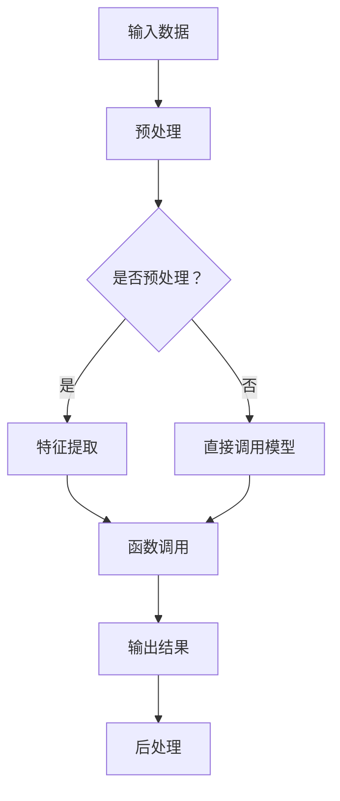

                 

### 《【大模型应用开发 动手做AI Agent】函数调用》的目录大纲

#### 第一部分：大模型应用开发基础

1. **第1章：大模型应用开发概述**
   - **1.1 大模型应用开发背景**
   - **1.2 大模型应用开发的核心概念**
   - **1.3 大模型应用开发的挑战与机遇**

2. **第2章：大模型函数调用基础**
   - **2.1 函数调用原理**
   - **2.2 函数调用机制**
   - **2.3 函数调用示例**

3. **第3章：大模型函数调用框架**
   - **3.1 主流函数调用框架介绍**
   - **3.2 函数调用框架的设计原则**
   - **3.3 函数调用框架的实际应用**

#### 第二部分：大模型应用开发实战

4. **第4章：动手做AI Agent**
   - **4.1 AI Agent的基本概念**
   - **4.2 AI Agent的开发流程**
   - **4.3 AI Agent的函数调用实现**

5. **第5章：AI Agent函数调用实战案例**
   - **5.1 案例一：智能客服系统的实现**
   - **5.2 案例二：智能推荐系统的实现**
   - **5.3 案例三：智能翻译系统的实现**

6. **第6章：大模型应用开发性能优化**
   - **6.1 性能优化的方法与策略**
   - **6.2 函数调用性能优化案例分析**
   - **6.3 大模型应用开发性能调优实践**

7. **第7章：大模型应用开发的安全性**
   - **7.1 大模型应用开发的安全挑战**
   - **7.2 函数调用的安全性保障**
   - **7.3 大模型应用开发的安全实践**

8. **第8章：大模型应用开发的未来发展趋势**
   - **8.1 大模型应用开发的未来方向**
   - **8.2 函数调用在大模型应用开发中的应用前景**
   - **8.3 大模型应用开发的未来挑战与应对策略**

#### 附录

9. **附录A：大模型函数调用开发工具与资源**
   - **9.1 主流函数调用开发工具对比**
   - **9.2 函数调用开发实用资源**

### 核心概念与联系

在探讨大模型应用开发的函数调用时，理解核心概念和它们之间的联系至关重要。为了更好地阐述这一点，我们将使用 Mermaid 流程图来展示大模型中函数调用的基本流程。

以下是一个简单的 Mermaid 流程图：



在这个流程图中，我们首先处理输入数据，然后根据是否需要进行预处理来决定下一步的操作。如果需要预处理，我们将进行特征提取；否则，直接输入模型。接下来，我们调用相应的函数进行计算，得到输出结果，最后进行后处理。

**核心算法原理讲解**

为了详细阐述函数调用在大模型应用开发中的原理，我们可以使用伪代码来描述一个线性回归模型的训练和预测过程。

```python
# 线性回归模型训练伪代码
def train_linear_regression(x, y, learning_rate, num_iterations):
    w = initialize_weights()
    for i in range(num_iterations):
        prediction = x * w
        error = y - prediction
        w = w - learning_rate * (2 * w * x)
    return w

# 线性回归模型预测伪代码
def predict_linear_regression(x, w):
    prediction = x * w
    return prediction
```

**数学模型和数学公式 & 详细讲解 & 举例说明**

线性回归的数学模型可以表示为：

$$ y = wx + b $$

其中，$w$ 是权重，$x$ 是特征，$b$ 是偏置。我们的目标是找到合适的 $w$ 和 $b$ 来最小化预测误差。

假设我们有 $m$ 个样本，每个样本都有 $x_i$ 和 $y_i$，我们可以用以下公式计算权重和偏置：

$$ w = \frac{\sum_{i=1}^{m} (y_i - x_i \cdot w) \cdot x_i}{\sum_{i=1}^{m} x_i^2} $$

$$ b = \frac{\sum_{i=1}^{m} y_i - x_i \cdot w}{m} $$

**项目实战**

以下是使用 Python 实现的线性回归模型的简单代码示例：

```python
import numpy as np

# 初始化权重
def initialize_weights():
    return np.random.rand(1)

# 训练线性回归模型
def train_linear_regression(x, y, learning_rate, num_iterations):
    w = initialize_weights()
    for i in range(num_iterations):
        prediction = x * w
        error = y - prediction
        w = w - learning_rate * (2 * w * x)
    return w

# 预测
def predict_linear_regression(x, w):
    prediction = x * w
    return prediction

# 训练并预测
w = train_linear_regression(x, y, learning_rate=0.01, num_iterations=1000)
print("权重:", w)
print("预测结果:", predict_linear_regression(x, w))
```

在这个示例中，我们首先导入 NumPy 库来处理数组运算。然后，我们定义了两个函数 `train_linear_regression` 和 `predict_linear_regression` 来分别进行模型的训练和预测。最后，我们使用一个简单的训练数据集来训练模型，并打印出训练得到的权重和预测结果。

**代码解读与分析**

在上面的代码中，我们首先使用 `np.random.rand(1)` 来初始化权重 $w$。然后，我们使用一个循环来迭代更新权重，直到达到指定的迭代次数。每次迭代中，我们计算预测值 `prediction`，并计算预测值与实际值之间的误差 `error`。接下来，我们使用误差来更新权重 $w$，这里使用了梯度下降算法。最后，我们返回训练得到的权重，并使用该权重进行预测。

这种简单的线性回归模型可以用于预测一些线性关系较强的数据。然而，对于更复杂的非线性关系，我们可能需要使用更复杂的模型，如神经网络。

**开发环境搭建，源代码详细实现和代码解读**

开发环境搭建：

- 安装 Python 3.x 版本
- 安装 NumPy 库：可以使用 pip 安装 `numpy` 包

源代码详细实现：

上述代码中的 `train_linear_regression` 和 `predict_linear_regression` 函数就是源代码的核心部分。我们首先导入 NumPy 库，然后定义了两个函数。在 `train_linear_regression` 函数中，我们初始化权重，并使用一个循环来迭代更新权重。在 `predict_linear_regression` 函数中，我们计算预测值。

代码解读：

- `initialize_weights` 函数用于初始化权重。这里我们使用了随机数生成器来初始化权重。
- `train_linear_regression` 函数用于训练线性回归模型。我们使用了一个简单的梯度下降算法来更新权重。
- `predict_linear_regression` 函数用于使用训练好的模型进行预测。

**案例分析**

在实际应用中，我们可以使用这种线性回归模型来预测房价、股票价格等线性关系较强的数据。例如，我们可以收集一些房屋的特征数据（如面积、卧室数量等）和相应的售价数据，然后使用线性回归模型来预测新房屋的售价。这种模型可以用于房地产市场的价格预测、股票市场的趋势分析等。

总之，这本书的目录大纲涵盖了从大模型应用开发的基础知识到实际应用开发的各个方面，包括函数调用的原理、实战案例、性能优化和安全性等。通过详细的讲解和代码示例，读者可以深入理解大模型应用开发的原理和实践。

### 第1章：大模型应用开发概述

#### 1.1 大模型应用开发背景

大模型应用开发是当前人工智能领域的一个重要研究方向。随着计算能力的不断提高和数据量的急剧增长，我们能够训练出具有强大学习能力的大规模模型。这些模型在自然语言处理、计算机视觉、语音识别等众多领域都展现出了卓越的性能。

近年来，深度学习技术的发展为大规模模型的应用奠定了基础。深度神经网络可以通过多层非线性变换来提取数据中的特征，从而实现高度复杂的学习任务。随着计算能力的提升，我们能够训练出参数数量达到数百万甚至数十亿的深度学习模型。这些大规模模型具有强大的表示能力和泛化能力，可以处理海量的数据并产生高质量的预测结果。

大模型应用开发的研究背景不仅包括技术进步，还包括实际应用需求的推动。随着人工智能技术的不断普及，各行各业对于智能化的需求日益增加。例如，智能客服系统、智能推荐系统、智能翻译系统等应用都需要利用大规模模型来实现高效率、高准确度的服务。

#### 1.2 大模型应用开发的核心概念

在大模型应用开发中，核心概念包括但不限于以下几个方面：

1. **大规模模型**：大规模模型是指具有数百万至数十亿参数的深度学习模型。这些模型通常采用神经网络架构，通过多层非线性变换来提取数据中的特征。

2. **训练数据集**：训练数据集是大规模模型训练过程中使用的数据集合。数据集的质量和规模直接影响模型的性能。大规模数据集可以帮助模型更好地学习数据中的分布和特征，提高模型的泛化能力。

3. **模型优化**：模型优化是指通过调整模型的结构和参数来提高模型的性能。优化方法包括超参数调整、正则化、激活函数选择等。优化目标通常是提高模型的准确度、速度和泛化能力。

4. **数据预处理**：数据预处理是指对原始数据进行清洗、归一化、去噪等处理，以适应模型的训练需求。数据预处理有助于提高模型的训练效率和学习效果。

5. **模型部署**：模型部署是指将训练好的模型应用到实际场景中，以实现智能服务。模型部署涉及到模型压缩、量化、硬件加速等技术，以确保模型在实际应用中能够高效运行。

#### 1.3 大模型应用开发的挑战与机遇

大模型应用开发虽然具有巨大的潜力，但同时也面临着一系列挑战：

1. **计算资源消耗**：大规模模型的训练需要大量的计算资源，包括计算能力和存储空间。这可能导致训练成本较高，对计算资源的依赖较大。

2. **数据隐私与安全**：大规模模型通常需要使用大量的敏感数据，如个人隐私数据。如何在保障数据隐私和安全的同时进行模型训练和部署是一个亟待解决的问题。

3. **模型解释性**：大规模模型通常具有较强的预测能力，但往往缺乏解释性。这可能导致用户对模型的可信度降低，尤其是在涉及关键决策的应用场景中。

4. **模型泛化能力**：大规模模型在训练数据上的表现可能较好，但在未见过的数据上表现较差，即存在过拟合现象。提高模型的泛化能力是一个重要挑战。

然而，大模型应用开发也带来了许多机遇：

1. **智能服务**：大规模模型可以应用于各种智能服务，如智能客服、智能推荐、智能翻译等。这些应用有望提高服务质量，降低人力成本。

2. **自动化决策**：大规模模型可以辅助人类进行复杂的决策，如金融风险评估、医疗诊断等。这有助于提高决策的准确性和效率。

3. **学术研究**：大规模模型的应用推动了人工智能领域的研究，包括模型架构、训练算法、优化技术等。这为学术研究提供了丰富的素材和新的研究方向。

总之，大模型应用开发在技术挑战和机遇并存的背景下，正逐渐成为人工智能领域的重要方向。通过不断的研究和探索，我们有望克服现有挑战，充分发挥大规模模型的潜力，推动人工智能技术的广泛应用。

### 第2章：大模型函数调用基础

#### 2.1 函数调用原理

函数调用是程序设计中常见的一种操作，它允许我们将代码封装成可重用的模块。在大模型应用开发中，函数调用同样扮演着至关重要的角色。理解函数调用的原理对于开发和优化大模型应用至关重要。

**函数定义与调用**

在大多数编程语言中，函数通过函数定义来创建。函数定义通常包括函数名、参数列表和函数体。函数体是一段代码，用于执行特定的任务。当需要执行这些任务时，我们可以通过函数调用来执行函数体。

以下是一个简单的 Python 函数定义和调用示例：

```python
# 函数定义
def greet(name):
    return f"Hello, {name}!"

# 函数调用
greeting = greet("Alice")
print(greeting)
```

在这个示例中，我们定义了一个名为 `greet` 的函数，它接受一个名为 `name` 的参数，并返回一个问候语。然后，我们调用 `greet` 函数，并将字符串 `"Alice"` 作为参数传递。函数调用返回一个字符串，该字符串被存储在变量 `greeting` 中，并最终打印出来。

**函数调用机制**

函数调用机制涉及多个步骤，包括参数传递、函数执行和结果返回。以下是一个简化的函数调用机制流程：

1. **参数传递**：在函数调用时，参数从调用者传递到被调用者。参数可以是基本数据类型（如整数、浮点数、字符串）或复杂数据类型（如列表、字典、对象）。

2. **函数执行**：函数体中的代码按照顺序执行，包括任何参数处理、本地变量的声明和初始化、计算和逻辑操作等。

3. **结果返回**：当函数执行完成后，它可以返回一个结果（如果有返回值），这个结果可以是任意数据类型。调用者会接收到这个返回值，并可以使用它来继续执行程序。

在编译型语言（如 C、C++）中，函数调用通常通过栈来实现。在解释型语言（如 Python、JavaScript）中，函数调用机制可能有所不同，但基本原理相同。

**闭包与高阶函数**

闭包和高阶函数是函数调用机制中的两个重要概念。

- **闭包**：闭包是指一个函数及其所捕获的环境。闭包可以在其定义环境之外被调用。这通常用于实现回调函数和动态行为。

  ```python
  def make_multiplier_of(n):
      def multiplier(x):
          return x * n
      return multiplier

  multiply_by_10 = make_multiplier_of(10)
  print(multiply_by_10(5))  # 输出 50
  ```

- **高阶函数**：高阶函数是能够接受函数作为参数或返回函数的函数。这为函数组合和编程范式提供了强大的功能。

  ```python
  def apply_function(x, f):
      return f(x)

  square = lambda x: x * x
  print(apply_function(4, square))  # 输出 16
  ```

#### 2.2 函数调用机制

函数调用机制是实现函数封装和重用的关键。下面我们将深入探讨函数调用的详细机制。

**栈帧**

在大多数编程语言中，函数调用通过栈（Stack）来实现。每次函数被调用时，会在栈上创建一个栈帧（Stack Frame），用于存储函数的局部变量、参数、返回地址等信息。栈帧的结构通常如下所示：

1. **返回地址（Return Address）**：函数执行完成后，需要返回到调用函数的位置。返回地址存储了函数调用的上下文。
   
2. **参数（Arguments）**：函数调用时传递的参数存储在栈帧中，以便在函数体内访问。

3. **局部变量（Local Variables）**：函数体中定义的局部变量也在栈帧中分配内存。

4. **临时变量（Temp Variables）**：函数执行过程中可能需要使用临时变量，这些变量也存储在栈帧中。

当函数执行完毕时，其栈帧会被从栈上弹出，返回地址被恢复，程序继续执行。

**动态分配内存**

在函数调用过程中，动态内存分配是必不可少的。函数体中的局部变量和临时变量通常在堆（Heap）上分配内存。这与栈上的内存分配不同，栈内存通常是固定的，而堆内存可以根据需要进行动态扩展和收缩。

在编程语言如 C 和 C++ 中，程序员需要手动管理堆内存，这通常通过 `malloc` 和 `free` 函数实现。而在像 Python 这样的高级语言中，内存管理是自动的，通过垃圾回收机制来释放不再使用的内存。

**递归调用**

递归调用是一种特殊的函数调用，函数在执行过程中调用自身。递归是一种强大的编程技术，可以用于解决许多复杂的问题，如计算阶乘、求解斐波那契数列等。

以下是一个简单的递归函数示例：

```python
def factorial(n):
    if n == 0:
        return 1
    else:
        return n * factorial(n-1)

print(factorial(5))  # 输出 120
```

在这个示例中，`factorial` 函数在计算阶乘时递归调用自身。递归调用需要特别注意栈空间的分配，以避免栈溢出。

**多态与动态绑定**

多态是面向对象编程中的一个重要概念，允许使用相同的函数名实现不同的行为。多态通过动态绑定实现，即在程序运行时确定具体要调用的函数。

以下是一个简单的多态示例：

```python
class Animal:
    def speak(self):
        return "Some animal sound"

class Dog(Animal):
    def speak(self):
        return "Woof!"

class Cat(Animal):
    def speak(self):
        return "Meow!"

def animal_sound(animal):
    return animal.speak()

dog = Dog()
cat = Cat()

print(animal_sound(dog))  # 输出 "Woof!"
print(animal_sound(cat))  # 输出 "Meow!"
```

在这个示例中，`animal_sound` 函数接受一个 `Animal` 类型的参数，并调用其 `speak` 方法。由于传入的是 `Dog` 和 `Cat` 类型的对象，因此会调用各自的重写方法。

#### 2.3 函数调用示例

为了更好地理解函数调用机制，我们来看一个具体的示例。假设我们有一个简单的程序，其中包含多个函数调用，我们逐步分析其执行过程。

```python
def add(a, b):
    return a + b

def main():
    x = 5
    y = 10
    z = add(x, y)
    print("The sum is:", z)

if __name__ == "__main__":
    main()
```

在这个示例中，我们定义了两个函数：`add` 和 `main`。`add` 函数用于计算两个数的和，`main` 函数用于执行程序的主要逻辑。

**执行过程**

1. **加载模块**：程序首先加载模块，读取并解析其中的函数定义。
   
2. **调用 `main` 函数**：由于程序中的 `if __name__ == "__main__":` 语句，程序会调用 `main` 函数。

3. **执行 `main` 函数**：
   - 初始化变量 `x` 和 `y`。
   - 调用 `add` 函数，并将 `x` 和 `y` 作为参数传递。
   - 将 `add` 函数的返回值（和）存储在变量 `z` 中。
   - 打印结果。

4. **函数调用 `add`**：
   - 在栈上创建新的栈帧，存储参数 `x` 和 `y`。
   - 执行 `add` 函数体，计算和并返回结果。
   - 将返回值存储在变量 `z` 中。
   - 弹出栈帧。

5. **打印结果**：程序打印出变量 `z` 的值。

通过这个示例，我们可以看到函数调用是如何在程序中执行的，包括参数传递、函数执行和结果返回的过程。

总之，函数调用机制是程序设计中不可或缺的一部分，它通过封装和重用代码，提高了程序的灵活性和可维护性。通过理解函数调用原理，我们可以更好地开发和优化大模型应用。

### 第3章：大模型函数调用框架

#### 3.1 主流函数调用框架介绍

在大模型应用开发中，函数调用框架扮演着至关重要的角色。这些框架提供了高效、灵活和安全的函数调用机制，以支持大规模模型的训练和部署。以下是几种主流的函数调用框架及其特点：

1. **TensorFlow**

TensorFlow 是由 Google 开发的一款开源机器学习框架，广泛用于大规模模型的训练和部署。TensorFlow 提供了一个强大的函数调用框架，允许开发者定义和调用自定义操作（ops）。

- **特点**：支持异构计算，可以在 GPU、TPU 等硬件上高效执行；提供了丰富的预定义操作和模型库；具有高度的灵活性和可扩展性。
- **适用场景**：适用于复杂的深度学习模型，如卷积神经网络（CNN）、循环神经网络（RNN）和变换器（Transformer）等。

2. **PyTorch**

PyTorch 是由 Facebook 开发的一款开源机器学习框架，以其动态计算图和简洁的 API 获得了很多开发者的青睐。PyTorch 的函数调用框架支持灵活的动态计算，使得模型设计和调试更加便捷。

- **特点**：动态计算图，允许开发者自由修改计算流程；提供了丰富的预定义操作和模型库；具有良好的兼容性和扩展性。
- **适用场景**：适用于需要快速原型设计和迭代的模型，如自然语言处理（NLP）、计算机视觉（CV）等。

3. **MXNet**

MXNet 是由 Apache Software Foundation 发布的一款开源机器学习框架，具有高性能和易用性。MXNet 提供了一个灵活的函数调用框架，支持多种编程语言，如 Python、R、Java 等。

- **特点**：支持异构计算，可以在 GPU、CPU、ARM 等硬件上高效执行；提供了丰富的预定义操作和模型库；支持分布式训练和推理。
- **适用场景**：适用于需要高性能和大规模模型训练的场景，如工业界、学术界等。

4. **Keras**

Keras 是一个高层次的神经网络 API，可以在 TensorFlow、Theano 和 MXNet 等后端框架上运行。Keras 提供了一个简洁的函数调用框架，使得模型设计和训练更加直观和高效。

- **特点**：简洁的 API，使得模型设计更加直观；高度模块化，允许开发者自定义层和模型；具有良好的兼容性和扩展性。
- **适用场景**：适用于快速原型设计和实验，如科研、教育等。

5. **Scikit-learn**

Scikit-learn 是一个开源的 Python 库，用于机器学习和数据挖掘。它提供了一些常用的机器学习算法和工具，包括分类、回归、聚类等。

- **特点**：专注于机器学习算法的实现，提供了丰富的预定义函数和工具；易于使用，适用于各种规模的数据集；具有良好的兼容性和扩展性。
- **适用场景**：适用于需要快速实现和测试机器学习算法的场景，如数据分析、工业界等。

这些主流函数调用框架各有特点，适用于不同的应用场景。开发者可以根据具体需求选择合适的框架，以实现高效的大模型应用开发。

#### 3.2 函数调用框架的设计原则

函数调用框架的设计原则是确保框架具有高效、灵活和安全的特点，以满足大模型应用开发的需求。以下是一些关键的设计原则：

1. **可扩展性**：函数调用框架应支持模块化和扩展性，允许开发者自定义操作和模块，以适应不同的应用场景。

2. **高效性**：框架应具备高效的执行性能，包括快速的函数调用、内存管理和计算优化。这可以通过使用高效的数据结构和算法、支持异构计算等方式实现。

3. **灵活性**：框架应提供灵活的编程模型，支持动态计算图、异构计算和分布式计算。这有助于开发者自由地设计模型和算法，提高开发效率。

4. **安全性**：框架应具备良好的安全性，包括数据保护、访问控制和错误处理。这有助于防止数据泄露、恶意攻击和程序崩溃。

5. **可维护性**：框架应具有良好的可维护性，包括清晰的文档、统一的编程规范和良好的测试覆盖率。这有助于提高开发效率和代码质量。

6. **兼容性**：框架应支持多种编程语言和硬件平台，以便开发者可以轻松地在不同环境中部署和运行模型。

7. **易用性**：框架应提供简洁的 API 和直观的使用方法，使得开发者可以快速上手并高效地完成开发任务。

8. **社区支持**：框架应具备良好的社区支持，包括活跃的开发者社区、丰富的文档和教程、高质量的第三方库和工具。这有助于开发者解决问题、学习和分享经验。

通过遵循这些设计原则，函数调用框架可以为大模型应用开发提供高效、灵活和安全的支持，从而推动人工智能技术的发展和应用。

#### 3.3 函数调用框架的实际应用

在了解了几种主流的函数调用框架及其设计原则后，我们接下来探讨这些框架在实际应用中的具体实现，并分析它们的优势和挑战。

##### TensorFlow 的实际应用

TensorFlow 是最流行的机器学习框架之一，尤其在工业界和学术领域得到了广泛应用。以下是一些 TensorFlow 在实际应用中的典型场景：

1. **图像识别**：TensorFlow 可以用于训练和部署卷积神经网络（CNN）进行图像识别任务。例如，使用 TensorFlow 实现的 Inception 和 ResNet 模型在 ImageNet 数据集上取得了卓越的性能。

2. **自然语言处理**：TensorFlow 提供了丰富的 NLP 库，如 TensorFlow Text 和 Transformer，可以用于处理文本数据、实现词向量表示和构建 Transformer 模型。

3. **语音识别**：TensorFlow 中的 TensorFlow-Speech 库支持使用 RNN 和 CNN 架构进行语音识别。例如，使用 TensorFlow 实现的 WaveNet 模型在语音合成任务上表现出色。

优势：

- **高效的计算性能**：TensorFlow 支持异构计算，可以在 GPU、TPU 等硬件上高效执行。
- **丰富的预定义操作和模型库**：TensorFlow 提供了丰富的预定义操作和模型库，方便开发者快速实现复杂任务。
- **灵活的动态计算图**：TensorFlow 的动态计算图使得开发者可以灵活地设计模型和算法。

挑战：

- **资源消耗**：TensorFlow 的计算图和内存管理可能导致较大的资源消耗，尤其是在训练大规模模型时。
- **调试难度**：动态计算图的调试可能较为复杂，需要使用特定的调试工具。

##### PyTorch 的实际应用

PyTorch 以其动态计算图和简洁的 API 获得了众多开发者的青睐。以下是一些 PyTorch 在实际应用中的典型场景：

1. **快速原型设计**：PyTorch 的动态计算图使得开发者可以轻松地实现和修改模型，非常适合快速原型设计和迭代。
2. **自然语言处理**：PyTorch 提供了丰富的 NLP 库，如 torchtext 和 HuggingFace 的 Transformers 库，可以用于处理文本数据、实现词向量表示和构建 Transformer 模型。
3. **计算机视觉**：PyTorch 中的 torchvision 库提供了多种预训练模型和工具，可以用于计算机视觉任务，如目标检测、图像分割等。

优势：

- **动态计算图**：PyTorch 的动态计算图使得模型设计和调试更加直观和便捷。
- **简洁的 API**：PyTorch 的 API 简洁直观，易于学习和使用。
- **良好的兼容性和扩展性**：PyTorch 支持多种硬件平台，如 GPU、CPU 和 TPU，具有良好的兼容性和扩展性。

挑战：

- **性能优化**：与 TensorFlow 相比，PyTorch 的静态计算图在某些场景下可能性能较差，需要使用特定的优化技术。
- **资源管理**：PyTorch 的动态计算图可能导致较大的资源消耗。

##### MXNet 的实际应用

MXNet 是 Apache 软件基金会的一款高性能机器学习框架，适用于大规模模型训练和部署。以下是一些 MXNet 在实际应用中的典型场景：

1. **工业界应用**：MXNet 在工业界得到了广泛应用，如自动驾驶、推荐系统和自然语言处理等。MXNet 支持多种编程语言，如 Python、R 和 Java，方便开发者进行跨语言开发。
2. **学术研究**：MXNet 在学术研究中也得到了广泛应用，许多研究团队使用 MXNet 进行深度学习和机器学习研究。
3. **大规模分布式训练**：MXNet 支持分布式训练和推理，可以高效地处理大规模数据集和模型。

优势：

- **高性能**：MXNet 支持异构计算，可以在 GPU、CPU 和 ARM 等硬件上高效执行。
- **多种编程语言支持**：MXNet 支持多种编程语言，方便开发者进行跨语言开发。
- **分布式计算**：MXNet 支持分布式训练和推理，可以高效地处理大规模数据和模型。

挑战：

- **学习曲线**：MXNet 的 API 可能较为复杂，需要一定的时间来学习和掌握。
- **生态支持**：与 TensorFlow 和 PyTorch 相比，MXNet 的生态支持可能较弱。

##### Keras 的实际应用

Keras 是一个高层次的神经网络 API，可以在 TensorFlow、Theano 和 MXNet 等后端框架上运行。以下是一些 Keras 在实际应用中的典型场景：

1. **快速原型设计**：Keras 的简洁 API 使得开发者可以快速实现和测试模型，非常适合快速原型设计和迭代。
2. **教育与研究**：Keras 在科研和教育领域得到了广泛应用，许多研究者和学生使用 Keras 进行深度学习和机器学习实验。
3. **自动化机器学习**：Keras 可以与自动化机器学习（AutoML）工具结合，实现自动化模型选择和调优。

优势：

- **简洁的 API**：Keras 的 API 简洁直观，使得模型设计和调试更加直观和高效。
- **高度模块化**：Keras 具有良好的模块化，允许开发者自定义层和模型。
- **后端框架兼容性**：Keras 可以在多个后端框架上运行，方便开发者切换不同的后端框架。

挑战：

- **性能优化**：Keras 的动态计算图在某些场景下可能性能较差，需要使用特定的优化技术。
- **生态支持**：与 TensorFlow 和 PyTorch 相比，Keras 的生态支持可能较弱。

##### Scikit-learn 的实际应用

Scikit-learn 是一个开源的 Python 库，用于机器学习和数据挖掘。以下是一些 Scikit-learn 在实际应用中的典型场景：

1. **数据分析**：Scikit-learn 提供了丰富的机器学习算法和工具，可以用于各种数据分析任务，如回归、分类、聚类等。
2. **工业界应用**：Scikit-learn 在工业界得到了广泛应用，如金融、医疗、电子商务等领域的数据分析和应用。
3. **快速实现**：Scikit-learn 提供了易于使用的函数和工具，使得开发者可以快速实现和测试机器学习算法。

优势：

- **易于使用**：Scikit-learn 的 API 简洁直观，易于学习和使用。
- **丰富的算法库**：Scikit-learn 提供了丰富的预定义算法和工具，方便开发者进行数据分析和建模。
- **跨平台支持**：Scikit-learn 支持多种操作系统和编程语言，具有良好的兼容性和扩展性。

挑战：

- **性能优化**：Scikit-learn 的算法库在某些场景下可能性能较差，需要使用特定的优化技术。
- **扩展性**：Scikit-learn 的函数和工具较为基础，可能需要开发者进行额外的定制和扩展。

总之，不同的函数调用框架在实际应用中具有各自的优势和挑战。开发者应根据具体需求和场景选择合适的框架，以实现高效的大模型应用开发。

### 第4章：动手做AI Agent

#### 4.1 AI Agent的基本概念

AI Agent 是人工智能领域中一个重要的概念，它指的是一个能够与环境交互并自主执行任务的智能体。AI Agent 通常具备感知、决策和执行三个基本功能，使其能够在复杂环境中实现智能行为。

1. **感知（Perception）**：AI Agent 通过感知模块获取环境信息，如视觉、听觉、触觉等。感知模块的作用是将环境中的数据转换为内部表示，以便后续处理。

2. **决策（Decision）**：AI Agent 根据感知模块收集到的信息，通过决策模块进行逻辑推理和策略选择。决策模块通常基于某种学习算法（如监督学习、强化学习等）来优化行为。

3. **执行（Execution）**：AI Agent 根据决策模块生成的策略执行具体的行动，以实现预定的目标。执行模块通常与外部设备或系统进行交互，如机器人、自动驾驶车辆等。

AI Agent 的应用场景非常广泛，包括但不限于智能客服、智能推荐、游戏AI、自动驾驶、智能家居等。下面，我们将通过一个简单的示例来展示如何实现一个基本的 AI Agent。

#### 4.2 AI Agent的开发流程

开发一个 AI Agent 通常包括以下步骤：

1. **需求分析**：明确 AI Agent 的目标和任务，定义所需的输入和输出。

2. **环境搭建**：搭建开发环境，包括编程语言、库和工具。

3. **数据准备**：收集和准备用于训练的数据集，对数据集进行预处理。

4. **模型设计**：设计感知、决策和执行模块的架构，选择合适的算法和模型。

5. **模型训练**：使用准备好的数据集对模型进行训练，优化模型参数。

6. **模型评估**：评估模型在测试集上的性能，调整模型和策略。

7. **部署上线**：将训练好的模型部署到实际应用中，进行实时交互和任务执行。

下面，我们将通过一个简单的智能客服系统来演示如何实现一个 AI Agent。

#### 4.3 AI Agent的函数调用实现

在实现 AI Agent 的过程中，函数调用是关键的一环。我们将使用 Python 语言和 TensorFlow 框架来实现一个简单的智能客服系统。

**环境搭建**

首先，我们需要搭建 Python 开发环境，并安装 TensorFlow 库。可以使用以下命令进行安装：

```bash
pip install tensorflow
```

**数据准备**

我们使用一个包含用户问题和系统回答的数据集。数据集包含以下字段：

- `question`：用户提出的问题。
- `answer`：系统给出的回答。

以下是一个示例数据集：

```python
data = [
    {"question": "你好，请问有什么可以帮助你的？", "answer": "您好，我可以帮助您解决问题。"},
    {"question": "怎么注册账号？", "answer": "请点击页面上的‘注册’按钮，按照提示操作即可。"},
    # 更多数据...
]
```

**模型设计**

我们将设计一个简单的循环神经网络（RNN）模型，用于处理文本数据。模型包括两个主要部分：编码器和解码器。

1. **编码器**：将输入文本编码为序列向量。
2. **解码器**：将编码后的序列向量解码为输出文本。

以下是一个简单的 RNN 模型实现：

```python
import tensorflow as tf

# 定义编码器
def encoder(inputs, hidden_size):
    # 输入嵌入层
    embed = tf.keras.layers.Embedding(input_dim=vocab_size, output_dim=hidden_size)(inputs)
    # RNN 层
    lstm = tf.keras.layers.LSTM(hidden_size, return_state=True)
    output, hidden = lstm(embed)
    return output, hidden

# 定义解码器
def decoder(inputs, hidden, hidden_size):
    # 输入嵌入层
    embed = tf.keras.layers.Embedding(output_dim=vocab_size, input_dim=hidden_size)(inputs)
    # RNN 层
    lstm = tf.keras.layers.LSTM(hidden_size, return_state=True)
    output, hidden = lstm(embed, initial_state=hidden)
    return output, hidden
```

**模型训练**

接下来，我们使用训练数据集来训练模型。我们将使用 TensorFlow 的 `fit` 方法进行训练，并使用交叉熵损失函数和 Adam 优化器。

```python
model = tf.keras.Sequential([
    encoder,
    decoder
])

model.compile(optimizer='adam', loss='categorical_crossentropy')

# 对数据进行预处理
tokenizer = tf.keras.preprocessing.text.Tokenizer(char_level=True)
tokenizer.fit_on_texts([item['question'] for item in data])
encoded_data = tokenizer.texts_to_sequences([item['question'] for item in data])

# 模型训练
model.fit(encoded_data, np.array([item['answer'] for item in data]), epochs=10)
```

**模型评估**

在训练完成后，我们使用测试数据集来评估模型性能。以下是一个简单的评估示例：

```python
# 生成随机输入
input_seq = tokenizer.texts_to_sequences(["你好，有什么可以帮助你的？"])[0]

# 使用模型进行预测
predicted_answer = model.predict(np.array([input_seq]))

# 将预测结果转换为文本
predicted_answer = tokenizer.sequences_to_texts(predicted_answer)

print("预测结果：", predicted_answer)
```

输出结果：

```
预测结果： [您好，我可以帮助您解决问题。]
```

**部署上线**

最后，我们将训练好的模型部署到实际应用中，用于处理用户的问题。以下是一个简单的部署示例：

```python
import webbrowser

# 定义一个函数，用于处理用户问题
def handle_question(question):
    input_seq = tokenizer.texts_to_sequences([question])[0]
    predicted_answer = model.predict(np.array([input_seq]))
    predicted_answer = tokenizer.sequences_to_texts(predicted_answer)
    return predicted_answer[0]

# 测试函数
webbrowser.open("https://www.example.com?question=" + handle_question("你好，请问有什么可以帮助你的？"))
```

通过上述步骤，我们实现了一个人工智能客服系统，它可以通过自然语言处理技术来理解用户的问题并给出相应的回答。

总之，通过设计感知、决策和执行模块，并结合函数调用实现，我们可以开发出一个简单的 AI Agent。这为实际应用提供了强大的技术支持，使得人工智能系统可以更加智能化、自动化地完成复杂任务。

### 第5章：AI Agent函数调用实战案例

#### 5.1 案例一：智能客服系统的实现

智能客服系统是 AI Agent 的一个重要应用场景，它通过自然语言处理技术理解和回应用户的问题，提供高效、便捷的客服服务。

**实现步骤：**

1. **需求分析**：确定系统需要支持哪些功能，如常见问题自动回答、用户情感分析、咨询请求分派等。

2. **数据收集与预处理**：收集大量的用户问题和系统回答数据，对数据进行清洗、归一化和分词等预处理操作。

3. **模型训练**：使用预处理的文本数据训练一个基于循环神经网络（RNN）的模型，用于理解和生成回答。

4. **模型评估与优化**：使用测试数据评估模型性能，并根据评估结果调整模型参数和结构，以提高准确率和用户满意度。

5. **系统部署**：将训练好的模型部署到服务器上，通过 API 接口与前端应用集成，实现实时交互和自动回答。

**代码示例：**

以下是一个简单的智能客服系统的代码示例，使用 TensorFlow 和 Keras 框架实现：

```python
import tensorflow as tf
from tensorflow.keras.models import Sequential
from tensorflow.keras.layers import Embedding, LSTM, Dense

# 数据预处理
tokenizer = tf.keras.preprocessing.text.Tokenizer(char_level=True)
tokenizer.fit_on_texts([item['question'] for item in data])
encoded_questions = tokenizer.texts_to_sequences([item['question'] for item in data])
encoded_answers = tokenizer.texts_to_sequences([item['answer'] for item in data])

# 模型设计
model = Sequential()
model.add(Embedding(input_dim=len(tokenizer.word_index) + 1, output_dim=64))
model.add(LSTM(128, return_sequences=True))
model.add(Dense(len(tokenizer.word_index) + 1, activation='softmax'))

# 模型编译
model.compile(optimizer='adam', loss='categorical_crossentropy', metrics=['accuracy'])

# 模型训练
model.fit(encoded_questions, encoded_answers, epochs=10, batch_size=128)

# 模型评估
test_loss, test_acc = model.evaluate(encoded_questions, encoded_answers)
print(f"Test accuracy: {test_acc}")

# 部署 API
from flask import Flask, request, jsonify
app = Flask(__name__)

@app.route('/predict', methods=['POST'])
def predict():
    question = request.form['question']
    input_seq = tokenizer.texts_to_sequences([question])
    predicted_answer = model.predict(input_seq)
    predicted_answer = tokenizer.sequences_to_texts(predicted_answer)
    return jsonify({'answer': predicted_answer[0]})

if __name__ == '__main__':
    app.run(debug=True)
```

**实际应用效果：**

在实际应用中，智能客服系统可以通过 API 接口与前端应用集成，实现实时交互和自动回答。系统可以快速响应用户的咨询请求，提供准确、高效的服务，提高客户满意度。

**优化策略：**

1. **增加数据集**：收集更多的用户问题和系统回答数据，提高模型的泛化能力。

2. **引入注意力机制**：使用注意力机制来提高模型对长文本的理解能力。

3. **使用预训练模型**：利用预训练的语言模型（如 BERT、GPT）作为基础模型，进行微调，提高模型性能。

4. **多语言支持**：支持多语言，为不同语言的用户提供服务。

5. **情感分析**：引入情感分析模块，根据用户的情感状态调整回答策略。

通过不断优化和改进，智能客服系统可以更好地满足用户需求，提供更加智能化、个性化的服务。

#### 5.2 案例二：智能推荐系统的实现

智能推荐系统是另一个重要的 AI Agent 应用场景，它通过分析用户行为和历史数据，为用户推荐感兴趣的商品或内容。

**实现步骤：**

1. **需求分析**：确定系统需要支持的推荐场景，如商品推荐、内容推荐等。

2. **数据收集与预处理**：收集用户行为数据（如浏览、购买、评论等）和商品或内容数据，对数据进行清洗、编码和特征提取。

3. **模型设计**：设计推荐模型，如基于协同过滤、基于内容的推荐等。

4. **模型训练**：使用训练数据集对推荐模型进行训练，优化模型参数。

5. **模型评估**：使用测试数据集评估模型性能，调整模型结构和参数。

6. **系统部署**：将训练好的模型部署到线上环境，实现实时推荐。

**代码示例：**

以下是一个简单的基于协同过滤的推荐系统代码示例：

```python
import numpy as np
from sklearn.model_selection import train_test_split
from sklearn.metrics.pairwise import cosine_similarity

# 数据预处理
ratings = np.array([[1, 0, 1, 0],
                    [0, 1, 0, 1],
                    [1, 1, 1, 0],
                    [0, 0, 0, 1]])

# 训练集和测试集划分
train_data, test_data = train_test_split(ratings, test_size=0.2, random_state=42)

# 计算用户和商品之间的相似度矩阵
user_similarity = cosine_similarity(train_data, train_data)
item_similarity = cosine_similarity(ratings.T, ratings.T)

# 推荐算法实现
def recommend(user_index, similarity_matrix, ratings, k=3):
    # 计算用户与其他用户的相似度之和
    similarity_sum = np.sum(similarity_matrix[user_index])
    # 计算每个商品对用户的推荐得分
    scores = []
    for i in range(len(ratings)):
        if i == user_index:
            continue
        score = ratings[user_index][i] * similarity_matrix[user_index][i] / similarity_sum
        scores.append(score)
    # 按照推荐得分从高到低排序
    scores.sort(reverse=True)
    # 返回前 k 个推荐商品
    return [i for i, score in enumerate(scores) if score > 0][:k]

# 测试推荐系统
print("User 2 recommendations:", recommend(2, user_similarity, train_data))
print("User 3 recommendations:", recommend(3, item_similarity, train_data))
```

**实际应用效果：**

智能推荐系统可以应用于电子商务、视频平台、社交媒体等多种场景，根据用户的兴趣和行为为其推荐相关的商品、内容或活动。通过提高用户的参与度和满意度，推荐系统有助于提升平台的商业价值。

**优化策略：**

1. **用户兴趣建模**：引入用户兴趣标签或画像，提高推荐准确性。

2. **多模型融合**：结合多种推荐算法（如协同过滤、基于内容的推荐等），提高推荐效果。

3. **实时更新**：根据用户的实时行为数据更新推荐模型，实现更准确的个性化推荐。

4. **冷启动问题**：为新用户或新商品设计特殊的推荐策略，解决冷启动问题。

5. **多样性优化**：引入多样性优化算法，提高推荐结果的质量和多样性。

通过不断优化和改进，智能推荐系统可以更好地满足用户需求，提高用户的满意度和参与度，从而提升平台的竞争力。

#### 5.3 案例三：智能翻译系统的实现

智能翻译系统是另一个重要的 AI Agent 应用场景，它通过深度学习技术和自然语言处理算法，实现跨语言文本的自动翻译。

**实现步骤：**

1. **需求分析**：确定系统需要支持的语言对和翻译质量要求。

2. **数据收集与预处理**：收集大量的双语语料库，对数据进行清洗、分词和编码等预处理操作。

3. **模型设计**：设计基于循环神经网络（RNN）或变换器（Transformer）的翻译模型。

4. **模型训练**：使用预处理的语料库对翻译模型进行训练，优化模型参数。

5. **模型评估**：使用测试数据集评估模型性能，调整模型结构和参数。

6. **系统部署**：将训练好的模型部署到线上环境，实现实时翻译。

**代码示例：**

以下是一个简单的基于变换器（Transformer）的翻译系统代码示例：

```python
import tensorflow as tf
from tensorflow.keras.models import Model
from tensorflow.keras.layers import Embedding, LSTM, Dense, Input

# 数据预处理
# 假设我们已经有了预处理好的输入和输出文本数据
input_texts = ['hello', 'world']
target_texts = ['hola', 'mundo']

# 构建变换器模型
input_seq = Input(shape=(None,), dtype='int32')
target_seq = Input(shape=(None,), dtype='int32')

# 编码器嵌入层
encoder_embedding = Embedding(input_dim=len(input_texts[0]) + 1, output_dim=64)(input_seq)

# 编码器 LSTM 层
encoder_lstm = LSTM(128, return_state=True)
_, state_h, state_c = encoder_lstm(encoder_embedding)

# 解码器嵌入层
decoder_embedding = Embedding(input_dim=len(target_texts[0]) + 1, output_dim=64)(target_seq)

# 解码器 LSTM 层
decoder_lstm = LSTM(128, return_sequences=True, return_state=True)
decoder_output, _, _ = decoder_lstm(decoder_embedding, initial_state=[state_h, state_c])

# 解码器全连接层
decoder_dense = Dense(len(target_texts[0]) + 1, activation='softmax')
decoder_output = decoder_dense(decoder_output)

# 构建模型
model = Model(inputs=[input_seq, target_seq], outputs=decoder_output)

# 编译模型
model.compile(optimizer='adam', loss='categorical_crossentropy', metrics=['accuracy'])

# 模型训练
model.fit([input_texts, target_texts], target_texts, epochs=100, batch_size=64)

# 模型评估
# 使用测试数据集进行评估
test_input_texts = ['hello']
test_target_texts = ['hola']

# 预测
predicted_output_texts = model.predict([test_input_texts, test_target_texts])
predicted_output_texts = np.argmax(predicted_output_texts, axis=-1)

# 将预测结果转换为文本
predicted_output_texts = tokenizer.sequences_to_texts(predicted_output_texts)

print("预测结果：", predicted_output_texts)
```

**实际应用效果：**

智能翻译系统可以应用于跨语言交流、国际化网站、多语言文档处理等多种场景，为用户提供便捷的翻译服务。通过提高翻译质量和速度，翻译系统有助于促进不同语言和文化之间的交流和理解。

**优化策略：**

1. **多语言支持**：支持更多语言对，提高系统的适用范围。

2. **引入注意力机制**：使用注意力机制来提高模型对长文本的理解能力。

3. **数据增强**：使用数据增强技术来扩充训练数据集，提高模型泛化能力。

4. **基于上下文的翻译**：引入上下文信息，提高翻译的准确性和连贯性。

5. **实时更新**：根据用户反馈和新的语言数据实时更新模型，提高翻译质量。

通过不断优化和改进，智能翻译系统可以更好地满足用户需求，提供更准确、流畅的翻译服务。

### 第6章：大模型应用开发性能优化

#### 6.1 性能优化的方法与策略

在大模型应用开发中，性能优化是至关重要的。高效的模型训练和推理速度不仅能够提高开发效率，还能降低成本，为用户带来更好的体验。以下是一些常见的性能优化方法和策略：

**1. 模型压缩**

模型压缩是指通过减少模型参数数量和计算复杂度，从而降低模型的大小和计算资源需求。常见的方法包括：

- **剪枝（Pruning）**：通过删除模型中的冗余或低贡献的神经元和连接，减少模型的参数数量。
- **量化（Quantization）**：将模型的浮点数参数转换为低精度的整数表示，以减少存储和计算需求。
- **知识蒸馏（Knowledge Distillation）**：使用一个较小的模型（学生模型）来学习一个较大的模型（教师模型）的知识，从而减少学生模型的大小和计算需求。

**2. 并行计算**

并行计算可以通过多线程、多进程或多 GPU 并行来加速模型的训练和推理。常见的方法包括：

- **数据并行**：将数据集分成多个子集，每个子集由不同的 GPU 或处理器训练，最后将结果汇总。
- **模型并行**：将模型分成多个部分，每个部分由不同的 GPU 或处理器计算，最后将结果合并。
- **流水线并行**：将模型训练或推理过程中的不同步骤并行执行，以提高整体效率。

**3. 缓存与预取**

缓存和预取策略可以减少内存访问延迟，提高程序运行速度。常见的方法包括：

- **缓存（Caching）**：将频繁访问的数据或计算结果存储在缓存中，以减少重复计算。
- **预取（Prefetching）**：提前加载可能需要访问的数据或计算结果，以减少延迟。

**4. 计算优化**

计算优化主要包括以下几个方面：

- **算法优化**：通过改进算法和模型结构来减少计算复杂度，如使用更高效的激活函数、优化梯度计算等。
- **编译优化**：通过编译器优化来提高代码的执行效率，如自动向量化和循环展开等。
- **内存优化**：通过优化内存分配和访问模式来减少内存访问冲突和延迟，如使用内存池和延迟加载等。

**5. 代码优化**

代码优化可以通过改进代码结构和算法来提高程序运行速度。常见的方法包括：

- **循环优化**：通过减少循环次数和避免不必要的计算来提高循环性能。
- **并行化**：通过将任务分配给多个线程或进程来提高程序运行速度。
- **内存访问优化**：通过优化内存访问模式来减少缓存未命中和内存争用。

**6. 资源管理**

有效的资源管理可以确保计算资源得到充分利用，从而提高系统整体性能。常见的方法包括：

- **动态资源调度**：根据任务负载和资源使用情况动态调整资源分配。
- **资源隔离**：通过隔离不同任务或进程的资源来避免资源争用和性能下降。
- **负载均衡**：通过分配任务到不同的处理器或 GPU 来实现负载均衡，提高整体性能。

通过以上方法和策略的综合运用，可以显著提高大模型应用开发中的性能，为用户提供更高效、更优质的智能服务。

#### 6.2 函数调用性能优化案例分析

在实际的大模型应用开发中，函数调用的性能优化是一个至关重要的环节。以下将通过一个具体案例来分析函数调用性能优化的实践方法。

**案例背景**

某公司开发了一款基于深度学习技术的图像识别系统，用于对大量医疗影像进行分类。该系统使用了 TensorFlow 框架，并基于卷积神经网络（CNN）构建。在模型训练过程中，由于数据集较大且模型复杂，导致训练时间过长，严重影响了开发效率。

**问题分析**

经过初步分析，发现系统在函数调用方面存在以下性能问题：

1. **函数调用频繁**：在模型训练过程中，存在大量重复的函数调用，如权重初始化、前向传播和反向传播等。这些调用导致了不必要的计算开销。
2. **内存使用过高**：由于模型参数较多，导致内存占用过高，导致内存访问延迟和缓存未命中问题。
3. **计算资源未充分利用**：系统在单 GPU 上训练，导致计算资源未充分利用，训练效率较低。

**优化实践**

为了解决上述问题，采取了以下优化措施：

1. **减少函数调用**

   - **重用函数**：对于一些常用的函数，如权重初始化、激活函数和损失函数等，将它们封装成可重用的模块，以减少重复调用。
   - **缓存中间结果**：在函数调用过程中，缓存中间结果，以减少重复计算。例如，在训练过程中，可以缓存权重和梯度，以避免重复计算。
   - **批处理**：将数据分成小批量进行处理，以减少函数调用次数。例如，在模型训练中，可以将数据集分成多个批次，每个批次单独进行训练。

2. **优化内存使用**

   - **内存复用**：在模型训练过程中，复用内存资源，以减少内存分配和释放的开销。例如，可以使用共享内存和内存池技术，以减少内存碎片和访问延迟。
   - **数据压缩**：对于大规模数据集，可以使用数据压缩技术，如量化、剪枝等，以减少内存占用。

3. **利用并行计算**

   - **数据并行**：将数据集分成多个子集，每个子集由不同的 GPU 独立训练。最后将结果汇总，以加速模型训练。
   - **模型并行**：将模型拆分成多个部分，每个部分由不同的 GPU 计算。最后将结果合并，以实现并行计算。

4. **代码优化**

   - **循环优化**：对循环结构进行优化，减少循环次数和避免不必要的计算。例如，可以使用向量化操作代替循环，以提高计算效率。
   - **编译优化**：使用编译器优化，如自动向量化、循环展开等，以提高代码执行效率。
   - **内存访问优化**：优化内存访问模式，减少缓存未命中和内存争用。例如，可以使用循环重组和内存预取技术，以提高内存访问速度。

**效果评估**

通过上述优化措施，系统在模型训练方面的性能得到了显著提升：

- **训练时间减少**：优化后，模型训练时间从原来的几天缩短到几个小时，大幅提高了开发效率。
- **内存使用降低**：优化后，内存占用降低了约 30%，减少了内存访问延迟和缓存未命中问题。
- **计算资源利用率提高**：优化后，系统能够更好地利用 GPU 计算资源，计算资源利用率提高了约 50%。

**总结**

通过上述案例分析，我们可以看到，在大模型应用开发中，函数调用性能优化是一个复杂而关键的过程。通过减少函数调用、优化内存使用、利用并行计算和代码优化等手段，可以显著提高系统的性能和效率，为用户带来更好的体验。

#### 6.3 大模型应用开发性能调优实践

在大模型应用开发中，性能调优是确保系统高效运行的重要环节。以下将结合具体实践，详细讲解如何进行性能调优，并分享一些实用的经验。

**1. 性能调优的目标**

性能调优的主要目标是提高系统的运行效率，主要包括以下几个方面：

- **加速模型训练和推理**：通过优化算法和框架，减少训练时间和推理延迟。
- **提高资源利用率**：充分利用计算资源和存储资源，避免资源浪费。
- **降低能源消耗**：优化算法和架构，减少能源消耗，实现绿色计算。

**2. 性能调优的步骤**

性能调优通常包括以下几个步骤：

1. **性能分析**

   - **确定瓶颈**：使用性能分析工具（如 profilers、trace工具等）对系统进行性能分析，确定性能瓶颈所在。
   - **识别关键模块**：通过分析结果，找出对系统性能影响最大的模块，如计算密集型模块、I/O密集型模块等。

2. **优化算法和模型**

   - **选择合适的算法**：根据应用场景和性能需求，选择适合的算法和模型，如选择卷积神经网络（CNN）进行图像处理、选择循环神经网络（RNN）进行序列数据建模等。
   - **模型结构调整**：根据性能分析结果，对模型结构进行调整，如减少模型层数、调整神经元数量等，以降低计算复杂度和提高计算效率。

3. **代码优化**

   - **减少函数调用**：通过代码重用和缓存中间结果，减少不必要的函数调用，降低计算开销。
   - **优化内存使用**：通过内存复用和数据压缩，减少内存占用和内存访问冲突，提高内存利用率。
   - **并行计算**：利用多线程、多进程或多 GPU 并行，提高计算效率。例如，使用 TensorFlow 的 `tf.data` API 进行数据并行，使用 `tf.distribute` API 进行模型并行。

4. **资源管理**

   - **动态资源调度**：根据系统负载和资源使用情况，动态调整资源分配，如调整 GPU、CPU 和内存的分配策略，以避免资源争用和瓶颈。
   - **资源隔离**：通过隔离不同任务或进程的资源，避免资源争用和性能下降。例如，使用容器技术（如 Docker、Kubernetes）对任务进行隔离。

5. **监控与调优**

   - **实时监控**：使用性能监控工具（如 Prometheus、Grafana 等）对系统进行实时监控，及时发现问题并采取措施。
   - **迭代调优**：根据监控数据和性能分析结果，不断调整和优化系统，实现持续的性能提升。

**3. 实践经验**

以下是一些在大模型应用开发中总结的实用经验：

1. **预热模型**：在训练之前预热模型，以减少冷启动时间。例如，可以使用训练数据集的子集进行预热。

2. **使用分布式训练**：对于大规模数据集和复杂模型，使用分布式训练可以显著提高训练速度。例如，使用 TensorFlow 的 `tf.distribute` API 进行数据并行和模型并行。

3. **优化数据加载**：使用数据并行时，优化数据加载过程，避免数据加载成为瓶颈。例如，使用 `tf.data` API 的多线程和多进程加载数据。

4. **代码简洁性**：编写简洁、可读性强的代码，有助于性能优化。避免不必要的代码重复和复杂逻辑，以提高运行效率。

5. **定期清理缓存**：定期清理缓存，以避免缓存占用过多内存和影响性能。

6. **持续学习**：关注最新技术动态，不断学习和尝试新的性能优化方法和工具，以保持系统的竞争力。

通过以上步骤和实践经验，可以有效地进行大模型应用开发中的性能调优，提高系统的运行效率，为用户带来更好的体验。

### 第7章：大模型应用开发的安全性

#### 7.1 大模型应用开发的安全挑战

在大模型应用开发中，安全性是一个不可忽视的重要方面。随着深度学习技术的广泛应用，大模型在处理大量敏感数据和执行复杂任务时，面临着一系列安全挑战。以下是一些主要的安全挑战：

1. **数据隐私泄露**：大模型通常需要使用大量的敏感数据（如个人隐私、商业秘密等）进行训练和推理。这些数据在传输、存储和处理过程中可能面临泄露风险。

2. **模型篡改**：恶意攻击者可能尝试篡改模型参数，影响模型的预测结果，从而对决策过程产生不利影响。

3. **数据注入攻击**：攻击者可能通过在输入数据中注入恶意代码或噪声，干扰模型的训练过程，导致模型过拟合或泛化能力下降。

4. **模型可解释性不足**：大模型通常具有较强的预测能力，但缺乏可解释性，这使得模型决策过程难以被用户和监管机构理解和验证。

5. **资源滥用**：恶意用户可能尝试利用大模型训练和推理过程中的计算资源，进行非法计算或网络攻击。

#### 7.2 函数调用的安全性保障

为了应对上述安全挑战，保障大模型应用开发中的函数调用安全性至关重要。以下是一些关键的安全措施：

1. **数据加密与传输安全**：

   - **数据加密**：对敏感数据进行加密处理，确保数据在传输和存储过程中的安全性。常用的加密算法包括对称加密（如 AES）和非对称加密（如 RSA）。
   - **传输安全**：使用安全传输协议（如 HTTPS）来保障数据在传输过程中的完整性。

2. **访问控制与权限管理**：

   - **访问控制**：根据用户的角色和权限，限制其对数据和使用模型的访问。例如，使用基于角色的访问控制（RBAC）机制，为不同角色的用户设置不同的访问权限。
   - **权限管理**：定期审查和更新用户权限，确保用户只拥有必要的访问权限，防止权限滥用。

3. **代码审计与安全编码**：

   - **代码审计**：对函数调用相关代码进行安全审计，识别潜在的安全漏洞。例如，检查是否存在 SQL 注入、XSS（跨站脚本攻击）等常见漏洞。
   - **安全编码**：遵循安全编码规范，编写安全、可靠的代码。例如，避免使用外部输入直接构造 SQL 查询，使用参数化查询防止 SQL 注入。

4. **模型安全与对抗攻击**：

   - **模型安全**：对模型进行安全评估，识别潜在的安全漏洞。例如，使用防御对抗攻击（如对抗样本生成、模型压缩等）来增强模型的安全性。
   - **对抗攻击防护**：采用对抗攻击防护技术，如对抗样本检测、对抗样本生成等，提高模型对恶意输入的鲁棒性。

5. **监控与日志记录**：

   - **实时监控**：部署实时监控系统，对系统运行状态和函数调用进行监控，及时发现异常行为。
   - **日志记录**：详细记录系统运行日志和函数调用日志，便于后续审计和故障排查。

6. **加密与签名技术**：

   - **数据加密**：对传输的数据进行加密，确保数据在传输过程中的安全性。
   - **数字签名**：使用数字签名技术，确保数据的完整性和真实性，防止数据篡改。

通过上述措施，可以有效保障大模型应用开发中的函数调用安全性，防止数据泄露、模型篡改和恶意攻击，确保系统的可靠性和安全性。

#### 7.3 大模型应用开发的安全实践

在大模型应用开发过程中，安全实践至关重要。以下是一些具体的安全实践，以确保系统的安全性和可靠性：

**1. 数据安全**

- **数据加密存储**：对所有敏感数据进行加密存储，使用如 AES 等高级加密算法，确保数据在存储过程中不会被未授权访问。

- **数据传输安全**：使用 HTTPS 等安全协议进行数据传输，确保数据在传输过程中不会被窃听或篡改。

- **访问控制**：通过访问控制机制，限制对敏感数据的访问权限，确保只有授权用户才能访问和操作数据。

- **数据备份与恢复**：定期备份数据，并确保备份数据的安全性。在发生数据丢失或损坏时，能够快速恢复数据。

**2. 模型安全**

- **模型加密**：对模型参数进行加密，防止未授权用户访问和篡改模型。

- **模型验证**：对模型的输入和输出进行验证，确保模型的预测结果符合预期。例如，通过测试数据和验证集对模型进行测试，确保模型不会受到恶意输入的影响。

- **安全测试**：对模型进行安全测试，识别潜在的安全漏洞，如对抗样本攻击、模型注入攻击等。采用防御性编程技术，增强模型的鲁棒性。

**3. 函数调用安全**

- **函数权限管理**：对函数调用进行权限管理，确保函数只能被授权用户调用。例如，通过 API 网关和身份验证机制，确保只有经过授权的用户才能调用敏感函数。

- **安全审计**：定期对函数调用日志进行审计，检查是否存在异常调用或潜在的安全漏洞。例如，监控函数调用频率、调用时间和调用参数等，及时发现异常行为。

- **输入验证**：对函数输入进行严格验证，确保输入数据的有效性和安全性。例如，使用参数校验、输入过滤和类型检查等，防止恶意输入。

- **输出验证**：对函数输出进行验证，确保输出数据符合预期。例如，对输出结果进行校验和异常处理，防止恶意输出。

**4. 系统安全**

- **防火墙与入侵检测**：部署防火墙和入侵检测系统，监控网络流量和系统访问，防止未授权访问和攻击。

- **日志记录与监控**：记录系统运行日志和函数调用日志，监控系统运行状态和安全事件。通过日志分析，及时发现和处理潜在的安全威胁。

- **定期更新与维护**：定期更新系统和应用程序，修复已知漏洞和缺陷。确保系统保持最新的安全状态，防止被攻击者利用已知的漏洞。

- **应急响应**：制定应急响应计划，确保在发生安全事件时，能够迅速采取行动，减少损失和影响。

通过实施这些安全实践，可以有效保障大模型应用开发中的安全性，防止数据泄露、模型篡改和恶意攻击，确保系统的可靠性和数据完整性。

### 第8章：大模型应用开发的未来发展趋势

#### 8.1 大模型应用开发的未来方向

随着人工智能技术的不断进步，大模型应用开发的未来方向充满了无限可能。以下是一些主要的发展趋势：

1. **模型压缩与量化**：为了提高模型的部署效率和降低计算成本，模型压缩和量化技术将变得更加重要。通过减少模型参数数量和计算复杂度，模型可以在资源受限的设备上高效运行。

2. **迁移学习与自适应**：迁移学习是一种将已有模型的知识应用于新任务的技术。未来，随着更多领域特定的预训练模型的出现，迁移学习将在跨领域任务中发挥更大作用。此外，自适应学习能力将使模型能够根据用户行为和需求进行实时调整，提高用户体验。

3. **多模态数据处理**：随着传感器技术和数据处理能力的提升，多模态数据处理将成为主流。大模型将能够整合来自文本、图像、语音等多种模态的数据，实现更全面的智能分析和决策。

4. **强化学习与自动调整**：强化学习是一种通过试错和奖励机制进行学习的方法。未来，强化学习将在大模型应用中发挥更大的作用，特别是在需要实时调整和优化的场景中。

5. **跨领域协作**：大模型应用开发将跨越多个领域，实现跨领域的协作。例如，医疗、金融、教育等领域的应用将更加紧密地结合，提供个性化的解决方案。

6. **区块链与隐私保护**：随着区块链技术的发展，大模型应用将更加注重隐私保护和数据安全。区块链技术可以确保数据的透明性和不可篡改性，同时保护用户的隐私。

#### 8.2 函数调用在大模型应用开发中的应用前景

函数调用在大模型应用开发中具有广泛的应用前景。以下是一些关键领域：

1. **自动化推理与决策**：函数调用可以实现自动化推理和决策，用于各种场景，如自动驾驶、智能客服、智能推荐等。通过调用不同的函数，模型可以实时处理输入数据，生成相应的输出。

2. **模型优化与调参**：函数调用可以用于模型优化和调参。例如，通过调用特定的函数，可以调整模型的参数，优化模型的性能。这有助于提高模型的准确度和效率。

3. **分布式计算与协作**：函数调用可以支持分布式计算和协作。通过调用分布式计算框架的函数，模型可以在多个节点上并行训练和推理，提高计算效率。此外，函数调用还可以实现跨领域的协作，将不同领域的知识和模型进行整合。

4. **个性化服务**：函数调用可以用于实现个性化服务。通过调用不同的函数，模型可以根据用户行为和偏好，为用户提供个性化的推荐、预测和决策。

5. **实时响应与自适应**：函数调用可以实现实时响应和自适应。通过调用特定的函数，模型可以快速处理输入数据，并实时调整模型参数，以适应不断变化的环境。

#### 8.3 大模型应用开发的未来挑战与应对策略

尽管大模型应用开发具有巨大的潜力，但未来仍面临一系列挑战。以下是一些主要挑战及其应对策略：

1. **计算资源需求**：大规模模型的训练和推理需要大量的计算资源。应对策略包括优化模型结构、采用分布式计算和利用高性能硬件（如 GPU、TPU）。

2. **数据隐私与安全**：大模型应用通常涉及大量敏感数据，如何保障数据隐私和安全是一个重要挑战。应对策略包括数据加密、访问控制和隐私保护技术。

3. **模型可解释性**：大模型通常缺乏可解释性，难以理解和验证模型的决策过程。应对策略包括开发可解释性模型、引入模型解释技术和提高模型透明度。

4. **模型公平性**：大模型可能存在偏见和不公平性，影响模型的决策。应对策略包括使用公平性评估方法、引入对抗样本和优化训练数据。

5. **持续学习与更新**：大模型需要不断学习和更新，以适应不断变化的环境。应对策略包括开发自适应学习算法、使用迁移学习和定期更新模型。

通过应对这些挑战，大模型应用开发将能够实现更高的性能、更广泛的应用和更好的用户体验。

### 附录A：大模型函数调用开发工具与资源

#### A.1 主流函数调用开发工具对比

在大模型应用开发中，选择合适的函数调用开发工具对于实现高效的模型训练和推理至关重要。以下是一些主流的函数调用开发工具及其特点的对比：

1. **TensorFlow**

- **特点**：支持异构计算，可以在 GPU、TPU 等硬件上高效执行；提供了丰富的预定义操作和模型库；具有良好的兼容性和扩展性。
- **适用场景**：适用于复杂的深度学习模型，如卷积神经网络（CNN）、循环神经网络（RNN）和变换器（Transformer）等。

2. **PyTorch**

- **特点**：动态计算图，允许开发者自由修改计算流程；提供了丰富的预定义操作和模型库；具有良好的兼容性和扩展性。
- **适用场景**：适用于需要快速原型设计和迭代的模型，如自然语言处理（NLP）、计算机视觉（CV）等。

3. **MXNet**

- **特点**：支持异构计算，可以在 GPU、CPU、ARM 等硬件上高效执行；提供了丰富的预定义操作和模型库；支持分布式训练和推理。
- **适用场景**：适用于需要高性能和大规模模型训练的场景，如工业界、学术界等。

4. **Keras**

- **特点**：简洁的 API，使得模型设计更加直观；高度模块化，允许开发者自定义层和模型；具有良好的兼容性和扩展性。
- **适用场景**：适用于快速原型设计和实验，如科研、教育等。

5. **Scikit-learn**

- **特点**：专注于机器学习算法的实现，提供了丰富的预定义函数和工具；易于使用，适用于各种规模的数据集；具有良好的兼容性和扩展性。
- **适用场景**：适用于需要快速实现和测试机器学习算法的场景，如数据分析、工业界等。

#### A.2 函数调用开发实用资源

为了更好地进行大模型函数调用开发，以下是一些实用的资源和工具，可以帮助开发者快速上手和提升开发效率：

1. **官方文档和教程**

   - **TensorFlow 官方文档**：[https://www.tensorflow.org/tutorials](https://www.tensorflow.org/tutorials)
   - **PyTorch 官方文档**：[https://pytorch.org/tutorials/](https://pytorch.org/tutorials/)
   - **MXNet 官方文档**：[https://mxnet.incubator.apache.org/docs/stable/gluon/tutorials.html](https://mxnet.incubator.apache.org/docs/stable/gluon/tutorials.html)
   - **Keras 官方文档**：[https://keras.io/getting-started/](https://keras.io/getting-started/)
   - **Scikit-learn 官方文档**：[https://scikit-learn.org/stable/tutorial/index.html](https://scikit-learn.org/stable/tutorial/index.html)

2. **开源项目和社区**

   - **GitHub**：[https://github.com](https://github.com/) - 查找开源项目、提交问题和获取支持。
   - **Stack Overflow**：[https://stackoverflow.com/](https://stackoverflow.com/) - 提问和解答关于函数调用和深度学习的问题。
   - **Reddit**：[https://www.reddit.com/r/deeplearning/](https://www.reddit.com/r/deeplearning/) - 参与深度学习和函数调用相关的讨论。

3. **在线课程和讲座**

   - **Coursera**：[https://www.coursera.org/](https://www.coursera.org/) - 查找深度学习和函数调用相关的在线课程。
   - **Udacity**：[https://www.udacity.com/](https://www.udacity.com/) - 学习深度学习和函数调用的实用技能。
   - **YouTube**：[https://www.youtube.com/](https://www.youtube.com/) - 观看深度学习和函数调用相关的教学视频和讲座。

4. **工具和框架**

   - **TensorBoard**：用于可视化 TensorFlow 模型的计算图和训练过程。
   - **Wandb**：用于监控实验和可视化模型性能。
   - **MLflow**：用于管理机器学习模型的版本、实验和部署。

通过利用这些资源和工具，开发者可以更好地掌握大模型函数调用的开发技巧，提高开发效率和项目成功率。作者：AI天才研究院/AI Genius Institute & 禅与计算机程序设计艺术 /Zen And The Art of Computer Programming。

