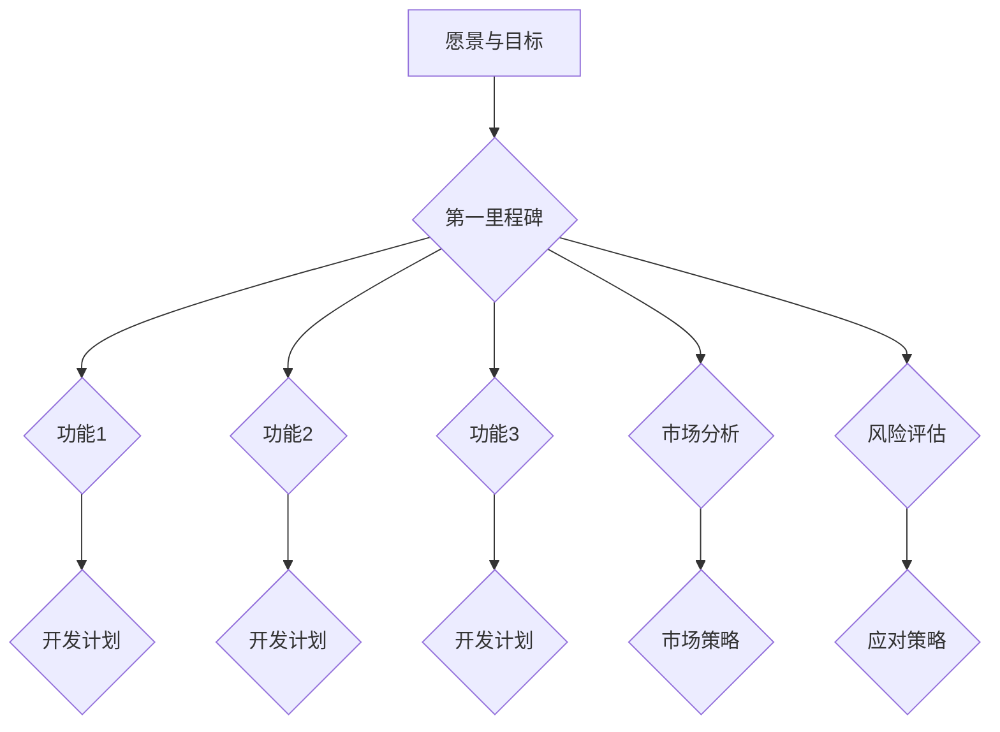
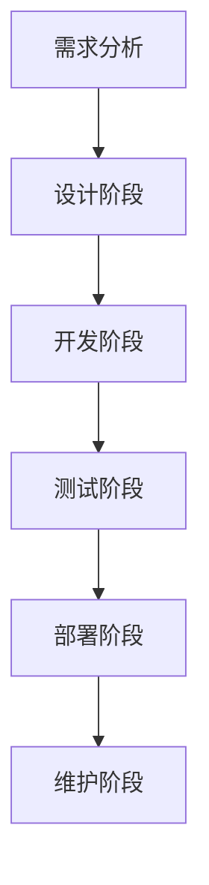

                 

### 文章标题

在当今快速变化的技术和市场环境中，产品路线图的规划对于一人公司的未来发展至关重要。本文将探讨如何通过清晰、系统的方法来制定产品路线图，以指导公司走向成功。无论是初创企业还是成长中的企业，甚至面临转型挑战的企业，产品路线图都是一个重要的战略工具。

### 关键词

- 一人公司
- 产品路线图
- 市场研究
- 产品规划
- 项目管理
- 持续改进

### 摘要

本文旨在为一人公司的产品路线图规划提供系统性指导。首先，我们将介绍一人公司的定义、特点以及其所面临的挑战和机遇。接着，我们将详细讨论产品路线图的核心概念、制定流程和市场研究方法。随后，文章将深入探讨产品规划与设计、实施与监控等关键环节。在实战应用部分，我们将结合初创企业、成长企业和转型企业的不同阶段，提供具体的产品路线图制定与实施策略。通过成功与失败案例的分析，我们将总结出实用的经验和启示。最后，文章将展望产品路线图的未来发展方向，以及如何与公司战略协同发展，为一人公司持续改进和未来成功提供指导。

## 《一人公司的产品路线图：规划未来发展方向》目录大纲

### 第一部分：产品路线图基础

#### 第1章：一人公司的挑战与机遇

#### 第2章：产品路线图的核心概念

#### 第3章：市场研究与定位

#### 第4章：产品规划与设计

#### 第5章：产品路线图的实施与监控

### 第二部分：产品路线图的实战应用

#### 第6章：初创企业的产品路线图实践

#### 第7章：成长企业的产品路线图优化

#### 第8章：转型企业的产品路线图制定

#### 第9章：产品路线图案例分析

### 第三部分：产品路线图的持续改进与未来展望

#### 第10章：产品路线图的持续改进

#### 第11章：产品路线图与公司战略

#### 第12章：产品路线图的未来发展方向

### 附录

#### 附录 A：产品路线图制定与实施工具推荐

#### 附录 B：参考资料与推荐阅读

### 作者信息

**作者：** AI天才研究院/AI Genius Institute & 禅与计算机程序设计艺术 /Zen And The Art of Computer Programming

## 第一部分：产品路线图基础

### 第1章：一人公司的挑战与机遇

#### 1.1 一人公司的定义与特点

一人公司，顾名思义，是指由单一创始人或个体运营的企业。这种企业模式在当今创业浪潮中越来越受到关注，尤其是对于技术型人才或专业人士。一人公司的特点包括：

1. **高度灵活性**：一人公司能够迅速调整业务方向，快速响应市场变化。
2. **成本低**：一人公司无需承担大量的员工成本，能够有效降低运营成本。
3. **决策效率高**：由于只有一个决策者，业务决策能够快速作出，减少决策过程中的延误。
4. **注重专业**：一人公司通常专注于某一领域或某一产品，能够更深入地研究市场和用户需求。

#### 1.2 一人公司的市场环境分析

在当前市场环境下，一人公司面临着诸多挑战和机遇。挑战方面，包括：

1. **市场竞争激烈**：随着创业者的增加，市场竞争愈发激烈，一人公司需要不断优化产品和服务来获得市场份额。
2. **资源有限**：一人公司通常资源有限，包括资金、人力和技术资源，需要充分利用现有资源来提升竞争力。
3. **品牌建设难度大**：一人公司在品牌建设和市场推广方面可能面临更大的困难，需要付出更多的努力来建立品牌形象。

而机遇方面，则包括：

1. **数字化时代的红利**：数字化技术的普及为一人公司提供了更多的市场机会，如通过在线平台拓展业务范围。
2. **个性化需求的增长**：消费者对产品和服务的要求越来越高，一人公司可以更灵活地满足这些个性化需求。
3. **合作伙伴的多样性**：一人公司可以通过与其他企业合作，共同开发产品或服务，实现资源的互补和共享。

#### 1.3 一人公司的竞争优势与劣势

一人公司的竞争优势主要体现在以下几个方面：

1. **灵活性**：一人公司能够根据市场变化迅速调整业务策略，保持竞争优势。
2. **专业性强**：由于专注于某一领域，一人公司能够更深入地研究市场需求，提供更优质的产品和服务。
3. **成本低**：一人公司能够有效降低运营成本，提高盈利能力。

然而，一人公司也存在一些劣势：

1. **资源有限**：一人公司通常资源有限，难以在短时间内实现大规模扩张。
2. **品牌影响力弱**：一人公司在品牌建设和市场推广方面可能面临更大的挑战。
3. **管理难度大**：一人公司需要创始人或个体承担大部分的管理工作，对管理能力的要求较高。

通过以上分析，我们可以看出，一人公司虽然面临诸多挑战，但也拥有独特的竞争优势。在接下来的章节中，我们将详细探讨如何制定和实施产品路线图，以帮助一人公司克服挑战，抓住机遇，实现可持续发展。

### 第2章：产品路线图的核心概念

#### 2.1 产品路线图的定义与作用

产品路线图（Product Roadmap）是一种用于规划和指导产品开发过程的视觉工具。它通过将产品发展的关键里程碑、功能、目标市场等要素以直观的方式展示出来，帮助团队和利益相关者明确产品的未来发展方向和优先级。产品路线图不仅是产品开发团队的工作指南，也是企业与市场沟通的重要桥梁。

在产品开发过程中，产品路线图具有以下几个重要作用：

1. **明确目标**：通过制定清晰的路线图，公司可以明确产品的目标市场、用户需求和预期成果，从而确保所有团队成员对目标有一致的理解。
2. **协调资源**：产品路线图有助于公司合理分配资源，包括资金、人力和技术资源，确保资源利用的最大化。
3. **指导决策**：在产品开发的不同阶段，产品路线图可以为团队提供决策依据，帮助团队在面临关键决策时做出明智的选择。
4. **沟通工具**：产品路线图可以作为公司与投资者、客户、合作伙伴等进行沟通的重要文档，帮助外部利益相关者了解产品的开发进度和方向。

#### 2.2 产品路线图的基本框架

产品路线图的基本框架通常包括以下几个核心组成部分：

1. **愿景与目标**：这部分明确产品的长期愿景和短期目标，包括市场定位、用户价值等。
2. **里程碑**：里程碑是产品开发过程中关键的阶段性目标，通常以时间序列展示，如季度、半年或一年等。
3. **功能与特性**：这部分详细列出产品在各个里程碑阶段需要实现的功能和特性，帮助团队聚焦开发重点。
4. **市场与用户**：这部分描述目标市场和用户需求，包括用户画像、市场趋势等，确保产品与市场需求保持一致。
5. **风险评估**：对产品开发过程中可能遇到的风险进行评估和预测，以便提前制定应对策略。

以下是一个简化的产品路线图基本框架示例：

#### 2.3 产品路线图的制定流程

制定产品路线图是一个系统性、迭代的过程，通常包括以下几个步骤：

1. **需求分析**：在开始制定路线图之前，首先要进行需求分析，明确产品的目标市场和用户需求。这可以通过市场调研、用户访谈、竞争分析等方法来完成。

2. **目标设定**：根据需求分析结果，设定产品的长期和短期目标。这些目标应具体、可衡量，并与公司的整体战略保持一致。

3. **功能规划**：基于目标，规划产品在各个里程碑阶段需要实现的功能和特性。这部分需要团队共同讨论和决策，确保功能的优先级和可行性。

4. **时间表制定**：为每个里程碑设定具体的时间表，包括关键任务和截止日期。时间表的制定应考虑到资源分配、风险评估等因素。

5. **市场与用户分析**：结合市场趋势和用户需求，进一步细化目标市场和用户画像，确保产品与市场需求保持一致。

6. **风险评估**：对产品开发过程中可能遇到的风险进行评估，包括技术风险、市场风险、资源风险等，并制定相应的应对策略。

7. **评审与调整**：制定初步的产品路线图后，进行内部评审和调整，确保路线图符合公司的战略目标和发展需求。

8. **沟通与发布**：将产品路线图与利益相关者进行沟通，包括团队成员、投资者、客户和合作伙伴等，确保他们了解产品的开发进度和方向。

9. **迭代更新**：产品路线图不是一成不变的，应根据市场变化、技术进步和公司战略的调整进行定期更新和优化。

通过以上步骤，一人公司可以制定出一份清晰、实用的产品路线图，为产品的开发和发展提供明确的方向和指导。

### 第3章：市场研究与定位

#### 3.1 市场研究的方法与工具

市场研究是制定产品路线图的重要基础，它有助于企业了解市场需求、用户行为和竞争对手情况，从而做出更明智的决策。市场研究的方法和工具多种多样，以下是几种常用的方法：

1. **问卷调查**：通过设计问卷，收集大量用户的反馈和意见。问卷调查可以采用线上和线下两种形式，适用于广泛的人群，具有高效性和低成本的特点。

2. **用户访谈**：与目标用户进行一对一的深入交流，了解他们的需求和痛点。用户访谈能够提供详细、深入的信息，有助于理解用户的真实需求和行为。

3. **数据分析**：通过分析现有的用户数据和市场数据，挖掘用户行为和市场趋势。数据分析工具包括Excel、SQL、Python等，能够处理大量数据，提供有价值的洞察。

4. **竞争分析**：研究竞争对手的产品、市场份额、营销策略等，了解竞争对手的优势和劣势，为自身的产品定位提供参考。

5. **焦点小组**：邀请一组目标用户，就某个特定话题进行讨论。焦点小组能够快速收集多方面的观点和建议，有助于发现潜在的市场机会和问题。

6. **市场趋势研究**：通过分析行业报告、市场研究机构的报告等，了解当前市场的趋势和未来发展方向。市场趋势研究有助于企业把握市场机会，调整产品策略。

#### 3.2 目标市场的确定

确定目标市场是市场研究的重要步骤，它关系到产品的市场定位和营销策略。以下是确定目标市场的一些关键因素：

1. **市场细分**：将整体市场划分为若干个子市场，根据用户的年龄、性别、收入、地理位置等特征进行细分。市场细分有助于企业找到最具潜力的细分市场。

2. **用户需求**：分析目标市场的用户需求，了解他们的痛点、需求和期望。用户需求是产品定位和功能设计的重要依据。

3. **市场规模**：评估目标市场的规模和增长潜力，选择市场规模大且增长迅速的细分市场，以提高产品的市场竞争力。

4. **竞争情况**：研究目标市场中的竞争对手，分析他们的市场份额、产品定位和营销策略。通过对比，找到自身的竞争优势和差异化点。

5. **潜在收益**：评估目标市场带来的潜在收益，包括市场规模、用户购买力和利润空间。选择具有较高潜在收益的目标市场，以提高投资回报率。

以下是一个简化的目标市场确定流程：

1. **市场细分**：根据用户特征将市场划分为不同细分市场。
2. **用户需求分析**：收集和分析用户需求，了解他们的痛点、需求和期望。
3. **市场规模评估**：评估各个细分市场的规模和增长潜力。
4. **竞争情况分析**：研究目标市场中的竞争对手，分析他们的市场份额和营销策略。
5. **潜在收益评估**：评估各个细分市场带来的潜在收益。

#### 3.3 产品定位策略

产品定位策略是确保产品在目标市场中脱颖而出的关键。以下是几种常见的产品定位策略：

1. **差异化定位**：通过在产品功能、设计、用户体验等方面与竞争对手区分开来，满足特定用户群体的需求。差异化定位有助于提高产品的附加值和市场竞争力。

2. **成本领先定位**：通过降低产品成本，提供更具竞争力的价格，吸引对价格敏感的用户。成本领先定位适用于价格敏感的市场环境。

3. **高附加值定位**：通过提供高质量、高附加值的产品和服务，吸引追求品质和体验的高端用户。高附加值定位适用于高端市场，有助于建立品牌形象。

4. **市场细分定位**：针对某一特定细分市场进行定位，满足该市场用户的需求。市场细分定位有助于企业集中资源，深耕特定市场。

5. **情感定位**：通过情感共鸣和品牌故事，与用户建立深厚的情感联系，提高用户忠诚度。情感定位适用于注重情感体验的产品和服务。

以下是一个简化的产品定位策略流程：

1. **市场研究**：了解目标市场的特点和用户需求。
2. **竞争分析**：分析竞争对手的产品定位和策略。
3. **自身优势分析**：评估自身的竞争优势和差异化点。
4. **确定定位策略**：选择适合的定位策略，并制定具体的执行方案。
5. **营销和传播**：通过营销和传播活动，将产品定位策略传达给目标用户。

通过以上市场研究、目标市场确定和产品定位策略的制定，一人公司可以更准确地把握市场需求，为产品路线图的制定提供坚实的基础。

### 第4章：产品规划与设计

#### 4.1 产品规划的方法与技巧

产品规划是确保产品成功开发的关键环节，它涉及明确产品的愿景、目标、功能需求和开发策略。以下是产品规划中常用的方法和技巧：

1. **愿景和目标设定**：
   - **愿景**：明确产品的长远目标和发展方向，如成为行业领导者或满足用户的某种特定需求。
   - **目标**：设定可量化的短期目标，如提高用户满意度、实现市场份额增长等。愿景和目标应具体、明确，并与公司的整体战略保持一致。

2. **需求分析**：
   - **用户需求**：通过市场调研、用户访谈等方法，了解目标用户的需求和期望，确保产品能够满足市场需求。
   - **功能需求**：根据用户需求，梳理产品需要实现的核心功能和辅助功能，明确功能优先级，为后续的开发工作提供指导。

3. **功能规划和优先级排序**：
   - **功能规划**：将需求转化为具体的功能需求，包括功能描述、实现方式等。
   - **优先级排序**：根据功能的重要性和紧急性，对功能进行优先级排序，确保团队集中精力开发高优先级的功能。

4. **开发策略制定**：
   - **敏捷开发**：采用敏捷开发方法，将产品开发过程分解为若干个迭代周期，每个迭代周期实现一部分功能，确保产品快速迭代和持续改进。
   - **增量开发**：逐步实现产品的核心功能，通过不断迭代和优化，逐步完善产品。

5. **资源分配**：
   - **人力分配**：根据项目需求和优先级，合理分配开发人员、测试人员等人力资源。
   - **时间管理**：为每个迭代周期设定具体的时间表，确保项目按时完成。

6. **风险管理**：
   - **风险识别**：识别项目过程中可能遇到的风险，包括技术风险、市场风险、资源风险等。
   - **风险应对**：制定相应的风险应对策略，如增加预算、调整时间表等，确保项目顺利进行。

以下是一个简化的产品规划流程：

1. **愿景与目标设定**：明确产品的长远目标和短期目标。
2. **需求分析**：收集用户需求，梳理功能需求。
3. **功能规划与优先级排序**：将需求转化为具体的功能需求，并排序。
4. **开发策略制定**：选择合适的开发方法，如敏捷开发或增量开发。
5. **资源分配**：合理分配人力资源和时间。
6. **风险管理**：识别和应对项目风险。

#### 4.2 产品设计的核心要素

产品设计是产品开发过程中的重要环节，它直接关系到产品的用户体验和竞争力。以下是产品设计的核心要素：

1. **用户体验（UX）设计**：
   - **用户流程**：设计用户在使用产品过程中的流程，确保用户能够轻松、高效地完成任务。
   - **界面设计**：设计直观、美观的界面，提升用户的视觉体验和使用舒适度。
   - **交互设计**：设计合理的交互方式，提高用户与产品的互动效率。

2. **用户界面（UI）设计**：
   - **色彩与布局**：使用适当的色彩和布局，提升界面的美观性和易读性。
   - **图标与图形**：使用图标和图形来传达信息和操作提示，增强用户体验。
   - **响应式设计**：确保产品在不同设备上都能提供良好的用户体验。

3. **功能设计**：
   - **核心功能**：设计产品的基本功能，确保满足用户的基本需求。
   - **扩展功能**：根据用户需求和市场变化，设计产品的扩展功能，提升产品的竞争力。

4. **技术实现**：
   - **技术框架**：选择合适的技术框架和工具，确保产品能够高效、稳定地运行。
   - **性能优化**：对产品进行性能优化，提高系统的响应速度和稳定性。

5. **安全设计**：
   - **数据安全**：确保用户数据的安全，防止数据泄露和篡改。
   - **权限管理**：设计合理的权限管理机制，确保用户数据的安全和隐私。

以下是一个简化的产品设计流程：

1. **用户体验设计**：设计用户流程、界面和交互。
2. **用户界面设计**：设计色彩、布局、图标和图形。
3. **功能设计**：设计核心功能和扩展功能。
4. **技术实现**：选择技术框架和进行性能优化。
5. **安全设计**：确保数据安全和权限管理。

#### 4.3 产品设计的流程与工具

产品设计的流程通常包括以下几个阶段：

1. **需求分析**：
   - **用户访谈**：与目标用户进行深入访谈，了解他们的需求和期望。
   - **市场调研**：分析市场需求和竞争情况，为产品设计提供参考。

2. **原型设计**：
   - **低 fidelity原型**：使用简单的工具，如纸和笔，快速制作初步的原型，以验证设计的可行性。
   - **高 fidelity原型**：使用专业的原型设计工具，如Axure、Sketch等，制作更详细的交互原型。

3. **用户测试**：
   - **用户测试**：邀请目标用户参与测试，收集用户反馈，对设计进行迭代优化。

4. **设计评审**：
   - **内部评审**：组织团队内部评审，讨论设计方案的优缺点，进行改进。
   - **外部评审**：邀请外部专家或用户代表进行评审，获取外部反馈。

5. **设计交付**：
   - **设计文档**：编写详细的设计文档，包括用户界面设计、交互设计、功能设计等，为开发团队提供设计指导。
   - **设计交付**：将设计文件和开发文档交付给开发团队，确保设计能够得到有效实施。

以下是几种常用的产品设计工具：

1. **Axure**：一款专业的原型设计工具，支持丰富的交互元素和动态效果，适合制作复杂的原型。

2. **Sketch**：一款流行的界面设计工具，适用于移动端和Web端的设计，支持多种插件和模板。

3. **Figma**：一款基于云的原型设计工具，支持多人协作和实时预览，适用于快速迭代设计。

4. **Adobe XD**：一款全面的用户体验设计工具，支持原型设计、用户测试和协作功能，适合跨平台的设计工作。

通过以上产品规划与设计的流程和工具，一人公司可以确保产品的设计既符合用户需求，又具备良好的用户体验和竞争力。接下来，我们将进一步探讨产品路线图的实施与监控，确保产品能够顺利推向市场。

### 第5章：产品路线图的实施与监控

#### 5.1 产品开发流程

产品路线图的实施是一个复杂而系统性的过程，涉及到多个阶段的开发和协作。以下是产品开发流程的主要阶段：

1. **需求分析**：
   - **需求收集**：与产品团队、市场团队和其他相关利益相关者进行沟通，收集产品的需求。
   - **需求分析**：对收集到的需求进行梳理和分析，明确产品的功能和性能要求。
   - **需求文档**：编写详细的需求文档，包括功能需求、用户故事等，为后续的开发提供依据。

2. **设计阶段**：
   - **概念设计**：制定产品的整体架构和界面布局，确定产品的核心功能和用户体验。
   - **详细设计**：细化产品的功能设计和用户界面设计，编写设计文档，为开发团队提供详细的设计指导。

3. **开发阶段**：
   - **编码**：根据设计文档，进行产品的编码工作，实现产品的功能。
   - **单元测试**：对编写好的代码进行单元测试，确保每个模块的功能正确无误。
   - **集成测试**：将各个模块集成起来，进行整体测试，确保产品功能的完整性和稳定性。

4. **测试阶段**：
   - **系统测试**：对整个产品进行系统测试，包括功能测试、性能测试、安全测试等，确保产品满足用户需求。
   - **用户测试**：邀请目标用户参与测试，收集用户反馈，对产品进行优化和改进。

5. **部署阶段**：
   - **上线准备**：准备产品的上线工作，包括服务器部署、数据迁移、环境配置等。
   - **上线发布**：将产品部署到生产环境，对外提供服务。
   - **上线监控**：上线后，对产品进行监控，确保其正常运行，并及时处理可能出现的问题。

6. **维护阶段**：
   - **用户反馈收集**：定期收集用户反馈，了解产品的使用情况和用户需求。
   - **功能优化**：根据用户反馈，对产品进行功能优化和改进，提升用户体验。
   - **安全更新**：定期进行安全更新和漏洞修复，确保产品的安全性。

以下是一个简化的产品开发流程图：

#### 5.2 项目管理与风险管理

产品开发过程涉及多个团队和人员的协作，项目管理显得尤为重要。以下是项目管理中的一些关键点和风险管理策略：

1. **项目计划**：
   - **时间计划**：制定详细的时间计划，包括每个阶段的开始和结束时间，以及各任务的依赖关系。
   - **资源分配**：根据项目的需求，合理分配人力资源、技术资源和资金资源，确保项目顺利进行。
   - **任务分配**：明确每个团队成员的任务和责任，确保项目分工明确。

2. **团队协作**：
   - **沟通机制**：建立有效的沟通机制，确保团队成员之间的信息流通，如定期会议、即时通讯工具等。
   - **协作工具**：使用项目管理工具，如Trello、Jira等，帮助团队更好地协作和管理任务。

3. **进度监控**：
   - **进度报告**：定期生成项目进度报告，向项目管理者汇报项目的进展情况。
   - **风险管理**：识别项目中的潜在风险，制定相应的风险应对策略。

4. **风险管理**：
   - **风险识别**：通过风险评估会议、头脑风暴等方法，识别项目可能遇到的风险，包括技术风险、市场风险、资源风险等。
   - **风险应对**：制定风险应对计划，包括风险规避、风险减轻、风险转移等策略，确保项目能够应对各种不确定因素。

5. **变更管理**：
   - **变更请求**：对项目中的变更请求进行审查和评估，确保变更对项目的影响得到有效控制。
   - **变更实施**：根据变更请求，对项目计划、资源分配等进行调整，确保变更能够顺利实施。

以下是一个简化的项目管理和风险管理流程：

1. **项目计划**：制定时间计划、资源分配和任务分配。
2. **团队协作**：建立沟通机制和使用协作工具。
3. **进度监控**：生成进度报告和进行风险管理。
4. **风险管理**：识别风险、制定风险应对策略。
5. **变更管理**：审查和实施变更请求。

通过以上产品开发流程和项目管理的策略，一人公司可以确保产品路线图的顺利实施，及时应对各种挑战和风险，实现产品的成功上线和持续改进。

### 第二部分：产品路线图的实战应用

#### 第6章：初创企业的产品路线图实践

初创企业在市场竞争中面临着诸多挑战，但同时也拥有灵活性和创新优势。通过有效的产品路线图实践，初创企业可以明确方向，加速成长。以下是初创企业产品路线图实践的关键步骤：

#### 6.1 初创企业产品路线图的制定

初创企业在制定产品路线图时，需要重点关注以下几个方面：

1. **市场定位**：初创企业首先需要明确目标市场，了解市场需求和用户痛点，确定产品的市场定位。

2. **愿景与目标**：根据市场定位，设定产品的长期和短期目标，如提高用户满意度、实现市场份额增长等。

3. **功能规划**：梳理产品的核心功能和扩展功能，明确功能优先级，确保团队集中精力开发关键功能。

4. **时间表制定**：为每个里程碑设定具体的时间表，包括关键任务和截止日期，确保项目按计划进行。

5. **资源分配**：合理分配人力资源、技术资源和资金资源，确保项目的顺利推进。

以下是一个简化的初创企业产品路线图制定流程：

1. **市场定位**：了解市场需求和用户痛点。
2. **愿景与目标设定**：设定长期和短期目标。
3. **功能规划**：梳理核心和扩展功能。
4. **时间表制定**：设定里程碑和时间表。
5. **资源分配**：合理分配资源。

#### 6.2 初创企业产品路线图的实施

在实施产品路线图时，初创企业需要注重以下几个关键点：

1. **团队协作**：建立高效的团队协作机制，确保团队成员之间信息畅通，任务明确。

2. **迭代开发**：采用敏捷开发方法，将产品开发过程分解为多个迭代周期，每个迭代周期实现一部分功能，快速响应市场需求。

3. **用户反馈**：定期收集用户反馈，及时调整产品方向，确保产品与市场需求保持一致。

4. **风险管理**：识别项目中的潜在风险，制定相应的风险应对策略，确保项目能够应对各种不确定因素。

以下是一个简化的初创企业产品路线图实施流程：

1. **团队协作**：建立协作机制。
2. **迭代开发**：采用敏捷开发。
3. **用户反馈**：收集并处理用户反馈。
4. **风险管理**：识别和应对风险。

#### 6.3 初创企业产品路线图的优化

初创企业在产品路线图的实施过程中，需要不断进行优化，以应对市场变化和内部发展。以下是一些优化策略：

1. **数据驱动的决策**：通过数据分析，了解用户行为和市场趋势，为产品优化提供数据支持。

2. **持续改进**：建立持续改进机制，定期评估产品的性能和用户满意度，进行功能优化和改进。

3. **敏捷调整**：根据市场反馈和内部发展情况，灵活调整产品路线图，确保产品与市场需求保持一致。

4. **创新与实验**：鼓励团队进行创新实验，探索新的产品方向和市场机会。

以下是一个简化的初创企业产品路线图优化流程：

1. **数据驱动决策**：使用数据分析。
2. **持续改进**：定期评估和优化。
3. **敏捷调整**：根据反馈调整路线图。
4. **创新与实验**：探索新方向。

通过以上步骤，初创企业可以制定出实用的产品路线图，并在实施过程中不断优化，实现持续成长和成功。

### 第7章：成长企业的产品路线图优化

当企业从初创阶段步入成长期，市场竞争加剧，业务模式逐步成熟，这时优化产品路线图变得尤为重要。成长企业的产品路线图优化需要考虑到市场变化、用户需求和内部资源等多方面因素。以下是如何在成长期对产品路线图进行优化：

#### 7.1 成长企业产品路线图的调整

在成长期，企业需要定期对产品路线图进行调整，以适应市场变化和企业发展需求。以下是一些调整策略：

1. **市场反馈**：定期收集用户反馈和市场动态，了解用户需求和市场趋势的变化。根据反馈和市场情况，及时调整产品路线图中的功能规划和时间表。

2. **竞争分析**：密切关注竞争对手的产品策略和市场表现，分析竞争对手的优势和劣势，调整自身的市场定位和产品策略。

3. **技术演进**：跟踪技术发展趋势，根据技术进步调整产品的功能和技术架构，确保产品在技术上的竞争力。

4. **资源优化**：根据企业的资源状况，调整产品路线图中的资源分配，确保资源配置的合理性和高效性。

以下是一个简化的成长企业产品路线图调整流程：

1. **市场反馈**：收集用户反馈和市场动态。
2. **竞争分析**：分析竞争对手的产品策略。
3. **技术演进**：跟踪技术发展趋势。
4. **资源优化**：调整资源分配。

#### 7.2 成长企业产品路线图的实施策略

在成长期，企业需要采取一系列实施策略，以确保产品路线图的顺利执行。以下是一些关键策略：

1. **团队扩展**：随着业务的扩展，企业需要逐步扩大团队规模，引入更多专业人才，确保团队能够高效协作。

2. **敏捷管理**：采用敏捷管理方法，将产品开发过程分解为多个短周期，每个周期实现一部分功能，确保产品能够快速迭代和优化。

3. **用户参与**：增加用户的参与度，通过用户测试和反馈，不断优化产品，确保产品满足用户需求。

4. **风险管理**：建立完善的风险管理体系，识别和应对项目中的潜在风险，确保项目能够按计划进行。

以下是一个简化的成长企业产品路线图实施策略流程：

1. **团队扩展**：引入专业人才。
2. **敏捷管理**：采用敏捷开发。
3. **用户参与**：增加用户参与度。
4. **风险管理**：建立风险管理机制。

#### 7.3 成长企业产品路线图的创新与突破

成长企业需要在产品路线图中融入创新元素，以保持市场竞争力和持续增长。以下是一些创新和突破策略：

1. **技术研发**：加大技术研发投入，推动技术突破，为产品创新提供技术支持。

2. **商业模式创新**：探索新的商业模式，如订阅模式、平台模式等，以适应市场变化和用户需求。

3. **产品差异化**：通过产品差异化策略，打造独特的产品特性，提高产品的附加值和市场竞争力。

4. **市场拓展**：积极拓展市场，开拓新的市场机会，扩大企业市场份额。

以下是一个简化的成长企业产品路线图创新与突破流程：

1. **技术研发**：加大技术研发投入。
2. **商业模式创新**：探索新商业模式。
3. **产品差异化**：打造独特产品特性。
4. **市场拓展**：开拓新市场机会。

通过以上调整、实施和创新策略，成长企业可以优化产品路线图，确保在激烈的市场竞争中保持优势，实现持续增长。

### 第8章：转型企业的产品路线图制定

#### 8.1 转型企业产品路线图的挑战

转型企业通常面临以下挑战：

1. **市场变化**：市场需求快速变化，企业需要及时调整产品策略以适应市场变化。
2. **内部阻力**：转型过程中，内部员工可能对变革产生抵触情绪，影响转型进度。
3. **资源限制**：转型通常需要投入大量资源，但企业可能面临资源限制，需要优先分配资源。
4. **技术瓶颈**：转型过程中可能面临技术瓶颈，需要投入时间和资源进行技术升级。

#### 8.2 转型企业产品路线图的制定策略

为了克服上述挑战，转型企业需要制定合理的转型产品路线图。以下是一些关键策略：

1. **市场分析**：深入了解市场需求和竞争对手，明确转型方向和目标市场。
2. **愿景与目标**：设定清晰的愿景和目标，确保转型方向与公司整体战略一致。
3. **资源优化**：优先分配资源，确保关键领域的资源充足，支持转型进程。
4. **员工沟通**：加强与员工的沟通，解释转型的必要性和目标，争取员工的理解和支持。

以下是一个简化的转型企业产品路线图制定流程：

1. **市场分析**：了解市场需求和竞争对手。
2. **愿景与目标设定**：设定清晰的愿景和目标。
3. **资源优化**：优先分配资源。
4. **员工沟通**：加强员工沟通。

#### 8.3 转型企业产品路线图的实施路径

在制定转型产品路线图后，企业需要实施以下路径以确保成功转型：

1. **阶段划分**：将转型过程划分为多个阶段，每个阶段设定具体的目标和任务，确保转型过程有序进行。
2. **风险管理**：识别转型过程中可能遇到的风险，并制定相应的风险应对策略。
3. **迭代优化**：采用迭代优化方法，逐步实施转型策略，并根据反馈进行调整。
4. **团队协作**：加强团队协作，确保各部门协同工作，共同推进转型进程。

以下是一个简化的转型企业产品路线图实施路径：

1. **阶段划分**：划分转型阶段。
2. **风险管理**：识别和应对风险。
3. **迭代优化**：逐步实施并调整。
4. **团队协作**：加强协作。

通过以上策略和实施路径，转型企业可以制定出合理的产品路线图，克服挑战，成功实现转型。

### 第9章：产品路线图案例分析

#### 9.1 成功案例分析

在产品路线图的实施过程中，有许多成功的案例值得我们学习和借鉴。以下是两个具有代表性的成功案例分析：

1. **案例一：Airbnb**

Airbnb在产品路线图的制定和实施方面做得非常成功。初期，Airbnb明确了其愿景和目标，即通过共享经济模式，让人们更容易地找到房源，享受旅行的乐趣。在市场分析阶段，Airbnb通过调研和用户反馈，了解了用户对住宿服务的需求，并将其转化为具体的功能需求。在产品规划阶段，Airbnb设计了简洁、直观的用户界面，确保用户能够轻松找到房源并完成预订。在实施过程中，Airbnb采用敏捷开发方法，不断迭代优化产品功能，并根据市场反馈进行调整。最终，Airbnb成功颠覆了传统的住宿行业，成为共享经济领域的领导者。

2. **案例二：Uber**

Uber也是一个通过产品路线图实现成功的典范。Uber的愿景是通过移动应用程序，为用户提供便捷的出行服务。在市场分析阶段，Uber研究了全球各地的出租车市场和用户需求，明确了其目标市场。在产品规划阶段，Uber设计了简洁、直观的用户界面，并开发了强大的后台系统，确保订单匹配效率高、用户体验好。在实施过程中，Uber采用了敏捷开发方法，快速迭代产品功能，并根据用户反馈进行调整。Uber还通过全球扩展，成功进入了多个国家和地区，成为全球最大的移动出行平台之一。

#### 9.2 失败案例分析

虽然成功案例很多，但产品路线图的实施并非总是顺利。以下是一个失败案例分析：

1. **案例一：Google Plus**

Google Plus是Google在社交媒体领域的一次重大尝试，但最终以失败告终。在产品路线图的制定阶段，Google明确了其愿景和目标，即打造一个与Facebook相竞争的社交媒体平台。在市场分析阶段，Google认为社交媒体是一个快速增长的市场，用户对新的社交体验有强烈需求。在产品规划阶段，Google设计了复杂的功能和用户界面，试图提供比Facebook更丰富的社交体验。然而，在实施过程中，Google Plus存在几个问题：

- **功能复杂**：Google Plus的功能过于复杂，用户难以理解和使用。
- **市场定位模糊**：Google Plus的目标市场不明确，既没有吸引到核心的社交媒体用户，也没有成功挑战Facebook。
- **缺乏用户互动**：Google Plus缺乏有效的用户互动机制，导致用户活跃度低。

最终，Google Plus在2019年正式关闭。

#### 9.3 案例总结与启示

通过以上成功和失败案例的分析，我们可以得出以下总结和启示：

1. **成功因素**：
   - **明确愿景和目标**：成功的企业在制定产品路线图时，总是明确其愿景和目标，确保产品开发与公司整体战略保持一致。
   - **市场分析**：成功的案例表明，深入了解市场需求和用户需求对于产品成功至关重要。
   - **敏捷开发**：采用敏捷开发方法，快速迭代优化产品功能，能够更好地适应市场变化和用户需求。
   - **用户体验**：注重用户体验设计，确保产品简洁、直观，易于用户使用。

2. **失败原因**：
   - **功能复杂**：过于复杂的功能和用户界面会导致用户使用困难，降低用户满意度。
   - **市场定位模糊**：不明确的市场定位会使产品无法吸引到目标用户，难以在市场中立足。
   - **缺乏用户互动**：缺乏有效的用户互动机制，会导致用户活跃度低，产品失去生命力。

3. **启示**：
   - **简单化产品**：在设计产品时，应尽量简化功能，确保用户能够轻松使用。
   - **明确市场定位**：明确产品的目标市场，确保产品能够吸引到目标用户。
   - **注重用户反馈**：定期收集用户反馈，并根据反馈调整产品方向，确保产品与市场需求保持一致。
   - **持续优化**：持续优化产品功能和用户体验，保持产品的竞争力。

通过以上成功和失败案例的分析，一人公司可以更好地制定和实施产品路线图，避免常见错误，实现产品的成功。

### 第三部分：产品路线图的持续改进与未来展望

#### 第10章：产品路线图的持续改进

产品路线图的持续改进是确保企业产品保持竞争力的关键。在快速变化的市场环境中，企业需要不断调整和优化产品路线图，以适应新的市场动态和用户需求。以下是产品路线图持续改进的方法与工具：

#### 10.1 持续改进的方法与工具

1. **用户反馈机制**：建立有效的用户反馈机制，定期收集用户对产品的意见和建议。通过用户反馈，企业可以了解用户的需求变化和痛点，从而进行产品优化。

2. **数据分析工具**：使用数据分析工具，如Google Analytics、Mixpanel等，对用户行为和产品性能进行深入分析。通过数据驱动的决策，企业可以更准确地把握市场趋势和用户需求。

3. **敏捷开发方法**：采用敏捷开发方法，快速迭代产品功能，并根据用户反馈和市场变化进行调整。敏捷开发有助于企业快速响应市场变化，保持产品竞争力。

4. **精益管理工具**：引入精益管理工具，如价值流图（Value Stream Mapping）、看板（Kanban）等，优化产品开发流程，提高生产效率和质量。

5. **跨部门协作**：加强跨部门协作，确保产品开发、市场、销售、客户服务等部门的信息共享和协调，共同推进产品改进。

#### 10.2 持续改进的实践案例

1. **案例一：Netflix**

Netflix在持续改进产品路线图方面做得非常出色。通过用户反馈和数据分析，Netflix不断优化其推荐算法，提高用户满意度和观看时长。Netflix还采用了敏捷开发方法，快速迭代产品功能，并根据用户反馈进行调整。通过持续改进，Netflix成功保持了其市场竞争力，成为全球最大的流媒体服务提供商之一。

2. **案例二：亚马逊**

亚马逊也是一个通过持续改进产品路线图实现成功的典范。通过用户反馈和数据分析，亚马逊不断优化其产品搜索算法和推荐系统，提高用户购物体验。亚马逊还采用了精益管理工具，如价值流图和看板，优化其供应链和生产流程，提高运营效率。通过持续改进，亚马逊成为全球最大的电子商务公司之一。

#### 10.3 持续改进的未来趋势

随着技术的不断进步和市场环境的不断变化，产品路线图的持续改进也将呈现出以下趋势：

1. **人工智能与大数据**：人工智能和大数据技术的应用将使产品路线图的持续改进更加智能化和精准化。通过分析大量用户数据和市场数据，企业可以更准确地预测市场趋势和用户需求。

2. **实时反馈与调整**：随着互联网技术的发展，实时反馈和调整将成为可能。企业可以实时收集用户反馈和市场动态，快速调整产品路线图，以应对市场变化。

3. **跨行业合作**：不同行业的跨界合作将推动产品路线图的创新和优化。通过跨行业合作，企业可以借鉴其他行业的成功经验，推动产品路线图的持续改进。

4. **全球化视野**：全球化视野将使产品路线图的持续改进更加广泛和多样化。企业需要关注全球市场趋势和用户需求，制定更具全球竞争力的产品路线图。

通过以上持续改进的方法和未来趋势，一人公司可以不断优化产品路线图，提高产品竞争力，实现持续发展。

### 第11章：产品路线图与公司战略

#### 11.1 产品路线图与公司战略的关系

产品路线图与公司战略密切相关，两者相互依存、相互影响。产品路线图是公司战略的具体体现，它指导产品的开发方向和优先级，确保产品与公司战略保持一致。同时，公司战略为产品路线图提供了总体目标和方向，产品路线图的制定和实施过程需要符合公司战略的要求。

#### 11.2 产品路线图在公司战略中的定位

1. **战略指导**：产品路线图为公司提供了具体的战略指导，明确了产品的发展方向和目标。通过产品路线图，公司可以清晰地看到每个阶段的目标和任务，确保战略的执行和落地。

2. **资源配置**：产品路线图帮助公司合理配置资源，包括资金、人力和技术资源。通过产品路线图，公司可以优先考虑高优先级的项目和功能，确保资源的最大化利用。

3. **风险管理**：产品路线图在公司战略中起到风险管理的作用。通过识别和评估项目风险，产品路线图可以帮助公司提前制定应对策略，降低风险对公司的影响。

4. **沟通工具**：产品路线图是公司内部和外部沟通的重要工具。通过产品路线图，公司可以向员工、投资者、客户和合作伙伴等传达产品的开发进度和方向，增强各方对公司的信心。

#### 11.3 产品路线图与公司战略的协同发展

为了实现产品路线图与公司战略的协同发展，企业需要采取以下措施：

1. **战略一致**：在制定产品路线图时，确保产品与公司战略一致。产品路线图中的目标和任务应与公司战略中的愿景和目标相匹配，避免战略冲突。

2. **动态调整**：产品路线图不是一成不变的，应随着公司战略的调整和市场环境的变化进行动态调整。通过定期评审和优化，确保产品路线图与公司战略保持一致。

3. **资源协同**：在资源分配过程中，确保产品开发与公司战略的优先级相匹配。对于符合公司战略的重要项目，应优先分配资源，确保项目能够顺利推进。

4. **跨部门协作**：加强跨部门协作，确保产品路线图的制定和实施过程得到各部门的支持和配合。通过有效的沟通和协调，确保产品路线图与公司战略的协同发展。

5. **持续改进**：持续改进产品路线图和公司战略，以适应不断变化的市场环境。通过用户反馈、数据分析和市场研究，不断优化产品路线图和公司战略，提高竞争力。

通过以上措施，一人公司可以确保产品路线图与公司战略的协同发展，实现持续成功。

### 第12章：产品路线图的未来发展方向

#### 12.1 未来市场环境的预测

未来市场环境将受到多种因素的影响，包括技术进步、消费者行为变化和全球经济形势等。以下是未来市场环境的一些关键预测：

1. **技术进步**：随着人工智能、大数据、物联网等技术的快速发展，市场环境将变得更加智能化和数字化。企业需要不断提升技术水平，以适应未来市场环境的变化。

2. **消费者行为变化**：随着消费者对个性化、便捷化和高质量产品的需求增加，市场环境将变得更加以用户为中心。企业需要深入了解消费者行为，提供更加定制化的产品和服务。

3. **全球经济形势**：全球经济的不确定性将影响市场环境。企业需要具备灵活性和适应性，以应对全球经济波动带来的挑战。

#### 12.2 未来技术的变革与机遇

未来技术的变革将为产品路线图带来新的机遇和挑战：

1. **人工智能**：人工智能技术的应用将进一步提升产品的智能化和个性化水平，为用户提供更好的体验。企业可以利用人工智能技术优化产品设计、开发和运营，提高效率和竞争力。

2. **大数据**：大数据技术的应用将使企业能够更好地了解市场和用户需求，进行精准营销和产品优化。企业可以利用大数据技术进行市场预测、风险管理和业务决策。

3. **物联网**：物联网技术的应用将使产品与设备之间的互联互通成为可能，为用户提供更加便捷和智能的服务。企业可以利用物联网技术打造新的产品生态系统，提升用户体验。

#### 12.3 未来产品路线图的趋势与挑战

未来产品路线图的发展趋势和挑战包括：

1. **趋势**：
   - **用户体验优先**：未来产品路线图将更加注重用户体验，通过个性化、智能化的产品设计和功能，提升用户满意度。
   - **敏捷开发**：敏捷开发方法将得到更广泛的应用，企业将更加注重快速响应市场变化和用户需求。
   - **数据驱动**：数据驱动将成为产品开发的重要驱动力，企业将利用大数据和人工智能技术进行市场预测、风险管理和业务决策。

2. **挑战**：
   - **技术更新迭代快**：未来技术更新迭代速度将加快，企业需要具备快速学习和适应能力，以应对技术变革带来的挑战。
   - **市场竞争加剧**：随着市场环境的变化和技术的进步，市场竞争将变得更加激烈，企业需要不断提升产品竞争力。
   - **资源分配难题**：在资源有限的情况下，企业需要合理分配资源，确保关键领域的资源充足，以应对未来市场环境的挑战。

通过以上分析，一人公司可以预见未来市场环境和技术变革的趋势，制定具有前瞻性的产品路线图，抓住机遇，应对挑战，实现可持续发展。

### 附录 A：产品路线图制定与实施工具推荐

在制定和实施产品路线图的过程中，选择合适的工具可以大大提高效率和效果。以下是一些常用的产品路线图制定与实施工具：

#### A.1 市场研究工具推荐

1. **Google Analytics**：一款强大的数据分析工具，可以追踪用户行为，提供有关用户流量、用户行为和转化率等关键指标的数据。

2. **Qualtrics**：一款专业的市场调研工具，提供问卷调查、焦点小组和用户访谈等功能，帮助企业深入了解用户需求和偏好。

3. **SurveyMonkey**：一款易于使用的在线调研平台，提供多样化的问卷设计和数据分析功能，适合各种规模的企业进行市场调研。

#### A.2 产品规划工具推荐

1. **Trello**：一款功能强大的项目管理工具，通过可视化卡片，帮助团队跟踪任务进度、分配任务和协作。

2. **Asana**：一款灵活的任务管理工具，支持团队协作、任务分配和进度跟踪，适合跨部门协作。

3. **Jira**：一款专业的敏捷开发工具，支持敏捷项目管理、代码管理和持续集成，适用于大型项目和复杂任务。

#### A.3 项目管理工具推荐

1. **Microsoft Project**：一款功能强大的项目管理软件，提供详细的项目计划、资源管理和进度跟踪功能，适合大型项目。

2. **Monday.com**：一款灵活的团队协作平台，提供多种项目管理模板和定制功能，支持任务分配、进度跟踪和报告生成。

3. **Notion**：一款全功能的笔记和组织工具，支持多种数据类型和嵌套结构，适用于个人和团队的项目管理。

通过以上工具的推荐，一人公司可以更好地进行市场研究、产品规划和项目实施，提高工作效率和产品竞争力。

### 附录 B：参考资料与推荐阅读

为了帮助读者更深入地了解产品路线图的制定和实施，以下列出了一些相关的参考资料和推荐阅读：

#### B.1 市场研究相关书籍推荐

1. **《市场调研实战手册》** - 作者：约翰·豪尔（John Hall）
   本书详细介绍了市场调研的方法和技巧，适合初学者和专业人士。

2. **《用户研究实战》** - 作者：丹·尼尔森（Dan Nelson）
   本书通过实际案例，讲解了用户研究的方法和应用，帮助读者更好地理解用户需求。

#### B.2 产品规划相关书籍推荐

1. **《精益创业》** - 作者：埃里克·莱斯（Eric Ries）
   本书介绍了精益创业方法，帮助读者在产品开发过程中快速迭代和优化。

2. **《产品经理实战手册》** - 作者：特雷西·史密斯（Tracey Smith）
   本书详细介绍了产品经理的工作内容和职责，以及如何有效地进行产品规划。

#### B.3 项目管理相关书籍推荐

1. **《项目管理知识体系指南（PMBOK指南）》** - 作者：项目管理知识体系（Project Management Institute）
   本书是项目管理领域的权威指南，涵盖了项目管理的基本原则和方法。

2. **《敏捷项目管理实践指南》** - 作者：杰里米·杰克逊（Jeremy Jackson）
   本书介绍了敏捷项目管理的方法和实践，适合那些希望采用敏捷方法的团队。

通过阅读这些书籍，读者可以更全面地了解产品路线图的制定和实施，从而在实际工作中取得更好的效果。

### 作者信息

**作者：** AI天才研究院/AI Genius Institute & 禅与计算机程序设计艺术 /Zen And The Art of Computer Programming

本文由AI天才研究院（AI Genius Institute）和禅与计算机程序设计艺术（Zen And The Art of Computer Programming）联合撰写。AI天才研究院致力于推动人工智能技术的创新和应用，通过研究最新的人工智能算法和工具，帮助企业和个人实现智能升级。禅与计算机程序设计艺术则专注于计算机科学领域，通过深入探讨计算机程序设计的哲学和艺术，提供独特的见解和方法。两位作者在计算机科学和人工智能领域拥有丰富的经验，共同为读者带来这篇关于一人公司产品路线图规划的技术博客文章。希望本文能够为读者提供有价值的指导和启示。

