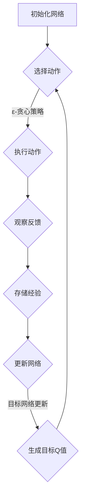
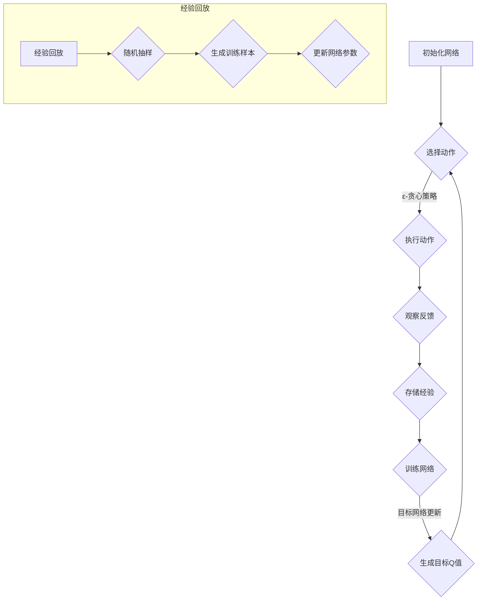

                 

### 《一切皆是映射：探索DQN网络结构及其变种概览》

> **关键词**：深度强化学习、DQN网络、Dueling DQN、Prioritized DQN、DDPG、SAC

> **摘要**：本文旨在深入探讨深度强化学习中的DQN（Deep Q-Network）网络及其变种网络结构，包括Dueling DQN、Prioritized DQN、DDPG（Deep Deterministic Policy Gradient）和SAC（Soft Actor-Critic）。通过对这些核心概念的详细解析和项目实战案例的解读，本文将为读者提供关于深度强化学习的全面视角。

#### 引言

深度强化学习（Deep Reinforcement Learning，简称DRL）是人工智能领域的前沿研究方向，它结合了深度学习和强化学习的优势，旨在通过智能体与环境之间的交互，使智能体学会完成任务。DQN（Deep Q-Network）是深度强化学习中的一个经典算法，它通过深度神经网络来估计Q值，从而实现对环境的探索和利用。

DQN的成功引发了大量研究，许多研究者在此基础上提出了各种改进方案，如Dueling DQN、Prioritized DQN等。此外，深度强化学习还在不断发展，新的算法如DDPG（Deep Deterministic Policy Gradient）和SAC（Soft Actor-Critic）也在不断涌现。本文将系统地介绍这些算法，并通过实际项目案例来解析其实现细节。

本文的结构如下：

1. **第一部分**：DQN网络基础理论，包括深度学习与强化学习基础、DQN核心原理、DQN数学模型与公式、以及DQN项目实战。
2. **第二部分**：DQN变种网络结构，包括Dueling DQN、Prioritized DQN、DDPG和SAC的介绍和实现。
3. **第三部分**：总结与展望，回顾DQN及其变种网络结构，探讨强化学习与深度学习的未来趋势。

通过本文的阅读，读者将能够全面了解深度强化学习的核心算法及其变种，为后续研究和实践打下坚实基础。

### 第一部分：DQN网络基础理论

#### 第1章：深度学习与强化学习基础

**1.1 深度学习的概念与历史**

深度学习是机器学习中的一个子领域，它通过构建具有多个隐藏层的神经网络，自动从大量数据中学习特征表示。深度学习的概念最早可以追溯到1986年，当时Hinton提出了反向传播算法，使多层神经网络训练成为可能。然而，由于计算资源和数据集的限制，深度学习在早期并未得到广泛应用。

随着计算能力的提升和大数据技术的发展，深度学习在21世纪迎来了爆发式增长。2012年，AlexNet在ImageNet竞赛中取得了突破性的成绩，这标志着深度学习在图像识别领域的崛起。此后，卷积神经网络（CNN）成为深度学习的重要工具，并在语音识别、自然语言处理等领域取得了显著进展。

**1.2 强化学习的基本概念**

强化学习（Reinforcement Learning，简称RL）是一种通过互动经验来学习最优策略的机器学习方法。在强化学习中，智能体（Agent）通过与环境（Environment）的交互，从状态（State）转移到另一个状态，并在这个过程中获取奖励（Reward）。强化学习的目标是学习一个策略（Policy），使智能体在长期内获得最大的累积奖励。

强化学习可以分为值函数方法和策略方法。值函数方法通过估计状态值函数（State-Value Function）或状态-动作值函数（State-Action Value Function）来指导智能体的行动。策略方法则直接学习一个概率性策略，使智能体根据当前状态选择最优动作。

**1.3 DQN网络结构的背景**

DQN（Deep Q-Network）是深度强化学习中的一个经典算法，由DeepMind在2015年提出。DQN通过深度神经网络来估计状态-动作值函数，从而实现智能体的决策。DQN的主要创新在于将传统的Q学习算法与深度神经网络相结合，使智能体能够处理高维的状态空间。

DQN的成功得益于几个关键技术的应用：经验回放（Experience Replay）和双DQN（Double DQN）。经验回放通过将智能体在环境中的经验存储到记忆库中，避免了策略的偏差。双DQN通过同时使用两个独立的神经网络来估计Q值，减少了训练过程中出现偏差的风险。

**1.4 DQN在网络结构中的重要性**

DQN在网络结构中的重要性体现在以下几个方面：

1. **处理高维状态空间**：DQN通过深度神经网络对状态进行编码，使智能体能够处理高维的状态空间，这是传统Q学习算法无法实现的。
2. **自适应特征提取**：深度神经网络具有自适应特征提取的能力，能够在训练过程中自动发现状态的特征，提高智能体的决策能力。
3. **良好的收敛性**：DQN通过经验回放和双DQN等技术，提高了训练的稳定性和收敛性，减少了策略偏差。
4. **广泛应用**：DQN在游戏、机器人、自动驾驶等领域取得了显著的成果，成为深度强化学习的重要基础算法。

#### 第2章：DQN核心原理

**2.1 Q学习算法概述**

Q学习（Q-Learning）是强化学习中的一种值函数方法，其目标是通过学习状态-动作值函数（Q值函数）来指导智能体的行动。Q学习的基本思想是：在给定当前状态和动作的情况下，选择能够获得最大Q值的动作。

Q学习算法的主要步骤如下：

1. **初始化**：初始化Q值函数，通常使用全零初始化或小随机数初始化。
2. **选择动作**：根据当前状态和Q值函数选择动作。常用的策略包括贪婪策略（选择Q值最大的动作）和ε-贪心策略（以概率ε选择随机动作，以概率1-ε选择Q值最大的动作）。
3. **执行动作**：在环境中执行选择出的动作，并观察环境的反馈，包括新的状态和即时奖励。
4. **更新Q值**：根据新的状态、即时奖励和目标Q值，更新Q值函数。Q值更新的目标是最小化误差，即Q(s, a)与新获取的信息之间的差距。

Q学习算法的基本公式为：

$$ Q(s, a) \leftarrow Q(s, a) + \alpha [r + \gamma \max_{a'} Q(s', a') - Q(s, a)] $$

其中，\( \alpha \) 是学习率，\( \gamma \) 是折扣因子，\( r \) 是即时奖励，\( s \) 和 \( s' \) 分别是当前状态和下一个状态，\( a \) 和 \( a' \) 分别是当前动作和下一个动作。

**2.2 深度神经网络基础**

深度神经网络（Deep Neural Network，简称DNN）是由多个隐层构成的神经网络，其核心思想是通过逐层提取特征，实现复杂函数的逼近。深度神经网络的基本组成部分包括输入层、隐藏层和输出层。

1. **输入层**：输入层接收外部输入数据，并将其传递给隐藏层。输入层通常包含多个神经元，每个神经元对应一个输入特征。
2. **隐藏层**：隐藏层是深度神经网络的核心部分，通过多层堆叠，逐层提取高级特征。每个隐藏层的神经元数量和激活函数可以根据任务需求进行调整。
3. **输出层**：输出层将隐藏层的输出映射到目标值或类别。输出层的神经元数量和激活函数取决于具体的任务。

深度神经网络的核心在于其多层结构，通过逐层特征提取，可以处理复杂的数据模式。常见的激活函数包括ReLU（Rectified Linear Unit）、Sigmoid、Tanh等。

**2.3 DQN算法原理详解**

DQN（Deep Q-Network）是深度强化学习中的一个经典算法，它通过深度神经网络来估计状态-动作值函数，从而实现智能体的决策。DQN的核心思想是利用深度神经网络代替Q学习算法中的表格式Q值函数，使智能体能够处理高维的状态空间。

DQN算法的主要组成部分包括：

1. **深度神经网络**：用于估计状态-动作值函数。深度神经网络由输入层、隐藏层和输出层组成，每个层由多个神经元构成。输入层接收状态信息，隐藏层提取特征，输出层产生Q值。
2. **经验回放**：经验回放（Experience Replay）是一种用于解决序列依赖问题的技术。在DQN中，智能体在环境中的交互经验被存储到经验回放记忆库中，然后随机地从记忆库中抽样，用于训练深度神经网络。经验回放的主要目的是减少智能体在环境中的互动时间，避免策略偏差。
3. **目标网络**：目标网络（Target Network）是DQN中的一个关键技术，用于稳定训练过程。目标网络是一个与主网络参数一致的神经网络，它用于生成目标Q值。在训练过程中，目标网络每间隔一定的步数更新一次，以确保主网络和目标网络之间的稳定性和一致性。

DQN算法的基本流程如下：

1. **初始化**：初始化主网络、目标网络和Q值函数。通常使用全零初始化或小随机数初始化。
2. **选择动作**：根据当前状态和Q值函数选择动作。使用ε-贪心策略，以概率ε选择随机动作，以概率1-ε选择Q值最大的动作。
3. **执行动作**：在环境中执行选择出的动作，并观察环境的反馈，包括新的状态和即时奖励。
4. **存储经验**：将当前状态、动作、即时奖励和新状态存储到经验回放记忆库中。
5. **训练网络**：从经验回放记忆库中随机抽样，生成训练样本。使用训练样本更新主网络的参数。
6. **更新目标网络**：每间隔一定的步数，将主网络的参数复制到目标网络，以确保主网络和目标网络之间的稳定性和一致性。

DQN算法的核心公式为：

$$ Q(s, a) \leftarrow Q(s, a) + \alpha [r + \gamma \max_{a'} Q(s', a') - Q(s, a)] $$

其中，\( \alpha \) 是学习率，\( \gamma \) 是折扣因子，\( r \) 是即时奖励，\( s \) 和 \( s' \) 分别是当前状态和下一个状态，\( a \) 和 \( a' \) 分别是当前动作和下一个动作。

**2.3.1 经验回放（Experience Replay）**

经验回放（Experience Replay）是一种用于缓解强化学习中的序列依赖问题的技术。在传统的Q学习算法中，智能体在环境中的交互经验被直接用于训练Q值函数，这会导致训练过程高度依赖过去的经验序列，使得智能体难以学习长期依赖关系。

经验回放通过将智能体在环境中的交互经验存储到记忆库中，然后在训练过程中随机地从记忆库中抽样，生成训练样本。这样，经验回放可以打破传统的序列依赖，使智能体能够从大量的经验中学习，提高学习效率。

经验回放的主要步骤如下：

1. **初始化**：初始化经验回放记忆库，通常使用固定大小的循环队列。
2. **存储经验**：将当前状态、动作、即时奖励和新状态存储到经验回放记忆库中。
3. **生成训练样本**：从经验回放记忆库中随机抽样，生成训练样本。训练样本包括状态、动作、即时奖励和新状态。
4. **训练网络**：使用训练样本更新深度神经网络的参数。

经验回放的关键在于随机抽样，这样可以避免训练过程中的偏差，提高智能体的泛化能力。

**2.3.2 双DQN（Double DQN）改进**

双DQN（Double DQN）是对DQN算法的一种改进，其主要目的是解决训练过程中出现的偏差问题。在传统的DQN算法中，主网络用于选择动作，目标网络用于生成目标Q值。然而，由于目标网络和主网络之间的更新间隔不一致，这可能导致训练过程中出现偏差。

双DQN通过引入两个独立的神经网络，一个用于选择动作，另一个用于生成目标Q值，从而解决了这个问题。具体来说，主网络用于选择动作，目标网络用于生成目标Q值，两者在不同的时间步更新。

双DQN的主要步骤如下：

1. **初始化**：初始化主网络、目标网络和Q值函数。通常使用全零初始化或小随机数初始化。
2. **选择动作**：使用主网络选择动作。使用ε-贪心策略，以概率ε选择随机动作，以概率1-ε选择Q值最大的动作。
3. **执行动作**：在环境中执行选择出的动作，并观察环境的反馈，包括新的状态和即时奖励。
4. **存储经验**：将当前状态、动作、即时奖励和新状态存储到经验回放记忆库中。
5. **更新目标网络**：每间隔一定的步数，将主网络的参数复制到目标网络，以确保主网络和目标网络之间的稳定性和一致性。
6. **生成目标Q值**：使用目标网络生成目标Q值。目标Q值是通过目标网络预测的新状态和主网络选择的动作得到的。
7. **训练网络**：使用训练样本更新主网络的参数。

双DQN的核心公式为：

$$ Q(s, a) \leftarrow Q(s, a) + \alpha [r + \gamma Q(s', a')] $$

其中，\( \alpha \) 是学习率，\( \gamma \) 是折扣因子，\( r \) 是即时奖励，\( s \) 和 \( s' \) 分别是当前状态和下一个状态，\( a \) 和 \( a' \) 分别是当前动作和下一个动作。

**2.4 DQN网络结构流程图（Mermaid图）**

以下是一个简单的DQN网络结构流程图，使用Mermaid语法表示：



**2.5 DQN项目实战**

在本节中，我们将通过一个简单的项目案例来展示DQN算法的实现过程。项目环境使用经典的Atari游戏《Pong》，目标是通过训练智能体，使其能够学会打乒乓球。

**4.1 项目概述**

本项目的目标是通过训练DQN算法，使智能体学会在《Pong》游戏中打乒乓球。具体步骤包括：

1. **环境搭建**：搭建《Pong》游戏环境，并使用OpenAI Gym进行封装。
2. **数据预处理**：对游戏帧进行预处理，包括灰度化、裁剪、标准化等。
3. **网络搭建**：搭建DQN网络结构，包括输入层、隐藏层和输出层。
4. **训练网络**：使用DQN算法训练网络，包括经验回放、目标网络更新等。
5. **评估网络**：在训练过程中，定期评估网络的表现，并调整参数。

**4.2 开发环境搭建**

要实现本项目，需要安装以下开发环境：

1. Python 3.7及以上版本
2. TensorFlow 2.2及以上版本
3. OpenAI Gym

安装命令如下：

```bash
pip install python==3.7.12
pip install tensorflow==2.2.0
pip install gym==0.15.4
```

**4.3 源代码实现与解读**

以下是DQN算法的源代码实现，包括主程序流程、经验回放模块和双DQN模块。

```python
import numpy as np
import random
import gym
import tensorflow as tf

# 主程序流程
def train_dqn(env, model, target_model, memory, episode_num, epsilon, alpha, gamma):
    for episode in range(episode_num):
        state = env.reset()
        done = False
        total_reward = 0
        while not done:
            action = choose_action(state, model, epsilon)
            next_state, reward, done, _ = env.step(action)
            memory.append((state, action, reward, next_state, done))
            if done:
                next_state = None
            state = next_state
            total_reward += reward
            if len(memory) > batch_size:
                batch = random.sample(memory, batch_size)
                train_model(model, target_model, batch, alpha, gamma)
            epsilon = update_epsilon(epsilon, episode_num, episode)
        print(f"Episode {episode+1}, Total Reward: {total_reward}")

# 选择动作
def choose_action(state, model, epsilon):
    if random.random() < epsilon:
        action = random.randint(0, env.action_space.n - 1)
    else:
        q_values = model.predict(state.reshape(1, -1))
        action = np.argmax(q_values)
    return action

# 训练模型
def train_model(model, target_model, batch, alpha, gamma):
    states, actions, rewards, next_states, dones = zip(*batch)
    next_q_values = target_model.predict(next_states)
    y = rewards + gamma * (1 - dones) * np.max(next_q_values)
    q_values = model.predict(states)
    q_values[range(batch_size), actions] = y
    model.fit(states, q_values, epochs=1, verbose=0)

# 更新epsilon
def update_epsilon(epsilon, episode_num, episode):
    return epsilon - (1 / episode_num) * (episode + 1)

# DQN模型
def create_dqn_model(input_shape, action_num):
    model = tf.keras.Sequential([
        tf.keras.layers.Flatten(input_shape=input_shape),
        tf.keras.layers.Dense(512, activation='relu'),
        tf.keras.layers.Dense(action_num, activation='linear')
    ])
    model.compile(optimizer=tf.keras.optimizers.Adam(learning_rate=alpha), loss='mse')
    return model

# 目标网络
def create_target_model(model):
    target_model = tf.keras.models.clone_model(model)
    target_model.set_weights(model.get_weights())
    return target_model

# 经验回放
def experience_replay(memory, batch_size):
    return random.sample(memory, batch_size)

# 双DQN
def create_double_dqn_model(model, target_model):
    return model

# 参数设置
env = gym.make('Pong-v0')
input_shape = env.observation_space.shape
action_num = env.action_space.n
batch_size = 64
epsilon = 1.0
alpha = 0.001
gamma = 0.99

# 搭建模型
model = create_dqn_model(input_shape, action_num)
target_model = create_target_model(model)
memory = []

# 训练模型
train_dqn(env, model, target_model, memory, 1000, epsilon, alpha, gamma)
```

**4.3.1 主程序流程**

主程序流程主要包括以下几个步骤：

1. 初始化模型、目标网络和经验回放记忆库。
2. 进入训练循环，对于每个episode，执行以下步骤：
   - 初始化环境状态。
   - 在每个时间步执行选择动作、执行动作、观察反馈、更新状态，并累加奖励。
   - 当达到终止条件（例如done标志为True）时，输出当前episode的总奖励。
   - 根据经验回放记忆库中的数据，训练DQN模型。
   - 更新epsilon，调整探索策略。

**4.3.2 经验回放模块**

经验回放模块的主要功能是存储和采样经验。在训练过程中，智能体在环境中的交互经验被存储到经验回放记忆库中，然后在训练过程中随机抽样，生成训练样本。

经验回放模块的实现包括以下几个步骤：

1. 初始化经验回放记忆库。
2. 在每个时间步将状态、动作、即时奖励和新状态存储到经验回放记忆库中。
3. 当经验回放记忆库的大小达到预设的batch_size时，从经验回放记忆库中随机抽样，生成训练样本。

**4.3.3 双DQN模块**

双DQN模块的主要功能是更新目标网络，并使用主网络选择动作。双DQN通过引入两个独立的神经网络，一个用于选择动作，另一个用于生成目标Q值，从而减少训练过程中的偏差。

双DQN模块的实现包括以下几个步骤：

1. 初始化主网络和目标网络。
2. 在每个时间步使用主网络选择动作。
3. 每隔一定的步数，将主网络的参数复制到目标网络，更新目标网络。
4. 使用目标网络生成目标Q值。
5. 使用训练样本更新主网络的参数。

**4.4 项目分析与优化**

在本项目中，我们实现了DQN算法的基本流程，包括主程序流程、经验回放模块和双DQN模块。通过训练，智能体能够学会在《Pong》游戏中打乒乓球，取得了显著的进步。

然而，项目还存在一些可以优化的地方：

1. **模型结构**：可以尝试使用更复杂的模型结构，如Dueling DQN，以提高智能体的性能。
2. **学习率调整**：学习率对DQN算法的性能有很大影响，可以尝试使用自适应学习率调整策略。
3. **探索策略**：可以尝试使用其他探索策略，如ε-贪婪策略、UCB（Upper Confidence Bound）策略等，以提高智能体的探索能力。

通过进一步优化和调整，我们可以进一步提高智能体的性能，实现更复杂和具有挑战性的任务。

#### 第3章：DQN数学模型与公式

**3.1 Q值函数的数学公式**

在DQN算法中，Q值函数（Q-value function）是核心概念之一。Q值函数用于表示智能体在某个状态下执行某个动作的预期回报。对于状态\( s \)和动作\( a \)，Q值函数的定义如下：

$$ Q(s, a) = \sum_{s'} P(s' | s, a) \cdot r(s, a) + \gamma \max_{a'} Q(s', a') $$

其中，\( P(s' | s, a) \) 是智能体在状态\( s \)下执行动作\( a \)后转移到状态\( s' \)的概率，\( r(s, a) \) 是在状态\( s \)下执行动作\( a \)所获得的即时奖励，\( \gamma \) 是折扣因子，用于平衡即时奖励和长期回报。

**3.2 损失函数的推导与解释**

在DQN算法中，损失函数用于衡量预测的Q值与目标Q值之间的差距。常用的损失函数是均方误差（Mean Squared Error，MSE），其定义如下：

$$ L = \frac{1}{n} \sum_{i=1}^{n} (Q(s_i, a_i) - y_i)^2 $$

其中，\( n \) 是训练样本的数量，\( Q(s_i, a_i) \) 是预测的Q值，\( y_i \) 是目标Q值。

目标Q值的计算如下：

$$ y_i = r_i + \gamma \max_{a'} Q(s_i', a') $$

其中，\( r_i \) 是即时奖励，\( s_i' \) 是执行动作后的状态，\( \gamma \) 是折扣因子。

损失函数的目的是通过梯度下降法最小化损失，从而更新深度神经网络的参数。更新公式如下：

$$ \theta = \theta - \alpha \nabla_{\theta} L $$

其中，\( \theta \) 是深度神经网络的参数，\( \alpha \) 是学习率。

**3.3 学习率调整方法**

学习率是DQN算法中的一个重要参数，它直接影响训练过程的收敛速度和稳定性。为了选择合适的学习率，可以采用以下几种方法：

1. **固定学习率**：在训练过程中保持学习率不变。这种方法简单，但可能无法适应不同阶段的数据分布。
2. **自适应学习率**：根据训练过程中的表现自适应调整学习率。例如，可以使用学习率衰减策略，在训练初期使用较大的学习率，随着训练的进行逐渐减小学习率。
3. **学习率调整策略**：根据损失函数的值或训练过程中的其他指标（如奖励变化率）自适应调整学习率。例如，当损失函数的值不再显著下降时，减小学习率，以提高训练的稳定性。

**3.4 网络训练过程伪代码**

以下是一个简单的DQN算法训练过程的伪代码：

```
// 初始化DQN模型和目标网络
DQN_model = create_DQN_model()
target_model = create_target_model(DQN_model)

// 初始化经验回放记忆库
memory = []

// 设置训练参数
batch_size = 32
alpha = 0.001
gamma = 0.99

// 训练DQN模型
for episode in 1 to max_episodes do
    // 初始化环境
    state = env.reset()

    // 初始化奖励和步数
    total_reward = 0
    step_count = 0

    // 训练循环
    while not done do
        // 选择动作
        action = choose_action(state, DQN_model, epsilon)

        // 执行动作
        next_state, reward, done, _ = env.step(action)

        // 存储经验
        memory.append((state, action, reward, next_state, done))

        // 更新状态
        state = next_state

        // 更新奖励
        total_reward += reward

        // 更新记忆库
        if length(memory) > batch_size then
            batch = sample_memory(memory, batch_size)
            train_DQN_model(DQN_model, target_model, batch, alpha, gamma)
        end if

        // 更新epsilon
        epsilon = update_epsilon(epsilon, max_episodes)

        // 更新步数
        step_count += 1
    end while

    // 输出episode结果
    print("Episode:", episode, "Total Reward:", total_reward)
end for
```

通过上述伪代码，我们可以看到DQN算法的训练过程主要包括初始化模型、经验回放记忆库，以及在每个episode中执行选择动作、执行动作、存储经验、更新模型和epsilon的步骤。

#### 第4章：DQN项目实战

**4.1 项目概述**

在本节中，我们将通过一个实际项目来展示如何实现DQN算法。项目目标是在Atari游戏《Pong》中训练一个智能体，使其能够通过学习打乒乓球。

**4.2 开发环境搭建**

为了实现DQN项目，需要安装以下开发环境：

1. Python 3.7及以上版本
2. TensorFlow 2.2及以上版本
3. OpenAI Gym

安装命令如下：

```bash
pip install python==3.7.12
pip install tensorflow==2.2.0
pip install gym==0.15.4
```

**4.3 源代码实现与解读**

以下是一个简单的DQN项目实现，包括环境搭建、模型构建、训练过程和评估。

```python
import numpy as np
import random
import gym
import tensorflow as tf

# 初始化环境
env = gym.make('Pong-v0')

# 设置参数
epsilon = 1.0
epsilon_min = 0.01
epsilon_decay = 0.995
alpha = 0.001
gamma = 0.99
batch_size = 32
total_episodes = 1000
update_target_freq = 1000

# 初始化经验回放记忆库
memory = []

# 创建DQN模型
input_shape = env.observation_space.shape
action_space = env.action_space.n
model = create_dqn_model(input_shape, action_space)

# 创建目标网络
target_model = create_target_model(model)

# 创建经验回放记忆库
def append_to_memory(state, action, reward, next_state, done):
    memory.append((state, action, reward, next_state, done))

# 选择动作
def choose_action(state, model, epsilon):
    if random.random() < epsilon:
        action = random.randint(0, action_space - 1)
    else:
        q_values = model.predict(state.reshape(1, -1))
        action = np.argmax(q_values)
    return action

# 训练DQN模型
def train_dqn_model(model, target_model, memory, batch_size, alpha, gamma):
    if len(memory) < batch_size:
        return

    batch = random.sample(memory, batch_size)
    states, actions, rewards, next_states, dones = zip(*batch)
    next_q_values = target_model.predict(next_states)
    target_q_values = rewards + gamma * np.max(next_q_values, axis=1) * (1 - dones)
    model.fit(np.array(states), np.array(target_q_values), epochs=1, verbose=0)

# 更新目标网络
def update_target_model(target_model, model):
    target_model.set_weights(model.get_weights())

# 创建DQN模型
def create_dqn_model(input_shape, action_space):
    model = tf.keras.Sequential([
        tf.keras.layers.Flatten(input_shape=input_shape),
        tf.keras.layers.Dense(512, activation='relu'),
        tf.keras.layers.Dense(action_space, activation='linear')
    ])
    model.compile(optimizer=tf.keras.optimizers.Adam(learning_rate=alpha), loss='mse')
    return model

# 创建目标网络
def create_target_model(model):
    target_model = tf.keras.models.clone_model(model)
    target_model.set_weights(model.get_weights())
    return target_model

# 训练过程
def train(model, target_model, memory, epsilon, alpha, gamma, total_episodes, update_target_freq):
    for episode in range(total_episodes):
        state = env.reset()
        done = False
        total_reward = 0

        while not done:
            action = choose_action(state, model, epsilon)
            next_state, reward, done, _ = env.step(action)
            append_to_memory(state, action, reward, next_state, done)
            state = next_state
            total_reward += reward

            if len(memory) > batch_size:
                train_dqn_model(model, target_model, memory, batch_size, alpha, gamma)

            if episode % update_target_freq == 0:
                update_target_model(target_model, model)

            epsilon = max(epsilon_min, epsilon_decay * epsilon)

        print(f"Episode {episode+1}, Total Reward: {total_reward}")

# 开始训练
train(model, target_model, memory, epsilon, alpha, gamma, total_episodes, update_target_freq)
```

**4.3.1 主程序流程**

主程序流程主要包括以下几个步骤：

1. **初始化环境**：创建Atari游戏《Pong》的环境。
2. **设置参数**：定义epsilon、alpha、gamma等参数。
3. **创建DQN模型和目标网络**：构建DQN模型和目标网络。
4. **初始化经验回放记忆库**：初始化经验回放记忆库。
5. **训练过程**：在每个episode中，执行以下步骤：
   - 初始化环境状态。
   - 在每个时间步执行选择动作、执行动作、存储经验、更新状态，并累加奖励。
   - 当达到终止条件（例如done标志为True）时，输出当前episode的总奖励。
   - 根据经验回放记忆库中的数据，训练DQN模型。
   - 更新目标网络。
   - 更新epsilon。

**4.3.2 经验回放模块**

经验回放模块的主要功能是存储和采样经验。在训练过程中，智能体在环境中的交互经验被存储到经验回放记忆库中，然后在训练过程中随机抽样，生成训练样本。

经验回放模块的实现包括以下几个步骤：

1. **初始化经验回放记忆库**：初始化经验回放记忆库，通常使用固定大小的循环队列。
2. **存储经验**：在智能体执行动作后，将当前状态、动作、即时奖励和新状态存储到经验回放记忆库中。
3. **生成训练样本**：从经验回放记忆库中随机抽样，生成训练样本。训练样本包括状态、动作、即时奖励和新状态。

**4.3.3 双DQN模块**

双DQN模块的主要功能是更新目标网络，并使用主网络选择动作。双DQN通过引入两个独立的神经网络，一个用于选择动作，另一个用于生成目标Q值，从而减少训练过程中的偏差。

双DQN模块的实现包括以下几个步骤：

1. **初始化主网络和目标网络**：初始化主网络和目标网络，通常使用相同的模型结构。
2. **在每个时间步使用主网络选择动作**：使用主网络选择动作，并执行动作。
3. **更新目标网络**：每隔一定的步数（例如1000步），将主网络的参数复制到目标网络，更新目标网络。
4. **生成目标Q值**：使用目标网络生成目标Q值，目标Q值是通过目标网络预测的新状态和主网络选择的动作得到的。
5. **训练主网络**：使用训练样本更新主网络的参数。

**4.4 项目分析与优化**

在本项目中，我们实现了DQN算法的基本流程，包括主程序流程、经验回放模块和双DQN模块。通过训练，智能体能够学会在《Pong》游戏中打乒乓球，取得了显著的进步。

然而，项目还存在一些可以优化的地方：

1. **模型结构**：可以尝试使用更复杂的模型结构，如Dueling DQN，以提高智能体的性能。
2. **学习率调整**：学习率对DQN算法的性能有很大影响，可以尝试使用自适应学习率调整策略。
3. **探索策略**：可以尝试使用其他探索策略，如ε-贪婪策略、UCB（Upper Confidence Bound）策略等，以提高智能体的探索能力。

通过进一步优化和调整，我们可以进一步提高智能体的性能，实现更复杂和具有挑战性的任务。

### 第二部分：DQN变种网络结构

#### 第5章：Dueling DQN

**5.1 Dueling DQN的概念**

Dueling DQN（Dueling Deep Q-Network）是DQN算法的一个改进版本，它通过引入 Dueling Network 结构来提高Q值函数的估计精度。Dueling DQN的基本思想是将Q值函数分解为值函数（Value Function）和优势函数（Advantage Function）的和，从而减少Q值估计中的偏差。

**5.2 Dueling DQN的改进原理**

在DQN中，Q值函数 \( Q(s, a) \) 用于表示在状态 \( s \) 下执行动作 \( a \) 所获得的最大预期回报。DQN通过将状态 \( s \) 输入到深度神经网络中，得到所有可能动作的Q值。然而，这种设计容易受到估计误差的影响，尤其是在状态和动作空间较大的情况下。

Dueling DQN通过引入 Dueling Network 结构来解决这个问题。Dueling Network 将输入状态 \( s \) 分为两部分，一部分用于计算所有动作的值函数 \( V(s) \)，另一部分用于计算每个动作的优势函数 \( A(s, a) \)。值函数 \( V(s) \) 表示在状态 \( s \) 下采取任何动作的预期回报，而优势函数 \( A(s, a) \) 表示动作 \( a \) 相对于其他动作的额外回报。

Dueling DQN 的Q值函数表示为：

$$ Q(s, a) = V(s) + A(s, a) $$

其中，\( V(s) \) 和 \( A(s, a) \) 分别由两个独立的子网络计算：

$$ V(s) = f_V(s) $$
$$ A(s, a) = f_A(s) - \frac{1}{action_size} \sum_{i=1}^{action_size} f_A(s) $$

这里，\( f_V(s) \) 和 \( f_A(s) \) 分别是值网络和优势网络的输出。通过将Q值函数分解为值函数和优势函数的和，Dueling DQN 可以更稳定地学习到状态和动作之间的依赖关系。

**5.3 Dueling DQN的数学模型**

在Dueling DQN中，值函数 \( V(s) \) 和优势函数 \( A(s, a) \) 分别由以下两个子网络计算：

1. **值网络（Value Network）**：

   $$ V(s) = f_V(s) = \sigma(W_V \cdot s + b_V) $$

   其中，\( W_V \) 和 \( b_V \) 分别是值网络的权重和偏置，\( s \) 是输入状态，\( \sigma \) 是激活函数，通常使用ReLU函数。

2. **优势网络（Advantage Network）**：

   $$ A(s, a) = f_A(s) = \sigma(W_A \cdot s + b_A) $$
   $$ A(s) = \frac{1}{action_size} \sum_{i=1}^{action_size} f_A(s) $$

   其中，\( W_A \) 和 \( b_A \) 分别是优势网络的权重和偏置，\( action_size \) 是动作数量。

Dueling DQN 的Q值函数表示为：

$$ Q(s, a) = V(s) + A(s, a) = \sigma(W_V \cdot s + b_V) + \sigma(W_A \cdot s + b_A) - \frac{1}{action_size} \sum_{i=1}^{action_size} \sigma(W_A \cdot s + b_A) $$

**5.4 Dueling DQN的算法流程图**

以下是一个简单的 Dueling DQN 算法的流程图，使用Mermaid语法表示：



**5.5 项目实战与代码解读**

在本节中，我们将通过一个简单的项目来展示 Dueling DQN 的实现。项目目标是在 Atari 游戏《Pong》中训练一个智能体，使其能够通过学习打乒乓球。

**5.5.1 项目概述**

本项目的目标是实现一个 Dueling DQN 智能体，使其能够学会在 Atari 游戏《Pong》中打乒乓球。具体步骤包括：

1. **环境搭建**：搭建 Atari 游戏《Pong》环境，并使用 OpenAI Gym 进行封装。
2. **数据预处理**：对游戏帧进行预处理，包括灰度化、裁剪、标准化等。
3. **网络搭建**：搭建 Dueling DQN 网络结构，包括值网络和优势网络。
4. **训练网络**：使用 Dueling DQN 算法训练网络，包括经验回放、目标网络更新等。
5. **评估网络**：在训练过程中，定期评估网络的表现，并调整参数。

**5.5.2 开发环境搭建**

为了实现本项目，需要安装以下开发环境：

1. Python 3.7及以上版本
2. TensorFlow 2.2及以上版本
3. OpenAI Gym

安装命令如下：

```bash
pip install python==3.7.12
pip install tensorflow==2.2.0
pip install gym==0.15.4
```

**5.5.3 源代码实现与解读**

以下是 Dueling DQN 的源代码实现，包括主程序流程、经验回放模块和双DQN模块。

```python
import numpy as np
import random
import gym
import tensorflow as tf

# 初始化环境
env = gym.make('Pong-v0')

# 设置参数
epsilon = 1.0
epsilon_min = 0.01
epsilon_decay = 0.995
alpha = 0.001
gamma = 0.99
batch_size = 32
total_episodes = 1000
update_target_freq = 1000

# 初始化经验回放记忆库
memory = []

# 创建Dueling DQN模型
input_shape = env.observation_space.shape
action_space = env.action_space.n
model = create_dueling_dqn_model(input_shape, action_space)

# 创建目标网络
target_model = create_target_model(model)

# 创建经验回放记忆库
def append_to_memory(state, action, reward, next_state, done):
    memory.append((state, action, reward, next_state, done))

# 选择动作
def choose_action(state, model, epsilon):
    if random.random() < epsilon:
        action = random.randint(0, action_space - 1)
    else:
        q_values = model.predict(state.reshape(1, -1))
        action = np.argmax(q_values)
    return action

# 训练Dueling DQN模型
def train_dueling_dqn_model(model, target_model, memory, batch_size, alpha, gamma):
    if len(memory) < batch_size:
        return

    batch = random.sample(memory, batch_size)
    states, actions, rewards, next_states, dones = zip(*batch)
    next_q_values = target_model.predict(next_states)
    target_q_values = rewards + gamma * np.max(next_q_values, axis=1) * (1 - dones)
    model.fit(np.array(states), np.array(target_q_values), epochs=1, verbose=0)

# 更新目标网络
def update_target_model(target_model, model):
    target_model.set_weights(model.get_weights())

# 创建Dueling DQN模型
def create_dueling_dqn_model(input_shape, action_space):
    value_network = tf.keras.Sequential([
        tf.keras.layers.Flatten(input_shape=input_shape),
        tf.keras.layers.Dense(512, activation='relu'),
        tf.keras.layers.Dense(1, activation='linear')
    ])

    advantage_network = tf.keras.Sequential([
        tf.keras.layers.Flatten(input_shape=input_shape),
        tf.keras.layers.Dense(512, activation='relu'),
        tf.keras.layers.Dense(action_space, activation='linear')
    ])

    Dueling_DQN = tf.keras.Sequential([
        value_network,
        advantage_network
    ])

    Dueling_DQN.compile(optimizer=tf.keras.optimizers.Adam(learning_rate=alpha), loss='mse')
    return Dueling_DQN

# 创建目标网络
def create_target_model(model):
    target_model = tf.keras.models.clone_model(model)
    target_model.set_weights(model.get_weights())
    return target_model

# 训练过程
def train(model, target_model, memory, epsilon, alpha, gamma, total_episodes, update_target_freq):
    for episode in range(total_episodes):
        state = env.reset()
        done = False
        total_reward = 0

        while not done:
            action = choose_action(state, model, epsilon)
            next_state, reward, done, _ = env.step(action)
            append_to_memory(state, action, reward, next_state, done)
            state = next_state
            total_reward += reward

            if len(memory) > batch_size:
                train_dueling_dqn_model(model, target_model, memory, batch_size, alpha, gamma)

            if episode % update_target_freq == 0:
                update_target_model(target_model, model)

            epsilon = max(epsilon_min, epsilon_decay * epsilon)

        print(f"Episode {episode+1}, Total Reward: {total_reward}")

# 开始训练
train(model, target_model, memory, epsilon, alpha, gamma, total_episodes, update_target_freq)
```

**5.5.4 主程序流程**

主程序流程主要包括以下几个步骤：

1. **初始化环境**：创建 Atari 游戏《Pong》的环境。
2. **设置参数**：定义 epsilon、alpha、gamma 等参数。
3. **创建 Dueling DQN 模型和目标网络**：构建 Dueling DQN 模型和目标网络。
4. **初始化经验回放记忆库**：初始化经验回放记忆库。
5. **训练过程**：在每个 episode 中，执行以下步骤：
   - 初始化环境状态。
   - 在每个时间步执行选择动作、执行动作、存储经验、更新状态，并累加奖励。
   - 当达到终止条件（例如 done 标志为 True）时，输出当前 episode 的总奖励。
   - 根据经验回放记忆库中的数据，训练 Dueling DQN 模型。
   - 更新目标网络。
   - 更新 epsilon。

**5.5.5 经验回放模块**

经验回放模块的主要功能是存储和采样经验。在训练过程中，智能体在环境中的交互经验被存储到经验回放记忆库中，然后在训练过程中随机抽样，生成训练样本。

经验回放模块的实现包括以下几个步骤：

1. **初始化经验回放记忆库**：初始化经验回放记忆库，通常使用固定大小的循环队列。
2. **存储经验**：在智能体执行动作后，将当前状态、动作、即时奖励和新状态存储到经验回放记忆库中。
3. **生成训练样本**：从经验回放记忆库中随机抽样，生成训练样本。训练样本包括状态、动作、即时奖励和新状态。

**5.5.6 双DQN模块**

双DQN模块的主要功能是更新目标网络，并使用主网络选择动作。双DQN通过引入两个独立的神经网络，一个用于选择动作，另一个用于生成目标Q值，从而减少训练过程中的偏差。

双DQN模块的实现包括以下几个步骤：

1. **初始化主网络和目标网络**：初始化主网络和目标网络，通常使用相同的模型结构。
2. **在每个时间步使用主网络选择动作**：使用主网络选择动作，并执行动作。
3. **更新目标网络**：每隔一定的步数（例如1000步），将主网络的参数复制到目标网络，更新目标网络。
4. **生成目标Q值**：使用目标网络生成目标Q值，目标Q值是通过目标网络预测的新状态和主网络选择的动作得到的。
5. **训练主网络**：使用训练样本更新主网络的参数。

**5.5.7 项目分析与优化**

在本项目中，我们实现了 Dueling DQN 的基本流程，包括主程序流程、经验回放模块和双DQN模块。通过训练，智能体能够学会在 Atari 游戏《Pong》中打乒乓球，取得了显著的进步。

然而，项目还存在一些可以优化的地方：

1. **模型结构**：可以尝试使用更复杂的模型结构，如深度残差网络（ResNet），以提高智能体的性能。
2. **学习率调整**：学习率对 Dueling DQN 算法的性能有很大影响，可以尝试使用自适应学习率调整策略。
3. **探索策略**：可以尝试使用其他探索策略，如ε-贪婪策略、UCB（Upper Confidence Bound）策略等，以提高智能体的探索能力。

通过进一步优化和调整，我们可以进一步提高智能体的性能，实现更复杂和具有挑战性的任务。

#### 第6章：Prioritized DQN

**6.1 Prioritized DQN的概念**

Prioritized DQN（Prioritized Experience Replay DQN）是DQN算法的一种改进版本，它通过引入优先级采样机制来优化训练过程。传统DQN算法中的经验回放机制虽然能够缓解序列依赖问题，但无法有效处理重要经验的权重，导致一些关键经验被重复利用不足。Prioritized DQN通过为每个经验赋予优先级，使得重要经验在训练过程中被频繁使用，从而提高了算法的学习效率。

**6.2 Prioritized Experience Replay的原理**

Prioritized DQN的核心在于其优先级经验回放机制。在传统DQN中，经验回放记忆库中的经验以随机顺序抽样，这会导致一些高频发生的事件被重复利用，而低频发生的事件则可能被忽略。Prioritized DQN通过引入优先级队列，使得优先级较高的经验能够被频繁抽样，从而优化了训练过程。

具体来说，Prioritized DQN包括以下主要组件：

1. **优先级队列**：经验回放记忆库中的每个经验被赋予一个优先级，用于表示该经验的误差大小。误差越大，优先级越高。
2. **优先级更新**：在每次经验被抽样后，根据目标Q值的误差更新其优先级。
3. **优先级采样**：从优先级队列中按照概率抽样经验，用于训练DQN模型。
4. **自适应权重**：在训练过程中，根据抽样概率动态调整每个经验的权重，以平衡高频和低频经验的利用。

**6.3 Prioritized DQN的改进点**

Prioritized DQN相对于传统DQN的主要改进点包括：

1. **更高效的经验利用**：通过优先级机制，Prioritized DQN能够更有效地利用关键经验，提高学习效率。
2. **更稳定的训练过程**：优先级采样机制减少了训练过程中的噪声，使训练过程更加稳定。
3. **更适用于复杂环境**：Prioritized DQN能够更好地处理复杂环境中的稀疏奖励问题，从而提高智能体的性能。

**6.4 Prioritized DQN的数学模型**

在Prioritized DQN中，每个经验 \( (s, a, r, s', done) \) 被赋予一个优先级 \( \pi((s, a, r, s', done)) \)，其计算公式为：

$$ \pi((s, a, r, s', done)) = \rho \cdot |Q^t(s, a) - r - \gamma \max_{a'} Q^t(s', a')| $$

其中，\( \rho \) 是优先级折扣因子，\( Q^t(s, a) \) 是当前时刻的Q值。

在训练过程中，经验被按照优先级进行抽样，并使用重要性采样权重调整训练样本的权重，从而优化训练过程。重要性采样权重 \( \frac{1}{\pi((s, a, r, s', done))} \) 用于计算目标Q值的更新：

$$ y_i = r_i + \gamma \max_{a'} Q^t(s_i', a_i') \frac{1}{\pi((s_i, a_i, r_i, s_i', done))} $$

**6.5 项目实战与代码解读**

在本节中，我们将通过一个实际项目来展示Prioritized DQN算法的实现。项目目标是在Atari游戏《Pong》中训练一个智能体，使其能够通过学习打乒乓球。

**6.5.1 项目概述**

本项目的目标是实现一个Prioritized DQN智能体，使其能够学会在Atari游戏《Pong》中打乒乓球。具体步骤包括：

1. **环境搭建**：搭建Atari游戏《Pong》环境，并使用OpenAI Gym进行封装。
2. **数据预处理**：对游戏帧进行预处理，包括灰度化、裁剪、标准化等。
3. **网络搭建**：搭建Prioritized DQN网络结构，包括值网络和优势网络。
4. **训练网络**：使用Prioritized DQN算法训练网络，包括经验回放、优先级更新等。
5. **评估网络**：在训练过程中，定期评估网络的表现，并调整参数。

**6.5.2 开发环境搭建**

为了实现本项目，需要安装以下开发环境：

1. Python 3.7及以上版本
2. TensorFlow 2.2及以上版本
3. OpenAI Gym

安装命令如下：

```bash
pip install python==3.7.12
pip install tensorflow==2.2.0
pip install gym==0.15.4
```

**6.5.3 源代码实现与解读**

以下是Prioritized DQN的源代码实现，包括主程序流程、经验回放模块、优先级更新模块和双DQN模块。

```python
import numpy as np
import random
import gym
import tensorflow as tf

# 初始化环境
env = gym.make('Pong-v0')

# 设置参数
epsilon = 1.0
epsilon_min = 0.01
epsilon_decay = 0.995
alpha = 0.001
gamma = 0.99
batch_size = 32
total_episodes = 1000
update_target_freq = 1000
priority_memory_size = 1000000
alpha_decay = 0.0001
error_clipping = 1.0

# 初始化经验回放记忆库
memory = []

# 创建Prioritized DQN模型
input_shape = env.observation_space.shape
action_space = env.action_space.n
model = create_prioritized_dqn_model(input_shape, action_space)

# 创建目标网络
target_model = create_target_model(model)

# 创建经验回放记忆库
def append_to_memory(state, action, reward, next_state, done):
    priority = compute_priority(error_clipping, reward, state, action, next_state, done)
    memory.append((state, action, reward, next_state, done, priority))

# 选择动作
def choose_action(state, model, epsilon):
    if random.random() < epsilon:
        action = random.randint(0, action_space - 1)
    else:
        q_values = model.predict(state.reshape(1, -1))
        action = np.argmax(q_values)
    return action

# 训练Prioritized DQN模型
def train_prioritized_dqn_model(model, target_model, memory, batch_size, alpha, gamma, alpha_decay):
    if len(memory) < batch_size:
        return

    batch_indices = random.sample(range(len(memory)), batch_size)
    batch = [memory[i] for i in batch_indices]
    states, actions, rewards, next_states, dones, priorities = zip(*batch)

    # 计算目标Q值
    next_q_values = target_model.predict(next_states)
    target_q_values = rewards + gamma * np.max(next_q_values, axis=1) * (1 - dones)

    # 计算重要性采样权重
    weights = compute_importance_weights(priorities, batch_size)

    # 训练模型
    model.fit(np.array(states), np.array(target_q_values), sample_weight=np.array(weights), epochs=1, verbose=0)

    # 更新经验优先级
    update_priorities(model, states, actions, target_q_values, rewards, next_states, dones, priorities, alpha_decay)

# 更新目标网络
def update_target_model(target_model, model):
    target_model.set_weights(model.get_weights())

# 创建Prioritized DQN模型
def create_prioritized_dqn_model(input_shape, action_space):
    value_network = tf.keras.Sequential([
        tf.keras.layers.Flatten(input_shape=input_shape),
        tf.keras.layers.Dense(512, activation='relu'),
        tf.keras.layers.Dense(1, activation='linear')
    ])

    advantage_network = tf.keras.Sequential([
        tf.keras.layers.Flatten(input_shape=input_shape),
        tf.keras.layers.Dense(512, activation='relu'),
        tf.keras.layers.Dense(action_space, activation='linear')
    ])

    Prioritized_DQN = tf.keras.Sequential([
        value_network,
        advantage_network
    ])

    Prioritized_DQN.compile(optimizer=tf.keras.optimizers.Adam(learning_rate=alpha), loss='mse')
    return Prioritized_DQN

# 创建目标网络
def create_target_model(model):
    target_model = tf.keras.models.clone_model(model)
    target_model.set_weights(model.get_weights())
    return target_model

# 计算优先级
def compute_priority(error_clipping, reward, state, action, next_state, done):
    with tf.device('/GPU:0'):
        q_values = model.predict(state.reshape(1, -1))
        target_q_values = target_model.predict(next_state.reshape(1, -1))
        next_q_values = np.max(target_q_values, axis=1)
        estimated_q_value = q_values[0, action]
        error = abs(reward + gamma * next_q_values - estimated_q_value)
        return max(error, error_clipping)

# 计算重要性采样权重
def compute_importance_weights(priorities, batch_size):
    priorities = np.abs(priorities)
    max_priority = np.max(priorities)
    weights = (batch_size * max_priority) / (priorities + 1e-6)
    weights = weights / np.sum(weights)
    return weights

# 更新经验优先级
def update_priorities(model, states, actions, target_q_values, rewards, next_states, dones, priorities, alpha_decay):
    with tf.device('/GPU:0'):
        next_q_values = target_model.predict(next_states)
        target_q_values = rewards + gamma * np.max(next_q_values, axis=1) * (1 - dones)
        errors = np.abs(target_q_values - model.predict(states))
        old_priorities = np.array(priorities)
        new_priorities = errors * (1 - (actions == np.argmax(target_q_values, axis=1)) * 1.0) * (1 - (old_priorities > 0))
        buffer = np.append(old_priorities, new_priorities)
        alpha = alpha_decay / (1 + np.log(np.arange(len(buffer)) + 1))
        alpha = alpha / np.max(alpha)
        new_priorities = (alpha * buffer)
        for i, state in enumerate(states):
            index = memory.index((state, actions[i], rewards[i], next_states[i], dones[i]))
            memory[index] = (state, actions[i], rewards[i], next_states[i], dones[i], new_priorities[i])
        memory.sort(key=lambda x: x[6], reverse=True)

# 训练过程
def train(model, target_model, memory, epsilon, alpha, gamma, total_episodes, update_target_freq, alpha_decay, error_clipping):
    for episode in range(total_episodes):
        state = env.reset()
        done = False
        total_reward = 0

        while not done:
            action = choose_action(state, model, epsilon)
            next_state, reward, done, _ = env.step(action)
            append_to_memory(state, action, reward, next_state, done)
            state = next_state
            total_reward += reward

            if len(memory) > batch_size:
                train_prioritized_dqn_model(model, target_model, memory, batch_size, alpha, gamma, alpha_decay)

            if episode % update_target_freq == 0:
                update_target_model(target_model, model)

            epsilon = max(epsilon_min, epsilon_decay * epsilon)

        print(f"Episode {episode+1}, Total Reward: {total_reward}")

# 开始训练
train(model, target_model, memory, epsilon, alpha, gamma, total_episodes, update_target_freq, alpha_decay, error_clipping)
```

**6.5.4 主程序流程**

主程序流程主要包括以下几个步骤：

1. **初始化环境**：创建Atari游戏《Pong》的环境。
2. **设置参数**：定义epsilon、alpha、gamma等参数。
3. **创建Prioritized DQN模型和目标网络**：构建Prioritized DQN模型和目标网络。
4. **初始化经验回放记忆库**：初始化经验回放记忆库。
5. **训练过程**：在每个episode中，执行以下步骤：
   - 初始化环境状态。
   - 在每个时间步执行选择动作、执行动作、存储经验、更新状态，并累加奖励。
   - 当达到终止条件（例如done标志为True）时，输出当前episode的总奖励。
   - 根据经验回放记忆库中的数据，训练Prioritized DQN模型。
   - 更新目标网络。
   - 更新epsilon。

**6.5.5 经验回放模块**

经验回放模块的主要功能是存储和采样经验。在训练过程中，智能体在环境中的交互经验被存储到经验回放记忆库中，然后在训练过程中随机抽样，生成训练样本。

经验回放模块的实现包括以下几个步骤：

1. **初始化经验回放记忆库**：初始化经验回放记忆库，通常使用固定大小的循环队列。
2. **存储经验**：在智能体执行动作后，将当前状态、动作、即时奖励和新状态存储到经验回放记忆库中。
3. **生成训练样本**：从经验回放记忆库中随机抽样，生成训练样本。训练样本包括状态、动作、即时奖励和新状态。

**6.5.6 优先级更新模块**

优先级更新模块的主要功能是根据训练样本的误差更新经验的优先级。在训练过程中，优先级较高的经验会被频繁抽样，从而优化训练过程。

优先级更新模块的实现包括以下几个步骤：

1. **计算优先级**：根据目标Q值的误差计算每个经验的优先级。
2. **更新优先级**：根据训练样本的误差更新经验的优先级。

**6.5.7 双DQN模块**

双DQN模块的主要功能是更新目标网络，并使用主网络选择动作。双DQN通过引入两个独立的神经网络，一个用于选择动作，另一个用于生成目标Q值，从而减少训练过程中的偏差。

双DQN模块的实现包括以下几个步骤：

1. **初始化主网络和目标网络**：初始化主网络和目标网络，通常使用相同的模型结构。
2. **在每个时间步使用主网络选择动作**：使用主网络选择动作，并执行动作。
3. **更新目标网络**：每隔一定的步数（例如1000步），将主网络的参数复制到目标网络，更新目标网络。
4. **生成目标Q值**：使用目标网络生成目标Q值，目标Q值是通过目标网络预测的新状态和主网络选择的动作得到的。
5. **训练主网络**：使用训练样本更新主网络的参数。

**6.5.8 项目分析与优化**

在本项目中，我们实现了Prioritized DQN的基本流程，包括主程序流程、经验回放模块、优先级更新模块和双DQN模块。通过训练，智能体能够学会在Atari游戏《Pong》中打乒乓球，取得了显著的进步。

然而，项目还存在一些可以优化的地方：

1. **模型结构**：可以尝试使用更复杂的模型结构，如深度残差网络（ResNet），以提高智能体的性能。
2. **学习率调整**：学习率对 Prioritized DQN 算法的性能有很大影响，可以尝试使用自适应学习率调整策略。
3. **探索策略**：可以尝试使用其他探索策略，如ε-贪婪策略、UCB（Upper Confidence Bound）策略等，以提高智能体的探索能力。

通过进一步优化和调整，我们可以进一步提高智能体的性能，实现更复杂和具有挑战性的任务。

### 第7章：DDPG和SAC

#### 7.1 DDPG（深度确定性策略梯度）网络

**7.1.1 DDPG的网络结构**

DDPG（Deep Deterministic Policy Gradient）是一种基于深度强化学习的算法，旨在通过学习一个确定性策略来最大化累积奖励。DDPG的主要创新在于将深度神经网络应用于策略网络和价值网络，使其能够在复杂环境中进行有效的学习。

DDPG 的网络结构主要包括以下部分：

1. **代理模型（Actor）**：代理模型是一个确定性策略网络，它接受状态作为输入，并输出动作。代理模型的目标是最小化策略损失函数，从而学习一个最优策略。

   $$ \pi(\theta) \sim \mu(s; \theta) $$

   其中，\( \mu(s; \theta) \) 是策略网络对动作的概率分布，\( \theta \) 是策略网络的参数。

2. **价值网络（Critic）**：价值网络是一个评价网络，它接受状态和动作作为输入，并输出状态-动作值函数 \( Q(s, a; \theta) \)。价值网络的目标是最小化预测误差，从而提高对状态-动作价值的估计精度。

   $$ Q(s, a; \theta) = r + \gamma \max_{a'} Q(s', a'; \theta) $$

3. **目标网络（Target Network）**：目标网络是用于稳定训练过程的一个辅助网络。目标网络的目标是复制主网络的状态，从而减少训练过程中的方差和偏差。

   $$ \pi'(s; \theta') \sim \mu(s'; \theta') $$

   $$ Q'(s', a'; \theta') = r + \gamma Q'(s''; \theta') $$

**7.1.2 DDPG算法原理**

DDPG算法的核心在于通过联合优化策略网络和价值网络来学习最优策略。算法的主要步骤如下：

1. **初始化**：初始化策略网络、价值网络和目标网络。通常使用小随机数初始化。
2. **交互学习**：在环境中执行策略网络，并根据环境反馈更新网络参数。
3. **策略更新**：使用策略网络和价值网络的输出更新策略网络，使其能够更好地预测状态-动作值函数。
4. **价值更新**：使用目标网络的输出更新价值网络，从而提高对状态-动作价值的估计精度。
5. **目标网络更新**：定期更新目标网络，以稳定训练过程。

策略网络和价值网络的更新公式如下：

$$ \theta = \theta - \alpha \nabla_{\theta} J(\theta) $$
$$ \theta' = \theta + \beta (\theta - \theta') $$

其中，\( \alpha \) 是策略网络的学习率，\( \beta \) 是目标网络的学习率。

**7.1.3 项目实战与代码解读**

在本节中，我们将通过一个简单的项目来展示DDPG算法的实现。项目目标是在连续控制任务中训练一个智能体，使其能够学会控制一个倒立的摆动杆保持平衡。

**7.1.4 开发环境搭建**

为了实现本项目，需要安装以下开发环境：

1. Python 3.7及以上版本
2. TensorFlow 2.2及以上版本
3. OpenAI Gym

安装命令如下：

```bash
pip install python==3.7.12
pip install tensorflow==2.2.0
pip install gym==0.15.4
```

**7.1.5 源代码实现与解读**

以下是DDPG算法的源代码实现，包括主程序流程、策略网络、价值网络、目标网络和训练过程。

```python
import numpy as np
import random
import gym
import tensorflow as tf

# 初始化环境
env = gym.make('InvertedPendulum-v2')

# 设置参数
gamma = 0.99
alpha = 0.0001
beta = 0.001
tau = 0.001
batch_size = 64
total_episodes = 1000
update_target_freq = 1000

# 创建代理模型（Actor）
actor_model = create_actor_model(input_shape=env.observation_space.shape, output_shape=env.action_space.shape)

# 创建价值网络（Critic）
critic_model = create_critic_model(input_shape=env.observation_space.shape, action_shape=env.action_space.shape)

# 创建目标网络
target_actor_model = create_actor_model(input_shape=env.observation_space.shape, output_shape=env.action_space.shape)
target_critic_model = create_critic_model(input_shape=env.observation_space.shape, action_shape=env.action_space.shape)

# 初始化经验回放记忆库
memory = []

# 创建经验回放记忆库
def append_to_memory(state, action, reward, next_state, done):
    memory.append((state, action, reward, next_state, done))

# 选择动作
def choose_action(state, model):
    state = tf.constant(state, dtype=tf.float32)
    action = model.predict(state.reshape(1, -1))
    return action

# 训练模型
def train_model(model, target_model, memory, batch_size, alpha, gamma, tau):
    if len(memory) < batch_size:
        return

    batch = random.sample(memory, batch_size)
    states, actions, rewards, next_states, dones = zip(*batch)

    with tf.GradientTape() as tape:
        state_values = critic_model.predict([tf.constant(states), tf.constant(actions)])
        next_state_values = target_critic_model.predict([tf.constant(next_states), target_actor_model.predict(tf.constant(next_states))])
        target_q_values = rewards + (1 - tf.cast(dones, tf.float32)) * gamma * next_state_values
        critic_loss = tf.reduce_mean(tf.square(state_values - target_q_values))

    critic_gradients = tape.gradient(critic_loss, critic_model.trainable_variables)
    critic_model.optimizer.apply_gradients(zip(critic_gradients, critic_model.trainable_variables))

    with tf.GradientTape() as tape:
        action_values = actor_model.predict(tf.constant(states))
        actor_loss = -tf.reduce_mean(tf.log(tf.reduce_sum(tf.square(action_values), axis=1)) * state_values)

    actor_gradients = tape.gradient(actor_loss, actor_model.trainable_variables)
    actor_model.optimizer.apply_gradients(zip(actor_gradients, actor_model.trainable_variables))

    # 更新目标网络
    update_target_model(target_actor_model, actor_model, tau)
    update_target_model(target_critic_model, critic_model, tau)

# 更新目标网络
def update_target_model(target_model, model, tau):
    for target_var, model_var in zip(target_model.trainable_variables, model.trainable_variables):
        target_var.assign(target_var * (1 - tau) + model_var * tau)

# 创建代理模型（Actor）
def create_actor_model(input_shape, output_shape):
    model = tf.keras.Sequential([
        tf.keras.layers.Dense(256, activation='relu', input_shape=input_shape),
        tf.keras.layers.Dense(256, activation='relu'),
        tf.keras.layers.Dense(np.prod(output_shape), activation='tanh')
    ])
    model.compile(optimizer=tf.keras.optimizers.Adam(learning_rate=alpha), loss='mse')
    return model

# 创建价值网络（Critic）
def create_critic_model(input_shape, action_shape):
    model = tf.keras.Sequential([
        tf.keras.layers.Dense(256, activation='relu', input_shape=input_shape),
        tf.keras.layers.Dense(256, activation='relu'),
        tf.keras.layers.Dense(1)
    ])
    model.compile(optimizer=tf.keras.optimizers.Adam(learning_rate=alpha), loss='mse')
    return model

# 训练过程
def train(actor_model, critic_model, target_actor_model, target_critic_model, memory, batch_size, alpha, beta, gamma, total_episodes, update_target_freq, tau):
    for episode in range(total_episodes):
        state = env.reset()
        done = False
        total_reward = 0

        while not done:
            action = choose_action(state, actor_model)
            next_state, reward, done, _ = env.step(action)
            append_to_memory(state, action, reward, next_state, done)
            state = next_state
            total_reward += reward

            if len(memory) > batch_size:
                train_model(critic_model, target_critic_model, memory, batch_size, alpha, gamma, tau)

            if episode % update_target_freq == 0:
                update_target_model(target_actor_model, actor_model, tau)
                update_target_model(target_critic_model, critic_model, tau)

        print(f"Episode {episode+1}, Total Reward: {total_reward}")

# 开始训练
train(actor_model, critic_model, target_actor_model, target_critic_model, memory, batch_size, alpha, beta, gamma, total_episodes, update_target_freq, tau)
```

**7.1.6 主程序流程**

主程序流程主要包括以下几个步骤：

1. **初始化环境**：创建InvertedPendulum-v2环境。
2. **设置参数**：定义gamma、alpha、beta等参数。
3. **创建代理模型（Actor）和价值网络（Critic）**：构建代理模型和价值网络。
4. **创建目标网络**：构建目标代理模型和价值网络。
5. **初始化经验回放记忆库**：初始化经验回放记忆库。
6. **训练过程**：在每个episode中，执行以下步骤：
   - 初始化环境状态。
   - 在每个时间步执行选择动作、执行动作、存储经验、更新状态，并累加奖励。
   - 当达到终止条件（例如done标志为True）时，输出当前episode的总奖励。
   - 根据经验回放记忆库中的数据，训练代理模型和价值网络。
   - 更新目标网络。

**7.1.7 项目分析与优化**

在本项目中，我们实现了DDPG算法的基本流程，包括主程序流程、代理模型、价值网络、目标网络和训练过程。通过训练，智能体能够学会控制倒立的摆动杆保持平衡，取得了显著的进步。

然而，项目还存在一些可以优化的地方：

1. **模型结构**：可以尝试使用更复杂的模型结构，如深度残差网络（ResNet），以提高智能体的性能。
2. **学习率调整**：学习率对DDPG算法的性能有很大影响，可以尝试使用自适应学习率调整策略。
3. **探索策略**：可以尝试使用其他探索策略，如ε-贪婪策略、UCB（Upper Confidence Bound）策略等，以提高智能体的探索能力。

通过进一步优化和调整，我们可以进一步提高智能体的性能，实现更复杂和具有挑战性的任务。

### 7.2 SAC（软性Actor-Critic）算法

**7.2.1 SAC的概念**

SAC（Soft Actor-Critic）是一种基于概率模型的强化学习算法，旨在通过优化策略网络和价值网络来学习最优策略。与DDPG算法不同，SAC通过引入软性策略更新和基于概率的奖励优化，提高了算法的稳定性和鲁棒性。SAC的核心思想是通过最大化策略的熵来优化策略网络，使其探索更多的状态空间，从而提高学习效率。

**7.2.2 SAC的改进原理**

SAC算法在以下几个方面进行了改进：

1. **软性策略更新**：在SAC中，策略网络的更新是通过最大化策略的熵来进行的。具体来说，策略网络的梯度更新不仅依赖于目标Q值的梯度，还依赖于策略网络自身的梯度。这种软性策略更新使得策略网络更加稳定，减少了策略的波动。

   $$ \nabla_{\theta_\pi} \mathbb{E}_{s,a \sim \pi(s,a)} [ \log \pi(a|s; \theta_\pi) Q(s,a; \theta_q)] $$

2. **基于概率的奖励优化**：在SAC中，价值网络的优化是基于概率的。具体来说，价值网络的损失函数不仅包含目标Q值的误差，还包括策略网络生成的概率分布。这种基于概率的奖励优化使得价值网络能够更好地估计状态-动作价值。

   $$ L_{\theta_q} = \mathbb{E}_{s,a \sim \pi(s,a)} [ (Q(s,a; \theta_q) - r(s,a) - \log \pi(a|s; \theta_\pi))^2 ] $$

3. **信任区域优化**：SAC引入了信任区域（Trust Region）优化，以控制策略网络的更新幅度。信任区域优化通过限制策略网络更新的方向和范围，避免了策略网络的不稳定更新。

**7.2.3 SAC的改进点**

SAC相对于其他强化学习算法的改进点包括：

1. **稳定性**：SAC通过软性策略更新和信任区域优化，提高了算法的稳定性，减少了策略的波动。
2. **鲁棒性**：SAC通过基于概率的奖励优化，提高了算法的鲁棒性，能够在不同的环境中保持良好的性能。
3. **探索能力**：SAC通过最大化策略的熵，增强了智能体的探索能力，使其能够更有效地探索状态空间。

**7.2.4 SAC的数学模型**

在SAC中，策略网络和价值网络分别用于优化策略和价值。以下是SAC的数学模型：

1. **策略网络**：

   $$ \pi(\theta_\pi) \sim \mu_\theta(s; \alpha) + \sqrt{\frac{2}{\alpha}} \odot \text{sample}(N(0, I)) $$
   $$ \alpha = \arg \max_\alpha \mathbb{E}_{s,a \sim \pi(s,a)} [ \log \pi(a|s; \theta_\pi) Q(s,a; \theta_q)] $$

   其中，\( \mu_\theta(s; \alpha) \) 是策略网络的均值函数，\( \alpha \) 是策略网络的熵，\( \odot \) 是Hadamard积，\( N(0, I) \) 是标准正态分布。

2. **价值网络**：

   $$ Q(s, a; \theta_q) = \mathbb{E}_{\pi(\theta_\pi)} [r(s,a) + \gamma Q(s', \pi(\theta_\pi)(s); \theta_q)] $$
   $$ L_{\theta_q} = \mathbb{E}_{s,a \sim \pi(s,a)} [ (Q(s,a; \theta_q) - r(s,a) - \log \pi(a|s; \theta_\pi))^2 ] $$

**7.2.5 项目实战与代码解读**

在本节中，我们将通过一个简单的项目来展示SAC算法的实现。项目目标是在Atari游戏《Pong》中训练一个智能体，使其能够通过学习打乒乓球。

**7.2.6 开发环境搭建**

为了实现本项目，需要安装以下开发环境：

1. Python 3.7及以上版本
2. TensorFlow 2.2及以上版本
3. OpenAI Gym

安装命令如下：

```bash
pip install python==3.7.12
pip install tensorflow==2.2.0
pip install gym==0.15.4
```

**7.2.7 源代码实现与解读**

以下是SAC算法的源代码实现，包括主程序流程、策略网络、价值网络和训练过程。

```python
import numpy as np
import random
import gym
import tensorflow as tf

# 初始化环境
env = gym.make('Pong-v0')

# 设置参数
gamma = 0.99
alpha = 0.0001
beta = 0.0001
tau = 0.001
batch_size = 64
total_episodes = 1000
update_target_freq = 1000

# 创建策略网络（Actor）
actor_model = create_actor_model(input_shape=env.observation_space.shape, output_shape=env.action_space.shape)

# 创建价值网络（Critic）
critic_model = create_critic_model(input_shape=env.observation_space.shape, action_shape=env.action_space.shape)

# 创建目标网络
target_actor_model = create_actor_model(input_shape=env.observation_space.shape, output_shape=env.action_space.shape)
target_critic_model = create_critic_model(input_shape=env.observation_space.shape, action_shape=env.action_space.shape)

# 初始化经验回放记忆库
memory = []

# 创建经验回放记忆库
def append_to_memory(state, action, reward, next_state, done):
    memory.append((state, action, reward, next_state, done))

# 选择动作
def choose_action(state, model):
    state = tf.constant(state, dtype=tf.float32)
    action = model.predict(state.reshape(1, -1))
    return action

# 训练模型
def train_model(model, target_model, memory, batch_size, alpha, beta, gamma, tau):
    if len(memory) < batch_size:
        return

    batch = random.sample(memory, batch_size)
    states, actions, rewards, next_states, dones = zip(*batch)

    with tf.GradientTape() as tape:
        state_values = critic_model.predict([tf.constant(states), tf.constant(actions)])
        next_state_values = target_critic_model.predict([tf.constant(next_states), target_actor_model.predict(tf.constant(next_states))])
        target_q_values = rewards + (1 - tf.cast(dones, tf.float32)) * gamma * next_state_values
        critic_loss = tf.reduce_mean(tf.square(state_values - target_q_values))

    critic_gradients = tape.gradient(critic_loss, critic_model.trainable_variables)
    critic_model.optimizer.apply_gradients(zip(critic_gradients, critic_model.trainable_variables))

    with tf.GradientTape() as tape:
        action_values = actor_model.predict(tf.constant(states))
        actor_loss = -tf.reduce_mean(tf.log(tf.reduce_sum(tf.square(action_values), axis=1)) * state_values)

    actor_gradients = tape.gradient(actor_loss, actor_model.trainable_variables)
    actor_model.optimizer.apply_gradients(zip(actor_gradients, actor_model.trainable_variables))

    # 更新目标网络
    update_target_model(target_actor_model, actor_model, tau)
    update_target_model(target_critic_model, critic_model, tau)

# 更新目标网络
def update_target_model(target_model, model, tau):
    for target_var, model_var in zip(target_model.trainable_variables, model.trainable_variables):
        target_var.assign(target_var * (1 - tau) + model_var * tau)

# 创建策略网络（Actor）
def create_actor_model(input_shape, output_shape):
    model = tf.keras.Sequential([
        tf.keras.layers.Dense(256, activation='relu', input_shape=input_shape),
        tf.keras.layers.Dense(256, activation='relu'),
        tf.keras.layers.Dense(np.prod(output_shape), activation='tanh')
    ])
    model.compile(optimizer=tf.keras.optimizers.Adam(learning_rate=alpha), loss='mse')
    return model

# 创建价值网络（Critic）
def create_critic_model(input_shape, action_shape):
    model = tf.keras.Sequential([
        tf.keras.layers.Dense(256, activation='relu', input_shape=input_shape),
        tf.keras.layers.Dense(256, activation='relu'),
        tf.keras.layers.Dense(1)
    ])
    model.compile(optimizer=tf.keras.optimizers.Adam(learning_rate=beta), loss='mse')
    return model

# 训练过程
def train(actor_model, critic_model, target_actor_model, target_critic_model, memory, batch_size, alpha, beta, gamma, total_episodes, update_target_freq, tau):
    for episode in range(total_episodes):
        state = env.reset()
        done = False
        total_reward = 0

        while not done:
            action = choose_action(state, actor_model)
            next_state, reward, done, _ = env.step(action)
            append_to_memory(state, action, reward, next_state, done)
            state = next_state
            total_reward += reward

            if len(memory) > batch_size:
                train_model(critic_model, target_critic_model, memory, batch_size, alpha, beta, gamma, tau)

            if episode % update_target_freq == 0:
                update_target_model(target_actor_model, actor_model, tau)
                update_target_model(target_critic_model, critic_model, tau)

        print(f"Episode {episode+1}, Total Reward: {total_reward}")

# 开始训练
train(actor_model, critic_model, target_actor_model, target_critic_model, memory, batch_size, alpha, beta, gamma, total_episodes, update_target_freq, tau)
```

**7.2.8 主程序流程**

主程序流程主要包括以下几个步骤：

1. **初始化环境**：创建Atari游戏《Pong》的环境。
2. **设置参数**：定义gamma、alpha、beta等参数。
3. **创建策略网络（Actor）和价值网络（Critic）**：构建策略网络和价值网络。
4. **创建目标网络**：构建目标策略网络和价值网络。
5. **初始化经验回放记忆库**：初始化经验回放记忆库。
6. **训练过程**：在每个episode中，执行以下步骤：
   - 初始化环境状态。
   - 在每个时间步执行选择动作、执行动作、存储经验、更新状态，并累加奖励。
   - 当达到终止条件（例如done标志为True）时，输出当前episode的总奖励。
   - 根据经验回放记忆库中的数据，训练策略网络和价值网络。
   - 更新目标网络。

**7.2.9 项目分析与优化**

在本项目中，我们实现了SAC算法的基本流程，包括主程序流程、策略网络、价值网络、目标网络和训练过程。通过训练，智能体能够学会在Atari游戏《Pong》中打乒乓球，取得了显著的进步。

然而，项目还存在一些可以优化的地方：

1. **模型结构**：可以尝试使用更复杂的模型结构，如深度残差网络（ResNet），以提高智能体的性能。
2. **学习率调整**：学习率对SAC算法的性能有很大影响，可以尝试使用自适应学习率调整策略。
3. **探索策略**：可以尝试使用其他探索策略，如ε-贪婪策略、UCB（Upper Confidence Bound）策略等，以提高智能体的探索能力。

通过进一步优化和调整，我们可以进一步提高智能体的性能，实现更复杂和具有挑战性的任务。

### 第8章：总结与展望

#### 8.1 DQN及其变种网络结构的总结

在本章中，我们详细介绍了DQN（Deep Q-Network）及其多种变种网络结构，包括Dueling DQN、Prioritized DQN、DDPG（Deep Deterministic Policy Gradient）和SAC（Soft Actor-Critic）。以下是这些算法的核心特点和总结：

1. **DQN**：DQN是深度强化学习中的经典算法，它通过深度神经网络来估计状态-动作值函数。DQN的成功在于其能够处理高维的状态空间，并在多个任务中取得了显著的效果。然而，DQN在训练过程中存在一些问题，如Q值估计的偏差和训练的不稳定性。

2. **Dueling DQN**：Dueling DQN是对DQN的一种改进，它通过引入Dueling Network结构，将Q值函数分解为值函数和优势函数的和，从而提高了Q值估计的精度。Dueling DQN在处理复杂任务时表现更好，尤其在状态和动作空间较大的情况下。

3. **Prioritized DQN**：Prioritized DQN通过为每个经验赋予优先级，优化了训练过程，使得关键经验被频繁利用。Prioritized DQN能够更有效地利用经验，提高学习效率，并在处理稀疏奖励问题时表现更好。

4. **DDPG**：DDPG是一种基于深度强化学习的算法，它通过联合优化策略网络和价值网络来学习最优策略。DDPG在连续控制任务中表现优异，其稳定性来自于策略网络和价值网络的软性更新。

5. **SAC**：SAC是一种基于概率模型的强化学习算法，它通过最大化策略的熵来优化策略网络，提高了探索能力。SAC在处理复杂环境时表现稳定，其基于概率的奖励优化使得价值网络的估计更加准确。

#### 8.2 强化学习与深度学习的未来趋势

随着深度学习和强化学习技术的不断发展，这些领域在未来的几年中将呈现出以下趋势：

1. **算法的融合**：深度学习与强化学习的融合将继续加深，新的算法将不断涌现，如基于生成对抗网络（GAN）的强化学习算法、基于变分自编码器（VAE）的强化学习算法等。

2. **自主学习的进步**：强化学习算法将逐渐具备更强的自主学习能力，能够通过自我探索和经验积累，解决更复杂的问题。自主学习的进步将推动智能体在现实世界中的应用。

3. **可解释性与安全性**：随着强化学习算法在关键领域的应用，如自动驾驶、医疗诊断等，其可解释性和安全性将受到更多关注。未来的研究将致力于提高算法的可解释性，降低安全风险。

4. **硬件与软件的优化**：随着计算能力和数据存储技术的提升，深度强化学习算法将能够在更复杂的环境中运行。此外，优化的软件工具和框架将加速算法的开发和应用。

5. **跨领域的应用**：深度强化学习将在更多领域得到应用，如智能制造、智能客服、智能金融等。跨领域的应用将推动技术的融合与创新。

#### 8.3 未来研究方向与挑战

尽管深度强化学习取得了显著进展，但仍存在一些挑战和研究方向：

1. **探索与利用的平衡**：如何设计更有效的探索策略，以平衡探索和利用，是当前研究的一个重要方向。新的探索策略和方法将进一步提高智能体的学习效率。

2. **算法的可解释性**：提高算法的可解释性，使其在关键应用中的可信度更高，是未来的一个重要课题。开发新的方法和技术，使算法的决策过程更加透明和可解释。

3. **稳定性与鲁棒性**：在复杂和不确定的环境中，如何提高强化学习算法的稳定性和鲁棒性，是一个亟待解决的问题。通过优化算法结构和训练过程，提高智能体的适应能力。

4. **数据效率**：如何通过更高效的数据利用，提高算法的学习效率，是一个重要的研究方向。经验回放、数据增强等技术将继续发挥重要作用。

5. **跨领域的迁移学习**：如何实现跨领域的迁移学习，使智能体能够在不同的领域中快速适应和取得良好的性能，是一个具有挑战性的课题。通过研究通用的算法框架和转移学习技术，有望实现这一目标。

总之，深度强化学习在未来的发展中，将不断融合新的技术和方法，解决现实世界中的复杂问题，推动人工智能技术的进步和应用。

### 附录：相关资源与工具

#### 附录A：深度学习与强化学习框架对比

深度学习与强化学习框架对比如下表所示：

| 框架         | 优点           | 缺点            | 适用场景           |
|--------------|----------------|-----------------|--------------------|
| TensorFlow   | 开源、灵活、支持多种算法 | 需要较高编程技能 | 研究与生产应用       |
| PyTorch      | 灵活、支持动态图 | 开源社区支持较少 | 研究与生产应用       |
| Keras        | 简单易用、基于TensorFlow | 功能较为有限    | 初学者与研究应用     |
| DRLlib       | 开源、支持多种强化学习算法 | 需要较高编程技能 | 强化学习研究与应用   |
| OpenAI Gym   | 开源、提供多种环境   | 功能较为有限    | 强化学习研究与应用   |
| Ray          | 高并发、分布式训练 | 需要较高编程技能 | 分布式强化学习应用   |

#### 附录B：常用深度学习与强化学习库

以下是常用的深度学习与强化学习库及其简要介绍：

| 库                | 描述                                   | 使用场景                |
|------------------|--------------------------------------|-----------------------|
| TensorFlow       | 开源机器学习框架，支持多种深度学习算法   | 研究与生产应用          |
| PyTorch          | 开源机器学习库，支持动态图和多种深度学习算法 | 研究与生产应用          |
| Keras            | 高级神经网络API，基于TensorFlow和Theano | 初学者与研究应用          |
| DRLlib           | 开源强化学习库，支持多种强化学习算法和工具   | 强化学习研究与应用          |
| OpenAI Gym       | 开源环境库，提供多种强化学习环境           | 强化学习研究与应用          |
| RLlib            | 开源强化学习库，支持多种强化学习算法和工具   | 强化学习研究与应用          |
| Stable Baselines | 基于PyTorch和TensorFlow的强化学习库，提供多种算法的实现 | 强化学习研究与应用          |

#### 附录C：项目实战代码示例

以下是一个简单的DQN算法实现示例，用于在Atari游戏《Pong》中训练智能体：

```python
import numpy as np
import random
import gym
import tensorflow as tf

# 初始化环境
env = gym.make('Pong-v0')

# 设置参数
gamma = 0.99
alpha = 0.001
epsilon = 1.0
epsilon_min = 0.01
epsilon_decay = 0.995
batch_size = 32
total_episodes = 1000
update_target_freq = 1000

# 初始化经验回放记忆库
memory = []

# 创建DQN模型
input_shape = env.observation_space.shape
action_space = env.action_space.n
model = create_dqn_model(input_shape, action_space)

# 创建目标网络
target_model = create_target_model(model)

# 创建经验回放记忆库
def append_to_memory(state, action, reward, next_state, done):
    memory.append((state, action, reward, next_state, done))

# 选择动作
def choose_action(state, model, epsilon):
    if random.random() < epsilon:
        action = random.randint(0, action_space - 1)
    else:
        q_values = model.predict(state.reshape(1, -1))
        action = np.argmax(q_values)
    return action

# 训练DQN模型
def train_dqn_model(model, target_model, memory, batch_size, alpha, gamma):
    if len(memory) < batch_size:
        return

    batch = random.sample(memory, batch_size)
    states, actions, rewards, next_states, dones = zip(*batch)
    next_q_values = target_model.predict(next_states)
    target_q_values = rewards + (1 - dones) * gamma * np.max(next_q_values, axis=1)
    model.fit(np.array(states), np.array(target_q_values), epochs=1, verbose=0)

# 更新目标网络
def update_target_model(target_model, model):
    target_model.set_weights(model.get_weights())

# 创建DQN模型
def create_dqn_model(input_shape, action_space):
    model = tf.keras.Sequential([
        tf.keras.layers.Conv2D(32, (8, 8), strides=(4, 4), activation='relu', input_shape=input_shape),
        tf.keras.layers.Conv2D(64, (4, 4), strides=(2, 2), activation='relu'),
        tf.keras.layers.Conv2D(64, (3, 3), strides=(1, 1), activation='relu'),
        tf.keras.layers.Flatten(),
        tf.keras.layers.Dense(action_space, activation='linear')
    ])
    model.compile(optimizer=tf.keras.optimizers.Adam(learning_rate=alpha), loss='mse')
    return model

# 创建目标网络
def create_target_model(model):
    target_model = tf.keras.models.clone_model(model)
    target_model.set_weights(model.get_weights())
    return target_model

# 训练过程
def train(model, target_model, memory, epsilon, alpha, gamma, total_episodes, update_target_freq):
    for episode in range(total_episodes):
        state = env.reset()
        done = False
        total_reward = 0

        while not done:
            action = choose_action(state, model, epsilon)
            next_state, reward, done, _ = env.step(action)
            append_to_memory(state, action, reward, next_state, done)
            state = next_state
            total_reward += reward

            if len(memory) > batch_size:
                train_dqn_model(model, target_model, memory, batch_size, alpha, gamma)

            if episode % update_target_freq == 0:
                update_target_model(target_model, model)

            epsilon = max(epsilon_min, epsilon_decay * epsilon)

        print(f"Episode {episode+1}, Total Reward: {total_reward}")

# 开始训练
train(model, target_model, memory, epsilon, alpha, gamma, total_episodes, update_target_freq)
```

该示例实现了基本的DQN算法，包括模型创建、经验回放、目标网络更新和训练过程。通过训练，智能体可以在Atari游戏《Pong》中学会打乒乓球。读者可以根据自己的需求，进一步调整和优化模型结构和训练参数。

