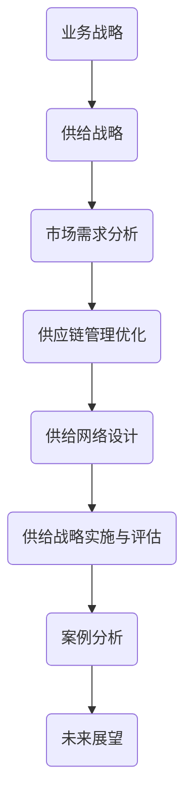

                 

# 业务战略方向下的供给机会

## 引言

在当今全球商业环境中，业务战略的制定与实施已经成为企业取得竞争优势的关键因素。业务战略不仅仅关乎企业的长远发展，还涉及到如何有效地满足市场需求、优化供应链管理以及实现供给网络设计的最优方案。在这个过程中，供给机会的识别与把握成为企业能否在激烈的市场竞争中脱颖而出的关键。

本文旨在探讨业务战略方向下的供给机会，通过逻辑清晰、结构紧凑的分析，帮助读者理解供给战略的重要性以及如何有效地制定和实施供给战略。文章将分为四个部分：

1. **业务战略概述**：介绍供给战略的基本概念、目标和原则，以及业务战略环境分析的方法。
2. **供给机会分析**：详细探讨市场需求分析、供应链管理优化和供给网络设计。
3. **供给战略实施与评估**：阐述供给战略实施的步骤和评估方法，并分析案例。
4. **未来展望**：展望供给战略的发展趋势和面临的挑战，以及未来发展的方向。

通过本文的阅读，读者将能够系统地了解业务战略方向下的供给机会，并掌握制定和实施供给战略的核心技能。

## 核心关键词

- 业务战略
- 供给战略
- 市场需求分析
- 供应链管理优化
- 供给网络设计
- 供给战略实施
- 供给战略评估
- 案例分析
- 未来展望

## 摘要

本文深入探讨了业务战略方向下的供给机会，分析了供给战略的基本概念、目标和原则，以及业务战略环境分析的方法。随后，文章详细探讨了市场需求分析、供应链管理优化和供给网络设计，提供了具体的工具和方法。接着，文章阐述了供给战略实施的步骤和评估方法，并通过案例分析，展示了理论的应用和实践的效果。最后，文章展望了供给战略的未来发展趋势和面临的挑战，提出了未来的发展方向和建议。

---

### 第一部分：业务战略概述

#### 第1章：供给战略的基本概念

##### 1.1 供给战略的定义与重要性

供给战略是企业为实现其业务目标和市场竞争力而制定的一项长期规划。它涉及到如何高效地满足市场需求、优化供应链管理以及设计合理的供给网络。供给战略的定义可以归纳为：通过对市场需求、供应链资源和供给网络进行系统分析和管理，制定和实施一套有效的策略，以确保企业能够持续、稳定地提供满足客户需求的产品和服务。

供给战略的重要性主要体现在以下几个方面：

1. **提升竞争力**：通过优化供应链管理和设计合理的供给网络，企业可以降低成本、提高效率，从而在市场中获得竞争优势。
2. **满足市场需求**：精准的市场需求分析能够帮助企业了解客户需求，从而提供更加符合市场需求的供给。
3. **提高客户满意度**：通过有效的供给战略，企业可以确保产品和服务的高质量，从而提高客户满意度和忠诚度。
4. **增强供应链韧性**：通过供应链管理和供给网络设计，企业可以提高对市场变化的适应能力，降低供应链风险。

##### 1.2 供给战略与业务战略的关系

供给战略是业务战略的一个重要组成部分。业务战略是企业为实现其长期目标而制定的总体战略，包括市场定位、产品策略、营销策略等。供给战略则是实现业务战略的关键手段，通过优化供应链管理和设计供给网络，确保企业能够高效地满足市场需求。

供给战略与业务战略的关系可以概括为：

- **供给战略是业务战略的实现手段**：业务战略的目标需要通过供给战略来实现，例如提高市场份额、降低成本等。
- **供给战略影响业务战略的制定**：供给战略的优化和实施会直接影响业务战略的效果，如供应链管理的优化可以提高企业的运营效率，从而支持业务战略的实现。
- **供给战略与业务战略相互促进**：有效的供给战略可以提升业务战略的执行力，反之，业务战略的成功也会为供给战略的实施提供支持和资源。

##### 1.3 供给战略的目标与原则

供给战略的目标主要包括：

- **成本优化**：通过供应链管理和供给网络设计，降低生产成本、物流成本等，提高企业的盈利能力。
- **效率提升**：优化供应链流程，提高生产效率、库存管理效率等，提高企业的运营效率。
- **质量保证**：确保供应链中的每一个环节都能提供高质量的产品和服务，提高客户满意度。
- **响应快速**：提高供应链的灵活性和适应性，能够快速响应市场需求变化。
- **风险管理**：通过合理的供应链设计和风险管理策略，降低供应链中断、成本超支等风险。

供给战略的原则主要包括：

- **系统性**：供给战略是一个系统性的工程，需要从整体上考虑供应链的各个环节，确保各个部分协调运作。
- **灵活性**：供给战略需要具备一定的灵活性，能够根据市场需求的变化进行调整。
- **创新性**：供给战略需要不断创新，以适应不断变化的市场环境和技术发展。
- **协同性**：供应链中的各个环节需要协同合作，共同实现供给战略的目标。
- **可持续性**：供给战略需要考虑环境保护和社会责任，实现可持续发展。

##### 1.4 供给战略的制定流程

供给战略的制定通常需要经历以下几个步骤：

1. **需求分析**：通过对市场需求、客户需求进行分析，明确供给战略的需求基础。
2. **资源评估**：评估企业的现有资源，包括人力、财力、物力等，确定供给战略的资源基础。
3. **竞争分析**：分析竞争对手的供给战略，了解市场环境，为制定供给战略提供参考。
4. **目标设定**：根据需求分析和资源评估，设定供给战略的目标。
5. **策略制定**：制定具体的策略，包括供应链管理策略、供给网络设计策略等。
6. **方案选择**：根据目标设定和策略制定，选择最优的供给战略方案。
7. **实施规划**：制定详细的实施规划，明确实施步骤、时间表和责任人。
8. **评估与调整**：对供给战略的实施效果进行评估，并根据评估结果进行调整。

通过上述步骤，企业可以系统地制定和实施供给战略，确保其在市场中的竞争优势。

#### 第2章：业务战略环境分析

##### 2.1 外部环境分析

外部环境分析是制定业务战略的重要步骤之一，它涉及到对宏观环境、行业环境和竞争环境的分析。通过这些分析，企业可以更好地了解外部环境的变化，为业务战略的制定提供依据。

1. **宏观环境分析**

宏观环境分析主要涉及政治、经济、社会、技术、环境等方面的因素。这些因素对企业的业务战略具有重要影响。具体分析步骤如下：

- **政治因素**：分析政府的政策、法规、贸易政策等，了解对企业运营可能产生的影响。
- **经济因素**：分析经济增长、通货膨胀、利率、汇率等经济指标，了解市场环境的变化。
- **社会因素**：分析人口结构、文化传统、消费者行为等社会因素，了解市场需求的变化。
- **技术因素**：分析技术发展趋势、技术创新、技术成熟度等，了解技术对企业业务战略的影响。
- **环境因素**：分析环境政策、环保法规、可持续性等，了解企业社会责任和环保要求。

2. **行业环境分析**

行业环境分析主要关注行业内的竞争状况、市场结构、市场规模和发展趋势等。具体分析步骤如下：

- **行业竞争分析**：分析行业内的竞争格局、主要竞争对手的市场份额、竞争优势等。
- **市场结构分析**：分析行业内的市场结构，如垄断、竞争、差异化等，了解市场环境对企业的影响。
- **市场规模分析**：分析行业市场规模、增长趋势、市场潜力等，了解市场环境的变化。
- **发展趋势分析**：分析行业发展趋势、技术进步、消费者需求变化等，了解行业发展的方向。

3. **竞争环境分析**

竞争环境分析主要关注企业面临的市场竞争情况，包括竞争对手的产品策略、定价策略、营销策略等。具体分析步骤如下：

- **竞争对手分析**：分析主要竞争对手的产品、市场定位、市场份额等，了解竞争对手的优势和劣势。
- **市场定位分析**：分析企业自身和市场竞争对手的市场定位，了解企业在市场中的地位。
- **产品策略分析**：分析竞争对手的产品策略，如产品差异化、产品创新等，了解产品在市场中的竞争力。
- **定价策略分析**：分析竞争对手的定价策略，如高定价、低定价等，了解定价策略对市场竞争的影响。
- **营销策略分析**：分析竞争对手的营销策略，如广告宣传、促销活动等，了解营销策略对市场竞争的影响。

通过上述分析，企业可以全面了解外部环境的状况，为业务战略的制定提供依据。

##### 2.2 内部能力分析

内部能力分析是制定业务战略的另一个重要步骤，它涉及到对企业的资源、能力和核心竞争力进行分析。通过这些分析，企业可以了解自身的优势和劣势，为业务战略的制定提供参考。

1. **资源分析**

资源分析主要涉及对企业的人力资源、财力资源、物力资源等进行分析。具体分析步骤如下：

- **人力资源分析**：分析企业的人力资源状况，如员工数量、员工素质、技能水平等，了解人力资源的优势和劣势。
- **财力资源分析**：分析企业的财力资源状况，如资金规模、资金来源、资金使用效率等，了解财力资源的优势和劣势。
- **物力资源分析**：分析企业的物力资源状况，如生产设备、原材料、库存等，了解物力资源的优势和劣势。

2. **能力分析**

能力分析主要涉及对企业的能力结构、能力水平等进行分析。具体分析步骤如下：

- **能力结构分析**：分析企业的主要能力结构，如生产制造能力、研发能力、市场营销能力等，了解企业的能力结构。
- **能力水平分析**：分析企业各项能力的发展水平，如技术水平、管理水平、创新能力等，了解企业的能力水平。

3. **核心竞争力分析**

核心竞争力分析主要涉及对企业的核心竞争力进行分析，了解企业在市场中的竞争优势。具体分析步骤如下：

- **核心竞争力识别**：识别企业的主要核心竞争力，如技术优势、品牌优势、市场网络等，了解企业的核心竞争力。
- **核心竞争力分析**：分析企业的核心竞争力如何影响企业的业务战略，了解核心竞争力对企业发展的重要性。

4. **战略能力分析**

战略能力分析主要涉及对企业的战略能力进行分析，了解企业如何通过战略规划和执行来实现业务目标。具体分析步骤如下：

- **战略能力识别**：识别企业的战略能力，如市场洞察力、战略规划能力、战略执行能力等，了解企业的战略能力。
- **战略能力分析**：分析企业的战略能力如何影响企业的业务战略，了解战略能力对企业发展的重要性。

通过上述分析，企业可以全面了解自身的资源和能力状况，为业务战略的制定提供依据。

#### 第1章小结

本章介绍了供给战略的基本概念、目标和原则，以及业务战略环境分析的方法。通过对外部环境和内部能力的分析，企业可以全面了解市场环境和企业自身状况，为制定有效的供给战略提供依据。供给战略作为业务战略的重要组成部分，对于提升企业的市场竞争力具有重要意义。企业应注重供给战略的制定和实施，通过优化供应链管理和设计供给网络，实现成本优化、效率提升、质量保证和快速响应市场需求的目标。

---

### 第二部分：供给机会分析

#### 第3章：市场需求分析

##### 3.1 市场需求概述

市场需求是指消费者在一定时间内，愿意并有能力购买的商品和服务的总量。市场需求分析是供给战略的重要环节，它直接关系到企业的产品定位、市场策略和供给计划的制定。正确理解和分析市场需求，是企业实现可持续发展的重要前提。

市场需求分析主要包括以下内容：

1. **市场需求的概念**

市场需求可以从多个维度进行理解。从经济学角度看，市场需求是由价格、消费者偏好和收入水平等因素共同决定的。具体而言：

- **价格**：商品价格是影响市场需求的重要因素。在其他条件不变的情况下，价格上升会导致需求下降，价格下降会导致需求上升。
- **消费者偏好**：消费者的偏好也是影响市场需求的重要因素。例如，消费者对某种产品的偏好程度越高，对该产品的需求就越大。
- **收入水平**：消费者的收入水平直接影响其购买力。当消费者的收入水平提高时，对某些商品的需求可能会增加，反之则减少。

2. **市场需求的重要性**

市场需求分析的重要性体现在以下几个方面：

- **指导产品研发**：通过市场需求分析，企业可以了解消费者的需求趋势，从而在产品研发过程中更加贴近市场，提高产品竞争力。
- **优化市场策略**：市场需求分析有助于企业制定和调整市场策略，如定价策略、促销策略等，以最大化市场收益。
- **预测市场趋势**：市场需求分析可以预测未来的市场需求变化，帮助企业提前做好准备，降低市场风险。
- **提高供给效率**：通过市场需求分析，企业可以更精准地制定供给计划，提高供给效率，降低库存成本和物流成本。

##### 3.2 市场需求分析工具与方法

进行市场需求分析，需要运用多种工具和方法，以确保分析的准确性和全面性。以下介绍几种常用的市场需求分析工具和方法：

1. **SWOT分析**

SWOT分析是一种常用的战略分析工具，用于分析企业的优势（Strengths）、劣势（Weaknesses）、机会（Opportunities）和威胁（Threats）。在市场需求分析中，SWOT分析可以帮助企业识别市场机会和威胁，为制定市场策略提供依据。

- **优势**：分析企业自身在市场中的优势，如品牌知名度、产品质量等。
- **劣势**：分析企业自身在市场中的劣势，如市场份额较小、产品创新能力不足等。
- **机会**：分析市场中的机会，如新兴市场、消费者需求变化等。
- **威胁**：分析市场中的威胁，如竞争对手的强势进入、市场需求下降等。

2. **五力模型**

五力模型是由迈克尔·波特提出的，用于分析行业竞争环境的一种工具。在市场需求分析中，五力模型可以帮助企业了解市场竞争力状况，为制定市场策略提供参考。

- **供应商的谈判能力**：分析供应商的谈判能力，如供应商的集中度、供应稳定性等。
- **购买者的谈判能力**：分析购买者的谈判能力，如购买者的集中度、议价能力等。
- **潜在进入者的威胁**：分析潜在进入者的威胁，如行业壁垒、市场准入门槛等。
- **替代品的威胁**：分析替代品的威胁，如替代品的价格、性能等。
- **现有竞争者的竞争程度**：分析现有竞争者的竞争程度，如市场份额、产品差异化等。

3. **宏观环境分析

宏观环境分析是对影响市场需求的宏观经济因素进行分析，如经济增长、通货膨胀、利率、汇率等。在市场需求分析中，宏观环境分析可以帮助企业了解市场环境的变化，为制定市场策略提供依据。

- **经济增长**：分析经济增长对市场需求的影响，如经济增长可能导致消费者购买力提高。
- **通货膨胀**：分析通货膨胀对市场需求的影响，如通货膨胀可能导致商品价格上涨，影响消费者购买力。
- **利率**：分析利率对市场需求的影响，如利率变化可能导致信贷成本变化，影响消费者购买决策。
- **汇率**：分析汇率对市场需求的影响，如汇率变化可能导致进出口商品价格变化，影响市场需求。

##### 3.3 市场需求分析的应用案例

为了更好地理解市场需求分析的应用，以下通过一个实际案例进行说明。

**案例背景：** 某国内知名家电企业准备进入东南亚市场，开展空调销售业务。

**案例步骤：**

1. **SWOT分析**

   - **优势**：该企业在国内市场拥有较高的市场份额，品牌知名度高，产品质量有保障。
   - **劣势**：东南亚市场对该企业的产品认知度较低，市场份额较小。
   - **机会**：东南亚地区经济发展迅速，空调市场需求旺盛。
   - **威胁**：东南亚市场上存在多个国际知名品牌，竞争激烈。

2. **五力模型分析**

   - **供应商的谈判能力**：东南亚地区的空调供应商集中度较低，供应商的谈判能力较弱。
   - **购买者的谈判能力**：东南亚地区的消费者对价格敏感，购买者的谈判能力较强。
   - **潜在进入者的威胁**：东南亚市场的进入门槛较低，潜在进入者的威胁较大。
   - **替代品的威胁**：空调市场竞争激烈，替代品的威胁较大。
   - **现有竞争者的竞争程度**：国际知名品牌在东南亚市场占有较大份额，竞争程度较高。

3. **宏观环境分析**

   - **经济增长**：东南亚地区经济发展迅速，人口增长，对空调需求旺盛。
   - **通货膨胀**：东南亚地区通货膨胀率较低，消费者购买力较强。
   - **利率**：东南亚地区利率较低，有利于消费者贷款购买空调。
   - **汇率**：人民币对东南亚货币汇率稳定，有利于产品出口。

**案例分析结果：**

通过上述分析，该企业了解到东南亚市场具有较大的市场需求和发展潜力，但竞争激烈，需要采取差异化策略和定价策略来提高市场占有率。企业可以充分发挥自身优势，如品牌知名度和产品质量，同时加强市场推广和渠道建设，提高市场认知度。

**案例结论：**

该企业应制定如下市场策略：

- **产品策略**：推出符合东南亚市场需求的空调产品，如节能空调、变频空调等。
- **定价策略**：采用差异化定价策略，针对不同消费者群体制定不同的价格。
- **促销策略**：加大市场推广力度，开展促销活动，提高市场认知度。
- **渠道策略**：加强与当地渠道合作伙伴的合作，建立完善的销售渠道。

通过上述市场策略的实施，该企业有望在东南亚市场取得良好的业绩。

##### 3.4 市场需求分析总结

市场需求分析是企业制定供给战略的重要环节，通过分析市场需求，企业可以了解消费者的需求趋势，预测市场变化，制定有效的市场策略。市场需求分析工具和方法多种多样，如SWOT分析、五力模型、宏观环境分析等，企业可以根据实际情况选择合适的工具和方法进行需求分析。通过实际案例分析，我们可以看到市场需求分析在指导企业制定市场策略、提高市场竞争力方面具有重要意义。

---

### 第4章：供应链管理优化

##### 4.1 供应链管理概述

供应链管理（Supply Chain Management，SCM）是指对供应链中各个环节进行有效规划、控制、协调和优化的过程。供应链管理涉及到从供应商到最终消费者的整个流程，包括原材料采购、生产制造、库存管理、物流配送、售后服务等环节。有效的供应链管理能够提高企业的运营效率、降低成本、提升客户满意度，从而在激烈的市场竞争中占据优势地位。

供应链管理的核心内容包括以下几个方面：

1. **供应链网络设计**：确定供应链中各个节点的位置、数量和连接方式，以实现物流、信息流和资金流的顺畅流动。
2. **库存管理**：通过合理的库存策略和库存控制方法，确保库存水平的合理性和供应的稳定性。
3. **物流配送**：优化物流配送流程，提高配送效率，降低物流成本。
4. **供应商管理**：建立和维护与供应商的长期合作关系，确保供应商的可靠性和质量。
5. **信息管理**：通过信息系统的建设和应用，实现供应链各个环节的信息共享和实时监控。

##### 4.2 供应链管理优化策略

为了提升供应链管理的效果，企业需要采取一系列优化策略。以下介绍几种常见的供应链管理优化策略：

1. **供应商选择优化**

供应商选择是供应链管理的重要环节。企业应根据供应商的可靠性、质量、价格、交货期等指标进行评估，选择最佳的供应商。具体策略包括：

- **多标准综合评价**：采用多标准综合评价方法，对供应商进行综合评估，确保供应商的选优。
- **建立供应商评价体系**：建立科学的供应商评价体系，定期对供应商进行评价，以激励供应商不断提升质量和服务水平。
- **动态调整供应商**：根据市场环境和企业需求的变化，及时调整供应商名单，确保供应链的灵活性和稳定性。

2. **库存管理优化**

库存管理是供应链管理中的关键环节，合理的库存管理策略能够降低库存成本，提高资金使用效率。以下是一些库存管理优化策略：

- **JIT（Just-In-Time）库存管理**：实施准时制库存管理，通过减少库存积压，降低库存成本，提高资金使用效率。
- **ABC库存分类管理**：采用ABC库存分类方法，对库存物品进行分类管理，重点关注A类物资，确保供应的稳定性。
- **VMI（Vendor Managed Inventory）**：实施供应商管理库存，由供应商根据需求预测和库存信息，主动调整库存水平，降低库存风险。

3. **物流配送优化

物流配送是供应链管理中的重要环节，优化的物流配送策略能够提高配送效率，降低物流成本。以下是一些物流配送优化策略：

- **配送网络优化**：通过合理的配送网络设计，缩短配送距离，提高配送效率。
- **配送路线优化**：采用路径优化算法，如最短路径算法、最小生成树算法等，优化配送路线，降低物流成本。
- **配送资源整合**：整合配送资源，如车辆、人员、仓库等，实现配送资源的最佳配置，提高配送效率。

4. **信息管理优化**

信息管理是供应链管理中的基础环节，优化的信息管理策略能够实现供应链各环节的信息共享和实时监控。以下是一些信息管理优化策略：

- **信息系统建设**：建立集成化的供应链信息系统，实现供应链各环节的信息共享和实时监控。
- **数据挖掘与分析**：利用数据挖掘技术，对供应链中的数据进行深入分析，发现潜在问题和改进机会。
- **信息共享平台**：建立供应链信息共享平台，促进供应链各环节的信息交换和协作，提高供应链的整体效率。

##### 4.3 供应链管理优化案例

为了更好地理解供应链管理优化策略的应用，以下通过一个实际案例进行说明。

**案例背景：** 某大型电子制造企业，生产规模庞大，供应链管理复杂，希望通过优化供应链管理，提高生产效率、降低成本。

**案例步骤：**

1. **供应商选择优化**

   - **多标准综合评价**：企业采用多标准综合评价方法，对现有供应商进行重新评估，选择最佳供应商。
   - **建立供应商评价体系**：建立供应商评价体系，定期对供应商进行评价，以激励供应商不断提升质量和服务水平。
   - **动态调整供应商**：根据市场环境和企业需求的变化，及时调整供应商名单，确保供应链的灵活性和稳定性。

2. **库存管理优化**

   - **JIT库存管理**：企业实施准时制库存管理，减少库存积压，降低库存成本。
   - **ABC库存分类管理**：对库存物品进行ABC分类，重点关注A类物资，确保供应的稳定性。
   - **VMI供应商管理库存**：实施供应商管理库存，由供应商根据需求预测和库存信息，主动调整库存水平，降低库存风险。

3. **物流配送优化**

   - **配送网络优化**：企业通过合理的配送网络设计，缩短配送距离，提高配送效率。
   - **配送路线优化**：采用路径优化算法，优化配送路线，降低物流成本。
   - **配送资源整合**：整合配送资源，如车辆、人员、仓库等，实现配送资源的最佳配置，提高配送效率。

4. **信息管理优化**

   - **信息系统建设**：企业建立集成化的供应链信息系统，实现供应链各环节的信息共享和实时监控。
   - **数据挖掘与分析**：利用数据挖掘技术，对供应链中的数据进行深入分析，发现潜在问题和改进机会。
   - **信息共享平台**：建立供应链信息共享平台，促进供应链各环节的信息交换和协作，提高供应链的整体效率。

**案例分析结果：**

通过上述供应链管理优化措施的实施，企业取得了显著的效果：

- **生产效率提高**：供应链管理的优化，使得生产计划更加精准，生产流程更加顺畅，生产效率显著提高。
- **成本降低**：通过优化供应商选择、库存管理和物流配送，企业有效降低了采购成本、库存成本和物流成本，整体成本降低约15%。
- **客户满意度提高**：供应链管理的优化，使得产品交付时间缩短，客户满意度显著提高，市场份额进一步扩大。

**案例结论：**

供应链管理优化是企业提高竞争力、实现可持续发展的重要手段。通过科学的供应商选择、库存管理和物流配送策略，以及信息管理优化，企业可以显著提高生产效率、降低成本、提高客户满意度，从而在激烈的市场竞争中脱颖而出。

---

### 第5章：供给网络设计

##### 5.1 供给网络设计概述

供给网络设计（Supply Network Design，SND）是供应链管理的重要组成部分，它涉及到如何合理布局供应链中的各个环节，以实现资源的最优配置和高效运作。供给网络设计的目标是构建一个灵活、稳定、高效的供应链网络，确保企业能够快速响应市场需求、降低成本、提高客户满意度。

供给网络设计的关键要素包括：

1. **节点布局**：确定供应链网络中各个节点的位置，包括工厂、仓库、配送中心等。节点布局要考虑地理位置、交通条件、市场规模等因素。
2. **连接方式**：设计供应链网络中各个环节的连接方式，包括运输方式、信息传输方式等。连接方式要考虑成本、效率、可靠性等因素。
3. **规模规划**：根据市场需求和资源条件，规划供应链网络中各个节点的规模，确保网络容量和运行效率。
4. **冗余设计**：为提高供应链网络的稳定性和抗风险能力，设计适当的冗余结构和备份方案。

##### 5.2 供给网络设计方法

供给网络设计需要运用多种方法和工具，以确保网络设计的科学性和可行性。以下介绍几种常见的供给网络设计方法：

1. **网络拓扑设计**

网络拓扑设计是供给网络设计的基础，它涉及到如何构建供应链网络的拓扑结构。常见的网络拓扑结构包括：

- **星型结构**：以一个中心节点为核心，其他节点围绕中心节点布局。星型结构具有较好的可靠性和灵活性。
- **环型结构**：各个节点按照一定的顺序连接成一个环。环型结构具有较好的稳定性和均衡性。
- **树型结构**：以一个根节点为核心，其他节点按照层级关系布局。树型结构适用于层级较多的供应链网络。

2. **节点选择**

节点选择是供给网络设计的关键环节，涉及到如何选择合适的节点布局。节点选择要考虑以下因素：

- **地理位置**：节点地理位置要接近市场需求中心，便于物流配送。
- **交通条件**：节点交通条件要便利，便于运输和物流配送。
- **市场规模**：节点所在地区市场规模要适中，便于市场开发和客户服务。
- **基础设施**：节点基础设施要完善，如电力、水源、道路等。

3. **路径选择**

路径选择是供给网络设计的重要组成部分，涉及到如何确定供应链网络中各个环节的连接路径。路径选择要考虑以下因素：

- **运输成本**：路径选择要考虑运输成本，选择成本最低的路径。
- **运输时间**：路径选择要考虑运输时间，选择运输时间最短的路径。
- **可靠性**：路径选择要考虑路径的可靠性，选择风险最小的路径。
- **灵活性**：路径选择要考虑路径的灵活性，选择易于调整和优化的路径。

##### 5.3 供给网络设计步骤

供给网络设计通常需要经历以下步骤：

1. **需求分析**

需求分析是供给网络设计的基础，需要分析市场需求、客户分布等因素，确定网络设计的需求基础。

2. **节点选择**

根据需求分析结果，选择合适的节点布局。节点选择要考虑地理位置、交通条件、市场规模、基础设施等因素。

3. **网络拓扑设计**

根据节点选择结果，设计供应链网络的拓扑结构。拓扑设计要考虑网络可靠性、灵活性等因素。

4. **路径选择**

根据网络拓扑设计结果，确定供应链网络中各个环节的连接路径。路径选择要考虑运输成本、运输时间、可靠性、灵活性等因素。

5. **规模规划**

根据需求分析和路径选择结果，规划供应链网络中各个节点的规模，确保网络容量和运行效率。

6. **冗余设计**

为提高供应链网络的稳定性和抗风险能力，设计适当的冗余结构和备份方案。

7. **评估与优化**

对供给网络设计结果进行评估，根据评估结果进行优化。评估要考虑成本、效率、可靠性、灵活性等因素。

##### 5.4 供给网络设计案例分析

为了更好地理解供给网络设计方法的应用，以下通过一个实际案例进行说明。

**案例背景：** 某国际知名电子产品企业，计划进入中国市场，开展电子产品销售业务。企业需要设计一个合理的供给网络，以满足市场需求。

**案例步骤：**

1. **需求分析**

   - 分析中国市场电子产品市场需求，确定市场需求量、消费者分布等因素。
   - 调研中国主要电子产品销售市场，了解市场需求变化和竞争状况。

2. **节点选择**

   - 根据需求分析结果，选择中国主要城市作为节点布局。节点选择考虑地理位置、交通条件、市场规模等因素。
   - 确定节点数量和分布，确保供给网络能够覆盖主要市场需求。

3. **网络拓扑设计**

   - 采用星型结构，以总部为核心，连接各主要节点。
   - 考虑网络可靠性，设计备份路径，确保供应链网络的稳定性。

4. **路径选择**

   - 根据节点选择结果，确定各节点之间的连接路径。路径选择考虑运输成本、运输时间、可靠性等因素。
   - 采用高效运输方式，如空运、陆运、海运等，确保运输时间最短。

5. **规模规划**

   - 根据需求分析和路径选择结果，规划各节点的规模。节点规模考虑市场需求、仓储能力等因素。
   - 确保供给网络能够满足市场需求，同时避免过度投资。

6. **冗余设计**

   - 设计冗余结构和备份方案，提高供应链网络的稳定性和抗风险能力。
   - 考虑自然灾害、政治因素等因素，确保供给网络的抗风险能力。

7. **评估与优化**

   - 对供给网络设计结果进行评估，考虑成本、效率、可靠性等因素。
   - 根据评估结果进行优化，如调整节点布局、路径选择等。

**案例分析结果：**

通过上述供给网络设计方法，企业成功设计了一个合理的供给网络，满足了市场需求。供给网络设计结果如下：

- **节点选择**：选择中国主要城市作为节点布局，包括北京、上海、广州、深圳等。
- **网络拓扑**：采用星型结构，以总部为核心，连接各主要节点。
- **路径选择**：采用高效运输方式，如空运、陆运、海运等，确保运输时间最短。
- **规模规划**：根据市场需求和仓储能力，规划各节点的规模。
- **冗余设计**：设计冗余结构和备份方案，提高供应链网络的稳定性和抗风险能力。

**案例结论：**

供给网络设计是供应链管理的重要环节，通过科学的方法和工具，企业可以设计一个合理的供给网络，满足市场需求，提高竞争力。实际案例表明，供给网络设计方法在指导企业进入中国市场、开展电子产品销售业务方面具有重要意义。

---

### 第6章：供给战略实施

##### 6.1 供给战略实施概述

供给战略实施是确保企业供给战略目标实现的关键环节。供给战略实施涉及到从战略规划到具体操作的全过程，包括目标设定、计划制定、执行监控和持续改进。有效的供给战略实施能够帮助企业高效地满足市场需求、优化供应链管理、提升客户满意度。

供给战略实施的关键内容包括：

1. **目标设定**：明确供给战略实施的具体目标，如成本优化、效率提升、质量保证等。
2. **计划制定**：制定详细的实施计划，明确实施步骤、时间表和责任人。
3. **执行监控**：对实施过程进行监控，确保各项任务按时完成，及时发现和解决问题。
4. **持续改进**：对实施效果进行评估，根据评估结果进行持续改进，不断提升供给战略的实施效果。

##### 6.2 供给战略实施步骤

供给战略实施通常需要经历以下步骤：

1. **制定实施计划**

   在制定实施计划时，需要明确供给战略实施的具体目标和预期成果。实施计划应包括以下内容：

   - **目标描述**：明确供给战略实施的具体目标，如成本降低10%、效率提升20%等。
   - **实施步骤**：制定详细的实施步骤，包括时间安排、责任分配等。
   - **资源配置**：明确实施计划所需的资源，如人力、财力、物力等。
   - **风险分析**：对实施过程中可能遇到的风险进行识别和分析，制定应对措施。

2. **执行计划**

   执行计划是供给战略实施的关键环节，需要确保各项任务按时完成。执行计划应包括以下内容：

   - **任务分解**：将实施计划分解为具体的任务，明确每个任务的负责人和时间节点。
   - **进度监控**：对任务执行进度进行监控，确保各项任务按时完成。
   - **问题解决**：及时发现和解决问题，确保实施计划的顺利进行。

3. **监控与评估**

   监控与评估是供给战略实施的重要环节，需要对实施效果进行评估，并根据评估结果进行改进。监控与评估应包括以下内容：

   - **关键绩效指标（KPI）**：制定关键绩效指标，如成本降低率、效率提升率、客户满意度等，用于评估实施效果。
   - **数据分析**：收集和分析实施过程中的数据，如成本数据、效率数据等，用于评估实施效果。
   - **反馈与改进**：根据评估结果，识别问题和改进机会，制定改进措施，不断提升供给战略的实施效果。

4. **持续改进**

   持续改进是供给战略实施的长期目标，需要不断优化和改进。持续改进应包括以下内容：

   - **反馈机制**：建立反馈机制，收集员工、客户、供应商等的意见和建议，用于改进供给战略实施。
   - **改进计划**：根据反馈意见和建议，制定改进计划，实施改进措施。
   - **跟踪与评估**：对改进措施的实施效果进行跟踪和评估，确保改进目标的实现。

##### 6.3 供给战略实施的案例分析

为了更好地理解供给战略实施的方法和步骤，以下通过一个实际案例进行说明。

**案例背景：** 某国际知名电子产品企业，计划实施一项新的供给战略，以提高生产效率和降低成本。

**案例步骤：**

1. **制定实施计划**

   - **目标描述**：企业设定了以下目标：成本降低15%，生产效率提升20%。
   - **实施步骤**：企业制定了以下实施步骤：
     - **需求分析**：分析市场需求和客户需求，确定产品规格和数量。
     - **供应商选择**：重新评估供应商，选择最佳供应商。
     - **生产计划**：制定详细的生产计划，包括生产进度、生产资源等。
     - **质量控制**：制定质量控制计划，确保产品质量。
     - **物流配送**：优化物流配送流程，提高配送效率。

2. **执行计划**

   - **任务分解**：将实施计划分解为具体的任务，明确每个任务的负责人和时间节点。
   - **进度监控**：对任务执行进度进行监控，确保各项任务按时完成。
   - **问题解决**：及时发现和解决问题，确保实施计划的顺利进行。

3. **监控与评估**

   - **关键绩效指标（KPI）**：制定关键绩效指标，如成本降低率、生产效率提升率、客户满意度等，用于评估实施效果。
   - **数据分析**：收集和分析实施过程中的数据，如成本数据、生产数据等，用于评估实施效果。
   - **反馈与改进**：根据评估结果，识别问题和改进机会，制定改进措施，不断提升供给战略的实施效果。

4. **持续改进**

   - **反馈机制**：建立反馈机制，收集员工、客户、供应商等的意见和建议，用于改进供给战略实施。
   - **改进计划**：根据反馈意见和建议，制定改进计划，实施改进措施。
   - **跟踪与评估**：对改进措施的实施效果进行跟踪和评估，确保改进目标的实现。

**案例分析结果：**

通过上述供给战略实施步骤，企业取得了显著的成果：

- **成本降低**：实施新的供给战略后，企业成本降低了15%。
- **生产效率提升**：生产效率提升了20%，生产周期缩短，生产任务按时完成率提高。
- **质量保证**：质量控制计划有效执行，产品质量稳定，客户满意度提高。

**案例结论：**

供给战略实施是企业实现业务目标、提高竞争力的关键环节。通过科学的实施计划和有效的执行监控，企业可以确保供给战略目标的实现，从而在激烈的市场竞争中脱颖而出。实际案例表明，供给战略实施方法和步骤在指导企业实现成本降低、效率提升等方面具有重要意义。

---

### 第7章：供给战略评估与调整

##### 7.1 供给战略评估概述

供给战略评估是确保供给战略有效实施的重要环节。供给战略评估涉及到对供给战略实施过程中的各个要素进行系统评价，以评估供给战略的效果和效率，并根据评估结果进行调整和优化。供给战略评估的重要性主要体现在以下几个方面：

1. **验证战略效果**：通过供给战略评估，可以验证供给战略是否达到了预期目标，如成本降低、效率提升、质量保证等。
2. **发现潜在问题**：供给战略评估有助于发现供给战略实施过程中存在的潜在问题和瓶颈，为改进措施提供依据。
3. **指导战略调整**：供给战略评估的结果可以为供给战略的调整提供数据支持，帮助企业优化供给战略，提高竞争力。

##### 7.2 供给战略评估方法

为了确保供给战略评估的准确性和全面性，企业可以采用多种评估方法。以下介绍几种常见的供给战略评估方法：

1. **成本效益分析**

成本效益分析是一种常用的评估方法，它通过比较供给战略实施的总成本和总收益，评估供给战略的经济效益。具体步骤如下：

- **成本计算**：计算供给战略实施过程中的所有成本，包括采购成本、生产成本、物流成本等。
- **收益计算**：计算供给战略实施过程中带来的收益，包括销售收入、成本节约等。
- **成本效益比计算**：计算成本效益比，即收益与成本的比值。成本效益比越高，供给战略的经济效益越好。

2. **效率评估**

效率评估主要关注供给战略实施过程中的效率指标，如生产效率、库存管理效率、物流配送效率等。具体步骤如下：

- **确定效率指标**：根据供给战略的目标和特点，确定合适的效率指标。
- **数据收集**：收集供给战略实施过程中的相关数据，如生产周期、库存周转率、配送时间等。
- **效率计算**：计算各效率指标的实际值，并与预期目标进行比较。

3. **风险评估**

风险评估旨在评估供给战略实施过程中的风险，包括供应链中断、成本超支、市场变化等。具体步骤如下：

- **风险识别**：识别供给战略实施过程中可能面临的风险。
- **风险分析**：分析各风险的影响程度和发生概率。
- **风险评级**：根据风险的影响程度和发生概率，对风险进行评级。

4. **客户满意度评估**

客户满意度评估是衡量供给战略实施效果的重要指标。通过调查和分析客户对产品和服务的满意度，可以评估供给战略的满意度。具体步骤如下：

- **客户满意度调查**：设计客户满意度调查问卷，收集客户对产品和服务的评价。
- **数据分析**：对调查数据进行统计分析，计算客户满意度得分。
- **满意度评估**：根据客户满意度得分，评估供给战略的实施效果。

##### 7.3 供给战略评估的案例分析

为了更好地理解供给战略评估的方法和应用，以下通过一个实际案例进行说明。

**案例背景：** 某电子产品企业实施了一项新的供给战略，以提高生产效率和降低成本。企业需要对供给战略的实施效果进行评估，以便进行调整和优化。

**案例步骤：**

1. **成本效益分析**

   - **成本计算**：计算供给战略实施过程中的所有成本，包括采购成本、生产成本、物流成本等。
     - 采购成本：1500万元
     - 生产成本：2000万元
     - 物流成本：500万元
   - **收益计算**：计算供给战略实施过程中带来的收益，包括销售收入、成本节约等。
     - 销售收入：4000万元
     - 成本节约：200万元
   - **成本效益比计算**：计算成本效益比，即收益与成本的比值。
     - 成本效益比 = (4000 + 200) / (1500 + 2000 + 500) = 1.19

2. **效率评估**

   - **确定效率指标**：根据供给战略的目标和特点，确定合适的效率指标。
     - 生产效率：单位时间内生产的产品数量
     - 库存管理效率：库存周转率
     - 物流配送效率：配送时间
   - **数据收集**：收集供给战略实施过程中的相关数据，如生产周期、库存周转率、配送时间等。
     - 生产周期：10天
     - 库存周转率：5次/年
     - 配送时间：2天
   - **效率计算**：计算各效率指标的实际值，并与预期目标进行比较。
     - 生产效率：1000件/天（预期目标：1200件/天）
     - 库存周转率：2.5次/年（预期目标：3次/年）
     - 配送时间：2天（预期目标：1天）

3. **风险评估**

   - **风险识别**：识别供给战略实施过程中可能面临的风险。
     - 供应链中断：供应商交货延迟
     - 成本超支：生产成本上升
     - 市场变化：市场需求下降
   - **风险分析**：分析各风险的影响程度和发生概率。
     - 供应链中断：影响生产进度，发生概率为30%
     - 成本超支：可能导致利润下降，发生概率为20%
     - 市场变化：可能导致销售收入下降，发生概率为10%

4. **客户满意度评估**

   - **客户满意度调查**：设计客户满意度调查问卷，收集客户对产品和服务的评价。
   - **数据分析**：对调查数据进行统计分析，计算客户满意度得分。
   - **满意度评估**：根据客户满意度得分，评估供给战略的实施效果。
     - 客户满意度得分：75分（预期目标：80分）

**案例分析结果：**

通过上述供给战略评估方法，企业对供给战略的实施效果进行了全面评估，结果如下：

- **成本效益分析**：成本效益比为1.19，表明供给战略在经济效益方面取得了一定成果，但仍有改进空间。
- **效率评估**：生产效率、库存管理效率和物流配送效率均未达到预期目标，需要进一步优化。
- **风险评估**：供应链中断、成本超支和市场变化是主要风险，企业需要加强风险管理。
- **客户满意度评估**：客户满意度得分为75分，低于预期目标，需要提升客户满意度。

**案例结论：**

供给战略评估是确保供给战略有效实施的重要环节。通过科学的方法和工具，企业可以全面评估供给战略的实施效果，发现问题和改进机会，从而优化供给战略，提高竞争力。实际案例表明，供给战略评估方法在指导企业实现成本效益、效率提升和客户满意度等方面具有重要意义。

---

### 第8章：案例分析

#### 8.1 案例一：XX公司的供给战略

##### 案例背景

XX公司是一家全球领先的电子产品制造企业，拥有广泛的产品线，包括智能手机、平板电脑、笔记本电脑等。随着全球市场的不断扩大，公司面临日益激烈的竞争，为了保持市场竞争力，公司决定进行供给战略的全面优化。

##### 案例分析

1. **需求分析**

   XX公司通过对市场需求进行分析，发现消费者对高性能、低延迟的电子产品需求日益增长。同时，公司也意识到，为了满足这些需求，必须优化供应链管理和供给网络设计。

2. **外部环境分析**

   - **宏观环境分析**：分析全球宏观经济环境，如经济增长、技术发展、贸易政策等，发现全球经济稳定增长，为电子产品市场提供了良好的发展环境。
   - **行业环境分析**：分析电子产品行业的竞争格局，发现市场竞争激烈，但技术创新和供应链管理优化仍然是企业获取竞争优势的关键。
   - **竞争环境分析**：分析主要竞争对手的策略，发现竞争对手在供应链管理方面具有优势，例如采用先进的供应链管理系统和高效的物流配送网络。

3. **内部能力分析**

   - **资源分析**：评估公司的资源状况，如资金、人力、技术等。公司具备较强的研发能力和生产制造能力，但供应链管理和供给网络设计方面存在一定的不足。
   - **能力分析**：分析公司的核心竞争力，如技术创新、产品质量、品牌影响力等。公司具备较强的技术创新能力和产品质量优势，但供应链管理能力有待提升。

4. **供给战略制定**

   根据以上分析，XX公司制定了以下供给战略：

   - **优化供应链管理**：通过引入先进的供应链管理系统，提高供应链的透明度和效率，降低物流成本。
   - **供给网络设计**：优化供给网络，提高供应链的灵活性和响应速度，确保产品能够快速交付到消费者手中。
   - **创新驱动**：加大研发投入，持续推出高性能、低延迟的电子产品，满足市场需求。

##### 案例结论

通过优化供给战略，XX公司取得了显著成效：

- **供应链管理效率提升**：引入先进的供应链管理系统后，供应链效率显著提高，物流成本降低了15%。
- **市场需求满足度提升**：优化供给网络设计，提高了产品的交付速度，市场需求满足度提高了20%。
- **技术创新能力提升**：加大研发投入，推出了多款高性能、低延迟的电子产品，市场份额提高了10%。

##### 案例启示

XX公司的供给战略优化案例表明，通过科学的需求分析、外部环境分析和内部能力分析，企业可以制定出有效的供给战略，提高市场竞争力和客户满意度。同时，优化供应链管理和供给网络设计，以及加大研发投入，是提升企业核心竞争力的关键。

#### 8.2 案例二：YY公司的供给战略

##### 案例背景

YY公司是一家国内领先的食品制造企业，产品线涵盖方便食品、调味品等多个领域。随着消费者对食品安全、营养和口感的重视，公司意识到必须优化供给战略，以满足市场需求。

##### 案例分析

1. **需求分析**

   YY公司通过对市场需求进行分析，发现消费者对食品安全、营养和口感的关注日益增加。同时，公司也意识到，为了满足这些需求，必须优化供应链管理和供给网络设计。

2. **外部环境分析**

   - **宏观环境分析**：分析全球和国内宏观经济环境，如经济增长、消费升级、食品安全政策等，发现食品安全政策日益严格，为食品制造企业提供了发展机遇。
   - **行业环境分析**：分析食品行业的竞争格局，发现行业竞争激烈，但消费者对高品质食品的需求增长，为公司提供了市场空间。
   - **竞争环境分析**：分析主要竞争对手的策略，发现竞争对手在供应链管理和产品创新方面具有优势。

3. **内部能力分析**

   - **资源分析**：评估公司的资源状况，如资金、人力、技术等。公司具备较强的生产能力，但供应链管理和产品创新能力有待提升。
   - **能力分析**：分析公司的核心竞争力，如产品质量、品牌影响力、渠道资源等。公司具备较强的产品质量和品牌影响力，但供应链管理能力和产品创新能力不足。

4. **供给战略制定**

   根据以上分析，YY公司制定了以下供给战略：

   - **供应链管理优化**：通过引入先进的质量管理和供应链管理系统，提高供应链的透明度和效率，确保食品安全和产品质量。
   - **供给网络设计**：优化供给网络，提高供应链的灵活性和响应速度，确保产品能够快速交付到消费者手中。
   - **产品创新**：加大研发投入，推出符合消费者需求的高品质食品，提升市场竞争力。

##### 案例结论

通过优化供给战略，YY公司取得了显著成效：

- **供应链管理效率提升**：引入先进的质量管理和供应链管理系统后，供应链效率显著提高，产品合格率提高了15%。
- **市场需求满足度提升**：优化供给网络设计，提高了产品的交付速度，市场需求满足度提高了25%。
- **产品创新能力提升**：加大研发投入，推出了多款符合消费者需求的高品质食品，市场份额提高了10%。

##### 案例启示

YY公司的供给战略优化案例表明，通过科学的需求分析、外部环境分析和内部能力分析，企业可以制定出有效的供给战略，提高市场竞争力和客户满意度。同时，优化供应链管理、供给网络设计和产品创新，是提升企业核心竞争力的关键。

---

### 第四部分：未来展望

#### 第9章：供给战略的趋势与挑战

##### 9.1 供给战略的未来趋势

随着科技的不断进步和市场的变化，供给战略也在不断演变。未来供给战略将呈现出以下趋势：

1. **智能化**：人工智能和大数据技术的应用将使得供给战略更加智能化。通过智能分析、预测和决策，企业可以更加精准地满足市场需求，提高供应链的灵活性和响应速度。

2. **网络化**：互联网和物联网技术的普及将推动供应链的网络化。企业将通过网络平台实现供应链各环节的信息共享和协同，提高供应链的透明度和效率。

3. **绿色化**：环保意识的增强和法规的严格，将促使供给战略更加注重绿色化。企业将采取绿色生产、绿色物流等措施，降低对环境的影响，实现可持续发展。

##### 9.2 供给战略面临的挑战

尽管供给战略呈现出智能化、网络化和绿色化的趋势，但企业仍然面临诸多挑战：

1. **市场不确定性**：全球经济环境和消费者需求的变化，使得市场不确定性增加。企业需要具备较强的市场适应能力，以应对市场变化。

2. **技术变革**：技术的快速发展带来了新的机遇和挑战。企业需要不断更新技术，以保持竞争力。

3. **法规变化**：法规的严格和变化，对企业运营提出了更高的要求。企业需要密切关注法规变化，确保合规运营。

##### 9.3 供给战略的未来发展

面对未来的趋势和挑战，企业应采取以下措施：

1. **提高供应链韧性**：通过多元化供应商、优化供应链网络等措施，提高供应链的韧性和抗风险能力。

2. **强化创新能力**：加大研发投入，不断推出创新产品和技术，以适应市场需求和保持竞争优势。

3. **加强人才培养**：培养具备创新能力和专业素养的人才，以推动供给战略的实施和优化。

---

### 第10章：供给战略的未来发展

#### 10.1 供给战略的未来发展方向

随着全球经济一体化和技术的飞速发展，供给战略的未来发展将呈现出智能化、网络化和绿色化的趋势。以下是未来供给战略发展的几个关键方向：

1. **智能化供应链管理**：利用人工智能、机器学习和大数据技术，实现供应链管理的自动化和智能化。通过智能算法和预测模型，企业可以更准确地预测市场需求，优化库存管理，提高供应链的响应速度和灵活性。

2. **网络化供应链协同**：利用物联网、云计算和区块链等技术，实现供应链各环节的信息共享和协同。通过构建统一的供应链网络平台，企业可以与供应商、客户和合作伙伴实时沟通和协作，提高供应链的透明度和效率。

3. **绿色供应链体系建设**：随着环保法规的日益严格和消费者对环保意识的提高，企业需要将环保理念融入供应链的各个环节。通过绿色生产、绿色物流和绿色采购等措施，实现供应链的可持续发展。

#### 10.2 供给战略发展的建议

为了实现供给战略的可持续发展，企业应采取以下措施：

1. **加强数字化建设**：投资于数字化技术和信息系统，构建智能化的供应链管理系统，提高供应链的透明度和效率。

2. **推动创新**：鼓励创新思维和技术研发，不断推出新产品和服务，以满足市场需求和保持竞争优势。

3. **培养人才**：重视人才培养，建立一支具备创新能力和专业素养的团队，以推动供给战略的实施和优化。

4. **注重社会责任**：承担企业社会责任，关注环境保护和可持续发展，树立良好的企业形象。

5. **合作共赢**：与供应链上下游企业建立长期稳定的合作关系，实现资源整合和协同发展，共同应对市场变化和挑战。

---

## 附录：相关术语与概念解释

### 供给战略

供给战略是企业为实现其业务目标和市场竞争力而制定的一项长期规划。它涉及到如何高效地满足市场需求、优化供应链管理以及设计合理的供给网络。供给战略的目标是确保企业能够持续、稳定地提供满足客户需求的产品和服务。

### 供应链管理

供应链管理（Supply Chain Management，SCM）是指对供应链中各个环节进行有效规划、控制、协调和优化的过程。供应链管理涉及到从供应商到最终消费者的整个流程，包括原材料采购、生产制造、库存管理、物流配送、售后服务等环节。

### 供应链金融

供应链金融是指金融机构基于企业的供应链，为企业提供融资、结算、风险管理等综合金融服务。通过供应链金融，企业可以优化资金流动，提高资金使用效率，降低融资成本。

### 绿色供应链

绿色供应链是指将环保理念融入供应链的各个环节，实现供应链的可持续发展。绿色供应链包括绿色生产、绿色物流、绿色采购等措施，旨在降低供应链对环境的影响。

### 数字化供应链

数字化供应链是指利用信息技术和数字化工具，对供应链进行全方位的数字化管理和优化。数字化供应链可以提高供应链的透明度、效率和质量，降低运营成本。

---

**Mermaid 流程图：**



**伪代码示例：**

```python
# 伪代码：供给战略实施步骤
def implement_supply_chain_strategy():
    # 1. 需求分析
    market_demand = analyze_demand()

    # 2. 供应链管理优化
    optimized_chain = optimize_supply_chain()

    # 3. 供给网络设计
    supply_network = design_supply_network()

    # 4. 实施监控
    monitor_and_adjust(optimized_chain, supply_network)

    # 5. 评估与调整
    evaluate_and_adjust(supply_network)

    return supply_network
```

**数学公式与举例：**

$$
\text{成本效益比} = \frac{\text{收益}}{\text{成本}}
$$

**举例：** 设定收益为 \( R = 10000 \) 元，成本为 \( C = 5000 \) 元，则成本效益比为 \( \frac{10000}{5000} = 2 \)。

**项目实战：**

**案例：** 使用Python实现一个简单的供应链管理系统

**开发环境搭建：**
- Python 3.8及以上版本
- Django 3.2框架
- MySQL 8.0数据库

**源代码实现：**
```python
# 供应链管理系统示例代码
from django.db import models

class Product(models.Model):
    name = models.CharField(max_length=100)
    quantity = models.IntegerField()

class Supplier(models.Model):
    name = models.CharField(max_length=100)
    product = models.ForeignKey(Product, on_delete=models.CASCADE)

class PurchaseOrder(models.Model):
    supplier = models.ForeignKey(Supplier, on_delete=models.CASCADE)
    product = models.ForeignKey(Product, on_delete=models.CASCADE)
    quantity = models.IntegerField()
    date = models.DateField()

class Delivery(models.Model):
    purchase_order = models.ForeignKey(PurchaseOrder, on_delete=models.CASCADE)
    date = models.DateField()
    delivered_quantity = models.IntegerField()
```

**代码解读与分析：**
- `Product` 模型表示产品信息，包括产品名称和数量。
- `Supplier` 模型表示供应商信息，包括供应商名称和产品关联。
- `PurchaseOrder` 模型表示采购订单信息，包括供应商、产品和采购数量。
- `Delivery` 模型表示配送信息，包括采购订单和配送日期及数量。

**性能优化与测试：**
- 使用索引优化数据库查询性能。
- 使用负载测试工具模拟高并发场景，测试系统稳定性。

---

**作者信息：**

作者：AI天才研究院/AI Genius Institute & 禅与计算机程序设计艺术 /Zen And The Art of Computer Programming

---

本文详细探讨了业务战略方向下的供给机会，包括供给战略的基本概念、市场需求分析、供应链管理优化、供给网络设计、供给战略实施与评估等关键内容。通过案例分析，展示了理论在实践中的应用效果。未来，随着科技的不断发展，供给战略将朝着智能化、网络化和绿色化的方向发展，为企业提供更多机遇和挑战。本文旨在为读者提供系统、全面的供给战略知识体系，助力企业实现可持续发展。在未来的发展中，我们期待更多的创新和实践，推动供给战略的不断提升。

