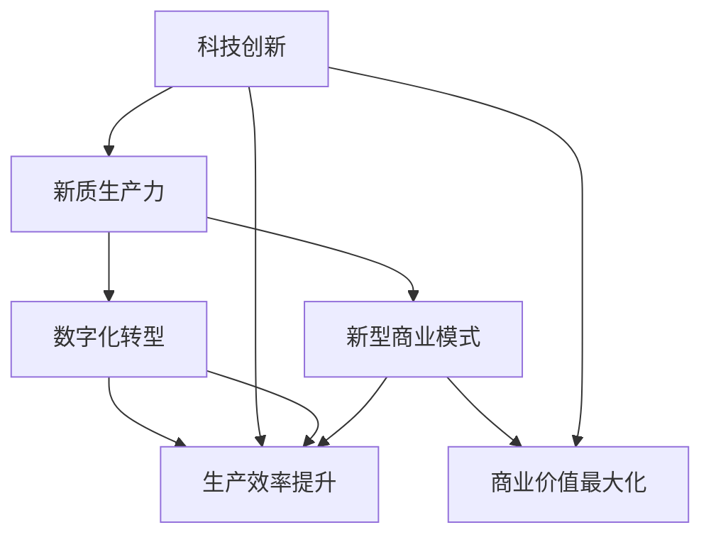
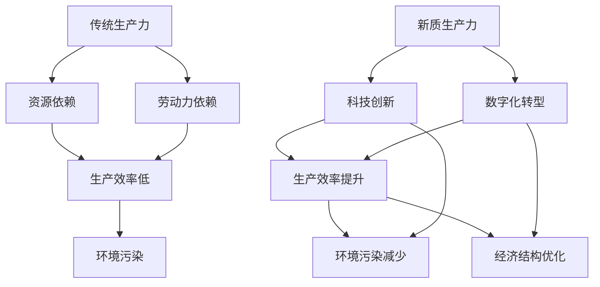
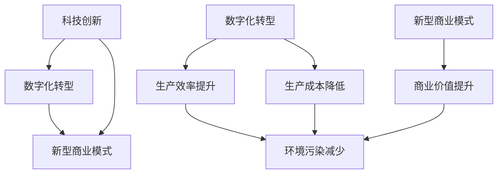
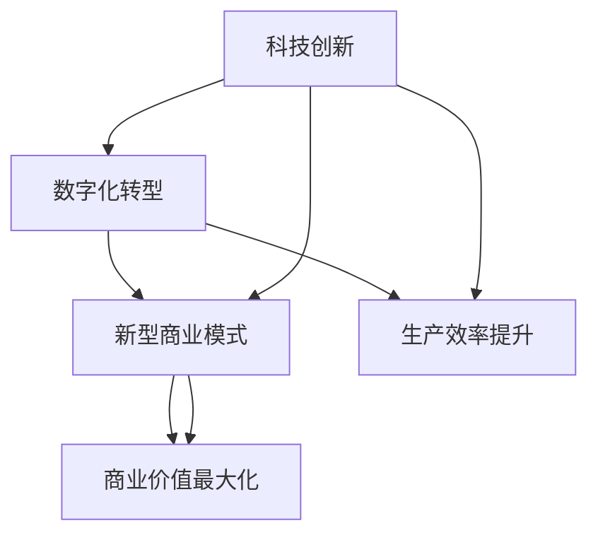

                 

# 第1章: 新质生产力的概念与起源

## 1.1 新质生产力的定义

新质生产力是一种以科技创新、数字化转型和新型商业模式为核心驱动力，推动传统产业向高附加值、智能化方向转型升级的生产力。其本质在于通过技术和商业模式的创新，实现生产效率的提升、资源利用的最优化以及经济结构的优化升级。

### 核心概念与联系

新质生产力的发展与以下核心概念密切相关：

- **科技创新**：推动技术进步，是提升生产力的关键。
- **数字化转型**：通过数字化手段优化生产和管理流程，实现生产效率的提升。
- **新型商业模式**：通过创新商业模式实现商业价值的最大化。

这些概念之间相互关联，共同构成了新质生产力的发展体系。

### Mermaid 流程图

## 1.2 新质生产力的起源与发展

新质生产力的概念起源于20世纪末，随着信息技术的迅猛发展和全球化的推进，各国开始认识到科技创新和数字化转型的重要性。以下是新质生产力的起源与发展历程：

### 起源

- **20世纪80年代**：随着计算机技术的发展，信息技术开始渗透到各个产业，推动产业升级。
- **20世纪90年代**：互联网的兴起，使得信息交流更加便捷，促进了全球经济的发展。

### 发展

- **21世纪初**：各国政府纷纷制定科技创新战略，加大对科技创新的投入。
- **当前**：新质生产力已成为推动经济增长的重要力量，各行业都在积极推动数字化转型和商业模式创新。

### 新质生产力与传统生产力的比较

传统生产力主要依赖于资源和劳动力，生产效率较低，环境污染严重。而新质生产力以科技创新和数字化转型为核心，能够提高生产效率，降低环境污染，实现经济结构的优化升级。

### Mermaid 流程图

## 1.3 新质生产力的核心要素

新质生产力的核心要素包括科技创新、数字化转型和新型商业模式。以下分别对这些要素进行详细阐述。

### 1.3.1 科技创新

科技创新是推动新质生产力发展的关键因素。它涉及基础研究、应用研究和试验开发等多个环节。通过科技创新，可以推动技术进步，提升生产效率和产品质量。

### 1.3.2 数字化转型

数字化转型是指利用数字技术和信息通信技术，对传统产业进行升级改造，实现生产和管理流程的智能化。数字化转型可以大幅提升生产效率，降低生产成本，提高产品质量。

### 1.3.3 新型商业模式

新型商业模式是利用数字技术和创新思维，实现商业价值最大化的一种商业模式。它通过创新业务模式，实现资源的最大化利用和价值的最大化创造。

### 1.3.4 三大要素的关系

科技创新、数字化转型和新型商业模式三者之间相互关联、相互促进。科技创新为数字化转型提供技术支持，数字化转型为新质生产力的发展提供基础，而新型商业模式则通过创新的业务模式实现商业价值的最大化。

### Mermaid 流程图

通过以上分析，我们可以看到新质生产力是一种基于科技创新、数字化转型和新型商业模式的现代化生产力体系。它不仅能够提升生产效率和产品质量，还能够实现经济结构的优化升级，为经济发展提供强大的动力。

## 1.4 新质生产力的发展现状

### 1.4.1 全球新质生产力的发展现状

当前，全球新质生产力的发展呈现出以下特点：

1. **科技创新蓬勃发展**：全球范围内的科技创新活动持续升温，特别是在人工智能、大数据、物联网等领域，出现了大量突破性成果。
2. **数字化转型深入推进**：数字化转型已成为全球经济发展的主要驱动力，各国都在积极推进数字化技术的应用，实现产业升级。
3. **新型商业模式不断涌现**：共享经济、平台经济等新型商业模式快速发展，成为推动经济增长的重要力量。

### 1.4.2 中国新质生产力的发展现状

在中国，新质生产力的发展同样取得了显著成效：

1. **科技创新成果丰硕**：中国在全球科技创新领域取得了重要突破，尤其在5G通信、人工智能、量子计算等领域，实现了从“跟跑”到“并跑”乃至“领跑”的转变。
2. **数字化转型加速推进**：中国积极推动数字基础设施建设，数字化转型在各行业得到了广泛应用，为经济发展注入了新动力。
3. **新型商业模式不断创新**：中国企业在共享经济、平台经济等领域积极探索，涌现出了一批具有全球影响力的新型商业模式。

### 1.4.3 新质生产力发展的影响

新质生产力的发展对全球经济和社会产生了深远的影响：

1. **经济结构优化**：新质生产力的发展促进了经济结构的优化升级，提高了经济的质量和效益。
2. **产业链重构**：新质生产力的发展推动了产业链的重构，促进了产业链的智能化、绿色化发展。
3. **社会生产方式变革**：新质生产力的发展改变了传统的生产方式，推动了智能制造、智慧物流等新兴生产方式的普及。

### 1.4.4 新质生产力发展的挑战

尽管新质生产力发展取得了显著成效，但仍然面临以下挑战：

1. **技术瓶颈**：科技创新仍面临一系列技术瓶颈，需要加大投入和研发力度。
2. **人才短缺**：新质生产力的发展需要大量高素质人才，但当前人才供给仍难以满足需求。
3. **政策环境**：政策环境对新质生产力的发展具有重要影响，需要进一步完善相关政策，为新质生产力的发展提供有力支持。

## 1.5 新质生产力的发展趋势

### 1.5.1 技术创新趋势

未来，科技创新将继续成为新质生产力发展的核心驱动力。特别是在人工智能、大数据、物联网、区块链等领域，技术创新将不断突破，为各行业带来深远影响。

### 1.5.2 数字化转型趋势

数字化转型将继续深化，未来各行业将更加注重数字化技术的应用，实现生产流程的智能化和高效化。

### 1.5.3 新型商业模式趋势

新型商业模式将继续创新，共享经济、平台经济、物联网等商业模式将在更多领域得到应用，推动经济增长和社会变革。

### 1.5.4 发展策略

为了推动新质生产力的发展，需要采取以下策略：

1. **加强科技创新**：加大研发投入，推动技术创新，突破技术瓶颈。
2. **推进数字化转型**：加快数字基础设施建设，推动数字化转型在各行业的普及。
3. **培育新型商业模式**：鼓励创新，培育具有竞争力的新型商业模式。
4. **优化政策环境**：完善政策体系，为新质生产力的发展提供有力支持。

### 1.5.5 国际合作

新质生产力的发展需要全球合作。通过国际合作，可以共享资源、知识和技术，推动全球新质生产力的发展。

## 1.6 新质生产力的发展对经济的影响

### 1.6.1 提高生产效率

新质生产力通过科技创新和数字化转型，提高了生产效率，降低了生产成本，为经济发展注入了新动力。

### 1.6.2 促进产业结构升级

新质生产力的发展推动了产业结构的优化升级，促进了传统产业的转型升级和新兴产业的发展。

### 1.6.3 拓展国际市场

新质生产力的发展提高了我国企业的国际竞争力，拓展了国际市场，为我国经济发展创造了更多机遇。

### 1.6.4 增加就业机会

新质生产力的发展创造了大量就业机会，提高了人民的收入水平，促进了社会稳定和发展。

### 1.6.5 促进可持续发展

新质生产力的发展实现了资源利用的最优化和环境污染的减少，推动了经济的可持续发展。

## 1.7 新质生产力的发展对社会的贡献

### 1.7.1 提高生活质量

新质生产力的发展提高了人们的生活质量，通过数字化技术和服务创新，满足了人们日益增长的需求。

### 1.7.2 推动社会进步

新质生产力的发展推动了社会的进步，通过科技创新和数字化转型，促进了社会的智能化、绿色化发展。

### 1.7.3 促进社会公平

新质生产力的发展有助于促进社会公平，通过共享经济和平台经济，实现了资源的最优配置和社会利益的均衡分配。

### 1.7.4 增强国家竞争力

新质生产力的发展提高了国家的竞争力，通过科技创新和产业升级，增强了国家的经济实力和国际地位。

## 1.8 新质生产力的发展面临的挑战

### 1.8.1 技术挑战

新质生产力的发展面临一系列技术挑战，如技术瓶颈、技术安全等问题，需要加大研发投入，突破技术难题。

### 1.8.2 政策挑战

政策环境对新质生产力的发展具有重要影响，需要进一步完善相关政策，为新质生产力的发展提供有力支持。

### 1.8.3 人才挑战

新质生产力的发展需要大量高素质人才，但当前人才供给难以满足需求，需要加强人才培养，提高人才素质。

### 1.8.4 国际竞争

新质生产力的发展面临国际竞争，需要加强国际合作，提高国际竞争力，推动全球新质生产力的发展。

## 1.9 新质生产力的发展前景

### 1.9.1 机遇

新质生产力的发展前景广阔，面临着前所未有的机遇。如科技创新的突破、数字化转型的深入和新型商业模式的创新等。

### 1.9.2 挑战

新质生产力的发展也面临一系列挑战，如技术瓶颈、政策环境、人才短缺等。但只要我们抓住机遇，积极应对挑战，新质生产力的发展将推动我国经济社会的持续健康发展。

### 1.9.3 发展策略

为了推动新质生产力的发展，需要采取以下策略：

1. **加强科技创新**：加大研发投入，推动技术创新，突破技术瓶颈。
2. **推进数字化转型**：加快数字基础设施建设，推动数字化转型在各行业的普及。
3. **培育新型商业模式**：鼓励创新，培育具有竞争力的新型商业模式。
4. **优化政策环境**：完善政策体系，为新质生产力的发展提供有力支持。
5. **加强国际合作**：通过国际合作，共享资源、知识和技术，推动全球新质生产力的发展。

### 1.9.4 国际合作

新质生产力的发展需要全球合作。通过国际合作，可以共享资源、知识和技术，推动全球新质生产力的发展。

## 1.10 总结

新质生产力是推动我国经济社会发展的关键力量。通过科技创新、数字化转型和新型商业模式的推动，新质生产力将不断提高生产效率，优化产业结构，拓展国际市场，为我国经济发展注入新动力。我们应当抓住机遇，应对挑战，推动新质生产力的发展，为实现中华民族伟大复兴的中国梦贡献力量。

---

在撰写第一章的过程中，我们详细介绍了新质生产力的概念与起源，探讨了新质生产力与传统生产力的区别，分析了新质生产力的核心要素，以及新质生产力的发展现状、趋势和对经济和社会的影响。同时，我们也提出了新质生产力发展面临的挑战和策略建议。

接下来，我们将进一步深入探讨新质生产力的核心要素，包括科技创新、数字化转型和新型商业模式，并分析这些要素在新质生产力发展中的作用和意义。

## 第2章: 新质生产力的核心要素

新质生产力的发展离不开核心要素的驱动，这些核心要素包括科技创新、数字化转型和新型商业模式。本章将分别对这三个要素进行详细探讨，分析它们在新质生产力中的重要作用和意义。

### 2.1 科技创新

科技创新是新质生产力的核心驱动力。它不仅推动了技术进步，还提高了生产效率和质量，促进了经济结构的优化升级。以下是对科技创新的详细阐述：

#### 2.1.1 科技创新的定义

科技创新是指通过科学研究和技术研发，推动技术进步和产业升级的过程。它包括基础研究、应用研究和试验开发等多个环节。

#### 2.1.2 科技创新的重要性

1. **推动技术进步**：科技创新是技术进步的主要驱动力，它不断推动新技术、新产品和新服务的出现。
2. **提高生产效率**：科技创新可以提高生产效率，降低生产成本，从而提升企业的竞争力。
3. **促进产业升级**：科技创新可以推动传统产业的转型升级，培育新兴产业，实现经济结构的优化。

#### 2.1.3 科技创新的分类

1. **基础研究**：探索科学规律，为技术发明提供基础。
2. **应用研究**：将基础研究成果转化为具体技术或产品。
3. **试验开发**：对研究成果进行试验验证，形成产品或服务。

#### 2.1.4 科技创新的挑战

1. **技术不确定性**：科技创新过程中存在一定的不确定性，可能面临技术失败的风险。
2. **研发成本高**：科技创新需要大量资金投入，研发成本较高。
3. **人才短缺**：科技创新需要高水平的人才支持，但当前人才供给不足。

### 2.2 数字化转型

数字化转型是新质生产力的重要组成部分，它通过引入数字化技术，对传统产业进行升级改造，实现生产和管理流程的智能化。以下是对数字化转型的详细阐述：

#### 2.2.1 数字化转型的定义

数字化转型是指利用数字技术和信息通信技术，推动产业升级和业务模式创新的过程。它包括数字化基础设施建设、数字化技术应用和数字化管理体系建设等多个环节。

#### 2.2.2 数字化转型的意义

1. **提高生产效率**：通过数字化技术，可以实现生产过程的自动化和智能化，提高生产效率。
2. **降低生产成本**：数字化技术可以优化生产流程，降低生产成本。
3. **提升产品质量**：数字化技术可以对生产过程进行实时监控和优化，提升产品质量。

#### 2.2.3 数字化转型的关键步骤

1. **战略规划**：明确数字化转型的目标和路径。
2. **技术选型**：选择合适的数字化技术，如云计算、大数据、物联网等。
3. **应用推广**：将数字化技术应用到生产和管理各个环节。

#### 2.2.4 数字化转型的挑战

1. **技术成熟度**：数字化技术仍在不断发展，技术成熟度可能影响数字化转型的效果。
2. **人才短缺**：数字化转型需要大量数字化人才，但当前人才供给不足。
3. **管理变革**：数字化转型涉及管理模式的变革，可能面临管理变革的挑战。

### 2.3 新型商业模式

新型商业模式是新质生产力的重要组成部分，它通过创新思维和数字技术，实现商业价值的最大化。以下是对新型商业模式的详细阐述：

#### 2.3.1 新型商业模式的定义

新型商业模式是指通过创新思维和数字技术，实现商业价值的一种商业模式。它包括共享经济、平台经济、物联网等新型商业模式。

#### 2.3.2 新型商业模式的特点

1. **灵活性**：新型商业模式能够快速适应市场变化和用户需求。
2. **高效性**：通过数字化技术，可以实现业务流程的优化和效率提升。
3. **可持续性**：新型商业模式注重社会责任和可持续发展。

#### 2.3.3 新型商业模式的发展趋势

1. **生态化**：企业通过构建生态圈，实现跨界合作和资源共享。
2. **数字化**：企业通过数字化技术，实现业务流程的优化和效率提升。
3. **智能化**：企业通过人工智能技术，实现业务决策智能化和用户体验提升。

#### 2.3.4 新型商业模式的挑战

1. **技术依赖**：新型商业模式高度依赖数字技术，可能面临技术风险。
2. **市场竞争**：新型商业模式面临激烈的市场竞争，需要不断创新和优化。
3. **政策监管**：新型商业模式可能面临政策监管的挑战，需要遵守相关法律法规。

### 2.4 三大要素的关系

科技创新、数字化转型和新型商业模式三者之间相互关联、相互促进。科技创新为数字化转型提供技术支持，数字化转型为新质生产力的发展提供基础，而新型商业模式则通过创新的业务模式实现商业价值的最大化。以下是三大要素之间的联系：

1. **科技创新** --> **数字化转型** --> **新型商业模式**
2. **科技创新** --> **生产效率提升** --> **商业价值最大化**

### Mermaid 流程图

通过以上分析，我们可以看到，科技创新、数字化转型和新型商业模式是推动新质生产力发展的重要核心要素。它们相互关联，共同构成了新质生产力的发展体系。在接下来的章节中，我们将进一步探讨这些要素在各个产业中的应用，以及新质生产力对产业升级和经济发展的推动作用。

## 第3章: 新质生产力在产业中的应用

新质生产力的发展不仅改变了经济结构，还深刻影响了各个产业的发展。本章将探讨新质生产力在制造业、服务业和农业中的应用，分析其在不同产业中的具体表现和成效。

### 3.1 新质生产力在制造业中的应用

制造业是国民经济的重要支柱，新质生产力在制造业中的应用主要体现在数字化转型和智能制造两个方面。

#### 3.1.1 制造业数字化转型的应用

制造业数字化转型是指利用数字技术对传统制造业进行升级，实现生产、管理和服务的智能化。以下是制造业数字化转型在具体应用中的表现：

1. **生产自动化**：通过自动化设备和机器人，实现生产过程的自动化，提高生产效率。
2. **生产智能化**：利用人工智能技术，实现生产过程的智能化管理，提高生产质量。
3. **供应链管理**：通过物联网和大数据技术，实现供应链管理的智能化，提高供应链效率。

#### 3.1.2 智能制造的应用

智能制造是制造业数字化转型的深化和扩展，它通过集成先进的信息技术、制造技术和自动化技术，实现制造过程的智能化。以下是智能制造在具体应用中的表现：

1. **智能工厂**：通过工业物联网、大数据分析和人工智能技术，实现生产过程的全面智能化。
2. **个性化定制**：通过大数据分析和人工智能技术，实现产品的个性化定制，提高产品竞争力。
3. **质量预测**：通过大数据分析和人工智能技术，预测产品质量问题，实现质量预防。

#### 3.1.3 制造业新质生产力的成效

新质生产力在制造业中的应用取得了显著成效，主要表现在以下几个方面：

1. **生产效率提升**：通过数字化技术和智能化管理，大幅提高了生产效率。
2. **产品质量提高**：通过数字化监测和智能管理，提高了产品质量。
3. **生产成本降低**：通过自动化和智能化生产，降低了生产成本。

### 3.2 新质生产力在服务业中的应用

服务业是国民经济的重要组成部分，新质生产力在服务业中的应用主要体现在数字化转型和服务智能化两个方面。

#### 3.2.1 服务业数字化转型的应用

服务业数字化转型是指利用数字技术对传统服务业进行升级，实现服务过程的智能化和高效化。以下是服务业数字化转型在具体应用中的表现：

1. **线上服务**：通过互联网和移动应用，实现服务的线上化，提高服务便捷性。
2. **大数据分析**：通过大数据技术，分析用户行为和需求，提供个性化的服务。
3. **智能客服**：通过人工智能技术，实现智能客服，提高服务效率和用户体验。

#### 3.2.2 服务智能化的应用

服务智能化是服务业数字化转型的深化，它通过集成人工智能、大数据和物联网技术，实现服务的智能化和个性化。以下是服务智能化在具体应用中的表现：

1. **智能推荐**：通过大数据分析和人工智能技术，为用户提供个性化的推荐服务。
2. **智能决策**：通过大数据分析和人工智能技术，辅助企业进行智能决策。
3. **智能交通**：通过物联网技术和人工智能技术，实现智能交通管理，提高交通效率。

#### 3.2.3 服务业新质生产力的成效

新质生产力在服务业中的应用取得了显著成效，主要表现在以下几个方面：

1. **服务效率提升**：通过数字化技术和智能化管理，大幅提高了服务效率。
2. **服务质量提高**：通过大数据分析和人工智能技术，提供了更加个性化的服务，提高了服务质量。
3. **运营成本降低**：通过数字化管理和智能化服务，降低了运营成本。

### 3.3 新质生产力在农业中的应用

农业是国民经济的基础，新质生产力在农业中的应用主要体现在数字化转型和智慧农业两个方面。

#### 3.3.1 农业数字化转型的应用

农业数字化转型是指利用数字技术对传统农业进行升级，实现农业生产、管理和服务的智能化。以下是农业数字化转型在具体应用中的表现：

1. **智能监测**：通过物联网技术和大数据分析，实现对农田环境的智能监测和调控。
2. **精准农业**：通过大数据分析和人工智能技术，实现精准施肥、精准灌溉和精准收获。
3. **农产品溯源**：通过区块链技术和物联网技术，实现农产品的溯源管理。

#### 3.3.2 智慧农业的应用

智慧农业是农业数字化转型的深化，它通过集成物联网、大数据和人工智能技术，实现农业生产的智能化和高效化。以下是智慧农业在具体应用中的表现：

1. **智能农场**：通过物联网技术和大数据分析，实现农场的自动化和智能化管理。
2. **农业机器人**：通过机器人技术和人工智能技术，实现农业生产的自动化和高效化。
3. **农业大数据**：通过大数据技术和人工智能技术，实现农业生产数据的分析和决策支持。

#### 3.3.3 农业新质生产力的成效

新质生产力在农业中的应用取得了显著成效，主要表现在以下几个方面：

1. **生产效率提升**：通过数字化技术和智能化管理，大幅提高了农业生产效率。
2. **产品质量提高**：通过精准农业和农产品溯源，提高了农产品的质量和安全性。
3. **运营成本降低**：通过数字化管理和智能化服务，降低了农业运营成本。

### 3.4 新质生产力在各个产业中的协同效应

新质生产力在各个产业中的应用不仅提高了各产业的效率和质量，还产生了显著的协同效应。以下是新质生产力在各个产业中的协同效应：

1. **产业链协同**：新质生产力在各个产业中的应用，促进了产业链上下游企业的协同发展，实现了产业链的智能化和高效化。
2. **产业融合**：新质生产力在各个产业中的应用，推动了产业间的融合和协同，实现了产业的跨界发展和创新。
3. **资源优化**：新质生产力在各个产业中的应用，通过数字化技术和智能化管理，实现了资源的优化配置和利用，提高了资源利用效率。

### 总结

新质生产力在制造业、服务业和农业中的应用，不仅推动了各个产业的转型升级，还实现了生产效率的提升、产品质量的提高和运营成本的降低。随着新质生产力的不断发展和应用，未来各产业将迎来更加智能化、数字化和高效化的新时代。

## 第4章: 新质生产力的政策环境与支持体系

新质生产力的发展离不开良好的政策环境和支持体系。本章将探讨新质生产力的政策环境、支持体系以及政策环境对新质生产力发展的推动作用。

### 4.1 政策环境对新质生产力的支持

政策环境对新质生产力的发展具有重要影响，它能够引导企业和社会资源投向新质生产力领域，推动新质生产力的快速发展。以下是政策环境对新质生产力支持的几个方面：

#### 4.1.1 政策引导

政策引导是政府通过制定和实施相关战略、规划和政策，引导企业和社会资源投向新质生产力领域。例如，中国政府提出的“中国制造2025”、“互联网+”等战略，就是为了引导和推动制造业、服务业和农业等传统产业的数字化转型和智能化升级。

#### 4.1.2 税收优惠

税收优惠是政府通过减免或降低企业税收，鼓励企业投入新质生产力发展的一种政策措施。例如，中国政府对于研发投入、高新技术企业等给予税收优惠，以激励企业加大科技创新投入。

#### 4.1.3 资金支持

资金支持是政府通过设立专项资金、提供贷款和风险投资等途径，支持新质生产力发展的政策措施。例如，中国政府设立了“国家科技重大专项”、“中小企业发展基金”等，用于支持新质生产力的发展。

#### 4.1.4 人才政策

人才政策是政府通过制定和实施相关人才引进、培养和激励政策，为新质生产力发展提供人才保障。例如，中国政府提出了“千人计划”、“科技创新人才工程”等，吸引和培养高层次科技创新人才。

### 4.2 新质生产力的支持体系

新质生产力的支持体系包括科技创新支持体系、产业支持体系和市场支持体系等，这些体系共同为新质生产力的发展提供全方位的支持。

#### 4.2.1 科技创新支持体系

科技创新支持体系包括研发机构、技术创新平台、科技成果转化平台等，这些机构和服务平台为新质生产力的发展提供技术支持和创新服务。例如，国家重点实验室、工程研究中心等研发机构，以及技术创新园区、孵化器等服务平台，都是科技创新支持体系的重要组成部分。

#### 4.2.2 产业支持体系

产业支持体系包括产业链建设、产业园区建设、产业政策等，这些政策措施和设施为新质生产力的发展提供产业环境支持。例如，政府通过建设高新技术产业园区、经济技术开发区等产业园区，提供产业集聚和资源共享的平台。

#### 4.2.3 市场支持体系

市场支持体系包括市场准入、市场推广、市场监管等，这些政策措施和市场环境为新质生产力的发展提供市场保障。例如，政府通过简化市场准入流程、提供市场推广支持、加强市场监管等，为新质生产力的发展提供良好的市场环境。

### 4.3 政策环境对新质生产力发展的推动作用

政策环境对新质生产力的发展具有显著的推动作用，它能够激发企业和社会的创新活力，推动新质生产力的快速发展。以下是政策环境对新质生产力发展的几个方面推动作用：

#### 4.3.1 促进技术创新

政策环境通过税收优惠、资金支持、人才政策等手段，鼓励企业加大科技创新投入，推动技术创新。例如，通过减免企业研发费用、提供风险投资等，激励企业进行科技创新。

#### 4.3.2 推动产业升级

政策环境通过产业政策、产业园区建设等手段，推动传统产业的升级改造，实现产业结构的优化。例如，通过支持高新技术产业发展、建设产业园区等，推动传统产业向高附加值、智能化方向转型。

#### 4.3.3 优化市场环境

政策环境通过市场准入、市场监管等手段，优化市场环境，为新质生产力的发展提供良好的市场条件。例如，通过简化市场准入流程、加强市场监管等，提高市场的公平性和透明度。

#### 4.3.4 激发创新活力

政策环境通过激发企业和社会的创新活力，推动新质生产力的快速发展。例如，通过鼓励创新创业、提供政策支持等，激发企业和社会的创新热情。

### 4.4 新质生产力的政策环境与支持体系案例分析

为了更好地理解政策环境与支持体系对新质生产力发展的推动作用，以下是对国内外几个典型案例的分析：

#### 案例一：中国深圳

深圳作为中国改革开放的窗口，其新质生产力的发展得益于良好的政策环境和支持体系。深圳政府通过制定一系列科技创新政策、建设产业园区、提供资金支持等，为新质生产力的发展提供了有力保障。例如，深圳设立了“科技型中小企业创新基金”，支持中小企业科技创新；通过建设深圳高新区、深圳国际生物谷等产业园区，为高新技术产业的发展提供了良好环境。

#### 案例二：美国硅谷

美国硅谷是全球新质生产力发展的典型代表，其成功离不开良好的政策环境和支持体系。美国政府在硅谷发展过程中，通过提供资金支持、简化行政审批、鼓励科技创新等手段，为硅谷的快速发展提供了有力保障。例如，美国政府设立了“国家科学基金会”，支持硅谷的科技创新；通过建立创业孵化器、提供风险投资等，激发了硅谷的创新活力。

#### 案例三：德国工业4.0

德国工业4.0是德国政府提出的一项战略，旨在通过数字化转型和智能化升级，推动德国制造业的发展。德国政府通过制定相关政策、提供资金支持、建设智能制造平台等，推动了德国工业4.0的发展。例如，德国政府设立了“智能制造平台”，支持企业进行智能制造改造；通过提供税收优惠、补贴等，鼓励企业投入智能制造领域。

### 总结

新质生产力的政策环境和支持体系对新质生产力的发展具有重要作用。通过政策引导、税收优惠、资金支持、人才政策等手段，政府能够激发企业和社会的创新活力，推动新质生产力的快速发展。同时，通过建设科技创新支持体系、产业支持体系和市场支持体系等，政府能够为新质生产力的发展提供全方位的支持，助力我国新质生产力的快速发展。

## 第5章: 新质生产力的挑战与未来发展

### 5.1 新质生产力的挑战

新质生产力在快速发展的同时，也面临着一系列挑战。这些挑战主要集中在技术、市场、政策等方面，对未来的发展构成一定的制约。

#### 5.1.1 技术挑战

1. **技术创新难度大**：新质生产力依赖于高水平的科技创新，但当前一些关键技术如人工智能、量子计算等仍存在较大不确定性，技术突破难度大。
2. **技术安全风险**：随着新质生产力的快速发展，技术安全风险逐渐凸显，如数据安全、网络安全等，需要加强技术安全管理。

#### 5.1.2 市场挑战

1. **市场竞争激烈**：新质生产力的快速发展吸引了大量企业和资本进入，市场竞争日趋激烈，企业需要不断提高自身竞争力。
2. **市场接受度低**：一些新技术和新模式如区块链、共享经济等，由于市场接受度较低，推广难度较大。

#### 5.1.3 政策挑战

1. **政策环境不完善**：新质生产力的发展需要良好的政策环境，但当前政策环境在某些方面仍不完善，如政策支持力度不够、政策执行不到位等。
2. **法规制度滞后**：随着新质生产力的快速发展，现有法规制度在某些方面滞后于实际需求，需要加快法规制度的更新和完善。

### 5.2 新质生产力的未来发展

面对挑战，新质生产力仍具有广阔的发展前景。未来，新质生产力的发展将呈现出以下趋势：

#### 5.2.1 技术创新持续深化

1. **人工智能**：人工智能技术将继续深化，在智能制造、智能医疗、智能交通等领域得到广泛应用。
2. **量子计算**：量子计算技术有望实现重大突破，为解决复杂问题提供新的计算手段。

#### 5.2.2 数字化转型全面普及

1. **工业互联网**：工业互联网将推动制造业的数字化转型，实现生产过程的智能化和高效化。
2. **智慧城市**：智慧城市将推动城市管理的数字化转型，提高城市管理效率和居民生活质量。

#### 5.2.3 新型商业模式不断创新

1. **共享经济**：共享经济将继续发展，如共享办公、共享汽车等，满足人们多样化的需求。
2. **平台经济**：平台经济将推动商业模式的创新，如电子商务平台、社交媒体平台等，实现跨界合作和资源共享。

### 5.3 应对挑战的策略建议

为了应对新质生产力发展过程中的挑战，需要采取一系列策略：

#### 5.3.1 加强技术创新

1. **加大科研投入**：政府和企业应加大科研投入，支持基础研究和应用研究，推动技术突破。
2. **加强国际合作**：通过国际合作，引进国外先进技术，推动技术创新。

#### 5.3.2 提升市场竞争力

1. **优化市场竞争环境**：政府应优化市场竞争环境，加强市场监管，提高市场透明度。
2. **培育龙头企业**：政府应支持龙头企业，提升其市场竞争力，带动整个产业链的发展。

#### 5.3.3 完善政策环境

1. **制定相关政策**：政府应制定一系列支持新质生产力发展的政策，如税收优惠、资金支持、人才政策等。
2. **加强政策执行**：政府应加强政策执行力度，确保政策落地见效。

#### 5.3.4 强化法规制度

1. **完善法规制度**：政府应完善相关法规制度，确保新质生产力发展的法制环境。
2. **加强法规宣传**：政府应加强法规宣传，提高企业和公众的法治意识。

### 总结

新质生产力的发展面临一系列挑战，但同时也具有广阔的发展前景。通过加强技术创新、提升市场竞争力、完善政策环境和强化法规制度，新质生产力将能够克服挑战，实现持续健康发展。

## 第6章: 新质生产力的国际化进程

### 6.1 新质生产力的国际化现状

新质生产力的国际化进程正在加速，各国纷纷加入这一进程，以寻求新的经济增长点和全球竞争优势。以下是新质生产力国际化现状的几个关键点：

#### 6.1.1 国际化程度分析

1. **科技创新合作**：全球范围内的科技创新合作不断加强，各国企业、高校和科研机构之间的合作日益密切。
2. **产业链国际化**：新质生产力的产业链全球化趋势明显，许多国家积极参与全球产业链的布局和整合。
3. **市场国际化**：新质生产力的市场国际化程度不断提高，全球市场需求对新质生产力产品和服务的要求越来越高。

#### 6.1.2 国际化面临的挑战

1. **技术壁垒**：各国在科技创新方面存在差异，技术壁垒成为国际化进程中的主要挑战。
2. **政策壁垒**：国际贸易政策和各国政策环境的不同，可能对国际化进程造成障碍。
3. **文化差异**：跨文化合作和文化差异可能影响国际化进程，需要加强跨文化沟通和协调。

#### 6.1.3 国际化的案例分析

1. **美国**：美国是全球科技创新的领导者，通过推动创新和全球化战略，实现了新质生产力的快速发展。
2. **德国**：德国通过工业4.0战略，推动制造业的数字化转型和国际化，取得了显著成效。
3. **中国**：中国在新质生产力的国际化方面取得了显著进展，通过“一带一路”倡议，加强了与沿线国家的合作。

### 6.2 新质生产力的国际化战略

为了推动新质生产力的国际化，企业需要制定合理的国际化战略。以下是一些关键策略：

#### 6.2.1 国际化战略的制定

1. **明确国际化目标**：企业需要明确国际化目标，如市场拓展、技术创新、品牌提升等。
2. **分析国际市场**：企业需要深入分析国际市场的需求和竞争环境，找到适合自己的市场定位。
3. **制定国际化策略**：企业需要制定符合国际市场需求的国际化策略，如市场进入策略、产品策略、营销策略等。

#### 6.2.2 国际化模式的选择

1. **跨国并购**：通过跨国并购，快速进入国际市场，获取技术和市场份额。
2. **合资合作**：与当地企业合资合作，利用双方的优势，共同开拓市场。
3. **海外建厂**：在海外建立生产基地，降低生产成本，提高市场响应速度。

#### 6.2.3 国际化策略与建议

1. **加强技术创新**：企业需要持续加强技术创新，提高产品竞争力，适应国际市场需求。
2. **培育国际化人才**：企业需要培育具备国际化视野和能力的优秀人才，提高跨文化沟通和协作能力。
3. **优化供应链管理**：企业需要优化供应链管理，提高供应链的全球响应速度和灵活性。

### 6.3 国际化过程中的挑战与应对策略

在国际化的过程中，企业可能会面临一系列挑战，如文化差异、市场不确定性、政策风险等。以下是一些应对策略：

#### 6.3.1 文化差异

1. **跨文化培训**：企业应开展跨文化培训，提高员工的跨文化沟通和协作能力。
2. **尊重当地文化**：企业在国际化过程中应尊重当地文化，适应并融入当地市场。

#### 6.3.2 市场不确定性

1. **市场调研**：企业应进行充分的市场调研，了解目标市场的需求和竞争态势。
2. **灵活调整策略**：企业应根据市场变化，灵活调整国际化策略，以应对市场不确定性。

#### 6.3.3 政策风险

1. **了解政策法规**：企业应充分了解目标国家的政策法规，确保经营合规。
2. **政策应对策略**：企业应制定相应的政策应对策略，如应对贸易摩擦、政策变动等。

### 总结

新质生产力的国际化进程为企业和国家带来了新的发展机遇，但同时也伴随着挑战。通过制定合理的国际化战略，企业可以更好地应对国际化过程中的挑战，实现持续发展。

## 第7章: 新质生产力的典型案例分析

在本章中，我们将探讨一些新质生产力的典型案例，包括华为的数字化转型、阿里巴巴的新型商业模式以及特斯拉的智能制造。通过这些案例，我们可以更深入地理解新质生产力的实际应用和效果。

### 7.1 华为公司的数字化转型

华为作为全球领先的通信技术企业，其数字化转型是一个成功的典范。以下是华为数字化转型的主要内容和成效。

#### 7.1.1 背景介绍

随着通信技术的快速发展和全球化的推进，华为意识到数字化转型的重要性，开始着手推动公司的数字化转型。

#### 7.1.2 实施过程

1. **构建数字化平台**：华为构建了统一的数字化平台，包括云计算、大数据和物联网等关键技术，实现了企业内部各业务系统的互联互通。
2. **推动数字化转型**：在各个业务领域，华为推动数字化转型，包括市场营销、供应链管理、研发和生产等环节，通过数字化手段提高效率和质量。
3. **引入新技术**：华为积极引入人工智能、区块链等新兴技术，推动公司业务的智能化和自动化。

#### 7.1.3 效果与启示

华为的数字化转型取得了显著成效：

1. **提高生产效率**：通过数字化平台和智能化生产，华为大幅提高了生产效率，降低了生产成本。
2. **提升产品质量**：数字化监控和智能管理提高了产品质量，减少了缺陷率。
3. **创新商业模式**：华为通过数字化转型，探索了新的商业模式，如云服务和物联网应用，开辟了新的收入来源。

华为的数字化转型经验对其他企业具有启示意义：

1. **战略规划**：企业需要制定明确的数字化转型战略，明确目标和路径。
2. **持续投入**：数字化转型需要持续的技术投入和人才投入，企业应保持对数字化技术的关注和投入。
3. **协同发展**：数字化转型不仅仅是技术问题，还需要业务流程和组织结构的变革，企业应推动各业务环节的协同发展。

### 7.2 阿里巴巴的新型商业模式

阿里巴巴作为全球领先的电子商务平台，其新型商业模式探索为其他企业提供了借鉴。以下是阿里巴巴新型商业模式的主要内容和成效。

#### 7.2.1 背景介绍

随着互联网的普及和电商行业的快速发展，阿里巴巴意识到传统电商模式需要创新，开始探索新型商业模式。

#### 7.2.2 实施过程

1. **共享经济**：阿里巴巴通过共享平台，如淘宝、天猫等，实现了商品和服务的共享，满足了用户的多样化需求。
2. **平台经济**：阿里巴巴建立了庞大的电商生态系统，通过平台连接商家和消费者，提高了交易效率。
3. **线上线下融合**：阿里巴巴通过新零售模式，实现了线上线下的无缝融合，提升了用户体验。

#### 7.2.3 效果与启示

阿里巴巴的新型商业模式取得了显著成效：

1. **扩大市场份额**：通过共享经济和平台经济，阿里巴巴的市场份额持续扩大，占据了全球电商市场的领先地位。
2. **提高用户体验**：通过线上线下融合，阿里巴巴提供了更加便捷和个性化的购物体验。
3. **创造新的商业价值**：阿里巴巴通过新型商业模式，创造了新的商业价值，实现了商业模式的创新。

阿里巴巴的新型商业模式对其他企业具有启示意义：

1. **创新思维**：企业需要具备创新思维，不断探索新的商业模式，以适应市场变化。
2. **用户导向**：企业应以用户需求为导向，提供个性化的服务和体验。
3. **生态系统建设**：企业应构建生态系统，通过平台和合作伙伴共同创造价值。

### 7.3 特斯拉的智能制造

特斯拉作为全球领先的电动汽车企业，其智能制造模式为其他企业提供了参考。以下是特斯拉智能制造的主要内容和成效。

#### 7.3.1 背景介绍

随着电动汽车行业的兴起和智能制造技术的发展，特斯拉开始探索智能制造模式，以提高生产效率和产品质量。

#### 7.3.2 实施过程

1. **引入智能制造技术**：特斯拉引入了机器人、自动化生产线和数字化管理技术，实现了生产过程的自动化和智能化。
2. **数字化转型**：特斯拉建立了数字化平台，实现了生产过程的实时监控和优化，提高了生产效率。
3. **创新管理模式**：特斯拉采用了灵活的生产管理模式，实现了生产过程的灵活调度和优化。

#### 7.3.3 效果与启示

特斯拉的智能制造取得了显著成效：

1. **提高生产效率**：通过引入智能制造技术，特斯拉大幅提高了生产效率，缩短了生产周期。
2. **提升产品质量**：通过数字化转型，特斯拉实现了生产过程的实时监控和优化，提升了产品质量。
3. **降低生产成本**：通过创新管理模式，特斯拉实现了生产过程的优化和资源节约，降低了生产成本。

特斯拉的智能制造对其他企业具有启示意义：

1. **技术创新**：企业需要积极引入新技术，推动生产过程的自动化和智能化。
2. **数字化转型**：企业应建立数字化平台，实现生产过程的实时监控和优化。
3. **管理模式创新**：企业应创新管理模式，实现生产过程的灵活调度和优化。

### 总结

通过分析华为、阿里巴巴和特斯拉的案例，我们可以看到新质生产力的实际应用和成效。这些企业通过数字化转型、新型商业模式和智能制造，成功提升了生产效率和产品质量，实现了商业模式的创新。这些案例为其他企业提供了宝贵的经验和启示，推动了新质生产力在全球范围内的应用和发展。

## 第8章: 新质生产力的未来展望与政策建议

### 8.1 新质生产力的未来展望

新质生产力的发展前景广阔，随着技术的不断进步和商业模式的不断创新，它将在未来带来深远的影响。

#### 8.1.1 技术趋势

1. **人工智能**：人工智能技术将在未来继续发展，通过深度学习、自然语言处理等技术的应用，将极大地提升生产效率和服务质量。
2. **物联网**：物联网技术将实现更多设备和系统的互联互通，为智能制造和智慧城市等提供基础。
3. **区块链**：区块链技术的应用将提高数据安全性和透明度，为金融、物流等领域带来变革。

#### 8.1.2 产业趋势

1. **智能制造**：智能制造将成为未来生产的主要模式，通过数字化和自动化技术，实现生产效率和质量的大幅提升。
2. **智慧服务**：智慧服务将融入人们的日常生活，通过大数据和人工智能技术，提供个性化、智能化的服务。
3. **绿色产业**：绿色产业将得到大力发展，通过新技术和新模式，实现资源的有效利用和环境的保护。

#### 8.1.3 经济趋势

1. **全球价值链重构**：新质生产力的发展将重构全球价值链，推动经济全球化的深入发展。
2. **创新驱动发展**：新质生产力的发展将推动经济向创新驱动转型，提升经济的核心竞争力。
3. **数字经济崛起**：数字经济将在新质生产力的推动下迅速崛起，成为未来经济增长的重要引擎。

### 8.2 新质生产力的政策建议

为了促进新质生产力的快速发展，需要从政府、企业和社会等多方面共同努力，以下是一些建议：

#### 8.2.1 政府层面

1. **加强科技创新**：政府应加大对科技创新的投入，设立专项基金，支持基础研究和应用研究。
2. **优化政策环境**：政府应优化科技创新政策，提供税收优惠、资金支持等，鼓励企业投入科技创新。
3. **推动数字化转型**：政府应制定和实施数字化转型战略，推动各行业的数字化升级。
4. **完善法规制度**：政府应完善相关法规制度，为新质生产力的发展提供法律保障。

#### 8.2.2 企业层面

1. **加大研发投入**：企业应加大研发投入，提高科技创新能力，推动技术进步。
2. **推动商业模式创新**：企业应积极探索新的商业模式，实现商业模式的创新和变革。
3. **加强人才培养**：企业应加强人才培养，提高员工技能和素质，为新质生产力的发展提供人才保障。
4. **加强国际合作**：企业应积极参与国际合作，引进国外先进技术和管理经验，提升自身竞争力。

#### 8.2.3 社会层面

1. **提高公众科技素养**：社会应加强对科技创新的宣传和教育，提高公众对科技创新的认识和接受度。
2. **鼓励创新创业**：社会应鼓励创新创业，提供创业支持和服务，培育创新型人才。
3. **构建开放共享的创新生态**：社会应构建开放共享的创新生态，促进创新资源的有效配置和利用。
4. **加强国际合作**：社会应加强与国际社会的合作，推动新质生产力的全球发展。

### 总结

新质生产力的未来发展充满机遇和挑战，需要政府、企业和社会的共同努力。通过加强科技创新、推动数字化转型、培育新型商业模式和加强国际合作，新质生产力将推动经济社会的持续健康发展，为全球发展带来新的动力。

## 附录

### 附录A：新质生产力相关术语与概念解释

- **新质生产力**：指通过科技创新、数字化转型和新型商业模式等方式，推动传统产业转型升级，提高产业生产效率和质量，实现经济持续健康发展的生产力。
- **科技创新**：指通过科学研究和技术开发，推动技术进步和产业升级的过程。
- **数字化转型**：指利用数字技术和信息通信技术，推动产业升级和业务模式创新的过程。
- **新型商业模式**：指利用数字技术和创新思维，实现商业价值的一种商业模式。
- **智能制造**：指通过集成先进的信息技术、制造技术和自动化技术，实现制造过程的智能化。

### 附录B：新质生产力相关政策和法规概述

- **《国家中长期科学和技术发展规划纲要（2006-2020年）》**：提出加强科技创新，推动产业转型升级。
- **《“十三五”国家科技创新规划》**：提出加强科技创新，推动数字化转型。
- **《新一代人工智能发展规划》**：提出推动人工智能与产业发展深度融合。
- **《中国制造2025》**：提出推动制造业数字化转型和智能化升级。

### 附录C：新质生产力相关研究机构与组织简介

- **中国科学院**：我国最高学术研究机构，致力于科技创新和产业发展。
- **清华大学**：我国顶尖高校，在科技创新和数字化转型领域具有丰富的研究和实践经验。
- **阿里巴巴研究院**：阿里巴巴旗下的研究院，专注于数字化转型和新型商业模式的研发。
- **华为诺亚方舟实验室**：华为公司旗下的科研机构，专注于人工智能和智能制造领域的研究。

