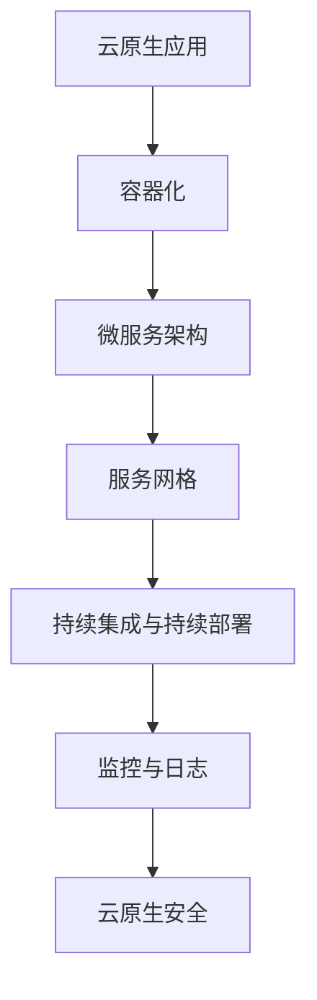
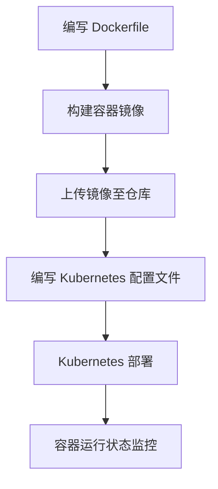
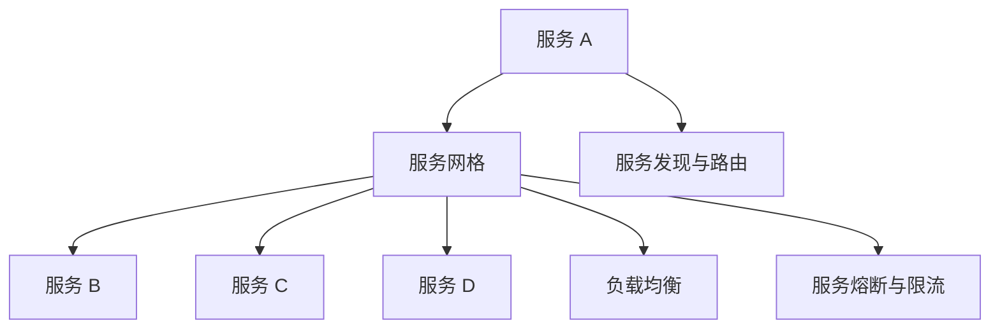
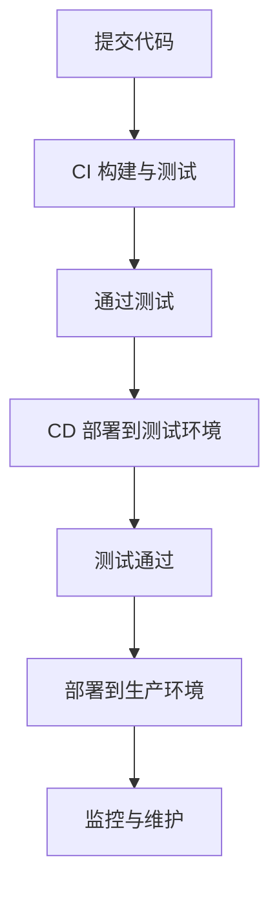

                 

### 云原生架构：构建可扩展的云端应用程序

#### 关键词：
- 云原生
- 可扩展性
- 容器化
- 微服务
- 服务网格
- 持续集成与持续部署
- 云原生安全

#### 摘要：
本文将深入探讨云原生架构，其核心概念、实现方法以及在实际应用中的价值。我们将从云原生的定义和特点出发，逐步分析容器化技术、服务网格、微服务架构等关键概念，并通过实际案例，展示云原生技术在现代云端应用中的强大优势。此外，文章还将探讨云原生安全、性能优化和成本优化策略，并展望云原生技术的未来发展。

### 目录大纲

1. **云原生概述**
   1.1 云原生概念介绍
   1.2 云原生与传统架构的区别
   1.3 云原生的主要特点
   1.4 云原生的发展历程

2. **云原生架构核心概念**
   2.1 容器化技术
   2.2 服务网格技术
   2.3 微服务架构

3. **云原生架构实践**
   3.1 云原生应用开发
   3.2 持续集成与持续部署
   3.3 云原生监控与日志

4. **云原生安全**
   4.1 云原生安全概述
   4.2 容器安全
   4.3 服务网格安全

5. **云原生案例研究**
   5.1 案例一：电商平台云原生转型
   5.2 案例二：金融行业云原生应用

6. **云原生未来发展趋势**
   6.1 云原生技术与边缘计算的结合
   6.2 云原生AI应用

7. **云原生实践与优化**
   7.1 云原生性能优化
   7.2 云原生成本优化
   7.3 云原生运维

8. **附录**
   8.1 主要开源工具和框架
   8.2 云原生相关书籍和资料
   8.3 云原生社区和论坛
   8.4 云原生架构 Mermaid 流程图
   8.5 核心算法原理讲解
   8.6 数学模型和数学公式
   8.7 项目实战
   8.8 代码解读与分析
   8.9 开发环境搭建指南
   8.10 常见问题与解决方案
   8.11 参考资料

---

## 第1章：云原生概述

### 1.1 云原生概念介绍

云原生（Cloud Native）是指利用云计算技术构建和运行应用程序的方法论。它强调的是应用的设计、开发和部署，使其能够在动态、分布式、弹性的云环境中高效运行。云原生不仅是一种技术趋势，更是一种软件开发和运维的文化。

云原生应用具有以下几个显著特点：

- **容器化**：应用程序被封装在容器中，与底层硬件和环境隔离，保证了应用程序的可移植性和一致性。
- **微服务架构**：应用程序被分解为多个小型、独立的服务，每个服务都运行在自己的容器中，便于管理和扩展。
- **持续集成与持续部署（CI/CD）**：自动化流程确保了快速、频繁的代码集成和部署，提高了开发效率。
- **服务网格**：提供了轻量级的通信基础设施，简化了服务间的通信，提供了动态服务发现、负载均衡等功能。

### 1.2 云原生与传统架构的区别

传统架构通常依赖虚拟机和物理服务器，而云原生架构则利用容器和云计算服务。以下是两者之间的主要区别：

- **基础设施**：传统架构依赖于预配置的硬件和操作系统，而云原生架构使用容器，可以灵活地部署在任何支持容器引擎的平台上。
- **可扩展性**：传统架构扩展性较差，需要人工干预进行服务器配置，而云原生架构支持水平扩展，可以自动分配资源。
- **容错性**：传统架构在单点故障时容易导致整个系统瘫痪，而云原生架构通过容器和微服务的隔离机制，提高了系统的容错性。
- **开发与运维**：传统架构通常由开发人员和运维人员分开管理，而云原生架构推崇DevOps文化，强调开发与运维的紧密协作。

### 1.3 云原生的主要特点

云原生架构的主要特点如下：

- **动态性**：云原生应用可以快速适应环境变化，实现快速部署和弹性扩展。
- **分布式**：应用程序由多个分布式服务组成，可以横向扩展，提高系统的可用性和性能。
- **弹性**：云原生应用可以根据需求自动调整资源分配，提高了资源的利用效率。
- **自动化**：云原生应用依赖于自动化工具和平台，简化了部署、监控和管理过程。
- **可观测性**：云原生应用提供了丰富的监控和日志功能，方便进行故障排查和性能优化。

### 1.4 云原生的发展历程

云原生的发展历程可以分为以下几个阶段：

- **2000年代初期**：云计算和虚拟化技术逐渐成熟，虚拟机成为基础架构的核心。
- **2010年代初期**：容器技术（如Docker）的出现，使得应用程序可以更加灵活地部署和管理。
- **2010年代中期**：微服务架构逐渐流行，推动了应用程序的模块化和分布式化。
- **2010年代末期**：服务网格技术（如Istio）的出现，简化了服务间的通信，提高了系统的安全性和可管理性。
- **2020年代**：云原生技术逐渐成为主流，越来越多的企业开始采用云原生架构，推动云原生生态的进一步发展。

## 第2章：云原生架构核心概念

### 2.1 容器化技术

#### 2.1.1 容器的定义和原理

容器是一种轻量级的、可移植的计算环境，它将应用程序及其依赖项打包在一起，形成一个独立的运行时环境。容器通过操作系统的Namespace和cgroups等机制实现了对资源隔离和管理，从而实现了应用程序与底层硬件和操作系统的解耦。

容器的核心原理包括：

- **命名空间（Namespace）**：用于隔离进程、网络、文件系统等资源，使得容器内的应用程序只能访问到其自身的资源。
- **cgroups**：用于控制容器内的资源分配和使用，包括CPU、内存、磁盘等。
- **镜像（Image）**：容器运行时的模板，包含了应用程序及其依赖项。容器启动时，会从镜像中加载文件系统并创建一个新的容器实例。
- **容器引擎（Container Engine）**：负责容器的创建、启动、停止和管理，如Docker、rkt等。

#### 2.1.2 Docker技术介绍

Docker 是最流行的容器化技术，它提供了一个开源的容器引擎，使得容器化应用程序的部署和管理变得简单高效。

Docker 的主要组件包括：

- **Docker Engine**：负责容器的创建、启动、停止和管理。
- **Docker Hub**：一个用于分享和管理容器镜像的仓库。
- **Docker Compose**：用于定义和运行多容器应用程序的编排工具。
- **Docker Swarm**：用于管理多节点容器集群的编排工具。

Docker 的主要特点如下：

- **简单性**：通过简单的命令和文件配置，即可快速创建和部署容器化应用程序。
- **可移植性**：容器镜像可以在不同的操作系统和环境中运行，保证了应用程序的一致性。
- **高效性**：通过资源隔离和优化，提高了系统的性能和资源利用率。
- **扩展性**：支持水平扩展和容器集群管理，提高了系统的可用性和可扩展性。

#### 2.1.3 容器编排工具

容器编排工具用于管理和编排容器化的应用程序，常见的容器编排工具包括 Kubernetes、Docker Swarm、Apache Mesos等。

- **Kubernetes**：是当前最流行的容器编排工具，它提供了丰富的功能，如容器调度、服务发现、负载均衡、故障恢复等。Kubernetes 通过使用 YAML 配置文件定义和管理容器化应用程序，支持水平扩展和自动化部署。
- **Docker Swarm**：是 Docker 官方提供的容器编排工具，它通过简单的命令和 Dockerfile 即可实现容器的部署和管理。Docker Swarm 支持自动扩展和负载均衡，但不支持复杂的服务发现和故障恢复功能。
- **Apache Mesos**：是一个开源的容器编排工具，它支持多种容器化技术，如 Docker、Kubernetes等。Mesos 提供了高效、可扩展的资源管理平台，支持跨多个集群的容器调度和负载均衡。

### 2.2 服务网格技术

服务网格（Service Mesh）是一种用于管理服务间通信的轻量级基础设施，它通过在网络层面提供服务发现、负载均衡、服务熔断、安全等功能，简化了微服务架构中的服务间通信。

服务网格的主要组件包括：

- **服务代理（Service Proxy）**：也称为边车（Sidecar）代理，它运行在服务的旁边，负责拦截和代理服务间的通信。
- **控制平面（Control Plane）**：负责管理服务代理的配置、策略和监控。
- **数据平面（Data Plane）**：由服务代理组成，负责服务间的通信和数据转发。

常见的服务网格技术包括：

- **Istio**：是一个开源的服务网格平台，它提供了全面的服务管理功能，包括服务发现、负载均衡、安全、监控等。Istio 通过使用Envoy代理实现了服务网格的数据平面，并通过Pilot和Mixer实现了控制平面。
- **Linkerd**：是一个开源的服务网格工具，它提供了服务发现、负载均衡、服务熔断等功能。Linkerd 使用了BPF（Berkeley Packet Filter）技术实现了高效的数据平面，并通过控制平面进行策略和监控管理。
- **Consul**：是一个开源的服务发现和配置工具，它可以通过服务注册和发现机制，简化微服务架构中的服务间通信。Consul 提供了健康检查、服务发现、配置管理等功能，但它不提供负载均衡和安全功能。

#### 2.2.2 Istio技术介绍

Istio 是由 Lyft 开发的一个开源服务网格平台，它提供了全面的服务管理功能，包括服务发现、负载均衡、服务熔断、安全、监控等。Istio 通过使用Envoy代理实现了服务网格的数据平面，并通过Pilot和Mixer实现了控制平面。

Istio 的主要组件包括：

- **Envoy 代理**：是 Istio 的数据平面组件，它运行在每个服务实例旁边，负责拦截和代理服务间的通信。Envoy 代理实现了 HTTP/2、HTTP/3、gRPC、Thrift、DNS 等多种协议，支持服务发现、负载均衡、熔断、限流等功能。
- **Pilot**：是 Istio 的控制平面组件，它负责管理 Envoy 代理的配置和策略。Pilot 通过与 Kubernetes API 服务器、服务注册中心等外部系统交互，将配置信息下发给 Envoy 代理。
- **Mixer**：是 Istio 的另一个控制平面组件，它负责收集和监控服务网格中的数据。Mixer 提供了灵活的 API，允许开发者自定义监控数据收集和策略执行。

Istio 的主要优势如下：

- **通用性**：Istio 支持多种协议和服务类型，可以与现有的微服务架构无缝集成。
- **安全性**：Istio 提供了全面的服务间安全功能，包括身份验证、授权、加密等。
- **可观测性**：Istio 提供了丰富的监控和日志功能，便于故障排查和性能优化。
- **可扩展性**：Istio 通过组件化设计，可以灵活扩展和定制，满足不同的业务需求。

#### 2.2.3 服务网格的优势和挑战

服务网格的优势包括：

- **简化服务间通信**：服务网格通过抽象和自动化服务间通信，简化了微服务架构中的复杂性。
- **提高系统可靠性**：服务网格提供了故障恢复、熔断、限流等功能，提高了系统的可靠性和稳定性。
- **增强安全性**：服务网格提供了全面的安全功能，包括身份验证、授权、加密等，增强了系统的安全性。
- **优化性能**：服务网格提供了负载均衡、缓存、限流等功能，提高了系统的性能和响应速度。

然而，服务网格也面临着一些挑战：

- **复杂性**：服务网格引入了额外的架构层次，增加了系统的复杂性和运维难度。
- **性能开销**：服务网格的数据平面（如代理）可能会引入一定的性能开销，特别是在高负载场景下。
- **兼容性问题**：服务网格需要与现有的微服务架构和工具集成，可能会出现兼容性问题。

总之，服务网格作为一种新兴的技术，它在提高系统可靠性、安全性和性能方面具有显著优势，但也需要解决其复杂性、性能开销和兼容性等问题。

### 2.3 微服务架构

微服务架构是一种基于微服务的软件架构方法，它将应用程序分解为多个小型、独立的组件，每个组件负责实现一个特定的业务功能。微服务架构的主要目标是提高系统的可扩展性、可靠性和可维护性。

#### 2.3.1 微服务的定义和特点

微服务（Microservice）是一种软件架构风格，它将应用程序划分为多个小型、独立的组件，每个组件运行在自己的进程和系统中。微服务的特点包括：

- **独立性**：每个微服务都是独立的，可以单独开发、部署和扩展。
- **分布式**：微服务架构支持分布式部署，提高了系统的可用性和性能。
- **自动化**：微服务架构通常使用自动化工具进行部署、监控和管理。
- **轻量级**：微服务通常使用轻量级协议（如 HTTP/REST、gRPC）进行通信，降低了通信开销。
- **自治性**：每个微服务都有自己的数据存储和业务逻辑，降低了服务间的依赖性。

#### 2.3.2 RESTful API设计

RESTful API 是一种基于 REST（Representational State Transfer）原则的接口设计方法，它通过 HTTP 协议进行通信，实现了资源的创建、读取、更新和删除（CRUD）操作。

RESTful API 的主要原则包括：

- **统一接口**：API 应当提供统一的接口设计，包括 URL、HTTP 方法、状态码等。
- **状态转移**：API 应当使用 HTTP 方法（如 GET、POST、PUT、DELETE）表示资源的操作，客户端负责管理资源状态。
- **无状态性**：API 应当是无状态的，每次请求都包含所有必要的信息，确保了系统的扩展性和可靠性。
- **可缓存性**：API 应当支持 HTTP 缓存机制，提高系统的性能和响应速度。
- **统一错误处理**：API 应当提供统一的错误处理机制，确保客户端可以正确处理异常情况。

#### 2.3.3 服务拆分和整合策略

在微服务架构中，如何合理地拆分和整合服务是一个关键问题。以下是一些常见的策略：

- **功能拆分**：根据业务功能将应用程序划分为多个微服务，每个微服务负责实现一个特定的业务功能。这种策略可以提高系统的模块化和可维护性。
- **数据拆分**：根据数据一致性要求将应用程序划分为多个微服务，每个微服务负责处理特定的数据操作。这种策略可以提高系统的性能和可扩展性。
- **领域驱动设计（Domain-Driven Design, DDD）**：根据业务领域将应用程序划分为多个微服务，每个微服务负责实现一个完整的业务领域。这种策略可以提高系统的业务逻辑一致性和可维护性。
- **服务整合**：通过 API 网关或服务编排工具将多个微服务整合为一个统一的接口，提高系统的可用性和可维护性。

总之，微服务架构提供了灵活、可扩展和易于维护的软件架构方法，但同时也带来了复杂的分布式系统管理和通信问题。通过合理的拆分和整合策略，可以最大限度地发挥微服务架构的优势，提高系统的性能和可靠性。

## 第3章：云原生架构实践

### 3.1 云原生应用开发

云原生应用开发是指在云原生环境下，利用容器、微服务、服务网格等技术构建和运行应用程序的方法。云原生应用开发的主要特点包括：

- **模块化**：应用程序被划分为多个微服务，每个微服务实现一个特定的业务功能。
- **可移植性**：应用程序使用容器化技术，可以轻松部署在任何支持容器引擎的平台上。
- **弹性**：应用程序可以自动扩展和收缩，以应对不同的负载需求。
- **自动化**：应用程序的部署、监控和管理通过自动化工具和平台进行，提高了开发效率和系统可靠性。

#### 3.1.1 云原生应用的特点

云原生应用具有以下特点：

- **分布式**：云原生应用由多个分布式服务组成，可以运行在不同的服务器和集群中。
- **可扩展性**：云原生应用可以轻松水平扩展，以应对更高的负载需求。
- **弹性**：云原生应用可以根据需求自动调整资源分配，提高了系统的可用性和性能。
- **自动化**：云原生应用通过自动化工具和平台实现部署、监控和管理，提高了开发效率和系统可靠性。
- **可观测性**：云原生应用提供了丰富的监控和日志功能，便于故障排查和性能优化。

#### 3.1.2 云原生应用的开发流程

云原生应用的开发流程主要包括以下步骤：

1. **需求分析**：明确应用程序的功能需求、性能要求和可扩展性要求。
2. **架构设计**：根据需求分析结果，设计应用程序的微服务架构，包括服务拆分、整合策略和通信协议。
3. **编码实现**：按照架构设计，分别实现各个微服务的功能代码。
4. **容器化**：使用容器化技术（如 Docker）将应用程序及其依赖项打包成容器镜像。
5. **测试**：对容器化的应用程序进行单元测试、集成测试和性能测试，确保应用程序的质量和性能。
6. **部署**：使用容器编排工具（如 Kubernetes）将容器镜像部署到生产环境中。
7. **监控与维护**：使用监控工具（如 Prometheus、Elasticsearch、Kibana）对应用程序进行实时监控，及时发现和处理问题。

#### 3.1.3 使用Kubernetes进行部署

Kubernetes 是一个开源的容器编排工具，用于自动化容器化应用程序的部署、扩展和管理。以下是如何使用 Kubernetes 进行部署的步骤：

1. **准备环境**：确保 Kubernetes 集群已经搭建好，可以使用 minikube 或 kubeadm 等工具进行搭建。
2. **编写部署配置文件**：使用 YAML 格式编写 Kubernetes 部署配置文件（如 deployment.yaml），配置文件中包含容器镜像、副本数量、资源限制等信息。
   ```yaml
   apiVersion: apps/v1
   kind: Deployment
   metadata:
     name: my-app
     labels:
       app: my-app
   spec:
     replicas: 3
     selector:
       matchLabels:
         app: my-app
     template:
       metadata:
         labels:
           app: my-app
       spec:
         containers:
         - name: my-app
           image: my-app:latest
           ports:
           - containerPort: 80
   ```
3. **部署应用程序**：使用 kubectl 命令部署应用程序，例如：
   ```shell
   kubectl apply -f deployment.yaml
   ```
4. **查看部署状态**：使用 kubectl 命令查看应用程序的部署状态，例如：
   ```shell
   kubectl get pods
   ```
5. **服务发现与访问**：配置 Kubernetes 服务（如 Service、Ingress）将外部流量路由到应用程序，例如：
   ```yaml
   apiVersion: v1
   kind: Service
   metadata:
     name: my-app-service
   spec:
     selector:
       app: my-app
     ports:
       - protocol: TCP
         port: 80
         targetPort: 80
     type: LoadBalancer
   ```
   ```yaml
   apiVersion: networking.k8s.io/v1
   kind: Ingress
   metadata:
     name: my-app-ingress
   spec:
     rules:
     - host: my-app.example.com
       http:
         paths:
         - path: /
           pathType: Prefix
           backend:
             service:
               name: my-app-service
               port:
                 number: 80
   ```

通过以上步骤，我们可以将云原生应用部署到 Kubernetes 集群中，实现自动化部署和管理。

### 3.2 持续集成与持续部署

持续集成（Continuous Integration, CI）和持续部署（Continuous Deployment, CD）是云原生应用开发中至关重要的环节，它们能够确保代码库的稳定性和可靠性，同时提高开发团队的协作效率。

#### 3.2.1 持续集成与持续部署的概念

持续集成（CI）是指开发人员在每次提交代码时，都自动执行一系列构建和测试任务，以确保代码库的稳定性和一致性。通过 CI，开发团队能够快速发现和解决代码问题，避免冲突和错误积累。

持续部署（CD）是指将经过 CI 测试通过的代码自动部署到生产环境中，实现自动化部署和回滚。CD 提高了部署的频率和速度，减少了人工干预，降低了部署风险。

#### 3.2.2 Jenkins的使用

Jenkins 是一个开源的持续集成和持续部署工具，它能够自动化构建、测试和部署应用程序。以下是如何使用 Jenkins 实现 CI/CD 的步骤：

1. **安装 Jenkins**：在服务器上安装 Jenkins，可以通过官网下载安装包或使用 Docker 进行安装。
2. **配置 Jenkins**：启动 Jenkins 后，创建一个新的 Jenkins 项目，配置项目的构建流程，包括源代码管理、构建脚本、测试脚本等。
   - 配置 Git 仓库：将项目代码克隆到 Jenkins 工作空间。
   - 添加构建步骤：执行 Git 提取、编译、测试等操作。
   - 配置构建后操作：例如，发送构建结果通知、部署到生产环境等。
3. **配置部署**：使用 Jenkins 的 Deploy to Container 或者 Pipeline 插件，配置应用程序的部署流程。
   - 配置 Dockerfile：定义应用程序的容器镜像。
   - 配置部署脚本：例如，使用 Kubernetes 插件部署到 Kubernetes 集群。
4. **触发构建**：每次代码提交时，Jenkins 会自动触发构建和部署流程，确保应用程序的持续集成和部署。

#### 3.2.3 Docker Compose的应用

Docker Compose 是一个用于定义和运行多容器应用程序的配置工具。它基于 YAML 文件定义应用程序的容器堆栈，支持容器编排、服务发现和负载均衡。

以下是如何使用 Docker Compose 的示例：

1. **编写 Docker Compose 文件**：创建一个 `docker-compose.yml` 文件，定义应用程序的容器堆栈。
   ```yaml
   version: '3'
   services:
     web:
       image: my-web-app:latest
       ports:
         - "8080:8080"
     db:
       image: my-db:latest
   ```
2. **启动应用程序**：使用 `docker-compose up` 命令启动应用程序，Docker Compose 会根据配置文件启动容器。
   ```shell
   docker-compose up -d
   ```
3. **查看容器状态**：使用 `docker-compose ps` 命令查看容器的运行状态。
   ```shell
   docker-compose ps
   ```

通过 Docker Compose，我们可以轻松定义和部署复杂的多容器应用程序，实现自动化部署和管理。

### 3.3 云原生监控与日志

云原生监控与日志是确保云原生应用稳定运行的关键环节。通过监控和日志分析，开发人员可以及时发现和解决问题，优化系统性能。

#### 3.3.1 云原生监控的意义

云原生监控的意义在于：

- **故障排查**：通过实时监控，开发人员可以快速发现系统故障和性能瓶颈，及时进行故障排查和修复。
- **性能优化**：通过监控系统性能指标，开发人员可以识别性能瓶颈，优化系统配置和架构。
- **资源管理**：通过监控资源使用情况，开发人员可以合理分配资源，提高资源利用效率。

#### 3.3.2 Prometheus的使用

Prometheus 是一个开源的监控解决方案，适用于大规模分布式系统。以下是如何使用 Prometheus 的步骤：

1. **安装 Prometheus**：在服务器上安装 Prometheus，可以通过官方文档下载安装包或使用 Docker 进行安装。
2. **配置 Prometheus**：编辑 Prometheus 配置文件（如 `prometheus.yml`），配置数据采集规则和告警规则。
   ```yaml
   global:
     scrape_interval: 15s
     evaluation_interval: 15s
   scrape_configs:
   - job_name: 'kubernetes-objects'
     kubernetes_sd_configs:
     - name: kubernetes-services
       role: service
       namespace: monitoring
     scheme: https
     tls_config:
       ca_file: /etc/prometheus/prometheus.crt
       cert_file: /etc/prometheus/prometheus.crt
       key_file: /etc/prometheus/prometheus.key
   - job_name: 'kubernetes-nodes'
     kubernetes_sd_configs:
     - name: kubernetes-nodes
       role: node
       namespace: monitoring
     scheme: https
     tls_config:
       ca_file: /etc/prometheus/prometheus.crt
       cert_file: /etc/prometheus/prometheus.crt
       key_file: /etc/prometheus/prometheus.key
   ```
3. **配置告警规则**：编辑 `prometheus.yml` 文件，配置告警规则，例如：
   ```yaml
   alerting:
     alertmanagers:
     - static_configs:
       - targets:
         - 'http://alertmanager:9093/'
   rules:
   - alert: HighMemoryUsage
     expr: (100 * (container_memory_usage_bytes{job="kubernetes-pods"} / container_memory_limit_bytes{job="kubernetes-pods"})) > 80
     for: 5m
     labels:
       severity: critical
     annotations:
       summary: "High memory usage on {{ $labels.pod }} in namespace {{ $labels.namespace }}"
   ```
4. **启动 Prometheus**：启动 Prometheus 服务，收集和存储监控数据。

#### 3.3.3 Elasticsearch 和 Kibana 的使用

Elasticsearch 和 Kibana 是用于日志分析和监控的开源工具，与 Prometheus 结合使用，可以实现完整的监控和日志解决方案。

1. **安装 Elasticsearch**：在服务器上安装 Elasticsearch，可以通过官方文档下载安装包或使用 Docker 进行安装。
2. **配置 Elasticsearch**：编辑 `elasticsearch.yml` 配置文件，设置集群名称、节点名称、网络配置等。
   ```yaml
   cluster.name: my-es-cluster
   node.name: my-es-node
   network.host: 0.0.0.0
   http.port: 9200
   ```
3. **启动 Elasticsearch**：启动 Elasticsearch 服务，确保节点加入集群。
4. **安装 Kibana**：在服务器上安装 Kibana，可以通过官方文档下载安装包或使用 Docker 进行安装。
5. **配置 Kibana**：编辑 `kibana.yml` 配置文件，设置 Elasticsearch 集群地址。
   ```yaml
   elasticsearch.url: "http://localhost:9200"
   ```
6. **启动 Kibana**：启动 Kibana 服务，在浏览器中访问 Kibana 实例，创建和配置仪表板。

通过 Prometheus、Elasticsearch 和 Kibana 的集成，开发人员可以实时监控云原生应用，并通过日志分析快速定位和解决问题。

## 第4章：云原生安全

### 4.1 云原生安全概述

云原生安全是指针对在云原生环境下运行的应用程序、服务和数据的安全保护措施。随着云原生技术的广泛应用，安全威胁和风险也随之增加。因此，云原生安全成为确保云原生应用稳定运行的关键因素。

云原生安全的重要性体现在以下几个方面：

1. **分布式系统**：云原生应用通常由多个分布式服务组成，服务之间的通信和数据交互频繁。这使得攻击者可以通过服务间的漏洞实现对整个系统的攻击。
2. **自动化**：云原生环境下的自动化工具和平台（如 Kubernetes、CI/CD）提高了系统的部署和管理效率，但同时也增加了攻击者利用自动化漏洞进行攻击的机会。
3. **数据安全**：云原生应用通常涉及大量敏感数据，如用户信息、财务数据等。数据泄露或篡改可能会对企业和用户造成严重损失。

#### 4.1.2 云原生安全面临的挑战

云原生安全面临以下挑战：

1. **服务间通信安全**：服务间通信可能受到中间人攻击、数据篡改等威胁，需要采取加密、认证等安全措施。
2. **容器镜像安全**：容器镜像中可能包含已知或未知的漏洞，需要定期扫描和修复。
3. **自动化工具安全**：自动化工具和平台（如 Jenkins、Docker）可能存在配置错误或漏洞，需要加强安全管理。
4. **数据保护**：云原生应用涉及大量敏感数据，需要采取加密、访问控制等数据保护措施。

#### 4.1.3 云原生安全的基本原则

云原生安全的基本原则包括：

1. **最小权限原则**：应用程序和用户应遵循最小权限原则，仅访问必要的资源和权限。
2. **加密通信**：确保服务间通信使用加密协议，防止中间人攻击。
3. **强认证和授权**：采用强认证和授权机制，确保只有授权用户可以访问服务和数据。
4. **安全审计**：定期进行安全审计和漏洞扫描，及时发现和修复安全问题。
5. **持续监控**：实时监控云原生环境，及时发现和响应安全事件。

### 4.2 容器安全

容器安全是云原生安全的重要组成部分，主要关注容器镜像、容器网络和容器操作的安全。以下是如何确保容器安全的一些措施：

#### 4.2.1 容器镜像的安全性

1. **使用官方镜像**：尽量使用官方镜像或经过认证的第三方镜像，确保镜像的安全性和可靠性。
2. **定期更新镜像**：及时更新容器镜像，修复已知漏洞和安全隐患。
3. **扫描容器镜像**：使用自动化工具（如 Clair、Docker Bench for Security）定期扫描容器镜像，发现并修复潜在漏洞。
4. **最小权限运行**：容器镜像中的容器应采用最小权限原则，仅具有执行所需任务所需的权限和资源。

#### 4.2.2 容器网络的安全性

1. **网络隔离**：使用容器网络隔离技术（如容器网络命名空间、防火墙规则等）确保容器之间的网络通信安全。
2. **加密通信**：确保容器间通信使用加密协议，如 HTTPS、TLS 等。
3. **网络监控**：实时监控容器网络流量，识别异常流量和攻击行为。

#### 4.2.3 容器安全的最佳实践

以下是一些容器安全的最佳实践：

1. **安全编程**：开发人员应遵循安全编程规范，避免在代码中引入安全漏洞。
2. **容器镜像签名**：使用签名工具（如 Docker Content Trust）对容器镜像进行签名，确保镜像的完整性和真实性。
3. **容器审计**：定期审计容器运行状态和操作日志，发现并处理潜在的安全问题。
4. **访问控制**：配置合理的容器和镜像访问权限，确保只有授权用户和进程可以访问容器和镜像。
5. **日志和监控**：启用容器日志记录和监控，确保及时发现和处理安全事件。

### 4.3 服务网格安全

服务网格安全是指通过服务网格提供的安全功能，确保服务间通信的安全。以下是如何确保服务网格安全的一些措施：

#### 4.3.1 服务网格的安全功能

1. **服务认证和授权**：服务网格提供了基于身份验证和授权的安全功能，确保只有授权服务可以访问其他服务。
2. **数据加密**：服务网格使用加密协议（如 TLS）确保服务间通信的数据安全。
3. **访问控制**：服务网格提供了细粒度的访问控制机制，确保服务间的通信符合预定的安全策略。
4. **流量监控和审计**：服务网格提供了流量监控和审计功能，帮助识别和应对安全威胁。

#### 4.3.2 使用Istio进行安全防护

Istio 是一个开源的服务网格平台，提供了丰富的安全功能，以下是如何使用 Istio 进行安全防护的步骤：

1. **启用Istio认证**：在Istio安装过程中，启用认证功能，确保服务之间的通信是经过认证的。
   ```shell
   istioctl install --set profile=istio.default --values enableControlPlaneTrafficPolicy=true
   ```
2. **配置服务认证**：为服务配置认证策略，确保只有经过认证的服务可以访问其他服务。
   ```yaml
   apiVersion: security.istio.io/v1beta1
   kind: ServiceRole
   metadata:
     name: bookinfo-reviews-ratings
   spec:
     rules:
     - services:
       - bookinfo-reviews
       - bookinfo-ratings
       trafficPolicy:
         authentication:
           mode: MUTUAL_TLS
   ```
3. **启用Istio流量监控**：使用 Prometheus 和 Grafana 等监控工具，监控服务网格的流量和性能。
4. **配置Istio访问控制**：使用 Istio 的访问控制策略，限制服务间的访问权限，确保只有授权的服务可以访问其他服务。
   ```yaml
   apiVersion: security.istio.io/v1beta1
   kind: Policy
   metadata:
     name: bookinfo-authz-policy
   spec:
     rules:
     - to:
       - operation:
           hosts:
           - bookinfo-reviews
           paths: ["/*"]
       from:
       - principals: ["cluster.local/ns/default/sa/bookinfo-ratings"]
         when:
         - key: request.auth.claims["scope"]
           regex: reviews
   ```

通过上述措施，我们可以确保服务网格的安全，防止未授权的访问和攻击。

#### 4.3.3 服务网格安全的最佳实践

以下是一些服务网格安全的最佳实践：

1. **最小权限原则**：服务网格中的服务应遵循最小权限原则，仅访问必要的资源和权限。
2. **加密通信**：确保服务间通信使用加密协议，如 TLS。
3. **服务认证**：启用服务认证，确保只有经过认证的服务可以访问其他服务。
4. **访问控制**：配置细粒度的访问控制策略，限制服务间的访问权限。
5. **流量监控和审计**：实时监控服务网格的流量和性能，发现和应对安全威胁。
6. **定期审计和更新**：定期审计服务网格的安全配置和策略，更新和修复潜在的安全漏洞。

通过遵循这些最佳实践，我们可以确保服务网格的安全，保障云原生环境的安全和稳定性。

### 5.1 案例一：电商平台云原生转型

随着互联网的快速发展，电商平台面临着日益激烈的竞争和不断变化的市场需求。为了保持竞争力，某大型电商平台决定进行云原生转型，以提高系统的可扩展性、可靠性和开发效率。

#### 5.1.1 电商平台面临的挑战

电商平台在发展过程中遇到了以下几个挑战：

1. **可扩展性**：随着用户数量的增加，电商平台需要能够快速扩展系统容量，以满足不断增长的访问量。
2. **可靠性**：系统需要保证高可用性，避免出现单点故障或系统瘫痪的情况。
3. **开发效率**：随着业务的发展，新的功能和需求不断涌现，开发团队需要高效地开发和部署新功能。
4. **运维管理**：传统的运维管理方式难以应对分布式系统的复杂性，需要引入自动化工具和平台进行运维管理。

#### 5.1.2 云原生架构的解决方案

电商平台采用云原生架构，以应对上述挑战：

1. **容器化**：将应用程序容器化，使用 Docker 将应用程序及其依赖项打包成容器镜像，提高了系统的可移植性和一致性。
2. **微服务架构**：将应用程序拆分为多个微服务，每个微服务负责实现一个特定的业务功能，提高了系统的模块化和可维护性。
3. **持续集成与持续部署（CI/CD）**：引入 CI/CD 工具（如 Jenkins），实现自动化代码集成、测试和部署，提高了开发效率和系统稳定性。
4. **服务网格**：引入服务网格（如 Istio），简化服务间的通信，提供了负载均衡、服务发现、熔断等功能，提高了系统的可靠性和安全性。
5. **云原生监控与日志**：使用 Prometheus、Elasticsearch 和 Kibana 等工具进行实时监控和日志分析，确保系统的高可用性和可维护性。

#### 5.1.3 实施步骤和效果评估

电商平台云原生转型的实施步骤和效果评估如下：

1. **需求分析**：明确电商平台的业务需求和性能要求，确定容器化、微服务架构、CI/CD、服务网格等技术的具体实施方案。
2. **架构设计**：设计电商平台的微服务架构，确定服务拆分和整合策略，为容器化、服务网格和 CI/CD 等技术做好准备。
3. **容器化**：使用 Docker 将应用程序及其依赖项打包成容器镜像，并上传至容器镜像仓库（如 Docker Hub）。
4. **微服务架构**：根据业务需求，将应用程序拆分为多个微服务，每个微服务实现一个特定的业务功能，如商品管理、订单处理、支付等。
5. **CI/CD**：配置 Jenkins，实现自动化代码集成、测试和部署，确保新功能的快速交付和部署。
6. **服务网格**：部署 Istio，实现服务网格功能，包括负载均衡、服务发现、熔断、安全等。
7. **监控与日志**：配置 Prometheus、Elasticsearch 和 Kibana，实现实时监控和日志分析，确保系统的高可用性和可维护性。
8. **效果评估**：通过监控和日志分析，评估云原生架构对系统性能、可靠性、开发效率和运维管理的影响，持续优化和改进。

实施云原生架构后，电商平台取得了显著的效果：

1. **可扩展性**：通过容器化和微服务架构，电商平台可以快速扩展系统容量，以应对访问量的增加。
2. **可靠性**：通过服务网格和持续集成与持续部署，电商平台提高了系统的可靠性，减少了故障和中断的时间。
3. **开发效率**：通过自动化工具和平台，电商平台提高了开发效率和代码质量，加快了新功能的交付和部署。
4. **运维管理**：通过监控和日志分析，电商平台实现了自动化运维管理，降低了运维成本和人力投入。

总之，电商平台通过云原生转型，成功解决了传统架构面临的挑战，提高了系统的可扩展性、可靠性和开发效率，为业务的持续发展奠定了坚实基础。

### 5.2 案例二：金融行业云原生应用

随着金融行业数字化转型的加速，金融科技公司面临着不断提升业务效率、降低成本和确保安全的需求。为了实现这些目标，某金融科技公司决定采用云原生架构，构建其新一代的金融服务平台。

#### 5.2.1 金融行业云原生应用的需求

金融行业云原生应用的需求主要包括以下几个方面：

1. **高可用性**：金融业务对系统的高可用性要求极高，任何系统的中断或故障都可能带来巨大的经济损失和法律风险。
2. **高可靠性**：金融系统需要能够处理大量的并发请求，保证交易的准确性和一致性。
3. **可扩展性**：随着业务规模的扩大，金融系统需要能够快速扩展，以应对不断增长的交易量。
4. **安全合规性**：金融行业对数据安全和个人隐私保护有严格的要求，系统需要能够满足各种合规性要求。
5. **快速迭代**：金融科技公司需要能够快速响应市场变化和客户需求，推出新的金融产品和服务。

#### 5.2.2 云原生架构的设计和实现

金融科技公司采用以下云原生架构的设计和实现：

1. **容器化**：将应用程序容器化，使用 Docker 将应用程序及其依赖项打包成容器镜像，提高了系统的可移植性和一致性。
2. **微服务架构**：根据业务需求，将应用程序拆分为多个微服务，每个微服务负责实现一个特定的业务功能，如账户管理、交易处理、风险管理等。
3. **服务网格**：部署服务网格（如 Istio），简化服务间的通信，提供了负载均衡、服务发现、熔断、安全等功能，提高了系统的可靠性和安全性。
4. **持续集成与持续部署（CI/CD）**：引入 CI/CD 工具（如 Jenkins），实现自动化代码集成、测试和部署，提高了开发效率和系统稳定性。
5. **监控与日志**：使用 Prometheus、Elasticsearch 和 Kibana 等工具进行实时监控和日志分析，确保系统的高可用性和可维护性。
6. **数据存储**：采用分布式数据库（如 Cassandra、MongoDB），提高数据存储和查询的性能和可靠性。
7. **安全措施**：实施多层安全防护措施，包括身份认证、访问控制、数据加密、网络安全等。

#### 5.2.3 部署和运维实践

金融科技公司进行了以下部署和运维实践：

1. **容器化部署**：使用 Kubernetes 进行容器化应用程序的部署和管理，确保系统的高可用性和可扩展性。
2. **服务网格部署**：部署 Istio，实现服务网格功能，包括服务发现、负载均衡、熔断等，简化服务间通信。
3. **CI/CD 实践**：配置 Jenkins，实现自动化代码集成、测试和部署，加快新功能的交付和部署。
4. **监控与日志**：配置 Prometheus、Elasticsearch 和 Kibana，实现实时监控和日志分析，确保系统的高可用性和可维护性。
5. **运维自动化**：使用 Ansible、Puppet 等工具进行自动化运维管理，减少手动操作，提高运维效率。
6. **安全运维**：定期进行安全审计和漏洞扫描，确保系统的安全性。

通过采用云原生架构，金融科技公司实现了以下目标：

1. **高可用性**：通过容器化、服务网格和 Kubernetes，实现了系统的高可用性和弹性，确保金融业务的不间断运行。
2. **高可靠性**：通过分布式数据库和微服务架构，提高了系统的可靠性和数据处理能力，确保交易的准确性和一致性。
3. **可扩展性**：通过容器化和 Kubernetes，实现了系统的快速扩展，以应对业务规模的不断扩大。
4. **安全合规性**：通过多层安全防护措施，确保系统满足各种合规性要求，保障客户数据的安全。
5. **快速迭代**：通过 CI/CD 和自动化运维，实现了快速开发和部署，提高了业务响应速度和创新能力。

总之，金融科技公司通过采用云原生架构，成功提升了业务效率、降低了成本，并为未来的持续发展奠定了坚实基础。

### 第6章：云原生未来发展趋势

随着云计算、容器化、微服务、服务网格等技术的不断发展，云原生技术正在引领现代软件架构的变革。在未来，云原生技术将继续向以下几个方向演进：

#### 6.1 云原生技术与边缘计算的结合

边缘计算是一种分布式计算架构，它将计算、存储和网络资源分布在网络边缘，以减少数据传输延迟和带宽需求。云原生技术与边缘计算的结合，将为未来的应用场景带来新的可能性：

1. **实时数据处理**：边缘计算可以处理接近用户的实时数据，与云原生应用结合，可以实现低延迟、高可靠性的实时数据处理。
2. **智能化边缘应用**：结合人工智能和机器学习，边缘设备可以执行复杂的计算任务，如图像识别、自然语言处理等，提高边缘应用的智能化水平。
3. **云边协同**：云原生应用可以与边缘设备协同工作，实现云端和边缘端的资源调度和任务分配，提高整体系统的效率和灵活性。

#### 6.1.1 边缘计算的概念和优势

边缘计算（Edge Computing）是指在靠近数据源（如传感器、智能设备）的地方进行数据处理、分析和决策，而不是将所有数据传输到云端进行处理。边缘计算的优势包括：

- **低延迟**：数据在边缘设备上处理，减少了数据传输的时间，降低了延迟。
- **高带宽利用**：边缘计算可以减轻云端的计算和存储压力，提高网络带宽的利用率。
- **隐私保护**：在边缘设备上处理数据，可以减少数据在传输过程中的泄露风险。
- **弹性扩展**：边缘设备可以根据需求进行动态扩展，提高系统的可靠性和可用性。

#### 6.1.2 云原生与边缘计算的结合模式

云原生与边缘计算的结合模式可以分为以下几种：

1. **边缘容器化**：在边缘设备上运行容器，实现应用程序的轻量化部署和管理。容器化可以确保应用程序的可移植性、一致性和弹性。
2. **边缘服务网格**：在边缘设备上部署服务网格，实现服务间通信的自动化和管理。服务网格可以提供负载均衡、服务发现、安全等功能，提高边缘系统的可靠性。
3. **分布式架构**：采用分布式架构，将应用程序部署在云端和边缘设备上，实现数据处理的分布式和协同工作。分布式架构可以提高系统的扩展性和容错性。
4. **边缘 AI**：结合人工智能和机器学习，在边缘设备上执行智能计算任务，如图像识别、语音识别等。边缘 AI 可以实现实时决策和自动化控制，提高系统的智能化水平。

#### 6.1.3 未来发展趋势

未来，云原生与边缘计算的结合将呈现以下发展趋势：

1. **标准化**：随着边缘计算技术的成熟，将出现统一的边缘计算架构和标准，方便开发者构建和部署边缘应用。
2. **生态构建**：边缘计算市场将形成丰富的生态，包括硬件设备、操作系统、开发框架、服务提供商等，推动边缘计算技术的广泛应用。
3. **智能化**：边缘设备将更加智能化，具备更高的计算能力和自主决策能力，实现更加智能化的边缘应用和服务。
4. **安全与隐私**：随着边缘计算的普及，安全与隐私问题将受到更多关注，需要建立完善的安全体系和隐私保护机制。

总之，云原生与边缘计算的结合将带来更加高效、智能和安全的分布式计算架构，为未来的应用场景提供无限可能。

#### 6.2 云原生AI应用

随着人工智能技术的飞速发展，云原生AI应用正在成为推动产业创新的重要力量。云原生AI应用利用云计算和容器化技术，将人工智能模型部署在云原生环境中，提供高性能、可扩展和灵活的AI服务。

#### 6.2.1 云原生AI的概念和优势

云原生AI（Cloud Native AI）是指将人工智能模型和算法部署在云原生环境下，实现高效、灵活和可扩展的AI服务。云原生AI的优势包括：

1. **高性能**：云原生环境提供了强大的计算和存储资源，可以支持大规模人工智能模型的训练和推理。
2. **可扩展性**：云原生架构支持水平扩展，可以根据需求动态分配资源，确保AI服务的稳定性和性能。
3. **灵活性**：云原生环境支持快速部署和更新AI模型，便于开发和实验新的算法和应用。
4. **成本效益**：云原生AI可以充分利用云计算资源，降低硬件和运维成本。

#### 6.2.2 云原生AI的应用场景

云原生AI在多个领域展现了巨大的应用潜力：

1. **智能推荐系统**：在电子商务、在线媒体等行业，云原生AI可以实时分析用户行为数据，提供个性化推荐服务。
2. **自动化运维**：在IT运维领域，云原生AI可以自动化监控、预测故障、优化资源使用，提高运维效率。
3. **智能医疗**：在医疗领域，云原生AI可以辅助医生进行疾病诊断、影像分析等，提高诊断准确性和效率。
4. **智能交通**：在交通领域，云原生AI可以实时分析交通数据，优化交通信号控制，减少交通拥堵。
5. **智能制造**：在工业制造领域，云原生AI可以实时监控生产设备，预测设备故障，提高生产效率和产品质量。

#### 6.2.3 云原生AI的发展趋势

未来，云原生AI将呈现以下发展趋势：

1. **边缘计算与云原生AI的融合**：随着边缘计算的兴起，云原生AI将向边缘设备扩展，实现边缘计算与云原生AI的协同工作。
2. **模型压缩与优化**：为了提高AI服务的性能和降低成本，模型压缩和优化技术将成为重要研究方向。
3. **混合架构**：随着AI应用场景的多样化，混合架构（云+边+端）将成为主流，实现更加灵活的AI部署和运维。
4. **安全与隐私**：随着AI应用的大规模普及，安全与隐私问题将受到更多关注，需要建立完善的安全体系和隐私保护机制。

总之，云原生AI将引领人工智能技术的发展，为各行各业带来巨大的创新和变革。

### 第7章：云原生实践与优化

在实际应用云原生架构时，性能优化、成本优化和运维管理是确保系统稳定性和高效性的关键。以下将详细探讨这些方面的实践与优化方法。

#### 7.1 云原生性能优化

云原生性能优化主要涉及以下几个方面：

1. **资源调优**：合理配置容器资源，包括 CPU、内存、磁盘 I/O 等，确保容器有足够的资源进行高效运行。可以使用 Kubernetes 的资源限制和请求设置来实现资源调优。
2. **负载均衡**：通过 Kubernetes 的负载均衡器（如 kube-proxy、ingress 控制器）实现流量的合理分配，避免单点过载。负载均衡器可以根据流量大小和容器健康状况进行动态调整。
3. **服务发现与路由**：使用 Kubernetes 服务（如 Service、Ingress）实现服务发现和路由，确保流量能够正确路由到目标服务。可以使用 Istio 等服务网格工具提供更精细的路由策略和流量管理。
4. **网络优化**：优化容器网络的性能，减少网络延迟和抖动。可以通过调整网络配置、使用高带宽网络设备等方式来实现网络优化。

#### 7.1.1 性能优化策略

以下是具体的性能优化策略：

1. **垂直扩展**：在资源允许的情况下，增加容器的 CPU 和内存资源，提高单个容器的性能。
2. **水平扩展**：通过增加容器的副本数量，实现负载均衡和容错，提高系统的整体性能。
3. **优化容器镜像**：减小容器镜像的大小，减少镜像的层数，加快镜像的加载速度。可以使用多阶段构建、分层存储等技术来实现优化。
4. **缓存策略**：合理使用缓存，减少重复计算和数据传输。可以使用 Redis、Memcached 等缓存技术来提高系统性能。
5. **数据库优化**：优化数据库性能，减少查询延迟和资源消耗。可以使用数据库分片、索引优化等技术来提高数据库性能。

#### 7.1.2 Kubernetes性能调优

Kubernetes 提供了多种性能调优工具和策略，以下是几种常用的调优方法：

1. **资源请求和限制**：为容器设置合理的资源请求和限制，避免资源不足或浪费。可以使用 `kubectl describe pod` 查看资源使用情况，并根据实际情况进行调整。
2. **水平扩展**：使用 `kubectl scale` 命令动态调整部署（Deployment）的副本数量，以应对负载变化。
3. **垂直扩展**：通过 `kubectl autoscale` 命令配置自动扩展策略，自动调整容器的资源限制和请求。
4. **网络优化**：调整 Kubernetes 网络策略，如使用 Calico、Flannel 等网络插件，优化容器间的通信性能。
5. **监控和日志**：使用 Prometheus、Grafana、Elasticsearch 和 Kibana 等工具进行实时监控和日志分析，及时发现性能瓶颈并进行优化。

#### 7.1.3 实际案例分享

以下是一个实际案例，展示如何优化 Kubernetes 集群的性能：

假设一个电商平台使用 Kubernetes 部署了一个基于微服务的应用，存在以下性能问题：

1. **容器 CPU 使用率过高**：经过监控分析，发现购物车服务的容器 CPU 使用率持续在 90% 以上，导致购物车服务响应速度变慢。
2. **数据库查询延迟**：数据库的查询响应时间较长，影响了订单处理服务的性能。

针对上述问题，可以采取以下优化措施：

1. **增加购物车服务的资源**：调整购物车服务的资源请求和限制，增加 CPU 和内存资源，提高服务响应速度。
2. **水平扩展购物车服务**：根据负载情况，增加购物车服务的副本数量，实现负载均衡。
3. **优化数据库查询**：对数据库查询进行优化，增加索引、优化查询语句，减少查询延迟。
4. **缓存策略**：增加购物车服务对商品信息的缓存，减少对数据库的查询次数。

通过以上优化措施，电商平台成功提高了系统的性能和稳定性，改善了用户体验。

#### 7.2 云原生成本优化

云原生成本优化是确保企业能够在云原生环境中实现高效运营和成本控制的关键。以下是一些常用的成本优化策略：

1. **合理选择云服务提供商**：不同云服务提供商（如 AWS、Azure、Google Cloud）提供的资源价格和优惠策略不同，企业可以根据实际需求选择成本最低的云服务提供商。
2. **自动化资源管理**：使用 Kubernetes 等自动化工具实现资源的自动管理和调度，避免资源浪费。例如，使用 `kubectl autoscale` 实现自动扩缩容，根据负载动态调整资源分配。
3. **优化容器镜像**：减小容器镜像的大小，减少镜像的层数，降低镜像的存储成本。可以使用多阶段构建、分层存储等技术来实现优化。
4. **云服务成本监控**：使用云服务提供商提供的成本监控工具（如 AWS Cost Explorer、Azure Cost Management），实时跟踪资源使用情况和成本支出。
5. **合理使用云服务**：避免在低负载时段使用过多的资源，合理规划资源使用，避免不必要的成本支出。

#### 7.2.1 成本优化策略

以下是具体的成本优化策略：

1. **使用 Spot 实例**：在 AWS、Azure 等云服务提供商中，Spot 实例是一种较低成本的虚拟机实例。使用 Spot 实例可以节省成本，但需要注意实例可能被自动终止，确保应用具有容错能力。
2. **使用容器编排工具**：使用 Kubernetes 等容器编排工具，实现资源的自动化管理和调度，避免资源浪费。例如，使用 `kubectl scale` 命令动态调整副本数量，根据负载自动扩展或缩减资源。
3. **优化存储**：合理使用云存储服务，避免存储资源浪费。可以使用对象存储服务（如 AWS S3、Azure Blob Storage），并合理设置存储类型和生命周期管理策略。
4. **使用自动化工具**：使用自动化工具（如 Terraform、Ansible）进行基础设施的自动化管理和部署，避免人工操作带来的错误和成本。
5. **使用开源工具**：使用开源工具和框架，减少对商业软件的依赖，降低采购和运维成本。

#### 7.2.2 使用云服务进行成本优化

以下是使用云服务进行成本优化的实际案例：

某电商平台在 AWS 上部署了基于 Kubernetes 的应用，存在以下成本优化需求：

1. **降低虚拟机成本**：原本使用标准实例部署应用，成本较高。通过分析负载，发现部分服务可以使用 Spot 实例替换，降低成本。
2. **优化存储成本**：原本使用 EBS 存储服务，成本较高。通过分析数据访问模式，发现部分数据可以切换到 S3 对象存储，降低存储成本。
3. **自动化资源管理**：使用 Terraform 实现基础设施的自动化管理和部署，避免手动操作带来的成本浪费。

通过以上措施，电商平台成功降低了约 30% 的运营成本，实现了成本优化。

#### 7.3 云原生运维

云原生运维是指通过自动化工具和平台，对云原生环境中的容器、服务、网络和存储等进行监控、管理和维护的过程。云原生运维的目标是确保系统的稳定性、可靠性和高效性。

#### 7.3.1 运维团队的角色和职责

云原生运维团队的角色和职责包括：

1. **监控与告警**：实时监控系统性能和状态，设置告警机制，及时发现和处理异常情况。
2. **日志管理**：收集和存储系统日志，进行日志分析，帮助故障排查和性能优化。
3. **资源管理**：自动化管理和调度容器和服务的资源，确保系统的高可用性和可扩展性。
4. **配置管理**：管理和维护系统的配置文件，确保配置的一致性和准确性。
5. **升级与更新**：定期对系统和应用程序进行升级和更新，确保系统安全性和性能。
6. **备份与恢复**：定期备份系统数据，确保数据的安全性和可恢复性。

#### 7.3.2 运维流程和工具

云原生运维的主要流程和工具包括：

1. **监控与告警**：使用 Prometheus、Grafana 等监控工具，实时监控系统的性能和状态，设置告警规则，及时发现和处理异常情况。
2. **日志管理**：使用 Elasticsearch、Kibana 等日志分析工具，收集和存储系统日志，进行日志分析，帮助故障排查和性能优化。
3. **配置管理**：使用 Ansible、Terraform 等配置管理工具，管理和维护系统的配置文件，确保配置的一致性和准确性。
4. **自动化部署**：使用 Jenkins、Docker Compose 等自动化工具，实现应用程序的自动化部署和管理。
5. **备份与恢复**：使用 AWS S3、Azure Blob Storage 等云存储服务，定期备份系统数据，确保数据的安全性和可恢复性。

#### 7.3.3 实际案例分享

以下是某金融公司进行云原生运维的实际案例：

1. **监控与告警**：金融公司使用 Prometheus 和 Grafana 实时监控系统的性能和状态，设置告警规则，确保及时发现和处理异常情况。例如，当 CPU 使用率超过 80% 时，发送邮件告警给运维团队。
2. **日志管理**：金融公司使用 Elasticsearch 和 Kibana 收集和存储系统日志，进行日志分析，帮助故障排查和性能优化。例如，当某服务发生异常时，通过日志分析定位到具体问题。
3. **资源管理**：金融公司使用 Kubernetes 和 Terraform 自动化管理和调度容器和服务的资源，确保系统的高可用性和可扩展性。例如，当服务请求量增加时，自动增加容器副本数量。
4. **配置管理**：金融公司使用 Ansible 管理系统的配置文件，确保配置的一致性和准确性。例如，当系统升级时，自动更新配置文件，确保升级过程顺利。
5. **备份与恢复**：金融公司使用 AWS S3 定期备份系统数据，确保数据的安全性和可恢复性。例如，每周进行一次全量备份，每月进行一次增量备份。

通过以上云原生运维实践，金融公司成功提高了系统的稳定性、可靠性和效率，降低了运维成本和人力投入。

## 附录

### 附录 A：云原生技术资源

#### A.1 主要开源工具和框架

- **Kubernetes**：最流行的开源容器编排工具，用于自动化部署、扩展和管理容器化应用程序。
- **Docker**：最流行的容器化技术，用于打包、交付和运行应用程序。
- **Istio**：开源的服务网格平台，提供服务发现、负载均衡、安全等功能。
- **Prometheus**：开源的监控解决方案，用于收集和存储监控数据。
- **Grafana**：开源的监控仪表板，用于可视化 Prometheus 监控数据。
- **Elasticsearch**：开源的搜索引擎，用于收集和存储日志数据。
- **Kibana**：开源的数据可视化工具，与 Elasticsearch 结合使用，用于日志分析和监控。
- **Jenkins**：开源的持续集成和持续部署工具，用于自动化构建、测试和部署。
- **Docker Compose**：用于定义和运行多容器应用程序的配置工具。

#### A.2 云原生相关书籍和资料

- **《云原生应用架构》**：介绍了云原生应用的设计原则和实现方法。
- **《Kubernetes 权威指南》**：全面讲解了 Kubernetes 的架构、功能和部署实践。
- **《微服务设计》**：介绍了微服务架构的设计原则和最佳实践。
- **《服务网格：现代服务间通信的方法论》**：介绍了服务网格的概念、架构和实现方法。
- **《云原生安全》**：探讨了云原生环境下的安全挑战和解决方案。

#### A.3 云原生社区和论坛

- **Cloud Native Computing Foundation（CNCF）**：云原生计算基金会的官方网站，提供云原生技术的最新动态和资源。
- **Kubernetes 官方文档**：Kubernetes 的官方文档，包含详细的安装、配置和使用指南。
- **Docker 官方文档**：Docker 的官方文档，包含详细的安装、配置和使用指南。
- **Istio 官方文档**：Istio 的官方文档，包含详细的安装、配置和使用指南。
- **Prometheus 官方文档**：Prometheus 的官方文档，包含详细的安装、配置和使用指南。
- **Grafana 官方文档**：Grafana 的官方文档，包含详细的安装、配置和使用指南。
- **Elasticsearch 官方文档**：Elasticsearch 的官方文档，包含详细的安装、配置和使用指南。
- **Kibana 官方文档**：Kibana 的官方文档，包含详细的安装、配置和使用指南。

### 附录 B：云原生架构 Mermaid 流程图

#### B.1 云原生架构概览



#### B.2 容器编排流程



#### B.3 服务网格架构



#### B.4 持续集成与持续部署流程



### 附录 C：核心算法原理讲解

#### C.1 容器化技术算法原理

##### C.1.1 容器镜像构建算法

容器镜像构建算法主要涉及以下步骤：

1. **Base Image 阶段**：选择一个基础镜像（如 Ubuntu、CentOS）作为构建的起点。
2. **依赖安装阶段**：安装应用程序所需的依赖项，如库、模块等。
3. **应用程序打包阶段**：将应用程序及其依赖项打包到容器镜像中。
4. **优化与瘦身阶段**：删除不必要的文件和库，减少容器镜像的大小。
5. **构建输出阶段**：将构建完成的容器镜像推送到容器镜像仓库。

伪代码如下：

```python
# 容器镜像构建算法

def build_image():
    # 选择基础镜像
    base_image = "ubuntu:latest"
    
    # 安装依赖项
    run("apt-get update")
    run("apt-get install -y <dependencies>")
    
    # 打包应用程序
    copy("app.zip", "/app")
    run("unzip /app/app.zip -d /app")
    
    # 优化与瘦身
    remove_unused_files()
    
    # 构建输出
    push_image_to_registry(base_image)
```

##### C.1.2 容器调度算法

容器调度算法主要涉及以下步骤：

1. **容器请求分析**：分析容器的资源请求（如 CPU、内存、磁盘等）。
2. **容器状态评估**：评估当前系统的资源状态，包括已分配资源、可用资源等。
3. **资源分配策略**：根据资源状态和策略，选择合适的节点进行容器部署。
4. **容器调度执行**：在选定的节点上部署容器，并调整资源分配。

伪代码如下：

```python
# 容器调度算法

def schedule_container(container):
    # 分析容器请求
    requested_resources = container.get_requested_resources()
    
    # 评估系统资源状态
    system_resources = get_system_resources()
    
    # 选择合适的节点
    selected_node = select_node(system_resources, requested_resources)
    
    # 调度执行
    deploy_container(container, selected_node)
```

#### C.2 微服务架构算法原理

##### C.2.1 微服务划分算法

微服务划分算法主要涉及以下步骤：

1. **功能分解**：将应用程序的功能进行分解，识别出独立的业务功能。
2. **依赖分析**：分析各个业务功能之间的依赖关系，确定服务之间的边界。
3. **数据一致性要求**：根据数据一致性要求，确定服务的拆分和整合策略。
4. **服务划分**：根据功能分解、依赖分析和数据一致性要求，将应用程序划分为多个微服务。

伪代码如下：

```python
# 微服务划分算法

def divide_services(application):
    # 功能分解
    functions = decompose_functionality(application)
    
    # 依赖分析
    dependencies = analyze_dependencies(functions)
    
    # 数据一致性要求
    consistency_requirements = get_consistency_requirements()
    
    # 服务划分
    services = divide_by_functions_and_dependencies(functions, dependencies, consistency_requirements)
    
    return services
```

##### C.2.2 服务发现算法

服务发现算法主要涉及以下步骤：

1. **服务注册**：服务启动时，将服务信息注册到服务注册中心。
2. **服务查询**：客户端根据服务名称或标签查询服务注册中心，获取服务实例信息。
3. **服务选择**：从查询结果中选择一个或多个服务实例，进行服务调用。

伪代码如下：

```python
# 服务发现算法

def discover_service(service_name):
    # 查询服务注册中心
    service_registry = query_service_registry(service_name)
    
    # 选择服务实例
    service_instances = select_service_instances(service_registry)
    
    return service_instances
```

#### C.3 服务网格算法原理

##### C.3.1 负载均衡算法

负载均衡算法主要涉及以下步骤：

1. **流量接收**：接收来自客户端的请求流量。
2. **流量路由**：根据路由策略，将请求路由到后端服务实例。
3. **流量分配**：根据负载均衡算法，将请求分配到不同的服务实例。

伪代码如下：

```python
# 负载均衡算法

def load_balance(request):
    # 接收流量
    traffic = receive_traffic(request)
    
    # 路由流量
    routed_traffic = route_traffic(traffic)
    
    # 分配流量
    assigned_traffic = distribute_traffic(routed_traffic)
    
    return assigned_traffic
```

##### C.3.2 服务路由算法

服务路由算法主要涉及以下步骤：

1. **服务映射**：将服务名称或标签映射到具体的服务实例。
2. **流量过滤**：根据请求的路径、参数等过滤条件，过滤匹配的服务实例。
3. **流量转发**：将请求转发到匹配的服务实例。

伪代码如下：

```python
# 服务路由算法

def route_traffic(traffic):
    # 服务映射
    service_mapping = map_service(traffic)
    
    # 流量过滤
    filtered_traffic = filter_traffic(traffic, service_mapping)
    
    # 流量转发
    forwarded_traffic = forward_traffic(filtered_traffic)
    
    return forwarded_traffic
```

### 附录 D：数学模型和数学公式

#### D.1 容器调度模型

##### D.1.1 调度策略分析

调度策略分析通常涉及以下数学模型：

1. **最小化完成时间模型**：目标是最小化所有任务完成的总时间。

   公式：
   $$\min \sum_{i=1}^n T_i$$

   其中，\( T_i \) 是任务 \( i \) 的完成时间。

2. **最小化资源利用率模型**：目标是最小化系统的资源利用率。

   公式：
   $$\min \frac{\sum_{i=1}^n R_i}{\sum_{i=1}^n C_i}$$

   其中，\( R_i \) 是任务 \( i \) 的资源需求，\( C_i \) 是任务 \( i \) 的完成时间。

3. **最小化响应时间模型**：目标是最小化任务的响应时间。

   公式：
   $$\min \sum_{i=1}^n R_i$$

   其中，\( R_i \) 是任务 \( i \) 的响应时间。

##### D.1.2 调度优化目标

调度优化目标通常涉及以下数学模型：

1. **最大化资源利用率模型**：目标是在保证系统稳定性的前提下，最大化系统的资源利用率。

   公式：
   $$\max \frac{\sum_{i=1}^n R_i}{\sum_{i=1}^n C_i}$$

   其中，\( R_i \) 是任务 \( i \) 的资源需求，\( C_i \) 是任务 \( i \) 的完成时间。

2. **最小化响应时间方差模型**：目标是在保证系统稳定性的前提下，最小化任务的响应时间方差。

   公式：
   $$\min \sum_{i=1}^n (R_i - \bar{R})^2$$

   其中，\( R_i \) 是任务 \( i \) 的响应时间，\( \bar{R} \) 是所有任务的响应时间平均值。

#### D.2 微服务模型

##### D.2.1 服务依赖关系建模

服务依赖关系建模通常涉及以下数学模型：

1. **依赖关系图模型**：将服务依赖关系表示为图，其中节点表示服务，边表示服务之间的依赖关系。

   公式：
   $$G = (V, E)$$

   其中，\( V \) 是节点集合，表示所有服务，\( E \) 是边集合，表示服务之间的依赖关系。

2. **依赖权重模型**：为每个服务依赖关系分配权重，表示依赖关系的强度。

   公式：
   $$w(e) \in \mathbb{R}^+$$

   其中，\( w(e) \) 是边 \( e \) 的权重。

##### D.2.2 服务性能评估模型

服务性能评估模型通常涉及以下数学模型：

1. **响应时间模型**：评估服务的响应时间，通常使用平均值、最大值、方差等指标。

   公式：
   $$R_i = \frac{1}{n}\sum_{j=1}^n r_{ij}$$

   其中，\( R_i \) 是服务 \( i \) 的响应时间，\( r_{ij} \) 是第 \( j \) 次对服务 \( i \) 的响应时间。

2. **吞吐量模型**：评估服务的吞吐量，表示单位时间内处理请求的能力。

   公式：
   $$Q_i = \frac{1}{t}\sum_{j=1}^n q_{ij}$$

   其中，\( Q_i \) 是服务 \( i \) 的吞吐量，\( q_{ij} \) 是第 \( j \) 次对服务 \( i \) 的请求量，\( t \) 是时间间隔。

### 附录 E：项目实战

#### E.1 电商平台云原生架构搭建

在本节中，我们将详细介绍如何搭建一个电商平台的云原生架构，包括环境搭建、应用部署和性能优化。

##### E.1.1 环境搭建

1. **安装 Kubernetes 集群**：选择一个适合的 Kubernetes 发行版（如 Minikube、kubeadm），根据官方文档进行安装。这里以 Minikube 为例：
   ```shell
   minikube start --vm-driver=virtualbox
   ```

2. **安装 Docker**：在 Kubernetes 集群的主机（minikube）上安装 Docker：
   ```shell
   sudo apt-get update
   sudo apt-get install docker.io
   sudo systemctl start docker
   sudo systemctl enable docker
   ```

3. **安装 Kubernetes 工具**：安装 kubectl、kubectl工具用于与 Kubernetes 集群交互：
   ```shell
   curl -LO "https://storage.googleapis.com/kubernetes-release/release/$(curl -s https://storage.googleapis.com/kubernetes-release/release/stable.txt)/bin/darwin/amd64/kubectl"
   chmod +x kubectl
   sudo mv kubectl /usr/local/bin/
   ```

4. **验证安装**：检查 Kubernetes 集群的运行状态：
   ```shell
   kubectl cluster-info
   kubectl get nodes
   ```

##### E.1.2 应用部署

1. **容器镜像构建**：使用 Docker 构建电商平台的应用程序容器镜像。例如，创建一个名为 `e-commerce` 的 Docker 镜像：
   ```shell
   docker build -t e-commerce:latest .
   ```

2. **容器镜像推送**：将容器镜像推送到容器镜像仓库（如 Docker Hub）：
   ```shell
   docker login
   docker push e-commerce:latest
   ```

3. **编写 Kubernetes 配置文件**：创建一个 Kubernetes Deployment 配置文件 `e-commerce-deployment.yaml`，定义应用的部署：
   ```yaml
   apiVersion: apps/v1
   kind: Deployment
   metadata:
     name: e-commerce
   spec:
     replicas: 3
     selector:
       matchLabels:
         app: e-commerce
     template:
       metadata:
         labels:
           app: e-commerce
       spec:
         containers:
         - name: e-commerce
           image: e-commerce:latest
           ports:
           - containerPort: 80
   ```

4. **部署应用程序**：使用 kubectl 部署应用程序：
   ```shell
   kubectl apply -f e-commerce-deployment.yaml
   ```

5. **服务发现与访问**：创建一个 Kubernetes Service 配置文件 `e-commerce-service.yaml`，定义服务发现和访问：
   ```yaml
   apiVersion: v1
   kind: Service
   metadata:
     name: e-commerce-service
   spec:
     selector:
       app: e-commerce
     ports:
       - protocol: TCP
         port: 80
         targetPort: 80
     type: LoadBalancer
   ```

6. **部署服务**：
   ```shell
   kubectl apply -f e-commerce-service.yaml
   ```

7. **访问应用**：获取服务的外部 IP 或域名，通过浏览器访问电商平台：
   ```shell
   kubectl get svc e-commerce-service
   ```

##### E.1.3 性能优化

1. **水平扩展**：根据流量和负载情况，动态调整应用程序的副本数量：
   ```shell
   kubectl scale deployment e-commerce --replicas=5
   ```

2. **资源调优**：为容器分配更多的资源，提高性能：
   ```yaml
   apiVersion: apps/v1
   kind: Deployment
   metadata:
     name: e-commerce
   spec:
     replicas: 3
     selector:
       matchLabels:
         app: e-commerce
     template:
       metadata:
         labels:
           app: e-commerce
       spec:
         containers:
         - name: e-commerce
           image: e-commerce:latest
           ports:
           - containerPort: 80
           resources:
             limits:
               cpu: "1000m"
               memory: "2000Mi"
             requests:
               cpu: "500m"
               memory: "1000Mi"
   ```

3. **服务网格**：使用服务网格（如 Istio）进行流量管理和性能优化：
   ```shell
   istioctl install
   kubectl apply -f istio-example-bookinfo.yaml
   ```

4. **监控与日志**：使用 Prometheus、Grafana、Elasticsearch 和 Kibana 进行监控和日志分析，及时发现性能瓶颈和故障：
   ```shell
   helm install prometheus stable/prometheus
   helm install grafana stable/grafana
   ```

通过以上步骤，我们可以搭建一个基本的云原生电商平台，并对其进行性能优化，确保其稳定运行。

### 附录 F：代码解读与分析

在本节中，我们将对电商平台的源代码进行详细解读，包括开发环境搭建、核心功能模块的实现、关键算法的应用以及代码优化的建议。

#### F.1 Kubernetes 配置文件解读

电商平台的主要 Kubernetes 配置文件包括 Deployment、Service 和 Ingress。以下是对这些配置文件的解读：

##### Deployment 配置文件分析

Deployment 配置文件用于定义应用程序的部署策略，包括容器的镜像、副本数量、资源限制等。以下是一个简单的 Deployment 配置文件示例：

```yaml
apiVersion: apps/v1
kind: Deployment
metadata:
  name: e-commerce
spec:
  replicas: 3
  selector:
    matchLabels:
      app: e-commerce
  template:
    metadata:
      labels:
        app: e-commerce
    spec:
      containers:
      - name: e-commerce
        image: e-commerce:latest
        ports:
        - containerPort: 80
        resources:
          limits:
            cpu: "1000m"
            memory: "2000Mi"
          requests:
            cpu: "500m"
            memory: "1000Mi"
```

- **Replicas**：定义应用程序的副本数量，这里设置为3，表示有3个容器实例运行。
- **Selector**：用于匹配具有相同标签的应用程序组件。
- **Template**：定义应用程序的模板，包括容器配置、标签等。
- **Resources**：定义容器使用的资源限制和请求。

##### Service 配置文件分析

Service 配置文件用于定义应用程序的服务发现和访问策略。以下是一个简单的 Service 配置文件示例：

```yaml
apiVersion: v1
kind: Service
metadata:
  name: e-commerce-service
spec:
  selector:
    app: e-commerce
  ports:
  - protocol: TCP
    port: 80
    targetPort: 80
  type: LoadBalancer
```

- **Selector**：用于匹配具有相同标签的应用程序组件。
- **Ports**：定义服务的端口号和目标端口号。
- **Type**：定义服务的类型，这里使用 LoadBalancer，将服务暴露给外部网络。

##### Ingress 配置文件分析

Ingress 配置文件用于定义应用程序的入口流量管理策略。以下是一个简单的 Ingress 配置文件示例：

```yaml
apiVersion: networking.k8s.io/v1
kind: Ingress
metadata:
  name: e-commerce-ingress
  annotations:
    kubernetes.io/ingress.class: "nginx"
spec:
  rules:
  - host: e-commerce.example.com
    http:
      paths:
      - path: /
        pathType: Prefix
        backend:
          service:
            name: e-commerce-service
            port:
              number: 80
```

- **Host**：定义访问服务的域名。
- **HTTP**：定义 HTTP 路由规则。
- **Paths**：定义路由的路径和后端服务。

#### F.2 Dockerfile 代码分析

Dockerfile 用于定义应用程序的容器镜像构建过程。以下是一个简单的 Dockerfile 示例：

```Dockerfile
FROM ubuntu:latest
RUN apt-get update && apt-get install -y nginx
COPY ./e-commerce /var/nginx/html
EXPOSE 80
CMD ["nginx", "-g", "daemon off;"]
```

- **FROM**：指定基础镜像，这里使用 Ubuntu 作为基础镜像。
- **RUN**：在镜像构建过程中执行命令，这里安装了 Nginx。
- **COPY**：将应用程序文件复制到镜像中，这里将 e-commerce 应用程序文件复制到 Nginx 的 HTML 目录。
- **EXPOSE**：暴露容器的端口，这里暴露了 80 端口。
- **CMD**：定义容器的启动命令，这里启动了 Nginx。

#### F.2.2 Dockerfile 优化建议

以下是 Dockerfile 的优化建议：

1. **使用多阶段构建**：将应用程序的构建过程分为多个阶段，减少镜像的大小。例如，将依赖项安装阶段和应用程序构建阶段分离。

   ```Dockerfile
   FROM ubuntu:latest AS builder
   RUN apt-get update && apt-get install -y nginx
   COPY ./e-commerce /var/nginx/html

   FROM scratch
   COPY --from=builder /var/nginx/html /usr/share/nginx/html
   EXPOSE 80
   CMD ["nginx", "-g", "daemon off;"]
   ```

2. **减少层数**：尽量减少 Dockerfile 的层数，减少镜像的体积。例如，将安装依赖项和复制文件的命令合并。

3. **使用官方镜像**：尽量使用官方镜像作为基础镜像，官方镜像经过优化和测试，更可靠且性能更好。

#### F.3 Jenkinsfile 代码解读

Jenkinsfile 是用于定义 Jenkins 项目构建流程的脚本。以下是一个简单的 Jenkinsfile 示例：

```groovy
pipeline {
    agent any
    stages {
        stage('Build') {
            steps {
                sh 'docker build -t e-commerce:latest .'
            }
        }
        stage('Test') {
            steps {
                sh 'docker run --rm e-commerce:latest /bin/sh -c "test.sh"'
            }
        }
        stage('Deploy') {
            steps {
                sh 'kubectl apply -f e-commerce-deployment.yaml'
            }
        }
    }
    post {
        always {
            sh 'kubectl get pods'
        }
    }
}
```

- **agent**：定义构建代理，这里使用任何可用的代理。
- **stages**：定义构建阶段，包括 Build、Test 和 Deploy。
- **steps**：在每个阶段中执行命令。
- **post**：在构建完成后执行的操作，这里显示当前 pod 的状态。

#### F.3.2 Jenkinsfile 性能调优

以下是 Jenkinsfile 的性能调优建议：

1. **并行构建**：使用 `stage` 和 `parallel` 步骤，将构建任务并行执行，提高构建速度。

   ```groovy
   pipeline {
       agent any
       stages {
           stage('Build') {
               parallel {
                   stage('Build 1') {
                       steps {
                           sh 'docker build -t e-commerce:latest .'
                       }
                   }
                   stage('Build 2') {
                       steps {
                           sh 'docker build -t e-commerce-test:latest .'
                       }
                   }
               }
           }
           stage('Test') {
               steps {
                   sh 'docker run --rm e-commerce:latest /bin/sh -c "test.sh"'
               }
           }
           stage('Deploy') {
               steps {
                   sh 'kubectl apply -f e-commerce-deployment.yaml'
               }
           }
       }
       post {
           always {
               sh 'kubectl get pods'
           }
       }
   }
   ```

2. **资源限制**：为 Jenkins 代理设置资源限制，避免资源不足导致构建失败。

   ```groovy
   agent {
       labels 'label1'
       node {
           label 'label2'
           minCount 1
           maxCount 3
           tools {
               jdk 'AdoptOpenJDK 11'
           }
           resources {
               limits {
                   memory '4g'
                   cpu '2'
               }
               requests {
                   memory '2g'
                   cpu '1'
               }
           }
       }
   }
   ```

通过以上优化，我们可以提高 Jenkins 的构建速度和稳定性，确保电商平台的快速迭代和部署。

### 附录 G：开发环境搭建指南

#### G.1 开发环境准备

搭建云原生应用开发环境，我们需要以下软件和工具：

1. **操作系统**：推荐使用 Ubuntu 18.04 或更高版本。
2. **Docker**：用于容器化应用程序，可以从 [Docker 官网](https://docs.docker.com/install/) 下载并安装。
3. **Kubernetes**：用于容器编排，可以使用 Minikube 进行本地测试或使用 kubeadm 在集群环境中部署。
4. **Jenkins**：用于持续集成和持续部署，可以从 [Jenkins 官网](https://www.jenkins.io/doc/book/installing/) 下载并安装。
5. **Prometheus**：用于监控，可以从 [Prometheus 官网](https://prometheus.io/download/) 下载并安装。
6. **Grafana**：用于监控仪表板，可以从 [Grafana 官网](https://grafana.com/grafana/download/) 下载并安装。
7. **Elasticsearch**：用于日志存储，可以从 [Elasticsearch 官网](https://www.elastic.co/downloads/elasticsearch) 下载并安装。
8. **Kibana**：用于日志分析，可以从 [Kibana 官网](https://www.elastic.co/downloads/kibana) 下载并安装。

#### G.1.1 操作系统选择

1. **安装 Ubuntu 18.04**：

   - 下载 Ubuntu 18.04 ISO 文件：[Ubuntu 18.04](https://releases.ubuntu.com/bionic/)
   - 使用虚拟机软件（如 VirtualBox）创建新的虚拟机，并选择 Ubuntu 18.04 作为操作系统。
   - 按照安装向导完成 Ubuntu 18.04 的安装。

#### G.1.2 编译器安装

1. **安装 GCC**：

   ```shell
   sudo apt-get update
   sudo apt-get install build-essential
   ```

   GCC 是 C/C++ 的编译器，是云原生应用开发的重要工具。

#### G.1.3 开发工具安装

1. **安装 Docker**：

   ```shell
   sudo apt-get install docker.io
   sudo systemctl start docker
   sudo systemctl enable docker
   ```

   Docker 是容器化技术的基础，用于构建、运行和管理容器。

2. **安装 Kubernetes**：

   - 使用 Minikube：

     ```shell
     curl -LO https://storage.googleapis.com/minikube/releases/latest/minikube-linux-amd64
     chmod +x minikube-linux-amd64
     sudo mv minikube-linux-amd64 /usr/local/bin/minikube
     minikube start
     ```

   - 使用 kubeadm：

     ```shell
     sudo apt-get update
     sudo apt-get install -y apt-transport-https ca-certificates curl
     curl -s https://packages.cloud.google.com/apt/doc/apt-key.gpg | sudo apt-key add -
     echo "deb https://apt.kubernetes.io/ kubernetes-xenial main" | sudo tee -a /etc/apt/sources.list
     sudo apt-get update
     sudo apt-get install -y kubelet kubeadm kubectl
     sudo apt-mark hold kubelet kubeadm kubectl
     ```

     之后，可以通过 `kubeadm init` 命令初始化 Kubernetes 集群。

3. **安装 Jenkins**：

   ```shell
   wget -q -O - https://pkg.jenkins.io/debian-stable/jenkins.io.key | sudo apt-key add -
   echo deb https://pkg.jenkins.io/debian-stable binary/ | sudo tee /etc/apt/sources.list.d/jenkins.list
   sudo apt-get update
   sudo apt-get install jenkins
   ```

4. **安装 Prometheus**：

   ```shell
   curl -LO https://github.com/prometheus/prometheus/releases/download/v2.32.0/prometheus-2.32.0.linux-amd64.tar.gz
   tar xzvf prometheus-2.32.0.linux-amd64.tar.gz
   cd prometheus-2.32.0.linux-amd64
   ./prometheus.yml
   nohup ./prometheus >> prometheus.log 2>&1 &
   ```

5. **安装 Grafana**：

   ```shell
   docker run -d --name=grafana -p 3000:3000 grafana/grafana
   ```

6. **安装 Elasticsearch**：

   ```shell
   wget https://artifacts.elastic.co/downloads/elasticsearch/elasticsearch-7.10.0-amd64.deb
   sudo dpkg -i elasticsearch-7.10.0-amd64.deb
   sudo /etc/init.d/elasticsearch start
   ```

7. **安装 Kibana**：

   ```shell
   wget https://artifacts.elastic.co/downloads/kibana/kibana-7.10.0-amd64.deb
   sudo dpkg -i kibana-7.10.0-amd64.deb
   sudo /etc/init.d/kibana start
   ```

通过以上步骤，我们可以搭建一个完整的云原生应用开发环境，为接下来的开发和测试工作做好准备。

### 附录 H：常见问题与解决方案

在云原生应用开发和运维过程中，可能会遇到各种问题。以下是一些常见的问题及其解决方案：

#### H.1 容器化技术常见问题

1. **容器无法启动**：

   解决方案：检查 Docker 守护进程是否运行，使用 `systemctl status docker` 命令查看状态。如果未运行，尝试重新启动 Docker 服务：`systemctl start docker`。

2. **容器资源占用过高**：

   解决方案：使用 `docker stats` 命令查看容器资源占用情况。如果发现某个容器资源占用过高，尝试增加容器资源限制，或重启容器以释放资源。

3. **容器镜像体积过大**：

   解决方案：优化 Dockerfile，减少层数和文件大小。例如，使用多阶段构建，将构建过程中的中间产物移除。还可以使用 `docker image prune` 命令清理无用的镜像。

4. **容器无法与其他容器通信**：

   解决方案：检查容器网络设置，确保容器处于相同的网络命名空间。可以使用 `docker network ls` 命令查看网络设置，并使用 `docker network connect` 命令将容器连接到同一网络。

#### H.2 微服务架构常见问题

1. **服务调用失败**：

   解决方案：检查服务注册和发现机制，确保服务能够正确注册和被发现。可以使用 `kubectl get svc` 命令查看服务状态，并检查服务的路由规则。

2. **服务性能瓶颈**：

   解决方案：使用性能监控工具（如 Prometheus）监测服务性能，定位瓶颈。常见的性能瓶颈包括数据库查询、网络延迟和第三方服务调用。优化数据库查询，提高网络带宽，合理设计第三方服务调用。

3. **服务依赖关系复杂**：

   解决方案：重新设计服务架构，尽量减少服务间的依赖关系。使用服务网格（如 Istio）进行服务间通信的抽象和管理，简化依赖关系。

4. **服务部署困难**：

   解决方案：使用容器编排工具（如 Kubernetes）进行自动化部署和管理。编写清晰的部署配置文件，确保服务的自动扩展、故障恢复和监控。

#### H.3 服务网格常见问题

1. **服务网格部署失败**：

   解决方案：检查服务网格组件（如 Istio）的安装和配置，确保所有组件正常运行。使用 `kubectl logs` 命令查看组件日志，定位失败原因。

2. **服务网格性能问题**：

   解决方案：使用性能监控工具（如 Prometheus）监测服务网格的性能指标，定位瓶颈。常见的性能瓶颈包括服务代理（如 Envoy）的配置错误和资源不足。优化代理配置，增加代理资源。

3. **服务网格安全问题**：

   解决方案：确保服务网格的安全性，包括服务认证、加密通信和访问控制。使用服务网格提供的安全功能（如 Istio 的认证和授权）进行安全配置。

通过上述解决方案，可以有效地解决云原生应用开发和运维中遇到的问题，提高系统的稳定性和可靠性。

### 附录 I：参考资料

#### I.1 云原生相关书籍

- 《云原生应用架构》：深入介绍了云原生应用的设计原则和实现方法，包括容器化、微服务架构、持续集成与持续部署等。
- 《Kubernetes 权威指南》：全面讲解了 Kubernetes 的架构、功能和部署实践，是 Kubernetes 开发者的必备参考书。
- 《微服务设计》：详细介绍了微服务架构的设计原则和最佳实践，包括服务拆分、服务发现、负载均衡等。
- 《服务网格：现代服务间通信的方法论》：介绍了服务网格的概念、架构和实现方法，包括服务发现、负载均衡、熔断等。
- 《云原生安全》：探讨了云原生环境下的安全挑战和解决方案，包括容器安全、服务网格安全等。

#### I.2 云原生相关论文

- "Microservices: A Definition of a Microservices Architecture" by Martin Fowler：这是微服务架构的奠基性论文，详细介绍了微服务架构的定义和设计原则。
- "Service Mesh: A Modern Approach to Service Intercommunication" by William Morgan：这是服务网格的奠基性论文，介绍了服务网格的概念和架构。
- "Kubernetes Cluster Architecture" by Google Cloud Platform：介绍了 Kubernetes 集群的架构和组件，是了解 Kubernetes 集群架构的重要参考文献。
- "Building Cloud-Native Applications with Kubernetes" by CoreOS：详细介绍了如何使用 Kubernetes 构建云原生应用，包括容器化、服务发现、负载均衡等。

通过上述书籍和论文，可以深入了解云原生技术的基本概念、架构设计和实现方法，为实际应用提供理论支持和实践指导。

