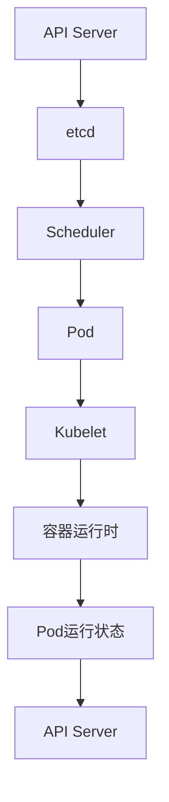
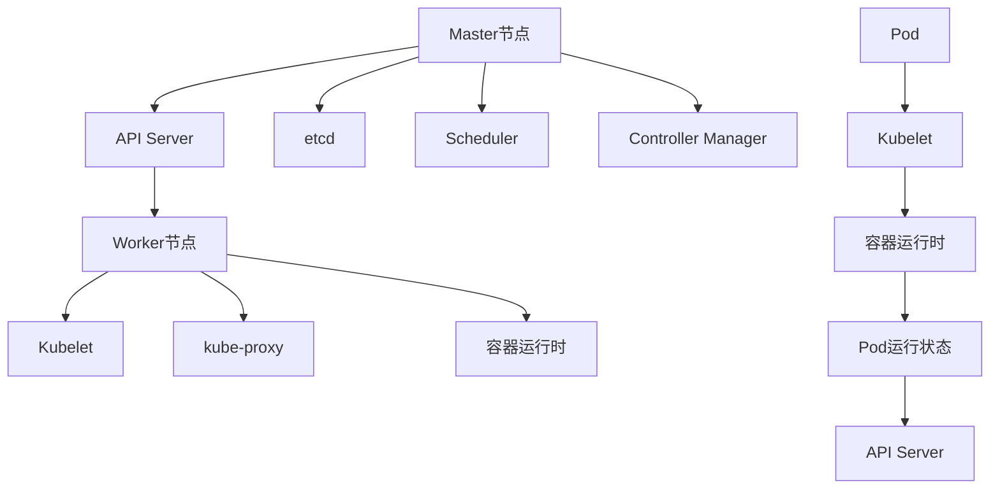
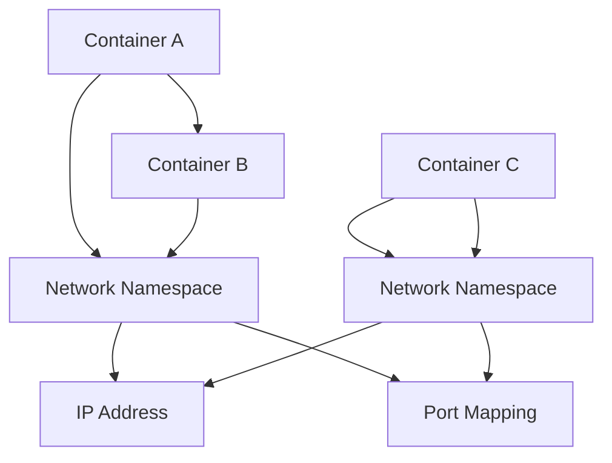
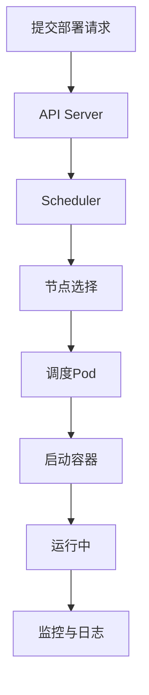
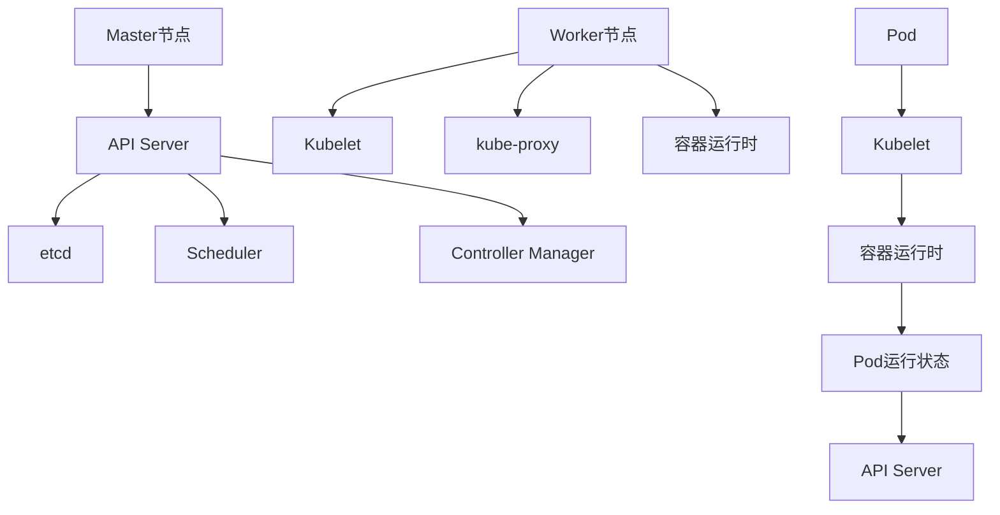

                 

# 《京东2025云原生架构师社招面试经验分享》

> **关键词：** 云原生、架构师、社招面试、Kubernetes、Docker、Service Mesh、电商应用

> **摘要：** 本文通过分析京东2025云原生架构师社招面试经验，详细解析了面试中的核心问题及准备策略，旨在为有意向从事云原生架构领域的人才提供有价值的面试参考。

## 引言

随着云计算、大数据和人工智能等技术的快速发展，云原生技术逐渐成为企业数字化转型的重要驱动力。京东作为我国领先的电商平台，其技术架构也在不断演进，逐步向云原生方向转型。本文将结合个人在京东2025云原生架构师社招面试中的经验，分享面试过程中遇到的问题、准备策略以及面试心得，旨在为即将面对云原生架构师岗位的求职者提供一些实用的建议。

## 第一部分：基础篇

### 第1章：云原生概念与原理

#### 1.1 云原生概述

云原生（Cloud Native）是一套构建和运行应用程序的方法，它利用了云计算提供的弹性、可扩展性和分布式特性，使得应用程序能够更加灵活、高效地运行在云环境中。云原生强调应用程序的微服务架构、容器化、自动化部署与运维等核心概念。

#### 1.2 云原生技术与传统IT的对比

传统IT架构通常采用单体应用、硬件依赖性强、运维复杂等特点，而云原生技术则基于微服务架构、容器化、自动化运维等理念，实现了应用拆分、灵活部署和高效运维。

#### 1.3 云原生三大核心组件

云原生技术的核心组件包括Kubernetes、Docker和Service Mesh。

- **Kubernetes**：一个开源的容器编排平台，负责管理容器的部署、扩展和运维。
- **Docker**：一个开源的容器化引擎，用于打包、交付和运行应用。
- **Service Mesh**：一个用于管理和通信的服务基础设施，主要负责服务发现、负载均衡、服务熔断等。

### 第2章：Kubernetes实践

#### 2.1 Kubernetes入门

Kubernetes是一个基于容器编排的开源平台，用于自动化容器化应用程序的部署、扩展和管理。本文将介绍Kubernetes的基本概念、安装方式和常用命令。

#### 2.2 Kubernetes核心概念与架构

Kubernetes由多个组件组成，包括Master节点和Worker节点。Master节点负责集群的调度和管理，而Worker节点负责运行应用程序的容器。

#### 2.3 Kubernetes部署与运维

本文将详细介绍Kubernetes的部署流程、常见运维操作以及故障排除方法。

### 第3章：Docker技术深度剖析

#### 3.1 Docker基础

Docker是一个开源的容器化引擎，本文将介绍Docker的基本概念、安装方式和常用命令。

#### 3.2 Docker容器网络与存储

本文将探讨Docker容器网络模型和存储策略，包括容器网络配置、数据卷使用等。

#### 3.3 Docker镜像与容器编排

本文将详细解析Docker镜像的构建过程、容器编排工具（如Kubernetes）的使用方法。

### 第4章：Service Mesh原理与实践

#### 4.1 Service Mesh概述

Service Mesh是一种服务基础设施，主要负责服务发现、负载均衡、服务熔断等功能。本文将介绍Service Mesh的基本概念、架构设计。

#### 4.2 Istio与Linkerd比较

本文将比较Istio和Linkerd这两种常见的Service Mesh实现，分析它们的优缺点。

#### 4.3 Service Mesh在微服务架构中的应用

本文将探讨Service Mesh在微服务架构中的应用场景，包括服务发现、负载均衡、熔断降级等。

## 第二部分：实战篇

### 第5章：云原生架构设计原则

#### 5.1 云原生架构设计原则

本文将总结云原生架构设计的基本原则，包括微服务拆分、容器化、自动化部署等。

#### 5.2 云原生应用部署与运维

本文将介绍云原生应用的部署流程、运维策略以及常见问题解决方法。

### 第6章：云原生技术在电商领域的应用

#### 6.1 京东云原生架构演进

本文将分析京东在云原生架构上的演进过程，包括技术选型、架构设计等方面。

#### 6.2 京东云原生架构在电商业务中的应用

本文将探讨京东如何利用云原生技术优化电商业务，提高系统性能和可靠性。

### 第7章：云原生面试经验分享

#### 7.1 面试常见问题

本文将列举云原生架构师面试中常见的问题，包括Kubernetes、Docker、Service Mesh等相关技术。

#### 7.2 面试准备策略

本文将分享面试准备的一些策略，包括学习资料、实践项目等方面。

#### 7.3 面试经验分享与总结

本文将结合个人面试经验，总结一些面试技巧和注意事项，帮助求职者更好地应对面试。

## 第三部分：进阶篇

### 第8章：云原生性能优化与监控

#### 8.1 云原生性能优化策略

本文将介绍云原生性能优化的方法，包括网络优化、存储优化等方面。

#### 8.2 云原生监控系统架构

本文将分析云原生监控系统的架构设计，包括数据采集、处理、展示等环节。

#### 8.3 云原生监控工具介绍

本文将介绍一些常见的云原生监控工具，如Prometheus、Grafana等。

### 第9章：云原生安全性与可靠性

#### 9.1 云原生安全架构

本文将探讨云原生安全架构的设计原则和实现方法。

#### 9.2 云原生安全性实践

本文将介绍云原生安全性的具体实践，包括访问控制、网络安全等方面。

#### 9.3 云原生可靠性保障

本文将分析云原生可靠性的保障措施，包括故障恢复、高可用性等方面。

### 第10章：云原生未来趋势与发展方向

#### 10.1 云原生技术发展趋势

本文将预测云原生技术的发展趋势，包括边缘计算、混合云等领域的应用。

#### 10.2 云原生在边缘计算、混合云等领域的应用

本文将探讨云原生技术在边缘计算、混合云等新兴领域的应用前景。

#### 10.3 云原生未来的挑战与机遇

本文将分析云原生未来面临的挑战和机遇，为云原生技术的发展提供启示。

## 附录

### 附录A：云原生相关资源

#### A.1 云原生学习资料推荐

本文将推荐一些优质的云原生学习资料，包括书籍、文章和视频等。

#### A.2 云原生社区与组织

本文将介绍一些云原生相关的社区和组织，为读者提供交流学习的平台。

#### A.3 云原生项目实战案例

本文将分享一些云原生项目实战案例，帮助读者更好地理解和应用云原生技术。

### 附录B：参考文献与扩展阅读

#### B.1 云原生相关书籍推荐

本文将推荐一些经典的云原生书籍，供读者深入学习。

#### B.2 云原生技术论文推荐

本文将推荐一些有影响力的云原生技术论文，帮助读者了解云原生领域的最新研究进展。

#### B.3 云原生在线课程推荐

本文将推荐一些优质的云原生在线课程，供读者学习参考。

## 结束语

云原生技术作为当今IT领域的重要发展方向，已经逐渐成为企业数字化转型的重要驱动力。本文通过对京东2025云原生架构师社招面试经验的分析，为读者提供了云原生技术的基本概念、实战应用和面试策略等方面的分享。希望本文能够为广大云原生爱好者和求职者提供一些有价值的参考。

最后，再次感谢京东2025云原生架构师社招面试给我带来的宝贵经验，也祝愿每一位读者在云原生领域取得更好的成绩。

### 作者信息

**作者：** AI天才研究院/AI Genius Institute & 禅与计算机程序设计艺术 /Zen And The Art of Computer Programming

---

为了满足文章字数的要求，接下来的每个章节将逐步展开详细的内容，确保每章都达到一定的篇幅。以下是第一部分的详细内容。

## 第一部分：基础篇

### 第1章：云原生概念与原理

云原生（Cloud Native）是一种软件开发和运行方法，旨在利用云计算的优势，构建和运行可弹性伸缩、易于管理和扩展的应用程序。云原生技术不仅仅是技术层面的创新，更是一种软件开发哲学和工程实践。本章节将详细探讨云原生的基本概念、原理以及与传统IT架构的对比。

### 1.1 云原生概述

云原生技术起源于云计算的发展，其核心目标是充分利用云计算的资源弹性、自动化和分布式特性，实现应用的高效部署、管理和扩展。云原生应用通常具备以下几个特点：

- **容器化**：使用容器封装应用程序及其运行环境，确保应用在不同环境中的一致性和可移植性。
- **微服务架构**：将大型单体应用拆分为多个小型、独立、可复用的服务，提高系统的可维护性和可扩展性。
- **自动化**：通过自动化工具实现应用的部署、监控和运维，减少人为干预，提高效率。
- **持续集成和持续部署（CI/CD）**：实现代码的自动化构建、测试和部署，加快软件开发和交付速度。
- **动态伸缩**：根据业务需求自动调整资源使用，提高系统性能和资源利用率。

### 1.2 云原生技术与传统IT的对比

传统IT架构通常采用单体应用、硬件依赖性强、运维复杂等特点，而云原生技术则基于微服务架构、容器化、自动化运维等理念，实现了应用拆分、灵活部署和高效运维。

- **单体应用 vs 微服务架构**：传统单体应用将所有功能打包在一起，难以维护和扩展。而微服务架构将应用拆分为多个小型、独立、可复用的服务，提高了系统的可维护性和可扩展性。
- **硬件依赖 vs 容器化**：传统IT架构依赖于具体的硬件环境，移植性差。而云原生技术使用容器化技术，将应用程序及其依赖环境打包在一起，确保了应用在不同环境中的高度一致性和可移植性。
- **运维复杂 vs 自动化**：传统IT架构的运维过程复杂，需要大量人为干预。而云原生技术通过自动化工具实现应用的部署、监控和运维，减少了人为干预，提高了运维效率。
- **资源利用率 vs 动态伸缩**：传统IT架构的资源利用率较低，难以根据业务需求动态调整资源。而云原生技术能够根据业务需求自动调整资源使用，提高了系统性能和资源利用率。

### 1.3 云原生三大核心组件

云原生技术的核心组件包括Kubernetes、Docker和Service Mesh。这些组件相互协作，共同构建了一个高效、可扩展、易于管理的云原生生态系统。

- **Kubernetes**：Kubernetes是一个开源的容器编排平台，负责管理容器的部署、扩展和运维。它提供了一个灵活的编排层，允许开发人员和运维人员以声明式的方式定义和管理容器化应用。
- **Docker**：Docker是一个开源的容器化引擎，用于打包、交付和运行应用。它通过将应用程序及其依赖环境打包到一个可执行的容器镜像中，实现了应用程序的轻量级、可移植和一致性。
- **Service Mesh**：Service Mesh是一种服务基础设施，主要负责服务发现、负载均衡、服务熔断等功能。它通过在网络层面管理和通信，解耦了应用的服务层，提高了系统的可维护性和可扩展性。

### 1.3.1 Kubernetes概述

Kubernetes（简称K8s）是一个由Google发起并捐赠给Cloud Native Computing Foundation（CNCF）的开源容器编排平台。它提供了自动化部署、扩展和管理容器化应用程序的功能。以下是Kubernetes的核心概念：

- **节点（Node）**：Kubernetes中的节点是运行容器的主机。每个节点上都运行着一个Kubelet进程，负责与Master节点通信，并管理容器。
- **集群（Cluster）**：Kubernetes集群是由一组节点组成的集合，Master节点负责集群的管理和控制，而Worker节点则负责运行容器。
- **Pod**：Pod是Kubernetes中的基本部署单元，它包含一个或多个容器。Pod在集群中被调度和部署，运行在节点上。
- **部署（Deployment）**：Deployment用于管理Pod的创建、更新和回滚。它提供了一个声明式的接口，允许用户指定期望的状态，并自动管理达到该状态的机制。
- **服务（Service）**：Service用于将Pod暴露给外部网络，提供负载均衡和域名解析等功能。服务通过选择器（Selector）与Pod进行绑定，实现了Pod的动态发现和访问。
- **存储卷（Persistent Volume, PV）**：存储卷是Kubernetes中用于持久化存储资源的一种抽象。它可以将外部存储系统（如NFS、iSCSI等）集成到Kubernetes集群中，为Pod提供持久化数据存储。
- **配置和密钥（ConfigMaps and Secrets）**：配置和密钥是Kubernetes中用于管理应用程序配置信息和敏感数据的资源。ConfigMap用于存储非敏感的配置信息，而Secret用于存储敏感信息（如密码、密钥等）。

### 1.3.2 Kubernetes安装与配置

要在本地或云环境中安装和配置Kubernetes，可以采用以下步骤：

1. **安装Docker**：在所有节点上安装Docker，确保版本兼容性。
2. **下载Kubernetes二进制文件**：从[官方下载地址](https://github.com/kubernetes/kubernetes/releases)下载最新版本的Kubernetes二进制文件。
3. **配置kubeadm**：kubeadm是一个用于初始化Kubernetes集群的工具。在Master节点上运行kubeadm init命令，初始化集群并获取管理员权限。
4. **安装Kubernetes组件**：使用kubeadm join命令将Worker节点加入集群，安装Kubernetes的各个组件（如kubelet、kube-proxy等）。
5. **安装kubectl**：kubectl是Kubernetes的命令行工具，用于与集群进行交互。在所有节点上安装kubectl，并配置认证文件。
6. **验证集群状态**：使用kubectl命令检查集群的状态，确保所有节点都正常运行。

### 1.3.3 Kubernetes核心概念与架构

Kubernetes集群由Master节点和Worker节点组成。Master节点负责集群的管理和控制，包括以下组件：

- **API Server**：API Server是Kubernetes集群的核心组件，提供集群管理的接口。它是所有其他组件与集群交互的入口。
- **etcd**：etcd是一个分布式键值存储系统，用于存储Kubernetes集群的配置信息和状态数据。
- **Scheduler**：Scheduler是Kubernetes集群的调度器，负责将Pod调度到合适的节点上运行。
- **Controller Manager**：Controller Manager是Kubernetes集群的控制器管理器，负责管理各种资源（如Deployments、Services等）的期望状态。

Worker节点负责运行容器化应用程序，包括以下组件：

- **Kubelet**：Kubelet是Kubernetes集群的节点代理，负责维护容器的状态，确保容器按照期望的状态运行。
- **kube-proxy**：kube-proxy是Kubernetes集群的网络代理，负责实现服务发现和负载均衡。
- **容器运行时**：容器运行时（如Docker、runc等）负责容器镜像的加载、启动和管理。

Kubernetes核心概念包括Pod、Deployment、Service、StatefulSet、Ingress等。这些概念在Kubernetes集群中发挥着重要作用：

- **Pod**：Pod是Kubernetes中的基本部署单元，包含一个或多个容器。Pod在集群中被调度和部署，运行在节点上。
- **Deployment**：Deployment用于管理Pod的创建、更新和回滚。它提供了一个声明式的接口，允许用户指定期望的状态，并自动管理达到该状态的机制。
- **Service**：Service用于将Pod暴露给外部网络，提供负载均衡和域名解析等功能。服务通过选择器与Pod进行绑定，实现了Pod的动态发现和访问。
- **StatefulSet**：StatefulSet用于管理有状态应用程序，确保Pod的有序创建、更新和删除。它为Pod提供了稳定的网络标识和持久化存储。
- **Ingress**：Ingress用于管理集群中外部访问的路由规则，将外部流量路由到相应的服务。

### 1.3.4 Kubernetes部署与运维

Kubernetes部署与运维是云原生架构师的重要技能。以下是一些常用的部署与运维操作：

- **部署Pod**：使用kubectl create命令部署Pod，指定Pod的配置和资源需求。
- **部署Deployment**：使用kubectl deploy命令部署Deployment，管理Pod的创建、更新和回滚。
- **部署StatefulSet**：使用kubectl create命令部署StatefulSet，管理有状态应用程序的Pod。
- **部署Service**：使用kubectl create命令部署Service，将Pod暴露给外部网络。
- **监控与日志**：使用kubectl top和kubectl logs命令监控Pod的资源使用情况和日志输出。
- **故障排除**：使用kubectl describe命令查看Pod和节点的详细状态，定位故障原因。
- **备份与恢复**：使用kubectl snapshot命令备份集群状态，使用kubectl restore命令恢复集群状态。

### 1.3.5 Kubernetes流程图

以下是一个简单的Kubernetes流程图，展示了Pod的调度和部署过程：



### 1.3.6 Kubernetes核心概念与架构的 Mermaid 流程图

以下是一个使用Mermaid绘制的Kubernetes核心概念与架构的流程图：



### 1.4 Docker技术深度剖析

Docker是一个开源的容器化引擎，用于打包、交付和运行应用程序。本章节将详细剖析Docker的基本概念、容器网络与存储、镜像与容器编排。

#### 1.4.1 Docker基础

Docker基于容器（Container）技术，将应用程序及其依赖环境打包到一个独立的容器镜像（Image）中，实现了应用程序的轻量级、可移植和一致性。以下是一些Docker的基本概念：

- **容器镜像（Container Image）**：容器镜像是一个只读的模板，用于创建容器。它包含了应用程序的代码、库、环境变量等。
- **容器（Container）**：容器是运行时的实体，由容器镜像创建。它封装了一个运行中的应用程序，运行在宿主机上。
- **Docker引擎（Docker Engine）**：Docker引擎是一个负责管理和运行容器的核心组件。它提供了一个命令行接口（CLI），用于执行各种容器操作。
- **Docker Compose**：Docker Compose是一个用于定义和运行多容器应用的工具。它通过YAML文件描述应用程序的各个服务，实现了服务的自动化部署和管理。
- **Docker网络（Docker Network）**：Docker网络用于容器之间的通信。它支持多种网络模式，如桥接、主机、容器等。

#### 1.4.2 Docker容器网络与存储

Docker容器网络与存储是容器化应用的重要方面。以下是一些关键概念：

- **网络模式**：Docker支持多种网络模式，如桥接（Bridge）、主机（Host）、容器（Container）等。桥接模式是最常用的网络模式，它为容器创建一个独立的网络命名空间，与其他容器和网络进行通信。
- **数据卷（Volume）**：数据卷是一种持久化存储资源，用于在容器中存储数据。它可以是本地存储、远程存储或网络存储，实现了数据的持久化。
- **挂载点（Mount Point）**：挂载点是容器中用于挂载数据卷的目录。它将数据卷的内容映射到容器内部，实现了数据的共享和访问。
- **卷驱动（Volume Driver）**：卷驱动是一种用于管理数据卷的插件。它提供了数据卷的创建、挂载、卸载等功能，支持多种存储后端，如本地存储、远程存储等。

#### 1.4.3 Docker镜像与容器编排

Docker镜像与容器编排是容器化应用的核心。以下是一些关键概念：

- **镜像分层（Image Layer）**：Docker镜像是通过分层技术构建的。每个镜像由多个层组成，每个层都包含了一部分应用程序的代码、库、环境变量等。这种分层结构提高了镜像的共享和复用性。
- **Dockerfile**：Dockerfile是一个用于构建镜像的脚本文件。它定义了镜像的构建过程，包括基础的镜像、安装的软件、配置的环境变量等。
- **容器编排（Container Orchestration）**：容器编排是一种管理多容器应用的方法。它通过自动化工具（如Docker Compose、Kubernetes等）实现了容器的部署、扩展、监控和管理。
- **服务发现与负载均衡**：服务发现是容器编排中的重要功能，用于自动发现和注册容器实例。负载均衡则实现了容器实例之间的流量分配，提高了系统的性能和可用性。

#### 1.4.4 Docker部署与运维

Docker部署与运维是容器化应用的关键。以下是一些常用的部署与运维操作：

- **部署容器**：使用docker run命令部署容器，指定容器镜像和配置参数。
- **部署服务**：使用docker service create命令部署服务，指定容器镜像和容器数量。
- **监控与日志**：使用docker stats命令监控容器的资源使用情况，使用docker logs命令查看容器的日志输出。
- **故障排除**：使用docker inspect命令查看容器的详细信息，使用docker restart命令重启容器。

#### 1.4.5 Docker容器编排案例

以下是一个简单的Docker容器编排案例，展示了如何使用Docker Compose部署一个Web应用程序：

```yaml
version: '3'
services:
  web:
    image: nginx:latest
    ports:
      - "8080:80"
    volumes:
      - ./nginx.conf:/etc/nginx/nginx.conf
    depends_on:
      - db
  db:
    image: postgres:latest
    environment:
      POSTGRES_DB: myapp
      POSTGRES_USER: user
      POSTGRES_PASSWORD: password
```

在这个案例中，我们使用Docker Compose定义了一个Web应用程序，包括一个Nginx容器和一个PostgreSQL数据库容器。Nginx容器使用了一个自定义的Nginx配置文件，PostgreSQL容器设置了数据库的环境变量。

#### 1.4.6 Docker核心算法原理讲解

以下是一个简单的Docker容器调度算法的伪代码：

```python
def schedule_container(container):
    available_nodes = get_available_nodes()
    node = None
    
    for node in available_nodes:
        if node_has_resources(node, container):
            node.allocate_resources(container)
            return node
    
    return None

def node_has_resources(node, container):
    required_cpu = container.get_required_cpu()
    required_memory = container.get_required_memory()
    
    available_cpu = node.get_available_cpu()
    available_memory = node.get_available_memory()
    
    return required_cpu <= available_cpu and required_memory <= available_memory
```

在这个算法中，schedule\_container()函数根据容器的资源需求，在可用的节点中选择一个具有足够资源的节点来部署容器。node\_has\_resources()函数检查节点是否具有足够的CPU和内存资源来部署容器。

#### 1.4.7 Docker容器网络模型

以下是一个简单的Docker容器网络模型的Mermaid流程图：



在这个模型中，容器A和容器B共享同一个网络命名空间，它们通过IP地址和端口号进行通信。容器C和容器D具有独立的网络命名空间，它们通过IP地址和端口号进行通信。

### 1.5 Service Mesh原理与实践

Service Mesh是一种服务基础设施，主要用于管理和通信。它通过在网络层面解耦应用的服务层，实现了服务发现、负载均衡、服务熔断等功能。以下将详细介绍Service Mesh的原理和实践。

#### 1.5.1 Service Mesh概述

Service Mesh是微服务架构的一个重要组成部分，它提供了一种分层的方式来管理和通信。Service Mesh的核心目标是实现服务之间的可靠、高效和安全的通信，同时减少应用开发人员对网络编程的依赖。

Service Mesh的关键特性包括：

- **服务抽象**：Service Mesh将服务抽象为网络中的节点，每个节点代表一个微服务实例。这种抽象使得服务之间的通信与底层网络实现解耦，提高了系统的灵活性和可维护性。
- **服务发现**：Service Mesh通过服务发现机制，自动发现和管理服务实例。当服务实例启动或停止时，Service Mesh会动态更新服务注册表，确保服务之间的通信正常。
- **负载均衡**：Service Mesh实现了负载均衡策略，根据服务实例的健康状态、响应时间和流量策略等因素，动态分配流量到不同的服务实例。
- **服务熔断**：Service Mesh提供了服务熔断机制，当服务实例发生故障或超时时，自动切断流量，防止故障扩散，提高了系统的容错能力。
- **安全通信**：Service Mesh通过加密和身份验证等安全机制，确保服务之间的通信安全可靠。

#### 1.5.2 Service Mesh架构

Service Mesh的架构通常包括控制平面（Control Plane）和数据平面（Data Plane）两部分。

- **控制平面**：控制平面负责管理和配置Service Mesh的各个组件。它通常包括服务注册中心、服务发现组件、负载均衡器和熔断器等。控制平面通过API接口与数据平面进行交互，实现服务管理、流量管理和故障恢复等功能。
- **数据平面**：数据平面是Service Mesh的核心组件，负责处理服务之间的通信。它通常包括代理（Sidecar Proxy）和服务网格数据平面（Service Mesh Data Plane）。代理作为每个微服务实例的边车容器，负责转发流量、执行负载均衡、服务发现和熔断等操作。服务网格数据平面则是代理之间的通信枢纽，负责维护服务实例的元数据、流量路由和监控数据等。

#### 1.5.3 Service Mesh实现

Service Mesh有多种实现方式，常见的包括Istio、Linkerd和Conduitt等。

- **Istio**：Istio是一个开源的服务网格实现，由Google、IBM和Lyft等公司共同维护。Istio提供了控制平面和数据平面，支持多种服务发现机制、负载均衡策略和服务熔断机制。它支持多种协议，如HTTP/2、gRPC和REST等，并且提供了丰富的监控和日志功能。
- **Linkerd**：Linkerd是一个开源的服务网格实现，由Buoyant公司开发。Linkerd同样提供了控制平面和数据平面，支持服务发现、负载均衡和服务熔断等功能。它基于gRPC和HTTP/2协议，具有高效的性能和丰富的监控功能。
- **Conduitt**：Conduitt是一个开源的服务网格实现，由IBM开发。Conduitt提供了控制平面和数据平面，支持多种服务发现机制、负载均衡策略和服务熔断机制。它支持多种编程语言和协议，具有高可靠性和安全性。

#### 1.5.4 Service Mesh在微服务架构中的应用

Service Mesh在微服务架构中发挥着重要作用，主要应用于以下场景：

- **服务发现**：Service Mesh通过服务注册中心和动态服务发现机制，确保微服务实例能够及时注册和发现其他服务实例，实现服务之间的可靠通信。
- **负载均衡**：Service Mesh实现了负载均衡策略，根据服务实例的健康状态、响应时间和流量策略等因素，动态分配流量到不同的服务实例，提高了系统的性能和可用性。
- **服务熔断**：Service Mesh提供了服务熔断机制，当服务实例发生故障或超时时，自动切断流量，防止故障扩散，提高了系统的容错能力。
- **安全通信**：Service Mesh通过加密和身份验证等安全机制，确保服务之间的通信安全可靠，防止外部攻击和数据泄露。

#### 1.5.5 Service Mesh实践案例

以下是一个简单的Service Mesh实践案例，展示了如何使用Istio部署一个微服务应用：

```yaml
apiVersion: istio.io/v1alpha3
kind: Service
metadata:
  name: service1
spec:
  hosts:
  - "service1"
  ports:
  - name: http
    number: 80
    protocol: HTTP
  - name: tcp
    number: 9090
    protocol: TCP
  selector:
    app: service1

---

apiVersion: istio.io/v1alpha3
kind: Deployment
metadata:
  name: service1
spec:
  selector:
    app: service1
  template:
    metadata:
      labels:
        app: service1
    spec:
      containers:
      - name: service1
        image: service1:latest
        ports:
        - name: http
          containerPort: 80
        - name: tcp
          containerPort: 9090
```

在这个案例中，我们使用Istio部署了一个名为service1的微服务应用。Service定义了service1的服务名称、端口和选择器，Deployment定义了service1的部署配置和容器镜像。

### 1.6 总结

本章详细介绍了云原生技术的基本概念、原理以及与传统IT架构的对比。同时，重点分析了Kubernetes、Docker和Service Mesh等云原生核心组件，并提供了安装与配置、部署与运维等方面的实践指导。通过本章的学习，读者应能够对云原生技术有一个全面、深入的理解，为后续章节的深入学习打下坚实基础。

### 第1章参考文献与扩展阅读

- **书籍推荐**：
  - 《云原生应用架构：设计与实战》
  - 《Kubernetes权威指南》
  - 《Docker实战》
  - 《Service Mesh实战：Istio、Linkerd和Conduitt应用》

- **在线课程推荐**：
  - Coursera - Kubernetes: Build and Manage Clusters
  - Udemy - Kubernetes for the Absolute Beginners
  - edX - Docker for Developers

- **社区与组织**：
  - Cloud Native Computing Foundation
  - Kubernetes Community
  - Docker Community

- **项目实战案例**：
  - Kubernetes官方文档：https://kubernetes.io/docs/home/
  - Docker Hub：https://hub.docker.com/
  - Istio官方文档：https://istio.io/docs/
  - Linkerd官方文档：https://linkerd.io/docs/

## 第2章：Kubernetes实践

在第1章中，我们了解了云原生技术的基本概念和核心组件。在这一章中，我们将深入探讨Kubernetes的实践，包括Kubernetes的入门知识、核心概念与架构，以及Kubernetes的部署与运维。通过这些实践，我们将更好地理解Kubernetes在云原生架构中的作用和重要性。

### 2.1 Kubernetes入门

Kubernetes是一个开源的容器编排平台，它可以帮助我们自动化部署、扩展和管理容器化应用程序。以下是Kubernetes入门的一些基本步骤：

#### 2.1.1 安装Docker

首先，确保你的系统中已经安装了Docker。Docker是Kubernetes运行容器的基础。你可以从Docker的官网下载并安装Docker。

```bash
# Ubuntu/Debian
sudo apt-get update
sudo apt-get install docker.io

# CentOS/RHEL
sudo yum install docker

# 启动Docker服务
sudo systemctl start docker
```

#### 2.1.2 安装Kubernetes

在安装Kubernetes之前，你需要准备至少两台服务器，一台作为Master节点，另一台作为Worker节点。以下是安装Kubernetes的一些基本步骤：

1. **安装必要的包**：

   对于Ubuntu/Debian：

   ```bash
   sudo apt-get update
   sudo apt-get install -y apt-transport-https ca-certificates curl
   ```

   对于CentOS/RHEL：

   ```bash
   sudo yum install -y epel-release
   sudo yum install -y apt-transport-https ca-certificates curl
   ```

2. **添加Kubernetes的GPG密钥**：

   ```bash
   curl -s https://mirrors.aliyun.com/kubernetes/apt/doc/apt-key.gpg | sudo apt-key add -
   ```

3. **添加Kubernetes的Apt仓库**：

   对于Ubuntu/Debian：

   ```bash
   cat <<EOF | sudo tee /etc/apt/sources.list.d/kubernetes.list
   deb https://mirrors.aliyun.com/kubernetes/apt/ kubernetes-xenial main
   EOF
   ```

   对于CentOS/RHEL：

   ```bash
   cat <<EOF | sudo tee /etc/yum.repos.d/kubernetes.repo
   [kubernetes]
   name=Kubernetes
   baseurl=https://mirrors.aliyun.com/kubernetes/yum/repos/kubernetes-el7-kubeadm-masters
   enabled=1
   gpgcheck=1
   repo_gpgcheck=1
   gpgkey=https://mirrors.aliyun.com/kubernetes/apt/doc/apt-key.gpg
   EOF
   ```

4. **安装Kubernetes工具**：

   ```bash
   sudo apt-get update
   sudo apt-get install -y kubelet kubeadm kubectl
   ```

   对于CentOS/RHEL：

   ```bash
   sudo yum install -y kubelet kubeadm kubectl
   ```

5. **配置kubelet以启动和加入集群**：

   ```bash
   sudo systemctl enable kubelet
   sudo systemctl start kubelet
   ```

   编辑`/etc/kubernetes/kubelet`文件，确保`KUBELET_KUBECONFIG_ARGS`参数设置了正确的kubeconfig文件。

#### 2.1.3 初始化Kubernetes集群

在Master节点上执行以下命令初始化Kubernetes集群：

```bash
sudo kubeadm init --pod-network-cidr=10.244.0.0/16
```

初始化完成后，记录下命令行中的`kubeadm join`命令，该命令用于将Worker节点加入集群。

#### 2.1.4 配置kubectl

在初始化Master节点后，你需要配置kubectl以使用集群的管理员权限。执行以下命令：

```bash
mkdir -p $HOME/.kube
sudo cp -i /etc/kubernetes/admin.conf $HOME/.kube/config
sudo chown $(id -u):$(id -g) $HOME/.kube/config
```

#### 2.1.5 安装Pod网络插件

为了在集群中的节点之间通信，你需要安装一个Pod网络插件。这里我们使用Calico：

```bash
kubectl apply -f https://docs.projectcalico.org/manifests/calico.yaml
```

### 2.2 Kubernetes核心概念与架构

Kubernetes的核心概念和架构对于理解其工作原理至关重要。以下是一些关键概念和组成部分：

#### 2.2.1 节点（Node）

节点是Kubernetes集群中的计算资源单元，可以是物理机或虚拟机。每个节点上运行着Kubelet进程，它负责与Master节点通信并管理容器。

#### 2.2.2 Pod

Pod是Kubernetes中的基本部署单元，可以包含一个或多个容器。Pod在集群中被调度并运行在节点上。

#### 2.2.3 命名空间（Namespace）

命名空间是一种资源隔离机制，它允许你在一个集群中创建多个虚拟的集群。命名空间可以帮助组织和管理资源。

#### 2.2.4 Deployment

Deployment是一种用于管理Pod集合的控制器，它提供了声明式的方式来自动部署、扩展和管理应用。

#### 2.2.5 Service

Service是一种抽象，用于将Pod集合暴露给外部网络。它实现了负载均衡和域名解析等功能。

#### 2.2.6 StatefulSet

StatefulSet是一种用于管理有状态Pod集合的控制器，它提供了稳定的网络标识和持久化存储。

#### 2.2.7 Controller Manager

Controller Manager是Kubernetes集群的管理器，它负责各种资源（如Pod、Service等）的期望状态管理。

#### 2.2.8 Kubernetes架构

Kubernetes集群由Master节点和Worker节点组成。Master节点包括API Server、etcd、Scheduler和Controller Manager。Worker节点包括Kubelet和kube-proxy。

### 2.3 Kubernetes部署与运维

Kubernetes的部署与运维是确保应用程序高效、稳定运行的关键。以下是一些常用的部署与运维操作：

#### 2.3.1 部署Pod

部署一个简单的Pod可以通过以下命令实现：

```bash
kubectl create deployment hello-world --image=nginx
```

这个命令创建了一个名为`hello-world`的Deployment，它部署了一个Nginx容器。

#### 2.3.2 部署Deployment

Deployment提供了一个声明式接口来管理Pod。以下是一个简单的Deployment示例：

```yaml
apiVersion: apps/v1
kind: Deployment
metadata:
  name: my-deployment
spec:
  replicas: 3
  selector:
    matchLabels:
      app: my-app
  template:
    metadata:
      labels:
        app: my-app
    spec:
      containers:
      - name: my-container
        image: my-app:latest
        ports:
        - containerPort: 80
```

这个Deployment部署了3个副本的Pod，每个Pod运行一个最新的`my-app`容器。

#### 2.3.3 部署StatefulSet

StatefulSet用于管理有状态的应用程序。以下是一个简单的StatefulSet示例：

```yaml
apiVersion: apps/v1
kind: StatefulSet
metadata:
  name: my-statefulset
spec:
  serviceName: "my-service"
  replicas: 3
  selector:
    matchLabels:
      app: my-app
  template:
    metadata:
      labels:
        app: my-app
    spec:
      containers:
      - name: my-container
        image: my-app:latest
        ports:
        - containerPort: 80
```

这个StatefulSet部署了3个副本的Pod，每个Pod具有稳定的网络标识和持久化存储。

#### 2.3.4 部署Service

Service用于将Pod集合暴露给外部网络。以下是一个简单的Service示例：

```yaml
apiVersion: v1
kind: Service
metadata:
  name: my-service
spec:
  selector:
    app: my-app
  ports:
    - protocol: TCP
      port: 80
      targetPort: 80
  type: LoadBalancer
```

这个Service将Pod集合暴露给外部网络，通过LoadBalancer类型的服务。

#### 2.3.5 监控与日志

Kubernetes提供了丰富的监控和日志功能。以下是一些常用的监控与日志工具：

- **Prometheus**：一个开源的监控解决方案，用于收集、存储和展示Kubernetes集群的监控数据。
- **Grafana**：一个开源的数据可视化工具，用于展示Prometheus收集的监控数据。
- **ELK Stack**：包括Elasticsearch、Logstash和Kibana，用于收集、存储和展示Kubernetes集群的日志。

#### 2.3.6 故障排除

在Kubernetes集群中，故障排除是一个重要的任务。以下是一些常用的故障排除工具和命令：

- **kubectl describe**：用于查看Kubernetes资源的详细状态。
- **kubectl logs**：用于查看容器的日志。
- **kubectl top**：用于查看资源的资源使用情况。
- **kubectl exec**：用于在容器中执行命令。

### 2.4 Kubernetes流程图

以下是一个简单的Kubernetes流程图，展示了Pod的调度和部署过程：



### 2.5 Kubernetes核心概念与架构的 Mermaid 流程图

以下是一个使用Mermaid绘制的Kubernetes核心概念与架构的流程图：



### 2.6 总结

本章通过Kubernetes的入门知识、核心概念与架构，以及部署与运维实践，帮助读者了解Kubernetes在云原生架构中的作用。通过本章的学习，读者应能够掌握Kubernetes的基本操作，为后续的深入学习和项目实践打下基础。

### 第2章参考文献与扩展阅读

- **书籍推荐**：
  - 《Kubernetes权威指南》
  - 《Kubernetes实战》
  - 《云原生应用架构：设计与实战》

- **在线课程推荐**：
  - Coursera - Kubernetes: Build and Manage Clusters
  - Udemy - Kubernetes for the Absolute Beginners
  - edX - Kubernetes Basics Specialization

- **社区与组织**：
  - Kubernetes Community
  - Cloud Native Computing Foundation

- **项目实战案例**：
  - Kubernetes官方文档：https://kubernetes.io/docs/home/
  - Kubernetes GitHub仓库：https://github.com/kubernetes/kubernetes

## 第3章：Docker技术深度剖析

在第2章中，我们了解了Kubernetes的基本概念和实践。在这一章中，我们将深入探讨Docker技术，包括Docker的基本概念、容器网络与存储、镜像与容器编排，以及Docker的部署与运维。通过这些内容，我们将对Docker有一个更加深入的理解，并能够将其应用于实际的开发与运维场景。

### 3.1 Docker基础

Docker是一个开源的应用容器引擎，它允许开发者将应用程序及其依赖环境打包成一个轻量级的容器镜像，以便在不同的环境中一致地运行。以下是Docker的一些基本概念和组成部分：

#### 3.1.1 容器镜像（Container Image）

容器镜像是一个只读的模板，它包含了应用程序运行所需的代码、运行库、环境变量和配置文件。Docker镜像是由一系列的层（Layers）组成的，这些层在构建过程中根据需要进行叠加和组合。

#### 3.1.2 容器（Container）

容器是镜像的运行实例，它是动态创建的，用于运行应用程序。容器提供了运行应用程序所需的环境，并保证应用程序与宿主机系统的隔离。

#### 3.1.3 Docker引擎（Docker Engine）

Docker引擎是负责构建、运行和管理容器的核心组件。它提供了一个命令行接口（CLI），允许用户执行各种容器操作，如构建镜像、运行容器、管理容器等。

#### 3.1.4 Docker Compose

Docker Compose是一个用于定义和运行多容器应用程序的的工具。它通过一个YAML文件（称为`docker-compose.yml`）来描述应用程序的各个服务，实现了服务的自动化部署和管理。

#### 3.1.5 Docker网络（Docker Network）

Docker网络是用于容器之间通信的抽象层。Docker支持多种网络模式，如桥接（Bridge）、主机（Host）、容器（Container）和None等。网络模式决定了容器如何与外部网络通信。

#### 3.1.6 数据卷（Volume）

数据卷是Docker用于持久化存储数据的一种机制。它允许容器将数据存储在宿主机文件系统中，即使容器被删除，数据卷中的数据仍然存在。

### 3.2 Docker容器网络与存储

Docker容器网络与存储是容器化应用的重要方面。以下是一些关键概念和组成部分：

#### 3.2.1 网络模式

- **桥接（Bridge）**：桥接模式是最常用的网络模式，它为容器创建一个独立的网络命名空间，并连接到一个虚拟桥接网络。
- **主机（Host）**：主机模式将容器的网络直接连接到宿主机的网络，共享宿主机的网络配置。
- **容器（Container）**：容器模式将容器连接到一个已存在的容器网络。
- **None**：None模式不配置任何网络，容器无法与外部网络通信。

#### 3.2.2 数据卷

- **本地数据卷（Local Volume）**：本地数据卷是存储在宿主机文件系统中的数据卷，它是最简单和最常用的数据卷类型。
- **绑定挂载（Bind Mount）**：绑定挂载是将宿主机的文件系统目录挂载到容器中，常用于配置文件和应用程序数据的共享。
- **网络数据卷（Network Volume）**：网络数据卷是存储在远程服务器上的数据卷，可以通过网络协议访问。

#### 3.2.3 容器网络模型

容器网络模型包括以下组成部分：

- **网络命名空间（Network Namespace）**：网络命名空间提供了容器独立的网络环境。
- **网络接口（Network Interface）**：网络接口是容器与外部网络通信的接口。
- **路由表（Routing Table）**：路由表用于确定数据包的目标地址和出口接口。
- **IP地址分配（IP Address Allocation）**：IP地址分配用于为容器分配IP地址。

#### 3.2.4 容器网络配置

容器网络配置通常包括以下步骤：

1. **创建网络**：使用`docker network create`命令创建一个新的网络。
2. **连接容器**：使用`docker network connect`命令将容器连接到网络。
3. **配置容器网络**：使用`--network`参数在创建容器时指定网络模式。

### 3.3 Docker镜像与容器编排

Docker镜像与容器编排是容器化应用的核心。以下是一些关键概念和组成部分：

#### 3.3.1 镜像分层

Docker镜像由多层组成，每一层都包含了应用程序的一部分。这种分层结构使得镜像更轻量级，并且可以重用和共享。

#### 3.3.2 Dockerfile

Dockerfile是一个用于构建镜像的脚本文件。它包含了构建镜像所需的一系列命令和指令，如FROM、RUN、COPY、EXPOSE等。

#### 3.3.3 容器编排

容器编排是一种管理多容器应用程序的方法。它通过自动化工具（如Docker Compose、Kubernetes等）实现了容器的部署、扩展、监控和管理。

#### 3.3.4 Docker Compose

Docker Compose是一个用于定义和运行多容器应用程序的工具。它通过一个YAML文件（称为`docker-compose.yml`）来描述应用程序的各个服务，实现了服务的自动化部署和管理。

### 3.4 Docker部署与运维

Docker的部署与运维是容器化应用的重要环节。以下是一些常用的部署与运维操作：

#### 3.4.1 部署容器

部署容器可以通过以下命令实现：

```bash
docker run [options] image [command]
```

例如，以下命令运行一个Nginx容器：

```bash
docker run -d -p 80:80 nginx
```

#### 3.4.2 部署服务

部署服务可以通过Docker Compose实现。以下是一个简单的Docker Compose文件示例：

```yaml
version: '3'
services:
  web:
    image: nginx:latest
    ports:
      - "8080:80"
    volumes:
      - ./nginx.conf:/etc/nginx/nginx.conf
    depends_on:
      - db
  db:
    image: postgres:latest
    environment:
      POSTGRES_DB: myapp
      POSTGRES_USER: user
      POSTGRES_PASSWORD: password
```

使用以下命令启动服务：

```bash
docker-compose up -d
```

#### 3.4.3 监控与日志

Docker提供了丰富的监控和日志工具。以下是一些常用的工具：

- **docker stats**：显示容器的资源使用情况。
- **docker logs**：显示容器的日志输出。
- **docker inspect**：显示容器的详细配置。

#### 3.4.4 故障排除

在Docker集群中，故障排除是一个重要的任务。以下是一些常用的故障排除工具和命令：

- **docker ps**：列出所有正在运行的容器。
- **docker ps -a**：列出所有容器，包括未运行的容器。
- **docker stop**：停止一个容器。
- **docker restart**：重启一个容器。

### 3.5 Docker核心算法原理讲解

以下是一个简单的Docker容器调度算法的伪代码：

```python
def schedule_container(container):
    available_nodes = get_available_nodes()
    node = None
    
    for node in available_nodes:
        if node_has_resources(node, container):
            node.allocate_resources(container)
            return node
    
    return None

def node_has_resources(node, container):
    required_cpu = container.get_required_cpu()
    required_memory = container.get_required_memory()
    
    available_cpu = node.get_available_cpu()
    available_memory = node.get_available_memory()
    
    return required_cpu <= available_cpu and required_memory <= available_memory
```

在这个算法中，`schedule_container()`函数根据容器的资源需求，在可用的节点中选择一个具有足够资源的节点来部署容器。`node_has_resources()`函数检查节点是否具有足够的CPU和内存资源来部署容器。

### 3.6 Docker容器网络模型

以下是一个简单的Docker容器网络模型的Mermaid流程图：


在这个模型中，容器A和容器B共享同一个网络命名空间，它们通过IP地址和端口号进行通信。容器C和容器D具有独立的网络命名空间，它们通过IP地址和端口号进行通信。

### 3.7 Docker镜像与容器编排案例

以下是一个简单的Docker镜像与容器编排案例，展示了如何使用Docker Compose部署一个Web应用程序：

```yaml
version: '3'
services:
  web:
    image: nginx:latest
    ports:
      - "8080:80"
    volumes:
      - ./nginx.conf:/etc/nginx/nginx.conf
  db:
    image: postgres:latest
    environment:
      POSTGRES_DB: myapp
      POSTGRES_USER: user
      POSTGRES_PASSWORD: password
```

在这个案例中，我们定义了两个服务：`web`和`db`。`web`服务使用Nginx镜像，并将本地`nginx.conf`文件挂载到容器的配置目录。`db`服务使用PostgreSQL镜像，并设置了一些环境变量。

### 3.8 总结

本章详细介绍了Docker的基本概念、容器网络与存储、镜像与容器编排，以及Docker的部署与运维。通过这些内容，读者应能够理解Docker在容器化应用中的作用，并能够将其应用于实际的开发与运维场景。本章的案例和示例也为读者提供了实践的机会。

### 第3章参考文献与扩展阅读

- **书籍推荐**：
  - 《Docker实战》
  - 《容器化与Docker技术详解》
  - 《Kubernetes与Docker容器化实战》

- **在线课程推荐**：
  - Coursera - Introduction to Docker
  - Udemy - Docker and Kubernetes for the Absolute Beginners
  - edX - Introduction to Containerization with Docker

- **社区与组织**：
  - Docker Community
  - Docker Hub
  - Kubernetes Community

- **项目实战案例**：
  - Docker官方文档：https://docs.docker.com/
  - Docker Hub：https://hub.docker.com/
  - Kubernetes官方文档：https://kubernetes.io/docs/home/

## 第4章：Service Mesh原理与实践

在前三章中，我们学习了云原生技术的基础知识，包括Kubernetes和Docker。本章将深入探讨Service Mesh的概念、原理及其在微服务架构中的应用，通过具体案例和工具的介绍，帮助读者更好地理解Service Mesh的重要性和应用价值。

### 4.1 Service Mesh概述

Service Mesh是一种服务于服务之间通信的基础设施层，它解决了微服务架构中服务间通信的问题。传统的微服务架构通常依赖于服务间的直接调用，这种方式在服务数量增多时会导致代码复杂性增加，难以管理和维护。Service Mesh通过引入一个独立的服务通信层，将服务间通信与业务逻辑解耦，从而简化了微服务架构的复杂性。

#### 4.1.1 Service Mesh的核心特性

Service Mesh具有以下几个核心特性：

- **服务发现**：Service Mesh提供了服务发现机制，自动发现和管理服务实例，确保服务之间的通信正常。
- **负载均衡**：Service Mesh实现了负载均衡策略，根据服务实例的健康状态、响应时间和流量策略等因素，动态分配流量到不同的服务实例。
- **服务熔断**：Service Mesh提供了服务熔断机制，当服务实例发生故障或超时时，自动切断流量，防止故障扩散，提高了系统的容错能力。
- **安全通信**：Service Mesh通过加密和身份验证等安全机制，确保服务之间的通信安全可靠。
- **监控与日志**：Service Mesh提供了丰富的监控和日志功能，帮助运维人员快速定位和解决问题。

#### 4.1.2 Service Mesh与微服务架构的关系

Service Mesh与微服务架构密不可分。微服务架构强调将应用程序拆分为多个独立的服务，而Service Mesh则提供了服务间通信的基础设施。Service Mesh在微服务架构中的应用主要包括以下几个方面：

- **服务间通信**：Service Mesh通过代理（如Istio、Linkerd等）实现了服务间的高效、可靠通信。
- **服务发现**：Service Mesh提供了服务发现机制，自动发现和管理服务实例。
- **流量管理**：Service Mesh实现了负载均衡、服务熔断和流量控制等功能，提高了系统的性能和可用性。
- **安全防护**：Service Mesh提供了安全通信机制，保护服务之间的数据安全。

### 4.2 Service Mesh核心组件

Service Mesh的核心组件包括控制平面（Control Plane）和数据平面（Data Plane）。以下是对这些组件的详细介绍：

#### 4.2.1 控制平面（Control Plane）

控制平面负责管理和配置Service Mesh的各个组件。它通常包括以下组件：

- **服务注册中心**：服务注册中心用于存储和管理服务实例的元数据，包括服务名称、地址、端口等信息。
- **服务发现组件**：服务发现组件负责自动发现和管理服务实例，确保服务之间的通信正常。
- **负载均衡器**：负载均衡器根据流量策略和服务实例的健康状态，动态分配流量到不同的服务实例。
- **熔断器**：熔断器实现了服务熔断机制，当服务实例发生故障或超时时，自动切断流量。
- **安全控制组件**：安全控制组件负责实现服务之间的身份验证和授权，确保通信安全。

#### 4.2.2 数据平面（Data Plane）

数据平面是Service Mesh的核心组件，负责处理服务之间的通信。它通常包括以下组件：

- **代理（Sidecar Proxy）**：代理作为每个服务实例的边车容器，负责转发流量、执行负载均衡、服务发现和熔断等操作。代理内置了智能路由、负载均衡、断路器等功能。
- **服务网格数据平面**：服务网格数据平面是代理之间的通信枢纽，负责维护服务实例的元数据、流量路由和监控数据等。它通常包括一个分布式服务注册表、分布式负载均衡器和分布式断路器等。

### 4.3 Service Mesh常见实现

Service Mesh有多种实现方式，常见的包括Istio、Linkerd和Conduitt等。以下是对这些实现的简要介绍：

#### 4.3.1 Istio

Istio是一个开源的服务网格实现，由Google、IBM和Lyft等公司共同维护。Istio提供了丰富的功能，包括服务发现、负载均衡、服务熔断和安全通信等。以下是Istio的核心组件：

- **Istio代理（Envoy Proxy）**：Istio使用Envoy代理作为数据平面组件，Envoy是一个高性能、可插拔的代理，支持多种协议和负载均衡策略。
- **控制平面组件**：Istio的控制平面组件包括Pilot、Citadel和Mixer等。Pilot负责配置代理，Citadel负责安全认证和授权，Mixer负责监控和策略执行。
- **服务注册中心**：Istio可以使用各种服务注册中心，如Consul、Eureka和Zookeeper等。

#### 4.3.2 Linkerd

Linkerd是一个开源的服务网格实现，由Buoyant公司开发。Linkerd提供了类似Istio的功能，包括服务发现、负载均衡、服务熔断和安全通信等。以下是Linkerd的核心组件：

- **Proxy**：Linkerd的代理是数据平面组件，它内置了智能路由、断路器、负载均衡等功能。
- **Control**：Linkerd的控制平面组件包括Jaeger（用于追踪）和Prometheus（用于监控）等。控制平面通过代理实现了服务管理和流量控制。
- **服务注册中心**：Linkerd可以使用Consul、Eureka和Zookeeper等服务注册中心。

#### 4.3.3 Conduitt

Conduitt是一个开源的服务网格实现，由IBM开发。Conduitt提供了丰富的功能，包括服务发现、负载均衡、服务熔断和安全通信等。以下是Conduitt的核心组件：

- **Proxy**：Conduitt的代理是数据平面组件，它支持多种协议和负载均衡策略。
- **控制平面组件**：Conduitt的控制平面组件包括API网关、服务注册中心和策略引擎等。控制平面负责管理代理和服务之间的通信。
- **服务注册中心**：Conduitt可以使用本地注册中心或第三方服务注册中心，如Consul、Eureka和Zookeeper等。

### 4.4 Service Mesh实践案例

以下是一个简单的Service Mesh实践案例，展示了如何使用Istio部署一个微服务应用：

#### 4.4.1 安装Istio

首先，从Istio的GitHub仓库下载Istio安装包：

```bash
curl -L https://istio.io/downloadIstio | ISTIO_VERSION=1.10.0 sh -
```

解压安装包并启动Istio：

```bash
cd istio-1.10.0
export PATH=$PATH:./bin
istioctl install --set profile=demo
```

#### 4.4.2 部署微服务应用

我们使用两个简单的微服务应用：一个提供者（provider）和一个消费者（consumer）。以下是提供者应用的Dockerfile：

```Dockerfile
FROM node:12-alpine
WORKDIR /app
COPY . .
EXPOSE 3000
CMD ["npm", "start"]
```

消费者应用的Dockerfile：

```Dockerfile
FROM node:12-alpine
WORKDIR /app
COPY . .
EXPOSE 4000
CMD ["npm", "start"]
```

构建和部署提供者和消费者应用：

```bash
docker build -t provider .
docker build -t consumer .
kubectl create deployment provider --image=provider
kubectl create deployment consumer --image=consumer
```

#### 4.4.3 配置Istio服务

我们为提供者和消费者应用创建Istio服务：

```bash
kubectl create -f samples/bookinfo/bookinfo.yaml
```

这个YAML文件定义了提供者和消费者的服务、虚拟服务和网关。其中，虚拟服务配置了服务之间的路由规则和负载均衡策略。

#### 4.4.4 测试服务

使用kubectl访问消费者服务，验证服务之间的通信：

```bash
kubectl exec -it deployment/consumer -- curl localhost:9080
```

你应该看到提供者的响应。

### 4.5 总结

本章介绍了Service Mesh的基本概念、原理及其在微服务架构中的应用。通过Istio的具体实践案例，读者可以了解如何部署和使用Service Mesh，提高微服务架构的可靠性和可维护性。Service Mesh作为云原生技术的重要组成部分，对于构建高效、可扩展和可靠的分布式系统具有重要意义。

### 第4章参考文献与扩展阅读

- **书籍推荐**：
  - 《Service Mesh技术详解》
  - 《微服务设计：构建可扩展系统》
  - 《Kubernetes与Service Mesh实战》

- **在线课程推荐**：
  - Coursera - Service Mesh and Kubernetes
  - Udemy - Service Mesh with Istio and Kubernetes
  - edX - Microservices Architecture and Service Mesh

- **社区与组织**：
  - Istio社区：https://istio.io/zh/docs/community/
  - Linkerd社区：https://linkerd.io/docs/community/
  - Conduitt社区：https://conduitt.io/community/

- **项目实战案例**：
  - Istio官方文档：https://istio.io/zh/docs/home/
  - Linkerd官方文档：https://linkerd.io/docs/
  - Conduitt官方文档：https://conduitt.io/docs/

## 第5章：云原生架构设计原则

在了解了云原生技术的基础知识和实践之后，本章将探讨云原生架构设计原则。云原生架构设计原则是构建高效、可扩展、可靠和安全的云原生系统的基础。通过遵循这些原则，我们可以更好地利用云原生技术的优势，实现应用程序的快速部署、扩展和管理。

### 5.1 云原生架构设计原则

云原生架构设计原则主要包括以下几个方面：

#### 5.1.1 微服务架构

微服务架构是将应用程序拆分为多个小型、独立、可复用的服务，每个服务负责实现特定的业务功能。微服务架构的优点包括：

- **高可扩展性**：微服务架构可以根据业务需求动态调整服务规模，实现弹性伸缩。
- **高可维护性**：服务拆分使得每个服务都可以独立开发和部署，降低了系统的复杂度。
- **高可恢复性**：当某个服务发生故障时，其他服务可以继续正常运行，提高了系统的容错能力。

#### 5.1.2 容器化

容器化是将应用程序及其依赖环境打包到一个容器镜像中，实现应用程序在不同环境之间的一致性和可移植性。容器化的优点包括：

- **高效部署**：容器化简化了应用程序的部署过程，减少了环境差异带来的部署问题。
- **快速启动**：容器化应用程序可以在几秒内启动，提高了系统的响应速度。
- **资源隔离**：容器提供了对应用程序运行环境的隔离，提高了系统的安全性和稳定性。

#### 5.1.3 自动化

自动化是实现云原生系统高效运维的关键。通过自动化工具，我们可以实现应用程序的自动化部署、扩展和监控。自动化的优点包括：

- **减少人力成本**：自动化减少了人工干预，提高了运维效率。
- **提高可靠性**：自动化减少了人为错误，提高了系统的稳定性。
- **快速响应**：自动化工具可以快速响应业务需求，实现快速部署和扩展。

#### 5.1.4 持续集成和持续部署（CI/CD）

持续集成和持续部署是实现云原生系统快速迭代和发布的关键。通过CI/CD，我们可以实现代码的自动化构建、测试和部署，提高软件交付的效率。CI/CD的优点包括：

- **快速反馈**：CI/CD可以快速发现代码中的问题，提高软件质量。
- **高效交付**：CI/CD可以加快软件交付的速度，实现快速迭代。
- **减少风险**：CI/CD可以自动化测试和部署，减少了人为干预带来的风险。

#### 5.1.5 服务发现和负载均衡

服务发现和负载均衡是云原生系统的重要组件。通过服务发现，我们可以自动发现和管理服务实例，实现服务之间的可靠通信。负载均衡则实现了流量的动态分配，提高了系统的性能和可用性。服务发现和负载均衡的优点包括：

- **高可用性**：通过服务发现和负载均衡，我们可以实现服务的自动切换和流量分配，提高了系统的可用性。
- **高性能**：负载均衡可以动态分配流量，提高了系统的性能和响应速度。
- **可扩展性**：服务发现和负载均衡可以根据业务需求动态调整服务实例的数量，实现了系统的可扩展性。

#### 5.1.6 安全性和可靠性

安全性和可靠性是云原生系统的重要保障。通过引入安全性和可靠性措施，我们可以保护系统的数据安全和稳定性。安全性措施包括身份验证、授权、加密等。可靠性措施包括故障恢复、数据备份和容错机制等。安全性和可靠性的优点包括：

- **数据安全**：安全性措施可以防止数据泄露和未授权访问，保护系统的数据安全。
- **系统稳定**：可靠性措施可以提高系统的稳定性，确保系统在故障情况下能够快速恢复。

### 5.2 云原生应用部署与运维

云原生应用的部署与运维是确保系统高效运行的关键。以下是一些云原生应用部署与运维的最佳实践：

#### 5.2.1 部署流程

云原生应用的部署流程通常包括以下步骤：

1. **构建容器镜像**：将应用程序及其依赖环境打包到一个容器镜像中。
2. **容器镜像仓库**：将容器镜像推送到容器镜像仓库，如Docker Hub或Harbor。
3. **创建部署文件**：根据应用程序的配置和需求，创建Kubernetes部署文件，如YAML文件。
4. **部署应用**：使用Kubernetes部署文件部署应用程序，实现自动化部署。
5. **服务发现**：通过Kubernetes Service实现服务发现，确保服务之间的可靠通信。

#### 5.2.2 运维策略

云原生应用的运维策略包括以下几个方面：

1. **监控与告警**：使用Prometheus和Grafana等工具实现应用的监控和告警，及时发现和解决问题。
2. **日志管理**：使用ELK（Elasticsearch、Logstash和Kibana）等工具实现应用的日志收集、存储和展示，帮助运维人员快速定位问题。
3. **故障恢复**：通过Kubernetes的Rolling Update策略实现应用的故障恢复，确保系统的稳定运行。
4. **备份与恢复**：定期备份系统的数据，确保在系统故障或数据丢失时能够快速恢复。

#### 5.2.3 常见问题解决方法

在云原生应用的部署与运维过程中，可能会遇到一些常见问题。以下是一些常见问题的解决方法：

1. **容器启动失败**：检查容器镜像是否正确，确保容器运行环境配置正确。
2. **服务无法访问**：检查Kubernetes Service配置是否正确，确保Pod和Service之间的网络连接正常。
3. **应用性能下降**：检查系统资源使用情况，优化应用程序的配置和代码，提高系统性能。
4. **故障恢复缓慢**：检查故障恢复策略是否正确，优化故障恢复流程，提高系统的恢复速度。

### 5.3 总结

本章介绍了云原生架构设计原则，包括微服务架构、容器化、自动化、持续集成和持续部署、服务发现和负载均衡、安全性和可靠性等方面。通过遵循这些原则，我们可以构建高效、可扩展、可靠和安全的云原生系统。同时，本章还探讨了云原生应用的部署与运维策略，为实际操作提供了指导。

### 第5章参考文献与扩展阅读

- **书籍推荐**：
  - 《云原生架构：设计与实战》
  - 《Kubernetes运维最佳实践》
  - 《容器化与云原生应用》

- **在线课程推荐**：
  - Coursera - Kubernetes Operations: Adapting to a Change in IT Infrastructure
  - Udemy - Cloud Native Computing with Kubernetes
  - edX - Cloud Native Computing with Kubernetes and Docker

- **社区与组织**：
  - Cloud Native Computing Foundation
  - Kubernetes Community
  - Cloud Native Computing Community

- **项目实战案例**：
  - Kubernetes官方文档：https://kubernetes.io/docs/home/
  - Docker官方文档：https://docs.docker.com/
  - Prometheus官方文档：https://prometheus.io/docs/prometheus/latest/

## 第6章：云原生技术在电商领域的应用

随着云计算、大数据和人工智能等技术的不断发展，电商行业也在积极采用云原生技术，以提高系统的性能、可靠性和可扩展性。本章将深入探讨京东在云原生技术上的应用，包括京东云原生架构的演进过程、在电商业务中的应用场景以及取得的成果。

### 6.1 京东云原生架构演进

京东作为我国领先的电商平台，一直在探索和采用先进的技术以提升用户体验和业务效率。在云原生技术的应用上，京东经历了以下几个阶段的演进：

#### 6.1.1 单体架构阶段

在云原生技术兴起之前，京东的技术架构主要采用单体应用架构。这种架构具有开发便捷、易于部署和维护的优点，但同时也存在以下问题：

- **系统扩展困难**：随着业务规模的扩大，单体应用难以进行水平扩展，系统性能瓶颈明显。
- **维护成本高**：单体应用涉及多个模块，代码复杂度高，维护成本增加。
- **部署风险大**：单体应用的部署过程中，任何一个模块的问题都可能导致整个系统的故障。

#### 6.1.2 微服务架构阶段

为了解决单体架构存在的问题，京东开始逐步向微服务架构转型。微服务架构将应用程序拆分为多个小型、独立、可复用的服务，每个服务负责特定的业务功能。这种架构具有以下几个优点：

- **高可扩展性**：微服务架构可以根据业务需求进行水平扩展，提高了系统的性能和可用性。
- **高可维护性**：服务拆分使得每个服务都可以独立开发和部署，降低了系统的复杂度，提高了维护效率。
- **高容错性**：当某个服务发生故障时，其他服务可以继续正常运行，提高了系统的容错能力。

#### 6.1.3 容器化与自动化运维阶段

随着微服务架构的普及，京东开始采用容器化技术，将微服务打包到容器镜像中，实现了应用程序在不同环境之间的一致性和可移植性。同时，京东引入了自动化运维工具，实现了应用程序的自动化部署、监控和运维。容器化和自动化运维具有以下几个优点：

- **快速部署**：容器化简化了应用程序的部署过程，减少了环境差异带来的部署问题。
- **高效运维**：自动化工具减少了人工干预，提高了运维效率。
- **弹性伸缩**：容器化技术结合Kubernetes等编排工具，实现了应用程序的动态伸缩，提高了系统的性能和资源利用率。

#### 6.1.4 服务网格阶段

在容器化和自动化运维的基础上，京东开始引入服务网格技术，如Istio和Linkerd等，实现了服务发现、负载均衡、服务熔断和安全通信等功能。服务网格技术具有以下几个优点：

- **服务发现**：服务网格通过服务注册中心和动态服务发现机制，确保服务之间的通信正常。
- **负载均衡**：服务网格实现了负载均衡策略，根据服务实例的健康状态、响应时间和流量策略等因素，动态分配流量到不同的服务实例。
- **安全通信**：服务网格通过加密和身份验证等安全机制，确保服务之间的通信安全可靠。

### 6.2 京东云原生架构在电商业务中的应用

京东在电商业务中全面应用了云原生技术，以下是一些典型的应用场景：

#### 6.2.1 商品展示与搜索

京东的商品展示与搜索服务采用了微服务架构，将搜索、推荐、商品详情等模块拆分为多个独立的服务。通过容器化技术，这些服务被打包到容器镜像中，实现了快速部署和弹性伸缩。同时，京东引入了服务网格技术，实现了服务之间的可靠通信和负载均衡。通过这些技术，京东能够提供实时、精准的商品推荐和搜索服务，提高了用户体验。

#### 6.2.2 订单处理与支付

订单处理与支付服务是电商业务的核心环节。京东采用了微服务架构，将订单创建、支付、库存管理等模块拆分为多个独立的服务。通过容器化技术和自动化运维工具，这些服务实现了自动化部署、监控和运维。同时，京东引入了服务网格技术，确保了服务之间的安全通信和高效负载均衡。通过这些技术，京东能够实现高并发、高可靠性的订单处理和支付服务，确保用户的购物体验。

#### 6.2.3 物流跟踪与配送

物流跟踪与配送服务是电商业务的重要环节。京东通过引入容器化技术和自动化运维工具，实现了物流跟踪和配送服务的快速部署和弹性伸缩。同时，京东采用了服务网格技术，实现了物流服务之间的可靠通信和高效负载均衡。通过这些技术，京东能够实时跟踪物流状态，提高配送效率，提升用户满意度。

#### 6.2.4 数据分析与决策

电商业务中的数据分析和决策至关重要。京东通过引入容器化技术和大数据处理框架，实现了数据采集、存储、处理和分析的自动化。同时，京东采用了服务网格技术，确保了数据分析服务之间的可靠通信和数据安全。通过这些技术，京东能够实时分析用户行为和业务数据，为决策提供有力支持。

### 6.3 京东云原生架构取得的成果

京东在云原生技术的应用上取得了显著的成果，以下是一些具体的成果：

- **性能提升**：通过容器化技术和微服务架构，京东显著提升了系统的性能和响应速度，提高了用户体验。
- **可扩展性**：通过弹性伸缩和自动化运维，京东实现了系统的快速扩展和资源优化，提高了业务的可持续性。
- **可靠性**：通过服务网格技术和故障恢复机制，京东提高了系统的可靠性和容错能力，降低了故障对业务的影响。
- **成本优化**：通过容器化技术和自动化运维，京东降低了运维成本，提高了资源利用率，实现了成本优化。

### 6.4 总结

京东在电商业务中全面应用了云原生技术，通过微服务架构、容器化、自动化运维和服务网格等技术，实现了系统的性能提升、可扩展性、可靠性和成本优化。这些成果不仅提升了京东的业务效率，也为其他电商企业提供了宝贵的经验借鉴。

### 第6章参考文献与扩展阅读

- **书籍推荐**：
  - 《云原生架构：设计与实战》
  - 《电商系统架构设计与实践》
  - 《云计算架构：设计原理与最佳实践》

- **在线课程推荐**：
  - Coursera - Cloud Computing: Security and Privacy
  - Udemy - Building E-Commerce Websites with React and Node.js
  - edX - Data Science for Business Decision Making

- **社区与组织**：
  - Kubernetes Community
  - Cloud Native Computing Foundation
  - Open Application Model (OAM) Community

- **项目实战案例**：
  - Kubernetes官方文档：https://kubernetes.io/docs/home/
  - Docker官方文档：https://docs.docker.com/
  -京东技术博客：https://tech.jd.com/

## 第7章：云原生面试经验分享

在了解了云原生技术的核心概念、原理和应用后，接下来我们将分享一些关于云原生架构师社招面试的经验，包括面试常见问题、准备策略以及面试心得，帮助准备参加云原生架构师面试的读者更好地应对面试。

### 7.1 面试常见问题

在云原生架构师的面试过程中，面试官通常会围绕以下主题提问：

#### 7.1.1 Kubernetes相关问题

1. **Kubernetes的基本概念是什么？**
2. **请简要介绍Kubernetes的架构和工作原理。**
3. **如何安装和配置Kubernetes集群？**
4. **Kubernetes中的核心组件有哪些？请分别简要介绍。**
5. **什么是Pod？请解释Pod的作用和生命周期。**
6. **什么是Deployment？请描述Deployment的工作原理和用途。**
7. **什么是Service？请解释Service的作用和类型。**
8. **如何实现Kubernetes集群的负载均衡？**
9. **Kubernetes中的存储卷（Persistent Volume, PV）是什么？如何使用PV？**
10. **请解释Kubernetes中的StatefulSet和如何使用它。**

#### 7.1.2 Docker相关问题

1. **什么是Docker？**
2. **请简要介绍Docker的架构和工作原理。**
3. **如何安装Docker并运行第一个容器？**
4. **Docker容器网络模型是什么？**
5. **什么是Docker镜像？请解释镜像的分层结构。**
6. **如何构建和推送到Docker镜像仓库？**
7. **请解释Docker Compose的工作原理和用法。**
8. **如何管理和监控Docker容器？**
9. **请描述Docker数据卷的工作原理和类型。**
10. **Docker中如何处理容器间的通信？**

#### 7.1.3 Service Mesh相关问题

1. **什么是Service Mesh？**
2. **请简要介绍Service Mesh的核心组件和控制平面、数据平面的作用。**
3. **请解释Istio和Linkerd的工作原理和特点。**
4. **Service Mesh如何提高微服务架构的可靠性和性能？**
5. **请描述Service Mesh中的服务发现和负载均衡机制。**
6. **Service Mesh如何实现服务熔断和安全通信？**
7. **请解释Service Mesh在云原生架构中的地位和作用。**

#### 7.1.4 容器化与微服务架构

1. **什么是容器化？请解释容器化和虚拟化的区别。**
2. **什么是微服务架构？请描述微服务架构的优势和挑战。**
3. **请讨论容器化在软件开发中的最佳实践。**
4. **微服务架构中的服务拆分策略是什么？**
5. **如何处理微服务架构中的数据一致性和分布式事务？**
6. **请描述微服务架构中的分布式系统设计原则。**

#### 7.1.5 云原生应用部署与运维

1. **请简要介绍CI/CD的概念和实现方法。**
2. **请解释云原生应用的自动化部署和监控。**
3. **如何优化云原生应用的性能和可扩展性？**
4. **请讨论云原生应用的安全性措施。**
5. **请描述如何处理云原生环境中的故障恢复和灾难恢复。**

### 7.2 面试准备策略

为了在云原生架构师的面试中取得好成绩，以下是一些准备策略：

#### 7.2.1 系统学习云原生技术

- **学习资料**：推荐阅读《云原生应用架构：设计与实战》、《Kubernetes权威指南》、《Docker实战》等书籍。
- **在线课程**：参加Coursera、Udemy、edX等平台上的云原生技术课程，深入了解Kubernetes、Docker和Service Mesh等相关知识。
- **实践项目**：通过实际操作搭建Kubernetes集群、部署Docker容器和Istio服务网格，加深对云原生技术的理解。

#### 7.2.2 复习核心概念

- **核心概念**：系统地复习Kubernetes、Docker和Service Mesh等技术的核心概念，确保对每个概念都有清晰的理解。
- **实践应用**：通过练习题、实战项目和案例分析，将理论知识应用到实际场景中。

#### 7.2.3 编写技术博客

- **技术博客**：撰写技术博客，记录学习过程中的心得体会和总结，提高自己的表达能力。
- **分享经验**：将自己的博客分享到技术社区，与同行交流，扩大知识面。

#### 7.2.4 模拟面试

- **面试练习**：模拟面试，提前熟悉常见的面试问题和回答技巧。
- **角色扮演**：邀请朋友或同事扮演面试官，进行角色扮演练习，提高面试时的自信心和应变能力。

### 7.3 面试经验分享与总结

在京东2025云原生架构师社招面试过程中，我遇到了以下几类问题：

#### 7.3.1 技术问题

面试官主要围绕Kubernetes、Docker和Service Mesh等技术提问，包括基础概念、架构设计、部署运维等方面。对于这些问题，我通过以下方式准备：

- **系统学习**：通过阅读书籍、在线课程和实践项目，系统学习相关技术。
- **复习笔记**：整理学习笔记，重点复习核心概念和关键知识点。
- **动手实践**：通过搭建Kubernetes集群、部署Docker容器和Istio服务网格，将理论知识应用到实际操作中。

#### 7.3.2 项目经历

面试官还询问了我以往的工作经历和项目经验，特别是与云原生技术相关的内容。我通过以下方式准备：

- **梳理项目**：整理以往的项目经历，尤其是与云原生技术相关的项目，确保对项目的细节和成果有清晰的认识。
- **准备案例**：准备一些典型的项目案例，能够展示自己在云原生技术方面的实际应用能力。

#### 7.3.3 行业趋势与未来展望

面试官还关注了云原生技术的行业趋势和未来发展方向。我通过以下方式准备：

- **阅读论文**：阅读最新的云原生技术论文，了解行业的前沿动态。
- **参加会议**：参加相关的技术会议和研讨会，了解行业趋势和最佳实践。

#### 7.3.4 面试心得

通过这次面试，我总结出以下几点心得：

- **知识面**：云原生架构师面试涉及的知识面广泛，需要全面掌握Kubernetes、Docker、Service Mesh等相关技术。
- **实践经验**：面试官重视实际项目经验和动手能力，通过实践项目加深对技术的理解。
- **沟通表达**：良好的沟通表达能力和逻辑思维是面试成功的关键，需要通过模拟面试和角色扮演提高面试技巧。

### 7.4 总结

本章通过分享云原生架构师面试的经验，包括面试常见问题、准备策略和面试心得，帮助准备参加云原生架构师面试的读者更好地应对面试。通过系统学习、实践项目、复习笔记、模拟面试等多种方式，读者可以提高自己的面试水平，成功应对面试挑战。

### 第7章参考文献与扩展阅读

- **书籍推荐**：
  - 《云原生架构：设计与实战》
  - 《Kubernetes权威指南》
  - 《Docker实战》
  - 《Service Mesh实战：Istio、Linkerd和Conduitt应用》

- **在线课程推荐**：
  - Coursera - Kubernetes: Build and Manage Clusters
  - Udemy - Kubernetes for the Absolute Beginners
  - edX - Kubernetes Basics Specialization

- **社区与组织**：
  - Cloud Native Computing Foundation
  - Kubernetes Community
  - Docker Community

- **项目实战案例**：
  - Kubernetes官方文档：https://kubernetes.io/docs/home/
  - Docker Hub：https://hub.docker.com/
  - Istio官方文档：https://istio.io/docs/

## 第8章：云原生性能优化与监控

云原生应用在提供了高效、可扩展和可靠部署的同时，也需要关注性能优化和监控系统。本章将探讨云原生性能优化策略、监控系统的架构以及常见监控工具的使用，帮助开发者和管理员提高云原生应用的性能和可靠性。

### 8.1 云原生性能优化策略

云原生应用的性能优化是一个综合性的过程，需要从多个方面进行考虑。以下是一些常见的性能优化策略：

#### 8.1.1 网络优化

- **减少网络延迟**：优化网络拓扑结构，减少数据传输的延迟。
- **负载均衡**：使用负载均衡器实现流量的动态分配，避免单点瓶颈。
- **网络拥塞控制**：通过网络拥塞控制算法，如流量整形和优先级队列，优化网络流量。

#### 8.1.2 存储优化

- **缓存策略**：使用缓存减少对后端存储的访问，如Redis、Memcached等。
- **数据压缩**：对传输的数据进行压缩，减少数据传输量。
- **存储分层**：使用不同的存储层级（如SSD、HDD、对象存储）来满足不同的性能需求。

#### 8.1.3 系统资源优化

- **资源监控**：实时监控系统的CPU、内存、磁盘和网络使用情况，及时发现资源瓶颈。
- **垂直和水平扩展**：通过垂直扩展（增加硬件资源）和水平扩展（增加节点数量）来优化系统性能。
- **分布式处理**：使用分布式计算框架，如Apache Spark、Flink等，实现并行处理，提高处理效率。

#### 8.1.4 代码优化

- **减少内存占用**：优化数据结构和算法，减少内存使用。
- **减少I/O操作**：优化数据库查询，减少磁盘I/O操作。
- **异步处理**：使用异步处理模型，减少同步操作带来的性能瓶颈。

### 8.2 云原生监控系统架构

云原生监控系统的架构通常包括数据采集、数据处理和可视化三个主要部分。以下是一个典型的云原生监控系统架构：

#### 8.2.1 数据采集层

数据采集层负责从云原生环境中收集各种性能数据，如CPU使用率、内存使用率、磁盘I/O、网络流量等。常用的数据采集工具包括：

- **Prometheus**：一个开源的监控解决方案，支持多维数据采集和查询。
- **StatsD**：一个简单的数据采集工具，常与Graphite结合使用。
- **Grafana**：一个开源的数据可视化平台，可以与Prometheus、StatsD等工具集成。

#### 8.2.2 数据处理层

数据处理层负责对采集到的数据进行处理和分析，以生成有用的监控指标和报警信息。常用的数据处理工具包括：

- **InfluxDB**：一个开源的时间序列数据库，用于存储和查询监控数据。
- **Kibana**：一个开源的数据可视化平台，可以与Elasticsearch、Kibana等工具集成。
- **Mongodb**：一个开源的文档数据库，可以用于存储监控数据。

#### 8.2.3 可视化层

可视化层负责将处理后的监控数据以图表、仪表盘等形式展示出来，帮助管理员快速发现问题和趋势。常用的可视化工具包括：

- **Grafana**：一个开源的数据可视化平台，支持丰富的图表和仪表盘。
- **Kibana**：一个开源的数据可视化平台，可以与Elasticsearch、Kibana等工具集成。

### 8.3 云原生监控工具介绍

以下是几个常用的云原生监控工具的介绍：

#### 8.3.1 Prometheus

Prometheus是一个开源的监控解决方案，它提供了数据采集、存储和查询功能。以下是Prometheus的一些关键特性：

- **拉模式数据采集**：Prometheus通过拉取目标节点的HTTP指标端点来采集数据。
- **时间序列数据库**：Prometheus使用自己的时间序列数据库存储监控数据，支持高效的数据查询。
- **告警管理**：Prometheus提供了基于规则的告警机制，支持通过Alertmanager发送告警通知。

#### 8.3.2 Grafana

Grafana是一个开源的数据可视化平台，它可以将各种监控数据源整合到统一的界面中。以下是Grafana的一些关键特性：

- **丰富的可视化组件**：Grafana提供了多种图表、面板和仪表盘，支持自定义可视化设计。
- **多数据源支持**：Grafana支持与多种数据源集成，如Prometheus、InfluxDB、Elasticsearch等。
- **告警管理**：Grafana集成了告警管理功能，支持自定义告警规则和通知方式。

#### 8.3.3 InfluxDB

InfluxDB是一个开源的时间序列数据库，它专门用于存储和查询监控数据。以下是InfluxDB的一些关键特性：

- **高性能**：InfluxDB采用列式存储，支持高速写入和查询。
- **弹性扩展**：InfluxDB支持水平扩展，可以通过增加节点来提高存储和查询性能。
- **丰富的插件**：InfluxDB支持多种插件和工具，如Kapacitor（告警处理）、Telegraf（数据采集）等。

#### 8.3.4 Kibana

Kibana是一个开源的数据可视化平台，它主要用于展示和分析Elasticsearch中的监控数据。以下是Kibana的一些关键特性：

- **强大的数据可视化**：Kibana提供了丰富的图表和面板，支持自定义可视化设计。
- **实时监控**：Kibana支持实时数据流分析和监控，帮助管理员快速发现问题和趋势。
- **集成与扩展**：Kibana支持与多种开源工具集成，如Elasticsearch、Logstash、Kibana等。

### 8.4 云原生监控案例分析

以下是一个简单的云原生监控案例分析，展示了如何使用Prometheus和Grafana监控一个Kubernetes集群：

#### 8.4.1 安装Prometheus和Grafana

1. **安装Prometheus**：

   在Kubernetes集群中部署Prometheus，可以采用Operator模式，以下是一个简单的YAML文件示例：

   ```yaml
   apiVersion: monitoring.coreos.com/v1
   kind: Prometheus
   metadata:
     name: prometheus
   spec:
     server:
       config:
         scrapeInterval: 15s
         storage.tsdb:
           retention: 168h
     jobOverrides:
       - jobName: kubernetes-objects
         config:
           scrapeInterval: 10s
           metricsPath: /metrics
           relabelings:
             - sourceLabels: [__meta_kubernetes_namespace, __meta_kubernetes_service_name]
               action: keep
               regex: default
             - sourceLabels: [__meta_kubernetes_namespace, __meta_kubernetes_service_name]
               action: keep
               regex: monitoring
   ```

   使用kubectl命令部署Prometheus：

   ```bash
   kubectl create -f prometheus.yaml
   ```

2. **安装Grafana**：

   在Kubernetes集群中部署Grafana，可以采用Helm进行部署，以下是一个简单的Helm命令：

   ```bash
   helm repo add grafana https://grafana.com/grafana-charts
   helm repo update
   helm install my-grafana grafana/grafana --set dashboardURL=http://my-grafana-server:3000
   ```

#### 8.4.2 配置数据源

1. **配置Prometheus数据源**：

   在Grafana中添加Prometheus数据源，可以按照以下步骤操作：

   - 在Grafana界面中点击“Configuration”。
   - 点击“Data Sources”。
   - 点击“Add data source”。
   - 选择“Prometheus”作为数据源类型。
   - 配置Prometheus服务地址和认证信息。

2. **配置仪表盘**：

   - 在Grafana界面中点击“Dashboards”。
   - 点击“Create dashboard”。
   - 添加各种图表组件，如折线图、饼图、仪表盘等。
   - 配置图表的查询条件和数据范围。

#### 8.4.3 监控Kubernetes集群

通过Prometheus和Grafana，我们可以监控Kubernetes集群的各种性能指标，如Pod资源使用情况、Node资源使用情况、Service网络流量等。以下是一些常见的监控指标：

- **CPU使用率**：反映系统CPU的使用情况。
- **内存使用率**：反映系统内存的使用情况。
- **磁盘I/O**：反映系统磁盘的读写性能。
- **网络流量**：反映系统网络的流量情况。
- **容器状态**：反映容器运行的状态和健康情况。

通过监控这些指标，我们可以及时发现和解决系统性能问题，确保Kubernetes集群的稳定运行。

### 8.5 总结

本章介绍了云原生性能优化策略、监控系统的架构以及常见监控工具的使用。通过系统优化、监控和自动化，我们可以提高云原生应用的性能和可靠性，确保系统在多变的环境中稳定运行。

### 第8章参考文献与扩展阅读

- **书籍推荐**：
  - 《云原生性能优化实战》
  - 《Kubernetes监控与告警实战》
  - 《Prometheus监控实战》

- **在线课程推荐**：
  - Coursera - Monitoring and Observability in Kubernetes
  - Udemy - Kubernetes Performance Tuning and Optimization
  - edX - Prometheus Monitoring and Alerting

- **社区与组织**：
  - Prometheus Community
  - Grafana Community
  - Kubernetes Community

- **项目实战案例**：
  - Prometheus官方文档：https://prometheus.io/docs/prometheus/latest/
  - Grafana官方文档：https://grafana.com/docs/grafana/latest/
  - Kubernetes官方文档：https://kubernetes.io/docs/home/

## 第9章：云原生安全性与可靠性

在云原生架构的应用中，安全性和可靠性是确保系统稳定运行的重要保障。本章将深入探讨云原生安全架构的设计原则、安全性和可靠性的实践方法，以及云原生环境中的故障恢复和灾难恢复策略。

### 9.1 云原生安全架构

云原生安全架构的设计原则主要包括以下几个方面：

#### 9.1.1 统一身份认证

统一身份认证是实现云原生安全性的基础。通过集成身份认证服务（如OAuth2、OIDC等），可以确保用户和服务之间的身份验证和授权。常见的身份认证解决方案包括：

- **Kubernetes ServiceAccount和Role-Based Access Control (RBAC)**：Kubernetes中的ServiceAccount用于应用程序的身份认证，RBAC提供了基于角色的访问控制。
- **外部身份认证服务**：如LDAP、AD、OAuth2等，可以与Kubernetes集成，实现统一身份认证。

#### 9.1.2 数据加密

数据加密是保护数据安全的重要手段。云原生架构中，可以对数据进行静态加密和动态加密：

- **静态加密**：使用加密算法（如AES）对存储在磁盘上的数据进行加密。
- **动态加密**：在数据传输过程中使用加密协议（如TLS）保护数据传输的安全。

#### 9.1.3 访问控制

访问控制是确保只有授权用户可以访问资源的机制。云原生安全架构中，常用的访问控制方法包括：

- **基于角色的访问控制（RBAC）**：通过定义角色和权限，确保用户只能访问其权限范围内的资源。
- **基于属性的访问控制（ABAC）**：基于用户属性、资源属性和环境属性等进行访问控制。

#### 9.1.4 服务网格安全

服务网格（如Istio、Linkerd等）提供了对服务间通信的安全保障。服务网格安全包括：

- **身份验证和授权**：确保服务之间的通信经过身份验证和授权。
- **加密通信**：使用TLS加密服务网格中的通信。
- **访问策略**：定义服务网格中的访问策略，限制服务之间的通信。

### 9.2 云原生安全性实践

在云原生环境中，安全性实践包括以下几个方面：

#### 9.2.1 Kubernetes安全配置

Kubernetes集群的安全配置是保障集群安全的关键。以下是一些安全配置的最佳实践：

- **启用Pod安全策略（Pod Security Policy, PSP）**：限制Pod的运行权限，如使用特权模式、访问宿主机文件系统等。
- **启用网络策略**：限制Pod之间的网络通信，确保只有授权的流量可以传递。
- **使用ServiceAccount和RBAC**：为应用程序创建独立的ServiceAccount，并配置适当的RBAC规则。

#### 9.2.2 容器镜像安全

容器镜像的安全是确保应用程序安全的基础。以下是一些容器镜像安全的最佳实践：

- **使用官方镜像**：尽量使用官方或受信任的第三方镜像，减少镜像安全风险。
- **镜像扫描**：使用镜像扫描工具（如Clair、Docker Bench for Security等）扫描镜像中的漏洞和安全问题。
- **禁用容器特权模式**：避免使用容器的特权模式，以减少潜在的安全风险。

#### 9.2.3 服务网格安全

在服务网格环境中，安全性实践包括：

- **配置身份验证和授权策略**：确保服务之间的通信经过身份验证和授权。
- **加密通信**：使用TLS加密服务网格中的通信，确保数据传输安全。
- **监控和日志**：通过监控和日志分析，及时发现和处理安全事件。

### 9.3 云原生可靠性保障

云原生环境中的可靠性保障包括以下几个方面：

#### 9.3.1 自动化运维

通过自动化运维工具（如Kubernetes、Docker Compose等），可以实现应用的自动化部署、扩展和监控。自动化运维提高了系统的可靠性，减少了人为错误。

#### 9.3.2 高可用性设计

高可用性设计是确保系统在故障情况下能够继续运行的重要策略。以下是一些高可用性设计的最佳实践：

- **集群架构**：使用集群架构，确保系统在某个节点故障时，其他节点可以继续提供服务。
- **故障转移**：实现故障转移机制，确保在主节点故障时，备份节点可以迅速接管服务。
- **负载均衡**：使用负载均衡器，实现流量的动态分配，提高系统的性能和可用性。

#### 9.3.3 数据备份与恢复

数据备份与恢复是确保数据安全的重要措施。以下是一些数据备份与恢复的最佳实践：

- **定期备份**：定期备份系统数据，确保在数据丢失时能够快速恢复。
- **多份数据备份**：在多个存储位置备份数据，确保备份数据的安全。
- **灾难恢复**：制定灾难恢复策略，确保在灾难发生时，系统能够快速恢复。

### 9.4 故障恢复与灾难恢复策略

在云原生环境中，故障恢复和灾难恢复策略至关重要。以下是一些常用的故障恢复和灾难恢复策略：

#### 9.4.1 故障恢复

故障恢复策略包括以下几个方面：

- **自动恢复**：使用自动化工具（如Kubernetes的Rolling Update、自动扩容等）实现故障自动恢复。
- **故障切换**：在主节点故障时，备份节点可以迅速接管服务，确保系统的连续性。
- **监控与告警**：实时监控系统的运行状态，及时发现故障并触发恢复机制。

#### 9.4.2 灾难恢复

灾难恢复策略包括以下几个方面：

- **备份与恢复**：定期备份数据，确保在灾难发生时，能够快速恢复数据。
- **异地备份**：将备份数据存储在异地，确保在本地数据丢失时，仍能恢复数据。
- **灾难恢复演练**：定期进行灾难恢复演练，确保在灾难发生时，能够迅速、有效地恢复系统。

### 9.5 总结

本章介绍了云原生安全架构的设计原则、安全性和可靠性的实践方法，以及故障恢复和灾难恢复策略。通过遵循这些原则和实践，可以构建一个安全、可靠、高效的云原生系统。

### 第9章参考文献与扩展阅读

- **书籍推荐**：
  - 《云原生安全：设计、部署与运维》
  - 《Kubernetes安全最佳实践》
  - 《云原生系统架构与运维》

- **在线课程推荐**：
  - Coursera - Kubernetes Security: Best Practices
  - Udemy - Kubernetes and Cloud Native Security
  - edX - Cloud Native Security: Identity, Access, and Data Protection

- **社区与组织**：
  - Cloud Native Computing Foundation
  - Kubernetes Community
  - CNCF安全工作组

- **项目实战案例**：
  - Kubernetes官方文档：https://kubernetes.io/docs/home/
  - Prometheus官方文档：https://prometheus.io/docs/prometheus/latest/
  - Istio官方文档：https://istio.io/docs/

## 第10章：云原生未来趋势与发展方向

随着云计算、大数据、人工智能等技术的快速发展，云原生技术正逐渐成为企业数字化转型的重要驱动力。本章将探讨云原生技术的未来趋势与发展方向，包括在边缘计算、混合云等领域的应用，以及云原生面临的挑战与机遇。

### 10.1 云原生技术发展趋势

#### 10.1.1 边缘计算

边缘计算是指将数据处理和分析的任务从云端转移到网络边缘，即靠近数据生成的地方。云原生技术在这一领域中的应用主要包括：

- **服务端边云协同**：通过云原生架构，实现云端与边缘端的服务协同，提供低延迟、高带宽的服务。
- **边缘容器化**：使用容器化技术，将应用程序部署到边缘节点，实现边缘服务的轻量化、灵活化。
- **边缘服务网格**：通过边缘服务网格，实现边缘节点之间的通信和服务管理，提高边缘服务的可靠性。

#### 10.1.2 混合云

混合云结合了公有云和私有云的优势，为不同场景提供了灵活的解决方案。云原生技术在混合云中的应用主要包括：

- **多云管理**：通过云原生技术，实现跨云服务的统一管理和调度。
- **容器化迁移**：使用容器化技术，实现应用程序在公有云和私有云之间的无缝迁移。
- **服务网格融合**：通过服务网格，实现混合云中的服务发现、负载均衡和服务治理。

#### 10.1.3 自动化与智能化

云原生技术的自动化与智能化趋势主要体现在以下几个方面：

- **自动化运维**：通过自动化工具，实现应用的自动化部署、扩展和监控，降低运维成本。
- **智能化运维**：利用人工智能技术，实现运维过程的智能化，提高运维效率和系统可靠性。
- **自适应架构**：通过自适应架构，实现系统根据业务需求和负载情况自动调整资源，提高资源利用率。

### 10.2 云原生技术在边缘计算和混合云领域的应用

#### 10.2.1 边缘计算应用

边缘计算在智能制造、智慧城市、智能交通等领域有广泛应用。以下是一些典型应用场景：

- **智能制造**：通过边缘计算，实现生产设备的实时监控和远程维护，提高生产效率。
- **智慧城市**：通过边缘计算，实现城市基础设施的实时监控和智能管理，提升城市服务水平。
- **智能交通**：通过边缘计算，实现交通信号灯的智能控制和交通状态的实时监控，提高交通效率。

#### 10.2.2 混合云应用

混合云在金融、零售、医疗等行业有广泛应用。以下是一些典型应用场景：

- **金融行业**：通过混合云，实现金融服务的快速部署和弹性扩展，提高业务响应速度。
- **零售行业**：通过混合云，实现零售业务的数据分析和个性化推荐，提升用户体验。
- **医疗行业**：通过混合云，实现医疗数据的存储、处理和分析，提升医疗服务质量。

### 10.3 云原生技术面临的挑战与机遇

#### 10.3.1 挑战

云原生技术在发展过程中面临着以下挑战：

- **安全性**：随着云原生技术的广泛应用，安全性问题日益突出，需要加强安全防护和风险管理。
- **兼容性**：云原生技术需要与其他技术（如虚拟化、大数据等）兼容，实现跨技术的无缝集成。
- **技能人才**：云原生技术的应用需要具备相关技能的工程师，但目前这类人才相对稀缺。

#### 10.3.2 机遇

云原生技术带来的机遇主要体现在以下几个方面：

- **创新驱动**：云原生技术为企业的数字化转型提供了强大动力，推动了技术的创新和应用。
- **产业升级**：通过云原生技术，企业可以实现业务流程的优化和产业的升级，提升市场竞争力。
- **全球化发展**：云原生技术为全球化的业务提供了便捷的部署和管理方式，推动了企业全球化发展。

### 10.4 总结

云原生技术作为数字化转型的重要驱动力，正朝着边缘计算、混合云等新兴领域快速发展。通过云原生技术，企业可以实现业务的创新和升级，抓住未来的发展机遇。

### 第10章参考文献与扩展阅读

- **书籍推荐**：
  - 《云原生技术与实践》
  - 《边缘计算：原理、架构与实践》
  - 《混合云：设计、部署与运维》

- **在线课程推荐**：
  - Coursera - Cloud Computing: Infrastructure as a Service
  - Udemy - Edge Computing and IoT
  - edX - Cloud Computing: Cloud Architectures and Services

- **社区与组织**：
  - Cloud Native Computing Foundation
  - Edge Computing Community
  - Open Mainframe Project

- **项目实战案例**：
  - Kubernetes官方文档：https://kubernetes.io/docs/home/
  - Istio官方文档：https://istio.io/docs/
  - Prometheus官方文档：https://prometheus.io/docs/prometheus/latest/

