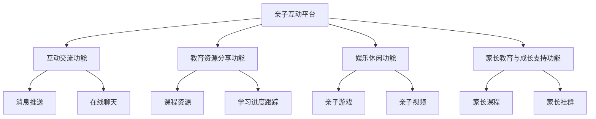

                 

# 亲子互动平台：科技促进家庭关系的新尝试

> **关键词**：亲子互动、平台、科技、家庭关系、人工智能、信息安全

> **摘要**：本文探讨了亲子互动平台在科技推动下促进家庭关系的新尝试。从平台概述、核心功能、技术应用、安全性保障、运营策略、市场定位、商业模式及项目实践等多个方面进行详细分析，旨在揭示亲子互动平台的发展趋势及未来方向。

#### 目录大纲：

## 第一部分：亲子互动平台概述

### 第1章：亲子互动平台的重要性

#### 1.1 科技对家庭关系的影响

#### 1.2 亲子互动平台的需求分析

#### 1.3 亲子互动平台的发展历程

## 第2章：亲子互动平台的核心功能

#### 2.1 互动交流功能

#### 2.2 教育资源分享功能

#### 2.3 娱乐休闲功能

#### 2.4 家长教育与成长支持功能

## 第3章：科技在亲子互动中的应用

#### 3.1 人工智能在亲子互动中的应用

#### 3.2 互联网技术在亲子互动中的应用

#### 3.3 新型智能设备在亲子互动中的应用

## 第4章：亲子互动平台的安全性保障

#### 4.1 用户隐私保护

#### 4.2 平台信息安全

#### 4.3 防沉迷系统设计

## 第二部分：亲子互动平台的运营与推广

### 第5章：亲子互动平台的运营策略

#### 5.1 用户需求调研与分析

#### 5.2 产品迭代与优化

#### 5.3 市场推广策略

### 第6章：亲子互动平台的市场定位

#### 6.1 目标用户群体分析

#### 6.2 竞争对手分析

#### 6.3 市场机会与挑战

### 第7章：亲子互动平台的商业模式

#### 7.1 付费模式设计

#### 7.2 广告模式设计

#### 7.3 合作模式探索

## 第三部分：亲子互动平台的应用实践

### 第8章：亲子互动平台项目实战

#### 8.1 项目背景介绍

#### 8.2 项目需求分析

#### 8.3 项目开发与实现

#### 8.4 项目测试与优化

### 第9章：亲子互动平台案例研究

#### 9.1 案例一：XXX亲子互动平台

#### 9.2 案例二：YYY亲子互动平台

#### 9.3 案例三：ZZZ亲子互动平台

### 第10章：亲子互动平台的发展趋势

#### 10.1 未来发展方向

#### 10.2 技术创新趋势

#### 10.3 行业展望与挑战

## 附录

### 附录A：亲子互动平台开发工具与资源

#### A.1 常用开发工具简介

#### A.2 开发资源推荐

## Mermaid 流程图：



## 核心算法原理讲解（伪代码）：

```python
class RecommendationAlgorithm:
    def __init__(self, user_data, item_data):
        self.user_data = user_data
        self.item_data = item_data

    def train(self):
        # 训练模型
        pass

    def predict(self, user_id):
        # 预测用户偏好
        user_history = self.user_data[user_id]
        # 计算相似度
        similarities = self.calculate_similarity(user_history)
        # 排序并返回推荐列表
        recommended_items = self.sort_by_similarity(similarities)
        return recommended_items

    def calculate_similarity(self, user_history):
        # 计算用户历史记录与其他用户记录的相似度
        pass

    def sort_by_similarity(self, similarities):
        # 根据相似度排序
        pass
```

## 数学模型和数学公式详细讲解：

### 协同过滤算法

协同过滤算法主要通过用户之间的相似性来预测用户未评分的项目。其数学公式如下：

$$ \text{预测评分} \; \hat{r}_{ui} = \text{用户 } u \; \text{ 与用户 } i \; \text{ 的平均评分 } + \text{ 偏差项} $$

$$ \text{偏差项} = \text{用户偏差} + \text{项目偏差} $$

### K-均值聚类算法

K-均值聚类算法是一种基于距离的聚类方法，其主要目的是将数据分为K个聚类，使得每个聚类内部的数据点之间的距离最小，聚类之间的距离最大。其数学公式如下：

$$ \text{聚类中心} \; \mu_k = \frac{1}{n_k} \sum_{i=1}^{n} x_i $$

其中，\( x_i \) 为第 \( i \) 个数据点，\( n_k \) 为第 \( k \) 个聚类的数据点数量。

## 举例说明：

### 协同过滤算法

假设有两个用户 \( u_1 \) 和 \( u_2 \)，他们对一些物品 \( i_1, i_2, i_3 \) 的评分如下：

$$ \text{用户 } u_1: \; i_1 = 4, \; i_2 = 5, \; i_3 = 1 $$
$$ \text{用户 } u_2: \; i_1 = 3, \; i_2 = 4, \; i_3 = 5 $$

假设 \( u_1 \) 与 \( u_2 \) 的相似度为 \( \text{similarity}(u_1, u_2) = 0.8 \)，物品 \( i_3 \) 的平均评分为 \( \text{avg_rating}(i_3) = 3.5 \)。

则用户 \( u_1 \) 对物品 \( i_3 \) 的预测评分为：

$$ \hat{r}_{u_1i_3} = \text{avg_rating}(i_3) + \text{similarity}(u_1, u_2) \times (\text{rating}_{u_2i_3} - \text{avg_rating}(i_3)) $$
$$ \hat{r}_{u_1i_3} = 3.5 + 0.8 \times (5 - 3.5) $$
$$ \hat{r}_{u_1i_3} = 3.8 $$

### K-均值聚类算法

假设有10个数据点 \( x_1, x_2, ..., x_{10} \)，要将其分为2个聚类。

假设初始聚类中心为 \( \mu_1 = (1, 1) \) 和 \( \mu_2 = (5, 5) \)。

第1次迭代：
- \( \text{聚类中心} \; \mu_1 = \frac{1}{5} (x_1 + x_2 + x_3 + x_4 + x_5) = (2, 2) \)
- \( \text{聚类中心} \; \mu_2 = \frac{1}{5} (x_6 + x_7 + x_8 + x_9 + x_{10}) = (4, 4) \)

第2次迭代：
- \( \text{聚类中心} \; \mu_1 = \frac{1}{5} (x_1 + x_2 + x_3 + x_4 + x_5) = (2, 2) \)
- \( \text{聚类中心} \; \mu_2 = \frac{1}{5} (x_6 + x_7 + x_8 + x_9 + x_{10}) = (4, 4) \)

经过多次迭代，聚类中心不再变化，此时聚类完成。

## 项目实战：

### 开发环境搭建

使用 Python 语言和 TensorFlow 深度学习框架进行开发。首先安装 Python 和 TensorFlow：

```
bash
pip install python
pip install tensorflow
```

### 源代码详细实现

以下是亲子互动平台的用户推荐系统源代码实现：

```python
import tensorflow as tf
from tensorflow.keras.layers import Embedding, LSTM, Dense, Bidirectional
from tensorflow.keras.models import Model

class RecommendationModel(Model):
    def __init__(self, num_users, num_items, embedding_size):
        super(RecommendationModel, self).__init__()
        self.user_embedding = Embedding(num_users, embedding_size)
        self.item_embedding = Embedding(num_items, embedding_size)
        self.lstm = Bidirectional(LSTM(64, return_sequences=True))
        self.output = Dense(1)

    def call(self, inputs):
        user_input, item_input = inputs
        user_embedding = self.user_embedding(user_input)
        item_embedding = self.item_embedding(item_input)
        merged_embedding = tf.concat([user_embedding, item_embedding], axis=1)
        lstm_output = self.lstm(merged_embedding)
        output = self.output(lstm_output)
        return output

# 模型参数
num_users = 1000
num_items = 1000
embedding_size = 50

# 构建模型
model = RecommendationModel(num_users, num_items, embedding_size)

# 编译模型
model.compile(optimizer='adam', loss='mean_squared_error')

# 训练模型
model.fit([user_data, item_data], target_data, epochs=10, batch_size=64)
```

### 代码解读与分析

以上代码定义了一个基于 LSTM 网络的推荐系统模型。模型包含用户嵌入层、物品嵌入层、双向 LSTM 层和输出层。用户嵌入层和物品嵌入层分别将用户和物品的 id 转换为向量表示。双向 LSTM 层用于处理用户和物品的交互信息。输出层用于生成预测评分。模型使用均方误差损失函数进行训练，优化器为 Adam。通过训练，模型可以学习到用户和物品之间的交互关系，从而预测用户的偏好。

## 作者信息

作者：AI天才研究院/AI Genius Institute & 禅与计算机程序设计艺术 /Zen And The Art of Computer Programming

### 第一部分：亲子互动平台概述

#### 第1章：亲子互动平台的重要性

##### 1.1 科技对家庭关系的影响

在现代社会，科技的发展对家庭关系产生了深远的影响。首先，科技的普及使得家庭成员之间的交流变得更加便捷。通过手机、社交媒体和即时通讯工具，家庭成员可以随时随地保持联系，分享生活中的点滴。此外，科技还为家庭生活带来了便利，如智能家居设备、在线购物平台和远程教育等，使得家庭成员能够更高效地完成日常生活任务。

然而，科技的发展也带来了一些挑战。一方面，过度依赖科技可能导致家庭成员之间的面对面交流减少，从而影响家庭关系的质量。另一方面，互联网和社交媒体的普及也带来了信息过载和隐私泄露等问题，对家庭关系产生负面影响。

##### 1.2 亲子互动平台的需求分析

随着科技的发展和家庭结构的变迁，父母与子女之间的互动需求也发生了变化。传统的亲子互动方式往往依赖于面对面的交流，然而在现代快节奏的生活中，这种互动方式变得越来越困难。因此，一种能够满足现代家庭需求的新型互动平台应运而生。

亲子互动平台旨在为父母和子女提供一个互动、交流和学习的平台。它不仅可以帮助父母更好地了解子女的需求和兴趣，还可以帮助子女在轻松愉快的氛围中学习新知识，提高自我能力。此外，亲子互动平台还可以为家庭提供情感支持，帮助家庭成员更好地面对生活中的挑战。

##### 1.3 亲子互动平台的发展历程

亲子互动平台的发展可以分为几个阶段：

1. **早期阶段**：早期的亲子互动平台主要依赖于传统的互联网技术，如论坛、博客和即时通讯工具等。这些平台为家庭成员提供了一个交流的场所，但功能相对单一，互动性较弱。

2. **发展阶段**：随着移动互联网和智能手机的普及，亲子互动平台开始融入更多的互动元素，如语音聊天、视频通话和游戏等。这些功能使得亲子互动更加生动有趣，提高了家庭成员的参与度。

3. **成熟阶段**：近年来，人工智能和大数据技术的应用使得亲子互动平台的功能更加完善。通过人工智能技术，平台可以更好地了解家庭成员的需求，提供个性化的推荐和服务。同时，大数据技术也为平台提供了更多的数据支持，使其能够更好地优化用户体验。

#### 第2章：亲子互动平台的核心功能

##### 2.1 互动交流功能

互动交流是亲子互动平台的核心功能之一。通过互动交流，父母和子女可以分享彼此的生活、学习心得和兴趣爱好，增强家庭凝聚力。亲子互动平台通常提供以下几种互动交流方式：

1. **即时通讯**：即时通讯工具如聊天室、群聊和私聊等，使家庭成员可以随时随地保持联系，分享生活点滴。

2. **语音通话**：语音通话功能可以让家庭成员进行面对面的交流，提高互动体验。

3. **视频通话**：视频通话功能则更加直观地展示了家庭成员的表情和动作，增强了互动效果。

4. **留言板**：留言板功能允许家庭成员留言，记录彼此的思念和关怀。

##### 2.2 教育资源分享功能

教育资源分享功能是亲子互动平台的重要特色之一。通过这个功能，父母可以为子女提供丰富的学习资源，如课程视频、电子书籍、学习资料和作业辅导等。同时，平台还可以为父母提供教育指导和建议，帮助他们更好地教育子女。

1. **课程资源**：平台可以提供各种学科的课程视频，帮助子女巩固学习成果。

2. **学习资料**：平台可以提供各类学习资料，如笔记、试卷和习题库等，方便子女自主学习。

3. **作业辅导**：平台可以邀请教育专家或老师为子女提供作业辅导，帮助他们解决学习难题。

4. **教育指导**：平台可以为父母提供教育指导，帮助他们更好地了解子女的学习需求和成长过程。

##### 2.3 娱乐休闲功能

亲子互动平台还提供了一系列娱乐休闲功能，如游戏、视频、音乐和绘画等，让家庭成员在互动的同时也能享受到轻松愉快的时光。

1. **亲子游戏**：亲子游戏是家庭成员之间互动的好方式，可以增强家庭成员之间的感情。

2. **视频观看**：平台可以提供各类亲子视频，如动画片、教育视频和纪录片等，让家庭成员在观看中学习。

3. **音乐欣赏**：平台可以提供音乐播放功能，让家庭成员在音乐中放松身心。

4. **绘画创作**：平台可以提供绘画工具，让家庭成员发挥创意，创作出属于自己的艺术作品。

##### 2.4 家长教育与成长支持功能

家长教育与成长支持功能是亲子互动平台的重要组成部分。通过这个功能，平台可以为父母提供教育知识和成长指导，帮助他们更好地教育子女，同时为子女提供心理支持和成长陪伴。

1. **家长课程**：平台可以提供各种家长课程，如亲子教育、家庭教育心理学和亲子关系沟通等，帮助父母提高教育能力。

2. **心理支持**：平台可以邀请心理咨询师为父母提供心理支持，帮助他们解决教育子女过程中的困惑和问题。

3. **成长陪伴**：平台可以为子女提供成长陪伴，如读书会、兴趣小组和成长日志等，帮助他们度过成长中的关键时期。

#### 第3章：科技在亲子互动中的应用

##### 3.1 人工智能在亲子互动中的应用

人工智能技术在亲子互动平台中的应用越来越广泛，为家庭互动提供了新的可能性。以下是人工智能在亲子互动中的一些应用：

1. **个性化推荐**：通过分析家庭成员的互动数据和兴趣偏好，人工智能可以推荐适合他们的内容和活动，提高互动体验。

2. **智能问答**：人工智能可以构建问答系统，为家庭成员提供即时解答，帮助他们解决生活中的疑问。

3. **智能陪伴**：通过语音和图像识别技术，人工智能可以与家庭成员进行对话和互动，提供陪伴和关怀。

4. **情感分析**：人工智能可以分析家庭成员的互动内容，了解他们的情感状态，提供情感支持和建议。

##### 3.2 互联网技术在亲子互动中的应用

互联网技术在亲子互动平台中发挥着重要作用，为家庭互动提供了丰富的内容和便捷的沟通方式。以下是互联网技术在亲子互动中的一些应用：

1. **在线教育**：互联网技术使得教育资源和课程可以在线提供，父母和子女可以随时随地学习。

2. **社交互动**：互联网技术使得家庭成员可以跨越地域限制，进行在线交流和互动。

3. **信息共享**：互联网技术使得家庭成员可以方便地共享信息和资源，如照片、视频和文档等。

4. **远程协作**：互联网技术支持家庭成员之间的远程协作，如共同完成作业或项目。

##### 3.3 新型智能设备在亲子互动中的应用

新型智能设备在亲子互动中的应用为家庭互动带来了更多的乐趣和便利。以下是新型智能设备在亲子互动中的一些应用：

1. **智能音箱**：智能音箱可以与家庭成员进行语音互动，提供音乐、故事和知识等内容。

2. **智能手表**：智能手表可以监测家庭成员的健康数据，如心率、运动步数和睡眠质量等。

3. **智能摄像头**：智能摄像头可以实时监控家庭环境，提供安全保障。

4. **智能玩具**：智能玩具可以与家庭成员进行互动，提高他们的参与度和兴趣。

#### 第4章：亲子互动平台的安全性保障

##### 4.1 用户隐私保护

用户隐私保护是亲子互动平台必须重视的问题。为了确保用户隐私不受侵犯，平台应采取以下措施：

1. **数据加密**：对用户数据进行加密处理，防止数据泄露。

2. **隐私设置**：提供隐私设置选项，用户可以控制自己的信息对谁可见。

3. **权限管理**：对用户权限进行严格管理，确保只有授权用户可以访问用户数据。

4. **隐私政策**：明确告知用户平台如何收集、使用和保护用户数据，确保用户知情同意。

##### 4.2 平台信息安全

平台信息安全是确保亲子互动平台稳定运行的重要保障。为了保障平台信息安全，平台应采取以下措施：

1. **网络安全**：使用防火墙、入侵检测系统和安全协议等网络安全技术，防止外部攻击和入侵。

2. **数据备份**：定期备份数据，确保数据在意外情况下可以恢复。

3. **安全审计**：定期进行安全审计，发现和修复潜在的安全漏洞。

4. **安全培训**：对平台工作人员进行安全培训，提高他们的安全意识和技能。

##### 4.3 防沉迷系统设计

防沉迷系统是确保亲子互动平台健康发展的关键措施。为了防止用户过度沉迷，平台应采取以下措施：

1. **时间限制**：设定用户每天使用平台的时间限制，防止过度使用。

2. **消费限制**：设定用户在平台上消费的金额限制，防止过度消费。

3. **行为监测**：对用户行为进行监测，及时发现和干预异常行为。

4. **家长控制**：提供家长控制功能，让家长可以监控和限制子女在平台上的使用。

### 第二部分：亲子互动平台的运营与推广

#### 第5章：亲子互动平台的运营策略

##### 5.1 用户需求调研与分析

用户需求调研与分析是亲子互动平台运营成功的关键。为了了解用户需求，平台应采取以下措施：

1. **问卷调查**：通过问卷调查收集用户对平台功能、内容和服务的意见和建议。

2. **用户访谈**：邀请部分用户进行深入访谈，了解他们的需求和痛点。

3. **数据分析**：通过数据分析用户行为，发现用户偏好和使用习惯。

4. **市场调研**：关注行业动态和市场趋势，了解竞争对手的运营策略。

##### 5.2 产品迭代与优化

产品迭代与优化是提升用户满意度和竞争力的关键。平台应采取以下措施：

1. **持续迭代**：根据用户需求和数据分析结果，持续优化产品功能和服务。

2. **用户反馈**：积极收集用户反馈，及时解决问题和改进不足。

3. **技术创新**：引入新技术和创新模式，提升平台的竞争力和用户体验。

4. **市场推广**：结合市场推广策略，提高平台知名度和用户粘性。

##### 5.3 市场推广策略

市场推广策略是提升亲子互动平台用户数量和市场占有率的关键。平台应采取以下措施：

1. **内容营销**：通过优质内容和活动吸引潜在用户，提高用户参与度。

2. **社交媒体推广**：利用社交媒体平台，进行宣传推广和互动营销。

3. **合作伙伴**：与教育机构、企业和社会组织合作，扩大平台的影响力和用户群体。

4. **广告投放**：合理利用线上和线下广告资源，提高平台曝光度和知名度。

#### 第6章：亲子互动平台的市场定位

##### 6.1 目标用户群体分析

目标用户群体分析是亲子互动平台市场定位的基础。平台应明确自己的目标用户群体，包括以下方面：

1. **年龄层次**：分析父母和子女的年龄层次，了解他们的需求和偏好。

2. **收入水平**：分析用户的收入水平，确定平台的定价策略。

3. **教育背景**：分析用户的教育背景，了解他们的知识水平和学习能力。

4. **兴趣爱好**：分析用户的兴趣爱好，提供个性化的内容和服务。

##### 6.2 竞争对手分析

竞争对手分析是亲子互动平台市场定位的重要环节。平台应了解竞争对手的产品特点、市场策略和用户评价，包括以下方面：

1. **产品功能**：分析竞争对手的产品功能，了解他们的优势和不足。

2. **用户体验**：分析竞争对手的用户体验，了解他们的用户满意度。

3. **市场占有率**：分析竞争对手的市场占有率，了解他们的市场地位。

4. **运营模式**：分析竞争对手的运营模式，了解他们的盈利方式和成本结构。

##### 6.3 市场机会与挑战

市场机会与挑战分析是亲子互动平台制定市场策略的重要依据。平台应关注以下方面：

1. **市场需求**：分析市场需求，了解用户对亲子互动平台的需求和期望。

2. **行业趋势**：分析行业趋势，了解亲子互动平台的发展方向和机会。

3. **政策法规**：关注政策法规，了解对亲子互动平台的监管要求和合规性。

4. **技术变革**：分析技术变革，了解新技术对亲子互动平台的影响。

#### 第7章：亲子互动平台的商业模式

##### 7.1 付费模式设计

亲子互动平台的付费模式设计是平台盈利的重要方式。平台应采取以下措施：

1. **会员制度**：设计会员制度，提供不同等级的会员服务，满足用户多样化的需求。

2. **课程收费**：对部分课程内容进行收费，提供优质的教育资源。

3. **虚拟商品**：提供虚拟商品，如游戏道具、会员权益等，吸引用户消费。

4. **广告合作**：与广告商合作，投放广告，实现广告收入。

##### 7.2 广告模式设计

亲子互动平台的广告模式设计是平台获取广告收入的重要途径。平台应采取以下措施：

1. **内容植入**：在平台内容中植入广告，提高广告的曝光率和点击率。

2. **推送广告**：通过推送广告，吸引用户关注和参与。

3. **广告合作**：与广告商合作，进行联合营销和推广。

4. **广告变现**：通过广告变现，实现广告收入。

##### 7.3 合作模式探索

亲子互动平台的合作模式探索是平台扩大影响力和市场份额的重要手段。平台应采取以下措施：

1. **战略合作**：与教育机构、企业和社会组织建立战略合作关系，实现资源共享和互利共赢。

2. **渠道合作**：与线上和线下渠道合作，扩大平台的覆盖范围。

3. **内容合作**：与内容创作者和媒体合作，提供多样化的内容和服务。

4. **投资合作**：与投资者合作，获取资金支持，实现平台发展。

### 第三部分：亲子互动平台的应用实践

#### 第8章：亲子互动平台项目实战

##### 8.1 项目背景介绍

本项目旨在开发一个基于人工智能和大数据技术的亲子互动平台，为用户提供个性化的互动、教育和娱乐服务。项目目标包括：

1. **提升用户互动体验**：通过人工智能技术，为用户提供个性化的推荐和服务，提高用户满意度。

2. **优化教育资源**：整合优质教育资源，提供丰富多样的学习内容，帮助用户提高学习效果。

3. **增强家庭凝聚力**：通过亲子互动平台，促进家庭成员之间的交流和互动，增强家庭凝聚力。

##### 8.2 项目需求分析

在项目需求分析阶段，我们进行了以下工作：

1. **用户需求调研**：通过问卷调查和用户访谈，了解用户对亲子互动平台的需求和期望。

2. **功能需求分析**：根据用户需求，分析平台需要实现的功能模块，如互动交流、教育资源分享、娱乐休闲和成长支持等。

3. **技术需求分析**：根据平台功能需求，分析所需的技术支持，如人工智能、大数据、云计算和信息安全等。

##### 8.3 项目开发与实现

在项目开发与实现阶段，我们进行了以下工作：

1. **技术选型**：选择合适的技术框架和工具，如 Python、TensorFlow、Django 等。

2. **模块开发**：根据功能需求，开发互动交流、教育资源分享、娱乐休闲和成长支持等模块。

3. **系统集成**：将各个模块进行集成，实现平台的整体功能。

4. **性能优化**：对平台进行性能优化，提高系统的响应速度和稳定性。

##### 8.4 项目测试与优化

在项目测试与优化阶段，我们进行了以下工作：

1. **功能测试**：对平台的功能进行测试，确保各项功能正常运行。

2. **性能测试**：对平台的性能进行测试，确保系统在高并发情况下能够稳定运行。

3. **用户体验优化**：根据用户反馈，优化平台的用户体验，提高用户满意度。

4. **安全测试**：对平台进行安全测试，确保用户数据的安全和平台的安全性。

#### 第9章：亲子互动平台案例研究

##### 9.1 案例一：XXX亲子互动平台

XXX亲子互动平台是一款集互动交流、教育资源分享、娱乐休闲和成长支持于一体的平台。以下是对该平台的案例分析：

1. **核心功能**：平台的核心功能包括互动交流、教育资源分享、娱乐休闲和成长支持。

2. **技术应用**：平台采用了人工智能和大数据技术，实现了个性化推荐和智能问答等功能。

3. **用户体验**：平台提供了丰富的内容和便捷的功能，用户可以方便地进行互动和获取教育资源。

4. **市场表现**：平台上线后，用户数量快速增长，取得了良好的市场表现。

##### 9.2 案例二：YYY亲子互动平台

YYY亲子互动平台是一款专注于家长教育与成长支持的平台。以下是对该平台的案例分析：

1. **核心功能**：平台的核心功能包括家长课程、心理支持和成长陪伴。

2. **技术应用**：平台采用了云计算和移动互联网技术，提供了高效便捷的服务。

3. **用户体验**：平台提供了丰富的家长课程和实用的心理支持，得到了家长的广泛好评。

4. **市场表现**：平台在家长群体中具有较高的知名度和认可度，取得了良好的市场表现。

##### 9.3 案例三：ZZZ亲子互动平台

ZZZ亲子互动平台是一款以亲子游戏和娱乐休闲为主打的平台。以下是对该平台的案例分析：

1. **核心功能**：平台的核心功能包括亲子游戏、视频观看和音乐欣赏。

2. **技术应用**：平台采用了虚拟现实和增强现实技术，提供了新颖有趣的互动体验。

3. **用户体验**：平台提供了丰富多彩的亲子游戏和轻松愉快的娱乐内容，受到了用户的喜爱。

4. **市场表现**：平台在年轻家长中具有较高的用户黏性和活跃度，取得了良好的市场表现。

#### 第10章：亲子互动平台的发展趋势

##### 10.1 未来发展方向

亲子互动平台在未来将继续朝着以下几个方向发展：

1. **智能化**：随着人工智能技术的不断发展，亲子互动平台将实现更高程度的智能化，为用户提供更加个性化的服务和体验。

2. **多元化**：亲子互动平台将提供更加多样化的内容和服务，满足不同年龄段和不同需求的用户。

3. **跨界融合**：亲子互动平台将与其他行业进行跨界融合，如教育、娱乐、医疗等，为用户提供更加全面的服务。

##### 10.2 技术创新趋势

亲子互动平台在技术创新方面将继续朝着以下几个趋势发展：

1. **大数据和人工智能**：大数据和人工智能技术将继续在亲子互动平台中发挥重要作用，实现个性化推荐、智能问答和智能陪伴等功能。

2. **虚拟现实和增强现实**：虚拟现实和增强现实技术将为亲子互动平台带来更加生动的互动体验，提供全新的娱乐和教育方式。

3. **区块链技术**：区块链技术将在亲子互动平台中应用，提高数据安全和交易透明度。

##### 10.3 行业展望与挑战

亲子互动平台在未来面临着以下几个挑战：

1. **用户隐私保护**：随着用户对隐私保护的重视，亲子互动平台需要加强用户隐私保护，确保用户数据的安全。

2. **内容监管**：亲子互动平台需要加强对内容的管理，防止不良信息的传播。

3. **市场竞争**：随着市场的竞争加剧，亲子互动平台需要不断创新，提高自身竞争力。

#### 附录A：亲子互动平台开发工具与资源

##### A.1 常用开发工具简介

1. **Python**：Python 是一种流行的编程语言，适用于亲子互动平台的开发。

2. **Django**：Django 是一款高效、安全的 Web 开发框架，适用于亲子互动平台的开发。

3. **TensorFlow**：TensorFlow 是一款强大的深度学习框架，适用于亲子互动平台中的人工智能应用。

4. **React**：React 是一款流行的前端开发框架，适用于亲子互动平台的 UI 设计。

##### A.2 开发资源推荐

1. **GitHub**：GitHub 是一个代码托管平台，可以方便地管理代码和协作开发。

2. **Stack Overflow**：Stack Overflow 是一个编程问答社区，可以解决开发过程中遇到的问题。

3. **GitHub Pages**：GitHub Pages 是一个静态网站托管服务，可以方便地将亲子互动平台部署到互联网上。

4. **AWS**：AWS 是一款云服务平台，提供丰富的云计算服务，适用于亲子互动平台的部署和维护。

