                 

# 《人工智能代理在内容创作中的工作流程》

## 关键词：
人工智能代理、内容创作、自然语言处理、计算机视觉、深度学习

## 摘要：
本文将深入探讨人工智能代理在内容创作中的工作流程。从基础概念到核心技术，再到实际应用案例，本文全面解析了人工智能代理如何通过自然语言处理、计算机视觉、机器学习和深度学习等技术，实现内容创作的高效和智能化。同时，本文还探讨了人工智能代理在内容创作中面临的挑战以及未来的发展趋势。

## 目录大纲

### 第一部分：人工智能代理概述与基础

#### 第1章：人工智能代理简介
- **1.1 人工智能代理的定义与特点**
- **1.2 人工智能代理的类型与应用场景**
- **1.3 人工智能代理的发展历程与技术趋势**

#### 第2章：人工智能代理的核心技术
- **2.1 人工智能代理的基本架构**
- **2.2 自然语言处理与理解技术**
- **2.3 计算机视觉与图像识别技术**
- **2.4 机器学习和深度学习算法**

#### 第3章：人工智能代理的工作流程
- **3.1 数据采集与预处理**
- **3.2 模型训练与优化**
- **3.3 内容生成与优化**
- **3.4 用户交互与反馈**

#### 第4章：人工智能代理在内容创作中的工作流程
- **4.1 创作任务定义与目标设定**
- **4.2 数据收集与内容挖掘**
- **4.3 模型选择与训练**
- **4.4 内容生成与编辑**
- **4.5 内容评估与优化**

#### 第5章：人工智能代理在内容创作中的应用案例
- **5.1 文本创作与编辑**
- **5.2 图像生成与编辑**
- **5.3 视频内容创作与编辑**
- **5.4 音频内容创作与编辑**

#### 第6章：人工智能代理在内容创作中的挑战与未来趋势
- **6.1 技术挑战与解决方案**
- **6.2 伦理与隐私问题**
- **6.3 未来发展趋势与展望**

#### 第7章：总结与展望
- **7.1 本书内容的回顾**
- **7.2 人工智能代理在内容创作中的价值**
- **7.3 未来发展的可能性和方向**

## 第一部分：人工智能代理概述与基础

### 第1章：人工智能代理简介

#### 1.1 人工智能代理的定义与特点

人工智能代理（AI Proxy）是一种基于人工智能技术的软件系统，旨在模拟人类的行为和决策过程。它可以自主地处理外部环境的信息，并采取相应的行动以实现特定的目标。与传统的自动化系统相比，人工智能代理具有更高的自适应性和学习能力，能够根据不断变化的环境进行优化和调整。

人工智能代理的特点包括：

1. **自主性**：人工智能代理可以自主地执行任务，无需人工干预。
2. **适应性**：人工智能代理能够适应新的环境和情况，学习新的知识和技能。
3. **智能化**：人工智能代理利用机器学习和深度学习技术，对数据进行分析和预测。
4. **交互性**：人工智能代理能够与用户进行自然语言交互，提供个性化的服务。

#### 1.2 人工智能代理的类型与应用场景

根据功能和应用领域，人工智能代理可以分为以下几种类型：

1. **任务代理**：负责执行特定任务的代理，如自动驾驶汽车、智能客服等。
2. **决策代理**：帮助用户进行决策的代理，如股票交易代理、健康顾问等。
3. **社交代理**：模拟人类社交行为的代理，如虚拟助手、社交机器人等。
4. **内容创作代理**：负责生成和编辑内容的代理，如文章写作、图像生成、视频编辑等。

人工智能代理广泛应用于各种场景，包括但不限于：

1. **商业**：帮助企业提高效率，降低成本，如智能客服、智能供应链管理等。
2. **医疗**：协助医生进行诊断和治疗，如智能诊断系统、远程医疗等。
3. **教育**：提供个性化学习体验，如智能教育平台、虚拟教师等。
4. **娱乐**：创造丰富的虚拟世界，如游戏、电影特效、虚拟现实等。

#### 1.3 人工智能代理的发展历程与技术趋势

人工智能代理的发展历程可以追溯到20世纪50年代，当时计算机科学家艾伦·图灵提出了图灵测试，试图通过机器模拟人类思维来定义智能。随着计算机技术的发展，人工智能技术逐渐成熟，人工智能代理的概念也逐渐得到认可。

在过去几十年里，人工智能代理经历了以下几个发展阶段：

1. **早期阶段**：以规则为基础的代理，如专家系统。这些代理基于预定义的规则进行决策，但缺乏自适应性和学习能力。
2. **中期阶段**：以数据驱动的方法，如机器学习代理。这些代理利用大量数据来训练模型，从而提高决策能力。
3. **当前阶段**：以深度学习为基础的代理。深度学习技术使得人工智能代理能够处理复杂的问题，实现更高效的决策和任务执行。

未来，人工智能代理的发展趋势包括：

1. **更强大的自主学习能力**：通过不断学习和适应，人工智能代理将能够处理更加复杂的问题。
2. **更广泛的跨领域应用**：人工智能代理将渗透到各个行业和领域，实现更广泛的自动化和智能化。
3. **更加人性化的交互**：人工智能代理将更好地模拟人类行为，提供更加自然和个性化的服务。

### 第2章：人工智能代理的核心技术

#### 2.1 人工智能代理的基本架构

人工智能代理的基本架构通常包括以下几个关键组成部分：

1. **感知模块**：负责接收外部环境的信息，如视觉、听觉、触觉等。
2. **决策模块**：根据感知模块收集的信息，利用机器学习和深度学习算法进行决策。
3. **执行模块**：根据决策模块的输出，采取相应的行动以实现目标。
4. **学习模块**：通过不断学习外部环境和用户反馈，优化自身的决策和执行能力。

下面是一个简化的 Mermaid 流程图，展示了人工智能代理的基本架构：

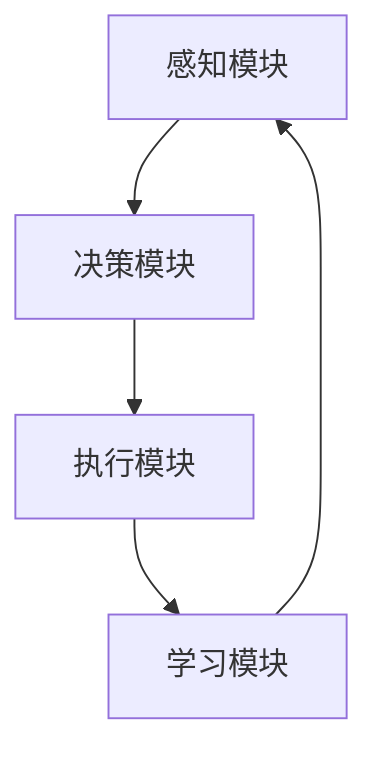

#### 2.2 自然语言处理与理解技术

自然语言处理（NLP）与理解技术是人工智能代理实现智能交互的关键。NLP 技术包括文本处理、语音识别、情感分析、命名实体识别等。以下是一个简化的 Mermaid 流程图，展示了 NLP 技术的基本工作流程：

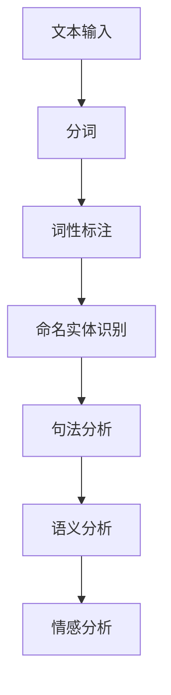

以下是一个简单的伪代码示例，展示了如何使用 NLP 技术对文本进行情感分析：

```python
def sentiment_analysis(text):
    # 分词
    words = tokenize(text)
    # 词性标注
    tags = pos_tag(words)
    # 命名实体识别
    entities = named_entity_recognition(words)
    # 句法分析
    parse_tree = parse_sentence(words)
    # 语义分析
    semantics = semantic_analysis(parse_tree)
    # 情感分析
    sentiment = get_sentiment(semantics)
    return sentiment
```

#### 2.3 计算机视觉与图像识别技术

计算机视觉与图像识别技术是人工智能代理处理视觉信息的关键。这些技术包括图像处理、特征提取、目标检测、图像分类等。以下是一个简化的 Mermaid 流程图，展示了计算机视觉的基本工作流程：

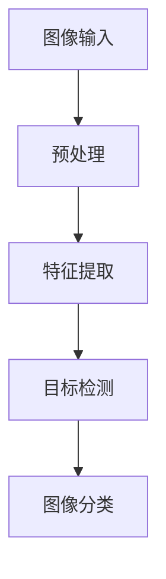

以下是一个简单的伪代码示例，展示了如何使用计算机视觉技术对图像进行分类：

```python
def image_classification(image):
    # 预处理
    preprocessed_image = preprocess_image(image)
    # 特征提取
    features = extract_features(preprocessed_image)
    # 图像分类
    label = classify_image(features)
    return label
```

#### 2.4 机器学习和深度学习算法

机器学习和深度学习算法是人工智能代理实现智能决策和任务执行的核心。机器学习算法包括监督学习、无监督学习、半监督学习和强化学习等。深度学习算法则是基于多层神经网络的结构，能够自动提取数据的特征。

以下是一个简化的 Mermaid 流程图，展示了机器学习算法的基本工作流程：

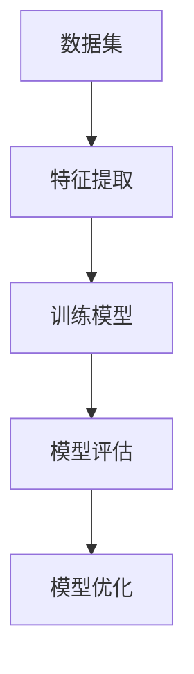

以下是一个简单的伪代码示例，展示了如何使用监督学习算法对数据集进行分类：

```python
def train_classifier(data, labels):
    # 特征提取
    features = extract_features(data)
    # 训练模型
    model = train_model(features, labels)
    # 模型评估
    accuracy = evaluate_model(model, data, labels)
    return model, accuracy
```

### 第3章：人工智能代理的工作流程

#### 3.1 数据采集与预处理

数据采集与预处理是人工智能代理工作流程的第一步。数据来源可以是公开数据集、社交媒体、用户生成内容等。在采集数据后，需要对数据进行清洗、去重、去噪声等预处理操作，以提高数据的质量和可靠性。

以下是一个简化的 Mermaid 流程图，展示了数据采集与预处理的基本工作流程：

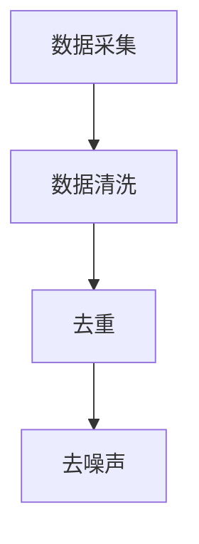

以下是一个简单的伪代码示例，展示了如何进行数据预处理：

```python
def preprocess_data(data):
    # 数据清洗
    clean_data = clean_data(data)
    # 去重
    unique_data = remove_duplicates(clean_data)
    # 去噪声
    noisedata = remove_noise(unique_data)
    return noisedata
```

#### 3.2 模型训练与优化

在数据预处理完成后，需要对模型进行训练和优化。模型训练是通过将预处理后的数据输入到机器学习算法中，学习数据的特征和模式。模型优化是通过调整模型的参数和超参数，提高模型的性能和准确性。

以下是一个简化的 Mermaid 流程图，展示了模型训练与优化的基本工作流程：

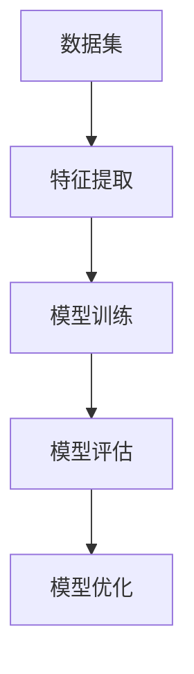

以下是一个简单的伪代码示例，展示了如何使用监督学习算法对数据集进行训练和优化：

```python
def train_and_optimize_model(data, labels):
    # 特征提取
    features = extract_features(data)
    # 模型训练
    model = train_model(features, labels)
    # 模型评估
    accuracy = evaluate_model(model, data, labels)
    # 模型优化
    optimized_model = optimize_model(model, accuracy)
    return optimized_model, accuracy
```

#### 3.3 内容生成与优化

在模型训练和优化完成后，人工智能代理可以开始生成内容。内容生成是通过模型对输入数据进行预测和生成，生成的内容可以是文本、图像、音频等。生成的内容通常需要经过优化，以提高内容的质量和可读性。

以下是一个简化的 Mermaid 流程图，展示了内容生成与优化的基本工作流程：

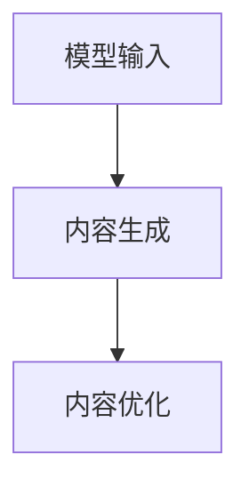

以下是一个简单的伪代码示例，展示了如何使用模型生成和优化文本内容：

```python
def generate_and_optimize_content(model, input_data):
    # 内容生成
    generated_content = generate_content(model, input_data)
    # 内容优化
    optimized_content = optimize_content(generated_content)
    return optimized_content
```

#### 3.4 用户交互与反馈

用户交互与反馈是人工智能代理工作流程的重要组成部分。用户可以通过自然语言与人工智能代理进行交互，提出问题和请求。人工智能代理需要理解用户的意图，并生成相应的回应。同时，用户对生成的内容的反馈可以用于优化模型的性能。

以下是一个简化的 Mermaid 流程图，展示了用户交互与反馈的基本工作流程：

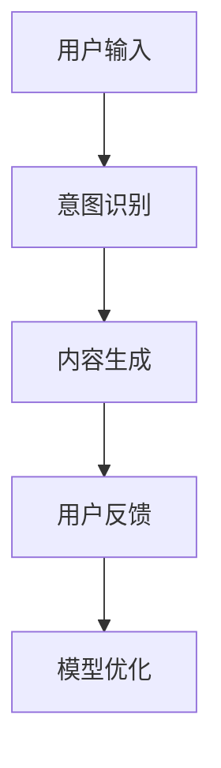

以下是一个简单的伪代码示例，展示了如何处理用户交互和反馈：

```python
def handle_user_interaction(input_data, model):
    # 意图识别
    intent = recognize_intent(input_data)
    # 内容生成
    generated_content = generate_content(model, input_data)
    # 用户反馈
    feedback = get_user_feedback(generated_content)
    # 模型优化
    optimized_model = optimize_model(model, feedback)
    return generated_content, optimized_model
```

### 第4章：人工智能代理在内容创作中的工作流程

#### 4.1 创作任务定义与目标设定

在人工智能代理参与内容创作之前，需要明确创作任务的定义和目标。创作任务可以是生成一篇新闻文章、编写一篇市场报告、创作一首歌曲、绘制一幅画作等。目标设定则是确定创作任务的具体要求和期望效果。

以下是一个简化的 Mermaid 流程图，展示了创作任务定义与目标设定的基本工作流程：

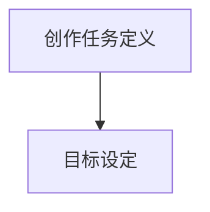

以下是一个简单的伪代码示例，展示了如何定义创作任务和目标：

```python
def define_content_creating_task(task_name, objective):
    task_definition = {
        "task_name": task_name,
        "objective": objective
    }
    return task_definition
```

#### 4.2 数据收集与内容挖掘

数据收集与内容挖掘是人工智能代理在内容创作中的重要环节。数据来源可以是公开数据集、社交媒体、新闻网站、数据库等。内容挖掘则是从数据中提取有价值的信息和知识，为内容创作提供素材和灵感。

以下是一个简化的 Mermaid 流程图，展示了数据收集与内容挖掘的基本工作流程：

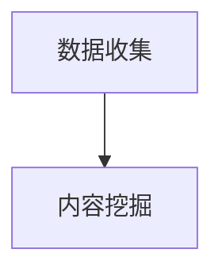

以下是一个简单的伪代码示例，展示了如何进行数据收集和内容挖掘：

```python
def collect_and_mine_data(data_source):
    data = collect_data(data_source)
    valuable_info = mine_content(data)
    return valuable_info
```

#### 4.3 模型选择与训练

在明确创作任务和数据需求后，需要选择合适的机器学习模型并进行训练。模型选择取决于创作任务的性质和数据特点。训练过程则是将数据输入到模型中，学习数据的特征和模式。

以下是一个简化的 Mermaid 流程图，展示了模型选择与训练的基本工作流程：

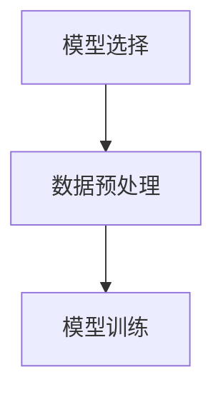

以下是一个简单的伪代码示例，展示了如何选择模型和训练模型：

```python
def select_and_train_model(model_name, data, labels):
    model = create_model(model_name)
    preprocessed_data = preprocess_data(data)
    model = train_model(model, preprocessed_data, labels)
    return model
```

#### 4.4 内容生成与编辑

在模型训练完成后，人工智能代理可以开始生成内容。内容生成是基于模型对输入数据的预测和生成。生成的内容通常需要经过编辑和优化，以提高内容的准确性和可读性。

以下是一个简化的 Mermaid 流程图，展示了内容生成与编辑的基本工作流程：

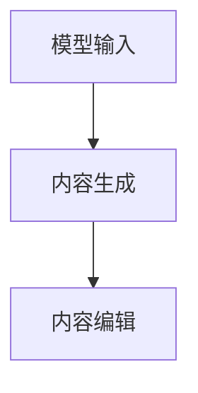

以下是一个简单的伪代码示例，展示了如何生成和编辑内容：

```python
def generate_and_edit_content(model, input_data):
    generated_content = generate_content(model, input_data)
    optimized_content = edit_content(generated_content)
    return optimized_content
```

#### 4.5 内容评估与优化

生成的内容需要经过评估和优化，以确定其质量和实用性。内容评估可以通过用户反馈、关键词密度、语法错误、语义一致性等多个方面进行。评估结果可以用于指导内容的进一步优化。

以下是一个简化的 Mermaid 流程图，展示了内容评估与优化的基本工作流程：

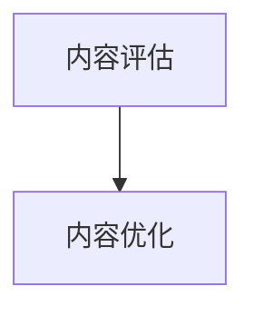

以下是一个简单的伪代码示例，展示了如何评估和优化内容：

```python
def evaluate_and_optimize_content(content):
    evaluation_result = evaluate_content(content)
    optimized_content = optimize_content(content, evaluation_result)
    return optimized_content
```

### 第5章：人工智能代理在内容创作中的应用案例

#### 5.1 文本创作与编辑

文本创作与编辑是人工智能代理在内容创作中应用最为广泛的一个领域。通过自然语言处理和机器学习技术，人工智能代理可以生成高质量的文章、报告、新闻等内容。

以下是一个简单的文本创作与编辑的伪代码示例：

```python
# 文本创作
def generate_text(model, topic):
    text = generate_content(model, topic)
    return text

# 文本编辑
def edit_text(original_text, model):
    edited_text = edit_content(original_text, model)
    return edited_text
```

#### 5.2 图像生成与编辑

图像生成与编辑是人工智能代理在内容创作中的另一个重要应用。通过计算机视觉和深度学习技术，人工智能代理可以生成新的图像、编辑现有图像等。

以下是一个简单的图像生成与编辑的伪代码示例：

```python
# 图像生成
def generate_image(model, style, content):
    image = generate_content(model, style, content)
    return image

# 图像编辑
def edit_image(original_image, model, style):
    edited_image = edit_content(original_image, model, style)
    return edited_image
```

#### 5.3 视频内容创作与编辑

视频内容创作与编辑是人工智能代理在内容创作中的前沿领域。通过计算机视觉、音频处理和深度学习技术，人工智能代理可以生成新的视频内容、编辑现有视频等。

以下是一个简单的视频内容创作与编辑的伪代码示例：

```python
# 视频内容生成
def generate_video(model, style, content):
    video = generate_content(model, style, content)
    return video

# 视频内容编辑
def edit_video(original_video, model, style):
    edited_video = edit_content(original_video, model, style)
    return edited_video
```

#### 5.4 音频内容创作与编辑

音频内容创作与编辑是人工智能代理在内容创作中的新兴领域。通过音频处理和深度学习技术，人工智能代理可以生成新的音频内容、编辑现有音频等。

以下是一个简单的音频内容创作与编辑的伪代码示例：

```python
# 音频内容生成
def generate_audio(model, style, content):
    audio = generate_content(model, style, content)
    return audio

# 音频内容编辑
def edit_audio(original_audio, model, style):
    edited_audio = edit_content(original_audio, model, style)
    return edited_audio
```

### 第6章：人工智能代理在内容创作中的挑战与未来趋势

#### 6.1 技术挑战与解决方案

尽管人工智能代理在内容创作中具有巨大的潜力，但也面临一系列技术挑战。以下是一些主要的挑战以及可能的解决方案：

1. **数据隐私和安全**：内容创作过程中涉及大量用户数据，保护数据隐私和安全是关键挑战。解决方案包括数据加密、隐私保护算法和用户授权机制。

2. **内容质量和真实性**：生成的内容需要保证高质量和真实性。解决方案包括改进算法、引入人类审核机制和建立内容质量标准。

3. **伦理问题**：人工智能代理在内容创作中可能涉及伦理问题，如虚假信息传播、版权侵犯等。解决方案包括制定伦理准则、建立监管机制和加强法律法规。

4. **跨领域融合**：人工智能代理需要融合多个领域的知识和技术，如自然语言处理、计算机视觉、音频处理等。解决方案包括建立跨领域模型、加强多学科合作。

#### 6.2 伦理与隐私问题

伦理与隐私问题是人工智能代理在内容创作中不可忽视的重要问题。以下是一些关键点：

1. **用户隐私保护**：确保用户数据的安全和隐私，避免未经授权的数据访问和滥用。

2. **内容真实性**：避免生成虚假、误导性或有害的内容，保护用户的知情权和选择权。

3. **版权和知识产权**：尊重原创者的版权和知识产权，避免侵权行为。

4. **伦理准则**：制定明确的伦理准则和操作规范，确保人工智能代理的行为符合道德标准。

#### 6.3 未来发展趋势与展望

未来，人工智能代理在内容创作中将继续发展，以下是几个关键趋势：

1. **智能化水平的提升**：通过不断改进算法和模型，人工智能代理将实现更高的智能化水平，提供更高质量的内容创作服务。

2. **跨领域融合**：人工智能代理将融合多个领域的知识和技术，实现多模态内容创作。

3. **人机协同**：人工智能代理将与人类创作者协同工作，发挥各自的优势，提高内容创作的效率和效果。

4. **自动化与个性化**：人工智能代理将实现内容创作的自动化和个性化，满足不同用户的需求。

### 第7章：总结与展望

#### 7.1 本书内容的回顾

本书全面探讨了人工智能代理在内容创作中的工作流程，从概述与基础、核心技术、工作流程到应用案例和挑战展望，系统地介绍了人工智能代理在内容创作中的各个方面。

#### 7.2 人工智能代理在内容创作中的价值

人工智能代理在内容创作中具有显著的价值，包括：

1. **提高创作效率**：自动化和智能化的内容创作过程显著提高了创作效率。
2. **丰富内容形式**：通过文本、图像、音频、视频等多模态内容创作，丰富了内容的表现形式。
3. **个性化内容服务**：根据用户需求和行为特征，提供个性化的内容推荐和服务。
4. **降低创作成本**：通过减少人力投入和优化资源分配，降低了内容创作的成本。

#### 7.3 未来发展的可能性和方向

未来，人工智能代理在内容创作中具有广阔的发展前景。以下是几个可能的发展方向：

1. **智能化水平的提升**：通过不断改进算法和模型，提高人工智能代理的智能化水平。
2. **跨领域融合**：与其他领域的知识和技术融合，实现更多元化的内容创作。
3. **人机协同**：实现人工智能代理与人类创作者的协同工作，提高内容创作的整体质量。
4. **伦理与隐私保护**：加强人工智能代理的伦理和隐私保护，确保内容创作的安全和合规。

## 作者信息

作者：AI天才研究院/AI Genius Institute & 禅与计算机程序设计艺术 /Zen And The Art of Computer Programming

---

本文基于人工智能代理在内容创作中的工作流程进行了全面探讨，旨在为读者提供一个系统而深入的了解。随着人工智能技术的不断进步，人工智能代理在内容创作中的应用前景将越来越广阔，值得持续关注和研究。作者在此感谢读者的耐心阅读，并期待与您共同探讨人工智能代理的未来发展。|>

