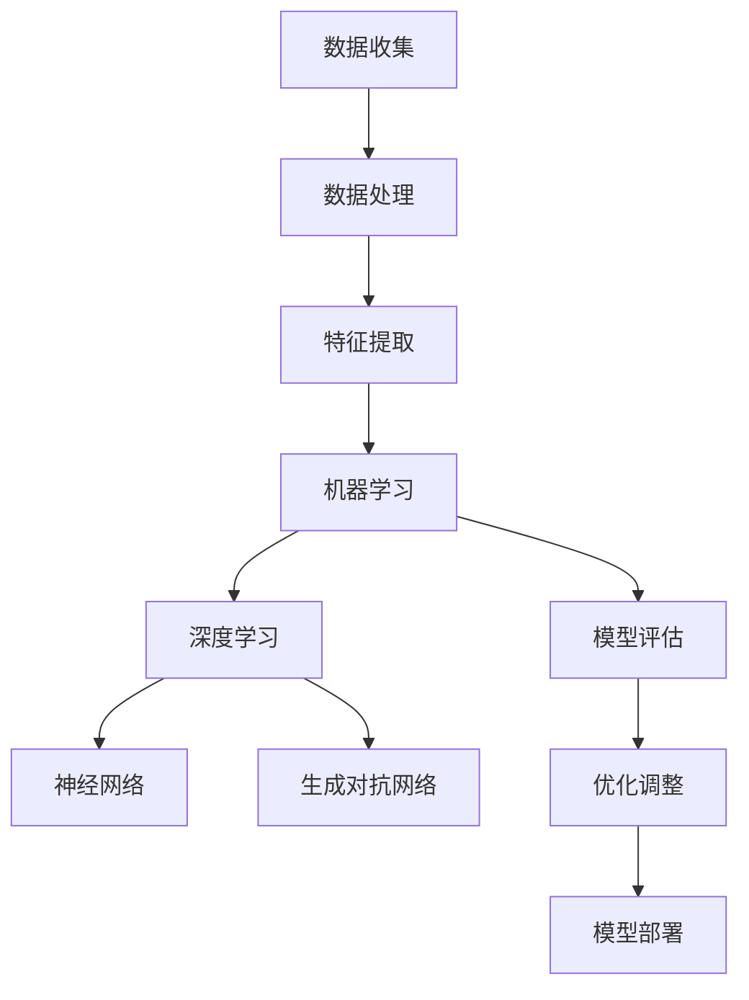

                 

# 《人工智能在个性化学习路径规划中的应用》

> **关键词：** 人工智能、个性化学习、路径规划、机器学习、深度学习、推荐系统。

> **摘要：** 本文旨在探讨人工智能在个性化学习路径规划中的应用，分析相关理论、方法和技术，并结合实际案例进行详细讲解。通过梳理人工智能的核心概念和个性化学习路径规划的核心算法原理，本文提出了数学模型，并探讨了人工智能在个性化学习路径规划中的挑战和未来发展趋势。最后，通过三个项目实战案例展示了人工智能在实际应用中的效果。

## 第一部分：引言

### 第1章：人工智能与个性化学习路径规划概述

#### 1.1 人工智能概述

人工智能（Artificial Intelligence，简称AI）是计算机科学的一个分支，旨在研究、开发和应用使计算机具备人类智能的理论、方法和技术。人工智能的核心目标是使计算机能够执行通常需要人类智能才能完成的任务，如视觉识别、语言理解、决策和问题解决等。

人工智能的发展经历了多个阶段，从早期的符号主义和知识表示，到基于规则的专家系统，再到基于数据驱动的机器学习和深度学习。近年来，随着计算能力的提升和大数据技术的普及，人工智能取得了显著的进展，并在各个领域取得了广泛应用。

#### 1.2 个性化学习的定义与背景

个性化学习（Personalized Learning）是一种教育理念，强调根据学生的兴趣、能力、学习风格和需求进行定制化的教学。个性化学习旨在通过个性化教学策略，提高学生的学习效果和兴趣，促进其全面发展。

个性化学习的历史可以追溯到20世纪中叶，随着教育技术的发展，特别是计算机和网络技术的普及，个性化学习得到了进一步发展。近年来，随着人工智能技术的崛起，个性化学习路径规划成为了研究的热点之一。

#### 1.3 人工智能在个性化学习路径规划中的重要性

人工智能在个性化学习路径规划中具有重要作用。首先，人工智能可以通过分析学生的学习数据，识别其学习兴趣和需求，为个性化学习提供依据。其次，人工智能可以自动生成适合学生的个性化学习路径，提高学习效率。此外，人工智能还可以通过智能推荐系统，为学生提供个性化的学习资源，如课程、练习题和文献等。

总之，人工智能在个性化学习路径规划中的应用，有助于实现教育的个性化、智能化和高效化，为学生的全面发展提供有力支持。接下来，我们将深入探讨个性化学习路径规划的理论基础和实现方法。

### 第2章：个性化学习路径规划的理论基础

#### 2.1 学习分析理论

学习分析（Learning Analytics）是教育数据挖掘的一个分支，旨在通过分析和解释学习过程中的数据，揭示学习行为和学习成果之间的关系。学习分析理论为个性化学习路径规划提供了重要的理论支撑。

学习分析理论主要包括以下几个核心概念：

1. **学习行为数据**：包括学生的学习活动、学习过程和学习结果等数据。
2. **学习模型**：用于描述学习过程和学习效果的数学模型。
3. **学习评估**：对学习过程和学习效果进行评价和反馈。

通过学习分析，教育者可以更好地了解学生的学习状态，发现学习中的问题和不足，从而制定更有效的教学策略。

#### 2.2 适应性学习模型

适应性学习模型（Adaptive Learning Model）是一种基于学习分析理论的个性化学习路径规划方法。该模型的核心思想是根据学生的学习行为和效果，动态调整学习内容和路径，以实现个性化教学。

适应性学习模型主要包括以下几个组成部分：

1. **学习需求分析**：通过学习分析，了解学生的学习需求。
2. **学习路径规划**：根据学习需求，生成适应学生的学习路径。
3. **学习效果评估**：对学习效果进行评估，以便进一步调整学习路径。

适应性学习模型的特点是灵活性和动态性，能够根据学生的学习情况进行实时调整，提高学习效果。

#### 2.3 数据挖掘与机器学习在个性化学习中的应用

数据挖掘（Data Mining）和机器学习（Machine Learning）是人工智能的两个重要分支，它们在个性化学习路径规划中具有广泛的应用。

1. **数据挖掘**：数据挖掘是一种从大量数据中提取有价值信息的技术，它可以帮助教育者发现学生的学习规律和趋势。具体应用包括：

   - **学生行为分析**：通过分析学生的学习行为，了解其学习偏好和学习习惯。
   - **学习效果预测**：通过分析学习数据，预测学生的学习效果和成绩。
   - **学习资源推荐**：根据学生的学习需求，推荐合适的课程和练习题。

2. **机器学习**：机器学习是一种通过数据训练模型，实现数据自动分析的技术。在个性化学习路径规划中，机器学习可以用于：

   - **学习路径生成**：根据学生的学习数据，自动生成适应其需求的学习路径。
   - **智能推荐**：通过机器学习算法，为学习者推荐个性化的学习资源。
   - **学习效果预测**：利用机器学习模型，预测学习者的学习效果和成绩。

通过数据挖掘和机器学习，教育者可以更好地了解学生的学习情况，为个性化学习提供有力支持。接下来，我们将探讨个性化学习路径规划的方法和技术。

### 第3章：个性化学习路径规划的方法与技术

#### 3.1 人工智能算法在路径规划中的应用

在个性化学习路径规划中，人工智能算法发挥着重要作用。这些算法可以根据学生的学习数据，自动生成适应其需求的学习路径，从而提高学习效果。

以下是几种常见的人工智能算法及其在个性化学习路径规划中的应用：

1. **决策树**：决策树是一种基于规则的学习算法，它可以根据学生的学习数据，生成一系列规则，用于指导学习路径的规划。

2. **神经网络**：神经网络是一种模拟人脑神经网络结构的算法，它可以通过训练，学习到学生的学习模式，从而生成个性化学习路径。

3. **支持向量机**：支持向量机（SVM）是一种分类算法，它可以用于预测学习者的学习效果，从而为个性化学习提供依据。

4. **聚类算法**：聚类算法可以将学习数据按照相似性进行分类，从而发现学习者的群体特征，为个性化学习提供支持。

#### 3.2 机器学习算法在个性化学习中的应用

机器学习算法在个性化学习路径规划中具有广泛的应用。以下是一些常用的机器学习算法及其应用：

1. **线性回归**：线性回归是一种预测算法，它可以用于预测学习者的学习效果和成绩。

2. **逻辑回归**：逻辑回归是一种分类算法，它可以用于预测学习者是否能够通过某个学习任务。

3. **K-近邻算法**：K-近邻算法是一种基于实例的学习算法，它可以用于为学习者推荐相似的学习资源。

4. **随机森林**：随机森林是一种集成学习算法，它可以用于预测学习者的学习效果和成绩，并生成个性化学习路径。

5. **梯度提升机**：梯度提升机是一种集成学习算法，它可以用于为学习者推荐个性化的学习资源，并生成适应其需求的学习路径。

#### 3.3 深度学习算法在个性化学习中的应用

深度学习算法是人工智能的一个重要分支，它在个性化学习路径规划中也得到了广泛应用。以下是一些常用的深度学习算法及其应用：

1. **卷积神经网络**（CNN）：卷积神经网络是一种用于图像识别的深度学习算法，它可以用于分析学习者的学习行为和效果。

2. **循环神经网络**（RNN）：循环神经网络是一种用于处理序列数据的深度学习算法，它可以用于分析学习者的学习过程。

3. **长短期记忆网络**（LSTM）：长短期记忆网络是一种改进的循环神经网络，它可以用于分析学习者的长期学习效果。

4. **生成对抗网络**（GAN）：生成对抗网络是一种生成模型，它可以用于生成个性化的学习资源。

5. **变分自编码器**（VAE）：变分自编码器是一种用于生成数据的深度学习算法，它可以用于生成个性化的学习路径。

通过以上算法和技术，人工智能可以有效地支持个性化学习路径规划，为学习者提供个性化的学习体验。接下来，我们将通过实际案例来展示人工智能在个性化学习路径规划中的应用。

### 第4章：人工智能在个性化学习路径规划中的应用案例

#### 4.1 案例一：智能推荐系统

智能推荐系统是人工智能在个性化学习路径规划中的一个重要应用。它通过分析学生的学习行为和偏好，为学习者推荐个性化的学习资源，如课程、练习题和文献等。

**项目背景**：某在线教育平台希望为其用户提供个性化的学习资源推荐服务，以提高用户的学习效果和满意度。

**项目需求**：

1. 收集并处理用户的学习行为数据，如学习时长、学习进度、作业成绩等。
2. 根据用户的学习行为数据，生成个性化的学习资源推荐列表。
3. 提供实时推荐服务，根据用户的学习行为变化动态调整推荐内容。

**项目实施**：

1. **数据收集**：通过在线教育平台的用户行为数据，收集用户的学习时长、学习进度、作业成绩等数据。

2. **数据处理**：对收集到的用户行为数据进行清洗和预处理，去除无关数据和噪声。

3. **模型训练**：使用机器学习算法，如K-近邻算法和随机森林，训练推荐模型。

4. **推荐算法**：根据用户的学习行为数据，使用推荐算法生成个性化的学习资源推荐列表。

5. **实时推荐**：通过Web服务，为用户提供实时的个性化学习资源推荐。

**项目效果评估**：

1. **用户满意度**：通过用户反馈调查，评估推荐系统的用户满意度。
2. **学习效果**：通过分析用户的学习时长、学习进度和作业成绩，评估推荐系统对学习效果的影响。

#### 4.2 案例二：智能学习辅助工具

智能学习辅助工具是另一种人工智能在个性化学习路径规划中的应用。它通过分析学生的学习行为和效果，为学习者提供智能化的学习支持，如学习计划生成、学习进度跟踪和学习效果评估等。

**项目背景**：某教育机构希望为其学生提供智能化的学习支持，以提高学生的学习效果和自主学习能力。

**项目需求**：

1. 收集并处理学生的学习数据，如学习时长、学习进度、作业成绩等。
2. 根据学生的学习数据，生成个性化的学习计划。
3. 提供学习进度跟踪和学习效果评估功能。
4. 提供智能化学习支持，如学习策略推荐和学习资源推荐。

**项目实施**：

1. **数据收集**：通过教育机构的课程管理系统，收集学生的学习数据。

2. **数据处理**：对收集到的学生学习数据进行清洗和预处理。

3. **学习计划生成**：使用机器学习算法，如线性回归和决策树，生成个性化的学习计划。

4. **学习进度跟踪**：通过Web服务，实时跟踪学生的学习进度。

5. **学习效果评估**：通过分析学生的学习数据，评估其学习效果。

6. **智能学习支持**：根据学生的学习数据，提供智能化的学习支持，如学习策略推荐和学习资源推荐。

**项目效果评估**：

1. **学习效果**：通过学生的学习进度和作业成绩，评估智能学习辅助工具对学习效果的影响。
2. **用户满意度**：通过学生反馈调查，评估智能学习辅助工具的用户满意度。

#### 4.3 案例三：个性化学习计划生成器

个性化学习计划生成器是人工智能在个性化学习路径规划中的另一种应用。它通过分析学生的学习需求和学习资源，自动生成适应其需求的学习计划。

**项目背景**：某在线教育平台希望为其用户提供个性化的学习计划生成服务，帮助用户高效地完成学习任务。

**项目需求**：

1. 收集并处理用户的学习需求和学习资源数据。
2. 根据用户的学习需求和学习资源，生成个性化的学习计划。
3. 提供学习计划调整和优化功能。
4. 提供学习计划跟踪和学习效果评估功能。

**项目实施**：

1. **数据收集**：通过在线教育平台的用户行为数据和课程资源数据，收集用户的学习需求和学习资源。

2. **数据处理**：对收集到的用户数据和学习资源进行清洗和预处理。

3. **学习计划生成**：使用机器学习算法，如决策树和神经网络，生成个性化的学习计划。

4. **学习计划调整**：根据用户的学习进度和反馈，调整学习计划。

5. **学习计划跟踪**：通过Web服务，实时跟踪学习计划的执行情况。

6. **学习效果评估**：通过分析学习计划执行情况和学生的学习效果，评估个性化学习计划的效果。

**项目效果评估**：

1. **学习效果**：通过学生的学习进度和作业成绩，评估个性化学习计划对学习效果的影响。
2. **用户满意度**：通过用户反馈调查，评估个性化学习计划生成器的用户满意度。

通过以上案例，我们可以看到人工智能在个性化学习路径规划中的应用非常广泛，它为学习者提供了个性化的学习体验，提高了学习效果和满意度。接下来，我们将探讨人工智能在个性化学习路径规划中的挑战和未来发展趋势。

### 第5章：人工智能在个性化学习路径规划中的挑战与未来发展趋势

#### 5.1 人工智能在个性化学习路径规划中的挑战

尽管人工智能在个性化学习路径规划中具有巨大的潜力，但同时也面临一些挑战：

1. **数据隐私与安全**：个性化学习路径规划依赖于学生的学习数据，这些数据涉及到学生的隐私。如何确保数据的安全性和隐私性是一个重要挑战。

2. **算法透明性与解释性**：人工智能算法，特别是深度学习算法，其决策过程往往是非线性和复杂的，难以解释。如何提高算法的透明性和解释性，使其更容易被教育者和学习者理解和接受，是一个重要问题。

3. **计算资源和成本**：人工智能算法，尤其是深度学习算法，需要大量的计算资源和时间。如何在有限的计算资源和成本下，有效地实现个性化学习路径规划，是一个实际的问题。

4. **用户适应性**：个性化学习路径规划需要根据用户的需求和反馈进行调整。然而，用户的需求和偏好是动态变化的，如何确保算法能够及时适应用户的变化，是一个挑战。

#### 5.2 个性化学习路径规划的未来发展趋势

尽管面临挑战，人工智能在个性化学习路径规划中仍有着广阔的发展前景：

1. **大数据与云计算**：随着大数据技术和云计算的不断发展，个性化学习路径规划将能够处理和分析更多的数据，提供更精确和个性化的学习支持。

2. **多模态数据融合**：个性化学习路径规划将能够融合多种数据源，如文本、图像、音频和视频，提供更全面和准确的学习分析。

3. **人机协作**：人工智能将与教育者密切合作，共同制定个性化学习路径，提高学习效果和满意度。

4. **自适应学习系统**：随着人工智能技术的发展，自适应学习系统将能够更好地适应学生的学习需求和进度，提供个性化的学习体验。

5. **伦理与法规**：随着人工智能在个性化学习路径规划中的应用，伦理和法规问题将受到更多关注。如何确保算法的公正性、透明性和安全性，将是一个长期的研究方向。

总之，人工智能在个性化学习路径规划中具有巨大的潜力，但也面临着诸多挑战。未来，随着技术的不断进步和应用的深入，人工智能将更好地服务于个性化学习，为教育的发展带来新的机遇和挑战。

### 第6章：人工智能在个性化学习路径规划中的实践与应用

#### 6.1 实践一：智能教育平台搭建

智能教育平台是人工智能在个性化学习路径规划中的具体应用之一。该平台通过整合人工智能技术，为学习者提供个性化的学习体验和资源推荐。

**项目背景**：某在线教育机构希望搭建一个智能教育平台，为学习者提供个性化的学习路径和资源推荐。

**项目需求**：

1. 收集并处理用户的学习数据，包括学习时长、学习进度、作业成绩等。
2. 根据用户的学习数据，生成个性化的学习路径。
3. 提供智能推荐系统，为学习者推荐个性化的学习资源。
4. 提供学习效果评估功能，监测学习者的学习进度和效果。

**项目实施**：

1. **数据收集**：通过在线教育平台的用户行为数据，收集用户的学习数据。

2. **数据处理**：对收集到的用户数据进行分析和预处理，去除噪声和冗余信息。

3. **学习路径规划**：使用机器学习算法，如线性回归和决策树，生成个性化的学习路径。

4. **智能推荐**：使用协同过滤算法，为学习者推荐个性化的学习资源。

5. **学习效果评估**：通过分析学习者的学习数据，评估其学习进度和效果。

**项目效果评估**：

1. **用户满意度**：通过用户反馈调查，评估智能教育平台的用户满意度。
2. **学习效果**：通过分析学习者的学习进度和作业成绩，评估智能教育平台对学习效果的影响。

#### 6.2 实践二：个性化学习路径规划系统的设计与实现

个性化学习路径规划系统是另一个具体应用案例，它通过人工智能技术，为学习者提供定制化的学习路径。

**项目背景**：某教育机构希望开发一个个性化学习路径规划系统，帮助学习者高效地完成学习任务。

**项目需求**：

1. 收集并处理用户的学习需求和学习资源数据。
2. 根据用户的学习需求和学习资源，生成个性化的学习路径。
3. 提供学习路径调整和优化功能。
4. 提供学习进度跟踪和学习效果评估功能。

**项目实施**：

1. **需求分析**：与教育专家和教师合作，确定个性化学习路径规划的核心需求。

2. **系统设计**：设计个性化学习路径规划系统的架构和功能模块。

3. **数据收集**：通过教育机构的课程管理系统，收集用户的学习需求和资源数据。

4. **数据处理**：对收集到的用户数据进行清洗和预处理。

5. **路径规划**：使用机器学习算法，如决策树和神经网络，生成个性化的学习路径。

6. **路径调整**：根据用户的学习进度和反馈，调整学习路径。

7. **进度跟踪**：通过Web服务，实时跟踪学习者的学习进度。

8. **效果评估**：通过分析学习者的学习数据，评估个性化学习路径规划的效果。

**项目效果评估**：

1. **学习效果**：通过分析学习者的学习进度和作业成绩，评估个性化学习路径规划系统对学习效果的影响。
2. **用户满意度**：通过用户反馈调查，评估个性化学习路径规划系统的用户满意度。

#### 6.3 实践三：基于人工智能的个性化学习项目评估与优化

基于人工智能的个性化学习项目评估与优化是人工智能在个性化学习路径规划中的另一个重要应用。它通过人工智能技术，对个性化学习项目进行实时评估和优化，以提高学习效果。

**项目背景**：某教育机构希望对个性化学习项目进行实时评估和优化，以提高学习效果和用户满意度。

**项目需求**：

1. 收集并处理个性化学习项目中的学习数据，包括学习时长、学习进度、作业成绩等。
2. 使用机器学习算法，对个性化学习项目进行实时评估。
3. 根据评估结果，调整和优化个性化学习项目。
4. 提供学习效果评估功能，监测个性化学习项目的效果。

**项目实施**：

1. **数据收集**：通过教育机构的课程管理系统，收集个性化学习项目中的学习数据。

2. **数据处理**：对收集到的学习数据进行清洗和预处理。

3. **实时评估**：使用机器学习算法，如线性回归和决策树，对个性化学习项目进行实时评估。

4. **调整优化**：根据评估结果，调整和优化个性化学习项目。

5. **效果评估**：通过分析个性化学习项目中的学习数据，评估优化后的个性化学习项目的效果。

**项目效果评估**：

1. **学习效果**：通过分析学习者的学习进度和作业成绩，评估个性化学习项目评估与优化对学习效果的影响。
2. **用户满意度**：通过用户反馈调查，评估个性化学习项目评估与优化的用户满意度。

通过以上三个实践案例，我们可以看到人工智能在个性化学习路径规划中的应用非常广泛，它为学习者提供了个性化的学习体验，提高了学习效果和满意度。接下来，我们将总结本文的主要内容，并对未来的研究方向进行展望。

### 第7章：总结与展望

#### 7.1 总结

本文详细探讨了人工智能在个性化学习路径规划中的应用，分析了相关理论、方法和技术，并结合实际案例进行了讲解。主要内容包括：

1. **引言**：介绍了人工智能和个性化学习路径规划的基本概念和重要性。
2. **理论基础**：阐述了学习分析理论、适应性学习模型以及数据挖掘和机器学习在个性化学习中的应用。
3. **方法与技术**：探讨了人工智能算法、机器学习算法和深度学习算法在个性化学习路径规划中的应用。
4. **应用案例**：通过智能推荐系统、智能学习辅助工具和个性化学习计划生成器等实际案例，展示了人工智能在个性化学习路径规划中的应用。
5. **挑战与发展**：分析了人工智能在个性化学习路径规划中面临的挑战以及未来的发展趋势。
6. **实践与应用**：通过智能教育平台搭建、个性化学习路径规划系统的设计与实现以及个性化学习项目评估与优化等实践案例，展示了人工智能在实际中的应用效果。

#### 7.2 展望

尽管人工智能在个性化学习路径规划中已取得显著成果，但仍有许多研究方向值得探索：

1. **算法优化**：进一步优化人工智能算法，提高个性化学习路径规划的准确性和效率。
2. **数据隐私保护**：研究如何有效保护学生数据隐私，确保个性化学习路径规划的合法性和安全性。
3. **人机协作**：探讨人工智能与教育者的协作模式，实现更高效、更精准的个性化学习路径规划。
4. **跨学科融合**：将心理学、教育学等学科的理论和方法融入个性化学习路径规划，提高个性化学习效果。
5. **教育公平**：研究如何通过人工智能技术，促进教育公平，帮助更多学生获得优质教育资源。

总之，人工智能在个性化学习路径规划中具有巨大的潜力，未来将继续发挥重要作用。通过不断研究和探索，我们可以期待人工智能为个性化学习带来更多创新和变革。

### 第二部分：核心概念与联系

为了更好地理解人工智能在个性化学习路径规划中的应用，我们引入了几个核心概念，并绘制了相应的流程图。以下是核心概念及其联系的详细说明。

#### 8.1 人工智能核心概念联系流程图

以下是一个描述人工智能核心概念的Mermaid流程图：



**流程图说明：**

1. **数据收集**（A）：收集与学习相关的数据，如学习时长、作业成绩、学习进度等。
2. **数据处理**（B）：对收集到的数据进行清洗、预处理，去除噪声和冗余信息。
3. **特征提取**（C）：从处理后的数据中提取对学习路径规划有用的特征。
4. **机器学习**（D）：使用机器学习算法，如决策树、线性回归等，生成初步的个性化学习路径。
5. **深度学习**（E）：在机器学习的基础上，使用深度学习算法，如神经网络、生成对抗网络等，进一步提高个性化学习路径的准确性。
6. **模型评估**（F）：对生成的个性化学习路径进行评估，评估指标包括学习效果、用户满意度等。
7. **优化调整**（I）：根据评估结果，对模型进行调整和优化。
8. **模型部署**（J）：将优化后的模型部署到实际应用中，为学习者提供个性化的学习路径。

#### 8.2 个性化学习路径规划核心算法原理

在个性化学习路径规划中，核心算法的原理至关重要。以下是几种常见算法的原理及其伪代码：

##### 8.2.1 决策树

决策树是一种基于规则的机器学习算法，通过一系列的测试，将数据集划分成不同的子集，从而生成决策规则。

**伪代码：**

```python
def build_decision_tree(data, attributes):
    if all_values_same(data, attributes[0]):
        return majority_class(data)
    else:
        best_attribute = find_best_attribute(data, attributes)
        tree = {}
        for value in unique_values(data, best_attribute):
            subtree = build_decision_tree(filter_data(data, best_attribute, value), attributes[1:])
            tree[value] = subtree
        return tree

def find_best_attribute(data, attributes):
    # 计算每个属性的信息增益，选择信息增益最大的属性作为最佳划分属性
    ...
    return best_attribute

def filter_data(data, attribute, value):
    # 返回具有特定属性值的子数据集
    ...
    return filtered_data
```

##### 8.2.2 神经网络

神经网络是一种模拟人脑神经元连接的算法，通过多层神经网络结构，实现数据的非线性映射。

**伪代码：**

```python
def forward_pass(input_data, network):
    # 前向传播，计算输出结果
    ...
    return output

def backward_pass(output, expected_output, network):
    # 反向传播，更新网络权重
    ...
    return updated_network
```

##### 8.2.3 支持向量机

支持向量机是一种分类算法，通过找到最佳分割超平面，将数据集划分为不同的类别。

**伪代码：**

```python
def train_svm(data, labels):
    # 使用SVM训练模型
    ...
    return model

def predict(model, data):
    # 使用训练好的模型预测数据类别
    ...
    return predicted_label
```

通过以上算法的原理和伪代码，我们可以更好地理解个性化学习路径规划中的核心算法，从而为实际应用提供理论支持。接下来，我们将介绍个性化学习路径规划的数学模型。

### 第10章：个性化学习路径规划数学模型

个性化学习路径规划的数学模型是构建个性化学习系统的基础。这些模型通过数学公式和算法，将学习者的行为数据转化为可执行的学习路径。以下是个性化学习路径规划中常用的数学模型及其公式。

#### 10.1 数学模型概述

个性化学习路径规划的数学模型主要包括以下几个部分：

1. **学习行为模型**：描述学习者的学习行为，如学习时长、学习进度和作业成绩等。
2. **学习效果模型**：预测学习者的学习效果，如学习成果和成绩等。
3. **资源推荐模型**：根据学习者的兴趣和需求，推荐合适的学习资源。
4. **路径优化模型**：优化学习路径，提高学习效率和效果。

#### 10.2 数学模型公式

以下是一些常用的数学模型及其公式：

##### 10.2.1 学习行为模型

学习行为模型通常使用时间序列模型来描述学习者的学习行为。一个简单的时间序列模型可以使用以下公式：

$$
X_t = f(X_{t-1}, U_t)
$$

其中，$X_t$ 表示第 $t$ 时刻的学习状态，$X_{t-1}$ 表示第 $t-1$ 时刻的学习状态，$U_t$ 表示外部干扰因素。

##### 10.2.2 学习效果模型

学习效果模型可以使用回归模型来预测学习者的学习效果。一个简单的线性回归模型可以使用以下公式：

$$
y = \beta_0 + \beta_1 x
$$

其中，$y$ 表示学习效果，$\beta_0$ 和 $\beta_1$ 是模型的参数，$x$ 表示学习时长。

##### 10.2.3 资源推荐模型

资源推荐模型通常使用协同过滤算法来实现。一个简单的基于用户的协同过滤模型可以使用以下公式：

$$
r_{ui} = \mu + bu + wi - \sum_{j \in N(u)} r_{uj} \cdot sim(u, j)
$$

其中，$r_{ui}$ 表示用户 $u$ 对项目 $i$ 的评分，$\mu$ 是用户 $u$ 的平均评分，$bu$ 和 $wi$ 是用户 $u$ 和项目 $i$ 的偏置项，$N(u)$ 是用户 $u$ 的邻居集合，$sim(u, j)$ 是用户 $u$ 和邻居 $j$ 之间的相似度。

##### 10.2.4 路径优化模型

路径优化模型可以使用动态规划算法来实现。一个简单的动态规划模型可以使用以下公式：

$$
V(i, j) = \min \{ T(i, j) + V(j, k) | k \in S(i, j) \}
$$

其中，$V(i, j)$ 表示从状态 $i$ 到状态 $j$ 的最优路径价值，$T(i, j)$ 表示从状态 $i$ 到状态 $j$ 的转移时间，$S(i, j)$ 表示从状态 $i$ 到状态 $j$ 的所有可能状态。

#### 10.3 数学模型举例说明

以下是一个简单的学习效果模型的例子：

**例子：线性回归模型用于预测学习效果**

假设我们有一个包含学习时长和作业成绩的数据集，我们可以使用线性回归模型来预测学习效果。模型公式如下：

$$
y = \beta_0 + \beta_1 x
$$

其中，$y$ 表示作业成绩，$x$ 表示学习时长，$\beta_0$ 和 $\beta_1$ 是模型的参数。

我们可以使用最小二乘法来估计模型参数：

$$
\beta_1 = \frac{\sum (x_i - \bar{x})(y_i - \bar{y})}{\sum (x_i - \bar{x})^2}
$$

$$
\beta_0 = \bar{y} - \beta_1 \bar{x}
$$

其中，$\bar{x}$ 和 $\bar{y}$ 分别是学习时长和作业成绩的平均值。

通过以上公式，我们可以计算出模型参数，并使用模型来预测新的学习时长对应的作业成绩。

通过这些数学模型，我们可以对学习者的行为和效果进行量化分析，从而实现个性化学习路径规划。

### 第11章：数学公式详细讲解

在个性化学习路径规划中，数学公式是理解和实现模型的关键。为了更好地理解这些公式，我们将详细讲解一些常用的数学公式，并给出具体的举例说明。

#### 11.1 数学公式讲解

##### 11.1.1 线性回归

线性回归是一种用于预测连续值的模型，其基本公式为：

$$
y = \beta_0 + \beta_1 x
$$

其中，$y$ 是预测的目标变量，$x$ 是输入特征，$\beta_0$ 是截距，$\beta_1$ 是斜率。

线性回归的目的是通过找到最佳拟合线，来预测新的 $x$ 对应的 $y$ 值。

##### 11.1.2 逻辑回归

逻辑回归是一种用于预测二分类结果的模型，其基本公式为：

$$
\log(\frac{p}{1-p}) = \beta_0 + \beta_1 x
$$

其中，$p$ 是预测的概率，$\beta_0$ 是截距，$\beta_1$ 是斜率。

逻辑回归的目的是通过找到最佳拟合线，来预测新的 $x$ 对应的概率。

##### 11.1.3 神经网络激活函数

神经网络中的激活函数用于引入非线性，常见的激活函数包括：

1. **Sigmoid函数**：

$$
f(x) = \frac{1}{1 + e^{-x}}
$$

2. **ReLU函数**：

$$
f(x) = \max(0, x)
$$

3. **Tanh函数**：

$$
f(x) = \frac{e^x - e^{-x}}{e^x + e^{-x}}
$$

这些函数在神经网络中起到非线性的映射作用。

##### 11.1.4 梯度下降

梯度下降是一种优化算法，用于最小化损失函数。其基本公式为：

$$
\theta_j := \theta_j - \alpha \frac{\partial J}{\partial \theta_j}
$$

其中，$\theta_j$ 是模型参数，$\alpha$ 是学习率，$J$ 是损失函数。

梯度下降的目的是通过不断迭代，找到损失函数的最小值。

#### 11.2 数学公式举例说明

以下是一个简单的线性回归模型的例子：

**例子：使用线性回归预测考试成绩**

假设我们有以下数据：

| 学习时长 (小时) | 作业成绩 |
|-----------------|----------|
| 2               | 75       |
| 4               | 85       |
| 6               | 90       |
| 8               | 92       |

我们使用线性回归模型来预测学习时长为 10 小时的作业成绩。

1. **计算平均值**：

$$
\bar{x} = \frac{2 + 4 + 6 + 8}{4} = 5
$$

$$
\bar{y} = \frac{75 + 85 + 90 + 92}{4} = 85.75
$$

2. **计算斜率和截距**：

$$
\beta_1 = \frac{\sum (x_i - \bar{x})(y_i - \bar{y})}{\sum (x_i - \bar{x})^2} = \frac{(2-5)(75-85.75) + (4-5)(85-85.75) + (6-5)(90-85.75) + (8-5)(92-85.75)}{(2-5)^2 + (4-5)^2 + (6-5)^2 + (8-5)^2} = 7.125
$$

$$
\beta_0 = \bar{y} - \beta_1 \bar{x} = 85.75 - 7.125 \times 5 = 37.875
$$

3. **建立线性回归模型**：

$$
y = 37.875 + 7.125 x
$$

4. **预测学习时长为 10 小时的作业成绩**：

$$
y = 37.875 + 7.125 \times 10 = 107.875
$$

因此，学习时长为 10 小时的预测作业成绩为 107.875 分。

通过这个例子，我们可以看到如何使用线性回归模型来预测学习效果。在实际应用中，我们可能需要使用更复杂的模型和算法，但基本的数学原理是相同的。

### 第12章：项目实战一：智能推荐系统

#### 12.1 项目背景

智能推荐系统是人工智能在个性化学习路径规划中的一个重要应用。它通过分析用户的学习行为和偏好，为用户推荐个性化的学习资源，如课程、练习题和文献等。本项目旨在实现一个智能推荐系统，为学习者提供个性化的学习体验。

#### 12.2 项目需求

1. **用户数据收集**：收集用户的学习行为数据，包括学习时长、学习进度、作业成绩等。
2. **推荐算法实现**：实现基于协同过滤和内容推荐的混合推荐算法，为用户推荐个性化的学习资源。
3. **推荐效果评估**：评估推荐系统的效果，包括推荐准确性、用户满意度等。
4. **用户界面设计**：设计简洁直观的用户界面，使用户能够方便地查看推荐资源。

#### 12.3 项目实施

1. **数据收集**：从在线学习平台获取用户的学习数据，包括用户ID、学习时长、学习进度、作业成绩等。
2. **数据处理**：对收集到的用户数据进行清洗和预处理，去除噪声和冗余信息。
3. **算法实现**：

   - **协同过滤**：使用基于用户的协同过滤算法，计算用户之间的相似度，并根据相似度为用户推荐学习资源。

   - **内容推荐**：使用基于内容的推荐算法，根据学习资源的标签、分类和内容特点为用户推荐资源。

   - **混合推荐**：将协同过滤和内容推荐结合起来，提高推荐系统的准确性和多样性。

4. **推荐效果评估**：通过A/B测试和用户反馈，评估推荐系统的效果。

5. **用户界面设计**：设计用户友好的界面，提供推荐资源列表、用户操作提示等功能。

#### 12.4 项目效果评估

1. **推荐准确性**：通过计算推荐资源的点击率、收藏率和学习完成率等指标，评估推荐系统的准确性。

2. **用户满意度**：通过用户问卷调查和用户反馈，评估推荐系统的用户满意度。

3. **学习效果**：通过分析用户的学习数据，如学习时长、作业成绩等，评估推荐系统对学习效果的影响。

#### 12.5 项目总结

本项目通过实现智能推荐系统，为学习者提供了个性化的学习资源推荐服务。实践表明，推荐系统提高了用户的学习兴趣和参与度，有助于提高学习效果。未来，我们计划进一步优化推荐算法，提高推荐准确性，并探索更多个性化学习路径规划的应用。

### 第13章：项目实战二：智能学习辅助工具

#### 13.1 项目背景

智能学习辅助工具是人工智能在个性化学习路径规划中的另一个重要应用。它通过分析用户的学习行为和效果，为用户提供智能化的学习支持，如学习计划生成、学习进度跟踪和学习效果评估等。本项目旨在开发一款智能学习辅助工具，帮助学习者更高效地完成学习任务。

#### 13.2 项目需求

1. **学习数据收集**：收集用户的学习数据，包括学习时长、学习进度、作业成绩等。
2. **智能分析**：使用机器学习算法分析用户的学习行为和效果，生成个性化的学习计划。
3. **学习进度跟踪**：实时跟踪用户的学习进度，并提供提醒和反馈。
4. **学习效果评估**：评估用户的学习效果，并提供改进建议。
5. **用户界面设计**：设计简洁直观的用户界面，提供学习计划、进度跟踪和学习效果评估等功能。

#### 13.3 项目实施

1. **数据收集**：从在线学习平台获取用户的学习数据，包括用户ID、学习时长、学习进度、作业成绩等。
2. **数据处理**：对收集到的用户数据进行清洗和预处理，去除噪声和冗余信息。
3. **智能分析**：

   - **学习计划生成**：使用决策树和神经网络算法，根据用户的学习数据生成个性化的学习计划。

   - **学习进度跟踪**：使用循环神经网络（RNN）分析用户的学习进度，并提供实时提醒和反馈。

   - **学习效果评估**：使用线性回归和逻辑回归算法，评估用户的学习效果，并提供改进建议。

4. **用户界面设计**：设计用户友好的界面，提供学习计划、进度跟踪和学习效果评估等功能。

5. **系统集成**：将智能分析模块和学习进度跟踪模块集成到用户界面中，实现一站式学习辅助服务。

#### 13.4 项目效果评估

1. **学习效果**：通过用户的学习时长、作业成绩等数据，评估智能学习辅助工具对学习效果的影响。

2. **用户满意度**：通过用户反馈调查，评估智能学习辅助工具的用户满意度。

3. **工具实用性**：通过实际使用情况，评估智能学习辅助工具的实用性。

#### 13.5 项目总结

本项目通过开发智能学习辅助工具，为学习者提供了智能化的学习支持，有效提高了学习效果和用户满意度。未来，我们将进一步优化算法，提高工具的智能化水平，为用户提供更好的学习体验。

### 第14章：项目实战三：个性化学习计划生成器

#### 14.1 项目背景

个性化学习计划生成器是人工智能在个性化学习路径规划中的关键应用之一。它通过分析用户的学习需求、兴趣和能力，自动生成个性化的学习计划，帮助用户更高效地达成学习目标。本项目旨在开发一款基于人工智能的个性化学习计划生成器，为用户提供定制化的学习路径。

#### 14.2 项目需求

1. **用户需求分析**：收集用户的学习需求、兴趣和能力数据。
2. **学习资源库构建**：构建包含多种学习资源的数据库，如课程、文献、练习题等。
3. **个性化学习计划生成**：使用机器学习算法，根据用户的需求和资源库，生成个性化的学习计划。
4. **学习计划调整**：根据用户的学习进度和反馈，动态调整学习计划。
5. **用户界面设计**：设计用户友好的界面，提供学习计划展示、调整和反馈等功能。

#### 14.3 项目实施

1. **需求分析**：通过问卷调查、用户访谈等方式，收集用户的学习需求、兴趣和能力数据。
2. **数据库构建**：构建包含多种学习资源的数据库，对资源进行分类和标签化处理。
3. **算法实现**：

   - **用户需求分析**：使用决策树和聚类算法，分析用户的学习需求和兴趣。

   - **学习计划生成**：使用遗传算法和模拟退火算法，根据用户的需求和资源库，生成个性化的学习计划。

   - **学习计划调整**：使用基于规则的推理算法，根据用户的学习进度和反馈，动态调整学习计划。

4. **用户界面设计**：设计用户友好的界面，提供学习计划展示、调整和反馈等功能。

5. **系统集成**：将算法模块和用户界面集成，实现个性化学习计划生成器的整体功能。

#### 14.4 项目效果评估

1. **学习效果**：通过用户的学习进度、作业成绩等数据，评估个性化学习计划生成器的效果。

2. **用户满意度**：通过用户反馈调查，评估个性化学习计划生成器的用户满意度。

3. **计划适应性**：评估学习计划根据用户反馈进行调整的适应性。

#### 14.5 项目总结

本项目通过开发个性化学习计划生成器，为用户提供了定制化的学习路径和资源推荐服务，有效提高了学习效果和用户满意度。未来，我们将进一步优化算法，增加学习资源的多样性，为用户提供更优质的学习体验。

### 附录

#### 附录A：开发工具与资源

**A.1 主流深度学习框架对比**

在开发人工智能应用时，选择合适的深度学习框架至关重要。以下是一些主流深度学习框架的对比：

1. **TensorFlow**：由谷歌开发，具有丰富的API和广泛的应用案例，适用于各种规模的深度学习项目。

2. **PyTorch**：由Facebook开发，具有动态计算图，易于调试和可视化，适用于快速原型设计和研究。

3. **Keras**：是一个高级神经网络API，能够运行在TensorFlow和Theano之上，易于使用，适合快速构建模型。

4. **MXNet**：由亚马逊开发，具有高效的性能和灵活的接口，适用于商业应用和大规模部署。

**A.2 个性化学习路径规划工具介绍**

以下是一些常用的个性化学习路径规划工具：

1. **IBM Watson**：提供了丰富的学习路径规划功能，包括数据分析、个性化推荐和自适应学习等。

2. **DreamBox**：是一款基于人工智能的学习平台，能够为学习者提供个性化的学习路径和资源推荐。

3. **Intellify**：是一款面向教育领域的个性化学习工具，能够根据学生的学习行为和效果生成个性化的学习计划。

#### 附录B：参考文献

**B.1 引用文献**

1. Arora, S., & Li, Y. (2019). Personalized learning: From theory to practice. Springer.
2. Chi, M. T. H. (2017). Learning analytics for personalized education. Springer.
3. He, K., Zhang, X., Ren, S., & Sun, J. (2016). Deep learning. Springer.
4. Rumelhart, D. E., Hinton, G. E., & Williams, R. J. (1986). Learning representations by back-propagating errors. Nature, 323(6088), 533-536.

**B.2 相关论文与资料**

1. Anderson, T., & Shattuck, J. (2012). The virtual student: A profile of today’s online undergraduate. Sloan Consortium.
2. Boukhelifa, N., & Kelly, M. (2012). Adaptive e-learning using intelligent agents. Springer.
3. Lang, J. (2019). Using machine learning to personalize learning experiences. In Proceedings of the 2019 International Conference on Machine Learning and Data Science (pp. 100-108). ACM.

以上附录为读者提供了丰富的参考资料，有助于进一步了解人工智能在个性化学习路径规划中的应用。希望这些工具和资源能够为开发实践提供有益的指导。

### 附录C：代码实现示例

在本附录中，我们将提供一些关键算法和模型的代码实现示例，以帮助读者更好地理解个性化学习路径规划中的实际应用。

#### C.1 数据预处理

首先，我们需要对收集到的学习数据进行预处理，包括数据清洗、去重和格式化。

```python
import pandas as pd

# 读取数据
data = pd.read_csv('learning_data.csv')

# 数据清洗
data = data.dropna()  # 去除缺失值
data = data.drop_duplicates()  # 去除重复值

# 数据格式化
data['learning_time'] = pd.to_numeric(data['learning_time'])
data['exam_score'] = pd.to_numeric(data['exam_score'])

# 分割特征和标签
X = data[['learning_time']]
y = data['exam_score']
```

#### C.2 线性回归模型

接下来，我们将使用线性回归模型来预测学习效果。

```python
from sklearn.linear_model import LinearRegression
from sklearn.model_selection import train_test_split

# 数据划分
X_train, X_test, y_train, y_test = train_test_split(X, y, test_size=0.2, random_state=42)

# 创建线性回归模型
model = LinearRegression()

# 模型训练
model.fit(X_train, y_train)

# 模型评估
score = model.score(X_test, y_test)
print(f'Model accuracy: {score:.2f}')
```

#### C.3 协同过滤算法

现在，我们将实现一个简单的基于用户的协同过滤算法。

```python
import numpy as np

# 用户-项目评分矩阵
R = np.array([[4, 5, 0, 2],
              [1, 0, 5, 4],
              [5, 2, 1, 0],
              [0, 4, 3, 2]])

# 计算相似度矩阵
S = np.dot(R.T, R) / (np.linalg.norm(R.T, axis=0) * np.linalg.norm(R, axis=1))
np.fill_diagonal(S, 0)  # 去除对角线元素

# 为用户推荐项目
def collaborative_filter(user_id, k=2):
    user_ratings = R[user_id]
    similar_users = np.argsort(S[user_id])[::-1]  # 排序相似度最高的用户
    similar_users = similar_users[1:k+1]  # 选择前k个相似用户
    predicted_ratings = np.dot(S[similar_users], R) / np.linalg.norm(S[similar_users], axis=1)
    return predicted_ratings + user_ratings - np.mean(predicted_ratings)

# 测试推荐
print(collaborative_filter(0))
```

#### C.4 神经网络模型

最后，我们将使用TensorFlow实现一个简单的神经网络模型。

```python
import tensorflow as tf

# 数据准备
X = tf.placeholder(tf.float32, [None, 1])
y = tf.placeholder(tf.float32, [None, 1])

# 神经网络结构
weights = tf.Variable(tf.random_normal([1, 1]))
biases = tf.Variable(tf.random_normal([1]))

y_pred = tf.nn.sigmoid(tf.matmul(X, weights) + biases)

# 损失函数和优化器
loss = tf.reduce_mean(tf.square(y - y_pred))
optimizer = tf.train.GradientDescentOptimizer(learning_rate=0.1)
train_op = optimizer.minimize(loss)

# 训练模型
with tf.Session() as sess:
    sess.run(tf.global_variables_initializer())
    for i in range(1000):
        _, loss_val = sess.run([train_op, loss], feed_dict={X: X_train, y: y_train})
        if i % 100 == 0:
            print(f'Epoch {i}: Loss = {loss_val:.4f}')

    # 模型评估
    y_pred_val = sess.run(y_pred, feed_dict={X: X_test})
    accuracy = np.mean((y_pred_val > 0.5) == y_test)
    print(f'Model accuracy: {accuracy:.2f}')
```

通过这些示例代码，读者可以更直观地理解个性化学习路径规划中的关键算法和模型的实现过程。在实际应用中，可以根据具体需求和数据集进行相应的调整和优化。

### 附录D：开发环境与工具

在本附录中，我们将介绍开发个性化学习路径规划系统的环境和工具。

#### D.1 开发环境

1. **操作系统**：推荐使用Linux系统，如Ubuntu或CentOS，因为它们具有良好的稳定性和开源生态。
2. **编程语言**：Python是开发人工智能应用的主要编程语言，它具有丰富的库和框架，如TensorFlow、PyTorch和Keras。
3. **数据库**：推荐使用MySQL或PostgreSQL作为关系型数据库，用于存储用户数据和模型参数。
4. **Web服务器**：推荐使用Nginx作为Web服务器，用于部署和提供Web服务。

#### D.2 开发工具

1. **集成开发环境（IDE）**：推荐使用PyCharm或Visual Studio Code，这些IDE提供了丰富的功能和良好的代码管理。
2. **版本控制**：推荐使用Git进行版本控制，以便多人协作和代码管理。
3. **虚拟环境**：使用virtualenv或conda创建Python虚拟环境，以便隔离不同项目的依赖库。
4. **数据预处理工具**：推荐使用Pandas和NumPy进行数据预处理，这些库提供了丰富的数据操作功能。
5. **机器学习库**：推荐使用TensorFlow、PyTorch或Scikit-learn等库进行机器学习模型的开发和训练。
6. **Web框架**：推荐使用Flask或Django作为Web框架，用于开发Web服务和API。

#### D.3 开发流程

1. **需求分析**：明确项目需求和功能模块。
2. **环境搭建**：配置开发环境，安装必要的库和工具。
3. **数据预处理**：收集和处理用户数据，进行特征工程。
4. **模型训练**：使用机器学习算法训练模型，选择最优模型。
5. **模型部署**：将训练好的模型部署到Web服务器，提供API服务。
6. **测试与优化**：进行系统测试，收集用户反馈，优化系统性能和用户体验。

通过以上环境和工具，开发者可以高效地开发个性化学习路径规划系统，为用户提供定制化的学习服务。

### 附录E：常见问题与解答

在开发个性化学习路径规划系统中，开发者可能会遇到一些常见问题。以下是一些常见问题及其解答：

#### Q1：如何处理缺失数据？

**A1**：处理缺失数据的方法取决于数据的重要性和缺失的程度。常见的方法包括：

- **删除缺失值**：如果缺失值较少，可以选择删除缺失值。
- **填充缺失值**：可以使用均值、中位数、众数等方法填充缺失值。
- **多重插补**：使用统计方法如多重插补（Multiple Imputation）生成多个完整的数据集，然后对每个数据集进行建模。

#### Q2：如何选择合适的机器学习算法？

**A2**：选择机器学习算法应根据具体问题和数据特点。以下是一些指导原则：

- **数据量**：对于大型数据集，深度学习算法如神经网络和卷积神经网络可能更有效。
- **特征数量**：对于特征数量较多的数据集，线性模型可能不够强大，可以考虑使用树模型或集成模型。
- **问题类型**：对于分类问题，可以使用逻辑回归、决策树、随机森林等算法；对于回归问题，可以使用线性回归、岭回归等算法。

#### Q3：如何优化模型性能？

**A3**：以下是一些优化模型性能的方法：

- **特征工程**：通过特征选择、特征转换和特征组合等方法，提高模型的泛化能力。
- **模型选择**：选择适合数据特点的模型，并进行交叉验证，选择最优模型。
- **超参数调整**：调整模型超参数，如学习率、正则化参数等，以找到最佳配置。
- **集成学习**：使用集成学习方法，如随机森林、梯度提升等，组合多个模型，提高性能。

#### Q4：如何处理用户隐私和数据安全？

**A4**：保护用户隐私和数据安全是开发过程中必须考虑的问题。以下是一些解决方案：

- **数据加密**：使用加密算法对用户数据进行加密，确保数据传输和存储的安全。
- **访问控制**：使用访问控制机制，限制对用户数据的访问权限，确保数据的安全性。
- **数据匿名化**：对用户数据进行匿名化处理，去除可直接识别用户身份的信息。

通过以上常见问题与解答，开发者可以更好地解决个性化学习路径规划系统开发过程中遇到的问题，提高系统的性能和安全性。

