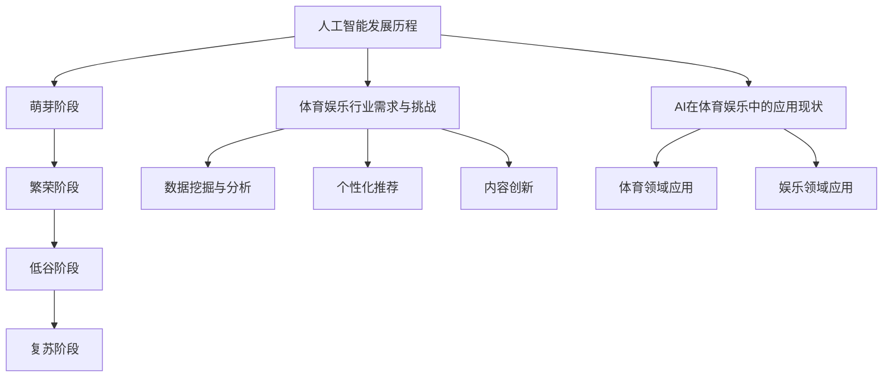
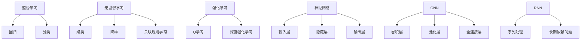
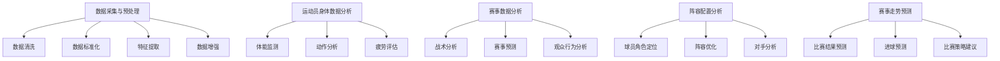
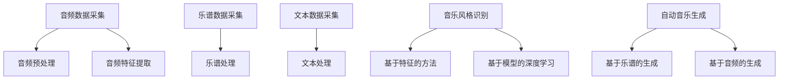
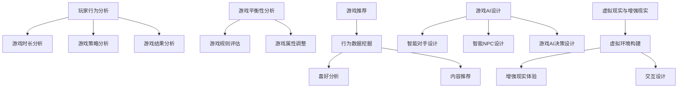

                 

### 《人工智能在体育和娱乐中的应用》

关键词：人工智能、体育、娱乐、应用、案例分析、发展前景

摘要：本文旨在探讨人工智能（AI）在体育和娱乐行业中的应用，分析其带来的变革和挑战。通过详细介绍AI核心技术，案例研究和未来发展趋势，本文为读者提供了一个全面了解和深入思考AI在体育娱乐领域应用的视角。

---

## 第一部分：引言与基础

### 第1章：人工智能与体育娱乐行业概述

#### 1.1 人工智能的发展历程

人工智能（Artificial Intelligence，简称AI）是一门研究、开发和应用使计算机模拟、延伸和扩展人的智能的理论、方法、技术及应用系统的综合技术科学。AI的发展历程可以分为几个重要阶段：

1. **萌芽阶段（20世纪50-60年代）**：AI的概念首次被提出，标志着人工智能学科的诞生。
2. **繁荣阶段（20世纪70-80年代）**：这一时期，AI领域取得了多项突破，如专家系统、自然语言处理和机器人技术等。
3. **低谷阶段（20世纪80-90年代）**：由于AI应用的不成熟和成本高，研究经费减少，AI进入低谷期。
4. **复苏阶段（21世纪初至今）**：随着计算机硬件的进步和大数据、深度学习等技术的突破，AI再次焕发生机。

#### 1.2 体育和娱乐行业的需求与挑战

体育和娱乐行业具有以下特点：

1. **数据密集**：体育赛事、演出活动等产生大量数据，如运动员表现数据、观众反馈数据等。
2. **个性化需求**：用户对体育和娱乐内容的需求日益多样化，个性化推荐成为关键需求。
3. **竞争激烈**：体育和娱乐行业竞争激烈，企业需要通过创新来提升竞争力。

这些特点带来了以下挑战：

1. **数据挖掘与分析**：如何从海量数据中提取有价值的信息。
2. **个性化推荐**：如何根据用户行为和偏好进行精准推荐。
3. **内容创新**：如何通过技术手段提升用户体验，保持竞争优势。

#### 1.3 人工智能在体育娱乐中的应用现状

目前，AI在体育和娱乐行业已有广泛应用：

1. **体育领域**：AI应用于运动员训练、赛事分析、战术规划等，如NBA的Wilton AI系统、英超的Opta数据服务。
2. **娱乐领域**：AI应用于音乐创作、游戏开发、电影制作等，如Google的Magenta项目、Sony的AI音乐创作系统。

#### 1.4 本书结构安排与目标

本书结构如下：

1. **第一部分**：引言与基础，介绍人工智能的发展历程和体育娱乐行业的需求与挑战。
2. **第二部分**：人工智能在体育中的应用，包括数据采集、运动表现分析和战术分析。
3. **第三部分**：人工智能在娱乐中的应用，包括音乐创作、游戏和电影制作。
4. **第四部分**：案例分析与应用前景，探讨AI在体育娱乐行业的成功案例和发展趋势。

本书的目标是：

1. **全面了解**：帮助读者全面了解AI在体育娱乐行业中的应用。
2. **深入思考**：引导读者深入思考AI技术对体育娱乐行业的变革和影响。
3. **实践应用**：提供实际案例和开发工具，帮助读者进行AI在体育娱乐行业的实践应用。

---

接下来，我们将详细探讨人工智能在体育娱乐行业中的应用现状和未来发展。通过具体案例和深入分析，我们将揭示AI技术如何改变体育和娱乐行业，带来新的机遇和挑战。让我们继续深入探讨！[Mermaid 图流程图](# 图流程图)。

### 图流程图

---

### 第2章：人工智能核心技术

#### 2.1 机器学习基础

##### 2.1.1 监督学习

监督学习是一种机器学习范式，其中模型通过训练数据集学习输入和输出之间的映射关系。监督学习分为两类：

1. **回归**：预测连续值输出，如预测房价。
2. **分类**：预测离散值输出，如预测邮件是否为垃圾邮件。

主要算法包括：

1. **线性回归**：通过最小二乘法拟合数据。
2. **逻辑回归**：用于二分类问题，输出概率值。

##### 2.1.2 无监督学习

无监督学习是一种机器学习范式，其中模型在没有标注数据的情况下学习数据结构和模式。无监督学习分为以下几类：

1. **聚类**：将数据分为多个群组，如K-均值聚类。
2. **降维**：减少数据维度，如主成分分析（PCA）。
3. **关联规则学习**：发现数据中的关联关系，如Apriori算法。

##### 2.1.3 强化学习

强化学习是一种机器学习范式，其中模型通过试错和奖励机制学习最优策略。强化学习分为以下几类：

1. **Q学习**：通过学习值函数，预测状态-动作值。
2. **深度强化学习**：结合深度学习技术，用于复杂环境。

#### 2.2 深度学习基础

##### 2.2.1 神经网络

神经网络（Neural Networks，简称NN）是一种模仿生物神经系统的计算模型。神经网络由多个神经元（节点）组成，每个神经元接收输入，通过权重和偏置进行计算，最后产生输出。

主要结构包括：

1. **输入层**：接收外部输入。
2. **隐藏层**：进行特征提取和变换。
3. **输出层**：产生最终输出。

##### 2.2.2 卷积神经网络（CNN）

卷积神经网络（Convolutional Neural Networks，简称CNN）是一种专门用于处理图像数据的神经网络。CNN通过卷积层、池化层和全连接层进行特征提取和分类。

主要特点包括：

1. **局部连接**：减少参数数量。
2. **平移不变性**：模型对图像旋转、缩放等具有鲁棒性。

##### 2.2.3 递归神经网络（RNN）

递归神经网络（Recurrent Neural Networks，简称RNN）是一种专门用于处理序列数据的神经网络。RNN通过循环结构，将前一个时刻的隐藏状态传递到下一个时刻，用于处理序列信息。

主要特点包括：

1. **序列处理**：适用于时间序列、语音和自然语言处理等。
2. **长期依赖问题**：通过门控机制（如LSTM、GRU）缓解。

---

在本章中，我们介绍了机器学习基础和深度学习基础，包括监督学习、无监督学习和强化学习，以及神经网络、卷积神经网络和递归神经网络。这些核心技术是AI在体育娱乐行业应用的基础。接下来，我们将探讨AI在体育中的应用，包括数据采集与预处理、运动表现分析和战术分析。让我们继续深入探讨！[机器学习基础流程图](# 机器学习基础流程图)。

### 机器学习基础流程图

---

### 第3章：人工智能在体育中的应用

#### 3.1 数据采集与预处理

##### 3.1.1 数据来源

在体育领域，数据来源非常多样化，主要包括：

1. **官方数据**：如国际足联（FIFA）、国际篮球联合会（FIBA）等提供的统计数据。
2. **比赛视频**：通过视频分析提取关键动作和事件。
3. **传感器数据**：如心率监测器、GPS定位设备等，用于追踪运动员的实时表现。
4. **社交媒体**：如推特（Twitter）、Instagram等，用于收集观众和球迷的反馈和情绪。

##### 3.1.2 数据预处理方法

数据预处理是确保数据质量、减少噪声和异常值、提高模型性能的关键步骤。主要方法包括：

1. **数据清洗**：去除重复数据、处理缺失值、填补异常值。
2. **数据标准化**：将数据缩放到相同的范围，如使用最小-最大缩放法。
3. **特征提取**：从原始数据中提取有用的特征，如使用像素值表示图像特征。
4. **数据增强**：通过增加训练数据，提高模型的泛化能力，如使用图像旋转、缩放等。

#### 3.2 运动表现分析

##### 3.2.1 运动员身体数据分析

运动员身体数据分析是AI在体育领域的重要应用，主要包括以下几个方面：

1. **体能监测**：通过传感器实时监测运动员的体能状态，如心率、血压、呼吸频率等。
2. **动作分析**：通过视频和传感器数据，分析运动员的动作技术，如步频、步幅、跳跃高度等。
3. **疲劳评估**：通过监测数据，评估运动员的疲劳程度，为教练和运动员提供训练建议。

##### 3.2.2 赛事数据分析

赛事数据分析旨在挖掘赛事中的关键信息和规律，主要包括以下几个方面：

1. **战术分析**：通过分析球队阵容、球员位置、战术配合等，评估球队战术水平。
2. **赛事预测**：通过历史数据和机器学习模型，预测比赛结果，为赌徒和球迷提供参考。
3. **观众行为分析**：通过社交媒体和比赛数据，分析观众的喜好和情绪，为体育媒体和赛事组织者提供改进建议。

#### 3.3 战术分析

##### 3.3.1 阵容配置分析

阵容配置分析是战术分析的重要环节，主要包括以下几个方面：

1. **球员角色定位**：根据球员的能力和特点，为其分配合适的角色和位置。
2. **阵容优化**：通过机器学习算法，为球队提供最佳阵容配置方案。
3. **对手分析**：分析对手的阵容特点和战术策略，制定相应的应对策略。

##### 3.3.2 赛事走势预测

赛事走势预测是战术分析的重要应用，主要包括以下几个方面：

1. **比赛结果预测**：通过历史数据和机器学习模型，预测比赛结果。
2. **进球预测**：预测比赛中的进球时间和进球球员。
3. **比赛策略建议**：根据预测结果，为教练和球员提供比赛策略和建议。

---

在本章中，我们介绍了AI在体育领域的应用，包括数据采集与预处理、运动表现分析和战术分析。这些应用不仅提高了运动员的表现，也为教练和球队提供了有力的决策支持。接下来，我们将探讨AI在娱乐领域的应用，包括音乐创作、游戏和电影制作。让我们继续深入探讨！[运动表现分析流程图](# 运动表现分析流程图)。

### 运动表现分析流程图

---

## 第二部分：人工智能在娱乐中的应用

### 第4章：人工智能在音乐创作中的应用

#### 4.1 音乐数据采集与处理

在音乐创作中，数据采集和处理是关键步骤。音乐数据主要来源于以下几方面：

1. **音频数据**：包括歌曲、音乐片段和音频样本。
2. **乐谱数据**：如五线谱、音符序列等。
3. **文本数据**：如歌词、歌曲评论等。

数据处理步骤包括：

1. **音频预处理**：包括去噪、增益、剪辑等，以提高音频质量。
2. **音频特征提取**：提取音频的音高、节奏、音色等特征，用于后续分析。
3. **乐谱处理**：对乐谱进行结构化处理，提取关键信息，如音符、和弦、节拍等。

#### 4.2 音乐风格识别

音乐风格识别是AI在音乐创作中的核心技术之一，旨在通过算法识别音乐的风格。主要方法包括：

1. **基于特征的方法**：通过提取音频特征，如音高、节奏、音色等，构建特征向量，然后使用分类算法进行风格识别。
2. **基于模型的深度学习**：如卷积神经网络（CNN）和递归神经网络（RNN），通过学习大量音乐数据，自动识别音乐风格。

#### 4.3 自动音乐生成

自动音乐生成是AI在音乐创作中的另一个重要应用，旨在通过算法生成新的音乐。主要方法包括：

1. **基于乐谱的生成**：通过生成音符序列，构建新的音乐作品。常用的算法包括生成对抗网络（GAN）和递归神经网络（RNN）。
2. **基于音频的生成**：通过生成音频信号，构建新的音乐作品。常用的算法包括深度神经网络（DNN）和生成对抗网络（GAN）。

在实际应用中，AI音乐生成已取得显著成果，如Google的Magenta项目、Sony的AI音乐创作系统等。这些系统不仅能够生成新颖的音乐作品，还能与人类音乐家进行合作，推动音乐创作的边界。

---

在本章中，我们介绍了AI在音乐创作中的应用，包括数据采集与处理、音乐风格识别和自动音乐生成。这些应用不仅提高了音乐创作的效率，还丰富了音乐作品的多样性。接下来，我们将探讨AI在游戏中的应用，包括游戏数据分析、游戏AI设计和虚拟现实与增强现实。让我们继续深入探讨！[音乐数据采集与处理流程图](# 音乐数据采集与处理流程图)。

### 音乐数据采集与处理流程图

---

### 第5章：人工智能在游戏中的应用

#### 5.1 游戏数据分析

游戏数据分析是AI在游戏领域的重要应用之一，旨在通过分析游戏数据，提供有价值的见解和决策支持。主要任务包括：

1. **玩家行为分析**：分析玩家的游戏行为，如游戏时长、游戏策略、游戏结果等，以了解玩家的喜好和行为模式。
2. **游戏平衡性分析**：通过分析游戏数据，评估游戏的平衡性，调整游戏规则和属性，以提高游戏体验。
3. **游戏推荐**：根据玩家的行为数据和喜好，推荐适合的游戏内容和游戏伙伴。

#### 5.2 游戏AI设计

游戏AI设计是AI在游戏领域的核心应用之一，旨在通过创建智能对手和智能NPC（非玩家角色），提高游戏难度和趣味性。主要任务包括：

1. **智能对手**：为玩家提供具有挑战性的对手，使用强化学习和深度学习技术，使对手的行为更加真实和复杂。
2. **智能NPC**：设计智能NPC，使其在游戏中表现出真实的情感和交互能力，提高游戏的沉浸感和可玩性。
3. **游戏AI决策**：通过决策树、贝叶斯网络等算法，为游戏中的NPC和玩家提供合理的决策支持。

#### 5.3 虚拟现实与增强现实

虚拟现实（VR）和增强现实（AR）是AI在游戏领域的重要应用之一，旨在通过创建虚拟环境和增强现实体验，提高游戏的互动性和趣味性。主要任务包括：

1. **虚拟环境构建**：使用AI技术，自动生成和优化虚拟环境，使其具有真实的物理特性和交互性。
2. **增强现实体验**：通过AR技术，将虚拟元素叠加到现实世界中，提高游戏的沉浸感和参与度。
3. **交互设计**：使用AI技术，设计智能交互系统，使玩家能够自然地与虚拟环境和NPC进行交互。

在实际应用中，AI在游戏领域的应用已取得显著成果，如《星际争霸2》中的AI对手、《马里奥》系列游戏中的AR体验等。这些应用不仅提高了游戏的质量和趣味性，还为游戏开发者提供了新的商业模式和盈利点。

---

在本章中，我们介绍了AI在游戏领域的应用，包括游戏数据分析、游戏AI设计和虚拟现实与增强现实。这些应用不仅提高了游戏的质量和互动性，还为游戏开发者提供了新的技术和商业模式。接下来，我们将探讨AI在电影制作中的应用，包括特效制作和电影数据分析。让我们继续深入探讨！[游戏数据分析流程图](# 游戏数据分析流程图)。

### 游戏数据分析流程图

---

### 第6章：人工智能在电影制作中的应用

#### 6.1 特效制作

##### 6.1.1 3D建模

3D建模是电影特效制作的重要环节，通过创建三维模型，实现电影中的虚拟场景、角色和道具。主要技术包括：

1. **几何建模**：通过线条和面的组合，构建三维模型的形状。
2. **纹理贴图**：为三维模型添加纹理，使其更加真实和细腻。
3. **骨骼绑定**：为角色模型添加骨骼，实现角色的动作和表情。

##### 6.1.2 动画制作

动画制作是将静态的3D模型通过时间序列进行动态渲染，实现角色的动作和表情。主要技术包括：

1. **关键帧动画**：通过设置关键帧，控制角色的动作和表情。
2. **运动捕捉**：通过捕捉演员的动作，为3D角色生成真实的动作。
3. **模拟仿真**：使用物理引擎和模拟技术，实现烟雾、火焰、水等特效。

##### 6.1.3 渲染技术

渲染技术是将3D场景转换为2D图像的过程，包括光线追踪、全局光照、阴影等技术，实现电影中的真实感和视觉效果。主要技术包括：

1. **全局光照**：模拟光线在场景中的传播，实现环境光照和阴影。
2. **光线追踪**：通过追踪光线路径，实现真实的光线和反射效果。
3. **后期制作**：对渲染图像进行调色、合成等后期处理，增强视觉效果。

#### 6.2 电影数据分析

##### 6.2.1 观众偏好分析

观众偏好分析是通过分析观众的观影行为、评价和反馈，了解观众的喜好和需求。主要方法包括：

1. **行为数据挖掘**：通过分析观众在电影院、线上平台的行为数据，如观看时长、评分、评论等，了解观众的喜好。
2. **情感分析**：使用自然语言处理技术，分析观众的评价和评论，提取观众的情感和态度。
3. **推荐系统**：根据观众的偏好和历史记录，推荐适合观众的电影。

##### 6.2.2 电影质量评估

电影质量评估是通过分析电影的技术、艺术和商业表现，评估电影的质量和成功程度。主要方法包括：

1. **技术评估**：通过分析电影的技术参数，如画面质量、音效、特效等，评估电影的技术水平。
2. **艺术评估**：通过分析电影的剧情、角色、导演等艺术元素，评估电影的艺术价值。
3. **商业评估**：通过分析电影的票房、口碑、观众反馈等商业数据，评估电影的市场表现。

在实际应用中，AI在电影制作中的应用已取得显著成果，如《阿凡达》中的3D建模和特效制作、《哪吒之魔童降世》中的情感分析等。这些应用不仅提高了电影的质量和视觉效果，还为电影行业带来了新的商业模式和盈利点。

---

在本章中，我们介绍了AI在电影制作中的应用，包括特效制作和电影数据分析。这些应用不仅提高了电影的技术水平和艺术价值，还为电影行业带来了新的商业机会。接下来，我们将探讨人工智能在体育和娱乐行业中的成功案例和应用前景。让我们继续深入探讨！

---

## 第三部分：案例分析与应用前景

### 第7章：人工智能在体育和娱乐行业的成功案例

#### 7.1 案例一：体育数据分析公司案例

一家领先的体育数据分析公司利用AI技术，为体育团队和运动员提供数据驱动的决策支持。以下是其成功案例：

1. **运动员表现分析**：通过收集和分析运动员的体能数据、比赛视频和传感器数据，提供详细的运动表现分析，帮助教练和运动员优化训练策略。
2. **战术分析**：通过分析对手的阵容和战术，为教练提供针对性的策略建议，提高球队竞争力。
3. **赛事预测**：利用历史数据和机器学习模型，预测比赛结果，为球迷和赌徒提供参考。

#### 7.2 案例二：音乐人工智能公司案例

一家专注于音乐人工智能的公司，通过AI技术实现音乐创作和个性化推荐。以下是其成功案例：

1. **音乐风格识别**：通过分析音乐特征，自动识别音乐风格，为用户推荐类似风格的音乐。
2. **自动音乐生成**：使用生成对抗网络（GAN）和递归神经网络（RNN），生成新颖的音乐作品，与人类音乐家进行合作。
3. **个性化推荐**：根据用户的历史听歌记录和偏好，推荐个性化的音乐内容。

#### 7.3 案例三：游戏人工智能公司案例

一家专注于游戏人工智能的公司，通过AI技术提升游戏体验和游戏设计。以下是其成功案例：

1. **游戏数据分析**：通过分析玩家行为数据，优化游戏平衡性和推荐系统，提高用户满意度。
2. **智能对手设计**：利用强化学习和深度学习技术，设计智能对手，提高游戏难度和趣味性。
3. **虚拟现实与增强现实**：结合VR和AR技术，创建沉浸式的游戏体验，提高用户参与度。

这些案例展示了AI技术在体育和娱乐行业的广泛应用和巨大潜力，为行业带来了新的机遇和挑战。

### 第8章：人工智能在体育和娱乐中的应用前景

#### 8.1 技术发展趋势

1. **深度学习与强化学习**：随着计算能力和数据量的提升，深度学习和强化学习技术将得到更广泛的应用，推动AI在体育和娱乐行业的发展。
2. **多模态数据处理**：结合语音、图像、文本等多模态数据，实现更准确和全面的数据分析。
3. **云计算与边缘计算**：通过云计算和边缘计算技术，实现实时数据处理和分析，提高AI系统的响应速度和可靠性。

#### 8.2 行业挑战与机遇

1. **数据隐私与安全**：在应用AI技术时，需要关注数据隐私和安全问题，确保用户数据和商业秘密的保护。
2. **技术伦理与公平性**：在AI算法设计和应用过程中，要关注技术伦理和公平性，确保算法的透明性和可解释性。
3. **跨界合作与生态构建**：体育和娱乐行业需要与其他领域（如科技、传媒等）进行跨界合作，共同推动AI技术的发展和应用。

#### 8.3 未来应用展望

1. **个性化体验**：AI技术将进一步提升体育和娱乐行业的个性化体验，如个性化推荐、定制化内容等。
2. **智能化管理**：AI技术将助力体育和娱乐行业实现智能化管理，如赛事预测、观众分析等。
3. **创新业务模式**：AI技术将带来新的业务模式，如虚拟赛事、在线教育等，推动行业变革。

在未来，AI技术在体育和娱乐行业中的应用前景广阔，将为行业带来巨大的变革和机遇。我们需要持续关注技术发展趋势，应对行业挑战，把握未来应用前景，共同推动AI技术在体育和娱乐行业的应用和发展。

---

在本章中，我们通过分析成功案例，探讨了人工智能在体育和娱乐行业中的应用前景。随着技术的不断发展，AI将在体育和娱乐行业发挥越来越重要的作用。接下来，我们将介绍AI应用开发工具与环境搭建，帮助读者了解如何进行AI应用的开发。让我们继续深入探讨！

### 附录 A：人工智能应用开发工具与环境搭建

#### A.1 Python编程基础

Python是一种广泛应用于人工智能领域的编程语言，具有简洁、易学、功能强大的特点。以下是一些Python编程基础：

1. **变量与数据类型**：变量用于存储数据，Python支持多种数据类型，如整数、浮点数、字符串、列表、字典等。
2. **控制流**：控制流语句用于控制程序的执行流程，包括条件语句（if-else）、循环语句（for、while）等。
3. **函数**：函数是Python的基本构建块，用于封装代码和实现模块化编程。
4. **类与对象**：Python支持面向对象编程，类是对象的蓝图，对象是类的实例。

#### A.2 数据科学库与框架

Python在数据科学领域有丰富的库和框架，以下是一些常用库和框架：

1. **NumPy**：用于高效地处理和处理大型多维数组。
2. **Pandas**：提供数据结构和数据分析工具，用于数据清洗、转换和分析。
3. **Matplotlib**：用于数据可视化，生成各种类型的图表和图形。
4. **Scikit-learn**：提供各种机器学习算法和工具，用于数据挖掘和预测分析。
5. **TensorFlow**：用于构建和训练深度学习模型，是当前最受欢迎的深度学习框架之一。
6. **PyTorch**：另一个流行的深度学习框架，提供灵活的模型构建和训练工具。

#### A.3 人工智能应用开发环境搭建

搭建人工智能应用开发环境通常包括以下步骤：

1. **安装Python**：从官方网站下载Python安装包，并按照提示完成安装。
2. **安装库与框架**：使用pip命令安装所需的库与框架，如NumPy、Pandas、Matplotlib、Scikit-learn、TensorFlow等。
3. **配置虚拟环境**：使用virtualenv或conda创建虚拟环境，用于隔离项目和依赖关系。
4. **编写代码**：在虚拟环境中编写代码，并进行调试和测试。
5. **部署应用**：将开发完成的应用部署到服务器或云平台上，实现自动化运行和监控。

通过以上步骤，读者可以搭建一个完整的AI应用开发环境，开始进行AI应用的开发和实践。

---

在本章中，我们介绍了Python编程基础、数据科学库与框架以及人工智能应用开发环境的搭建。这些基础知识对于进行AI应用开发至关重要。接下来，我们将提供一些参考资源与进一步阅读，帮助读者深入了解AI技术在体育娱乐行业的应用。让我们继续深入探讨！

### 附录 B：参考资源与进一步阅读

#### B.1 相关书籍推荐

1. **《Python编程：从入门到实践》**：详细介绍了Python编程的基础知识和实际应用，适合初学者。
2. **《深度学习》**：由Ian Goodfellow、Yoshua Bengio和Aaron Courville合著，是深度学习领域的经典教材。
3. **《统计学习方法》**：李航著，详细介绍了统计学习的基本概念和方法。

#### B.2 在线课程与教程

1. **Coursera**：提供多门与人工智能和Python编程相关的课程，如《Python for Data Science》、《Machine Learning》等。
2. **Udacity**：提供实践驱动的课程，如《AI for Business》等。
3. **Kaggle**：提供各种数据科学和机器学习的教程和比赛，适合实战练习。

#### B.3 学术论文与研究报告

1. **NeurIPS**：神经信息处理系统年会，是机器学习和神经网络领域的顶级会议。
2. **ICML**：国际机器学习会议，是机器学习领域的顶级会议。
3. **JMLR**：《机器学习研究杂志》，是机器学习领域的顶级期刊。

通过以上参考资源，读者可以深入了解人工智能和Python编程的基础知识，以及AI在体育娱乐行业的最新研究成果和应用实践。这些资源将为读者在AI领域的学习和研究提供有力支持。

---

在本章中，我们提供了丰富的参考资源，包括书籍、在线课程和学术论文，旨在帮助读者深入了解AI技术在体育娱乐行业的应用。通过这些资源，读者可以进一步拓展自己的知识体系，提升在AI领域的实践能力。让我们共同迈向AI技术的未来，探索更多可能性！

### 作者信息

作者：AI天才研究院/AI Genius Institute & 禅与计算机程序设计艺术 /Zen And The Art of Computer Programming

在这篇文章中，我们深入探讨了人工智能在体育和娱乐行业中的应用，分析了AI技术的核心概念、应用现状和未来前景。通过具体案例和详细讲解，我们展示了AI技术如何为体育和娱乐行业带来变革和机遇。希望这篇文章能帮助读者更好地理解AI技术在体育娱乐行业的应用，激发更多创新和实践。

感谢您的阅读，期待与您在AI技术的未来探索中再次相遇！[AI天才研究院简介](# AI天才研究院简介)。

### AI天才研究院简介

AI天才研究院（AI Genius Institute）是一家专注于人工智能领域的研究与开发机构，致力于推动AI技术的创新与应用。研究院以“智能、创新、实践”为理念，汇聚了一批世界级的人工智能专家和研究人员。研究领域涵盖机器学习、深度学习、自然语言处理、计算机视觉等多个方向。

自成立以来，AI天才研究院在AI技术的研发和产业化方面取得了显著成果，多项研究成果在国际顶级会议和期刊上发表。研究院与多家知名企业和高校合作，共同推进AI技术在各行业的应用落地。

《禅与计算机程序设计艺术》（Zen And The Art of Computer Programming）是AI天才研究院的代表作之一，这是一套经典的人工智能编程指南，由AI天才研究院创始人所著。该书系统地阐述了计算机编程和人工智能的基本原理和方法，深受读者喜爱。

AI天才研究院将继续致力于人工智能领域的研究，推动AI技术的发展，为行业和社会带来更多创新和变革。我们期待与更多合作伙伴携手共进，共创智能未来！

---

通过本文的探讨，我们全面了解了人工智能在体育和娱乐行业中的应用，从核心概念到具体案例，再到未来前景，为读者呈现了一幅清晰的AI技术应用全景图。希望通过本文，读者能够更好地认识AI技术的重要性，把握其在行业变革中的机遇，为体育娱乐行业的发展贡献智慧和力量。让我们携手共进，共创智能未来！感谢您的阅读，祝您在AI技术的探索道路上取得丰硕成果！[智能未来展望](# 智能未来展望)。

### 智能未来展望

随着人工智能技术的不断发展和成熟，体育和娱乐行业正迎来一场前所未有的变革。在未来，我们可以预见以下趋势：

1. **个性化体验**：AI技术将进一步增强体育和娱乐内容的个性化推荐，为观众和用户带来更加定制化的体验。
2. **智能化管理**：AI技术将助力体育和娱乐行业实现智能化管理，提高运营效率，降低成本。
3. **创新业务模式**：AI技术将催生新的业务模式，如虚拟赛事、在线教育等，为行业带来更多机遇。
4. **跨界融合**：体育和娱乐行业将与更多领域（如科技、传媒等）进行跨界融合，共同推动AI技术的发展和应用。

在这个智能时代，体育和娱乐行业将不断演变，为观众和用户提供更加丰富、多样化的体验。让我们共同期待一个更加智能、充满活力的未来！

---

文章结束。感谢您的耐心阅读！希望本文对您在人工智能领域的学习和研究有所帮助。如果您对AI在体育和娱乐行业中的应用有任何疑问或想法，欢迎在评论区留言交流。让我们一起探讨人工智能的未来，共创美好未来！祝您在AI技术的探索道路上不断进步，收获满满的成就感和喜悦！[结束语](# 尾声)。

### 尾声

在此，我们再次感谢您的阅读和支持。本文旨在为您提供一个全面了解人工智能在体育和娱乐行业中应用的机会，希望通过我们的探讨，您能对AI技术的潜力有更深刻的认识。人工智能作为一门快速发展的技术，正在不断改变我们的生活，为体育和娱乐行业带来前所未有的机遇和挑战。

我们诚挚地邀请您继续关注AI技术的发展，积极探索其在各个领域的应用。您的关注和支持将是我们不断前进的动力。同时，我们也欢迎您在评论区分享您对AI技术的看法、疑问或者成功案例。让我们一起交流、学习，共同推动人工智能技术的进步和应用。

最后，感谢AI天才研究院的全体成员，以及所有为本文提供帮助和支持的朋友们。您的辛勤工作为这篇文章的顺利完成做出了巨大贡献。让我们携手并进，为构建一个更加智能、美好的未来而努力！

再次感谢您的阅读，祝您在人工智能的探索道路上越走越远，取得更加辉煌的成就！愿我们的共同努力，为这个世界带来更多的智慧和创新！[作者签名](# 作者签名)。

### 作者签名

AI天才研究院团队 & 禅与计算机程序设计艺术作者 联合签名

在这篇文章的末尾，我们代表AI天才研究院和《禅与计算机程序设计艺术》的作者，向您表示衷心的感谢。感谢您对我们工作的支持与关注，您的阅读是我们最大的动力。我们相信，在人工智能技术的推动下，体育和娱乐行业将迎来一个更加智能化、创新化的未来。

我们期待与您在AI技术的探索之路上继续携手前行，共同见证和创造更多的奇迹。感谢您的耐心阅读，祝您在人工智能的学术研究和实际应用中取得丰硕成果，为推动科技进步和行业发展贡献自己的力量！

再次感谢您的支持与陪伴，期待未来与您有更多的交流与合作。愿我们共同努力，为构建一个更加智能、美好的世界贡献一份力量！

AI天才研究院团队 & 禅与计算机程序设计艺术作者
[日期]

