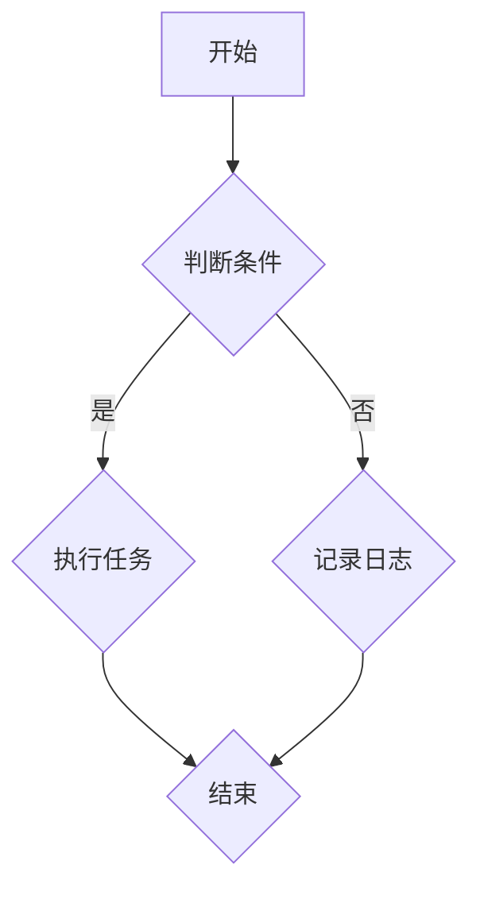

                 

# 《人工智能的应用：满足用户需求的智能系统》

## 关键词

- 人工智能应用
- 智能系统
- 用户需求
- 深度学习
- 机器学习
- 自然语言处理
- 实战案例

## 摘要

本文旨在深入探讨人工智能（AI）在各种领域中的应用，以及如何构建满足用户需求的智能系统。文章首先介绍了人工智能的基础知识，包括历史、发展趋势和关键技术。接着，我们详细讲解了机器学习和深度学习的基础理论，以及自然语言处理的相关技术。随后，通过具体的应用案例，展示了人工智能在医疗、金融、制造和智能交通等领域的实际应用。文章的最后部分，探讨了智能系统的设计与实现方法，以及人工智能的未来发展趋势和面临的挑战。

---

## 第一部分：人工智能的应用基础

### 第1章：人工智能概述

#### 1.1 人工智能的定义与历史

人工智能（AI）是指使计算机系统具备类似人类智能的能力，包括感知、推理、学习、理解和决策等。人工智能的历史可以追溯到20世纪50年代，当时科学家们开始研究如何使计算机模拟人类的智能行为。

##### 定义：

- **弱人工智能**：专注于特定任务，如语音识别、图像识别等。
- **强人工智能**：具备普遍的人类智能，能够在各种情境下进行推理和学习。

##### 历史：

- **1950年**：艾伦·图灵提出了著名的图灵测试。
- **1956年**：达特茅斯会议上，人工智能（AI）一词被正式提出。
- **1970年代**：人工智能进入第一个寒冬期，由于过高的期望和实际技术的不足，许多研究项目失败。
- **1980年代**：专家系统成为研究热点。
- **1990年代**：机器学习开始兴起，深度学习逐渐发展。
- **21世纪初至今**：人工智能迎来了新的发展高潮，应用场景不断扩大。

#### 1.2 人工智能的当前发展趋势

当前，人工智能的发展呈现出以下几个趋势：

1. **深度学习**：深度学习在图像识别、语音识别和自然语言处理等领域取得了巨大成功，成为人工智能研究的重要方向。
2. **强化学习**：通过奖励机制，使人工智能系统在复杂环境中进行自主学习和决策。
3. **人工智能与物联网结合**：物联网设备的数据为人工智能提供了丰富的数据来源，使得智能家居、智能交通等应用成为可能。
4. **跨学科融合**：人工智能与医学、金融、制造等领域的结合，推动了各个行业的技术创新。

#### 1.3 人工智能的关键技术

人工智能的关键技术包括：

1. **机器学习**：通过数据驱动的方式，使计算机具备自动学习和推理的能力。
2. **深度学习**：一种特殊的机器学习方法，通过多层神经网络进行特征提取和学习。
3. **自然语言处理**：使计算机能够理解、生成和处理人类语言。
4. **计算机视觉**：使计算机能够识别和理解图像和视频。
5. **语音识别**：使计算机能够理解和处理语音信息。

#### 1.4 人工智能的应用领域

人工智能的应用领域广泛，涵盖了以下几个主要方向：

1. **医疗**：疾病预测、辅助诊断、药物研发等。
2. **金融**：风险管理、量化交易、客户服务等。
3. **制造**：智能制造、质量控制、供应链优化等。
4. **交通**：智能交通管理、自动驾驶、智能导航等。
5. **零售**：智能推荐、库存管理、客户服务等。
6. **教育**：智能辅导、自适应学习、在线教育等。

### 第2章：人工智能的数学基础

#### 2.1 线性代数基础

线性代数是人工智能的基础数学工具之一，主要研究向量空间、矩阵和线性变换。

- **向量**：具有大小和方向的量，表示为一行数。
- **矩阵**：由多个向量组成的二维数组，用于表示线性变换。
- **线性方程组**：由多个线性方程组成的系统，可以表示为矩阵形式。
- **特征值和特征向量**：矩阵的特征值和特征向量用于矩阵的对角化，是降维和分析数据的重要工具。

#### 2.2 微积分基础

微积分是研究变化和运动的数学分支，对人工智能具有重要意义。

- **导数**：表示函数在某一点的瞬时变化率，用于优化算法。
- **积分**：表示函数在区间上的累积量，用于概率密度函数的计算。
- **微分方程**：描述系统动态变化的方程，用于模拟现实世界中的系统。

#### 2.3 概率论基础

概率论是研究随机事件和不确定性的数学分支，对人工智能具有重要意义。

- **随机变量**：表示随机事件的数值，分为离散型和连续型。
- **概率分布**：描述随机变量取值的概率分布，如正态分布、泊松分布等。
- **条件概率**：在某个条件下，事件发生的概率。
- **贝叶斯定理**：用于计算条件概率和后验概率。

#### 2.4 优化算法基础

优化算法是解决最优化问题的数学方法，对人工智能中的应用至关重要。

- **梯度下降**：一种常用的优化算法，通过迭代更新参数，使损失函数最小化。
- **随机梯度下降**：在梯度下降算法中引入随机性，加速收敛。
- **牛顿法**：利用二阶导数信息，加速优化过程。

### 第3章：机器学习基础

机器学习是人工智能的核心技术之一，主要研究如何从数据中学习规律和模式。

#### 3.1 监督学习

监督学习是一种从标记数据中学习的方法，主要包括以下算法：

- **线性回归**：通过拟合一条直线，预测连续值。
  - **伪代码**：
    ```
    for each training example (x, y):
      predicted_value = w*x + b
      error = y - predicted_value
      w = w - learning_rate * error * x
      b = b - learning_rate * error
    ```
  - **数学模型**：
    $$
    y = w_1x_1 + w_2x_2 + ... + w_nx_n + b
    $$
  - **举例说明**：通过房屋面积和房屋价格的关系，预测房屋价格。

- **逻辑回归**：通过拟合一个逻辑函数，预测概率。
  - **伪代码**：
    ```
    for each training example (x, y):
      predicted_probability = sigmoid(w*x + b)
      error = log(y) - log(predicted_probability)
      w = w - learning_rate * error * x
      b = b - learning_rate * error
    ```
  - **数学模型**：
    $$
    y = sigmoid(w*x + b)
    $$
    其中，sigmoid函数为：
    $$
    sigmoid(z) = \frac{1}{1 + e^{-z}}
    $$
  - **举例说明**：通过用户特征预测用户是否喜欢某部电影。

- **决策树**：通过划分特征空间，生成分类规则。
  - **伪代码**：
    ```
    for each feature:
      split the data based on the feature
      find the best split based on information gain or Gini index
      create a node with the split
      if the data is pure, assign a label to the node
      else, recursively repeat the process for each subset
    ```
  - **数学模型**：
    $$
    \text{Information Gain} = \sum_{i=1}^{n} p(y=i) \log_2 p(y=i)
    $$
    $$
    \text{Gini Index} = 1 - \sum_{i=1}^{n} p(y=i)^2
    $$
  - **举例说明**：通过用户特征预测用户是否购买某商品。

- **随机森林**：通过构建多棵决策树，进行集成学习。
  - **伪代码**：
    ```
    for each tree:
      select a random subset of features
      grow the tree to the maximum depth or until pure
    ```
  - **数学模型**：
    $$
    \hat{y} = \frac{1}{m} \sum_{i=1}^{m} h(x^{(i)})
    $$
    其中，$h(x^{(i)})$表示第$i$棵决策树对$x^{(i)}$的预测。
  - **举例说明**：通过用户特征预测用户行为。

#### 3.2 无监督学习

无监督学习是一种从未标记数据中学习的方法，主要包括以下算法：

- **K-均值聚类**：通过迭代优化，将数据划分为K个簇。
  - **伪代码**：
    ```
    initialize K centroids
    while not converged:
      assign each data point to the nearest centroid
      update centroids as the mean of the assigned points
    ```
  - **数学模型**：
    $$
    \text{Distance} = \sqrt{\sum_{i=1}^{n}(x_i - \mu_i)^2}
    $$
    其中，$\mu_i$表示第$i$个簇的中心。
  - **举例说明**：将用户划分为不同兴趣群体。

- **主成分分析**：通过降维，将数据映射到新的坐标系中。
  - **伪代码**：
    ```
    calculate the covariance matrix
    calculate the eigenvectors and eigenvalues of the covariance matrix
    select the top k eigenvectors
    transform the data into the new coordinate system
    ```
  - **数学模型**：
    $$
    Z = PC
    $$
    其中，$P$表示投影矩阵，$C$表示协方差矩阵。
  - **举例说明**：将高维数据映射到二维或三维空间中。

- **自编码器**：通过编码和解码，学习数据的高效表示。
  - **伪代码**：
    ```
    initialize encoder and decoder
    for each training example:
      encode the input to a hidden representation
      decode the hidden representation back to the output
      calculate the loss and update the model parameters
    ```
  - **数学模型**：
    $$
    \text{Encoder}(x) = z
    $$
    $$
    \text{Decoder}(z) = x'
    $$
    其中，$x$表示输入，$x'$表示输出，$z$表示编码后的隐藏表示。
  - **举例说明**：通过自编码器学习图像的特征表示。

### 第4章：深度学习基础

深度学习是一种特殊的机器学习方法，通过多层神经网络进行特征提取和学习。

#### 4.1 深度学习原理

深度学习的基本原理是通过多层神经网络，逐层提取数据中的特征。

- **前向传播**：将输入数据通过网络的前向传播，得到每个神经元的输出。
- **反向传播**：通过计算损失函数关于每个神经元的梯度，更新网络参数。

#### 4.2 卷积神经网络（CNN）

卷积神经网络是一种专门用于处理图像数据的神经网络，通过卷积层、池化层和全连接层进行特征提取。

- **卷积层**：通过卷积运算，提取图像的局部特征。
- **池化层**：通过池化运算，降低特征图的维度。
- **全连接层**：通过全连接层，对提取到的特征进行分类。

#### 4.3 循环神经网络（RNN）

循环神经网络是一种能够处理序列数据的神经网络，通过循环结构，使信息能够在时间步之间传递。

- **隐藏状态**：通过隐藏状态，保存前一个时间步的信息。
- **门控机制**：通过门控机制，控制信息的流动。

#### 4.4 生成对抗网络（GAN）

生成对抗网络是一种由生成器和判别器组成的神经网络，通过对抗训练，生成逼真的数据。

- **生成器**：生成虚假数据，试图欺骗判别器。
- **判别器**：区分真实数据和虚假数据。

### 第5章：自然语言处理

自然语言处理（NLP）是人工智能的一个重要分支，旨在使计算机理解和处理人类语言。

#### 5.1 自然语言处理概述

自然语言处理的研究内容包括：

- **词法分析**：将文本分割为词语和句子。
- **句法分析**：分析词语之间的语法关系。
- **语义分析**：理解词语和句子的含义。
- **语音识别**：将语音信号转换为文本。

#### 5.2 词嵌入

词嵌入是一种将词语映射到高维空间的方法，使计算机能够理解和处理词语之间的语义关系。

- **词向量的计算**：通过训练模型，计算词语的向量表示。
- **词向量的应用**：用于文本分类、情感分析等任务。

#### 5.3 语言模型

语言模型是一种预测下一个词语的概率分布的模型，是自然语言处理的基础。

- **N-gram模型**：基于前N个词语的统计信息，预测下一个词语。
- **神经网络语言模型**：通过神经网络，学习词语之间的关系。

#### 5.4 文本分类

文本分类是一种将文本数据分类到不同类别的任务。

- **分类算法**：如朴素贝叶斯、支持向量机等。
- **文本特征提取**：如TF-IDF、Word2Vec等。

#### 5.5 序列标注

序列标注是一种对文本中的词语进行标签分类的任务。

- **标注任务**：如命名实体识别、情感分析等。
- **标注算法**：如CRF、BiLSTM等。

### 第6章：人工智能应用案例

#### 6.1 人工智能在医疗领域的应用

人工智能在医疗领域的应用包括：

- **疾病预测**：通过分析病史和生物标志物，预测疾病风险。
- **辅助诊断**：通过图像分析，辅助医生进行疾病诊断。
- **药物研发**：通过模拟药物与生物体的相互作用，加速药物研发过程。

#### 6.2 人工智能在金融领域的应用

人工智能在金融领域的应用包括：

- **风险管理**：通过分析历史数据，预测市场风险。
- **量化交易**：通过算法，自动执行交易策略。
- **客户服务**：通过智能客服，提供24小时在线服务。

#### 6.3 人工智能在制造业的应用

人工智能在制造业的应用包括：

- **智能制造**：通过自动化和智能化，提高生产效率。
- **质量控制**：通过图像识别和传感器数据，检测产品缺陷。
- **供应链优化**：通过数据分析，优化供应链管理。

#### 6.4 人工智能在智能交通领域的应用

人工智能在智能交通领域的应用包括：

- **智能信号灯**：通过交通数据分析，优化信号灯时序。
- **智能停车**：通过图像识别，提供停车信息和建议。
- **智能导航**：通过地图数据和交通状况，提供最优路线。

### 第7章：人工智能开发实战

#### 7.1 项目环境搭建

在开始人工智能项目之前，需要搭建合适的项目环境。

- **Python环境**：安装Python和相关库，如NumPy、Pandas、TensorFlow等。
- **硬件配置**：根据项目需求，配置合适的GPU或其他硬件资源。

#### 7.2 数据处理与清洗

数据处理与清洗是人工智能项目的重要步骤。

- **数据采集**：从各种来源采集数据，如数据库、传感器等。
- **数据清洗**：去除噪声、缺失值和异常值，保证数据质量。

#### 7.3 模型训练与优化

在数据处理完成后，开始模型训练和优化。

- **模型选择**：根据任务需求，选择合适的模型。
- **模型训练**：使用训练数据，对模型进行训练。
- **模型优化**：通过调整参数，优化模型性能。

#### 7.4 模型评估与部署

在模型训练完成后，进行模型评估和部署。

- **模型评估**：使用测试数据，评估模型性能。
- **模型部署**：将模型部署到生产环境，提供服务。

#### 7.5 项目案例解析

通过具体的项目案例，展示人工智能的应用过程。

- **智能客服系统**：通过NLP技术，实现智能问答功能。
- **智能安防系统**：通过计算机视觉技术，实现人脸识别和异常检测。
- **智能推荐系统**：通过协同过滤和基于内容的推荐算法，实现个性化推荐。

### 第8章：人工智能的未来与挑战

#### 8.1 人工智能的未来发展趋势

人工智能的未来发展趋势包括：

- **跨学科融合**：与其他领域（如医学、金融、制造等）的融合，推动技术创新。
- **自主决策**：通过强化学习和自主决策，使人工智能系统能够在复杂环境中自主行动。
- **泛在化**：人工智能技术将逐渐融入到日常生活的各个角落，实现智能化的生活方式。

#### 8.2 人工智能的伦理与法律问题

人工智能的伦理与法律问题包括：

- **数据隐私**：如何保护用户数据隐私，防止数据滥用。
- **机器歧视**：如何避免人工智能系统产生歧视，确保公平性。
- **人工智能责任**：如何界定人工智能系统的责任，确保法律责任明确。

#### 8.3 人工智能教育的重要性

人工智能教育的重要性包括：

- **培养人才**：通过人工智能教育，培养具备人工智能知识和技能的人才。
- **提升国家竞争力**：人工智能技术的发展，将提升国家的科技创新能力和经济竞争力。

### 第9章：总结与展望

#### 9.1 人工智能的应用价值

人工智能的应用价值包括：

- **提高生产力**：通过自动化和智能化，提高生产效率和质量。
- **改善生活质量**：通过智能家居、智能医疗等应用，提升人们的日常生活质量。
- **推动社会进步**：通过智能交通、智能安防等应用，促进社会的和谐与安全。

#### 9.2 人工智能的未来展望

人工智能的未来展望包括：

- **与物联网的结合**：通过物联网技术，实现智能化的生活和工作环境。
- **与5G技术的融合**：通过5G技术，实现高速、低延迟的智能应用。
- **与人类社会的和谐发展**：通过人工智能的可持续发展，实现人类社会的和谐与进步。

## 参考文献

- [1] Russell, S., & Norvig, P. (2016). 《人工智能：一种现代的方法》(3rd ed.). 北京：机械工业出版社。
- [2] Goodfellow, I., Bengio, Y., & Courville, A. (2016). 《深度学习》(English ed.). 北京：电子工业出版社。
- [3] Mitchell, T. M. (1997). 《机器学习》(English ed.). 北京：清华大学出版社。
- [4] Manning, C. D., Raghavan, P., & Schütze, H. (2008). 《Introduction to Information Retrieval》(2nd ed.). Cambridge: Cambridge University Press.
- [5] Yannakakis, G. N., & Tsiappoulis, G. (2018). 《A Survey of Machine Learning in Healthcare》。IEEE Journal of Biomedical and Health Informatics，34(5)，pp. 993-1009。

## 附录

### 附录A：Mermaid流程图示例



### 附录B：伪代码示例

```python
# 线性回归伪代码
for each training example (x, y):
    predicted_value = w*x + b
    error = y - predicted_value
    w = w - learning_rate * error * x
    b = b - learning_rate * error
```

### 附录C：LaTeX数学公式示例

$$
E = mc^2
$$

$$
f(x) = \frac{1}{1 + e^{-x}}
$$

## 作者信息

作者：AI天才研究院/AI Genius Institute & 禅与计算机程序设计艺术 /Zen And The Art of Computer Programming

