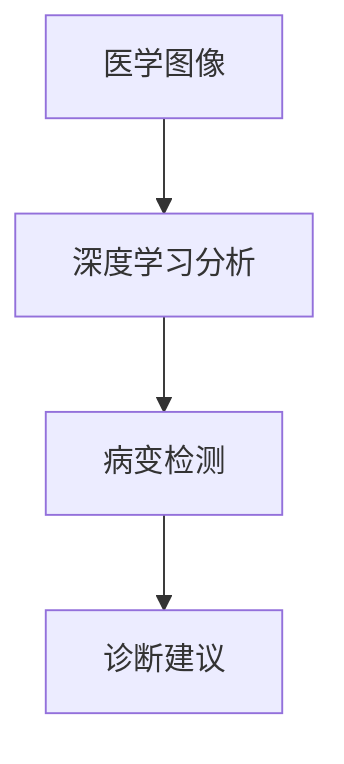

                 

### 人工智能概述

人工智能（Artificial Intelligence，简称AI）是计算机科学的一个分支，致力于使计算机系统能够模拟、扩展和辅助人类智能。自1956年达特茅斯会议上提出人工智能概念以来，人工智能已经经历了多个发展阶段，从最初的符号主义到基于概率和统计的学习方法，再到近年来深度学习的突破，人工智能在理论和实践上都取得了显著的进展。

**人工智能的定义与历史**

人工智能的定义随着技术的发展不断演变。传统上，人工智能被认为是一种模拟人类智能的计算机系统，包括推理、学习、知识表示、自然语言理解和问题解决等方面。随着技术的进步，人工智能的定义也逐渐扩展，包括自动化、自主决策、人机交互和智能感知等更多功能。

人工智能的历史可以分为几个关键阶段：

1. **1956年 - 1980年代：早期探索阶段**  
在这一阶段，人工智能研究者主要关注符号主义方法，通过符号操作和推理来模拟人类智能。这一时期的代表性工作包括约翰·麦卡锡（John McCarthy）提出的“逻辑理论家”（Logic Theorist）程序，它是第一个能够证明数学定理的计算机程序。

2. **1980年代 - 1990年代：知识工程和专家系统阶段**  
这一时期，人工智能研究集中在知识表示和知识推理上。专家系统成为研究的热点，通过模拟专家的知识和推理能力来解决问题。然而，专家系统的构建依赖于手工编写的规则和知识库，存在可扩展性和维护性问题。

3. **1990年代 - 2000年代：机器学习阶段**  
随着计算能力的提升和数据量的爆炸式增长，机器学习成为人工智能研究的主流。机器学习利用大量的数据来训练模型，从而实现自动化学习。这一阶段的代表性技术包括决策树、支持向量机和神经网络。

4. **2000年代至今：深度学习和大数据阶段**  
深度学习在2012年取得了突破性进展，尤其是在图像识别任务上。深度学习通过多层神经网络模拟人脑的神经元连接，能够自动提取特征并进行复杂的学习任务。随着大数据技术的应用，人工智能在各个领域取得了显著的成就，包括语音识别、自然语言处理和计算机视觉。

**人工智能的应用领域**

人工智能的应用领域广泛，包括但不限于以下几个方面：

1. **计算机视觉**  
计算机视觉是人工智能的一个重要分支，旨在使计算机能够理解和解释视觉信息。它广泛应用于图像识别、目标检测、人脸识别和视频分析等领域。

2. **自然语言处理**  
自然语言处理（NLP）致力于使计算机能够理解和生成人类语言。它包括文本分类、机器翻译、语音识别和问答系统等应用。

3. **机器翻译**  
机器翻译利用人工智能技术将一种语言的文本自动翻译成另一种语言。随着深度学习的发展，机器翻译的准确性和流畅性得到了显著提升。

4. **语音识别**  
语音识别是将语音转换为文本的技术。它广泛应用于语音助手、语音搜索和实时字幕生成等领域。

5. **博弈与决策**  
博弈和决策是人工智能在复杂系统中的应用，包括自动驾驶、智能游戏和供应链优化等。

6. **医疗健康**  
人工智能在医疗健康领域的应用包括疾病诊断、药物研发、医疗图像分析和个性化医疗等。

7. **金融科技**  
人工智能在金融科技领域用于风险管理、量化交易、信用评分和金融欺诈检测等。

8. **智能制造**  
人工智能在制造业中的应用包括智能制造系统、工业机器人和质量检测等。

9. **智能城市**  
智能城市利用人工智能技术优化城市管理和公共服务，包括智能交通、公共安全和智能环境监测等。

10. **教育**  
人工智能在教育领域的应用包括个性化学习、智能教学评估和学习行为分析等。

**总结**

人工智能是一个充满活力和挑战的领域，涵盖了从基础理论到应用开发的广泛内容。随着技术的不断进步，人工智能将在更多领域发挥重要作用，推动社会进步和经济发展的同时，也带来了新的伦理和社会问题。本文将深入探讨人工智能的七大研究领域，从基础理论到前沿应用，帮助读者全面了解人工智能的研究现状和发展趋势。在接下来的章节中，我们将逐一介绍人工智能的核心理论、应用领域和前沿研究，以期为读者提供一个清晰、系统的人工智能研究全景图。

### 机器学习基础

机器学习是人工智能的核心组成部分，它使计算机系统能够从数据中学习，进而进行预测和决策。机器学习的基本概念包括数据、模型和评估指标，这些要素共同构成了机器学习的基本框架。

**机器学习的基本概念**

1. **数据**：数据是机器学习的基石，机器学习的过程本质上是数据的处理过程。数据可以来自于各种来源，如传感器、网络日志、图像、文本等。数据的质量对机器学习的效果有着至关重要的影响，因此数据预处理和清洗是机器学习过程中的重要步骤。

2. **模型**：模型是机器学习算法的核心，它将数据映射到预期的输出。模型可以分为监督学习模型、无监督学习模型和强化学习模型。监督学习模型在有标记数据上进行训练，无监督学习模型在没有标记数据上进行训练，而强化学习模型通过与环境的交互进行学习。

3. **评估指标**：评估指标用于衡量模型的效果，常见的评估指标包括准确率、召回率、F1分数、均方误差（MSE）和交叉验证等。选择合适的评估指标对于评价和优化模型至关重要。

**监督学习**

监督学习是机器学习中应用最广泛的一种类型，它使用标记数据来训练模型，标记数据包含输入和相应的输出。监督学习的目标是找到一种映射关系，使得模型能够对新输入进行正确的预测。

1. **线性回归**：线性回归是最简单的监督学习模型，它通过拟合一个线性函数来预测输出。线性回归的数学模型可以表示为：
   $$
   y = \beta_0 + \beta_1x
   $$
   其中，$y$ 是预测的输出，$x$ 是输入特征，$\beta_0$ 和 $\beta_1$ 是模型的参数。

2. **逻辑回归**：逻辑回归是一种广义线性模型，用于分类问题。它的目标是通过拟合一个逻辑函数来预测输出概率。逻辑回归的数学模型可以表示为：
   $$
   \hat{y} = \frac{1}{1 + e^{-(\beta_0 + \beta_1x)}}
   $$
   其中，$\hat{y}$ 是预测的概率，$e$ 是自然对数的底数，$\beta_0$ 和 $\beta_1$ 是模型的参数。

3. **支持向量机（SVM）**：支持向量机是一种高效的分类算法，它通过找到一个最佳的超平面来分隔不同类别的数据点。SVM的核心思想是最大化分类边界的间隔。SVM的数学模型可以表示为：
   $$
   \min_{\beta, \beta_0} \frac{1}{2}||\beta||^2 + C \sum_{i=1}^{n} \xi_i
   $$
   其中，$\beta$ 和 $\beta_0$ 是模型的参数，$C$ 是惩罚参数，$\xi_i$ 是松弛变量。

**无监督学习**

无监督学习是在没有标记数据的情况下进行学习的，其目标是从未标记的数据中发现有用的结构和模式。无监督学习包括以下几种常见方法：

1. **聚类分析**：聚类分析将数据点划分为若干个簇，使得同一个簇内的数据点彼此相似，不同簇的数据点之间差异较大。常见的聚类算法包括K-均值聚类和层次聚类。

2. **主成分分析（PCA）**：主成分分析是一种降维技术，它通过将数据投影到新的坐标系中，来减少数据的维度。PCA的核心思想是找到数据的主要变异方向，即主成分，从而提取最重要的特征。

3. **自编码器**：自编码器是一种无监督学习模型，它通过自动编码器和解码器来学习数据的压缩表示。自编码器在许多应用中都有重要作用，如特征提取、数据去噪和生成模型等。

**强化学习**

强化学习是一种通过与环境互动进行学习的机器学习类型，其核心目标是找到一种策略，使代理能够最大化累积奖励。强化学习的数学模型可以表示为：
$$
Q(s, a) = r + \gamma \max_{a'} Q(s', a')
$$
其中，$Q(s, a)$ 是状态-动作值函数，$r$ 是立即奖励，$\gamma$ 是折扣因子，$s$ 是当前状态，$a$ 是当前动作，$s'$ 是下一状态，$a'$ 是下一动作。

强化学习包括以下几种常见算法：

1. **Q-学习**：Q-学习是一种基于值函数的强化学习算法，它通过迭代更新值函数来找到最佳策略。

2. **SARSA**：SARSA（State-Action-Reward-State-Action）是一种基于策略的强化学习算法，它通过同时更新当前状态和下一状态的值函数来学习最佳策略。

3. **深度Q网络（DQN）**：深度Q网络是一种结合深度学习和强化学习的算法，它通过深度神经网络来近似值函数。

**总结**

机器学习是人工智能研究的关键领域，涵盖了从基础算法到复杂应用的广泛内容。本文介绍了机器学习的基本概念、监督学习、无监督学习和强化学习的基本原理。通过对这些基本概念和算法的深入理解，读者可以更好地掌握机器学习的方法和应用。在接下来的章节中，我们将继续探讨深度学习的原理和应用，帮助读者进一步了解人工智能的研究前沿。

### 深度学习原理

深度学习是机器学习的一个重要分支，通过模拟人脑神经网络的结构和功能，使计算机能够自动学习和提取数据中的特征。深度学习在图像识别、自然语言处理和语音识别等领域取得了显著突破。本节将介绍深度学习的基本原理，包括神经网络基础、深度学习架构以及几种常见的深度学习模型。

**神经网络基础**

神经网络（Neural Networks，简称NN）是深度学习的基础。神经网络由大量相互连接的神经元组成，这些神经元通过权重和偏置进行信息传递和计算。神经网络的基本结构包括输入层、隐藏层和输出层。

1. **神经元的工作原理**  
每个神经元接收来自前一层神经元的输入信号，通过加权求和后加上偏置，然后通过一个激活函数进行转换。激活函数用于引入非线性特性，使神经网络能够学习和处理复杂的数据。常用的激活函数包括 sigmoid 函数、ReLU函数和 tanh 函数。

2. **前向传播与反向传播**  
神经网络通过前向传播计算输出值，再通过反向传播更新权重和偏置，以达到最优的模型参数。前向传播过程从输入层开始，将输入信号通过每层神经元的加权求和和激活函数处理后传递到输出层。反向传播过程从输出层开始，计算输出误差，并沿网络反向传播误差信号，通过梯度下降等优化算法更新权重和偏置。

**深度学习架构**

深度学习架构由多个神经网络层堆叠而成，形成深度神经网络（Deep Neural Networks，简称DNN）。深度学习架构的发展经历了从单层神经网络到多层神经网络的演变。

1. **卷积神经网络（CNN）**  
卷积神经网络是一种专门用于处理图像数据的深度学习模型。CNN通过卷积层、池化层和全连接层等结构来提取图像特征。卷积层使用卷积核（Convolutional Kernel）对输入图像进行卷积操作，从而提取局部特征；池化层通过下采样操作减少数据维度和参数数量；全连接层将卷积层和池化层提取的特征映射到具体的输出类别。

2. **循环神经网络（RNN）**  
循环神经网络是一种用于处理序列数据的深度学习模型。RNN通过循环结构保持对历史信息的记忆，能够处理变长的输入序列。RNN的基本结构包括输入门、遗忘门和输出门，这些门机制用于动态调整网络对当前输入和历史的依赖关系。

3. **长短期记忆网络（LSTM）**  
长短期记忆网络是RNN的一种改进，旨在解决传统RNN在处理长序列数据时出现的梯度消失和梯度爆炸问题。LSTM通过引入门控机制，使网络能够更好地记忆长期依赖信息，从而提高序列建模的准确性和稳定性。

4. **生成对抗网络（GAN）**  
生成对抗网络是一种由生成器和判别器组成的深度学习模型。生成器试图生成与真实数据相似的数据，而判别器则试图区分真实数据和生成数据。通过这种对抗性训练，生成器不断优化，从而生成越来越真实的数据。

**深度学习模型**

1. **卷积神经网络（CNN）**  
卷积神经网络通过卷积层、池化层和全连接层等结构来处理图像数据。以下是一个简单的CNN模型示例：

```
输入层：32x32x3（彩色图像）
卷积层1：32个卷积核，3x3，步长1，激活函数ReLU
池化层1：2x2，步长2
卷积层2：64个卷积核，3x3，步长1，激活函数ReLU
池化层2：2x2，步长2
全连接层1：1024个神经元，激活函数ReLU
全连接层2：10个神经元（10个类别），激活函数softmax
```

2. **循环神经网络（RNN）**  
循环神经网络通过隐藏状态和门控机制来处理序列数据。以下是一个简单的RNN模型示例：

```
输入层：t时刻的输入序列
隐藏状态：h(t) = \sigma(W_h * [h(t-1), x(t)] + b_h)
输出层：y(t) = \sigma(W_o * h(t) + b_o)
其中，\sigma表示激活函数，W_h和W_o分别为权重矩阵，b_h和b_o分别为偏置。
```

3. **长短期记忆网络（LSTM）**  
长短期记忆网络通过门控机制来处理长序列数据。以下是一个简单的LSTM模型示例：

```
输入层：t时刻的输入序列
遗忘门：f(t) = \sigma(W_f * [h(t-1), x(t)] + b_f)
输入门：i(t) = \sigma(W_i * [h(t-1), x(t)] + b_i)
新记忆：g(t) = \tanh(W_g * [h(t-1), x(t)] + b_g)
当前记忆：C(t) = f(t) \* C(t-1) + i(t) \* g(t)
隐藏状态：h(t) = \sigma(W_h * [C(t), h(t-1)] + b_h)
输出门：o(t) = \sigma(W_o * [h(t), x(t)] + b_o)
当前输出：y(t) = o(t) \* \sigma(W_o * h(t) + b_o)
其中，\sigma表示激活函数，W_f、W_i、W_g、W_h和W_o分别为权重矩阵，b_f、b_i、b_g、b_h和b_o分别为偏置。
```

4. **生成对抗网络（GAN）**  
生成对抗网络由生成器和判别器组成，通过对抗性训练生成真实数据。以下是一个简单的GAN模型示例：

```
生成器G：
输入：随机噪声z
输出：生成数据G(z)

判别器D：
输入：真实数据x或生成数据G(z)
输出：判别结果D(x)或D(G(z))

对抗性训练：
最小化对抗性损失函数L(G, D) = \frac{1}{2} \sum_{x \in X} ||D(x) - 1||^2 + \frac{1}{2} \sum_{z} ||D(G(z))||^2
```

**总结**

深度学习通过模拟人脑神经网络的结构和功能，实现了在图像识别、自然语言处理和语音识别等领域的突破性进展。本文介绍了深度学习的基本原理，包括神经网络基础、深度学习架构以及几种常见的深度学习模型。通过对这些原理和模型的深入理解，读者可以更好地掌握深度学习的方法和应用。在接下来的章节中，我们将进一步探讨深度学习在各个领域的应用，包括计算机视觉、自然语言处理和博弈与决策等。

### 计算机视觉

计算机视觉是人工智能的一个重要分支，致力于使计算机能够通过图像和视频获取信息，实现图像识别、目标检测、人脸识别和视觉追踪等功能。本节将详细介绍计算机视觉的基本概念、核心技术和应用。

**图像识别**

图像识别是指计算机通过算法自动识别和分类图像中的内容。常见的图像识别任务包括物体识别、场景识别和动作识别等。图像识别的核心是特征提取和分类。

1. **特征提取**：特征提取是将原始图像转换为具有区分性的向量表示的过程。常用的特征提取方法包括直方图、SIFT（尺度不变特征变换）和HOG（方向梯度直方图）等。

2. **分类算法**：分类算法用于将提取的特征映射到具体的类别。常见的分类算法包括K-均值聚类、支持向量机和神经网络等。

3. **卷积神经网络（CNN）**：CNN是一种专门用于图像识别的深度学习模型。CNN通过卷积层、池化层和全连接层等结构提取图像特征，实现高精度的图像分类。以下是一个简单的CNN模型示例：

```
输入层：32x32x3（彩色图像）
卷积层1：32个卷积核，3x3，步长1，激活函数ReLU
池化层1：2x2，步长2
卷积层2：64个卷积核，3x3，步长1，激活函数ReLU
池化层2：2x2，步长2
全连接层1：1024个神经元，激活函数ReLU
全连接层2：10个神经元（10个类别），激活函数softmax
```

**目标检测**

目标检测是指计算机在图像中定位并识别多个目标的位置和类别。目标检测通常包含两个步骤：目标定位和目标分类。

1. **目标定位**：目标定位通过边界框（Bounding Box）来表示目标的位置。常用的目标定位算法包括滑窗法、区域提议网络（RPN）和锚框生成等。

2. **目标分类**：目标分类用于判断边界框内的目标属于哪个类别。常用的目标分类算法包括支持向量机（SVM）、决策树和神经网络等。

3. **卷积神经网络（CNN）**：CNN通过卷积层、池化层和全连接层等结构实现目标检测。以下是一个简单的CNN模型示例：

```
输入层：32x32x3（彩色图像）
卷积层1：32个卷积核，3x3，步长1，激活函数ReLU
池化层1：2x2，步长2
卷积层2：64个卷积核，3x3，步长1，激活函数ReLU
池化层2：2x2，步长2
全连接层1：1024个神经元，激活函数ReLU
目标定位层：使用锚框生成和分类网络
```

**人脸识别**

人脸识别是指计算机通过算法自动识别和验证人脸的身份。人脸识别通常包含两个步骤：人脸检测和人脸特征提取。

1. **人脸检测**：人脸检测通过检测图像中的人脸区域。常用的人脸检测算法包括滑窗法、Haar特征分类器和深度学习模型等。

2. **人脸特征提取**：人脸特征提取通过提取人脸图像中的特征点或特征向量。常用的人脸特征提取算法包括LBP（局部分量矩）、PCA（主成分分析）和深度学习模型等。

3. **人脸识别算法**：人脸识别算法通过比较人脸特征向量实现人脸身份的验证。常用的人脸识别算法包括距离度量、神经网络和深度学习模型等。

**视觉追踪**

视觉追踪是指计算机在视频流中跟踪并识别特定目标。视觉追踪通常包含两个步骤：目标检测和目标跟踪。

1. **目标检测**：目标检测通过检测视频帧中的目标位置。常用的目标检测算法包括滑窗法、R-CNN和SSD等。

2. **目标跟踪**：目标跟踪通过建立目标的状态模型，预测目标在后续帧中的位置，并调整模型以适应目标的变化。常用的目标跟踪算法包括卡尔曼滤波、粒子滤波和深度学习模型等。

**总结**

计算机视觉是人工智能的重要应用领域，涵盖了从图像识别、目标检测到人脸识别和视觉追踪等多种任务。计算机视觉通过深度学习和传统算法的结合，实现了高精度的图像理解和智能识别。在接下来的章节中，我们将继续探讨计算机视觉在自然语言处理和博弈与决策等领域的应用，帮助读者全面了解计算机视觉的广泛应用和未来发展。通过本文的介绍，读者可以更好地理解计算机视觉的基本原理和应用，为未来的研究和实践打下坚实的基础。

### 自然语言处理

自然语言处理（Natural Language Processing，简称NLP）是人工智能领域的重要分支，旨在使计算机能够理解和生成人类语言。NLP在文本分类、机器翻译、语音识别和问答系统等方面有着广泛的应用。本节将详细探讨NLP的基本概念、核心技术和应用。

**文本分类**

文本分类是指将文本数据按照特定的标签进行分类的过程。文本分类广泛应用于垃圾邮件过滤、情感分析和社会媒体监测等领域。

1. **文本预处理**：文本预处理是文本分类的重要步骤，包括去除停用词、分词、词性标注和词嵌入等。

2. **特征提取**：特征提取是将文本转换为机器可以理解的向量表示。常用的特征提取方法包括TF-IDF、Word2Vec和BERT等。

3. **分类算法**：分类算法用于将文本映射到具体的标签。常用的分类算法包括朴素贝叶斯、支持向量机和深度学习模型等。

4. **卷积神经网络（CNN）**：CNN在文本分类任务中表现出色，通过卷积层和池化层提取文本特征，实现高效分类。以下是一个简单的CNN模型示例：

```
输入层：文本序列
卷积层1：多个卷积核，词嵌入维度，步长1，激活函数ReLU
池化层1：最大池化
全连接层：分类器，激活函数softmax
```

**机器翻译**

机器翻译是指将一种语言的文本自动翻译成另一种语言。随着深度学习的发展，神经机器翻译（Neural Machine Translation，简称NMT）成为机器翻译的主流方法。

1. **编码器-解码器（Encoder-Decoder）模型**：编码器-解码器模型通过将输入文本编码为一个固定长度的向量表示，然后解码为输出文本。以下是一个简单的编码器-解码器模型示例：

```
编码器：
输入：文本序列
输出：固定长度向量

解码器：
输入：固定长度向量
输出：文本序列
```

2. **注意力机制（Attention Mechanism）**：注意力机制用于捕捉编码器和解码器之间的长期依赖关系，提高翻译质量。以下是一个简单的注意力机制模型示例：

```
输入：编码器输出（h）
解码器输出：y
注意力分数：a_i = \sigma(W_a [h, y])
注意力权重：\alpha_i = \frac{e^{a_i}}{\sum_{j=1}^{T} e^{a_j}}
输出：\hat{h} = \sum_{i=1}^{T} \alpha_i h_i
```

3. **双向长短期记忆网络（BiLSTM）**：双向长短期记忆网络通过同时考虑编码器的正向和反向序列信息，提高翻译质量。以下是一个简单的BiLSTM模型示例：

```
编码器：
输入：文本序列
输出：隐藏状态序列

解码器：
输入：隐藏状态序列
输出：文本序列
```

**语音识别**

语音识别是指将语音信号转换为文本数据。语音识别通常包含两个步骤：语音特征提取和文本识别。

1. **特征提取**：特征提取是将语音信号转换为机器可以理解的向量表示。常用的特征提取方法包括梅尔频率倒谱系数（MFCC）、隐马尔可夫模型（HMM）和深度神经网络等。

2. **文本识别**：文本识别是通过分类算法将语音特征映射到具体的文本。常用的文本识别算法包括隐马尔可夫模型（HMM）、决策树和深度学习模型等。

3. **深度神经网络（DNN）**：深度神经网络在语音识别任务中表现出色，通过卷积层、循环层和全连接层等结构提取语音特征，实现高效识别。以下是一个简单的DNN模型示例：

```
输入层：语音特征
卷积层：多个卷积核，步长1，激活函数ReLU
循环层：LSTM，隐藏状态维度
全连接层：分类器，激活函数softmax
```

**问答系统**

问答系统是指计算机通过自然语言交互回答用户的问题。问答系统通常包含两个步骤：问题理解和答案生成。

1. **问题理解**：问题理解是将用户的问题转换为计算机可以理解的语义表示。常用的方法包括词向量表示、依存句法分析和语义角色标注等。

2. **答案生成**：答案生成是通过搜索和生成模型回答用户的问题。常用的方法包括模板匹配、实体链接和生成对抗网络（GAN）等。

3. **知识图谱**：知识图谱是一种将实体和关系表示为图结构的方法，用于辅助问答系统的理解和回答。知识图谱通过实体链接和关系推理提高问答系统的准确性和泛化能力。

**总结**

自然语言处理是人工智能领域的重要分支，涵盖了从文本分类、机器翻译到语音识别和问答系统等多种任务。自然语言处理通过深度学习和传统算法的结合，实现了对人类语言的深入理解和生成。在接下来的章节中，我们将继续探讨自然语言处理在计算机视觉和博弈与决策等领域的应用，帮助读者全面了解自然语言处理的广泛应用和未来发展。通过本文的介绍，读者可以更好地理解自然语言处理的基本原理和应用，为未来的研究和实践打下坚实的基础。

### 博弈与决策

博弈与决策是人工智能研究的重要领域，涉及到在不确定环境和竞争条件下，通过策略选择实现最佳效果。博弈论和决策理论是这一领域的基础，而强化学习则是一种通过不断与环境互动来优化策略的先进方法。

**博弈论基础**

博弈论（Game Theory）研究具有竞争性的决策过程，通过数学模型描述参与者在策略选择中的互动。博弈论的基本要素包括参与者（Players）、策略（Strategies）、支付（Payoffs）和均衡（Equilibria）。

1. **参与者**：博弈中的参与者可以是个人、团队或组织，每个参与者都有一定的策略选择。
2. **策略**：策略是参与者在博弈过程中可以选择的行动方案，可以是显式描述的，如博弈树中的决策路径，也可以是隐式的，如策略梯度。
3. **支付**：支付是参与者根据策略选择获得的收益或损失。支付通常取决于所有参与者的策略组合。
4. **均衡**：均衡是博弈中的一种稳定状态，表示参与者不再有激励去改变自己的策略。常见的均衡概念包括纳什均衡（Nash Equilibrium）和混合策略纳什均衡。

**强化学习在博弈中的应用**

强化学习（Reinforcement Learning，简称RL）是一种通过与环境互动来学习最优策略的机器学习方法。在博弈中，强化学习通过探索和利用策略，逐步优化决策过程。

1. **状态（State）**：状态是博弈中当前的环境条件，通常通过状态向量表示。
2. **动作（Action）**：动作是参与者可以采取的行动，通常通过动作空间表示。
3. **奖励（Reward）**：奖励是参与者采取特定动作后获得的即时收益，用于指导策略学习。
4. **策略（Policy）**：策略是参与者在给定状态下选择动作的概率分布，通过策略迭代优化策略。

**强化学习算法**

强化学习算法可以分为基于价值函数的方法和基于策略的方法。

1. **基于价值函数的方法**：基于价值函数的方法通过学习状态-动作价值函数来指导策略选择。常见的算法包括Q-学习（Q-Learning）和深度Q网络（Deep Q-Network，DQN）。

   - **Q-学习**：Q-学习通过更新状态-动作价值函数来优化策略。更新公式如下：
     $$
     Q(s, a) \leftarrow Q(s, a) + \alpha [r + \gamma \max_{a'} Q(s', a') - Q(s, a)]
     $$
     其中，$s$ 和 $s'$ 分别为当前状态和下一状态，$a$ 和 $a'$ 分别为当前动作和下一动作，$r$ 为立即奖励，$\gamma$ 为折扣因子，$\alpha$ 为学习率。

   - **DQN**：DQN通过深度神经网络来近似状态-动作价值函数。DQN的基本思想是利用经验回放和目标网络来减少值估计偏差。

2. **基于策略的方法**：基于策略的方法直接优化策略，通过策略迭代来优化策略。常见的算法包括策略梯度方法（Policy Gradient）和 actor-critic 方法。

   - **策略梯度方法**：策略梯度方法通过梯度下降更新策略参数，以最大化累积奖励。更新公式如下：
     $$
     \theta \leftarrow \theta - \alpha \nabla_{\theta} J(\theta)
     $$
     其中，$\theta$ 为策略参数，$J(\theta)$ 为策略损失函数。

   - **actor-critic 方法**：actor-critic 方法通过 actor 和 critic 两个网络分别优化策略和行为价值函数。actor 网络更新策略，而 critic 网络评估策略效果。

**决策理论**

决策理论（Decision Theory）研究在不确定条件下做出最优决策的方法。决策理论的基本概念包括期望值、概率和效用函数。

1. **期望值**：期望值是决策者在不确定性条件下做出决策的期望收益。期望值可以通过概率分布计算得到。
2. **概率**：概率是决策者对不确定性事件发生的可能性估计。概率可以通过数据分析和假设检验得到。
3. **效用函数**：效用函数是决策者对不同决策结果的偏好度量。效用函数可以通过主观评价和实际反馈得到。

**大数据决策支持系统**

大数据决策支持系统（Big Data Decision Support System，简称BDSS）是一种利用大数据技术进行决策分析和支持的系统。BDSS 通过数据采集、预处理、分析和可视化等步骤，提供决策者所需的洞察和建议。

1. **数据采集**：数据采集是从各种数据源收集相关信息，包括内部数据和外部数据。
2. **数据预处理**：数据预处理包括数据清洗、数据整合和数据转换，以提高数据质量和一致性。
3. **数据分析**：数据分析通过统计分析和数据挖掘技术提取数据中的有价值信息。
4. **数据可视化**：数据可视化是将数据分析结果以图表和可视化形式呈现，帮助决策者直观理解数据。

**总结**

博弈与决策是人工智能研究中的重要领域，涉及博弈论和决策理论的基础知识，以及强化学习在博弈中的应用。通过理解这些概念和算法，我们可以更好地设计智能决策系统，实现最优策略选择。在接下来的章节中，我们将进一步探讨智能交通系统、智能交通管理系统和自动驾驶等领域，展示人工智能在现实世界中的广泛应用和潜力。

### 智能交通系统

智能交通系统（Intelligent Transportation System，简称ITS）是利用人工智能、大数据、物联网和云计算等先进技术，对交通信息进行收集、处理和分析，从而优化交通管理和提高交通效率的系统。本节将详细探讨智能交通系统的基本概念、组成部分和应用。

**基本概念**

智能交通系统是一种集成多种交通设施和信息技术，通过实时监控和智能分析，实现交通流量管理、事故预警、路线优化和公共交通服务等目标。智能交通系统的核心是数据驱动的交通管理，通过数据采集、处理和分析，提供交通决策支持。

**组成部分**

智能交通系统由以下几个关键组成部分构成：

1. **交通信息采集**：交通信息采集是智能交通系统的数据来源，包括传感器、摄像头、GPS、RFID等技术，用于收集交通流量、车速、道路状况和交通事故等信息。

2. **交通信息处理**：交通信息处理是对采集到的交通数据进行存储、清洗、转换和整合的过程。通过交通信息处理，可以实现实时交通信息的更新和共享。

3. **交通信息分析**：交通信息分析是对处理后的交通数据进行分析和挖掘，以发现交通模式、预测交通流量变化和识别交通异常。交通信息分析包括数据挖掘、机器学习和统计分析等方法。

4. **交通信息发布**：交通信息发布是将处理和分析后的交通信息通过多种渠道（如互联网、手机应用、广播和电子显示牌等）传递给交通参与者，以帮助其做出更明智的出行决策。

5. **交通控制系统**：交通控制系统是智能交通系统的核心，包括信号灯控制、车辆检测、事故预警和交通指挥等功能。交通控制系统通过实时监控和智能分析，实现交通流量优化和事故快速处理。

**应用**

智能交通系统在多个领域有着广泛的应用，以下是一些关键应用场景：

1. **交通流量预测**：交通流量预测是智能交通系统的重要应用，通过分析历史交通数据和实时交通信息，预测未来的交通流量变化。交通流量预测可以用于交通信号控制、路线规划和交通诱导系统。

2. **智能导航**：智能导航系统通过实时交通信息和地图数据，为驾驶者提供最佳行驶路线。智能导航系统可以提高行驶效率和减少交通拥堵。

3. **自动驾驶**：自动驾驶技术是智能交通系统的重要发展方向，通过传感器、人工智能和通信技术，实现车辆自主行驶。自动驾驶技术有望大幅提高交通安全性和交通效率。

4. **智能交通管理系统**：智能交通管理系统（Intelligent Traffic Management System，简称ITMS）是智能交通系统的核心，通过集成交通信息采集、处理和分析，实现交通流量控制和事故管理。智能交通管理系统可以显著提高交通运行效率和安全性。

5. **公共交通服务**：智能交通系统通过优化公共交通路线和调度，提高公共交通的服务质量和运行效率。智能交通系统还可以提供实时公共交通信息，帮助乘客做出更明智的出行决策。

6. **道路安全监控**：智能交通系统通过摄像头、传感器和雷达等设备，实时监控道路状况和车辆行为，识别交通事故和违法行为，提高道路安全。

7. **紧急响应系统**：智能交通系统可以通过实时交通信息和紧急响应系统，实现事故快速处理和救援。紧急响应系统可以提高事故处理效率，减少事故损失。

**总结**

智能交通系统是利用人工智能技术优化交通管理和提高交通效率的重要系统。通过交通信息采集、处理和分析，智能交通系统可以实现交通流量预测、智能导航、自动驾驶、智能交通管理系统和公共交通服务等应用。在未来的发展中，智能交通系统将继续融合更多新技术，如大数据、物联网和5G通信等，以实现更加高效、安全和环保的交通系统。

### 智能交通管理系统

智能交通管理系统（Intelligent Traffic Management System，简称ITMS）是智能交通系统（ITS）的核心组成部分，通过集成交通信息采集、处理、分析和发布，实现对交通流量、交通信号和交通事故等交通要素的实时监控和管理。本节将详细探讨智能交通管理系统的基本概念、组成部分和关键技术。

**基本概念**

智能交通管理系统是一种基于信息技术和人工智能的综合性交通管理系统，旨在通过实时数据分析和智能决策，提高交通运行效率和安全性。智能交通管理系统集成了多种交通信息采集设备、通信网络、计算平台和软件系统，实现对交通状态的全方位监控和动态管理。

**组成部分**

智能交通管理系统由以下几个关键组成部分构成：

1. **交通信息采集**：交通信息采集是智能交通管理系统的数据来源，包括传感器、摄像头、GPS、RFID等技术，用于收集交通流量、车速、道路状况和交通事故等信息。

2. **交通信息处理**：交通信息处理是对采集到的交通数据进行存储、清洗、转换和整合的过程。通过交通信息处理，可以实现实时交通信息的更新和共享。

3. **交通信息分析**：交通信息分析是对处理后的交通数据进行分析和挖掘，以发现交通模式、预测交通流量变化和识别交通异常。交通信息分析包括数据挖掘、机器学习和统计分析等方法。

4. **交通信号控制**：交通信号控制是智能交通管理系统的重要组成部分，通过实时交通信息分析和智能算法，实现交通信号的动态调整，优化交通流量。常用的交通信号控制方法包括固定周期控制、自适应控制、绿波控制等。

5. **交通指挥中心**：交通指挥中心是智能交通管理系统的运营控制中心，通过集成多种交通信息和分析工具，实现对交通状态的实时监控和应急处理。交通指挥中心通常配备大型显示屏、监控系统、通信设备和指挥控制台。

6. **信息发布系统**：信息发布系统是将处理和分析后的交通信息通过多种渠道（如互联网、手机应用、广播和电子显示牌等）传递给交通参与者，以帮助其做出更明智的出行决策。

7. **数据分析与决策支持**：数据分析与决策支持系统是智能交通管理系统的智能核心，通过大数据分析和人工智能技术，提供交通运行状态分析和预测，为交通管理和政策制定提供科学依据。

**关键技术**

智能交通管理系统涉及多项关键技术的应用，以下是一些主要技术：

1. **交通流量预测**：交通流量预测是智能交通管理系统的重要应用，通过历史交通数据和实时交通信息，预测未来的交通流量变化。交通流量预测可以用于交通信号控制、路线规划和交通诱导系统。

2. **智能信号控制**：智能信号控制通过实时交通信息分析和自适应控制算法，动态调整交通信号周期和相位，以优化交通流量。智能信号控制可以显著提高交叉口通行效率和减少交通拥堵。

3. **视频监控与分析**：视频监控与分析技术通过摄像头和图像处理算法，实时监控道路状况和车辆行为，识别交通事故、违法行为和交通异常。视频监控与分析技术可以用于交通流量监控、事故预警和交通执法。

4. **大数据分析**：大数据分析技术通过对海量交通数据的挖掘和分析，发现交通运行模式和规律，为交通管理和政策制定提供数据支持。大数据分析技术包括数据预处理、数据挖掘、机器学习和数据可视化等。

5. **云计算与物联网**：云计算和物联网技术为智能交通管理系统提供了强大的计算能力和数据连接能力。通过云计算，可以实现交通数据的实时处理和存储，而物联网技术则可以实现交通信息的广泛采集和实时传输。

6. **移动应用与智能终端**：移动应用和智能终端技术为交通参与者提供了实时交通信息和出行建议。通过移动应用，驾驶者和乘客可以获取最新的交通状态、路线规划和导航服务。

**总结**

智能交通管理系统是利用信息技术和人工智能技术优化交通管理和提高交通效率的关键系统。通过交通信息采集、处理、分析和发布，智能交通管理系统可以实现交通流量预测、智能信号控制、视频监控与分析、大数据分析、云计算与物联网、移动应用与智能终端等多种应用。在未来的发展中，智能交通管理系统将继续融合更多新技术，如5G通信、边缘计算和人工智能等，以实现更加高效、安全和环保的交通管理系统。

### 智能交通系统的发展趋势

随着人工智能技术的不断进步，智能交通系统（ITS）正逐步从理论研究走向实际应用，并展现出强大的发展潜力。本文将从以下几个方面探讨智能交通系统的发展趋势：

**自动驾驶技术**

自动驾驶技术是智能交通系统的关键技术之一。自动驾驶车辆通过集成传感器、人工智能和通信技术，能够自主感知环境、规划路径并执行驾驶任务。随着自动驾驶技术的成熟，预计未来将逐步实现完全自动驾驶，从而大幅提高交通效率、减少交通事故，并缓解交通拥堵。自动驾驶技术的普及有望推动智能交通系统的全面发展。

**车联网与V2X通信**

车联网（Vehicle-to-Everything，简称V2X）是智能交通系统的核心基础设施。V2X通信技术通过车辆之间的互联互通，实现实时交通信息共享和协同控制。随着5G通信技术的推广，V2X通信将变得更加高效和可靠，进一步促进智能交通系统的集成和发展。未来，车联网将实现车辆与基础设施、车辆与车辆、车辆与行人等多维度的互联互通，为智能交通管理提供有力支持。

**大数据与人工智能**

大数据和人工智能技术在智能交通系统中的应用正日益广泛。通过对海量交通数据的挖掘和分析，可以实时了解交通状况、预测交通流量变化，并优化交通管理策略。未来，大数据和人工智能技术将继续推动智能交通系统的发展，使其具备更加智能的决策能力。例如，通过深度学习算法，可以开发出更加精准的交通流量预测模型，从而实现交通信号自适应控制和交通诱导系统。

**智能交通管理与控制**

智能交通管理系统（ITMS）是智能交通系统的关键组成部分。未来，智能交通管理将更加注重实时性和动态性，通过集成多种传感器和通信技术，实现交通状态的全面监控和智能调控。例如，自适应交通信号控制和智能交通诱导系统将得到广泛应用，从而提高交通通行效率和安全性。此外，基于人工智能的交通管理算法将不断优化，实现更加智能的交通管理。

**绿色交通与可持续发展**

智能交通系统的发展不仅关注交通效率，还注重环境保护和可持续发展。通过智能交通系统，可以实现交通需求的精准分析和优化，减少交通排放和能源消耗。例如，通过智能交通诱导系统，可以引导车辆选择绿色出行路线，减少碳排放。此外，电动汽车的普及和智能充电设施的布局也将进一步推动智能交通系统的发展，实现绿色交通目标。

**法律法规与标准化**

智能交通系统的发展离不开法律法规的规范和标准化。未来，随着智能交通技术的不断进步，将制定更加完善的法律和标准，确保智能交通系统的安全、可靠和可持续发展。例如，自动驾驶技术将需要明确的法律法规指导，以保障道路交通安全和公众利益。此外，智能交通系统的标准化工作也将得到加强，促进不同系统和设备之间的互操作性和兼容性。

**国际合作与交流**

智能交通系统的发展不仅依赖于技术创新，还需要国际间的合作与交流。未来，随着全球智能交通系统的快速发展，各国将加强合作，共同推进智能交通技术的研究和应用。通过国际合作，可以共享经验、技术和资源，推动智能交通系统的全球发展。

**总结**

智能交通系统是未来交通发展的重要方向，具有巨大的发展潜力和应用价值。通过自动驾驶技术、车联网与V2X通信、大数据与人工智能、智能交通管理与控制、绿色交通与可持续发展、法律法规与标准化、国际合作与交流等多方面的创新发展，智能交通系统将为未来交通带来更加高效、安全、环保和可持续的发展模式。

### 人工智能伦理

随着人工智能技术的迅速发展，其在各个领域的应用日益广泛，同时也引发了一系列伦理问题。人工智能伦理研究旨在探讨人工智能技术可能带来的道德和社会影响，以及如何制定相应的伦理规范和监管机制。本文将从以下几个方面探讨人工智能伦理问题、伦理原则、监管机制及其发展趋势。

**人工智能伦理问题**

1. **数据隐私**：人工智能系统依赖于大量数据，包括个人隐私数据。数据隐私问题涉及个人隐私权的保护，如何防止数据泄露、滥用和不当使用。

2. **算法公平性**：算法公平性是指算法在处理数据时是否公平、公正，不因性别、种族、年龄等因素产生歧视。例如，某些人工智能算法在招聘、贷款审批等应用中可能存在性别或种族歧视。

3. **安全性**：人工智能系统的安全性问题，包括算法漏洞、数据泄露和系统故障等，可能导致严重后果，如金融诈骗、医疗错误和交通事故等。

4. **责任归属**：在人工智能系统中，当出现问题时，如何确定责任归属？例如，自动驾驶汽车发生交通事故时，责任应由车主、制造商还是人工智能系统承担？

5. **就业影响**：人工智能技术的发展可能导致某些工作岗位的消失，从而引发社会就业问题。如何平衡人工智能带来的就业机会和失业风险，是人工智能伦理的重要议题。

**人工智能伦理原则**

1. **透明性**：人工智能系统的决策过程应该是透明的，用户能够了解系统的运行机制和决策依据。

2. **公平性**：人工智能系统应确保对所有用户公平对待，避免因算法偏见而产生歧视。

3. **可解释性**：人工智能系统应具备可解释性，使其决策过程可被理解、审查和改进。

4. **安全性**：人工智能系统应确保数据安全和系统稳定，防止数据泄露和系统故障。

5. **责任性**：人工智能系统的开发者、使用者和管理者应承担相应的责任，确保系统的合规性和道德性。

**人工智能伦理监管机制**

1. **法律法规**：通过制定相关法律法规，明确人工智能技术的应用范围、责任归属和数据保护要求。例如，《通用数据保护条例》（GDPR）和《加州消费者隐私法案》（CCPA）等。

2. **行业标准**：制定行业标准，规范人工智能技术的研发、测试和应用。行业标准可以包括算法透明性、数据安全和算法公平性等要求。

3. **伦理委员会**：设立独立的伦理委员会，负责审查人工智能项目的伦理问题，确保项目符合道德和法律要求。

4. **伦理审查**：在人工智能项目开发和应用过程中，进行伦理审查，确保项目不违反伦理原则和法律法规。

**发展趋势**

1. **伦理教育和培训**：加强对人工智能从业者的伦理教育和培训，提高其伦理意识和社会责任感。

2. **跨学科合作**：促进人工智能、伦理学、法律和社会学等学科的合作，共同探讨人工智能伦理问题。

3. **国际协作**：加强国际间的协作，共同制定全球性的人工智能伦理标准和规范。

4. **技术进步**：随着人工智能技术的不断进步，伦理问题也将日益复杂。未来，人工智能伦理研究将更加关注新兴技术和应用场景。

**总结**

人工智能伦理是人工智能发展中的重要议题，涉及数据隐私、算法公平性、安全性、责任归属和就业影响等方面。通过明确的伦理原则、监管机制和国际协作，我们可以确保人工智能技术的健康发展，同时保护公众利益和社会公平。在未来的发展中，人工智能伦理将继续受到关注，成为人工智能技术普及和应用的重要保障。

### 前沿研究

随着人工智能技术的快速发展，人工智能的研究领域不断拓展，新的理论、算法和应用场景不断涌现。以下将探讨人工智能的前沿研究领域，包括深度强化学习、迁移学习和联邦学习等，以及这些技术在实际应用中的最新进展。

**深度强化学习**

深度强化学习（Deep Reinforcement Learning，简称DRL）是强化学习与深度学习相结合的一种方法，通过深度神经网络来学习复杂的策略。DRL在多个领域取得了显著成果，例如自动驾驶、游戏和机器人控制。

1. **DRL在自动驾驶中的应用**：自动驾驶技术需要实时感知环境、做出决策并执行动作。DRL通过在模拟环境中训练，使得自动驾驶车辆能够学会在各种复杂路况下做出最优驾驶决策。例如，DeepMind开发的AlphaGo和AlphaGo Zero通过深度强化学习实现了围棋世界冠军的水平。

2. **DRL在游戏中的应用**：深度强化学习在游戏AI中表现出色，能够实现超越人类玩家的水平。例如，OpenAI开发的DRL算法Dota2 Agent在多人在线游戏Dota2中击败了职业玩家。

3. **DRL在机器人控制中的应用**：深度强化学习在机器人控制领域也有广泛应用，通过在模拟环境中训练，机器人能够学会在复杂环境中执行各种任务。例如，DeepMind开发的机器人能够通过深度强化学习实现自主导航、抓取和装配等任务。

**迁移学习**

迁移学习（Transfer Learning）是一种将知识从源域迁移到目标域的学习方法，通过利用预训练模型，提高模型在目标域上的表现。迁移学习在计算机视觉、自然语言处理和语音识别等领域取得了显著进展。

1. **迁移学习在计算机视觉中的应用**：在计算机视觉任务中，预训练模型（如ResNet、VGG）通过在大量数据上训练，可以获得丰富的特征提取能力。通过迁移学习，可以将这些预训练模型应用于不同的计算机视觉任务，如图像分类、目标检测和图像分割。

2. **迁移学习在自然语言处理中的应用**：在自然语言处理任务中，预训练模型（如BERT、GPT）通过在大量文本数据上训练，可以获得强大的语言理解和生成能力。通过迁移学习，可以将这些预训练模型应用于不同的自然语言处理任务，如文本分类、机器翻译和问答系统。

3. **迁移学习在语音识别中的应用**：在语音识别任务中，预训练模型（如Conformer、Transformer）通过在大量语音数据上训练，可以获得优秀的声学特征提取能力。通过迁移学习，可以将这些预训练模型应用于不同的语音识别任务，如语音识别和语音合成。

**联邦学习**

联邦学习（Federal Learning）是一种分布式机器学习方法，通过在不同设备上训练模型，然后聚合模型参数，实现全局模型的优化。联邦学习在保护用户隐私和降低数据传输成本方面具有显著优势。

1. **联邦学习在移动设备中的应用**：在移动设备上，联邦学习可以实现隐私保护的机器学习应用，如移动设备上的个性化推荐、异常检测和健康监测。

2. **联邦学习在物联网中的应用**：在物联网环境中，联邦学习可以应用于设备间的协同学习，如智能家居控制系统、智慧城市管理和工业物联网。

3. **联邦学习在医疗健康中的应用**：在医疗健康领域，联邦学习可以应用于隐私保护的医学图像分析、药物研发和个性化治疗。

**最新进展**

1. **自适应联邦学习**：自适应联邦学习通过动态调整模型更新策略，提高联邦学习的效率和效果。例如，FedAdapt算法通过自适应调整学习率，实现了更好的模型收敛速度。

2. **联邦学习在边缘计算中的应用**：边缘计算与联邦学习的结合，可以实现低延迟、高效率的边缘智能。例如，边缘联邦学习通过在边缘设备上训练模型，减少了数据传输时间和通信成本。

3. **联邦学习在多模态数据中的应用**：多模态数据（如文本、图像、音频）的联邦学习，可以通过融合不同模态的特征，提高模型的多样性和鲁棒性。

**总结**

人工智能的前沿研究涵盖了深度强化学习、迁移学习和联邦学习等多个领域，通过不断的技术创新，这些方法在自动驾驶、游戏、机器人控制、计算机视觉、自然语言处理和医疗健康等领域取得了显著进展。随着技术的进一步发展，人工智能将在更多领域发挥重要作用，推动社会进步和经济发展的同时，也带来了新的挑战和机遇。

### 人工智能研究的整体结构

人工智能研究是一个庞大且复杂的系统，涵盖了多个子领域和交叉学科，形成了多层次、多维度的研究结构。理解这一结构有助于更好地把握人工智能研究的全局，明确各个子领域之间的关系及其发展脉络。以下是对人工智能研究的整体结构进行逐步分析和解读。

**一、基础理论与算法**

1. **机器学习**：作为人工智能的核心，机器学习包括监督学习、无监督学习和强化学习等子领域，其基本算法如线性回归、决策树、支持向量机和神经网络等构成了人工智能算法的基础。

2. **深度学习**：深度学习是机器学习的一个重要分支，通过多层神经网络自动提取数据中的特征，实现复杂模式识别和预测。深度学习的核心包括卷积神经网络（CNN）、循环神经网络（RNN）、生成对抗网络（GAN）等。

3. **自然语言处理（NLP）**：NLP致力于使计算机理解和生成人类语言，涵盖词向量、句法分析、语义理解和对话系统等子领域。NLP的核心算法包括词嵌入、BERT、GPT等。

4. **计算机视觉**：计算机视觉通过算法使计算机能够理解和解释视觉信息，涉及图像识别、目标检测、人脸识别和视频分析等。计算机视觉的核心包括卷积神经网络、视觉感知模型等。

**二、应用领域**

1. **智能交通系统**：智能交通系统利用人工智能技术优化交通管理和提高交通效率，涵盖交通流量预测、智能导航、自动驾驶和智能交通管理系统等。

2. **医疗健康**：人工智能在医疗健康领域的应用包括疾病诊断、药物研发、医疗图像分析和个性化医疗等。医疗健康是人工智能的重要应用领域之一，具有巨大的社会价值。

3. **金融科技**：金融科技利用人工智能技术实现风险管理、量化交易、信用评分和金融欺诈检测等。金融科技的发展将大大提升金融服务的效率和质量。

4. **智能制造**：智能制造利用人工智能技术实现智能生产、质量检测和设备维护等。智能制造是工业4.0的重要组成部分，将推动制造业的全面升级。

5. **智能城市**：智能城市通过人工智能技术优化城市管理和服务，包括智能交通、公共安全和智能环境监测等。智能城市的发展将提升城市居民的生活质量和幸福感。

6. **教育**：人工智能在教育领域的应用包括个性化学习、智能教学评估和学习行为分析等。人工智能在教育中的应用将大大提高教育的质量和效率。

**三、交叉学科**

1. **认知科学**：认知科学关注人类认知过程和机制，为人工智能提供理论基础。认知科学的研究有助于理解人工智能的潜在发展方向和应用前景。

2. **神经科学**：神经科学研究大脑的结构和功能，为人工智能提供了生物基础的参考。通过神经科学的研究，可以更好地理解如何模拟人脑进行智能计算。

3. **心理学**：心理学研究人类行为和心理过程，为人工智能的交互设计和用户体验提供了重要依据。心理学的研究有助于人工智能更好地理解和适应人类用户的需求。

**四、关键技术和工具**

1. **大数据技术**：大数据技术为人工智能提供了海量数据的处理能力，是实现人工智能应用的重要基础设施。大数据技术包括数据采集、存储、处理和分析等。

2. **云计算与边缘计算**：云计算和边缘计算提供了强大的计算能力和灵活的部署方式，是人工智能应用的重要支撑。云计算和边缘计算的结合可以实现高效、低延迟的智能服务。

3. **深度学习框架**：深度学习框架（如TensorFlow、PyTorch）提供了方便的深度学习模型开发、训练和部署工具，是深度学习研究和应用的重要基础。

**五、发展趋势**

1. **跨学科融合**：随着人工智能技术的不断发展，跨学科融合将成为人工智能研究的重要趋势。跨学科研究将有助于解决人工智能面临的复杂问题和挑战。

2. **隐私保护与安全**：随着人工智能应用的普及，数据隐私和系统安全成为人工智能研究的重要议题。隐私保护和安全技术的进步将促进人工智能的健康发展。

3. **人机协作**：人机协作是人工智能未来的重要方向，通过人工智能技术辅助人类工作，提高工作效率和质量。人机协作将推动人工智能从自动化走向智能化。

**总结**

人工智能研究的整体结构涵盖了基础理论、应用领域、交叉学科、关键技术和工具等多个方面，形成了多层次、多维度的研究体系。通过逐步分析和解读，我们可以更好地理解人工智能研究的全局，明确各个子领域之间的关系及其发展脉络。在未来的发展中，人工智能将继续融合新技术、新理念，推动社会进步和经济发展的同时，也带来了新的挑战和机遇。

### 人工智能研究方法

人工智能研究方法多样，涵盖了数据驱动方法、理论驱动方法和跨学科研究方法。每种方法都有其独特的优势和应用场景，在人工智能研究中发挥着重要作用。以下将详细探讨这些方法，包括其定义、特点、应用场景和案例。

**数据驱动方法**

数据驱动方法是指通过收集和分析大量数据，利用统计和机器学习技术发现数据中的模式和规律，从而进行预测和决策。这种方法的核心在于数据的数量和质量，数据量越大、质量越高，模型的预测能力就越强。

1. **定义与特点**  
   数据驱动方法主要依赖于数据采集、数据预处理、特征工程、模型训练和模型评估等步骤。其特点包括：
   - **大量数据依赖**：数据驱动方法需要大量高质量的数据作为基础。
   - **自动特征提取**：通过机器学习算法，数据驱动方法能够自动提取数据中的特征，减少人工干预。
   - **适应性**：数据驱动方法能够根据新的数据进行模型更新，具有较高的适应性。

2. **应用场景**  
   数据驱动方法在各个领域都有广泛应用，包括：
   - **图像识别**：通过卷积神经网络（CNN）对大量图像进行训练，实现高精度的图像识别。
   - **自然语言处理**：通过词嵌入和循环神经网络（RNN）对大量文本进行训练，实现文本分类、机器翻译等任务。
   - **推荐系统**：通过协同过滤和深度学习算法，对用户行为数据进行分析，实现个性化推荐。

3. **案例**  
   - **图像识别**：谷歌的Inception模型通过大量图像数据进行训练，实现了高精度的图像识别。
   - **自然语言处理**：OpenAI的GPT-3模型通过大量文本数据进行训练，实现了强大的文本生成和翻译能力。
   - **推荐系统**：亚马逊的推荐系统通过分析用户购物行为数据，实现了个性化的商品推荐。

**理论驱动方法**

理论驱动方法是指通过构建数学模型和理论框架，对问题进行形式化和量化分析，从而推导出解决方案。这种方法的核心在于理论模型的构建和验证，依赖于数学和物理等基础学科的知识。

1. **定义与特点**  
   理论驱动方法主要包括建模、理论分析和验证等步骤。其特点包括：
   - **理论模型构建**：通过构建数学模型和理论框架，对问题进行形式化和量化分析。
   - **理论验证**：通过数学推导和实验验证，验证理论模型的准确性和适用性。
   - **严谨性**：理论驱动方法具有较高的科学性和严谨性。

2. **应用场景**  
   理论驱动方法在理论物理、工程科学和经济学等领域有广泛应用，包括：
   - **理论物理**：通过构建量子场论和统计物理模型，研究基本粒子和凝聚态现象。
   - **工程科学**：通过构建力学模型和优化算法，解决结构设计和控制系统优化问题。
   - **经济学**：通过构建宏观经济模型和微观经济模型，研究市场行为和经济增长。

3. **案例**  
   - **理论物理**：杨振宁和李政道通过理论模型推导，发现了宇称不守恒现象，为粒子物理学奠定了基础。
   - **工程科学**：达芬奇通过理论模型和实验验证，设计出了世界上第一架飞行器。
   - **经济学**：保罗·萨缪尔森通过构建宏观经济模型，提出了国民收入决定理论，对经济学的发展产生了深远影响。

**跨学科研究方法**

跨学科研究方法是指将不同学科的理论、方法和工具相结合，解决复杂问题的研究方法。跨学科研究方法强调多学科交叉和融合，通过综合不同领域的知识，实现创新性的研究成果。

1. **定义与特点**  
   跨学科研究方法的特点包括：
   - **多学科交叉**：通过结合不同学科的理论和方法，解决复杂问题。
   - **系统性**：跨学科研究方法注重系统性和整体性，从不同角度分析和解决问题。
   - **综合性**：跨学科研究方法通过综合分析，提供全面和系统的解决方案。

2. **应用场景**  
   跨学科研究方法在多个领域有广泛应用，包括：
   - **生物医学**：通过结合生物学、医学和工程学，开发新的医疗设备和治疗方法。
   - **环境科学**：通过结合生态学、气象学和物理学，研究环境问题并提供解决方案。
   - **社会问题**：通过结合经济学、心理学和社会学，研究社会问题并提出政策建议。

3. **案例**  
   - **生物医学**：CRISPR-Cas9基因编辑技术通过结合生物学、医学和工程学，实现了高效和精确的基因编辑。
   - **环境科学**：可持续发展模型通过结合生态学、气象学和物理学，提供了环境保护和资源利用的综合性解决方案。
   - **社会问题**：智慧城市建设通过结合城市规划、信息技术和社会科学，提高了城市管理的效率和居民生活质量。

**总结**

人工智能研究方法多样，包括数据驱动方法、理论驱动方法和跨学科研究方法。每种方法都有其独特的优势和应用场景，通过合理选择和结合这些方法，可以实现人工智能研究的深度和广度。在未来的发展中，人工智能研究方法将继续创新和融合，推动人工智能的全面发展和应用。

### 人工智能研究实例分析

人工智能技术在各个领域的应用已经取得了显著的成果，以下通过几个具体实例，分析人工智能在医疗、金融、制造业和智能城市等领域的实际应用，展示人工智能技术的强大潜力和广泛影响。

#### 医疗领域的应用

**医疗图像分析**

医疗图像分析是人工智能在医疗领域的重要应用之一。通过深度学习算法，人工智能可以自动识别和诊断医学图像中的病变区域，提高诊断的准确性和效率。

1. **图像预处理**

   医疗图像分析的第一步是图像预处理，包括去噪、增强和分割等操作。去噪和增强操作可以提升图像的质量，分割操作则将感兴趣的区域从背景中分离出来。

   ```mermaid
   graph TD
   A[图像去噪] --> B[图像增强]
   B --> C[图像分割]
   C --> D[病变区域检测]
   ```

2. **特征提取**

   在图像分割后，通过卷积神经网络（CNN）提取图像中的特征。这些特征用于训练分类模型，以识别不同类型的病变。

   ```mermaid
   graph TD
   C[图像分割] --> D[特征提取]
   D --> E[分类模型训练]
   ```

3. **模型训练与评估**

   使用大量的标注数据训练卷积神经网络模型，并通过交叉验证方法进行模型评估。训练过程包括前向传播和反向传播，以更新模型的权重和偏置。

   ```mermaid
   graph TD
   E[分类模型训练] --> F[交叉验证评估]
   ```

**个性化医疗**

个性化医疗通过分析患者的基因信息、生活习惯和医疗记录，为患者提供个性化的治疗方案。机器学习和深度学习算法在个性化医疗中发挥着关键作用。

1. **病历数据分析**

   通过自然语言处理（NLP）技术，对患者的病历数据进行分析，提取关键信息，如疾病类型、治疗历史和药物反应等。

   ```mermaid
   graph TD
   A[病历数据] --> B[NLP处理]
   B --> C[特征提取]
   ```

2. **药物敏感性预测**

   利用深度学习算法，通过分析患者的基因数据、疾病类型和治疗历史，预测患者对特定药物的敏感性。

   ```mermaid
   graph TD
   C[特征提取] --> D[药物敏感性预测]
   ```

**医疗图像分析**

通过深度学习模型对医学图像进行分析，如X光片、CT扫描和MRI图像，以识别早期病变和异常情况。



**案例解读**

以医疗图像分析为例，深度学习模型通过大量医疗图像数据训练，能够准确识别肺部结节、乳腺癌和脑部病变等。例如，谷歌的DeepMind公司开发了一种名为DeepMind Health的人工智能系统，能够自动分析眼科图像，诊断糖尿病视网膜病变的准确率达到了94%。

#### 金融领域的应用

**风险管理**

人工智能在金融领域用于风险管理，包括信用评分、市场预测和金融欺诈检测等。

1. **模型构建**

   利用机器学习和统计模型，分析大量历史金融数据，构建信用评分模型，预测借款人的信用风险。

   ```mermaid
   graph TD
   A[历史金融数据] --> B[机器学习模型]
   B --> C[信用评分]
   ```

2. **风险评估**

   通过分析借款人的信用记录、财务状况和行为数据，评估其信用风险，并制定相应的风险控制策略。

   ```mermaid
   graph TD
   C[信用评分] --> D[风险评估]
   ```

3. **风险控制**

   根据风险评估结果，金融机构可以采取相应的风险控制措施，如调整贷款利率、拒绝高风险借款人等。

   ```mermaid
   graph TD
   D[风险评估] --> E[风险控制策略]
   ```

**量化交易**

量化交易是指通过计算机算法自动执行交易策略，以获取投资回报。人工智能在量化交易中用于策略开发、风险管理和交易执行。

1. **数据预处理**

   收集和分析大量市场数据，如股票价格、交易量和宏观经济指标，进行数据预处理。

   ```mermaid
   graph TD
   A[市场数据] --> B[数据预处理]
   ```

2. **策略回测**

   使用历史数据对交易策略进行回测，评估策略的可行性和有效性。

   ```mermaid
   graph TD
   B[数据预处理] --> C[策略回测]
   ```

3. **实盘交易**

   将经过回测的有效交易策略应用于实盘交易，通过自动化交易系统实现盈利。

   ```mermaid
   graph TD
   C[策略回测] --> D[实盘交易]
   ```

**案例解读**

以量化交易为例，高频交易公司通过人工智能算法，实时分析市场数据，捕捉交易机会，实现快速交易。例如，对冲基金公司Two Sigma利用人工智能技术，通过分析市场数据，实现了超过20%的年化收益率。

#### 制造业领域的应用

**智能制造系统**

智能制造系统通过集成人工智能技术，实现生产过程的自动化、智能化和优化。

1. **数据采集与处理**

   使用传感器和物联网技术，收集生产过程中的各种数据，如设备状态、产品质量和能源消耗等。

   ```mermaid
   graph TD
   A[传感器数据] --> B[数据处理]
   ```

2. **制造过程优化**

   通过数据分析，发现生产过程中的瓶颈和问题，提出优化建议，提高生产效率和产品质量。

   ```mermaid
   graph TD
   B[数据处理] --> C[制造过程优化]
   ```

3. **产品质量检测**

   利用计算机视觉和机器学习算法，自动检测产品质量，识别缺陷和异常。

   ```mermaid
   graph TD
   C[制造过程优化] --> D[产品质量检测]
   ```

**工业机器人应用**

工业机器人通过人工智能技术，实现自动化的生产任务，如装配、焊接和搬运等。

1. **机器人编程与控制**

   使用编程语言和机器人控制算法，实现机器人的自动化编程和操作。

   ```mermaid
   graph TD
   A[编程语言] --> B[机器人控制算法]
   ```

2. **机器人视觉系统**

   通过计算机视觉技术，使机器人具备自主识别和定位能力，实现精确操作。

   ```mermaid
   graph TD
   B[机器人控制算法] --> C[机器人视觉系统]
   ```

3. **机器人协作安全**

   通过安全控制和协作算法，确保机器人和人类在共享工作空间中的安全协作。

   ```mermaid
   graph TD
   C[机器人视觉系统] --> D[机器人协作安全]
   ```

**案例解读**

以智能制造系统为例，汽车制造厂通过引入人工智能技术，实现了生产线的自动化和智能化。例如，福特汽车公司在生产线中引入了基于人工智能的机器人，实现了从装配到检测的全自动化，提高了生产效率和产品质量。

#### 智能城市中的应用

**城市交通管理**

智能交通系统通过人工智能技术，实现交通流量预测、智能导航和交通信号控制，提高城市交通效率和安全性。

1. **交通流量预测**

   通过分析历史交通数据和实时监控数据，预测未来交通流量变化，优化交通信号控制。

   ```mermaid
   graph TD
   A[历史交通数据] --> B[交通流量预测]
   ```

2. **智能导航**

   通过实时交通信息和地图数据，为驾驶者提供最佳行驶路线，减少交通拥堵。

   ```mermaid
   graph TD
   B[交通流量预测] --> C[智能导航]
   ```

3. **交通信号控制**

   通过自适应交通信号控制，动态调整交通信号周期和相位，提高交通流量。

   ```mermaid
   graph TD
   C[智能导航] --> D[交通信号控制]
   ```

**公共安全**

智能城市通过人工智能技术，实现视频监控、紧急响应系统和社交网络分析，提高公共安全水平。

1. **视频监控与分析**

   通过计算机视觉技术，自动分析视频监控数据，识别可疑行为和异常情况。

   ```mermaid
   graph TD
   A[视频监控数据] --> B[视频分析]
   ```

2. **紧急响应系统**

   通过实时监控和数据分析，实现紧急事件的快速响应和救援。

   ```mermaid
   graph TD
   B[视频分析] --> C[紧急响应系统]
   ```

3. **社交网络分析**

   通过分析社交媒体数据，预测社会治安趋势，制定相应的治安策略。

   ```mermaid
   graph TD
   C[紧急响应系统] --> D[社交网络分析]
   ```

**案例解读**

以智能交通系统为例，新加坡通过引入智能交通系统，实现了城市交通的高效管理。例如，新加坡的智能交通系统通过实时监控和数据分析，实现了交通信号自适应控制，减少了交通拥堵和事故发生率。

### 总结

人工智能技术在医疗、金融、制造业和智能城市等领域的实际应用，展示了其强大的潜力和广泛影响。通过实例分析，我们可以看到人工智能技术在不同领域的具体应用场景和实现方法，以及其在提高效率、优化决策和改善生活质量方面的重要作用。随着人工智能技术的不断进步，其在各个领域的应用将更加深入和广泛，为社会发展和进步带来更多机遇和挑战。

### 人工智能研究工具与平台

在人工智能（AI）的研究和开发过程中，选择合适的工具和平台至关重要。这些工具和平台不仅能够提供高效的计算资源，还能简化开发流程，加速研究进度。以下将介绍几种常用的AI研究工具与平台，包括深度学习框架、人工智能平台、算法库和数据预处理工具。

**深度学习框架**

深度学习框架是AI研究中不可或缺的工具，提供了丰富的API和库函数，帮助研究人员和开发者快速构建和训练深度学习模型。以下是一些主流的深度学习框架：

1. **TensorFlow**

   TensorFlow是Google开发的开源深度学习框架，具有灵活的模型构建能力和强大的生态系统。TensorFlow支持多种硬件平台，包括CPU、GPU和TPU，能够实现高效的模型训练和部署。

   ```mermaid
   graph TD
   A[安装与配置] --> B[TensorFlow基础]
   B --> C[模型构建与训练]
   C --> D[模型部署]
   ```

2. **PyTorch**

   PyTorch是Facebook开发的开源深度学习框架，以其动态计算图和易于理解的API而著称。PyTorch的动态计算图使其在开发过程中更加灵活，同时也支持GPU加速，提高了训练效率。

   ```mermaid
   graph TD
   A[安装与配置] --> B[PyTorch基础]
   B --> C[动态计算图]
   C --> D[模型训练与优化]
   ```

**人工智能平台**

人工智能平台提供了集成的开发环境、计算资源和数据管理功能，使研究人员和开发者能够更加便捷地进行AI研究和开发。以下是一些主流的人工智能平台：

1. **Google Cloud AI**

   Google Cloud AI提供了丰富的AI服务和工具，包括预训练模型、数据存储和机器学习工具等。Google Cloud AI支持TensorFlow、PyTorch和Scikit-learn等多种深度学习框架，能够满足不同研究需求。

   ```mermaid
   graph TD
   A[介绍] --> B[预训练模型]
   B --> C[数据存储与管理]
   C --> D[机器学习工具]
   ```

2. **AWS AI**

   AWS AI是Amazon Web Services提供的一整套AI服务，包括自然语言处理、计算机视觉、语音识别和推荐系统等。AWS AI支持多种深度学习框架，并提供强大的计算资源和云存储服务。

   ```mermaid
   graph TD
   A[介绍] --> B[自然语言处理]
   B --> C[计算机视觉]
   C --> D[语音识别]
   ```

**算法库**

算法库是AI研究中常用的工具，提供了各种算法的实现和优化，帮助研究人员快速实现和测试新的算法想法。以下是一些常用的算法库：

1. **Scikit-learn**

   Scikit-learn是一个开源的Python机器学习库，提供了广泛的机器学习算法，包括分类、回归、聚类和降维等。Scikit-learn具有良好的文档和社区支持，适用于各种机器学习应用。

   ```mermaid
   graph TD
   A[分类算法] --> B[回归算法]
   B --> C[聚类算法]
   C --> D[降维算法]
   ```

2. **Keras**

   Keras是一个高层次的深度学习框架，基于Theano和TensorFlow开发，提供了简洁易用的API。Keras支持多种深度学习模型，包括卷积神经网络、循环神经网络和生成对抗网络等。

   ```mermaid
   graph TD
   A[卷积神经网络] --> B[循环神经网络]
   B --> C[生成对抗网络]
   ```

**数据预处理工具**

数据预处理是AI研究中至关重要的一环，数据预处理工具可以帮助研究人员有效地清洗、转换和标准化数据，为后续的分析和建模做好准备。以下是一些常用的数据预处理工具：

1. **Pandas**

   Pandas是Python的一个开源数据分析和操作库，提供了丰富的数据结构（如DataFrame）和操作函数，适用于数据清洗、转换和合并等任务。

   ```mermaid
   graph TD
   A[数据清洗] --> B[数据转换]
   B --> C[数据合并]
   ```

2. **NumPy**

   NumPy是Python的一个开源科学计算库，提供了多维数组对象和丰富的数学函数，适用于数据预处理中的数值计算和操作。

   ```mermaid
   graph TD
   A[数组操作] --> B[数学函数]
   ```

**总结**

深度学习框架、人工智能平台、算法库和数据预处理工具是AI研究的重要基础，各自具有独特的功能和优势。选择合适的工具和平台，可以显著提高研究效率，加快模型开发和部署过程。在未来的AI研究中，这些工具和平台将继续发展和完善，为研究人员提供更加强大和便捷的支持。

### 人工智能研究社区

人工智能研究社区的繁荣与发展离不开各种学术期刊、会议、开源代码与数据集、在线课程与教程以及研究社区的支持。以下将详细探讨这些资源，并解释它们如何促进人工智能研究的交流与合作。

**学术期刊与会议**

学术期刊和会议是人工智能研究交流的重要平台，它们为研究人员提供了一个展示研究成果、分享前沿技术和讨论学术问题的地方。以下是一些知名的人工智能相关学术期刊和会议：

1. **学术期刊**
   - **IEEE Transactions on Artificial Intelligence**：这是一本由IEEE出版的顶级期刊，涵盖了人工智能的多个子领域，包括机器学习、计算机视觉、自然语言处理等。
   - **Journal of Artificial Intelligence Research**：这是一本开放获取的学术期刊，致力于发表人工智能领域的高质量研究论文。
   - **Neural Computation**：这本期刊专注于神经网络和计算神经科学的研究，是人工智能相关领域的重要出版物。

2. **会议**
   - **AAAI Conference on Artificial Intelligence**（AAAI）：这是人工智能领域最著名的国际会议之一，每年吸引全球顶尖的研究人员参与。
   - **Neural Information Processing Systems (NIPS)**：NIPS是深度学习和神经网络领域的顶级会议，每年的会议论文集都是人工智能研究的重要参考。
   - **International Conference on Machine Learning (ICML)**：ICML是机器学习领域的国际顶级会议，每年都吸引了大量机器学习领域的专家和研究者。

**开源代码与数据集**

开源代码和数据集是人工智能研究的重要资源，它们为研究人员提供了实验和验证模型的工具，促进了研究的透明性和可重复性。以下是一些知名的开源代码和数据集：

1. **开源代码**
   - **TensorFlow**：这是由Google开发的开源深度学习框架，提供了丰富的API和预训练模型，是深度学习研究的主要工具之一。
   - **PyTorch**：这是由Facebook开发的开源深度学习框架，以其灵活的动态计算图而受到广泛使用。

2. **数据集**
   - **ImageNet**：这是由微软研究院创建的大型视觉识别数据集，包含了数百万个标注的图像，是图像识别研究的重要资源。
   - **COCO**：这是计算机视觉研究的一个重要数据集，包含了大量标注的图像，涵盖了目标检测、分割和实例分割等多个任务。

**在线课程与教程**

在线课程和教程为人工智能研究人员提供了丰富的学习资源，使得学习者能够通过自学掌握最新的技术和方法。以下是一些知名的人工智能在线课程和教程：

1. **Coursera**：这是一个在线学习平台，提供了大量的计算机科学和人工智能相关课程，包括斯坦福大学的“机器学习”课程和DeepLearning.AI的“深度学习”课程。

2. **edX**：这是由哈佛大学和麻省理工学院合作创建的在线学习平台，提供了丰富的计算机科学和人工智能课程，包括“人工智能导论”和“深度学习”等。

3. **Udacity**：这是一个在线教育平台，提供了许多与人工智能相关的课程和项目，包括“深度学习工程师纳米学位”和“机器学习工程师纳米学位”。

**人工智能研究社区**

人工智能研究社区是研究人员交流与合作的重要场所，它们通过论坛、博客和社交媒体等渠道，促进了人工智能研究的进展和知识的传播。以下是一些知名的人工智能研究社区：

1. **AI Stack Exchange**：这是一个针对人工智能问题的问答社区，用户可以提出问题、回答问题和讨论技术问题。

2. **GitHub**：这是一个开源代码托管平台，许多人工智能项目都在GitHub上开源，研究人员可以通过GitHub进行代码共享和协作。

3. **arXiv**：这是人工智能领域的一个重要预印本平台，研究人员可以在这里发布他们的最新研究成果，与其他研究人员进行交流和讨论。

**总结**

学术期刊与会议、开源代码与数据集、在线课程与教程以及人工智能研究社区是人工智能研究的重要资源，它们共同促进了人工智能研究的交流与合作。通过这些资源，研究人员可以获取最新的研究成果、学习前沿的技术和方法，并与同行进行深入讨论和合作。在未来的发展中，这些资源将继续发挥重要作用，推动人工智能研究的不断进步。

### 人工智能研究伦理

人工智能伦理研究是确保人工智能（AI）技术安全、可靠和符合道德规范的重要领域。随着人工智能技术的快速发展，其潜在的社会影响和伦理挑战也越来越显著。本文将探讨人工智能伦理的定义、重要性和原则，以及现有的伦理监管机制。

**人工智能伦理的定义**

人工智能伦理是指研究人工智能系统设计、开发和应用过程中可能出现的道德和社会问题，旨在确保人工智能系统的安全、公正和透明。人工智能伦理涉及多个方面，包括数据隐私、算法公平性、安全性、责任归属和就业影响等。

**人工智能伦理的重要性**

1. **保护个人隐私**：人工智能系统通常依赖于大量个人数据，如医疗记录、社交媒体活动和在线行为数据。保护个人隐私是人工智能伦理的首要任务，确保数据不被滥用和泄露。

2. **确保算法公平性**：算法偏见可能导致歧视和不公平，影响就业、医疗保健、教育和金融等领域。因此，确保算法公平性是人工智能伦理的重要目标。

3. **保障系统安全性**：人工智能系统可能存在漏洞和安全隐患，导致数据泄露、系统故障和人为错误。保障系统安全性是防止潜在损害和风险的关键。

4. **明确责任归属**：在人工智能系统中，当出现错误或意外事件时，如何确定责任归属是一个复杂的问题。明确责任归属有助于确保人工智能系统的责任承担和改进。

5. **平衡技术创新与社会利益**：人工智能技术具有巨大的潜力，但同时也可能带来社会成本，如就业变化和社会不平等。因此，平衡技术创新与社会利益是人工智能伦理的重要任务。

**人工智能伦理的原则**

1. **透明性**：人工智能系统的决策过程应透明，用户应能够理解系统的运行机制和决策依据。

2. **公平性**：人工智能系统应确保对所有用户公平对待，避免因算法偏见而产生歧视。

3. **可解释性**：人工智能系统应具备可解释性，使其决策过程可被理解、审查和改进。

4. **安全性**：人工智能系统应确保数据安全和系统稳定，防止数据泄露和系统故障。

5. **责任性**：人工智能系统的开发者、使用者和管理者应承担相应的责任，确保系统的合规性和道德性。

**伦理监管机制**

1. **法律法规**：制定相关法律法规，明确人工智能技术的应用范围、责任归属和数据保护要求。例如，《通用数据保护条例》（GDPR）和《加州消费者隐私法案》（CCPA）等。

2. **行业标准**：制定行业标准，规范人工智能技术的研发、测试和应用。行业标准可以包括算法透明性、数据安全和算法公平性等要求。

3. **伦理委员会**：设立独立的伦理委员会，负责审查人工智能项目的伦理问题，确保项目符合道德和法律要求。

4. **伦理审查**：在人工智能项目开发和应用过程中，进行伦理审查，确保项目不违反伦理原则和法律法规。

**发展趋势**

1. **伦理教育和培训**：加强对人工智能从业者的伦理教育和培训，提高其伦理意识和社会责任感。

2. **跨学科合作**：促进人工智能、伦理学、法律和社会学等学科的合作，共同探讨人工智能伦理问题。

3. **国际协作**：加强国际间的协作，共同制定全球性的人工智能伦理标准和规范。

4. **技术进步**：随着人工智能技术的不断进步，伦理问题也将日益复杂。未来，人工智能伦理研究将更加关注新兴技术和应用场景。

**总结**

人工智能伦理研究旨在确保人工智能技术的安全、可靠和道德应用。通过明确的伦理原则和监管机制，我们可以确保人工智能技术的发展与社会的利益相一致，促进人工智能的可持续发展。在未来的发展中，人工智能伦理研究将继续受到关注，成为人工智能技术普及和应用的重要保障。

### 人工智能研究政策与法规

随着人工智能技术的快速发展，其在各个领域的应用日益广泛，也引发了一系列政策与法规的讨论和制定。人工智能研究政策与法规的制定，旨在保障人工智能技术的健康发展，规范其应用，并保护公众的利益。以下将分析人工智能研究政策与法规的发展、建设及国际协作现状。

**政策与法规的发展**

1. **国内政策与法规的发展**  
   中国在人工智能领域高度重视政策与法规的制定。2017年，国务院发布《新一代人工智能发展规划》，明确了人工智能发展的战略目标、重点任务和政策措施。此后，各部门和地方政府也相继发布了多项政策和法规，如《信息安全技术个人信息安全规范》和《数据安全管理办法（征求意见稿）》等。

2. **国外政策与法规的发展**  
   多个国家也制定了相应的人工智能政策与法规。例如，欧盟在2018年通过了《通用数据保护条例》（GDPR），对个人数据保护提出了严格要求。美国和英国等也制定了相关的人工智能伦理和监管框架，如美国国家人工智能倡议（National AI Initiative）和英国的人工智能伦理准则。

**法规的建设**

1. **数据保护法规**  
   数据是人工智能技术的基础，因此数据保护法规在人工智能法规建设中占据重要地位。数据保护法规主要涉及个人数据的收集、使用、存储和传输等方面的规范，确保个人隐私和数据安全。例如，GDPR和CCPA等法规对数据保护提出了严格的要求。

2. **算法透明性和公平性法规**  
   随着人工智能算法的广泛应用，算法的透明性和公平性成为法规建设的重要方向。法规旨在确保算法的透明性，使公众能够了解算法的运行机制和决策依据；同时，防止算法偏见和歧视，确保算法的公平性。

3. **安全和责任归属法规**  
   人工智能技术的应用涉及多种场景，如自动驾驶、医疗健康和金融等领域。因此，安全和责任归属成为法规建设的重要内容。法规需要明确人工智能系统的安全标准和责任归属，确保在出现问题时能够迅速应对和处理。

**国际协作**

1. **国际组织的作用**  
   国际组织在人工智能政策与法规的制定中发挥着重要作用。例如，联合国、经济合作与发展组织（OECD）和国际电信联盟（ITU）等组织发布了多项人工智能相关报告和指南，为各国制定政策提供了参考。

2. **多边合作**  
   多个国家通过多边合作，共同制定全球性的人工智能政策与法规。例如，美国、欧盟和中国在人工智能领域开展了多项合作，共同制定人工智能伦理和监管框架。

3. **国际会议和研讨会**  
   国际会议和研讨会是促进国际协作和知识共享的重要平台。例如，世界经济论坛（WEF）和联合国教科文组织（UNESCO）定期举办人工智能相关的国际会议，吸引了全球顶尖的专家和学者参与讨论。

**总结**

人工智能研究政策与法规的制定和建设，是确保人工智能技术安全、可靠和道德应用的重要措施。随着人工智能技术的不断发展和应用领域的扩展，政策与法规也需要不断更新和完善。通过国内外的协作和国际合作，可以共同推动人工智能技术的健康发展，为社会的进步和繁荣作出贡献。

### 人工智能研究国际合作与交流

人工智能（AI）研究国际合作与交流对于推动技术进步、促进知识共享和解决全球性挑战具有重要意义。以下将分析国际合作与交流的意义、形式以及具体案例，展示全球人工智能研究的协同作用。

**意义**

1. **知识共享**：国际合作与交流使得全球研究人员能够共享最新的研究成果、技术资源和研究经验，促进知识的快速传播和应用。

2. **资源整合**：国际合作可以实现资源的优化配置，通过跨国合作，整合全球范围内的计算资源、数据资源和人才资源，提高研究效率。

3. **技术突破**：国际合作能够促进不同学科、不同领域的交叉研究，激发创新思维，推动人工智能技术的重大突破。

4. **应对全球挑战**：人工智能技术在全球范围内面临诸多挑战，如伦理问题、隐私保护、安全性和标准化等。国际合作可以共同制定解决方案，应对这些挑战。

**形式**

1. **国际会议与研讨会**：国际会议和研讨会是促进AI研究国际合作与交流的重要形式。这些活动为全球研究者提供了一个交流平台，分享最新研究成果，讨论技术趋势和挑战。例如，国际机器学习会议（ICML）、神经信息处理系统会议（NIPS）和人工智能协会年会（AAAI）等。

2. **跨国研究项目**：跨国研究项目通过跨国团队合作，共同开展重大研究课题，推动技术进步。例如，欧盟的Horizon 2020计划和美国的国家人工智能研究计划（NAI），都涵盖了多个国家参与的重大研究项目。

3. **联合实验室**：联合实验室是国际合作的另一种形式，通过跨国合作，建立联合研究中心，共同开展研究。例如，谷歌和法国国立科学研究中心（CNRS）共同建立的巴黎深度学习研究中心（PARIS-DEEP），就是一个典型的联合实验室。

4. **国际组织**：国际组织在促进人工智能研究国际合作方面发挥着重要作用。例如，联合国教科文组织（UNESCO）通过国际科学理事会（ICSU）促进国际科学合作，世界工程组织国际联盟（WFEO）推动工程领域的国际合作。

**具体案例**

1. **人工智能伦理国际协作**：人工智能伦理问题在全球范围内受到广泛关注，国际协作在制定伦理规范和标准方面发挥了重要作用。例如，经济合作与发展组织（OECD）发布了《人工智能原则》，为各国制定人工智能伦理框架提供了指导。

2. **国际数据共享与开放**：数据是人工智能研究的关键资源，国际数据共享与开放项目如“地球观测组织”（Group on Earth Observations，GEO）和“开放知识基金会”（Open Knowledge Foundation）等，促进了全球数据资源的共享和应用。

3. **跨国研究合作**：例如，Google Brain和DeepMind等公司，与全球多个国家和地区的大学和研究机构开展了多项合作研究，共同推动人工智能技术的进步。

4. **人工智能教育国际交流**：例如，国际计算机科学联盟（ACM）和计算机科学教育委员会（CSEE）等组织，通过国际会议和培训项目，促进了全球计算机科学和人工智能教育的交流与合作。

**总结**

人工智能研究国际合作与交流是推动全球人工智能技术发展的重要力量。通过国际会议、跨国研究项目、联合实验室和国际组织等多种形式，全球研究者能够共同探讨技术前沿、解决共同挑战，推动人工智能技术的健康、可持续和协调发展。在未来，国际合作与交流将继续发挥关键作用，为全球人工智能研究提供强大的支持和动力。

### 人工智能研究未来展望

随着人工智能（AI）技术的迅猛发展，其对社会的各个方面产生了深远的影响。未来，人工智能将在多个领域继续发挥重要作用，推动社会进步和经济发展的同时，也带来一系列新的挑战和机遇。以下将从技术发展、社会影响、法律法规和教育培训等方面，探讨人工智能研究的未来趋势。

**技术发展**

1. **新型算法的研究**：随着计算能力和数据量的不断增加，新型算法的研究将成为人工智能技术发展的重点。例如，基于量子计算的深度学习算法、分布式学习算法和联邦学习算法等，有望在提升计算效率和模型性能方面取得重大突破。

2. **跨学科融合**：人工智能技术将继续与其他学科（如生物学、心理学、经济学等）融合，推动跨学科研究的发展。这种融合将有助于解决人工智能面临的复杂问题，实现更广泛的应用。

3. **边缘计算与云计算的结合**：边缘计算与云计算的结合，将为人工智能应用提供更高效和低延迟的计算环境。这种结合将推动智能交通系统、智能城市和智能制造等领域的发展。

4. **人机协作**：未来，人工智能将与人类更加紧密地协作，实现人机共生。通过人工智能技术，人类可以在复杂的任务中发挥创造力，而人工智能则可以处理大量重复性工作，提高生产效率和决策质量。

**社会影响**

1. **经济影响**：人工智能技术将在提升生产效率、降低运营成本和创造新的就业机会方面发挥重要作用。同时，人工智能也将带来就业结构的变化，一些传统岗位可能会被自动化取代，而新的职业和岗位也将随之出现。

2. **社会公平**：随着人工智能技术的普及，如何确保算法的公平性和透明性，避免因算法偏见导致的社会不公，将成为重要议题。因此，制定相应的伦理规范和法律法规，保障人工智能技术的公平应用，具有重要意义。

3. **教育与培训**：人工智能技术的快速发展，对教育体系提出了新的要求。未来，教育培训将更加注重人工智能相关知识的教学，培养具有人工智能素养的专业人才。

**法律法规**

1. **数据保护法规**：随着人工智能技术的应用，个人数据的收集、使用和保护成为重要议题。未来，各国将进一步完善数据保护法规，确保个人隐私和数据安全。

2. **算法透明性和公平性法规**：为确保人工智能系统的透明性和公平性，各国将制定相关的法规，规范算法的开发和应用。这些法规将包括算法的审查机制、责任归属和算法解释能力等要求。

3. **人工智能伦理法规**：随着人工智能技术的广泛应用，其伦理问题日益凸显。未来，各国将制定人工智能伦理法规，明确人工智能的应用范围和伦理原则，确保人工智能技术的道德应用。

**教育培训**

1. **人工智能教育**：未来，人工智能教育将更加普及，各级教育机构将加强人工智能相关课程的教学，培养学生的人工智能素养和创新能力。

2. **跨学科教育**：人工智能技术的跨学科特点，要求未来的教育体系更加注重跨学科教育，培养具备多学科知识和技能的复合型人才。

3. **终身学习**：随着技术的快速发展，人工智能领域的知识更新速度加快。未来，终身学习将成为重要趋势，人们需要不断更新知识，以适应快速变化的工作环境。

**总结**

人工智能研究未来将继续在技术发展、社会影响、法律法规和教育培训等方面取得重要进展。随着人工智能技术的不断进步，其在推动社会进步和经济发展的同时，也带来了一系列新的挑战和机遇。通过国际合作、技术创新和教育培训，我们可以更好地应对这些挑战，充分发挥人工智能技术的潜力，为人类社会创造更美好的未来。

### 人工智能研究教育与培训

人工智能（AI）技术的迅猛发展对社会和经济产生了深远的影响，使得具备人工智能知识和技能的人才需求日益增长。因此，人工智能研究教育和培训成为提高人工智能素养、培养专业人才的重要途径。以下将探讨人工智能教育的现状、培训与认证体系以及人工智能研究的未来发展方向。

**人工智能教育的现状**

1. **高等教育**：在全球范围内，许多高校已经设立了人工智能相关专业或课程，涵盖了机器学习、深度学习、计算机视觉和自然语言处理等领域。这些课程通常结合理论教学和实践项目，培养学生的人工智能基础和实际应用能力。

2. **继续教育**：随着人工智能技术的广泛应用，许多企业、机构和在线教育平台也提供了针对在职人员的继续教育课程。这些课程旨在帮助专业人士更新人工智能知识，提升其在工作中的竞争力。

3. **中小学教育**：为了培养未来的科技人才，一些国家和地区已经开始在中小学阶段引入人工智能教育，通过编程、机器人竞赛和项目实践等方式，激发学生的兴趣和创造力。

**培训与认证体系**

1. **专业认证**：许多机构和组织提供了人工智能专业认证，如微软的认证解决方案专家（MCAS）、谷歌的专业云认证和数据工程师认证等。这些认证有助于从业人员证明其专业能力和技术水平。

2. **在线学习平台**：在线学习平台如Coursera、edX和Udacity等，提供了丰富的在线课程和项目，涵盖人工智能的各个子领域。这些平台通常提供灵活的学习时间和个性化的学习路径，使学习者能够根据自身需求选择课程。

3. **企业内培训**：许多企业为了提升员工的人工智能技能，开展了内部培训项目。这些项目通常结合企业的具体需求，提供定制化的培训内容和实践机会。

**人工智能研究的未来发展方向**

1. **跨学科研究**：人工智能研究将继续与其他学科（如生物学、心理学、经济学等）融合，推动跨学科研究的发展。这种融合将有助于解决人工智能面临的复杂问题，实现更广泛的应用。

2. **教育普及**：随着人工智能技术的不断进步，教育普及将成为重要趋势。各级教育机构将加强人工智能相关课程的教学，培养学生的人工智能素养和创新能力。

3. **终身学习**：人工智能领域的知识更新速度加快，终身学习将成为重要趋势。人们需要不断更新知识，以适应快速变化的工作环境。

4. **人机协作**：未来，人工智能将与人类更加紧密地协作，实现人机共生。通过人工智能技术，人类可以在复杂的任务中发挥创造力，而人工智能则可以处理大量重复性工作，提高生产效率和决策质量。

**总结**

人工智能研究教育和培训是培养人工智能专业人才的重要途径。随着人工智能技术的不断进步，其在社会和经济中的重要性日益凸显。通过完善人工智能教育体系、建立专业认证体系以及推动跨学科研究和终身学习，我们可以更好地应对人工智能带来的挑战和机遇，推动人工智能技术的健康发展。在未来的发展中，人工智能研究教育将继续发挥关键作用，为培养具备人工智能素养和创新能力的人才提供有力支持。

### 人工智能研究伦理教育

人工智能研究伦理教育是确保人工智能（AI）技术安全、可靠和道德应用的重要环节。随着人工智能技术的迅猛发展，其伦理问题日益复杂，对从业者和研究者的伦理素养提出了更高的要求。以下将探讨人工智能研究伦理教育的意义、实践、教育目标和课程设置。

**意义**

1. **提高伦理意识**：人工智能研究伦理教育有助于提高从业者和研究者的

