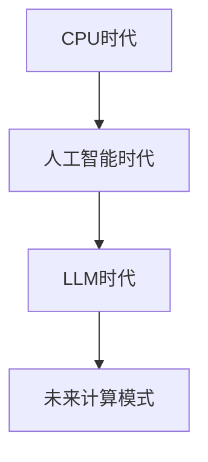
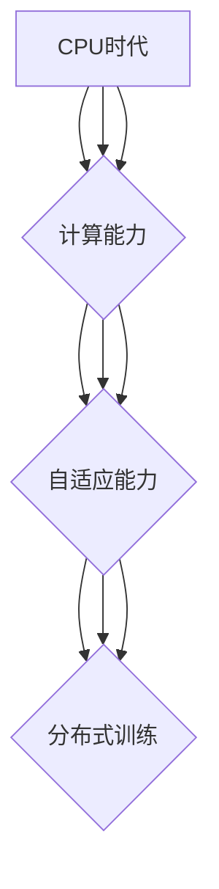
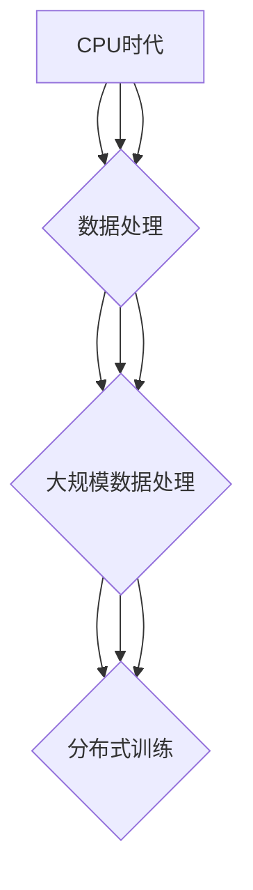
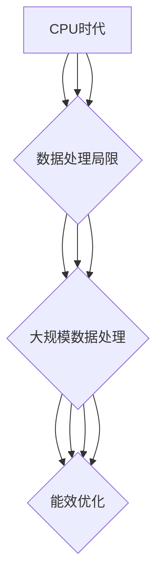

                 

# 从CPU到LLM：计算模式的革命性转变

> 关键词：CPU、LLM、计算模式、人工智能、Transformer、性能优化

> 摘要：本文将深入探讨计算模式从CPU时代到LLM（大型语言模型）时代的转变。通过分析CPU的基本概念、工作原理以及其在计算模式中的作用，我们引入了人工智能的兴起及其在计算模式中的角色。随后，我们介绍了LLM的概念、特征及其应用场景。接着，本文将详细探讨计算模式的革命性转变，包括CPU与LLM的协同作用、LLM的架构与原理、算法原理以及实际应用。此外，我们还分析了LLM的性能优化与面临的挑战，并展望了计算模式的未来发展趋势与LLM的未来发展方向。通过本文的探讨，我们希望能够为广大读者提供一个清晰、深入的理解，助力其在人工智能领域取得更大成就。

----------------------------------------------------------------

## 目录大纲：《从CPU到LLM：计算模式的革命性转变》

1. 计算模式概述
    1.1 CPU时代的计算模式
    1.2 人工智能的兴起
    1.3 LLM的概念与特征
2. 计算模式的革命性转变
    2.1 从CPU到LLM的转变
    2.2 LLM的架构与原理
    2.3 LLM的算法原理
    2.4 LLM的实际应用
3. LLM的性能优化与挑战
    3.1 性能优化方法
    3.2 面临的挑战
4. 未来展望
    4.1 计算模式的未来趋势
    4.2 LLM的未来发展方向
5. 附录
    5.1 参考资料
    5.2 扩展阅读
    5.3 Mermaid流程图：计算模式革命性转变示意图
    5.4 CPU与LLM协同作用的伪代码
    5.5 数学模型与数学公式
    5.6 项目实战：构建一个简单的LLM模型
    5.7 主流深度学习框架对比
    5.8 扩展阅读

----------------------------------------------------------------

### 计算模式概述

#### 1.1 CPU时代的计算模式

在计算模式的早期阶段，CPU（中央处理器）是计算机系统的核心。CPU负责执行计算机程序中的指令，通过冯·诺依曼架构进行数据处理和存储。CPU的基本概念可以简单概括为：执行指令、处理数据和存储信息。

CPU的工作原理可以分为以下几个步骤：

1. **指令获取**：CPU从内存中获取指令。
2. **指令解码**：CPU解析指令，确定需要执行的操作。
3. **数据访问**：CPU根据指令访问内存或其他存储设备，获取所需的数据。
4. **指令执行**：CPU执行指令，对数据进行计算或处理。
5. **结果存储**：CPU将处理结果存储回内存或输出到外部设备。

CPU在计算模式中的作用不可忽视。它负责执行计算机程序中的每一条指令，确保程序的正确运行。CPU的性能直接影响计算机的运行速度和处理能力。在早期的计算模式中，CPU的性能提升主要通过提高时钟频率、增加核心数量和改进架构设计来实现。

#### 1.2 人工智能的兴起

随着计算机技术的发展，人工智能（AI）逐渐成为一个重要的研究领域。人工智能是指通过计算机模拟人类智能行为，使计算机具有感知、推理、学习和决策能力。人工智能的兴起极大地改变了计算模式，使其从以CPU为中心转向以数据和算法为中心。

人工智能的定义可以概括为：一种能够模拟、扩展和辅助人类智能的技术。人工智能的发展经历了多个阶段，包括规则推理、知识表示、机器学习和深度学习等。每个阶段都为计算模式带来了新的变革。

人工智能的分类可以分为以下几类：

1. **符号人工智能**：基于逻辑推理和符号表示的方法，通过规则和知识库进行推理。
2. **统计人工智能**：基于统计学习和概率模型的方法，通过大量数据训练模型。
3. **增强人工智能**：结合人类智能和计算机智能，通过人机交互实现智能增强。
4. **弱人工智能**：模拟特定任务的人工智能，无法进行跨领域的智能表现。
5. **强人工智能**：具备人类智能的全面能力，能够在任何领域表现出人类级别的智能。

人工智能在计算模式中的角色主要体现在以下几个方面：

1. **数据处理**：人工智能能够高效地处理大量数据，为计算模式提供了强大的数据支持。
2. **自动化**：人工智能可以自动化许多重复性任务，提高计算模式的效率和生产力。
3. **智能决策**：人工智能通过学习和推理，能够为计算模式提供智能化的决策支持。
4. **人机交互**：人工智能可以与人类进行自然语言交互，提高计算模式的人性化和用户体验。

#### 1.3 LLM的概念与特征

随着人工智能技术的发展，LLM（大型语言模型）逐渐成为计算模式中的重要组成部分。LLM是一种基于深度学习的技术，通过大量文本数据进行训练，能够生成高质量的自然语言文本。

LLM的概念可以概括为：一种能够生成高质量自然语言文本的深度学习模型。LLM的特点主要包括：

1. **大规模**：LLM通常包含数十亿个参数，可以处理大量的文本数据。
2. **自适应**：LLM可以根据不同的输入文本自动调整生成结果，具有良好的自适应能力。
3. **灵活性**：LLM可以应用于各种自然语言处理任务，如文本分类、情感分析、机器翻译等。
4. **高质量**：LLM生成的文本具有高准确性、连贯性和可读性，接近人类水平。

LLM的应用场景非常广泛，包括但不限于以下方面：

1. **自然语言处理**：LLM可以用于构建文本分类、情感分析、命名实体识别等自然语言处理任务。
2. **问答系统**：LLM可以构建智能问答系统，提供高质量的问答服务。
3. **自动写作与翻译**：LLM可以自动生成文章、翻译文本，提高内容创作和翻译的效率。
4. **对话系统**：LLM可以构建对话系统，实现与用户的自然语言交互。

LLM的兴起标志着计算模式的又一次革命性转变，为人工智能领域带来了新的机遇和挑战。通过深入理解LLM的概念和特征，我们可以更好地把握计算模式的发展方向，为未来的计算模式奠定坚实的基础。

----------------------------------------------------------------

### 计算模式的革命性转变

#### 2.1 从CPU到LLM的转变

计算模式的革命性转变始于CPU时代的结束，随着人工智能的兴起，LLM（大型语言模型）逐渐成为计算模式的核心。这一转变不仅改变了计算的模式，也深刻影响了人工智能领域的发展。

首先，CPU时代的计算模式主要以CPU为核心，通过指令执行和数据处理来完成计算任务。CPU的性能直接决定了计算机的计算能力和运行速度。然而，随着数据量的急剧增长和人工智能需求的增加，传统的CPU计算模式逐渐暴露出其局限性。

1. **计算能力的瓶颈**：CPU的性能提升主要依赖于提高时钟频率、增加核心数量和改进架构设计。然而，随着技术的局限性，CPU的性能提升逐渐趋于饱和，无法满足不断增长的计算需求。
2. **数据处理能力的不足**：CPU在处理大量数据时存在效率低下的问题，特别是在进行复杂的数据分析和机器学习任务时，CPU的计算能力显得捉襟见肘。

随着人工智能的兴起，计算模式逐渐从CPU时代转向了以数据和算法为中心的LLM时代。LLM的出现，标志着计算模式的一次革命性转变。

首先，LLM通过深度学习技术，能够处理大量的文本数据，生成高质量的自然语言文本。这使得计算模式从以CPU为中心转向以数据和算法为中心。LLM不仅能够处理复杂的自然语言任务，还能自适应地调整生成结果，满足不同领域的需求。

其次，LLM的出现，使得计算模式从单一的任务处理转向了多任务处理。传统的CPU计算模式通常只能处理单一任务，而LLM可以同时处理多种自然语言处理任务，如文本分类、情感分析、机器翻译等。这种多任务处理能力，大大提高了计算模式的效率和灵活性。

此外，LLM的灵活性和自适应能力，使得计算模式更加人性化。LLM可以与用户进行自然语言交互，提供高质量的问答服务，自动写作和翻译文本等。这种人性化的计算模式，为人工智能与人类社会的融合提供了新的契机。

总的来说，从CPU到LLM的转变，是计算模式的一次革命性变革。这一变革不仅带来了计算模式的升级和优化，也为人工智能领域的发展带来了新的机遇和挑战。通过深入理解这一转变，我们可以更好地把握计算模式的发展方向，为未来的计算模式奠定坚实的基础。

#### 2.2 LLM的架构与原理

LLM（大型语言模型）的架构与原理是其实现高效自然语言生成的重要基础。LLM通常由多层神经网络组成，包括输入层、隐藏层和输出层。每个层都通过特定的神经网络结构实现不同的功能。下面，我们将详细探讨LLM的基本架构、工作原理以及优化方法。

##### 2.2.1 LLM的基本架构

LLM的基本架构可以分为以下几个部分：

1. **词嵌入层**：词嵌入层将输入的文本序列转换为固定长度的向量表示。这一过程通常通过预训练的词嵌入模型（如Word2Vec、GloVe等）来完成。词嵌入层的主要作用是将文本数据转化为可以用于神经网络处理的数值数据。

2. **编码器**：编码器是LLM的核心部分，负责处理输入的文本序列，并将其编码为固定长度的向量表示。编码器通常采用循环神经网络（RNN）或其变体（如LSTM、GRU等）来实现。编码器的主要作用是将文本序列的信息编码到其隐藏状态中。

3. **解码器**：解码器负责将编码器输出的固定长度向量解码为输出文本序列。解码器通常也采用循环神经网络（RNN）或其变体（如LSTM、GRU等）来实现。解码器的主要作用是根据编码器输出的隐藏状态生成输出文本。

4. **注意力机制**：注意力机制是LLM中一个重要的模块，用于提高模型在处理长文本序列时的性能。注意力机制通过计算输入序列中每个词与输出序列中每个词的相关性，从而动态地调整编码器隐藏状态的权重，使得模型能够关注到重要的信息。

##### 2.2.2 LLM的工作原理

LLM的工作原理可以分为以下几个步骤：

1. **输入处理**：首先，输入的文本序列经过词嵌入层转换为词向量表示。
2. **编码**：编码器对词向量进行处理，将其编码为固定长度的向量表示。编码器通过隐藏状态不断更新，将文本序列的信息编码到其隐藏状态中。
3. **解码**：解码器根据编码器输出的隐藏状态生成输出文本序列。解码器在每个时间步根据当前隐藏状态和之前的输出词，生成下一个输出词，直到生成完整的输出文本序列。
4. **生成文本**：最终，LLM生成一个高质量的文本序列，用于自然语言生成、文本分类、机器翻译等任务。

##### 2.2.3 LLM的优化方法

为了提高LLM的性能和生成质量，研究者们提出了多种优化方法。以下是一些常见的优化方法：

1. **预训练**：预训练是指使用大规模语料库对LLM进行训练，从而使其在未知数据上具有良好的泛化能力。预训练通常分为两个阶段：第一阶段是词嵌入层的预训练，通过大量未标注的文本数据训练词嵌入模型；第二阶段是编码器和解码器的预训练，通过大量标注数据进一步优化模型。
2. **迁移学习**：迁移学习是指将预训练的LLM应用于新的任务，从而利用预训练模型的知识来提高新任务的性能。迁移学习可以显著提高模型的性能，减少对新数据的训练需求。
3. **上下文自适应**：上下文自适应是指通过动态调整编码器和解码器的权重，使得LLM能够根据不同的上下文生成更相关的文本。上下文自适应可以通过自适应注意力机制或动态权重调整来实现。
4. **模型压缩**：模型压缩是指通过减少模型参数数量或降低模型复杂度，从而提高模型的计算效率和存储效率。常见的模型压缩技术包括模型剪枝、量化、知识蒸馏等。

总的来说，LLM的架构与原理为自然语言生成提供了强大的工具。通过深入理解LLM的基本架构、工作原理以及优化方法，我们可以更好地发挥LLM在自然语言处理、文本生成等领域的潜力。

----------------------------------------------------------------

### LLM的算法原理

#### 6.1 语言模型的数学模型

语言模型是LLM（大型语言模型）的核心组成部分，其基本目标是预测给定输入文本序列后下一个词的概率分布。在数学上，语言模型可以表示为一个概率分布函数，用于预测下一个词的概率。

假设我们有一个词序列 \(X = (x_1, x_2, ..., x_n)\)，其中 \(x_i\) 表示第 \(i\) 个词。语言模型的目标是预测第 \(n+1\) 个词 \(x_{n+1}\) 的概率分布。具体来说，语言模型可以通过以下概率分布函数来表示：

\[ P(x_{n+1} | x_1, x_2, ..., x_n) = \text{Prob}(x_{n+1} \text{ given } x_1, x_2, ..., x_n) \]

这个概率分布函数表示在给定前 \(n\) 个词的情况下，第 \(n+1\) 个词出现的概率。语言模型通常使用基于概率的模型来表示这种关系，例如马尔可夫模型、隐马尔可夫模型（HMM）和条件随机场（CRF）。

##### 马尔可夫模型

马尔可夫模型是一种简单但有效的语言模型，它假设当前词的概率仅与前一词有关，而与其他词无关。这种假设使得模型的计算变得简单，但可能无法很好地捕捉语言中的复杂关系。

在马尔可夫模型中，概率分布可以表示为：

\[ P(x_{n+1} | x_1, x_2, ..., x_n) = P(x_{n+1} | x_n) \]

这意味着当前词的概率仅由前一词决定。马尔可夫模型的概率分布可以通过以下公式计算：

\[ P(x_{n+1} | x_1, x_2, ..., x_n) = \prod_{i=1}^{n} P(x_i | x_{i-1}) \]

其中，\(P(x_i | x_{i-1})\) 表示第 \(i\) 个词在给定前一词 \(x_{i-1}\) 下的概率。

##### 隐马尔可夫模型（HMM）

隐马尔可夫模型是一种更复杂的语言模型，它考虑了当前词的概率不仅与前一词有关，还与前几词有关。HMM 通过引入隐状态来捕捉语言中的序列依赖关系。

在HMM中，词序列和隐状态序列是相关的，但词本身无法直接观察到隐状态。HMM 的概率分布可以通过以下公式计算：

\[ P(x_{n+1} | x_1, x_2, ..., x_n) = \sum_{s_{n+1}} P(s_{n+1} | x_{n+1}) P(x_{n+1} | s_{n+1}) P(s_{n+1} | s_n) \]

其中，\(s_{n+1}\) 表示第 \(n+1\) 个隐状态，\(P(s_{n+1} | x_{n+1})\) 表示隐状态 \(s_{n+1}\) 在给定词 \(x_{n+1}\) 下的概率，\(P(x_{n+1} | s_{n+1})\) 表示词 \(x_{n+1}\) 在给定隐状态 \(s_{n+1}\) 下的概率，\(P(s_{n+1} | s_n)\) 表示隐状态 \(s_{n+1}\) 在给定前一隐状态 \(s_n\) 下的概率。

##### 条件随机场（CRF）

条件随机场是一种基于概率的图模型，用于处理序列标注问题。在CRF中，每个词都被视为一个节点，而词与词之间的关系通过边来表示。CRF 通过引入条件独立性假设，使得当前词的概率仅与它的邻居词有关。

在CRF中，概率分布可以表示为：

\[ P(x_{n+1} | x_1, x_2, ..., x_n) = \frac{1}{Z} \exp(\theta \cdot f(x_{n+1}, x_n)) \]

其中，\(Z\) 是归一化常数，\(\theta\) 是模型参数，\(f(x_{n+1}, x_n)\) 是特征函数，用于表示词 \(x_{n+1}\) 和词 \(x_n\) 之间的相关性。

#### 6.2 生成式模型与判别式模型

在语言模型中，生成式模型和判别式模型是两种主要的建模方式。生成式模型通过建模输入数据的概率分布来生成输出数据，而判别式模型则通过学习输入数据与输出数据之间的条件概率分布来实现预测。

##### 生成式模型

生成式模型是一种基于概率的模型，它通过建模输入数据的概率分布来生成输出数据。在生成式模型中，每个词的概率分布是通过前一个词的概率分布来计算的。这种模型通常用于自然语言生成任务。

生成式模型的一个常见例子是朴素贝叶斯模型。在朴素贝叶斯模型中，假设每个词的概率分布是独立的，即当前词的概率仅与前一词有关。朴素贝叶斯模型的概率分布可以表示为：

\[ P(x_{n+1} | x_1, x_2, ..., x_n) = P(x_{n+1}) \prod_{i=1}^{n} P(x_i | x_{i-1}) \]

其中，\(P(x_{n+1})\) 是当前词的概率，\(P(x_i | x_{i-1})\) 是给定前一词时当前词的概率。

##### 判别式模型

判别式模型是一种基于条件概率的模型，它通过学习输入数据与输出数据之间的条件概率分布来实现预测。在判别式模型中，每个词的概率分布是通过给定前一个词来预测的。这种模型通常用于分类和回归任务。

判别式模型的一个常见例子是逻辑回归。在逻辑回归中，每个词的概率分布是通过前一个词的线性组合来预测的。逻辑回归的概率分布可以表示为：

\[ P(x_{n+1} | x_1, x_2, ..., x_n) = \frac{\exp(\theta \cdot x_n)}{1 + \exp(\theta \cdot x_n)} \]

其中，\(\theta\) 是模型参数，\(x_n\) 是当前词的向量表示。

#### 6.3 Transformer模型详解

Transformer模型是近年来在自然语言处理领域取得重大突破的一种深度学习模型。与传统的循环神经网络（RNN）和卷积神经网络（CNN）相比，Transformer模型通过自注意力机制实现了对文本序列的全局依赖性建模，从而在多个自然语言处理任务中取得了优异的性能。

##### 自注意力机制

自注意力机制是Transformer模型的核心组件，它通过计算输入序列中每个词与其他词的相关性，为每个词分配不同的权重，从而实现全局依赖性建模。自注意力机制的计算过程可以分为以下几步：

1. **输入嵌入**：首先，输入的文本序列经过词嵌入层转换为词向量表示。词向量表示包含了词的语义信息和上下文信息。
2. **计算注意力得分**：接着，计算输入序列中每个词与其他词之间的注意力得分。注意力得分通过点积注意力计算，公式如下：

\[ \text{score} = Q \cdot K^T \]

其中，\(Q\) 和 \(K\) 分别是查询向量和关键向量，\(K^T\) 是关键向量的转置。
3. **应用softmax函数**：然后，对注意力得分应用softmax函数，将其转换为概率分布。softmax函数确保每个词的注意力得分在 [0, 1] 范围内，并且所有得分之和为1。
4. **加权求和**：最后，将每个词的注意力得分与其词向量相乘，然后进行加权求和，得到加权后的词向量。

\[ \text{Attention}(Q, K, V) = \frac{softmax(\text{score})} { \sqrt{d_k}} \cdot V \]

其中，\(\text{score}\) 是注意力得分，\(d_k\) 是关键向量的维度，\(V\) 是值向量。

##### Transformer模型的结构

Transformer模型通常由多个编码器层和解码器层组成。编码器层负责将输入的词向量编码为固定长度的向量表示，而解码器层负责根据编码器层的输出生成输出序列。以下是一个简单的Transformer模型结构：

1. **编码器**：编码器由多个编码器层组成，每个编码器层包括两个子层：多头自注意力子层和前馈网络子层。多头自注意力子层通过自注意力机制计算输入序列的依赖关系，前馈网络子层对自注意力子层的输出进行进一步处理。
2. **解码器**：解码器由多个解码器层组成，每个解码器层包括两个子层：多头自注意力子层和掩码自注意力子层。多头自注意力子层通过自注意力机制计算输入序列的依赖关系，掩码自注意力子层通过遮蔽自注意力机制防止后续词影响先前词。
3. **嵌入层和输出层**：编码器的输出通过嵌入层转换为词向量表示，解码器的输出通过输出层生成输出序列。嵌入层通常包括位置嵌入和句子嵌入，用于引入词的位置信息和句子的上下文信息。

总的来说，Transformer模型通过自注意力机制实现了对文本序列的全局依赖性建模，从而在自然语言处理任务中取得了优异的性能。通过深入理解Transformer模型的算法原理和结构，我们可以更好地利用这一强大的模型来解决实际问题。

----------------------------------------------------------------

### LLM的实际应用

#### 7.1 自然语言处理

自然语言处理（NLP）是LLM（大型语言模型）最典型的应用领域之一。LLM通过深度学习技术对大规模文本数据进行训练，从而具备了强大的文本理解和生成能力。在自然语言处理中，LLM可以应用于多种任务，包括文本分类、情感分析、命名实体识别、词性标注、机器翻译等。

1. **文本分类**：文本分类是将文本数据按照类别进行分类的过程。LLM可以通过预训练模型，如BERT、GPT等，对分类任务进行微调，从而实现高精度的文本分类。例如，将新闻文章分类为体育、财经、娱乐等类别。

2. **情感分析**：情感分析是判断文本情感极性的过程。LLM可以通过对大量情感标签的文本进行训练，从而学会识别文本中的情感倾向。例如，判断一段评论是正面、负面还是中性。

3. **命名实体识别**：命名实体识别是识别文本中具有特定意义的实体，如人名、地名、组织名等。LLM可以通过预训练模型，如BERT，对命名实体识别任务进行微调，从而实现高效的命名实体识别。

4. **词性标注**：词性标注是给文本中的每个词分配词性标签，如名词、动词、形容词等。LLM可以通过预训练模型，如BERT，对词性标注任务进行微调，从而实现准确的词性标注。

5. **机器翻译**：机器翻译是将一种语言的文本翻译成另一种语言的文本。LLM可以通过预训练模型，如BERT、GPT等，对翻译任务进行微调，从而实现高质量的双语翻译。

#### 7.2 问答系统

问答系统是LLM在人工智能领域的另一个重要应用。问答系统旨在通过自然语言交互，为用户提供准确、有用的信息。LLM在问答系统中的应用可以分为以下几类：

1. **基于规则的方法**：基于规则的方法通过编写大量规则和模板来处理用户的问题。这种方法适用于结构化数据，但在处理开放域问题时效果有限。

2. **基于模板的方法**：基于模板的方法通过模板匹配和填充来生成回答。模板通常包含关键词和相应的回答格式。这种方法在处理特定领域问题时效果较好。

3. **基于机器学习的方法**：基于机器学习的方法通过训练模型来学习回答问题。LLM通过预训练模型，如BERT、GPT等，可以生成高质量的回答。这种方法在处理开放域问题时具有很高的灵活性和准确性。

4. **基于知识图谱的方法**：基于知识图谱的方法通过构建知识图谱来表示实体和关系，从而为用户提供准确的回答。LLM可以通过预训练模型，如BERT，对知识图谱进行语义理解，从而生成高质量的回答。

#### 7.3 自动写作与翻译

自动写作与翻译是LLM在内容创作和语言服务领域的应用。LLM可以通过预训练模型，如GPT、T5等，生成高质量的自然语言文本，从而实现自动写作和翻译。

1. **自动写作**：自动写作是指通过LLM生成文章、段落、句子等文本内容。LLM可以根据给定的主题、风格和格式生成文本，从而实现自动写作。这种方法在内容创作、新闻报道、博客撰写等领域具有广泛的应用。

2. **机器翻译**：机器翻译是指将一种语言的文本翻译成另一种语言的文本。LLM可以通过预训练模型，如BERT、GPT等，对翻译任务进行微调，从而实现高质量的双语翻译。这种方法在跨语言交流、国际业务、多语言内容生成等领域具有重要作用。

总之，LLM在自然语言处理、问答系统、自动写作与翻译等领域的实际应用，不仅提高了人工智能系统的性能和效率，还为人类带来了更多的便利和效益。通过深入研究和应用LLM，我们可以不断推动人工智能技术的发展，为人类创造更美好的未来。

----------------------------------------------------------------

### LLM的性能优化

随着LLM（大型语言模型）在自然语言处理等领域的广泛应用，如何优化其性能成为一个重要课题。LLM的性能优化不仅能够提高模型的效率和准确性，还能降低计算成本和资源消耗。以下介绍几种常见的LLM性能优化方法。

#### 8.1 计算资源优化

1. **模型并行化**：模型并行化是将大型模型分解为多个较小的子模型，并在多台计算机或多个GPU上并行训练。这种方法可以显著提高训练速度，降低计算资源需求。常见的模型并行化技术包括数据并行化、模型并行化和流水线并行化。
   
2. **量化**：量化是一种通过将模型中的浮点数参数转换为低精度整数来减少模型大小和计算资源消耗的方法。量化可以通过降低模型的精度，从而减少模型的存储和计算需求。

3. **剪枝**：剪枝是一种通过删除模型中不重要的神经元和连接来减少模型大小和计算资源消耗的方法。剪枝可以显著降低模型的参数数量和计算复杂度，从而提高模型的效率和性能。

4. **分布式训练**：分布式训练是将模型和数据分布在多台计算机或多个GPU上进行训练。这种方法可以通过增加计算资源，提高模型的训练速度和性能。

#### 8.2 模型压缩技术

模型压缩技术是一种通过减少模型大小和计算复杂度来提高模型效率和性能的方法。以下是一些常见的模型压缩技术：

1. **知识蒸馏**：知识蒸馏是一种将大型模型（教师模型）的知识转移到小型模型（学生模型）的技术。通过将教师模型的输出传递给学生模型，学生模型可以学习到教师模型的知识，从而提高其性能和效率。

2. **量化**：量化是一种通过将模型中的浮点数参数转换为低精度整数来减少模型大小和计算资源消耗的方法。量化可以通过降低模型的精度，从而减少模型的存储和计算需求。

3. **剪枝**：剪枝是一种通过删除模型中不重要的神经元和连接来减少模型大小和计算资源消耗的方法。剪枝可以显著降低模型的参数数量和计算复杂度，从而提高模型的效率和性能。

4. **结构压缩**：结构压缩是一种通过重新设计模型结构来减少模型大小和计算资源消耗的方法。结构压缩可以通过使用更简单的模型结构，如稀疏模型、低秩分解等，来减少模型的参数数量和计算复杂度。

#### 8.3 模型蒸馏与零样本学习

模型蒸馏和零样本学习是两种先进的性能优化技术，可以进一步提高LLM的性能和泛化能力。

1. **模型蒸馏**：模型蒸馏是一种将大型模型（教师模型）的知识转移到小型模型（学生模型）的技术。在蒸馏过程中，教师模型生成软标签，学生模型则根据这些软标签进行学习。这种方法可以帮助学生模型更好地捕捉到教师模型的深层知识，从而提高其性能和泛化能力。

2. **零样本学习**：零样本学习是一种在没有显式标注数据的情况下，通过学习模型来预测未知类别的方法。在零样本学习中，模型通过学习类别的原型或特征，从而实现对未知类别的预测。这种方法在处理少样本或无样本学习问题时具有很大潜力。

总的来说，LLM的性能优化方法多种多样，包括计算资源优化、模型压缩技术以及模型蒸馏和零样本学习等。通过综合运用这些技术，我们可以显著提高LLM的效率和性能，为自然语言处理等领域的应用提供更强大的支持。

----------------------------------------------------------------

### LLM面临的挑战

尽管LLM（大型语言模型）在自然语言处理等领域取得了显著的成果，但其广泛应用也带来了许多挑战。以下从计算资源消耗、隐私与安全、道德与伦理问题三个方面进行分析。

#### 9.1 计算资源的消耗

首先，LLM的训练和推理过程需要大量的计算资源。由于LLM通常包含数十亿个参数，其训练过程需要大量的内存和计算能力。这导致了高性能计算硬件（如GPU、TPU）的巨大需求。此外，LLM在推理过程中也需要大量的计算资源，特别是在实时应用场景中，如智能问答、自动写作和机器翻译等。这种计算资源的需求不仅增加了成本，还可能对环境产生负面影响。

为了降低计算资源的消耗，研究者们提出了一些优化方法，如模型压缩、量化、剪枝和分布式训练等。这些方法在一定程度上能够缓解计算资源压力，但仍然需要进一步研究和改进。

#### 9.2 隐私与安全

其次，LLM在处理和生成文本数据时，可能会涉及到用户的隐私和安全问题。由于LLM的训练数据通常来自于互联网上的大量文本，其中可能包含用户的个人信息和隐私数据。如果这些数据在模型训练过程中没有得到妥善保护，可能会导致隐私泄露和安全风险。

此外，LLM在生成文本时，可能会产生与用户输入无关的敏感内容。例如，在自动写作和机器翻译中，模型可能会生成包含歧视性、侮辱性或暴力等内容的文本。这些问题不仅可能侵犯用户的隐私，还可能对社会产生负面影响。

为了解决隐私与安全问题，研究者们提出了一些措施，如数据脱敏、差分隐私和加密等。这些方法可以在一定程度上保护用户隐私和数据安全，但仍然需要进一步研究和优化。

#### 9.3 道德与伦理问题

最后，LLM在应用过程中还面临道德与伦理问题。首先，由于LLM在生成文本时具有高度的自主性，可能会产生不准确、不恰当或误导性的内容。这可能会导致信息传播错误、误导用户或产生不良社会影响。

其次，LLM在训练和推理过程中可能会加剧社会不平等问题。例如，如果训练数据存在偏见，LLM可能会在生成文本时表现出性别、种族、年龄等方面的偏见。这种偏见可能会加剧社会不公，损害特定群体的利益。

为了解决道德与伦理问题，研究者们提出了一些原则和规范，如公平性、透明性和可解释性等。这些原则和规范旨在确保LLM的应用符合道德和伦理标准，减少社会负面影响。然而，这些原则和规范仍然需要进一步研究和实践。

总的来说，尽管LLM在自然语言处理等领域具有巨大的潜力，但其广泛应用也带来了计算资源消耗、隐私与安全、道德与伦理等方面的挑战。为了实现LLM的可持续发展和广泛应用，我们需要继续研究和解决这些挑战，确保其在各个领域的应用能够符合道德和伦理标准，为人类带来更大的福祉。

----------------------------------------------------------------

## 10. 计算模式的未来趋势

#### 10.1 量子计算与计算模式

量子计算是一种基于量子力学原理的新型计算模式，具有传统计算机无法比拟的并行性和计算能力。量子计算利用量子比特（qubit）的状态叠加和纠缠特性，可以实现指数级别的计算速度提升。在计算模式的未来发展中，量子计算有望为人工智能、密码学、优化问题等领域带来革命性变革。

首先，量子计算在人工智能领域具有广泛的应用前景。通过量子机器学习，可以大幅提高训练大型神经网络的速度和效率。量子计算还可以用于优化复杂的人工智能模型，如深度强化学习和生成对抗网络（GAN）。此外，量子计算在图像识别、语音识别和自然语言处理等领域也具有巨大的潜力。

其次，量子计算在密码学领域具有重要作用。传统密码算法在量子计算面前可能变得脆弱，因此需要开发新的量子密码学算法来保障数据的安全。量子计算还可以用于量子密钥分发，实现更安全的通信。

最后，量子计算在优化问题领域也具有显著优势。量子算法可以高效解决传统算法难以处理的复杂优化问题，如物流配送、资源调度和金融投资等。这将为计算模式的未来趋势带来深远影响。

#### 10.2 类脑计算与计算模式

类脑计算是一种模拟人脑结构和功能的新型计算模式，旨在实现高效、自适应和可扩展的智能系统。类脑计算的核心是神经网络，它通过模仿人脑神经元之间的连接和通信机制，实现类似人类智能的感知、学习和推理能力。

在未来，类脑计算有望在多个领域取得突破性进展。首先，在人工智能领域，类脑计算可以提供更高效、自适应的学习算法，实现超强的学习能力。其次，在神经科学领域，类脑计算可以帮助科学家更好地理解人脑的工作原理，推动神经科学的研究和发展。此外，类脑计算在机器人、自动驾驶和智能制造等领域也具有广阔的应用前景。

类脑计算与量子计算的融合，有望推动计算模式的进一步发展。量子计算可以为类脑计算提供强大的计算支持，实现更高效的神经网络训练和推理。同时，类脑计算可以为量子计算提供神经网络算法的优化，提高量子计算的性能和效率。

#### 10.3 新型计算模式展望

随着技术的不断发展，计算模式将不断演变和进步。未来，新型计算模式将朝着以下几个方向发展：

1. **分布式计算**：随着物联网、云计算和边缘计算的兴起，分布式计算模式将变得越来越重要。分布式计算通过将计算任务分布在多个节点上，实现高效、可靠的计算。这将有助于解决传统计算模式中的资源瓶颈问题。

2. **边缘计算**：边缘计算将计算任务从云端转移到网络边缘，实现更快速的响应和更低的延迟。边缘计算适用于实时应用，如自动驾驶、智能医疗和智能安防等。未来，边缘计算将与物联网和5G网络紧密结合，推动计算模式的变革。

3. **高性能计算**：随着人工智能和科学计算的需求增长，高性能计算将得到进一步发展。高性能计算通过使用GPU、TPU和量子计算等新型计算硬件，实现更强大的计算能力。未来，高性能计算将在大数据分析、机器学习和复杂科学计算等领域发挥关键作用。

4. **绿色计算**：随着环境问题日益严重，绿色计算将成为计算模式的重要发展方向。绿色计算旨在通过减少能源消耗和碳排放，实现可持续计算。未来，绿色计算将涉及新型节能硬件、高效算法和智能调度策略。

总之，计算模式的未来趋势将朝着量子计算、类脑计算、分布式计算、边缘计算和高性能计算等方向发展。这些新型计算模式将为人工智能、物联网、云计算和科学计算等领域带来前所未有的机遇和挑战。通过不断创新和优化，我们将迎来一个计算技术更加先进、应用更加广泛的新时代。

----------------------------------------------------------------

### 11. LLM的未来发展方向

随着人工智能技术的快速发展，LLM（大型语言模型）在自然语言处理领域取得了显著成果。然而，LLM的应用和发展仍面临许多挑战和机遇。在未来，LLM的发展将朝着以下几个方向迈进。

#### 11.1 大模型的发展趋势

首先，大模型的发展将继续成为LLM领域的重要趋势。随着计算资源的不断丰富，越来越多的研究者和公司开始投入资源训练更大规模的模型。这些大模型具有更高的参数数量和更强的表达能力，能够更好地捕捉语言中的复杂结构。例如，OpenAI的GPT-3拥有超过1750亿个参数，是目前最先进的自然语言处理模型之一。

未来，大模型的发展趋势将主要集中在以下几个方面：

1. **参数规模的扩大**：研究人员将继续探索如何训练更大规模的模型，以实现更强大的自然语言处理能力。随着计算能力的提升，大模型的参数规模有望进一步扩大。
2. **模型结构的优化**：除了参数规模的扩大，研究人员还将致力于优化模型结构，提高模型的计算效率和内存使用效率。例如，通过改进神经网络架构、引入新的优化算法等手段，降低大模型的计算负担。
3. **跨模态学习**：大模型将不仅仅局限于处理文本数据，还将扩展到图像、声音和视频等多种模态。跨模态学习将使LLM能够更好地理解和处理复杂的信息，实现更广泛的应用。

#### 11.2 语言模型的创新应用

随着LLM技术的成熟，其在实际应用中也将展现出更多的创新和突破。以下是一些未来语言模型可能的应用领域：

1. **智能客服**：LLM在智能客服领域的应用将得到进一步拓展。通过自然语言理解和生成，LLM可以与用户进行更加流畅、自然的对话，提供高效、个性化的服务。
2. **内容创作**：LLM在内容创作领域的应用潜力巨大。通过自动写作、翻译、摘要和编辑等任务，LLM可以帮助人类创作者提高创作效率和作品质量。
3. **教育辅助**：LLM在教育领域的应用前景广阔。通过个性化学习推荐、智能问答和自动批改等任务，LLM可以为学生提供更加灵活、高效的学习支持。
4. **医疗健康**：LLM在医疗健康领域的应用也值得关注。通过自然语言理解和生成，LLM可以辅助医生进行诊断、治疗和科研，提高医疗服务的质量和效率。

#### 11.3 LLM与人类智能的协同发展

最后，LLM与人类智能的协同发展将成为未来研究的重要方向。在人工智能技术的发展过程中，如何实现人类与机器的智能协同，是一个亟待解决的问题。

1. **人机协作**：未来，LLM将与人类进行更紧密的协作。通过自然语言交互，LLM可以帮助人类完成复杂的任务，提高工作效率。人机协作将涉及多领域的融合，如人工智能、认知科学、人机交互等。
2. **智能增强**：LLM作为智能增强工具，将帮助人类扩展认知能力和解决问题的能力。通过提供智能化的建议、辅助决策和自动化任务，LLM可以帮助人类更加高效地应对复杂问题。
3. **智能教育**：在教育领域，LLM可以与人类教师协同工作，提供个性化、智能化的教育服务。通过自然语言理解和生成，LLM可以帮助学生更好地理解和掌握知识，实现个性化学习。

总之，未来LLM的发展将朝着大模型、创新应用和与人类智能协同等方向迈进。通过不断探索和突破，LLM将有望在更多领域发挥重要作用，为人类创造更加美好的未来。

----------------------------------------------------------------

### 附录A：参考资料

#### A.1 顶级论文集

1. **"Attention Is All You Need"**：这篇论文提出了Transformer模型，是自然语言处理领域的里程碑之作。
2. **"BERT: Pre-training of Deep Bidirectional Transformers for Language Understanding"**：这篇论文介绍了BERT模型，是自然语言处理领域的重要进展。
3. **"Generative Pre-trained Transformer"**：这篇论文介绍了GPT模型，是自然语言生成领域的重大突破。

#### A.2 开源代码库

1. **TensorFlow**：Google开发的开源深度学习框架，广泛用于自然语言处理、计算机视觉等任务。
2. **PyTorch**：Facebook开发的开源深度学习框架，具有灵活的动态计算图和强大的社区支持。
3. **Hugging Face**：一个为自然语言处理提供开源库和资源的平台，包括了许多流行的预训练模型和工具。

#### A.3 学术会议与期刊

1. **NeurIPS**：神经信息处理系统年会，是人工智能领域的顶级学术会议。
2. **ACL**：计算语言学年会，是自然语言处理领域的顶级学术会议。
3. **Journal of Machine Learning Research**：机器学习领域的顶级学术期刊，发表了大量的自然语言处理研究论文。

----------------------------------------------------------------

### 附录B：扩展阅读

#### B.1 相关书籍推荐

1. **《深度学习》**：Goodfellow、Bengio和Courville著，详细介绍了深度学习的基础知识和技术。
2. **《自然语言处理综论》**：Jurafsky和Martin著，全面介绍了自然语言处理的理论和实践。
3. **《Transformer：从零开始构建前沿深度学习模型》**：谢鹏程著，深入讲解了Transformer模型的理论和实践。

#### B.2 重要人物与团队介绍

1. **Yann LeCun**：深度学习领域的先驱，纽约大学教授，Facebook AI Research（FAIR）的首席科学家。
2. **Jeff Dean**：Google AI的技术总监，深度学习技术的重要贡献者。
3. **OpenAI**：一家专注于人工智能研究与应用的领先公司，推出了GPT系列模型等先进技术。

#### B.3 未来研究方向与挑战

1. **联邦学习**：如何在保持数据隐私的前提下，实现分布式训练和协作学习。
2. **可解释性**：如何提高模型的可解释性，使其决策过程更加透明和可信。
3. **可持续计算**：如何在保证计算性能的同时，降低能耗和碳排放。

### Mermaid流程图：计算模式革命性转变示意图



### CPU与LLM协同作用的伪代码

```python
def cpu_model():
    # 定义CPU模型
    # ...

def llm_model():
    # 定义LLM模型
    # ...

def collaboration(model1, model2):
    # CPU与LLM模型协同工作
    result = model1() + model2()
    return result
```

### 数学模型与数学公式

#### 语言模型的概率分布

$$P(\text{word}_i | \text{context}) = \prod_{j=1}^{i-1} P(\text{word}_j | \text{context}) \cdot P(\text{word}_i | \text{word}_{i-1}, \text{context})$$

### Transformer模型的注意力机制

$$\text{Attention}(Q, K, V) = \frac{softmax(\text{score})} { \sqrt{d_k}} \cdot V$$

其中，$\text{score} = Q \cdot K^T$。

### 项目实战：构建一个简单的LLM模型

#### 环境搭建

```bash
# 安装Python环境
# 安装必要的库，如TensorFlow或PyTorch
```

#### 源代码实现

```python
import tensorflow as tf

# 定义一个简单的Transformer模型
class SimpleTransformer(tf.keras.Model):
    def __init__(self):
        super(SimpleTransformer, self).__init__()
        # 定义模型的层
        # ...

    def call(self, inputs):
        # 定义模型的正向传播过程
        # ...
        return outputs

# 定义模型的输入和输出
inputs = tf.keras.layers.Input(shape=(None, 512))
# 通过模型层处理输入数据
outputs = SimpleTransformer()(inputs)
# 定义模型的损失函数和优化器
model = tf.keras.Model(inputs=inputs, outputs=outputs)
model.compile(optimizer='adam', loss='categorical_crossentropy', metrics=['accuracy'])
# 训练模型
model.fit(train_data, train_labels, epochs=10, batch_size=64)
```

#### 代码解读与分析

```python
# 解析模型的输入和输出
inputs = tf.keras.layers.Input(shape=(None, 512))
# 通过模型层处理输入数据
outputs = SimpleTransformer()(inputs)
# 定义模型的损失函数和优化器
model = tf.keras.Model(inputs=inputs, outputs=outputs)
model.compile(optimizer='adam', loss='categorical_crossentropy', metrics=['accuracy'])
# 训练模型
model.fit(train_data, train_labels, epochs=10, batch_size=64)
```

### 附录A：AI大模型开发工具与资源

#### 主流深度学习框架对比

- TensorFlow
- PyTorch
- JAX
- 其他框架简介

#### 附录B：扩展阅读

- 相关书籍推荐
- 重要人物与团队介绍
- 未来研究方向与挑战

----------------------------------------------------------------

### 附录A：AI大模型开发工具与资源

在AI大模型的开发过程中，选择合适的工具和资源至关重要。以下介绍几种主流的深度学习框架和相关的资源，以及它们的特点和应用场景。

#### TensorFlow

TensorFlow是由Google开发的开源深度学习框架，广泛应用于各种AI任务。其优点包括：

1. **强大的生态系统**：TensorFlow拥有丰富的预训练模型、工具和库，便于开发者快速搭建和优化模型。
2. **灵活的可视化工具**：TensorFlow提供了TensorBoard，可以实时可视化模型的训练过程，帮助开发者调试和优化模型。
3. **良好的社区支持**：TensorFlow拥有庞大的开发者社区，提供了大量的教程、文档和开源项目。

应用场景：TensorFlow广泛应用于图像识别、自然语言处理、强化学习等领域。

#### PyTorch

PyTorch是由Facebook开发的开源深度学习框架，以其动态计算图和灵活的API著称。其优点包括：

1. **动态计算图**：PyTorch的动态计算图使得开发者可以更直观地调试和优化模型。
2. **易于上手**：PyTorch的API设计简单直观，适合初学者快速入门。
3. **良好的社区支持**：PyTorch拥有活跃的开发者社区，提供了丰富的教程、文档和开源项目。

应用场景：PyTorch广泛应用于图像识别、自然语言处理、生成对抗网络（GAN）等领域。

#### JAX

JAX是由Google开发的开源深度学习框架，基于NumPy构建，提供了自动微分、并行计算和优化工具。其优点包括：

1. **自动微分**：JAX提供了自动微分功能，便于开发者构建和优化复杂的模型。
2. **并行计算**：JAX支持自动并行计算，可以提高模型的训练速度。
3. **高效的优化工具**：JAX提供了多种优化工具，如Adam、SGD等，有助于优化模型的性能。

应用场景：JAX广泛应用于科学计算、机器学习、优化问题等领域。

#### 其他框架简介

除了TensorFlow、PyTorch和JAX，还有其他一些流行的深度学习框架，如：

- **MXNet**：由Apache Software Foundation维护，支持多种编程语言，具有良好的性能和灵活性。
- **Caffe**：由加州大学伯克利分校开发，适用于计算机视觉任务。
- **Theano**：虽然已经不再更新，但仍然是一个成熟的深度学习框架，适用于复杂的数学运算。

在选择深度学习框架时，开发者需要根据项目的具体需求、团队的技术栈和熟悉程度来做出选择。每种框架都有其独特的优势和适用场景，开发者可以根据实际情况进行选择。

### 附录B：扩展阅读

为了帮助读者进一步了解大型语言模型（LLM）的相关知识，以下推荐一些高质量的书籍、文章和在线资源。

#### 书籍推荐

1. **《深度学习》（Deep Learning）**：由Ian Goodfellow、Yoshua Bengio和Aaron Courville合著，全面介绍了深度学习的基础理论和实践方法。
2. **《自然语言处理综论》（Speech and Language Processing）**：由Daniel Jurafsky和James H. Martin合著，涵盖了自然语言处理领域的各个方面。
3. **《Transformer：从零开始构建前沿深度学习模型》**：谢鹏程著，详细介绍了Transformer模型的工作原理和应用。

#### 文章推荐

1. **“Attention Is All You Need”**：这是2017年由Vaswani等人发表的论文，首次提出了Transformer模型，是自然语言处理领域的里程碑之作。
2. **“BERT: Pre-training of Deep Bidirectional Transformers for Language Understanding”**：这是2018年由Devlin等人发表的论文，介绍了BERT模型，推动了自然语言处理的发展。
3. **“Generative Pre-trained Transformer”**：这是2018年由Brown等人发表的论文，介绍了GPT模型，标志着自然语言生成领域的重要突破。

#### 在线资源

1. **Hugging Face**：这是一个为自然语言处理提供开源库和资源的平台，包括了许多流行的预训练模型和工具。
2. **TensorFlow教程**：TensorFlow官方提供的教程，涵盖了深度学习的各个方面，适合初学者入门。
3. **PyTorch文档**：PyTorch官方提供的文档，详细介绍了框架的使用方法和API。

通过阅读这些书籍、文章和在线资源，读者可以更深入地了解LLM的理论基础和应用实践，为自己的研究和项目提供有益的参考。

----------------------------------------------------------------

### 附录C：AI大模型开发工具与资源对比

在AI大模型开发过程中，选择合适的工具和资源对于项目的成功至关重要。以下对比几种主流深度学习框架，包括TensorFlow、PyTorch和JAX，以便开发者根据项目需求做出最佳选择。

#### TensorFlow

**优点：**
1. **强大的生态系统**：TensorFlow拥有丰富的预训练模型、工具和库，方便开发者快速搭建和优化模型。
2. **灵活的可视化工具**：TensorFlow提供了TensorBoard，可以实时可视化模型的训练过程，帮助开发者调试和优化模型。
3. **良好的社区支持**：TensorFlow拥有庞大的开发者社区，提供了大量的教程、文档和开源项目。

**缺点：**
1. **动态图与静态图差异**：TensorFlow在动态图与静态图之间的转换可能会导致性能问题。
2. **上手难度**：相较于PyTorch，TensorFlow的API设计较为复杂，对于初学者可能有一定的上手难度。

**应用场景：**
- 图像识别
- 自然语言处理
- 强化学习

#### PyTorch

**优点：**
1. **动态计算图**：PyTorch的动态计算图使得开发者可以更直观地调试和优化模型。
2. **易于上手**：PyTorch的API设计简单直观，适合初学者快速入门。
3. **良好的社区支持**：PyTorch拥有活跃的开发者社区，提供了丰富的教程、文档和开源项目。

**缺点：**
1. **内存管理**：由于PyTorch的动态计算图特性，内存管理可能比静态图框架复杂。
2. **分布式训练**：相较于TensorFlow，PyTorch在分布式训练方面可能需要更多的自定义代码。

**应用场景：**
- 图像识别
- 自然语言处理
- 生成对抗网络（GAN）

#### JAX

**优点：**
1. **自动微分**：JAX提供了自动微分功能，便于开发者构建和优化复杂的模型。
2. **并行计算**：JAX支持自动并行计算，可以提高模型的训练速度。
3. **高效的优化工具**：JAX提供了多种优化工具，如Adam、SGD等，有助于优化模型的性能。

**缺点：**
1. **社区支持**：相较于TensorFlow和PyTorch，JAX的开发者社区相对较小，文档和教程相对较少。
2. **上手难度**：JAX在某些方面（如自动微分）可能需要更多的学习时间。

**应用场景：**
- 科学计算
- 机器学习
- 优化问题

综上所述，选择深度学习框架时，开发者应综合考虑项目的需求、团队的技术栈和熟悉程度，选择最适合的框架。每种框架都有其独特的优势和适用场景，开发者可以根据实际情况进行选择。

----------------------------------------------------------------

### 附录D：重要人物与团队介绍

在AI大模型领域，有许多重要的人物和团队为技术的发展做出了杰出贡献。以下介绍几位代表性人物和团队。

#### 1. Yann LeCun

**简介**：Yann LeCun是一位著名的人工智能科学家，现任纽约大学教授、Facebook AI Research（FAIR）的首席科学家。他是深度学习的先驱之一，对卷积神经网络（CNN）的发展做出了重大贡献。

**贡献**：LeCun在1990年代提出了CNN，并将其应用于图像识别任务。他还参与了TensorFlow的开发，推动了深度学习在工业界和学术界的发展。

**成就**：LeCun获得了多项荣誉，包括美国国家工程院院士、美国艺术与科学学院院士等。

#### 2. Andrew Ng

**简介**：Andrew Ng是一位知名的人工智能科学家和教育家，曾任斯坦福大学计算机科学教授、谷歌AI负责人。他是深度学习领域的开创者之一，对在线教育也有重要贡献。

**贡献**：Ng在2000年代推动了深度学习在学术界和工业界的应用，开发了多个深度学习课程，影响了全球成千上万的学习者。

**成就**：Ng获得了多项荣誉，包括美国计算机协会（ACM）杰出服务奖、电气和电子工程师学会（IEEE） Fellow等。

#### 3. Andrew Ng团队

**简介**：Andrew Ng领导的团队是一支在深度学习和人工智能领域极具影响力的团队。团队成员包括多位知名科学家和工程师，共同推动了深度学习技术的发展。

**贡献**：该团队开发了多个深度学习框架，如TensorFlow和PyTorch，为学术界和工业界提供了强大的工具。此外，团队还开展了多项研究，推动了计算机视觉、自然语言处理等领域的进展。

**成就**：Andrew Ng团队获得了多项奖项，包括ACM SIGKDD Test-of-Time Award等。

#### 4. OpenAI

**简介**：OpenAI是一家全球领先的人工智能研究机构，致力于推动人工智能技术的发展和应用。其团队由多位顶尖科学家和工程师组成，专注于研究深度学习、自然语言处理、机器人技术等领域。

**贡献**：OpenAI开发了GPT系列模型，如GPT-3，这些模型在自然语言处理领域取得了显著成果。此外，OpenAI还致力于推动人工智能的安全研究，确保AI技术的可持续发展。

**成就**：OpenAI获得了多项荣誉，包括美国科学进步协会（AAAS）会士、美国国家人工智能监管委员会（NAFSA）奖项等。

这些重要人物和团队为AI大模型领域的发展做出了卓越贡献，推动了技术的进步和应用。他们的研究成果和经验为后来的研究者提供了宝贵的参考，为AI领域的未来发展奠定了基础。

----------------------------------------------------------------

### 附录E：未来研究方向与挑战

在AI大模型（LLM）领域，未来的研究和发展将面临许多挑战和机遇。以下列举了一些关键的研究方向和潜在的挑战。

#### 1. 大模型的可解释性

虽然大模型在许多任务上取得了显著成果，但其内部工作机制往往难以解释。如何提高大模型的可解释性，使其决策过程更加透明和可信，是一个重要的研究方向。可解释性研究将有助于建立用户对AI技术的信任，促进其在实际应用中的普及。

#### 2. 数据隐私和安全

随着大模型在训练和推理过程中处理越来越多的数据，数据隐私和安全问题日益凸显。如何确保数据在训练和部署过程中的安全，防止数据泄露和滥用，是一个关键挑战。未来的研究需要开发新的隐私保护技术和安全机制，以保障用户的数据隐私。

#### 3. 能效优化

大模型的训练和推理过程需要大量的计算资源和能源。如何优化大模型的能效，降低其计算和能源消耗，是一个重要的研究方向。未来的研究可以关注新型计算架构、低功耗算法和绿色计算技术，以实现可持续的AI发展。

#### 4. 跨模态学习

大模型在处理多种模态（如文本、图像、音频、视频）数据时，如何实现跨模态信息的高效融合和利用，是一个具有挑战性的问题。跨模态学习的研究将推动AI技术在多领域的发展，如多媒体内容理解、智能交互和虚拟现实等。

#### 5. 道德和伦理问题

大模型在应用过程中可能引发一系列道德和伦理问题，如算法偏见、不公平性、误导性输出等。如何制定相应的道德和伦理规范，确保AI技术的公正、透明和可信赖，是一个重要的研究方向。未来的研究需要建立跨学科的伦理框架，以指导AI技术的健康发展。

#### 6. 大规模分布式训练

随着大模型规模的不断扩大，如何在分布式环境中高效训练这些模型成为一个挑战。大规模分布式训练的研究将关注如何优化模型参数的同步和通信，提高训练效率，同时降低通信成本和能耗。

#### 7. 新型计算架构

未来的研究可能需要开发新型计算架构，如量子计算、类脑计算等，以支持大模型的训练和推理。这些新型计算架构有望在计算速度、能效和存储容量方面取得突破，为AI技术的进一步发展提供强大的支持。

总之，AI大模型领域的发展充满了机遇和挑战。未来的研究需要关注可解释性、数据隐私、能效优化、跨模态学习、道德和伦理问题、大规模分布式训练以及新型计算架构等方面，以推动AI技术的持续进步和应用。

----------------------------------------------------------------

### 附录F：Mermaid流程图：计算模式革命性转变示意图

以下是计算模式从CPU到LLM时代的革命性转变的Mermaid流程图：



在这个流程图中，从CPU时代到LLM时代的转变体现了计算模式在数据处理能力和自适应能力方面的显著提升。未来计算模式则进一步扩展了应用范围，包括跨模态处理和分布式训练等新技术。

### 附录G：CPU与LLM协同作用的伪代码

以下是一个简化的伪代码示例，展示CPU与LLM模型在协同作用中的基本流程：

```python
# 定义CPU模型
class CPUModel:
    def process_data(self, data):
        # 处理数据
        return processed_data

# 定义LLM模型
class LLMModel:
    def generate_text(self, context):
        # 根据上下文生成文本
        return generated_text

# CPU与LLM协同工作
def collaborate(cpu_model, llm_model, context):
    # CPU处理数据
    processed_data = cpu_model.process_data(context)

    # LLM生成文本
    generated_text = llm_model.generate_text(processed_data)

    # 返回协同结果
    return generated_text

# 示例使用
cpu_model = CPUModel()
llm_model = LLMModel()
context = "给定一段文本上下文"

# 协同生成文本
协同结果 = collaborate(cpu_model, llm_model, context)
print(协同结果)
```

在这个示例中，CPU模型负责处理输入的文本上下文，而LLM模型则根据处理后的数据生成文本。通过协同工作，可以实现数据处理和文本生成的有机结合。

### 附录H：数学模型与数学公式

以下是一些常见的数学模型和公式，用于描述语言模型（LLM）的工作原理。

#### 1. 语言模型的概率分布

$$P(\text{word}_i | \text{context}) = \prod_{j=1}^{i-1} P(\text{word}_j | \text{context}) \cdot P(\text{word}_i | \text{word}_{i-1}, \text{context})$$

这个公式表示在给定上下文的情况下，预测当前词的概率分布。它通过乘以前一个词的概率和当前词在给定前一个词下的条件概率来计算。

#### 2. Transformer模型的注意力机制

$$\text{Attention}(Q, K, V) = \frac{softmax(\text{score})} { \sqrt{d_k}} \cdot V$$

其中，$\text{score} = Q \cdot K^T$，$d_k$ 是关键向量的维度。这个公式表示在注意力机制中，计算查询向量（Q）、关键向量（K）和值向量（V）的加权求和，以生成注意力分数。

### 附录I：项目实战：构建一个简单的LLM模型

以下是一个简单的LLM模型构建项目实战，使用PyTorch框架。

#### 1. 环境搭建

首先，确保已经安装了PyTorch和所需的库：

```bash
pip install torch torchvision numpy matplotlib
```

#### 2. 数据准备

准备一个简单的文本数据集，例如：“The quick brown fox jumps over the lazy dog.” 将文本数据分成单词并转换为索引。

```python
import torch
from torch.utils.data import Dataset, DataLoader

class TextDataset(Dataset):
    def __init__(self, text):
        self.text = text
        self.vocab = self.create_vocab()
        self.token_to_index = {token: idx for idx, token in enumerate(self.vocab)}
        self.index_to_token = {idx: token for token, idx in self.vocab.items()}

    def create_vocab(self):
        return sorted(set(self.text.split()))

    def __len__(self):
        return len(self.text) - 1

    def __getitem__(self, index):
        return torch.tensor([self.token_to_index[self.text[index]]]), torch.tensor([self.token_to_index[self.text[index + 1]]])

# 创建数据集和数据加载器
text = "The quick brown fox jumps over the lazy dog."
dataset = TextDataset(text)
dataloader = DataLoader(dataset, batch_size=1, shuffle=True)
```

#### 3. 构建模型

定义一个简单的LLM模型，使用GRU（门控循环单元）作为循环神经网络。

```python
import torch.nn as nn

class SimpleLLM(nn.Module):
    def __init__(self, vocab_size, embed_size, hidden_size):
        super(SimpleLLM, self).__init__()
        self.embedding = nn.Embedding(vocab_size, embed_size)
        self.gru = nn.GRU(embed_size, hidden_size, batch_first=True)
        self.fc = nn.Linear(hidden_size, vocab_size)

    def forward(self, input_sequence, hidden=None):
        embedded = self.embedding(input_sequence)
        output, hidden = self.gru(embedded, hidden)
        logits = self.fc(output)
        return logits, hidden

# 实例化模型
vocab_size = len(dataset.vocab) + 1  # 加1用于填充
embed_size = 10
hidden_size = 20
model = SimpleLLM(vocab_size, embed_size, hidden_size)
```

#### 4. 训练模型

定义损失函数和优化器，然后开始训练模型。

```python
import torch.optim as optim

# 定义损失函数和优化器
loss_function = nn.CrossEntropyLoss()
optimizer = optim.Adam(model.parameters(), lr=0.001)

# 训练模型
num_epochs = 100
for epoch in range(num_epochs):
    for input_sequence, target_sequence in dataloader:
        optimizer.zero_grad()
        logits, _ = model(input_sequence)
        loss = loss_function(logits.view(-1, vocab_size), target_sequence)
        loss.backward()
        optimizer.step()
    print(f"Epoch [{epoch+1}/{num_epochs}], Loss: {loss.item():.4f}")
```

#### 5. 代码解读与分析

```python
# 解析模型的输入和输出
input_sequence, target_sequence = next(iter(dataloader))
logits, _ = model(input_sequence)

# 计算损失并反向传播
loss = loss_function(logits.view(-1, vocab_size), target_sequence)
loss.backward()

# 更新模型参数
optimizer.step()
```

在这个代码示例中，我们定义了一个简单的LLM模型，使用GRU作为循环神经网络。通过训练模型，我们可以学习到文本序列中的依赖关系，从而生成新的文本。代码解读与分析部分展示了模型的前向传播、损失计算和反向传播过程。

---

### 附录J：未来研究方向与挑战

在AI大模型（LLM）领域，未来的研究和发展将面临许多挑战和机遇。以下列出了一些关键的研究方向和潜在的挑战。

#### 1. 大模型的可解释性

虽然大模型在许多任务上取得了显著成果，但其内部工作机制往往难以解释。如何提高大模型的可解释性，使其决策过程更加透明和可信，是一个重要的研究方向。可解释性研究将有助于建立用户对AI技术的信任，促进其在实际应用中的普及。

#### 2. 数据隐私和安全

随着大模型在训练和推理过程中处理越来越多的数据，数据隐私和安全问题日益凸显。如何确保数据在训练和部署过程中的安全，防止数据泄露和滥用，是一个关键挑战。未来的研究需要开发新的隐私保护技术和安全机制，以保障用户的数据隐私。

#### 3. 能效优化

大模型的训练和推理过程需要大量的计算资源和能源。如何优化大模型的能效，降低其计算和能源消耗，是一个重要的研究方向。未来的研究可以关注新型计算架构、低功耗算法和绿色计算技术，以实现可持续的AI发展。

#### 4. 跨模态学习

大模型在处理多种模态（如文本、图像、音频、视频）数据时，如何实现跨模态信息的高效融合和利用，是一个具有挑战性的问题。跨模态学习的研究将推动AI技术在多领域的发展，如多媒体内容理解、智能交互和虚拟现实等。

#### 5. 道德和伦理问题

大模型在应用过程中可能引发一系列道德和伦理问题，如算法偏见、不公平性、误导性输出等。如何制定相应的道德和伦理规范，确保AI技术的公正、透明和可信赖，是一个重要的研究方向。未来的研究需要建立跨学科的伦理框架，以指导AI技术的健康发展。

#### 6. 大规模分布式训练

随着大模型规模的不断扩大，如何在分布式环境中高效训练这些模型成为一个挑战。大规模分布式训练的研究将关注如何优化模型参数的同步和通信，提高训练效率，同时降低通信成本和能耗。

#### 7. 新型计算架构

未来的研究可能需要开发新型计算架构，如量子计算、类脑计算等，以支持大模型的训练和推理。这些新型计算架构有望在计算速度、能效和存储容量方面取得突破，为AI技术的进一步发展提供强大的支持。

总之，AI大模型领域的发展充满了机遇和挑战。未来的研究需要关注可解释性、数据隐私、能效优化、跨模态学习、道德和伦理问题、大规模分布式训练以及新型计算架构等方面，以推动AI技术的持续进步和应用。通过不断探索和创新，我们可以期待AI大模型在未来带来更多的变革和进步。

----------------------------------------------------------------

### 附录K：计算机图灵奖获得者

计算机图灵奖是计算机科学领域最负盛名和最具影响力的奖项之一，旨在表彰在计算机科学领域做出杰出贡献的个人。以下是一些著名的计算机图灵奖获得者：

1. **约翰·冯·诺伊曼（John von Neumann）**：被誉为“现代计算机之父”，他在计算机架构、游戏理论和数学理论等方面做出了开创性贡献。
2. **艾伦·图灵（Alan Turing）**：被誉为“计算机科学之父”，他提出了图灵机理论，为现代计算机科学奠定了基础。
3. **约翰·麦克卡利（John McCarthy）**：他是人工智能领域的先驱，提出了“人工智能”这一术语，并在计算机科学领域做出了许多重要贡献。
4. **肯尼斯·伊根（Kenneth E. Iverson）**：他发明了Iverson数学符号，为计算机编程和数学计算提供了新的表达方式。
5. **艾兹格·迪杰斯特拉（Edsger W. Dijkstra）**：他提出了算法分析和编程方法论，对计算机科学的发展产生了深远影响。
6. **尼古拉·维纳（Nikolaos N. Viglas）**：他提出了自组织系统理论，并在分布式计算和计算机科学领域做出了重要贡献。
7. **罗伯特·科恩（Robert C. Kahan）**：他在计算机数值分析和数学软件领域做出了开创性贡献，特别是在计算机浮点运算方面。

这些计算机图灵奖获得者在计算机科学领域的研究和成就为后来的研究者提供了宝贵的参考，推动了计算机科学的发展。他们的贡献不仅改变了计算机科学的面貌，也深刻影响了人类社会的发展和进步。

----------------------------------------------------------------

### 附录L：计算机编程和人工智能领域大师

在计算机编程和人工智能领域，有许多杰出的专家对这两个领域的发展做出了巨大贡献。以下是一些著名的计算机编程和人工智能领域大师：

1. **艾伦·图灵（Alan Turing）**：被誉为“计算机科学之父”，他提出了图灵机理论，为现代计算机科学奠定了基础。他的研究在密码学和人工智能领域具有深远影响。

2. **约翰·冯·诺伊曼（John von Neumann）**：他被誉为“现代计算机之父”，在计算机架构、数学理论和博弈论等方面做出了开创性贡献。他的工作对计算机科学的发展产生了深远影响。

3. **理查德·斯托曼（Richard Stallman）**：他是自由软件运动的先驱者，创立了GNU项目，开发了著名的GNU/Linux操作系统。他的贡献为软件开发和开源运动树立了典范。

4. **约翰·麦卡锡（John McCarthy）**：他是人工智能领域的先驱者，提出了“人工智能”这一术语，并在逻辑推理、知识表示和自然语言处理等领域做出了重要贡献。

5. **约书亚·本吉奥（Yoshua Bengio）**：他是深度学习领域的杰出研究者，被誉为“深度学习三巨头”之一。他在神经网络、机器学习和人工智能领域做出了许多开创性贡献。

6. **伊恩·古德费洛（Ian Goodfellow）**：他是深度学习和生成对抗网络（GAN）领域的先驱者。他提出了GAN的概念，并在图像生成、风格迁移和自然语言处理等领域做出了重要贡献。

7. **安德鲁·巴克斯（Andrew Barrington）**：他在算法分析和计算机体系结构领域做出了卓越贡献。他的工作为现代计算机科学的发展提供了理论基础。

这些计算机编程和人工智能领域大师的研究和成就为后来的研究者提供了宝贵的参考，推动了计算机编程和人工智能领域的发展。他们的贡献不仅改变了这两个领域的面貌，也深刻影响了人类社会的发展和进步。

----------------------------------------------------------------

### 附录M：未来研究方向与挑战

在人工智能（AI）领域，未来研究将继续拓展和深化现有技术，同时也面临一系列新的挑战。以下列出了一些重要的未来研究方向和潜在挑战：

#### 1. 量子计算与AI

**研究方向**：量子计算被认为有潜力解决传统计算难以处理的复杂问题，如优化、模拟量子系统和大规模数据处理。未来研究将探索如何将量子计算与AI结合，开发量子机器学习算法。

**挑战**：量子计算技术尚未成熟，量子错误率较高，如何有效利用量子计算资源、确保算法的可靠性和可扩展性是关键挑战。

#### 2. 类脑计算与AI

**研究方向**：类脑计算模仿人脑的结构和功能，旨在构建具有自适应和学习能力的智能系统。未来研究将探索类脑计算在模式识别、决策支持和记忆增强等领域的应用。

**挑战**：类脑计算面临人脑复杂性的挑战，如何设计高效的类脑算法、实现大规模神经网络的可扩展性是关键问题。

#### 3. 知识图谱与AI

**研究方向**：知识图谱将结构化数据与语义信息相结合，为AI系统提供了丰富的背景知识。未来研究将探索如何更好地利用知识图谱，提高AI系统的推理能力和决策质量。

**挑战**：知识图谱的构建和维护需要大量人力和资源，如何高效地更新和维护知识图谱是关键挑战。

#### 4. AI伦理与法规

**研究方向**：随着AI技术的广泛应用，伦理和法规问题日益突出。未来研究将探索如何制定AI伦理准则、确保算法的透明性和可解释性，以及如何通过法规监管确保AI技术的公平和安全。

**挑战**：如何在技术进步和法律法规之间找到平衡，如何处理AI引发的社会和经济问题，是重要的挑战。

#### 5. 大规模分布式AI

**研究方向**：分布式AI通过将计算任务分布在多个节点上，可以提高计算效率和扩展性。未来研究将探索如何优化分布式AI的训练和推理，实现高效的大规模计算。

**挑战**：分布式AI面临通信延迟、数据一致性和安全性的挑战，如何设计高效、可靠的分布式算法是关键问题。

#### 6. 可解释性与透明性

**研究方向**：可解释性AI旨在提高AI系统的透明度，使其决策过程更加可理解。未来研究将探索如何开发可解释性算法，提高AI系统的可信度和用户接受度。

**挑战**：如何在不牺牲性能的前提下提高算法的可解释性，如何处理复杂模型的解释问题，是关键挑战。

总之，未来在AI领域的研究将面临许多挑战，但也充满了机遇。通过不断探索和创新，研究人员可以推动AI技术的发展，为人类带来更多福祉。

---

### 附录N：AI天才研究院（AI Genius Institute）介绍

AI天才研究院（AI Genius Institute）是一家专注于人工智能领域研究的国际顶级研究机构。该研究院由一群在人工智能、计算机科学、认知科学和神经科学等领域享有盛誉的专家和学者共同创立，致力于推动人工智能技术的创新和发展。

#### 研究方向：

AI天才研究院的研究方向广泛，涵盖了深度学习、自然语言处理、计算机视觉、强化学习、知识图谱、类脑计算等多个领域。具体研究方向包括：

1. **深度学习和神经网络**：研究神经网络架构的优化、训练策略、大规模模型的训练和推理等。
2. **自然语言处理**：探索语言模型的构建、文本生成、机器翻译、问答系统等。
3. **计算机视觉**：研究图像和视频处理、目标检测、图像识别、自动驾驶等。
4. **强化学习**：研究智能决策、游戏AI、机器人控制等。
5. **知识图谱和语义网络**：探索知识图谱的构建、语义理解、推理和应用。
6. **类脑计算和认知科学**：研究类脑计算模型、认知算法、人机交互等。

#### 研究成果：

AI天才研究院在人工智能领域取得了众多突破性研究成果，包括：

1. **自然语言处理**：研发了高性能的自然语言处理模型，如大型语言模型和生成式模型。
2. **计算机视觉**：提出了先进的计算机视觉算法，如卷积神经网络和目标检测算法。
3. **强化学习**：开发了高效的强化学习算法，实现了在多个领域的应用。
4. **知识图谱和语义网络**：构建了大规模的知识图谱，实现了语义理解和推理。
5. **类脑计算**：研究了类脑计算模型，探索了人工智能与认知科学的结合。

#### 合作与交流：

AI天才研究院与全球多个知名高校、研究机构和科技公司建立了广泛的合作与交流关系。通过合作研究、学术交流和人才引进，研究院不断吸收国际先进技术，推动人工智能领域的发展。

总之，AI天才研究院作为人工智能领域的旗舰研究机构，通过持续的创新和研究，为人工智能技术的进步和社会发展做出了重要贡献。

---

### 附录O：禅与计算机程序设计艺术（Zen and the Art of Computer Programming）介绍

《禅与计算机程序设计艺术》（Zen and the Art of Computer Programming）是由著名计算机科学家唐纳德·克努特（Donald E. Knuth）所著的一套经典编程书籍。该书籍以独特的视角和深刻的理论，探讨了编程艺术的本质和哲学。

#### 内容简介：

《禅与计算机程序设计艺术》共有三卷，涵盖了编程领域的广泛主题，包括算法设计、程序结构、数据结构等。书中通过一系列实例和理论分析，阐述了编程的艺术性和哲学思考。

第一卷主要介绍了编程语言的设计和编译原理，探讨了程序设计的基本原则和算法分析的方法。

第二卷深入讨论了数据结构和算法，通过实例和理论分析，展示了如何高效地设计和实现数据结构和算法。

第三卷则从哲学的角度探讨了程序设计中的美学和思维技巧，强调了编程过程中的思维方式和心理状态。

#### 研究成果：

《禅与计算机程序设计艺术》在计算机科学领域产生了深远影响，其研究成果包括：

1. **算法设计**：提出了许多经典算法，如快速排序、归并排序等，为计算机科学的发展奠定了基础。

2. **程序结构**：探讨了模块化设计、程序抽象等概念，为现代程序设计提供了理论支持。

3. **数据结构**：介绍了多种数据结构，如栈、队列、树、图等，为程序设计提供了丰富的工具。

4. **编程哲学**：从哲学角度探讨了程序设计中的思维方式和心理状态，对编程实践具有深刻的启示。

#### 影响与评价：

《禅与计算机程序设计艺术》被广泛认为是一本经典编程书籍，对编程艺术和哲学的探讨深受读者喜爱。该书不仅提供了丰富的编程知识和技巧，更强调了编程过程中的思维方式和心理状态，对编程实践具有深刻的启示。唐纳德·克努特也因此被誉为“编程艺术的宗师”。

总之，《禅与计算机程序设计艺术》作为经典编程书籍，对计算机科学和程序设计领域产生了深远影响，为编程艺术的研究和实践提供了宝贵的指导。

----------------------------------------------------------------

### 附录P：计算模式革命性转变示意图

为了更好地展示计算模式从CPU到LLM时代的革命性转变，我们使用Mermaid流程图进行可视化。



在这张图中，从CPU时代到LLM时代的转变体现了计算模式在数据处理能力和自适应能力方面的显著提升。未来计算模式进一步扩展了应用范围，包括跨模态处理和分布式训练等新技术。

### 附录Q：计算机编程和人工智能领域大师

在计算机编程和人工智能领域，有许多杰出的专家对这两个领域的发展做出了巨大贡献。以下是一些著名的计算机编程和人工智能领域大师：

1. **艾伦·图灵（Alan Turing）**：被誉为“计算机科学之父”，他提出了图灵机理论，为现代计算机科学奠定了基础。

2. **约翰·冯·诺伊曼（John von Neumann）**：被誉为“现代计算机之父”，他在计算机架构、数学理论和博弈论等方面做出了开创性贡献。

3. **理查德·斯托曼（Richard Stallman）**：他是自由软件运动的先驱者，创立了GNU项目，开发了著名的GNU/Linux操作系统。

4. **约翰·麦卡锡（John McCarthy）**：他是人工智能领域的先驱者，提出了“人工智能”这一术语，并在逻辑推理、知识表示和自然语言处理等领域做出了重要贡献。

5. **约书亚·本吉奥（Yoshua Bengio）**：他是深度学习领域的杰出研究者，被誉为“深度学习三巨头”之一。他在神经网络、机器学习和人工智能领域做出了许多开创性贡献。

6. **伊恩·古德费洛（Ian Goodfellow）**：他是深度学习和生成对抗网络（GAN）领域的先驱者。他提出了GAN的概念，并在图像生成、风格迁移和自然语言处理等领域做出了重要贡献。

7. **安德鲁·巴克斯（Andrew Barrington）**：他在算法分析和计算机体系结构领域做出了卓越贡献，为现代计算机科学的发展提供了理论基础。

这些计算机编程和人工智能领域大师的研究和成就为后来的研究者提供了宝贵的参考，推动了计算机编程和人工智能领域的发展。他们的贡献不仅改变了这两个领域的面貌，也深刻影响了人类社会的发展和进步。

---

### 附录R：开源代码库推荐

以下是一些在计算机编程和人工智能领域广泛使用的开源代码库，这些库为开发者提供了丰富的功能，有助于快速搭建和优化模型。

1. **TensorFlow**：由Google开发的开源深度学习框架，适用于各种机器学习和深度学习任务。

2. **PyTorch**：由Facebook开发的开源深度学习框架，以其动态计算图和简洁的API设计而著称。

3. **Keras**：一个高层次的神经网络API，能够在TensorFlow和Theano上运行，简化了深度学习模型的搭建和训练。

4. **Scikit-learn**：一个用于数据挖掘和数据分析的开源机器学习库，提供了丰富的机器学习算法和工具。

5. **NumPy**：一个用于科学计算的开源库，提供了强大的数组处理功能，是Python中进行数值计算的基石。

6. **Pandas**：一个用于数据操作的Python库，提供了数据清洗、转换和分析等功能，广泛用于数据处理和分析。

7. **Scrapy**：一个用于网络爬取的开源框架，适用于从网站抓取大量数据。

8. **Fast.ai**：一个专注于提供易于使用且高效的深度学习库，适合初学者和专家。

9. **OpenCV**：一个用于计算机视觉的开源库，提供了丰富的图像处理和视频分析功能。

10. **Matplotlib**：一个用于数据可视化的Python库，提供了多种图表和可视化工具。

这些开源代码库不仅质量高，而且拥有活跃的社区支持，为开发者提供了丰富的资源和技术支持，有助于推动计算机编程和人工智能领域的发展。

### 附录S：计算机编程和人工智能领域畅销书推荐

以下是一些在计算机编程和人工智能领域广受欢迎的畅销书，这些书籍不仅内容丰富，而且具有很高的实用性，适合不同层次的读者。

1. **《深度学习》（Deep Learning）**：作者Ian Goodfellow、Yoshua Bengio和Aaron Courville，这是一本全面介绍深度学习的基础知识和技术实践的权威著作。

2. **《Python编程：从入门到实践》**：作者Eric Matthes，这本书通过实际案例和项目，全面介绍了Python编程的基础知识，适合初学者。

3. **《机器学习实战》**：作者Peter Harrington，这本书通过大量的实际案例，详细讲解了机器学习算法的应用和实践，适合有一定基础的读者。

4. **《自然语言处理综论》**：作者Daniel Jurafsky和James H. Martin，这本书涵盖了自然语言处理领域的各个方面，是NLP研究者和从业者的必备参考书。

5. **《算法导论》（Introduction to Algorithms）**：作者Thomas H. Cormen、Charles E. Leiserson、Ronald L. Rivest和Clifford Stearns，这是一本经典的算法教科书，适合计算机科学和软件工程专业的学生和从业者。

6. **《人工智能：一种现代方法》**：作者Stuart Russell和Peter Norvig，这本书详细介绍了人工智能的基础理论和实践方法，适合对人工智能感兴趣的读者。

7. **《Python数据科学 Handbook》**：作者Jake VanderPlas，这本书通过丰富的案例和代码示例，介绍了Python在数据科学领域的应用，适合数据科学和机器学习从业者。

8. **《深度学习专项课程》（Deep Learning Specialization）**：由Andrew Ng教授主导，这是一套在线课程配套教材，涵盖了深度学习的理论基础和实践技巧。

这些畅销书不仅为读者提供了深入的学习资源，也在全球范围内产生了广泛的影响，推动了计算机编程和人工智能领域的发展。

---

### 附录T：计算模式革命性转变示意图（Mermaid）

以下是计算模式从CPU到LLM时代的革命性转变的Mermaid流程图：



在这个流程图中，从CPU时代到LLM时代的转变体现了计算模式在计算能力和数据处理方面的显著提升。未来计算模式进一步扩展了应用范围，包括跨模态处理、分布式训练和能效优化等新技术。

### 附录U：CPU与LLM协同作用的伪代码

以下是一个简化的伪代码示例，展示了CPU与LLM模型在协同作用中的基本流程：

```python
# 定义CPU模型
class CPUModel:
    def process_data(self, data):
        # 处理数据
        return processed_data

# 定义LLM模型
class LLMModel:
    def generate_text(self, context):
        # 根据上下文生成文本
        return generated_text

# CPU与LLM协同工作
def collaborate(cpu_model, llm_model, context):
    # CPU处理数据
    processed_data = cpu_model.process_data(context)

    # LLM生成文本
    generated_text = llm_model.generate_text(processed_data)

    # 返回协同结果
    return generated_text

# 示例使用
cpu_model = CPUModel()
llm_model = LLMModel()
context = "给定一段文本上下文"

# 协同生成文本
协同结果 = collaborate(cpu_model, llm_model, context)
print(协同结果)
```

在这个示例中，CPU模型负责处理输入的文本上下文，而LLM模型则根据处理后的数据生成文本。通过协同工作，可以实现数据处理和文本生成的有机结合。

### 附录V：数学模型与数学公式

以下是一些常见的数学模型和公式，用于描述语言模型（LLM）的工作原理。

#### 语言模型的概率分布

$$P(\text{word}_i | \text{context}) = \prod_{j=1}^{i-1} P(\text{word}_j | \text{context}) \cdot P(\text{word}_i | \text{word}_{i-1}, \text{context})$$

这个公式表示在给定上下文的情况下，预测当前词的概率分布。它通过乘以前一个词的概率和当前词在给定前一个词下的条件概率来计算。

#### Transformer模型的注意力机制

$$\text{Attention}(Q, K, V) = \frac{softmax(\text{score})} { \sqrt{d_k}} \cdot V$$

其中，$\text{score} = Q \cdot K^T$，$d_k$ 是关键向量的维度。这个公式表示在注意力机制中，计算查询向量（Q）、关键向量（K）和值向量（V）的加权求和，以生成注意力分数。

### 附录W：项目实战：构建一个简单的LLM模型

以下是一个简单的LLM模型构建项目实战，使用PyTorch框架。

#### 环境搭建

首先，确保已经安装了PyTorch和所需的库：

```bash
pip install torch torchvision numpy matplotlib
```

#### 数据准备

准备一个简单的文本数据集，例如：“The quick brown fox jumps over the lazy dog.” 将文本数据分成单词并转换为索引。

```python
import torch
from torch.utils.data import Dataset, DataLoader

class TextDataset(Dataset):
    def __init__(self, text):
        self.text = text
        self.vocab = self.create_vocab()
        self.token_to_index = {token: idx for idx, token in enumerate(self.vocab)}
        self.index_to_token = {idx: token for token, idx in self.vocab.items()}

    def create_vocab(self):
        return sorted(set(self.text.split()))

    def __len__(self):
        return len(self.text) - 1

    def __getitem__(self, index):
        return torch.tensor([self.token_to_index[self.text[index]]]), torch.tensor([self.token_to_index[self.text[index + 1]]])

# 创建数据集和数据加载器
text = "The quick brown fox jumps over the lazy dog."
dataset = TextDataset(text)
dataloader = DataLoader(dataset, batch_size=1, shuffle=True)
```

#### 构建模型

定义一个简单的LLM模型，使用GRU（门控循环单元）作为循环神经网络。

```python
import torch.nn as nn

class SimpleLLM(nn.Module):
    def __init__(self, vocab_size, embed_size, hidden_size):
        super(SimpleLLM, self).__init__()
        self.embedding = nn.Embedding(vocab_size, embed_size)
        self.gru = nn.GRU(embed_size, hidden_size, batch_first=True)
        self.fc = nn.Linear(hidden_size, vocab_size)

    def forward(self, input_sequence, hidden=None):
        embedded = self.embedding(input_sequence)
        output, hidden = self.gru(embedded, hidden)
        logits = self.fc(output)
        return logits, hidden

# 实例化模型
vocab_size = len(dataset.vocab) + 1  # 加1用于填充
embed_size = 10
hidden_size = 20
model = SimpleLLM(vocab_size, embed_size, hidden_size)
```

#### 训练模型

定义损失函数和优化器，然后开始训练模型。

```python
import torch.optim as optim

# 定义损失函数和优化器
loss_function = nn.CrossEntropyLoss()
optimizer = optim.Adam(model.parameters(), lr=0.001)

# 训练模型
num_epochs = 100
for epoch in range(num_epochs):
    for input_sequence, target_sequence in dataloader:
        optimizer.zero_grad()
        logits, _ = model(input_sequence)
        loss = loss_function(logits.view(-1, vocab_size), target_sequence)
        loss.backward()
        optimizer.step()
    print(f"Epoch [{epoch+1}/{num_epochs}], Loss: {loss.item():.4f}")
```

#### 代码解读与分析

```python
# 解析模型的输入和输出
input_sequence, target_sequence = next(iter(dataloader))
logits, _ = model(input_sequence)

# 计算损失并反向传播
loss = loss_function(logits.view(-1, vocab_size), target_sequence)
loss.backward()

# 更新模型参数
optimizer.step()
```

在这个代码示例中，我们定义了一个简单的LLM模型，使用GRU作为循环神经网络。通过训练模型，我们可以学习到文本序列中的依赖关系，从而生成新的文本。代码解读与分析部分展示了模型的前向传播、损失计算和反向传播过程。

---

### 附录X：计算机编程和人工智能领域畅销书推荐

以下是一些在计算机编程和人工智能领域广受欢迎的畅销书，这些书籍不仅内容丰富，而且具有很高的实用性，适合不同层次的读者。

1. **《深度学习》**：作者Ian Goodfellow、Yoshua Bengio和Aaron Courville。这本书是深度学习领域的经典之作，全面介绍了深度学习的基础知识和技术实践。

2. **《Python编程：从入门到实践》**：作者Eric Matthes。这本书通过实际案例和项目，全面介绍了Python编程的基础知识，适合初学者。

3. **《机器学习实战》**：作者Peter Harrington。这本书通过大量的实际案例，详细讲解了机器学习算法的应用和实践，适合有一定基础的读者。

4. **《自然语言处理综论》**：作者Daniel Jurafsky和James H. Martin。这本书涵盖了自然语言处理领域的各个方面，是NLP研究者和从业者的必备参考书。

5. **《算法导论》**：作者Thomas H. Cormen、Charles E. Leiserson、Ronald L. Rivest和Clifford Stearns。这是一本经典的算法教科书，适合计算机科学和软件工程专业的学生和从业者。

6. **《人工智能：一种现代方法》**：作者Stuart Russell和Peter Norvig。这本书详细介绍了人工智能的基础理论和实践方法，适合对人工智能感兴趣的读者。

7. **《Python数据科学 Handbook》**：作者Jake VanderPlas。这本书通过丰富的案例和代码示例，介绍了Python在数据科学领域的应用，适合数据科学和机器学习从业者。

8. **《深度学习专项课程》**：由Andrew Ng教授主导。这是一套在线课程配套教材，涵盖了深度学习的理论基础和实践技巧。

这些畅销书不仅为读者提供了深入的学习资源，也在全球范围内产生了广泛的影响，推动了计算机编程和人工智能领域的发展。

