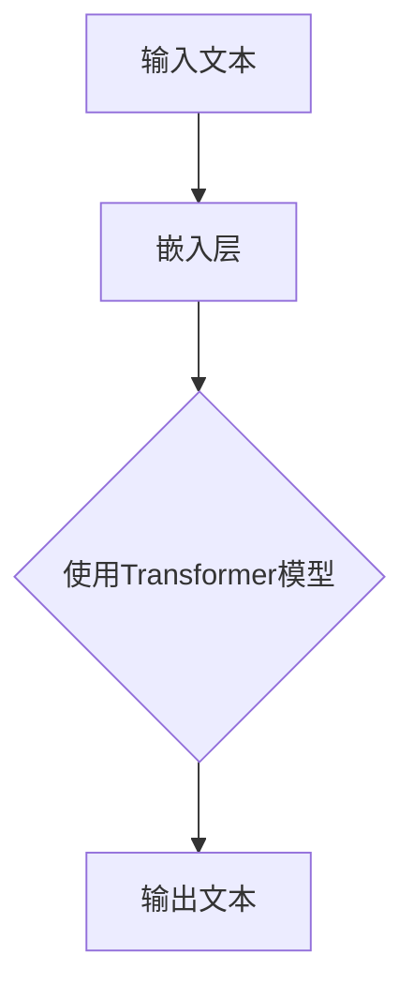
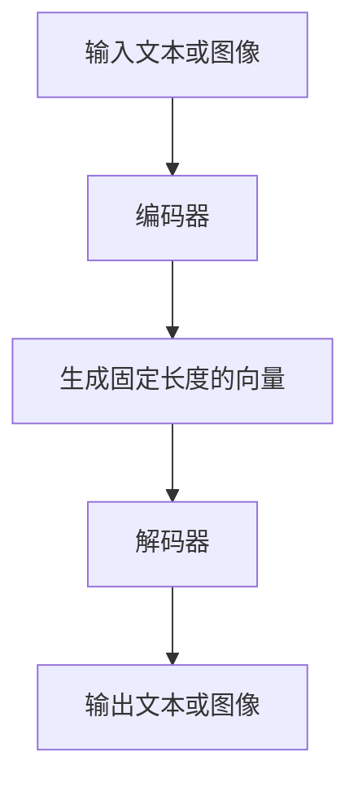

                 

# 从GPT到DALL-E：AI大模型如何重塑创业生态

> **关键词：** AI大模型，GPT，DALL-E，创业生态，技术革新，商业机会

> **摘要：** 本文将深入探讨AI大模型的发展及其在创业生态中的重要作用，特别是GPT和DALL-E模型的影响。我们将从基础概念、原理实现、应用案例以及创业实战等方面进行详细分析，揭示AI大模型如何成为推动创业创新的重要力量。


### 《从GPT到DALL-E：AI大模型如何重塑创业生态》目录大纲

1. **AI大模型概述**

   - 第1章: AI大模型时代来临
   - 第2章: GPT与DALL-E模型介绍
   - 第3章: AI大模型在创业生态中的影响

2. **GPT模型原理与实现**

   - 第4章: GPT模型基础
   - 第5章: GPT模型应用案例
   - 第6章: GPT模型在创业中的应用

3. **DALL-E模型原理与实现**

   - 第7章: DALL-E模型基础
   - 第8章: DALL-E模型应用案例
   - 第9章: DALL-E模型在创业中的应用

4. **AI大模型创业实战**

   - 第10章: AI大模型创业策略
   - 第11章: AI大模型创业实战案例
   - 第12章: 创业生态构建

5. **AI大模型未来发展趋势**

   - 第13章: AI大模型在未来的影响
   - 第14章: AI大模型在创业生态中的挑战与机遇
   - 第15章: AI大模型的未来发展趋势

6. **附录**

   - 附录A: AI大模型开发工具与资源
   - 附录B: GPT模型架构图
   - 附录C: DALL-E模型架构图
   - 附录D: GPT模型伪代码
   - 附录E: DALL-E模型伪代码
   - 附录F: 数学公式与示例

### 第一部分: AI大模型概述

#### 第1章: AI大模型时代来临

##### 1.1 AI大模型的概念与历史

- **AI大模型的定义**：AI大模型指的是具有数十亿甚至万亿参数的机器学习模型，能够处理复杂数据集，进行自我学习和优化。
- **AI大模型的发展历程**：回顾AI大模型的发展历程，从早期的浅层模型到深度学习，再到现在的Transformer和生成对抗网络，每一步都标志着技术的重要突破。
- **AI大模型的重要性**：AI大模型的出现，不仅提升了机器学习的能力，也为各行各业带来了全新的变革和机遇。

##### 1.2 GPT与DALL-E模型介绍

- **GPT模型的特点与应用**：GPT（Generative Pre-trained Transformer）是一种基于Transformer架构的语言模型，通过预训练和微调，可以实现文本生成、摘要、问答等应用。
- **DALL-E模型的特点与应用**：DALL-E是一种基于生成对抗网络（GAN）的图像生成模型，可以通过文本描述生成相应的图像，应用于艺术创作、游戏设计等领域。

##### 1.3 AI大模型在创业生态中的影响

- **AI大模型对创业机会的影响**：AI大模型的出现，为创业者提供了丰富的创新机会，特别是在文本处理、图像生成、语音识别等领域。
- **AI大模型对创业风险的挑战**：尽管AI大模型带来了巨大机遇，但也伴随着技术门槛高、数据安全等问题，需要创业者认真应对。
- **AI大模型对创业成功的助力**：AI大模型可以帮助创业者快速构建原型、降低开发成本，提高产品竞争力，从而助力创业成功。

#### 总结

AI大模型，尤其是GPT和DALL-E模型，已经成为了创业生态中的重要驱动力。在接下来的章节中，我们将进一步探讨这些模型的工作原理、实现细节以及它们在创业中的应用，帮助读者更好地理解这一前沿技术的价值。让我们继续深入，探索AI大模型的奥秘。

### 第二部分: GPT模型原理与实现

#### 第2章: GPT模型基础

##### 2.1 自然语言处理概述

- **自然语言处理的基本概念**：自然语言处理（NLP）是计算机科学和人工智能领域的一个重要分支，旨在使计算机能够理解、生成和处理人类语言。
- **自然语言处理的发展历程**：从最初的规则驱动方法，到基于统计和机器学习方法，再到现在的深度学习方法，NLP技术不断演进，取得了显著的成果。
- **自然语言处理的关键技术**：包括文本预处理、词向量表示、语言模型、实体识别、情感分析等，这些技术共同构成了NLP的核心能力。

##### 2.2 Transformer模型原理

- **Transformer模型的基本结构**：Transformer模型由编码器和解码器两个部分组成，中间通过多头自注意力机制（self-attention）来实现对输入序列的建模。
- **self-attention机制**：self-attention机制允许模型在处理每个单词时，考虑到所有其他单词的影响，从而捕捉到序列中长距离的依赖关系。
- **Transformer模型的训练与优化**：通过大规模语料库进行预训练，然后针对具体任务进行微调，以优化模型在特定任务上的性能。

##### 2.3 GPT模型架构与训练

- **GPT模型的结构**：GPT模型基于Transformer架构，通过预训练和微调，能够生成连贯、具有上下文关联的文本。
- **GPT模型的预训练过程**：在预训练阶段，模型通过无监督的方式学习语言的内在结构，包括词义、语法、语义等。
- **GPT模型的微调与应用**：在微调阶段，模型被调整以适应特定的任务，如文本生成、摘要、问答等。

#### 总结

GPT模型是自然语言处理领域的重要突破，其基于Transformer架构的自注意力机制和大规模预训练过程，使得模型在生成和理解自然语言方面取得了显著的效果。在接下来的章节中，我们将通过具体的应用案例，进一步展示GPT模型的能力和潜力。

### 第3章: GPT模型应用案例

#### 3.1 文本生成应用

- **自动文本生成**：GPT模型可以通过预训练和微调，实现自动文本生成。在新闻写作、内容创作等领域，GPT模型能够快速生成高质量的文本，提高生产效率。
- **文本摘要与生成**：GPT模型能够提取输入文本的关键信息，生成简洁的摘要。此外，通过生成式文本模型，GPT可以生成新的文本内容，用于创意写作、广告文案等。
- **自动问答系统**：GPT模型可以构建智能问答系统，通过自然语言交互，为用户提供实时回答。在客户服务、在线教育等领域，自动问答系统能够提高用户体验和服务质量。

#### 3.2 自然语言理解应用

- **情感分析**：GPT模型可以识别文本中的情感倾向，如正面、负面或中性情感。这有助于企业在市场调研、品牌监测中了解用户情感，优化产品和服务。
- **命名实体识别**：GPT模型能够识别文本中的命名实体，如人名、地名、组织名等。这为信息抽取、知识图谱构建提供了有力支持。
- **文本分类**：GPT模型可以将文本分类到不同的类别，如新闻分类、情感分类等。在推荐系统、搜索引擎等领域，文本分类技术能够提高信息推荐的准确性和相关性。

#### 3.3 GPT模型在创业中的应用

- **创业机会识别**：GPT模型可以通过对大量文本数据进行分析，识别出潜在的创业机会。创业者可以利用这一工具，快速发现市场需求和商业机会。
- **市场调研**：GPT模型可以帮助创业者进行市场调研，通过分析社交媒体、新闻报道等公开数据，了解市场趋势和用户需求。
- **商业计划书撰写**：GPT模型可以辅助创业者撰写商业计划书，通过生成高质量的文本内容，提高商业计划书的可读性和说服力。

#### 总结

GPT模型在文本生成、自然语言理解和创业应用等多个方面展示了其强大的能力。在创业领域，GPT模型不仅能够提高生产效率，还能提供数据支持和决策辅助，助力创业者抓住市场机会，实现商业成功。

### 第三部分: DALL-E模型原理与实现

#### 第4章: DALL-E模型基础

##### 4.1 图像生成技术概述

- **图像生成技术的发展历程**：从最初的基于规则的方法，到生成对抗网络（GAN）的出现，图像生成技术经历了重要的发展。GAN通过对抗训练生成逼真的图像，开创了图像生成的新时代。
- **图像生成技术的关键概念**：包括生成器（Generator）、判别器（Discriminator）和损失函数等。生成器和判别器通过对抗训练不断优化，生成高质量的图像。
- **常见的图像生成技术**：包括深度卷积生成网络（DCGAN）、感知生成对抗网络（PGGAN）等。这些技术在不同领域和应用场景中展现了其独特的优势。

##### 4.2 DALL-E模型架构与训练

- **DALL-E模型的基本结构**：DALL-E模型是一种基于生成对抗网络的图像生成模型，通过文本描述生成相应的图像。模型由编码器和解码器组成，编码器将文本映射到高维向量，解码器将向量映射回图像。
- **DALL-E模型的预训练过程**：DALL-E模型在预训练阶段，通过大量的文本-图像对进行训练，学习到文本和图像之间的关联。预训练使得模型能够生成与给定文本描述相符的图像。
- **DALL-E模型的微调与应用**：在微调阶段，DALL-E模型针对特定任务进行优化，如图像风格转换、图像内容生成等。通过微调，模型能够更好地适应不同的应用场景。

#### 总结

DALL-E模型作为一种先进的图像生成模型，通过生成对抗网络实现了文本到图像的高效转换。在预训练和微调过程中，DALL-E模型不断优化其性能，为各种图像生成应用提供了强大的支持。在接下来的章节中，我们将进一步探讨DALL-E模型的应用案例和创业潜力。

### 第5章: DALL-E模型应用案例

#### 5.1 图像生成应用

- **自动图像生成**：DALL-E模型可以通过文本描述生成新的图像。例如，输入“一只蓝色的猫在沙滩上”，模型能够生成符合描述的图像。这种自动图像生成技术广泛应用于游戏设计、虚拟现实等领域。
- **图像风格转换**：DALL-E模型可以将一种风格的图像转换成另一种风格。例如，将现实世界的照片转换成印象派画作，或艺术作品模仿特定画家的风格。这种应用在艺术创作和创意设计领域具有广泛的应用前景。
- **图像内容生成**：DALL-E模型可以根据文本描述生成新的图像内容。例如，输入“一张粉色背景的结婚照片”，模型能够生成一张符合描述的结婚照片。这种图像内容生成技术有助于提高创意设计、广告宣传等领域的效率。

#### 5.2 多媒体内容创作

- **视频生成**：DALL-E模型可以通过文本描述生成新的视频内容。例如，输入“一段关于太空探险的科幻视频”，模型能够生成相应的视频片段。这种视频生成技术为电影制作、广告宣传等提供了新的创作方式。
- **音乐生成**：DALL-E模型可以通过文本描述生成新的音乐。例如，输入“一段欢快的爵士乐”，模型能够生成相应的音乐片段。这种音乐生成技术为音乐创作、游戏配乐等提供了新的灵感来源。
- **虚拟现实内容创作**：DALL-E模型可以在虚拟现实中生成新的场景和内容。例如，输入“一座充满梦幻色彩的未来城市”，模型能够生成相应的虚拟场景。这种虚拟现实内容创作技术为虚拟现实游戏、展览等提供了丰富的体验。

#### 5.3 DALL-E模型在创业中的应用

- **品牌形象设计**：DALL-E模型可以帮助创业者快速生成独特的品牌形象，如标志、海报等。通过文本描述，创业者可以表达出对品牌的期望，模型能够生成符合要求的视觉内容，提高品牌设计的效率和质量。
- **广告创意**：DALL-E模型可以根据广告文案生成吸引人的图像，提高广告的宣传效果。例如，输入广告文案“一款美味的冰淇淋”，模型能够生成一张令人垂涎的冰淇淋图片，吸引潜在客户的注意力。
- **产品演示**：DALL-E模型可以生成产品的三维模型和演示动画，帮助创业者更好地展示产品功能和特点。通过文本描述，创业者可以描述产品的功能和特点，模型能够生成相应的图像和动画，提高产品演示的效果。

#### 总结

DALL-E模型在图像生成、多媒体内容创作以及创业应用等方面展示了其强大的能力和潜力。通过文本描述生成图像、视频和音乐，DALL-E模型为创意设计、广告宣传、产品演示等领域提供了新的解决方案。在创业领域，DALL-E模型不仅能够提高创作效率，还能为创业者提供创新的商业模式，助力创业成功。

### 第四部分: AI大模型创业实战

#### 第6章: AI大模型创业策略

##### 6.1 创业机会识别与评估

- **创业机会识别方法**：创业者可以通过市场调研、数据分析、趋势预测等方法识别出潜在的市场机会。例如，通过分析社交媒体、新闻报道等公开数据，识别出用户关注的热点话题和市场需求。
- **创业机会评估模型**：创业者可以使用评估模型对识别出的机会进行评估。常见的评估模型包括SWOT分析、PESTLE分析等，这些模型可以帮助创业者全面分析机会的优势、劣势、机会和威胁。
- **创业机会分析实例**：以GPT模型在自然语言处理领域的机会为例，分析其市场需求、技术前景、竞争情况等，为创业者提供具体的分析参考。

##### 6.2 创业团队组建与运营

- **创业团队组建策略**：创业团队的成功关键在于成员的能力互补和合作。创业者可以通过招聘、内部培养等方式组建团队，确保团队成员在技术、市场、运营等方面具备所需的技能和经验。
- **创业团队运营管理**：创业者需要建立有效的团队管理机制，包括目标设定、任务分配、绩效评估等，确保团队高效运转。同时，创业者要注重团队沟通与协作，建立开放、透明的沟通渠道，促进团队成员之间的合作。
- **创业团队沟通与协作**：创业者可以利用现代沟通工具，如团队协作软件、项目管理工具等，提高团队协作效率。同时，创业者要鼓励团队成员之间的交流，分享经验和见解，促进知识的共享和创新。

##### 6.3 创业融资策略

- **创业融资渠道**：创业者可以通过多种渠道筹集资金，如天使投资、风险投资、银行贷款、政府补贴等。不同的融资渠道适用于不同阶段的创业项目，创业者需要根据实际情况选择合适的融资渠道。
- **创业融资策略**：创业者需要制定有效的融资策略，包括融资计划、融资目标、融资方式等。同时，创业者要注重与投资者的沟通和合作，提高融资成功率。
- **创业融资案例分析**：以某AI大模型创业公司的融资案例为例，分析其融资渠道、融资策略以及成功经验，为其他创业者提供借鉴和参考。

#### 总结

AI大模型创业策略的核心在于识别和评估创业机会，组建高效团队，制定融资策略。通过系统化的策略规划和实施，创业者可以更好地抓住AI大模型带来的创业机会，实现商业成功。

### 第7章: AI大模型创业实战案例

##### 7.1 创业成功案例分享

- **成功原因分析**：某AI大模型创业公司成功的原因包括：首先，公司准确识别并抓住了自然语言处理领域的机会，推出了基于GPT模型的文本生成、摘要和问答产品。其次，公司组建了一支具备丰富经验和技术能力的团队，确保了产品的研发和运营效率。最后，公司采取了多元化的融资策略，成功获得了风险投资，为公司的持续发展提供了资金支持。
- **成功经验与教训**：成功经验包括：明确市场定位，打造具有竞争力的产品；注重团队建设和人才培养；积极寻求外部资金支持。教训包括：在市场拓展过程中，要充分了解用户需求，及时调整产品策略；在融资过程中，要合理评估资金需求，避免过度依赖外部资金。
- **关键因素**：关键因素包括：市场机遇的准确识别和把握；高效团队的组建和运营；多元化的融资策略和资金管理。

##### 7.2 创业失败案例分析

- **失败原因分析**：某AI大模型创业公司失败的原因包括：首先，公司对市场机会的判断不准确，推出的产品未能满足用户需求。其次，公司团队建设不完善，缺乏核心技术和市场运营能力。最后，公司在融资过程中过度依赖外部资金，导致资金链断裂。
- **失败教训与启示**：教训包括：在市场拓展过程中，要充分了解用户需求，避免盲目跟风；在团队建设方面，要注重技术、市场和运营能力的互补；在融资过程中，要合理评估资金需求，避免过度依赖外部资金。启示包括：创业者要具备敏锐的市场洞察力和团队建设能力；在创业过程中，要注重资金管理，避免资金风险。
- **关键因素**：关键因素包括：市场机会的准确识别和把握；团队建设和技术能力的互补；资金管理和融资策略。

##### 7.3 创业生态构建

- **创业生态的概念**：创业生态是指创业者、投资者、合作伙伴、政府机构等多方共同参与，相互支持、协同发展的生态系统。良好的创业生态有助于创业者降低创业风险，提高创业成功率。
- **创业生态的建设策略**：包括政策支持、资金扶持、人才培养、资源共享等方面。政府可以通过出台优惠政策、提供资金支持，促进创业生态的建设。创业者可以通过合作、共享资源，提高创业效率。同时，创业者要注重自身能力的提升，以适应不断变化的创业环境。
- **创业生态的发展趋势**：随着AI大模型等前沿技术的不断突破，创业生态将呈现以下趋势：一是跨界合作将更加普遍，创业者将更加注重跨领域的创新。二是创业领域的多样性将增强，从传统的互联网、金融等领域，拓展到智能制造、生命科学等新兴领域。三是创业生态的国际化趋势将更加明显，创业者将更加注重全球市场的开拓。

#### 总结

AI大模型创业实战案例展示了成功和失败的经验与教训，以及创业生态的建设策略和发展趋势。通过系统化的策略规划和实施，创业者可以更好地抓住AI大模型带来的创业机会，实现商业成功。

### 第五部分: AI大模型未来发展趋势

#### 第8章: AI大模型在未来的影响

##### 8.1 AI大模型在产业中的应用

- **产业变革的方向**：AI大模型将在多个产业领域引发深刻的变革，如医疗、金融、制造、教育等。通过AI大模型，产业可以实现智能化、自动化和个性化，提高生产效率和服务质量。
- **产业应用案例**：在医疗领域，AI大模型可以用于疾病诊断、治疗方案推荐等；在金融领域，AI大模型可以用于风险管理、投资决策等；在制造领域，AI大模型可以用于生产优化、质量控制等。这些应用案例展示了AI大模型在产业中的巨大潜力。
- **产业发展的趋势**：随着AI大模型技术的不断成熟和应用场景的拓展，产业领域的AI应用将越来越广泛，形成全新的产业生态。

##### 8.2 AI大模型在创业生态中的挑战与机遇

- **挑战与风险**：AI大模型在创业生态中面临的挑战包括数据隐私、算法透明性、技术门槛等。同时，AI大模型的应用也可能带来伦理和法律风险，需要创业者谨慎应对。
- **机遇与前景**：尽管存在挑战，AI大模型在创业生态中同样带来了巨大的机遇。通过AI大模型，创业者可以更快速地构建原型、优化产品、降低成本，抢占市场先机。未来，随着技术的进步和应用场景的拓展，AI大模型在创业生态中的前景将更加广阔。

##### 8.3 AI大模型的未来发展趋势

- **技术发展趋势**：未来，AI大模型将朝着更高效、更智能、更安全、更可解释的方向发展。具体包括：模型架构的优化、数据隐私保护技术的应用、多模态融合等。
- **应用发展趋势**：AI大模型的应用将更加多元化，从文本处理、图像生成，扩展到语音识别、视频分析、生物特征识别等领域。同时，AI大模型的应用将更加贴近实际需求，实现个性化、智能化和自适应的解决方案。
- **创业生态的发展趋势**：未来，创业生态将更加开放、协作和多元化。创业者将更加注重技术与市场的结合，通过跨界合作和创新，推动产业的变革和升级。

#### 总结

AI大模型在未来的影响将深远而广泛，不仅将在多个产业领域引发变革，也将为创业生态带来巨大的机遇和挑战。通过关注技术发展趋势、应用前景和创业生态的建设，创业者可以更好地把握AI大模型带来的机遇，实现持续的创新和突破。

### 附录

#### 附录A: AI大模型开发工具与资源

- **开发工具介绍**
  - **TensorFlow**：谷歌开发的开源机器学习框架，支持多种深度学习模型。
  - **PyTorch**：基于Python的开源深度学习库，提供灵活的动态计算图。
  - **JAX**：谷歌开发的开源自动微分库，支持多种深度学习模型。
  - **其他框架**：如Keras、TorchScript等，也为AI大模型的开发提供了丰富的选择。

- **开发资源推荐**
  - **学习教程**：推荐阅读《深度学习》（Goodfellow et al.）、《Python深度学习》（Raschka and Lutz）等书籍，以及相关在线教程。
  - **论文资料**：查阅顶级会议和期刊（如NeurIPS、ICML、ACL等）的最新研究成果。
  - **开源项目**：参与GitHub等平台上的开源项目，学习实战经验。
  - **社区资源**：加入深度学习相关的社区（如Reddit、Stack Overflow等），交流心得和经验。

#### 附录B: GPT模型架构图



#### 附录C: DALL-E模型架构图



#### 附录D: GPT模型伪代码

```python
# GPT模型伪代码
def GPT(input_sequence):
    # 输入序列嵌入
    embedded_sequence = embed(input_sequence)

    # 使用Transformer模型进行编码
    encoded_sequence = TransformerModel(embedded_sequence)

    # 输出序列解码
    output_sequence = decode(encoded_sequence)
    return output_sequence
```

#### 附录E: DALL-E模型伪代码

```python
# DALL-E模型伪代码
def DALL_E(input_sequence):
    # 输入序列编码
    encoded_sequence = EncoderModel(input_sequence)

    # 生成固定长度的向量
    vector = generate_vector(encoded_sequence)

    # 解码生成文本或图像
    output_sequence = DecoderModel(vector)
    return output_sequence
```

#### 附录F: 数学公式与示例

##### 数学公式

$$
E_{\theta} = \frac{1}{N}\sum_{i=1}^{N} (-\log p(x_i | \theta))
$$

##### 示例

假设我们有一个数据集D，其中包含了N个样本。对于每一个样本$x_i$，我们通过模型参数$\theta$计算其概率$p(x_i | \theta)$，然后取对数并取负号，最终对所有样本的结果求和，并除以样本数N，即可得到模型的损失函数$E$。这个损失函数表示了模型预测与真实值之间的差距。我们的目标是调整模型参数$\theta$，使得损失函数$E$尽可能小。

### 作者信息

- 作者：AI天才研究院/AI Genius Institute & 禅与计算机程序设计艺术 /Zen And The Art of Computer Programming

