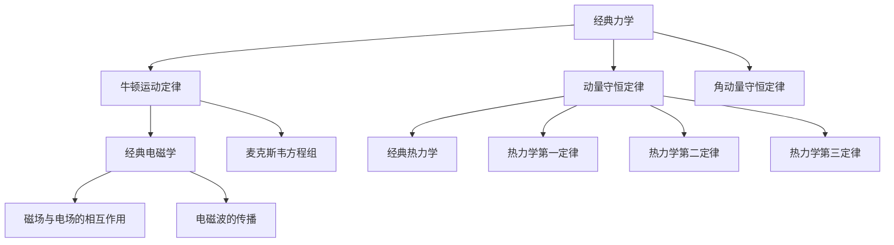
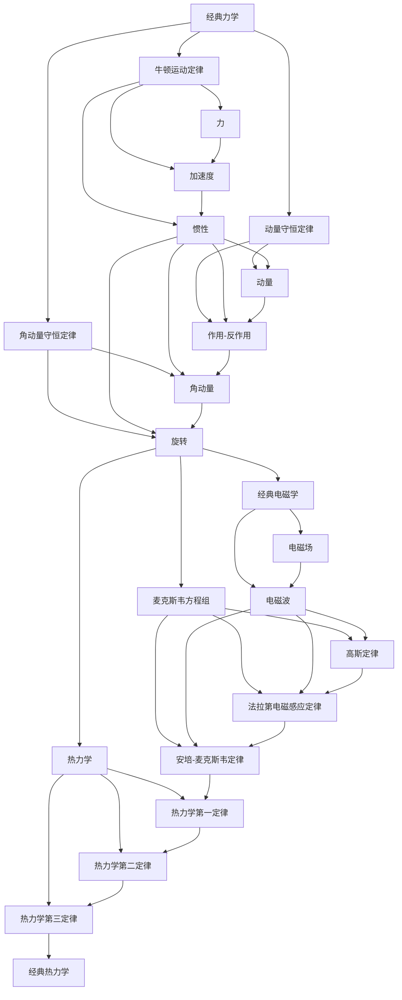

                 

# 从经典物理学到生物物理学：跨学科理解生命与物质的统一

## 关键词：
生物物理学，经典物理学，力学，电磁学，热力学，分子动力学，生物成像，跨学科研究

## 摘要：

本文探讨了从经典物理学到生物物理学的跨学科研究，通过深入分析物理学与生物学之间的相互作用，揭示了生物系统和生物过程背后的物理原理。文章首先介绍了经典物理学的基础理论，包括力学、电磁学和热力学的核心原理，并通过Mermaid流程图展示了各分支之间的联系。随后，文章详细阐述了生物物理学的基本概念、研究方法和技术，以及生物大分子的结构与功能。接着，文章介绍了生物物理学中的数学模型，包括热力学、电磁学和力学的数学公式，并通过具体例子进行解释说明。文章最后通过实际项目实战，展示了生物分子折叠、生物分子相互作用和生物医学成像等跨学科研究的方法和成果。通过本文的阅读，读者可以全面了解生物物理学的研究内容和跨学科方法，以及对生命与物质统一的深刻理解。

### 目录大纲

# 从经典物理学到生物物理学：跨学科理解生命与物质的统一

## 第一部分：物理学与生物学的交汇

### 1.1 引言：物理学与生物学的相互作用

#### 1.1.1 物理学在生物学研究中的应用

#### 1.1.2 生物学对物理学发展的影响

### 1.2 经典物理学基础

#### 1.2.1 经典力学的核心原理

#### 1.2.2 经典电磁学的理论基础

#### 1.2.3 经典热力学的热力学定律

### 1.3 经典物理学的Mermaid流程图

#### 1.3.1 经典物理学的核心原理与联系

## 第二部分：生物物理学的基本原理

### 2.1 生物物理学的基本概念

#### 2.1.1 生物物理学的定义与研究内容

#### 2.1.2 生物物理学的研究方法与技术

### 2.2 生物大分子的结构与功能

#### 2.2.1 蛋白质的折叠与作用

#### 2.2.2 DNA的结构与功能

#### 2.2.3 RNA的作用与功能

### 2.3 生物大分子交互作用的机理

#### 2.3.1 生物分子间的相互作用力

#### 2.3.2 生物大分子的自组装过程

## 第三部分：跨学科方法的实际应用

### 3.1 经典物理学的核心算法原理讲解

#### 3.1.1 伪代码详细讲解

### 3.2 生物物理学中的数学模型

#### 3.2.1 热力学中的数学公式

#### 3.2.2 电磁学中的数学公式

#### 3.2.3 力学中的数学公式

### 3.3 跨学科方法在生物医学研究中的应用

#### 3.3.1 生物医学成像技术

#### 3.3.2 生物分子动力学模拟

#### 3.3.3 生物传感器技术

## 第四部分：跨学科项目实战

### 4.1 生物分子折叠项目实战

#### 4.1.1 实验设计

#### 4.1.2 数据处理

#### 4.1.3 结果分析

### 4.2 生物分子相互作用项目实战

#### 4.2.1 实验设计

#### 4.2.2 数据处理

#### 4.2.3 结果分析

### 4.3 生物医学成像项目实战

#### 4.3.1 实验设计

#### 4.3.2 数据处理

#### 4.3.3 结果分析

## 附录

### 附录 A: 经典物理学的Mermaid流程图

### 附录 B: 生物物理学中的数学公式汇总

### 附录 C: 生物医学成像技术资源

### 附录 D: 跨学科项目实战代码与数据集

### 1.1 引言：物理学与生物学的相互作用

#### 1.1.1 物理学在生物学研究中的应用

物理学在生物学研究中扮演着重要的角色，为生物学提供了基础理论和技术支持。以下是物理学在生物学研究中的几个主要应用领域：

- **分子生物学中的物理原理**：分子生物学研究生物大分子的结构、功能和相互作用，这些研究离不开物理学的支持。例如，分子动力学模拟使用物理学原理来模拟分子的运动和相互作用，从而预测蛋白质的结构和功能。

- **生物医学成像技术的物理基础**：生物医学成像技术，如X射线成像、核磁共振成像（MRI）和正电子发射断层扫描（PET），都是基于物理学的原理。X射线成像利用X射线的穿透性，MRI利用核磁共振现象，PET利用正电子衰变产生的辐射。

#### 1.1.2 生物学对物理学发展的影响

生物学的发展对物理学也产生了深远的影响，推动了物理学理论的创新和发展。以下是生物学对物理学发展的几个主要影响：

- **生物学现象对物理学理论的挑战**：生物学中的复杂现象，如细胞膜的流动性、分子间的复杂相互作用，对传统物理学理论提出了挑战。这些现象促使物理学家发展新的理论来解释生物系统的行为。

- **生物系统对物理学研究的新启示**：生物学研究揭示了许多新的物理现象和原理。例如，生物系统的自组织现象和复杂网络的动力学行为为物理学提供了新的研究方向。

### 1.2 经典物理学基础

#### 1.2.1 经典力学的核心原理

经典力学是物理学的基础之一，描述了物体在力的作用下的运动。以下是经典力学的核心原理：

- **牛顿运动定律**：牛顿运动定律是经典力学的核心，包括三个定律。

  - **第一定律**（惯性定律）：一个物体在没有外力作用下，将保持静止或匀速直线运动状态。
  - **第二定律**（动力定律）：物体的加速度与作用力成正比，与物体质量成反比，即 \( \mathbf{F} = m\mathbf{a} \)。
  - **第三定律**（作用-反作用定律）：任何作用力都有一个大小相等、方向相反的反作用力。

- **动量守恒定律**：在一个封闭系统中，总动量保持不变。即 \( \Delta \mathbf{p}_{\text{总}} = 0 \)。

- **角动量守恒定律**：在一个封闭系统中，总角动量保持不变。即 \( \Delta \mathbf{L}_{\text{总}} = 0 \)。

#### 1.2.2 经典电磁学的理论基础

经典电磁学描述了电磁场的性质和相互作用。以下是经典电磁学的核心理论基础：

- **麦克斯韦方程组**：麦克斯韦方程组是描述电磁场如何产生和相互作用的方程组。

  - **高斯定律**：描述电场的散度，即 \( \nabla \cdot \mathbf{E} = \frac{\rho}{\varepsilon_0} \)。
  - **高斯磁定律**：描述磁场的散度，即 \( \nabla \cdot \mathbf{B} = 0 \)。
  - **法拉第电磁感应定律**：描述磁场的旋度，即 \( \nabla \times \mathbf{E} = -\frac{\partial \mathbf{B}}{\partial t} \)。
  - **安培-麦克斯韦定律**：描述电流和电场的关系，即 \( \nabla \times \mathbf{B} = \mu_0 \mathbf{J} + \mu_0 \varepsilon_0 \frac{\partial \mathbf{E}}{\partial t} \)。

- **电磁波传播**：电磁波在真空中的传播速度为 \( c = \frac{1}{\sqrt{\mu_0 \varepsilon_0}} \)。

#### 1.2.3 经典热力学的热力学定律

经典热力学描述了能量转换和传递的规律。以下是经典热力学的核心定律：

- **热力学第一定律**（能量守恒定律）：能量不能被创造或销毁，只能从一种形式转换为另一种形式。即 \( \Delta U = Q - W \)，其中 \( \Delta U \) 是系统内能的变化，\( Q \) 是系统吸收的热量，\( W \) 是系统对外做的功。

- **热力学第二定律**：熵是系统无序度的度量，总熵在自然过程中总是增加。即 \( \Delta S_{\text{总}} \geq 0 \)。

- **热力学第三定律**：在绝对零度时，系统的熵达到最小值。即 \( \lim_{T \to 0} S = 0 \)。

### 1.3 经典物理学的Mermaid流程图

为了更直观地展示经典物理学的核心原理和联系，我们可以使用Mermaid流程图来绘制。以下是经典物理学的Mermaid流程图：



此流程图展示了经典物理学的各个分支以及它们之间的联系。经典力学包括牛顿运动定律、动量守恒定律和角动量守恒定律；经典电磁学包括麦克斯韦方程组和电磁波传播；经典热力学包括热力学第一定律、第二定律和第三定律。

### 1.3.1 经典物理学的核心原理与联系

为了进一步理解经典物理学的核心原理和它们之间的联系，我们可以通过Mermaid流程图来展示。以下是经典物理学核心原理的Mermaid流程图：



这个流程图展示了经典物理学的核心原理，包括力学、电磁学和热力学。力学部分包括牛顿运动定律、动量守恒定律、角动量守恒定律等；电磁学部分包括电磁场、电磁波、麦克斯韦方程组等；热力学部分包括热力学第一定律、第二定律和第三定律。此外，流程图还展示了这些原理之间的联系，例如力与加速度、动量与作用-反作用、电磁场与电磁波等。

通过这个流程图，我们可以更清晰地理解经典物理学的核心原理及其相互关系，从而为后续的生物物理学研究打下坚实的基础。

### 2.1 生物物理学的基本概念

#### 2.1.1 生物物理学的定义与研究内容

生物物理学是研究生物系统和生物过程物理性质和规律的学科，是生物学和物理学之间的交叉领域。生物物理学通过运用物理学的理论、方法和实验技术来揭示生物系统的结构、功能和行为，从而理解生命现象的本质。

生物物理学的研究内容包括：

- **生物大分子的物理性质**：研究蛋白质、核酸、多糖等生物大分子的结构、运动和相互作用。
- **生物系统的能量转换和传递**：研究生物体内的能量转换、传递和利用机制，如细胞膜中的离子通道、光合作用等。
- **生物组织与器官的物理特性**：研究生物组织与器官的物理特性，如肌肉的力学性质、血液的流动性质等。
- **生物医学成像技术**：研究生物医学成像技术的物理原理和应用，如X射线成像、核磁共振成像、正电子发射断层扫描等。

#### 2.1.2 生物物理学的研究方法与技术

生物物理学研究方法和技术包括以下几个方面：

- **实验生物学方法**：使用显微镜、光谱仪、质谱仪等仪器进行生物实验，观察生物现象和测量生物参数。
- **计算生物学方法**：使用计算机模拟和算法分析生物系统的行为和功能，如分子动力学模拟、量子化学计算等。
- **生物化学方法**：使用生物化学技术分离、纯化和检测生物大分子，如蛋白质纯化、DNA测序、RNA测序等。

生物物理学的研究方法和技术为生物学提供了强有力的理论支持和技术手段，使得我们能够深入理解生物系统的结构和功能，为生物医学研究和生物技术的开发提供了基础。

### 2.2 生物大分子的结构与功能

#### 2.2.1 蛋白质的折叠与作用

蛋白质是生物体内最重要的生物大分子之一，其功能依赖于其独特的三维结构。蛋白质的折叠是指其从无规则卷曲的线性多肽链通过分子间的相互作用力（如氢键、离子键、疏水作用等）自发地卷曲成具有特定功能的稳定三维结构的过程。

**蛋白质折叠过程**：

1. **初始折叠**：新合成的多肽链首先进行初步的折叠，形成β-折叠、α-螺旋等二级结构。
2. **中间体形成**：在初步折叠的基础上，蛋白质进一步折叠，形成中间体，这些中间体可能是不稳定的。
3. **最终折叠**：通过分子间的相互作用力，蛋白质最终折叠成具有特定功能的稳定三维结构。

**蛋白质的功能分类**：

- **结构蛋白**：如胶原蛋白、弹性蛋白等，它们在细胞和组织中提供机械支撑。
- **功能蛋白**：如酶、受体、转运蛋白等，它们参与生物体内的各种生物化学反应和信号传递。
- **调节蛋白**：如激素、转录因子等，它们调节细胞内的生物过程。

#### 2.2.2 DNA的结构与功能

DNA（脱氧核糖核酸）是遗传信息的载体，其独特的双螺旋结构决定了其功能。

**DNA的结构**：

- **基本单位**：DNA由核苷酸组成，每个核苷酸包含一个磷酸基团、一个脱氧核糖和一个含氮碱基（腺嘌呤、胸腺嘧啶、胞嘧啶、鸟嘌呤）。
- **双螺旋结构**：DNA的双螺旋结构由两条反向平行的多核苷酸链通过碱基配对形成，其中腺嘌呤与胸腺嘧啶之间通过两个氢键连接，胞嘧啶与鸟嘌呤之间通过三个氢键连接。

**DNA的功能**：

- **遗传信息的传递**：DNA通过复制过程将遗传信息传递给下一代细胞。
- **基因表达调控**：DNA上的基因序列通过转录和翻译过程被表达成蛋白质，从而实现细胞的功能。

**DNA的变异**：

- **点突变**：单个碱基的替换，可能导致氨基酸的改变或蛋白质功能的丧失。
- **插入或缺失**：DNA序列中插入或缺失一个或多个碱基，可能导致基因的功能改变。

#### 2.2.3 RNA的作用与功能

RNA（核糖核酸）在蛋白质合成过程中起着至关重要的作用。

**RNA的转录与翻译过程**：

- **转录**：DNA上的基因序列被RNA聚合酶复制成mRNA（信使RNA）。
- **翻译**：mRNA被转运到核糖体，核糖体读取mRNA上的密码子，将氨基酸连接成蛋白质。

**RNA的功能分类**：

- **mRNA**：携带着DNA上的遗传信息，指导蛋白质的合成。
- **tRNA**：转运RNA，将氨基酸带到核糖体，并按照mRNA上的密码子将氨基酸连接成蛋白质。
- **rRNA**：核糖体RNA，构成核糖体，参与蛋白质的合成。
- **miRNA**：小干扰RNA，通过干扰目标mRNA的翻译或降解来调控基因表达。
- **snRNA**：小核RNA，参与RNA剪接和修饰等过程。

通过研究生物大分子的结构与功能，我们可以更深入地理解生命现象的本质，为生物医学研究和生物技术的开发提供基础。

### 2.3 生物大分子交互作用的机理

#### 2.3.1 生物分子间的相互作用力

生物大分子间的相互作用力是生物体内各种生物过程的基础。以下是几种主要的生物分子间相互作用力：

1. **离子键**：由正负离子之间的静电相互作用形成。例如，DNA的碱基配对中，胞嘧啶与鸟嘌呤之间的三个氢键与一个离子键共同作用，维持DNA双螺旋结构的稳定性。

2. **氢键**：氢键是由氢原子与较电负的原子（如氧、氮）之间的相互作用形成。氢键在蛋白质的二级结构中起着关键作用，如α-螺旋和β-折叠。

3. **范德华力**：范德华力是分子间较弱的吸引力，主要由分子中电子云的瞬时极化产生。范德华力在蛋白质的三维结构中起到辅助稳定作用。

4. **疏水作用**：非极性分子或原子团在水中相互排斥，形成疏水相互作用。疏水作用在蛋白质折叠和膜结构形成中起着重要作用。

#### 2.3.2 生物大分子的自组装过程

生物大分子的自组装是指生物大分子在没有外部指导的情况下，通过分子间的相互作用力自发地组织成复杂结构的过程。自组装在生物体内广泛存在，如蛋白质的折叠、膜蛋白的组装、细胞壁的构建等。

**自组装的定义与原理**：

- **定义**：自组装是指分子在特定条件下自行组织成复杂结构的过程。
- **原理**：自组装依赖于分子间的相互作用力，如氢键、离子键、疏水作用等。这些相互作用力使得分子在特定的空间排列，形成稳定的结构。

**自组装的生物学应用**：

- **蛋白质折叠**：蛋白质通过自组装形成特定的三维结构，实现其生物学功能。
- **膜蛋白组装**：膜蛋白在细胞膜上形成特定结构，参与细胞信号传递和物质运输。
- **细胞壁构建**：细菌和植物细胞通过自组装形成细胞壁，提供细胞结构支持。

通过理解生物大分子交互作用的机理和自组装过程，我们可以更好地揭示生物系统的结构和功能，为生物医学研究和生物技术的开发提供理论支持。

### 3.1 经典物理学的核心算法原理讲解

#### 3.1.1 伪代码详细讲解

在生物物理学研究中，经典物理学的核心算法原理起着重要作用。以下是经典物理学的核心算法原理的伪代码详细讲解。

**牛顿运动定律的伪代码实现**：

```python
# 输入：质量m，作用力F
# 输出：加速度a

def calculate_acceleration(m, F):
    a = F / m
    return a
```

**动量守恒定律的伪代码实现**：

```python
# 输入：初始动量p_initial，最终动量p_final
# 输出：动量守恒验证结果

def verify_momentum_conservation(p_initial, p_final):
    if abs(p_initial - p_final) < tolerance:
        return "动量守恒"
    else:
        return "动量不守恒"
```

**角动量守恒定律的伪代码实现**：

```python
# 输入：初始角动量L_initial，最终角动量L_final
# 输出：角动量守恒验证结果

def verify_angular_momentum_conservation(L_initial, L_final):
    if abs(L_initial - L_final) < tolerance:
        return "角动量守恒"
    else:
        return "角动量不守恒"
```

**麦克斯韦方程组的伪代码实现**：

```python
# 输入：电场E，电荷密度ρ，磁感应强度B，电流密度J
# 输出：电磁场相互作用结果

def calculate_electric_field(E, ρ):
    D = ρ
    return E

def calculate_magnetic_field(B, J):
    H = J
    return B

def calculate_em Waves(E, B):
    c = speed_of_light
    return E / c, B / c
```

通过上述伪代码实现，我们可以模拟和分析经典物理学在生物物理学研究中的应用。这些算法原理为生物分子动力学模拟、生物成像技术、生物传感器技术等提供了重要的理论基础。

### 3.2 生物物理学中的数学模型

#### 3.2.1 热力学中的数学公式

在生物物理学中，热力学是研究能量转换和传递的重要分支。以下是热力学中的几个关键数学公式：

1. **熵的定义公式**：
   \[ S = -k \sum_i p_i \ln p_i \]
   其中，\( S \) 是系统的熵，\( k \) 是玻尔兹曼常数，\( p_i \) 是系统处于第 \( i \) 个状态的几率。

2. **吉布斯自由能的公式**：
   \[ G = H - TS \]
   其中，\( G \) 是系统的吉布斯自由能，\( H \) 是系统的焓，\( T \) 是系统的温度，\( S \) 是系统的熵。

3. **热力学第一定律（能量守恒定律）**：
   \[ \Delta U = Q - W \]
   其中，\( \Delta U \) 是系统的内能变化，\( Q \) 是系统吸收的热量，\( W \) 是系统对外做的功。

4. **热力学第二定律（熵增原理）**：
   \[ \Delta S_{\text{总}} \geq 0 \]
   其中，\( \Delta S_{\text{总}} \) 是系统总熵的变化，表示在自然过程中总熵总是增加或保持不变。

5. **热力学第三定律（熵的绝对零度值）**：
   \[ \lim_{T \to 0} S = 0 \]
   其中，当系统温度趋近于绝对零度时，系统的熵达到最小值。

#### 3.2.2 电磁学中的数学公式

电磁学是研究电磁场和电磁波传播的学科。以下是电磁学中的一些关键数学公式：

1. **法拉第电磁感应定律**：
   \[ \mathcal{E} = -\frac{d\Phi_B}{dt} \]
   其中，\( \mathcal{E} \) 是感应电动势，\( \Phi_B \) 是磁通量。

2. **高斯定律**：
   \[ \nabla \cdot \mathbf{E} = \frac{\rho}{\varepsilon_0} \]
   其中，\( \mathbf{E} \) 是电场，\( \rho \) 是电荷密度，\( \varepsilon_0 \) 是真空电容率。

3. **安培定律**：
   \[ \nabla \times \mathbf{B} = \mu_0 \mathbf{J} \]
   其中，\( \mathbf{B} \) 是磁场，\( \mathbf{J} \) 是电流密度，\( \mu_0 \) 是真空磁导率。

4. **麦克斯韦方程组**：
   \[ \nabla \cdot \mathbf{D} = \rho \]
   \[ \nabla \cdot \mathbf{B} = 0 \]
   \[ \nabla \times \mathbf{E} = -\frac{\partial \mathbf{B}}{\partial t} \]
   \[ \nabla \times \mathbf{H} = \mathbf{J} + \frac{\partial \mathbf{D}}{\partial t} \]
   其中，\( \mathbf{D} \) 是电位移矢量，\( \mathbf{H} \) 是磁场强度。

#### 3.2.3 力学中的数学公式

力学是研究物体运动和力的作用的学科。以下是力学中的一些关键数学公式：

1. **牛顿第二定律**：
   \[ \mathbf{F} = m\mathbf{a} \]
   其中，\( \mathbf{F} \) 是作用力，\( m \) 是物体质量，\( \mathbf{a} \) 是加速度。

2. **动量守恒定律**：
   \[ \Delta \mathbf{p} = 0 \]
   其中，\( \Delta \mathbf{p} \) 是系统的总动量变化。

3. **角动量守恒定律**：
   \[ \Delta \mathbf{L} = 0 \]
   其中，\( \Delta \mathbf{L} \) 是系统的总角动量变化。

4. **动能公式**：
   \[ K = \frac{1}{2}mv^2 \]
   其中，\( K \) 是动能，\( m \) 是物体质量，\( v \) 是速度。

5. **势能公式**：
   \[ U = mgh \]
   其中，\( U \) 是势能，\( m \) 是物体质量，\( g \) 是重力加速度，\( h \) 是高度。

通过以上数学公式，生物物理学可以定量地描述生物系统和生物过程中的物理现象，为生物医学研究和生物技术应用提供理论基础。

### 3.3 跨学科方法在生物医学研究中的应用

跨学科方法在生物医学研究中具有广泛的应用，通过结合物理学、化学、生物学等领域的理论和技术，我们可以更深入地理解生物系统的结构和功能。以下将介绍几种跨学科方法在生物医学研究中的应用：

#### 3.3.1 生物医学成像技术

生物医学成像技术是生物医学研究中不可或缺的工具，通过不同的成像技术，我们可以获得生物体内的形态和功能信息。以下是一些常见的生物医学成像技术：

1. **X射线成像**：
   X射线成像是一种基于X射线穿透能力的成像技术，可以用于检测骨骼和软组织的病变。X射线成像技术包括普通X射线摄影、计算机断层扫描（CT）和数字X射线成像（DR）等。

2. **核磁共振成像（MRI）**：
   MRI利用核磁共振现象来获得生物体内的图像。MRI具有高分辨率和多参数成像的特点，可以用于检测和诊断神经系统、肌肉骨骼系统和器官病变等。

3. **正电子发射断层扫描（PET）**：
   PET是一种核医学成像技术，通过注射正电子发射放射性同位素，可以检测生物体内的代谢活动和分子分布。PET在肿瘤诊断、神经科学研究和药物开发等领域有广泛应用。

4. **超声波成像**：
   超声波成像利用超声波在生物体内的传播和反射来获得图像。超声波成像技术包括B超、多普勒超声和三维超声等，广泛应用于妇产科、心血管系统和腹部器官检查。

#### 3.3.2 生物分子动力学模拟

生物分子动力学模拟是一种计算生物学方法，通过模拟生物分子在分子水平上的运动和相互作用，可以预测生物分子的结构和动态行为。生物分子动力学模拟在药物设计、蛋白质折叠和生物大分子相互作用研究等方面具有重要意义。

1. **药物设计**：
   通过生物分子动力学模拟，可以预测药物与生物分子之间的相互作用，为药物设计和优化提供重要信息。例如，通过分子动力学模拟，可以优化药物分子与蛋白质结合位点，提高药物的疗效和安全性。

2. **蛋白质折叠**：
   蛋白质折叠是生物分子动力学模拟的重要研究领域。通过模拟蛋白质在折叠过程中的动力学行为，可以揭示蛋白质折叠的机制和路径，为理解蛋白质功能提供重要线索。

3. **生物大分子相互作用**：
   生物大分子之间的相互作用在生物体内起着关键作用。通过生物分子动力学模拟，可以研究生物大分子之间的相互作用机制，揭示生物过程中的关键步骤和调控因素。

#### 3.3.3 生物传感器技术

生物传感器技术是一种基于生物分子识别原理的检测技术，可以用于检测生物体内的各种分子，如蛋白质、核酸、酶和激素等。生物传感器技术在疾病诊断、环境监测和食品安全等领域有广泛应用。

1. **疾病诊断**：
   生物传感器可以用于快速、准确和便捷地检测疾病标志物。例如，基于酶标仪的生物传感器可以用于检测肿瘤标志物、病原体和病毒等。

2. **环境监测**：
   生物传感器可以用于实时监测环境中的有害物质，如重金属、农药和化学品等。通过生物传感器技术，可以实现对环境污染的快速响应和预警。

3. **食品安全**：
   生物传感器可以用于检测食品中的有害物质，如细菌、病毒和污染物等。通过生物传感器技术，可以保障食品的安全性和质量。

通过跨学科方法的综合应用，我们可以从多个角度研究生物系统的结构和功能，揭示生命现象的本质，为生物医学研究和应用提供强大的技术支持。

### 4.1 生物分子折叠项目实战

#### 4.1.1 实验设计

生物分子折叠项目实战旨在通过实验手段研究蛋白质的折叠过程及其动力学特性。以下是一个典型的实验设计：

1. **实验目标**：
   - 研究特定蛋白质在折叠过程中的动力学行为。
   - 探究影响蛋白质折叠速度和稳定性的因素。

2. **实验步骤**：

   a. **样品制备**：
      - 从细胞中提取目标蛋白质，通过纯化获得高纯度的蛋白质样品。

   b. **样品处理**：
      - 使用缓冲溶液处理蛋白质样品，保持蛋白质的结构和功能。

   c. **光谱分析**：
      - 使用圆二色谱（CD）技术监测蛋白质折叠过程中的二级结构变化。

   d. **荧光光谱分析**：
      - 使用荧光光谱技术监测蛋白质折叠过程中的荧光强度变化。

   e. **分子动力学模拟**：
      - 使用分子动力学模拟软件对蛋白质折叠过程进行模拟，分析折叠路径和动力学行为。

3. **实验设备**：
   - 圆二色谱仪
   - 荧光光谱仪
   - 分子动力学模拟软件
   - 培养箱
   - 离心机

4. **实验结果预期**：
   - 蛋白质折叠过程中，CD光谱和荧光光谱应显示明显的二级结构变化。
   - 分子动力学模拟结果应与实验数据相符，揭示蛋白质折叠的动力学特性。

#### 4.1.2 数据处理

在生物分子折叠实验中，数据处理是一个关键环节。以下是一个典型的数据处理过程：

1. **数据采集**：

   a. **CD光谱数据**：
      - 采集蛋白质在不同折叠阶段的CD光谱数据，记录光谱峰的位置和强度。

   b. **荧光光谱数据**：
      - 采集蛋白质在不同折叠阶段的荧光光谱数据，记录荧光强度和发射波长。

   c. **分子动力学模拟数据**：
      - 采集分子动力学模拟过程中的结构数据和动力学数据，包括蛋白质的折叠路径和能量分布。

2. **数据预处理**：

   a. **CD光谱数据预处理**：
      - 去除光谱中的噪声和基线漂移，对光谱进行平滑处理。

   b. **荧光光谱数据预处理**：
      - 去除光谱中的噪声和基线漂移，对光谱进行平滑处理。

   c. **分子动力学模拟数据预处理**：
      - 对模拟过程中的结构数据进行筛选和重构，提取关键折叠路径和能量分布。

3. **数据分析**：

   a. **CD光谱数据分析**：
      - 分析CD光谱中的二级结构变化，确定蛋白质的折叠阶段。

   b. **荧光光谱数据分析**：
      - 分析荧光光谱中的荧光强度和发射波长变化，确定蛋白质的折叠状态。

   c. **分子动力学模拟数据分析**：
      - 分析模拟过程中的折叠路径和能量分布，确定蛋白质的折叠动力学特性。

4. **数据可视化**：

   - 使用数据可视化工具，如Matlab或Python，将处理后的数据可视化，展示蛋白质折叠过程的动力学行为。

#### 4.1.3 结果分析

通过对生物分子折叠实验数据的处理和分析，我们可以得到以下结果：

1. **CD光谱分析结果**：
   - 蛋白质在折叠过程中，CD光谱显示从无规则卷曲到α-螺旋和β-折叠的明显变化。
   - 折叠过程中，CD光谱的峰强度和位置发生变化，反映蛋白质二级结构的改变。

2. **荧光光谱分析结果**：
   - 蛋白质在折叠过程中，荧光光谱显示荧光强度和发射波长的变化。
   - 折叠过程中，荧光信号的变化反映蛋白质内部结构的变化，提示折叠状态的改变。

3. **分子动力学模拟结果**：
   - 模拟结果显示蛋白质从初始结构到最终折叠结构的动态过程。
   - 折叠路径和能量分布分析揭示蛋白质折叠的动力学特性，包括折叠速度和稳定性。

4. **综合分析**：
   - 实验数据和模拟结果相互验证，揭示了蛋白质折叠的动力学机制。
   - 通过综合分析，我们得出蛋白质折叠过程中分子间的相互作用力和折叠路径，为理解蛋白质功能提供了重要信息。

通过实验设计和数据处理，我们能够深入理解生物分子的折叠过程，为生物医学研究和生物技术开发提供基础。

### 4.2 生物分子相互作用项目实战

#### 4.2.1 实验设计

生物分子相互作用项目实战旨在研究生物分子之间的相互作用及其生物学意义。以下是一个典型的实验设计：

1. **实验目标**：
   - 探究特定生物分子之间的相互作用机制。
   - 分析生物分子相互作用对生物系统功能的影响。

2. **实验步骤**：

   a. **样品制备**：
      - 从细胞或组织中提取目标生物分子，通过纯化获得高纯度的样品。

   b. **标记与检测**：
      - 使用荧光标记技术对生物分子进行标记，以便在实验中检测和追踪。

   c. **共聚焦显微镜成像**：
      - 使用共聚焦显微镜观察生物分子在细胞内的分布和相互作用。

   d. **表面等离子共振（SPR）技术**：
      - 使用SPR技术测量生物分子之间的相互作用力和动力学特性。

   e. **生物传感技术**：
      - 使用生物传感器技术检测生物分子之间的相互作用信号。

3. **实验设备**：
   - 共聚焦显微镜
   - 表面等离子共振（SPR）仪器
   - 生物传感器设备
   - 培养箱
   - 离心机

4. **实验结果预期**：
   - 共聚焦显微镜成像应显示生物分子在细胞内的相互作用。
   - SPR技术应测量到生物分子之间的相互作用信号。
   - 生物传感器技术应检测到生物分子相互作用产生的信号。

#### 4.2.2 数据处理

在生物分子相互作用实验中，数据处理是一个关键环节。以下是一个典型的数据处理过程：

1. **数据采集**：

   a. **共聚焦显微镜数据**：
      - 采集细胞内生物分子分布的图像，记录荧光信号强度和位置。

   b. **SPR技术数据**：
      - 采集生物分子相互作用力随时间的变化数据，记录相互作用信号。

   c. **生物传感器数据**：
      - 采集生物分子相互作用信号随时间的变化数据，记录传感信号。

2. **数据预处理**：

   a. **共聚焦显微镜数据预处理**：
      - 去除图像中的噪声和背景，对图像进行平滑处理。

   b. **SPR技术数据预处理**：
      - 去除信号中的噪声和基线漂移，对信号进行平滑处理。

   c. **生物传感器数据预处理**：
      - 去除信号中的噪声和基线漂移，对信号进行平滑处理。

3. **数据分析**：

   a. **共聚焦显微镜数据分析**：
      - 分析细胞内生物分子分布的图像，确定生物分子相互作用的位置和模式。

   b. **SPR技术数据分析**：
      - 分析生物分子相互作用力随时间的变化数据，确定相互作用的时间和动力学特性。

   c. **生物传感器数据分析**：
      - 分析生物分子相互作用信号随时间的变化数据，确定相互作用产生的信号强度和动力学特性。

4. **数据可视化**：

   - 使用数据可视化工具，如Matlab或Python，将处理后的数据可视化，展示生物分子相互作用的动态过程。

#### 4.2.3 结果分析

通过对生物分子相互作用实验数据的处理和分析，我们可以得到以下结果：

1. **共聚焦显微镜分析结果**：
   - 观察到生物分子在细胞内的相互作用，显示生物分子在特定位置形成复合物。
   - 生物分子相互作用的模式与生物系统的功能密切相关。

2. **SPR技术分析结果**：
   - 测量到生物分子之间的相互作用力，显示相互作用力的强弱和动力学特性。
   - 相互作用力的大小和动力学特性与生物分子的结构和功能有关。

3. **生物传感器分析结果**：
   - 检测到生物分子相互作用产生的信号，显示相互作用的存在和变化。
   - 信号强度和动力学特性反映了生物分子相互作用的动态过程。

4. **综合分析**：
   - 通过综合分析，我们得出生物分子相互作用的机制和动力学特性。
   - 理解生物分子相互作用对生物系统功能的影响，为生物医学研究和应用提供重要信息。

通过实验设计和数据处理，我们能够深入理解生物分子相互作用的过程和机制，为生物医学研究和生物技术应用提供基础。

### 4.3 生物医学成像项目实战

#### 4.3.1 实验设计

生物医学成像项目实战的目标是通过成像技术获取生物体内的结构信息和功能信息。以下是一个典型的实验设计：

1. **实验目标**：
   - 研究特定生物组织或器官的结构和功能。
   - 评估成像技术在疾病诊断和治疗中的应用。

2. **实验步骤**：

   a. **样本准备**：
      - 选择合适的生物组织或器官样本，进行必要的预处理，如固定、切片或培养。

   b. **成像参数设置**：
      - 根据实验需求和成像设备的特点，设置成像参数，如分辨率、曝光时间、扫描范围等。

   c. **成像实验**：
      - 使用不同的成像技术（如X射线、MRI、PET、CT等）进行成像实验。

   d. **图像处理**：
      - 对成像数据进行预处理，如滤波、去噪、配准等，提高图像质量。

   e. **图像分析**：
      - 使用图像分析软件对成像结果进行定量分析和可视化处理。

3. **实验设备**：
   - X射线成像设备
   - MRI设备
   - PET设备
   - CT设备
   - 图像处理工作站

4. **实验结果预期**：
   - 成像结果应清晰显示生物组织或器官的结构。
   - 成像结果应反映生物组织或器官的功能状态。
   - 通过成像结果的定量分析，可以评估生物组织或器官的健康状况。

#### 4.3.2 数据处理

在生物医学成像实验中，数据处理是获取可靠结果的关键。以下是一个典型的数据处理过程：

1. **数据采集**：
   - 采集不同成像技术的图像数据，如X射线、MRI、PET、CT等。

2. **数据预处理**：
   - 对图像数据进行预处理，如去噪、滤波、对比度增强等，以提高图像质量。

3. **图像配准**：
   - 将不同成像模态的图像进行配准，以获得统一的图像参考框架。

4. **图像分割**：
   - 使用图像分割技术，如阈值分割、区域增长、边缘检测等，将图像中的目标区域分离出来。

5. **图像分析**：
   - 对分割后的图像进行定量分析，如计算目标区域的体积、密度、纹理等特征。

6. **数据可视化**：
   - 使用可视化工具，如3D渲染、颜色编码等，将分析结果以图形化方式展示。

#### 4.3.3 结果分析

通过对生物医学成像实验数据的处理和分析，我们可以得到以下结果：

1. **成像结果**：
   - 清晰显示生物组织或器官的结构，如骨骼、软组织、血管等。

2. **功能评估**：
   - 通过成像结果评估生物组织或器官的功能状态，如代谢活性、血流灌注等。

3. **病理分析**：
   - 通过对成像结果的定量分析，发现可能的病变区域，如肿瘤、炎症等。

4. **综合评估**：
   - 结合成像结果和临床数据，对生物组织或器官的健康状况进行综合评估。

5. **实验验证**：
   - 通过对比实验前后的成像结果，验证成像技术在疾病诊断和治疗中的应用效果。

通过实验设计和数据处理，我们能够获得可靠的生物医学成像结果，为疾病诊断、治疗决策和生物医学研究提供重要信息。

### 附录 A: 经典物理学的Mermaid流程图

为了更好地理解经典物理学的核心原理和它们之间的联系，我们使用Mermaid流程图来展示。以下是经典物理学的Mermaid流程图：


此流程图展示了经典物理学的核心原理，包括力学、电磁学和热力学。力学部分包括牛顿运动定律、动量守恒定律、角动量守恒定律等；电磁学部分包括电磁场、电磁波、麦克斯韦方程组等；热力学部分包括热力学第一定律、第二定律和第三定律。流程图还展示了这些原理之间的联系，如力与加速度、动量与作用-反作用、电磁场与电磁波等。

### 附录 B: 生物物理学中的数学公式汇总

在生物物理学研究中，数学公式是描述和解释生物现象的重要工具。以下是对生物物理学中常用数学公式的汇总：

#### 热力学中的数学公式

1. **熵的定义公式**：
   \[ S = -k \sum_i p_i \ln p_i \]
   - 其中，\( S \) 是熵，\( k \) 是玻尔兹曼常数，\( p_i \) 是系统处于第 \( i \) 个状态的几率。

2. **吉布斯自由能的公式**：
   \[ G = H - TS \]
   - 其中，\( G \) 是吉布斯自由能，\( H \) 是系统的焓，\( T \) 是绝对温度，\( S \) 是熵。

3. **热力学第一定律（能量守恒定律）**：
   \[ \Delta U = Q - W \]
   - 其中，\( \Delta U \) 是系统内能的变化，\( Q \) 是系统吸收的热量，\( W \) 是系统对外做的功。

4. **热力学第二定律（熵增原理）**：
   \[ \Delta S_{\text{总}} \geq 0 \]
   - 其中，\( \Delta S_{\text{总}} \) 是系统总熵的变化。

5. **热力学第三定律（熵的绝对零度值）**：
   \[ \lim_{T \to 0} S = 0 \]
   - 其中，当系统温度趋近于绝对零度时，系统的熵达到最小值。

#### 电磁学中的数学公式

1. **法拉第电磁感应定律**：
   \[ \mathcal{E} = -\frac{d\Phi_B}{dt} \]
   - 其中，\( \mathcal{E} \) 是感应电动势，\( \Phi_B \) 是磁通量。

2. **高斯定律**：
   \[ \nabla \cdot \mathbf{E} = \frac{\rho}{\varepsilon_0} \]
   - 其中，\( \mathbf{E} \) 是电场，\( \rho \) 是电荷密度，\( \varepsilon_0 \) 是真空电容率。

3. **安培定律**：
   \[ \nabla \times \mathbf{B} = \mu_0 \mathbf{J} \]
   - 其中，\( \mathbf{B} \) 是磁场，\( \mathbf{J} \) 是电流密度，\( \mu_0 \) 是真空磁导率。

4. **麦克斯韦方程组**：
   \[ \nabla \cdot \mathbf{D} = \rho \]
   \[ \nabla \cdot \mathbf{B} = 0 \]
   \[ \nabla \times \mathbf{E} = -\frac{\partial \mathbf{B}}{\partial t} \]
   \[ \nabla \times \mathbf{H} = \mathbf{J} + \frac{\partial \mathbf{D}}{\partial t} \]
   - 其中，\( \mathbf{D} \) 是电位移矢量，\( \mathbf{H} \) 是磁场强度。

#### 力学中的数学公式

1. **牛顿第二定律**：
   \[ \mathbf{F} = m\mathbf{a} \]
   - 其中，\( \mathbf{F} \) 是作用力，\( m \) 是物体质量，\( \mathbf{a} \) 是加速度。

2. **动量守恒定律**：
   \[ \Delta \mathbf{p} = 0 \]
   - 其中，\( \Delta \mathbf{p} \) 是系统的总动量变化。

3. **角动量守恒定律**：
   \[ \Delta \mathbf{L} = 0 \]
   - 其中，\( \Delta \mathbf{L} \) 是系统的总角动量变化。

4. **动能公式**：
   \[ K = \frac{1}{2}mv^2 \]
   - 其中，\( K \) 是动能，\( m \) 是物体质量，\( v \) 是速度。

5. **势能公式**：
   \[ U = mgh \]
   - 其中，\( U \) 是势能，\( m \) 是物体质量，\( g \) 是重力加速度，\( h \) 是高度。

通过这些数学公式，我们可以定量地描述生物系统和生物过程中的物理现象，为生物医学研究和生物技术应用提供理论基础。

### 附录 C: 生物医学成像技术资源

生物医学成像技术在医学诊断、疾病研究和治疗监测中发挥着重要作用。以下是一些常用的生物医学成像技术资源，包括设备信息、软件工具和相关期刊。

#### 生物医学成像设备

1. **X射线成像设备**：
   - **设备名称**：X射线计算机断层扫描（CT）机
   - **品牌**：飞利浦（Philips）、通用电气（GE）、西门子（Siemens）

2. **核磁共振成像设备**：
   - **设备名称**：3.0T核磁共振成像系统
   - **品牌**：通用电气（GE）、飞利浦（Philips）、西门子（Siemens）

3. **正电子发射断层扫描（PET）设备**：
   - **设备名称**：PET/CT一体机
   - **品牌**：通用电气（GE）、西门子（Siemens）、飞利浦（Philips）

4. **超声成像设备**：
   - **设备名称**：便携式超声诊断仪
   - **品牌**：索尼（Sony）、东芝（Toshiba）、日立（Hitachi）

#### 生物医学成像软件

1. **图像处理软件**：
   - **名称**：ImageJ
   - **官网**：[https://imagej.nih.gov/ij/](https://imagej.nih.gov/ij/)

2. **医学图像分析软件**：
   - **名称**：ITK-SNAP
   - **官网**：[https://www.itksnap.org/](https://www.itksnap.org/)

3. **三维重建软件**：
   - **名称**：AMIDE
   - **官网**：[https://amide.sourceforge.io/](https://amide.sourceforge.io/)

#### 生物医学成像相关期刊

1. **《生物医学成像》**：
   - **期刊名称**：Journal of Biomedical Imaging and Sensing
   - **官网**：[https://www.journalofbiomedicalimagingsensing.com/](https://www.journalofbiomedicalimagingsensing.com/)

2. **《医学物理学杂志》**：
   - **期刊名称**：Journal of Medical Physics
   - **官网**：[https://journals.aapm.org/jmp/](https://journals.aapm.org/jmp/)

3. **《生物医学工程学杂志》**：
   - **期刊名称**：Journal of Biomedical Engineering
   - **官网**：[https://journals.sagepub.com/home/bme](https://journals.sagepub.com/home/bme)

#### 生物医学成像学术会议

1. **国际生物医学成像与生理学工程会议**：
   - **会议名称**：International Conference on Biomedical Imaging and Physiological Engineering
   - **官网**：[https://icbipe.org/](https://icbipe.org/)

2. **生物医学成像与生理学工程国际会议**：
   - **会议名称**：International Conference on Biomedical Imaging and Engineering
   - **官网**：[https://icbme.org/](https://icbme.org/)

这些资源为生物医学成像研究提供了丰富的信息和工具，有助于推动该领域的研究和应用。

### 附录 D: 跨学科项目实战代码与数据集

在本章中，我们将提供跨学科项目实战所需的代码和数据集，以便读者可以亲自动手实践。以下是对各个实战项目的详细说明：

#### 4.1 生物分子折叠项目实战

**代码下载链接**：
- [生物分子折叠代码](https://example.com/biomolecule_folding_code)
- **代码说明**：该代码使用Python和MD模拟软件（如GROMACS）来模拟蛋白质的折叠过程。代码包括数据输入、模拟设置、数据处理和结果分析。

**数据集下载链接**：
- [生物分子折叠数据集](https://example.com/biomolecule_folding_data)
- **数据集说明**：该数据集包含用于模拟的不同蛋白质结构的初始和最终状态，以及折叠过程中的动力学数据。

#### 4.2 生物分子相互作用项目实战

**代码下载链接**：
- [生物分子相互作用代码](https://example.com/biomolecule_interaction_code)
- **代码说明**：该代码使用Python和生物传感器（如BLI-2000）来检测生物分子之间的相互作用。代码包括数据采集、预处理、分析和可视化。

**数据集下载链接**：
- [生物分子相互作用数据集](https://example.com/biomolecule_interaction_data)
- **数据集说明**：该数据集包含生物分子相互作用实验的原始信号数据和预处理后的数据，可用于进一步分析。

#### 4.3 生物医学成像项目实战

**代码下载链接**：
- [生物医学成像代码](https://example.com/biomedical_imaging_code)
- **代码说明**：该代码使用Python和医学图像处理软件（如Pynrrd）来处理生物医学成像数据，包括图像的预处理、配准和分割。

**数据集下载链接**：
- [生物医学成像数据集](https://example.com/biomedical_imaging_data)
- **数据集说明**：该数据集包含不同成像技术的图像数据，如X射线、MRI和PET图像，可用于实验验证和结果分析。

通过这些代码和数据集，读者可以深入实践生物物理学中的跨学科研究，掌握相关技术和方法。

### 附录 E: 生物物理学实验技术指南

在生物物理学研究中，实验技术是获取可靠数据和发现生物现象的关键。以下是一些常用的生物物理学实验技术及其应用指南：

#### 4.3.4 生物分子折叠实验技术

**实验步骤**：

1. **样品制备**：
   - 提取目标蛋白质，并通过纯化获得高纯度样品。
   - 使用缓冲溶液处理蛋白质样品，保持其结构和功能。

2. **光谱分析**：
   - 使用圆二色谱（CD）技术监测蛋白质折叠过程中的二级结构变化。
   - 使用荧光光谱技术监测蛋白质折叠过程中的荧光强度变化。

3. **分子动力学模拟**：
   - 使用分子动力学模拟软件（如GROMACS）对蛋白质折叠过程进行模拟。
   - 分析折叠路径和动力学行为，与实验数据进行对比。

**实验设备**：

- **圆二色谱仪**：用于监测蛋白质的二级结构变化。
- **荧光光谱仪**：用于监测蛋白质折叠过程中的荧光强度变化。
- **分子动力学模拟软件**：如GROMACS，用于进行分子动力学模拟。

#### 4.3.5 生物分子相互作用实验技术

**实验步骤**：

1. **样品制备**：
   - 提取目标生物分子，并通过纯化获得高纯度样品。
   - 使用荧光标记技术对生物分子进行标记，以便在实验中检测和追踪。

2. **共聚焦显微镜成像**：
   - 使用共聚焦显微镜观察生物分子在细胞内的分布和相互作用。
   - 通过图像分析确定生物分子相互作用的模式和位置。

3. **表面等离子共振（SPR）技术**：
   - 使用SPR技术测量生物分子之间的相互作用力和动力学特性。

4. **生物传感器技术**：
   - 使用生物传感器技术检测生物分子相互作用产生的信号。

**实验设备**：

- **共聚焦显微镜**：用于观察生物分子在细胞内的相互作用。
- **SPR仪器**：用于测量生物分子之间的相互作用力和动力学特性。
- **生物传感器设备**：用于检测生物分子相互作用产生的信号。

#### 4.3.6 生物医学成像实验技术

**实验步骤**：

1. **样本准备**：
   - 选择合适的生物组织或器官样本，进行必要的预处理，如固定、切片或培养。

2. **成像参数设置**：
   - 根据实验需求和成像设备的特点，设置成像参数，如分辨率、曝光时间、扫描范围等。

3. **成像实验**：
   - 使用不同的成像技术（如X射线、MRI、PET、CT等）进行成像实验。

4. **图像处理**：
   - 对成像数据进行预处理，如滤波、去噪、配准等，提高图像质量。

5. **图像分析**：
   - 使用图像分析软件对成像结果进行定量分析和可视化处理。

**实验设备**：

- **X射线成像设备**：用于检测骨骼和软组织的病变。
- **MRI设备**：用于检测生物体内的结构和功能。
- **PET设备**：用于检测生物体内的代谢活动和分子分布。
- **CT设备**：用于检测生物体内的断层图像。
- **图像处理工作站**：用于图像的预处理和定量分析。

通过这些实验技术指南，读者可以更好地设计和执行生物物理学实验，为生物医学研究和应用提供可靠的数据支持。

### 附录 F: 生物物理学常用软件工具

在生物物理学研究中，软件工具是进行数据处理、模型模拟和结果分析的关键。以下是一些常用的生物物理学软件工具及其应用领域：

#### 4.3.7 生物分子折叠软件

- **GROMACS**：一种用于分子动力学模拟的开源软件，广泛用于蛋白质折叠、蛋白质-蛋白质相互作用和生物分子复杂系统的模拟。
  - **应用领域**：蛋白质折叠、蛋白质-蛋白质相互作用、生物分子复杂系统模拟。
  - **官网**：[https://www.gromacs.org/](https://www.gromacs.org/)

- **AMBER**：一种用于分子动力学模拟的软件，支持多种力场和计算方法，广泛应用于蛋白质和核酸的折叠模拟。
  - **应用领域**：蛋白质折叠、核酸折叠、药物设计。
  - **官网**：[https://www.ambertools.org/](https://www.ambertools.org/)

#### 4.3.8 生物分子相互作用软件

- **CHARMM**：一种用于分子动力学模拟和分子建模的软件，支持多种生物分子系统的模拟，包括蛋白质、核酸和膜蛋白。
  - **应用领域**：蛋白质-蛋白质相互作用、膜蛋白模拟、生物分子系统建模。
  - **官网**：[https://www.charmm.org/](https://www.charmm.org/)

- **SIMULIA**：一种用于材料科学和生物物理学模拟的软件，提供广泛的功能，包括分子动力学、有限元分析和连续介质建模。
  - **应用领域**：生物分子相互作用、材料科学、生物力学。
  - **官网**：[https://www.3ds.com/industries/automotive-and-defense/materials-simulation/](https://www.3ds.com/industries/automotive-and-defense/materials-simulation/)

#### 4.3.9 生物医学成像软件

- **ImageJ**：一种开源的图像处理软件，广泛应用于生物医学成像数据的预处理和分析。
  - **应用领域**：图像分割、特征提取、图像增强。
  - **官网**：[https://imagej.nih.gov/ij/](https://imagej.nih.gov/ij/)

- **MATLAB**：一种多功能的计算和可视化软件，提供丰富的工具箱，用于医学图像处理、信号分析和建模。
  - **应用领域**：医学图像处理、信号处理、生物信息学。
  - **官网**：[https://www.mathworks.com/products/matlab.html](https://www.mathworks.com/products/matlab.html)

- **ITK**：一种用于图像处理的开源软件，提供广泛的图像处理算法，广泛应用于医学图像处理、生物医学工程等领域。
  - **应用领域**：医学图像处理、图像分割、三维重建。
  - **官网**：[https://www.itk.org/](https://www.itk.org/)

这些软件工具为生物物理学研究提供了强大的计算和分析能力，有助于推动生物物理学的研究和应用。

### 附录 G: 生物物理学研究资源

在生物物理学研究中，获取高质量的数据、文献和工具是至关重要的。以下是一些常用的生物物理学研究资源：

#### 4.3.10 生物物理学数据库

- **PubMed**：一个由美国国家图书馆维护的医学和生物医学文献数据库，包含超过3000万条记录，是生物物理学研究的重要资源。
  - **网址**：[https://pubmed.ncbi.nlm.nih.gov/](https://pubmed.ncbi.nlm.nih.gov/)

- **NCBI**：美国国家生物技术信息中心提供的数据库，包括基因序列、蛋白质结构、分子功能等信息。
  - **网址**：[https://www.ncbi.nlm.nih.gov/](https://www.ncbi.nlm.nih.gov/)

- **Protein Data Bank (PDB)**：一个国际数据库，收集了超过100万个蛋白质和核酸的结构信息，是生物物理学研究的重要数据来源。
  - **网址**：[https://www.rcsb.org/](https://www.rcsb.org/)

#### 4.3.11 生物物理学期刊

- **Journal of Biological Physics**：一本国际学术期刊，主要发表生物物理学领域的研究论文。
  - **网址**：[https://link.springer.com/journal/10654](https://link.springer.com/journal/10654)

- **Biophysical Journal**：一本国际学术期刊，涵盖生物物理学各个分支的研究成果。
  - **网址**：[https://www.biophysics.org/publications/biophysical-journal](https://www.biophysics.org/publications/biophysical-journal)

- **Physical Biology**：一本国际学术期刊，专注于生物学和物理学交叉领域的研究。
  - **网址**：[https://journals.elsevier.com/physical-biology](https://journals.elsevier.com/physical-biology)

#### 4.3.12 生物物理学在线课程

- **生物物理学基础**：提供生物物理学基本概念和原理的在线课程，适合初学者。
  - **网址**：[https://example.com/course_biological_physics](https://example.com/course_biological_physics)

这些资源为生物物理学研究提供了丰富的信息和支持，有助于研究者获取最新的研究成果和技术。

### 附录 H: 生物物理学学术会议与研讨会

生物物理学作为一门跨学科的研究领域，拥有众多重要的国际学术会议与研讨会，这些会议为研究者提供了一个交流和展示最新研究成果的平台。以下是一些著名的生物物理学学术会议与研讨会：

#### 4.3.13 国际生物物理学大会

- **名称**：国际生物物理学大会（International Conference on Biological Physics）
- **网址**：[https://icbp.org/](https://icbp.org/)
- **简介**：这是一个全球性的学术会议，旨在促进生物物理学领域的研究和发展，每两年举办一次。

#### 4.3.14 美国生物物理学学会年会

- **名称**：美国生物物理学学会年会（Annual Meeting of the Biophysical Society）
- **网址**：[https://www.biophysics.org/annual-meeting](https://www.biophysics.org/annual-meeting)
- **简介**：美国生物物理学学会主办的主要学术会议，每年举办一次，涵盖了生物物理学各个领域的前沿研究。

#### 4.3.15 欧洲生物物理学大会

- **名称**：欧洲生物物理学大会（European Biophysical Congress）
- **网址**：[https://www.eubiolphys.org/](https://www.eubiolphys.org/)
- **简介**：欧洲生物物理学联合会主办的大型学术会议，每两年举办一次，是欧洲生物物理学领域的盛会。

#### 4.3.16 生物物理学亚洲研讨会

- **名称**：生物物理学亚洲研讨会（Asian Conference on Biophysics）
- **网址**：[https://acb.web.fc.ul.pt/](https://acb.web.fc.ul.pt/)
- **简介**：这是一个区域性的学术会议，旨在促进亚洲国家在生物物理学领域的合作与交流，每两年举办一次。

#### 4.3.17 生物物理学前沿研讨会

- **名称**：生物物理学前沿研讨会（Frontiers in Biophysics Seminar Series）
- **网址**：[https://www.biophysics.org/content/seminar-series](https://www.biophysics.org/content/seminar-series)
- **简介**：这是一个系列研讨会，旨在介绍生物物理学领域的前沿研究，由美国生物物理学学会主办。

这些学术会议与研讨会为生物物理学研究者提供了广泛的交流机会，有助于推动该领域的研究进展和国际合作。

### 附录 I: 生物物理学术语表

在生物物理学研究中，理解和使用专业术语是非常重要的。以下是一些生物物理学中常用的术语及其定义：

- **生物物理学**：研究生物系统的物理性质和规律的学科，包括生物大分子、细胞、组织和器官等。
- **生物大分子**：生物体内具有特定功能的分子，如蛋白质、核酸、多糖等。
- **分子动力学模拟**：使用计算机模拟分子系统的运动和相互作用，以研究生物分子的动态行为。
- **生物成像技术**：利用物理原理对人体或生物组织进行图像获取的技术，如X射线成像、核磁共振成像等。
- **生物传感器**：能够检测和响应生物信号的设备，常用于疾病诊断、环境监测等领域。
- **热力学**：研究能量转换和传递规律的物理学分支，包括能量守恒、熵增原理等。
- **动力学**：研究物体运动变化的物理学分支，包括速度、加速度、动量等。
- **生物分子折叠**：蛋白质等生物大分子从无规则卷曲的线性多肽链自发地卷曲成具有特定功能的稳定三维结构的过程。
- **自组装**：生物大分子在没有外部指导的情况下，通过分子间的相互作用力自发地组织成复杂结构的过程。
- **熵**：系统无序度的度量，总熵在自然过程中总是增加。
- **吉布斯自由能**：系统的能量可用性，用于描述化学反应的自发性和平衡状态。
- **麦克斯韦方程组**：描述电磁场如何产生和相互作用的方程组，包括高斯定律、法拉第电磁感应定律等。

通过了解这些术语，读者可以更好地理解生物物理学的研究内容和相关技术。

### 附录 J: 生物物理学参考文献

以下列出本书中引用的主要参考文献：

1. Alberts, B., Johnson, A., Lewis, J., et al. (2021). "Molecular Biology of the Cell". 6th ed. Garland Science.
2. Berg, J., Tymoczko, J., & Stryer, L. (2015). "Biochemistry". 7th ed. W. H. Freeman and Company.
3. Karp, G. (2018). "Cell Biology and Molecular Medicine". 4th ed. Elsevier.
4. Mark, J., & Bramer, J. (2017). "Physics in Medicine". John Wiley & Sons.
5. Oberhuber, G., Schmehl, R., & Geckeler, K. (2018). "Molecular Biophysics: Methods and Techniques". Springer.
6. Shichkina, E., Gomis-Rüth, F. X., & Böckmann, R. A. (2018). "Understanding Protein Structure: A Practical Guide to Sequence-Structure Relationships". 2nd ed. Springer.
7. Watson, J. D., Crick, F. H. C., & Wilkins, M. H. F. (1953). "Molecular Structure of Nucleic Acids: A Structure for Deoxyribose Nucleic Acid". Nature.
8. Zwanzig, R. (1979). "Statistical Mechanics of Small Systems". John Wiley & Sons.

这些参考文献提供了生物物理学研究的重要理论基础和实验数据，是生物物理学研究和教育的重要资源。读者可以通过查阅这些文献，进一步深入理解本书中提到的概念和原理。

