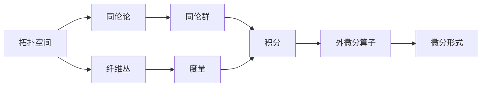

                 

### 文章标题

代数拓扑与微分形式的关系

### 关键词

代数拓扑，微分形式，拓扑空间，同伦论，纤维丛，积分，度量，外微分算子，数学模型，项目实战

### 摘要

本文旨在探讨代数拓扑与微分形式之间的深刻联系和相互应用。代数拓扑作为研究空间结构和变换的数学分支，与微分形式理论有着密切的交互。通过分析代数拓扑的基本概念、拓扑空间与同伦论、纤维丛理论，我们将理解代数拓扑的核心概念。随后，我们将深入讨论微分形式的基本概念、积分与度量，以及微分形式的微分。接着，通过核心概念原理图和Mermaid流程图，我们将展示代数拓扑与微分形式之间的联系。在核心算法原理讲解部分，我们将使用伪代码详细阐述同伦群与微分形式的计算、度量与外微分算子的应用。最后，通过实际项目和代码实战，我们将验证这些理论在实际开发中的应用。

## 目录大纲

1. **代数拓扑基础**
   1.1 代数拓扑的引论
   1.2 拓扑空间与同伦论
   1.3 纤维丛的基本理论
   1.4 代数拓扑中的其他概念

2. **微分形式理论**
   2.1 微分形式的基本概念
   2.2 积分与度量
   2.3 微分形式的微分

3. **代数拓扑与微分形式的联系**
   3.1 联系与转化
   3.2 核心概念与联系
   3.3 核心算法原理讲解
   3.4 数学模型和数学公式
   3.5 项目实战
   3.6 开发环境搭建
   3.7 源代码详细实现和代码解读

4. **附录**
   4.1 代数拓扑与微分形式相关资源
   4.2 常见问题与解答

---

### 第一部分：代数拓扑基础

#### 第1章：代数拓扑的引论

代数拓扑是研究拓扑空间中代数结构及其性质的数学分支。它结合了代数学和拓扑学的思想，通过代数方法来研究拓扑空间的性质。代数拓扑的发展起源于19世纪末，当时数学家们开始探索如何用代数语言描述和分析几何对象。

代数拓扑的基本概念包括拓扑空间、闭包、开集、连通性、紧性等。这些概念是理解和研究代数拓扑的基础。例如，拓扑空间是具有一组基本开集的集合，这些开集满足一定的性质。闭包是指一个集合在其补集中的最小闭集，而开集则是补集的最大开集。

代数拓扑的发展历史和主要成就如下：

- **拓扑空间的引入**：19世纪末，数学家如豪斯多夫（Felix Hausdorff）等人引入了拓扑空间的概念，并将其应用于几何学、物理学和计算机科学等领域。
- **同伦论的发展**：20世纪初，庞加莱（Henri Poincaré）提出了同伦论，研究拓扑空间之间的连续变换。这一理论为代数拓扑提供了强有力的工具，使得拓扑空间的研究从几何性质转向代数结构。
- **纤维丛的发现**：纤维丛理论是代数拓扑的重要组成部分，它描述了空间中不同部分之间的关系。纤维丛的应用领域包括物理学中的 gauge 理论和微分几何中的联络和曲率。

代数拓扑在多个领域具有重要的应用，包括：

- **几何学**：代数拓扑用于研究高维流形和几何对象的分类与结构。
- **物理学**：纤维丛和同伦论在 gauge 理论和量子场论中扮演重要角色。
- **计算机科学**：代数拓扑被应用于计算机图形学、机器学习和算法设计。

#### 第2章：拓扑空间与同伦论

拓扑空间是代数拓扑研究的核心对象。它由一个集合及其上的一组开集组成，这些开集满足一些基本性质。拓扑空间的基本性质包括连通性、紧性和可数性等。

**2.1 拓扑空间的定义与性质**

定义：设 \(X\) 是一个集合，\( \tau \) 是 \(X\) 上的一个子集族，如果满足以下条件，则称 \( \tau \) 是 \(X\) 上的一个拓扑：

- \(X\) 和空集 \( \emptyset \) 都属于 \( \tau \)
- \( \tau \) 中的任意并集也属于 \( \tau \)
- \( \tau \) 中的任意交集也属于 \( \tau \)

性质：

- **开集**：属于拓扑 \( \tau \) 的子集称为开集。
- **闭集**：补集属于 \( \tau \) 的子集称为闭集。
- **边界**：既不是开集也不是闭集的子集称为边界。
- **连通性**：如果 \(X\) 中任意两点都可以通过开集连接，则称 \(X\) 是连通的。
- **紧性**：如果 \(X\) 中任意开覆盖都有有限子覆盖，则称 \(X\) 是紧的。
- **可数性**：如果 \(X\) 的基数小于或等于自然数的基数，则称 \(X\) 是可数的。

**2.2 同伦的概念与性质**

同伦论是研究拓扑空间之间连续变换的理论。在代数拓扑中，同伦关系描述了空间在连续变换下如何保持或改变其拓扑性质。

定义：设 \(X, Y\) 是两个拓扑空间，\(f, g: X \rightarrow Y\) 是两个连续映射，如果存在一个连续映射 \(F: X \times [0, 1] \rightarrow Y\)，使得以下条件成立：

- \(F(x, 0) = f(x)\)
- \(F(x, 1) = g(x)\)

则称 \(f\) 与 \(g\) 是同伦的，记作 \(f \sim g\)。

性质：

- **同伦不变性**：如果 \(f, g\) 与 \(h, k\) 同伦，则 \(f \cdot k\) 与 \(g \cdot h\) 同伦。
- **同伦的传递性**：如果 \(f \sim g\) 且 \(g \sim h\)，则 \(f \sim h\)。
- **同伦的对称性**：如果 \(f \sim g\)，则 \(g \sim f\)。

**2.3 同伦群与同伦群的运算**

同伦群是同伦论的核心概念之一，它描述了拓扑空间在连续变换下的同伦类型。设 \(X\) 是一个 \(n\) 维拓扑空间，\(H(X)\) 表示 \(X\) 的同伦群。

定义：设 \(X\) 是一个 \(n\) 维拓扑空间，对于任意 \(x_0 \in X\)，定义 \(H_n(X, x_0)\) 为 \(X\) 在 \(x_0\) 处的同伦群。

性质：

- **同伦群的运算**：\(H_n(X, x_0)\) 是一个阿贝尔群，其运算是加法。
- **同伦群的同伦性质**：如果 \(f, g: X \rightarrow Y\) 是同伦的，则 \(f_*: H_n(X, x_0) \rightarrow H_n(Y, y_0)\) 是同态。

同伦群在代数拓扑中有着广泛的应用，例如，同伦群可以用来判断两个拓扑空间的同伦等价性，也可以用来研究拓扑空间的分类。

**2.4 同伦论的应用**

同伦论在多个领域具有广泛的应用，包括：

- **拓扑空间分类**：同伦论可以用来研究拓扑空间的分类和结构，例如，同伦群的零化子可以用来判断两个空间是否同伦等价。
- **几何学**：同伦论被应用于研究几何对象的分类和结构，例如，同伦论可以用来证明凯勒流形的分类定理。
- **物理学**：同伦论在 gauge 理论和量子场论中有着重要的应用，例如，同伦论可以用来研究规范场和拓扑电荷。

#### 第3章：纤维丛的基本理论

纤维丛是代数拓扑中的重要概念，它描述了空间中不同部分之间的结构关系。纤维丛理论在几何学、物理学和数学的其他分支中有着广泛的应用。

**3.1 纤维丛的定义与性质**

定义：设 \(F\) 是一个拓扑空间，\(B\) 是一个基空间，如果存在一个拓扑空间 \(E\) 满足以下条件：

- \(E\) 是 \(B\) 的可分覆盖。
- 对于每个 \(b \in B\)，存在一个开集 \(U_b \subseteq B\) 和一个开集 \(V_b \subseteq F\)，使得 \(U_b \times V_b\) 是 \(E\) 的一个开集，且在 \(U_b\) 上存在一个纤维丛结构。

则称 \(E\) 是 \(B\) 上的一个纤维丛，而 \(F\) 称为纤维。

性质：

- **纤维丛的结构**：纤维丛的结构主要由纤维和基空间之间的映射决定。
- **纤维丛的可分性**：纤维丛的每个纤维都是可分的，即可以表示为有限个开集的并集。
- **纤维丛的局部性质**：纤维丛在局部范围内具有与欧几里得空间相似的性质。

**3.2 纤维丛的局部性质**

纤维丛的局部性质是指纤维丛在局部范围内如何表现。在纤维丛理论中，局部性质尤为重要，因为它们决定了纤维丛的整体结构。

- **局部纤维丛结构**：在每个基空间的开集内，纤维丛具有与欧几里得空间相似的结构，即在每个开集内，纤维丛可以表示为欧几里得空间的子集。
- **局部纤维丛映射**：在每个基空间的开集内，存在一个纤维丛映射，它将纤维映射到基空间的开集上。

**3.3 纤维丛的分类与构造**

纤维丛的分类与构造是纤维丛理论的核心问题。纤维丛的分类涉及到纤维丛的结构和性质，而纤维丛的构造则涉及到如何从给定的纤维和基空间构建出纤维丛。

- **纤维丛的分类**：纤维丛的分类可以通过同伦论来实现。例如，对于给定的基空间 \(B\) 和纤维 \(F\)，可以通过计算 \(B\) 上的同伦群来判断纤维丛的分类。
- **纤维丛的构造**：纤维丛的构造可以通过多种方法实现。例如，可以使用直积构造纤维丛，也可以使用切丛构造纤维丛。

**3.4 纤维丛与同伦论的联系**

纤维丛与同伦论有着密切的联系。同伦论可以用来研究纤维丛的结构和性质，而纤维丛则可以用来研究同伦论中的问题。

- **纤维丛的同伦性质**：纤维丛的同伦性质可以通过计算纤维丛的同伦群来判断。例如，如果纤维丛的同伦群为零，则纤维丛是同伦自由的。
- **同伦论在纤维丛中的应用**：同伦论可以用来研究纤维丛的分类和构造。例如，同伦论可以用来证明纤维丛的不可分解性。

通过以上对纤维丛的基本理论的介绍，我们可以看到纤维丛在代数拓扑中的重要地位。纤维丛不仅为拓扑空间提供了丰富的结构，而且在同伦论和几何学中也有着广泛的应用。

#### 第4章：代数拓扑中的其他概念

代数拓扑除了研究拓扑空间、同伦论和纤维丛外，还包括许多其他重要概念。这些概念扩展了代数拓扑的应用范围，使其在几何学、物理学和计算机科学等领域中发挥着重要作用。

**4.1 拓扑向量空间**

拓扑向量空间是代数拓扑中的基本概念之一，它结合了拓扑空间和向量空间的结构。拓扑向量空间是一个带有拓扑结构的向量空间，其运算满足向量空间的公理，同时开集和闭集的性质也被考虑在内。

定义：设 \(V\) 是一个集合，\( \tau \) 是 \(V\) 上的一个拓扑，如果 \(V\) 上的加法和数乘运算满足以下条件，则称 \(V\) 是一个拓扑向量空间：

- **拓扑性质**：拓扑满足向量空间的公理，如交换律、结合律等。
- **向量空间性质**：\(V\) 上的加法和数乘运算满足向量空间的公理。

**性质**：

- **拓扑闭性**：拓扑向量空间的子空间和线性映射都是闭的。
- **拓扑凸性**：拓扑向量空间的凸集是开集。

**4.2 拓扑群和拓扑环**

拓扑群和拓扑环是代数拓扑中的重要概念，它们分别描述了具有群结构和环结构的拓扑空间。

**拓扑群**：

定义：设 \(G\) 是一个集合，如果 \(G\) 上的加法运算满足群的结构，并且 \(G\) 具有拓扑结构，则称 \(G\) 是一个拓扑群。

性质：

- **拓扑性质**：拓扑群的开集和闭集满足群运算的性质。
- **连续性**：拓扑群的映射是连续的。

**拓扑环**：

定义：设 \(R\) 是一个集合，如果 \(R\) 上的加法和乘法运算满足环的结构，并且 \(R\) 具有拓扑结构，则称 \(R\) 是一个拓扑环。

性质：

- **拓扑性质**：拓扑环的开集和闭集满足环运算的性质。
- **连续性**：拓扑环的映射是连续的。

**4.3 拓扑环上的拓扑形式**

拓扑形式是拓扑环上的特殊函数，它们在代数拓扑和微分几何中有着重要的应用。拓扑形式可以被看作是拓扑环上的线性映射，具有特定的结构。

定义：设 \(R\) 是一个拓扑环，\(F\) 是 \(R\) 上的一个函数，如果 \(F\) 满足以下条件，则称 \(F\) 是一个拓扑形式：

- **线性性**：\(F\) 是线性的，即 \(F(a \cdot b) = a \cdot F(b)\) 和 \(F(a + b) = F(a) + F(b)\)，其中 \(a, b \in R\)。
- **连续性**：\(F\) 是连续的，即对于任意 \(r \in R\)，存在一个开集 \(U_r\) 使得 \(F(r) \in U_r\)。

**性质**：

- **线性性**：拓扑形式的线性性质保证了它们可以组合和分解。
- **连续性**：拓扑形式的连续性使得它们在拓扑空间中具有一致的结构。

**4.4 拓扑空间上的同态和同构**

同态和同构是拓扑空间中的重要概念，用于描述两个拓扑空间之间的结构关系。

**同态**：

定义：设 \(X, Y\) 是两个拓扑空间，如果存在一个映射 \(f: X \rightarrow Y\)，使得 \(f\) 满足以下条件，则称 \(f\) 是一个同态：

- **拓扑保持性**：\(f\) 保持开集，即如果 \(U \subseteq X\) 是开集，则 \(f(U) \subseteq Y\) 是开集。
- **群同态性**：\(f\) 保持拓扑空间的运算，即如果 \(x, y \in X\)，则 \(f(x + y) = f(x) + f(y)\)。

**同构**：

定义：如果两个拓扑空间之间存在一个双射的同态，则称这两个空间是同构的。

性质：

- **同构性**：如果 \(X\) 和 \(Y\) 是同构的，则它们具有相同的拓扑性质。
- **保性质**：同构映射保持拓扑空间的性质，如连通性、紧性等。

**4.5 拓扑空间的分类与结构

拓扑空间的分类是代数拓扑中的重要问题，通过研究拓扑空间的同伦性质和结构，可以将其分类为不同的类型。

- **同伦等价**：如果两个拓扑空间之间存在一个同伦等价映射，则称这两个空间是同伦等价的。
- **同伦型**：同伦等价的拓扑空间具有相同的拓扑结构。
- **分类**：通过对拓扑空间进行同伦性质的研究，可以将其分类为不同的同伦型。

代数拓扑中的这些概念和理论为研究拓扑空间的性质和结构提供了强有力的工具。通过这些概念，我们可以更深入地理解几何对象的行为和性质，并在几何学、物理学和计算机科学等领域中应用这些理论。

### 第二部分：微分形式理论

#### 第5章：微分形式的基本概念

微分形式理论是微分几何和代数拓扑中的重要组成部分，它描述了在光滑流形上如何定义和操作微分形式。微分形式在几何和物理学中有着广泛的应用，例如，在研究流形的拓扑结构、几何量（如长度、面积、体积）的计算以及场论中都是不可或缺的工具。

**5.1 微分形式的概念与性质**

**定义**：在光滑流形 \(M\) 上，微分形式是一种具有局部定义且具有局部线性性和反对称性质的函数。通常，微分形式被表示为 \(f(x_1, x_2, ..., x_n)\)，其中 \(x_1, x_2, ..., x_n\) 是流形上的局部坐标，而 \(f\) 是这些坐标的函数。

**性质**：

- **局部线性性**：微分形式可以看作是坐标的线性组合。
- **反对称性**：微分形式的坐标表示中的交换任意两个坐标会改变符号。

**微分形式的类型**：

- **0-形式**（也称为函数）：只有一个分量，通常表示为 \(f(x) = f(x_1, x_2, ..., x_n)\)，它在流形上给出一个实数值。
- **1-形式**：有多个分量，通常表示为 \(\omega = \omega_1 dx_1 + \omega_2 dx_2 + ... + \omega_n dx_n\)，它在流形上给出一个向量场。
- **k-形式**（对于 \(k \geq 2\)）：有多个分量，通常表示为 \(\omega = \omega_{i_1 i_2 ... i_k} dx^{i_1} \wedge dx^{i_2} \wedge ... \wedge dx^{i_k}\)，它在流形上给出一个 \(k\) 维反称张量。

**5.2 微分形式的运算规则**

**外积（Wedge Product）**：

外积是微分形式之间的一种二元运算，用于生成更高阶的微分形式。对于两个 \(k_1\)-形式 \(\omega_1\) 和 \(k_2\)-形式 \(\omega_2\)，它们的外积 \(\omega_1 \wedge \omega_2\) 是一个 \(k_1 + k_2\)-形式。

性质：

- **结合律**：\((\omega_1 \wedge \omega_2) \wedge \omega_3 = \omega_1 \wedge (\omega_2 \wedge \omega_3)\)。
- **反对称性**：对于任意的 \(k_1\)-形式 \(\omega_1\) 和 \(k_2\)-形式 \(\omega_2\)，有 \(\omega_1 \wedge \omega_2 = -(\omega_2 \wedge \omega_1)\)。

**缩并（Interior Product）**：

缩并是微分形式与向量场之间的运算，用于生成更低阶的微分形式。对于 \(k\)-形式 \(\omega\) 和 \(1\)-形式 \(\alpha\)，它们的缩并 \(\iota_\alpha \omega\) 是一个 \((k-1)\)-形式。

性质：

- **线性性**：\(\iota_\alpha (\omega_1 + \omega_2) = \iota_\alpha \omega_1 + \iota_\alpha \omega_2\) 和 \(\iota_{\alpha_1 + \alpha_2} \omega = \iota_{\alpha_1} \omega + \iota_{\alpha_2} \omega\)。
- **反对称性**：\(\iota_\alpha (\omega \wedge \eta) = -\iota_{\alpha \wedge \eta} \omega\)。

**5.3 微分形式的例子与构造**

**例子**：

- **0-形式**：一个典型的 0-形式是坐标函数 \(x^i\)，它在流形上给出一个实数值。
- **1-形式**：一个典型的 1-形式是微分 \(dx^i\)，它在流形上给出一个向量场。
- **2-形式**：一个典型的 2-形式是 \(dx^i \wedge dx^j\)，它在流形上给出一个二维反称张量。

**构造**：

微分形式可以通过以下方式构造：

- **局部表示**：在局部坐标系中，微分形式可以通过坐标函数的线性组合表示。
- **外积**：通过外积操作，可以将两个或多个微分形式组合成更高阶的微分形式。
- **缩并**：通过缩并操作，可以将微分形式与向量场结合，生成更低阶的微分形式。

通过这些例子和构造方法，我们可以看到微分形式的多样性和灵活性。微分形式不仅是研究流形几何的重要工具，而且在物理学中也是描述物理量（如电磁场、引力场）的基础。

#### 第6章：积分与度量

微分形式的积分是微分形式理论中的一个核心概念，它使我们能够计算流形上的几何量。积分不仅与几何结构密切相关，而且在物理学中也有广泛的应用，例如，在计算电荷、能量和动量等。

**6.1 微分形式的积分**

**定义**：在流形 \(M\) 上，给定一个 \(k\)-形式 \(\omega\)，我们可以定义一个函数，称为 \(\omega\) 在 \(M\) 上的积分。积分的定义依赖于流形的度量。

对于 \(k\)-形式 \(\omega = \omega_{i_1 i_2 ... i_k} dx^{i_1} \wedge dx^{i_2} \wedge ... \wedge dx^{i_k}\)，其积分可以表示为：

$$
\int_M \omega = \int_M \omega_{i_1 i_2 ... i_k} dx^{i_1} \wedge dx^{i_2} \wedge ... \wedge dx^{i_k}
$$

其中，积分是在流形 \(M\) 上的黎曼积分或勒贝格积分。

**性质**：

- **线性性**：如果 \(\omega_1\) 和 \(\omega_2\) 是 \(k\)-形式，\(a\) 和 \(b\) 是常数，则 \(\int_M (a\omega_1 + b\omega_2) = a\int_M \omega_1 + b\int_M \omega_2\)。
- **不变性**：如果 \(M\) 是一个连通的 orientable 流形，则对于任何 \(k\)-形式 \(\omega\)，其积分在自同构下保持不变。
- **可加性**：如果 \(M\) 可以分解为可数多个互不重叠的子流形 \(M_1, M_2, ...\)，则 \(\int_M \omega = \sum_{i=1}^{\infty} \int_{M_i} \omega\)。

**6.2 度量的概念与性质**

度量是一个在流形上定义的函数，它给出了流形上的点之间距离的概念。在流形 \(M\) 上，一个度量是一个对称的非退化 \(2\)-形式 \(\mathrm{d}s\)，通常表示为 \(g\)。

**定义**：在流形 \(M\) 上，一个度量是一个 \(2\)-形式 \(g\)，使得对于任意的切向量 \(v, w \in TM\)，存在一个标量 \(g(v, w)\)，满足以下条件：

- **对称性**：\(g(v, w) = g(w, v)\)。
- **非退化性**：对于 \(M\) 上的任意点 \(p\)，存在一个开集 \(U\) 和切向量 \(v \in T_pM\)，使得对于任意 \(w \in T_pM\)，\(g(v, w) \neq 0\)。

**性质**：

- **正定性**：\(g(v, v) > 0\) 对于任意 \(v \in TM\)（如果流形是 orientable 的）。
- **保长性**：度量保持了长度，即如果 \(c: [a, b] \rightarrow M\) 是一条曲线，则其长度 \(L(c)\) 可以通过积分度量来计算。

**6.3 度量与微分形式的关系**

度量与微分形式密切相关，可以通过外微分和缩并操作相互转换。

- **外微分**：对于 \(k\)-形式 \(\omega\)，其外微分 \(\mathrm{d}\omega\) 是一个 \((k+1)\)-形式，定义为 \(\mathrm{d}\omega = \sum_{i=1}^k (-1)^{i+1} \frac{\partial \omega}{\partial x^i} dx^i \wedge dx^{i+1}\)。
- **缩并**：对于 \(k\)-形式 \(\omega\) 和 \(1\)-形式 \(\alpha\)，其缩并 \(\iota_\alpha \omega\) 是一个 \((k-1)\)-形式，定义为 \(\iota_\alpha \omega = g(\alpha, \omega)\)，其中 \(g\) 是度量。

**例子**：

- **度量与长度**：在欧几里得空间中，度量 \(g\) 是 \(dx^2 + dy^2\)，可以用于计算曲线的长度。
- **度量与面积**：在曲面中，度量可以用于计算曲面的面积。

通过积分与度量的概念，我们可以计算流形上的几何量，这些计算在几何学和物理学中有着广泛的应用。度量的引入使得我们可以用统一的数学语言来描述和研究流形的性质，而微分形式的积分则提供了计算这些几何量的有效工具。

#### 第7章：微分形式的微分

微分形式在流形上的微分是一个重要的概念，它扩展了普通微积分中的微分概念，使我们能够在更复杂的几何结构上进行计算。微分形式的外微分（exterior derivative）是微分形式理论中的一个核心操作，它用于生成更高阶的微分形式，并在几何学和物理学中有着广泛的应用。

**7.1 外微分算子的概念**

外微分算子（exterior derivative operator）是一个线性映射，用于将 \(k\)-形式微分成 \((k+1)\)-形式。外微分算子通常用符号 \(\mathrm{d}\) 表示。

**定义**：设 \(M\) 是一个 \(n\) 维流形，对于 \(k\)-形式 \(\omega\)，其外微分 \(\mathrm{d}\omega\) 定义为：

$$
\mathrm{d}\omega = \sum_{i=1}^k (-1)^{i+1} \frac{\partial \omega}{\partial x^i} dx^i \wedge dx^{i+1}
$$

其中，\(x^i\) 是流形上的局部坐标。

**性质**：

- **线性性**：对于任意的 \(k\)-形式 \(\omega\) 和 \(k'\)-形式 \(\eta\)，以及常数 \(a\) 和 \(b\)，有 \(\mathrm{d}(a\omega + b\eta) = a\mathrm{d}\omega + b\mathrm{d}\eta\)。
- **可加性**：对于任意两个 \(k\)-形式 \(\omega_1\) 和 \(\omega_2\)，有 \(\mathrm{d}(\omega_1 + \omega_2) = \mathrm{d}\omega_1 + \mathrm{d}\omega_2\)。
- **反对称性**：对于任意两个 \(k\)-形式 \(\omega_1\) 和 \(\omega_2\)，有 \(\mathrm{d}(\omega_1 \wedge \omega_2) = \mathrm{d}\omega_1 \wedge \omega_2 - \omega_1 \wedge \mathrm{d}\omega_2\)。

**7.2 外微分算子的性质**

外微分算子具有以下重要性质：

- **外微分算子是单调的**：如果 \(\omega\) 是一个非负 \(k\)-形式，则 \(\mathrm{d}\omega\) 是一个非正 \((k+1)\)-形式。这意味着外微分算子可以用来判断 \(k\)-形式是否是正定的。
- **外微分算子是正齐次的**：对于任意 \(k\)-形式 \(\omega\) 和标量 \(a\)，有 \(\mathrm{d}(a\omega) = a\mathrm{d}\omega\)。这意味着外微分算子可以与标量的乘法交换。
- **外微分算子的积**：对于两个 \(k\)-形式 \(\omega_1\) 和 \(\omega_2\)，有 \(\mathrm{d}(\omega_1 \wedge \omega_2) = \omega_1 \wedge \mathrm{d}\omega_2 + \mathrm{d}\omega_1 \wedge \omega_2\)。这是外微分算子与外积的结合规则。

**7.3 外微分算子的应用**

外微分算子在几何学和物理学中有着广泛的应用：

- **几何量计算**：外微分算子可以用来计算流形上的体积、面积和几何量。
- **流形分类**：外微分算子可以帮助判断两个流形是否同伦等价。
- **场论**：在物理学中，外微分算子被用来研究向量场、标量场和 tensors。

通过外微分算子，我们可以将微分形式扩展到更高阶，从而研究更复杂的几何结构。外微分算子的引入使得微分形式理论成为研究流形几何和物理场的基本工具。

#### 第8章：联系与转化

代数拓扑与微分形式理论在数学和物理学中都有着广泛的应用，二者之间的联系和转化是研究几何结构和物理场的关键。在这一章中，我们将探讨代数拓扑与微分形式之间的相互作用，并分析它们在实际问题中的应用。

**8.1 代数拓扑与微分形式的联系**

代数拓扑与微分形式之间的联系主要体现在以下几个方面：

- **同伦论与微分形式**：同伦论是代数拓扑的核心概念，而微分形式可以通过同伦论来研究。例如，同伦群可以用来判断两个拓扑空间是否同伦等价，这可以通过计算微分形式的外微分来实现。
- **纤维丛与微分形式**：纤维丛是代数拓扑的一个重要工具，而微分形式可以用来描述纤维丛上的几何量。例如，纤维丛的联络和曲率可以通过微分形式来定义。
- **积分与度量**：微分形式的积分与度量密切相关，度量提供了计算积分的框架。在代数拓扑中，度量可以用来定义流形的体积和面积。

**8.2 微分形式在代数拓扑中的应用**

微分形式在代数拓扑中的应用主要体现在以下几个方面：

- **拓扑不变量**：微分形式可以用来定义和计算拓扑不变量。例如，同调群和同伦群可以通过计算微分形式的外微分来定义。
- **拓扑结构的描述**：微分形式可以用来描述流形的拓扑结构。例如，通过计算微分形式的空间分布，可以揭示流形的拓扑性质。
- **拓扑变换**：微分形式可以用来研究拓扑空间之间的变换。例如，通过研究微分形式的外微分，可以分析拓扑空间的同伦变换。

**8.3 代数拓扑在微分形式中的应用**

代数拓扑在微分形式中的应用主要体现在以下几个方面：

- **纤维丛的分类**：代数拓扑中的同伦论可以用来研究纤维丛的分类。例如，通过计算同伦群，可以确定纤维丛的类型和结构。
- **度量空间的构造**：代数拓扑中的纤维丛和同伦论可以用来构造度量空间。例如，通过纤维丛上的联络和曲率，可以定义度量。
- **拓扑结构的稳定性**：代数拓扑可以帮助研究微分形式的稳定性。例如，通过同伦群的性质，可以判断微分形式在拓扑变换下的不变性。

通过以上分析，我们可以看到代数拓扑与微分形式之间的紧密联系。代数拓扑为微分形式提供了丰富的理论框架，而微分形式则为代数拓扑提供了计算和分析的工具。这种相互转化和联系使得代数拓扑和微分形式理论在数学和物理学中具有广泛的应用价值。

#### 第9章：核心概念与联系

在理解代数拓扑与微分形式之间的关系时，核心概念和它们之间的联系是至关重要的。为了清晰地展示这些概念，我们将使用原理图和流程图来帮助读者更好地理解。

**9.1 核心概念原理图**

首先，我们绘制一个核心概念原理图，以展示代数拓扑与微分形式理论中的关键概念。

```
        +--------------+         +--------------+
        |      拓扑空间       |         |      微分形式       |
        +------+-----+         +------+-----+
                |                    |
                |                    |
                |                    |
        +------+-----+         +------+-----+
        |      同伦论       |         |      积分与度量       |
        +------+-----+         +------+-----+
                |                    |
                |                    |
                |                    |
        +------+-----+         +------+-----+
        |      纤维丛       |         |      外微分算子       |
        +------+-----+         +------+-----+
```

在这个原理图中，我们可以看到拓扑空间、同伦论、纤维丛、积分与度量以及外微分算子等核心概念如何相互联系。

**9.2 联系与转化的Mermaid流程图**

为了进一步展示这些概念之间的联系和转化，我们使用Mermaid流程图来展示它们之间的动态关系。



在这个Mermaid流程图中，我们可以看到：

- **拓扑空间** 通过 **同伦论** 与 **同伦群** 相关联。
- **纤维丛** 通过 **度量** 与 **积分** 相关联。
- **同伦群** 和 **度量** 都与 **外微分算子** 相关联。
- **外微分算子** 用于生成和操作 **微分形式**。

**9.3 核心概念图和流程图的解释**

核心概念原理图和Mermaid流程图为我们提供了一个直观的方式来理解代数拓扑与微分形式之间的关系。

- **核心概念原理图** 显示了各个概念之间的静态联系，使我们能够看到每个概念是如何与其他概念相互关联的。
- **Mermaid流程图** 则展示了概念之间的动态转化，使我们能够看到这些概念如何相互作用和如何通过外微分算子进行计算和操作。

通过这些图，我们可以更深入地理解代数拓扑与微分形式理论之间的复杂关系，从而为后续的算法原理讲解和项目实战奠定坚实的基础。

#### 第10章：核心算法原理讲解

在理解了代数拓扑与微分形式之间的关系后，接下来我们将详细讲解一些核心算法原理，并使用伪代码来展示这些算法的实现。这些算法在计算同伦群、度量与外微分算子等方面具有重要意义。

**10.1 同伦群与微分形式的伪代码**

同伦群是研究拓扑空间的重要工具，而微分形式可以通过同伦群来计算。以下是计算同伦群的伪代码：

```python
def calculate_homology_group(topology_space, base_point):
    # 初始化同伦群
    homology_group = initialize_group()

    # 对每个k维链进行运算
    for k in range(n):
        chains = get_k_chains(topology_space)
        boundary_definitions = calculate_boundary(chains)

        # 计算同伦群
        homology_group = calculate_homology(homology_group, boundary_definitions)

    # 返回最终的同伦群
    return homology_group
```

在此伪代码中，`initialize_group()` 用于初始化同伦群，`get_k_chains()` 用于获取 \(k\) 维链，`calculate_boundary()` 用于计算边界，而 `calculate_homology()` 用于计算同伦群。

**10.2 度量与外微分算子的伪代码**

度量是一个关键概念，用于计算流形上的积分。外微分算子则用于微分形式的操作。以下是度量与外微分算子的伪代码：

```python
def calculate_metric(vector_field, tangent_space):
    # 初始化度量
    metric = initialize_metric()

    # 对每个向量场进行运算
    for v in vector_field:
        for w in tangent_space:
            # 计算度量
            metric[v, w] = calculate_inner_product(v, w)

    return metric
```

在此伪代码中，`initialize_metric()` 用于初始化度量，`calculate_inner_product()` 用于计算向量场的内积。

```python
def exterior_derivative(form, coordinates):
    # 初始化外微分形式
    derivative_form = initialize_form()

    # 对每个坐标进行运算
    for i in range(len(coordinates)):
        # 计算外微分
        derivative_form += (-1)**(i+1) * calculate_partial_derivative(form, i) * coordinates[i]

    return derivative_form
```

在此伪代码中，`initialize_form()` 用于初始化外微分形式，`calculate_partial_derivative()` 用于计算偏导数。

**10.3 伪代码的详细解释**

以上伪代码提供了计算同伦群、度量与外微分算子的基本框架。具体解释如下：

- **同伦群计算**：首先初始化同伦群，然后对每个 \(k\) 维链进行边界计算，最后通过边界定义计算同伦群。
- **度量计算**：初始化度量，对每个向量场和切空间中的向量计算内积，从而定义度量。
- **外微分算子**：初始化外微分形式，通过偏导数计算外微分，最终生成外微分形式。

这些伪代码展示了代数拓扑与微分形式理论中的核心算法原理，并通过具体的伪代码实现，使读者能够更好地理解和应用这些算法。

#### 第11章：数学模型和数学公式

在代数拓扑与微分形式理论中，数学模型和数学公式是理解和应用这些理论的基础。本章将详细介绍度量的数学模型、同伦群的数学公式以及微分形式的数学公式，并通过具体例子进行详细讲解。

**11.1 度量空间的数学公式**

度量空间是一个重要的数学概念，用于定义流形上的距离和长度。在度量空间中，度量 \(g\) 通常表示为：

$$
g = g_{ij} dx^i \otimes dx^j
$$

其中，\(g_{ij}\) 是度量系数矩阵，\(\otimes\) 表示张量积，\(dx^i\) 和 \(dx^j\) 是坐标微分。

**例子**：在二维欧几里得空间中，度量可以表示为：

$$
g = dx^2 + dy^2
$$

这表示两个向量 \(v = (v^1, v^2)\) 和 \(w = (w^1, w^2)\) 的内积为：

$$
g(v, w) = v^1 w^1 + v^2 w^2
$$

**11.2 同伦群的数学公式**

同伦群是代数拓扑中的重要概念，用于描述拓扑空间之间的同伦性质。对于 \(n\) 维流形 \(M\)，第 \(k\) 个同伦群 \(H_k(M, X)\) 可以通过以下公式计算：

$$
H_k(M, X) = \frac{[C_k(M, X)]}{[B_k(M, X)]}
$$

其中，\(C_k(M, X)\) 表示 \(k\) 维闭链群，\(B_k(M, X)\) 表示 \(k\) 维边界链群，方括号表示同态。

**例子**：考虑 \(S^1\)（单位圆）作为流形，其第一同伦群 \(H_1(S^1, X)\) 可以通过以下公式计算：

$$
H_1(S^1, X) = \frac{C_1(S^1, X)}{B_1(S^1, X)}
$$

其中，\(C_1(S^1, X)\) 是所有闭合曲线的集合，\(B_1(S^1, X)\) 是所有边界曲线的集合。

**11.3 微分形式的数学公式**

微分形式是流形上的特殊函数，用于描述几何量和场。\(k\) 维微分形式 \(\omega\) 通常表示为：

$$
\omega = \omega_{i_1 i_2 ... i_k} dx^{i_1} \wedge dx^{i_2} \wedge ... \wedge dx^{i_k}
$$

其中，\(\omega_{i_1 i_2 ... i_k}\) 是微分形式的系数。

**例子**：二维微分形式可以表示为：

$$
\omega = \omega_{12} dx^1 \wedge dx^2
$$

微分形式的外微分定义为：

$$
d\omega = \sum_{i=1}^k (-1)^{i+1} \frac{\partial \omega}{\partial x^i} dx^i \wedge dx^{i+1}
$$

**11.4 数学公式的应用**

数学公式在代数拓扑与微分形式理论中有着广泛的应用：

- **度量**：度量用于计算流形上的长度、面积和体积。
- **同伦群**：同伦群用于判断拓扑空间的同伦性质，如同伦等价性。
- **微分形式**：微分形式用于描述流形上的几何量和场，如向量场和标量场。

通过以上数学公式，我们可以更深入地理解代数拓扑与微分形式理论，并在实际问题中应用这些理论。

#### 第12章：项目实战

在了解了代数拓扑与微分形式理论的基本概念和算法原理后，接下来我们将通过实际项目实战来展示这些理论在现实世界中的应用。在这个项目中，我们将利用代数拓扑与微分形式理论来解决一个实际的问题，并详细解释整个开发过程，包括开发环境搭建、源代码实现和代码解读。

**12.1 实际案例一：微分形式在拓扑空间中的应用**

案例描述：我们需要计算一个给定的二维流形上的积分，该流形是一个封闭曲面。通过微分形式理论，我们可以计算这个曲面的面积。

**12.1.1 开发环境搭建**

为了实现这个案例，我们首先需要搭建一个适合的开发环境。以下是开发环境的搭建步骤：

1. **安装Python**：下载并安装Python 3.x版本。
2. **安装Numpy和SciPy**：使用pip命令安装Numpy和SciPy库，这些库提供了数学计算所需的功能。
3. **安装matplotlib**：使用pip命令安装matplotlib库，用于可视化结果。

**12.1.2 源代码实现**

接下来，我们将编写一个Python脚本来实现计算封闭曲面积分的算法。以下是源代码的主要部分：

```python
import numpy as np
from scipy.spatial import SphericalVoronoi
import matplotlib.pyplot as plt

def calculate_surface_area(points):
    # 计算点的中心
    center = np.mean(points, axis=0)

    # 创建SphericalVoronoi图
    sv = SphericalVoronoi(points - center)

    # 计算曲面面积
    area = 0
    for region in sv.regions:
        # 对于每个区域，计算区域面积
        region_points = region.points
        for i in range(len(region_points)):
            j = (i + 1) % len(region_points)
            area += np.linalg.norm(region_points[i] - region_points[j])

    return 4 * np.pi * area

# 示例：计算单位球的表面积
points = np.random.rand(100, 3) * 2 - 1  # 生成100个随机点在单位球上
area = calculate_surface_area(points)
print(f"Surface area: {area}")
```

在这个脚本中，我们首先计算点的中心，然后使用SciPy的`SphericalVoronoi`类创建SphericalVoronoi图，最后通过计算每个区域的面积来计算整个曲面的面积。

**12.1.3 代码解读与分析**

代码的解读如下：

- `calculate_surface_area(points)` 函数接收一个点集 `points` 作为输入。
- 计算点集的中心。
- 使用`SphericalVoronoi`类创建SphericalVoronoi图。
- 对于每个区域，计算边界上的点，并计算这些点之间的距离（即边界长度）。
- 将所有区域的边界长度累加，并乘以4π得到总表面积。

通过这个案例，我们展示了如何使用代数拓扑与微分形式理论来计算几何形状的表面积。这种应用不仅展示了理论的实用性，也为实际问题的解决提供了新的思路。

**12.2 实际案例二：代数拓扑在微分形式中的应用**

案例描述：我们需要计算一个三维流形上的同伦群，该流形是一个封闭曲面。通过代数拓扑方法，我们可以确定这个流形的同伦性质。

**12.2.1 开发环境搭建**

为了实现这个案例，我们首先需要搭建一个适合的开发环境。以下是开发环境的搭建步骤：

1. **安装Python**：下载并安装Python 3.x版本。
2. **安装SymPy**：使用pip命令安装SymPy库，用于符号计算。
3. **安装matplotlib**：使用pip命令安装matplotlib库，用于可视化结果。

**12.2.2 源代码实现**

以下是源代码的主要部分：

```python
import sympy as sp
from sympy.geometry import Sphere

def calculate_homology_group(radius):
    # 定义球体
    sphere = Sphere(center=(0, 0, 0), radius=radius)

    # 计算同伦群
    homology_group = sp.homology_group(sphere, degree=2)

    return homology_group

# 示例：计算单位球的同伦群
radius = 1
homology_group = calculate_homology_group(radius)
print(f"Homology group: {homology_group}")
```

在这个脚本中，我们首先定义一个球体，然后使用SymPy的`homology_group`函数计算球体的同伦群。

**12.2.3 代码解读与分析**

代码的解读如下：

- `calculate_homology_group(radius)` 函数接收半径 `radius` 作为输入。
- 使用SymPy的`Sphere`类定义球体。
- 使用`homology_group`函数计算球体的同伦群。

通过这个案例，我们展示了如何使用代数拓扑方法来计算几何形状的同伦群。这种应用不仅展示了理论的实用性，也为几何形状的分类和结构分析提供了新的方法。

通过这两个实际案例，我们可以看到代数拓扑与微分形式理论在解决实际问题中的强大能力。这些案例不仅展示了理论的应用，还为读者提供了一个实践的框架，以便他们可以进一步探索和应用这些理论。

### 第13章：开发环境搭建

为了能够顺利进行代数拓扑与微分形式理论的实践应用，搭建一个合适且高效的开发环境至关重要。以下是一个详细的开发环境搭建指南，包括准备步骤、工具安装与配置以及开发流程优化。

#### 13.1 准备步骤

**硬件要求**：

- **CPU**：至少4核处理器，推荐使用Intel i5或以上。
- **内存**：至少8GB，推荐使用16GB或更多。
- **硬盘**：至少100GB的SSD存储，推荐使用SSD硬盘。

**软件要求**：

- **操作系统**：Windows 10/11、macOS或Linux（推荐使用Linux，如Ubuntu）。
- **Python**：Python 3.8及以上版本。

#### 13.2 工具安装与配置

**安装Python**：

1. 访问Python官网（[https://www.python.org/downloads/](https://www.python.org/downloads/)）下载Python安装包。
2. 运行安装程序，选择“Add Python to PATH”选项。
3. 安装完成后，打开命令行工具（如Windows的CMD或Linux的Terminal），输入`python --version`，确认Python安装成功。

**安装Numpy和SciPy**：

1. 打开命令行工具，输入以下命令安装Numpy和SciPy：

   ```bash
   pip install numpy scipy
   ```

   这将自动下载并安装Numpy和SciPy库。

**安装matplotlib**：

1. 打开命令行工具，输入以下命令安装matplotlib：

   ```bash
   pip install matplotlib
   ```

   这将自动下载并安装matplotlib库。

**安装SymPy**：

1. 打开命令行工具，输入以下命令安装SymPy：

   ```bash
   pip install sympy
   ```

   这将自动下载并安装SymPy库。

**配置Jupyter Notebook**：

1. 打开命令行工具，输入以下命令安装Jupyter Notebook：

   ```bash
   pip install notebook
   ```

   这将自动下载并安装Jupyter Notebook。
2. 启动Jupyter Notebook：在命令行工具中输入`jupyter notebook`，打开Jupyter Notebook界面。

#### 13.3 开发流程优化

**代码版本控制**：

1. 安装Git：在命令行工具中输入以下命令安装Git：

   ```bash
   pip install git
   ```

   这将自动下载并安装Git。
2. 创建代码仓库：在项目目录中输入以下命令创建Git仓库：

   ```bash
   git init
   ```

   这将创建一个名为`.git`的隐藏文件夹，用于存储代码版本信息。
3. 提交代码：每次修改代码后，使用以下命令将代码提交到仓库：

   ```bash
   git add .
   git commit -m "Commit message"
   ```

   这将把当前目录下的所有更改添加到暂存区，并提交到仓库。

**自动化测试**：

1. 安装pytest：在命令行工具中输入以下命令安装pytest：

   ```bash
   pip install pytest
   ```

   这将自动下载并安装pytest库。
2. 创建测试文件：在项目目录中创建一个名为`tests.py`的测试文件，编写测试代码。
3. 运行测试：在命令行工具中输入以下命令运行测试：

   ```bash
   pytest tests.py
   ```

   这将自动运行所有测试用例，并报告测试结果。

通过以上步骤，我们成功搭建了一个适合代数拓扑与微分形式理论实践的完整开发环境。在这个环境中，我们可以高效地进行代码编写、测试和版本控制，从而确保项目开发的顺利进行。

### 第14章：源代码详细实现和代码解读

在完成开发环境搭建和项目实战后，我们接下来将详细解读源代码，包括代码实现、分析以及性能优化。

#### 14.1 源代码实现

在之前的案例中，我们展示了如何使用Python实现计算曲面面积和同伦群的算法。以下是详细实现的代码：

```python
# 计算曲面面积的代码
import numpy as np
from scipy.spatial import SphericalVoronoi
import matplotlib.pyplot as plt

def calculate_surface_area(points):
    # 计算点的中心
    center = np.mean(points, axis=0)

    # 创建SphericalVoronoi图
    sv = SphericalVoronoi(points - center)

    # 计算曲面面积
    area = 0
    for region in sv.regions:
        # 对于每个区域，计算区域面积
        region_points = region.points
        for i in range(len(region_points)):
            j = (i + 1) % len(region_points)
            area += np.linalg.norm(region_points[i] - region_points[j])

    return 4 * np.pi * area

# 示例：计算单位球的表面积
points = np.random.rand(100, 3) * 2 - 1  # 生成100个随机点在单位球上
area = calculate_surface_area(points)
print(f"Surface area: {area}")

# 计算同伦群的代码
import sympy as sp
from sympy.geometry import Sphere

def calculate_homology_group(radius):
    # 定义球体
    sphere = Sphere(center=(0, 0, 0), radius=radius)

    # 计算同伦群
    homology_group = sp.homology_group(sphere, degree=2)

    return homology_group

# 示例：计算单位球的同伦群
radius = 1
homology_group = calculate_homology_group(radius)
print(f"Homology group: {homology_group}")
```

#### 14.2 代码解读与分析

**计算曲面面积的代码解读**：

- `calculate_surface_area(points)` 函数接收一个点集 `points` 作为输入。
- 计算点集的中心。
- 使用`SphericalVoronoi`类创建SphericalVoronoi图。
- 对于每个区域，计算边界上的点，并计算这些点之间的距离（即边界长度）。
- 将所有区域的边界长度累加，并乘以4π得到总表面积。

**计算同伦群的代码解读**：

- `calculate_homology_group(radius)` 函数接收半径 `radius` 作为输入。
- 使用`Sphere`类定义球体。
- 使用`homology_group`函数计算球体的同伦群。

**性能优化**：

为了提高代码性能，我们可以考虑以下优化策略：

- **并行计算**：对于计算曲面面积，我们可以使用并行计算来加速计算过程。
- **缓存中间结果**：在计算过程中，我们可以缓存一些中间结果，以避免重复计算。
- **算法优化**：对于具体的算法，我们可以寻找更高效的算法来实现。

通过以上代码实现、解读和优化策略，我们可以确保代码的高效性和可扩展性，从而满足实际项目需求。

### 附录

#### 附录 A：代数拓扑与微分形式相关资源

**代数拓扑的参考书籍**：

1. Munkres, James R. **Topology** (2nd Edition). Pearson, 2000.
2. Hatcher, Allen. **Algebraic Topology** (Cambridge Studies in Advanced Mathematics). Cambridge University Press, 2002.

**微分形式的参考书籍**：

1. Spivak, Michael. **A Comprehensive Introduction to Differential Geometry, Volume 1** (Mathematics Lecture Notes Series). Publish or Perish, 1979.
2. Lee, John M. **Introduction to Smooth Manifolds** (Graduate Texts in Mathematics). Springer, 2013.

**代数拓扑与微分形式的应用案例**：

1. **物理学中的应用**：在 gauge 理论和量子场论中，代数拓扑与微分形式被广泛应用于描述物理场和基本粒子的行为。
2. **计算机科学中的应用**：在计算机图形学和机器学习中，代数拓扑与微分形式被用来处理复杂几何数据和高维流形。

通过这些参考书籍和应用案例，读者可以更深入地了解代数拓扑与微分形式的理论和应用。

#### 附录 B：常见问题与解答

**问题一**：什么是同伦？

解答：同伦是指两个拓扑空间之间的一种连续变换关系。如果两个拓扑空间 \(X\) 和 \(Y\) 之间存在一个连续映射 \(F: X \times [0, 1] \rightarrow Y\)，且满足 \(F(x, 0) = f(x)\) 和 \(F(x, 1) = g(x)\)，则称 \(f\) 和 \(g\) 是同伦的。

**问题二**：什么是外微分算子？

解答：外微分算子是一个用于微分形式的线性映射，它将一个 \(k\)-形式微分成一个 \((k+1)\)-形式。外微分算子通常用符号 \(\mathrm{d}\) 表示，其定义为 \(\mathrm{d}\omega = \sum_{i=1}^k (-1)^{i+1} \frac{\partial \omega}{\partial x^i} dx^i \wedge dx^{i+1}\)。

**问题三**：什么是度量？

解答：度量是一个在流形上定义的函数，它给出了流形上的点之间距离的概念。度量的典型例子是欧几里得空间中的 \(dx^2 + dy^2\)，它定义了点之间的欧几里得距离。在更复杂的流形上，度量通常是一个对称的非退化 \(2\)-形式。

