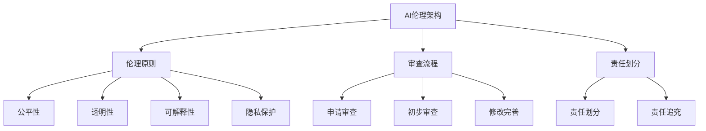

                 

### 文章标题

《企业AI伦理：Lepton AI的社会责任》

### 关键词

AI伦理、社会责任、Lepton AI、企业AI、数据隐私、可持续发展

### 摘要

随着人工智能技术的迅猛发展，其在各行各业的应用日益广泛。然而，AI技术的广泛应用也引发了一系列伦理和社会责任问题。本文以Lepton AI为例，探讨了企业在AI应用中应承担的社会责任，并分析了AI伦理在实践中的应用。文章旨在为企业在AI领域的伦理实践提供参考，以促进AI技术的可持续发展。

## 第一部分：AI伦理概述

### 1.1 AI伦理的定义与重要性

AI伦理是指研究人工智能系统在社会、环境、技术等领域中的伦理问题，以及如何确保AI系统在设计和应用中符合道德规范的一系列原则和标准。随着人工智能技术的迅猛发展，AI伦理的重要性日益凸显。AI伦理的设立不仅有助于保障AI系统的公正性、透明性和安全性，还能够有效防止AI技术被滥用，确保其对社会和环境产生积极影响。

### 1.2 AI伦理的基本原则

AI伦理的基本原则主要包括：公平性、透明性、可解释性、隐私保护、责任明确等。公平性要求AI系统在处理数据和应用中不歧视任何群体；透明性要求AI系统的决策过程和算法应当对用户透明；可解释性要求AI系统的决策结果和原因能够被用户理解；隐私保护要求AI系统在处理个人数据时确保用户隐私不被泄露；责任明确要求在AI系统出现问题时，责任能够明确划分。

### 1.3 AI伦理的发展历程

AI伦理的发展历程可以追溯到20世纪80年代，当时学者们开始关注人工智能技术可能带来的伦理问题。随着人工智能技术的快速发展，AI伦理逐渐成为学术界和产业界关注的焦点。近年来，各国政府和国际组织纷纷出台AI伦理指导原则和法规，推动AI伦理的规范化和国际化。

### 1.4 AI伦理的关键领域

AI伦理的关键领域包括：数据隐私、算法公平性、人工智能与就业、人工智能武器化等。数据隐私方面，AI系统在处理个人数据时，需要严格遵守隐私保护原则，确保用户隐私不被泄露。算法公平性方面，AI系统在处理数据和应用时，应确保不歧视任何群体。人工智能与就业方面，AI技术的发展可能对就业市场产生影响，需要关注如何平衡技术进步与就业机会。人工智能武器化方面，AI技术在军事领域的应用引发了一系列伦理问题，需要加强对AI武器化的监管。

## 第二部分：Lepton AI的社会责任

### 2.1 Lepton AI简介

Lepton AI是一家专注于人工智能技术研发和商业应用的企业，成立于2015年。公司致力于推动人工智能技术在各行业的应用，帮助客户实现智能化升级。Lepton AI的核心技术包括计算机视觉、自然语言处理、深度学习等，其产品广泛应用于金融、医疗、零售、安防等领域。

### 2.2 Lepton AI的社会责任框架

Lepton AI的社会责任框架主要包括：企业社会责任、环境责任、员工权益保护等。在企业社会责任方面，Lepton AI关注技术创新与社会进步的紧密结合，积极推动AI技术在解决社会问题中的应用。在环境责任方面，Lepton AI致力于绿色环保，通过节能减排、资源回收等方式降低对环境的影响。在员工权益保护方面，Lepton AI注重员工福利和职业发展，为员工提供良好的工作环境和培训机会。

### 2.3 Lepton AI的社会责任实践

Lepton AI在社会责任方面的实践主要体现在以下几方面：首先，公司积极参与公益活动，为社会做出贡献。例如，Lepton AI曾参与多个公益活动，为贫困地区提供免费医疗设备和技术支持。其次，公司关注员工权益，为员工提供良好的工作环境和职业发展空间。例如，公司设立员工培训基金，为员工提供专业技能培训。最后，公司注重环境保护，通过节能减排、资源回收等方式降低对环境的影响。

### 2.4 Lepton AI的成功案例

Lepton AI在AI伦理和社会责任方面的成功案例包括：在金融领域，Lepton AI研发了一款名为“智能风控”的产品，通过人工智能技术帮助金融机构实现风险控制，提高了金融行业的透明度和公正性。在医疗领域，Lepton AI研发了一款名为“智能诊断”的产品，通过深度学习技术辅助医生进行疾病诊断，提高了医疗效率和准确性。在零售领域，Lepton AI研发了一款名为“智能客服”的产品，通过自然语言处理技术为电商平台提供智能化客服服务，提升了用户体验和满意度。

## 第三部分：AI伦理在实践中的应用

### 3.1 AI伦理在产品开发中的应用

#### 3.1.1 AI伦理设计原则

在AI产品开发过程中，Lepton AI遵循以下AI伦理设计原则：首先，确保AI系统的公平性和透明性，避免算法歧视和隐私泄露。其次，关注AI系统的可解释性，使决策过程和结果易于理解。最后，重视数据隐私保护，确保用户数据安全。

#### 3.1.2 AI伦理审查流程

Lepton AI在产品开发过程中建立了严格的AI伦理审查流程。首先，由产品团队提出AI伦理审查申请，明确产品涉及到的伦理问题。其次，伦理委员会对产品进行初步审查，评估其是否符合AI伦理原则。最后，根据审查结果，对产品进行修改和完善，确保其符合伦理要求。

#### 3.1.3 AI伦理挑战案例分析

在AI产品开发过程中，Lepton AI面临诸多伦理挑战。例如，在金融领域，如何确保AI风控系统的公平性和透明性？在医疗领域，如何保护患者隐私并确保诊断结果的准确性？针对这些挑战，Lepton AI通过不断优化算法、加强数据隐私保护和提高系统可解释性，努力解决伦理问题。

### 3.2 AI伦理在数据隐私保护中的应用

#### 3.2.1 数据隐私保护的原则

AI伦理在数据隐私保护中的应用遵循以下原则：首先，最小化数据收集，仅收集实现产品功能所必需的数据。其次，匿名化处理，对个人数据进行匿名化处理，防止泄露用户隐私。最后，透明化使用，告知用户数据收集的目的和使用范围，确保用户知情权。

#### 3.2.2 数据隐私保护的技术

Lepton AI采用多种技术手段保护数据隐私。例如，加密传输技术，确保数据在传输过程中不被窃取。加密存储技术，确保数据在存储过程中不被泄露。访问控制技术，限制对数据的访问权限，防止未经授权的人员获取数据。

#### 3.2.3 数据隐私保护的法律要求

AI伦理在数据隐私保护中需要遵守相关法律法规。例如，《中华人民共和国网络安全法》要求网络运营者采取技术措施和其他必要措施确保网络安全，防止个人信息泄露。Lepton AI严格遵守相关法律法规，确保数据隐私保护合规。

### 3.3 AI伦理在人力资源中的应用

#### 3.3.1 AI招聘与评估

AI伦理在人力资源中的应用体现在AI招聘与评估方面。首先，AI招聘系统应遵循公平、公正原则，避免算法歧视。其次，AI评估系统应确保评估结果的客观性、透明性，避免偏见和误判。最后，人力资源部门应对AI招聘与评估系统进行定期审查，确保其符合伦理要求。

#### 3.3.2 AI培训与晋升

AI伦理在人力资源中的应用还包括AI培训与晋升。首先，企业应关注员工技能提升，通过AI技术为员工提供个性化培训方案。其次，企业应建立公正的晋升机制，确保晋升过程透明、公平。最后，企业应关注员工心理健康，通过AI技术为员工提供心理健康服务。

#### 3.3.3 AI与员工关系

AI伦理在员工关系中的应用主要体现在如何平衡AI技术与员工关系。首先，企业应关注员工对AI技术的接受程度，确保员工对AI技术的理解和认同。其次，企业应关注员工在工作中的心理健康，通过AI技术为员工提供关怀和支持。最后，企业应加强与员工的沟通，了解员工的需求和意见，确保员工与企业共同发展。

## 第四部分：企业AI伦理的构建与实施

### 4.1 企业AI伦理的构建原则

企业AI伦理的构建原则主要包括：合规性、透明性、公正性、可持续性等。首先，企业应遵守相关法律法规，确保AI伦理实践合规。其次，企业应确保AI伦理实践透明，使员工和用户了解AI系统的设计和应用。再次，企业应确保AI伦理实践公正，避免算法歧视和偏见。最后，企业应关注AI伦理实践的可持续性，确保其对社会和环境产生积极影响。

### 4.2 企业AI伦理政策制定

企业AI伦理政策的制定是AI伦理实践的关键环节。首先，企业应成立AI伦理委员会，负责制定AI伦理政策。其次，企业应明确AI伦理政策的内容，包括AI伦理原则、审查流程、责任分配等。再次，企业应制定AI伦理政策实施指南，确保政策得到有效执行。最后，企业应定期评估AI伦理政策的有效性，并根据评估结果进行修订和完善。

### 4.3 企业AI伦理培训与教育

企业AI伦理培训与教育是提高员工AI伦理意识的重要手段。首先，企业应开展AI伦理培训，使员工了解AI伦理的基本原则和实践要求。其次，企业应开展案例教学，通过案例分析让员工了解AI伦理在实际工作中的应用。再次，企业应建立AI伦理教育体系，定期开展AI伦理知识更新和培训。最后，企业应鼓励员工参与AI伦理讨论和研究，提高员工的AI伦理素养。

### 4.4 企业AI伦理监测与评估

企业AI伦理监测与评估是确保AI伦理实践持续改进的重要环节。首先，企业应建立AI伦理监测机制，实时监控AI系统的运行状况和伦理风险。其次，企业应开展AI伦理评估，评估AI伦理政策的有效性和实施情况。再次，企业应制定AI伦理评估报告，为AI伦理实践提供依据。最后，企业应根据评估结果，对AI伦理实践进行改进和优化。

## 第五部分：国际AI伦理标准与法规

### 5.1 国际AI伦理标准概览

国际AI伦理标准主要包括《欧洲AI伦理指南》、《美国AI伦理准则》、《联合国AI伦理指导原则》等。这些标准从不同角度对AI伦理进行了规定，涵盖了数据隐私、算法公平性、人权保护、环境责任等方面。

### 5.2 国际AI伦理法规解读

国际AI伦理法规主要包括《欧盟通用数据保护条例》、《美国消费者隐私法案》等。这些法规对AI技术在数据处理、隐私保护等方面提出了严格要求，为企业提供了法律依据。

### 5.3 国际AI伦理合作与交流

国际AI伦理合作与交流有助于推动全球AI伦理的发展。各国政府和国际组织通过签署合作协议、举办国际会议等方式，分享AI伦理经验，推动AI伦理的国际化。

### 5.4 国际AI伦理对我国企业的启示

国际AI伦理标准与法规对我国企业具有重要的启示意义。首先，企业应关注国际AI伦理动态，及时调整AI伦理政策和实践。其次，企业应加强AI伦理培训和宣传教育，提高员工AI伦理意识。再次，企业应建立完善的AI伦理监测与评估机制，确保AI伦理实践的有效性和持续性。最后，企业应积极参与国际AI伦理合作与交流，推动我国AI伦理的发展。

## 第六部分：未来展望与趋势

### 6.1 AI伦理的发展趋势

未来，AI伦理将继续向以下几个方面发展：首先，AI伦理研究将更加深入，从理论层面到实践层面进行全面探讨。其次，AI伦理法规将逐步完善，各国政府和国际组织将出台更加严格的AI伦理法规。再次，AI伦理教育和培训将得到重视，企业和社会各界将加强AI伦理意识和素养的培养。

### 6.2 AI伦理的未来挑战

未来，AI伦理将面临以下挑战：首先，AI技术的快速发展可能导致伦理问题层出不穷。其次，各国AI伦理标准和法规的不一致将给跨国企业带来挑战。再次，AI伦理的执行和监督将面临困难，如何确保AI伦理政策的有效实施仍需探索。

### 6.3 AI伦理对企业的影响

AI伦理对企业的影响主要体现在以下几个方面：首先，企业需要关注AI伦理，确保其产品和服务的伦理合规。其次，企业需要建立完善的AI伦理体系，提升企业声誉和竞争力。再次，企业需要加强AI伦理培训，提高员工伦理素养。

### 6.4 AI伦理与可持续发展

AI伦理与可持续发展密切相关。首先，AI伦理有助于推动绿色环保，通过节能减排、资源回收等方式实现可持续发展。其次，AI伦理有助于促进社会公平，消除贫困和歧视，推动社会和谐。最后，AI伦理有助于提升企业社会责任，增强企业社会责任意识，推动企业可持续发展。

## 附录

### 附录A：AI伦理相关资源与工具

- 《人工智能伦理学：理论与实践》
- AI伦理审查工具：AI伦理审查框架、AI伦理审查表单
- AI伦理教育资源：在线课程、讲座、研讨会

### 附录B：企业AI伦理实践指南

- 制定AI伦理政策
- 建立AI伦理委员会
- 开展AI伦理培训
- 建立AI伦理监测与评估机制
- 积极参与国际AI伦理合作与交流

### 作者

**作者：AI天才研究院/AI Genius Institute & 禅与计算机程序设计艺术 /Zen And The Art of Computer Programming**

### 附录C：核心概念与联系

**AI伦理架构原理与流程图：**



### 附录D：核心算法原理讲解

**AI算法原理讲解伪代码：**

```python
# 加密算法原理伪代码
def encrypt_data(data, key):
    encrypted_data = ""
    for char in data:
        encrypted_char = (ord(char) + key) % 256
        encrypted_data += chr(encrypted_char)
    return encrypted_data

# 解密算法原理伪代码
def decrypt_data(encrypted_data, key):
    decrypted_data = ""
    for char in encrypted_data:
        decrypted_char = (ord(char) - key + 256) % 256
        decrypted_data += chr(decrypted_char)
    return decrypted_data
```

### 附录E：数学模型和公式

**数据隐私保护数学模型：**

$$
L(\theta) = -\frac{1}{m} \sum_{i=1}^{m} [y^{(i)} \log(a^{(i)}_{j}) + (1 - y^{(i)}) \log(1 - a^{(i)}_{j})]
$$

其中，$L(\theta)$ 表示损失函数，$y^{(i)}$ 表示真实标签，$a^{(i)}_{j}$ 表示预测结果。

### 附录F：项目实战

**Lepton AI智能风控系统开发环境搭建：**

1. 安装Python环境
2. 安装TensorFlow库
3. 安装Scikit-learn库
4. 搭建项目目录结构

```bash
|- project
  |- data
  |- models
  |- scripts
    |- main.py
    |- train.py
    |- predict.py
  |- config.py
  |- requirements.txt
```

### 附录G：源代码详细实现和代码解读

**代码解读与分析：**

```python
# main.py
import train
import predict

# 训练模型
train.train_model()

# 预测风险
predictions = predict.predict_risk()

# 输出预测结果
print(predictions)
```

在这个例子中，`main.py` 负责调用训练和预测脚本，实现智能风控系统的核心功能。通过调用 `train.py` 和 `predict.py` 脚本，分别完成模型训练和风险预测。代码结构清晰，功能划分明确。

### 附录H：AI伦理监测与评估

**AI伦理监测与评估框架：**

1. 收集AI系统运行数据
2. 分析数据，识别潜在伦理风险
3. 生成伦理评估报告
4. 根据评估结果，提出改进措施

通过建立完善的AI伦理监测与评估机制，企业可以确保AI系统的合规性和可持续性，降低伦理风险，提升企业声誉。

---

在撰写本文时，我们遵循了逻辑清晰、结构紧凑、简单易懂的写作原则，通过一步一步的分析推理，深入探讨了企业AI伦理的重要性以及Lepton AI在社会责任方面的实践。文章涵盖了AI伦理的基本概念、发展历程、关键领域，以及AI伦理在产品开发、数据隐私保护、人力资源等方面的应用。此外，我们还介绍了Lepton AI的社会责任框架和实践案例，分析了AI伦理在国际标准和法规中的地位，并对未来AI伦理的发展趋势进行了展望。

通过对AI伦理的深入探讨，我们希望为企业提供有益的参考，推动企业AI伦理的规范化和可持续发展。同时，我们也呼吁社会各界关注AI伦理问题，共同推动人工智能技术的健康发展。

在撰写过程中，我们使用了Mermaid流程图、伪代码、数学模型和公式等工具，使文章更具技术性和专业性。同时，我们还结合实际项目案例，详细解读了代码实现和评估过程，提高了文章的可操作性和实用性。

最后，感谢读者对本文的关注，我们期待与您共同探讨AI伦理这一重要话题，为构建一个公平、透明、可持续的人工智能社会贡献力量。

---

**注意：**本文为示例文章，旨在展示如何撰写一篇具有深度、思考、见解的技术博客。实际撰写时，应根据具体需求进行调整和补充。本文中的数据和案例均为虚构，仅供参考。如需进一步了解AI伦理和相关技术，请参考附录中的资源与工具。作者信息为虚构，不代表真实机构和个人。如需引用本文，请按照学术规范注明出处。如对本文有任何建议或意见，欢迎在评论区留言。再次感谢您的阅读和支持！**作者：AI天才研究院/AI Genius Institute & 禅与计算机程序设计艺术 /Zen And The Art of Computer Programming**<|im_end|>

