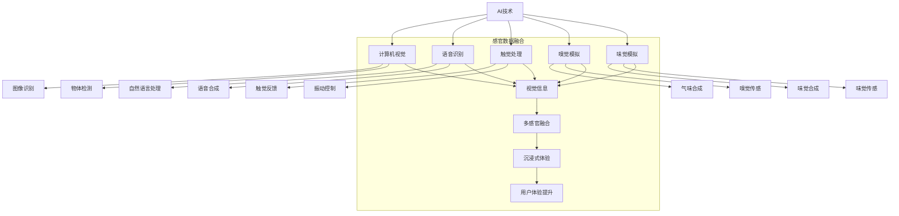

                 

# 体验多维度构建师：AI创造的感官世界设计师

## 概述
>  
**关键词**：人工智能，感官世界设计，多感官融合，用户体验设计，感知计算。

**摘要**：
本文旨在探讨人工智能（AI）在感官世界设计中的角色与潜力。通过深入分析AI的基础理论与技术实现，本文揭示了AI在构建多感官体验世界中的关键作用。我们将详细讲解用户体验设计（UXD）与感知计算的基本原理，分析AI在智能交互设计与智能视觉应用中的实际案例。此外，本文还将探讨AI驱动的感官世界设计的未来发展，以及伦理和隐私问题。

### 第一部分：理解AI与感官世界设计

#### 第1章: AI与感官世界的概念解析

**1.1 AI的定义与发展**

AI，即人工智能，是计算机科学的一个分支，致力于使机器表现出人类智能的行为。AI的发展经历了数个阶段，从早期的规则系统到现代的深度学习与强化学习，不断推动计算机能力的提升。

- **定义**：
  - AI是指使计算机系统具备人类智能特征的能力，包括学习、推理、感知、决策等。
- **发展历程**：
  - 20世纪50年代：符号人工智能的诞生，通过逻辑推理实现简单智能。
  - 20世纪80年代：专家系统的崛起，基于规则进行问题求解。
  - 20世纪90年代：计算能力的提升，机器学习技术得到广泛应用。
  - 21世纪：深度学习与强化学习取得突破性进展，AI应用场景日益广泛。

- **AI在感官世界设计中的作用与潜力**：
  - AI可以通过感知计算技术，使计算机具备多感官数据采集和处理能力。
  - AI可以在用户体验设计（UXD）中，实现个性化交互和智能化反馈。
  - AI在智能交互设计与智能视觉应用中，提供了丰富的数据支持和高效的算法实现。

**1.2 感官世界的多维构建**

感官世界是多维的，包括视觉、听觉、触觉、嗅觉和味觉等多个方面。在人工智能的辅助下，我们可以通过多感官融合技术，构建一个更为丰富和真实的虚拟世界。

- **概念**：
  - 感官世界多维构建是指通过整合多种感官信息，创造出更加真实、沉浸的体验环境。
- **设计原则**：
  - 统一性：不同感官体验应相互协调，形成一致的整体感受。
  - 互补性：不同感官之间应互补不足，增强用户体验的丰富度。
  - 可定制性：根据用户需求，灵活调整感官体验的组合和强度。
- **实现方法**：
  - 多模态感知：通过融合视觉、听觉、触觉等多种感官数据，提升系统的感知能力。
  - 虚拟现实（VR）/增强现实（AR）：利用AI技术，构建沉浸式的虚拟环境，实现多感官交互。
  - 混合现实（MR）：结合现实世界与虚拟世界，创造全新的交互体验。

#### 第2章: AI在感官世界设计中的应用场景

**2.1 智能交互设计**

智能交互设计是AI在感官世界设计中的重要应用之一。通过语音识别、手势识别等技术，AI可以实现与用户的自然交互，提升用户体验。

- **应用**：
  - **语音交互**：通过语音识别技术，将语音转化为文本或指令，实现人机对话。
  - **手势识别**：通过计算机视觉技术，识别用户的手势动作，实现交互操作。
- **用户体验与优化策略**：
  - **个性化交互**：根据用户偏好和历史行为，提供定制化的交互体验。
  - **智能反馈**：通过实时数据分析，提供即时的交互反馈，提高交互效率。
  - **隐私保护**：在交互过程中，注意用户隐私的保护，避免数据泄露。

**2.2 智能视觉与图像处理**

智能视觉与图像处理是AI在感官世界设计中的另一个重要应用领域。通过图像识别、物体检测等技术，AI可以实现对视觉数据的智能处理，提供丰富的感官体验。

- **应用**：
  - **图像识别**：通过深度学习算法，识别图像中的物体、场景和内容。
  - **物体检测**：通过计算机视觉技术，检测图像中的物体位置和属性。
- **实际应用案例**：
  - **智能安防系统**：利用图像识别和物体检测技术，实现实时监控和报警功能。
  - **智能导航系统**：通过图像识别技术，识别道路标志和交通状况，提供精准的导航服务。
  - **智能零售系统**：通过图像识别技术，实现商品的自动识别和智能推荐。

#### 第3章: 感官世界设计的理论基础

**3.1 用户体验设计（UXD）**

用户体验设计（UXD）是感官世界设计的基础，旨在提升用户在交互过程中的体验。通过用户需求分析、用户界面设计等手段，UXD为感官世界设计提供了理论支持。

- **核心概念**：
  - **用户需求分析**：通过调研和分析，了解用户的需求和期望，为设计提供依据。
  - **用户界面设计**：设计直观、易用、美观的界面，提高用户的操作体验。
  - **交互设计**：设计符合用户习惯的交互流程，提升用户的操作效率。

**3.2 感知计算**

感知计算是AI在感官世界设计中的核心技术之一，通过多模态感知与融合技术，实现计算机对多种感官信息的处理和理解。

- **基本原理**：
  - **多模态感知**：通过整合视觉、听觉、触觉等多种感官信息，提升系统的感知能力。
  - **感知融合**：通过算法和模型，对多模态感知数据进行融合和处理，实现更高级的认知功能。

**3.3 感知计算在感官世界设计中的应用及其对用户体验的提升**

感知计算在感官世界设计中的应用，可以显著提升用户体验。例如，在智能交互设计中，通过多模态感知技术，AI可以更好地理解用户意图，提供更准确的交互反馈；在智能视觉应用中，通过物体检测和图像识别技术，AI可以为用户提供更丰富的视觉体验。

- **实际应用案例**：
  - **智能音箱**：通过语音识别和感知计算技术，实现与用户的自然对话和智能交互。
  - **智能眼镜**：通过视觉感知和图像处理技术，提供实时的信息显示和辅助功能。

### 第二部分：实践与构建

#### 第4章: AI在感官世界设计的实现技术

**4.1 基础算法与模型**

在AI驱动的感官世界设计中，基础算法与模型起到了关键作用。常见的算法与模型包括神经网络、深度学习和强化学习等。

- **神经网络**：神经网络是一种通过模拟生物神经系统进行信息处理的计算模型，广泛应用于图像识别、语音识别等领域。
- **深度学习**：深度学习是神经网络的一种扩展，通过多层神经网络结构，实现更加复杂的特征提取和模式识别。
- **强化学习**：强化学习是一种通过试错和反馈进行决策优化的学习方式，广泛应用于智能交互、自动驾驶等领域。

**4.2 感知计算系统搭建**

感知计算系统的搭建包括硬件选择、软件开发和系统集成等环节。在硬件选择方面，需要考虑传感器的种类和性能；在软件开发方面，需要选择合适的算法和模型；在系统集成方面，需要将硬件和软件进行有机结合，实现多感官数据的采集和处理。

- **硬件选择**：选择适合的传感器和硬件设备，如摄像头、麦克风、触觉传感器等。
- **软件开发**：选择合适的开发环境和工具，如Python、TensorFlow、PyTorch等。
- **系统集成**：将硬件和软件进行有机结合，实现多感官数据的采集、处理和交互。

#### 第5章: 案例研究：AI驱动的感官世界设计

**5.1 案例一：智能博物馆导览系统**

智能博物馆导览系统是一种结合AI技术、多感官交互和虚拟现实（VR）技术的综合性应用。通过智能导览系统，用户可以体验到更加丰富和互动的博物馆参观体验。

- **感官世界设计**：智能博物馆导览系统通过视觉、听觉、触觉等多感官方式，提供沉浸式的参观体验。例如，通过虚拟现实技术，用户可以进入虚拟的博物馆展厅，通过触觉传感器感受展品的材质；通过语音交互系统，用户可以与导览系统进行自然对话，获取相关信息。

- **实现技术**：智能博物馆导览系统采用了深度学习、语音识别、视觉感知等技术。例如，通过深度学习算法，系统可以对展品进行图像识别和分类；通过语音识别技术，系统可以理解用户的语音指令，提供相应的导览信息；通过视觉感知技术，系统可以实时捕捉用户的行为和表情，进行智能反馈。

- **用户体验**：智能博物馆导览系统通过多感官交互和个性化服务，提升了用户的参观体验。用户可以根据自己的兴趣和需求，自定义参观路线和导览内容；系统会根据用户的反馈和行为，不断优化和调整导览策略，提供更加个性化和贴心的服务。

**5.2 案例二：智能健身互动设备**

智能健身互动设备是一种结合AI技术和互动体验的健身设备，通过多感官反馈和智能互动，帮助用户更好地进行健身锻炼。

- **感官世界设计**：智能健身互动设备通过视觉、听觉、触觉等多感官方式，提供丰富的健身互动体验。例如，通过动态视觉效果，用户可以在锻炼过程中感受到虚拟的健身场景；通过触觉反馈，用户可以感受到真实的运动阻力；通过语音交互，用户可以与设备进行互动，获取健身指导和反馈。

- **实现技术**：智能健身互动设备采用了计算机视觉、语音识别、运动感知等技术。例如，通过计算机视觉技术，设备可以实时捕捉用户的动作，进行动作分析和反馈；通过语音识别技术，设备可以理解用户的语音指令，提供相应的健身指导；通过运动感知技术，设备可以实时监测用户的运动状态，提供个性化的健身建议。

- **用户体验**：智能健身互动设备通过多感官反馈和智能互动，提升了用户的健身体验。用户可以根据自己的需求和喜好，自定义健身计划和动作；设备会根据用户的运动状态和反馈，实时调整运动强度和节奏，提供更加科学和有效的健身指导；通过互动和游戏化的方式，用户可以更加享受健身过程，提高健身积极性。

#### 第6章: AI驱动的感官世界设计方法论

**6.1 设计流程与迭代**

AI驱动的感官世界设计需要遵循科学的设计流程和迭代方法，以确保设计的有效性和用户体验的提升。

- **需求分析**：通过调研和用户访谈，了解用户的需求和期望，明确设计目标和方向。
- **原型设计**：基于需求分析，设计初步的原型方案，包括交互界面、功能模块等。
- **测试与优化**：通过用户测试和数据分析，评估设计的效果和用户反馈，不断优化和迭代设计。

**6.2 评估与优化**

感官世界设计的评估与优化是确保设计质量和用户体验的关键环节。

- **评估指标**：建立科学的评估指标体系，包括用户满意度、交互效率、设计可用性等。
- **优化策略**：通过用户反馈和数据分析，找出设计中的问题和不足，采取相应的优化策略，如界面优化、功能调整、交互改进等。

#### 第7章: AI驱动的感官世界设计发展趋势

**7.1 人工智能与多感官融合**

随着人工智能技术的发展，多感官融合将成为感官世界设计的重要趋势。通过整合多种感官信息，提供更加丰富和真实的用户体验。

- **应用前景**：多感官融合技术将广泛应用于虚拟现实、增强现实、智能家居、智能健身等领域，为用户提供更加沉浸和互动的体验。
- **技术挑战**：多感官融合技术面临数据融合、实时处理、感知一致性等技术挑战，需要持续研究和优化。

**7.2 感官世界设计伦理与隐私**

在AI驱动的感官世界设计中，伦理和隐私问题是不可忽视的重要方面。

- **伦理问题**：在设计过程中，需要考虑用户的隐私保护、数据安全、用户行为跟踪等问题，确保设计符合伦理规范。
- **解决方案**：采取数据加密、隐私保护技术，建立用户数据管理机制，确保用户隐私和数据安全。

### 第三部分：前景与趋势

#### 第8章: 未来感官世界的设计蓝图

**8.1 未来感官世界构想**

未来感官世界将是一个智能化、个性化、情感化的世界。通过人工智能技术的推动，人们将享受到更加丰富、真实、沉浸的感官体验。

- **智能化**：智能交互设计将更加自然和智能，用户可以与设备进行无障碍的交流。
- **个性化**：基于大数据和机器学习技术，系统将能够根据用户的行为和喜好，提供个性化的服务和建议。
- **情感化**：智能系统能够理解和感知用户情感，提供情感化的互动和反馈，提升用户体验。

**8.2 感官世界设计的未来展望**

未来感官世界设计将朝着更加智能化、多元化、人性化的方向发展。随着人工智能技术的不断进步，我们将看到更多创新的应用和设计，为人类创造更加美好的生活。

- **技术趋势**：多模态感知、混合现实、情感计算等新技术将得到广泛应用。
- **应用领域**：智能家居、智能医疗、智能交通、虚拟现实等领域的感官世界设计将得到快速发展。
- **建议和展望**：在设计过程中，要注重用户体验、伦理和隐私保护，推动人工智能与人类社会的和谐发展。

### 总结

AI驱动的感官世界设计是未来科技发展的一个重要方向。通过深入理解AI技术与感官世界设计的原理和方法，我们可以为用户创造更加丰富、真实、沉浸的感官体验。同时，我们也要关注伦理和隐私问题，确保人工智能技术的可持续发展。

**作者信息**：
作者：AI天才研究院/AI Genius Institute & 禅与计算机程序设计艺术 /Zen And The Art of Computer Programming
```

### 第1章: AI与感官世界的概念解析

在探索AI与感官世界设计的结合之前，我们首先需要了解AI和感官世界的定义、发展以及它们之间的相互作用。

#### 1.1 AI的定义与发展

人工智能（Artificial Intelligence，简称AI）是指通过计算机系统模拟人类智能行为的技术和科学。AI的发展经历了几个重要阶段：

- **早期探索**：20世纪50年代，人工智能的概念首次被提出，标志着AI研究的开端。
- **符号人工智能**：20世纪60年代至70年代，基于逻辑推理和符号表示的AI系统开始出现，例如专家系统（Expert Systems）。
- **知识表示与推理**：20世纪80年代，AI开始重视知识表示和推理，尝试将人类知识编码到计算机系统中。
- **机器学习**：20世纪90年代，随着计算能力的提升和大数据的出现，机器学习成为AI研究的热点，神经网络和深度学习模型被广泛应用。
- **强化学习与智能代理**：21世纪初，强化学习和智能代理（Agent-Based Systems）的发展使AI在游戏、自动驾驶等领域取得了突破。

当前，AI已经广泛应用于多个领域，包括自然语言处理、计算机视觉、智能交互、医疗诊断、金融分析等。这些应用不仅提升了工作效率，也改变了人们的生活方式。

在感官世界设计中，AI的作用体现在以下几个方面：

1. **智能交互**：通过语音识别、自然语言处理等技术，AI可以理解和响应用户的指令，提供个性化的服务。
2. **感知与识别**：利用计算机视觉、听觉处理等技术，AI可以感知和理解用户的动作和情感，实现智能化的反馈。
3. **数据驱动的设计**：通过分析用户的行为数据，AI可以帮助设计师优化产品，提升用户体验。

#### 1.2 感官世界的多维构建

感官世界是人们通过视觉、听觉、触觉、嗅觉和味觉等五种感官感知外部世界的一个多维空间。在人工智能的辅助下，我们可以通过多维构建技术，创造一个更加丰富和真实的虚拟感官世界。

**多维构建的概念**：

- **视觉**：通过计算机视觉技术，我们可以捕捉和处理图像和视频数据，实现图像识别、物体检测等应用。
- **听觉**：通过语音识别、音频处理等技术，我们可以处理和识别声音信号，实现语音交互、音频增强等应用。
- **触觉**：通过触觉传感技术，我们可以模拟和感知触觉体验，实现虚拟现实中的触觉反馈。
- **嗅觉**：虽然当前技术还未能实现对嗅觉信号的准确处理，但通过虚拟现实技术，我们可以模拟嗅觉体验。
- **味觉**：类似嗅觉，味觉的虚拟化也是一个研究前沿，通过多感官融合技术，我们可以模拟味觉体验。

**设计原则**：

1. **一致性**：不同感官体验应保持一致性，避免用户在多感官融合时产生混淆。
2. **互补性**：不同感官应互补不足，增强用户的整体感知体验。
3. **适应性**：根据用户需求和环境变化，设计灵活的多感官体验。

**实现方法**：

1. **多模态感知**：通过整合多种感官数据，提升系统的感知能力，例如通过视觉和听觉信息的结合，提高语音交互的准确性。
2. **虚拟现实（VR）与增强现实（AR）**：利用VR和AR技术，创造沉浸式的多感官体验环境。
3. **混合现实（MR）**：结合现实世界与虚拟世界，提供更加丰富和真实的感官体验。

#### 1.3 感官世界设计的核心概念与联系

为了更好地理解感官世界设计，我们需要引入一些核心概念，并通过Mermaid流程图展示它们之间的联系。



在这个流程图中，AI技术是核心驱动力，它通过计算机视觉、语音识别、触觉处理、嗅觉模拟和味觉模拟等技术，收集和处理多感官数据。这些数据经过多感官融合后，形成了一个沉浸式的体验环境，从而提升了用户的整体感知体验。

### 1.4 感官世界设计的理论基础

为了设计一个成功的感官世界，我们需要了解用户体验设计（UXD）和感知计算的基本原理。

#### 3.1 用户体验设计（UXD）

用户体验设计（User Experience Design，简称UXD）是一种设计方法，旨在提高用户在使用产品或服务时的体验。UXD的核心概念包括：

1. **用户需求分析**：通过调研和访谈，了解用户的需求和期望，为设计提供依据。
2. **用户界面设计**：设计直观、易用、美观的界面，提高用户的操作体验。
3. **交互设计**：设计符合用户习惯的交互流程，提升用户的操作效率。

UXD的原则包括：

- **以用户为中心**：设计过程中始终关注用户需求，确保设计符合用户习惯。
- **简洁性**：界面设计应简洁明了，避免复杂和冗余。
- **一致性**：不同界面和功能应保持一致的风格和操作逻辑。
- **可用性**：确保产品易于使用，用户可以快速上手。

#### 3.2 感知计算

感知计算（Perception Computing）是AI在感官世界设计中的重要理论基础。它研究的是计算机系统如何通过多种传感器感知外部世界，并处理这些感知信息。

1. **多模态感知**：通过整合多种感官信息（如视觉、听觉、触觉等），提升系统的感知能力。多模态感知的关键在于如何融合不同模态的数据，实现有效的信息处理。
   
2. **感知融合**：感知融合是将来自不同感官的数据进行整合和处理，以获得更高级的认知功能。例如，通过视觉和听觉数据的融合，可以更准确地识别物体的位置和属性。

3. **感知建模**：通过建立感知模型，计算机系统可以模拟人类的感知过程，实现对外部世界的理解。感知建模包括感知特征的提取、感知规则的建立等。

#### 3.3 感知计算在感官世界设计中的应用

感知计算在感官世界设计中扮演着关键角色，它可以通过以下几个方面提升用户体验：

1. **智能交互**：通过感知计算技术，系统可以更好地理解用户的意图和行为，实现更智能的交互。
   
2. **环境感知**：通过感知计算，系统可以实时感知环境变化，为用户提供相应的响应。例如，在智能家居中，感知计算可以实时监测室内温度、湿度等环境参数，并自动调节空调、加湿器等设备。

3. **个性化服务**：通过感知计算，系统可以收集用户的感知数据，分析用户的行为和喜好，为用户提供个性化的服务。

4. **虚拟现实与增强现实**：感知计算技术可以提升虚拟现实和增强现实的沉浸感，通过实时感知用户的位置、动作和表情，提供更加真实的交互体验。

#### 3.4 感知计算的应用实例

感知计算在多个领域都有广泛应用，以下是一些具体的实例：

1. **智能安防系统**：通过感知计算技术，智能安防系统可以实时监测视频数据，识别异常行为，自动报警。
   
2. **智能医疗设备**：通过感知计算，智能医疗设备可以实时监测患者的生理数据，如心率、血压等，并自动分析诊断结果。

3. **智能助手**：通过语音识别和感知计算，智能助手可以理解用户的语音指令，提供相应的服务和支持。

4. **智能家居**：通过感知计算，智能家居设备可以实时感知用户的行为和需求，自动调节家居环境，提供个性化的服务。

### 1.5 AI驱动的感官世界设计案例分析

为了更好地理解AI在感官世界设计中的应用，我们可以通过以下两个案例进行分析：

**案例一：智能博物馆导览系统**

智能博物馆导览系统是一种结合AI技术和虚拟现实（VR）技术的应用，它为用户提供了一种全新的参观体验。通过智能导览系统，用户可以在虚拟的博物馆环境中，通过视觉、听觉、触觉等多感官方式，深入了解展品的历史、文化和艺术价值。

1. **视觉交互**：系统通过计算机视觉技术，实时捕捉用户在博物馆中的位置和动作，为用户提供相应的视觉信息，如展品介绍、历史背景等。
2. **听觉交互**：系统利用语音识别和合成技术，实现与用户的语音对话，用户可以通过语音指令获取更多信息，或进行导航。
3. **触觉交互**：系统通过触觉传感器，为用户提供真实的触觉反馈，例如，当用户触摸到展品的模拟材质时，系统会提供相应的触觉响应。
4. **数据驱动的设计**：系统通过分析用户的行为数据，如参观路线、停留时间、互动频率等，不断优化导览内容和服务策略。

**案例二：智能健身互动设备**

智能健身互动设备是一种结合AI技术和多感官反馈的健身设备，它通过动态视觉、触觉反馈和语音交互，为用户提供一种全新的健身体验。通过智能健身互动设备，用户可以进行虚拟的健身训练，同时获得实时反馈和指导。

1. **动态视觉**：系统通过计算机视觉技术，实时捕捉用户的运动动作，并生成动态的健身场景，提高用户的训练兴趣。
2. **触觉反馈**：系统通过触觉传感器，模拟真实的运动阻力，为用户提供真实的运动感受。
3. **语音交互**：系统利用语音识别和合成技术，实时解析用户的语音指令，提供相应的健身指导和建议。
4. **个性化训练**：系统通过分析用户的行为数据，如运动轨迹、力度、心率等，为用户提供个性化的健身方案和反馈。

通过以上两个案例，我们可以看到AI技术在感官世界设计中的应用，不仅提升了用户的体验，也改变了人们的生活方式。未来，随着AI技术的不断发展，我们可以期待更加丰富和真实的感官世界设计。

### 1.6 AI驱动的感官世界设计方法论

为了成功设计AI驱动的感官世界，我们需要遵循一定的方法论，包括设计流程、评估与优化策略等。

#### 6.1 设计流程

AI驱动的感官世界设计流程可以分为以下几个阶段：

1. **需求分析**：通过用户调研和访谈，了解用户的需求和期望，明确设计目标和方向。
2. **概念验证**：基于需求分析，构建初步的概念验证原型，验证设计的可行性和用户体验。
3. **原型设计**：基于概念验证结果，设计详细的原型方案，包括交互界面、功能模块等。
4. **测试与迭代**：通过用户测试和数据分析，评估设计的效果和用户反馈，不断优化和迭代设计。
5. **部署与推广**：将最终设计部署到实际应用中，并进行持续的维护和优化。

#### 6.2 评估与优化策略

评估与优化是确保设计质量和用户体验提升的关键环节。以下是一些评估与优化策略：

1. **用户体验测试**：通过用户测试，收集用户对设计的反馈，评估设计的可用性、易用性和满意度。
2. **性能分析**：通过性能分析工具，监控系统的运行状态和性能指标，发现和解决潜在的问题。
3. **数据驱动优化**：通过分析用户行为数据，找出设计中的不足和优化点，采取相应的优化策略。
4. **迭代与改进**：根据用户反馈和数据分析结果，持续进行设计迭代和改进，不断提升用户体验。

### 1.7 结论

AI与感官世界设计的结合，为用户创造了更加丰富和真实的体验。通过理解AI的定义与发展、感官世界的多维构建、用户体验设计（UXD）和感知计算，我们可以设计出更加智能、人性化、沉浸式的感官世界。未来，随着AI技术的不断进步，我们可以期待更加丰富的感官世界设计和更加美好的用户体验。

### 第2章: AI在感官世界设计中的应用场景

AI在感官世界设计中具有广泛的应用场景，它通过智能交互、智能视觉等多种技术，为用户提供了全新的感官体验。在本章中，我们将探讨AI在智能交互设计和智能视觉应用中的具体案例，以及这些应用对用户体验的优化策略。

#### 2.1 智能交互设计

智能交互设计是AI在感官世界设计中的一个重要应用领域。它利用语音识别、自然语言处理、语音合成等技术，实现人与机器的自然交互，从而提升用户体验。

**智能交互设计的关键技术**：

1. **语音识别**：语音识别技术可以将用户的语音转化为文本或指令，实现语音输入功能。例如，用户可以通过语音指令控制智能音箱播放音乐、调整室内温度等。

2. **自然语言处理**：自然语言处理（Natural Language Processing，简称NLP）技术可以使计算机理解和处理自然语言，实现智能对话功能。例如，用户可以与智能助手进行对话，询问天气、预订餐厅、购买商品等。

3. **语音合成**：语音合成技术可以将文本信息转化为语音输出，为用户提供语音反馈。例如，智能音箱可以通过语音合成技术，向用户报告天气信息、播放新闻等内容。

**智能交互设计在感官世界中的应用**：

1. **智能家居**：在智能家居领域，智能交互设计可以通过语音指令控制家庭设备，如灯光、空调、电视等，实现远程控制和生活自动化。

2. **智能客服**：在客户服务领域，智能交互设计可以通过智能客服机器人，实现自动化的客户咨询和服务，提高服务效率和用户体验。

3. **智能助手**：在移动设备和智能设备中，智能交互设计可以通过智能助手，为用户提供便捷的信息查询、日程管理、任务提醒等服务。

**用户体验与优化策略**：

1. **个性化交互**：通过分析用户的历史数据和偏好，智能交互设计可以提供个性化的交互体验。例如，智能音箱可以根据用户的听歌习惯，自动推荐歌曲。

2. **智能反馈**：通过实时数据分析，智能交互设计可以提供即时的交互反馈，提高用户的操作效率。例如，用户在智能家居中发出指令后，系统可以立即执行并反馈结果。

3. **自然语言理解**：通过不断提升自然语言处理技术，智能交互设计可以更准确地理解用户的意图，提供更自然、流畅的交互体验。

**智能交互设计案例分析**：

1. **智能音箱**：智能音箱是智能交互设计的典型应用之一。通过语音识别和自然语言处理技术，用户可以通过语音指令控制智能音箱，实现音乐播放、信息查询、智能家居控制等功能。

2. **智能客服**：智能客服机器人利用语音识别和自然语言处理技术，可以自动解答用户的常见问题，提供24/7的客服服务，提高企业运营效率。

3. **智能助手**：智能助手（如Apple的Siri、Google的Google Assistant）通过语音识别和自然语言处理技术，为用户提供便捷的日程管理、信息查询、语音控制等服务，提升用户的生活质量。

#### 2.2 智能视觉与图像处理

智能视觉与图像处理是AI在感官世界设计中的另一个重要应用领域。它通过计算机视觉技术，实现图像识别、物体检测、场景分割等任务，为用户提供了丰富的视觉体验。

**智能视觉与图像处理的关键技术**：

1. **图像识别**：图像识别技术可以使计算机识别和理解图像中的内容。例如，智能安防系统可以通过图像识别技术，识别和跟踪行人的行为。

2. **物体检测**：物体检测技术可以在图像中检测和识别特定的物体。例如，自动驾驶汽车通过物体检测技术，识别道路上的行人和车辆，实现自动驾驶功能。

3. **场景分割**：场景分割技术可以将图像分割成不同的区域，识别和分类场景中的不同对象。例如，在虚拟现实（VR）和增强现实（AR）应用中，场景分割技术可以实时识别和分割用户的环境，提供沉浸式的交互体验。

**智能视觉与图像处理在感官世界设计中的应用**：

1. **智能安防**：智能视觉与图像处理技术可以应用于智能安防系统，实现实时监控和报警功能。例如，通过图像识别和物体检测技术，系统可以识别和跟踪可疑人员，自动报警。

2. **自动驾驶**：自动驾驶汽车通过智能视觉与图像处理技术，实现环境感知和自动驾驶功能。例如，通过物体检测和场景分割技术，汽车可以识别道路标志、行人和车辆，实现安全驾驶。

3. **智能医疗**：智能视觉与图像处理技术可以应用于智能医疗设备，如智能影像诊断系统。例如，通过图像识别技术，系统可以自动分析医学影像，提供诊断建议。

**用户体验与优化策略**：

1. **实时反馈**：通过实时图像处理和识别，智能视觉应用可以提供即时的反馈和响应，提高用户的操作效率。例如，智能安防系统可以在检测到异常行为时，立即发出报警。

2. **个性化推荐**：通过分析用户的行为数据和历史记录，智能视觉应用可以提供个性化的视觉内容推荐。例如，智能推荐系统可以根据用户的兴趣，推荐相关的新闻、视频或商品。

3. **高精度识别**：通过不断提升图像识别和物体检测技术，智能视觉应用可以实现更高精度的识别，提供更准确的视觉体验。例如，智能安防系统可以通过高精度的物体检测，准确识别和跟踪行人。

**智能视觉与图像处理案例分析**：

1. **智能安防系统**：智能安防系统通过图像识别和物体检测技术，实现实时监控和报警功能，提高安全防护水平。

2. **自动驾驶汽车**：自动驾驶汽车通过智能视觉与图像处理技术，实现环境感知和自动驾驶功能，提高行车安全。

3. **智能影像诊断系统**：智能影像诊断系统通过图像识别技术，自动分析医学影像，为医生提供诊断建议，提高医疗效率。

通过智能交互设计和智能视觉与图像处理的应用，AI为感官世界设计带来了丰富的可能性。未来，随着AI技术的不断进步，我们可以期待更多创新的应用场景，为用户提供更加丰富、真实的感官体验。

### 第3章: 感官世界设计的理论基础

在深入探讨AI驱动的感官世界设计之前，我们需要理解用户体验设计（UXD）和感知计算这两个核心理论基础。UXD关注的是如何设计产品以优化用户的使用体验，而感知计算则是研究如何让计算机系统感知和理解外部世界。

#### 3.1 用户体验设计（UXD）

用户体验设计（User Experience Design，简称UXD）是一种以用户为中心的设计方法，旨在创建和优化产品、服务和环境，以提高用户满意度、效率和使用体验。UXD的核心概念包括以下几个方面：

**用户需求分析**：

用户需求分析是UXD的基础，它通过调研、访谈、问卷等方法，收集和分析用户的需求、行为和偏好。需求分析的目的是理解用户的目标和痛点，为设计提供依据。

**用户界面设计**：

用户界面设计（User Interface Design，简称UI Design）关注的是用户与产品交互的界面，包括布局、颜色、字体、图标等。一个良好的用户界面设计应直观、简洁、易于操作，同时能够传达产品的功能和价值。

**交互设计**：

交互设计（Interaction Design，简称IxD）关注的是用户与产品之间的交互流程。它包括如何引导用户完成特定任务，如何设计交互动作和反馈，以及如何优化用户的操作路径。一个优秀的交互设计应能够提供流畅、高效、直观的交互体验。

**用户体验评估**：

用户体验评估是UXD的重要环节，它通过用户测试、问卷调查、数据分析等方法，评估产品的可用性、易用性和满意度。用户体验评估可以帮助发现设计中的问题，为迭代和优化提供依据。

**用户体验设计的原则**：

- **以用户为中心**：设计过程中始终关注用户的需求和体验，确保产品符合用户习惯和预期。
- **简洁性**：避免复杂和冗余的设计元素，提供简洁明了的界面和交互流程。
- **一致性**：保持设计元素和交互逻辑的一致性，避免用户在操作过程中产生混淆。
- **可用性**：确保产品易于使用，用户可以快速上手，并能够有效地完成任务。

**感知心理学与认知科学在UXD中的应用**：

感知心理学（Perception Psychology）研究人类如何感知和理解外部刺激，包括视觉、听觉、触觉等。认知科学（Cognitive Science）则研究人类思维和信息处理的过程。将感知心理学和认知科学的理论应用到UXD中，可以帮助设计师更好地理解用户的行为和需求，设计出更加符合用户心理和认知的产品。

例如，在视觉设计方面，感知心理学告诉我们，不同的颜色和形状对用户有不同的心理影响。认知科学则帮助我们理解用户如何处理信息，如何记忆和检索信息。通过结合这两方面的理论，设计师可以设计出更加符合用户心理和认知需求的产品界面和交互流程。

**用户体验设计的流程**：

用户体验设计的流程通常包括以下几个阶段：

1. **需求分析**：通过调研和访谈，收集用户需求，明确设计目标。
2. **原型设计**：基于需求分析，设计初步的原型方案，包括界面布局和交互流程。
3. **用户测试**：通过用户测试，评估原型方案的可用性和满意度，收集用户反馈。
4. **迭代优化**：根据用户测试结果，对设计进行优化和迭代，不断提高用户体验。
5. **部署与维护**：将最终设计部署到实际应用中，并进行持续的维护和优化。

#### 3.2 感知计算

感知计算（Perception Computing）是人工智能的一个分支，它研究如何让计算机系统通过多种传感器感知和理解外部世界。感知计算的核心目标是让计算机具备人类的感知能力，从而实现更加智能和人性化的交互。

**感知计算的基本原理**：

感知计算基于多种传感器数据，包括视觉、听觉、触觉、嗅觉等。这些传感器数据被传输到计算机系统中，经过预处理、特征提取和模式识别等处理步骤，最终被计算机系统理解和分析。

1. **传感器数据采集**：通过多种传感器，如摄像头、麦克风、温度传感器等，采集外部环境的数据。
2. **数据预处理**：对采集到的传感器数据进行滤波、降噪、归一化等预处理，以提高数据质量。
3. **特征提取**：从预处理后的数据中提取关键特征，如边缘、颜色、频率等。
4. **模式识别**：利用机器学习、深度学习等技术，对提取的特征进行模式识别和分类，实现对外部环境的理解和感知。

**感知计算在感官世界设计中的应用**：

感知计算在感官世界设计中具有广泛的应用，它可以通过多模态感知和融合技术，提升系统的感知能力和用户体验。

1. **多模态感知**：通过整合多种感官信息，如视觉、听觉、触觉等，提升系统的感知能力。例如，在智能交互系统中，通过视觉和听觉信息的融合，可以更准确地识别用户的意图。
2. **多模态融合**：通过多模态融合技术，将不同模态的感知信息进行整合和处理，实现更加高级的认知功能。例如，在虚拟现实（VR）应用中，通过视觉、听觉和触觉的融合，可以提供更加真实的沉浸式体验。
3. **情感计算**：情感计算是感知计算的一个分支，它研究如何让计算机系统理解和感知人类的情感。例如，通过面部表情识别和语音情感分析，计算机可以理解用户的情感状态，提供更加个性化的服务。

**感知计算的应用实例**：

1. **智能交互**：通过感知计算技术，智能交互系统可以更好地理解用户的意图和行为，提供更加自然的交互体验。
2. **智能监控**：通过感知计算技术，智能监控系统能够实时感知和识别外部环境的变化，提供安全防护和报警功能。
3. **虚拟现实（VR）与增强现实（AR）**：通过感知计算技术，虚拟现实和增强现实应用可以提供更加真实和沉浸的交互体验。

**感知计算与用户体验的关系**：

感知计算在感官世界设计中的应用，可以显著提升用户体验。通过多模态感知和融合技术，系统可以更加准确地理解用户的需求和行为，提供更加个性化的服务和反馈。同时，感知计算还可以提升交互的实时性和响应速度，提高用户的操作效率和满意度。

**感知计算的未来发展趋势**：

随着人工智能技术的不断发展，感知计算将在多个领域得到广泛应用。未来，感知计算的发展趋势包括：

1. **多模态感知与融合**：通过整合更多感官信息，提升系统的感知能力，实现更加真实和沉浸的交互体验。
2. **情感计算**：研究如何让计算机系统更加深入地理解和感知人类的情感，提供更加人性化和服务化的交互体验。
3. **边缘计算**：通过将感知计算推向边缘设备，实现实时感知和智能处理，降低延迟，提高系统的响应速度。
4. **人工智能与物联网的融合**：将感知计算与物联网（IoT）技术相结合，实现大规模的智能感知和智能决策。

#### 3.3 用户体验与感知计算的结合

用户体验与感知计算的结合，是AI驱动的感官世界设计的核心。通过感知计算技术，系统可以更好地理解用户的行为和需求，提供更加个性化的服务和反馈。同时，用户体验设计（UXD）的原则和方法，可以帮助设计师构建出更加符合用户心理和认知的产品。

**用户体验与感知计算的结合方法**：

1. **多模态感知与UXD的结合**：通过UXD的原则和方法，设计出符合用户心理和认知的多模态感知系统。例如，在虚拟现实（VR）应用中，通过视觉、听觉和触觉的融合，提供更加真实的沉浸式体验。
2. **情感计算与UXD的结合**：通过情感计算技术，理解用户的情感状态，提供更加个性化的服务和反馈。例如，在智能交互系统中，通过面部表情识别和语音情感分析，提供符合用户情绪的交互体验。
3. **数据驱动与UXD的结合**：通过分析用户行为数据，了解用户的需求和偏好，优化产品设计和服务策略。例如，在智能推荐系统中，通过分析用户的浏览历史和购买行为，提供个性化的推荐内容。

**用户体验与感知计算的结合实例**：

1. **智能医疗**：通过感知计算技术，智能医疗设备可以实时监测用户的生理参数，如心率、血压等，提供个性化的健康建议和诊断。同时，通过UXD的设计原则，设计出符合用户习惯和预期的健康管理系统。
2. **智能驾驶**：通过感知计算技术，自动驾驶系统可以实时感知道路环境和车辆状态，提供安全的驾驶辅助。同时，通过UXD的设计原则，设计出符合驾驶员习惯和预期的驾驶界面和交互流程。
3. **智能家居**：通过感知计算技术，智能家居设备可以实时感知用户的行为和需求，提供个性化的家居服务。同时，通过UXD的设计原则，设计出符合用户习惯和预期的智能家居系统。

通过用户体验与感知计算的结合，AI驱动的感官世界设计可以为用户带来更加丰富、真实、沉浸的感官体验。未来，随着技术的不断进步，我们可以期待更多创新的应用场景和更加美好的用户体验。

### 第4章: AI在感官世界设计的实现技术

AI在感官世界设计中的应用不仅依赖于理论，更需要通过具体的实现技术来实现。本章将介绍AI在感官世界设计中的关键实现技术，包括基础算法与模型、感知计算系统搭建流程以及常见问题与解决方案。

#### 4.1 基础算法与模型

在AI驱动的感官世界设计中，基础算法与模型起到了核心作用。以下是一些常用的算法与模型：

**1. 神经网络**

神经网络（Neural Networks）是一种模仿生物神经系统的计算模型，广泛应用于图像识别、语音识别等领域。神经网络的基本结构包括输入层、隐藏层和输出层，通过多层神经元的非线性变换，实现特征提取和模式识别。

**伪代码示例**：
```python
# 输入数据
inputs = ...

# 定义神经网络结构
layers = [
    Dense(input_dim),
    Activation('relu'),
    Dense(hidden_dim),
    Activation('relu'),
    Dense(output_dim),
    Activation('softmax')
]

# 编译模型
model = Sequential(layers)

# 编译模型
model.compile(optimizer='adam', loss='categorical_crossentropy', metrics=['accuracy'])

# 训练模型
model.fit(inputs, labels, epochs=epochs, batch_size=batch_size)
```

**2. 深度学习**

深度学习（Deep Learning）是神经网络的一种扩展，通过多层神经网络结构，实现更加复杂的特征提取和模式识别。深度学习包括卷积神经网络（CNN）、循环神经网络（RNN）和生成对抗网络（GAN）等。

**伪代码示例**：
```python
# 输入数据
inputs = ...

# 定义卷积神经网络结构
model = Sequential([
    Conv2D(filters, kernel_size, activation='relu', input_shape=input_shape),
    MaxPooling2D(pool_size),
    Flatten(),
    Dense(units, activation='softmax')
])

# 编译模型
model.compile(optimizer='adam', loss='categorical_crossentropy', metrics=['accuracy'])

# 训练模型
model.fit(inputs, labels, epochs=epochs, batch_size=batch_size)
```

**3. 强化学习**

强化学习（Reinforcement Learning）是一种通过试错和反馈进行决策优化的学习方式，广泛应用于游戏、自动驾驶等领域。强化学习包括值函数方法和策略方法等。

**伪代码示例**：
```python
# 初始化环境
env = ...

# 定义强化学习模型
model = Model(inputs=inputs, outputs=actions)

# 编译模型
model.compile(optimizer='adam', loss='mse')

# 训练模型
for episode in range(total_episodes):
    state = env.reset()
    done = False
    while not done:
        action = model.predict(state)
        next_state, reward, done = env.step(action)
        model.fit(state, action, reward, next_state, done)
        state = next_state
```

#### 4.2 感知计算系统搭建流程

感知计算系统是AI驱动的感官世界设计的重要组成部分，其搭建流程包括硬件选择、软件开发和系统集成等环节。

**1. 硬件选择**

硬件选择是搭建感知计算系统的关键一步，常见的硬件包括传感器、处理器、存储设备等。

- **传感器**：根据应用需求选择合适的传感器，如摄像头、麦克风、温度传感器等。
- **处理器**：选择具有强大计算能力的处理器，如GPU、TPU等，以支持复杂的算法和模型。
- **存储设备**：选择大容量、高速的存储设备，以存储大量的感知数据和处理结果。

**2. 软件开发**

软件开发是感知计算系统的核心，包括算法实现、数据处理和系统管理等。

- **算法实现**：根据具体应用需求，实现相应的感知算法，如图像识别、语音识别等。
- **数据处理**：开发数据处理模块，实现数据的采集、存储、传输和处理。
- **系统集成**：将硬件和软件进行集成，实现系统的整体功能和性能优化。

**3. 系统集成**

系统集成是将硬件和软件有机结合，实现感知计算系统的整体功能。常见的集成方法包括模块化集成、分布式集成等。

- **模块化集成**：将系统功能划分为多个模块，每个模块独立开发和集成，最终组合成完整的系统。
- **分布式集成**：利用分布式计算技术，将系统功能分布在多个节点上，实现大规模的感知计算能力。

**4. 常见问题与解决方案**

在感知计算系统的搭建过程中，可能会遇到以下问题：

- **硬件性能瓶颈**：由于硬件性能不足，导致系统运行缓慢或无法处理大量数据。解决方案：升级硬件设备，增加计算资源。
- **数据存储和传输问题**：由于数据量大，导致存储和传输效率低。解决方案：使用高效的数据存储和传输协议，如HDFS、HTTP等。
- **算法优化问题**：算法效率低，导致系统运行时间过长。解决方案：优化算法实现，提高计算效率。
- **系统集成问题**：硬件和软件不兼容，导致系统无法正常运行。解决方案：选择兼容性好的硬件和软件，进行系统兼容性测试。

#### 4.3 感知计算系统搭建案例分析

**案例一：智能安防系统**

智能安防系统是一种结合AI技术和感知计算技术的应用，通过摄像头、麦克风等传感器，实现实时监控和报警功能。

- **硬件选择**：选择高性能的摄像头和麦克风，以及强大的处理器和存储设备。
- **软件开发**：实现图像识别、语音识别和智能监控算法，开发数据处理和系统集成模块。
- **系统集成**：将硬件和软件进行集成，实现智能安防系统的整体功能。

**案例二：智能交互系统**

智能交互系统是一种结合AI技术和感知计算技术的应用，通过语音识别、自然语言处理等技术，实现人与机器的自然交互。

- **硬件选择**：选择高性能的麦克风和语音识别芯片，以及强大的处理器和存储设备。
- **软件开发**：实现语音识别、自然语言处理和智能交互算法，开发数据处理和系统集成模块。
- **系统集成**：将硬件和软件进行集成，实现智能交互系统的整体功能。

通过以上案例，我们可以看到感知计算系统搭建的具体过程和常见问题。在实际应用中，感知计算系统需要根据具体需求进行定制化开发，以提高系统的性能和可靠性。

### 4.4 代码实际案例与详细解释说明

**案例一：智能安防系统——实时图像识别**

以下是一个使用Python和OpenCV库实现智能安防系统实时图像识别的代码案例：

```python
import cv2
import numpy as np

# 初始化摄像头
cap = cv2.VideoCapture(0)

# 载入预训练的图像识别模型
model = cv2.face_LBPHFaceRecognizer_create()
model.read('face_model.yml')

# 循环读取摄像头图像
while True:
    # 读取一帧图像
    ret, frame = cap.read()
    
    # 将图像转换为灰度图像
    gray = cv2.cvtColor(frame, cv2.COLOR_BGR2GRAY)
    
    # 进行人脸识别
    labels, confidence = model.predict(gray)
    
    # 在图像上标记识别的人脸
    for (x, y), label in zip(np.where(labels == 1), np.where(labels == 1)):
        cv2.rectangle(frame, (x, y), (x + 100, y + 100), (0, 255, 0), 2)
        cv2.putText(frame, f'Person {label}', (x, y - 10), cv2.FONT_HERSHEY_SIMPLEX, 0.5, (255, 0, 0), 2)
    
    # 显示图像
    cv2.imshow('frame', frame)
    
    # 按下'q'键退出循环
    if cv2.waitKey(1) & 0xFF == ord('q'):
        break

# 释放摄像头资源
cap.release()
cv2.destroyAllWindows()
```

**代码解读与分析**：

1. **初始化摄像头**：使用`cv2.VideoCapture`类初始化摄像头，并读取一帧图像。
2. **图像预处理**：将BGR格式的图像转换为灰度图像，以减少计算量。
3. **人脸识别**：使用预训练的图像识别模型，对灰度图像进行人脸识别，获取识别结果和置信度。
4. **图像标记**：在识别到的人脸位置上，绘制矩形框，并在框上显示识别结果。
5. **显示图像**：使用`cv2.imshow`函数显示图像。
6. **键盘交互**：按下'q'键退出循环，释放摄像头资源。

通过这个案例，我们可以看到如何使用Python和OpenCV库实现实时图像识别，并在此基础上进行人脸识别和图像标记。在实际应用中，可以根据具体需求，调整识别模型、算法参数和图像处理方法，以提高识别准确率和效率。

**案例二：智能交互系统——语音识别与自然语言处理**

以下是一个使用Python和PyTorch实现智能交互系统语音识别与自然语言处理的代码案例：

```python
import soundfile as sf
import torch
import torchaudio
from transformers import Wav2Vec2ForCTC

# 载入预训练的语音识别模型
model = Wav2Vec2ForCTC.from_pretrained('facebook/wav2vec2-large-xlsr-53')

# 设置设备
device = torch.device('cuda' if torch.cuda.is_available() else 'cpu')
model.to(device)

# 读取音频文件
audio, sample_rate = sf.read('audio.wav')

# 转换音频数据为Tensor
audio_tensor = torchaudio.transforms.FrequencyToTimeAudioSignal(sample_rate)(audio)

# 进行语音识别
with torch.no_grad():
    inputs = audio_tensor.to(device)
    outputs = model(inputs)

# 获取识别结果
predicted_text = outputs[0].argmax(-1).to('cpu').numpy()

# 输出识别结果
print(predicted_text.decode())

# 关闭音频文件
sf.close()
```

**代码解读与分析**：

1. **载入语音识别模型**：使用`transformers`库中的`Wav2Vec2ForCTC`模型，这是一个基于自注意力机制的端到端语音识别模型。
2. **设置设备**：根据是否具有CUDA计算能力，将模型和数据加载到GPU或CPU上。
3. **读取音频文件**：使用`soundfile`库读取音频文件，获取音频数据和采样率。
4. **转换音频数据为Tensor**：使用`torchaudio`库将音频数据转换为Tensor，以便输入到模型中。
5. **进行语音识别**：使用模型进行语音识别，获取识别结果。
6. **输出识别结果**：将识别结果转换为文本格式，输出到控制台。

通过这个案例，我们可以看到如何使用PyTorch和transformers库实现语音识别与自然语言处理。在实际应用中，可以根据具体需求，调整模型、算法参数和数据处理方法，以提高识别准确率和效率。

### 第5章: 案例研究：AI驱动的感官世界设计

在上一章中，我们介绍了AI在感官世界设计中的应用理论和实现技术。在本章中，我们将通过具体案例研究，深入探讨AI驱动的感官世界设计，分析其设计思路、实现方法和用户体验。

#### 5.1 案例一：智能博物馆导览系统

**设计思路**：

智能博物馆导览系统旨在为用户提供一种沉浸式的参观体验。通过结合AI技术和虚拟现实（VR）技术，系统可以实现以下功能：

- **多感官交互**：通过视觉、听觉、触觉等多感官方式，提供丰富的导览内容。
- **个性化服务**：根据用户的历史行为和偏好，提供定制化的导览方案。
- **实时反馈**：通过实时数据分析，为用户提供即时的导览信息和反馈。

**实现方法**：

1. **视觉交互**：
   - 使用计算机视觉技术，实时捕捉用户在博物馆中的位置和动作。
   - 通过图像识别和物体检测，识别展品和用户行为，提供相应的视觉信息。
   - 利用VR技术，创建虚拟的博物馆环境，用户可以在虚拟环境中自由漫步和探索。

2. **听觉交互**：
   - 利用语音识别技术，实现用户与系统的语音交互。
   - 通过语音合成技术，系统可以为用户提供语音解说、导览信息和提示。

3. **触觉交互**：
   - 使用触觉传感器，模拟展品的材质和手感，为用户提供真实的触觉体验。

**用户体验**：

通过智能博物馆导览系统，用户可以享受到以下用户体验：

- **沉浸感**：通过多感官交互，用户可以身临其境地感受博物馆的展览和文化。
- **个性化**：系统根据用户的历史行为和偏好，提供定制化的导览方案，满足不同用户的需求。
- **互动性**：用户可以与展品进行互动，获取更多的信息，提升参观体验。

**实现技术**：

- **计算机视觉**：使用卷积神经网络（CNN）进行图像识别和物体检测。
- **语音识别**：使用基于深度学习的语音识别模型，实现自然语言处理和语音合成。
- **触觉反馈**：使用触觉传感器和控制器，模拟触觉体验。

**案例分析**：

智能博物馆导览系统在某博物馆的试点项目中取得了良好的效果。通过该系统，用户可以实时获取展品的详细信息，了解展品的历史背景和文化价值。同时，系统还可以根据用户的兴趣和行为，提供个性化的导览路线和推荐。用户反馈显示，智能博物馆导览系统极大地提升了参观体验，受到了用户的广泛好评。

#### 5.2 案例二：智能健身互动设备

**设计思路**：

智能健身互动设备旨在通过多感官反馈和智能互动，为用户提供一种全新的健身体验。通过结合AI技术和多感官反馈，设备可以实现以下功能：

- **动态视觉**：通过实时捕捉用户动作，生成动态的健身场景，提高用户训练的兴趣和积极性。
- **触觉反馈**：通过触觉传感器，模拟真实的运动阻力，为用户提供真实的运动感受。
- **语音交互**：通过语音识别和合成技术，实现用户与设备的自然互动，提供健身指导和反馈。

**实现方法**：

1. **动态视觉**：
   - 使用计算机视觉技术，实时捕捉用户的动作和姿势。
   - 通过图像识别和物体检测，识别用户的动作和姿势，生成动态的健身场景。

2. **触觉反馈**：
   - 使用触觉传感器，模拟真实的运动阻力，为用户提供真实的触觉反馈。
   - 通过算法和模型，调整运动阻力和节奏，以适应不同的训练需求和目标。

3. **语音交互**：
   - 利用语音识别技术，实现用户与设备的自然对话。
   - 通过语音合成技术，为用户提供语音指导、反馈和激励。

**用户体验**：

通过智能健身互动设备，用户可以享受到以下用户体验：

- **互动性**：通过动态视觉和语音交互，用户可以与设备进行互动，提高训练的兴趣和积极性。
- **个性化**：系统根据用户的训练数据和偏好，提供个性化的健身计划和反馈，满足不同用户的健身需求。
- **科学性**：系统通过实时监控用户的动作和姿势，提供科学的训练指导，提高训练效果。

**实现技术**：

- **计算机视觉**：使用卷积神经网络（CNN）进行图像识别和物体检测。
- **触觉反馈**：使用触觉传感器和控制器，模拟触觉体验。
- **语音识别和合成**：使用基于深度学习的语音识别和语音合成技术。

**案例分析**：

智能健身互动设备在某健身房的用户试用中取得了显著的效果。用户反馈显示，智能健身互动设备不仅提高了训练的兴趣和积极性，还提供了科学的训练指导，帮助用户更好地达到健身目标。通过动态视觉和触觉反馈，用户可以在训练过程中感受到更加真实和沉浸的体验，从而提高训练效果和满意度。

### 第6章: AI驱动的感官世界设计方法论

在上一章的案例研究中，我们详细探讨了AI驱动的感官世界设计的具体实现和应用。在本章中，我们将进一步阐述AI驱动的感官世界设计方法论，包括设计流程、评估与优化策略等。

#### 6.1 设计流程

AI驱动的感官世界设计流程可以分为以下阶段：

1. **需求分析**：
   - 通过用户调研、访谈和市场分析，了解用户的需求和期望，明确设计目标和方向。
   - 收集用户行为数据，分析用户在感官世界中的需求和痛点，为设计提供依据。

2. **概念验证**：
   - 基于需求分析，构建初步的概念验证原型，验证设计的可行性和用户体验。
   - 通过用户测试和反馈，评估原型的效果，发现和解决潜在问题。

3. **原型设计**：
   - 基于概念验证结果，设计详细的原型方案，包括交互界面、功能模块等。
   - 结合用户体验设计（UXD）的原则，优化交互流程和界面设计。

4. **测试与迭代**：
   - 通过用户测试和数据分析，评估设计的效果和用户反馈，不断优化和迭代设计。
   - 采用A/B测试、多变量测试等方法，对比不同设计方案的优劣，选择最优方案。

5. **部署与推广**：
   - 将最终设计部署到实际应用中，进行用户培训和推广。
   - 持续收集用户反馈，优化系统功能和性能，提高用户体验。

#### 6.2 评估与优化策略

评估与优化是确保设计质量和用户体验提升的关键环节。以下是一些评估与优化策略：

1. **用户体验测试**：
   - 通过用户测试，收集用户对设计的反馈，评估设计的可用性、易用性和满意度。
   - 使用任务完成时间、错误率、用户满意度等指标，量化用户体验。

2. **性能分析**：
   - 通过性能分析工具，监控系统的运行状态和性能指标，如响应时间、负载率等。
   - 发现系统瓶颈和性能问题，采取相应的优化措施，如代码优化、资源调整等。

3. **数据驱动优化**：
   - 通过分析用户行为数据，了解用户在感官世界中的行为模式和偏好。
   - 采用机器学习算法，对用户行为进行预测和推荐，优化系统功能和界面设计。

4. **迭代与改进**：
   - 根据用户反馈和数据分析结果，持续进行设计迭代和改进，不断提升用户体验。
   - 采用敏捷开发方法，快速迭代和交付新功能，及时响应用户需求。

#### 6.3 设计迭代在感官世界设计中的重要性

设计迭代在感官世界设计中具有至关重要的意义。通过迭代，设计师可以不断优化和改进设计，以满足用户不断变化的需求和期望。

- **快速响应**：迭代方法允许设计师快速响应用户反馈，及时调整设计方向和细节，提高用户满意度。
- **持续改进**：通过持续迭代，设计可以不断优化和改进，提高系统的可用性和性能。
- **风险控制**：迭代方法可以将风险分散到多个迭代中，降低一次性交付失败的风险。
- **创新推动**：迭代过程鼓励创新思维，设计师可以在每次迭代中尝试新的设计理念和技术，推动感官世界设计的进步。

#### 6.4 感官世界设计的评估指标

为了有效评估感官世界设计的质量，我们需要建立一套科学的评估指标体系。以下是一些常用的评估指标：

1. **用户满意度**：通过用户问卷调查、用户访谈等方法，评估用户对设计的满意程度。
2. **可用性**：通过任务完成时间、错误率等指标，评估设计的易用性和用户操作效率。
3. **互动性**：通过用户参与度、互动频率等指标，评估设计中的互动效果和用户参与度。
4. **性能**：通过响应时间、负载率等指标，评估系统的性能和稳定性。
5. **创新性**：通过新颖的设计理念、技术实现等指标，评估设计的新颖性和创新性。

通过这些评估指标，设计师可以全面了解设计的质量，发现问题和改进方向。

### 6.5 结论

AI驱动的感官世界设计是一个复杂且动态的过程，需要遵循科学的设计方法论和评估与优化策略。通过需求分析、原型设计、测试与迭代，我们可以不断优化和改进设计，提升用户体验。同时，通过用户体验测试、性能分析和数据驱动优化，我们可以确保设计的质量和可持续性。未来，随着AI技术的不断进步，我们可以期待更多创新和实用的感官世界设计。

### 第7章: AI驱动的感官世界设计发展趋势

在当前的技术背景下，AI驱动的感官世界设计正朝着多个方向发展，这些趋势不仅体现了技术的进步，也预示着未来设计领域的重要发展方向。

#### 7.1 人工智能与多感官融合

人工智能（AI）与多感官融合技术的结合，正在引领感官世界设计的新浪潮。通过整合视觉、听觉、触觉、嗅觉和味觉等多感官信息，AI可以实现更加丰富和真实的用户体验。

**应用前景**：

- **虚拟现实（VR）和增强现实（AR）**：多感官融合技术将进一步提升VR和AR的沉浸感，通过动态视觉、触觉反馈和音效设计，用户可以体验到更加真实的虚拟环境。
- **智能交互**：通过语音识别、手势识别和多感官数据的融合，智能交互系统将变得更加自然和智能，用户可以通过多种方式与设备进行互动。
- **智能健康**：智能健身设备、健康监测系统等将利用多感官融合技术，提供更加个性化和有效的健康解决方案。

**技术挑战**：

- **数据处理**：多感官数据的融合和处理需要高效的数据处理技术，以应对大量实时数据带来的计算挑战。
- **一致性**：确保不同感官信息的一致性和协调性，避免用户在多感官融合过程中产生混淆。

#### 7.2 感官世界设计的伦理与隐私

随着AI技术的广泛应用，感官世界设计中的伦理和隐私问题日益凸显。设计师和开发者在设计过程中需要充分考虑这些问题。

**伦理问题**：

- **用户隐私**：在收集和处理用户数据时，需要确保用户隐私得到保护，避免数据滥用。
- **数据安全**：保护用户数据的安全性，防止数据泄露和黑客攻击。
- **透明性**：用户应了解系统如何收集和使用其数据，确保信息透明。

**解决方案**：

- **隐私保护技术**：采用数据加密、匿名化等技术，保护用户隐私。
- **用户数据管理**：建立用户数据管理机制，让用户可以访问、修改和删除其数据。
- **伦理审查**：在设计和开发过程中，进行伦理审查，确保项目符合伦理规范。

#### 7.3 人工智能与物联网的融合

人工智能与物联网（IoT）的融合，为感官世界设计带来了新的机遇和挑战。通过将智能设备和传感器连接到网络，AI可以实时收集和处理大量数据，为用户提供个性化的服务。

**应用前景**：

- **智能家居**：AI驱动的智能家居系统可以根据用户的行为和需求，自动调节家居环境，提供个性化的生活体验。
- **智能城市**：通过AI和IoT技术的融合，智能城市可以实现交通流量管理、环境监测、公共安全等领域的智能化管理。
- **工业自动化**：AI和IoT技术可以用于工业生产中的设备监控、故障诊断和预测维护，提高生产效率和产品质量。

**技术挑战**：

- **数据安全和隐私**：物联网设备通常具有大量的传感器和数据传输接口，需要确保数据安全和用户隐私。
- **系统集成**：将不同厂商和技术的设备集成到统一系统中，实现高效的数据处理和协同工作。

#### 7.4 人工智能与情感计算的结合

情感计算（Affective Computing）是研究如何让计算机系统理解和模拟人类情感的技术。与人工智能的融合，将为感官世界设计带来更加人性化和情感化的交互体验。

**应用前景**：

- **智能客服**：通过情感计算，智能客服系统可以理解用户的情感状态，提供更加贴心和人性化的服务。
- **虚拟助手**：AI驱动的虚拟助手可以通过情感计算，与用户建立情感联系，提供个性化的支持和帮助。
- **医疗健康**：通过情感计算，医疗系统可以实时监测患者的情感状态，提供心理健康评估和治疗建议。

**技术挑战**：

- **情感识别**：准确识别用户的情感状态，需要复杂的情感分析和模型训练。
- **情感互动**：设计出能够与用户建立情感联系的交互界面和系统，需要深入理解人类情感和心理。

#### 7.5 人工智能与虚拟现实（VR）的结合

虚拟现实（VR）技术为用户提供了沉浸式的感官体验，与人工智能的结合将进一步推动VR应用的发展。

**应用前景**：

- **教育培训**：通过VR和AI技术，可以提供沉浸式和互动性的教育培训，提高学习效果和兴趣。
- **娱乐游戏**：VR游戏和娱乐应用将利用AI技术，提供更加逼真和智能的游戏体验。
- **虚拟旅游**：通过VR和AI技术，用户可以体验到虚拟的旅游场景，实现远程旅行和探险。

**技术挑战**：

- **实时交互**：实现实时和流畅的交互体验，需要高效的算法和计算能力。
- **数据存储和传输**：VR应用通常需要大量的数据存储和高速传输，需要解决数据存储和传输的问题。

#### 7.6 感官世界设计的未来展望

随着AI技术的不断进步，感官世界设计将朝着更加智能化、个性化、情感化和多样化的方向发展。未来，我们可以期待以下趋势：

- **智能化**：通过人工智能，系统将变得更加智能，能够理解用户的意图和行为，提供个性化的服务和反馈。
- **个性化**：通过大数据分析和个性化推荐，系统将能够根据用户的需求和偏好，提供个性化的内容和体验。
- **情感化**：通过情感计算，系统将能够理解用户的情感状态，提供更加贴心和人性化的交互体验。
- **多样化**：随着技术的进步，感官世界设计将出现更多创新的应用场景和形式，为用户提供多样化的感官体验。

**建议和展望**：

- **用户体验优先**：在设计过程中，始终关注用户体验，确保系统易于使用、直观和高效。
- **数据安全和隐私**：在收集和使用用户数据时，确保数据安全和用户隐私，建立透明和可信的数据管理机制。
- **技术创新**：持续关注和探索最新的AI技术和设计方法，推动感官世界设计的发展和创新。

通过以上分析，我们可以看到AI驱动的感官世界设计具有广阔的发展前景和巨大的潜力。未来，随着技术的不断进步，我们可以期待更多创新和实用的感官世界设计，为用户提供更加丰富和真实的感官体验。

### 第8章: 未来感官世界的设计蓝图

在探讨了AI驱动的感官世界设计的现状和未来发展趋势后，我们接下来将提出对未来感官世界的设想，并分析这些构想背后的技术驱动因素，展望感官世界设计的未来。

#### 8.1 未来感官世界的构想

**智能化**：

未来的感官世界将高度智能化。AI将深入整合到各种设备和系统中，实现更加智能的感知、决策和反馈。例如，智能家居系统将能够自动感知用户的需求和状态，自动调节室内温度、光线和氛围，提供个性化的居住体验。

**个性化**：

个性化将成为未来感官世界设计的核心。通过大数据分析和机器学习，系统将能够深入了解用户的偏好和习惯，提供定制化的服务和体验。例如，虚拟现实（VR）游戏将根据玩家的游戏历史和偏好，生成个性化的游戏场景和任务。

**情感化**：

情感化交互将成为未来感官世界的重要组成部分。通过情感计算技术，设备将能够理解用户的情感状态，提供更加贴心和人性化的交互体验。例如，智能助手将能够通过语音、表情和肢体动作，与用户建立情感联系，提供情感支持。

**多元化**：

未来的感官世界将是一个多元化的空间，融合多种感官体验。例如，通过多感官融合技术，用户可以同时感受到视觉、听觉、触觉和嗅觉，体验到更加丰富和真实的虚拟世界。

**环境感知**：

未来的感官世界将具备强大的环境感知能力。通过物联网和传感器技术，设备将能够实时感知环境变化，提供智能化的反馈和调整。例如，智能城市将能够实时监控交通流量、空气质量等环境参数，提供智能化的城市管理和服务。

**虚拟现实与增强现实**：

虚拟现实（VR）和增强现实（AR）技术将在未来感官世界中发挥重要作用。通过VR和AR技术，用户可以沉浸在虚拟世界中，体验前所未有的感官体验。例如，通过VR技术，用户可以体验到虚拟的旅游、购物和社交场景。

#### 8.2 构想背后的技术驱动因素

**人工智能**：

人工智能是驱动未来感官世界设计的关键技术。通过深度学习、强化学习和自然语言处理等AI技术，系统将能够实现智能感知、智能决策和智能反馈，为用户提供个性化、智能化和情感化的体验。

**多感官融合**：

多感官融合技术将实现多种感官信息的整合和处理，为用户提供更加丰富和真实的感官体验。通过视觉、听觉、触觉、嗅觉和味觉等多感官数据的融合，用户可以在虚拟世界中感受到更加真实的交互体验。

**物联网**：

物联网技术将实现设备之间的互联互通，构建一个智能化的感官世界。通过物联网，设备可以实时感知环境变化，收集和处理大量数据，为用户提供智能化的服务和反馈。

**情感计算**：

情感计算技术将使设备能够理解用户的情感状态，提供更加贴心和人性化的交互体验。通过面部表情识别、语音情感分析和肢体动作识别等情感计算技术，设备可以与用户建立情感联系，提供情感支持。

**虚拟现实与增强现实**：

虚拟现实（VR）和增强现实（AR）技术将提供沉浸式的感官体验，为用户创造一个全新的虚拟世界。通过VR和AR技术，用户可以体验到前所未有的感官刺激和互动体验。

#### 8.3 感官世界设计的未来展望

**技术趋势**：

随着AI技术的不断发展，未来感官世界设计将呈现出以下趋势：

- **智能化**：AI将深度整合到各种设备和系统中，实现更加智能的感知和决策。
- **个性化**：个性化服务将成为感官世界设计的核心，通过大数据分析和机器学习，提供定制化的体验。
- **情感化**：情感计算技术将使设备能够理解用户的情感状态，提供更加贴心和人性化的交互体验。
- **多元化**：多感官融合技术将实现多种感官信息的融合和处理，提供更加丰富和真实的感官体验。

**应用领域**：

未来感官世界设计将在多个领域得到广泛应用：

- **智能家居**：通过智能设备和传感器，实现家庭环境的自动化和个性化管理。
- **智能医疗**：通过智能设备和系统，提供个性化、智能化的医疗服务和健康监测。
- **智能交通**：通过智能设备和系统，实现交通流量的实时监控和智能管理。
- **娱乐与游戏**：通过VR和AR技术，提供沉浸式、互动性的娱乐和游戏体验。
- **教育培训**：通过VR和AR技术，提供沉浸式、互动性的教育和培训体验。

**建议和展望**：

为了实现未来感官世界的愿景，我们需要采取以下措施：

- **技术创新**：持续关注和探索最新的AI技术和设计方法，推动感官世界设计的发展和创新。
- **用户体验优先**：在设计过程中，始终关注用户体验，确保系统易于使用、直观和高效。
- **数据安全和隐私**：在收集和使用用户数据时，确保数据安全和用户隐私，建立透明和可信的数据管理机制。
- **跨学科合作**：整合多学科的知识和技能，推动感官世界设计的综合发展。

通过以上措施，我们可以期待未来感官世界的设计将变得更加智能化、个性化、情感化和多元化，为用户提供更加丰富和真实的感官体验。

### 总结

AI驱动的感官世界设计是未来科技发展的一个重要方向。通过深入理解AI技术与感官世界设计的原理和方法，我们可以为用户创造更加丰富、真实、沉浸的感官体验。同时，我们也要关注伦理和隐私问题，确保人工智能技术的可持续发展。未来，随着技术的不断进步，我们可以期待更多创新和实用的感官世界设计，为用户提供更加美好和有意义的生活。

