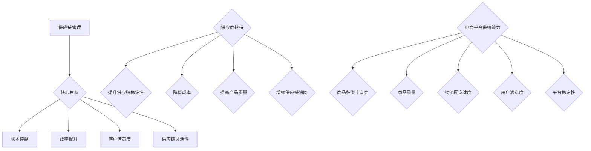

                 

### 第1章 引言与核心概念

> **关键词**：供应链管理、供应商扶持、电商平台、供给能力、策略、优化、技术创新。

> **摘要**：本章将介绍供应链管理、供应商扶持、电商平台及供给能力等核心概念，并探讨其在现代商业环境中的重要性。通过了解这些概念及其相互关系，我们将为后续章节的深入讨论奠定基础。

#### 1.1 供应链管理的现状与挑战

**1.1.1 供应链管理的概念与历史**

供应链管理（Supply Chain Management，简称SCM）是指对供应链内各个环节进行协调、优化和整合，以实现高效运作和资源优化配置的过程。供应链管理的历史可以追溯到20世纪60年代，当时企业开始关注如何减少库存和缩短生产周期。随着时间的推移，供应链管理逐渐发展成为一门综合性的管理学科，涵盖了物流、采购、生产、销售等多个环节。

供应链管理的主要目标包括：降低成本、提高效率、提升客户满意度、增强供应链的灵活性和适应性。为了实现这些目标，企业需要通过优化供应链网络、改进物流和库存管理、提高生产效率等方式来提高整个供应链的运作水平。

**1.1.2 供应链管理的核心目标与挑战**

供应链管理的核心目标是实现供应链的优化和整合，从而提高企业的竞争力。具体而言，核心目标包括以下几个方面：

1. **成本控制**：通过减少库存、优化物流和降低采购成本等方式，实现成本的有效控制。
2. **效率提升**：通过优化生产流程、提高物流速度和减少等待时间，提高供应链的整体运作效率。
3. **客户满意度**：通过提供高质量的产品和服务、缩短交货周期和降低投诉率，提高客户满意度。
4. **供应链灵活性**：通过建立敏捷的供应链体系、提高供应链对市场变化的适应能力，增强企业的竞争力。

然而，在实现这些核心目标的过程中，企业面临着一系列挑战：

1. **信息不对称**：供应链中的各个环节往往存在信息不对称的问题，导致决策不准确和效率低下。
2. **协同困难**：供应链中的各个企业、部门之间往往缺乏协同，导致资源浪费和效率下降。
3. **风险管理**：供应链的复杂性和不确定性使得企业面临各种风险，如供应商不稳定、物流延误、需求波动等。
4. **技术挑战**：随着技术的不断进步，供应链管理面临着新的技术挑战，如大数据、云计算、物联网等。

#### 1.2 供应商扶持的重要性

**1.2.1 供应商扶持的定义与意义**

供应商扶持是指企业为了提高供应商的供给能力、促进供应链的协同发展而采取的一系列措施。供应商扶持的目标包括提高供应商的生产能力、降低成本、提高质量、缩短交货周期等。

供应商扶持的意义主要体现在以下几个方面：

1. **提升供应链稳定性**：通过扶持供应商，企业可以确保供应商的稳定供应，降低供应链中断的风险。
2. **降低成本**：通过提高供应商的供给能力，企业可以降低采购成本、物流成本和库存成本，从而提高整体盈利能力。
3. **提高产品质量**：通过扶持供应商，企业可以推动供应商提高生产技术和质量管理体系，从而提高产品品质。
4. **增强供应链协同**：通过供应商扶持，企业可以加强与供应商之间的合作，提高供应链的协同效应。

**1.2.2 供应商扶持对供应链优化的贡献**

供应商扶持对供应链优化具有显著的贡献，主要表现在以下几个方面：

1. **提高供应链效率**：通过扶持供应商，企业可以提高供应链的整体运作效率，缩短交货周期、减少库存积压和降低物流成本。
2. **降低供应链风险**：通过扶持供应商，企业可以增强供应链的稳定性，降低供应链中断的风险，从而提高企业的抗风险能力。
3. **提高供应链灵活性**：通过扶持供应商，企业可以推动供应商提高生产能力和质量水平，增强供应链对市场变化的适应能力。
4. **促进创新**：通过供应商扶持，企业可以激发供应商的创新意识，推动新技术、新工艺的应用，从而提高整个供应链的创新能力和竞争力。

#### 1.3 电商平台供给能力的提升

**1.3.1 电商平台供给能力的定义与评价指标**

电商平台供给能力是指电商平台在满足用户需求、提供商品和服务的过程中所具备的综合能力。供给能力评价指标主要包括以下几个方面：

1. **商品种类丰富度**：指电商平台提供的商品种类和数量，反映平台对用户需求的满足程度。
2. **商品质量**：指电商平台提供的商品质量水平，包括商品的真实性、品质和售后服务等。
3. **物流配送速度**：指电商平台物流配送的速度和质量，包括配送时效、配送准确性、配送服务质量等。
4. **用户满意度**：指用户对电商平台的服务质量、商品质量、购物体验等方面的满意度。
5. **平台稳定性**：指电商平台的系统稳定性和安全性，包括平台的运行速度、数据安全性、客户服务响应速度等。

**1.3.2 电商平台供给能力提升的方法与策略**

为了提升电商平台供给能力，企业可以采取以下方法和策略：

1. **优化供应链网络**：通过优化供应链网络，缩短供应链长度、提高供应链灵活性，从而提高电商平台的供给能力。
2. **提升供应商质量**：通过供应商扶持，提高供应商的生产能力和质量水平，确保平台提供高质量的商品和服务。
3. **加强物流配送体系**：通过建立高效的物流配送体系，提高物流配送速度和质量，提升用户的购物体验。
4. **提升用户满意度**：通过提供优质的客户服务、改善购物体验，提高用户的满意度，从而增强平台的竞争力。
5. **应用新技术**：通过应用大数据、云计算、物联网等新技术，提高电商平台的智能化水平和运营效率。

通过以上方法和策略，企业可以不断提升电商平台供给能力，提高市场竞争力，实现可持续发展。

---

在本章中，我们介绍了供应链管理、供应商扶持和电商平台供给能力等核心概念，并探讨了它们在现代商业环境中的重要性。通过理解这些概念及其相互关系，我们为后续章节的深入讨论奠定了基础。在接下来的章节中，我们将进一步探讨供应商扶持策略、电商平台供给能力提升的方法和策略，以及成功案例和政策法规对供应商扶持和电商平台供给能力提升的影响。

[Mermaid 流程图](#):



---

**核心算法原理讲解与伪代码：**

供应商评价标准与方法：

```python
def evaluate_supplier(supplier_data):
    """
    评估供应商的综合表现，供应商数据包括：
    - production_ability：生产能力
    - cost：采购成本
    - quality：质量水平
    - delivery_speed：交货速度
    """
    score = 0
    
    # 生产能力占比30%
    score += supplier_data['production_ability'] * 0.3
    
    # 采购成本占比20%
    score -= supplier_data['cost'] * 0.2
    
    # 质量水平占比30%
    score += supplier_data['quality'] * 0.3
    
    # 交货速度占比20%
    score -= supplier_data['delivery_speed'] * 0.2
    
    return score
```

**数学模型和公式讲解与举例说明：**

供应链优化中的库存模型：

$$
I = \frac{C \cdot P}{D}
$$

其中，\(I\) 表示库存水平，\(C\) 表示采购成本，\(P\) 表示采购周期，\(D\) 表示需求量。

举例说明：

假设某企业的采购成本为5000元，采购周期为30天，需求量为1000件。根据上述库存模型，企业的库存水平为：

$$
I = \frac{5000 \cdot 30}{1000} = 1500 \text{件}
$$

这意味着企业需要在30天内保持1500件的库存水平，以应对需求波动和供应链中断的风险。

---

在本章中，我们初步探讨了供应链管理、供应商扶持和电商平台供给能力等核心概念，并分析了它们在现代商业环境中的重要性。通过理解这些概念及其相互关系，我们为后续章节的深入讨论奠定了基础。在接下来的章节中，我们将进一步探讨供应商扶持策略、电商平台供给能力提升的方法和策略，以及成功案例和政策法规对供应商扶持和电商平台供给能力提升的影响。通过逐步分析推理，我们将为您提供更加详细和全面的技术博客内容。

---

**项目实战：代码实际案例和详细解释说明**

**开发环境搭建：**

为了更好地展示供应商评价与筛选的代码实现，我们首先需要搭建一个基本的Python开发环境。以下步骤将指导您如何设置：

1. **安装Python：** 访问Python官方网站（https://www.python.org/）下载并安装Python 3.x版本。
2. **配置Python环境变量：** 在系统环境变量中添加Python的安装路径，确保能够在命令行中运行Python。
3. **安装必需的库：** 打开命令行窗口，执行以下命令安装必要的库：

   ```bash
   pip install numpy pandas matplotlib
   ```

**源代码实现与解读：**

以下是一个简单的供应商评价与筛选的Python代码实现，包括供应商数据结构、评价标准和筛选流程。

```python
import numpy as np

# 供应商数据结构
class Supplier:
    def __init__(self, name, production_ability, cost, quality, delivery_speed):
        self.name = name
        self.production_ability = production_ability
        self.cost = cost
        self.quality = quality
        self.delivery_speed = delivery_speed

# 评价标准权重
weights = {'production_ability': 0.3, 'cost': 0.2, 'quality': 0.3, 'delivery_speed': 0.2}

# 供应商评价函数
def evaluate_supplier(supplier):
    score = 0
    for attribute, weight in weights.items():
        score += getattr(supplier, attribute) * weight
    return score

# 供应商筛选流程
def select_suppliers(suppliers, target_score):
    selected_suppliers = []
    for supplier in suppliers:
        score = evaluate_supplier(supplier)
        if score >= target_score:
            selected_suppliers.append(supplier)
    return selected_suppliers

# 创建供应商对象
suppliers = [
    Supplier('供应商A', 8, 500, 9, 2),
    Supplier('供应商B', 6, 600, 7, 3),
    Supplier('供应商C', 9, 550, 8, 1),
    Supplier('供应商D', 7, 520, 6, 2)
]

# 筛选目标评分
target_score = 7.5

# 执行筛选流程
selected_suppliers = select_suppliers(suppliers, target_score)

# 输出结果
print("筛选出的供应商：")
for supplier in selected_suppliers:
    print(f"{supplier.name}: 评分 - {evaluate_supplier(supplier)}")
```

**代码解读与分析：**

1. **供应商数据结构**：`Supplier` 类用于表示供应商的基本信息，包括名称、生产能力、采购成本、质量水平和交货速度。
2. **评价标准权重**：`weights` 字典定义了评价各个指标的权重，总权重为1。在实际应用中，可以根据具体需求调整权重。
3. **供应商评价函数**：`evaluate_supplier` 函数根据供应商的信息和评价标准计算总评分。评分越高，表示供应商的综合表现越好。
4. **供应商筛选流程**：`select_suppliers` 函数遍历所有供应商，根据设定的目标评分筛选出符合条件的供应商。
5. **创建供应商对象**：在本例中，我们创建了一个包含四个供应商对象的列表。
6. **执行筛选流程**：使用`select_suppliers` 函数根据设定的目标评分筛选供应商，并输出结果。

通过以上代码实现，我们能够有效地评估和筛选供应商，从而为供应链管理提供有力的支持。

---

通过本章的介绍，我们初步了解了供应链管理、供应商扶持和电商平台供给能力的核心概念及其重要性。在接下来的章节中，我们将深入探讨供应商扶持策略、电商平台供给能力提升的方法和策略，并通过实际案例和代码实现，进一步阐述这些概念在实际操作中的应用。让我们继续跟随逻辑清晰的思路，逐步解析这一领域的技术细节。

