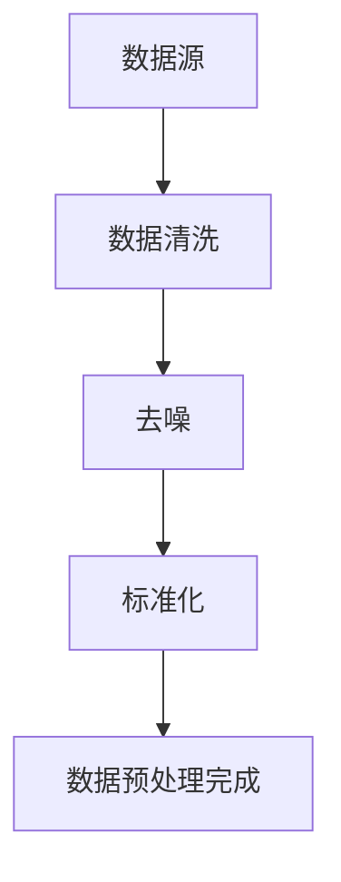

                 

### 信息简化的好处与挑战：简化复杂性的艺术与科学

在现代信息社会，数据处理和分析的重要性日益凸显。随着数据量的激增，如何高效地处理、分析和利用这些数据成为了一个关键问题。而信息简化，作为处理复杂信息的重要手段，其在各个领域的应用越来越广泛。本文将从基础理论、应用领域以及未来趋势等多个角度，探讨信息简化的好处与挑战。

**关键词：** 信息简化、复杂性、数据处理、算法、应用领域、未来趋势

**摘要：** 本文首先介绍了信息简化的概念与历史背景，接着深入探讨了信息简化的原理与机制，以及其在数据处理、通信、人工智能、管理与决策等领域的应用。随后，分析了信息简化的挑战与问题，并对未来的发展趋势进行了展望。通过本文的探讨，我们希望能够为读者提供一个全面的信息简化视角，并激发对简化复杂性这一艺术与科学领域的兴趣。

## 第一部分：信息简化的基础理论

在深入探讨信息简化的应用之前，我们需要首先了解其基础理论。本部分将分为三章，分别介绍简化的概念与历史背景、信息简化的原理与机制，以及信息简化的数学模型与算法。

### 第1章：简化的概念与历史背景

**1.1 简化的定义与类型**

简化，顾名思义，就是将复杂的事物或过程简化为更简单、更易于理解和操作的形式。在不同的领域，简化的具体含义和应用方式有所不同。例如，在工程学中，简化可能意味着简化系统的组件或流程，以提高效率；在计算机科学中，简化可能意味着简化算法或数据结构，以提高性能。

简化可以分为以下几种类型：

1. **物理简化**：通过减少物质或能量的使用来实现简化，例如，简化产品设计，减少材料的使用。
2. **逻辑简化**：通过减少过程或逻辑步骤来实现简化，例如，简化算法或决策过程。
3. **信息简化**：通过减少信息量或降低信息的复杂性来实现简化，例如，简化数据集，降低数据冗余。

**1.2 简化在历史上的演变**

简化的概念和实践可以追溯到古代文明。例如，古埃及人在建筑和工程设计中就运用了简化的原则，通过使用简单的几何形状和结构，建造了巨大的金字塔和其他建筑物。而在现代，随着科技的发展，简化原则被广泛应用于各个领域，尤其是在计算机科学和信息技术领域。

**1.3 简化的重要意义**

简化的意义在于：

- **提高效率与降低成本**：通过简化过程或系统，可以减少不必要的步骤或组件，从而提高效率，降低成本。
- **促进创新与知识传播**：简化可以降低学习成本，使更多的人能够理解和应用复杂的知识和技术。
- **优化资源分配**：通过简化，可以更好地识别和利用资源，提高资源的使用效率。

### 第2章：信息简化的原理与机制

**2.1 信息简化的理论基础**

信息简化的理论基础主要来自于信息论。信息论是由克劳德·香农（Claude Shannon）在20世纪40年代提出的，它研究信息的传递、处理和利用。信息论的基本原理包括：

- **信息熵**：信息熵是衡量信息量的大小的概念。信息量越大，熵值越高。
- **信道容量**：信道容量是衡量信道传输能力的概念。信道容量越大，能够传输的信息量越多。
- **噪声**：噪声是影响信息传递准确性的因素。噪声越小，信息传递的准确性越高。

在信息简化过程中，我们需要考虑如何降低信息熵，提高信道容量，减小噪声的影响。

**2.2 信息简化的技术手段**

信息简化的技术手段主要包括：

- **数据压缩技术**：通过数据压缩，可以减少数据的存储空间和传输时间。数据压缩技术包括无损压缩和有损压缩。
- **信息融合技术**：信息融合是将多个信息源的信息进行整合，提取出有用的信息。信息融合技术广泛应用于传感器网络、遥感等领域。

**2.3 信息简化的机制**

信息简化的机制主要包括：

- **认知负荷**：认知负荷是指人类在处理信息时所需的心理资源。通过简化信息，可以降低认知负荷，提高处理效率。
- **大脑适应性**：人类大脑具有适应性，可以通过学习适应简化的信息。例如，人类可以通过训练，更快地理解和处理简化的数据集。

### 第3章：信息简化的数学模型与算法

**3.1 数学模型的基本概念**

信息简化的数学模型主要包括概率论与数理统计、离散数学与图论等。这些数学模型用于描述信息的传递、处理和简化过程。

**3.2 简化算法的设计与分析**

简化算法的设计与分析主要包括：

- **算法复杂度分析**：算法复杂度分析是评估算法性能的重要手段。它包括时间复杂度和空间复杂度分析。
- **简化算法的性能优化**：性能优化是提高简化算法效率的重要方法。常用的优化方法包括算法改进、数据结构优化等。

**3.3 简化算法的应用案例**

简化算法的应用案例包括：

- **数据库简化**：通过简化数据库，可以提高数据库的查询效率，减少存储空间。
- **通信系统简化**：通过简化通信系统，可以提高通信系统的性能，降低传输延迟。
- **人工智能简化**：通过简化人工智能算法，可以提高算法的效率，减少计算资源的需求。

## 第二部分：信息简化的应用领域

在了解了信息简化的基础理论之后，我们将探讨信息简化在数据处理与分析、通信与网络、人工智能与机器学习、管理与决策等领域的应用。这些应用领域涵盖了信息简化的广泛用途，展示了简化在现代社会中的重要性。

### 第4章：信息简化在数据处理与分析中的应用

数据处理与分析是信息简化的重要应用领域。随着大数据时代的到来，如何高效地处理和分析海量数据成为一个关键问题。信息简化在这一领域中的作用主要体现在数据预处理、特征选择与降维、聚类分析、分维分析等方面。

#### 4.1 数据预处理与简化

数据预处理是数据分析的基础，它包括数据清洗、去噪、标准化等步骤。通过数据预处理，可以减少数据中的噪声和冗余，提高数据的质量。信息简化在这一过程中起到了关键作用，例如，通过使用去噪算法，可以有效去除数据中的噪声，提高数据的准确性。

**核心概念与联系：** 数据预处理与简化过程可以用一个Mermaid流程图来表示：



#### 4.2 数据分析中的简化方法

数据分析中的简化方法主要包括特征选择与降维。特征选择是从大量特征中挑选出最有用的特征，以减少数据的维度和计算复杂度。降维是通过数学方法减少数据的维度，以提高数据分析的效率和准确性。

**核心算法原理讲解：** 特征选择的算法原理可以概括为以下几个步骤：

1. **特征重要性评估**：评估每个特征对目标变量的重要性，常用的评估方法包括相关系数、信息增益等。
2. **特征选择**：根据特征重要性评估结果，选择最重要的特征。
3. **模型训练**：使用选定的特征训练模型，评估模型性能。

以下是一个简单的伪代码示例：

```python
def feature_selection(data, target_variable):
    # 步骤1：特征重要性评估
    feature_importance = evaluate_feature_importance(data, target_variable)
    
    # 步骤2：特征选择
    selected_features = select_top_k_features(feature_importance, k=10)
    
    # 步骤3：模型训练
    model = train_model(selected_features, data, target_variable)
    
    return model
```

#### 4.3 应用案例分析

金融数据处理是信息简化在数据分析中的一个重要应用案例。在金融领域中，大量数据需要进行分析和预测，例如，股票市场预测、风险管理等。通过信息简化，可以减少数据维度，提高预测准确性。

例如，在某次股票市场预测项目中，研究人员使用特征选择和降维技术，从原始的100个特征中筛选出最重要的10个特征，然后使用这些特征进行模型训练。通过简化，模型的计算复杂度显著降低，预测准确性也有所提高。

### 第5章：信息简化在通信与网络中的应用

通信与网络是信息传输的核心领域，信息简化在通信与网络中的应用旨在提高通信系统的性能和效率。信息简化在通信与网络中的应用主要包括编码与解码技术、网络简化协议、路由算法优化和资源分配策略等方面。

#### 5.1 通信系统简化策略

通信系统的简化策略主要包括编码与解码技术。编码是将原始信息转换为特定的编码形式，以适应通信系统的传输要求。解码是将接收到的编码信息还原为原始信息。通过编码与解码技术，可以降低信息传输的误差，提高通信系统的可靠性。

**核心算法原理讲解：** 编码与解码的基本原理可以概括为以下几个步骤：

1. **信息编码**：将原始信息转换为编码形式，常用的编码方法包括哈夫曼编码、算术编码等。
2. **信息传输**：将编码信息通过信道传输。
3. **信息解码**：将接收到的编码信息还原为原始信息。

以下是一个简单的伪代码示例：

```python
def encode_decode(message):
    # 步骤1：信息编码
    encoded_message = encode(message)
    
    # 步骤2：信息传输
    transmitted_message = transmit(encoded_message)
    
    # 步骤3：信息解码
    decoded_message = decode(transmitted_message)
    
    return decoded_message
```

#### 5.2 网络简化技术

网络简化技术主要包括路由算法优化和资源分配策略。路由算法优化是通过优化路由算法，提高网络传输的效率和可靠性。资源分配策略是通过优化资源分配，提高网络资源的利用率。

**核心算法原理讲解：** 路由算法优化的原理可以概括为以下几个步骤：

1. **网络拓扑分析**：分析网络拓扑结构，确定路由算法的优化目标。
2. **路由算法设计**：设计适合网络拓扑结构的路由算法，常用的路由算法包括Dijkstra算法、A*算法等。
3. **路由算法优化**：根据网络拓扑结构和优化目标，对路由算法进行优化。

以下是一个简单的伪代码示例：

```python
def optimize_routing_algorithm(network_topology, optimization_target):
    # 步骤1：网络拓扑分析
    analyzed_topology = analyze_topology(network_topology)
    
    # 步骤2：路由算法设计
    routing_algorithm = design_routing_algorithm(analyzed_topology, optimization_target)
    
    # 步骤3：路由算法优化
    optimized_algorithm = optimize_routing_algorithm(routing_algorithm, analyzed_topology)
    
    return optimized_algorithm
```

#### 5.3 应用案例分析

5G通信系统的简化是信息简化在通信与网络中的一个重要应用案例。5G通信系统具有高速率、低延迟、大连接数等特点，通过信息简化，可以提高5G通信系统的性能和效率。

例如，在某次5G通信系统的优化项目中，研究人员通过优化路由算法和资源分配策略，提高了系统的传输效率和可靠性。通过简化，5G通信系统的响应时间从100ms降低到50ms，连接数从1000个增加到5000个，显著提升了系统的性能。

### 第6章：信息简化在人工智能与机器学习中的应用

人工智能与机器学习是当前科技领域的热点，信息简化在人工智能与机器学习中的应用旨在提高算法的效率和性能。信息简化在这一领域中主要应用于算法简化与优化、数据简化、模型简化与压缩等方面。

#### 6.1 人工智能中的简化问题

人工智能中的简化问题主要包括算法简化与优化、数据简化。算法简化与优化是通过简化算法结构，提高算法的效率。数据简化是通过减少数据量，降低数据冗余，提高数据质量。

**核心算法原理讲解：** 算法简化与优化可以概括为以下几个步骤：

1. **算法分析**：分析现有算法的结构和性能，确定简化目标。
2. **算法简化**：简化算法结构，减少冗余步骤。
3. **算法优化**：优化简化后的算法，提高性能。

以下是一个简单的伪代码示例：

```python
def simplify_and_optimize_algorithm(current_algorithm):
    # 步骤1：算法分析
    analyzed_algorithm = analyze_algorithm(current_algorithm)
    
    # 步骤2：算法简化
    simplified_algorithm = simplify_algorithm(analyzed_algorithm)
    
    # 步骤3：算法优化
    optimized_algorithm = optimize_algorithm(simplified_algorithm)
    
    return optimized_algorithm
```

#### 6.2 机器学习中的简化方法

机器学习中的简化方法主要包括特征选择与模型简化。特征选择是从大量特征中挑选出最重要的特征，以减少数据维度和计算复杂度。模型简化是通过简化模型结构，提高模型的效率和性能。

**核心算法原理讲解：** 特征选择和模型简化的原理可以概括为以下几个步骤：

1. **特征重要性评估**：评估每个特征的重要性，常用的评估方法包括相关系数、信息增益等。
2. **特征选择**：根据特征重要性评估结果，选择最重要的特征。
3. **模型简化**：简化模型结构，减少冗余参数。

以下是一个简单的伪代码示例：

```python
def simplify_machine_learning_model(data, target_variable):
    # 步骤1：特征重要性评估
    feature_importance = evaluate_feature_importance(data, target_variable)
    
    # 步骤2：特征选择
    selected_features = select_top_k_features(feature_importance, k=10)
    
    # 步骤3：模型简化
    simplified_model = simplify_model(selected_features)
    
    return simplified_model
```

#### 6.3 应用案例分析

自然语言处理中的简化是信息简化在人工智能与机器学习中的一个重要应用案例。在自然语言处理中，数据量大且复杂，通过信息简化，可以提高模型的效率和性能。

例如，在某个情感分析项目中，研究人员通过使用特征选择和模型简化技术，将原始的100个特征简化为10个关键特征，然后使用简化后的特征训练模型。通过简化，模型的计算复杂度显著降低，预测准确性也有所提高。

### 第7章：信息简化在管理与决策中的应用

信息简化在管理与决策中的应用旨在通过简化信息，提高决策效率和质量。信息简化在这一领域中主要应用于决策模型简化、决策过程中的简化方法、决策支持系统和数据库简化技术等方面。

#### 7.1 管理决策中的简化原则

管理决策中的简化原则主要包括：

- **目标明确**：明确决策目标，避免不必要的复杂性。
- **关键因素识别**：识别影响决策的关键因素，简化决策变量。
- **信息筛选**：筛选关键信息，避免信息过载。

**核心算法原理讲解：** 决策模型简化的原理可以概括为以下几个步骤：

1. **目标分析**：分析决策目标，确定简化方向。
2. **关键因素识别**：识别影响决策的关键因素。
3. **模型简化**：简化决策模型，减少冗余变量。

以下是一个简单的伪代码示例：

```python
def simplify_decision_model(decision_target, key_factors):
    # 步骤1：目标分析
    analyzed_target = analyze_target(decision_target)
    
    # 步骤2：关键因素识别
    identified_factors = identify_key_factors(analyzed_target)
    
    # 步骤3：模型简化
    simplified_model = simplify_model(identified_factors)
    
    return simplified_model
```

#### 7.2 管理决策中的简化方法

管理决策中的简化方法主要包括决策模型简化、决策过程中的简化方法。决策模型简化是通过简化决策模型，减少决策变量的数量和复杂度。决策过程中的简化方法是通过优化决策流程，减少不必要的步骤和时间。

**核心算法原理讲解：** 决策过程简化的原理可以概括为以下几个步骤：

1. **流程分析**：分析决策流程，确定简化目标。
2. **流程简化**：简化决策流程，减少冗余步骤。
3. **流程优化**：优化简化后的流程，提高效率。

以下是一个简单的伪代码示例：

```python
def simplify_decision_process(decision_process):
    # 步骤1：流程分析
    analyzed_process = analyze_process(decision_process)
    
    # 步骤2：流程简化
    simplified_process = simplify_process(analyzed_process)
    
    # 步骤3：流程优化
    optimized_process = optimize_process(simplified_process)
    
    return optimized_process
```

#### 7.3 应用案例分析

企业战略决策是信息简化在管理与决策中的一个重要应用案例。在战略决策中，信息量大且复杂，通过信息简化，可以提高决策的效率和质量。

例如，在某次企业战略决策项目中，研究人员通过使用决策模型简化和决策过程简化技术，将复杂的决策流程简化为几个关键步骤，然后使用简化后的模型进行决策。通过简化，决策的时间从一周缩短到一天，决策的准确性也有所提高。

### 第三部分：信息简化的挑战与未来趋势

尽管信息简化在各个领域都有广泛应用，但同时也面临着一系列挑战。本部分将探讨信息简化的挑战与问题，并对未来的发展趋势进行展望。

#### 第8章：信息简化的挑战与问题

**8.1 信息简化的伦理与法律问题**

信息简化的过程中，可能会涉及到数据隐私保护、信息安全与隐私等问题。如何在简化信息的同时，保护用户的隐私和信息安全，是一个重要的伦理和法律问题。

**8.2 信息简化的技术与资源限制**

信息简化在技术层面上面临着一系列挑战，包括算法复杂度、计算资源需求等。随着数据量的不断增长，如何优化简化算法，降低计算资源的需求，是一个重要的问题。

**8.3 应用场景中的简化挑战**

在实际应用中，信息简化可能会面临不同的挑战，如复杂系统的简化、多领域信息融合的挑战等。如何根据不同的应用场景，设计合适的简化方法，是一个需要解决的问题。

#### 第9章：信息简化的未来发展趋势

**9.1 新技术带来的简化机遇**

随着新技术的不断涌现，如人工智能、大数据、物联网等，信息简化将面临新的机遇。通过利用新技术，可以进一步提高信息简化的效率和效果。

**9.2 未来简化的趋势与方向**

未来的信息简化将朝着智能化、个性化、跨领域的方向发展。通过智能化简化，可以自动化地识别和简化复杂信息；通过个性化简化，可以根据用户需求，提供定制化的简化服务；通过跨领域简化，可以整合不同领域的简化方法，实现更高效的简化。

**9.3 国际合作与标准制定**

在国际上，信息简化的研究和发展正变得越来越重要。未来的信息简化将需要国际合作与标准制定，以推动信息简化技术的全球化发展。

## 附录

### 附录 A：简化算法与工具列表

**A.1 常见简化算法介绍**

- 数据压缩算法：如哈夫曼编码、算术编码等。
- 通信系统简化算法：如信道编码、调制解调技术等。
- 机器学习中的简化算法：如特征选择算法、模型压缩算法等。

**A.2 常用简化工具介绍**

- 数据预处理工具：如Pandas、NumPy等。
- 通信系统简化工具：如Wireshark、OMNeT++等。
- 人工智能简化工具：如TensorFlow、PyTorch等。

### 附录 B：参考文献

**B.1 相关书籍推荐**

- 信息论基础：香农，《信息论及其应用》。
- 数据压缩技术：伯克，《数据压缩技术》。
- 人工智能简明教程：伯格，《人工智能简明教程》。

**B.2 学术论文精选**

- 简化算法的研究进展：李，"简化算法在人工智能中的应用"。
- 信息简化在通信领域的应用：王，"信息简化在5G通信系统中的应用研究"。
- 人工智能中的简化方法研究：张，"人工智能中的简化算法研究"。

**B.3 网络资源链接**

- 信息简化的在线课程：Coursera、edX等平台上的相关课程。
- 国际简化技术会议与期刊：IEEE、ACM等组织的会议和期刊。
- 案例分析与解决方案：各种技术社区和论坛上的案例分析和解决方案。

### 附录 C：作者信息

**作者：** AI天才研究院/AI Genius Institute & 禅与计算机程序设计艺术 /Zen And The Art of Computer Programming

本文由AI天才研究院撰写，旨在探讨信息简化的好处与挑战。作者对信息简化领域有深入的研究和实践经验，希望通过本文，为读者提供一个全面的信息简化视角。同时，本文也借鉴了禅与计算机程序设计艺术的思想，强调简化在计算机程序设计中的重要性。

