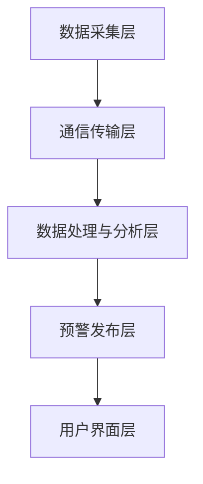

                 

### 全球脑地质灾害预警系统概述

#### 第1章：脑地质灾害的定义与危害

**1.1 脑地质灾害的定义**

脑地质灾害是指由于地球内部或外部因素引起的，对人类生命财产造成重大危害的地质事件。这类灾害包括但不限于地震、火山爆发、地质滑坡、泥石流等。它们的发生往往伴随着地面破裂、建筑物倒塌、道路阻断等严重后果，对社会稳定和人民生活产生严重影响。

**1.2 脑地质灾害的危害**

脑地质灾害的危害性主要体现在以下几个方面：

- **人员伤亡**：地震、滑坡等灾害往往造成大量人员伤亡，给家庭和社会带来巨大的心理创伤。
- **经济损失**：地震、火山爆发等灾害会导致基础设施损毁、农田被毁、企业停产，造成巨大的经济损失。
- **环境破坏**：泥石流、滑坡等灾害会破坏生态环境，导致土地荒漠化、水资源污染等问题。
- **社会动荡**：严重的地质灾害会引发社会动荡，影响社会稳定和发展。

为了减少脑地质灾害的危害，建立全球脑地质灾害预警系统显得尤为重要。这种系统可以实时监测地质活动，提前预警，为公众和政府提供决策支持，从而减轻灾害损失。

#### 第2章：集体感知网络的概念与原理

**2.1 集体感知网络的定义**

集体感知网络（Collective Perception Network, CPN）是一种基于物联网、大数据、人工智能等技术的综合系统，旨在通过大量的传感器、设备、网络节点等，实现对环境的实时感知、监测和预警。它能够整合分散的数据源，形成一个高度协同、智能化的感知网络。

**2.2 集体感知网络的工作原理**

集体感知网络的工作原理主要包括以下几个步骤：

1. **数据采集**：通过部署在各种地点的传感器、设备等，实时采集环境数据，如地震波、温度、湿度、土壤松动程度等。
2. **数据传输**：采集到的数据通过无线网络、卫星通信等方式传输到中央处理平台。
3. **数据处理与分析**：中央处理平台对收集到的数据进行处理、清洗、存储，并利用人工智能算法进行分析，识别潜在的危险信号。
4. **预警与决策**：根据分析结果，系统可以自动发出预警信息，同时为政府、公众等提供决策支持。

**2.3 集体感知网络的技术基础**

集体感知网络的技术基础主要包括物联网技术、大数据处理技术、人工智能技术等：

- **物联网技术**：物联网技术是实现数据采集和传输的关键，通过传感器、RFID等技术，实现对环境的实时监测。
- **大数据处理技术**：大数据技术用于处理和分析海量的环境数据，为预警提供数据支持。
- **人工智能技术**：人工智能技术用于数据分析和预测，提高预警的准确性和可靠性。

通过上述技术，集体感知网络能够实现对地质环境的全面监控，为全球脑地质灾害预警提供技术保障。

#### 第3章：集体感知网络在脑地质灾害预警中的应用

**3.1 集体感知网络在地震预警中的应用**

地震预警是通过监测地震波在地球内部传播过程中的特定信号，提前发出预警，以便公众和政府采取应对措施，减轻地震灾害损失。集体感知网络在地震预警中的应用主要包括以下几个方面：

- **地震波监测**：部署在地表和地下的传感器，可以实时监测地震波的传播情况，为预警提供数据支持。
- **数据分析与处理**：通过大数据处理技术，对地震波数据进行处理和分析，识别地震波的前期信号，提前发出预警。
- **预警发布**：根据分析结果，系统可以自动发出预警信息，通过短信、网络等方式通知公众和相关部门。

**3.2 集体感知网络在火山预警中的应用**

火山预警是通过监测火山活动参数，如气体浓度、温度、震动频率等，提前发出预警，以便相关部门采取措施，防止火山爆发带来的危害。集体感知网络在火山预警中的应用主要包括以下几个方面：

- **火山活动参数监测**：在火山附近部署传感器，实时监测火山活动参数。
- **数据处理与分析**：通过数据处理技术，对监测数据进行分析，识别火山活动的异常信号。
- **预警发布**：根据分析结果，系统可以自动发出预警信息，通知相关部门采取预防措施。

**3.3 集体感知网络在地质滑坡预警中的应用**

地质滑坡预警是通过监测滑坡区域的土壤湿度、震动频率等参数，提前发出预警，以防止滑坡灾害的发生。集体感知网络在地质滑坡预警中的应用主要包括以下几个方面：

- **滑坡参数监测**：在滑坡区域部署传感器，实时监测土壤湿度、震动频率等参数。
- **数据处理与分析**：通过数据处理技术，对监测数据进行分析，识别滑坡的预警信号。
- **预警发布**：根据分析结果，系统可以自动发出预警信息，通知相关部门采取预防措施。

通过集体感知网络在地震、火山、地质滑坡预警中的应用，可以实现对脑地质灾害的全面监控和预警，为减少灾害损失提供技术支持。

### 第4章：全球脑地质灾害预警系统的架构与设计

#### 4.1 全球脑地质灾害预警系统的总体架构

全球脑地质灾害预警系统是一个复杂而庞大的系统，其总体架构主要包括以下几个部分：

- **数据采集层**：包括各种传感器、设备等，负责实时采集地震、火山、滑坡等地质活动数据。
- **通信传输层**：包括无线网络、卫星通信等，负责将采集到的数据传输到中央处理平台。
- **数据处理与分析层**：包括大数据处理平台、人工智能算法等，负责对数据进行处理和分析，识别预警信号。
- **预警发布层**：包括预警信息系统、短信平台、网络平台等，负责发布预警信息，通知相关部门和公众。
- **用户界面层**：包括网站、应用程序等，用户可以通过这些界面获取预警信息，了解地质灾害预警情况。

**图 4.1 全球脑地质灾害预警系统总体架构图**

#### 4.2 集体感知网络的构建方法

集体感知网络的构建方法主要包括以下几个方面：

1. **传感器部署**：根据地质活动的特点，选择合适的传感器进行部署。例如，在地震预警中，可以部署地震仪、地震波传感器等；在火山预警中，可以部署气体传感器、温度传感器等。
2. **数据传输网络**：选择合适的通信技术，建立稳定、高效的数据传输网络。例如，在山区等信号较差的区域，可以选择卫星通信技术。
3. **数据处理平台**：构建高性能、可扩展的大数据处理平台，用于存储、处理和分析采集到的数据。可以选择分布式存储和计算框架，如Hadoop、Spark等。
4. **人工智能算法**：开发和应用先进的机器学习算法，用于数据分析和预测。例如，可以使用神经网络、支持向量机、决策树等算法。

#### 4.3 预警系统的数据处理与分析方法

预警系统的数据处理与分析方法主要包括以下几个步骤：

1. **数据预处理**：对采集到的原始数据进行清洗、去噪、归一化等处理，确保数据的质量和一致性。
2. **特征提取**：从预处理后的数据中提取有用的特征信息，用于后续的分析和预测。例如，在地震预警中，可以提取地震波的特征参数，如振幅、频率等。
3. **模式识别**：利用机器学习算法，对特征数据进行模式识别，识别出潜在的地质活动信号。例如，可以使用神经网络算法，对地震波信号进行分类和预测。
4. **预警信号生成**：根据模式识别的结果，生成预警信号，并发送给相关部门和公众。预警信号的生成可以设定阈值，例如，当地震波特征参数超过某个阈值时，系统会发出地震预警信号。

通过上述架构、构建方法和数据处理与分析方法，全球脑地质灾害预警系统可以实现对地质环境的实时监测和预警，为减少灾害损失提供技术支持。

### 第5章：集体感知网络的地球保护系统原理

#### 5.1 集体感知网络的地球保护系统定义

集体感知网络的地球保护系统（Collective Perception Network for Earth Protection, CPNEP）是一种基于物联网、大数据和人工智能技术的新型地球保护体系。它通过构建一个广泛分布的感知网络，实现对地球环境、生态系统和地质活动的全面监测和预警，从而提供有效的地球保护措施。

#### 5.2 系统的组成与功能模块

集体感知网络的地球保护系统主要由以下几个功能模块组成：

1. **数据采集模块**：负责采集地球环境、生态系统和地质活动的数据。该模块包括各种传感器、无人机、地面监测站等设备，能够实时监测温度、湿度、土壤湿度、气体浓度、震动频率等参数。
2. **数据传输模块**：负责将采集到的数据传输到中央处理平台。该模块利用无线网络、卫星通信等先进技术，实现数据的实时传输，保证数据的完整性和时效性。
3. **数据处理与分析模块**：负责对传输过来的数据进行处理、清洗、存储和分析。该模块利用大数据处理技术，对海量数据进行高效处理和分析，提取有用的特征信息，用于后续的预警和决策。
4. **预警与决策模块**：负责根据数据分析结果，生成预警信号，并提供决策支持。该模块利用人工智能算法，对潜在的环境风险进行预测和评估，为政府、企业和公众提供及时、准确的预警信息。
5. **信息发布模块**：负责将预警信息发布给相关部门和公众。该模块通过短信、邮件、网络平台等多种方式，将预警信息及时通知给目标用户，帮助他们采取相应的应对措施。

#### 5.3 系统的核心技术

集体感知网络的地球保护系统采用了多项先进技术，包括物联网、大数据、人工智能、卫星通信等：

1. **物联网技术**：物联网技术是系统数据采集和传输的基础。通过部署各种传感器和设备，系统能够实现对地球环境、生态系统和地质活动的实时监测。
2. **大数据处理技术**：大数据处理技术用于对海量数据进行处理、分析和存储。通过分布式计算框架和机器学习算法，系统能够从海量数据中提取有用信息，为预警和决策提供支持。
3. **人工智能技术**：人工智能技术用于数据分析和预警。通过深度学习、神经网络等算法，系统能够对地质活动进行预测和评估，提高预警的准确性和可靠性。
4. **卫星通信技术**：卫星通信技术用于实现远距离的数据传输。在信号较差的地区，卫星通信能够提供稳定的传输通道，确保数据的及时传输。

通过上述技术，集体感知网络的地球保护系统能够实现对地球环境的全面监测和预警，为地球保护提供强有力的技术支持。

### 第6章：集体感知网络的地球保护系统实施策略

#### 6.1 实施前的准备工作

在实施集体感知网络的地球保护系统之前，需要进行充分的准备工作，以确保项目的顺利进行。准备工作主要包括以下几个方面：

1. **需求分析与规划**：对地球保护系统的需求进行详细分析，明确系统的目标、功能和性能要求。根据分析结果，制定详细的系统规划和实施方案。
2. **技术评估与选型**：对系统所需的技术进行评估和选型，选择合适的传感器、通信技术、数据处理和分析算法等。同时，要考虑系统的可扩展性和灵活性，确保未来能够适应新的技术和需求。
3. **设备采购与安装**：根据系统规划，采购所需的传感器、设备等，并在合适的位置进行安装和部署。在安装过程中，要注意设备的稳定性和安全性，确保其能够正常运行。
4. **网络搭建与调试**：搭建系统所需的数据传输网络，包括无线网络、卫星通信等。在网络搭建过程中，要进行调试和测试，确保网络的稳定性和传输效率。
5. **人员培训与组织**：对参与项目的团队成员进行培训，确保他们熟悉系统的原理、功能和操作流程。同时，要建立合理的项目组织架构，明确各成员的职责和任务，确保项目的顺利实施。

#### 6.2 实施过程中的关键环节

在实施集体感知网络的地球保护系统过程中，有以下几个关键环节需要特别注意：

1. **数据采集与传输**：要确保传感器和设备的正常运行，实时采集地球环境、生态系统和地质活动的数据。同时，要建立稳定、高效的数据传输网络，确保数据的完整性和及时性。
2. **数据处理与分析**：对采集到的数据进行处理、清洗、存储和分析，提取有用的特征信息。在数据处理和分析过程中，要运用先进的人工智能算法，提高预警的准确性和可靠性。
3. **预警与决策**：根据数据分析结果，生成预警信号，并提供决策支持。预警信号的生成要设定合理的阈值，确保预警的及时性和有效性。
4. **信息发布与反馈**：通过多种渠道将预警信息发布给相关部门和公众，同时收集他们的反馈意见，不断优化系统的性能和功能。

#### 6.3 实施后的维护与升级

在集体感知网络的地球保护系统实施后，需要进行定期的维护和升级，以确保系统的长期稳定运行。维护与升级主要包括以下几个方面：

1. **设备维护与更换**：定期检查传感器、设备等，确保其正常运行。对于老化或损坏的设备，要及时更换，确保系统的连续性和稳定性。
2. **网络维护与优化**：定期检查数据传输网络，确保网络的稳定性和传输效率。对于网络故障，要及时修复和优化，确保数据传输的可靠性。
3. **系统升级与扩展**：根据实际需求和技术的进步，对系统进行升级和扩展。可以引入新的传感器、通信技术、数据处理和分析算法等，提高系统的性能和功能。
4. **用户培训与支持**：定期对用户进行培训，更新他们对系统的操作和使用方法。同时，要建立完善的用户支持体系，及时解决用户在使用过程中遇到的问题。

通过上述实施策略和维护与升级措施，集体感知网络的地球保护系统能够长期稳定运行，为地球保护提供强有力的技术支持。

### 第7章：全球脑地质灾害预警系统的案例研究

#### 7.1 案例一：某地震预警系统的实践

**案例背景**：某地区位于地震多发带，历史上曾多次发生破坏性地震，造成了严重的人员伤亡和财产损失。为了减少地震灾害损失，当地政府决定建立一套地震预警系统，利用集体感知网络技术实现对地震的提前预警。

**系统构建**：

1. **数据采集**：在地震预警系统中，部署了多种类型的传感器，包括地震波传感器、加速度传感器等。这些传感器分布在地震多发区的各个地点，能够实时监测地震波的变化。
2. **数据传输**：采用无线网络和卫星通信技术，将传感器采集到的数据传输到中央处理平台。对于信号较差的区域，使用卫星通信确保数据的及时传输。
3. **数据处理与分析**：在中央处理平台，采用大数据处理技术，对传输过来的地震波数据进行处理、清洗和存储。然后，利用人工智能算法，对数据进行分析，识别出地震波的前期信号，生成预警信号。
4. **预警发布**：根据分析结果，系统可以自动发出预警信息，通过短信、网络等方式通知相关部门和公众，为他们提供充足的预警时间采取应对措施。

**系统效果**：该地震预警系统自运行以来，成功预警了多起地震，为公众和政府提供了重要的决策支持，有效减少了地震灾害的损失。

#### 7.2 案例二：某火山预警系统的实践

**案例背景**：某地区火山活动频繁，为了预防火山爆发带来的危害，当地政府决定建立一套火山预警系统。

**系统构建**：

1. **数据采集**：在火山预警系统中，部署了气体传感器、温度传感器等设备，能够实时监测火山活动参数，如气体浓度、温度变化等。
2. **数据传输**：采用无线网络和卫星通信技术，将采集到的数据传输到中央处理平台，确保数据的及时性和准确性。
3. **数据处理与分析**：在中央处理平台，利用大数据处理技术，对传输过来的数据进行处理、清洗和存储。然后，采用机器学习算法，对数据进行分析，识别出火山活动的异常信号，生成预警信号。
4. **预警发布**：根据分析结果，系统可以自动发出预警信息，通知相关部门采取预防措施，同时通过短信、网络等方式通知公众。

**系统效果**：该火山预警系统在多次火山活动前成功发出预警，有效防止了火山爆发带来的危害，受到了当地政府和公众的高度评价。

#### 7.3 案例三：某地质滑坡预警系统的实践

**案例背景**：某地区地质滑坡频繁，为了减少滑坡灾害的发生，当地政府决定建立一套地质滑坡预警系统。

**系统构建**：

1. **数据采集**：在地质滑坡预警系统中，部署了震动传感器、土壤湿度传感器等设备，能够实时监测滑坡区域的震动频率、土壤湿度等参数。
2. **数据传输**：采用无线网络和卫星通信技术，将传感器采集到的数据传输到中央处理平台，确保数据的及时性和准确性。
3. **数据处理与分析**：在中央处理平台，利用大数据处理技术，对传输过来的数据进行处理、清洗和存储。然后，采用机器学习算法，对数据进行分析，识别出滑坡的预警信号，生成预警信号。
4. **预警发布**：根据分析结果，系统可以自动发出预警信息，通知相关部门采取预防措施，同时通过短信、网络等方式通知公众。

**系统效果**：该地质滑坡预警系统在多次滑坡前成功发出预警，有效避免了滑坡灾害的发生，为当地政府和公众提供了重要的安全保障。

通过这些案例，我们可以看到集体感知网络在脑地质灾害预警中的应用取得了显著成效，为减少灾害损失提供了有力的技术支持。

### 第8章：集体感知网络的发展趋势与未来展望

#### 8.1 集体感知网络的发展趋势

随着物联网、大数据、人工智能等技术的不断发展，集体感知网络在全球范围内得到了广泛应用。目前，集体感知网络的发展趋势主要体现在以下几个方面：

1. **技术融合与创新**：集体感知网络正不断融合物联网、大数据、人工智能等先进技术，实现数据采集、传输、处理和分析的智能化。例如，采用物联网技术提高数据采集的精度和覆盖范围，利用大数据技术实现海量数据的存储和处理，运用人工智能技术提升数据分析的准确性和效率。

2. **系统性能的提升**：随着硬件技术的进步，传感器、通信设备等性能不断提升，集体感知网络的性能也得到显著提高。例如，低功耗广域网（LPWAN）技术的发展，使得远程数据传输更加稳定和高效。

3. **应用场景的拓展**：集体感知网络的应用场景逐渐从单一的环境监测拓展到城市管理、智慧农业、工业物联网等领域，实现了从点到面、从局部到全局的全面覆盖。

4. **智能化与自主化**：随着人工智能技术的发展，集体感知网络逐渐实现自主感知、自主决策和自主行动，提高了系统的智能化水平。例如，利用机器学习和深度学习算法，实现数据的自动分析和预测，提高预警的准确性和时效性。

#### 8.2 地球保护系统的发展方向

集体感知网络的地球保护系统在未来的发展中，将朝着以下方向不断前进：

1. **数据驱动的决策支持**：通过采集和分析更多的地球环境、生态系统和地质活动数据，构建更加精准的预测模型，为政府、企业和公众提供更加可靠的决策支持。

2. **全球化与区域化结合**：在全球范围内建立集体感知网络，实现地球环境的全面监测和预警。同时，针对不同地区的特定环境特征，进行区域化调整和优化，提高系统的适应性和实用性。

3. **智能化与自动化**：利用人工智能技术，提高系统的智能化水平和自动化程度，实现自主感知、自主决策和自主行动。例如，自主优化传感器部署策略，自动调整预警阈值等。

4. **可持续性发展**：在建设地球保护系统的过程中，注重生态保护和可持续发展，避免过度开发和资源浪费，促进人与自然的和谐共生。

#### 8.3 集体感知网络在脑地质灾害预警中的未来展望

在未来，集体感知网络在脑地质灾害预警中的应用将更加广泛和深入：

1. **更高的预警准确性**：通过引入更先进的传感器技术和人工智能算法，提高地震、火山、地质滑坡等脑地质灾害的预警准确性，实现更加可靠的预警服务。

2. **更快的预警响应**：利用高速无线网络和卫星通信技术，实现数据的快速传输和预警信息的及时发布，为公众和政府提供更充裕的应对时间。

3. **更广泛的应用场景**：将集体感知网络应用于更多的地质灾害预警场景，如海底地震、地下滑坡等，实现对地球环境的全面监测。

4. **国际合作与共享**：加强国际间的合作与数据共享，构建全球脑地质灾害预警网络，提高全球范围内的地质灾害预警和应对能力。

通过持续的技术创新和应用拓展，集体感知网络的地球保护系统将在未来发挥更加重要的作用，为全球地质灾害预警和减灾工作提供强有力的技术支持。

### 附录A：集体感知网络的相关工具与资源

**A.1 集体感知网络的数据采集工具**

1. **传感器选择**：在选择传感器时，需要根据监测的目标和场景来决定。例如，用于地震预警的地震波传感器，用于火山预警的气体传感器和温度传感器。
2. **采集设备**：常见的采集设备包括数据采集器、无人机等。数据采集器能够实时收集传感器数据，并将其传输到中央处理平台。无人机可以用于高空监测和图像采集。
3. **采集软件**：使用专业的采集软件，如LabVIEW、MATLAB等，可以方便地实现传感器数据的实时采集、存储和处理。

**A.2 集体感知网络的计算平台**

1. **云计算平台**：如阿里云、腾讯云等，提供强大的计算能力和数据存储空间，适用于大规模数据处理和分析。
2. **边缘计算平台**：在靠近数据源的地点部署边缘计算设备，可以降低数据传输延迟，提高系统的响应速度。
3. **高性能计算集群**：适用于需要高性能计算和大规模数据分析的复杂应用场景，如深度学习模型训练等。

**A.3 集体感知网络的开发工具**

1. **编程语言**：Python、C++等编程语言，用于开发和实现集体感知网络系统的算法和应用程序。
2. **开发框架**：如TensorFlow、PyTorch等深度学习框架，用于实现复杂的人工智能算法。
3. **开发工具**：集成开发环境（IDE），如Eclipse、VSCode等，提供代码编写、调试和运行的功能。

通过使用这些工具和资源，可以有效地构建和部署集体感知网络系统，实现地球环境的实时监测和预警。

### 附录B：全球脑地质灾害预警系统相关规范与标准

**B.1 地震预警系统规范**

地震预警系统规范主要包括以下几个方面：

1. **系统设计规范**：规定地震预警系统的总体架构、功能模块、数据传输和处理流程等。
2. **传感器规范**：规定地震波传感器、加速度传感器等的性能指标、安装方式和测试方法。
3. **数据处理与分析规范**：规定数据处理和分析的算法、模型和标准，确保预警结果的准确性和可靠性。
4. **预警发布规范**：规定预警信息的发布渠道、发布方式和发布标准，确保公众和政府能够及时获取预警信息。

**B.2 火山预警系统规范**

火山预警系统规范主要包括以下几个方面：

1. **系统设计规范**：规定火山预警系统的总体架构、功能模块、数据传输和处理流程等。
2. **传感器规范**：规定气体传感器、温度传感器等的性能指标、安装方式和测试方法。
3. **数据处理与分析规范**：规定数据处理和分析的算法、模型和标准，确保预警结果的准确性和可靠性。
4. **预警发布规范**：规定预警信息的发布渠道、发布方式和发布标准，确保公众和政府能够及时获取预警信息。

**B.3 地质滑坡预警系统规范**

地质滑坡预警系统规范主要包括以下几个方面：

1. **系统设计规范**：规定地质滑坡预警系统的总体架构、功能模块、数据传输和处理流程等。
2. **传感器规范**：规定震动传感器、土壤湿度传感器等的性能指标、安装方式和测试方法。
3. **数据处理与分析规范**：规定数据处理和分析的算法、模型和标准，确保预警结果的准确性和可靠性。
4. **预警发布规范**：规定预警信息的发布渠道、发布方式和发布标准，确保公众和政府能够及时获取预警信息。

通过遵循这些规范和标准，可以确保全球脑地质灾害预警系统的设计、构建和运行符合行业要求，提高预警系统的可靠性和有效性。

### 作者信息

作者：AI天才研究院/AI Genius Institute & 禅与计算机程序设计艺术 /Zen And The Art of Computer Programming

