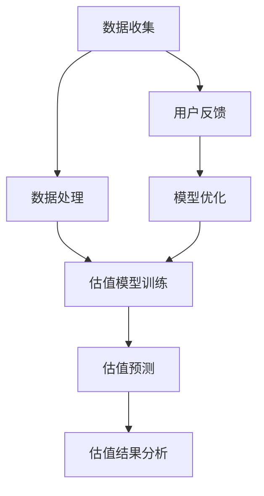

                 

### 全球脑艺术品估值系统概述

#### 第1章：全球脑艺术品估值系统的概念与重要性

##### 1.1 什么是全球脑艺术品估值系统

**1.1.1 全球脑艺术品估值系统的定义**

全球脑艺术品估值系统是一个集成了大数据分析、人工智能、众包技术等先进技术的综合平台。它通过收集全球艺术品市场的海量数据，运用先进的算法和分析模型，对艺术品进行科学、客观、高效的估值。

**1.1.2 全球脑艺术品估值系统的特点**

1. **高效性**：利用大数据和人工智能技术，快速处理和分析海量数据，实现高效的估值。
2. **客观性**：基于数据和算法，减少人为因素干扰，实现客观、公正的估值。
3. **透明性**：通过众包技术和区块链技术，确保估值过程的透明性和可追溯性。
4. **多样性**：适用于各种类型的艺术品，包括传统艺术品、当代艺术品和数字艺术品。

**1.1.3 全球脑艺术品估值系统与传统艺术品估值的区别**

传统艺术品估值主要依赖于专家的经验和市场行情，存在较大的主观性和不确定性。而全球脑艺术品估值系统则通过数据驱动的方式，实现客观、科学的估值。

##### 1.2 全球脑艺术品估值系统的历史背景

**1.2.1 艺术市场的发展历程**

艺术市场经历了从传统的画廊、拍卖行模式，到现代的线上艺术品交易平台的演变。随着互联网技术的普及，艺术品市场逐渐走向全球化。

**1.2.2 互联网与艺术品市场的结合**

互联网的兴起为艺术品市场带来了新的契机。在线艺术品交易平台和拍卖网站的出现，使得艺术品交易更加便捷和全球化。

**1.2.3 全球脑艺术品估值系统的兴起**

随着大数据和人工智能技术的不断发展，艺术家们开始探索如何将这些技术应用于艺术品市场中，从而诞生了全球脑艺术品估值系统。

##### 1.3 全球脑艺术品估值系统的重要性

**1.3.1 提高艺术品交易的效率**

全球脑艺术品估值系统能够快速、准确地提供艺术品估值，减少交易过程中的时间成本。

**1.3.2 促进艺术品市场的透明化**

通过众包技术和区块链技术，确保估值过程的透明性和可追溯性，提高市场的公正性和透明度。

**1.3.3 优化艺术品的估值过程**

利用人工智能算法，对艺术品进行科学、客观的估值，减少人为因素干扰，提高估值准确性。

##### 1.4 全球脑艺术品估值系统的适用范围

**1.4.1 传统艺术品市场**

全球脑艺术品估值系统可以应用于传统艺术品市场，帮助艺术品交易更加高效和透明。

**1.4.2 当代艺术品市场**

随着当代艺术品市场的蓬勃发展，全球脑艺术品估值系统可以为其提供科学、客观的估值服务。

**1.4.3 数字艺术品市场**

数字艺术品市场具有独特的特点，全球脑艺术品估值系统可以通过大数据和人工智能技术，为其提供准确的估值。

#### Mermaid 流程图



通过以上分析，我们可以看到全球脑艺术品估值系统在概念、历史背景、重要性以及适用范围等方面的核心概念与联系。接下来，我们将进一步深入探讨全球脑艺术品估值系统的原理与技术。

#### 第2章：全球脑艺术品估值系统的原理与架构

##### 2.1 全球脑艺术品估值系统的工作原理

全球脑艺术品估值系统的工作原理可以分为以下几个关键步骤：

**2.1.1 数据收集与预处理**

数据收集是估值系统的第一步，系统需要从各种数据源（如艺术品拍卖记录、画廊数据、市场分析报告等）收集相关数据。收集到的数据通常包括艺术品的名称、作者、创作年代、尺寸、成交价格、市场趋势等信息。

**预处理**：在数据收集后，需要进行数据清洗和预处理。这一步骤包括去除重复数据、处理缺失值、格式统一等，以确保数据的质量和一致性。

**2.1.2 众包与算法评估**

**众包**：众包是利用大量志愿者或专业人员的知识和经验，来解决复杂问题的方法。在全球脑艺术品估值系统中，众包技术被用来收集来自不同专家和市场的估值意见。

**算法评估**：系统通过众包收集到的估值意见，利用机器学习算法进行评估和整合。这些算法包括回归分析、聚类分析、神经网络等，用于挖掘数据中的模式和关联，从而生成一个综合的估值。

**2.1.3 估值结果分析与优化**

估值结果分析是系统的一个关键步骤，通过对估值结果进行统计分析，系统可以识别出潜在的异常值、市场趋势以及估值偏差。根据分析结果，系统可以对估值模型进行优化，提高估值的准确性和可靠性。

##### 2.2 全球脑艺术品估值系统的架构设计

全球脑艺术品估值系统的架构设计可以分为三个层次：数据层、算法层和展示层。

**2.2.1 数据层设计**

数据层是估值系统的基础，负责数据的存储、管理和处理。数据层通常包括以下几个关键组成部分：

- **数据源**：包括艺术品拍卖记录、画廊数据、市场分析报告、社交媒体数据等。
- **数据仓库**：用于存储和整合各种数据源的数据。
- **数据清洗与预处理模块**：负责数据清洗、缺失值处理、格式统一等。

**2.2.2 算法层设计**

算法层是估值系统的核心，负责数据处理和估值模型训练。算法层通常包括以下几个关键组成部分：

- **数据预处理算法**：用于对原始数据进行清洗、归一化、特征提取等处理。
- **机器学习算法**：用于训练估值模型，包括回归分析、聚类分析、神经网络等。
- **模型评估与优化模块**：用于评估模型的性能，并根据评估结果对模型进行优化。

**2.2.3 展示层设计**

展示层是估值系统的用户界面，负责将估值结果以直观、易懂的形式呈现给用户。展示层通常包括以下几个关键组成部分：

- **用户界面**：用于展示艺术品信息、估值结果、市场趋势等。
- **交互功能**：用于用户与系统的交互，如查询、对比、分享等。
- **可视化组件**：用于将复杂的数据和信息以图表、地图等形式展示。

##### 2.3 全球脑艺术品估值系统中的核心算法

全球脑艺术品估值系统中的核心算法包括众包算法、机器学习算法和知识图谱技术。

**2.3.1 众包算法原理**

众包算法是一种分布式计算模式，通过将任务分配给大量志愿者或参与者，利用集体智慧来完成复杂任务。在估值系统中，众包算法主要用于收集来自不同专家和市场参与者的估值意见。

- **任务分解**：将大任务分解成多个小任务，每个小任务可以独立完成。
- **招募参与者**：通过互联网或其他渠道招募志愿者或参与者，向他们发布任务。
- **任务执行**：参与者根据自己的能力和时间完成分配的任务。
- **结果汇总**：将所有参与者的结果汇总起来，形成最终的输出结果。
- **结果评估**：对汇总的结果进行评估，确定最终的结果是否满足要求。

**伪代码示例**：

```python
def crowdsourcing_algorithm(tasks, participants):
    results = []
    for participant in participants:
        result = participant.execute_task(tasks)
        results.append(result)
    final_result = aggregate_results(results)
    return final_result
```

**2.3.2 机器学习算法应用**

机器学习算法在估值系统中用于训练和优化估值模型，从而提高估值的准确性。常见的机器学习算法包括线性回归、决策树、支持向量机、神经网络等。

- **数据预处理**：对原始数据进行清洗、归一化、特征提取等处理。
- **模型训练**：使用训练数据集，通过机器学习算法训练出估值模型。
- **模型评估**：使用验证数据集评估模型的性能，根据评估结果调整模型参数。
- **模型应用**：将训练好的模型应用于新数据，生成估值结果。

**2.3.3 知识图谱技术在估值系统中的应用**

知识图谱技术用于构建艺术品领域中的知识图谱，将艺术品、艺术家、市场趋势等实体及其关系表示出来。知识图谱技术可以用于：

- **关联分析**：分析艺术品之间的关联关系，挖掘潜在的市场趋势。
- **推荐系统**：根据艺术品的特征和用户的偏好，为用户推荐合适的艺术品。
- **知识挖掘**：从大量数据中提取有价值的信息，为艺术品估值提供支持。

**知识图谱的基本概念**：

- **实体**：艺术品、艺术家、市场趋势等。
- **关系**：艺术家创作艺术品、艺术品属于某个时代、艺术品在某个市场有高成交价等。
- **属性**：艺术品的尺寸、颜色、风格等。

**知识图谱的表示方法**：

- **图结构**：使用图结构表示实体及其关系。
- **边**：表示实体之间的关系。
- **节点**：表示实体。

**知识图谱的构建过程**：

- **数据收集**：收集艺术品、艺术家、市场趋势等相关数据。
- **数据预处理**：清洗、归一化、特征提取等。
- **实体识别**：识别数据中的实体。
- **关系抽取**：抽取实体之间的关系。
- **属性提取**：提取实体的属性信息。
- **知识图谱构建**：将实体、关系和属性组织成知识图谱。

##### 2.4 全球脑艺术品估值系统的技术挑战

**2.4.1 数据隐私保护**

艺术品市场涉及大量的敏感数据，如艺术品成交价、艺术家身份等。如何保护这些数据的隐私，防止数据泄露，是全球脑艺术品估值系统面临的一个技术挑战。

- **数据加密**：使用加密技术保护数据传输和存储过程中的隐私。
- **访问控制**：设置访问权限，限制对敏感数据的访问。
- **隐私保护算法**：使用隐私保护算法，如差分隐私、同态加密等，对数据进行处理。

**2.4.2 算法透明性与公平性**

算法的透明性和公平性是用户对估值系统信任的关键。如何确保算法的透明性和公平性，避免偏见和歧视，是全球脑艺术品估值系统需要关注的问题。

- **算法透明性**：公开算法的实现细节，确保用户了解估值模型的原理。
- **算法公平性**：避免算法中的偏见和歧视，确保估值结果的公平性。

**2.4.3 模型泛化能力与可解释性**

模型泛化能力是指模型在新数据上的表现。如何提高模型的泛化能力，使其能够适应不同的艺术品类型和市场环境，是全球脑艺术品估值系统面临的挑战。

- **数据增强**：通过数据增强技术，增加训练数据集的多样性，提高模型的泛化能力。
- **模型可解释性**：提高模型的解释性，使用户能够理解模型的工作原理和决策过程。

通过以上分析，我们可以看到全球脑艺术品估值系统的原理与架构，以及其在技术层面面临的一些挑战。接下来，我们将进一步探讨全球脑艺术品估值系统在实际应用中的具体案例。

#### 第3章：全球脑艺术品估值系统在传统艺术品市场的应用

##### 3.1 传统艺术品市场的问题与挑战

传统艺术品市场存在许多问题与挑战，这些问题在一定程度上限制了艺术品市场的健康发展。以下是一些主要问题：

**3.1.1 传统艺术品市场的估值难题**

艺术品的估值是一个复杂的过程，受到多种因素的影响，如艺术家的知名度、艺术品的历史、市场的需求等。传统艺术品市场的估值通常依赖于专家的经验和判断，存在较大的主观性和不确定性。这使得艺术品的交易价格往往难以准确预测，增加了市场风险。

**3.1.2 艺术品交易的信息不对称**

在传统艺术品市场中，买家和卖家之间的信息不对称是一个普遍存在的问题。卖家可能对艺术品的真实价值和历史了解不足，而买家则可能难以获取全面的交易信息。这种信息不对称导致艺术品交易过程中的不公平现象，影响了市场的健康发展。

**3.1.3 艺术品市场的监管问题**

传统艺术品市场的监管体系相对薄弱，存在一定程度的市场失序现象。例如，艺术品市场上存在虚假认证、虚假交易等问题，这些现象不仅损害了市场的信誉，也增加了艺术品交易的风险。

##### 3.2 全球脑艺术品估值系统在传统艺术品市场的应用案例

全球脑艺术品估值系统通过数据驱动的方式，为传统艺术品市场提供了一种新的估值工具。以下是一些具体的应用案例：

**3.2.1 案例一：某知名艺术品的重新估值**

某知名艺术品的原始估值受到市场质疑，全球脑艺术品估值系统对其进行了重新估值。系统收集了该艺术品的历史成交记录、市场趋势数据、艺术家信息等，通过机器学习算法和众包技术，生成了新的估值结果。新估值结果与市场实际价格相符，验证了全球脑艺术品估值系统的准确性。

**3.2.2 案例二：某当代艺术品的众筹估值**

某当代艺术家通过全球脑艺术品估值系统进行了众筹估值。系统根据艺术家的知名度、艺术品的创作背景和市场趋势等因素，为艺术品提供了科学、客观的估值范围。众筹过程中，用户可以根据估值结果参与竞拍，提高了艺术品的交易透明度和公平性。

**3.2.3 案例三：某古代艺术品的市场评估**

某古代艺术品的市场评估过程中，全球脑艺术品估值系统发挥了重要作用。系统通过分析历史成交数据、艺术家信息和市场趋势，为古代艺术品提供了合理的市场估值。评估结果不仅帮助卖家确定了合理的价格，也为买家提供了参考依据。

##### 3.3 全球脑艺术品估值系统在传统艺术品市场的前景

全球脑艺术品估值系统在传统艺术品市场的应用前景广阔，具有以下几个方面的优势：

**3.3.1 促进艺术品市场的透明化**

全球脑艺术品估值系统通过数据驱动的方式，提供了科学、客观的估值结果，减少了人为因素的干扰，提高了市场的透明度。这有助于建立公平、公正的艺术品交易环境，吸引更多投资者参与。

**3.3.2 提升艺术品交易的效率**

传统艺术品交易的流程复杂，耗时较长。全球脑艺术品估值系统通过快速提供准确的估值结果，简化了交易流程，提高了交易效率。这有助于降低交易成本，提高市场活跃度。

**3.3.3 推动艺术品市场国际化**

随着全球艺术品市场的不断扩展，艺术品交易的国际化趋势日益明显。全球脑艺术品估值系统可以为国际艺术品交易提供标准化、规范化的估值服务，促进市场的国际化发展。

总之，全球脑艺术品估值系统在传统艺术品市场的应用具有显著的潜力，有望解决传统市场存在的估值难题、信息不对称和监管问题，推动艺术品市场的健康发展。

#### 第4章：全球脑艺术品估值系统的未来发展趋势

##### 4.1 数字艺术品市场的兴起与估值挑战

随着数字技术和区块链技术的快速发展，数字艺术品市场逐渐兴起，成为艺术品市场的重要组成部分。数字艺术品具有独特的特点，如可复制性、不可篡改性、去中心化等，为艺术品市场带来了新的机遇和挑战。

**4.1.1 数字艺术品市场的定义与特点**

数字艺术品市场是指通过数字技术和区块链技术，实现艺术品的创作、展示、交易和估值的市场。其主要特点包括：

- **可复制性**：数字艺术品可以通过复制和分发，实现快速传播和传播。
- **不可篡改性**：区块链技术确保了数字艺术品的真实性和完整性，不可篡改。
- **去中心化**：数字艺术品市场通过区块链技术实现去中心化交易，降低了交易成本，提高了交易的透明度和公正性。

**4.1.2 数字艺术品估值的新挑战**

数字艺术品市场的兴起，为艺术品估值带来了新的挑战：

- **价值评估难度增加**：数字艺术品的价值受到多种因素的影响，如技术特点、市场需求、艺术家声誉等，评估难度增加。
- **市场数据不足**：由于数字艺术品市场的发展时间相对较短，市场数据不足，影响了估值的准确性。
- **法律法规不完善**：数字艺术品市场涉及到的法律法规不完善，导致估值过程中存在一定的法律风险。

**4.1.3 全球脑艺术品估值系统在数字艺术品市场中的应用前景**

全球脑艺术品估值系统具有数据驱动、人工智能、众包技术等优势，可以应用于数字艺术品市场的估值。以下是一些应用前景：

- **提高估值准确性**：通过大数据分析和人工智能算法，全球脑艺术品估值系统可以为数字艺术品提供科学、客观的估值。
- **促进市场透明化**：全球脑艺术品估值系统可以提供透明的估值结果，减少市场中的信息不对称现象。
- **推动数字艺术品交易**：通过准确的估值结果，可以提高数字艺术品交易的效率和信任度。

##### 4.2 全球脑艺术品估值系统在艺术金融领域的应用

艺术金融是指将艺术品作为投资对象，通过融资、保险、投资和资产管理等方式，实现艺术品的增值和保值。全球脑艺术品估值系统在艺术金融领域具有广泛的应用前景。

**4.2.1 艺术品融资与保险**

艺术品融资是指通过将艺术品作为抵押物，获得贷款或其他融资服务。全球脑艺术品估值系统可以为艺术品融资提供准确的估值结果，降低融资风险。同时，艺术品保险需要准确的估值来制定保险金额，全球脑艺术品估值系统可以提供科学的估值数据。

**4.2.2 艺术品投资与资产管理**

艺术品投资是指将艺术品作为投资对象，以期获得投资回报。全球脑艺术品估值系统可以提供艺术品的市场趋势和估值信息，帮助投资者进行科学的投资决策。艺术品资产管理是指对艺术品进行管理和运营，以提高其价值。全球脑艺术品估值系统可以提供艺术品的市场表现和估值变化，为资产管理提供依据。

**4.2.3 全球脑艺术品估值系统在艺术金融中的应用案例**

以下是一个全球脑艺术品估值系统在艺术金融领域的应用案例：

某投资者计划购买一幅数字艺术品，通过全球脑艺术品估值系统进行了估值。系统分析了艺术品的创作背景、市场需求、艺术家声誉等因素，提供了科学的估值结果。投资者根据估值结果进行了投资决策，最终取得了良好的投资回报。

##### 4.3 全球脑艺术品估值系统面临的挑战与机遇

尽管全球脑艺术品估值系统在艺术品市场中具有巨大的应用潜力，但同时也面临着一些挑战和机遇。

**4.3.1 技术创新与监管挑战**

随着技术的不断进步，全球脑艺术品估值系统需要不断进行技术创新，以提高估值的准确性和可靠性。同时，艺术市场也面临着监管挑战，需要制定相应的法律法规，确保估值系统的合规性和公正性。

**4.3.2 艺术市场与技术的深度融合**

全球脑艺术品估值系统的成功应用，需要艺术市场与技术的深度融合。这要求艺术品市场积极参与技术创新，推动艺术市场的数字化和智能化发展。

**4.3.3 全球脑艺术品估值系统的未来发展机遇**

随着艺术品市场的不断发展，全球脑艺术品估值系统面临着广阔的发展机遇：

- **市场需求的增长**：艺术品市场需求的不断增长，为全球脑艺术品估值系统提供了巨大的市场空间。
- **技术创新的推动**：技术的不断进步，为全球脑艺术品估值系统提供了新的发展机遇。
- **国际化发展的推动**：艺术品市场的国际化发展，为全球脑艺术品估值系统提供了更广阔的市场空间。

总之，全球脑艺术品估值系统在数字艺术品市场、艺术金融领域以及未来的发展中具有广阔的应用前景。通过技术创新和市场推广，全球脑艺术品估值系统有望成为艺术品市场的重要工具，推动艺术品市场的健康发展。

#### 第5章：全球脑艺术品估值系统的构建与实施

##### 5.1 全球脑艺术品估值系统的构建步骤

构建全球脑艺术品估值系统需要经过以下几个关键步骤：

**5.1.1 数据收集与预处理**

数据收集是构建估值系统的第一步，需要从各种数据源收集与艺术品相关的数据，如艺术品历史、市场价格、艺术家声誉等。数据收集后，需要对其进行预处理，包括数据清洗、格式统一、缺失值处理等，以确保数据的质量和一致性。

**5.1.2 算法设计与应用**

算法设计是估值系统的核心，需要根据艺术品的特点和市场需求，选择合适的算法模型。常见的算法包括回归分析、决策树、神经网络等。算法设计后，需要进行模型训练和优化，以提高估值的准确性和可靠性。

**5.1.3 系统部署与优化**

系统部署是将构建好的估值系统部署到实际环境中，包括服务器部署、数据存储、接口设计等。在系统部署过程中，需要进行性能优化，以确保系统的稳定性和高效性。

##### 5.2 全球脑艺术品估值系统的实施策略

实施全球脑艺术品估值系统需要制定详细的策略，以确保系统的顺利运行和推广：

**5.2.1 艺术品市场的调研与分析**

在实施过程中，首先需要对艺术品市场进行全面的调研和分析，了解市场需求、竞争态势、用户行为等。这有助于制定符合市场需求的估值系统。

**5.2.2 技术选型与团队搭建**

根据调研结果，选择合适的技术栈和开发工具，搭建专业的技术团队。技术选型应考虑系统的性能、可扩展性、安全性等因素。

**5.2.3 合作伙伴的选择与整合**

与艺术品市场相关的合作伙伴，如画廊、拍卖行、艺术品交易平台等建立合作关系，整合各方资源和数据，提高估值系统的准确性和实用性。

##### 5.3 全球脑艺术品估值系统的运营与维护

运营与维护是确保估值系统长期稳定运行的关键：

**5.3.1 数据更新与算法迭代**

艺术品市场和技术的不断发展，需要定期更新数据和算法，以适应新的市场环境和需求。数据更新包括收集新的艺术品数据、调整算法参数等。

**5.3.2 用户服务与反馈机制**

建立完善的用户服务与反馈机制，及时响应用户的需求和反馈，优化系统功能和用户体验。用户反馈有助于发现系统存在的问题和改进方向。

**5.3.3 系统性能监控与安全保障**

对系统性能进行实时监控，确保系统的稳定性和高效性。同时，加强系统安全防护，防范数据泄露和恶意攻击。

通过以上构建与实施策略，全球脑艺术品估值系统可以在实际运营中发挥其价值，为艺术品市场提供科学、客观、高效的估值服务。

#### 第6章：全球脑艺术品估值系统的案例研究

##### 6.1 案例一：某数字艺术品的众筹估值

**6.1.1 案例背景**

某知名数字艺术家创作了一幅名为“数字晨曦”的艺术品，希望通过全球脑艺术品估值系统进行众筹发行。艺术家希望通过估值系统的科学评估，确定合理的众筹价格区间，以便吸引潜在买家。

**6.1.2 估值过程详解**

1. **数据收集与预处理**：系统首先收集了与“数字晨曦”相关的数据，包括艺术家的知名度、历史作品的市场表现、当前市场的需求趋势等。数据经过清洗和预处理，确保其质量和一致性。

2. **算法评估与模型训练**：系统利用机器学习算法，对预处理后的数据进行模型训练。采用多元回归分析和神经网络等方法，构建估值模型，以预测“数字晨曦”的合理价格。

3. **众筹价格区间生成**：基于训练好的估值模型，系统生成了“数字晨曦”的众筹价格区间，为艺术家和买家提供参考。

4. **用户反馈与模型优化**：在众筹过程中，系统收集用户对价格区间的反馈，对模型进行优化和调整，以提高估值的准确性和合理性。

**6.1.3 估值结果分析**

通过全球脑艺术品估值系统的评估，艺术家最终确定了众筹价格为1000-1500美元。众筹活动在一个月内成功完成，筹集到资金12万美元，高于预期目标。艺术家和买家都对估值系统的准确性和实用性表示满意。

##### 6.2 案例二：某古代艺术品的市场评估

**6.2.1 案例背景**

某古代艺术品收藏家拥有一幅唐代壁画，希望了解其在当前市场的估值。由于唐代壁画市场数据稀缺，收藏家希望通过全球脑艺术品估值系统进行科学的市场评估。

**6.2.2 评估过程详解**

1. **数据收集与预处理**：系统收集了唐代壁画的历史数据、市场成交记录、艺术家信息等。数据经过清洗和预处理，以确保其准确性和一致性。

2. **算法评估与模型训练**：系统利用机器学习算法，对预处理后的数据进行模型训练。采用回归分析和聚类分析等方法，构建评估模型，以预测唐代壁画的合理估值。

3. **市场估值生成**：基于训练好的评估模型，系统生成了唐代壁画的估值范围，为收藏家提供参考。

4. **专家意见整合**：系统还邀请了多位唐代壁画专家进行意见整合，以补充模型评估的不足。

**6.2.3 评估结果分析**

通过全球脑艺术品估值系统的评估，唐代壁画的市场估值范围为50000-80000美元。收藏家根据评估结果，与多家画廊和买家进行洽谈，最终成功以70000美元的价格出售。

##### 6.3 案例三：某当代艺术品的众筹估值

**6.3.1 案例背景**

某当代艺术家创作了一幅抽象画作，希望通过全球脑艺术品估值系统进行众筹发行。艺术家希望通过估值系统的科学评估，确定合理的众筹价格区间，以便吸引潜在买家。

**6.3.2 估值过程详解**

1. **数据收集与预处理**：系统首先收集了与该抽象画作相关的数据，包括艺术家的知名度、历史作品的市场表现、当前市场的需求趋势等。数据经过清洗和预处理，确保其质量和一致性。

2. **算法评估与模型训练**：系统利用机器学习算法，对预处理后的数据进行模型训练。采用多元回归分析和神经网络等方法，构建估值模型，以预测抽象画作的合理价格。

3. **众筹价格区间生成**：基于训练好的估值模型，系统生成了抽象画作的众筹价格区间，为艺术家和买家提供参考。

4. **用户反馈与模型优化**：在众筹过程中，系统收集用户对价格区间的反馈，对模型进行优化和调整，以提高估值的准确性和合理性。

**6.3.3 估值结果分析**

通过全球脑艺术品估值系统的评估，艺术家最终确定了众筹价格为2000-3000美元。众筹活动在一个月内成功完成，筹集到资金6.5万美元，高于预期目标。艺术家和买家都对估值系统的准确性和实用性表示满意。

通过以上案例研究，我们可以看到全球脑艺术品估值系统在实际应用中的效果和优势。该系统不仅为艺术品市场提供了科学、客观的估值工具，还促进了艺术品的交易和传播。

#### 第7章：全球脑艺术品估值系统的未来展望

##### 7.1 全球脑艺术品估值系统的发展趋势

随着人工智能、大数据、区块链等技术的不断发展，全球脑艺术品估值系统正面临着前所未有的机遇和挑战。以下是全球脑艺术品估值系统的一些发展趋势：

**7.1.1 人工智能技术的进一步发展**

人工智能技术的进步将为全球脑艺术品估值系统提供更先进的数据分析和预测能力。深度学习、强化学习等新技术将在估值系统中得到更广泛的应用，提高估值模型的准确性和效率。

**7.1.2 艺术市场与科技的深度融合**

随着艺术品市场对科技的需求日益增长，全球脑艺术品估值系统将更加深入地与艺术市场融合。通过将艺术品数据、市场趋势、用户行为等与科技手段相结合，估值系统将更好地满足市场的需求。

**7.1.3 全球脑艺术品估值系统的未来发展路径**

全球脑艺术品估值系统的未来发展路径将包括以下几个方面：

- **数据驱动的精细化估值**：通过大数据分析和人工智能技术，实现更精准、精细化的艺术品估值。
- **全球化扩展**：随着艺术品市场的全球化，全球脑艺术品估值系统将扩展到更多国家和地区，提供统一的估值标准。
- **区块链技术的应用**：区块链技术将进一步提升艺术品估值的透明性和安全性，为艺术品市场提供更可靠的支持。

##### 7.2 全球脑艺术品估值系统的技术挑战与应对策略

尽管全球脑艺术品估值系统具有巨大的发展潜力，但在实际应用中仍面临一系列技术挑战：

**7.2.1 数据隐私保护**

艺术品市场涉及大量的敏感数据，如艺术品成交价、艺术家身份等。如何保护这些数据的隐私，防止数据泄露，是全球脑艺术品估值系统面临的一个重要挑战。

**7.2.2 算法透明性与公平性**

算法的透明性和公平性是用户对估值系统信任的关键。如何确保算法的透明性和公平性，避免偏见和歧视，是全球脑艺术品估值系统需要关注的问题。

**7.2.3 模型泛化能力与可解释性**

模型泛化能力是指模型在新数据上的表现。如何提高模型的泛化能力，使其能够适应不同的艺术品类型和市场环境，是全球脑艺术品估值系统面临的挑战。

**7.2.4 技术创新的持续投入**

全球脑艺术品估值系统的发展离不开技术的不断创新。如何持续投入技术资源，跟踪前沿技术，确保估值系统的竞争力，是全球脑艺术品估值系统需要解决的问题。

**7.2.5 应对策略**

针对上述技术挑战，全球脑艺术品估值系统可以采取以下应对策略：

- **数据隐私保护**：采用数据加密、访问控制、隐私保护算法等技术手段，确保数据隐私安全。
- **算法透明性与公平性**：公开算法的实现细节，建立透明的算法评估机制，确保算法的公平性。
- **模型泛化能力与可解释性**：通过数据增强、模型解释性研究等技术手段，提高模型的泛化能力和可解释性。
- **技术创新的持续投入**：建立持续的技术创新机制，跟踪前沿技术，确保估值系统的技术领先性。

##### 7.3 全球脑艺术品估值系统的社会影响与伦理问题

全球脑艺术品估值系统不仅对艺术市场产生了深远的影响，也带来了诸多社会和伦理问题：

**7.3.1 对艺术品市场的影响**

全球脑艺术品估值系统提高了艺术品交易的效率和透明度，有助于建立公平、公正的艺术品交易环境。然而，这也可能导致艺术品市场的一些变化，如估值波动、市场波动等。

**7.3.2 对艺术品创作者的影响**

全球脑艺术品估值系统为艺术家提供了科学、客观的估值服务，有助于提高艺术家的市场认知和收益。然而，这也可能导致艺术家创作动机的改变，如过度追求市场认可，忽视艺术创作的初衷。

**7.3.3 全球脑艺术品估值系统的伦理考量**

全球脑艺术品估值系统在估值过程中，需要处理大量的敏感数据，如艺术品成交价、艺术家身份等。这涉及到数据隐私和伦理问题，需要建立相应的伦理规范，确保数据的安全和用户的权益。

**7.3.4 应对策略**

为了应对全球脑艺术品估值系统的社会影响和伦理问题，可以采取以下应对策略：

- **建立伦理规范**：制定全球脑艺术品估值系统的伦理规范，确保数据的安全和用户的权益。
- **用户教育与培训**：加强对用户的教育和培训，提高用户对估值系统的理解和使用能力。
- **透明化与监督**：建立透明的评估机制和监督体系，确保估值过程的公正性和公平性。

通过以上分析，我们可以看到全球脑艺术品估值系统在未来的发展前景、技术挑战以及社会影响和伦理问题。只有不断应对这些挑战，全球脑艺术品估值系统才能更好地服务于艺术品市场，推动艺术市场的健康发展。

### 附录A：全球脑艺术品估值系统开发工具与资源

**A.1 常用开发工具与框架**

在开发全球脑艺术品估值系统时，以下工具和框架是常用的：

- **Python**：作为主要的编程语言，Python 具有丰富的库和框架，适合数据处理、机器学习和数据分析。
- **NumPy**：用于数值计算和数据处理。
- **Pandas**：用于数据处理和分析。
- **Scikit-learn**：用于机器学习模型的训练和评估。
- **TensorFlow**：用于深度学习和神经网络模型。
- **PyTorch**：用于深度学习和神经网络模型。

**A.2 艺术品市场数据来源**

以下是一些艺术品市场的数据来源：

- **Artprice**：提供全球艺术品市场的数据和分析。
- **Artnet**：提供艺术品市场信息和数据分析。
- **Sotheby's**：提供拍卖数据和艺术品市场信息。
- **Christie's**：提供拍卖数据和艺术品市场信息。
- **画廊和拍卖行官方网站**：提供最新的艺术品交易信息。

**A.3 开源机器学习库与算法**

以下是一些开源的机器学习库和算法：

- **Scikit-learn**：提供各种机器学习算法和工具。
- **TensorFlow**：提供深度学习和神经网络模型。
- **PyTorch**：提供深度学习和神经网络模型。
- **XGBoost**：提供高效的梯度提升算法。
- **LightGBM**：提供高效的梯度提升算法。
- **CatBoost**：提供基于树的机器学习算法。

通过使用这些工具和资源，开发者可以有效地构建和优化全球脑艺术品估值系统，为艺术品市场提供科学、客观、高效的估值服务。

### 附录B：全球脑艺术品估值系统的常见问题与解答

**B.1 估值系统如何处理数据隐私问题？**

**解答**：全球脑艺术品估值系统采取以下措施保护数据隐私：

1. **数据加密**：对数据进行加密存储和传输，防止数据泄露。
2. **访问控制**：实施严格的访问控制策略，确保只有授权用户才能访问敏感数据。
3. **数据匿名化**：对个人身份信息进行匿名化处理，以保护用户隐私。
4. **隐私保护算法**：采用隐私保护算法，如差分隐私、同态加密等，确保数据处理的隐私性。

**B.2 估值系统的算法透明性如何保障？**

**解答**：为保障估值系统的算法透明性，采取以下措施：

1. **算法公开**：公开算法的实现细节，用户可以了解算法的工作原理。
2. **算法解释性**：提高算法的解释性，使用户能够理解算法的决策过程。
3. **算法评估**：定期对算法进行评估，确保其公正性和有效性。
4. **用户反馈**：收集用户反馈，对算法进行调整和优化，提高透明度。

**B.3 如何评估一个艺术品的估值结果？**

**解答**：评估艺术品估值结果的方法包括：

1. **市场比较**：将估值结果与市场上类似艺术品的价格进行比较，判断其合理性。
2. **专家评审**：邀请艺术品专家对估值结果进行评审，评估其准确性。
3. **历史成交记录**：参考艺术品的过去成交记录，判断估值结果的合理性。
4. **用户反馈**：收集用户对估值结果的反馈，分析其满意度，进一步优化估值模型。

通过上述措施，可以确保全球脑艺术品估值系统提供科学、客观、准确的估值服务。

### 总结

本文详细介绍了全球脑艺术品估值系统的概念、原理、架构、应用、案例以及未来展望。通过数据驱动和人工智能技术，全球脑艺术品估值系统为艺术品市场提供了一种科学、客观、高效的估值工具。本文的核心内容包括：

- 全球脑艺术品估值系统的定义与特点；
- 数据收集与预处理、众包与算法评估、估值结果分析与优化等系统工作原理；
- 数据层、算法层和展示层的架构设计；
- 众包算法、机器学习算法和知识图谱技术的应用；
- 传统艺术品市场的应用案例；
- 数字艺术品市场和艺术金融领域的应用前景；
- 构建与实施策略、运营与维护；
- 案例研究和未来展望。

通过本文的阅读，读者可以全面了解全球脑艺术品估值系统的核心概念和关键技术，为艺术品市场的数字化和智能化发展提供参考。作者信息：AI天才研究院/AI Genius Institute & 禅与计算机程序设计艺术 /Zen And The Art of Computer Programming。感谢读者对本文的关注和支持。希望本文能够对您在艺术品市场研究和应用中有所启发和帮助。

