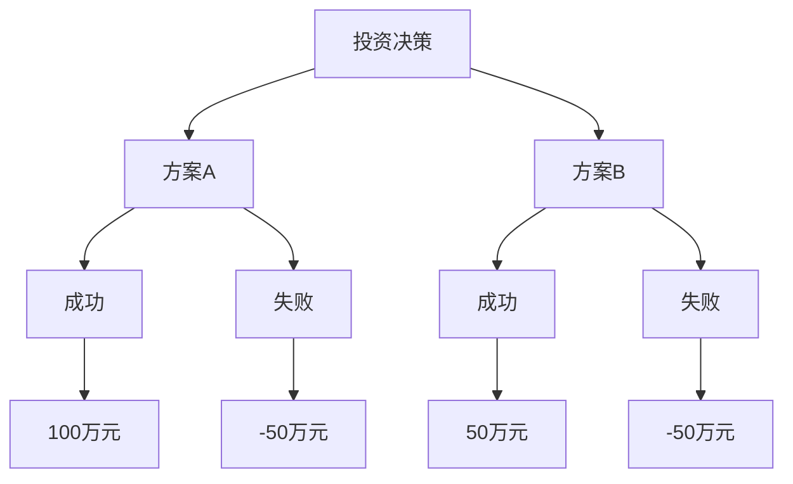
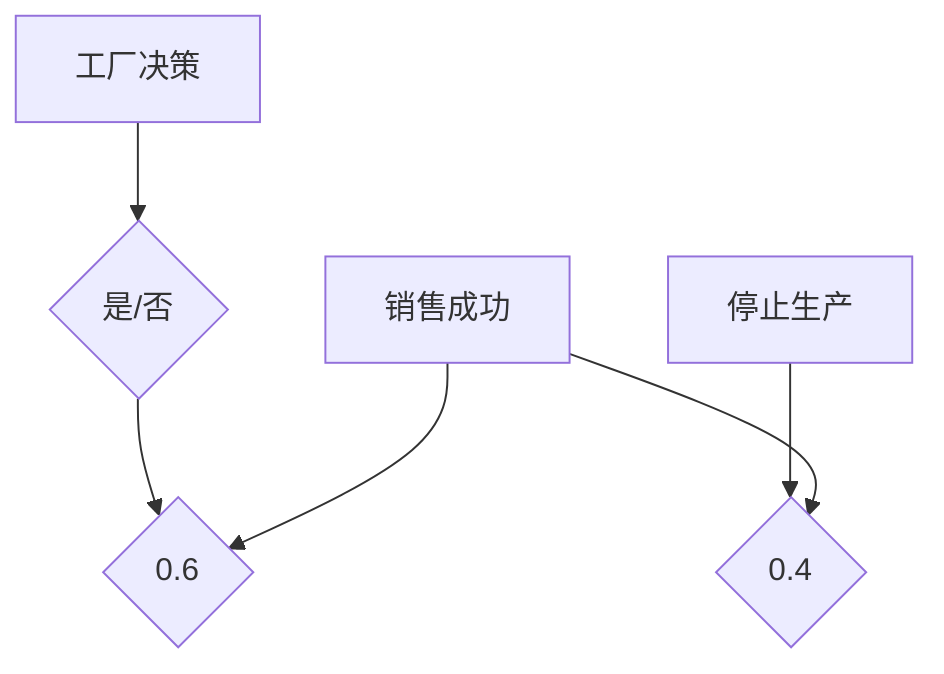

                 

# 决策框架：在不确定性中做出明智选择

关键词：决策科学、不确定性、风险分析、贝叶斯决策、启发式算法、多目标决策、情景分析、战略制定

摘要：本文旨在探讨在不确定性环境中如何构建和运用决策框架，以做出明智的选择。我们将从决策基础理论出发，逐步深入分析不确定性、决策理论核心概念、常见决策框架以及具体应用实践。通过本文的阅读，读者将了解如何运用决策科学的方法和工具，提高在复杂和不确定环境中的决策能力。

# 《决策框架：在不确定性中做出明智选择》目录大纲

## 第一部分：决策基础理论

### 第1章：决策科学概述

#### 1.1 决策的定义与类型

#### 1.2 决策过程与步骤

#### 1.3 决策的影响因素

### 第2章：不确定性分析

#### 2.1 不确定性的来源与表现

#### 2.2 风险评估方法

#### 2.3 不确定性量化技术

### 第3章：决策理论核心概念

#### 3.1 决策树分析

#### 3.2 期望效用理论

#### 3.3 最大最小最大化原则

## 第二部分：常见决策框架

### 第4章：贝叶斯决策理论

#### 4.1 贝叶斯法则与贝叶斯推理

#### 4.2 贝叶斯网络在决策中的应用

#### 4.3 贝叶斯优化方法

### 第5章：启发式决策

#### 5.1 启发式算法概述

#### 5.2 逼近算法与近似算法

#### 5.3 启发式搜索与优化

### 第6章：多目标决策

#### 6.1 多目标决策的定义与类型

#### 6.2 多目标决策的求解方法

#### 6.3 多目标决策案例分析

### 第7章：情景分析与策略制定

#### 7.1 情景分析的基本概念

#### 7.2 情景分析的方法与工具

#### 7.3 情景分析与策略制定案例

## 第三部分：决策框架应用实践

### 第8章：企业决策应用

#### 8.1 企业战略决策框架

#### 8.2 经营决策框架

#### 8.3 项目决策框架

### 第9章：个人决策应用

#### 9.1 个人理财决策框架

#### 9.2 职业发展决策框架

#### 9.3 生活决策框架

### 第10章：社会与公共决策

#### 10.1 公共决策框架

#### 10.2 政策制定决策框架

#### 10.3 社会治理决策框架

## 附录

### 附录 A：决策分析工具与资源

#### A.1 决策支持系统

#### A.2 决策分析软件介绍

#### A.3 决策理论相关资源推荐

### 《决策框架：在不确定性中做出明智选择》正文部分将从上述目录大纲的各个章节展开，逐步深入探讨决策科学的理论基础和实践应用。让我们开始第一步：理解决策的定义与类型。

## 第1章：决策科学概述

### 1.1 决策的定义与类型

决策，简单来说，是一种选择行为。它涉及在多个可能的选项中，选择一个最优或次优的方案，以实现某个特定的目标。决策是日常生活中的常见行为，无论是个人还是组织，都需要做出各种各样的决策。

#### 1.1.1 决策的基本概念

决策的定义可以从不同的角度来理解。从广义上讲，决策是指为了达到某个目标而选择一个行动方案的过程。这个过程包括以下几个基本要素：

- **目标**：决策的目标是决策者希望达成的具体结果或状态。
- **备选方案**：决策过程中可供选择的行动方案。
- **结果**：每个备选方案可能带来的结果和影响。
- **选择**：从备选方案中选择一个最优或次优的方案。

#### 1.1.2 个人决策与组织决策

决策既可以是个人的行为，也可以是组织的行为。个人决策通常涉及日常生活中的小事，如购物、旅行、健康管理等。组织决策则通常涉及更复杂的问题，如公司战略、项目投资、人力资源配置等。

- **个人决策**：个人决策通常基于个人偏好、经验和直觉。例如，一个人在购买手机时，可能会考虑价格、品牌、功能等因素，最终选择一个最符合自己需求的手机。
  
- **组织决策**：组织决策通常需要更系统的分析和评估。一个公司决定是否进入某个市场，需要分析市场规模、竞争状况、潜在利润等多个因素。

#### 1.1.3 决策的类型与特点

决策可以按照不同的标准进行分类。以下是几种常见的决策类型：

- **程序化决策**（Programmed Decisions）：这类决策是重复性的，有明确的规则和程序。例如，公司如何安排员工的工作班次，通常有固定的流程和标准。
  
- **非程序化决策**（Non-Programmed Decisions）：这类决策是针对不经常发生的或新出现的问题。例如，公司是否要开发一款新产品，通常需要深入分析和评估。

- **确定性决策**（Certain Decisions）：这类决策的结果是可以预见的，决策者可以准确地预测每个备选方案的结果。例如，选择购买某品牌的电脑，决策者可以根据产品的规格、价格等信息做出选择。

- **不确定性决策**（Uncertain Decisions）：这类决策的结果是不确定的，决策者无法准确地预测每个备选方案的结果。例如，公司是否要在新兴市场投资，通常需要考虑到多种不确定因素。

- **风险决策**（Risk Decisions）：这类决策的结果具有一定的风险，决策者需要评估风险并做出决策。例如，公司是否要开发高风险但回报可能很高的新项目。

- **不确定风险决策**（Uncertain Risk Decisions）：这类决策既存在不确定性，也存在风险。例如，公司是否要在自然灾害频发的地区建设工厂。

通过了解决策的基本概念、类型和特点，我们可以更好地理解决策的本质，从而在面对复杂和不确定的环境时，能够做出更明智的选择。

### 1.2 决策过程与步骤

决策是一个系统的过程，需要经过多个步骤。以下是决策过程的基本步骤：

#### 1.2.1 决策过程的基本步骤

1. **识别问题**：首先，决策者需要识别需要解决的问题或机会。这可以通过收集数据、分析现状、了解需求和期望来实现。
   
2. **确定目标**：在识别问题后，决策者需要明确决策的目标，即希望达成的具体结果或状态。目标是决策的核心，所有的决策活动都应该围绕目标进行。

3. **生成备选方案**：在确定目标后，决策者需要生成多个备选方案。这些方案可以是创新的，也可以是传统的，但都应该有实现目标的潜力。

4. **评估备选方案**：决策者需要对每个备选方案进行评估，分析其优缺点、风险和成本效益。评估可以通过定量和定性的方法进行。

5. **选择最佳方案**：在评估备选方案后，决策者需要选择一个最佳方案。最佳方案通常是能够最有效地实现目标的方案。

6. **实施决策**：选择最佳方案后，决策者需要将决策付诸实践。这包括制定详细的行动计划、分配资源、监督执行过程等。

7. **监控与反馈**：在决策实施过程中，决策者需要持续监控实施效果，并根据实际情况进行反馈和调整。这是确保决策成功的关键步骤。

#### 1.2.2 决策的制定与执行

决策的制定和执行是两个紧密相连的过程。以下是决策制定与执行的关键步骤：

- **制定决策**：决策制定包括前述的识别问题、确定目标、生成备选方案、评估备选方案和选择最佳方案。这一过程需要决策者具备系统思考、分析和判断能力。

- **执行决策**：决策执行包括实施决策、监控与反馈和调整决策。这一过程需要决策者具备组织协调、资源管理和问题解决能力。

#### 1.2.3 决策的反馈与调整

决策的反馈与调整是决策过程中的一个重要环节。通过反馈和调整，决策者可以确保决策能够持续适应变化的环境和需求。以下是决策反馈与调整的关键步骤：

1. **收集反馈信息**：决策者需要收集来自内部和外部环境的反馈信息，包括决策实施的效果、存在的问题、外部环境的变化等。

2. **分析反馈信息**：决策者需要分析反馈信息，识别决策实施中的问题和不足之处。

3. **调整决策**：根据分析结果，决策者需要调整决策，以解决存在的问题和不足之处。这可以包括修改决策方案、重新分配资源、调整实施计划等。

4. **重新制定决策**：在某些情况下，反馈信息表明决策需要根本性的调整或重构。在这种情况下，决策者需要重新制定决策，以适应新的环境和需求。

通过了解决策过程的基本步骤、制定与执行以及反馈与调整，我们可以更好地理解决策的复杂性，提高在复杂和不确定环境中的决策能力。

### 1.3 决策的影响因素

决策过程中，除了决策者自身的判断和选择外，还受到多种因素的影响。这些因素可以分为内部因素和外部因素，以及人为因素和情感因素。

#### 1.3.1 内部因素分析

内部因素是指影响决策者决策能力的内在因素。以下是几个重要的内部因素：

- **知识水平**：决策者的知识水平直接影响其分析问题和评估方案的能力。拥有广泛和深入的知识可以更好地理解问题，找到有效的解决方案。

- **经验**：决策者的经验是其决策能力的重要来源。通过积累经验，决策者可以更好地预测问题的发展趋势，从而做出更明智的决策。

- **技能**：决策者的技能包括分析、逻辑思考、沟通和组织能力等。这些技能对于有效制定和执行决策至关重要。

- **价值观和信念**：决策者的价值观和信念影响其对问题的看法和选择的方案。不同的价值观和信念可能导致不同的决策结果。

- **心理状态**：决策者的心理状态，如情绪、压力和疲劳等，也会影响决策的质量。在情绪不稳定或过度疲劳的情况下，决策者可能无法做出最优的决策。

#### 1.3.2 外部因素分析

外部因素是指影响决策者决策能力的外在因素。以下是几个重要的外部因素：

- **环境**：决策者所处的环境，包括政治、经济、社会和文化等环境，都可能对决策产生影响。例如，经济衰退时期，企业可能需要采取更为保守的决策策略。

- **资源**：决策者可用的资源，如资金、人力和技术等，也直接影响决策的质量。资源丰富可以提供更多备选方案和更好的实施条件。

- **竞争对手**：竞争对手的行为和策略可能对决策者的决策产生直接或间接的影响。了解竞争对手的策略和动向，可以帮助决策者做出更有针对性的决策。

- **法规和政策**：法律法规和政策对决策也有重要影响。决策者需要遵守相关法规和政策，确保决策的合法性。

#### 1.3.3 人为因素与情感因素

人为因素和情感因素也是影响决策的重要因素。以下是几个关键的人为因素和情感因素：

- **团队合作**：在组织决策中，团队合作和沟通对于决策的制定和执行至关重要。有效的团队合作可以促进信息的共享和决策的优化。

- **决策者之间的信任**：信任是决策过程中不可或缺的元素。信任可以减少误解和冲突，提高决策的效率和效果。

- **情感因素**：情感因素，如情绪、态度和动机等，也会影响决策的质量。积极的情感可以增强决策者的判断力和创造力，而消极的情感则可能导致偏见和错误的决策。

通过分析决策的内部和外部因素，以及人为和情感因素，我们可以更全面地理解决策的复杂性，从而更好地应对不确定的环境和挑战。

### 总结

本章介绍了决策科学的基本概念、类型和过程，以及决策的影响因素。通过理解决策的定义、类型和过程，我们可以更好地识别和解决问题，从而做出明智的决策。同时，了解决策的影响因素可以帮助我们更全面地分析决策环境，提高决策质量。在接下来的章节中，我们将进一步探讨不确定性的来源与表现，以及如何进行风险评估和量化。

### 第一部分：决策基础理论

#### 第1章：决策科学概述

在了解了决策的基本概念、类型和过程后，我们需要进一步深入探讨决策过程中最关键的一个方面：不确定性。不确定性是决策过程中不可避免的一部分，它影响着决策者对问题的理解、备选方案的选择以及对结果的预测。在本章中，我们将从不确定性的定义、来源与表现开始，逐步引入风险评估方法，并探讨不确定性量化技术。

#### 2.1 不确定性的来源与表现

#### 2.1.1 不确定性的定义

不确定性（Uncertainty）在决策科学中通常被定义为决策者无法准确预测或量化的因素。它是一种信息缺失或信息不完全的状态，使得决策者无法准确了解未来可能出现的情况及其概率。

- **不确定性**：是指决策者面临的信息不完全或信息错误，导致无法准确预测未来情况。
- **风险**：是指决策者面临的信息缺失，但可以通过统计分析或其他方法来量化未来可能出现的情况。

#### 2.1.2 不确定性的来源

不确定性可以来源于多个方面，包括但不限于以下几个方面：

- **数据缺失或错误**：在许多情况下，决策者无法获取足够的数据，或者获得的数据存在误差，这导致决策的不确定性。
- **模型假设**：在建立决策模型时，通常需要做出一系列假设，这些假设可能并不完全符合实际情况，从而引入不确定性。
- **外部环境变化**：决策过程中，外部环境可能会发生不可预测的变化，如市场需求、政策法规、自然灾害等，这些都可能导致不确定性。
- **人的主观判断**：决策者的经验、知识和个人偏好等主观因素也可能导致不确定性。

#### 2.1.3 不确定性的表现形式

不确定性通常以以下几种形式出现：

- **概率分布**：决策结果可能服从某种概率分布，决策者无法确定具体的结果，但可以预测其概率。
- **模糊性**：决策问题可能存在模糊性，即决策者无法准确界定问题或备选方案的具体含义。
- **不确定性传播**：在决策模型中，一个变量的不确定性可能会通过模型传播，影响其他变量的结果。

#### 2.2 风险评估方法

风险评估是决策过程中不可或缺的一环，它帮助决策者识别、分析和量化风险，以便做出更明智的决策。以下是几种常用的风险评估方法：

##### 2.2.1 风险评估的基本概念

- **风险**：风险（Risk）是指决策者面临的不确定性的潜在损失。
- **风险因素**：导致风险的因素，如市场波动、技术故障、政策变化等。
- **风险程度**：风险的严重程度，可以通过损失的大小或概率来衡量。

##### 2.2.2 风险评估的方法与工具

- **概率分析**：通过分析可能的结果及其概率，评估风险的大小。概率分析通常使用概率分布来表示不确定性的概率分布。

  ```mermaid
  flowchart LR
  A[概率分析] --> B[结果1]
  B --> C[概率1]
  A --> D[结果2]
  D --> E[概率2]
  ```

- **敏感性分析**：通过分析一个或多个变量对决策结果的影响，评估风险因素对决策结果的影响程度。

  ```mermaid
  flowchart LR
  A[敏感性分析] --> B[变量1]
  B --> C[影响1]
  A --> D[变量2]
  D --> E[影响2]
  ```

- **情景分析**：通过构建不同的情景，分析在不同情景下决策结果的变化，从而评估风险。

  ```mermaid
  flowchart LR
  A[情景分析] --> B[情景1]
  B --> C[结果1]
  A --> D[情景2]
  D --> E[结果2]
  ```

- **蒙特卡罗模拟**：通过模拟大量随机样本，评估决策结果的不确定性。蒙特卡罗模拟适用于复杂和不确定的决策问题。

  ```mermaid
  flowchart LR
  A[蒙特卡罗模拟] --> B[模拟]
  B --> C[结果]
  ```

##### 2.2.3 风险评估的案例分析

以下是一个简单的风险评估案例分析：

假设一家公司计划投资一项新技术，新技术可能带来高收益，但也存在风险。通过概率分析，公司评估了新技术的成功概率为0.7，失败概率为0.3。通过敏感性分析，公司发现市场波动对投资收益的影响最大。通过情景分析，公司构建了两个情景：市场繁荣和市场需求下降。在市场繁荣情景下，新技术有望带来高收益；在市场需求下降情景下，新技术可能面临重大损失。通过蒙特卡罗模拟，公司进一步评估了在不同情景下新技术的期望收益和风险。

#### 2.3 不确定性量化技术

不确定性的量化是决策过程中关键的一步，它帮助决策者更精确地评估风险和机会。以下是几种常用的不确定性量化技术：

##### 2.3.1 不确定性量化的方法

- **概率分布函数**：通过概率分布函数描述不确定性的概率分布。常用的概率分布函数包括正态分布、均匀分布、对数正态分布等。

  ```latex
  f(x) = \frac{1}{\sqrt{2\pi\sigma^2}} e^{-\frac{(x-\mu)^2}{2\sigma^2}}
  ```

- **蒙特卡罗方法**：通过模拟大量随机样本，估计不确定性的期望值和方差。

  ```python
  import numpy as np

  # 生成随机样本
  samples = np.random.normal(mu, sigma, n_samples)

  # 计算期望值
  expected_value = np.mean(samples)

  # 计算方差
  variance = np.std(samples)
  ```

- **贝叶斯网络**：通过贝叶斯网络描述不确定性因素之间的依赖关系，并利用贝叶斯推理进行量化。

  ```mermaid
  graph TD
  A[因素1] --> B[因素2]
  A --> C[因素3]
  ```

##### 2.3.2 不确定性量化的步骤

1. **定义不确定性因素**：明确决策过程中涉及的不确定性因素，如市场波动、技术风险等。
2. **建立概率模型**：根据不确定性因素建立概率模型，如概率分布函数或贝叶斯网络。
3. **收集数据**：收集与不确定性因素相关的数据，如历史数据、专家意见等。
4. **估计参数**：利用收集到的数据，估计概率模型的参数，如均值、方差等。
5. **量化不确定性**：利用概率模型和参数估计结果，量化不确定性，如计算期望值、方差等。

##### 2.3.3 不确定性量化的案例分析

以下是一个不确定性量化的案例分析：

假设一家公司计划投资一项新产品，该产品受到市场需求和成本两个主要不确定性因素的影响。通过收集市场调查数据和成本估算数据，公司建立了市场需求和成本的概率模型。市场需求服从正态分布，均值为1000，方差为400；成本服从对数正态分布，均值为5，方差为1。

利用这些参数，公司计算了新产品的期望收益和风险：

1. **期望收益**：

   ```latex
   E(收益) = p \cdot (售价 - 成本) + (1 - p) \cdot 0
            = 0.7 \cdot (1000 - 500) + 0.3 \cdot 0
            = 350
   ```

2. **风险**：

   ```latex
   方差(收益) = E(收益)^2 - (E(收益))^2
               = 0.7^2 \cdot (1000 - 500)^2 + 0.3^2 \cdot 0^2 - 350^2
               = 0.49 \cdot 250000 + 0.09 \cdot 0 - 122500
               = 12250
   ```

通过上述计算，公司对新产品的期望收益和风险有了更清晰的量化，从而可以做出更明智的决策。

本章介绍了不确定性的定义、来源与表现，以及风险评估方法和不确定性量化技术。通过这些内容，读者可以更好地理解不确定性的本质，掌握风险评估和量化方法，从而在决策过程中更好地应对不确定性。在下一章中，我们将进一步探讨决策理论的核心概念，包括决策树分析、期望效用理论和最大最小最大化原则。

### 第3章：决策理论核心概念

在决策过程中，理解并应用一些核心概念和理论是非常重要的。这些概念和理论为我们提供了一种系统的方法来分析和解决复杂的问题。在本章中，我们将深入探讨三个核心概念：决策树分析、期望效用理论和最大最小最大化原则。

#### 3.1 决策树分析

决策树（Decision Tree）是一种广泛用于决策分析的工具，它以图形化的方式展示决策过程。决策树由一系列节点和分支组成，每个节点代表一个决策或结果，每个分支代表一种可能的行动方案或结果。

##### 3.1.1 决策树的基本结构

- **根节点**：决策树的起始点，代表初始决策。
- **内部节点**：位于决策树中间的节点，代表某个决策或条件的判断。
- **叶节点**：决策树的终端节点，代表决策的结果或后果。

##### 3.1.2 决策树的构建方法

构建决策树通常包括以下步骤：

1. **定义问题**：明确需要解决的问题或目标。
2. **确定决策节点**：根据问题的特点，确定需要做出的决策点。
3. **确定备选方案**：为每个决策节点列出所有可能的行动方案。
4. **计算结果**：为每个行动方案计算可能的结果和相应的概率。
5. **构建决策树**：将决策节点、备选方案和结果按照逻辑关系构建成决策树。

##### 3.1.3 决策树的应用实例

以下是一个简单的决策树应用实例：

假设一家公司需要决定是否投资一项新项目。投资有两个备选方案：方案A和方案B。方案A成功概率为0.6，预期收益为100万元；方案B成功概率为0.4，预期收益为50万元。如果项目失败，公司可能会损失50万元。

构建决策树如下：



在这个决策树中，公司可以根据不同的行动方案和结果，计算期望收益和风险，从而做出更明智的决策。

#### 3.2 期望效用理论

期望效用理论（Expected Utility Theory）是决策理论中的一个重要概念，它提供了一个量化的方法来评估和选择不同的决策方案。期望效用理论认为，决策者的效用函数可以用来衡量不同决策结果的偏好。

##### 3.2.1 期望效用的概念

- **效用**：效用（Utility）是决策者对决策结果的主观评价或满意度。它是一个抽象的概念，没有具体的数值。
- **期望效用**：期望效用（Expected Utility）是所有可能结果的效用与其概率的加权平均。

期望效用的计算公式为：

\[ EU = \sum_{i=1}^{n} p_i \cdot u_i \]

其中，\( p_i \) 是结果 \( i \) 的概率，\( u_i \) 是结果 \( i \) 的效用。

##### 3.2.2 期望效用的计算方法

1. **定义效用函数**：首先，需要定义决策者的效用函数，以衡量不同结果的主观满意度。
2. **计算每个结果的期望效用**：根据效用函数和每个结果的概率，计算每个结果的期望效用。
3. **选择期望效用最高的方案**：根据计算结果，选择期望效用最高的决策方案。

##### 3.2.3 期望效用理论的应用

以下是一个简单的期望效用计算实例：

假设一个决策者有两个决策方案：

- **方案A**：成功概率为0.6，成功收益为100万元，失败损失为50万元。
- **方案B**：成功概率为0.4，成功收益为50万元，失败损失为100万元。

假设决策者的效用函数为线性函数，即成功收益和失败损失的效用值与其金额成正比。

计算两个方案的期望效用：

1. **方案A的期望效用**：

\[ EU_A = 0.6 \cdot 100 + 0.4 \cdot (-50) = 60 - 20 = 40 \]

2. **方案B的期望效用**：

\[ EU_B = 0.4 \cdot 50 + 0.6 \cdot (-100) = 20 - 60 = -40 \]

根据期望效用计算结果，决策者应该选择方案A，因为其期望效用更高。

#### 3.3 最大最小最大化原则

最大最小最大化原则（Maximin Criterion）是一种保守的决策策略，它主要应用于高度不确定的决策环境中。该原则的核心思想是选择一个能够使最小可能损失最大化的方案。

##### 3.3.1 最大最小最大化原则的定义

最大最小最大化原则是指在不确定的决策环境中，选择一个能够使最小可能损失最大化的方案。

\[ \text{Maximin} = \max_{i} \min_{j} u_i(j) \]

其中，\( u_i(j) \) 表示选择方案 \( i \) 并发生结果 \( j \) 时的效用。

##### 3.3.2 最大最小最大化原则的应用

以下是一个简单的最大最小最大化应用实例：

假设一个决策者有两个决策方案：

- **方案A**：成功概率为0.4，成功收益为100万元，失败损失为50万元。
- **方案B**：成功概率为0.6，成功收益为50万元，失败损失为100万元。

根据最大最小最大化原则，决策者需要计算每个方案的最小可能损失：

1. **方案A的最小可能损失**：

\[ \min(u_A(1), u_A(2)) = \min(0.4 \cdot 100, 0.6 \cdot (-50)) = \min(40, -30) = -30 \]

2. **方案B的最小可能损失**：

\[ \min(u_B(1), u_B(2)) = \min(0.6 \cdot 50, 0.4 \cdot (-100)) = \min(30, -40) = -40 \]

根据最大最小最大化原则，决策者应该选择方案A，因为其最小可能损失更大（-30 > -40）。

通过本章的学习，我们了解了决策树分析、期望效用理论和最大最小最大化原则这些核心概念。这些概念和方法为我们提供了系统化和量化的决策工具，有助于我们在不确定性环境中做出更明智的选择。在下一章中，我们将探讨常见的决策框架，如贝叶斯决策理论、启发式决策和多目标决策。

### 第4章：常见决策框架

在决策科学中，常见的决策框架提供了系统化的方法来分析和解决复杂的决策问题。这些框架包括贝叶斯决策理论、启发式决策和多目标决策。在本章中，我们将详细探讨这些决策框架的基本原理、应用方法和实际案例。

#### 4.1 贝叶斯决策理论

贝叶斯决策理论（Bayesian Decision Theory）是基于贝叶斯推理（Bayesian Inference）的决策框架，它通过概率模型来评估不同决策方案的概率分布，从而做出最优决策。

##### 4.1.1 贝叶斯法则与贝叶斯推理

贝叶斯法则（Bayes' Theorem）是贝叶斯决策理论的核心，它提供了一个计算条件概率的公式。贝叶斯法则表示如下：

\[ P(A|B) = \frac{P(B|A)P(A)}{P(B)} \]

其中，\( P(A|B) \) 是在事件B发生条件下事件A的概率，\( P(B|A) \) 是在事件A发生条件下事件B的概率，\( P(A) \) 是事件A的概率，\( P(B) \) 是事件B的概率。

贝叶斯推理（Bayesian Inference）是通过贝叶斯法则更新概率分布的过程。贝叶斯推理分为以下几步：

1. **确定先验概率**：根据先验知识和信息，确定各个假设的概率分布。
2. **收集数据**：通过实验或观察收集数据，得到不同假设的概率分布。
3. **更新概率分布**：利用贝叶斯法则更新各个假设的概率分布，得到后验概率。
4. **做出决策**：根据后验概率分布，选择最有可能的假设作为决策结果。

##### 4.1.2 贝叶斯网络在决策中的应用

贝叶斯网络（Bayesian Network）是一种表示变量之间依赖关系的概率模型，它由一组变量和条件概率表组成。贝叶斯网络广泛应用于决策分析，特别是在不确定性较高的环境中。

一个简单的贝叶斯网络包含以下元素：

- **节点**：表示变量。
- **边**：表示变量之间的依赖关系。
- **条件概率表**：表示每个变量的条件概率分布。

贝叶斯网络在决策中的应用包括：

1. **决策分析**：通过贝叶斯网络评估不同决策方案的概率分布，选择最优方案。
2. **故障诊断**：通过贝叶斯网络分析故障原因和概率，帮助诊断问题。
3. **预测**：通过贝叶斯网络预测未来事件的发生概率，指导决策。

以下是一个简单的贝叶斯网络决策案例分析：

假设一个工厂需要决定是否继续生产某种产品。产品成功销售的概率为0.6，失败概率为0.4。如果成功销售，工厂可以获得100万元的利润；如果失败，则损失50万元。工厂通过市场调研得到了成功销售的概率分布，并通过贝叶斯网络进行分析。

构建贝叶斯网络如下：



通过贝叶斯网络分析，工厂可以计算不同决策方案的期望效用，并选择最优方案。

##### 4.1.3 贝叶斯优化方法

贝叶斯优化（Bayesian Optimization）是一种基于贝叶斯推理的优化方法，它通过迭代地调整超参数，以最大化目标函数。贝叶斯优化适用于复杂和非线性优化问题。

贝叶斯优化主要包括以下步骤：

1. **选择先验分布**：为每个超参数选择一个先验分布。
2. **构建响应函数**：根据先验分布和目标函数，构建响应函数。
3. **选择采样点**：通过选择采样点，更新先验分布。
4. **迭代优化**：根据新的采样点和先验分布，更新目标函数。

以下是一个简单的贝叶斯优化案例：

假设一个机器学习模型需要调整两个超参数：\( \alpha \) 和 \( \beta \)。通过贝叶斯优化，模型可以迭代地调整这两个超参数，以最大化预测准确率。

通过贝叶斯优化，模型可以找到最佳的超参数组合，从而提高预测性能。

#### 4.2 启发式决策

启发式决策（Heuristic Decision Making）是一种快速、简化的决策方法，它基于经验、直觉和规则来解决问题。启发式算法在很多情况下可以有效地处理复杂和不确定性问题。

##### 4.2.1 启发式算法概述

启发式算法主要包括以下几种：

- **贪婪算法**（Greedy Algorithm）：每次选择局部最优解，希望最终得到全局最优解。
- **遗传算法**（Genetic Algorithm）：模拟生物进化过程，通过交叉、变异和选择来优化目标函数。
- **模拟退火算法**（Simulated Annealing）：通过模拟物理过程，逐步减少搜索过程中的约束，以找到近似最优解。
- **蚁群算法**（Ant Colony Optimization）：模拟蚂蚁寻找食物的过程，通过信息素更新和启发式规则来优化路径。

##### 4.2.2 逼近算法与近似算法

逼近算法和近似算法是启发式算法的两种重要类型：

- **逼近算法**：通过逐步逼近最优解来解决问题。例如，梯度下降法是一种常用的逼近算法。
- **近似算法**：通过近似方法来求解复杂问题，通常用于求解高维优化问题。

以下是一个简单的逼近算法案例：

假设一个机器学习模型需要优化损失函数。通过梯度下降法，模型可以逐步更新参数，以减少损失函数的值。

##### 4.2.3 启发式搜索与优化

启发式搜索（Heuristic Search）是一种基于启发式规则的搜索方法，它用于在大量可能的解决方案中找到最优或近似最优解。启发式搜索广泛应用于组合优化和搜索问题。

启发式搜索主要包括以下步骤：

1. **选择起始状态**：选择一个起始状态。
2. **扩展节点**：根据启发式规则，扩展当前状态，生成新的状态。
3. **评估状态**：评估新状态的质量，选择最佳状态继续扩展。
4. **终止条件**：当找到最优或近似最优解时，终止搜索。

以下是一个简单的启发式搜索案例：

假设一个旅行商需要找到最短路径。通过A*搜索算法，旅行商可以根据启发式规则（如欧几里得距离），逐步找到最短路径。

#### 4.3 多目标决策

多目标决策（Multi-Objective Decision Making）涉及多个相互冲突的目标，决策者需要在这些目标之间做出权衡。多目标决策理论提供了一种系统化的方法来分析和解决这些复杂问题。

##### 4.3.1 多目标决策的定义与类型

多目标决策主要包括以下几种类型：

- **效用函数法**：通过定义效用函数，将多个目标转化为单一目标。
- **目标规划法**：通过定义目标规划和约束条件，优化多个目标。
- **多目标线性规划法**：将多目标问题转化为线性规划问题，求解最优解。
- **多目标非线性规划法**：将多目标问题转化为非线性规划问题，求解最优解。

##### 4.3.2 多目标决策的求解方法

多目标决策的求解方法包括以下几种：

1. **加权求和法**：通过给每个目标分配权重，将多目标问题转化为单目标问题。
2. **帕累托优化法**：通过寻找帕累托前沿，找到非支配解集。
3. **交互式决策法**：通过决策者和计算机的交互，逐步优化多个目标。

以下是一个简单的多目标决策案例：

假设一个公司需要决策投资多个项目。项目有多个目标，如利润、风险和资源消耗。通过帕累托优化法，公司可以找到非支配解集，并选择最优投资方案。

#### 4.4 多目标决策案例分析

以下是一个多目标决策的实际案例：

##### 案例背景

某城市需要决策如何优化公共交通系统，以减少交通拥堵、提高乘客满意度并降低环境污染。决策涉及多个目标，如乘客满意度、车辆利用率、碳排放量和建设成本。

##### 决策框架

1. **定义目标**：确定公共交通系统的关键目标，如乘客满意度、车辆利用率、碳排放量和建设成本。
2. **收集数据**：收集与目标相关的数据，如乘客流量、车辆运行情况、碳排放数据等。
3. **建立模型**：建立多目标优化模型，将各目标转化为数学表达式。
4. **求解模型**：利用多目标优化算法求解模型，找到最优解或近似最优解。
5. **评估方案**：评估不同决策方案，选择最优方案。

##### 模型建立

1. **乘客满意度**：

   \[ \text{满意度} = \frac{1}{1 + e^{-\frac{-(\text{等待时间} - \text{期望等待时间})}{\text{权重}}} \]

2. **车辆利用率**：

   \[ \text{利用率} = \frac{\text{行驶时间}}{\text{总时间}} \]

3. **碳排放量**：

   \[ \text{碳排放量} = \text{车辆数量} \times \text{每公里碳排放量} \]

4. **建设成本**：

   \[ \text{成本} = \text{基础设施成本} + \text{运营成本} \]

##### 求解过程

1. **初始化参数**：设定权重和初始参数。
2. **迭代优化**：利用多目标优化算法（如帕累托优化法），逐步优化目标函数。
3. **评估解集**：评估不同解集的质量，选择最优解。

##### 结果分析

通过求解模型，得到多个非支配解集，并评估每个解集的优劣。最终，决策者可以根据实际情况选择最优方案，以实现公共交通系统的优化目标。

通过本章的探讨，我们了解了贝叶斯决策理论、启发式决策和多目标决策这些常见决策框架。这些框架提供了系统化和量化的方法，帮助我们在复杂和不确定的环境中做出更明智的决策。在下一章中，我们将进一步探讨情景分析与策略制定，以应对更复杂和动态的决策问题。

### 第5章：情景分析与策略制定

在复杂和动态的环境中，决策者不仅需要应对当前的不确定性，还需要预见未来可能发生的情况，并制定相应的策略。情景分析（Scenario Analysis）和策略制定（Strategy Development）是两个关键工具，帮助决策者理解和应对未来的不确定性。在本章中，我们将深入探讨情景分析的基本概念、方法与工具，以及情景分析与策略制定的实际案例。

#### 5.1 情景分析的基本概念

情景分析是一种战略规划工具，它通过构建和评估不同的未来情景，帮助决策者理解可能发生的情况，并制定相应的策略。情景分析主要包括以下三个基本概念：

##### 5.1.1 情景的定义

情景（Scenario）是对未来可能发生的一系列事件的描述。情景可以是现实的，也可以是虚构的，但它应该基于合理的假设和逻辑。情景分析通过构建不同的情景，帮助决策者理解可能的未来状态和趋势。

##### 5.1.2 情景的类型

情景分析中常见的情景类型包括：

- **乐观情景**：描述未来最理想的情况，通常假设所有有利因素都得到最大化。
- **悲观情景**：描述未来最不利的情况，通常假设所有不利因素都得到最大化。
- **中性情景**：描述未来较为正常的情况，通常假设各种因素都有一定的概率发生。

##### 5.1.3 情景分析的目的

情景分析的主要目的是帮助决策者：

- **识别潜在的威胁和机会**：通过分析不同的情景，决策者可以识别未来可能面临的挑战和可以利用的机会。
- **评估风险和不确定性**：情景分析可以帮助决策者评估不同情景下的风险和不确定性，并制定相应的应对策略。
- **制定灵活的应对策略**：通过情景分析，决策者可以制定灵活的应对策略，以应对不同的未来情景。

#### 5.2 情景分析的方法与工具

情景分析需要系统地构建和分析不同情景，以下是一些常用的方法和工具：

##### 5.2.1 SWOT分析

SWOT分析（Strengths, Weaknesses, Opportunities, Threats）是一种常用的情景分析方法，它帮助决策者识别和评估内外部因素。通过SWOT分析，决策者可以了解：

- **优势**：组织或决策者的优势，可以帮助决策者利用优势应对未来情景。
- **劣势**：组织或决策者的劣势，可以帮助决策者识别并减少劣势的影响。
- **机会**：外部环境中可能出现的机遇，可以帮助决策者抓住机遇。
- **威胁**：外部环境中可能出现的威胁，可以帮助决策者避免或减少威胁的影响。

##### 5.2.2 概率分析

概率分析（Probability Analysis）是一种量化不同情景发生概率的方法。通过概率分析，决策者可以计算每个情景发生的概率，并评估不同情景下的潜在影响。概率分析通常包括以下步骤：

1. **确定情景**：列出所有可能的情景。
2. **估计概率**：根据历史数据、专家意见和逻辑推理，估计每个情景发生的概率。
3. **评估影响**：评估每个情景下的潜在影响，如经济、社会、环境等方面。
4. **计算期望值**：计算每个情景的期望值，以确定最有可能发生的情景。

##### 5.2.3 情景规划

情景规划（Scenario Planning）是一种系统性的情景分析方法，它通过构建详细的情景描述和策略，帮助决策者应对未来的不确定性。情景规划通常包括以下步骤：

1. **确定目标**：明确情景规划的目标，如提高市场份额、减少成本等。
2. **构建情景**：根据目标，构建多个可能的情景。
3. **分析情景**：分析每个情景的可能性和影响，确定关键因素和驱动因素。
4. **制定策略**：为每个情景制定相应的策略，以最大化机会或最小化威胁。
5. **评估策略**：评估每个策略的有效性，并选择最佳策略。

#### 5.3 情景分析与策略制定案例

以下是一个情景分析与策略制定的实际案例：

##### 案例背景

某家电子产品公司正在考虑是否进入一个新的市场。新的市场有巨大的潜力，但同时也面临激烈的竞争和不确定性。公司需要进行情景分析，以确定最佳进入策略。

##### 情景分析

1. **乐观情景**：在新市场中，公司通过创新的产品和有效的市场营销策略，迅速占领市场份额，并实现高增长。
2. **悲观情景**：在新市场中，公司面临激烈竞争，市场份额有限，甚至可能导致亏损。
3. **中性情景**：在新市场中，公司稳定地增长，但市场份额和利润率受到竞争的制约。

##### 策略制定

1. **乐观情景策略**：公司加大研发投入，推出创新产品；通过广告和促销活动，提高品牌知名度；与关键供应商建立战略合作伙伴关系，确保供应链的稳定和低成本。
2. **悲观情景策略**：公司保持基本的运营，避免大规模投入；通过市场调研，了解竞争对手的策略和弱点；在必要时，调整产品线和市场策略，以应对竞争压力。
3. **中性情景策略**：公司保持稳定的运营，逐步扩大市场份额；通过持续改进产品和服务，提高客户满意度；密切关注市场动态，及时调整策略以应对变化。

##### 结果评估

通过情景分析和策略制定，公司可以评估不同情景下的策略效果，并选择最佳策略。例如，如果乐观情景的可能性较高，公司应优先考虑乐观情景策略；如果悲观情景的可能性较大，公司应制定更为保守的悲观情景策略。

情景分析与策略制定提供了一个系统的方法，帮助决策者在复杂和动态的环境中应对不确定性。通过了解不同情景的可能性和影响，并制定相应的策略，决策者可以更好地应对未来的挑战和机遇。在下一章中，我们将进一步探讨决策框架在企业、个人和社会公共决策中的应用。

### 第6章：决策框架在企业决策应用中的实践

在企业决策中，决策框架是确保决策过程科学、合理和高效的重要工具。企业决策涵盖了从战略规划到日常运营的各个方面，其成功与否直接影响企业的生存和发展。在本章中，我们将深入探讨企业决策应用中的决策框架，包括企业战略决策、经营决策和项目决策。

#### 6.1 企业战略决策框架

企业战略决策是企业高层管理者面临的最重要的决策之一，它关系到企业的长远发展和竞争力。战略决策框架通常包括以下几个关键步骤：

##### 6.1.1 战略决策的定义

战略决策（Strategic Decision）是指企业根据外部环境和内部资源，制定长期目标和规划，以实现企业愿景和使命的决策。

##### 6.1.2 企业战略决策的类型

企业战略决策主要包括以下几种类型：

- **成长型战略**：通过扩大市场份额、开发新产品或进入新市场，实现企业的增长。
- **稳定型战略**：通过保持现有市场份额和运营模式，实现稳定发展。
- **紧缩型战略**：通过减少成本、优化资源或退出某些市场，实现企业的调整和优化。

##### 6.1.3 企业战略决策的步骤

1. **识别机会和威胁**：分析外部环境，识别市场趋势、竞争对手和潜在机会与威胁。
2. **评估内部资源**：评估企业的内部资源，如财务、人力资源和技术能力。
3. **确定战略目标**：根据外部环境和内部资源，制定企业的长期目标和战略方向。
4. **制定战略方案**：根据战略目标，制定具体的实施计划，包括市场进入、产品开发和资源分配等。
5. **评估和选择方案**：评估不同战略方案的优缺点和风险，选择最佳方案。
6. **实施和监控**：将战略方案付诸实施，并持续监控和调整，确保战略目标的实现。

##### 6.1.4 企业战略决策案例分析

以下是一个企业战略决策的案例分析：

某电子产品公司正在考虑是否进入智能家居市场。公司进行了以下分析：

1. **外部环境分析**：智能家居市场呈现出快速增长的趋势，消费者对智能家居产品的需求不断增加。
2. **内部资源评估**：公司拥有丰富的研发资源和技术积累，但市场经验和销售渠道有限。
3. **战略目标确定**：公司决定进入智能家居市场，以实现业务多元化，并提高市场份额。
4. **战略方案制定**：公司计划研发智能家居产品，并通过合作伙伴渠道进行销售。
5. **评估和选择方案**：通过分析，公司认为该方案具有较高可行性，并决定实施。
6. **实施和监控**：公司开始研发智能家居产品，并建立销售渠道。在实施过程中，公司持续监控市场反馈，根据实际情况进行调整。

#### 6.2 经营决策框架

经营决策（Operational Decision）是企业日常运营中常见的决策，它涉及到生产、采购、销售、人力资源等方面。经营决策框架通常包括以下几个关键步骤：

##### 6.2.1 经营决策的定义

经营决策是指企业为了实现战略目标，在运营过程中所做的具体决策。它涉及资源的配置、流程的优化和运营效率的提升。

##### 6.2.2 经营决策的类型

经营决策主要包括以下几种类型：

- **生产决策**：包括生产计划、生产能力规划、生产调度等。
- **采购决策**：包括供应商选择、采购价格谈判、采购合同管理等。
- **销售决策**：包括销售策略、定价策略、销售渠道选择等。
- **人力资源决策**：包括招聘、培训、绩效评估、薪酬管理等。

##### 6.2.3 经营决策的步骤

1. **问题识别**：识别需要解决的运营问题或面临的挑战。
2. **信息收集**：收集与问题相关的数据和信息，如市场趋势、竞争对手、内部资源等。
3. **方案生成**：根据问题信息和需求，生成多个可能的解决方案。
4. **方案评估**：评估每个解决方案的优缺点、成本效益和风险。
5. **选择方案**：选择最优或次优的解决方案。
6. **实施和监控**：将决策方案付诸实施，并持续监控和调整，确保决策效果。

##### 6.2.4 经营决策案例分析

以下是一个经营决策的案例分析：

某制造企业面临生产效率低下的问题。为了提升生产效率，公司进行了以下分析：

1. **问题识别**：识别生产效率低下的问题，如设备老化、生产流程不合理等。
2. **信息收集**：收集与生产效率相关的数据，如设备运行状况、生产流程图、员工绩效等。
3. **方案生成**：生成多个可能的解决方案，如更新设备、优化生产流程、提高员工技能等。
4. **方案评估**：评估每个解决方案的成本、效益和风险，选择最优方案。
5. **选择方案**：决定更新设备，并优化生产流程。
6. **实施和监控**：实施设备更新和生产流程优化，并持续监控生产效率的提升情况。

#### 6.3 项目决策框架

项目决策（Project Decision）是指企业在项目实施过程中所做的决策。项目决策通常涉及项目立项、项目规划、项目执行和项目评估等方面。项目决策框架主要包括以下几个关键步骤：

##### 6.3.1 项目决策的定义

项目决策是指企业在项目管理过程中，为了确保项目目标的实现，所做的决策。项目决策涉及资源的分配、进度安排、风险管理等。

##### 6.3.2 项目决策的类型

项目决策主要包括以下几种类型：

- **立项决策**：决定是否启动项目，包括项目目标、范围、预算和进度等。
- **规划决策**：制定项目规划，包括项目任务分解、资源分配、进度安排等。
- **执行决策**：执行项目规划，包括项目任务的执行、监控和调整等。
- **评估决策**：评估项目成果，包括项目目标实现情况、项目成本效益等。

##### 6.3.3 项目决策的步骤

1. **项目立项**：确定项目目标、范围和预算，评估项目的可行性和必要性。
2. **项目规划**：制定项目规划，包括任务分解、资源分配、进度安排等。
3. **项目执行**：执行项目规划，监控项目进度和质量，进行必要的调整。
4. **项目评估**：评估项目成果，包括项目目标实现情况、项目成本效益等，为未来的项目决策提供参考。

##### 6.3.4 项目决策案例分析

以下是一个项目决策的案例分析：

某科技公司计划开发一款新软件。为了确保项目成功，公司进行了以下分析：

1. **项目立项**：确定项目目标、范围和预算，评估项目的可行性和必要性。
2. **项目规划**：制定项目规划，包括任务分解、资源分配、进度安排等。
3. **项目执行**：按照项目规划执行，持续监控项目进度和质量，进行必要的调整。
4. **项目评估**：项目完成后，评估项目目标实现情况、项目成本效益等，并总结经验教训。

通过以上案例分析，我们可以看到，企业决策框架在战略决策、经营决策和项目决策中的应用，有助于企业更好地应对复杂和不确定的环境，提高决策质量和效率。在下一章中，我们将探讨决策框架在个人决策中的应用，帮助个人更好地管理职业发展、理财和生活决策。

### 第7章：决策框架在个人决策应用中的实践

个人决策是每个人在日常生活中不可避免的一部分，涉及职业发展、财务管理、生活规划等多个方面。有效的决策框架可以帮助个人在不确定的环境中做出更明智的选择。在本章中，我们将详细探讨个人决策框架的应用，包括个人理财决策、职业发展决策和生活决策。

#### 7.1 个人理财决策框架

个人理财决策（Personal Financial Decision）涉及个人财务目标的设定、财务资源的分配和管理。一个有效的理财决策框架可以帮助个人实现财务自由，提高生活质量。以下是个人理财决策框架的基本步骤：

##### 7.1.1 个人理财决策的定义

个人理财决策是指个人根据自身的财务状况、风险偏好和生活目标，制定和管理财务计划的过程。

##### 7.1.2 个人理财决策的类型

个人理财决策主要包括以下几种类型：

- **投资决策**：涉及股票、债券、房地产等投资产品的选择和配置。
- **储蓄决策**：涉及储蓄计划的制定和执行，包括定期存款、零存整取等。
- **消费决策**：涉及日常消费和大型消费的预算和管理。
- **风险管理**：涉及个人财务风险的识别、评估和防范，如保险规划、债务管理等。

##### 7.1.3 个人理财决策的步骤

1. **设定财务目标**：明确个人财务目标，如购房、购车、退休储蓄等。
2. **评估财务状况**：分析个人当前的财务状况，包括收入、支出、储蓄和债务等。
3. **制定预算**：根据财务目标，制定月度或年度预算，合理安排收支。
4. **投资规划**：根据风险偏好和财务目标，制定投资计划，选择合适的投资产品。
5. **风险管理**：识别潜在风险，如失业、疾病等，并采取相应的风险管理措施，如购买保险。
6. **监控与调整**：定期评估财务状况和投资收益，根据实际情况进行调整。

##### 7.1.4 个人理财决策案例分析

以下是一个个人理财决策的案例分析：

李先生是一位30岁的上班族，他希望在未来五年内购买一套住房。为了实现这个目标，他进行了以下分析：

1. **设定财务目标**：购房预算为200万元。
2. **评估财务状况**：李先生目前的月收入为1万元，每月支出为7000元，已有储蓄20万元。
3. **制定预算**：他决定每月额外储蓄3000元，以便在五年内积累足够的购房资金。
4. **投资规划**：他将部分储蓄用于定期存款，以获取稳定的利息收入；另一部分储蓄用于股票投资，以追求更高的收益。
5. **风险管理**：他购买了医疗保险和意外保险，以应对可能的健康和意外风险。
6. **监控与调整**：李先生每月都会检查自己的储蓄和投资情况，并根据市场变化和自身需求进行调整。

#### 7.2 职业发展决策框架

职业发展决策（Career Decision）是个人在职业生涯中的关键决策，涉及职业规划、岗位选择、职业技能提升等。有效的职业发展决策框架可以帮助个人在职业道路上取得成功。以下是职业发展决策框架的基本步骤：

##### 7.2.1 职业发展决策的定义

职业发展决策是指个人根据自身兴趣、能力和市场需求，制定和调整职业发展规划的过程。

##### 7.2.2 职业发展决策的类型

职业发展决策主要包括以下几种类型：

- **岗位选择决策**：涉及不同岗位的选择，如公司、行业、职位等。
- **职业晋升决策**：涉及职位晋升、薪资调整等。
- **职业技能提升决策**：涉及技能培训、进修学习等。
- **职业转型决策**：涉及从一种职业转型到另一种职业。

##### 7.2.3 职业发展决策的步骤

1. **自我评估**：分析个人兴趣、能力、价值观等，了解自己的职业定位。
2. **市场调研**：了解不同行业和岗位的需求，掌握职业发展趋势。
3. **设定职业目标**：根据自我评估和市场调研，设定短期和长期的职业目标。
4. **制定发展计划**：根据职业目标，制定具体的行动计划，包括技能提升、岗位转换等。
5. **执行计划**：按照发展计划执行，持续学习和提升职业技能。
6. **评估与调整**：定期评估职业发展进度，根据实际情况进行调整。

##### 7.2.4 职业发展决策案例分析

以下是一个职业发展决策的案例分析：

王女士是一位从事市场营销工作多年的职业人士，她希望在未来五年内实现职业晋升，从市场营销经理晋升为市场营销总监。为了实现这个目标，她进行了以下分析：

1. **自我评估**：王女士了解自己的市场营销技能较强，但在团队管理和战略规划方面有待提升。
2. **市场调研**：她了解到市场营销总监需要具备较强的团队管理能力和战略规划能力。
3. **设定职业目标**：她决定在未来五年内，通过学习和实践，提升团队管理和战略规划能力，争取晋升为市场营销总监。
4. **制定发展计划**：她计划参加团队管理和战略规划的培训课程，提升自己的技能；同时，积极争取参与公司的重要项目，积累经验。
5. **执行计划**：她按照发展计划参加培训课程，并积极参与公司项目，提升自己的团队管理和战略规划能力。
6. **评估与调整**：她定期评估自己的职业发展进度，根据实际情况进行调整，以确保目标实现。

#### 7.3 生活决策框架

生活决策（Life Decision）是每个人在日常生活中的决策，涉及消费、健康、教育等多个方面。有效的生活决策框架可以帮助个人提高生活质量，实现生活目标。以下是生活决策框架的基本步骤：

##### 7.3.1 生活决策的定义

生活决策是指个人根据自身需求、价值观和生活目标，制定和管理日常生活的过程。

##### 7.3.2 生活决策的类型

生活决策主要包括以下几种类型：

- **消费决策**：涉及日常消费和大型消费的决策，如购物、餐饮、旅游等。
- **健康决策**：涉及健康管理、疾病预防、就医选择等。
- **教育决策**：涉及子女教育、个人学习、职业培训等。
- **家庭决策**：涉及家庭事务的管理和决策，如家庭预算、家庭活动安排等。

##### 7.3.3 生活决策的步骤

1. **设定生活目标**：明确个人生活目标，如健康、家庭幸福、事业成功等。
2. **评估当前生活状况**：分析当前生活状况，包括生活质量、财务状况、健康情况等。
3. **制定生活计划**：根据生活目标，制定具体的生活计划，包括消费、健康、教育等。
4. **执行生活计划**：按照生活计划执行，持续关注生活目标的实现情况。
5. **评估与调整**：定期评估生活计划执行情况，根据实际情况进行调整。

##### 7.3.4 生活决策案例分析

以下是一个生活决策的案例分析：

赵先生是一位注重家庭和个人发展的职业人士。为了提高家庭幸福感和个人生活质量，他进行了以下分析：

1. **设定生活目标**：赵先生希望家庭和睦、事业成功、身体健康。
2. **评估当前生活状况**：赵先生的家庭和睦，但事业压力较大，健康方面有待提升。
3.**制定生活计划**：他计划增加与家人的沟通时间，平衡工作和生活；通过锻炼和健康饮食，改善健康状况；继续提升职业能力，争取事业上的突破。
4.**执行生活计划**：他每周安排固定的家庭聚餐时间，每天坚持锻炼和健康饮食；积极参加职业培训，提升自己的专业技能。
5.**评估与调整**：赵先生每月评估生活计划执行情况，根据实际情况进行调整，确保生活目标的实现。

通过以上案例分析，我们可以看到，个人理财决策、职业发展决策和生活决策框架的应用，可以帮助个人更好地管理财务、职业和生活，实现更高的生活质量。在下一章中，我们将探讨决策框架在社会与公共决策中的应用，以应对更广泛的社会和公共问题。

### 第8章：决策框架在社会与公共决策中的应用

在社会与公共决策中，决策框架的运用尤为重要。社会与公共决策涉及广泛的领域，包括政策制定、公共项目规划、社会治理等。有效的决策框架可以帮助决策者更好地应对复杂的社会问题，提高决策的透明度和科学性。在本章中，我们将探讨决策框架在社会与公共决策中的应用，包括公共决策框架、政策制定决策框架和社会治理决策框架。

#### 8.1 公共决策框架

公共决策（Public Decision）是指政府或公共机构为了解决社会问题或实现社会目标而进行的决策。公共决策框架旨在确保决策过程的公正性、透明性和科学性。以下是公共决策框架的基本步骤：

##### 8.1.1 公共决策的定义

公共决策是指政府或公共机构在解决社会问题、分配公共资源、制定公共政策等方面所做的决策。

##### 8.1.2 公共决策的类型

公共决策主要包括以下几种类型：

- **政策决策**：涉及制定和调整公共政策，如环保政策、教育政策、税收政策等。
- **项目决策**：涉及公共项目的规划、实施和评估，如基础设施建设、社会保障项目等。
- **资源配置决策**：涉及公共资源的分配，如预算分配、人力资源配置等。
- **社会治理决策**：涉及社会管理和社会服务，如治安管理、医疗卫生服务、社会福利等。

##### 8.1.3 公共决策的步骤

1. **问题识别**：识别社会问题和公众需求，明确公共决策的目标。
2. **信息收集**：收集与问题相关的数据和信息，包括社会调查、专家意见、历史数据等。
3. **方案生成**：根据问题信息和需求，生成多个可能的解决方案。
4. **方案评估**：评估每个解决方案的成本、效益、风险和公众满意度等。
5. **选择方案**：选择最优或次优的解决方案。
6. **决策制定**：制定详细的决策方案，包括实施计划、预算分配、责任分工等。
7. **决策实施**：将决策方案付诸实施，并持续监控和调整。
8. **决策评估**：评估决策的实施效果，进行必要的调整和优化。

##### 8.1.4 公共决策案例分析

以下是一个公共决策的案例分析：

某市政府计划制定一项城市绿化政策，以提高城市环境和居民生活质量。为了制定这项政策，市政府进行了以下分析：

1. **问题识别**：识别城市绿化不足的问题，如绿地面积不足、空气质量差等。
2. **信息收集**：收集与城市绿化相关的数据，如绿地分布、空气质量监测数据等。
3. **方案生成**：生成多个绿化方案，包括增加绿地面积、种植树木、推广垃圾分类等。
4. **方案评估**：评估每个方案的可行性、成本效益和公众满意度。
5. **选择方案**：选择增加绿地面积和种植树木的方案，以提高城市绿化水平。
6. **决策制定**：制定详细的绿化政策，包括具体的实施计划和预算分配。
7. **决策实施**：实施绿化政策，种植树木，增加绿地面积。
8. **决策评估**：评估绿化政策的实施效果，根据实际情况进行调整和优化。

#### 8.2 政策制定决策框架

政策制定（Policy Making）是公共决策的重要组成部分，它涉及制定和实施公共政策的过程。政策制定决策框架旨在确保政策制定的科学性、合理性和有效性。以下是政策制定决策框架的基本步骤：

##### 8.2.1 政策制定决策的定义

政策制定决策是指政府或公共机构在解决社会问题、满足公众需求、推动社会发展等方面所进行的政策制定过程。

##### 8.2.2 政策制定决策的类型

政策制定决策主要包括以下几种类型：

- **立法决策**：涉及制定和修改法律、法规等。
- **规划决策**：涉及制定和调整中长期发展规划，如五年规划、城乡规划等。
- **预算决策**：涉及政府预算的编制和分配。
- **行动计划**：涉及具体政策行动方案的制定和实施。

##### 8.2.3 政策制定决策的步骤

1. **问题诊断**：诊断社会问题，明确政策制定的目标。
2. **需求分析**：分析公众需求，了解社会各界的意见和建议。
3. **方案生成**：根据问题诊断和需求分析，生成多个可能的政策方案。
4. **方案评估**：评估每个政策方案的可行性、成本效益、风险和公众满意度等。
5. **选择方案**：选择最优或次优的政策方案。
6. **政策制定**：制定详细的政策文件，包括政策目标、实施措施、责任分工等。
7. **政策宣传**：通过媒体和公共活动，宣传政策内容和目的。
8. **政策实施**：实施政策，并持续监控和调整。
9. **政策评估**：评估政策实施效果，进行必要的调整和优化。

##### 8.2.4 政策制定决策案例分析

以下是一个政策制定决策的案例分析：

某市政府计划制定一项交通拥堵缓解政策。为了缓解交通拥堵，市政府进行了以下分析：

1. **问题诊断**：诊断交通拥堵的问题，如道路拥堵、停车难等。
2. **需求分析**：分析公众对交通拥堵问题的意见和建议，了解市民的出行需求。
3. **方案生成**：生成多个缓解交通拥堵的方案，包括交通管理优化、公共交通提升、停车设施建设等。
4. **方案评估**：评估每个方案的可行性、成本效益、风险和公众满意度。
5. **选择方案**：选择优化公共交通和建设停车设施的方案，以缓解交通拥堵。
6. **政策制定**：制定详细的交通拥堵缓解政策，包括具体的实施措施和预算分配。
7. **政策宣传**：通过媒体和公共活动，宣传交通拥堵缓解政策的目的和措施。
8. **政策实施**：实施交通拥堵缓解政策，优化公共交通服务，增加停车设施。
9. **政策评估**：评估交通拥堵缓解政策的效果，根据实际情况进行调整和优化。

#### 8.3 社会治理决策框架

社会治理（Social Governance）是指政府、社会组织和公众共同参与社会管理的过程。社会治理决策框架旨在提高社会治理的科学性和有效性，构建和谐社会。以下是社会治理决策框架的基本步骤：

##### 8.3.1 社会治理决策的定义

社会治理决策是指政府、社会组织和公众在解决社会问题、维护社会秩序、促进社会和谐等方面所做的决策。

##### 8.3.2 社会治理决策的类型

社会治理决策主要包括以下几种类型：

- **治安管理决策**：涉及治安防控、犯罪打击、社会治安综合治理等。
- **环境保护决策**：涉及环保政策制定、环境监管、污染防治等。
- **公共服务决策**：涉及教育、医疗、社会保障等公共服务的提供和优化。
- **社区治理决策**：涉及社区管理、社区服务、社区自治等。

##### 8.3.3 社会治理决策的步骤

1. **问题识别**：识别社会治理中的问题和挑战，明确决策目标。
2. **信息收集**：收集与问题相关的数据和信息，包括社会调查、数据分析等。
3. **方案生成**：根据问题信息和需求，生成多个可能的治理方案。
4. **方案评估**：评估每个治理方案的可行性、成本效益、风险和公众满意度等。
5. **选择方案**：选择最优或次优的治理方案。
6. **决策制定**：制定详细的社会治理方案，包括实施计划、责任分工等。
7. **决策实施**：实施社会治理方案，并持续监控和调整。
8. **决策评估**：评估社会治理方案的实施效果，进行必要的调整和优化。

##### 8.3.4 社会治理决策案例分析

以下是一个社会治理决策的案例分析：

某市面临社区治安问题，特别是盗窃案件频发。为了解决这一问题，市政府进行了以下分析：

1. **问题识别**：识别社区治安问题，特别是盗窃案件频发。
2. **信息收集**：收集与盗窃案件相关的数据，包括案件数量、发生地点等。
3. **方案生成**：生成多个社会治理方案，包括增加警力、加强监控、开展社区安全宣传等。
4. **方案评估**：评估每个方案的可行性、成本效益、风险和公众满意度。
5. **选择方案**：选择增加警力和加强监控的方案，以增强社区治安。
6. **决策制定**：制定详细的社会治理方案，包括具体的实施措施和责任分工。
7. **决策实施**：实施社会治理方案，增加警力，加强监控，开展社区安全宣传。
8. **决策评估**：评估社会治理方案的效果，根据实际情况进行调整和优化。

通过本章的探讨，我们可以看到决策框架在社会与公共决策中的应用，为政府、社会组织和公众提供了系统化的方法，有助于更好地应对复杂的社会问题和挑战。在下一章中，我们将介绍决策分析工具与资源，为读者提供实用的决策分析工具和参考资料。

### 附录 A：决策分析工具与资源

决策分析在现代社会中扮演着至关重要的角色，无论是企业、个人还是公共部门，都需要高效、科学的决策支持系统来辅助决策过程。以下是一些常用的决策分析工具、软件介绍以及相关的资源推荐，供读者参考。

#### A.1 决策支持系统

决策支持系统（Decision Support System, DSS）是一种综合运用信息技术和决策科学方法，为决策者提供决策信息的系统。以下是几个常用的决策支持系统：

- **Excel**: 作为最常用的电子表格工具，Excel 提供了强大的数据处理和统计分析功能，适合进行简单的决策分析。
- **Power BI**: 是微软开发的商业智能工具，可以轻松连接各种数据源，进行数据可视化和分析。
- **Tableau**: 是一款强大的数据可视化工具，可以帮助用户快速构建交互式的可视化图表，进行数据分析和展示。
- **SAP Business Objects**: 是一款高级的商务智能和分析工具，适用于复杂的数据分析和报表生成。

#### A.2 决策分析软件介绍

以下是一些专门用于决策分析的软件，它们各自具有独特的功能和优势：

- **SIMUL8**: 是一款专业的模拟软件，可用于模拟和优化各种业务流程、决策问题和风险评估。
- **AnyLogic**: 是一款强大的系统动力学和模拟软件，适用于复杂系统建模和仿真分析。
- **Palisade PRAISE**: 是一款基于Excel的决策分析软件，提供了风险管理、优化分析和模拟等功能。
- **@RISK**: 是一款著名的风险分析软件，可以用于进行概率分析、敏感性分析和蒙特卡罗模拟。

#### A.3 决策理论相关资源推荐

为了更好地理解和应用决策理论，以下是一些推荐的书籍、在线课程和学术资源：

- **书籍**：
  - 《决策分析》（Decision Analysis and Application）, 作者：J.E. Birge 和 M.A. McMillan。
  - 《决策与判断》（Judgment in Managerial Decision Making）, 作者：Max H. Bazerman 和 Don A. Moore。
  - 《概率与决策理论》（Probability and Decision Theory）, 作者：Philip D. McShane 和 Michael A. Starfield。

- **在线课程**：
  - Coursera 上的“决策科学与分析”（Decision Science and Analytics）。
  - edX 上的“决策科学”（Decision Science）。
  - Udacity 上的“数据科学与决策分析”（Data Science and Decision Making）。

- **学术资源**：
  - 《运筹学杂志》（Operations Research Journal）。
  - 《决策科学杂志》（Journal of Decision Science）。
  - 《管理科学季刊》（Management Science）。

通过这些工具和资源，读者可以更好地掌握决策分析的方法和技术，提高决策的科学性和有效性。在实际应用中，可以根据具体需求和场景选择合适的工具和资源，以支持决策过程的顺利进行。

