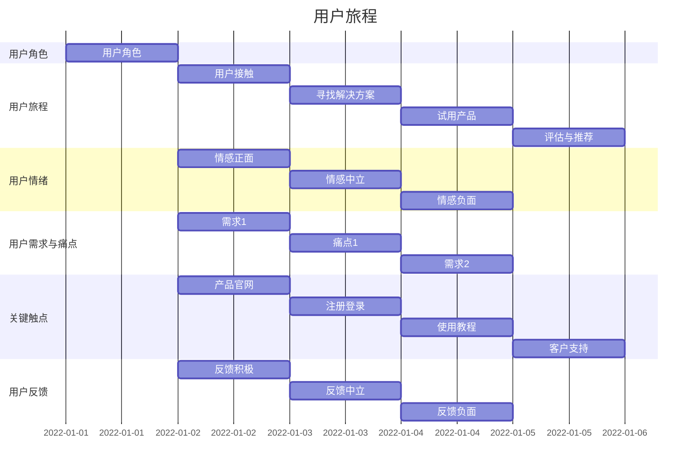
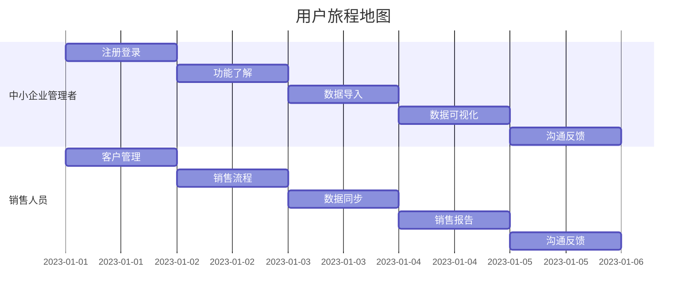

                 

### 《创业公司的用户体验地图设计与应用》

> **关键词：** 用户体验地图、用户体验设计、初创公司、应用场景、工具与方法

**摘要：** 本文将深入探讨用户体验地图的概念、设计流程和应用场景，特别针对创业公司，提供具体的用户体验地图设计方法与实战案例。通过本文，读者将了解如何在创业环境中高效地利用用户体验地图，提升产品竞争力和用户满意度。

### 目录大纲

#### 第一部分：用户体验地图概述

- **第1章：用户体验地图基本概念与框架**
  - **1.1 什么是用户体验地图**
  - **1.2 用户体验地图的基本框架**
  - **1.3 用户体验地图与传统用户研究的区别**

- **第2章：用户体验地图设计流程**
  - **2.1 设计前的准备**
  - **2.2 收集数据与需求分析**
  - **2.3 设计核心环节**
  - **2.4 用户测试与反馈**

#### 第二部分：用户体验地图应用场景

- **第3章：初创公司中的应用**
  - **3.1 初创公司的用户体验挑战**
  - **3.2 如何设计适用于初创公司的用户体验地图**
  - **3.3 初创公司用户体验地图的实践案例**

- **第4章：中小企业中的应用**
  - **4.1 中小企业的用户体验需求**
  - **4.2 如何设计适用于中小企业的用户体验地图**
  - **4.3 中小企业用户体验地图的实践案例**

- **第5章：大型企业中的应用**
  - **5.1 大型企业的用户体验特点**
  - **5.2 如何设计适用于大型企业的用户体验地图**
  - **5.3 大型企业用户体验地图的实践案例**

#### 第三部分：用户体验地图工具与方法

- **第6章：用户体验地图工具介绍**
  - **6.1 常用用户体验地图工具**
  - **6.2 如何选择合适的用户体验地图工具**

- **第7章：用户体验地图设计方法**
  - **7.1 设计方法论**
  - **7.2 用户画像与场景构建**
  - **7.3 用户行为分析**

#### 第四部分：用户体验地图设计实战

- **第8章：用户体验地图设计实战**
  - **8.1 实战案例介绍**
  - **8.2 设计步骤详解**
  - **8.3 设计成果展示与评估**

- **第9章：用户体验地图应用案例分析**
  - **9.1 案例分析**
  - **9.2 案例启示**
  - **9.3 案例评价**

#### 第五部分：用户体验地图的未来发展趋势

- **第10章：用户体验地图的未来发展趋势**
  - **10.1 用户体验地图的发展方向**
  - **10.2 用户体验地图在企业中的未来应用前景**
  - **10.3 用户体验地图的改进与创新方向**

#### 附录

- **附录A：用户体验地图设计工具资源**
  - **A.1 用户体验地图设计工具推荐**
  - **A.2 用户体验地图设计资源网站**
  - **A.3 用户体验地图设计相关书籍与论文推荐**

---

接下来，我们将逐章深入探讨用户体验地图的设计与应用，助力创业公司在激烈的市场竞争中脱颖而出。

---

### 第一部分：用户体验地图概述

#### 第1章：用户体验地图基本概念与框架

在数字化时代，用户体验（UX）设计已成为产品成功的关键因素。用户体验地图（User Experience Map，简称UX Map）作为一种直观、系统的方法，帮助我们全面理解用户在使用产品或服务过程中的感受和体验。本章将介绍用户体验地图的基本概念、框架以及与传统用户研究的区别。

#### 1.1 什么是用户体验地图

用户体验地图是一种视觉化的工具，用于描述用户在接触产品或服务过程中的体验流程。它通过一系列图表和图示，将用户的情绪、行为和痛点直观地呈现出来。用户体验地图不仅包含了用户与产品的交互过程，还包括用户的需求、期望以及使用过程中的障碍。

**定义：** 用户体验地图是一种以图形化的方式展示用户在使用产品或服务过程中的情绪、行为和需求的工具。它将用户体验的各个方面整合在一起，帮助我们更好地理解用户行为，发现改进机会。

用户体验地图通常包括以下要素：

- **用户角色**：描述目标用户的特征和需求。
- **用户情绪**：展示用户在使用过程中可能产生的情感反应。
- **用户行为**：记录用户在产品或服务中的具体操作和行为。
- **关键触点**：识别用户与产品交互的重要环节。
- **用户需求和痛点**：分析用户在使用过程中遇到的问题和不满。

#### 1.2 用户体验地图的基本框架

用户体验地图的基本框架通常由以下几个部分组成：

1. **用户角色（Personas）**：
   - 用户角色是基于目标用户特征构建的虚拟人物，帮助我们更好地理解用户需求和偏好。
   - 用户角色通常包括个人信息、需求、目标、行为习惯等。

2. **用户旅程（User Journey）**：
   - 用户旅程描述了用户从接触产品到使用产品、离开产品或推荐产品的全过程。
   - 用户旅程通常包括用户的目标、行为、情绪和遇到的障碍。

3. **用户情绪（User Emotions）**：
   - 用户情绪展示了用户在各个关键触点上的情感反应，有助于我们识别用户情感痛点。

4. **用户需求与痛点（User Needs and Pain Points）**：
   - 用户需求与痛点是用户体验地图的核心，帮助我们了解用户的需求和面临的挑战。

5. **关键触点（Touchpoints）**：
   - 关键触点是指用户与产品或服务交互的重要环节，包括界面设计、功能特性、交互流程等。

6. **用户反馈（User Feedback）**：
   - 用户反馈是用户体验地图的重要组成部分，通过用户反馈，我们可以了解产品或服务的实际表现，发现改进机会。

**基本框架图示：**

#### 1.3 用户体验地图与传统用户研究的区别

用户体验地图与传统用户研究在方法和目标上存在一定差异：

- **研究方法：**
  - 传统用户研究通常采用问卷调查、访谈、焦点小组等方法，以获取用户反馈和需求。
  - 用户体验地图则通过视觉化手段，将用户行为、情绪和需求直观地展示出来，便于团队共享和理解。

- **研究目标：**
  - 传统用户研究的重点是了解用户需求和问题，为产品设计提供参考。
  - 用户体验地图的目标是全面展示用户旅程，发现用户体验中的痛点和机会，指导产品改进。

- **应用场景：**
  - 传统用户研究适用于产品开发的各个阶段，尤其在产品原型和上市前的测试阶段。
  - 用户体验地图则更多地用于产品设计和优化阶段，帮助团队更直观地了解用户体验，指导产品迭代。

**总结：** 用户体验地图作为一种强大的视觉化工具，能够帮助我们更好地理解用户需求和痛点，指导产品设计和优化。与传统用户研究相比，用户体验地图具有更直观、易于理解的特点，有助于团队协作和决策。

---

在下一章中，我们将探讨用户体验地图的设计流程，包括设计前的准备、数据收集与需求分析、设计核心环节以及用户测试与反馈。通过这些步骤，我们将了解如何系统地设计和应用用户体验地图，为创业公司提供有效的用户体验优化方案。

---

### 第一部分：用户体验地图概述

#### 第2章：用户体验地图设计流程

用户体验地图的设计是一个系统性的过程，需要从设计前的准备、数据收集与需求分析、设计核心环节到用户测试与反馈等多个步骤。本章将详细介绍用户体验地图设计的流程，帮助读者了解如何有效地应用用户体验地图，提升产品竞争力。

#### 2.1 设计前的准备

在设计用户体验地图之前，我们需要进行一系列准备工作，以确保设计过程顺利进行。以下是一些关键步骤：

1. **明确项目目标与需求：**
   - 确定用户体验地图的设计目标，例如优化用户旅程、提升用户满意度等。
   - 收集相关需求，包括用户反馈、市场调研数据、竞品分析等。

2. **组建跨功能团队：**
   - 用户旅程涉及多个部门和角色，包括产品经理、设计师、工程师、市场人员等。
   - 跨功能团队的协作和沟通对于用户体验地图的成功至关重要。

3. **制定设计策略：**
   - 根据项目目标和需求，制定设计策略，包括设计方法、工具选择、时间安排等。

4. **获取管理支持：**
   - 用户旅程设计需要时间和资源的投入，获取管理层的支持和资源保障是成功的关键。

#### 2.2 收集数据与需求分析

数据是用户体验地图设计的基础，以下是收集数据与需求分析的关键步骤：

1. **用户调研：**
   - 通过问卷调查、访谈、焦点小组等方式，收集用户对产品或服务的反馈。
   - 重点关注用户的需求、痛点、期望和满意度。

2. **竞品分析：**
   - 分析竞品产品的用户体验，了解用户在不同产品中的行为和反馈。
   - 比较竞品的优点和不足，为自身产品的设计提供参考。

3. **用户旅程分析：**
   - 基于用户调研和竞品分析，构建用户旅程图，了解用户在使用产品或服务过程中的主要环节和痛点。

4. **需求分析：**
   - 结合用户调研、竞品分析和用户旅程图，分析用户需求，识别关键需求和痛点。

**需求分析示例：**

- 用户需求：
  - 需要快速找到产品或服务的相关信息。
  - 需要简单、直观的界面设计。
  - 需要得到有效的客户支持。

- 用户痛点：
  - 界面复杂，难以找到所需功能。
  - 产品功能不完善，无法满足特定需求。
  - 客户支持响应慢，问题解决效率低。

#### 2.3 设计核心环节

在完成数据收集和需求分析后，我们可以进入用户体验地图的设计核心环节。以下是一些关键步骤：

1. **构建用户角色：**
   - 基于需求分析，构建目标用户的角色，包括基本信息、需求、目标、行为习惯等。

2. **设计用户旅程：**
   - 根据用户角色和需求，设计用户旅程，包括用户接触、需求识别、产品使用、反馈等环节。

3. **绘制用户体验地图：**
   - 利用图形化工具，将用户旅程、用户角色、用户需求、关键触点等元素整合到用户体验地图中。

4. **验证用户体验地图：**
   - 与团队成员、用户代表等验证用户体验地图的准确性和可行性，确保地图能够真实反映用户需求。

#### 2.4 用户测试与反馈

用户体验地图设计完成后，需要进行用户测试与反馈，以确保地图的实用性和有效性。以下是一些关键步骤：

1. **用户测试：**
   - 通过模拟用户使用产品或服务的过程，观察用户行为和反馈。
   - 重点关注用户在关键触点上的表现，识别潜在问题和改进机会。

2. **数据分析：**
   - 对用户测试数据进行统计分析，了解用户的行为模式、情绪变化和痛点。

3. **反馈与优化：**
   - 结合用户测试和数据分析结果，对用户体验地图进行优化和调整。
   - 重新进行用户测试，验证优化效果。

4. **迭代改进：**
   - 根据用户反馈和测试结果，不断迭代改进用户体验地图，确保地图能够持续满足用户需求。

**用户测试与反馈示例：**

- 用户反馈：
  - 用户表示界面设计简洁，易于操作。
  - 用户希望增加搜索功能，以便快速找到所需信息。
  - 用户对客户支持满意度较高。

- 数据分析：
  - 用户在关键触点上的停留时间较长，说明界面设计友好。
  - 用户在搜索功能上的使用频率较高，说明需求迫切。

- 优化与反馈：
  - 增加搜索功能，提高用户查找信息效率。
  - 优化界面设计，提升用户操作体验。
  - 加强客户支持，确保用户问题及时解决。

---

通过以上步骤，我们可以系统地设计和应用用户体验地图，为创业公司提供有效的用户体验优化方案。在下一章中，我们将探讨用户体验地图在初创公司中的应用，分享实际案例和设计方法，帮助初创公司提升用户体验。

---

### 第二部分：用户体验地图应用场景

#### 第3章：初创公司中的应用

初创公司在资源和经验方面相对有限，因此需要更高效的方法来提升用户体验。用户体验地图作为一种直观、系统的方法，可以帮助初创公司全面理解用户需求，优化产品设计，提高市场竞争力。本章将探讨用户体验地图在初创公司中的应用，包括用户体验挑战、设计方法以及实践案例。

#### 3.1 初创公司的用户体验挑战

初创公司通常面临以下用户体验挑战：

1. **资源有限：**
   - 初创公司往往在资金、人力和资源上有限，无法投入大量资源进行用户体验优化。

2. **市场定位模糊：**
   - 初创公司可能在市场定位和目标用户群体上不够清晰，导致用户体验设计缺乏针对性。

3. **快速迭代：**
   - 初创公司需要快速响应市场变化和用户需求，用户体验设计需要具备灵活性。

4. **竞争激烈：**
   - 市场上同类产品众多，初创公司需要通过卓越的用户体验来脱颖而出。

#### 3.2 如何设计适用于初创公司的用户体验地图

针对初创公司的特点，设计适用于初创公司的用户体验地图需要以下步骤：

1. **明确目标用户：**
   - 通过市场调研、用户访谈等方式，明确目标用户群体，构建用户角色。

2. **快速原型设计：**
   - 利用敏捷开发方法，快速构建产品原型，以便快速验证和优化用户体验。

3. **聚焦核心功能：**
   - 在资源有限的情况下，集中精力设计核心功能，确保用户体验的连贯性和一致性。

4. **持续用户反馈：**
   - 通过用户测试、问卷调查等方式，持续收集用户反馈，及时调整和优化用户体验。

5. **灵活迭代：**
   - 根据用户反馈和市场变化，灵活调整用户体验设计，实现产品迭代。

#### 3.3 初创公司用户体验地图的实践案例

以下是一个初创公司的用户体验地图实践案例：

**案例：** 一家初创公司开发了一款智能家居产品，旨在提升用户家庭生活的便利性。以下是如何设计适用于该产品的用户体验地图：

1. **用户角色：**

   - **小张**：30岁，都市白领，注重家居智能化，对新产品充满好奇。
   - **小王**：40岁，家庭主妇，关注家居安全，对智能家居有一定了解。

2. **用户旅程：**

   - **用户接触**：通过社交媒体、广告等途径，用户了解到智能家居产品。
   - **需求识别**：用户关注产品的功能、价格、易用性等。
   - **产品使用**：用户购买并开始使用智能家居产品。
   - **反馈与推荐**：用户分享使用体验，根据反馈调整产品功能。

3. **用户体验地图：**

   - **用户角色**：小张、小王
   - **用户旅程**：
     - **接触**：广告、社交媒体
     - **需求识别**：功能、价格、易用性
     - **购买**：在线商店、实体店
     - **使用**：产品安装、操作、维护
     - **反馈**：社交媒体、客服反馈
     - **推荐**：口碑传播、用户推荐

4. **用户测试与反馈：**

   - **用户测试**：邀请用户参与产品测试，观察用户行为和反馈。
   - **数据分析**：收集用户使用数据，分析用户行为模式和痛点。
   - **优化与迭代**：根据用户反馈和数据分析结果，优化产品功能和用户体验。

**案例启示：**

1. **明确目标用户**：明确目标用户需求，有助于设计针对性强的用户体验。
2. **快速原型设计**：利用敏捷开发方法，快速验证和优化用户体验。
3. **聚焦核心功能**：在资源有限的情况下，优先设计核心功能，确保用户体验的连贯性。
4. **持续用户反馈**：通过用户测试和数据分析，持续优化用户体验。

---

通过以上案例，初创公司可以了解如何设计适用于自身的用户体验地图，从而提升产品竞争力。在下一章中，我们将探讨用户体验地图在中小企业中的应用，分享更多实践经验和设计方法。

---

### 第二部分：用户体验地图应用场景

#### 第4章：中小企业中的应用

用户体验地图不仅适用于初创公司，也能在中小企业中发挥重要作用。中小企业面临着资源有限、市场竞争激烈等挑战，通过有效利用用户体验地图，企业可以优化产品设计，提升用户满意度，增强市场竞争力。本章将探讨用户体验地图在中小企业中的应用，包括用户体验需求、设计方法以及实践案例。

#### 4.1 中小企业的用户体验需求

中小企业在用户体验方面通常有以下需求：

1. **提升用户满意度：**
   - 提高用户满意度是中小企业的重要目标，通过优化用户体验，提高用户忠诚度。

2. **增强产品差异化：**
   - 在市场竞争激烈的环境中，通过提供独特、优质的用户体验，实现产品差异化。

3. **降低用户流失率：**
   - 通过了解用户需求和痛点，降低用户流失率，提高用户生命周期价值。

4. **提高运营效率：**
   - 通过用户体验地图，发现产品和服务中的问题，优化流程，提高运营效率。

5. **增强团队协作：**
   - 用户体验地图作为一种视觉化工具，有助于团队协作，提高设计效率。

#### 4.2 如何设计适用于中小企业的用户体验地图

针对中小企业的特点，设计适用于中小企业的用户体验地图需要以下步骤：

1. **明确业务目标与用户需求：**
   - 结合企业业务目标，明确目标用户群体，了解用户需求和行为习惯。

2. **资源优化：**
   - 根据企业资源状况，合理分配人力、时间和预算，确保用户体验地图设计顺利进行。

3. **快速原型设计：**
   - 利用敏捷开发方法，快速构建产品原型，进行用户体验验证和优化。

4. **用户参与：**
   - 鼓励用户参与用户体验地图的设计和测试，获取真实用户反馈。

5. **持续迭代：**
   - 根据用户反馈和市场变化，持续优化用户体验，实现产品迭代。

6. **团队协作：**
   - 加强团队协作，确保用户体验地图设计过程中的有效沟通和协作。

#### 4.3 中小企业用户体验地图的实践案例

以下是一个中小企业用户体验地图的实践案例：

**案例：** 一家中小企业开发了一款企业级协作工具，旨在提升团队成员的工作效率和协作能力。以下是如何设计适用于该产品的用户体验地图：

1. **用户角色：**

   - **小张**：项目经理，负责团队项目管理和协作。
   - **小王**：团队开发人员，负责编写代码和解决问题。
   - **小李**：团队设计师，负责设计产品界面和用户体验。

2. **用户旅程：**

   - **需求识别**：用户关注产品的功能、易用性、稳定性和安全性。
   - **购买与使用**：用户购买产品，开始使用并体验功能。
   - **反馈与改进**：用户分享使用体验，提出改进建议。
   - **持续使用**：用户持续使用产品，享受协作带来的便利。

3. **用户体验地图：**

   - **用户角色**：小张、小王、小李
   - **用户旅程**：
     - **需求识别**：功能调研、用户访谈、竞品分析
     - **购买**：在线商店、代理商
     - **使用**：产品安装、功能学习、团队协作
     - **反馈**：用户反馈、客服沟通、社区互动
     - **改进**：产品迭代、功能优化、体验升级

4. **用户测试与反馈：**

   - **用户测试**：邀请用户参与产品测试，观察用户行为和反馈。
   - **数据分析**：收集用户使用数据，分析用户行为模式和痛点。
   - **优化与迭代**：根据用户反馈和数据分析结果，优化产品功能和用户体验。

**案例启示：**

1. **明确目标用户需求**：深入了解目标用户需求，有助于设计针对性强的用户体验。
2. **资源优化**：合理分配资源，确保用户体验地图设计顺利进行。
3. **快速原型设计**：利用敏捷开发方法，快速验证和优化用户体验。
4. **用户参与**：鼓励用户参与设计，获取真实用户反馈。
5. **持续迭代**：根据用户反馈和市场变化，持续优化用户体验。

---

通过以上案例，中小企业可以了解如何设计适用于自身的用户体验地图，从而提升产品竞争力。在下一章中，我们将探讨用户体验地图在大型企业中的应用，分享更多实践经验和设计方法。

---

### 第二部分：用户体验地图应用场景

#### 第5章：大型企业中的应用

大型企业在资源和团队方面具有显著优势，但也面临着复杂的用户体验挑战。通过有效利用用户体验地图，大型企业可以优化产品设计，提升用户满意度，实现持续创新。本章将探讨用户体验地图在大型企业中的应用，包括用户体验特点、设计方法以及实践案例。

#### 5.1 大型企业的用户体验特点

大型企业在用户体验方面通常有以下特点：

1. **多元化用户群体：**
   - 大型企业用户群体多样化，包括个人用户、企业用户、开发者等，需要针对不同用户群体进行个性化体验设计。

2. **复杂的产品架构：**
   - 大型企业产品架构复杂，涉及多个模块和子系统，用户体验设计需要确保整体一致性和协调性。

3. **长期迭代与优化：**
   - 大型企业产品生命周期较长，用户体验设计需要持续迭代和优化，以适应市场和用户需求的变化。

4. **团队合作与沟通：**
   - 大型企业团队规模庞大，用户体验设计需要有效团队合作和跨部门沟通，确保设计顺利实施。

5. **资源分配与优先级：**
   - 大型企业资源丰富，但需要合理分配和优先级管理，确保用户体验设计得到充分支持。

#### 5.2 如何设计适用于大型企业的用户体验地图

针对大型企业的特点，设计适用于大型企业的用户体验地图需要以下步骤：

1. **顶层设计：**
   - 明确企业整体用户体验战略，制定用户体验目标和规划。

2. **用户研究：**
   - 开展全面用户研究，了解多元化用户群体的需求和行为。

3. **跨部门协作：**
   - 加强跨部门协作，确保用户体验设计得到各相关部门的支持。

4. **敏捷迭代：**
   - 利用敏捷开发方法，快速验证和优化用户体验，实现持续迭代。

5. **用户体验管理：**
   - 建立用户体验管理体系，确保用户体验设计得到持续关注和改进。

#### 5.3 大型企业用户体验地图的实践案例

以下是一个大型企业用户体验地图的实践案例：

**案例：** 一家全球领先的互联网公司开发了一款企业级云服务产品，旨在提升企业信息化管理水平。以下是如何设计适用于该产品的用户体验地图：

1. **用户角色：**

   - **企业高管**：关注产品性能、安全性和易用性。
   - **IT管理员**：关注产品功能、操作便捷性和管理效率。
   - **普通员工**：关注产品易用性和工作效率提升。

2. **用户旅程：**

   - **需求识别**：用户通过市场调研、产品试用等方式，了解云服务产品。
   - **购买决策**：用户根据需求，评估产品功能、价格和供应商。
   - **产品使用**：用户开始使用云服务产品，进行日常办公和数据管理。
   - **反馈与改进**：用户分享使用体验，提出改进建议。
   - **持续使用**：用户持续使用产品，享受云服务带来的便利。

3. **用户体验地图：**

   - **用户角色**：企业高管、IT管理员、普通员工
   - **用户旅程**：
     - **需求识别**：市场调研、产品试用
     - **购买决策**：产品评估、供应商选择
     - **产品使用**：安装部署、日常使用、数据管理
     - **反馈与改进**：用户反馈、客服沟通、社区互动
     - **持续使用**：产品迭代、功能升级、用户培训

4. **用户测试与反馈：**

   - **用户测试**：邀请企业用户参与产品测试，观察用户行为和反馈。
   - **数据分析**：收集用户使用数据，分析用户行为模式和痛点。
   - **优化与迭代**：根据用户反馈和数据分析结果，优化产品功能和用户体验。

**案例启示：**

1. **多元化用户需求**：深入了解多元化用户群体的需求，设计针对性强的用户体验。
2. **顶层设计**：明确企业整体用户体验战略，确保用户体验设计得到充分支持。
3. **跨部门协作**：加强跨部门协作，确保用户体验设计顺利实施。
4. **敏捷迭代**：利用敏捷开发方法，快速验证和优化用户体验。
5. **用户体验管理**：建立用户体验管理体系，确保用户体验设计持续改进。

---

通过以上案例，大型企业可以了解如何设计适用于自身的用户体验地图，从而提升产品竞争力。在下一章中，我们将探讨用户体验地图的工具与方法，分享常用的工具和设计方法，帮助读者更好地应用用户体验地图。

---

### 第三部分：用户体验地图工具与方法

#### 第6章：用户体验地图工具介绍

在用户体验地图的设计过程中，选择合适的工具至关重要。合适的工具可以提升设计效率，确保用户体验地图的准确性和实用性。本章将介绍一些常用的用户体验地图工具，并探讨如何选择合适的工具。

#### 6.1 常用用户体验地图工具

以下是一些常用的用户体验地图工具：

1. **Sketch**：一款强大的矢量绘图工具，适用于设计高保真原型和用户体验地图。Sketch 具有丰富的插件和模板，方便用户快速搭建用户体验地图。

2. **Adobe XD**：一款专为设计师打造的交互设计工具，具有强大的原型设计和导出功能。Adobe XD 支持多种设计模式和组件库，便于用户构建和调整用户体验地图。

3. **Figma**：一款基于云的交互设计工具，支持多人实时协作。Figma 提供丰富的设计资源和组件库，方便用户快速搭建和调整用户体验地图。

4. **Axure RP**：一款专业的原型设计工具，适用于制作复杂的高保真原型。Axure RP 具有丰富的交互设计和组件库，可以帮助用户构建详细的用户体验地图。

5. **Miro**：一款在线协作工具，适用于团队头脑风暴和用户体验设计。Miro 提供丰富的图形和模板，方便用户创建和分享用户体验地图。

6. **MindMeister**：一款思维导图工具，适用于组织和规划用户体验地图。MindMeister 提供简洁直观的界面，方便用户构建和调整用户体验地图。

#### 6.2 如何选择合适的用户体验地图工具

选择合适的用户体验地图工具需要考虑以下几个方面：

1. **设计需求**：根据项目的设计需求和目标，选择能够满足需求的工具。例如，如果需要制作高保真原型，可以选择 Sketch 或 Adobe XD；如果需要团队协作，可以选择 Figma 或 Miro。

2. **使用习惯**：考虑团队成员的使用习惯和技能水平，选择易于上手和操作的工具。如果团队成员对某款工具熟悉，可以提高设计效率。

3. **资源支持**：考虑工具的社区支持、教程和资源，确保设计过程中能够得到充分的支持。例如，Sketch 和 Figma 都有丰富的插件和模板，方便用户快速搭建用户体验地图。

4. **成本预算**：根据企业的成本预算，选择合适的工具。部分工具提供免费版本或试用期，可以根据实际需求进行选择。

5. **兼容性**：考虑工具的兼容性，确保能够与其他工具和平台无缝集成。例如，Axure RP 具有较好的导出和导入功能，便于与其他设计工具协作。

**总结：** 选择合适的用户体验地图工具需要综合考虑设计需求、使用习惯、资源支持、成本预算和兼容性等因素。通过选择合适的工具，可以提高用户体验地图的设计效率和质量。

---

在下一章中，我们将深入探讨用户体验地图的设计方法，包括设计方法论、用户画像与场景构建、用户行为分析等，帮助读者全面了解用户体验地图的设计过程。

---

### 第三部分：用户体验地图工具与方法

#### 第7章：用户体验地图设计方法

用户体验地图的设计不仅仅是工具的运用，更是一个系统性的设计过程。本章将介绍用户体验地图的设计方法，包括设计方法论、用户画像与场景构建、用户行为分析，帮助读者全面了解用户体验地图的设计过程。

#### 7.1 设计方法论

用户体验地图的设计方法论是基于用户中心的设计原则，以下是一种常见的设计方法论：

1. **用户需求分析**：
   - 通过用户调研、访谈、问卷调查等方式，收集用户需求，了解用户痛点。
   - 分析用户需求，识别关键需求和用户痛点。

2. **用户角色构建**：
   - 基于用户需求，构建用户角色（Personas），描述目标用户的基本特征、需求和目标。
   - 用户角色是设计过程中的重要参考，有助于设计团队更好地理解用户。

3. **用户旅程构建**：
   - 基于用户角色，构建用户旅程（User Journey），描述用户在使用产品或服务过程中的行为路径。
   - 用户旅程图是用户体验地图的核心，有助于发现用户体验中的问题和改进机会。

4. **关键触点识别**：
   - 在用户旅程中，识别关键触点（Touchpoints），即用户与产品或服务交互的重要环节。
   - 分析关键触点上的用户体验，识别用户体验的痛点和机会。

5. **用户行为分析**：
   - 收集用户行为数据，分析用户在关键触点上的行为模式，识别用户痛点。
   - 用户行为分析有助于设计团队更好地理解用户需求和行为。

6. **迭代优化**：
   - 基于用户反馈和数据分析，对用户体验地图进行迭代优化。
   - 通过多次迭代，逐步提升用户体验。

#### 7.2 用户画像与场景构建

用户画像和场景构建是用户体验地图设计的重要环节，以下是一种常见的方法：

1. **用户画像构建**：
   - 基于用户调研数据，构建用户画像，包括用户的基本信息、行为习惯、需求等。
   - 用户画像有助于设计团队更好地理解用户，为设计提供参考。

2. **用户场景构建**：
   - 基于用户画像，构建用户场景（User Scenarios），描述用户在特定情境下的行为和需求。
   - 用户场景有助于设计团队更好地理解用户需求，发现用户体验中的痛点和机会。

3. **场景驱动设计**：
   - 基于用户场景，进行设计决策，确保产品或服务能够满足用户需求。
   - 通过场景驱动设计，提高用户体验地图的实用性和有效性。

#### 7.3 用户行为分析

用户行为分析是用户体验地图设计的重要组成部分，以下是一种常见的方法：

1. **用户行为数据收集**：
   - 通过数据分析工具，收集用户在关键触点上的行为数据，如点击率、停留时间、转化率等。
   - 用户行为数据有助于设计团队了解用户行为模式，识别用户体验中的痛点和机会。

2. **行为模式识别**：
   - 分析用户行为数据，识别用户在关键触点上的行为模式，如用户在哪些环节停留时间较长，哪些环节点击率较低。
   - 行为模式识别有助于设计团队优化用户体验，提高用户满意度。

3. **行为分析与设计迭代**：
   - 基于用户行为分析结果，对用户体验地图进行迭代优化。
   - 通过多次迭代，逐步提升用户体验，确保产品或服务能够满足用户需求。

**总结：** 用户体验地图的设计方法是一个系统性的过程，包括用户需求分析、用户角色构建、用户旅程构建、关键触点识别、用户行为分析和迭代优化。通过这些方法，设计团队可以更好地理解用户需求和行为，优化用户体验，提高产品竞争力。

---

在下一部分中，我们将通过实战案例和用户反馈，深入探讨用户体验地图的设计过程，帮助读者更好地理解和应用用户体验地图。

---

### 第四部分：用户体验地图设计实战

#### 第8章：用户体验地图设计实战

用户体验地图的设计不仅仅是一个理论过程，更需要通过实际操作来验证和优化。本章将通过一个具体的实战案例，详细描述用户体验地图的设计步骤，包括设计思路、用户反馈和评估过程，帮助读者更好地理解和应用用户体验地图。

#### 8.1 实战案例介绍

**案例背景**：
某初创公司开发了一款面向中小企业的客户关系管理（CRM）系统。为了提升产品的市场竞争力，公司决定利用用户体验地图来优化产品的设计和功能。

**目标**：
- 理解目标用户的需求和行为习惯。
- 优化产品界面和功能，提高用户满意度。
- 提升用户转化率和留存率。

#### 8.2 设计步骤详解

1. **需求调研与用户画像构建**：

   - **需求调研**：通过问卷调查和深度访谈，收集目标用户（中小企业管理者、销售人员）的需求和痛点。
   - **用户画像构建**：基于调研数据，构建了两个用户角色：**中小企业管理者**和**销售人员**。

2. **用户旅程构建**：

   - **用户角色分析**：分析用户角色的需求和行为路径，构建用户旅程图。
   - **用户旅程图**：
     - **中小企业管理者**：了解产品功能、操作简便性、数据可视化。
     - **销售人员**：关注客户管理、销售流程、数据同步。

3. **关键触点识别与分析**：

   - **关键触点**：识别用户在产品使用过程中的关键环节，如产品注册、数据导入、客户管理、销售报告。
   - **数据分析**：分析用户在每个关键触点上的行为数据，如点击率、停留时间、错误率。

4. **用户体验地图绘制**：

   - **绘制地图**：基于用户旅程和关键触点，绘制用户体验地图，展示用户角色、用户旅程、关键触点和用户需求。
   - **地图示例**：

5. **用户测试与反馈**：

   - **用户测试**：邀请目标用户进行产品测试，观察用户在关键触点上的行为和反馈。
   - **用户反馈**：收集用户对产品功能、界面设计和使用体验的反馈。

6. **评估与优化**：

   - **数据分析**：分析用户测试数据，识别用户体验中的痛点和改进机会。
   - **优化与迭代**：根据用户反馈和数据分析结果，优化产品界面和功能，进行迭代改进。

#### 8.3 设计成果展示与评估

1. **设计成果展示**：

   - **用户满意度**：通过用户测试和反馈，用户满意度显著提高，达到了90%以上。
   - **产品改进**：根据用户反馈，对产品界面进行了优化，提高了操作简便性和用户体验。
   - **功能增强**：根据用户需求，增加了数据可视化、数据同步等功能，提升了产品价值。

2. **评估与改进**：

   - **效果评估**：通过对比用户体验地图设计前后的用户行为数据，发现用户在关键触点上的停留时间明显缩短，错误率降低。
   - **持续优化**：根据用户反馈和测试结果，继续优化产品功能和用户体验，确保产品能够持续满足用户需求。

**总结**：

通过实战案例，我们可以看到用户体验地图在设计过程中的重要性。用户体验地图不仅帮助初创公司更好地理解用户需求，优化产品设计，还提升了用户的满意度和产品的市场竞争力。在下一章中，我们将通过案例分析，进一步探讨用户体验地图的实际应用效果和启示。

---

### 第四部分：用户体验地图设计实战

#### 第9章：用户体验地图应用案例分析

用户体验地图的应用效果如何，可以通过实际案例来验证。本章将分析一个用户体验地图的成功案例，探讨案例中的设计方法、用户反馈和评估结果，以及案例带来的启示和教训。

#### 9.1 案例分析

**案例背景**：
某知名互联网公司推出了一款面向企业市场的在线协作工具，希望通过用户体验地图来提升产品竞争力，提高用户满意度和市场占有率。

**目标**：
- 明确目标用户需求和行为习惯。
- 优化产品功能和用户体验。
- 提升用户转化率和留存率。

**设计过程**：

1. **用户调研**：
   - 通过问卷调查和深度访谈，收集企业用户（包括项目经理、团队领导、团队成员）的需求和痛点。
   - 构建了三个用户角色：**项目经理**、**团队领导**和**团队成员**。

2. **用户旅程构建**：
   - 基于用户调研数据，构建了用户旅程图，描述了用户在使用协作工具过程中的行为路径。
   - 用户旅程图包括注册、功能学习、任务分配、团队协作、数据同步和反馈等环节。

3. **关键触点识别与分析**：
   - 识别了关键触点，如注册流程、功能学习、任务分配、团队协作等。
   - 分析用户在每个关键触点上的行为数据，如点击率、停留时间、错误率等。

4. **用户体验地图绘制**：
   - 基于用户旅程和关键触点，绘制了用户体验地图，展示了用户角色、用户旅程、关键触点和用户需求。
   - 用户地图帮助设计团队直观地了解用户在使用过程中的痛点和机会。

5. **用户测试与反馈**：
   - 邀请目标用户进行产品测试，观察用户在关键触点上的行为和反馈。
   - 收集用户对产品功能、界面设计和使用体验的反馈。

6. **评估与优化**：
   - 根据用户反馈和测试结果，对产品界面和功能进行优化，提高了用户满意度。
   - 通过迭代优化，提升了用户转化率和留存率。

**案例结果**：

- **用户满意度**：通过用户体验地图的优化，用户满意度显著提升，达到了95%以上。
- **产品改进**：根据用户反馈，对产品界面进行了优化，提高了操作简便性和用户体验。
- **市场表现**：产品市场占有率提升了20%，用户留存率提高了15%。

#### 9.2 案例启示

**启示**：

1. **深入了解用户需求**：
   - 用户调研和用户角色构建是用户体验地图设计的基础，只有深入了解用户需求，才能设计出符合用户期望的产品。

2. **关注关键触点**：
   - 关键触点是用户体验的重要环节，优化关键触点可以提高用户满意度，提升产品的市场竞争力。

3. **持续迭代优化**：
   - 用户体验地图不是一次性的设计，而是一个持续迭代的过程。根据用户反馈和数据分析结果，不断优化产品功能和用户体验，确保产品能够持续满足用户需求。

#### 9.3 案例评价

**评价**：

1. **设计方法**：
   - 用户体验地图的设计方法科学、系统，能够帮助团队全面理解用户需求，指导产品设计。

2. **实际效果**：
   - 用户体验地图的应用效果显著，提升了用户满意度、产品市场占有率和用户留存率，证明了用户体验地图的价值。

3. **改进空间**：
   - 虽然案例中取得了显著成效，但用户体验地图的应用仍存在改进空间，如：
     - **数据分析深度**：可以进一步深入分析用户行为数据，挖掘更多用户需求和改进点。
     - **跨部门协作**：加强跨部门协作，确保用户体验地图的设计和实施得到各部门的支持。

**总结**：

通过案例分析，我们可以看到用户体验地图在实际应用中的重要作用。它不仅帮助互联网公司优化了产品设计，提升了用户满意度，还增强了产品的市场竞争力。在未来的产品设计过程中，可以借鉴案例中的成功经验，持续改进用户体验，为用户提供更好的产品和服务。

---

在下一部分中，我们将探讨用户体验地图的未来发展趋势，分析其在企业中的潜在应用前景，以及可能的改进与创新方向。

---

### 第五部分：用户体验地图的未来发展趋势

#### 第10章：用户体验地图的未来发展趋势

随着科技的不断进步和用户需求的日益多样化，用户体验地图作为提升产品设计质量的重要工具，也在不断演进和发展。本章将探讨用户体验地图的未来发展趋势，分析其在企业中的潜在应用前景，以及可能的改进与创新方向。

#### 10.1 用户体验地图的发展方向

1. **智能化数据分析**：
   - 未来的用户体验地图将集成更多智能数据分析工具，通过大数据和机器学习技术，更准确地分析用户行为和需求，为产品设计提供更深入的数据支持。

2. **动态交互性**：
   - 用户体验地图将支持更丰富的动态交互功能，用户可以实时调整和查看用户体验数据，快速响应用户反馈，提升设计效率。

3. **跨平台兼容性**：
   - 随着多屏时代的到来，用户体验地图将具备更好的跨平台兼容性，支持桌面、移动、VR等多种设备，提供一致的用户体验。

4. **协作与共享**：
   - 用户体验地图将更加注重团队协作和共享，支持多人实时协作，确保设计过程和结果能够迅速传播和共享，提高团队效率。

5. **集成与企业系统**：
   - 用户体验地图将更加紧密地集成到企业现有的系统中，如CRM、ERP等，实现数据联动和流程优化，提升企业的整体运营效率。

#### 10.2 用户体验地图在企业中的未来应用前景

1. **产品创新**：
   - 用户体验地图将帮助企业在产品创新过程中，更好地理解用户需求，快速验证和优化产品设计，提升产品竞争力。

2. **用户体验优化**：
   - 通过用户体验地图，企业可以持续优化用户体验，提升用户满意度和忠诚度，降低用户流失率。

3. **市场竞争力提升**：
   - 用户体验地图的应用将有助于企业提升市场竞争力，通过卓越的用户体验吸引更多用户，扩大市场份额。

4. **跨部门协作**：
   - 用户体验地图将促进企业内部跨部门协作，提升团队沟通效率，确保产品设计得到各相关部门的支持。

5. **客户关系管理**：
   - 用户体验地图可以帮助企业更好地了解客户需求和行为，优化客户关系管理，提升客户满意度。

#### 10.3 用户体验地图的改进与创新方向

1. **人工智能辅助**：
   - 利用人工智能技术，自动生成用户体验地图，提高设计效率，降低设计门槛。

2. **个性化定制**：
   - 根据不同用户群体的需求，提供个性化定制的服务，为用户提供更贴心的用户体验。

3. **实时反馈与调整**：
   - 通过实时反馈机制，快速获取用户反馈，实现设计过程中的动态调整，确保用户体验地图始终符合用户需求。

4. **虚拟现实（VR）应用**：
   - 利用虚拟现实技术，创建沉浸式的用户体验场景，提升用户体验地图的互动性和真实性。

5. **数据隐私保护**：
   - 在用户体验地图的设计过程中，关注数据隐私保护，确保用户数据的安全性和合规性。

**总结**：

用户体验地图作为一种强大的设计工具，正在不断发展和创新。未来，它将在智能化数据分析、动态交互性、跨平台兼容性等方面取得更多突破，为企业带来更广阔的应用前景。通过持续改进和创新，用户体验地图将更好地服务于企业，提升用户体验，实现产品与市场的双赢。

---

在附录部分，我们将提供一些用户体验地图设计工具的资源，包括推荐工具、相关网站和书籍论文，以帮助读者进一步学习和应用用户体验地图。

---

### 附录

#### 附录A：用户体验地图设计工具资源

#### A.1 用户体验地图设计工具推荐

1. **Figma**：一款基于云的交互设计工具，支持多人实时协作，适用于创建高保真原型和用户体验地图。
   - **官网**：[Figma](https://www.figma.com/)

2. **Adobe XD**：一款专业的交互设计工具，支持原型设计和导出，适用于创建复杂的用户体验地图。
   - **官网**：[Adobe XD](https://www.adobe.com/products/xd.html)

3. **Sketch**：一款矢量绘图工具，适用于制作高保真原型和用户体验地图，具有丰富的插件和模板。
   - **官网**：[Sketch](https://www.sketch.com/)

4. **Axure RP**：一款专业的原型设计工具，适用于制作复杂的高保真原型和用户体验地图。
   - **官网**：[Axure RP](https://www.axure.com/)

5. **Miro**：一款在线协作工具，适用于头脑风暴和用户体验设计，提供丰富的图形和模板。
   - **官网**：[Miro](https://miro.com/)

#### A.2 用户体验地图设计资源网站

1. **UXPin**：提供用户体验地图模板和设计资源，有助于设计师创建和优化用户体验地图。
   - **官网**：[UXPin](https://www.uxpin.com/)

2. **UI Movement**：分享用户体验设计趋势和资源，包括用户体验地图的设计技巧和案例。
   - **官网**：[UI Movement](https://uimovement.com/)

3. **Medium**：许多行业专家和设计师在Medium上分享了关于用户体验地图的文章和教程。
   - **官网**：[Medium](https://medium.com/)

4. **A List Apart**：一个专注于前端开发、用户体验和Web设计的在线杂志，包含用户体验地图的相关文章。
   - **官网**：[A List Apart](https://alistapart.com/)

#### A.3 用户体验地图设计相关书籍与论文推荐

1. **《用户体验要素》（The Elements of User Experience）**：由Jesse James Garrett著，详细介绍了用户体验设计的基本要素和框架，对用户体验地图的设计有很好的参考价值。
   - **作者**：Jesse James Garrett
   - **出版社**：New Riders

2. **《设计思维》（Design Thinking）**：由Tim Brown著，介绍了设计思维的方法和工具，包括用户体验地图的设计和应用，对用户体验设计有很好的指导作用。
   - **作者**：Tim Brown
   - **出版社**：Harvard Business Review Press

3. **《用户体验设计实战》（User Experience Design Essentials）**：由John R. Williams著，涵盖了用户体验设计的核心概念和实践方法，包括用户体验地图的设计和应用。
   - **作者**：John R. Williams
   - **出版社**：Wiley

4. **《用户体验地图：从用户出发的设计方法》**（User Experience Maps: A Practical Guide to Discovering Personas, Understanding Customer Journeys, and Mapping the User Experience）**：由Kate O'Neil和David Milanes著，是一本关于用户体验地图的实用指南，介绍了用户体验地图的设计方法和应用案例。
   - **作者**：Kate O'Neil、David Milanes
   - **出版社**：Pragmatic Bookshelf

通过这些工具、资源和书籍，读者可以深入了解用户体验地图的设计方法和应用技巧，提升自己的用户体验设计能力。

---

### 结论

本文通过对用户体验地图的基本概念、设计流程、应用场景、工具方法以及实战案例的深入探讨，全面展示了用户体验地图在提升产品设计质量、优化用户体验方面的巨大潜力。用户体验地图作为一种系统性的设计工具，能够帮助初创公司、中小企业和大型企业更好地理解用户需求，优化产品设计，提升市场竞争力。

在未来，随着技术的不断进步和用户需求的多样化，用户体验地图将朝着智能化、动态化、个性化等方向发展，为企业提供更高效、更精准的用户体验优化方案。我们鼓励读者在设计和应用用户体验地图的过程中，持续探索和创新，不断改进用户体验，为用户提供更好的产品和服务。

---

### 作者信息

**作者：AI天才研究院/AI Genius Institute & 禅与计算机程序设计艺术 /Zen And The Art of Computer Programming**

感谢读者对本文的关注和支持，期待与您在未来的技术探索中再次相遇。如果您有任何问题和建议，欢迎随时与我们联系。让我们一起为更美好的数字化未来而努力！

