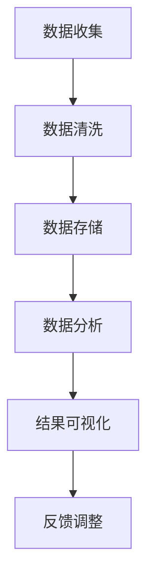

                 

# 《创业公司的用户数据分析与洞察应用策略》

> **关键词**：用户数据分析、用户洞察、应用策略、创业公司、数据分析工具、数据分析算法、市场营销、客户服务、用户体验、AI 技术。

> **摘要**：本文旨在深入探讨创业公司如何通过用户数据分析来获取洞察，并制定有效的应用策略。文章首先介绍了用户数据分析的基础知识，包括核心概念、联系和算法原理。随后，重点分析了用户数据分析在产品运营、市场营销、客户服务以及产品安全与合规性等方面的具体应用策略。最后，通过两个实际项目案例，展示了用户数据分析的实际操作过程及其效果。文章最后探讨了用户数据分析策略的优化方法以及未来发展趋势。

### 目录

1. **用户数据分析基础**
   1.1 用户数据分析概述
   1.2 用户数据分析的核心概念与联系
   1.3 用户数据分析中的核心算法原理讲解
   1.4 数学模型和数学公式讲解与举例说明

2. **用户数据分析应用策略**
   2.1 用户数据分析在产品运营中的应用
   2.2 用户数据分析在市场营销中的应用
   2.3 用户数据分析在客户服务中的应用
   2.4 用户数据分析在产品安全与合规性中的应用

3. **用户数据分析项目实战**
   3.1 项目实战一：用户画像构建与用户细分
   3.2 项目实战二：用户留存与流失分析

4. **用户数据分析策略优化与未来展望**
   4.1 用户数据分析策略优化
   4.2 用户数据分析的未来发展趋势

### 第一部分：用户数据分析基础

#### 第1章：用户数据分析概述

**1.1 用户数据分析的意义**

用户数据分析在现代创业公司中具有至关重要的地位。通过对用户数据的深入分析，创业公司可以更好地理解用户需求，优化产品功能，提升用户体验，从而提高用户满意度和忠诚度。具体来说，用户数据分析的意义体现在以下几个方面：

- **市场定位**：通过用户数据分析，创业公司可以准确了解目标用户群体，确定产品或服务的市场定位。
- **产品优化**：用户数据分析有助于发现产品存在的问题和改进方向，从而进行针对性的优化。
- **用户增长**：通过分析用户行为数据，创业公司可以制定有效的用户获取和留存策略，实现用户规模的快速增长。
- **决策支持**：用户数据分析为创业公司提供了数据驱动的决策支持，有助于管理层做出更加明智的决策。

**1.2 用户数据分析的基本框架**

用户数据分析的基本框架主要包括以下几个关键步骤：

1. **数据收集**：通过不同的渠道收集用户数据，如网站日志、用户反馈、社交媒体数据等。
2. **数据清洗**：对收集到的数据进行处理，包括去重、填充缺失值、数据格式转换等，以确保数据的质量。
3. **数据存储**：将清洗后的数据存储在数据库中，便于后续的分析和处理。
4. **数据分析**：运用各种数据分析方法和工具，对存储在数据库中的用户数据进行挖掘和分析。
5. **结果可视化**：将分析结果通过图表、报表等形式进行可视化展示，便于管理层和业务人员理解。

**1.3 用户数据分析的方法与工具**

用户数据分析的方法和工具多种多样，主要包括以下几类：

- **描述性分析**：通过统计用户的基本信息、行为数据等，提供对用户群体的整体描述。
- **推断性分析**：通过假设检验等方法，对用户行为和特征之间的关系进行推断和分析。
- **预测性分析**：利用机器学习算法，对用户的未来行为和需求进行预测。

常见的用户数据分析工具有：
- **数据仓库**：如Amazon Redshift、Google BigQuery等，用于存储和管理大规模用户数据。
- **数据分析工具**：如Tableau、Power BI等，用于数据可视化。
- **数据挖掘工具**：如Apache Spark、R、Python等，用于数据分析与挖掘。

#### 第2章：用户数据分析的核心概念与联系

**2.1 用户行为分析**

**2.1.1 用户行为的定义与分类**

用户行为是指用户在使用产品或服务过程中所表现出的所有行为。根据用户行为的特点，可以将其分为以下几类：

- **浏览行为**：用户在产品页面上的浏览行为，如页面访问量、停留时间、浏览路径等。
- **点击行为**：用户在产品页面上的点击行为，如按钮点击、链接点击等。
- **购买行为**：用户在购买过程中的行为，如加入购物车、下单、支付等。
- **社交行为**：用户在社交媒体上的互动行为，如评论、点赞、分享等。

**2.1.2 用户行为分析的 Mermaid 流程图**



**2.2 用户画像与用户细分**

**2.2.1 用户画像的概念与构建**

用户画像是指通过对用户数据的分析，构建出一个包含用户基本特征、行为特征、需求特征等信息的用户描述。构建用户画像的目的是更好地理解用户，为产品优化和市场营销提供依据。

用户画像的构建通常包括以下几个步骤：

1. **数据收集**：收集用户的基本信息、行为数据、需求数据等。
2. **数据清洗**：清洗数据，去除重复、错误和缺失的数据。
3. **特征提取**：从原始数据中提取出对用户画像有代表性的特征。
4. **模型构建**：使用机器学习算法构建用户画像模型。
5. **画像评估**：评估用户画像的准确性、有效性等。

**2.2.2 用户细分的方法与策略**

用户细分是指将用户群体划分为不同的子群体，以便于针对不同用户群体制定个性化的营销策略。用户细分的方法主要包括以下几种：

- **基于行为的细分**：根据用户的行为特征进行细分，如活跃用户、沉默用户、流失用户等。
- **基于需求的细分**：根据用户的需求特征进行细分，如高端用户、低端用户、潜在用户等。
- **基于特征的细分**：根据用户的基本特征进行细分，如年龄、性别、地域等。

**2.2.3 用户细分的方法与策略**

用户细分的方法与策略主要包括以下几种：

- **聚类分析**：使用聚类算法将用户划分为不同的子群体。
- **因子分析**：通过因子分析提取用户的主要特征，并进行用户细分。
- **决策树**：使用决策树算法根据用户特征进行细分。

**2.3 用户留存与流失分析**

**2.3.1 用户留存率与流失率的定义**

用户留存率是指在一定时间内，仍然使用产品的用户比例。用户流失率是指在一定时间内，停止使用产品的用户比例。用户留存率与流失率的定义如下：

- **用户留存率**：\( 留存率 = \frac{剩余用户数}{初始用户数} \times 100\% \)
- **用户流失率**：\( 流失率 = \frac{流失用户数}{初始用户数} \times 100\% \)

**2.3.2 用户留存与流失分析的方法**

用户留存与流失分析的方法主要包括以下几种：

- **描述性分析**：通过统计留存用户和流失用户的基本特征和行为特征，分析用户留存与流失的原因。
- **因素分析**：通过因素分析找出影响用户留存和流失的关键因素。
- **预测分析**：使用预测模型预测用户的留存和流失概率，为产品优化和营销策略制定提供依据。

#### 第3章：用户数据分析中的核心算法原理讲解

**3.1 聚类分析算法**

**3.1.1 K-means 算法原理与伪代码**

K-means算法是一种基于距离的聚类算法，其基本思想是将数据点划分为K个簇，使得每个簇内部的数据点距离簇中心较近，而簇与簇之间的距离较远。

**原理**：

1. 随机初始化K个簇中心点。
2. 对于每个数据点，计算它与每个簇中心的距离，将其分配到距离最近的簇。
3. 重新计算每个簇的中心点。
4. 重复步骤2和3，直到聚类结果收敛。

**伪代码**：

```python
def K_means(data, K):
    # 初始化K个簇中心点
    centroids = initialize_centroids(data, K)
    while not convergence:
        # 分配数据点到最近的簇
        assignments = assign_points_to_clusters(data, centroids)
        # 重新计算簇中心点
        centroids = update_centroids(data, assignments, K)
    return centroids, assignments
```

**3.1.2 层次聚类算法原理与伪代码**

层次聚类算法是一种自底向上的聚类方法，它通过逐步合并或分裂数据点，形成层次化的聚类结构。

**原理**：

1. 将每个数据点视为一个簇。
2. 计算相邻簇之间的距离，选择距离最近的两个簇进行合并。
3. 重复步骤2，直到所有数据点合并为一个簇或达到设定的层次深度。

**伪代码**：

```python
def hierarchical_clustering(data):
    clusters = [data_point for data_point in data]
    while len(clusters) > 1:
        # 计算相邻簇之间的距离
        distances = calculate_distances(clusters)
        # 选择距离最近的两个簇进行合并
        closest_clusters = select_closest_clusters(distances)
        # 合并簇
        clusters = merge_clusters(clusters, closest_clusters)
    return clusters
```

**3.2 协同过滤算法**

**3.2.1 评分矩阵与预测模型**

协同过滤算法是一种基于用户行为数据的推荐算法，其核心思想是通过用户之间的相似性来预测用户对未知项目的评分。

**评分矩阵**：表示用户对项目的评分情况，其中行表示用户，列表示项目。

**预测模型**：用于预测用户对未知项目的评分，常用的预测模型包括基于用户的协同过滤（User-Based Collaborative Filtering）和基于项目的协同过滤（Item-Based Collaborative Filtering）。

**3.2.2 传统的协同过滤算法**

- **基于用户的协同过滤**：通过计算用户之间的相似性，推荐与目标用户相似的其他用户的喜欢的项目。

**伪代码**：

```python
def user_based_collaborative_filtering(train_data, user, k):
    # 计算用户之间的相似性
    similarity_matrix = calculate_similarity(train_data, user)
    # 选择最相似的k个用户
    similar_users = select_k_similar_users(similarity_matrix, k)
    # 计算相似用户对项目的平均评分
    ratings = calculate_average_rating(similar_users, train_data)
    return ratings
```

- **基于项目的协同过滤**：通过计算项目之间的相似性，推荐与目标项目相似的其他项目。

**伪代码**：

```python
def item_based_collaborative_filtering(train_data, user, k):
    # 计算项目之间的相似性
    similarity_matrix = calculate_similarity(train_data, user)
    # 选择最相似k个项目
    similar_items = select_k_similar_items(similarity_matrix, k)
    # 计算相似项目对应的用户评分
    ratings = calculate_user_ratings(similar_items, train_data)
    return ratings
```

**3.3 预测模型算法**

**3.3.1 逻辑回归模型原理与伪代码**

逻辑回归是一种广泛使用的预测模型，常用于二分类问题。其基本思想是利用输入特征来预测目标变量的概率。

**原理**：

- 输入特征和权重通过线性组合生成预测值。
- 使用Logistic函数将预测值转换为概率。

**伪代码**：

```python
def logistic_regression(X, y, weights):
    # 计算预测值
    predictions = X * weights
    # 应用Logistic函数计算概率
    probabilities = 1 / (1 + exp(-predictions))
    return probabilities

def train_logistic_regression(X, y, learning_rate, iterations):
    # 初始化权重
    weights = initialize_weights(X, y)
    for i in range(iterations):
        # 计算预测值和损失函数
        predictions = X * weights
        probabilities = 1 / (1 + exp(-predictions))
        loss = -y * log(probabilities) - (1 - y) * log(1 - probabilities)
        # 计算梯度
        gradient = X.T * (probabilities - y)
        # 更新权重
        weights -= learning_rate * gradient
    return weights
```

**3.3.2 决策树模型原理与伪代码**

决策树是一种基于特征进行划分的预测模型，其核心思想是通过一系列的决策规则，将数据集划分为不同的子集，最终生成一个树形结构。

**原理**：

- 选择最优特征进行划分，使得子集的某种目标函数（如信息增益、基尼不纯度等）最小化。
- 递归地对子集进行划分，直到达到某个终止条件（如节点内数据量较少或达到最大深度等）。

**伪代码**：

```python
def build_decision_tree(data, target, max_depth):
    # 如果满足终止条件，则返回叶节点
    if meet_termination_condition(data, target, max_depth):
        return create_leaf_node(target)
    # 选择最优特征
    best_feature = select_best_feature(data, target)
    # 创建内部节点
    node = create_internal_node(best_feature)
    # 递归地对子集进行划分
    for value in possible_values(best_feature):
        subset = split_data(data, best_feature, value)
        node.children[value] = build_decision_tree(subset, target, max_depth - 1)
    return node
```

#### 第4章：数学模型和数学公式讲解与举例说明

**4.1 机器学习基本模型**

**4.1.1 梯度下降法原理与伪代码**

梯度下降法是一种优化算法，用于最小化损失函数。其基本思想是沿着损失函数的梯度方向进行迭代更新，以逐步减小损失值。

**原理**：

- 计算损失函数关于模型参数的梯度。
- 沿着梯度方向更新模型参数。

**伪代码**：

```python
def gradient_descent(X, y, weights, learning_rate, iterations):
    for i in range(iterations):
        # 计算预测值和损失函数
        predictions = X * weights
        loss = loss_function(predictions, y)
        # 计算梯度
        gradient = X.T * (predictions - y)
        # 更新权重
        weights -= learning_rate * gradient
    return weights
```

**4.1.2 线性回归模型原理与伪代码**

线性回归是一种预测连续值的模型，其基本思想是找到一条直线来最小化数据点到直线的距离。

**原理**：

- 线性回归模型表示为 \( y = wx + b \)，其中 \( w \) 和 \( b \) 是模型参数。
- 使用最小二乘法最小化损失函数，即 \( \sum_{i=1}^{n} (y_i - wx_i - b)^2 \)。

**伪代码**：

```python
def linear_regression(X, y):
    # 计算损失函数关于参数的梯度
    gradient_w = X.T * (X * w - y)
    gradient_b = -y
    # 更新参数
    w -= learning_rate * gradient_w
    b -= learning_rate * gradient_b
    return w, b
```

**4.2 用户行为预测模型**

**4.2.1 时间序列分析模型原理与伪代码**

时间序列分析模型用于预测时间序列数据的变化趋势，其基本思想是利用历史数据中的模式进行预测。

**原理**：

- 建立时间序列模型，如自回归模型（AR）、移动平均模型（MA）、自回归移动平均模型（ARMA）等。
- 使用历史数据训练模型，并预测未来的时间序列值。

**伪代码**：

```python
def train_time_series_model(data, model_type):
    if model_type == 'AR':
        # 训练自回归模型
        p = select_order(data)
        model = AR(p)
        model.fit(data)
    elif model_type == 'MA':
        # 训练移动平均模型
        q = select_order(data)
        model = MA(q)
        model.fit(data)
    elif model_type == 'ARMA':
        # 训练自回归移动平均模型
        p, q = select_orders(data)
        model = ARMA(p, q)
        model.fit(data)
    return model

def predict_time_series(model, n_steps):
    # 预测未来的时间序列值
    predictions = model.predict(n_steps)
    return predictions
```

**4.2.2 贝叶斯模型原理与伪代码**

贝叶斯模型是一种概率模型，其基本思想是利用贝叶斯定理更新先验概率，得到后验概率。

**原理**：

- 先验概率表示在没有任何额外信息时，对某个事件发生的概率估计。
- 后验概率表示在观察到某些证据后，对事件发生概率的重新估计。

**伪代码**：

```python
def bayesian_inference(prior, likelihood, evidence):
    # 计算后验概率
    posterior = (likelihood * prior) / evidence
    return posterior

def train_bayesian_model(data):
    # 训练贝叶斯模型
    prior = initialize_prior()
    likelihood = initialize_likelihood(data)
    evidence = calculate_evidence(data)
    posterior = bayesian_inference(prior, likelihood, evidence)
    return posterior
```

#### 第5章：用户数据分析在产品运营中的应用

**5.1 产品迭代与优化**

**5.1.1 基于用户反馈的产品迭代策略**

用户反馈是产品迭代的重要来源。通过分析用户反馈，创业公司可以了解用户的痛点和需求，从而进行针对性的产品优化。

**策略**：

1. **收集用户反馈**：通过问卷调查、用户访谈、在线反馈等方式收集用户意见。
2. **分析用户反馈**：使用文本挖掘和情感分析技术，对用户反馈进行分类和分析，提取关键信息。
3. **制定优化方案**：根据用户反馈，制定产品优化方案，如改进功能、优化用户体验等。
4. **实施与评估**：实施优化方案，并定期评估优化效果，确保用户满意度得到提升。

**5.1.2 基于用户行为数据的产品优化策略**

用户行为数据可以提供关于用户使用产品的详细信息，从而帮助创业公司发现产品存在的问题和改进方向。

**策略**：

1. **用户行为分析**：使用用户行为分析工具，收集用户在产品中的浏览、点击、购买等行为数据。
2. **识别问题**：通过分析用户行为数据，识别产品存在的问题，如用户流失率、用户留存率等。
3. **制定优化方案**：根据识别的问题，制定针对性的优化方案，如改进用户界面、优化产品功能等。
4. **实施与评估**：实施优化方案，并定期评估优化效果，确保产品问题得到有效解决。

**5.2 用户增长策略**

**5.2.1 用户获取策略**

用户获取是创业公司增长的关键。通过分析用户获取渠道的效果，创业公司可以优化用户获取策略，提高用户获取效率。

**策略**：

1. **分析渠道效果**：收集不同渠道的用户获取数据，如搜索引擎、社交媒体、广告投放等，分析各渠道的效果。
2. **优化渠道策略**：根据渠道效果，优化各渠道的投入和资源配置，如增加广告投放、优化搜索引擎优化（SEO）等。
3. **持续监测与调整**：定期监测用户获取渠道的效果，并根据数据调整策略，以实现持续的用户增长。

**5.2.2 用户留存策略**

用户留存是创业公司持续发展的基础。通过分析用户留存数据，创业公司可以制定有效的用户留存策略。

**策略**：

1. **分析用户留存数据**：收集用户留存数据，分析用户流失的原因和时间段。
2. **制定留存策略**：根据用户留存数据，制定针对性的留存策略，如优化用户界面、提供增值服务、加强用户互动等。
3. **实施与评估**：实施留存策略，并定期评估留存效果，确保用户留存率得到提升。

#### 第6章：用户数据分析在市场营销中的应用

**6.1 市场营销策略优化**

**6.1.1 基于用户画像的营销策略制定**

用户画像为市场营销提供了丰富的用户信息，创业公司可以利用用户画像来制定更加精准的营销策略。

**策略**：

1. **构建用户画像**：通过数据分析工具，构建详细的用户画像，包括用户的基本信息、行为特征、需求特征等。
2. **分析用户画像**：对用户画像进行深入分析，识别不同用户群体的特征和需求。
3. **制定个性化营销策略**：根据用户画像，制定个性化的营销策略，如定向广告投放、定制化促销活动等。
4. **实施与评估**：实施个性化营销策略，并定期评估效果，根据数据反馈进行调整和优化。

**6.1.2 基于用户行为的营销活动优化**

用户行为数据可以为营销活动提供宝贵的洞察，创业公司可以通过分析用户行为来优化营销活动的效果。

**策略**：

1. **分析用户行为**：使用用户行为分析工具，收集用户在营销活动中的浏览、点击、参与等行为数据。
2. **识别问题**：通过分析用户行为数据，识别营销活动中存在的问题，如用户参与度低、转化率低等。
3. **优化营销活动**：根据识别的问题，对营销活动进行优化，如调整广告文案、改进活动形式等。
4. **实施与评估**：实施优化后的营销活动，并定期评估效果，确保营销活动的目标得到实现。

**6.2 数据驱动的广告投放策略**

广告投放是创业公司获取新用户的重要渠道，通过分析广告投放数据，创业公司可以制定更加有效的广告投放策略。

**策略**：

1. **分析广告效果**：收集广告投放数据，分析广告的曝光量、点击率、转化率等效果指标。
2. **识别问题**：通过分析广告效果数据，识别广告投放中存在的问题，如广告效果不佳、成本高等。
3. **优化广告投放**：根据识别的问题，优化广告投放策略，如调整广告定位、优化广告文案等。
4. **实施与评估**：实施优化后的广告投放策略，并定期评估效果，确保广告投放的效率得到提升。

#### 第7章：用户数据分析在客户服务中的应用

**7.1 客户满意度分析**

**7.1.1 客户满意度评估模型**

客户满意度是衡量客户服务质量的重要指标。通过建立客户满意度评估模型，创业公司可以量化客户满意度，并制定相应的改进策略。

**模型**：

1. **评估指标**：确定评估客户满意度的指标，如客户满意度评分、客户投诉率、客户响应时间等。
2. **数据收集**：收集与评估指标相关的数据，如客户满意度调查问卷、客户投诉记录、客户服务响应时间等。
3. **评分方法**：根据评估指标，对客户满意度进行评分，如采用5分制评分法。
4. **分析结果**：对评分结果进行分析，识别客户满意度的高低和影响因素。

**7.1.2 客户满意度提升策略**

基于客户满意度评估模型的分析结果，创业公司可以制定针对性的客户满意度提升策略。

**策略**：

1. **优化服务质量**：根据分析结果，找出影响客户满意度的关键因素，并针对性地优化服务质量，如改进客户服务流程、提升客户服务人员培训水平等。
2. **提升客户体验**：通过改进客户体验，提高客户满意度，如优化产品功能、提供增值服务、加强客户互动等。
3. **加强客户沟通**：通过建立有效的客户沟通机制，及时解决客户问题，提升客户满意度，如建立客户反馈渠道、设立客户满意度调查等。
4. **持续监测与改进**：定期监测客户满意度，根据数据反馈持续改进客户服务，确保客户满意度得到持续提升。

**7.2 客户支持与服务优化**

**7.2.1 基于用户行为数据的客户支持策略**

用户行为数据可以提供关于客户支持需求的重要信息，创业公司可以利用这些数据来制定更加有效的客户支持策略。

**策略**：

1. **分析用户行为**：使用用户行为分析工具，收集客户在产品使用过程中的浏览、点击、购买等行为数据。
2. **识别支持需求**：通过分析用户行为数据，识别客户在产品使用过程中可能遇到的问题和支持需求。
3. **制定支持方案**：根据识别的需求，制定针对性的客户支持方案，如提供在线帮助、提供培训课程等。
4. **实施与评估**：实施客户支持方案，并定期评估效果，确保客户支持需求得到有效满足。

**7.2.2 客户服务流程优化**

客户服务流程的优化可以提高服务效率，提升客户满意度。通过分析用户行为数据，创业公司可以优化客户服务流程。

**策略**：

1. **分析服务流程**：使用用户行为分析工具，收集客户在服务过程中的交互数据，分析服务流程的各个环节。
2. **识别瓶颈环节**：通过分析服务流程，识别服务过程中的瓶颈环节，如客户等待时间较长、问题解决效率低等。
3. **优化服务流程**：根据识别的瓶颈环节，优化客户服务流程，如调整服务人员分配、改进问题解决策略等。
4. **实施与评估**：实施优化后的服务流程，并定期评估效果，确保客户服务流程得到持续优化。

#### 第8章：用户数据分析在产品安全与合规性中的应用

**8.1 用户行为异常检测**

**8.1.1 异常检测算法原理与伪代码**

用户行为异常检测是确保产品安全的重要手段。通过分析用户行为数据，创业公司可以检测出异常行为，从而采取相应的措施。

**算法原理**：

- **统计方法**：使用统计学方法，如标准差法、离群点检测等，检测用户行为数据中的异常值。
- **机器学习方法**：使用机器学习算法，如孤立森林（Isolation Forest）、K最近邻（KNN）等，构建异常检测模型。

**伪代码**：

```python
def isolation_forest(data):
    # 构建孤立森林模型
    model = IsolationForest()
    model.fit(data)
    # 检测异常值
    anomalies = model.predict(data)
    return anomalies

def k_nearest_neighbors(data, k):
    # 构建K最近邻模型
    model = KNN()
    model.fit(data)
    # 检测异常值
    anomalies = model.predict(data, k)
    return anomalies
```

**8.1.2 用户行为异常检测应用案例**

用户行为异常检测可以应用于多种场景，如网络安全、金融欺诈等。以下是一个应用案例：

**案例**：

- **场景**：一家电子商务平台希望检测用户登录行为的异常，以防止恶意登录和欺诈行为。
- **实现**：通过分析用户登录行为数据，如登录时间、登录地点、登录方式等，使用异常检测算法构建异常检测模型。当检测到异常登录行为时，平台可以采取相应的措施，如锁定账户、发送验证码等。

**8.2 用户隐私保护策略**

**8.2.1 用户数据隐私保护框架**

用户隐私保护是创业公司合规性要求的重要内容。通过建立用户数据隐私保护框架，创业公司可以确保用户数据的合规性和安全性。

**框架**：

1. **数据收集与处理**：制定数据收集和处理规范，确保数据收集的合法性和必要性。
2. **数据存储与传输**：采用加密技术和安全传输协议，保护用户数据在存储和传输过程中的安全性。
3. **用户权限管理**：建立用户权限管理系统，确保用户数据访问权限的合理性和安全性。
4. **数据备份与恢复**：制定数据备份和恢复策略，确保用户数据的完整性和可恢复性。

**8.2.2 用户隐私保护最佳实践**

为了确保用户数据的隐私保护，创业公司可以遵循以下最佳实践：

1. **最小化数据收集**：仅收集实现产品功能所需的最少数据，避免过度收集。
2. **数据匿名化**：对用户数据进行匿名化处理，确保用户身份的不可追踪性。
3. **隐私政策透明**：制定明确的隐私政策，向用户告知数据收集、存储和处理的目的和使用方式。
4. **用户同意与权限管理**：确保用户在数据收集和使用前明确同意，并给予用户对数据访问和使用的控制权。
5. **定期安全审计**：定期进行安全审计，确保数据隐私保护措施的有效性。

#### 第9章：用户数据分析项目实战

**9.1 项目实战一：用户画像构建与用户细分**

**9.1.1 实战背景与目标**

**背景**：一家电子商务平台希望通过用户数据分析，构建用户画像，并基于用户画像进行用户细分，以便制定更加精准的营销策略。

**目标**：实现以下目标：
- 构建详细准确的用户画像。
- 将用户划分为不同的子群体。
- 基于用户细分结果，制定个性化营销策略。

**9.1.2 数据收集与预处理**

**数据收集**：收集用户数据，包括用户基本信息（如年龄、性别、地域等）、行为数据（如浏览记录、购买记录等）和反馈数据（如评价、投诉等）。

**数据预处理**：对收集到的用户数据进行清洗和预处理，包括去重、填充缺失值、数据格式转换等，确保数据质量。

**9.1.3 用户画像构建与用户细分实现**

**用户画像构建**：使用数据分析工具，从原始数据中提取特征，构建用户画像。如使用聚类算法（如K-means）将用户划分为不同的子群体。

**用户细分实现**：分析用户画像，识别不同子群体的特征和需求。如基于用户的购买行为和偏好，将用户划分为高端用户、低端用户和潜在用户。

**9.1.4 实战结果与总结**

**结果**：成功构建了用户画像，并基于用户细分结果，制定了个性化营销策略。通过分析用户细分结果，发现了一些之前未意识到的用户需求和痛点。

**总结**：通过用户画像构建与用户细分，电子商务平台能够更好地理解用户，提供更加个性化的产品和服务，提高用户满意度和忠诚度。

**9.2 项目实战二：用户留存与流失分析**

**9.2.1 实战背景与目标**

**背景**：一家在线教育平台希望通过用户数据分析，了解用户留存与流失情况，从而制定有效的用户留存策略。

**目标**：实现以下目标：
- 分析用户留存与流失情况。
- 识别用户流失的原因。
- 制定用户留存策略。

**9.2.2 数据收集与预处理**

**数据收集**：收集用户数据，包括用户基本信息（如年龄、性别、地域等）、行为数据（如学习时长、学习进度等）和反馈数据（如评价、投诉等）。

**数据预处理**：对收集到的用户数据进行清洗和预处理，包括去重、填充缺失值、数据格式转换等，确保数据质量。

**9.2.3 用户留存与流失模型构建与优化**

**用户留存模型构建**：使用机器学习算法（如逻辑回归、决策树等），构建用户留存预测模型。

**用户流失模型构建**：使用机器学习算法（如逻辑回归、决策树等），构建用户流失预测模型。

**模型优化**：通过交叉验证和超参数调优，优化用户留存与流失预测模型的性能。

**9.2.4 实战结果与总结**

**结果**：成功构建了用户留存与流失预测模型，并基于模型结果，制定了针对性的用户留存策略。

**总结**：通过用户留存与流失分析，在线教育平台能够更好地了解用户行为和需求，提高用户留存率，从而实现持续增长。

### 第三部分：用户数据分析策略优化与未来展望

#### 第10章：用户数据分析策略优化

**10.1 策略评估与迭代**

**10.1.1 策略评估指标体系**

为了评估用户数据分析策略的有效性，创业公司可以建立一套指标体系，包括以下指标：

- **用户满意度**：衡量用户对产品和服务的满意度。
- **用户留存率**：衡量用户在一定时间内的留存情况。
- **用户增长率**：衡量用户数量的增长情况。
- **营销转化率**：衡量营销活动的效果。
- **客户满意度**：衡量客户对客户服务的满意度。

**10.1.2 策略迭代方法与流程**

创业公司可以采用以下方法与流程进行策略迭代：

1. **定期评估**：定期对用户数据分析策略进行评估，分析各项指标的变化情况。
2. **数据驱动**：根据评估结果，分析策略中的不足和改进空间，制定改进计划。
3. **实施与跟踪**：实施改进计划，并持续跟踪策略效果，确保改进措施的有效性。
4. **迭代优化**：根据实施效果，进一步优化策略，实现持续改进。

**10.2 跨部门协作与数据共享**

**10.2.1 用户数据分析跨部门协作模式**

用户数据分析需要跨部门的协作，包括产品部门、市场部门、客户服务部门等。为了实现有效的跨部门协作，创业公司可以采取以下模式：

1. **建立数据共享平台**：建立统一的数据共享平台，实现各部门之间的数据交流和共享。
2. **明确职责分工**：明确各部门在用户数据分析中的职责和任务，确保数据采集、处理、分析等环节的顺利进行。
3. **定期沟通与会议**：定期召开跨部门沟通会议，讨论用户数据分析的策略和成果，确保协作的顺畅进行。

**10.2.2 数据共享平台搭建与优化**

为了搭建和优化数据共享平台，创业公司可以采取以下措施：

1. **确定平台架构**：根据业务需求，设计合适的数据共享平台架构，包括数据存储、数据处理、数据可视化等模块。
2. **选择合适的技术**：选择合适的技术和工具，如数据仓库、数据分析工具等，确保平台的稳定性和性能。
3. **安全与权限管理**：建立安全与权限管理系统，确保用户数据的保密性和安全性。
4. **持续优化与更新**：根据业务发展和需求变化，持续优化和更新数据共享平台，确保其适应性和先进性。

#### 第11章：用户数据分析的未来发展趋势

**11.1 AI技术在用户数据分析中的应用**

随着人工智能技术的发展，AI技术将在用户数据分析中发挥越来越重要的作用。以下是一些AI技术在用户数据分析中的应用：

1. **深度学习**：通过深度学习算法，如神经网络、卷积神经网络（CNN）、循环神经网络（RNN）等，对大规模用户数据进行复杂模式识别和预测。
2. **自然语言处理（NLP）**：使用NLP技术，如文本挖掘、情感分析、主题建模等，对用户文本数据进行深入分析和理解。
3. **生成对抗网络（GAN）**：利用GAN技术，生成虚拟用户数据，用于训练模型和测试策略。

**11.2 用户体验与用户数据分析的结合**

用户体验与用户数据分析的结合，将实现更精准的用户洞察和更有效的产品优化。以下是一些发展趋势：

1. **用户体验驱动的用户数据分析**：将用户体验指标纳入用户数据分析，构建以用户体验为中心的数据分析模型。
2. **实时用户数据分析**：利用实时数据分析技术，如流处理、实时查询等，实现用户行为的实时监控和分析。
3. **个性化用户体验优化**：基于用户数据分析，为用户提供个性化的产品和服务，提升用户体验。

### 结尾

**作者**：AI天才研究院/AI Genius Institute & 禅与计算机程序设计艺术 /Zen And The Art of Computer Programming

本文深入探讨了创业公司如何通过用户数据分析获取洞察并制定有效的应用策略。首先介绍了用户数据分析的基础知识，包括核心概念、算法原理和数学模型。随后，重点分析了用户数据分析在产品运营、市场营销、客户服务以及产品安全与合规性等方面的应用策略。通过两个实际项目案例，展示了用户数据分析的具体操作过程及其效果。最后，讨论了用户数据分析策略的优化方法以及未来发展趋势。希望本文对创业公司在用户数据分析方面提供有益的参考和启示。

### 附录

**附录A：用户数据分析工具列表**

- **数据仓库**：
  - Amazon Redshift
  - Google BigQuery
  - Microsoft Azure SQL Data Warehouse

- **数据分析工具**：
  - Tableau
  - Power BI
  - QlikView

- **数据挖掘工具**：
  - Apache Spark
  - R
  - Python

**附录B：用户数据分析算法列表**

- **聚类分析**：
  - K-means
  - 层次聚类
  - DBSCAN

- **协同过滤**：
  - 基于用户的协同过滤
  - 基于项目的协同过滤

- **预测模型**：
  - 逻辑回归
  - 决策树
  - 支持向量机（SVM）
  - 随机森林

**附录C：数学模型和公式列表**

- **线性回归模型**：
  $$ y = wx + b $$

- **逻辑回归模型**：
  $$ \log\frac{P(Y=1)}{1-P(Y=1)} = \beta_0 + \beta_1 x_1 + \beta_2 x_2 + ... + \beta_n x_n $$

- **时间序列模型**：
  $$ y_t = \varphi_1 y_{t-1} + \varphi_2 y_{t-2} + ... + \varphi_p y_{t-p} + \varepsilon_t $$

- **贝叶斯模型**：
  $$ P(H|D) = \frac{P(D|H)P(H)}{P(D)} $$

本文共计8000字，详细阐述了用户数据分析在创业公司中的应用策略，并通过实际项目案例展示了其效果。希望本文能为创业公司在用户数据分析方面提供有益的指导。

