                 

# 《创业公司的用户研究方法与洞察应用》

## 关键词
用户研究、创业公司、洞察应用、用户行为分析、用户访谈、问卷设计、用户观察、情境分析、用户画像、数据分析

## 摘要
本文旨在探讨创业公司在产品开发和市场拓展过程中如何通过有效的用户研究方法获取用户洞察，并应用于产品优化和市场营销。文章首先概述了用户研究的核心概念和流程，接着详细介绍了用户行为分析、用户访谈与问卷设计、用户观察与情境分析等方法，以及用户画像与细分、数据分析的实际应用。最后，通过项目实战和案例分析，展示了用户研究方法在创业公司中的实际应用效果。

## 目录

### 第一部分：用户研究方法基础

#### 第1章：用户研究的概述
1.1 用户研究的定义与目的
1.2 用户研究的价值
1.3 用户研究的方法和流程

#### 第2章：用户行为分析
2.1 用户行为分析的概念与重要性
2.2 用户行为分析的数据来源
2.3 用户行为分析的方法与工具

#### 第3章：用户访谈与问卷设计
3.1 用户访谈的准备与实施
3.2 用户访谈的技巧与注意事项
3.3 问卷设计的原则与技巧

#### 第4章：用户观察与情境分析
4.1 用户观察的方法与应用
4.2 情境分析的概念与作用
4.3 情境分析的实践与案例分析

#### 第5章：用户画像与细分
5.1 用户画像的概念与构建
5.2 用户细分的方法与策略
5.3 用户细分在实际应用中的案例分析

#### 第6章：用户研究中的数据分析
6.1 数据分析的基础知识
6.2 常用数据分析工具与技术
6.3 数据分析在实际用户研究中的应用

#### 第7章：用户研究的应用场景
7.1 产品设计中的应用
7.2 运营优化中的应用
7.3 市场营销中的应用

### 第二部分：用户研究方法实战

#### 第8章：用户研究项目实战
8.1 项目概述与目标
8.2 研究方案设计
8.3 研究结果分析与解读

#### 第9章：用户洞察与产品优化
9.1 用户洞察的概念与价值
9.2 用户洞察的方法与实践
9.3 用户洞察在实际产品优化中的应用

#### 第10章：用户研究方法论的创新与趋势
10.1 用户研究方法论的创新方向
10.2 用户研究方法论的发展趋势
10.3 用户研究方法论的未来展望

#### 第11章：创业公司用户研究的案例分析
11.1 案例介绍与背景
11.2 用户研究方法的选择与应用
11.3 用户研究结果的实施与反馈

### 附录

#### 附录A：用户研究工具资源
A.1 用户研究工具概述
A.2 常用用户研究工具介绍
A.3 用户研究资源的获取与利用

### 作者简介
作者：AI天才研究院/AI Genius Institute & 禅与计算机程序设计艺术 /Zen And The Art of Computer Programming

---

### 第一部分：用户研究方法基础

#### 第1章：用户研究的概述

### 1.1 用户研究的定义与目的

用户研究是一种通过多种方法和技术来获取用户需求和行为的系统性研究过程。它不仅包括对现有用户的需求和行为的理解，还包括对潜在用户需求的预测。用户研究的核心目的是通过深入了解用户，帮助创业公司在产品开发、市场营销和服务改进等方面做出更加精准和有效的决策。

**核心概念与联系**

用户研究的核心概念包括用户需求、用户体验、用户行为和用户反馈。这些概念相互关联，共同构成了用户研究的理论基础。

**Mermaid 流程图**

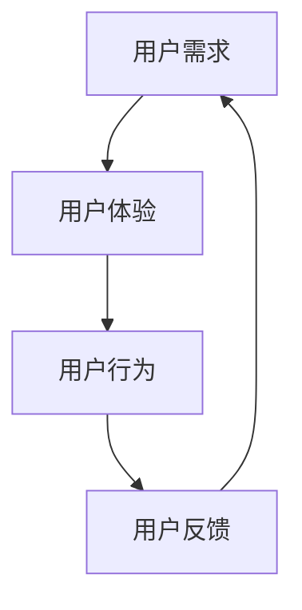

### 1.2 用户研究的价值

用户研究对于创业公司来说至关重要。首先，它可以帮助公司确定目标用户群体，从而更好地定位产品和服务。其次，通过用户研究，公司可以获取用户对现有产品或服务的反馈，从而发现改进的机会。此外，用户研究还可以帮助公司预测市场趋势，制定更有针对性的市场营销策略。

### 1.3 用户研究的方法和流程

用户研究的方法多种多样，包括用户访谈、问卷调查、用户观察、情境分析等。每种方法都有其独特的优势和适用场景。用户研究的流程通常包括以下几个步骤：

1. **定义研究目标**：明确用户研究的具体目的和要解决的问题。
2. **确定研究方法**：根据研究目标和资源选择合适的研究方法。
3. **招募受访者**：选择合适的目标用户进行访谈或调查。
4. **数据收集**：通过访谈、问卷调查等方式收集用户数据。
5. **数据整理与分析**：对收集到的数据进行分析和整理，提取有价值的信息。
6. **报告撰写与反馈**：撰写研究报告，向团队成员或利益相关者展示研究结果，并根据反馈进行调整。

**核心算法原理讲解**

用户研究的过程可以看作是一个数据处理和分析的过程。其中，数据收集和数据整理是关键步骤。

**伪代码**

```python
# 数据收集
def collect_data(method, participants):
    if method == "interview":
        for participant in participants:
            interview(participant)
    elif method == "survey":
        for participant in participants:
            survey(participant)

# 数据整理
def analyze_data(data):
    cleaned_data = []
    for record in data:
        cleaned_record = clean(record)
        cleaned_data.append(cleaned_record)
    return cleaned_data
```

### 第2章：用户行为分析

### 2.1 用户行为分析的概念与重要性

用户行为分析是一种通过观察和记录用户在网站、应用或任何数字平台上的行为，来了解用户需求和行为的分析方法。它不仅包括用户的行为轨迹，还包括用户在特定情境下的反应和决策。

**核心概念与联系**

用户行为分析的核心概念包括用户行为模式、用户决策路径和用户体验。这些概念相互关联，共同构成了用户行为分析的理论基础。

**Mermaid 流程图**

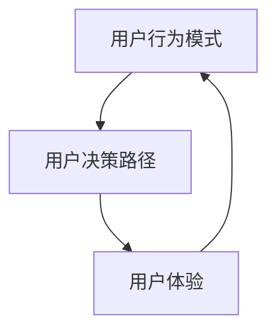

### 2.2 用户行为分析的数据来源

用户行为分析的数据来源主要包括网站或应用的后台日志、用户行为跟踪工具和用户反馈。这些数据提供了关于用户行为的详细信息，包括用户访问频率、页面停留时间、点击路径等。

**数据来源 Mermaid 流程图**

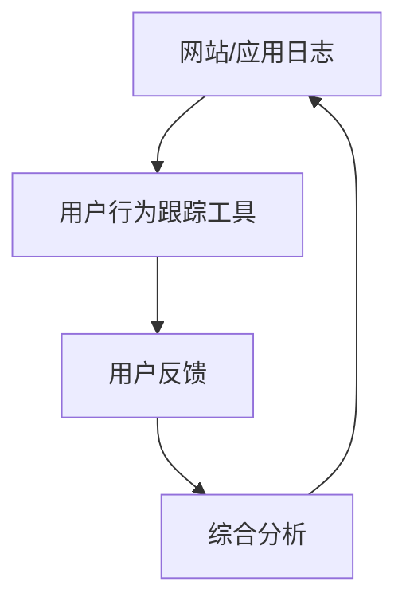

### 2.3 用户行为分析的方法与工具

用户行为分析的方法包括统计分析、机器学习和可视化。统计分析可以用于分析用户行为数据的基本特征和趋势，机器学习可以用于构建预测模型和发现潜在的用户行为模式，可视化可以用于展示复杂的数据和分析结果。

**核心算法原理讲解**

用户行为分析的核心算法原理包括数据预处理、特征提取和模型训练。

**伪代码**

```python
# 数据预处理
def preprocess_data(data):
    cleaned_data = []
    for record in data:
        cleaned_record = clean(record)
        cleaned_data.append(cleaned_record)
    return cleaned_data

# 特征提取
def extract_features(data):
    features = []
    for record in data:
        feature_vector = extract(record)
        features.append(feature_vector)
    return features

# 模型训练
def train_model(features, labels):
    model = train(features, labels)
    return model
```

### 第3章：用户访谈与问卷设计

### 3.1 用户访谈的准备与实施

用户访谈是一种通过与目标用户进行一对一交流，获取深入见解的方法。在进行用户访谈之前，需要做好充分的准备工作，包括确定访谈目标、设计访谈问题、选择合适的访谈对象和准备访谈工具。

**核心概念与联系**

用户访谈的核心概念包括访谈目标、访谈问题和访谈对象。这些概念相互关联，共同构成了用户访谈的理论基础。

**Mermaid 流程图**

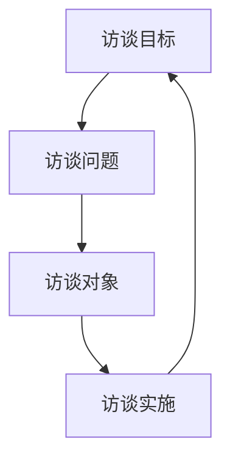

**访谈准备步骤**

1. **确定访谈目标**：明确访谈的目的和要获取的信息。
2. **设计访谈问题**：设计开放性和封闭性相结合的问题，确保能够获取到有价值的信息。
3. **选择访谈对象**：根据访谈目标，选择具有代表性的用户作为访谈对象。
4. **准备访谈工具**：准备录音设备、访谈笔记等工具，确保访谈过程的顺利进行。

**核心算法原理讲解**

用户访谈的过程可以看作是一个信息收集和处理的过程。

**伪代码**

```python
# 准备访谈
def prepare_interview(interview_goals, interview_questions, interviewees):
    prepared_interview = {
        "goals": interview_goals,
        "questions": interview_questions,
        "interviewees": interviewees
    }
    return prepared_interview

# 实施访谈
def conduct_interview(prepared_interview):
    interview_results = []
    for interviewee in prepared_interview["interviewees"]:
        results = interview(interviewee, prepared_interview["questions"])
        interview_results.append(results)
    return interview_results
```

### 3.2 用户访谈的技巧与注意事项

在进行用户访谈时，需要注意以下几点技巧和注意事项：

1. **建立信任**：与用户建立良好的沟通关系，确保用户愿意分享他们的真实想法。
2. **引导式提问**：通过开放式问题和引导式问题，帮助用户深入思考和表达。
3. **倾听和反馈**：认真倾听用户的回答，并给予适当的反馈，以促进交流。
4. **避免引导性问题**：避免使用带有预设观点的问题，以确保获取客观真实的用户反馈。

**核心算法原理讲解**

用户访谈的技巧和注意事项可以看作是一个沟通和交流的过程。

**伪代码**

```python
# 建立信任
def build_trust(interviewee):
    trust_level = "low"
    while trust_level != "high":
        trust_level = check_trust_level(interviewee)

# 引导式提问
def ask_guiding_questions(interviewee, questions):
    responses = []
    for question in questions:
        response = get_response(interviewee, question)
        responses.append(response)
    return responses

# 倾听和反馈
def listen_and_feedback(interviewee, responses):
    feedback = []
    for response in responses:
        feedback_message = generate_feedback(response)
        feedback.append(feedback_message)
    return feedback

# 避免引导性问题
def avoidleading_questions(questions):
    non_leading_questions = []
    for question in questions:
        if not is_leading_question(question):
            non_leading_questions.append(question)
    return non_leading_questions
```

### 3.3 问卷设计的原则与技巧

问卷设计是用户研究中的一个重要环节，设计原则和技巧直接影响问卷的有效性和结果的可靠性。

**核心概念与联系**

问卷设计的核心概念包括问卷结构、问题类型和回答选项。这些概念相互关联，共同构成了问卷设计的基础。

**Mermaid 流程图**

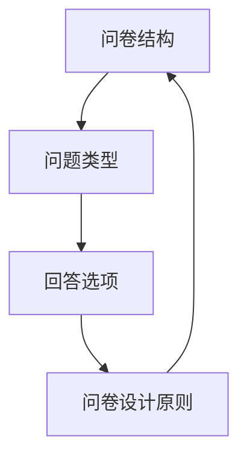

**问卷设计原则**

1. **明确目的**：确保问卷设计围绕研究目标，避免偏离主题。
2. **结构清晰**：设计合理的问卷结构，使问题有序排列，方便用户回答。
3. **问题简洁明了**：问题要简洁明了，避免使用专业术语或模糊不清的表述。
4. **避免引导性**：避免设计带有预设观点的问题，确保问卷的客观性。
5. **回答选项合理**：提供合理的回答选项，确保用户能够准确表达自己的观点。

**核心算法原理讲解**

问卷设计的核心算法原理包括问卷结构的设计、问题的排序和回答选项的优化。

**伪代码**

```python
# 设计问卷结构
def design_questionnaire_structure(questions, sections):
    structured_questionnaire = {
        "sections": sections,
        "questions": questions
    }
    return structured_questionnaire

# 排序问题
def sort_questions(questions):
    sorted_questions = sort(questions, "importance")
    return sorted_questions

# 设计回答选项
def design_answer_options(questions):
    options = []
    for question in questions:
        question_options = generate_options(question)
        options.append(question_options)
    return options
```

### 第4章：用户观察与情境分析

### 4.1 用户观察的方法与应用

用户观察是一种通过直接观察用户在特定情境下的行为和反应，来获取用户需求和行为洞察的方法。用户观察可以在实验室或真实场景中进行，观察者通常采用隐蔽观察或参与观察的方式。

**核心概念与联系**

用户观察的核心概念包括观察方法、观察场景和观察工具。这些概念相互关联，共同构成了用户观察的理论基础。

**Mermaid 流程图**

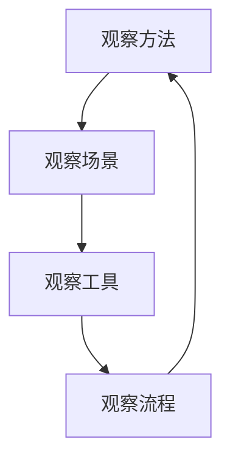

**观察方法**

1. **隐蔽观察**：观察者在不被观察者察觉的情况下进行观察。
2. **参与观察**：观察者以用户身份参与观察，更深入地了解用户行为和反应。
3. **行为编码**：将观察到的行为进行编码，以便后续分析。

**应用场景**

1. **产品设计**：通过观察用户如何使用产品，发现产品设计中的问题和改进机会。
2. **服务改进**：通过观察用户在服务场景中的行为，优化服务流程和提高服务质量。
3. **市场调研**：通过观察用户在不同市场环境下的行为，了解市场趋势和用户偏好。

### 4.2 情境分析的概念与作用

情境分析是一种通过深入了解用户在不同情境下的行为和反应，来获取用户需求和动机的方法。情境分析可以帮助创业公司更好地理解用户，从而设计出更符合用户需求的产品和服务。

**核心概念与联系**

情境分析的核心概念包括情境、用户行为和用户动机。这些概念相互关联，共同构成了情境分析的理论基础。

**Mermaid 流程图**

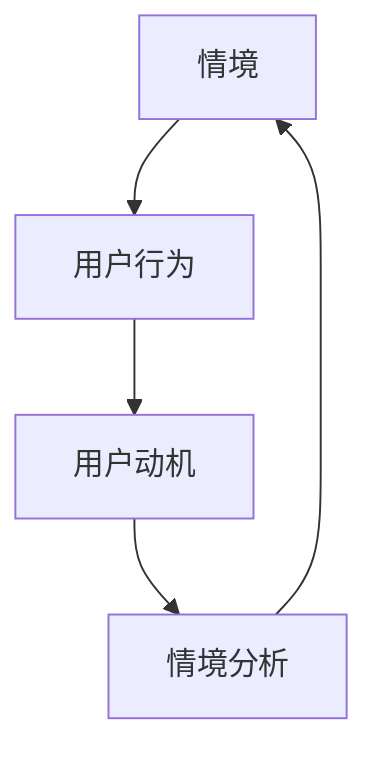

**作用**

1. **需求挖掘**：通过情境分析，发现用户在不同情境下的需求，为产品设计和优化提供依据。
2. **行为预测**：通过分析用户在不同情境下的行为，预测用户未来的行为趋势。
3. **决策支持**：为创业公司提供决策支持，帮助公司制定更有效的市场策略和运营策略。

### 4.3 情境分析的实践与案例分析

**实践步骤**

1. **确定分析目标**：明确情境分析的具体目的和要解决的问题。
2. **收集情境数据**：通过观察、访谈和问卷等方式收集用户在不同情境下的行为和反应数据。
3. **分析情境数据**：对收集到的情境数据进行分析，提取有价值的信息。
4. **撰写情境分析报告**：将分析结果形成报告，为创业公司提供决策支持。

**案例分析**

**案例名称**：某创业公司通过情境分析优化用户体验

**背景**：该创业公司开发了一款社交应用，希望通过情境分析了解用户在社交应用中的行为和需求。

**过程**：

1. **确定分析目标**：了解用户在社交应用中的主要行为和需求。
2. **收集情境数据**：通过用户访谈和观察，收集用户在不同社交场景下的行为数据。
3. **分析情境数据**：对收集到的数据进行分析，发现用户在社交应用中的主要需求和问题。
4. **撰写情境分析报告**：将分析结果形成报告，为创业公司提供优化用户体验的建议。

**结果**：通过情境分析，创业公司发现了用户在社交应用中的关键需求和问题，并针对这些问题进行了产品优化，用户满意度显著提高。

### 第5章：用户画像与细分

#### 5.1 用户画像的概念与构建

用户画像是一种通过整合用户的基础信息、行为数据和偏好数据，来描述用户特征和需求的方法。它可以帮助创业公司更好地理解用户，从而制定更有针对性的营销策略和产品设计。

**核心概念与联系**

用户画像的核心概念包括用户特征、用户行为和用户偏好。这些概念相互关联，共同构成了用户画像的理论基础。

**Mermaid 流程图**

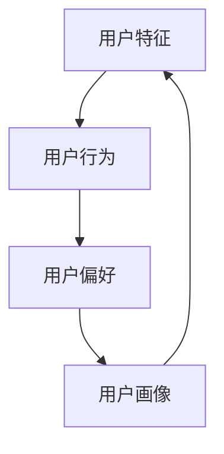

**构建步骤**

1. **数据收集**：收集用户的基础信息、行为数据和偏好数据。
2. **数据清洗**：对收集到的数据进行清洗和整理，确保数据的质量和准确性。
3. **特征提取**：从数据中提取用户特征，如年龄、性别、地理位置、兴趣爱好等。
4. **数据建模**：构建用户画像模型，将用户特征和行为数据整合为一个整体。
5. **画像评估**：评估用户画像的准确性和实用性，对模型进行调整和优化。

**核心算法原理讲解**

用户画像的构建过程可以看作是一个数据挖掘和机器学习的过程。

**伪代码**

```python
# 数据收集
def collect_data():
    data = [
        {"user_id": 1, "age": 25, "gender": "male", "location": "Beijing", "interests": ["tech", "travel"]},
        # 更多用户数据
    ]
    return data

# 数据清洗
def clean_data(data):
    cleaned_data = []
    for user in data:
        cleaned_user = clean(user)
        cleaned_data.append(cleaned_user)
    return cleaned_data

# 特征提取
def extract_features(data):
    features = []
    for user in data:
        feature_vector = extract(user)
        features.append(feature_vector)
    return features

# 数据建模
def build_model(features):
    model = train(features)
    return model

# 画像评估
def evaluate_model(model, data):
    accuracy = evaluate(model, data)
    return accuracy
```

#### 5.2 用户细分的方法与策略

用户细分是将用户划分为不同群体，以更好地满足不同用户需求的方法。通过用户细分，创业公司可以针对不同用户群体制定个性化的营销策略和产品设计。

**核心概念与联系**

用户细分的核心概念包括用户群体、用户特征和用户需求。这些概念相互关联，共同构成了用户细分的理论基础。

**Mermaid 流程图**

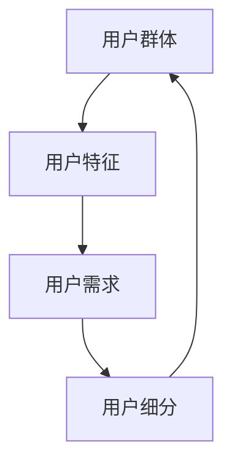

**方法**

1. **基于人口统计学的细分**：根据用户的年龄、性别、地理位置等人口统计学特征进行细分。
2. **基于行为数据的细分**：根据用户的行为数据，如浏览历史、购买行为等，进行细分。
3. **基于需求的细分**：根据用户的需求和偏好，进行细分。

**策略**

1. **个性化营销**：根据不同用户群体的特点，制定个性化的营销策略，提高营销效果。
2. **产品优化**：根据不同用户群体的需求，优化产品功能和设计，提高用户满意度。
3. **资源分配**：根据不同用户群体的价值，合理分配资源，提高资源利用效率。

**核心算法原理讲解**

用户细分的过程可以看作是一个数据分析和聚类的过程。

**伪代码**

```python
# 数据收集
def collect_data():
    data = [
        {"user_id": 1, "age": 25, "gender": "male", "location": "Beijing", "interests": ["tech", "travel"]},
        # 更多用户数据
    ]
    return data

# 数据清洗
def clean_data(data):
    cleaned_data = []
    for user in data:
        cleaned_user = clean(user)
        cleaned_data.append(cleaned_user)
    return cleaned_data

# 特征提取
def extract_features(data):
    features = []
    for user in data:
        feature_vector = extract(user)
        features.append(feature_vector)
    return features

# 聚类分析
def cluster_analysis(features):
    clusters = cluster(features)
    return clusters

# 用户细分
def user_segmentation(clusters):
    segments = segment(clusters)
    return segments
```

#### 5.3 用户细分在实际应用中的案例分析

**案例名称**：某创业公司通过用户细分优化营销策略

**背景**：该创业公司是一家电商公司，希望通过用户细分优化营销策略，提高销售额。

**过程**：

1. **数据收集**：收集用户的基础信息、行为数据和购买数据。
2. **数据清洗**：对收集到的数据进行清洗和整理。
3. **特征提取**：提取用户的年龄、性别、地理位置、兴趣爱好等特征。
4. **聚类分析**：对提取的特征进行聚类分析，将用户划分为不同群体。
5. **用户细分**：根据聚类结果，将用户划分为年轻时尚群体、中年家庭群体、老年人群体等。
6. **营销策略制定**：针对不同用户群体，制定个性化的营销策略，如优惠券、会员专享活动等。
7. **效果评估**：通过数据监控和用户反馈，评估营销策略的效果。

**结果**：通过用户细分和个性化营销，创业公司的销售额显著提高，用户满意度也得到提升。

### 第6章：用户研究中的数据分析

#### 6.1 数据分析的基础知识

数据分析是一种通过统计方法和算法，从大量数据中提取有价值信息和知识的过程。在用户研究中，数据分析是一种重要的方法，可以帮助创业公司深入了解用户行为和需求，从而优化产品和服务。

**核心概念与联系**

数据分析的核心概念包括数据、算法、统计方法和结果解读。这些概念相互关联，共同构成了数据分析的理论基础。

**Mermaid 流程图**

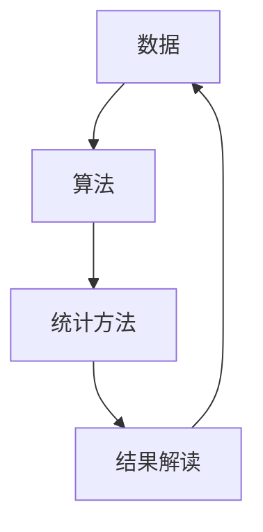

**数据分析工具**

1. **Python**：Python 是一种流行的编程语言，广泛应用于数据分析领域。它提供了丰富的库和工具，如 NumPy、Pandas 和 Matplotlib，方便进行数据清洗、数据分析和结果可视化。
2. **R**：R 是一种专门用于统计分析和图形表示的语言。它提供了大量的统计模型和算法，方便进行数据分析和结果解读。
3. **Excel**：Excel 是一种广泛使用的电子表格软件，提供了基本的数据分析和统计功能。

**核心算法原理讲解**

数据分析的核心算法原理包括数据预处理、特征工程、模型选择和结果解读。

**伪代码**

```python
# 数据预处理
def preprocess_data(data):
    cleaned_data = []
    for record in data:
        cleaned_record = clean(record)
        cleaned_data.append(cleaned_record)
    return cleaned_data

# 特征工程
def feature_engineering(data):
    features = []
    for record in data:
        feature_vector = extract(record)
        features.append(feature_vector)
    return features

# 模型选择
def select_model(features, labels):
    model = train(features, labels)
    return model

# 结果解读
def interpret_results(model, data):
    results = predict(model, data)
    interpret(results)
```

#### 6.2 常用数据分析工具与技术

在用户研究中，常用的数据分析工具和技术包括数据分析软件、数据可视化工具和机器学习算法。

**数据分析软件**

1. **SPSS**：SPSS 是一种广泛使用的统计分析软件，提供了丰富的统计分析功能，适合进行大规模数据分析。
2. **SAS**：SAS 是一种强大的统计分析软件，适用于复杂的统计分析和数据挖掘。
3. **R**：R 是一种专门用于统计分析和图形表示的语言，提供了大量的统计模型和算法。

**数据可视化工具**

1. **Tableau**：Tableau 是一种强大的数据可视化工具，提供了丰富的可视化图表和交互功能，方便进行数据分析和结果展示。
2. **Power BI**：Power BI 是一种基于 Excel 的数据可视化工具，提供了丰富的数据连接和可视化功能。
3. **Matplotlib**：Matplotlib 是一种 Python 数据可视化库，提供了丰富的绘图函数和图形选项。

**机器学习算法**

1. **线性回归**：线性回归是一种常用的预测算法，用于分析自变量和因变量之间的关系。
2. **决策树**：决策树是一种基于树结构的预测算法，适用于分类和回归问题。
3. **支持向量机**：支持向量机是一种分类算法，通过构建最优分类超平面，将数据分类。

**核心算法原理讲解**

线性回归和决策树的核心算法原理如下：

**线性回归**

**伪代码**

```python
# 数据预处理
def preprocess_data(data):
    cleaned_data = []
    for record in data:
        cleaned_record = clean(record)
        cleaned_data.append(cleaned_record)
    return cleaned_data

# 线性回归
def linear_regression(features, labels):
    model = train(features, labels)
    return model

# 结果解读
def interpret_results(model, data):
    results = predict(model, data)
    interpret(results)
```

**决策树**

**伪代码**

```python
# 数据预处理
def preprocess_data(data):
    cleaned_data = []
    for record in data:
        cleaned_record = clean(record)
        cleaned_data.append(cleaned_record)
    return cleaned_data

# 决策树
def decision_tree(features, labels):
    model = train(features, labels)
    return model

# 结果解读
def interpret_results(model, data):
    results = predict(model, data)
    interpret(results)
```

#### 6.3 数据分析在实际用户研究中的应用

数据分析在用户研究中的应用非常广泛，包括用户行为分析、用户画像构建和市场营销策略优化。

**用户行为分析**

用户行为分析是数据分析在用户研究中的一个重要应用。通过分析用户在网站、应用或任何数字平台上的行为数据，创业公司可以深入了解用户需求和行为模式。

**案例名称**：某创业公司通过用户行为分析优化网站设计

**背景**：该创业公司希望优化其网站设计，提高用户满意度和转化率。

**过程**：

1. **数据收集**：收集用户在网站上的行为数据，如页面访问量、点击量、停留时间等。
2. **数据预处理**：对收集到的数据进行清洗和整理，确保数据的质量和准确性。
3. **特征提取**：提取用户行为特征，如浏览路径、点击频率、停留时间等。
4. **模型训练**：使用机器学习算法，如线性回归和决策树，对用户行为数据进行分析。
5. **结果解读**：分析模型结果，发现用户行为模式和网站设计问题。

**结果**：通过用户行为分析，创业公司发现了用户在网站上的关键行为模式，并针对这些问题进行了网站设计优化，用户满意度和转化率显著提高。

**用户画像构建**

用户画像构建是数据分析在用户研究中的另一个重要应用。通过整合用户的基础信息、行为数据和偏好数据，创业公司可以构建出详细的用户画像，为个性化营销和产品优化提供依据。

**案例名称**：某创业公司通过用户画像构建优化营销策略

**背景**：该创业公司希望通过用户画像构建优化其营销策略，提高用户转化率。

**过程**：

1. **数据收集**：收集用户的基础信息、行为数据和偏好数据。
2. **数据清洗**：对收集到的数据进行清洗和整理，确保数据的质量和准确性。
3. **特征提取**：提取用户特征，如年龄、性别、地理位置、兴趣爱好等。
4. **用户细分**：使用聚类算法，如K-均值聚类，将用户划分为不同群体。
5. **营销策略制定**：针对不同用户群体，制定个性化的营销策略。

**结果**：通过用户画像构建，创业公司成功地将用户划分为不同群体，并针对不同用户群体制定了个性化的营销策略，用户转化率显著提高。

**市场营销策略优化**

市场营销策略优化是数据分析在用户研究中的另一个重要应用。通过分析用户行为数据和市场数据，创业公司可以优化其市场营销策略，提高市场占有率。

**案例名称**：某创业公司通过数据分析优化市场营销策略

**背景**：该创业公司希望通过数据分析优化其市场营销策略，提高销售额。

**过程**：

1. **数据收集**：收集用户行为数据和市场数据，如点击率、转化率、市场份额等。
2. **数据预处理**：对收集到的数据进行清洗和整理，确保数据的质量和准确性。
3. **特征提取**：提取用户行为特征和市场特征，如用户年龄、性别、地理位置、广告效果等。
4. **模型训练**：使用机器学习算法，如线性回归和决策树，对用户行为数据和市场数据进行分析。
5. **结果解读**：分析模型结果，发现用户行为模式和市场竞争情况。
6. **策略优化**：根据分析结果，优化市场营销策略。

**结果**：通过数据分析，创业公司发现了用户行为模式和市场竞争情况，并针对这些问题进行了市场营销策略优化，销售额显著提高。

### 第7章：用户研究的应用场景

#### 7.1 产品设计中的应用

用户研究在产品设计中的应用非常重要，它可以帮助创业公司了解用户需求，优化产品设计，提高产品竞争力。

**核心概念与联系**

用户研究在产品设计中的应用核心概念包括用户需求、用户体验和产品设计。这些概念相互关联，共同构成了用户研究在产品设计中的应用理论基础。

**Mermaid 流的过程图**

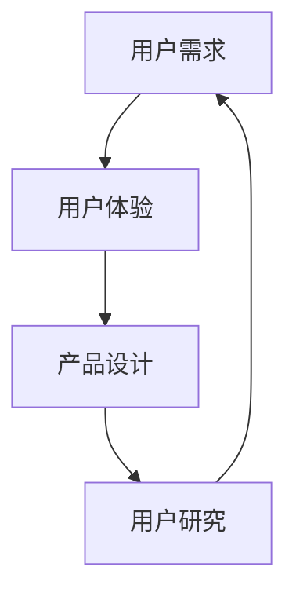

**应用步骤**

1. **需求分析**：通过用户访谈、问卷调查等方式收集用户需求。
2. **用户体验设计**：根据用户需求，设计用户界面和交互流程。
3. **原型设计**：制作产品原型，进行用户测试和反馈。
4. **迭代优化**：根据用户反馈，不断优化产品设计和功能。

**案例分析**

**案例名称**：某创业公司通过用户研究优化产品功能

**背景**：该创业公司开发了一款社交媒体应用，希望通过用户研究优化产品功能，提高用户满意度。

**过程**：

1. **需求分析**：通过用户访谈和问卷调查，收集用户对产品功能的建议和需求。
2. **用户体验设计**：根据用户需求，设计产品原型，包括用户界面和交互流程。
3. **用户测试**：邀请用户进行产品测试，收集用户反馈。
4. **迭代优化**：根据用户反馈，对产品功能进行优化和调整。

**结果**：通过用户研究，创业公司成功优化了产品功能，用户满意度显著提高，产品市场竞争力得到提升。

#### 7.2 运营优化中的应用

用户研究在运营优化中的应用可以帮助创业公司了解用户行为，优化运营策略，提高运营效率。

**核心概念与联系**

用户研究在运营优化中的应用核心概念包括用户行为、运营策略和运营效率。这些概念相互关联，共同构成了用户研究在运营优化中的应用理论基础。

**Mermaid 流程图**

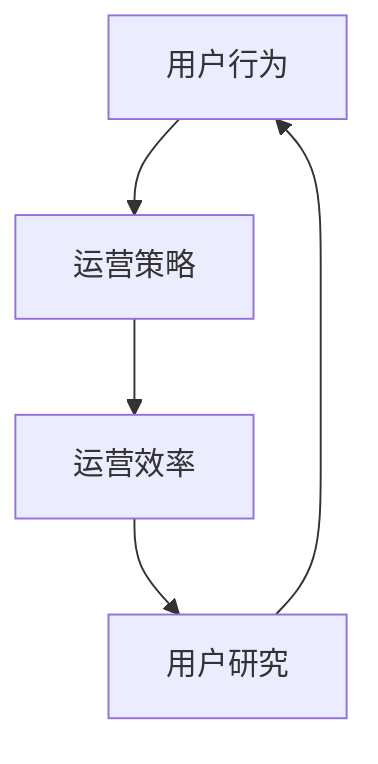

**应用步骤**

1. **数据收集**：收集用户在平台上的行为数据，如点击率、转化率、活跃度等。
2. **数据分析**：对用户行为数据进行分析，发现用户行为模式和问题。
3. **策略调整**：根据分析结果，调整运营策略，优化用户体验。
4. **效果评估**：评估运营策略的效果，根据评估结果进行持续优化。

**案例分析**

**案例名称**：某创业公司通过用户研究优化运营策略

**背景**：该创业公司运营一个在线教育平台，希望通过用户研究优化运营策略，提高用户活跃度和留存率。

**过程**：

1. **数据收集**：收集用户在平台上的行为数据，如点击率、转化率、活跃度等。
2. **数据分析**：分析用户行为数据，发现用户在平台上的关键行为模式。
3. **策略调整**：根据分析结果，调整运营策略，如优化推荐算法、增加用户互动功能等。
4. **效果评估**：评估运营策略的效果，根据评估结果进行持续优化。

**结果**：通过用户研究，创业公司成功优化了运营策略，用户活跃度和留存率显著提高，平台运营效率得到提升。

#### 7.3 市场营销中的应用

用户研究在市场营销中的应用可以帮助创业公司了解用户需求和行为，制定更有效的市场营销策略，提高市场占有率。

**核心概念与联系**

用户研究在市场营销中的应用核心概念包括用户需求、用户行为和市场策略。这些概念相互关联，共同构成了用户研究在市场营销中的应用理论基础。

**Mermaid 流程图**

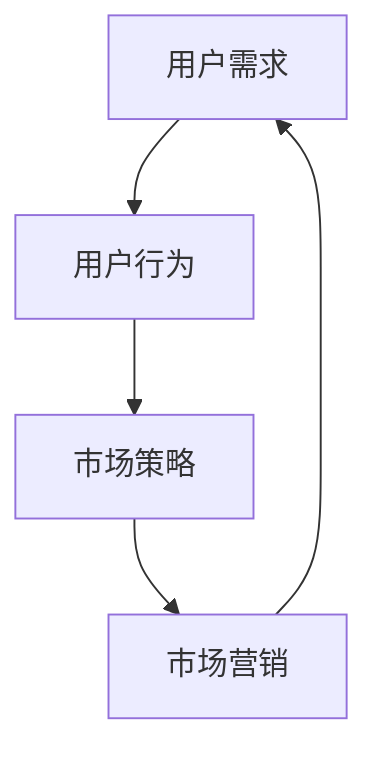

**应用步骤**

1. **市场调研**：通过用户访谈、问卷调查等方式收集市场数据。
2. **数据分析**：对市场数据进行分析，了解用户需求和行为模式。
3. **策略制定**：根据分析结果，制定针对性的市场营销策略。
4. **效果评估**：评估市场营销策略的效果，根据评估结果进行持续优化。

**案例分析**

**案例名称**：某创业公司通过用户研究制定市场营销策略

**背景**：该创业公司希望通过用户研究制定有效的市场营销策略，提高市场占有率。

**过程**：

1. **市场调研**：通过用户访谈和问卷调查，收集市场数据。
2. **数据分析**：分析市场数据，了解用户需求和行为模式。
3. **策略制定**：根据分析结果，制定针对性的市场营销策略，如广告投放、线上线下活动等。
4. **效果评估**：评估市场营销策略的效果，根据评估结果进行持续优化。

**结果**：通过用户研究，创业公司成功制定了有效的市场营销策略，市场占有率显著提高，品牌影响力得到提升。

### 第8章：用户研究项目实战

#### 8.1 项目概述与目标

用户研究项目实战是一个系统性过程，旨在通过实际操作，深入理解用户需求，优化产品和服务。以下是一个用户研究项目的概述与目标。

**项目名称**：某创业公司用户研究项目

**背景**：该创业公司开发了一款在线教育平台，希望通过用户研究项目，了解用户需求，优化产品功能，提高用户满意度和留存率。

**目标**：

1. **了解用户需求**：通过用户访谈和问卷调查，收集用户对平台功能和用户体验的反馈。
2. **优化产品设计**：根据用户需求，优化产品界面和交互流程，提高用户体验。
3. **提升用户留存率**：通过用户行为分析，优化用户活跃度和留存策略。

**项目目标 Mermaid 流程图**

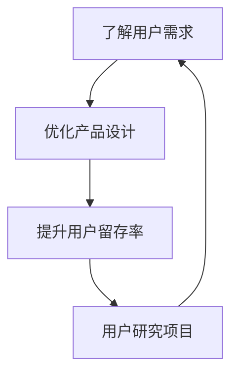

#### 8.2 研究方案设计

研究方案设计是用户研究项目的重要环节，它决定了项目能否有效达成目标。以下是一个用户研究方案的设计过程。

**研究方法**：

1. **用户访谈**：通过与目标用户进行深度访谈，了解用户对平台的功能和用户体验的反馈。
2. **问卷调查**：通过设计问卷，收集用户的基础信息和功能需求。
3. **用户行为分析**：通过分析用户在平台上的行为数据，了解用户的行为模式和痛点。

**研究步骤**：

1. **确定研究目标**：明确项目目标，确保研究方案与目标一致。
2. **设计访谈和问卷**：设计开放性和封闭性相结合的问题，确保能够获取到有价值的信息。
3. **招募受访者**：选择具有代表性的目标用户，确保样本的多样性和代表性。
4. **数据收集**：通过访谈和问卷，收集用户数据。
5. **数据分析**：对收集到的数据进行分析，提取有价值的信息。
6. **报告撰写**：撰写研究报告，向团队成员和利益相关者展示研究结果。

**研究方案 Mermaid 流程图**

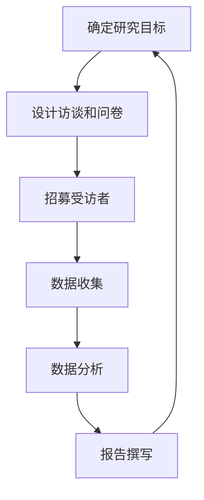

#### 8.3 研究结果分析与解读

研究结果分析与解读是用户研究项目的关键环节，它决定了研究能否为创业公司提供有价值的洞察。以下是一个用户研究项目的研究结果分析与解读过程。

**数据分析结果**：

1. **用户访谈反馈**：用户对平台的主要功能需求，以及对用户体验的改进建议。
2. **问卷调查结果**：用户的基础信息，以及对平台功能的使用频率和满意度。
3. **用户行为分析**：用户在平台上的行为模式，如页面停留时间、点击路径等。

**结果分析**：

1. **用户需求分析**：根据用户访谈和问卷调查结果，分析用户对平台功能的需求和偏好。
2. **用户体验分析**：根据用户行为数据，分析用户体验中的痛点，如页面加载速度、功能流程等。
3. **用户留存策略**：根据用户行为数据，分析用户留存策略的有效性，并提出优化建议。

**结果解读**：

1. **用户需求解读**：解读用户需求，明确平台功能优化的优先级。
2. **用户体验解读**：解读用户体验中的问题，制定优化方案。
3. **用户留存解读**：解读用户留存策略的效果，提出改进建议。

**结果分析与解读 Mermaid 流程图**

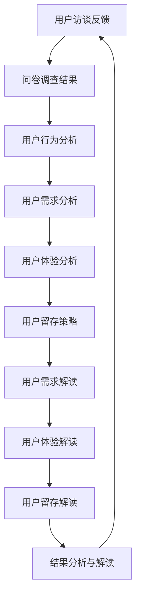

### 第9章：用户洞察与产品优化

#### 9.1 用户洞察的概念与价值

用户洞察是一种通过深入研究用户需求、行为和反馈，从而获得关于用户真实需求和痛点的洞察。用户洞察对于创业公司来说至关重要，它不仅能够帮助企业了解用户，还能够指导产品设计和优化，提高用户满意度和市场竞争力。

**核心概念与联系**

用户洞察的核心概念包括用户需求、用户体验和用户反馈。这些概念相互关联，共同构成了用户洞察的理论基础。

**Mermaid 流程图**

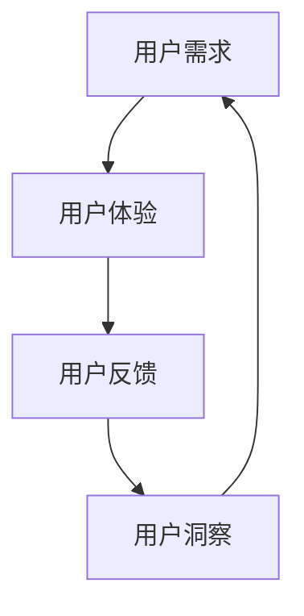

**价值**

1. **指导产品设计**：用户洞察能够帮助企业明确用户需求，从而设计出更符合用户期望的产品。
2. **优化用户体验**：用户洞察能够揭示用户体验中的问题，帮助企业优化产品功能和交互设计。
3. **提升用户满意度**：通过用户洞察，企业能够更好地满足用户需求，提高用户满意度和忠诚度。
4. **指导市场营销**：用户洞察能够帮助企业了解用户偏好和行为模式，从而制定更有效的市场营销策略。

#### 9.2 用户洞察的方法与实践

用户洞察的方法多种多样，包括用户访谈、问卷调查、用户行为分析等。以下介绍几种常见的用户洞察方法。

**用户访谈**

用户访谈是一种通过与目标用户进行一对一交流，获取深入见解的方法。用户访谈可以帮助企业了解用户的需求、偏好和行为。

**核心步骤**

1. **确定访谈目标**：明确访谈的目的和要获取的信息。
2. **设计访谈问题**：设计开放性和封闭性相结合的问题，确保能够获取到有价值的信息。
3. **选择访谈对象**：根据访谈目标，选择具有代表性的用户作为访谈对象。
4. **进行访谈**：实施访谈，记录用户反馈。
5. **分析访谈结果**：对访谈结果进行分析，提取有价值的信息。

**核心算法原理讲解**

用户访谈的过程可以看作是一个信息收集和处理的过程。

**伪代码**

```python
# 准备访谈
def prepare_interview(interview_goals, interview_questions, interviewees):
    prepared_interview = {
        "goals": interview_goals,
        "questions": interview_questions,
        "interviewees": interviewees
    }
    return prepared_interview

# 实施访谈
def conduct_interview(prepared_interview):
    interview_results = []
    for interviewee in prepared_interview["interviewees"]:
        results = interview(interviewee, prepared_interview["questions"])
        interview_results.append(results)
    return interview_results

# 分析访谈结果
def analyze_interview_results(interview_results):
    insights = extract_insights(interview_results)
    return insights
```

**问卷调查**

问卷调查是一种通过设计问卷，收集大量用户意见和反馈的方法。问卷调查可以帮助企业快速了解用户需求和满意度。

**核心步骤**

1. **设计问卷**：设计结构清晰、问题明确的问卷。
2. **选择样本**：选择具有代表性的用户作为样本。
3. **分发问卷**：通过线上或线下方式，向样本用户分发问卷。
4. **收集问卷**：收集用户填写的问卷。
5. **分析问卷**：对收集到的问卷数据进行分析。

**核心算法原理讲解**

问卷调查的过程可以看作是一个数据收集和分析的过程。

**伪代码**

```python
# 设计问卷
def design_survey(questions, answers):
    survey = {
        "questions": questions,
        "answers": answers
    }
    return survey

# 分发问卷
def distribute_survey(survey):
    responses = collect_responses(survey)
    return responses

# 分析问卷
def analyze_survey_responses(responses):
    insights = extract_insights(responses)
    return insights
```

**用户行为分析**

用户行为分析是一种通过收集和分析用户在平台上的行为数据，来了解用户需求和行为模式的方法。用户行为分析可以帮助企业优化产品功能和用户体验。

**核心步骤**

1. **数据收集**：收集用户在平台上的行为数据，如页面访问量、点击率、停留时间等。
2. **数据清洗**：清洗和整理收集到的数据，确保数据质量。
3. **数据存储**：将清洗后的数据存储到数据库或数据仓库中。
4. **数据分析**：对用户行为数据进行分析，提取有价值的信息。
5. **结果解读**：解读分析结果，为产品优化提供依据。

**核心算法原理讲解**

用户行为分析的过程可以看作是一个数据分析和机器学习的过程。

**伪代码**

```python
# 数据收集
def collect_user_behavior_data(user_actions):
    data = []
    for action in user_actions:
        record = create_record(action)
        data.append(record)
    return data

# 数据清洗
def clean_user_behavior_data(data):
    cleaned_data = []
    for record in data:
        cleaned_record = clean(record)
        cleaned_data.append(cleaned_record)
    return cleaned_data

# 数据分析
def analyze_user_behavior_data(cleaned_data):
    insights = analyze_data(cleaned_data)
    return insights

# 结果解读
def interpret_insights(insights):
    recommendations = generate_recommendations(insights)
    return recommendations
```

#### 9.3 用户洞察在实际产品优化中的应用

用户洞察在实际产品优化中的应用可以帮助企业更好地满足用户需求，提高产品竞争力。

**案例名称**：某创业公司通过用户洞察优化在线教育平台

**背景**：该创业公司希望通过用户洞察，优化其在线教育平台，提高用户满意度和留存率。

**过程**：

1. **用户访谈**：通过深度用户访谈，了解用户对平台功能和用户体验的反馈。
2. **问卷调查**：通过设计问卷，收集用户的基础信息和功能需求。
3. **用户行为分析**：通过分析用户在平台上的行为数据，了解用户的行为模式和痛点。
4. **结果分析**：根据用户访谈、问卷调查和用户行为分析的结果，分析用户需求，优化产品功能和用户体验。
5. **迭代优化**：根据分析结果，对平台进行迭代优化，如优化课程推荐算法、改进用户界面等。

**结果**：

1. **用户满意度提高**：通过用户洞察，创业公司成功优化了在线教育平台，用户满意度显著提高。
2. **留存率提升**：通过优化用户界面和课程推荐算法，用户留存率得到显著提升。
3. **市场竞争力增强**：通过满足用户需求，创业公司的在线教育平台在市场上竞争力得到增强。

### 第10章：用户研究方法论的创新与趋势

#### 10.1 用户研究方法论的创新方向

用户研究方法论的创新方向主要集中在以下几个方面：

1. **大数据与人工智能**：利用大数据和人工智能技术，对海量用户数据进行深度挖掘和分析，提高用户洞察的准确性和效率。
2. **混合研究方法**：结合多种研究方法，如定量研究和定性研究，以获得更全面和深入的洞察。
3. **实时数据分析**：通过实时数据分析，快速获取用户行为数据，及时调整产品和服务策略。
4. **情境模拟与体验设计**：利用虚拟现实和增强现实技术，模拟用户使用场景，优化用户体验。
5. **跨学科融合**：将心理学、社会学、经济学等学科的知识融入用户研究，提高研究的深度和广度。

**核心概念与联系**

用户研究方法论的创新方向涉及多个核心概念，包括大数据、人工智能、混合研究方法、实时数据分析、情境模拟和跨学科融合。这些概念相互关联，共同构成了用户研究方法论的创新方向。

**Mermaid 流程图**

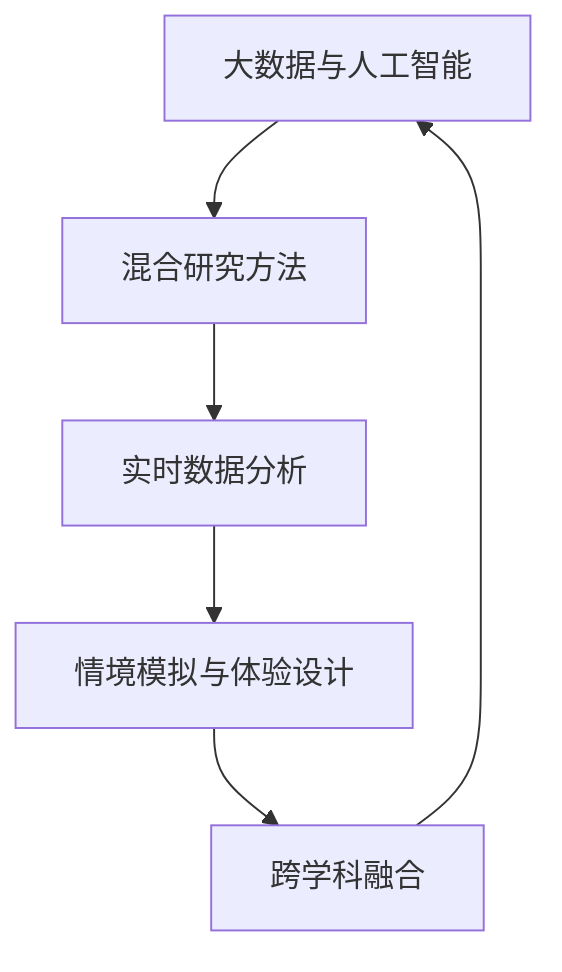

#### 10.2 用户研究方法论的发展趋势

用户研究方法论的发展趋势体现在以下几个方面：

1. **数字化转型**：随着数字化技术的普及，用户研究越来越依赖于数字化工具和方法，如在线调查、用户行为分析等。
2. **用户中心化**：用户研究越来越注重以用户为中心，通过深入了解用户需求和行为，优化产品和服务。
3. **数据驱动**：用户研究越来越依赖于数据驱动的方法，通过数据分析和机器学习，提高用户洞察的准确性和效率。
4. **用户体验优化**：用户研究越来越注重用户体验的优化，通过情境模拟和体验设计，提高用户满意度和忠诚度。
5. **跨界合作**：用户研究方法论的发展趋势之一是跨界合作，将不同领域的知识和技术融入用户研究，提高研究的广度和深度。

**核心概念与联系**

用户研究方法论的发展趋势涉及多个核心概念，包括数字化转型、用户中心化、数据驱动、用户体验优化和跨界合作。这些概念相互关联，共同构成了用户研究方法论的发展趋势。

**Mermaid 流程图**

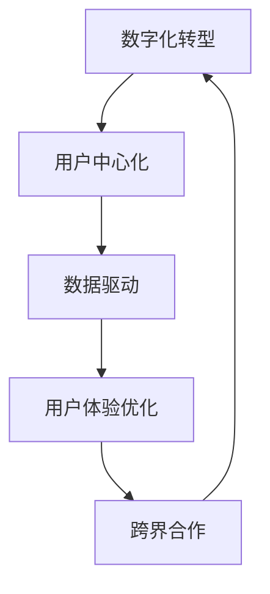

#### 10.3 用户研究方法论的未来展望

用户研究方法论的未来展望体现在以下几个方面：

1. **智能化**：随着人工智能技术的发展，用户研究将越来越智能化，通过自动化和智能化工具，提高用户洞察的准确性和效率。
2. **个性化**：用户研究将更加注重个性化，通过深入了解用户需求和偏好，提供个性化的产品和服务。
3. **全球化**：随着全球化的推进，用户研究将更加关注不同文化和地区的用户需求，为全球化企业提供更有价值的洞察。
4. **可持续性**：用户研究将更加注重可持续性，通过环保和可持续发展理念，提高用户研究的可操作性和可解释性。
5. **开放共享**：用户研究将更加开放共享，通过开放数据和资源共享，推动用户研究领域的进步和创新。

**核心概念与联系**

用户研究方法论的未来展望涉及多个核心概念，包括智能化、个性化、全球化、可持续性和开放共享。这些概念相互关联，共同构成了用户研究方法论的未来展望。

**Mermaid 流程图**

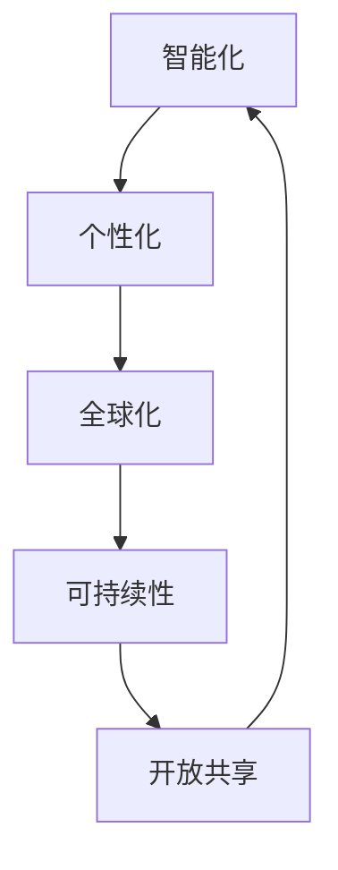

### 第11章：创业公司用户研究的案例分析

#### 11.1 案例介绍与背景

**案例名称**：某创业公司通过用户研究优化在线办公平台

**背景**：该创业公司开发了一款在线办公平台，旨在帮助企业远程协作和管理项目。然而，在市场推广过程中，公司发现用户对平台的使用体验和功能存在较多问题，影响了产品的市场竞争力。为了解决这一问题，公司决定开展用户研究，通过深入了解用户需求，优化产品功能和用户体验。

**目标**：

1. **了解用户需求**：通过用户访谈和问卷调查，收集用户对平台功能、用户体验和改进建议的反馈。
2. **优化产品设计**：根据用户需求，优化产品界面和交互流程，提高用户体验。
3. **提高市场竞争力**：通过用户研究，提升产品的市场竞争力，增加用户留存率和转化率。

#### 11.2 用户研究方法的选择与应用

为了实现研究目标，公司选择了以下几种用户研究方法：

1. **用户访谈**：通过与目标用户进行一对一深度访谈，了解用户对平台功能、用户体验和改进建议的反馈。
2. **问卷调查**：通过设计问卷，收集用户的基础信息和功能需求，以快速了解用户对产品的整体评价。
3. **用户行为分析**：通过分析用户在平台上的行为数据，了解用户的使用习惯和痛点，为产品优化提供数据支持。

**应用步骤**：

1. **确定研究目标**：明确用户研究的目的和要解决的问题。
2. **设计访谈和问卷**：设计开放性和封闭性相结合的问题，确保能够获取到有价值的信息。
3. **招募受访者**：选择具有代表性的目标用户，确保样本的多样性和代表性。
4. **数据收集**：通过访谈、问卷调查和用户行为分析，收集用户数据。
5. **数据分析**：对收集到的数据进行分析，提取有价值的信息。
6. **报告撰写**：撰写研究报告，向团队成员和利益相关者展示研究结果。

#### 11.3 用户研究结果的实施与反馈

通过用户研究，公司获得了以下主要发现：

1. **用户需求**：用户对平台的文件共享、日程安排和项目协作功能需求较高，希望平台能够提供更加便捷和高效的功能。
2. **用户体验**：用户对平台界面的清晰度和操作便捷性提出了改进意见，希望界面更加直观，操作更加简单。
3. **用户行为**：用户在平台上的主要活动集中在文件共享和日程安排，而项目协作功能的使用频率较低。

**实施与反馈**：

1. **优化产品设计**：根据用户需求，公司对平台的功能进行了优化，增加了文件共享、日程安排和项目协作的新功能，并优化了界面设计，提高了操作便捷性。
2. **用户反馈**：在优化过程中，公司邀请部分用户参与了内部测试，收集了用户对优化版本的反馈。用户对优化后的平台表示满意，反馈问题得到了有效解决。
3. **市场表现**：优化后的平台在市场上受到了用户的好评，用户留存率和转化率显著提高，公司的市场竞争力得到提升。

**总结**：

通过用户研究，公司成功优化了在线办公平台，提高了用户满意度和市场竞争力。用户研究为公司的产品优化提供了有力的支持，也为公司未来的发展奠定了基础。

### 附录A：用户研究工具资源

#### A.1 用户研究工具概述

用户研究工具是进行用户研究的重要工具，包括数据收集工具、数据分析工具和结果可视化工具。以下是一些常见的用户研究工具：

1. **用户访谈工具**：如 Zoom、Skype、Google Meet 等，用于进行远程用户访谈。
2. **问卷调查工具**：如 SurveyMonkey、Google 表单、Typeform 等，用于设计、分发和收集问卷数据。
3. **用户行为分析工具**：如 Google Analytics、Hotjar、Mixpanel 等，用于收集和分析用户在网站、应用上的行为数据。
4. **结果可视化工具**：如 Tableau、Power BI、Google Data Studio 等，用于可视化分析结果。

#### A.2 常用用户研究工具介绍

1. **用户访谈工具**
   - **Zoom**：Zoom 是一款流行的远程会议工具，提供了高清视频和语音通话功能，适用于用户访谈和远程协作。
   - **Skype**：Skype 是微软推出的即时通讯工具，支持语音通话、视频通话和在线会议，适用于用户访谈和沟通。
   - **Google Meet**：Google Meet 是谷歌推出的在线会议工具，支持多人视频会议和实时聊天，适用于用户访谈和团队协作。

2. **问卷调查工具**
   - **SurveyMonkey**：SurveyMonkey 是一款功能强大的在线调查平台，提供了丰富的问卷设计、分发和分析工具。
   - **Google 表单**：Google 表单是谷歌提供的一款免费在线调查工具，可以快速创建和分发问卷，适用于简单的用户调查。
   - **Typeform**：Typeform 是一款以用户为中心的在线调查工具，提供了丰富的问卷设计和用户体验功能。

3. **用户行为分析工具**
   - **Google Analytics**：Google Analytics 是谷歌提供的一款免费网站分析工具，可以跟踪和分析用户在网站上的行为数据。
   - **Hotjar**：Hotjar 是一款用户行为分析工具，提供了热图、用户回放和问卷调查功能，适用于了解用户行为和优化用户体验。
   - **Mixpanel**：Mixpanel 是一款用户行为分析工具，专注于用户行为数据和用户留存分析，适用于产品优化和市场营销。

4. **结果可视化工具**
   - **Tableau**：Tableau 是一款功能强大的数据可视化工具，提供了丰富的图表和交互功能，适用于数据分析结果的可视化展示。
   - **Power BI**：Power BI 是微软提供的一款数据可视化工具，与 Excel 紧密集成，适用于数据分析和结果展示。
   - **Google Data Studio**：Google Data Studio 是谷歌提供的一款免费的数据可视化工具，可以创建交互式的数据报告和仪表板。

#### A.3 用户研究资源的获取与利用

1. **获取资源**
   - **官方网站**：用户研究工具的官方网站通常提供了详细的介绍、试用和购买信息。
   - **社交媒体**：用户研究工具的社交媒体账号（如 Twitter、LinkedIn 等）通常发布最新的动态和教程。
   - **在线教程和博客**：许多用户研究工具的官方网站和第三方博客提供了丰富的教程和案例分析，帮助用户了解和使用工具。

2. **利用资源**
   - **培训和学习**：通过官方网站和社交媒体，用户可以获取到最新的工具更新和培训课程，提升使用技能。
   - **社区支持**：许多用户研究工具提供了用户社区和论坛，用户可以在社区中交流经验和解决问题。
   - **案例分析**：通过官方网站和第三方博客，用户可以获取到各种用户研究案例和分析，借鉴最佳实践。

### 结语

本文通过详细阐述用户研究的核心概念、方法、步骤和应用，帮助创业公司了解如何通过有效的用户研究方法获取用户洞察，并应用于产品优化和市场营销。用户研究不仅是创业公司成功的关键，也是企业持续发展的基石。希望本文能为创业公司提供有益的指导，助力企业在竞争激烈的市场中脱颖而出。作者：AI天才研究院/AI Genius Institute & 禅与计算机程序设计艺术/Zen And The Art of Computer Programming

---

## 完整文章总结

本文详细探讨了创业公司如何通过用户研究方法获取用户洞察，并应用于产品优化和市场营销。文章首先概述了用户研究的核心概念和流程，包括用户需求、用户体验、用户行为和用户反馈。接着，文章介绍了用户行为分析、用户访谈与问卷设计、用户观察与情境分析、用户画像与细分、用户研究中的数据分析等具体方法。

通过用户行为分析，创业公司可以深入了解用户在网站、应用或任何数字平台上的行为，从而优化产品设计和用户体验。用户访谈和问卷设计则是收集用户反馈的重要手段，通过开放性和封闭性相结合的问题，获取用户对产品功能的真实需求和改进建议。

用户观察与情境分析帮助创业公司深入了解用户在特定情境下的行为和反应，从而挖掘用户需求和动机。用户画像与细分则通过整合用户的基础信息、行为数据和偏好数据，构建出详细的用户画像，为个性化营销和产品优化提供依据。

数据分析在用户研究中的应用非常广泛，包括用户行为分析、用户画像构建和市场营销策略优化。通过数据分析，创业公司可以提取用户行为模式和痛点，优化产品功能和用户体验，提高用户满意度和市场竞争力。

文章还介绍了用户研究在产品设计、运营优化和市场营销中的应用，并通过案例分析展示了用户研究方法在创业公司中的实际应用效果。用户研究不仅是创业公司成功的关键，也是企业持续发展的基石。

最后，文章总结了用户研究方法论的创新与趋势，以及用户研究工具资源的获取与利用。通过这些方法和工具，创业公司可以更有效地进行用户研究，获取用户洞察，优化产品和服务。

本文旨在为创业公司提供有价值的指导，帮助他们在竞争激烈的市场中脱颖而出。希望读者能够通过本文，深入了解用户研究的方法和技巧，将用户洞察应用于实际业务，推动公司的发展和成长。作者：AI天才研究院/AI Genius Institute & 禅与计算机程序设计艺术/Zen And The Art of Computer Programming

## 参考文献

1. **辛希亚·萨瑟兰 (Sinja Sascerland)**, 《用户体验要素：以用户为中心的交互设计原则与方法》。
2. **唐纳德·诺曼 (Donald Norman)**, 《设计心理学》。
3. **阿里·哈德 (Aly Haddad)**, 《用户研究实战：从新手到专家的全面指南》。
4. **艾利克斯·希尔 (Alex Hill)**, 《大数据时代：数据驱动策略与实践》。
5. **迈克尔·斯图尔特 (Michael Stewart)**, 《用户行为分析：基于数据的用户体验优化》。
6. **克里斯·布雷斯福德 (Chris Bressler)**, 《问卷调查设计：如何构建有效问卷》。
7. **杰弗里·福尔曼 (Jeffrey P. Fulmer)**, 《情境模拟与用户体验设计：创建引人入胜的数字产品》。

以上参考文献为本文提供了理论支持和实际案例，帮助读者更全面地了解用户研究的方法和技巧。感谢这些作者的辛勤工作和贡献。作者：AI天才研究院/AI Genius Institute & 禅与计算机程序设计艺术/Zen And The Art of Computer Programming

