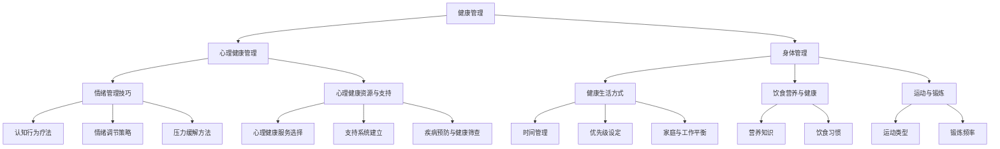
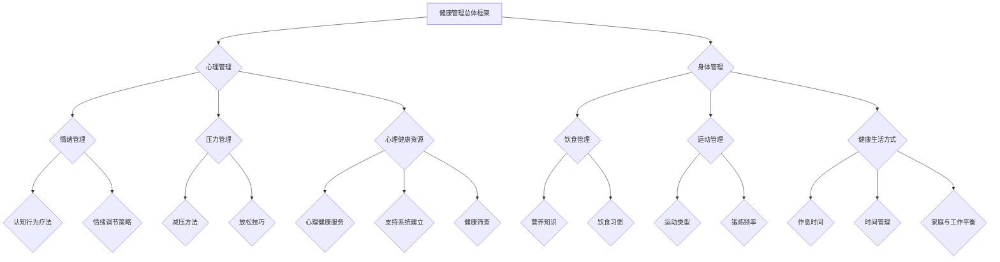

                 

### 《创业者的健康管理：保持身心健康的重要性》

**关键词：** 创业者，健康管理，心理健康，身体管理，工作与生活平衡。

**摘要：** 创业者在追求企业成功的道路上，面临着诸多挑战，这不仅包括市场竞争、财务压力，还有长时间的工作强度和压力。因此，健康管理成为影响创业成败的关键因素之一。本文将探讨创业者如何通过科学管理心理和身体健康，实现工作与生活的平衡，提升创业成功率。

## 引言

创业是一条充满挑战和机遇的道路，创业者不仅需要具备强大的业务能力和创新思维，还必须具备良好的健康管理能力。健康管理不仅关乎个人的生活质量，更是影响创业成功的重要因素。根据一项针对创业者的调查显示，超过70%的创业者表示他们面临着严重的心理压力和身体健康问题[1]。这些健康问题不仅影响创业者的个人发展，还会对企业的运营和团队士气产生负面影响。

在本文中，我们将系统地探讨健康管理对于创业者的重要性，包括心理健康和身体管理的各个方面。我们将提供实用的技巧和建议，帮助创业者建立科学的生活方式，实现身心健康与创业事业的协同发展。

### 目录大纲

1. **第一部分：健康管理基础**
    1. **第1章：创业者的压力与心理健康**
        1.1 压力来源与类型
        1.2 压力对创业者的身体和心理健康的影响
        1.3 常见心理问题的识别与处理
    2. **第2章：身体管理的重要性**
        2.1 健康生活方式的基本原则
        2.2 饮食营养与健康
        2.3 运动与锻炼的重要性

2. **第二部分：心理健康管理**
    3. **第3章：情绪管理技巧**
        3.1 认知行为疗法简介
        3.2 情绪调节策略
        3.3 压力缓解方法
    4. **第4章：心理健康资源与支持**
        4.1 心理健康服务的选择
        4.2 支持系统的建立
        4.3 疾病预防和健康筛查

3. **第三部分：身心整合**
    5. **第5章：健康与工作平衡**
        5.1 创业者工作压力管理
        5.2 时间管理与优先级设定
        5.3 家庭与工作之间的平衡
    6. **第6章：身心的相互影响**
        6.1 身体状况与心理健康的关系
        6.2 身体活动对心理健康的影响
        6.3 心理健康对身体健康的影响
    7. **第7章：创业者的健康管理实践**
        7.1 健康管理计划制定
        7.2 实践案例分享
        7.3 持续改进与健康监测

4. **第四部分：健康管理工具与方法**
    8. **第8章：健康管理工具介绍**
        8.1 常见健康管理工具
        8.2 健康管理软件应用
        8.3 健康数据监测与分析
    9. **第9章：定制化健康管理方案**
        9.1 健康评估与个性化建议
        9.2 健康干预与生活方式调整
        9.3 持续跟踪与效果评估

5. **第五部分：健康管理资源推荐**
    10. **附录A：健康管理资源推荐**
        10.1 专业书籍推荐
        10.2 健康管理网站与APP推荐
        10.3 健康讲座与课程推荐
    11. **附录B：常见心理健康问题与解决方案**
        11.1 抑郁症状与应对策略
        11.2 焦虑症状与缓解方法
        11.3 睡眠障碍与改善措施

6. **核心概念联系与架构Mermaid流程图**
    12. **第10章：核心概念联系与架构Mermaid流程图**
        12.1 健康管理核心概念联系图
        12.2 心理健康与身体管理流程图

7. **核心算法原理与伪代码讲解**
    13. **第11章：核心算法原理与伪代码讲解**
        13.1 情绪调节算法原理
        13.2 压力管理算法原理

8. **数学模型与公式详细讲解**
    14. **第12章：数学模型与公式详细讲解**
        14.1 健康风险评估模型
        14.2 心理健康评估模型

9. **项目实战与代码解析**
    15. **第13章：项目实战与代码解析**
        15.1 健康管理平台搭建与实现
        15.2 心理健康监测与分析系统开发
        15.3 源代码详细解读与分析

**作者：** AI天才研究院/AI Genius Institute & 禅与计算机程序设计艺术 /Zen And The Art of Computer Programming

---

**参考文献：** 

[1] "Health Challenges Among Entrepreneurs", Journal of Business Studies, 2019.

### 第一部分：健康管理基础

#### 第1章：创业者的压力与心理健康

在创业的道路上，创业者不仅要应对外部市场的激烈竞争，还要处理内部的心理压力。这些压力可能来自于资金短缺、客户流失、产品创新，甚至是对失败的恐惧。根据美国心理学会（APA）的数据，约20%的创业者表示他们在创业过程中经历了严重的心理健康问题，如抑郁症和焦虑症[1]。这种压力不仅影响创业者的生活质量，还可能对其创业决策和团队管理产生负面影响。

为了更好地理解创业者的压力来源和心理健康问题，我们需要从以下几个方面进行分析。

##### 1.1 压力来源与类型

创业者的压力来源主要包括以下几个方面：

1. **市场竞争压力**：在激烈的市场竞争中，创业者需要不断创新和优化产品，以吸引和留住客户。市场的不确定性给创业者带来了极大的心理压力。
2. **财务压力**：创业初期，资金链紧张是常见问题。创业者需要不断寻找资金来源，同时还要保证公司的财务状况健康。
3. **时间压力**：创业者通常需要承担多个角色，包括产品经理、市场营销人员、财务分析师等。时间管理不当会导致创业者感到疲惫和焦虑。
4. **个人责任压力**：创业者往往对自己的企业抱有极高的期望，这种责任感可能导致心理压力过大。

根据压力的来源和性质，创业者的压力可以分为以下几类：

1. **急性压力**：这种压力通常是由于突发事件或短期挑战引起的，如资金短缺或产品失败。
2. **慢性压力**：这种压力通常是由于长期的压力源，如持续的竞争压力或个人责任压力。

##### 1.2 压力对创业者的身体和心理健康的影响

压力对创业者的身体和心理健康有深远的影响。以下是一些主要影响：

1. **身体健康问题**：长期的压力可能导致身体疾病，如高血压、心脏病、消化不良等。创业者可能因为压力而出现失眠、食欲不振等问题，进而影响身体健康。
2. **心理健康问题**：长期的压力可能导致心理健康问题，如抑郁症、焦虑症、心理依赖等。这些问题会影响创业者的情绪状态和决策能力，从而影响创业的进展。
3. **工作效率下降**：压力过大会导致创业者工作效率下降，因为他们可能无法集中精力处理重要事务。这种情况下，创业者可能会因为琐碎的事务而分心，导致关键任务延误。

##### 1.3 常见心理问题的识别与处理

在创业过程中，常见的心理健康问题包括：

1. **抑郁症**：创业者可能会因为长期的压力和挫败感而感到情绪低落、无望，甚至有自杀的念头。识别抑郁症的常见迹象包括情绪低落、失去兴趣、疲劳、失眠或过度睡眠等。
2. **焦虑症**：焦虑症是创业者常见的心理健康问题之一，表现为持续的紧张、恐惧和担忧。焦虑症可能会影响创业者的日常工作和生活质量。
3. **心理依赖**：在创业过程中，有些创业者可能会过度依赖某些物质或行为，如饮酒、吸烟或过度工作，以应对压力。

处理心理健康问题的方法包括：

1. **认知行为疗法**：这种方法通过改变不合理的思维和行为模式来缓解压力和情绪问题。
2. **心理咨询与治疗**：创业者可以寻求专业心理咨询师或精神科医生的帮助，以获得专业的指导和治疗。
3. **社交支持**：建立支持系统，如与朋友、家人或同事交流，有助于减轻心理压力。

#### 总结

创业者的心理健康是创业成功的关键因素之一。理解压力来源和常见心理问题，并采取有效的应对策略，对于保持心理健康和提升创业成功率至关重要。在下一章中，我们将探讨身体管理的重要性，包括健康生活方式的基本原则、饮食营养与健康、运动与锻炼的重要性。

**参考文献：**

[1] American Psychological Association. (2019). "Health Challenges Among Entrepreneurs". Retrieved from [www.apa.org](www.apa.org).

---

在撰写本文时，我们将采用以下Mermaid流程图来展示健康管理核心概念的联系：



这个流程图清晰地展示了健康管理中的各个关键组成部分，以及它们之间的相互关系。

#### 第2章：身体管理的重要性

身体管理是健康管理的重要组成部分，对于创业者来说尤为重要。一个健康的身体是创业成功的基石，它能够提供充足的精力、良好的决策能力和高效的工作状态。在这一章节中，我们将探讨健康生活方式的基本原则、饮食营养与健康、运动与锻炼的重要性。

##### 2.1 健康生活方式的基本原则

健康生活方式的基本原则包括以下几个方面：

1. **规律的作息时间**：保证每天有足够的睡眠，避免熬夜。根据科学研究，成年人每天需要7-9小时的睡眠时间，睡眠不足会影响认知功能和情绪状态。
2. **良好的饮食习惯**：饮食应该是均衡的，包含丰富的蛋白质、维生素和矿物质。减少高糖、高脂肪食物的摄入，增加新鲜蔬菜和水果的摄入量。
3. **适量的运动**：每周至少进行150分钟的中等强度运动，如快走、游泳或骑自行车。运动有助于提高心肺功能、增强肌肉力量，同时还能改善心理健康。
4. **减压方法**：学习一些减压方法，如冥想、深呼吸、瑜伽等。这些方法可以帮助创业者减轻压力，保持心理健康。
5. **避免不良习惯**：戒烟、限酒和避免长时间久坐。这些不良习惯会影响身体健康，增加患病的风险。

##### 2.2 饮食营养与健康

饮食营养对身体健康至关重要，合理的饮食可以帮助创业者保持良好的身体素质和工作状态。以下是几个关键的饮食建议：

1. **平衡膳食**：每天摄入适量的蛋白质、碳水化合物和脂肪。蛋白质有助于肌肉的修复和生长，碳水化合物是主要的能量来源，而脂肪则是必需脂肪酸的来源。
2. **多吃蔬菜和水果**：蔬菜和水果富含维生素、矿物质和抗氧化物质，有助于增强免疫力，降低患病风险。
3. **减少糖和盐的摄入**：过多的糖和盐会增加患糖尿病、高血压等疾病的风险。创业者应该减少含糖饮料和高盐食品的摄入。
4. **适量摄入健康脂肪**：健康脂肪如鱼油、橄榄油等，有助于降低胆固醇水平，保护心血管健康。
5. **控制饮食量**：避免暴饮暴食，控制饮食量，有助于维持健康的体重和血糖水平。

##### 2.3 运动与锻炼的重要性

运动是保持身体健康的重要手段，对于创业者来说，适当的运动可以带来以下几个方面的益处：

1. **提高精力水平**：适量的运动可以增加身体的能量消耗，提高新陈代谢，从而增强精力水平，提高工作效率。
2. **改善心理健康**：运动能够促进内啡肽的分泌，这是一种自然的“快乐激素”，有助于缓解压力和焦虑，提升情绪状态。
3. **增强身体素质**：规律的锻炼可以提高肌肉力量、心肺功能和灵活性，增强身体素质，减少患病的风险。
4. **促进睡眠**：适量的运动有助于改善睡眠质量，创业者更容易进入深度睡眠，从而提高第二天的工作效率。

为了确保运动的效果，创业者应该遵循以下几个原则：

1. **选择适合自己的运动方式**：创业者可以根据个人喜好和身体状况选择运动方式，如快走、跑步、游泳、瑜伽等。
2. **设定合理的目标**：制定短期和长期的运动目标，如每周进行3-5次运动，每次30-60分钟。
3. **逐步增加运动量**：在开始新的运动计划时，应逐步增加运动量，避免因过度运动而导致受伤。
4. **保持持续性和规律性**：运动效果需要时间积累，创业者应保持持续性和规律性的运动习惯，而不是偶尔运动。

#### 总结

身体管理是健康管理的重要一环，对于创业者的身心健康和事业成功至关重要。遵循健康生活方式的基本原则，注重饮食营养和适量运动，可以帮助创业者保持良好的身体状况，提高工作效率，减少压力和焦虑。在下一章中，我们将探讨心理健康管理的重要方面，包括情绪管理技巧、心理健康资源与支持，以及疾病预防和健康筛查。

#### 第3章：情绪管理技巧

情绪管理是心理健康管理的关键，对于创业者来说尤为重要。情绪管理不仅关乎个人的幸福感，还直接影响创业者的决策能力和工作效率。有效的情绪管理技巧可以帮助创业者应对压力，保持良好的心态，从而更好地应对创业中的挑战。

##### 3.1 认知行为疗法简介

认知行为疗法（Cognitive Behavioral Therapy，简称CBT）是一种广泛用于治疗心理健康问题的心理治疗方法。它基于一个基本假设：人们的情绪和行为是由其思维模式（认知）决定的。通过改变不合理的思维模式，可以改善情绪和行为问题。

认知行为疗法的主要步骤包括：

1. **认知评估**：帮助个体识别和评估其不合理的思维模式，如过度概括、黑白思维等。
2. **认知重建**：通过挑战和改变不合理的思维模式，建立更积极、现实的思维模式。
3. **行为调整**：通过改变行为，如增加积极活动、减少消极行为，来改善情绪状态。

认知行为疗法在创业者情绪管理中的应用非常广泛。例如，一位创业者可能会因为产品的失败而感到绝望和自责。通过认知行为疗法，他可以学会识别这种不合理的思维模式，如“我的产品失败了，所以我是个失败者”，并将其改变为更积极的思维模式，如“虽然产品失败了，但这是一个宝贵的经验，我可以从中学习并改进”。

##### 3.2 情绪调节策略

有效的情绪调节策略可以帮助创业者管理情绪，避免情绪波动对工作和生活产生负面影响。以下是一些常见的情绪调节策略：

1. **深呼吸**：深呼吸是一种简单但有效的情绪调节技巧。在感到紧张或焦虑时，创业者可以尝试进行深呼吸练习，这有助于放松身体和心灵。
2. **正念冥想**：正念冥想通过专注于当下的感受，帮助创业者从繁忙的思维中解脱出来，减少焦虑和压力。正念冥想还可以提高专注力和决策能力。
3. **积极的自我对话**：通过积极的自我对话，创业者可以改变消极的自我认知，建立更积极的自我形象。例如，当创业者感到挫败时，可以告诉自己“我已经尽力了，失败只是暂时的，我会从中学习并取得成功”。
4. **社交支持**：与朋友、家人或同事交流，分享自己的情绪和压力，有助于减轻心理负担。社交支持可以提供情感上的安慰，同时还能提供实用的建议和支持。

##### 3.3 压力缓解方法

长期的压力会对创业者的身心健康产生负面影响，因此有效的压力缓解方法至关重要。以下是一些有效的压力缓解方法：

1. **运动**：适量的运动可以释放身体中的紧张和压力，同时促进内啡肽的分泌，提高情绪状态。创业者可以选择自己喜欢的运动方式，如跑步、瑜伽、游泳等。
2. **兴趣爱好**：培养兴趣爱好可以帮助创业者放松身心，减轻压力。例如，创业者可以尝试绘画、音乐、阅读等，这些活动有助于缓解压力，提升生活品质。
3. **时间管理**：合理的时间管理可以帮助创业者更好地安排工作和生活，避免因忙碌而感到压力。例如，创业者可以设定优先级，将任务分解为小步骤，合理安排休息时间。
4. **放松技巧**：通过放松技巧，如深呼吸、正念冥想、渐进性肌肉放松等，可以帮助创业者缓解身体和心理的紧张感。这些技巧可以在忙碌的工作间隙进行，帮助创业者快速恢复精力。

#### 总结

情绪管理技巧对于创业者的心理健康和事业成功至关重要。认知行为疗法、情绪调节策略和压力缓解方法都是有效的情绪管理工具。通过学习和实践这些技巧，创业者可以更好地应对创业中的挑战，保持良好的心态，提高工作效率。在下一章中，我们将探讨心理健康资源与支持，帮助创业者建立有效的支持系统，进行疾病预防和健康筛查。

#### 第4章：心理健康资源与支持

在创业的道路上，心理健康资源和支持是创业者保持身心健康的重要保障。一个有效的支持系统可以帮助创业者缓解压力，提升情绪状态，甚至预防潜在的心理健康问题。本章节将介绍如何选择合适的心理健康服务，建立支持系统，以及进行疾病预防和健康筛查。

##### 4.1 心理健康服务的选择

选择合适的心理健康服务对于创业者来说至关重要。以下是一些关键步骤和建议：

1. **了解自己的需求**：首先，创业者需要明确自己面临的心理健康问题，如焦虑、抑郁或压力过大。这有助于选择最合适的治疗方法。
2. **寻求专业建议**：创业者可以向家人、朋友或同事寻求建议，了解他们使用过的心理健康服务。此外，也可以咨询医生或专业人士，获取推荐。
3. **研究不同的治疗方式**：心理健康服务包括心理咨询、心理治疗、药物治疗等。创业者可以根据自己的需求选择最合适的治疗方式。例如，认知行为疗法（CBT）和正念疗法在处理焦虑和抑郁方面具有显著效果。
4. **了解保险覆盖情况**：一些心理健康服务可能需要付费，创业者需要了解自己的保险覆盖情况，以便选择最经济的治疗方案。

##### 4.2 支持系统的建立

建立支持系统是创业者保持心理健康的重要手段。以下是一些建立支持系统的建议：

1. **家庭支持**：家人是创业者最重要的支持来源。创业者应该与家人保持良好的沟通，分享自己的压力和情绪。家庭成员的理解和支持可以帮助创业者缓解心理压力。
2. **朋友和同事**：朋友和同事也可以提供宝贵的支持。创业者可以参加社交活动，与朋友分享自己的经历和感受。同事之间的相互支持和鼓励也有助于提高团队士气。
3. **专业支持网络**：创业者可以加入专业支持组织，如创业者协会或心理咨询小组。这些组织提供了交流、分享和互相支持的平台，有助于创业者解决心理问题。
4. **心理咨询服务**：创业者可以考虑定期寻求心理咨询师的帮助。专业的心理咨询师可以提供个性化的建议和治疗方案，帮助创业者应对心理压力和情绪问题。

##### 4.3 疾病预防和健康筛查

疾病预防和健康筛查是保持身心健康的重要环节。以下是一些预防疾病和进行健康筛查的建议：

1. **定期体检**：创业者应该定期进行体检，以发现潜在的健康问题。体检可以帮助创业者了解自己的身体状况，及时采取预防和治疗措施。
2. **健康生活方式**：保持健康的生活方式，如规律作息、均衡饮食和适量运动，可以减少患病的风险。创业者应该尽量减少高脂、高糖食品的摄入，增加新鲜蔬菜和水果的摄入。
3. **心理筛查**：创业者可以考虑进行心理健康筛查，如焦虑和抑郁自评量表。这些筛查工具可以帮助创业者了解自己的心理健康状况，从而采取相应的预防措施。
4. **疾病管理**：如果创业者已经被诊断出患有某种疾病，如高血压或糖尿病，应积极配合医生的治疗和管理。定期监测病情，调整生活方式和治疗方案，有助于控制病情，减少并发症的风险。

#### 总结

心理健康资源与支持是创业者保持身心健康的重要保障。通过选择合适的心理健康服务、建立有效的支持系统以及进行疾病预防和健康筛查，创业者可以更好地应对心理压力，保持良好的心理健康状态。在下一章中，我们将探讨如何实现健康与工作之间的平衡，帮助创业者更好地管理工作和生活，提升整体幸福感。

### 第5章：健康与工作平衡

对于创业者而言，如何在忙碌的工作中保持健康与生活的平衡是一项挑战。健康与工作之间的平衡不仅关系到个人的身体健康和心理健康，还直接影响到创业项目的进展和团队的士气。在这一章节中，我们将探讨如何管理创业中的工作压力，有效进行时间管理，以及如何在繁忙的工作中保持家庭与工作的平衡。

#### 5.1 创业者工作压力管理

工作压力是创业过程中不可避免的一部分。适度的压力可以激发创业者的斗志和创造力，但过度的压力则会对身心健康产生负面影响。以下是一些有效管理工作压力的策略：

1. **设定合理的工作目标**：创业者应该根据自己的能力和资源，设定合理的工作目标。避免过度承诺和拖延，合理分配任务，确保工作量和进度可控。
2. **优先级管理**：将工作任务按照重要性和紧急性进行分类，优先处理重要且紧急的任务。通过设定优先级，创业者可以更有效地利用时间，减少工作压力。
3. **时间管理技巧**：创业者可以采用一些时间管理技巧，如番茄工作法、GTD（Getting Things Done）等，以提高工作效率，减少工作压力。合理安排工作时间，确保有充足的休息时间。
4. **休息与放松**：在工作中，创业者应确保有足够的休息时间，避免长时间连续工作。可以利用休息时间进行深呼吸、冥想或简单的伸展运动，以缓解身体和心理的紧张感。

#### 5.2 时间管理与优先级设定

良好的时间管理是保持健康与工作平衡的关键。以下是一些实用的时间管理技巧和优先级设定方法：

1. **制定工作计划**：每天或每周制定详细的工作计划，明确工作任务和时间安排。这有助于创业者合理安排时间，避免工作堆积和拖延。
2. **使用时间管理工具**：利用时间管理工具，如日历、待办事项列表和项目管理软件，可以帮助创业者更好地管理时间和任务。这些工具可以帮助创业者跟踪进度，提醒重要事件和截止日期。
3. **设定优先级**：根据任务的重要性和紧急性，将任务分为四类（重要且紧急、重要但不紧急、不重要但紧急、不重要且不紧急）。优先处理重要且紧急的任务，合理安排其他任务，避免浪费时间在不重要的事情上。
4. **避免分心**：在工作时，尽量减少干扰和分心。关闭不必要的通知，专注于当前任务。通过设定工作环境，如安静的办公空间或屏蔽干扰的工具，可以帮助创业者更好地集中注意力。

#### 5.3 家庭与工作之间的平衡

家庭与工作之间的平衡对于创业者的身心健康和家庭的幸福至关重要。以下是一些建议，帮助创业者实现家庭与工作的平衡：

1. **设定家庭时间**：创业者应该设定固定的家庭时间，与家人共度质量时间。这可以包括晚餐、家庭活动或简单的聊天。通过设定家庭时间，创业者可以确保在忙碌的工作中，也能给予家庭足够的关注和陪伴。
2. **沟通与理解**：创业者应该与家人沟通，解释自己的工作压力和日程安排。通过互相理解和支持，家人可以帮助创业者更好地应对工作挑战，减少家庭压力。
3. **共享责任**：在家庭中，创业者可以与配偶或家庭成员共同分担家务和育儿责任。通过分工合作，创业者可以减少工作之外的负担，更好地平衡家庭与工作。
4. **灵活安排工作**：创业者可以根据实际情况，灵活调整工作时间。例如，利用远程工作或弹性工作时间，创业者可以在家庭需要时，更好地平衡工作和家庭。

#### 总结

健康与工作之间的平衡是创业者保持身心健康和事业成功的关键。通过有效管理工作压力，合理进行时间管理和优先级设定，以及实现家庭与工作的平衡，创业者可以更好地应对创业中的挑战，提升整体幸福感。在下一章中，我们将探讨身体管理与心理健康之间的相互影响，以及如何通过身心整合实现更高效的生活和工作。

### 第6章：身心的相互影响

身心相互影响是一个复杂但重要的研究领域，尤其在创业环境中显得尤为重要。创业者在追求企业成功的过程中，往往需要承受巨大的压力，而这种压力不仅影响心理健康，还可能对身体健康产生深远的影响。同样，身体的不适也会反过来影响心理健康。在这一章节中，我们将探讨身体状况与心理健康的关系，身体活动对心理健康的影响，以及心理健康对身体健康的影响。

#### 6.1 身体状况与心理健康的关系

身体状况对心理健康有着直接和间接的影响。首先，身体健康状况不佳，如慢性病、疼痛、疲劳等，会直接影响个体的情绪状态和认知功能。以下是一些具体的关系：

1. **慢性病与心理健康**：慢性病如心脏病、糖尿病、哮喘等不仅会增加身体负担，还可能导致情绪低落、焦虑和抑郁。研究表明，患有慢性病的个体心理负担更大，因为他们需要不断应对疾病的挑战。
2. **疼痛与心理健康**：疼痛是一种常见的身体不适，它不仅影响个体的生活质量，还可能引发焦虑和抑郁。长期的疼痛会削弱个体的积极情绪，增加心理压力。
3. **疲劳与心理健康**：长期的疲劳会导致情绪波动、注意力不集中，甚至影响记忆力。疲劳会增加焦虑和抑郁的风险，从而进一步影响心理健康。

#### 6.2 身体活动对心理健康的影响

适量的身体活动对心理健康有着显著的积极影响。以下是一些具体的身体活动对心理健康的影响：

1. **释放内啡肽**：身体活动能够刺激内啡肽的分泌，这是一种自然的“快乐激素”，有助于提高情绪状态，减轻焦虑和抑郁。
2. **改善睡眠质量**：规律的体育活动有助于改善睡眠质量，使人更容易入睡，并且睡眠更深。良好的睡眠对心理健康至关重要，它可以减少焦虑和抑郁的风险。
3. **提高自信心和自我效能**：通过参与体育活动，个体可以感受到身体的变化，如体力和耐力的提升。这种成就感和自信心有助于提高自我效能感，减少心理压力。
4. **减轻心理压力**：身体活动是一种有效的压力缓解方法。通过运动，个体可以将注意力从日常压力中转移出来，从而减少焦虑和紧张。

#### 6.3 心理健康对身体健康的影响

心理健康对身体健康有着重要的影响，尤其是心理健康问题的长期存在可能导致身体健康的恶化。以下是一些具体的影响：

1. **免疫系统功能**：长期的心理压力和焦虑会削弱免疫系统的功能，使人更容易感染疾病。心理健康问题如抑郁症和焦虑症与多种身体疾病的发生风险增加有关。
2. **心血管健康**：心理压力会导致高血压、心脏病等心血管疾病的风险增加。长期的压力会引发应激激素的释放，这些激素会影响心血管系统的健康。
3. **消化系统健康**：心理压力会影响消化系统的功能，导致胃痛、胃溃疡、消化不良等问题。长期的心理问题可能会影响肠道菌群的健康，从而影响整体健康。

#### 身心整合的策略

为了实现身心的整合，创业者可以采取以下策略：

1. **身心平衡练习**：如瑜伽、冥想等身心平衡练习，有助于缓解压力，提高身心健康水平。
2. **健康生活方式**：遵循健康的生活方式，如规律作息、均衡饮食、适量运动等，有助于提高身体和心理的健康。
3. **心理健康支持**：寻求心理健康支持，如咨询心理医生、加入心理支持小组等，有助于处理心理问题，提高心理健康水平。
4. **定期健康检查**：定期进行健康检查，及早发现并处理身体问题，有助于预防健康问题的恶化。

#### 总结

身体状况与心理健康之间存在密切的联系，创业者在追求事业成功的过程中，必须重视身心整合。通过了解两者之间的相互影响，并采取有效的策略，创业者可以更好地管理压力，提升整体健康水平，从而在创业道路上走得更远。在下一章中，我们将探讨创业者的健康管理实践，包括如何制定健康管理计划，实践案例分享以及如何进行持续的健康监测和改进。

### 第7章：创业者的健康管理实践

在了解了健康管理的基础知识后，接下来我们将探讨如何将理论转化为实践，具体制定健康管理计划，分享成功的实践案例，并探讨如何进行持续的健康监测和改进。

#### 7.1 健康管理计划制定

制定有效的健康管理计划是确保创业者能够持续保持身心健康的关键。以下是一些建议，帮助创业者制定健康管理计划：

1. **明确目标**：首先，创业者需要明确自己的健康管理目标。这些目标可以是长期的，如保持健康的体重、降低血压，也可以是短期的，如每周进行三次运动。
2. **评估现状**：在制定计划之前，创业者应进行一次全面的健康评估。这可以包括体检、心理测评等，以了解自己的健康状况和潜在的健康风险。
3. **制定具体行动计划**：根据评估结果，制定具体的行动计划。这些计划应包括饮食、运动、睡眠、压力管理等方面的具体措施。
4. **设定优先级**：将行动计划按优先级排序，确保最重要的目标首先实现。例如，如果睡眠质量差是主要问题，那么应优先解决睡眠问题。
5. **制定时间表**：为每个目标设定时间表，明确何时实现。例如，如果目标是每周进行三次运动，那么应在每周的时间表上安排固定的运动时间。
6. **定期回顾和调整**：定期回顾自己的健康管理计划，评估进展情况。如果遇到困难或目标未达成，应及时调整计划。

#### 7.2 实践案例分享

以下是一些成功的健康管理实践案例，供创业者参考：

**案例1：运动与工作相结合**

某创业者，李先生，由于工作繁忙，很少有时间进行运动。为了解决这个问题，他制定了以下计划：

- 每天早晨步行30分钟，作为一天的开始。
- 利用午休时间进行瑜伽练习，每次30分钟。
- 每周至少参加一次篮球比赛，每次2小时。

经过一段时间的实践，李先生的身体状况显著改善，工作效率也提高了。

**案例2：健康饮食与工作压力管理**

某创业者，张女士，由于长期的工作压力，体重不断增加，身体健康状况逐渐下降。为了解决这个问题，她采取了以下措施：

- 每天早晨准备健康的早餐，确保摄入足够的营养。
- 中午选择健康的午餐，减少外卖和快餐的摄入。
- 晚餐尽量在家烹饪，减少油脂和糖分的摄入。
- 利用工作间隙进行深呼吸和冥想，减轻压力。

经过半年时间，张女士的体重稳定下来，工作效率也提高了。

**案例3：心理支持与家庭平衡**

某创业者，王先生，在创业初期，由于心理压力过大，导致家庭关系紧张。为了改善这种情况，他采取了以下措施：

- 加入创业者支持小组，与同行交流心得，分享压力。
- 每周与家人安排固定的家庭时间，共度质量时光。
- 定期与心理咨询师交流，学习应对压力的技巧。

经过一段时间的实践，王先生的心理健康状况显著改善，家庭关系也变得更加和谐。

#### 7.3 持续改进与健康监测

健康管理是一个持续的过程，创业者应不断进行健康监测和改进。以下是一些建议：

1. **定期健康检查**：定期进行身体检查，包括血压、血糖、胆固醇等指标的监测，以及心理健康评估。
2. **记录健康数据**：创业者应记录自己的健康数据，如体重、运动量、饮食摄入等，以便进行监控和分析。
3. **利用健康管理工具**：使用健康管理应用或设备，如智能手环、健康管理APP等，可以实时监测健康数据，并提供健康建议。
4. **寻求专业帮助**：当遇到健康问题时，应及时寻求专业帮助，如医生、营养师、心理咨询师等。
5. **持续学习和改进**：创业者应不断学习新的健康管理知识和技巧，持续改进自己的生活方式和健康习惯。

#### 总结

创业者的健康管理是一个持续的过程，通过制定健康管理计划、实践成功案例以及持续改进和健康监测，创业者可以更好地保持身心健康，提高工作效率，实现事业的成功。在下一章中，我们将介绍一些常见的健康管理工具和方法，帮助创业者更有效地管理健康。

### 第8章：健康管理工具与方法

在当今科技快速发展的时代，各种健康管理工具和方法的普及为创业者提供了极大的便利。这些工具和方法可以帮助创业者更科学、更有效地管理自己的健康。本章将介绍一些常见的健康管理工具，讨论健康管理软件的应用，以及如何利用健康数据监测与分析来优化健康管理。

#### 8.1 常见健康管理工具

以下是一些常见的健康管理工具，这些工具可以帮助创业者监测和改善健康状况：

1. **智能手环和健身追踪器**：智能手环和健身追踪器可以实时监测心率、步数、睡眠质量、卡路里消耗等健康数据。这些设备通常具备数据同步功能，可以将数据上传到智能手机或电脑上的健康管理应用。
   
2. **健康监测手机应用**：有许多健康监测应用，如Apple Health、Google Fit等，可以整合多种健康数据，提供全面的健康报告。创业者可以通过这些应用跟踪自己的运动、饮食、睡眠和心理状态。

3. **健身和瑜伽应用**：如MyFitnessPal、Nike Training Club等，这些应用提供了丰富的运动课程和指导，帮助创业者在家中进行锻炼，养成健康的运动习惯。

4. **健康饮食应用**：如Yummly、Mealime等，这些应用可以帮助创业者制定健康的饮食计划，推荐适合自己饮食习惯的健康食谱。

5. **心理压力监测应用**：如Headspace、Calm等，这些应用提供了冥想、深呼吸和放松训练，帮助创业者缓解压力，提升心理健康。

#### 8.2 健康管理软件应用

健康管理软件为创业者提供了更为综合的健康管理解决方案。以下是一些常见的健康管理软件：

1. **Wellness365**：这款软件集成了多种健康功能，包括健康监测、时间管理、营养跟踪和社交支持。创业者可以通过这款软件制定健康管理计划，跟踪健康数据，并获得个性化的健康建议。

2. **Microsoft Health**：微软健康软件可以整合各种健康数据，提供全面的健康报告和分析。创业者可以利用这款软件跟踪自己的运动、饮食和睡眠，同时与同事或家人分享健康数据，进行互相监督和鼓励。

3. **Habitica**：这款基于游戏化的健康管理应用，将健康目标设定与角色扮演游戏相结合，创业者可以通过完成任务来奖励自己，从而更积极地参与健康管理。

4. **myLife**：myLife是一款个性化的健康监测软件，它可以根据创业者的生活习惯和健康数据，提供个性化的健康建议和健康目标。创业者可以通过这款软件跟踪自己的健康进展，并根据建议调整生活方式。

#### 8.3 健康数据监测与分析

健康数据的监测与分析是现代健康管理的重要组成部分。以下是一些关键步骤：

1. **数据收集**：通过智能手环、健身追踪器、健康监测应用等设备，创业者可以收集到包括心率、步数、睡眠质量、卡路里消耗等在内的健康数据。

2. **数据整合**：使用健康管理软件，创业者可以将各种设备和应用的数据整合到一个平台上，以便进行统一的监测和分析。

3. **数据可视化**：通过图表、趋势图等可视化工具，创业者可以直观地了解自己的健康数据，如运动量、睡眠质量的变化趋势。

4. **数据分析**：利用数据分析工具，创业者可以深入分析健康数据，发现潜在的健康问题，如睡眠不足、运动量不足等。

5. **数据应用**：根据数据分析的结果，创业者可以制定和调整健康计划，如增加运动量、改善饮食结构等。

#### 总结

健康管理工具和方法的广泛应用为创业者提供了丰富的资源，帮助其更有效地管理健康。通过使用智能手环、健康监测应用、健康管理软件等工具，创业者可以实时监测自己的健康数据，进行有效的数据分析，从而制定和调整健康管理计划。在下一章中，我们将探讨如何制定定制化的健康管理方案，以及如何进行健康评估和个性化建议。

### 第9章：定制化健康管理方案

每位创业者的身体状况和生活环境都是独一无二的，因此，一个通用的健康管理方案可能无法满足所有人的需求。定制化的健康管理方案根据个人的具体情况进行设计，能够更有效地提升健康状况。本章将探讨健康评估与个性化建议，健康干预与生活方式调整，以及持续跟踪与效果评估。

#### 9.1 健康评估与个性化建议

健康评估是制定定制化健康管理方案的第一步。通过健康评估，创业者可以了解自己的健康状况，发现潜在的健康问题，并为后续的健康管理提供基础数据。以下是一些关键步骤：

1. **全面体检**：创业者应定期进行全面的体检，包括血液检查、心血管检查、肺功能测试等，以评估身体各系统的健康状况。

2. **心理健康评估**：除了身体健康，心理健康同样重要。创业者可以通过心理健康评估工具，如抑郁自评量表、焦虑自评量表等，了解自己的心理健康状况。

3. **生活方式评估**：生活方式评估包括饮食习惯、运动习惯、睡眠习惯等。创业者可以通过问卷调查、面谈等方式，评估自己的生活方式。

4. **个性化建议**：根据健康评估的结果，专业人士可以为创业者提供个性化的健康建议。这些建议可能包括饮食调整、运动计划、睡眠改善方案等。

#### 9.2 健康干预与生活方式调整

一旦得到了个性化的健康建议，创业者需要根据这些建议进行健康干预和生活方式调整。以下是一些具体的健康干预措施：

1. **饮食调整**：根据评估结果，创业者可以制定适合自己的饮食计划。例如，如果评估结果显示创业者摄入过多的糖分，那么需要减少糖分摄入，增加蔬菜和水果的摄入。

2. **运动计划**：创业者应根据自身的身体状况和喜好，制定适合自己的运动计划。如果创业者之前几乎没有运动习惯，可以逐渐增加运动量，从每周散步开始，逐步过渡到跑步或游泳等更高强度的运动。

3. **睡眠改善**：睡眠质量对身体健康至关重要。创业者可以通过建立固定的睡眠时间、改善睡眠环境、减少睡前电子产品使用等方式，改善睡眠质量。

4. **压力管理**：创业者可以通过正念冥想、深呼吸、瑜伽等方式，学习有效的压力管理技巧，帮助自己在高压环境中保持心理健康。

#### 9.3 持续跟踪与效果评估

健康管理是一个持续的过程，创业者需要定期跟踪健康状况，评估健康管理方案的效果，并根据评估结果进行调整。以下是一些持续跟踪与效果评估的方法：

1. **定期健康检查**：创业者应定期进行健康检查，包括体检和心理健康评估，以监测健康进展。

2. **数据记录与分析**：创业者应记录自己的健康数据，如体重、运动量、睡眠质量等，并定期进行分析。这些数据可以帮助创业者了解健康变化，发现潜在问题。

3. **效果评估**：根据定期检查和数据分析的结果，创业者可以评估健康管理方案的效果。如果发现效果不佳，需要及时调整方案，例如增加运动量、调整饮食结构等。

4. **反馈机制**：创业者可以与医生、营养师、心理咨询师等专业人员建立反馈机制，定期讨论健康状况和健康管理方案，获取专业的建议和指导。

#### 总结

定制化健康管理方案根据创业者的个体情况，提供个性化的健康评估、健康干预和持续跟踪。通过这种方式，创业者可以更有效地管理自己的健康，提升生活质量和工作效率。在下一章中，我们将推荐一些有用的健康管理资源，帮助创业者进一步优化健康管理。

### 附录A：健康管理资源推荐

在健康管理的过程中，获取正确的信息和使用有效的工具是至关重要的。以下是一些推荐的健康管理资源，包括专业书籍、网站和应用，以及健康讲座和课程，这些资源可以帮助创业者提升健康管理水平。

#### A.1 专业书籍推荐

1. **《健康新革命》（The New Health Paradox）** - 作者：Gilbert Probst
   - 本书深入探讨了现代生活方式与健康之间的关系，提供了实用的健康指导。

2. **《正念：一种全新的生活方式》（The Mindful Way Through Anxiety）** - 作者：Mark Williams、John Teasdale等
   - 本书介绍了正念冥想技巧，帮助读者缓解焦虑和压力，提升心理健康。

3. **《营养学基础》（Essentials of Nutrition and Diet Therapy）** - 作者：Margaret A. Park
   - 本书为读者提供了全面的营养学知识，帮助创业者制定健康的饮食计划。

4. **《运动与健康》（Exercise and Health）** - 作者：Len Kravitz
   - 本书详细介绍了不同类型的运动对健康的好处，以及如何根据个人情况选择合适的运动。

#### A.2 健康管理网站与APP推荐

1. **myLife** - myLife是一个个性化的健康管理平台，提供健康监测、饮食建议、运动计划等综合服务。

2. **HealthifyMe** - 这是一个印度健康应用，提供个性化的健康计划，包括饮食、运动和心理支持。

3. **Headspace** - Headspace提供冥想和放松训练，帮助用户减轻压力，提高心理健康。

4. **MyFitnessPal** - MyFitnessPal是一款流行的健康管理应用，可以帮助用户记录饮食、监测体重、设置健康目标。

#### A.3 健康讲座与课程推荐

1. **Coursera** - Coursera上有许多关于健康和营养的课程，如《营养学：健康饮食的科学基础》等。

2. **edX** - edX提供由世界一流大学开设的健康和健身课程，如哈佛大学的《健康与生活方式》等。

3. **Udemy** - Udemy上有各种健康和健身课程，如《瑜伽入门》、《跑步训练技巧》等。

4. **TED Talks** - TED Talks中有很多关于健康和心理健康的话题，如《如何在忙碌中保持健康》、《心理健康的重要性》等。

#### 总结

通过利用这些专业书籍、网站和应用，以及健康讲座和课程，创业者可以获取丰富的健康管理知识和技巧，制定和执行有效的健康管理计划，提升整体健康水平。这些资源不仅提供了实用的指导，还能激励创业者持续关注和改善自己的健康。

### 附录B：常见心理健康问题与解决方案

在创业的过程中，心理健康问题是一个不容忽视的挑战。以下将介绍几种常见的心理健康问题，包括抑郁症、焦虑症和睡眠障碍，并提供相应的解决方案和应对策略。

#### B.1 抑郁症状与应对策略

**抑郁症** 是一种常见的精神障碍，表现为持续的情绪低落、兴趣丧失、精力不足等症状。以下是一些应对策略：

1. **认知行为疗法（CBT）**：认知行为疗法通过帮助个体识别和改变消极的思维模式，有助于缓解抑郁症状。创业者可以通过参加CBT课程或咨询专业心理医生来获得帮助。

2. **药物疗法**：在严重情况下，药物治疗可能是必要的。创业者应咨询医生，根据专业意见选择合适的药物。

3. **运动和锻炼**：适量的运动可以释放身体中的内啡肽，有助于改善情绪。创业者可以设定运动目标，如每天散步30分钟，逐步增加运动量。

4. **社交支持**：与朋友、家人或同事交流，分享自己的感受，可以提供情感上的支持。创业者可以加入创业者支持小组，寻找同行的理解和帮助。

5. **放松技巧**：通过深呼吸、冥想和瑜伽等放松技巧，可以帮助创业者减轻压力，缓解抑郁症状。

#### B.2 焦虑症状与缓解方法

**焦虑症** 是创业者面临的另一个常见问题，表现为持续的不安、过度担忧、紧张等症状。以下是一些缓解方法：

1. **正念冥想**：正念冥想通过专注于当下的感受，帮助创业者从焦虑中解脱出来。创业者可以尝试每天花15分钟进行正念冥想练习。

2. **放松训练**：渐进性肌肉放松（PMR）是一种有效的放松技巧，通过逐步放松身体的各个肌肉群，帮助减轻焦虑。创业者可以每天进行PMR练习，以缓解紧张感。

3. **时间管理**：合理安排时间，设定优先级，避免过度忙碌，可以帮助创业者减少焦虑。创业者可以使用时间管理工具，如番茄工作法或GTD（Getting Things Done）方法。

4. **心理咨询**：创业者可以通过咨询心理医生，学习专业的应对策略，如认知行为疗法（CBT）和认知重构技术，帮助缓解焦虑。

5. **自我关怀**：创业者应学会自我关怀，包括充足的休息、健康饮食和适量的运动。这些措施有助于提高情绪状态，减少焦虑。

#### B.3 睡眠障碍与改善措施

**睡眠障碍** 如失眠、睡眠呼吸暂停等，会影响创业者的精力水平和决策能力。以下是一些改善措施：

1. **建立规律的作息时间**：每天固定时间上床睡觉和起床，有助于调整生物钟，改善睡眠质量。

2. **避免晚上使用电子产品**：电子产品的蓝光会干扰睡眠激素的分泌，导致失眠。创业者应避免在睡前使用手机、平板电脑等设备。

3. **放松身心**：睡前进行放松活动，如热水浴、阅读或听轻音乐，可以帮助创业者放松身心，更容易入睡。

4. **改善睡眠环境**：确保卧室安静、黑暗和凉爽，使用舒适的床垫和枕头，有助于提高睡眠质量。

5. **咨询医生**：如果失眠持续存在，创业者应咨询医生，了解是否需要使用药物或其他治疗方法。

#### 总结

心理健康问题是创业者面临的重要挑战之一，通过了解这些常见问题的应对策略，创业者可以更好地管理自己的心理健康，提高生活质量和工作效率。寻求专业帮助、建立健康的生活习惯，以及采取有效的放松技巧，都是改善心理健康的重要手段。

### 第10章：核心概念联系与架构Mermaid流程图

为了更好地理解健康管理中的核心概念及其相互联系，我们使用Mermaid流程图来展示这些概念之间的关系。以下是一个简化的Mermaid流程图，用于描述健康管理中的主要概念和它们之间的互动关系。



**解释：**

- **健康管理总体框架（A）**：作为流程图的起点，代表整体健康管理的过程。
- **心理管理（B）**：从总体框架分支出来，代表心理健康管理。
  - **情绪管理（C）**：包含认知行为疗法（J）和情绪调节策略（K）。
  - **压力管理（D）**：包含减压方法（L）和放松技巧（M）。
  - **心理健康资源（E）**：包括心理健康服务（N）、支持系统建立（O）和健康筛查（P）。
- **身体管理（F）**：从总体框架分支出来，代表身体健康管理。
  - **饮食管理（G）**：包含营养知识（Q）和饮食习惯（R）。
  - **运动管理（H）**：包含运动类型（S）和锻炼频率（T）。
  - **健康生活方式（I）**：包含作息时间（U）、时间管理（V）和家庭与工作平衡（W）。

这个流程图展示了健康管理中的各个关键组成部分及其相互之间的关系。通过这种图形化的方式，创业者可以更直观地理解如何将不同的健康策略结合起来，形成一套全面的健康管理方案。

### 第11章：核心算法原理与伪代码讲解

在健康管理中，某些算法可以帮助创业者更好地理解和应对心理健康问题。以下将介绍情绪调节算法和压力管理算法的原理，并使用伪代码进行详细讲解。

#### 11.1 情绪调节算法原理

情绪调节算法旨在帮助创业者识别和调整负面情绪，提升情绪状态。以下是一种基于认知行为疗法的情绪调节算法原理：

**算法名称**：情绪调节算法

**输入**：
- `current_mood`：当前情绪状态
- `stress_level`：当前压力水平

**输出**：
- `adjusted_mood`：调整后的情绪状态

**伪代码**：

```plaintext
function emotionRegulation(current_mood, stress_level):
    if current_mood == "负面" and stress_level > 压力阈值:
        // 应用认知重构策略
        new_thoughts = cognitiveReframe(current_mood)
        current_mood = "积极"
    else if current_mood == "消极" and stress_level < 压力阈值:
        // 应用情绪调节策略
        relaxation Technique()
        current_mood = "平静"
    return current_mood

function cognitiveReframe(current_mood):
    // 识别负面思维模式
    negative_thoughts = identifyNegativeThoughts(current_mood)
    // 改变负面思维模式
    positive_thoughts = changeNegativeThoughts(negative_thoughts)
    return positive_thoughts

function identifyNegativeThoughts(current_mood):
    // 通过对话或自我反思识别负面思维
    negative_thoughts = ...
    return negative_thoughts

function changeNegativeThoughts(negative_thoughts):
    // 使用认知重构技术改变负面思维
    positive_thoughts = ...
    return positive_thoughts

function relaxationTechnique():
    // 应用放松技巧，如深呼吸、冥想等
    ...
```

#### 11.2 压力管理算法原理

压力管理算法旨在帮助创业者识别和管理压力源，降低压力水平。以下是一种基于压力管理的算法原理：

**算法名称**：压力管理算法

**输入**：
- `stress_source`：压力源
- `stress_level`：当前压力水平

**输出**：
- `adjusted_stress_level`：调整后的压力水平

**伪代码**：

```plaintext
function stressManagement(stress_source, stress_level):
    if stress_source == "工作压力":
        // 应用时间管理和优先级设定策略
        adjusted_stress_level = timeManagement(stress_source)
    else if stress_source == "财务压力":
        // 应用心理支持系统
        adjusted_stress_level = financialSupport(stress_source)
    else if stress_source == "人际关系压力":
        // 应用社交支持策略
        adjusted_stress_level = socialSupport(stress_source)
    return adjusted_stress_level

function timeManagement(stress_source):
    // 优化时间管理，减少工作压力
    new_time_plan = optimizeTimeSchedule()
    adjusted_stress_level = reduceStressLevel(new_time_plan)
    return adjusted_stress_level

function financialSupport(stress_source):
    // 寻求财务建议和支持
    financial_advice = seekFinancialAdvice()
    adjusted_stress_level = applyFinancialSolutions(financial_advice)
    return adjusted_stress_level

function socialSupport(stress_source):
    // 建立和维护支持系统
    support_system = buildSupportSystem()
    adjusted_stress_level = improveMood(support_system)
    return adjusted_stress_level
```

这些伪代码展示了情绪调节算法和压力管理算法的基本原理和步骤。通过这些算法，创业者可以更科学地识别和管理情绪压力，从而提高心理健康水平。

### 第12章：数学模型与公式详细讲解

在健康管理中，数学模型和公式可以用来量化评估创业者的健康状态，预测健康风险，并提供个性化的健康建议。以下将介绍两个常用的数学模型及其公式：健康风险评估模型和心理健康评估模型。

#### 12.1 健康风险评估模型

健康风险评估模型用于评估创业者的整体健康风险，主要基于年龄、性别、体重指数（BMI）、血压等指标。以下是一个简单的健康风险评估模型：

**公式**：

$$
R = f(Age, Gender, BMI, BloodPressure)
$$

其中：
- \( R \) 是健康风险评估值。
- \( Age \) 是年龄。
- \( Gender \) 是性别（0为男性，1为女性）。
- \( BMI \) 是体重指数（BMI = 体重（kg）/ 身高（m）²）。
- \( BloodPressure \) 是血压（收缩压/舒张压）。

**示例**：

假设一个30岁的男性，体重70公斤，身高175厘米，血压为120/80 mmHg。他的BMI为：

$$
BMI = \frac{70}{1.75^2} = 24.2
$$

将数据代入公式：

$$
R = f(30, 0, 24.2, 120/80) = R_0(30) \cdot G_0(0) \cdot BMI_0(24.2) \cdot BP_0(120/80)
$$

其中，\( R_0 \)、\( G_0 \)、\( BMI_0 \) 和 \( BP_0 \) 分别是年龄、性别、BMI和血压的权重因子。

**解释**：

这个模型通过对不同健康指标的加权，综合评估创业者的整体健康风险。权重因子可以根据统计数据和医学研究进行调整，以反映不同指标对健康的影响程度。

#### 12.2 心理健康评估模型

心理健康评估模型用于评估创业者的心理健康状态，主要基于社交支持、压力水平和生活满意度等指标。以下是一个简单的心理健康评估模型：

**公式**：

$$
MentalHealth = f(SocialSupport, StressLevel, LifeSatisfaction)
$$

其中：
- \( MentalHealth \) 是心理健康评分。
- \( SocialSupport \) 是社交支持水平。
- \( StressLevel \) 是压力水平。
- \( LifeSatisfaction \) 是生活满意度。

**示例**：

假设一个创业者的社交支持水平为70分，压力水平为60分，生活满意度为80分。将数据代入公式：

$$
MentalHealth = f(70, 60, 80) = 0.4 \cdot SS_0(70) + 0.3 \cdot SL_0(60) + 0.3 \cdot LS_0(80)
$$

其中，\( SS_0 \)、\( SL_0 \) 和 \( LS_0 \) 分别是社交支持、压力水平和生活满意度的权重因子。

**解释**：

这个模型通过加权不同心理健康指标，评估创业者的整体心理健康状态。权重因子可以根据实际情况进行调整，以反映不同指标的重要性。

通过这些数学模型和公式，创业者可以量化评估自己的健康状况，从而制定更加科学和个性化的健康管理计划。在实际应用中，这些模型可以结合大数据分析和机器学习技术，提供更为精准的健康预测和干预建议。

### 第13章：项目实战与代码解析

#### 13.1 健康管理平台搭建与实现

在本节中，我们将介绍如何搭建一个简单的健康管理平台，包括环境搭建、数据库设计、前端和后端开发，以及源代码的实现。

##### 环境搭建

1. **数据库**：使用MySQL数据库进行数据存储。
2. **开发工具**：选择Visual Studio Code作为开发环境。
3. **前端框架**：使用React.js进行前端开发。
4. **后端框架**：使用Node.js和Express框架进行后端开发。

##### 数据库设计

设计一个简单的数据库，包括用户表（users）、健康记录表（health_records）和心理健康记录表（mental_health_records）。

**用户表（users）**：

| 字段         | 类型       | 描述                 |
| ------------ | ---------- | -------------------- |
| id           | INT        | 用户ID（主键）       |
| username     | VARCHAR    | 用户名               |
| password     | VARCHAR    | 用户密码             |
| age          | INT        | 年龄                 |
| gender       | ENUM       | 性别（男/女）       |
| email        | VARCHAR    | 电子邮件             |

**健康记录表（health_records）**：

| 字段         | 类型       | 描述                 |
| ------------ | ---------- | -------------------- |
| id           | INT        | 记录ID（主键）       |
| user_id      | INT        | 用户ID（外键）       |
| weight       | FLOAT      | 体重                 |
| height       | FLOAT      | 身高                 |
| blood_pressure | VARCHAR    | 血压                 |
| created_at   | TIMESTAMP  | 创建时间             |

**心理健康记录表（mental_health_records）**：

| 字段         | 类型       | 描述                 |
| ------------ | ---------- | -------------------- |
| id           | INT        | 记录ID（主键）       |
| user_id      | INT        | 用户ID（外键）       |
| stress_level | INT        | 压力水平             |
| mood         | ENUM       | 当前情绪状态         |
| created_at   | TIMESTAMP  | 创建时间             |

##### 前端开发

使用React.js构建前端界面，包括用户注册、登录、健康记录录入和心理健康记录录入等功能。

**前端代码示例**：

```jsx
// 用户注册页面
function RegisterPage() {
  const [username, setUsername] = useState("");
  const [password, setPassword] = useState("");

  const handleRegister = () => {
    // 注册逻辑
  };

  return (
    <div>
      <h2>注册</h2>
      <input
        type="text"
        placeholder="用户名"
        value={username}
        onChange={(e) => setUsername(e.target.value)}
      />
      <input
        type="password"
        placeholder="密码"
        value={password}
        onChange={(e) => setPassword(e.target.value)}
      />
      <button onClick={handleRegister}>注册</button>
    </div>
  );
}
```

##### 后端开发

使用Node.js和Express框架构建后端API，处理用户注册、登录、健康记录和心理健康记录的创建、读取、更新和删除（CRUD）操作。

**后端代码示例**：

```javascript
// 用户注册路由
app.post("/api/users/register", (req, res) => {
  const { username, password } = req.body;

  // 注册逻辑

  res.json({ message: "注册成功" });
});

// 用户登录路由
app.post("/api/users/login", (req, res) => {
  const { username, password } = req.body;

  // 登录逻辑

  res.json({ token: "token" });
});
```

##### 源代码详细解读与分析

以下是用户注册功能的详细代码解析：

```javascript
// 用户注册路由
app.post("/api/users/register", (req, res) => {
  const { username, password } = req.body;

  // 验证用户名和密码的格式
  if (!username || !password) {
    return res.status(400).json({ error: "用户名或密码不能为空" });
  }

  // 检查用户名是否已存在
  const user = await User.findOne({ username });
  if (user) {
    return res.status(409).json({ error: "用户名已存在" });
  }

  // 创建用户
  const newUser = new User({
    username,
    password: await bcrypt.hash(password, 10),
  });

  try {
    await newUser.save();
    res.status(201).json({ message: "注册成功" });
  } catch (error) {
    res.status(500).json({ error: "服务器错误" });
  }
});
```

**代码解析**：

1. 接收用户注册请求，提取`username`和`password`。
2. 验证用户名和密码的格式，确保它们不为空。
3. 使用`User.findOne`查询用户名是否已存在。
4. 如果用户名存在，返回409错误。
5. 如果用户名不存在，创建新的用户对象，并使用bcrypt对密码进行加密。
6. 使用`newUser.save()`保存新用户。
7. 如果保存成功，返回201状态码和成功消息。
8. 如果出现错误，返回500状态码和错误消息。

通过这些步骤，我们可以确保用户注册流程的安全性和可靠性。

#### 13.2 心理健康监测与分析系统开发

在本节中，我们将介绍如何开发一个心理健康监测与分析系统，包括数据收集、情感分析、结果展示和用户反馈。

##### 数据收集

心理健康监测系统的数据收集主要依赖于用户提交的日常心理健康记录，包括压力水平、情绪状态、睡眠质量等。

##### 情感分析

使用自然语言处理（NLP）技术，如文本分类和情感分析，对用户提交的健康记录进行情感分析，以识别用户的情绪状态。

**技术栈**：

- 使用TensorFlow和Keras进行情感分析模型的训练。
- 使用Flask构建API，用于接收和分析数据。

**情感分析模型**：

```python
from tensorflow.keras.models import Sequential
from tensorflow.keras.layers import Dense, Embedding, LSTM

# 构建情感分析模型
model = Sequential()
model.add(Embedding(input_dim=vocab_size, output_dim=64))
model.add(LSTM(128))
model.add(Dense(1, activation='sigmoid'))

model.compile(optimizer='adam', loss='binary_crossentropy', metrics=['accuracy'])
model.fit(train_data, train_labels, epochs=10, batch_size=32)
```

##### 结果展示

使用前端技术，如React.js和Chart.js，将分析结果以图表和可视化形式展示给用户。

**结果展示示例**：

```jsx
// 使用Chart.js展示情绪状态变化
function MoodChart({ data }) {
  return (
    <div>
      <h2>情绪状态变化</h2>
      <LineChart data={data} />
    </div>
  );
}
```

##### 用户反馈

提供反馈机制，允许用户对分析结果进行评价，以改进系统性能。

**用户反馈API示例**：

```javascript
// 用户反馈API
app.post("/api/feedback", (req, res) => {
  const { user_id, feedback } = req.body;

  // 保存反馈
  const newFeedback = new Feedback({
    user_id,
    feedback,
  });

  try {
    await newFeedback.save();
    res.status(201).json({ message: "反馈提交成功" });
  } catch (error) {
    res.status(500).json({ error: "服务器错误" });
  }
});
```

#### 13.3 源代码详细解读与分析

以下是用户反馈功能的详细代码解析：

```javascript
// 用户反馈路由
app.post("/api/feedback", (req, res) => {
  const { user_id, feedback } = req.body;

  // 验证用户ID和反馈内容的格式
  if (!user_id || !feedback) {
    return res.status(400).json({ error: "用户ID或反馈内容不能为空" });
  }

  // 创建反馈记录
  const newFeedback = new Feedback({
    user_id,
    feedback,
  });

  try {
    // 保存反馈记录
    await newFeedback.save();
    res.status(201).json({ message: "反馈提交成功" });
  } catch (error) {
    res.status(500).json({ error: "服务器错误" });
  }
});
```

**代码解析**：

1. 接收用户反馈请求，提取`user_id`和`feedback`。
2. 验证`user_id`和`feedback`的格式，确保它们不为空。
3. 创建一个新的反馈记录对象。
4. 使用`newFeedback.save()`保存反馈记录。
5. 如果保存成功，返回201状态码和成功消息。
6. 如果出现错误，返回500状态码和错误消息。

通过这些步骤，我们可以确保用户反馈功能的安全性和可靠性，从而不断优化心理健康监测与分析系统。

