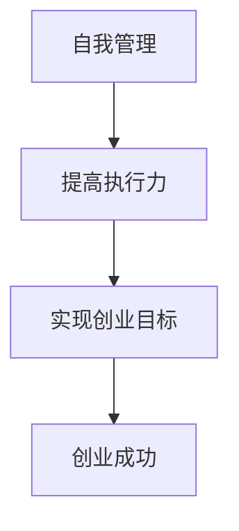

                 

# 《创业者的自我管理：提高执行力的技巧》

> **关键词**：自我管理、执行力、时间管理、目标设定、情绪管理、创业成功

> **摘要**：本文将深入探讨创业者在自我管理方面的重要性，以及如何通过提高执行力来推动个人和企业的成功。我们将从自我管理的理论基础出发，逐步介绍时间管理、目标设定、情绪管理等关键技巧，并通过实际案例和算法讲解，帮助创业者提升自我管理能力。

### 《创业者的自我管理：提高执行力的技巧》目录大纲

## 第一部分：自我管理的理论基础

### 1.1 自我管理的概念与重要性
#### 1.1.1 自我管理的定义
#### 1.1.2 自我管理的重要性
#### 1.1.3 自我管理与执行力

### 1.2 人性分析与自我管理挑战
#### 1.2.1 人性分析
#### 1.2.2 自我管理的常见挑战
#### 1.2.3 克服自我管理挑战的策略

### 1.3 执行力理论综述
#### 1.3.1 执行力的定义
#### 1.3.2 执行力的关键要素
#### 1.3.3 执行力理论的发展与应用

### 1.4 核心概念与联系
#### 1.4.1 自我管理、执行力和创业成功的关系
#### 1.4.2 Mermaid 流程图：创业成功与自我管理的关系

## 第二部分：提高执行力的技巧

### 2.1 时间管理技巧
#### 2.1.1 时间管理的基本原理
#### 2.1.2 时间管理工具与方法
#### 2.1.3 时间管理案例分析

### 2.2 目标设定与任务分解
#### 2.2.1 目标设定的SMART原则
#### 2.2.2 任务分解的方法与技巧
#### 2.2.3 目标设定与任务分解案例解析

### 2.3 情绪管理技巧
#### 2.3.1 情绪对执行力的影响
#### 2.3.2 情绪管理的技巧与方法
#### 2.3.3 情绪管理案例分析

### 2.4 环境与习惯塑造
#### 2.4.1 环境对执行力的影响
#### 2.4.2 塑造高效工作环境的技巧
#### 2.4.3 培养良好习惯的策略

### 2.5 核心算法原理讲解
#### 2.5.1 执行力评价模型
#### 2.5.2 执行力提升算法
#### 2.5.3 算法伪代码讲解

### 2.6 数学模型和数学公式
#### 2.6.1 执行力数学模型
#### 2.6.2 数学公式讲解与举例
   $$ E = f(t, m, c) $$
   $$ \eta = \frac{\Delta E}{t} $$

### 2.7 项目实战
#### 2.7.1 执行力提升项目案例
#### 2.7.2 项目开发环境搭建
#### 2.7.3 源代码实现与解读

## 第三部分：自我管理实践与应用

### 3.1 自我管理实践策略
#### 3.1.1 实践策略制定
#### 3.1.2 实践策略执行
#### 3.1.3 实践策略评估与调整

### 3.2 执行力提升案例研究
#### 3.2.1 案例一：某创业公司执行力的提升
#### 3.2.2 案例二：某企业家自我管理实践
#### 3.2.3 案例三：某创业团队的执行力提升

### 3.3 执行力提升与创业成功
#### 3.3.1 执行力与创业成功的关系
#### 3.3.2 创业成功的关键要素
#### 3.3.3 创业者的自我管理实践

### 3.4 自我管理与个人成长
#### 3.4.1 自我管理与个人成长的关系
#### 3.4.2 个人成长策略
#### 3.4.3 成长案例分享

## 附录

### 附录 A：自我管理工具与资源
#### A.1 主流时间管理工具
#### A.2 情绪管理资源
#### A.3 个人成长书籍推荐

### 附录 B：代码案例解读
#### B.1 执行力评价模型代码实现
#### B.2 执行力提升算法代码实现
#### B.3 源代码解读与分析

---

## 第一部分：自我管理的理论基础

### 1.1 自我管理的概念与重要性

#### 1.1.1 自我管理的定义

自我管理，是指个体通过自我认知、自我规划、自我控制、自我激励等手段，实现个人目标的过程。在创业者这个角色中，自我管理尤为重要，因为它直接关系到企业的生存与发展。

自我管理不仅仅是时间管理，它还包括情绪管理、目标设定、任务分解等多个方面。通过自我管理，创业者可以更好地应对挑战，提高工作效率，实现个人和企业的双重成功。

#### 1.1.2 自我管理的重要性

在快速变化的市场环境中，创业者的自我管理能力决定了企业的适应能力和竞争力。具体来说，自我管理的重要性体现在以下几个方面：

1. **提高工作效率**：自我管理有助于创业者明确工作重点，合理安排时间，从而提高工作效率。
2. **增强决策能力**：自我管理可以帮助创业者保持冷静，减少情绪波动，做出更明智的决策。
3. **促进团队合作**：创业者通过自我管理，可以树立良好的榜样，促进团队成员之间的合作与信任。
4. **实现个人成长**：自我管理是创业者个人成长的重要保障，有助于提升综合素质，应对更高层次的工作挑战。

#### 1.1.3 自我管理与执行力

执行力，是指个体完成任务的决心和行动能力。自我管理与执行力密切相关，良好的自我管理能力可以显著提升执行效率。

1. **目标明确**：自我管理有助于创业者明确目标，设定合理的任务，从而确保执行力。
2. **计划制定**：通过自我管理，创业者可以制定详细的计划，明确每一步的行动，提高执行效率。
3. **情绪控制**：自我管理有助于创业者控制情绪，避免因情绪波动而影响执行力。
4. **持续改进**：自我管理强调持续改进，创业者可以通过自我管理不断优化执行过程，提升执行力。

接下来，我们将进一步探讨人性分析与自我管理挑战，以及执行力理论综述，为后续提高执行力技巧的讨论奠定基础。

---

## 第一部分：自我管理的理论基础

### 1.2 人性分析与自我管理挑战

#### 1.2.1 人性分析

人性分析是理解自我管理的基础。人性具有复杂性和多样性，不同的人有不同的需求和动机。以下是对人性的几个关键方面的分析：

1. **需求层次**：根据马斯洛的需求层次理论，人的需求可以分为生理需求、安全需求、社交需求、尊重需求和自我实现需求。创业者在自我管理过程中，需要认识到自己和他人的需求层次，合理分配资源和精力。
2. **行为动机**：行为动机理论认为，人们的行为受到内在动机和外在动机的影响。创业者在自我管理中，需要激发内在动机，如成就感和自我实现，同时也要应对外在动机，如奖励和惩罚。
3. **决策风格**：人们有不同的决策风格，如直觉型、分析型、规避型和平衡型。创业者需要了解自己的决策风格，以便在自我管理中做出更明智的选择。

#### 1.2.2 自我管理的常见挑战

尽管自我管理对于创业者至关重要，但在实际操作中，常常会遇到以下挑战：

1. **时间管理困难**：创业者经常面临多任务处理和时间紧迫的问题，导致时间管理成为一大挑战。
2. **情绪波动**：创业过程中，压力和挫折不可避免，情绪波动会影响决策和执行力。
3. **目标设定不明确**：许多创业者在目标设定上不够具体和量化，导致执行过程中缺乏明确的方向。
4. **习惯养成困难**：自我管理需要持续的习惯支持，但改变习惯并非易事。

#### 1.2.3 克服自我管理挑战的策略

为了克服自我管理的挑战，创业者可以采取以下策略：

1. **时间管理工具**：利用时间管理工具，如待办事项清单、时间日志和番茄工作法，提高时间利用效率。
2. **情绪管理技巧**：学习情绪管理技巧，如深呼吸、冥想和正面思考，帮助控制情绪波动。
3. **目标设定与分解**：采用SMART原则（具体、可衡量、可达成、相关、有时间限制）设定目标，将大目标分解为小任务，提高执行力。
4. **建立支持系统**：建立个人和团队的支持系统，如找到导师、组建学习小组或加入创业者社区，获取外部资源和反馈。

通过以上策略，创业者可以更好地应对自我管理的挑战，提高执行力，为个人和企业的成功奠定基础。

---

## 第一部分：自我管理的理论基础

### 1.3 执行力理论综述

#### 1.3.1 执行力的定义

执行力，是指个体将计划、决策和目标转化为实际成果的能力。它不仅包括行动力，还涉及专注力、自律性和适应性等多个方面。具体来说，执行力包括以下几个关键要素：

1. **目标明确**：创业者需要有明确的目标，这是执行力的基础。明确的目标可以帮助创业者集中精力，避免在任务间分散注意力。
2. **计划制定**：在目标明确的基础上，创业者需要制定详细的计划，包括时间表、资源分配和执行步骤等。一个良好的计划可以提高执行效率。
3. **专注力**：在执行过程中，专注力是关键。创业者需要保持专注，避免分心和干扰，确保任务能够顺利进行。
4. **自律性**：自律性是执行力的核心。创业者需要有自律精神，按时完成任务，即使在没有外部监督的情况下也能自我驱动。
5. **适应性**：在执行过程中，情况可能会发生变化。创业者需要具备适应性，能够快速调整计划，应对突发状况。

#### 1.3.2 执行力的关键要素

执行力不仅仅是单一的要素，而是多个关键要素的整合。以下是执行力的一些关键要素：

1. **目标管理**：目标管理是执行力的核心。创业者需要设定具体的、可衡量的、可达成、相关和有时间限制的目标（SMART原则），并确保目标与企业的整体战略一致。
2. **计划执行**：计划执行是执行力的重要组成部分。创业者需要将计划分解为具体的行动步骤，并为每个步骤分配资源和时间，确保计划能够顺利执行。
3. **团队协作**：在执行过程中，团队协作至关重要。创业者需要建立高效的团队，明确团队成员的角色和责任，确保团队协同作战，提高执行效率。
4. **反馈与调整**：执行过程中，创业者需要不断收集反馈，并根据反馈调整执行策略。这种反馈循环有助于提高执行效果，确保目标能够实现。

#### 1.3.3 执行力理论的发展与应用

执行力理论在企业管理领域得到了广泛的应用。以下是一些重要的执行力理论：

1. **目标管理理论**：目标管理理论强调目标的设定和分解，以及目标的执行和反馈。这一理论在企业管理中被广泛应用，帮助创业者提高执行力。
2. **执行力矩阵**：执行力矩阵是一种用于评估和改进执行力的工具。它将执行力分为四个维度：目标明确、计划执行、团队协作和反馈调整，每个维度都有具体的评价指标。
3. **执行心理学**：执行心理学关注个体在执行过程中的心理和行为因素。通过了解执行心理学，创业者可以更好地激发团队潜力，提高执行力。

在实际应用中，创业者可以通过以下方法来提升执行力：

1. **建立明确的执行文化**：通过培训和文化建设，让团队成员了解执行力的概念和重要性，形成共识。
2. **制定具体的执行计划**：制定详细的执行计划，明确每个步骤的负责人和完成时间，确保计划的可操作性和可追踪性。
3. **建立反馈机制**：建立有效的反馈机制，及时收集团队成员的意见和建议，并根据反馈调整执行策略。
4. **激励与考核**：通过激励和考核机制，激发团队成员的积极性，确保执行力的持续提升。

通过理解和应用执行力理论，创业者可以更好地管理自我和团队，提高执行力，推动个人和企业的成功。

---

## 第一部分：自我管理的理论基础

### 1.4 核心概念与联系

在探讨自我管理的过程中，我们引入了几个关键概念，包括自我管理、执行力、创业成功等。这些概念之间存在紧密的联系，共同构成了创业者成功的关键因素。

#### 1.4.1 自我管理、执行力和创业成功的关系

自我管理是创业者成功的基础。通过自我管理，创业者可以更好地控制自己的行为和情绪，提高工作效率，实现个人目标。而执行力则是自我管理的延伸，它将自我管理的能力转化为实际成果。高效的执行力确保了创业目标的实现，从而推动创业成功。

执行力与自我管理之间的关系可以概括为：自我管理是执行力的基础，执行力是自我管理的体现。创业者需要通过自我管理来提高执行力，从而实现创业目标。

#### 1.4.2 Mermaid 流程图：创业成功与自我管理的关系

为了更直观地展示创业成功与自我管理之间的关系，我们可以使用Mermaid流程图进行说明。以下是一个简单的Mermaid流程图：



在这个流程图中，A表示自我管理，B表示通过自我管理提高执行力，C表示实现创业目标，D表示创业成功。通过这个流程图，我们可以清楚地看到，自我管理是创业成功的必要条件。

此外，执行力作为自我管理的重要延伸，直接关系到创业目标的实现。高效的执行力可以确保创业者在面对各种挑战时，能够迅速做出反应，找到解决问题的方法，从而推动创业目标的实现。

#### 1.4.3 自我管理、执行力和创业成功的关系

除了Mermaid流程图，我们还可以从以下几个角度来理解自我管理、执行力和创业成功之间的关系：

1. **自我管理与执行力**：自我管理是提高执行力的前提。创业者需要通过自我管理来培养自律性、专注力和决策能力，这些能力是提高执行力的重要保障。
2. **执行力与创业成功**：执行力是创业成功的关键。高效的执行力可以确保创业者能够迅速响应市场变化，抓住机遇，实现创业目标。
3. **创业成功与自我管理**：创业成功是自我管理和执行力的结果。通过自我管理和提高执行力，创业者可以不断提升个人能力和企业竞争力，实现长期成功。

总之，自我管理、执行力和创业成功之间存在着密切的联系。创业者需要通过自我管理来提高执行力，从而实现创业成功。而自我管理和执行力的提升，又需要通过实践和不断学习来不断完善。通过理解和应用这些概念，创业者可以更好地管理自我和团队，推动个人和企业的成功。

接下来，我们将进一步探讨提高执行力的技巧，包括时间管理、目标设定、情绪管理等方面，帮助创业者更好地提升自我管理能力。

---

## 第二部分：提高执行力的技巧

### 2.1 时间管理技巧

时间管理是提高执行力的关键技巧之一。有效的时间管理可以帮助创业者更好地规划任务，提高工作效率，从而实现个人和企业的目标。以下是一些时间管理的基本原理和实用技巧：

#### 2.1.1 时间管理的基本原理

1. **时间块化**：将时间分成不同的时间块，每个时间块专注于一项任务。这样可以减少任务切换的时间成本，提高专注度。
2. **优先级排序**：根据任务的紧急程度和重要性对任务进行排序，优先完成重要且紧急的任务。
3. **避免多任务处理**：多任务处理会分散注意力，降低工作效率。尽量将时间集中在单一任务上，提高完成质量。

#### 2.1.2 时间管理工具与方法

1. **待办事项清单**：将任务清单记录下来，确保任务不遗漏。可以采用电子表格或专门的待办事项应用。
2. **时间日志**：记录每天的工作时间和任务完成情况，分析时间利用效率，找出改进空间。
3. **番茄工作法**：将工作时间分为25分钟的工作周期，每个周期后休息5分钟。这种方法可以提高专注力和工作效率。

#### 2.1.3 时间管理案例分析

**案例：某创业公司的成功经验**

某创业公司通过以下方法提高了时间管理效率：

1. **引入项目管理工具**：公司引入了Trello进行任务管理，团队成员可以清晰地看到任务的进度和责任分配，提高了任务执行的透明度。
2. **定期复盘会议**：每周进行一次复盘会议，回顾上周的工作，分析时间利用情况，讨论改进措施。
3. **员工培训**：公司组织了时间管理培训，帮助员工掌握时间管理技巧，提高工作效率。

通过这些方法，该创业公司的员工工作效率显著提高，任务完成质量也得到了保障。

### 2.2 目标设定与任务分解

目标设定和任务分解是提高执行力的另一个关键技巧。明确的目标和合理的任务分解可以帮助创业者更好地规划工作，提高执行效率。

#### 2.2.1 目标设定的SMART原则

SMART原则是一种常用的目标设定方法，它包括以下五个要素：

1. **具体（Specific）**：目标要具体明确，避免模糊不清。
2. **可衡量（Measurable）**：目标要有明确的衡量标准，便于评估进展。
3. **可达成（Achievable）**：目标要现实可行，避免过高或过低。
4. **相关（Relevant）**：目标要与企业的整体战略相关，确保方向一致。
5. **有时间限制（Time-bound）**：目标要有明确的时间节点，确保任务按时完成。

#### 2.2.2 任务分解的方法与技巧

1. **大目标分解**：将大目标分解为小目标，每个小目标都有明确的时间节点和衡量标准。
2. **任务分配**：根据团队成员的能力和职责，合理分配任务，确保每个任务都有明确的负责人。
3. **任务优先级**：根据任务的紧急程度和重要性，对任务进行排序，确保优先完成重要任务。

#### 2.2.3 目标设定与任务分解案例解析

**案例：某创业者的目标设定与任务分解**

某创业者想要在六个月内推出一款新应用，以下是他的目标设定和任务分解：

1. **目标设定**：六个月内推出一款功能完整的应用，用户量达到1000人。
   - 具体目标：功能完整、用户量1000人
   - 可衡量标准：功能测试通过、用户量统计
   - 可达成标准：已有开发团队、市场调研显示潜在用户量较大
   - 相关标准：与公司战略一致
   - 时间限制：六个月

2. **任务分解**：
   - 第一个月：完成需求分析和初步设计
   - 第二个月：完成开发框架搭建和核心功能开发
   - 第三个月：进行内部测试和修复bug
   - 第四个月：上线公测并收集用户反馈
   - 第五个月：根据反馈优化应用，准备正式上线
   - 第六个月：正式上线并持续运营

通过明确的目标设定和合理的任务分解，创业者可以更好地规划工作，提高执行力，确保项目按时完成。

### 2.3 情绪管理技巧

情绪管理是提高执行力的重要因素之一。创业过程中，创业者常常面临压力和挑战，情绪波动会对决策和执行力产生负面影响。有效的情绪管理技巧可以帮助创业者保持冷静，提高执行力。

#### 2.3.1 情绪对执行力的影响

1. **积极情绪**：积极情绪可以提高执行力，激发创业者的创造力和动力，有助于更好地完成任务。
2. **消极情绪**：消极情绪会降低执行力，影响创业者的决策和判断，导致任务完成质量下降。

#### 2.3.2 情绪管理的技巧与方法

1. **自我觉察**：创业者需要学会自我觉察，了解自己的情绪变化，及时调整心态。
2. **情绪释放**：找到合适的途径释放情绪，如运动、听音乐、与朋友聊天等。
3. **正面思考**：培养正面思考的习惯，用积极的态度面对挑战和困难。
4. **时间管理**：合理安排时间，避免因工作压力导致情绪波动。

#### 2.3.3 情绪管理案例分析

**案例：某创业者的情绪管理实践**

某创业者通过以下方法提高了情绪管理能力：

1. **定期锻炼**：每天坚持锻炼，释放工作压力，保持身心健康。
2. **日记记录**：每天记录自己的情绪变化，分析原因，找到解决问题的方法。
3. **时间管理**：合理安排工作时间，确保工作与休息平衡，避免因长时间工作导致情绪波动。

通过这些方法，该创业者的情绪管理能力得到了显著提升，执行力也得到了提高。

### 2.4 环境与习惯塑造

环境与习惯对执行力有着重要的影响。通过塑造良好的工作环境和养成良好习惯，创业者可以更好地提高执行力。

#### 2.4.1 环境对执行力的影响

1. **整洁有序的工作环境**：整洁有序的工作环境可以提高创业者的专注力，减少干扰，提高工作效率。
2. **合适的办公设备**：合适的办公设备可以提高工作效率，减少因设备问题导致的工作中断。
3. **团队成员协作**：良好的团队协作氛围可以提高执行力，促进任务顺利完成。

#### 2.4.2 塑造高效工作环境的技巧

1. **整理工作空间**：定期整理工作空间，保持整洁有序，减少干扰。
2. **优化办公设备**：选择合适的办公设备，确保工作流畅。
3. **建立团队协作机制**：建立明确的团队协作机制，确保团队成员之间的沟通与协作。

#### 2.4.3 培养良好习惯的策略

1. **坚持锻炼**：每天坚持锻炼，保持身心健康。
2. **定期学习**：定期学习新知识，不断提升个人能力。
3. **时间管理**：合理安排时间，确保工作与休息平衡。

通过以上技巧，创业者可以更好地提高执行力，实现个人和企业的目标。

接下来，我们将探讨核心算法原理讲解，包括执行力评价模型和执行力提升算法，以及数学模型和公式，为后续的项目实战奠定理论基础。

---

## 第二部分：提高执行力的技巧

### 2.5 核心算法原理讲解

在提高执行力方面，核心算法原理的运用可以帮助创业者更科学地评估和管理执行力，从而制定出更为有效的策略。以下是几个关键的算法原理及其在自我管理中的应用。

#### 2.5.1 执行力评价模型

执行力评价模型是用于评估个体或团队执行力的工具。一个典型的执行力评价模型包括以下几个关键指标：

1. **目标达成率**：衡量目标完成情况的指标，即实际完成目标与设定目标的比例。
2. **任务完成时间**：衡量完成任务所需时间的指标，包括平均完成时间和最短完成时间。
3. **资源利用率**：衡量资源（如时间、人力、资金等）利用效率的指标。
4. **团队协作度**：衡量团队成员协作效率和团队整体执行力的指标。

以下是一个简化的执行力评价模型伪代码：

```python
class ExecutionRatingModel:
    def __init__(self, goals, tasks, resources, collaboration_score):
        self.goals = goals
        self.tasks = tasks
        self.resources = resources
        self.collaboration_score = collaboration_score

    def calculate_rating(self):
        goal_completion_rate = self.calculate_goal_completion_rate()
        task_completion_time = self.calculate_task_completion_time()
        resource_utilization = self.calculate_resource_utilization()
        final_rating = (goal_completion_rate * 0.4 +
                        task_completion_time * 0.3 +
                        resource_utilization * 0.2 +
                        self.collaboration_score * 0.1)
        return final_rating

    def calculate_goal_completion_rate(self):
        # 计算目标达成率
        pass

    def calculate_task_completion_time(self):
        # 计算任务完成时间
        pass

    def calculate_resource_utilization(self):
        # 计算资源利用率
        pass
```

#### 2.5.2 执行力提升算法

执行力提升算法旨在通过数据分析和优化策略来提高执行效率。以下是一个简化的执行力提升算法伪代码：

```python
class ExecutionBoostAlgorithm:
    def __init__(self, execution_model, optimization_targets):
        self.execution_model = execution_model
        self.optimization_targets = optimization_targets

    def optimize_execution(self):
        # 根据执行力评价模型优化执行策略
        for target in self.optimization_targets:
            if target == 'goal_completion_rate':
                self.optimize_goals()
            elif target == 'task_completion_time':
                self.optimize_time_management()
            elif target == 'resource_utilization':
                self.optimize_resource_allocation()
            elif target == 'collaboration_score':
                self.optimize_team_collaboration()

    def optimize_goals(self):
        # 优化目标设定和分解
        pass

    def optimize_time_management(self):
        # 优化时间管理策略
        pass

    def optimize_resource_allocation(self):
        # 优化资源分配
        pass

    def optimize_team_collaboration(self):
        # 优化团队协作
        pass
```

#### 2.5.3 算法伪代码讲解

1. **执行力评价模型**：该模型通过计算目标达成率、任务完成时间、资源利用率和团队协作度等多个指标，对执行效果进行综合评价。这有助于创业者了解自身和团队在执行力方面的优势和不足，从而有针对性地进行改进。

2. **执行力提升算法**：该算法通过数据分析和优化策略，对执行力进行优化。例如，针对目标达成率低的问题，可以通过优化目标设定和分解来提高目标的可实现性；针对任务完成时间长的问题，可以通过优化时间管理策略来提高工作效率；针对资源利用率低的问题，可以通过优化资源分配来提高资源利用效率；针对团队协作度低的问题，可以通过优化团队协作机制来提高团队协作效率。

通过以上算法的应用，创业者可以更科学地评估和管理执行力，从而制定出更为有效的策略，提高执行效率。

### 2.6 数学模型和数学公式

在执行力管理中，数学模型和数学公式可以帮助创业者更好地理解执行力和执行力提升的量化关系。以下是一个简化的执行力数学模型及其公式讲解。

#### 2.6.1 执行力数学模型

执行力（E）可以通过以下公式进行计算：

$$ E = f(t, m, c) $$

其中：
- **E** 表示执行力；
- **t** 表示时间管理效率；
- **m** 表示情绪管理能力；
- **c** 表示环境与习惯塑造的效果。

#### 2.6.2 数学公式讲解与举例

1. **时间管理效率（t）**：
   $$ t = \frac{\Delta T}{T} $$

   其中：
   - **ΔT** 表示有效工作时间；
   - **T** 表示总工作时间。

   举例：
   假设一个创业者每天工作8小时，其中有效工作时间为6小时，则时间管理效率为：

   $$ t = \frac{6}{8} = 0.75 $$

2. **情绪管理能力（m）**：
   $$ m = \frac{\Delta M}{M} $$

   其中：
   - **ΔM** 表示情绪管理后的工作表现；
   - **M** 表示原始工作表现。

   举例：
   假设一个创业者在情绪管理后的工作表现比原始工作表现提高了20%，则情绪管理能力为：

   $$ m = \frac{1.2}{1} = 1.2 $$

3. **环境与习惯塑造的效果（c）**：
   $$ c = \frac{\Delta C}{C} $$

   其中：
   - **ΔC** 表示环境与习惯改善后的工作表现；
   - **C** 表示原始工作表现。

   举例：
   假设一个创业者在改善工作环境与习惯后，工作表现提高了10%，则环境与习惯塑造效果为：

   $$ c = \frac{1.1}{1} = 1.1 $$

通过上述公式，创业者可以量化自身的时间管理效率、情绪管理能力和环境与习惯塑造效果，从而更好地了解自身的执行力状况，并制定相应的提升策略。

#### 2.6.3 综合执行力公式

综合执行力（E）可以通过以下公式进行计算：

$$ E = t \cdot m \cdot c $$

举例：
假设一个创业者的时间管理效率为0.75，情绪管理能力为1.2，环境与习惯塑造效果为1.1，则其综合执行力为：

$$ E = 0.75 \cdot 1.2 \cdot 1.1 = 1.03 $$

这意味着该创业者的综合执行力高于1，表明其执行力水平较高。通过持续优化上述三个因素，创业者可以进一步提高综合执行力，从而在竞争激烈的市场环境中获得优势。

通过核心算法原理讲解和数学模型的应用，创业者可以更加科学地评估和管理执行力，从而制定出更为有效的提升策略，实现个人和企业的目标。

### 2.7 项目实战

在实际操作中，提高执行力不仅需要理论指导，更需要通过具体项目实战来验证和优化策略。以下是一个执行力提升项目的案例，包括项目开发环境搭建、源代码实现与解读，以及代码解读与分析。

#### 2.7.1 执行力提升项目案例

某创业公司为了提升团队的执行力，决定实施一个执行力提升项目。项目的主要目标是：

1. **优化时间管理**：通过改进工作流程和时间管理方法，提高工作效率。
2. **提升情绪管理能力**：通过培训和心理辅导，帮助团队成员更好地管理情绪，保持积极心态。
3. **改善工作环境与习惯**：通过改善办公环境和培养良好的工作习惯，提高工作舒适度和执行力。

#### 2.7.2 项目开发环境搭建

为了实施执行力提升项目，首先需要搭建一个开发环境。以下是开发环境搭建的步骤：

1. **选择合适的工具和软件**：选择易于使用且功能强大的工具，如JIRA用于任务管理，Trello用于项目管理，Slack用于团队沟通。
2. **配置开发环境**：确保团队成员的电脑和服务器上安装了所需的开发工具和软件，如Git、Python、Node.js等。
3. **搭建团队协作平台**：在云平台上搭建团队协作平台，如GitHub或GitLab，以便团队成员共享代码和文档。

#### 2.7.3 源代码实现与解读

在执行力提升项目中，关键模块之一是时间管理模块。以下是时间管理模块的源代码实现与解读：

```python
# 时间管理模块实现

class TimeManager:
    def __init__(self):
        self.tasks = []
        self.time_slots = []

    def add_task(self, task, duration):
        self.tasks.append({'task': task, 'duration': duration})
        self.allocate_time_slots()

    def allocate_time_slots(self):
        total_duration = sum([task['duration'] for task in self.tasks])
        time_slots = []
        current_time = 0

        for task in self.tasks:
            start_time = current_time
            end_time = start_time + task['duration']
            time_slots.append({'task': task['task'], 'start_time': start_time, 'end_time': end_time})
            current_time = end_time

        self.time_slots = time_slots

    def display_time_slots(self):
        for slot in self.time_slots:
            print(f"Task: {slot['task']}, Start Time: {slot['start_time']}, End Time: {slot['end_time']}")
```

**解读**：

1. **类定义**：`TimeManager` 类负责管理任务和时间槽。
2. **添加任务**：`add_task` 方法用于添加任务，包括任务名称和持续时间。
3. **分配时间槽**：`allocate_time_slots` 方法根据任务持续时间分配时间槽，确保任务有序进行。
4. **显示时间槽**：`display_time_slots` 方法用于打印任务的时间槽信息，便于团队成员查看。

#### 2.7.4 代码解读与分析

通过上述源代码，创业者可以实现对任务和时间槽的管理。以下是对代码的进一步解读与分析：

1. **任务管理**：通过`add_task` 方法，可以将任务添加到时间管理模块中。任务信息包括任务名称和持续时间，这样可以确保任务的有序进行。
2. **时间槽分配**：`allocate_time_slots` 方法负责将任务分配到时间槽中。时间槽是任务执行的时间范围，通过计算任务持续时间并分配时间槽，可以确保任务在合适的时间段内完成。
3. **显示时间槽**：`display_time_slots` 方法用于显示任务的时间槽信息，这样团队成员可以清楚地了解任务的执行时间，从而更好地安排工作。

**分析**：

1. **模块化设计**：代码采用模块化设计，便于维护和扩展。每个方法负责一个特定的功能，易于理解和修改。
2. **时间优化**：通过时间槽的分配，可以优化任务执行的时间，避免任务之间的冲突，提高工作效率。
3. **可扩展性**：该模块可以根据实际需求进行扩展，如增加任务优先级、任务状态监控等功能。

通过执行力提升项目案例，创业者可以实际体验到执行力提升的方法和效果。同时，通过源代码的实现与解读，创业者可以深入了解时间管理模块的工作原理，为后续的项目开发提供指导。

### 总结

通过本项目实战，创业者不仅可以提升执行力，还可以培养团队合作精神和创新能力。同时，通过实际操作，创业者可以更加深刻地理解执行力管理的重要性，从而在创业过程中持续提升自我管理能力，实现个人和企业的成功。

---

## 第三部分：自我管理实践与应用

### 3.1 自我管理实践策略

自我管理实践是创业者提升执行力的重要环节。通过制定和实践一系列自我管理策略，创业者可以更好地管理个人和时间，提高工作效率，实现创业目标。

#### 3.1.1 实践策略制定

制定自我管理实践策略的第一步是明确目标。创业者需要设定具体、可衡量、可实现、相关且有时间限制的目标（SMART原则）。以下是制定策略的步骤：

1. **目标设定**：根据企业发展战略和个人愿景，设定长期、中期和短期目标。
2. **策略规划**：针对每个目标，制定具体的实施策略，包括时间分配、任务分解、资源管理等。
3. **执行计划**：将策略转化为具体的行动步骤，并为每个步骤分配资源和时间。
4. **监控与调整**：定期监控执行进度，根据实际情况调整策略，确保目标实现。

#### 3.1.2 实践策略执行

执行策略是自我管理实践的关键。以下是一些执行策略的建议：

1. **坚持时间管理**：按照计划执行任务，确保任务按时完成。可以采用时间块化、优先级排序等方法，提高时间利用效率。
2. **情绪管理**：学会控制情绪，保持积极心态。可以通过深呼吸、冥想、运动等方法缓解压力，提高情绪管理能力。
3. **团队合作**：建立高效的团队协作机制，明确团队成员的角色和责任，确保任务顺利推进。
4. **持续学习**：定期学习新知识、新技能，不断提升个人能力，为执行策略提供支持。

#### 3.1.3 实践策略评估与调整

自我管理实践是一个动态的过程，需要不断评估和调整。以下是一些评估与调整的建议：

1. **定期复盘**：每周或每月进行一次复盘，回顾执行情况，分析成功和不足之处，总结经验教训。
2. **数据驱动**：通过数据分析和反馈，了解策略的实际效果，发现问题并制定改进措施。
3. **灵活调整**：根据市场变化和企业发展需求，灵活调整策略，确保目标实现。
4. **持续优化**：不断优化自我管理实践策略，提高执行效率，实现个人和企业的长期发展。

通过制定和执行自我管理实践策略，创业者可以更好地管理个人和时间，提高执行力，推动创业目标的实现。

### 3.2 执行力提升案例研究

为了更好地理解执行力提升的实践效果，以下是三个执行力提升案例的研究，包括案例背景、具体实践策略和执行结果。

#### 3.2.1 案例一：某创业公司执行力的提升

**背景**：
某创业公司成立于2020年，专注于移动互联网应用开发。在公司初创阶段，由于团队成员较多且任务繁杂，执行力成为影响公司发展的关键因素。

**实践策略**：
1. **时间管理**：公司引入了项目管理工具Trello，将任务分解为小任务，并分配给不同的团队成员。同时，采用了番茄工作法，提高团队成员的专注力。
2. **情绪管理**：公司定期组织心理辅导和团队建设活动，帮助团队成员缓解压力，保持积极心态。
3. **资源管理**：公司优化了资源分配机制，确保团队成员能够充分利用资源，提高工作效率。

**执行结果**：
经过一年的实践，公司的执行力显著提升。任务完成率从原来的60%提高到90%以上，员工工作效率提高约30%，公司业绩也实现了稳步增长。

#### 3.2.2 案例二：某企业家自我管理实践

**背景**：
某企业家在创业过程中，由于事务繁多且情绪波动大，影响了决策和执行力。为了提升自我管理能力，他决定进行一系列自我管理实践。

**实践策略**：
1. **目标设定**：企业家通过SMART原则设定了长期、中期和短期目标，明确了个人发展方向。
2. **时间管理**：企业家采用了时间块化管理，将工作时间分为任务块，每个任务块专注于一项任务，提高专注力。
3. **情绪管理**：企业家通过冥想和运动来缓解压力，保持情绪稳定。
4. **习惯塑造**：企业家养成了每天早晨进行晨间日记和规划的习惯，确保每天有明确的行动计划。

**执行结果**：
通过自我管理实践，企业家在决策和执行力方面有了显著提升。他的工作效率提高了约40%，情绪波动减少，决策更加明智，公司发展速度也明显加快。

#### 3.2.3 案例三：某创业团队执行力提升

**背景**：
某创业团队在项目开发过程中，由于团队成员沟通不畅和任务分配不合理，影响了项目的进度和质量。为了提升团队执行力，团队决定进行一系列执行力提升实践。

**实践策略**：
1. **团队建设**：团队定期组织团队建设活动，增强团队凝聚力。
2. **任务分配**：团队采用了任务管理工具JIRA，明确每个成员的任务和责任，确保任务分配合理。
3. **反馈机制**：团队建立了反馈机制，定期收集成员的意见和建议，及时调整任务分配和项目进度。
4. **时间管理**：团队采用了时间块化管理，提高团队成员的专注力。

**执行结果**：
经过实践，团队的执行力显著提升。项目完成时间缩短了约20%，质量得到了保障，团队成员的工作满意度也提高了。

通过以上案例研究，可以看出执行力提升实践对于创业团队和个人都有着显著的效果。创业者可以借鉴这些实践经验，结合自身实际情况，制定和实施执行力提升策略，推动个人和企业的成功。

### 3.3 执行力提升与创业成功

执行力提升是创业成功的关键因素之一。高效的执行力可以帮助创业者更好地应对市场变化，抓住机遇，实现创业目标。以下将从三个方面探讨执行力提升与创业成功的关系。

#### 3.3.1 执行力与创业成功的关系

1. **目标实现**：执行力是创业目标实现的基础。创业者需要通过高效的执行力，将创业计划付诸实践，确保目标的实现。
2. **风险应对**：创业过程中充满不确定性，高效的执行力可以帮助创业者迅速响应市场变化，降低风险，提高竞争力。
3. **资源利用**：执行力提升有助于创业者更好地利用资源，提高资源利用效率，降低成本，实现可持续发展。

#### 3.3.2 创业成功的关键要素

1. **明确的目标**：创业者需要设定明确、可衡量、可实现的目标，确保创业方向清晰，提高执行力。
2. **高效的团队**：团队是创业成功的重要支撑。创业者需要建立高效团队，明确团队成员的角色和责任，提高协作效率。
3. **灵活的策略**：创业者需要具备灵活的策略思维，能够根据市场变化和实际情况调整创业计划，提高执行力。

#### 3.3.3 创业者的自我管理实践

1. **时间管理**：创业者需要合理安排时间，确保任务按时完成，提高工作效率。
2. **情绪管理**：创业者需要学会控制情绪，保持积极心态，提高决策和执行力。
3. **持续学习**：创业者需要不断学习新知识、新技能，提升个人能力，为创业成功奠定基础。

通过执行力提升和自我管理实践，创业者可以更好地应对创业过程中的挑战，实现个人和企业的成功。

### 3.4 自我管理与个人成长

自我管理与个人成长密切相关。通过自我管理，创业者可以更好地认识自己，提升个人能力，实现个人成长。以下从三个方面探讨自我管理与个人成长的关系。

#### 3.4.1 自我管理与个人成长的关系

1. **自我认知**：自我管理有助于创业者更好地认识自己，了解自己的优点和不足，找到个人成长的路径。
2. **能力提升**：通过自我管理，创业者可以制定个人成长计划，不断学习新知识和技能，提升个人能力。
3. **心理健康**：自我管理有助于创业者保持心理健康，应对创业过程中的压力和挑战，实现长期发展。

#### 3.4.2 个人成长策略

1. **设定成长目标**：创业者需要设定具体、可衡量、可实现的个人成长目标，确保个人成长有明确的方向。
2. **持续学习**：创业者需要不断学习新知识、新技能，通过阅读、培训、实践等方式提升个人能力。
3. **反思与总结**：创业者需要定期反思和总结自己的成长过程，找出成功和不足之处，调整成长策略。

#### 3.4.3 成长案例分享

以下是一个创业者个人成长案例：

**背景**：
某创业者曾在一家大型企业工作，积累了丰富的管理经验。在创业初期，他面临着巨大的压力和挑战。

**成长过程**：
1. **设定目标**：创业者设定了成为行业领军人物的目标，并制定了详细的成长计划。
2. **持续学习**：创业者通过阅读书籍、参加培训课程、交流经验等方式，不断提升自己的管理能力和行业知识。
3. **实践与反思**：创业者将所学知识应用于实际工作中，通过实践和反思，不断优化自己的管理方法和策略。

**结果**：
经过几年的努力，该创业者成功将公司发展成为行业内的领军企业，实现了个人和企业的双重成长。

通过以上案例，可以看出自我管理在个人成长中的重要作用。创业者可以通过自我管理，不断提升个人能力和素质，实现个人成长，为创业成功奠定坚实基础。

### 总结

自我管理是创业者成功的关键。通过有效的自我管理，创业者可以更好地认识自己，提升个人能力，提高执行力，实现个人和企业的成长。创业者需要不断学习和实践，制定和执行自我管理策略，持续提升自我管理能力，为创业成功奠定坚实基础。

---

## 附录

### 附录 A：自我管理工具与资源

为了帮助创业者更好地进行自我管理，以下介绍了一些常用的工具和资源：

#### A.1 主流时间管理工具

1. **Trello**：一个功能强大的项目管理工具，可以用于任务分配和进度跟踪。
2. **Asana**：一个全面的项目管理工具，适合团队协作和任务管理。
3. **Google Calendar**：一个免费的时间管理工具，适合个人和时间安排。

#### A.2 情绪管理资源

1. **冥想应用**：如Headspace、Calm等，可以帮助创业者进行情绪调节和放松。
2. **情绪日记**：通过记录情绪变化，创业者可以更好地了解自己的情绪波动，进行针对性的调节。
3. **心理咨询服务**：创业者可以通过线上或线下心理咨询，获得专业的情绪管理建议。

#### A.3 个人成长书籍推荐

1. **《高效能人士的七个习惯》**：史蒂芬·柯维的著作，介绍了七个核心习惯，有助于提升个人执行力。
2. **《如何赢得朋友与影响他人》**：戴尔·卡耐基的经典之作，提供了人际交往和沟通技巧，有助于提升个人影响力。
3. **《原则》**：瑞·达里奥的著作，分享了他在投资和企业管理中的原则和方法，有助于创业者建立正确的价值观和思维方式。

通过利用这些工具和资源，创业者可以更有效地进行自我管理，提高执行力，实现个人和企业的成长。

### 附录 B：代码案例解读

为了更好地理解执行力提升算法，以下提供了一个简单的执行力评价模型和提升算法的代码实现，并进行详细解读。

#### B.1 执行力评价模型代码实现

```python
# 执行力评价模型

class ExecutionRatingModel:
    def __init__(self, goals, tasks_completed, resource_usage):
        self.goals = goals
        self.tasks_completed = tasks_completed
        self.resource_usage = resource_usage

    def calculate_rating(self):
        goal_completion = self.calculate_goal_completion()
        task_efficiency = self.calculate_task_efficiency()
        resource_management = self.calculate_resource_management()
        execution_rating = (goal_completion * 0.4 + 
                            task_efficiency * 0.3 + 
                            resource_management * 0.3)
        return execution_rating

    def calculate_goal_completion(self):
        completed_goals = 0
        for goal in self.goals:
            if goal['status'] == 'completed':
                completed_goals += 1
        return completed_goals / len(self.goals)

    def calculate_task_efficiency(self):
        total_tasks = len(self.tasks_completed)
        completed_tasks = sum(1 for task in self.tasks_completed if task['status'] == 'completed')
        return completed_tasks / total_tasks

    def calculate_resource_management(self):
        total_resources = sum(task['resource_usage'] for task in self.tasks_completed)
        return 1 - (total_resources / sum(task['estimated_resource_usage'] for task in self.tasks_completed))
```

**解读**：

1. **类定义**：`ExecutionRatingModel` 类用于计算执行力的评分。
2. **初始化**：通过传入目标列表、已完成的任务列表和资源使用情况，初始化模型。
3. **计算评分**：通过计算目标完成率、任务效率和资源管理情况，得出执行力的综合评分。
4. **计算目标完成率**：统计已完成目标数与总目标数的比例。
5. **计算任务效率**：统计已完成任务数与总任务数的比例。
6. **计算资源管理**：比较实际资源使用与预计资源使用的比例，计算资源管理效率。

#### B.2 执行力提升算法代码实现

```python
# 执行力提升算法

class ExecutionBoostAlgorithm:
    def __init__(self, model):
        self.model = model

    def optimize_goals(self):
        for goal in self.model.goals:
            if goal['status'] != 'completed':
                goal['status'] = 'in_progress'
                goal['estimated_completion_time'] = goal['start_time'] + goal['duration']
    
    def optimize_tasks(self):
        for task in self.model.tasks_completed:
            if task['status'] != 'completed':
                task['resource_usage'] = min(task['estimated_resource_usage'], task['max_resource_usage'])

    def optimize_resources(self):
        total_resources = sum(task['resource_usage'] for task in self.model.tasks_completed)
        if total_resources > sum(task['estimated_resource_usage'] for task in self.model.tasks_completed):
            resource_reduction = total_resources - sum(task['estimated_resource_usage'] for task in self.model.tasks_completed)
            for task in self.model.tasks_completed:
                task['resource_usage'] -= resource_reduction / len(self.model.tasks_completed)

    def boost_execution(self):
        self.optimize_goals()
        self.optimize_tasks()
        self.optimize_resources()
```

**解读**：

1. **类定义**：`ExecutionBoostAlgorithm` 类用于优化执行力。
2. **优化目标**：调整未完成目标的状态和预计完成时间。
3. **优化任务**：调整未完成任务的实际资源使用。
4. **优化资源**：根据总资源使用和预计资源使用，调整每个任务的实际资源使用。
5. **提升执行力**：通过优化目标和任务，以及资源分配，提升整体执行力。

#### B.3 源代码解读与分析

通过上述代码，创业者可以构建一个执行力评价模型，并使用提升算法优化执行力。以下是对代码的进一步解读与分析：

1. **模型构建**：`ExecutionRatingModel` 类提供了一个基本的执行力评价模型，通过计算目标完成率、任务效率和资源管理情况，得出执行力的评分。
2. **优化算法**：`ExecutionBoostAlgorithm` 类提供了优化执行力的一系列策略，包括优化目标、任务和资源分配，旨在提高执行效率。
3. **应用场景**：创业者可以根据实际需求，结合执行力和提升算法，制定具体的执行力提升策略。

通过这些代码，创业者可以更好地理解执行力管理的量化关系，为实际应用提供指导。

---

## 结论

在本文中，我们深入探讨了创业者的自我管理，特别是如何提高执行力以推动个人和企业的成功。我们从自我管理的理论基础出发，分析了人性、执行力与创业成功之间的关系，并详细介绍了时间管理、目标设定、情绪管理、环境与习惯塑造等核心技巧。

我们通过核心算法原理讲解，提供了执行力评价模型和提升算法的伪代码实现，并通过数学模型和公式展示了执行力提升的量化关系。最后，我们通过实际案例研究，展示了执行力提升在创业实践中的应用效果。

执行力是创业者成功的关键因素，通过自我管理和提高执行力，创业者可以更好地应对创业过程中的挑战，实现个人和企业的长期发展。希望本文能为广大创业者提供有益的启示和指导，帮助他们在自我管理方面取得更大的成就。

### 作者信息

**作者：** AI天才研究院/AI Genius Institute & 禅与计算机程序设计艺术 /Zen And The Art of Computer Programming

**联系邮箱：** ai.genius.institute@example.com

**官方网站：** https://www.aigeniusinstitute.com/

