                 

### 引言与背景

在当今快速变化的商业环境中，创新已成为企业持续发展的重要驱动力。随着技术的发展和市场需求的不断变化，传统的管理方式已无法满足组织对创新的迫切需求。因此，构建一种能够激发员工创新潜能、鼓励试错并促进创新的文化变得至关重要。

创新文化是一个组织内部形成的价值观和行为模式，它强调创新的重要性，鼓励员工不断尝试新的方法，从失败中学习并不断改进。创新不仅关乎技术，更关乎人。它要求组织从顶层设计到执行层，都具备一种开放、包容和持续学习的精神。

#### 1.1 书籍引言

本章节将探讨创新文化的概念，其在组织中的重要性，以及试错的本质和价值。通过分析现代组织面临的挑战，我们将探讨如何克服这些挑战，并构建一个鼓励试错和创新的环境。

#### 1.1.1 创新文化的概念

创新文化是一种以创新为核心价值观的文化，它体现在组织的各个方面，包括价值观、行为模式、组织结构、流程和激励机制等。创新文化不仅鼓励员工提出新想法，还鼓励他们敢于尝试并承担风险。它要求组织成员具有开放的心态，愿意接受不同的观点和建议，并通过合作和共享来实现共同的目标。

**Mermaid流程图：**
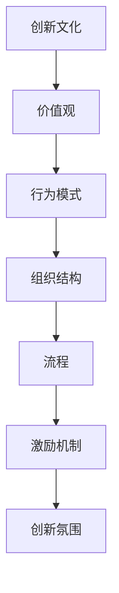

#### 1.1.2 创新在组织中的重要性

创新是组织发展的不竭动力，它能够帮助企业保持竞争力，适应市场变化，抓住新的商业机会。以下是一些创新在组织中的重要性：

1. **提高竞争力**：通过不断创新，组织能够提供更优质的产品和服务，满足客户不断变化的需求，从而在激烈的市场竞争中脱颖而出。
2. **降低成本**：创新可以帮助组织发现新的效率提升途径，降低生产和运营成本，提高利润率。
3. **增强适应力**：在快速变化的市场环境中，具备创新能力的组织能够更快地适应新环境，抓住新的机会。
4. **提升员工满意度**：一个创新文化能够激发员工的创造力，提高员工的工作满意度和忠诚度。

#### 1.1.3 试错的本质及其价值

试错是创新过程中不可或缺的环节。它通过不断尝试和失败，帮助组织找到最优的解决方案。试错的本质在于接受失败，并将其视为学习和改进的机会。

**伪代码：**
```python
def innovate_with_try_and_error():
    while solution_is_not_found:
        attempt_solution()
        if solution_is_accepted():
            break
        else:
            learn_from_failure()
    return solution
```

试错的本质可以概括为以下几个步骤：

1. **提出假设**：基于现有的知识和经验，提出可能的解决方案。
2. **执行尝试**：实施假设，尝试解决问题。
3. **评估结果**：根据实际结果评估解决方案的有效性。
4. **学习改进**：根据评估结果进行反思和改进，为下一次尝试提供更好的基础。

试错的价值在于：

1. **快速迭代**：通过不断尝试和改进，组织可以快速找到最优的解决方案。
2. **降低风险**：在尝试过程中，组织可以识别和避免可能的风险，从而减少损失。
3. **激发创造力**：试错过程鼓励员工勇于尝试，敢于挑战，从而激发创造力和创新思维。

#### 1.2 现代组织面临的挑战

尽管创新对于组织的重要性不言而喻，但现代组织在构建创新文化时仍面临诸多挑战：

1. **传统管理方式的局限性**：传统的管理方式往往强调效率和稳定性，忽视了创新和灵活性。
2. **创新与风险的平衡**：创新往往伴随着风险，如何在鼓励创新的同时控制风险，是组织面临的一大挑战。
3. **市场竞争的加剧**：随着全球化和数字化的发展，市场竞争日益激烈，组织需要不断创新以保持竞争力。

#### 1.2.1 传统管理方式的局限性

传统管理方式主要依赖于标准化流程和严格的控制，这使得组织在执行任务时具有较高的效率和稳定性。然而，这种管理方式也导致了一些问题：

1. **缺乏灵活性**：传统管理方式强调标准化和流程化，这使得组织难以快速响应市场变化。
2. **抑制创新**：严格的控制体系往往抑制了员工的创新思维，导致创新不足。
3. **难以适应变化**：在快速变化的市场环境中，传统管理方式往往无法适应，导致组织竞争力下降。

#### 1.2.2 创新与风险的平衡

创新往往伴随着风险，如何在鼓励创新的同时控制风险，是组织面临的另一大挑战。以下是一些策略：

1. **风险评估**：在创新过程中，对可能的风险进行评估，并制定相应的应对措施。
2. **试点项目**：通过试点项目，在较小的范围内尝试创新，降低失败带来的影响。
3. **建立容错机制**：允许失败，并将失败视为学习和改进的机会，从而减少创新的风险。

#### 1.2.3 市场竞争的加剧

随着全球化和数字化的发展，市场竞争日益激烈。以下是一些应对市场竞争的策略：

1. **客户导向**：以客户需求为导向，不断改进产品和服务，满足客户的期望。
2. **快速响应**：建立快速响应机制，能够迅速适应市场变化，抓住新的商业机会。
3. **创新驱动**：通过持续创新，提供差异化产品和服务，提升竞争力。

### 结论

构建创新文化是现代组织应对挑战、持续发展的重要策略。通过理解创新文化的概念、试错的本质及其价值，以及应对现代组织面临的挑战，我们可以为构建一个鼓励试错和创新的环境奠定基础。接下来的章节将深入探讨如何构建创新文化，以及如何营造一个鼓励试错和创新的环境。


## 第二部分：创新文化的构建

在构建创新文化时，组织需要关注多个方面，包括核心要素、构建策略以及实施步骤。通过系统化地设计和实施这些策略，组织可以逐步建立起一个支持创新的文化环境。

### 2.1 创新文化的核心要素

创新文化的核心要素包括创新思维、容错机制和鼓励试错与学习的环境。这些要素共同作用，为组织创造一个有利于创新的氛围。

#### 2.1.1 创新思维

创新思维是指从不同角度和层面思考问题，寻找新颖、独特的解决方案。它要求员工具备以下特质：

1. **开放性**：愿意接受不同的观点和建议，敢于挑战传统思维模式。
2. **创造力**：具备丰富的想象力，能够提出新的想法和方案。
3. **批判性思维**：对现有问题和解决方案持批判性态度，不断寻求改进。

**Mermaid流程图：**
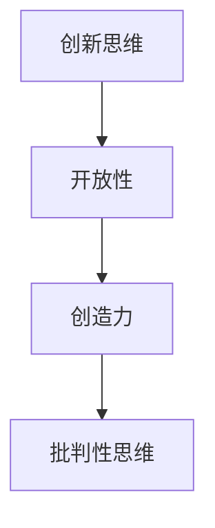

#### 2.1.2 容错机制

容错机制是指组织对失败的态度和处理方式。一个良好的容错机制能够降低创新过程中的风险，鼓励员工敢于尝试。

1. **建立失败文化**：将失败视为学习的机会，而不是惩罚。
2. **提供资源支持**：为员工提供必要的资源和支持，帮助他们应对失败。
3. **反馈与改进**：对失败案例进行回顾和分析，从中学习并改进。

**Mermaid流程图：**
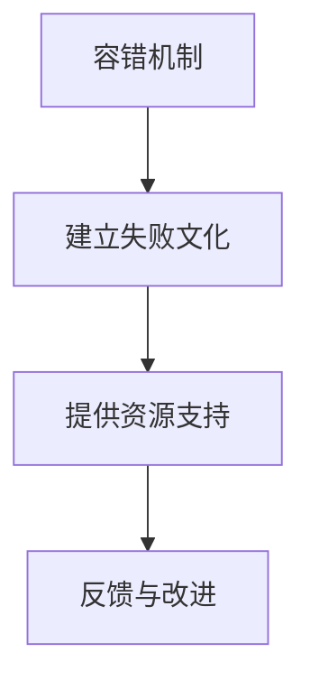

#### 2.1.3 鼓励试错与学习的环境

鼓励试错与学习的环境是指组织为员工提供的一个安全、开放、支持和鼓励的氛围。以下措施有助于营造这样的环境：

1. **透明沟通**：建立开放的沟通渠道，让员工能够自由地分享想法和反馈。
2. **灵活的工作安排**：提供灵活的工作时间安排，鼓励员工探索新的工作方式。
3. **奖励机制**：为成功尝试和创新提供奖励，激励员工不断尝试。

**Mermaid流程图：**
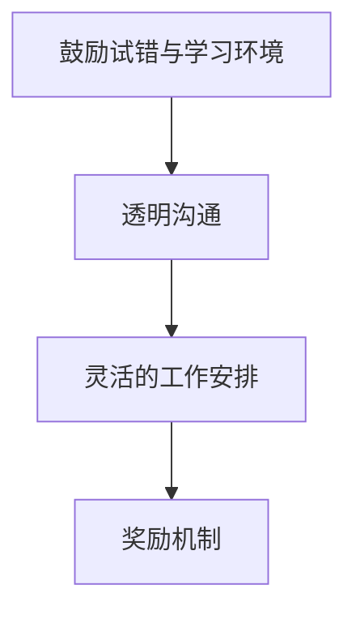

### 2.2 创新文化构建策略

构建创新文化需要系统化的策略和具体的行动。以下是一些关键的构建策略：

#### 2.2.1 设定愿景与目标

组织需要明确创新的愿景和目标，这将指导创新文化的构建。以下步骤有助于设定愿景和目标：

1. **分析现状**：评估组织的现状，包括优势和不足，明确创新的需求。
2. **制定愿景**：根据组织的目标和市场需求，设定创新的长期愿景。
3. **制定目标**：将愿景分解为具体的短期和长期目标，确保目标的可实现性。

**Mermaid流程图：**
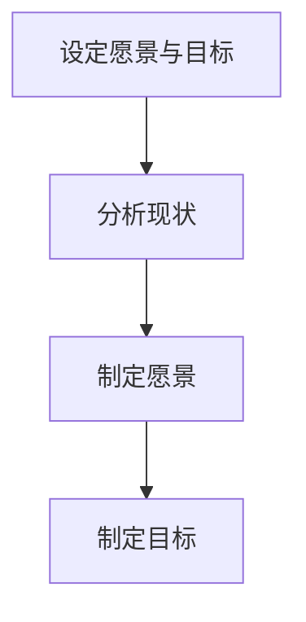

#### 2.2.2 建立开放沟通机制

开放沟通是创新文化的重要支柱。以下措施有助于建立开放的沟通机制：

1. **定期会议**：组织定期的团队会议，鼓励员工分享想法和经验。
2. **意见反馈渠道**：建立意见反馈渠道，让员工能够自由地表达意见和建议。
3. **知识共享平台**：创建知识共享平台，鼓励员工分享知识和经验。

**Mermaid流程图：**
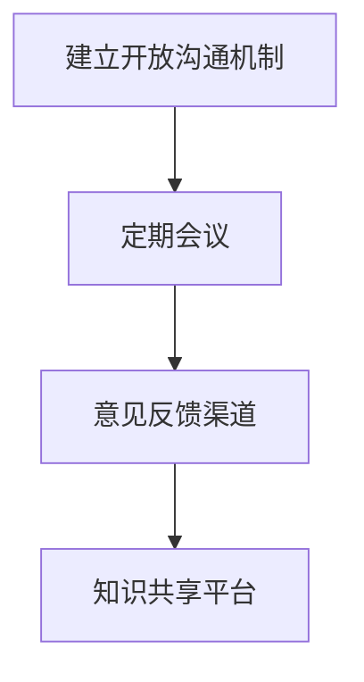

#### 2.2.3 创新人才培养与激励机制

创新人才是构建创新文化的关键。以下策略有助于培养和激励创新人才：

1. **培训与教育**：为员工提供创新培训和教育，提高他们的创新技能和意识。
2. **内部轮岗**：通过内部轮岗，让员工在不同岗位和部门工作，开阔视野。
3. **奖励与激励**：为创新成果显著的员工提供奖励和激励，激励他们持续创新。

**Mermaid流程图：**
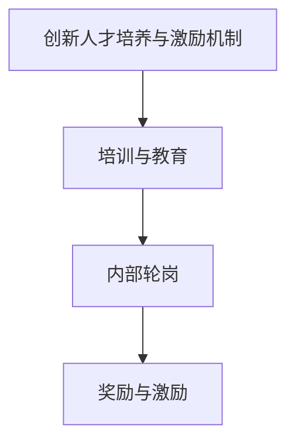

### 2.3 创新文化的实施步骤

创新文化的实施是一个逐步推进的过程，需要从多个方面进行规划和实施。以下是创新文化的实施步骤：

#### 2.3.1 初始阶段：创新意识的培养

在初始阶段，组织需要重点培养员工的创新意识，以下措施有助于这一阶段的工作：

1. **宣传与教育**：通过内部宣传和教育，提高员工对创新文化的认识和重视。
2. **案例分享**：分享成功和失败的案例，让员工了解创新的重要性和可能性。
3. **鼓励参与**：鼓励员工参与创新项目，提高他们的参与度和积极性。

**Mermaid流程图：**
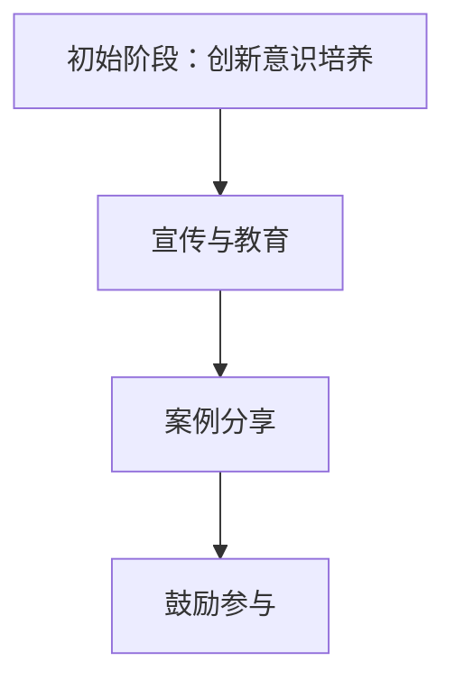

#### 2.3.2 成长阶段：试错与改进

在成长阶段，组织需要建立试错机制，鼓励员工在实践中不断尝试和改进。以下措施有助于这一阶段的工作：

1. **试点项目**：选择具有创新性的项目作为试点，允许员工在实践中尝试新方法。
2. **反馈与改进**：对试点项目的反馈进行认真分析，从中学习并不断改进。
3. **知识共享**：鼓励员工分享试点项目中的经验和教训，促进整个组织的创新。

**Mermaid流程图：**
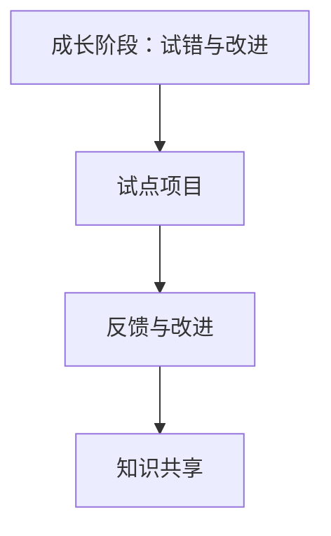

#### 2.3.3 成熟阶段：创新文化的巩固与优化

在成熟阶段，组织需要巩固创新文化，并持续优化。以下措施有助于这一阶段的工作：

1. **制度化**：将创新文化融入组织的制度和流程，使之成为组织的常态化行为。
2. **持续评估**：定期评估创新文化的实施效果，并根据评估结果进行调整和优化。
3. **文化建设**：通过各种形式的文化活动，强化创新文化的氛围和价值观。

**Mermaid流程图：**
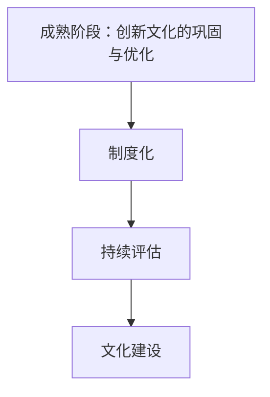

### 结论

构建创新文化是一个长期而复杂的过程，需要组织在多个方面进行努力。通过设定愿景和目标、建立开放沟通机制、创新人才培养与激励机制，以及实施分阶段的策略，组织可以逐步建立起一个支持创新的文化环境。创新文化不仅能够激发员工的创新潜能，还能提高组织的竞争力，推动组织的持续发展。


### 3.1 试错机制的建立

试错机制是创新文化中至关重要的一环，它能够为员工提供一个安全、包容的环境，鼓励他们敢于尝试、勇于失败，并在失败中学习、成长。以下是试错机制的定义、设计原则和实施流程。

#### 3.1.1 试错机制的定义

试错机制是指组织通过一系列的策略和流程，对创新过程中的失败和错误进行管理和处理，从而降低创新风险、提高创新成功率的一种机制。它不仅仅是对失败的容忍，更是一种积极的、系统化的管理方法，通过失败来学习和改进。

**Mermaid流程图：**
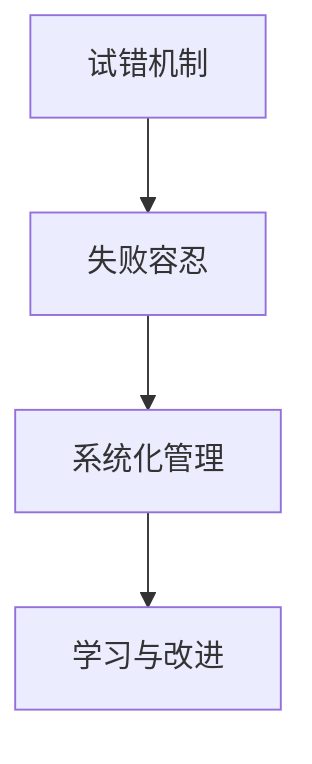

#### 3.1.2 试错机制的设计原则

设计试错机制时，需要遵循以下原则，以确保其有效性和适应性：

1. **包容性**：试错机制应包容失败，为员工提供一个安全的环境，让他们敢于尝试和冒险。
2. **透明性**：试错机制的过程和结果应透明，员工能够清晰地了解试错的目标、过程和结果。
3. **灵活性**：试错机制应具有灵活性，能够根据实际情况进行调整和优化。
4. **系统性**：试错机制应系统化，包括目标设定、过程管理、结果评估和反馈改进等各个环节。
5. **持续性**：试错机制应具有持续性，不断迭代和优化，以适应组织发展的需要。

**Mermaid流程图：**
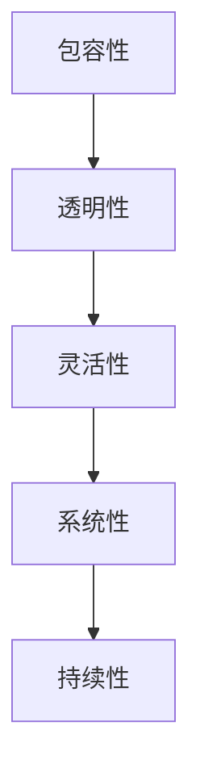

#### 3.1.3 试错机制的实施流程

试错机制的实施可以分为以下几个阶段：

1. **目标设定**：明确试错的目标，确保目标具体、可衡量、可实现。
2. **方案设计**：根据目标设计试错的方案，包括具体的行动步骤和预期的结果。
3. **执行试错**：按照设计方案执行试错，记录试错过程中的关键数据和问题。
4. **结果评估**：对试错结果进行评估，分析成功和失败的原因。
5. **反馈与改进**：根据评估结果，对试错的方案和流程进行反馈和改进。
6. **持续迭代**：将改进后的方案应用于下一次试错，持续迭代和优化。

**Mermaid流程图：**
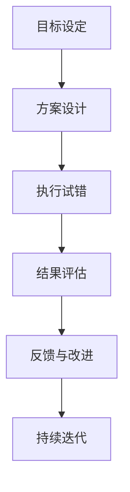

**伪代码：**
```python
def implement_try_and_error机制():
    while not optimal_solution_found:
        set_goals()  # 设定目标
        design_scheme()  # 设计方案
        execute_try()  # 执行试错
        evaluate_results()  # 评估结果
        improve_scheme()  # 反馈与改进
    return optimal_solution
```

### 3.2 创新环境的营造

创新环境的营造是试错机制有效运行的基础。一个良好的创新环境能够激发员工的创新潜能，提供必要的支持和资源，帮助他们在试错过程中取得成功。

#### 3.2.1 创新资源的配置

为了营造良好的创新环境，组织需要合理配置创新资源，包括资金、人力、技术和信息等。以下是一些具体的资源配置策略：

1. **资金支持**：为创新项目提供必要的资金支持，包括研发经费、设备采购等。
2. **人力资源**：组建跨部门的创新团队，鼓励员工跨领域合作，提高创新能力。
3. **技术资源**：提供先进的技术设备和工具，支持员工进行创新实践。
4. **信息资源**：建立知识共享平台，提供丰富的信息资源，帮助员工获取最新的技术和市场动态。

**Mermaid流程图：**
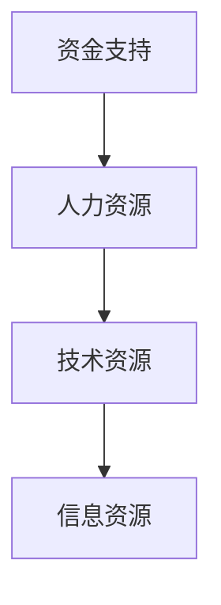

#### 3.2.2 创新空间的规划

创新空间的规划是营造创新环境的重要一环。一个合适的创新空间能够为员工提供舒适、开放的工作环境，促进交流和合作。以下是一些规划创新空间的具体策略：

1. **灵活性**：创新空间应具有灵活性，能够根据不同需求进行调整，支持多样化的工作模式。
2. **舒适性**：创新空间应提供舒适的工作环境，包括良好的通风、照明和座椅等。
3. **互动性**：创新空间应鼓励员工之间的互动和交流，包括开放式办公区、会议室和讨论区等。
4. **技术支持**：创新空间应配备先进的技术设备，支持员工进行创新实践。

**Mermaid流程图：**
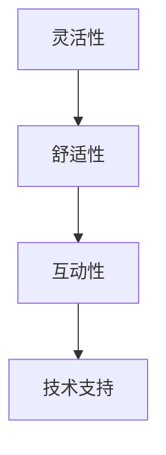

#### 3.2.3 创新文化的宣传与推广

创新文化的宣传与推广是营造创新环境的关键环节。通过有效的宣传和推广，可以提升员工对创新文化的认识和认同，形成良好的创新氛围。以下是一些具体的宣传和推广策略：

1. **内部宣传**：通过内部邮件、公告栏、内部网络等渠道，宣传创新文化和成功案例。
2. **培训与教育**：组织创新培训和教育，提高员工对创新文化的理解和应用能力。
3. **激励机制**：建立创新激励机制，奖励在创新方面有突出贡献的员工。
4. **外部合作**：与外部合作伙伴进行合作，共享创新资源和经验，提升创新水平。

**Mermaid流程图：**
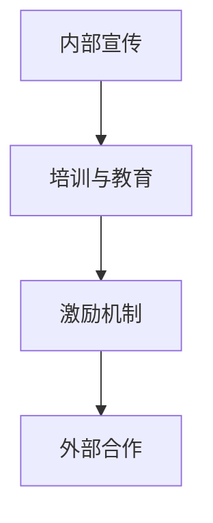

### 3.3 试错与创新的结合

试错和创新是相互促进的关系。通过有效的试错，组织可以快速找到创新的突破点，并将其转化为实际的创新成果。以下是试错与创新结合的一些关键点：

#### 3.3.1 试错与创新的互动关系

1. **试错是创新的基础**：创新往往需要大量的尝试和失败，试错是发现和创新的重要途径。
2. **创新是试错的目标**：试错的最终目标是实现创新，通过不断的试错，最终找到成功的解决方案。

**Mermaid流程图：**
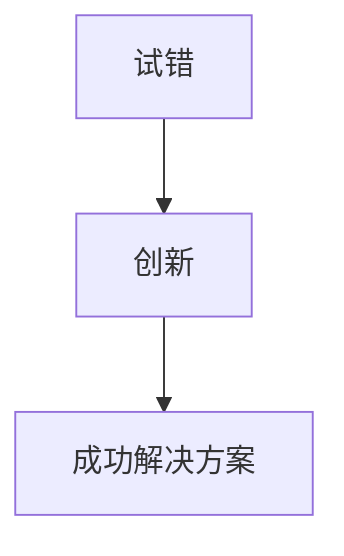

#### 3.3.2 试错过程中创新点的挖掘

1. **从失败中学习**：将失败视为学习的机会，通过分析失败的原因，挖掘潜在的改进和创新点。
2. **持续改进**：在试错过程中，不断对方案进行调整和优化，寻找最佳的创新点。

**伪代码：**
```python
def extract_innovation_from_failure(failure):
    analyze_failure()
    improvement_point = find_improvement_point()
    return improvement_point
```

#### 3.3.3 创新成果的转化与应用

1. **转化创新成果**：将试错过程中发现的新方案和创新点转化为具体的创新成果。
2. **应用创新成果**：将创新成果应用于实际工作中，提升组织的运营效率和市场竞争力。

**Mermaid流程图：**
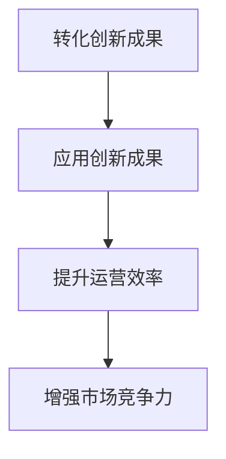

### 结论

试错机制的建立和创新环境的营造是构建创新文化的重要步骤。通过合理设计试错机制和营造良好的创新环境，组织可以鼓励员工勇于尝试、从失败中学习，并最终实现创新。试错与创新相结合，不仅能够提高创新效率，还能增强组织的竞争力和持续发展能力。组织应不断优化试错机制和创新环境，以适应不断变化的市场和技术环境，推动组织的创新发展。


### 4.1 创新文化的评估指标

创新文化的评估是确保其有效性和持续性的关键环节。为了全面评估创新文化，需要构建一套科学、系统的评估指标体系。以下是一些关键的创新文化评估指标：

#### 4.1.1 评估指标体系

1. **创新氛围**：评估组织内部是否具有鼓励创新的文化氛围，包括员工的参与度、开放性和包容性。
2. **创新能力**：评估组织的整体创新能力，包括新想法的产生、实施和成果转化。
3. **创新投入**：评估组织在创新方面的人力、财力和时间投入，以及资源配置的合理性。
4. **创新效率**：评估创新活动的效率和效果，包括创新的频率、质量和市场价值。
5. **创新成果**：评估创新活动产生的实际成果，包括新产品、新技术、新服务等。
6. **员工满意度**：评估员工对创新文化的满意度和工作积极性。

#### 4.1.2 评估方法与工具

1. **问卷调查**：通过设计问卷，收集员工对创新文化的看法和反馈。
2. **访谈**：对关键员工进行访谈，深入了解他们对创新文化的认知和实践。
3. **绩效评估**：通过绩效评估体系，衡量创新活动的成果和对组织绩效的贡献。
4. **案例研究**：分析成功和失败的案例，评估创新文化的实际效果。
5. **数据分析**：利用数据分析工具，对创新活动的过程和结果进行定量分析。

#### 4.1.3 评估结果的反馈与应用

评估结果的反馈和应用是创新文化评估的重要环节。以下是一些具体的反馈和应用措施：

1. **结果反馈**：将评估结果反馈给相关人员和部门，明确创新文化的优势和不足。
2. **改进建议**：根据评估结果，提出针对性的改进建议，并制定具体的改进计划。
3. **培训与教育**：针对评估中发现的问题，组织培训和教育，提高员工的创新意识和能力。
4. **激励机制**：完善激励机制，对在创新方面有突出贡献的员工进行奖励。
5. **流程优化**：对创新流程进行优化，减少不必要的环节和冗余，提高创新效率。

**Mermaid流程图：**
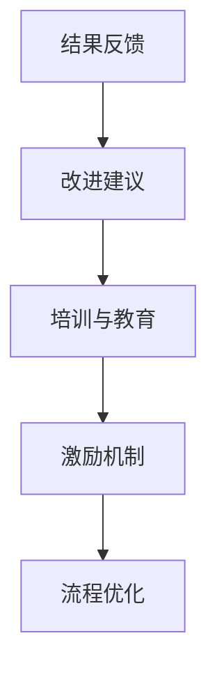

### 4.2 创新文化的改进措施

创新文化评估的结果为组织改进创新文化提供了重要的参考。以下是一些具体的改进措施：

#### 4.2.1 针对评估结果的调整

1. **优化创新流程**：根据评估结果，对创新流程进行优化，提高效率。
2. **改进激励机制**：调整激励机制，使创新成果与员工的个人利益紧密挂钩。
3. **加强培训与教育**：针对员工创新能力的不足，加强培训和教育的力度。

#### 4.2.2 内部沟通与协作的优化

1. **建立沟通渠道**：建立内部沟通渠道，鼓励员工自由表达意见和建议。
2. **加强跨部门协作**：通过跨部门协作，促进知识的共享和创新项目的顺利进行。

#### 4.2.3 创新文化的持续更新与发展

1. **定期评估**：定期对创新文化进行评估，确保其与组织战略和市场需求保持一致。
2. **持续改进**：根据评估结果和市场需求，不断调整和创新文化，保持其活力和适应性。
3. **外部借鉴**：学习借鉴其他组织成功创新的经验，吸取先进的管理理念和做法。

### 结论

创新文化的评估与改进是构建和维护创新文化的重要环节。通过科学、系统的评估指标和方法，组织可以准确了解创新文化的现状，发现存在的问题，并采取针对性的改进措施。持续优化创新文化，不仅能够提高组织的创新能力和竞争力，还能促进组织的可持续发展。


### 5.1 国内外创新文化营造的成功案例

在全球范围内，许多组织通过营造创新文化取得了显著的成功。以下是一些国内外创新文化的成功案例，包括企业、学校及政府组织的创新文化实践，以及它们的共性特征、个性差异和对组织创新的启示。

#### 企业A的创新文化实践

**案例描述**：企业A是一家全球领先的科技公司，以其创新文化和卓越的技术研发能力著称。企业A通过以下几个关键措施营造创新文化：

1. **开放的创新平台**：企业A建立了开放的研发平台，鼓励内部员工和外部合作伙伴共同参与创新项目。
2. **灵活的工作制度**：企业A推行灵活的工作制度，允许员工自主安排工作时间和工作地点，激发员工的创新潜力。
3. **跨部门协作**：通过跨部门项目团队，企业A促进了不同部门和团队的协作，加速了创新成果的转化和应用。

**共性特征**：企业A的创新文化具有以下几个共性特征：

1. **开放性**：鼓励内部员工和外部合作伙伴共同参与创新。
2. **灵活性**：提供灵活的工作制度和环境，支持员工自主创新。
3. **跨部门协作**：通过跨部门项目团队，促进知识的共享和创新项目的顺利进行。

**个性差异**：尽管企业A的创新文化具有共性特征，但与其他组织相比，其个性差异在于：

1. **技术积累**：企业A在技术研发方面具有深厚的积累，能够为创新提供强大的技术支持。
2. **市场导向**：企业A注重市场需求的洞察，使创新成果更加贴近市场，提高市场竞争力。

**对组织创新的启示**：企业A的创新文化实践表明，开放性、灵活性和跨部门协作是营造创新文化的重要要素。同时，技术积累和市场导向是创新成功的关键因素。组织在构建创新文化时，应注重这些方面的结合，以实现持续的创新能力和竞争力。

#### 企业B的创新文化转型

**案例描述**：企业B是一家传统的制造业公司，面临着数字化转型和市场竞争的挑战。为了应对这些挑战，企业B进行了一系列创新文化的转型：

1. **领导层的支持**：企业B的领导层高度重视创新，积极推动创新文化的转型。
2. **创新团队的组建**：企业B组建了专门的创新团队，负责推进创新项目和跨部门协作。
3. **员工培训与激励**：企业B通过培训和激励机制，提高员工的创新意识和能力，激发员工的创新潜力。

**共性特征**：企业B的创新文化转型具有以下几个共性特征：

1. **领导层的支持**：高层领导对创新的重视和支持是创新文化成功转型的基础。
2. **专业团队的组建**：专门创新团队的组建有助于集中资源和力量，推动创新项目。
3. **员工培训与激励**：通过培训和激励机制，提高员工的创新意识和能力。

**个性差异**：企业B的创新文化转型与其他组织相比，其个性差异在于：

1. **战略导向**：企业B在创新文化转型过程中，明确了战略方向，确保创新与企业发展目标的一致性。
2. **文化变革**：企业B在创新文化转型过程中，进行了深层次的文化变革，使员工能够真正接受并实践创新。

**对组织创新的启示**：企业B的创新文化转型表明，领导层的支持、专业团队的组建和员工培训与激励是推动创新文化成功转型的重要保障。同时，战略导向和文化变革是创新文化持续发展的关键。组织在推动创新文化转型时，应综合考虑这些因素，以确保创新的可持续性。

#### 政府C的创新文化推动

**案例描述**：政府C为了推动区域创新发展，采取了一系列措施营造创新文化：

1. **政策支持**：政府C出台了一系列鼓励创新的政策，包括研发资金支持、税收优惠等，为创新提供政策保障。
2. **创新平台建设**：政府C建立了多个创新平台，包括科技园区、创业中心等，为创新项目提供基础设施支持。
3. **公共服务**：政府C提供了一系列公共服务，包括知识产权保护、技术转移等，为创新提供便捷的服务。

**共性特征**：政府C的创新文化推动具有以下几个共性特征：

1. **政策支持**：政策的引导和支持是创新文化成功推动的关键。
2. **平台建设**：创新平台的建设有助于集聚创新资源和人才，促进创新活动的开展。
3. **公共服务**：公共服务的提供有助于解决创新过程中的实际问题，降低创新风险。

**个性差异**：政府C的创新文化推动与其他政府组织相比，其个性差异在于：

1. **区域特色**：政府C在创新文化推动过程中，充分考虑了区域特色和产业发展需求，使创新活动更加贴近实际。
2. **多方参与**：政府C积极引导多方参与创新，包括企业、高校、科研机构等，形成协同创新的格局。

**对组织创新的启示**：政府C的创新文化推动表明，政策支持、平台建设和公共服务是推动创新文化成功的关键因素。同时，区域特色和多方参与是创新文化持续发展的重要保障。组织在推动创新文化时，应结合自身特点，充分利用政策、平台和公共资源，形成协同创新的环境。

### 案例启示与借鉴

以上成功案例表明，创新文化的营造需要组织从多个方面进行综合考虑和实施。以下是一些共性启示和借鉴：

1. **领导层的重视和支持**：领导层对创新的重视和支持是创新文化成功的基础。
2. **专业团队的组建**：专业的创新团队有助于集中资源和力量，推动创新项目。
3. **员工培训与激励**：通过培训和激励机制，提高员工的创新意识和能力。
4. **政策支持**：政策的引导和支持有助于营造良好的创新环境。
5. **平台建设**：创新平台的建设有助于集聚创新资源和人才。
6. **公共服务**：公共服务的提供有助于解决创新过程中的实际问题。
7. **区域特色**：结合区域特色和产业发展需求，使创新活动更加贴近实际。
8. **多方参与**：引导多方参与创新，形成协同创新的格局。

组织在构建创新文化时，可以借鉴这些成功经验，结合自身实际情况，制定合适的创新策略和措施，以实现持续的创新能力和竞争力。


### 总结与展望

通过本文的探讨，我们可以清晰地看到创新文化对于组织发展的至关重要性。创新文化不仅是一种价值观和行为的体现，更是组织在激烈的市场竞争中保持优势的关键。

#### 6.1 创新文化的价值重申

创新文化的价值主要体现在以下几个方面：

1. **提高竞争力**：创新文化鼓励员工不断尝试和探索新的方法，使组织能够快速适应市场变化，提供差异化的产品和服务，从而提升竞争力。
2. **促进持续发展**：创新文化能够激发员工的创造力和潜能，推动组织不断实现新的突破和进步，确保组织的可持续发展。
3. **增强团队凝聚力**：创新文化强调合作和共享，通过共同的目标和价值观，增强团队成员之间的凝聚力和协作精神。
4. **提升员工满意度**：创新文化为员工提供自由和开放的成长空间，激发员工的积极性和创造力，从而提高员工的工作满意度和忠诚度。

#### 6.1.1 创新文化在组织中的地位

创新文化在组织中占据着核心地位。它是组织战略的指导方针，是组织运营和管理的基础。创新文化不仅影响组织的决策和行动，更塑造了组织的核心竞争力和企业文化。一个具有强大创新文化的组织，能够在快速变化的市场环境中迅速响应，捕捉新的商业机会，实现持续发展。

#### 6.1.2 创新文化对企业竞争力的提升

创新文化对企业竞争力的提升具有深远的影响。首先，创新文化能够激发员工的创造力，使组织具备不断推陈出新的能力。其次，创新文化能够促进知识的共享和传承，使组织在技术、管理和运营等方面持续改进。最后，创新文化能够形成组织内部的创新氛围，吸引和留住优秀的创新人才，从而保持组织的持续创新能力。

#### 6.1.3 创新文化的长期影响

创新文化对组织的长期影响不可忽视。它不仅能够提升组织的短期业绩和竞争力，更能够为组织奠定持续发展的基础。通过创新文化的培养和传承，组织能够不断适应市场和技术环境的变化，实现长期的发展目标。此外，创新文化还能够提升组织的品牌价值和社会影响力，为组织赢得更广泛的认可和支持。

### 6.2 未来创新文化的发展趋势

随着科技的进步和全球化的深入，创新文化在未来将呈现以下发展趋势：

#### 6.2.1 数字化与智能化趋势

数字化与智能化是未来创新文化的重要趋势。随着大数据、人工智能、云计算等技术的发展，组织将能够更加高效地收集、分析和利用数据，从而推动创新的深度和广度。数字化和智能化技术将为创新提供新的工具和方法，使创新过程更加科学和系统。

#### 6.2.2 新型组织模式的出现

随着创新文化的普及，新型组织模式将不断涌现。这些新型组织模式将更加灵活、开放和协作，以适应快速变化的市场环境。例如，平台型组织、网络化组织等新型模式，将能够更好地整合外部资源和知识，推动创新活动的开展。

#### 6.2.3 创新文化与可持续发展的融合

创新文化与可持续发展的融合将成为未来创新文化的一个重要趋势。随着全球对可持续发展关注度的提高，组织将更加注重创新对环境、社会和经济的影响。创新文化将不仅关注技术进步，更关注如何通过创新实现可持续发展目标。

### 结论

创新文化是组织持续发展的关键驱动力。通过构建和培育创新文化，组织能够提升竞争力、实现持续发展和增强员工满意度。未来，创新文化将随着数字化和智能化的趋势，以及新型组织模式的出现，不断演变和升级。组织应积极应对这些变化，不断提升创新文化的质量和水平，为组织的未来发展奠定坚实的基础。

---

感谢您阅读本文。希望本文能够为您提供关于创新文化构建的深入见解和实践指导。如果您有任何反馈或建议，欢迎随时与我们分享。让我们共同探索创新文化的无限可能，推动组织的持续进步。

**作者：AI天才研究院/AI Genius Institute & 禅与计算机程序设计艺术 /Zen And The Art of Computer Programming**


---

### 附录A：创新文化营造的工具与资源

在构建和培育创新文化过程中，组织可以借助多种工具和资源来提升创新效率和效果。以下是一些主要的工具和资源推荐：

#### A.1 常用创新方法简介

1. **头脑风暴**：一种集体思维发散方法，通过快速产生大量创意来解决问题。
2. **设计思维**：一种以用户为中心的创新方法，通过迭代和用户反馈来不断改进产品和服务。
3. **六顶思考帽**：由爱德华·德·波诺提出的一种思维训练方法，通过不同颜色的“思考帽”来引导多角度思考。
4. **TRIZ**：一种基于理论的基础上的创新问题解决方法，通过解决矛盾和问题来寻找创新解决方案。

#### A.2 创新资源平台推荐

1. **InnovationExcellence.com**：提供创新策略、工具和案例分析，是创新实践者的重要参考资源。
2. **IDEO.org**：全球领先的创新设计咨询公司，提供丰富的创新实践案例和设计思维资源。
3. **Cognitiveworld.com**：专注于设计思维和认知科学领域的资源，提供一系列培训材料和工具。
4. **InnovationManagement.org**：提供创新管理的最新研究和实践，包括案例分析、工具和最佳实践。

#### A.3 创新相关书籍推荐

1. **《创新者的窘境》**：克莱顿·克里斯坦森的经典之作，揭示了组织如何避免陷入创新困境。
2. **《设计思维》**：大卫·凯利的著作，详细介绍设计思维的方法和应用。
3. **《创意的根源》**：史蒂芬·平克对创意的深度探讨，解释了创意产生的心理机制。
4. **《创意的秩序》**：艾伦·维茨对创意管理的深入研究和实践指导。
5. **《创新者的基因》**：史蒂夫·布兰克通过心理学和行为科学的角度分析创新者的特征和习惯。

通过使用这些工具和资源，组织可以更好地理解创新文化的内涵，掌握创新的实践方法，并有效地推动创新文化的建设和实践。


### 附录B：创新文化评估工具

为了有效评估创新文化，组织需要建立一套科学、系统的评估工具。以下内容包括创新文化评估问卷、评估指标体系说明以及评估案例分析的示例。

#### B.1 创新文化评估问卷

创新文化评估问卷是评估员工和管理者对创新文化认知和实践情况的重要工具。以下是一个简单的评估问卷示例：

**问卷标题**：创新文化评估问卷

1. 您认为组织是否鼓励创新？（1-完全不同意，5-完全同意）
2. 您是否觉得在组织中有足够的资源支持创新？（1-完全不同意，5-完全同意）
3. 您是否觉得组织的决策过程充分考虑了创新的潜力？（1-完全不同意，5-完全同意）
4. 您是否经常有机会参与到创新项目中？（1-从不，5-总是）
5. 您是否觉得失败被视为学习的机会而非惩罚？（1-完全不同意，5-完全同意）
6. 您是否认为组织内部的沟通和协作有利于创新？（1-完全不同意，5-完全同意）
7. 您是否对组织的创新文化感到满意？（1-非常不满意，5-非常满意）

**评分标准**：每题1-5分，总分7分。

#### B.2 创新文化评估指标体系说明

为了全面评估创新文化，我们可以从以下五个维度构建评估指标体系：

1. **创新氛围**：评估组织内部创新氛围的开放性、包容性和支持性。
   - 指标1：员工对创新的认同度。
   - 指标2：组织内部创新活动的参与度。
   - 指标3：组织对失败的态度。

2. **创新能力**：评估组织的创新能力和成果。
   - 指标1：新产品的研发数量。
   - 指标2：新技术的应用情况。
   - 指标3：创新项目的成功率。

3. **创新投入**：评估组织在创新方面的资源投入。
   - 指标1：研发投入的比例。
   - 指标2：培训与教育的投入。
   - 指标3：创新项目的资金支持。

4. **创新效率**：评估创新活动的效率和效果。
   - 指标1：创新的周期时间。
   - 指标2：创新的成本效益。
   - 指标3：创新成果的市场转化率。

5. **员工满意度**：评估员工对创新文化的满意度和工作积极性。
   - 指标1：员工的工作满意度。
   - 指标2：员工的忠诚度。
   - 指标3：员工的创新积极性。

#### B.3 创新文化评估案例分析

**案例标题**：公司X的创新文化评估

**案例描述**：公司X是一家大型科技公司，致力于通过创新提升市场竞争力。公司希望通过评估了解自身的创新文化现状，并找出改进方向。

**评估结果**：

- **创新氛围**：公司内部创新氛围较为开放，员工普遍认同创新的重要性。评估得分为4.2分。
- **创新能力**：公司在技术创新方面取得了显著成果，但市场转化率有待提高。评估得分为3.8分。
- **创新投入**：公司研发投入占比较高，但培训与教育投入不足。评估得分为3.5分。
- **创新效率**：创新周期时间较长，成本效益较低。评估得分为3.0分。
- **员工满意度**：员工对创新文化满意度较高，但部分员工反映在创新项目中缺乏支持。评估得分为4.5分。

**改进建议**：

- **提高创新氛围**：加强内部沟通，鼓励员工分享创新想法，提高失败容忍度。
- **提升创新能力**：增加市场调研力度，确保创新成果与市场需求匹配，提高创新项目的成功率。
- **增加创新投入**：提高培训与教育投入，增强员工的创新技能和知识储备。
- **优化创新效率**：缩短创新周期时间，提高成本效益，加强创新成果的市场转化。
- **提升员工满意度**：为员工提供更多创新支持，确保他们在创新项目中能够得到充分的资源和支持。

通过以上案例，我们可以看到，创新文化评估是一个系统化的过程，需要从多个维度进行全面分析，以发现优势和不足，并提出针对性的改进建议。这样的评估不仅有助于组织了解自身的创新文化现状，也为改进和创新文化的进一步建设提供了重要的依据。


### 总结

本文详细探讨了创新文化的概念、构建策略、试错机制、创新环境的营造、评估与改进，以及成功案例的启示。我们强调了创新文化在组织发展中的重要性，通过构建一个鼓励试错和创新的环境，组织能够激发员工的创造力，提高竞争力，实现持续发展。

首先，创新文化是一种以创新为核心价值观的文化，它体现在组织的价值观、行为模式、组织结构、流程和激励机制等各个方面。它鼓励员工勇于尝试，从失败中学习，从而推动组织不断创新。

其次，创新文化的构建需要系统化的策略，包括设定愿景与目标、建立开放沟通机制、创新人才培养与激励机制等。同时，通过分阶段的实施步骤，组织可以逐步建立起一个支持创新的文化环境。

试错机制是创新文化中不可或缺的一环，它为员工提供了一个安全、包容的环境，鼓励他们敢于尝试、勇于失败。试错机制的建立需要定义明确的目标、设计合理的方案、执行试错过程、评估结果并进行反馈改进。

创新环境的营造同样重要，它包括资源配置、空间规划和文化宣传等方面。一个良好的创新环境能够激发员工的创新潜能，提供必要的支持和资源，帮助他们在试错过程中取得成功。

评估与改进是确保创新文化有效性和持续性的关键。通过科学、系统的评估指标和方法，组织可以准确了解创新文化的现状，发现存在的问题，并采取针对性的改进措施。

最后，通过分析国内外成功案例，我们总结出了一些共性特征和个性差异，为其他组织提供了宝贵的经验和借鉴。

展望未来，随着数字化和智能化的趋势，创新文化将进一步演变。新型组织模式的出现和区域特色的重视，将为创新文化的发展提供新的机遇和挑战。组织应积极适应这些变化，不断提升创新文化的质量和水平，为组织的持续发展奠定坚实基础。

**关键词**：创新文化、试错机制、创新环境、评估与改进、成功案例、数字化转型

**摘要**：本文系统地探讨了创新文化的构建、试错机制的建立、创新环境的营造以及评估与改进策略，通过成功案例的分析，为组织提供了一系列实践指导和启示。创新文化是组织持续发展的关键驱动力，通过构建和培育创新文化，组织能够提升竞争力、实现持续发展和增强员工满意度。

