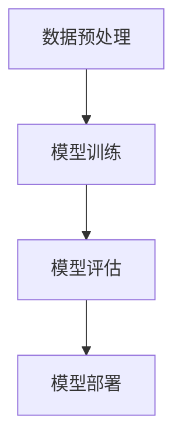

                 

# 《初创企业加速器：LLM 赋能创新》

> **关键词：初创企业、LLM、赋能、创新、技术加速器**
>
> **摘要：本文深入探讨了初创企业在竞争激烈的市场中如何借助大型语言模型（LLM）实现加速发展。通过剖析LLM技术原理及其应用，结合实际案例，展示了初创企业如何利用这项先进技术实现产品和服务创新，提高市场竞争力。**

## 目录大纲

### 《初创企业加速器：LLM 赋能创新》目录大纲

#### 第一部分：初创企业概述与挑战

1. **第1章 初创企业背景与目标市场**
    - 1.1 初创企业定义与特点
    - 1.2 初创企业的挑战
    - 1.3 市场定位与目标用户分析

2. **第2章 初创企业核心业务分析与规划**
    - 2.1 业务模式创新与设计
    - 2.2 市场细分与竞争分析
    - 2.3 产品/服务规划与迭代

3. **第3章 初创企业融资策略与资源管理**
    - 3.1 融资渠道与融资方式
    - 3.2 资金使用与预算管理
    - 3.3 资源整合与团队建设

#### 第二部分：LLM技术概述与原理

4. **第4章 LLM技术基础与核心概念**
    - 4.1 自然语言处理与深度学习
    - 4.2 语言模型的基本原理
    - 4.3 LLM的主要类型及应用场景

5. **第5章 LLM架构与实现**
    - 5.1 神经网络与深度学习框架
    - 5.2 预训练与微调
    - 5.3 语言模型训练策略与调优

6. **第6章 LLM在初创企业中的应用**
    - 6.1 AI驱动的客户服务与支持
    - 6.2 数据分析与业务洞察
    - 6.3 业务流程自动化与优化

7. **第7章 LLM在初创企业中的实践案例**
    - 7.1 案例一：智能客服系统的设计与部署
    - 7.2 案例二：数据分析平台的构建与应用
    - 7.3 案例三：业务流程优化的案例解析

#### 第三部分：初创企业加速器的构建与运营

8. **第8章 初创企业加速器概念与模式**
    - 8.1 加速器的发展历程与分类
    - 8.2 加速器的核心功能与作用
    - 8.3 构建初创企业加速器的策略

9. **第9章 初创企业加速器的运营与管理**
    - 9.1 人才招募与培训
    - 9.2 资源共享与协作平台建设
    - 9.3 项目孵化与退出机制

10. **第10章 成功加速器的案例分析**
    - 10.1 加速器成功的因素分析
    - 10.2 持续创新与迭代
    - 10.3 加速器的未来发展趋势

#### 附录

11. **附录 A: 相关资源与工具**
    - 11.1 LLM技术资源
    - 11.2 初创企业加速器案例研究
    - 11.3 开发工具与平台介绍

---

### 引言

在当前快速变化的商业环境中，初创企业面临着前所未有的机遇和挑战。市场的变化速度之快，消费者需求的多样化，以及技术的迅猛发展，都要求初创企业必须具备快速适应和创新的能力。然而，大多数初创企业由于资源有限，难以在短时间内实现技术和市场的突破。

在这种情况下，大型语言模型（LLM）的出现为初创企业带来了新的希望。LLM是一种基于深度学习的技术，能够对自然语言进行理解和生成。通过LLM，初创企业可以实现自动化客户服务、数据分析和业务流程优化，从而在短时间内提升效率和竞争力。

本文将详细探讨LLM技术在初创企业中的应用，分析其在提升初创企业竞争力方面的优势，并分享一些实际案例，以帮助初创企业更好地利用这项技术实现创新和发展。本文旨在为初创企业提供一份实用指南，帮助他们在激烈的市场竞争中脱颖而出。

---

### 第一部分：初创企业概述与挑战

#### 第1章 初创企业背景与目标市场

##### 1.1 初创企业定义与特点

初创企业通常指的是那些刚刚成立，尚未在市场中站稳脚跟的企业。这些企业通常由一个或几个创始人发起，拥有明确但尚未完全验证的市场机会。与成熟企业相比，初创企业通常具有以下几个特点：

- **资源有限**：初创企业在成立初期，通常没有雄厚的资金支持，需要依靠创始人和早期投资者的资金。这使得初创企业在资源配置方面受到很大限制。
- **市场不确定性**：初创企业面临的市场环境通常是未知的，需要通过市场调研和产品迭代来不断验证和调整自己的市场策略。
- **快速成长**：初创企业的目标通常是迅速扩大市场份额，获得用户和投资者的认可，以实现可持续的商业成功。
- **创新能力**：初创企业需要持续创新，以保持市场竞争力，满足不断变化的市场需求。

##### 1.2 初创企业的挑战

初创企业在发展过程中会遇到多种挑战，主要包括以下几个方面：

- **资金短缺**：初创企业在成立初期，往往无法获得足够的资金支持，这使得它们在市场推广、产品开发和团队建设方面面临困难。
- **市场竞争**：初创企业通常面临强大的竞争对手，这些竞争对手可能拥有更多的资源、更成熟的产品和市场经验。
- **技术风险**：初创企业往往依赖新技术，这些技术可能尚未经过充分验证，存在一定的风险。
- **人才招聘**：初创企业需要吸引和留住优秀的人才，但这一点对于资源有限的初创企业来说尤其困难。
- **市场定位**：初创企业需要准确识别目标市场，并针对目标用户的需求开发产品和服务，但这一过程往往充满不确定性。

##### 1.3 市场定位与目标用户分析

市场定位是初创企业成功的关键因素之一。初创企业需要通过市场定位来明确自己的产品和服务在市场中的位置，以及目标用户的特征。以下是市场定位和目标用户分析的关键步骤：

1. **市场细分**：根据市场需求和用户特征，将市场划分为若干个具有相似需求和行为的细分市场。
2. **目标用户识别**：在细分市场中，识别出最具潜力和最符合企业战略目标的目标用户。
3. **用户需求分析**：深入了解目标用户的需求、偏好和行为模式，以便为企业产品和服务设计提供依据。
4. **竞争分析**：分析目标市场中主要竞争对手的产品和服务，识别自身的竞争优势和差异化策略。

通过以上步骤，初创企业可以更准确地定位市场，设计出符合用户需求的产品和服务，从而在竞争激烈的市场中找到自己的立足点。

---

### 第2章 初创企业核心业务分析与规划

##### 2.1 业务模式创新与设计

业务模式创新是初创企业实现可持续发展的关键。通过创新业务模式，初创企业可以在有限的资源下，最大化地利用市场机会，提高竞争力。以下是一些常见的业务模式创新方法：

1. **平台化运营**：初创企业可以通过建立平台，连接供需双方，实现资源共享和利益分配。例如，共享经济模式就是一种平台化运营的典型例子。
2. **订阅制服务**：通过提供订阅制服务，初创企业可以建立稳定的现金流，同时降低客户的购买门槛。例如，许多在线教育平台采用订阅制服务模式。
3. **生态链建设**：通过构建生态链，初创企业可以整合上下游资源，实现协同发展。例如，一些科技初创企业通过建立开发者社区，吸引更多的开发者参与产品开发。
4. **跨界合作**：通过跨界合作，初创企业可以借助其他行业的资源和经验，实现业务模式的创新。例如，一些初创企业通过与零售商合作，推出独特的商品组合。

##### 2.2 市场细分与竞争分析

市场细分是初创企业进行市场定位的重要步骤。通过市场细分，初创企业可以更准确地识别目标市场，设计更有针对性的营销策略。以下是一些市场细分的方法：

1. **地理细分**：根据地理区域将市场划分为不同的子市场，适用于地理位置对消费者行为有显著影响的企业。
2. **人口细分**：根据人口统计特征，如年龄、性别、收入等，将市场划分为不同的子市场，适用于产品或服务具有明显人口特征差异的企业。
3. **行为细分**：根据消费者的购买行为、使用习惯等将市场划分为不同的子市场，适用于注重消费者行为的营销策略。
4. **心理细分**：根据消费者的心理特征，如价值观、兴趣爱好等，将市场划分为不同的子市场，适用于追求心理共鸣的营销策略。

在市场细分之后，初创企业需要对竞争对手进行分析。以下是一些竞争分析的步骤：

1. **竞争对手识别**：识别出在同一市场中与自己直接竞争的其他企业。
2. **竞争对手分析**：分析竞争对手的产品、服务、市场策略、优势和劣势等。
3. **差异化策略**：基于竞争对手分析，设计出能够突出自己竞争优势的差异化策略。

##### 2.3 产品/服务规划与迭代

初创企业的产品/服务规划是一个动态的过程，需要根据市场反馈和技术发展不断进行调整和迭代。以下是一些关键步骤：

1. **需求分析**：通过市场调研、用户访谈等方式，深入了解目标用户的需求。
2. **产品设计**：根据需求分析，设计出符合用户需求的产品原型。
3. **市场测试**：通过市场测试，验证产品原型的市场接受度，收集用户反馈。
4. **产品迭代**：根据市场测试结果，对产品进行迭代优化，不断提升用户体验。
5. **持续迭代**：在产品上线后，持续收集用户反馈，进行迭代优化，确保产品始终符合市场需求。

通过以上步骤，初创企业可以不断提升产品的竞争力，实现持续发展和成功。

---

### 第3章 初创企业融资策略与资源管理

##### 3.1 融资渠道与融资方式

初创企业在发展过程中，需要通过多种融资渠道获取资金，以满足业务拓展的需求。以下是一些常见的融资渠道和融资方式：

1. **天使投资**：天使投资是指个人投资者对初创企业进行早期的投资。这种融资方式通常在初创企业的种子阶段使用，可以提供资金支持，同时带来一定的资源和社会关系。
2. **风险投资**：风险投资是指专业投资机构对有潜力的初创企业进行投资。风险投资通常在初创企业的成长阶段使用，具有资金量大、投资期限长的特点。
3. **银行贷款**：初创企业可以通过银行贷款获取资金，但银行贷款通常要求较高的担保和还款能力，适用于有稳定现金流和良好信誉的初创企业。
4. **众筹**：众筹是指通过互联网平台，向公众筹集资金。众筹不仅可以提供资金支持，还可以帮助企业进行市场推广和产品测试。
5. **政府资金**：许多国家和地区都提供针对初创企业的政府资金支持，如创新基金、补贴等。初创企业可以通过申请这些资金，缓解资金压力。

##### 3.2 资金使用与预算管理

初创企业在获取资金后，需要合理使用资金，以确保资金的最高效利用。以下是一些资金使用和预算管理的建议：

1. **明确资金用途**：在获取资金前，初创企业应明确资金的具体用途，如产品开发、市场推广、团队建设等。
2. **制定预算计划**：根据资金用途，制定详细的预算计划，包括每个项目的预算分配、时间安排和预期成果。
3. **监控资金使用**：定期监控资金使用情况，确保资金按计划使用，及时发现和解决资金使用中的问题。
4. **优化资金结构**：合理配置资金结构，确保资金在不同项目之间的合理分配，避免资源浪费。
5. **成本控制**：严格控制成本，通过优化流程、降低不必要的开支等方式，提高资金使用效率。

##### 3.3 资源整合与团队建设

资源整合和团队建设是初创企业成功的关键因素。以下是一些资源整合和团队建设的建议：

1. **外部资源整合**：通过合作、并购等方式，整合外部资源，如技术、市场、人才等，提高企业的竞争力。
2. **内部资源整合**：优化内部资源，如人力资源、财务资源、技术资源等，提高资源利用效率。
3. **团队建设**：建立高效的团队，通过明确分工、提高沟通效率、加强团队协作等方式，提高团队执行力。
4. **人才培养**：注重人才培养，通过内部培训和外部引进等方式，提升团队整体素质和技能水平。
5. **企业文化**：建立积极向上的企业文化，营造良好的工作氛围，增强团队的凝聚力和向心力。

通过合理的融资策略和资源管理，初创企业可以确保在有限的资源下实现最大化的业务发展。

---

### 第二部分：LLM技术概述与原理

#### 第4章 LLM技术基础与核心概念

##### 4.1 自然语言处理与深度学习

自然语言处理（NLP）是计算机科学和人工智能领域的一个分支，旨在让计算机理解和生成人类语言。深度学习是NLP中一种重要的技术，通过神经网络模型对大量文本数据进行学习，从而实现语言的理解和生成。

**NLP的基本概念**：

- **语言模型**：语言模型是一种统计模型，用于预测文本序列中下一个词或词组。例如，给定一个句子“我喜欢吃苹果”，语言模型可以预测下一个词是“苹果”。
- **词向量表示**：词向量是将词汇映射到高维空间中的向量，通过向量之间的距离和角度来表示词汇的含义和关系。常见的词向量表示方法有Word2Vec、GloVe等。
- **序列模型**：序列模型用于处理和时间相关的数据，如文本、语音等。RNN（循环神经网络）和LSTM（长短时记忆网络）是常用的序列模型。

**深度学习基础**：

- **神经网络结构**：神经网络是一种由大量神经元（节点）组成的计算模型，通过学习输入和输出之间的关系，实现对数据的建模。常见的神经网络结构有前馈神经网络、卷积神经网络（CNN）等。
- **深度学习框架**：深度学习框架是一种用于构建和训练深度神经网络的软件工具，如TensorFlow、PyTorch、MXNet等。这些框架提供了丰富的API和工具，大大简化了深度学习的开发过程。
- **深度学习优化算法**：深度学习优化算法用于调整神经网络的参数，以最小化损失函数。常见的优化算法有SGD（随机梯度下降）、Adam（自适应梯度下降）等。

##### 4.2 语言模型的基本原理

语言模型是NLP中最重要的组成部分，用于预测文本序列中的下一个词或词组。以下是一些关键概念：

- **预测下一个词**：语言模型的核心任务是根据前面的词或词组，预测下一个词。例如，给定一个句子“我喜欢吃苹果”，语言模型可以预测下一个词是“苹果”。
- **语言模型评价标准**：评估语言模型性能的主要指标包括准确率、召回率、F1值等。这些指标用于衡量模型在预测词序列时的准确性。
- **语言模型的分类**：语言模型可以根据训练数据的使用方式分为有监督语言模型、无监督语言模型和自监督语言模型。有监督语言模型使用带有标签的训练数据，无监督语言模型不使用标签，自监督语言模型通过预训练然后微调。

##### 4.3 LLM的主要类型及应用场景

LLM有多种类型，每种类型都有其特定的应用场景：

- **零次交互模型**：这类模型不需要与用户进行任何交互，即可提供高质量的文本生成和翻译服务。例如，自动摘要、机器翻译等。
- **低频交互模型**：这类模型主要用于处理用户不频繁的查询，如搜索引擎、问答系统等。它们可以在用户查询时，根据上下文提供相关答案。
- **高频交互模型**：这类模型主要用于处理用户高频次的交互，如智能客服、聊天机器人等。它们可以实时理解用户的问题，并提供即时的回复。

LLM在初创企业中的应用：

- **AI驱动的客户服务与支持**：通过LLM技术，初创企业可以构建智能客服系统，提供24/7的客户支持，提高客户满意度。
- **数据分析与业务洞察**：LLM可以帮助初创企业分析大量数据，提取关键信息和趋势，为决策提供支持。
- **业务流程自动化与优化**：LLM可以自动化处理重复性任务，如订单处理、财务管理等，提高运营效率。

通过了解LLM技术的基本原理和应用，初创企业可以更好地利用这项技术，实现业务创新和发展。

---

#### 第5章 LLM架构与实现

##### 5.1 神经网络与深度学习框架

**神经网络结构**：

神经网络由大量的神经元（节点）组成，每个神经元都可以接收输入信号，通过权重和偏置进行计算，最终输出一个激活值。以下是一些常见的神经网络结构：

- **前馈神经网络（FFN）**：前馈神经网络是最简单的神经网络结构，信息从输入层流向输出层，没有循环结构。其计算过程如下：
  $$ z = W \cdot x + b $$
  $$ a = \sigma(z) $$
  其中，$W$ 和 $b$ 分别是权重和偏置，$x$ 是输入，$a$ 是输出，$\sigma$ 是激活函数（例如ReLU、Sigmoid、Tanh）。

- **卷积神经网络（CNN）**：卷积神经网络主要用于处理图像数据，通过卷积操作和池化操作提取图像特征。其计算过程如下：
  $$ h_{c}^{(l)} = \sum_{k} W_{k} \cdot h_{c-k}^{(l-1)} + b $$
  $$ p_{c}^{(l)} = \max(h_{c}^{(l)}) $$
  其中，$h_{c}^{(l)}$ 是卷积操作的输出，$p_{c}^{(l)}$ 是池化操作的输出，$W_{k}$ 和 $b$ 分别是卷积核和偏置。

**深度学习框架**：

深度学习框架是构建和训练深度神经网络的工具，常见的框架有TensorFlow、PyTorch、MXNet等。以下是一些核心概念：

- **TensorFlow**：TensorFlow是一个开源的深度学习框架，由Google开发。它提供了丰富的API和工具，支持各种深度学习任务。
- **PyTorch**：PyTorch是一个开源的深度学习框架，由Facebook开发。它以其动态计算图和灵活的API而闻名，广泛应用于研究与应用开发。
- **MXNet**：MXNet是一个开源的深度学习框架，由Apache基金会开发。它支持多种编程语言，提供了高效的计算性能和灵活的部署方式。

**架构设计**：

神经网络和深度学习框架的架构设计是关键因素，决定了模型的性能和可扩展性。以下是一些关键点：

- **模型架构**：根据任务需求，设计合适的神经网络架构。例如，对于文本分类任务，可以使用BERT或GPT等预训练模型。
- **数据流设计**：设计高效的数据流，确保数据在训练和推理过程中的高效传输和处理。常见的数据流设计包括数据批处理、流水线处理等。
- **训练与推理流程**：定义训练和推理的流程，包括数据预处理、模型训练、模型评估和模型部署等步骤。以下是一个简化的流程：



通过合理的神经网络和深度学习框架架构设计，初创企业可以构建高效的LLM模型，为业务发展提供技术支持。

##### 5.2 预训练与微调

**预训练**：

预训练是指在大规模语料库上进行模型训练，使模型掌握通用语言特征和知识。以下是一些关键点：

- **预训练任务**：常见的预训练任务包括语言建模、填空任务、句子排序等。这些任务可以帮助模型理解语言的上下文和语义关系。
- **预训练数据集**：常用的预训练数据集有Common Crawl、Wikipedia、新闻语料库等。这些数据集包含大量的文本信息，有助于模型学习丰富的语言特征。

**微调**：

微调是指在使用预训练模型的基础上，针对特定任务进行训练，使其适应特定领域的任务。以下是一些关键点：

- **微调策略**：微调策略包括全量微调、半量微调、增量微调等。全量微调使用全部的预训练模型参数，适用于资源充足的情况；半量微调和增量微调则只更新部分参数，适用于资源有限的情况。
- **微调效果评估**：微调效果评估是确保模型性能的关键步骤。常用的评估指标包括准确率、召回率、F1值等。

以下是一个简化的微调过程伪代码：

```python
# 预训练模型加载
pretrained_model = load_pretrained_model()

# 数据预处理
train_data, val_data = preprocess_data()

# 微调模型参数
for epoch in range(num_epochs):
    for batch in train_data:
        # 前向传播
        logits = pretrained_model(batch)
        # 计算损失
        loss = compute_loss(logits, labels)
        # 反向传播
        optimizer.backward(loss)
        # 更新参数
        optimizer.step()

    # 微调效果评估
    val_logits = pretrained_model(val_data)
    val_loss = compute_loss(val_logits, val_labels)
    print(f"Epoch {epoch}: Validation Loss: {val_loss}")

# 微调后的模型保存
save_model(pretrained_model)
```

通过预训练和微调，初创企业可以构建适应特定任务的LLM模型，提高业务效率和竞争力。

##### 5.3 语言模型训练策略与调优

**训练策略**：

训练策略是确保模型性能和稳定性的关键。以下是一些常见的训练策略：

- **批量大小（Batch Size）**：批量大小是每次训练中用于计算梯度的一组样本数量。较大的批量大小可以提高模型性能，但计算成本较高；较小的批量大小可以降低计算成本，但可能导致梯度噪声增加。
- **学习率调度（Learning Rate Schedule）**：学习率调度是一种调整学习率的方法，以避免过拟合和加速收敛。常见的学习率调度方法有线性下降、指数下降、余弦退火等。
- **正则化（Regularization）**：正则化是一种防止模型过拟合的技术。常见的方法有L1正则化、L2正则化、Dropout等。

**调优技巧**：

调优技巧是提高模型性能的关键。以下是一些常用的调优技巧：

- **数据增强（Data Augmentation）**：数据增强是一种通过人工或自动方式增加训练数据的方法，以提高模型的泛化能力。常见的方法有文本翻译、同义词替换、随机裁剪等。
- **模型正则化**：通过增加正则化项，可以抑制模型参数的过大变化，防止过拟合。常见的正则化方法有L1正则化、L2正则化等。
- **损失函数设计**：设计合理的损失函数可以更好地引导模型学习。常见的损失函数有交叉熵损失、均方误差损失等。

以下是一个简化的训练策略与调优过程伪代码：

```python
# 初始化模型和优化器
model = initialize_model()
optimizer = initialize_optimizer()

# 设置学习率调度
scheduler = LearningRateScheduler()

# 数据预处理
train_data, val_data = preprocess_data()

# 训练模型
for epoch in range(num_epochs):
    # 学习率调度
    scheduler.step(epoch)
    # 前向传播
    logits = model(train_data)
    # 计算损失
    loss = compute_loss(logits, labels)
    # 反向传播
    optimizer.backward(loss)
    # 更新参数
    optimizer.step()
    
    # 微调效果评估
    val_logits = model(val_data)
    val_loss = compute_loss(val_logits, val_labels)
    print(f"Epoch {epoch}: Validation Loss: {val_loss}")

# 模型保存
save_model(model)
```

通过合理的训练策略与调优技巧，初创企业可以构建高性能的LLM模型，为业务发展提供强大的技术支持。

---

### 第6章 LLM在初创企业中的应用

##### 6.1 AI驱动的客户服务与支持

AI驱动的客户服务与支持是初创企业提升客户满意度和运营效率的重要手段。通过LLM技术，初创企业可以实现智能客服系统，提供24/7的在线支持。以下是一些关键点：

**智能客服系统设计**：

1. **需求分析**：了解客户的需求和常见问题，确定客服系统需要解决的问题。
2. **系统架构设计**：构建包括语言模型、对话管理、意图识别、实体抽取等模块的智能客服系统架构。
3. **数据准备**：收集并整理与客户问题相关的数据，用于训练和优化语言模型。

**语言模型应用**：

1. **意图识别**：通过LLM技术，识别客户输入的意图，如咨询、投诉、求帮助等。
2. **实体抽取**：从客户输入中提取关键信息，如用户ID、订单号、问题描述等。
3. **回复生成**：根据识别的意图和提取的实体，生成合适的回复。

**交互界面设计**：

1. **文本交互**：设计自然语言交互界面，允许客户通过文本输入和接收回复。
2. **语音交互**：结合语音识别和语音合成技术，实现语音交互功能。
3. **多渠道集成**：将智能客服系统集成到不同的渠道，如网站、移动应用、社交媒体等。

**效果评估与优化**：

1. **用户反馈**：收集用户对智能客服系统的反馈，评估其性能和用户体验。
2. **模型调优**：根据用户反馈，优化语言模型和系统架构，提高客服质量。
3. **持续迭代**：定期更新客户问题和回复库，确保客服系统能够应对不断变化的需求。

##### 6.2 数据分析与业务洞察

数据分析是初创企业获取业务洞察、优化决策的重要工具。通过LLM技术，初创企业可以实现对大量文本数据的分析，提取有价值的信息。以下是一些关键点：

**数据分析流程**：

1. **数据采集**：收集与企业业务相关的数据，如用户评论、社交媒体数据、市场报告等。
2. **数据预处理**：清洗和格式化数据，去除噪声和重复信息，为后续分析做准备。
3. **特征工程**：从数据中提取关键特征，如关键词、主题、情感等，用于训练和优化语言模型。

**业务洞察**：

1. **客户行为分析**：分析客户的行为数据，了解客户的需求和偏好，优化产品和服务。
2. **市场趋势预测**：通过分析市场数据，预测市场趋势和竞争态势，为业务决策提供支持。
3. **产品优化建议**：基于用户反馈和数据分析，提出产品优化的建议，提高用户体验和满意度。

**效果评估与优化**：

1. **业务指标监控**：监控关键业务指标，如用户满意度、转化率、留存率等，评估数据分析的效果。
2. **模型调优**：根据业务指标和用户反馈，优化语言模型和数据分析算法，提高分析准确性和效率。
3. **持续迭代**：定期更新数据集和算法，确保数据分析的持续改进和优化。

##### 6.3 业务流程自动化与优化

业务流程自动化与优化是提升初创企业运营效率、降低成本的重要手段。通过LLM技术，初创企业可以实现自动化处理业务流程，提高运营效率。以下是一些关键点：

**业务流程自动化**：

1. **流程分析**：分析现有业务流程，识别可以自动化的环节和任务。
2. **自动化策略设计**：根据流程分析结果，设计自动化策略，如机器人流程自动化（RPA）、工作流管理等。
3. **系统集成**：将自动化系统与现有系统集成，确保自动化流程的顺利进行。

**业务流程优化**：

1. **流程重构**：通过分析业务流程，重构不合理的流程，提高流程效率和灵活性。
2. **优化策略制定**：制定优化策略，如流程简化和标准化、任务分配优化等。
3. **效果评估与反馈**：评估优化效果，根据反馈进行调整和改进。

**效果评估与优化**：

1. **效率指标监控**：监控业务流程的效率指标，如处理时间、错误率等，评估自动化和优化效果。
2. **成本控制**：通过自动化和优化，降低运营成本，提高企业盈利能力。
3. **持续改进**：定期评估和优化业务流程，确保运营效率的持续提升。

通过AI驱动的客户服务与支持、数据分析和业务洞察、业务流程自动化与优化，初创企业可以充分利用LLM技术，提高业务效率和竞争力。

---

### 第7章 LLM在初创企业中的实践案例

##### 7.1 案例一：智能客服系统的设计与部署

**案例背景**：

某初创企业是一家提供在线教育服务的公司，为了提升用户体验，他们决定开发一款智能客服系统，以实现24/7的在线支持。

**设计与实现**：

1. **需求分析**：通过用户调研和数据分析，识别出用户常见的咨询问题，如课程介绍、报名流程、支付问题等。
2. **系统架构设计**：构建包括语言模型、对话管理、意图识别、实体抽取等模块的智能客服系统架构。
3. **数据准备**：收集并整理与客户问题相关的数据，用于训练和优化语言模型。
4. **模型训练**：使用预训练模型，结合用户数据，进行微调和训练，提高模型在特定领域的性能。
5. **系统集成**：将智能客服系统集成到现有的在线教育平台，确保系统与业务流程无缝衔接。

**部署与运维**：

1. **部署**：在服务器上部署智能客服系统，确保其稳定运行。
2. **监控与维护**：定期监控系统性能，处理故障和异常，确保系统的高可用性。
3. **用户反馈与优化**：收集用户反馈，根据反馈调整和优化系统，提升用户体验。

**效果与评价**：

智能客服系统上线后，显著提高了客户满意度和运营效率。用户反馈积极，认为系统提供了及时、准确的支持。同时，系统降低了人工客服的工作量，节省了企业成本。

##### 7.2 案例二：数据分析平台的构建与应用

**案例背景**：

某初创企业是一家提供B2B服务的公司，他们希望通过数据分析，提高销售预测的准确性，优化业务决策。

**构建与实施**：

1. **需求分析**：分析企业业务数据，识别出关键指标，如客户留存率、转化率、销售额等。
2. **平台设计**：设计一个集数据采集、存储、处理、分析于一体的数据分析平台。
3. **数据采集与存储**：使用ETL（提取、转换、加载）工具，将业务数据从不同源采集并存储到数据仓库中。
4. **数据处理与分析**：使用LLM技术，对业务数据进行分析，提取关键信息和趋势。
5. **可视化与报告**：通过数据可视化工具，将分析结果呈现给决策者，生成报告。

**效果与评价**：

数据分析平台上线后，显著提高了销售预测的准确性，帮助企业更好地把握市场趋势。决策者可以根据分析结果，优化业务策略，提高业务效率。同时，平台降低了人工分析的负担，节省了人力资源。

##### 7.3 案例三：业务流程优化的案例解析

**案例背景**：

某初创企业是一家提供物流服务的公司，为了提高运营效率，他们决定对现有业务流程进行优化。

**实施步骤**：

1. **流程分析**：分析现有业务流程，识别出瓶颈和优化点。
2. **自动化策略设计**：设计自动化策略，如使用机器人流程自动化（RPA）工具，自动化处理重复性任务。
3. **系统集成**：将自动化系统与现有系统集成，确保自动化流程的顺利进行。
4. **效果评估**：评估自动化和优化效果，包括效率、成本、用户体验等。
5. **持续优化**：根据评估结果，调整和优化业务流程，确保其持续改进。

**效果与评价**：

业务流程优化后，显著提高了运营效率，降低了运营成本。自动化系统减少了人工干预，提高了任务处理的速度和准确性。用户反馈积极，认为优化后的流程更加高效和便捷。同时，企业可以通过持续优化，不断提高业务流程的效率和质量。

---

### 第三部分：初创企业加速器的构建与运营

#### 第8章 初创企业加速器概念与模式

##### 8.1 加速器的发展历程与分类

**发展历程**：

初创企业加速器（Startup Accelerator）起源于20世纪90年代的硅谷，旨在帮助初创企业快速发展。随着科技和创业环境的不断变化，加速器模式也在不断发展。以下是一些关键阶段：

1. **初创阶段**：加速器最早由天使投资者、风险投资家和科技园区管理者发起，旨在为初创企业提供资金、资源和支持。
2. **规模化阶段**：随着创业浪潮的兴起，加速器数量迅速增加，各种加速器项目在全球范围内推广，成为创业生态的重要组成部分。
3. **专业化阶段**：近年来，加速器开始更加注重专业化，针对特定行业或领域，提供更深入的支持和资源。

**分类**：

根据不同的标准和特点，初创企业加速器可以分为以下几类：

1. **地理位置分类**：根据加速器的地理位置，可以分为本地加速器、区域加速器和全球加速器。
2. **投资模式分类**：根据加速器的投资模式，可以分为免费加速器、付费加速器和混合模式加速器。
3. **功能分类**：根据加速器的主要功能，可以分为项目孵化器、资源整合平台、技术支持中心等。

##### 8.2 加速器的核心功能与作用

**核心功能**：

初创企业加速器的核心功能主要包括以下几个方面：

1. **项目孵化**：为初创企业提供办公空间、资金、资源等支持，帮助其快速成长。
2. **资源整合**：通过链接投资人、行业专家、技术合作伙伴等资源，为初创企业提供全方位的支持。
3. **技术支持**：提供技术培训、技术咨询、技术合作等支持，帮助初创企业解决技术难题。

**作用**：

初创企业加速器在初创企业发展中发挥着重要作用，具体包括：

1. **提升竞争力**：通过加速器的支持，初创企业可以更快地实现技术突破和市场拓展，提升竞争力。
2. **降低风险**：加速器提供的资源和指导，可以帮助初创企业降低创业风险，提高成功率。
3. **促进创新**：加速器通过聚集创业者、投资者、技术专家等，为初创企业提供创新的环境和机会。
4. **构建生态**：加速器通过链接不同行业和领域的资源，促进创业生态系统的建设和发展。

##### 8.3 构建初创企业加速器的策略

**选址策略**：

选址是构建初创企业加速器的重要环节，需要考虑以下几个方面：

1. **市场需求**：选择市场需求旺盛的地区，有利于初创企业的成长和发展。
2. **政策支持**：选择政府政策支持力度大的地区，有利于吸引创业者、投资人和技术人才。
3. **交通便利**：选择交通便利的地区，有利于初创企业与外界交流和合作。

**资源整合策略**：

资源整合是加速器成功的关键，需要考虑以下几个方面：

1. **资金支持**：通过政府资金、企业赞助、投资者等渠道，为初创企业提供充足的资金支持。
2. **人才引进**：通过招聘、合作等方式，引进行业专家、技术人才等，为初创企业提供技术支持。
3. **合作网络**：建立广泛的合作网络，包括投资人、企业、高校、科研机构等，为初创企业提供丰富的资源。

**项目筛选与评估策略**：

项目筛选和评估是加速器运营的重要环节，需要考虑以下几个方面：

1. **项目质量**：选择有潜力的项目，确保项目的质量和可行性。
2. **团队实力**：评估团队的背景、经验和能力，确保团队有足够的实力推进项目。
3. **市场前景**：评估项目的市场前景，确保项目具有可持续的商业价值。

通过合理的选址策略、资源整合策略和项目筛选与评估策略，初创企业加速器可以有效地帮助初创企业实现快速成长和发展。

---

#### 第9章 初创企业加速器的运营与管理

##### 9.1 人才招募与培训

**人才招募**：

初创企业加速器的成功离不开优秀的人才。人才招募是加速器运营的重要环节，需要考虑以下几个方面：

1. **职位需求**：根据加速器的业务需求，明确各个职位的需求，包括技术、市场、运营等。
2. **招聘渠道**：选择合适的招聘渠道，如线上招聘平台、校园招聘、猎头公司等。
3. **面试流程**：建立高效的面试流程，包括初步筛选、技术面试、综合面试等，确保招聘到合适的人才。

**人才培训**：

优秀的人才需要不断的培训和培养，以适应不断变化的工作环境和需求。以下是一些关键点：

1. **技能培训**：提供技能培训课程，包括技术技能、业务技能、管理技能等，帮助员工提升专业能力。
2. **文化培训**：通过企业文化培训，加强员工对加速器文化的认同和归属感。
3. **领导力培养**：提供领导力培训，帮助员工提升领导力和管理能力，为未来的职业发展打下基础。

通过合理的人才招募和培训策略，初创企业加速器可以建立一支高效、有竞争力的团队，为初创企业的成长和发展提供有力支持。

##### 9.2 资源共享与协作平台建设

**资源共享**：

资源共享是加速器的重要功能之一，通过资源整合和共享，可以提升初创企业的效率和竞争力。以下是一些关键点：

1. **资金资源**：为初创企业提供资金支持，包括政府资金、企业赞助、投资者资金等。
2. **技术资源**：提供技术支持，包括研发工具、实验室设备、技术咨询服务等。
3. **市场资源**：提供市场资源，包括市场调研、品牌推广、销售渠道等。

**协作平台建设**：

协作平台是加速器内部和外部资源整合的重要工具，以下是一些关键点：

1. **在线协作工具**：提供在线协作工具，如项目管理系统、邮件系统、文档共享系统等，提高团队协作效率。
2. **交流平台**：建立内部交流平台，如内部邮件、内部论坛、定期会议等，促进团队成员之间的沟通和交流。
3. **外部协作**：与外部合作伙伴建立协作关系，如投资者、企业、高校、科研机构等，共同推进项目的进展。

通过资源共享和协作平台建设，初创企业加速器可以有效地整合内部和外部资源，为初创企业提供全方位的支持。

##### 9.3 项目孵化与退出机制

**项目孵化**：

项目孵化是加速器的核心功能之一，通过提供全方位的支持，帮助初创企业快速成长。以下是一些关键点：

1. **项目筛选**：对申请孵化的项目进行筛选，选择有潜力的项目进行孵化。
2. **资源支持**：为孵化项目提供资金、技术、市场等资源，帮助项目快速推进。
3. **项目评估**：定期对孵化项目进行评估，根据项目进展和市场需求，提供相应的支持和指导。

**退出机制**：

退出机制是加速器的重要保障，确保加速器资源的合理利用和创业者利益的保障。以下是一些关键点：

1. **股权设置**：明确孵化项目的股权设置，保护创业者和投资者的权益。
2. **退出路径**：为孵化项目提供多种退出路径，如股权转让、并购、上市等。
3. **收益分配**：明确收益分配规则，确保各方利益得到合理保障。

通过项目孵化与退出机制，初创企业加速器可以有效地推动初创企业的成长和发展，实现资源的最大化利用。

---

#### 第10章 成功加速器的案例分析

##### 10.1 加速器成功的因素分析

成功加速器的关键因素包括以下几个方面：

**优秀团队**：

优秀的团队是加速器成功的重要保障。团队成员应具备丰富的创业经验、专业知识和良好的沟通能力。通过团队的协作和共同努力，可以有效地推动加速器项目的进展。

**资源整合**：

资源整合是加速器的核心功能之一。通过链接政府、企业、高校、科研机构等各方资源，加速器可以为初创企业提供全方位的支持。资源整合能力越强，加速器的吸引力越强，可以吸引更多的优秀项目和创业者。

**创新文化**：

创新文化是加速器成功的重要基础。加速器应鼓励创新思维，鼓励团队成员和创业者敢于尝试、勇于挑战。创新文化可以激发创业者的创造力和积极性，推动项目的创新和发展。

**持续创新**：

持续创新是加速器成功的关键。加速器应不断探索新的业务模式、技术和管理方法，以适应不断变化的市场环境。通过持续创新，加速器可以保持竞争力，为初创企业提供持续的支持和帮助。

##### 10.2 持续创新与迭代

持续创新和迭代是加速器的重要策略，以下是一些关键点：

**业务模式创新**：

业务模式创新可以帮助加速器找到新的盈利点和市场机会。通过不断探索和尝试，加速器可以开发出适应市场需求的新产品和服务。

**技术创新**：

技术创新是加速器持续发展的动力。加速器应关注新技术的发展趋势，为初创企业提供技术支持和培训，帮助它们快速掌握和应用新技术。

**迭代策略**：

迭代策略可以帮助加速器快速适应市场变化，提高项目成功率。通过定期评估和调整项目，加速器可以确保项目始终符合市场需求，提高项目的成功率和影响力。

##### 10.3 加速器的未来发展趋势

**数字化转型**：

数字化转型是加速器未来发展的重要趋势。通过利用大数据、云计算、人工智能等技术，加速器可以提升服务效率，优化资源配置，为初创企业提供更高质量的支持。

**全球化布局**：

全球化布局是加速器未来发展的重要方向。随着全球创业生态的不断发展，加速器可以拓展国际市场，吸引全球优秀的创业者，推动项目的全球化发展。

**市场竞争加剧**：

市场竞争加剧是加速器未来发展的重要挑战。在激烈的竞争环境下，加速器需要不断提升自身能力，优化服务质量和效率，才能在市场中脱颖而出。

通过持续创新和优化，加速器可以应对未来发展的挑战，为初创企业提供持续的支持和帮助。

---

### 附录

#### 附录 A: 相关资源与工具

**LLM技术资源**：

1. **数据集**：
   - OpenAI
   - Google Dataset Search
   - Kaggle
2. **论文与报告**：
   - arXiv
   - IEEE Xplore
   - SpringerLink
3. **开源框架与工具**：
   - TensorFlow
   - PyTorch
   - Hugging Face

**初创企业加速器案例研究**：

1. **硅谷加速器**
2. **阿里巴巴创新中心**
3. **谷歌加速器**
4. **成功经验**：
   - 融资策略
   - 团队建设
   - 创新文化

**开发工具与平台介绍**：

1. **开发工具**：
   - Jupyter Notebook
   - Visual Studio Code
   - PyCharm
2. **云计算平台**：
   - AWS
   - Azure
   - Google Cloud Platform
3. **容器化与自动化**：
   - Docker
   - Kubernetes
   - Jenkins

这些资源和工具将为初创企业和加速器的从业者提供宝贵的参考和帮助。

---

### 结束语

初创企业在激烈的市场竞争中面临着诸多挑战，但与此同时，也迎来了前所未有的机遇。LLM技术的兴起为初创企业带来了强大的赋能作用，使得它们能够通过自动化客户服务、数据分析和业务流程优化，迅速提升自身的竞争力。本文通过深入剖析LLM技术的原理和应用，结合实际案例，为初创企业提供了利用这项技术实现创新的路径和方法。

然而，技术创新并非一蹴而就，初创企业需要持续学习和实践，不断优化自身的业务模式和技术应用。同时，加速器的构建与运营也为初创企业提供了有力的支持，帮助它们在快速发展的市场中找到立足点。

让我们共同期待，随着LLM技术的不断进步和初创企业的不断创新，未来将涌现出更多具有竞争力的新兴企业，为我们的世界带来更多的价值和变革。作者：AI天才研究院/AI Genius Institute & 禅与计算机程序设计艺术 /Zen And The Art of Computer Programming。

