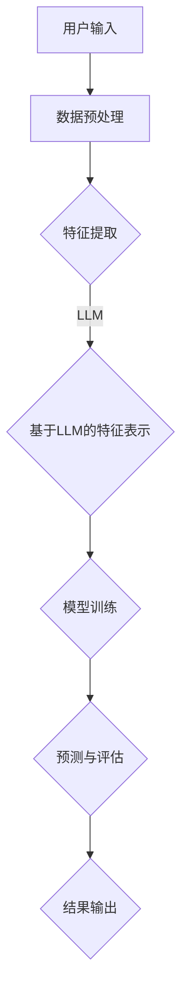

                 

# 利用LLM优化推荐系统的长尾物品发现

> **关键词**：推荐系统、LLM、长尾物品、协同过滤、内容推荐、混合推荐、项目实战

> **摘要**：本文将深入探讨如何利用大型语言模型（LLM）优化推荐系统中的长尾物品发现。我们将首先回顾推荐系统的基本原理和架构，然后详细介绍LLM在推荐系统中的应用，包括协同过滤、内容推荐和混合推荐算法。通过详细的数学模型和伪代码讲解，以及实际项目实战，我们将展示如何有效提升推荐系统在长尾物品发现方面的性能。

## 第一部分：背景与核心概念

### 第一章：推荐系统概述

#### 1.1 推荐系统的定义与重要性

推荐系统是一种用于提供个性化信息和建议的系统，旨在根据用户的历史行为和偏好来预测和推荐用户可能感兴趣的内容。在互联网时代，推荐系统被广泛应用于电商、社交媒体、在线新闻、视频平台等多个领域，对用户满意度和平台业务增长起到了关键作用。

#### 1.1.1 推荐系统的基本原理

推荐系统的核心原理是基于用户历史行为和内容的相似性来进行推荐。这通常涉及到以下几个关键步骤：

1. **数据收集与预处理**：收集用户的历史行为数据（如浏览记录、购买记录等）和内容数据（如商品信息、新闻文章等）。
2. **特征提取与表示**：将原始数据转换为适合机器学习算法的特征向量。
3. **模型选择与训练**：选择合适的推荐算法并对其进行训练。
4. **预测与评估**：使用训练好的模型进行预测，并评估推荐系统的性能。

#### 1.1.2 推荐系统的应用场景

推荐系统广泛应用于以下场景：

1. **电商推荐**：根据用户的购物历史和浏览行为推荐相关商品。
2. **社交媒体**：推荐用户可能感兴趣的朋友、内容或广告。
3. **在线新闻**：根据用户的阅读历史推荐相关新闻文章。
4. **视频平台**：推荐用户可能感兴趣的视频。

#### 1.2 推荐系统的架构与流程

推荐系统的架构通常包括以下几个关键模块：

1. **数据收集模块**：负责收集用户行为数据和内容数据。
2. **数据预处理模块**：负责对数据进行清洗、转换和格式化。
3. **特征提取模块**：负责将原始数据转换为特征向量。
4. **推荐算法模块**：负责根据特征向量进行推荐。
5. **评估模块**：负责评估推荐系统的性能。

推荐系统的基本流程如下：

1. **数据收集与预处理**：收集用户历史行为数据和内容数据，并进行预处理。
2. **特征提取与表示**：将原始数据转换为特征向量。
3. **模型选择与训练**：选择合适的推荐算法并对其进行训练。
4. **预测与评估**：使用训练好的模型进行预测，并评估推荐系统的性能。

#### 1.3 长尾物品发现的概念

长尾物品发现是指识别并推荐那些在传统推荐系统中不太受欢迎但具有较高个性化价值的物品。这些物品通常分布在推荐系统的尾部，因此被称为“长尾物品”。

#### 1.3.1 长尾物品的定义

长尾物品通常是指那些销售量较低、受众面较窄的物品。与热门物品相比，长尾物品往往更依赖于个性化的推荐和精准的用户行为分析。

#### 1.3.2 长尾物品发现的重要性

长尾物品发现对于提升推荐系统的多样性和用户体验具有重要意义：

1. **提升用户满意度**：通过发现并推荐长尾物品，用户能够获得更多个性化的选择，从而提高满意度。
2. **增加平台收入**：长尾物品的推荐有助于挖掘潜在的市场需求，从而增加平台收入。
3. **优化内容多样性**：长尾物品的推荐能够丰富平台的内容多样性，提高用户粘性。

#### 1.4 LLM概述

大型语言模型（LLM，Large Language Model）是一种基于深度学习技术的语言模型，具有强大的自然语言理解和生成能力。LLM在自然语言处理、文本生成、机器翻译等领域取得了显著成果。

##### 1.4.1 LLM的定义与特点

1. **定义**：LLM是一种能够理解和生成人类语言的大规模神经网络模型。
2. **特点**：
   - **大规模**：通常包含数十亿个参数，能够处理海量数据。
   - **通用性**：适用于各种自然语言处理任务，如文本分类、情感分析、机器翻译等。
   - **自适应性**：能够通过微调适应特定任务和领域。

##### 1.4.2 LLM的应用场景

1. **文本生成**：用于自动生成新闻文章、博客、产品描述等。
2. **问答系统**：提供对用户查询的智能回答。
3. **机器翻译**：实现多种语言之间的自动翻译。
4. **推荐系统**：用于长尾物品发现和内容推荐。

### 第二章：基于LLM的长尾物品发现算法

#### 2.1 LLM在推荐系统中的应用

LLM在推荐系统中主要应用于以下几个方面：

1. **特征提取与表示**：利用LLM对用户历史行为和内容进行深度语义分析，提取高维、丰富的特征向量。
2. **模型训练与优化**：通过微调LLM，优化推荐系统的参数，提高推荐精度。
3. **内容生成与推荐**：利用LLM生成个性化推荐内容，如商品描述、新闻摘要等。

#### 2.2 基于LLM的协同过滤算法

协同过滤算法是推荐系统中最常用的算法之一。基于LLM的协同过滤算法通过以下步骤实现：

1. **用户与物品嵌入**：利用LLM将用户和物品映射到高维向量空间。
2. **相似度计算**：计算用户和物品之间的相似度，使用LLM生成的特征向量。
3. **推荐生成**：根据相似度矩阵生成个性化推荐列表。

##### 2.2.1 协同过滤算法的基本原理

协同过滤算法分为基于用户和基于物品两种类型：

1. **基于用户**：根据用户的历史行为和偏好，寻找相似用户并推荐他们的喜好。
2. **基于物品**：根据物品的历史销售记录和用户行为，寻找相似物品并推荐给用户。

##### 2.2.2 基于LLM的协同过滤算法

基于LLM的协同过滤算法通过以下步骤实现：

1. **用户与物品嵌入**：利用LLM对用户和物品进行嵌入，生成高维特征向量。
2. **相似度计算**：使用余弦相似度或欧氏距离计算用户和物品之间的相似度。
3. **推荐生成**：根据相似度矩阵生成个性化推荐列表。

##### 2.2.3 伪代码详解

```python
# 数据预处理
users, items = preprocess_data()

# 用户与物品嵌入
user_embeddings = embed_users(users, model=LLM)
item_embeddings = embed_items(items, model=LLM)

# 相似度计算
similarity_matrix = calculate_similarity(user_embeddings, item_embeddings)

# 推荐生成
recommendations = generate_recommendations(similarity_matrix, user_embeddings, items)
```

#### 2.3 基于LLM的内容推荐算法

内容推荐算法通过分析用户的历史行为和内容特征，生成个性化推荐内容。基于LLM的内容推荐算法通过以下步骤实现：

1. **文本分析**：利用LLM对用户历史行为和内容进行文本分析，提取关键信息。
2. **内容生成**：利用LLM生成个性化内容，如商品描述、新闻摘要等。
3. **推荐生成**：根据用户偏好和生成内容生成个性化推荐列表。

##### 2.3.1 内容推荐算法的基本原理

内容推荐算法基于以下原理：

1. **用户兴趣分析**：通过分析用户的历史行为和浏览记录，识别用户的兴趣和偏好。
2. **内容特征提取**：提取用户感兴趣的内容特征，用于生成个性化内容。
3. **推荐内容生成**：利用LLM生成符合用户兴趣的个性化内容。

##### 2.3.2 基于LLM的内容推荐算法

基于LLM的内容推荐算法通过以下步骤实现：

1. **文本分析**：利用LLM对用户历史行为和内容进行文本分析，提取关键信息。
2. **内容生成**：利用LLM生成个性化内容，如商品描述、新闻摘要等。
3. **推荐生成**：根据用户偏好和生成内容生成个性化推荐列表。

##### 2.3.3 伪代码详解

```python
# 文本分析
user_history = analyze_text(user行为记录, model=LLM)
content_features = extract_content_features(user_history, model=LLM)

# 内容生成
generated_content = generate_content(content_features, model=LLM)

# 推荐生成
recommendations = generate_recommendations(generated_content, user_preference)
```

#### 2.4 基于LLM的混合推荐算法

混合推荐算法通过结合协同过滤和内容推荐算法，实现更精准的推荐效果。基于LLM的混合推荐算法通过以下步骤实现：

1. **协同过滤推荐**：利用LLM生成协同过滤推荐列表。
2. **内容推荐**：利用LLM生成内容推荐列表。
3. **推荐融合**：将协同过滤和内容推荐列表进行融合，生成最终推荐列表。

##### 2.4.1 混合推荐算法的基本原理

混合推荐算法基于以下原理：

1. **协同过滤**：基于用户行为和物品特征进行推荐，能够捕捉用户之间的相似性。
2. **内容推荐**：基于用户兴趣和内容特征进行推荐，能够捕捉用户与物品之间的相关性。
3. **推荐融合**：通过融合不同推荐算法的优势，实现更精准的推荐。

##### 2.4.2 基于LLM的混合推荐算法

基于LLM的混合推荐算法通过以下步骤实现：

1. **协同过滤推荐**：利用LLM生成协同过滤推荐列表。
2. **内容推荐**：利用LLM生成内容推荐列表。
3. **推荐融合**：将协同过滤和内容推荐列表进行融合，生成最终推荐列表。

##### 2.4.3 伪代码详解

```python
# 协同过滤推荐
cf_recommendations = generate_cf_recommendations(user行为记录, items, model=LLM)

# 内容推荐
content_recommendations = generate_content_recommendations(user行为记录, items, model=LLM)

# 推荐融合
final_recommendations = fuse_recommendations(cf_recommendations, content_recommendations)
```

#### 2.5 基于LLM的长尾物品发现流程



## 第二部分：核心算法原理

### 第三章：基于LLM的长尾物品发现模型

#### 3.1 数学模型概述

基于LLM的长尾物品发现模型主要涉及概率模型和优化模型。

##### 3.1.1 概率模型

概率模型用于计算用户对物品的偏好概率。常见概率模型包括：

1. **贝叶斯模型**：基于贝叶斯定理计算用户对物品的偏好概率。
2. **最大熵模型**：基于最大熵原理估计用户对物品的偏好概率分布。

##### 3.1.2 优化模型

优化模型用于最小化损失函数，提高推荐系统的性能。常见优化模型包括：

1. **梯度下降法**：通过迭代更新模型参数，最小化损失函数。
2. **随机梯度下降法**：在梯度下降法的基础上，引入随机性，提高收敛速度。

#### 3.2 数学公式详解

基于LLM的长尾物品发现模型涉及以下数学公式：

$$
P(U|I) = \frac{P(I|U)P(U)}{P(I)}
$$

$$
\min_{\theta} \sum_{i=1}^{n} L(y_i, \hat{y}_i; \theta)
$$

其中，$P(U|I)$表示用户$U$对物品$I$的偏好概率，$P(I|U)$表示物品$I$在用户$U$的偏好下出现的概率，$P(U)$表示用户$U$的总体偏好概率，$P(I)$表示物品$I$的总体出现概率。

$y_i$表示用户$U$对物品$I$的实际偏好标签，$\hat{y}_i$表示模型预测的用户$U$对物品$I$的偏好标签，$L(y_i, \hat{y}_i; \theta)$表示损失函数，$\theta$表示模型参数。

#### 3.3 模型参数调节

模型参数调节是优化模型性能的关键步骤。以下是常见模型参数调节方法：

##### 3.3.1 学习率调节

学习率决定了模型参数更新的幅度。合适的

