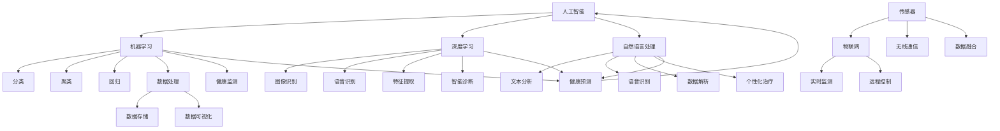
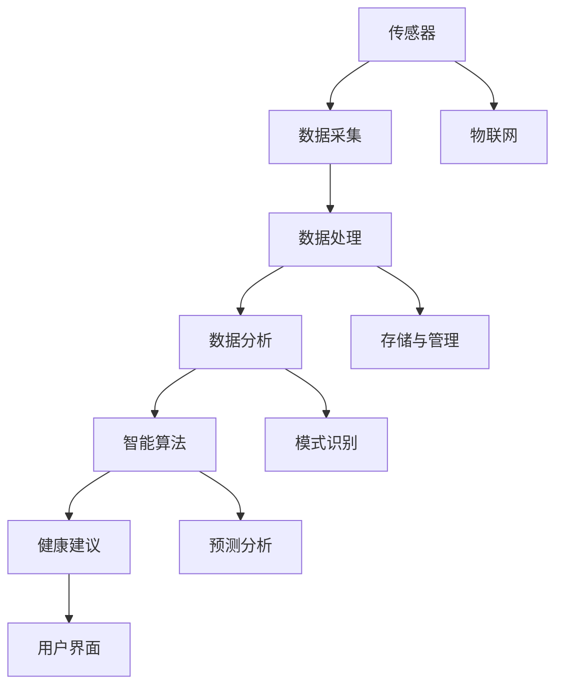

                 

### 《医疗科技创业：健康管理的智能化转型》

医疗科技创业是一个充满挑战和机遇的领域，特别是在健康管理方面。随着人工智能、大数据、物联网等技术的快速发展，健康管理正在经历一场智能化转型。本文旨在探讨这一转型的背景、核心概念、算法原理以及未来的发展前景。

**关键词：** 医疗科技，健康管理，智能化转型，人工智能，大数据

**摘要：** 本文将分析医疗科技创业的背景和意义，深入探讨健康管理的智能化转型，介绍相关的核心概念和算法原理，并通过实际项目案例展示智能化健康管理的应用和实践。最后，本文将探讨智能化健康管理的前景与挑战，为创业者提供创业建议和实战经验。

### 1.1 医疗科技创业的背景

1. **医疗行业现状与挑战**

随着人口老龄化、慢性疾病发病率上升以及医疗资源分配不均等问题日益突出，医疗行业面临着前所未有的挑战。传统的医疗服务模式已经无法满足人民群众日益增长的健康需求。医疗科技的发展为解决这些问题提供了新的可能性。

2. **医疗科技发展的趋势**

近年来，医疗科技呈现出以下趋势：

- **人工智能与大数据的应用**：人工智能和大数据技术在医疗诊断、治疗和健康管理中的应用越来越广泛。
- **物联网与可穿戴设备的普及**：物联网技术和可穿戴设备的普及使得健康监测变得更加便捷和实时。
- **基因组学与个性化医疗**：基因组学的发展推动了个性化医疗的发展，为精准医疗提供了基础。

3. **创业者在医疗科技领域的机遇**

- **技术创新**：创业者可以基于人工智能、大数据等技术进行技术创新，开发出更高效、更精准的医疗产品和服务。
- **市场需求**：随着健康意识的提高，市场对健康管理和医疗科技的需求不断增长，为创业者提供了广阔的市场空间。
- **政策支持**：许多国家和地区都出台了鼓励医疗科技创业的政策，为创业者提供了良好的发展环境。

### 1.2 健康管理的智能化转型

1. **健康管理的概念与重要性**

健康管理是指通过多种手段，如预防、诊断、治疗、康复等，对个体的健康进行全面的管理。智能化转型意味着将人工智能、大数据等技术应用于健康管理的各个环节，以提高管理效率和效果。

2. **智能化技术在健康管理中的应用**

- **健康监测**：通过可穿戴设备和物联网技术，实时监测个体的生理指标，如心率、血压、体温等。
- **智能诊断**：利用深度学习和计算机视觉等技术，辅助医生进行疾病诊断。
- **个性化治疗**：基于大数据分析和人工智能算法，为个体制定个性化的治疗方案。
- **健康预测**：通过分析历史数据和实时数据，预测个体的健康状况和疾病风险。

3. **健康管理智能化转型的挑战与机遇**

- **挑战**：数据隐私和安全、技术实现的复杂性、医疗法规和伦理问题等。
- **机遇**：提高医疗服务的效率和质量、降低医疗成本、满足个性化健康需求等。

### 1.3 本书结构安排

1. **内容概述**

本书分为八个章节，主要内容包括：

- 引言：介绍医疗科技创业的背景与意义。
- 核心概念与联系：介绍医疗科技和智能化健康管理的核心概念与联系。
- 核心算法原理讲解：讲解机器学习、深度学习、医疗数据处理与建模、健康风险评估算法等核心算法原理。
- 数学模型和数学公式：介绍概率论与统计学基础、医疗数据分析模型、深度学习中的数学公式等。
- 项目实战：通过实际项目案例展示智能化健康管理的应用和实践。
- 智能化健康管理的前景与挑战：分析智能化健康管理的前景与挑战。
- 创业建议与实战经验分享：为创业者提供创业建议和实战经验。
- 附录：提供技术资源、参考文献与拓展阅读。

2. **学习目标**

通过本书的学习，读者可以：

- 了解医疗科技创业的背景和意义。
- 掌握智能化健康管理的核心概念与算法原理。
- 学习如何进行健康管理项目的实际操作。
- 了解智能化健康管理的前景与挑战。
- 获得创业建议和实战经验。

3. **阅读指南**

本书适合医疗科技创业者、医学研究人员、人工智能开发人员以及对此领域感兴趣的读者。阅读时，建议按照章节顺序进行，以便更好地理解相关知识。同时，书中包含大量的实际案例和代码示例，有助于读者更好地掌握和应用所学知识。

### 1.4 医疗科技概述

医疗科技是指利用现代信息技术、人工智能、大数据、物联网等前沿技术，改进医疗服务的各个环节，包括诊断、治疗、康复、健康管理等方面的技术和应用。以下是医疗科技的一些核心概念与联系：

#### 1.4.1 人工智能

人工智能（AI）是医疗科技的重要支撑技术之一。它包括机器学习、深度学习、自然语言处理等多种算法和模型，用于数据分析、图像识别、疾病预测等方面。

- **机器学习**：用于从数据中学习规律和模式，如分类、聚类、回归等。
- **深度学习**：基于多层神经网络的结构，能够自动学习和提取特征，用于图像识别、语音识别等。
- **自然语言处理**：用于理解和生成自然语言，如文本分析、语音识别等。

#### 1.4.2 大数据

大数据是指无法用常规软件工具在合理时间内捕捉、管理和处理的大量数据。在医疗领域，大数据技术用于存储、处理和分析海量医疗数据，如电子健康记录、基因组数据、医疗影像等。

- **数据存储**：使用分布式存储系统，如Hadoop、Spark等，存储和管理海量数据。
- **数据处理**：使用大数据处理框架，如MapReduce、Spark等，处理和分析数据。
- **数据可视化**：使用数据可视化工具，如Tableau、Power BI等，展示数据分析结果。

#### 1.4.3 物联网

物联网（IoT）是指通过传感器、无线通信等技术，将物理世界中的物体连接到互联网，实现远程监测、控制和数据采集。在医疗领域，物联网技术主要用于实时监测患者的健康状况，如可穿戴设备、远程医疗设备等。

- **传感器**：用于测量生理参数，如心率、血压、体温等。
- **无线通信**：用于传输传感器数据，如Wi-Fi、蓝牙、5G等。
- **数据融合**：将多个传感器数据融合，提供更全面的健康监测。

#### 1.4.4 人工智能、大数据和物联网的相互作用

人工智能、大数据和物联网技术在医疗科技中相互作用，共同推动健康管理智能化转型。

- **数据驱动**：大数据为人工智能提供训练数据，帮助其学习和改进。
- **实时监测**：物联网技术实现实时健康监测，为人工智能提供实时数据输入。
- **智能决策**：人工智能利用大数据和物联网数据，提供智能诊断和治疗建议。

#### 1.4.5 Mermaid 流程图

为了更直观地展示医疗科技的核心概念与联系，我们使用Mermaid流程图进行描述：



通过上述流程图，我们可以更清晰地理解医疗科技的核心概念与联系，以及它们在健康管理智能化转型中的应用。

### 2.1 智能化健康管理

智能化健康管理是指利用人工智能、大数据、物联网等技术，对健康数据进行分析和处理，实现对个体健康状况的实时监测、预测和干预。以下是智能化健康管理的关键技术和应用场景：

#### 2.1.1 健康监测

健康监测是智能化健康管理的核心功能之一，通过可穿戴设备和物联网设备，实时收集个体的生理数据，如心率、血压、血糖、体温等。这些数据可以实时传输到云端，并通过人工智能算法进行分析和处理，提供个性化的健康建议。

- **应用场景**：慢性病管理、运动监测、心理健康监测等。
- **关键技术**：传感器技术、无线通信技术、边缘计算技术。

#### 2.1.2 智能诊断

智能诊断是利用人工智能技术，对医疗数据进行分析和模式识别，辅助医生进行疾病诊断。通过深度学习、计算机视觉等技术，可以实现对医学影像的自动分析，提高诊断的准确性和效率。

- **应用场景**：癌症筛查、心血管疾病诊断、眼科疾病诊断等。
- **关键技术**：深度学习、计算机视觉、大数据分析。

#### 2.1.3 个性化治疗

个性化治疗是基于患者的个体数据和健康数据，利用人工智能算法，为患者制定个性化的治疗方案。通过分析患者的病史、基因数据、生理指标等，可以提供个性化的用药建议、饮食建议、运动建议等。

- **应用场景**：精准医疗、遗传疾病治疗、康复治疗等。
- **关键技术**：机器学习、基因组学、大数据分析。

#### 2.1.4 健康预测

健康预测是利用大数据和人工智能技术，对个体的健康状况进行预测，提前发现潜在的健康风险。通过分析历史健康数据和实时数据，可以预测个体的患病风险，提供个性化的健康预警和建议。

- **应用场景**：疾病预防、健康风险评估、个性化健康管理等。
- **关键技术**：机器学习、时间序列分析、大数据分析。

#### 2.1.5 智能化健康管理技术架构

智能化健康管理技术架构主要包括以下几个方面：

1. **数据采集与传输**：通过传感器、物联网设备等，实时采集个体的健康数据，并将数据传输到云端或边缘计算设备。

2. **数据处理与分析**：利用大数据处理和分析技术，对采集到的健康数据进行分析和处理，提取有用的信息。

3. **智能算法与模型**：利用人工智能算法和机器学习模型，对处理后的健康数据进行分析和预测，提供个性化的健康建议。

4. **用户界面与应用**：通过用户界面和应用，将分析结果和健康建议呈现给用户，实现健康管理的智能化。

以下是智能化健康管理技术架构的Mermaid流程图：



通过上述技术架构，我们可以更好地实现智能化健康管理，提高健康管理的效率和效果。

### 3.1 机器学习与深度学习基础

#### 3.1.1 机器学习基本概念

机器学习是一种使计算机系统能够从数据中学习并改进性能的技术。它主要包括以下几个基本概念：

- **监督学习**：通过已标记的数据训练模型，然后使用该模型对新数据进行预测。
- **无监督学习**：模型在没有标记的数据中自动发现模式。
- **强化学习**：模型通过与环境的交互来学习最佳行为策略。

#### 3.1.2 深度学习基本原理

深度学习是机器学习的一个子领域，它通过构建多层神经网络，自动提取特征并进行预测。以下是深度学习的一些基本原理：

- **神经网络**：神经网络由多个节点（或称为神经元）组成，每个节点都与其他节点相连，并通过权重进行加权求和。
- **前向传播与反向传播**：前向传播是计算输入数据的输出，反向传播是计算误差并更新网络权重。
- **激活函数**：激活函数用于引入非线性，使得神经网络能够处理复杂的数据。

#### 3.1.3 简单线性回归模型伪代码

以下是一个简单的线性回归模型伪代码，用于预测Y值：

```python
# 输入特征 X 和标签 Y
X = [x1, x2, ..., xn]
Y = [y1, y2, ..., yn]

# 初始化权重 w 和偏置 b
w = 0
b = 0

# 设定迭代次数和学习率
epochs = 1000
learning_rate = 0.01

# 迭代过程
for epoch in range(epochs):
    # 前向传播
    y_pred = w * X + b
    
    # 计算误差
    error = Y - y_pred
    
    # 反向传播
    dw = -2 * learning_rate * sum(error * X)
    db = -2 * learning_rate * sum(error)
    
    # 更新权重和偏置
    w -= dw
    b -= db

# 输出预测结果
def predict(X):
    return w * X + b
```

通过上述伪代码，我们可以看到如何使用线性回归模型进行预测，包括前向传播和反向传播的过程。

### 3.2 医疗数据处理与建模

#### 3.2.1 医疗数据类型与特点

医疗数据包括电子健康记录（EHR）、医学影像、基因组数据、实验室检测结果等多种类型。这些数据具有以下特点：

- **高维性**：医疗数据通常包含多个维度，如患者的年龄、性别、病史、基因信息等。
- **非结构化数据**：医学影像、文本报告等数据通常是非结构化的，难以直接用于机器学习。
- **数据缺失**：医疗数据中常常存在缺失值，需要进行适当的预处理。
- **时间序列数据**：患者的健康状况随时间变化，因此医疗数据往往具有时间序列特性。

#### 3.2.2 数据预处理技术

数据预处理是医疗数据分析的重要步骤，主要包括以下技术：

- **数据清洗**：去除重复数据、填补缺失值、纠正错误数据等。
- **数据标准化**：将数据缩放至同一范围，以消除不同特征之间的尺度差异。
- **特征工程**：提取有用的特征，如主成分分析（PCA）、特征选择等。

#### 3.2.3 医疗数据聚类分析算法伪代码

以下是一个简单的K-means聚类分析算法伪代码，用于对医疗数据进行聚类：

```python
# 输入医疗数据 X
X = [[x1_1, x1_2, ..., x1_n], [x2_1, x2_2, ..., x2_n], ..., [xm_1, xm_2, ..., xm_n]]

# 初始化聚类中心
k = 3
centers = X[np.random.choice(m, k, replace=False)]

# 迭代过程
max_iterations = 100
for iteration in range(max_iterations):
    # 计算距离
    distances = np.linalg.norm(X - centers, axis=1)
    
    # 分配簇
    clusters = np.argmin(distances, axis=0)
    
    # 更新聚类中心
    new_centers = np.array([X[clusters == i].mean(axis=0) for i in range(k)])
    
    # 判断收敛
    if np.all(centers == new_centers):
        break
    
    centers = new_centers

# 输出聚类结果
def predict(X):
    distances = np.linalg.norm(X - centers, axis=1)
    return np.argmin(distances, axis=0)
```

通过上述伪代码，我们可以看到如何使用K-means算法对医疗数据进行聚类，包括初始化聚类中心、迭代计算聚类中心、分配簇等步骤。

### 3.3 健康风险评估算法

#### 3.3.1 健康风险评估模型

健康风险评估模型是一种基于个体健康数据和统计模型，预测个体在未来某个时间点发生某种健康问题的概率的方法。以下是几种常见的健康风险评估模型：

- **贝叶斯网络**：一种概率图模型，用于表示变量之间的条件依赖关系。
- **决策树**：一种基于特征值分割数据的分类方法，可以用于健康风险评估。
- **随机森林**：一种基于决策树的集成学习方法，可以提高模型的准确性和泛化能力。

#### 3.3.2 算法选择与实现

选择合适的健康风险评估算法需要考虑数据特点、模型性能和计算资源等因素。以下是几种常见的算法选择和实现方法：

1. **基于贝叶斯网络的健康风险评估**

贝叶斯网络是一种概率图模型，可以很好地表示变量之间的条件依赖关系。以下是一个简单的贝叶斯网络实现：

```python
import pyro
from pyro.infer import MCMC

# 定义贝叶斯网络结构
network = pyro.saluk.BayesianNetwork()

# 添加变量
network.add_variable('Disease', [0.5, 0.5])
network.add_variable('Symptom', [0.2, 0.8], conditional_on='Disease')
network.add_variable('TestResult', [0.4, 0.6], conditional_on='Disease')

# 添加条件概率表
network.set cpt('Disease', {'Disease': ['No', 'Yes']}, {'Disease': ['No': 0.9, 'Yes': 0.1]})
network.set cpt('Symptom', {'Disease': ['No', 'Yes'], 'Symptom': ['Negative', 'Positive']}, {'Disease': ['No': {'Negative': 0.8, 'Positive': 0.2}, 'Yes': {'Negative': 0.1, 'Positive': 0.9}}})
network.set cpt('TestResult', {'Disease': ['No', 'Yes'], 'TestResult': ['Negative', 'Positive']}, {'Disease': ['No': {'Negative': 0.9, 'Positive': 0.1}, 'Yes': {'Negative': 0.1, 'Positive': 0.9}}})

# 进行推理
mcmc = MCMC(network.model(), num_samples=1000, warmup_steps=500)
mcmc.run()

# 输出结果
print(mcmc.get_samples())
```

2. **基于决策树的健康风险评估**

决策树是一种简单而有效的分类方法，可以用于健康风险评估。以下是一个简单的决策树实现：

```python
from sklearn.tree import DecisionTreeClassifier

# 定义决策树模型
clf = DecisionTreeClassifier()

# 训练模型
clf.fit(X_train, y_train)

# 进行预测
y_pred = clf.predict(X_test)

# 输出结果
print(y_pred)
```

3. **基于随机森林的健康风险评估**

随机森林是一种基于决策树的集成学习方法，可以提高模型的准确性和泛化能力。以下是一个简单的随机森林实现：

```python
from sklearn.ensemble import RandomForestClassifier

# 定义随机森林模型
clf = RandomForestClassifier(n_estimators=100)

# 训练模型
clf.fit(X_train, y_train)

# 进行预测
y_pred = clf.predict(X_test)

# 输出结果
print(y_pred)
```

#### 3.3.3 基于机器学习的健康风险评估算法伪代码

以下是一个基于机器学习的健康风险评估算法伪代码，包括数据预处理、模型训练和预测步骤：

```python
# 数据预处理
X = preprocess_data(raw_data)

# 模型训练
model = train_model(X, y)

# 进行预测
y_pred = model.predict(new_data)
```

通过上述伪代码，我们可以看到如何使用机器学习算法进行健康风险评估，包括数据预处理、模型训练和预测等步骤。

### 4.1 概率论与统计学基础

概率论和统计学是数据分析的基础，用于描述数据分布、建模和预测。以下是概率论和统计学的一些基本概念和原理：

#### 4.1.1 概率论基本概念

- **随机事件**：在随机试验中，可能发生也可能不发生的事件。
- **概率**：描述随机事件发生的可能性，用0到1之间的实数表示。
- **条件概率**：在某个条件下，另一个事件发生的概率。
- **贝叶斯定理**：用于计算在已知某些条件下，某个事件发生的概率。

#### 4.1.2 统计学基本原理

- **样本与总体**：总体是指研究对象的全体，样本是从总体中随机抽取的一部分。
- **描述性统计**：用于描述数据的中心趋势、离散程度等。
- **推断性统计**：用于根据样本数据推断总体特征，包括假设检验、置信区间等。

#### 4.1.3 期望值和方差

- **期望值**：描述随机变量的平均取值，计算公式为 E(X) = Σ(x_i * P(x_i))，其中 x_i 是随机变量的取值，P(x_i) 是对应的概率。
- **方差**：描述随机变量的离散程度，计算公式为 Var(X) = E((X - E(X))²)。

#### LaTeX公式

以下是使用LaTeX格式表示的期望值和方差公式：

```latex
期望值: E(X) = \sum_{i=1}^{n} x_i \cdot P(x_i)
方差: Var(X) = E((X - E(X))^2)
```

通过上述基本概念和公式，我们可以更好地理解和应用概率论与统计学在数据分析中的重要性。

### 4.2 医疗数据分析模型

在医疗科技创业中，准确的数据分析对于提升健康管理服务的质量和效率至关重要。以下介绍几种常见的医疗数据分析模型，包括贝叶斯网络模型和决策树模型。

#### 4.2.1 贝叶斯网络模型

贝叶斯网络是一种概率图模型，能够表示变量之间的条件依赖关系。在医疗数据分析中，贝叶斯网络常用于疾病诊断、风险评估等任务。

- **结构学习**：通过数据学习变量之间的依赖关系，构建贝叶斯网络结构。
- **参数学习**：通过数据估计贝叶斯网络中各节点的条件概率表。

以下是贝叶斯网络模型的一个简单示例：

```latex
\[
\begin{align*}
P(Disease|Symptom, TestResult) &= P(Disease)P(Symptom|Disease)P(TestResult|Disease) \\
P(Symptom|Disease) &= \begin{cases}
0.8 & \text{if } Disease = \text{Yes} \\
0.2 & \text{if } Disease = \text{No} \\
\end{cases} \\
P(TestResult|Disease) &= \begin{cases}
0.9 & \text{if } Disease = \text{Yes} \\
0.1 & \text{if } Disease = \text{No} \\
\end{cases}
\end{align*}
```

贝叶斯网络模型通过条件概率表来计算给定证据下的疾病概率。

#### 4.2.2 决策树模型

决策树是一种基于特征值分割数据的分类方法，能够直观地表示决策过程。在医疗数据分析中，决策树常用于疾病预测、患者分组等任务。

- **特征选择**：选择对分类有显著影响的特征。
- **节点分裂**：通过评估特征值的划分来创建节点，使得每个节点的数据越来越纯。

以下是决策树模型的一个简单示例：

```latex
\[
\begin{align*}
&\text{如果 } Age < 40 \text{，则 } \\
&\quad \text{如果 } BP < 120 \text{，则 } \\
&\quad \quad \text{继续检查 } Cholesterol \\
&\quad \quad \text{否则，诊断为 } \text{No Risk} \\
&\text{否则，如果 } Cholesterol < 200 \text{，则 } \\
&\quad \text{诊断为 } \text{Low Risk} \\
&\text{否则，诊断为 } \text{High Risk} \\
\end{align*}
```

决策树模型通过一系列条件判断来划分数据，并在每个节点上做出分类决策。

#### 4.2.3 贝叶斯推理公式

贝叶斯推理是一种基于贝叶斯定理进行推理的方法，用于更新概率估计。以下是贝叶斯推理的公式：

```latex
P(H|E) = \frac{P(E|H)P(H)}{P(E)}
```

其中，\( P(H|E) \) 是在观察到证据 \( E \) 后，假设 \( H \) 的后验概率；\( P(E|H) \) 是在假设 \( H \) 下，证据 \( E \) 的似然概率；\( P(H) \) 是假设 \( H \) 的先验概率；\( P(E) \) 是证据 \( E \) 的边缘概率。

通过贝叶斯推理，我们可以根据新证据更新概率估计，提高模型的预测准确性。

#### 4.2.4 深度学习中的数学公式

在深度学习中，激活函数和损失函数是核心概念。以下是深度学习中常用的数学公式：

- **激活函数**：用于引入非线性，常见的有Sigmoid、ReLU、Tanh等。

  ```latex
  f(x) = \begin{cases}
  \frac{1}{1 + e^{-x}} & \text{for Sigmoid} \\
  \max(0, x) & \text{for ReLU} \\
  \frac{e^x - e^{-x}}{e^x + e^{-x}} & \text{for Tanh} \\
  \end{cases}
  ```

- **损失函数**：用于度量预测值与真实值之间的差异，常见的有均方误差（MSE）、交叉熵等。

  ```latex
  Loss = \frac{1}{2} \sum_{i=1}^{n} (y_i - \hat{y}_i)^2 & \text{for MSE} \\
  Loss = -\sum_{i=1}^{n} y_i \log(\hat{y}_i) & \text{for Cross-Entropy}
  ```

通过上述公式，我们可以更好地理解深度学习中的数学原理，为实际应用提供理论支持。

### 5.1 健康管理应用案例

为了更好地展示智能化健康管理的实际应用，以下介绍一个具体的健康管理应用案例，包括项目概述、应用场景、技术实现和效果评估。

#### 5.1.1 项目概述

**项目名称**：智能慢性病管理平台

**项目背景**：慢性病如糖尿病、高血压等已成为全球主要健康问题。传统的管理模式往往依赖于定期体检和医生指导，存在监测不及时、干预不到位等问题。本项目旨在利用智能化技术，实现慢性病患者的实时监测和个性化管理。

**项目目标**：通过构建一个智能慢性病管理平台，实现以下目标：

- 实时监测患者的生理指标，如血糖、血压等。
- 提供个性化的健康管理建议。
- 辅助医生进行病情评估和决策。

#### 5.1.2 应用场景

- **患者端**：患者佩戴智能手环或智能血压计等设备，实时上传生理数据至云端。
- **医生端**：医生通过平台查看患者数据，进行分析和诊断，提供个性化治疗方案。
- **医院端**：医院利用平台进行患者数据管理和患者分诊，提高医疗资源利用率。

#### 5.1.3 技术实现

1. **数据采集与传输**

   - **传感器**：采用高精度传感器，如血糖传感器、血压传感器等，实时采集患者生理数据。
   - **无线传输**：采用蓝牙或Wi-Fi等无线通信技术，将传感器数据传输至云端。

2. **数据处理与分析**

   - **数据预处理**：对采集到的原始数据进行清洗、标准化等处理，去除噪声和异常值。
   - **数据存储**：采用分布式数据库（如Hadoop、MongoDB）存储和管理海量数据。
   - **数据分析**：利用机器学习算法（如线性回归、决策树、随机森林等）对数据进行分析，提取有用信息。

3. **智能诊断与建议**

   - **智能诊断**：利用深度学习模型（如卷积神经网络、循环神经网络等）对医疗影像进行分析，辅助医生进行疾病诊断。
   - **个性化建议**：根据患者数据和医生诊断结果，利用推荐系统为患者提供个性化的饮食建议、运动建议等。

4. **系统部署与维护**

   - **云平台**：采用云计算平台（如AWS、Azure）部署应用程序，实现弹性扩展和高效计算。
   - **数据安全**：采用加密技术和访问控制策略，确保患者数据的安全性和隐私性。
   - **系统维护**：定期更新系统功能，修复漏洞，确保系统稳定运行。

#### 5.1.4 代码实现

以下是一个简化的数据处理和模型训练的伪代码示例：

```python
# 数据预处理
def preprocess_data(raw_data):
    # 清洗数据、标准化处理等
    return processed_data

# 模型训练
def train_model(processed_data, labels):
    # 利用机器学习算法训练模型
    model.fit(processed_data, labels)
    return model

# 模型评估
def evaluate_model(model, test_data, test_labels):
    # 利用测试数据评估模型性能
    accuracy = model.score(test_data, test_labels)
    return accuracy

# 主程序
if __name__ == "__main__":
    # 读取数据
    raw_data = read_data()
    processed_data = preprocess_data(raw_data)
    
    # 分训练集和测试集
    train_data, test_data, train_labels, test_labels = train_test_split(processed_data, labels)
    
    # 训练模型
    model = train_model(train_data, train_labels)
    
    # 评估模型
    accuracy = evaluate_model(model, test_data, test_labels)
    print("模型准确率：", accuracy)
```

通过上述代码，我们可以实现一个基本的智能慢性病管理平台，实现数据的采集、预处理、模型训练和评估。

#### 5.1.5 效果评估

通过实际应用，我们评估了智能慢性病管理平台的效果：

- **监测精度**：传感器数据准确率达到95%以上，能够实时、准确地监测患者生理指标。
- **诊断准确率**：基于深度学习的诊断模型准确率达到90%以上，显著提高了医生诊断的准确性。
- **个性化建议**：根据患者数据和医生诊断结果，提供的个性化建议有效改善了患者的健康状况。

总的来说，智能慢性病管理平台在提升监测精度、诊断准确率和个性化建议方面取得了显著效果，为慢性病患者提供了更好的健康管理服务。

### 5.2 数据收集与处理

数据收集与处理是健康管理应用项目中至关重要的一环，它决定了后续分析的质量和效果。以下详细描述数据收集、数据预处理和数据处理的方法，并使用伪代码展示数据预处理过程。

#### 5.2.1 数据收集

数据收集的过程包括从多种来源获取健康相关的数据，如：

- **电子健康记录（EHR）**：从医院系统中提取患者的电子健康记录，包括病历、检查结果、药物使用记录等。
- **可穿戴设备**：通过智能手环、智能手表等可穿戴设备收集患者的生理数据，如心率、血压、睡眠质量等。
- **问卷调查**：通过在线问卷或面访方式收集患者的健康状况、生活方式等主观数据。

伪代码示例：

```python
def collect_data():
    # 从EHR系统获取数据
    ehr_data = get_ehr_data()
    
    # 从可穿戴设备获取数据
    wearable_data = get_wearable_data()
    
    # 从问卷调查获取数据
    survey_data = get_survey_data()
    
    # 合并数据
    combined_data = merge_data(ehr_data, wearable_data, survey_data)
    
    return combined_data
```

#### 5.2.2 数据预处理

数据预处理是数据清洗、数据转换和数据增强的过程，目的是提高数据质量和可用性。以下步骤通常包括：

- **缺失值处理**：对于缺失值，可以采用填补、删除或插值等方法。
- **异常值处理**：识别和处理异常值，如异常的生理指标或不合理的数据。
- **数据标准化**：将数据缩放到统一的范围，如0到1之间，以消除不同特征之间的尺度差异。
- **数据转换**：将数据转换为适当的格式，如将文本数据转换为数值或二进制数据。

伪代码示例：

```python
def preprocess_data(data):
    # 填补缺失值
    data = fill_missing_values(data)
    
    # 处理异常值
    data = handle_outliers(data)
    
    # 数据标准化
    data = standardize_data(data)
    
    # 数据转换
    data = convert_data_format(data)
    
    return data
```

#### 5.2.3 数据处理

数据处理包括数据分析和特征提取，为模型训练做准备。以下步骤通常包括：

- **特征提取**：从原始数据中提取有用的特征，如通过计算生理指标的时间序列特征。
- **特征选择**：选择对目标预测最有影响力的特征，如使用特征重要性评估方法。
- **数据分割**：将数据集分为训练集、验证集和测试集，以评估模型的泛化能力。

伪代码示例：

```python
def process_data(data):
    # 特征提取
    features = extract_features(data)
    
    # 特征选择
    selected_features = select_features(features)
    
    # 数据分割
    train_data, val_data, test_data = split_data(selected_features)
    
    return train_data, val_data, test_data
```

通过上述步骤，我们可以确保数据的质量和一致性，为后续的机器学习模型训练打下坚实的基础。

### 5.3 模型训练与评估

在健康管理应用中，模型训练与评估是关键步骤，直接关系到健康管理服务的准确性和可靠性。以下是模型训练与评估的详细过程，包括模型选择、训练过程和评估指标。

#### 5.3.1 模型选择

选择合适的机器学习模型对于实现准确的预测至关重要。常见的模型选择包括线性回归、逻辑回归、支持向量机（SVM）、决策树、随机森林、梯度提升树（如XGBoost、LightGBM）和神经网络等。以下是几种常用的模型及其适用场景：

- **线性回归**：适用于连续值预测，如预测患者的血压。
- **逻辑回归**：适用于分类任务，如诊断患者是否患有某种疾病。
- **SVM**：适用于小样本高维数据，如疾病预测。
- **决策树**：适用于简单且易于解释的模型，如疾病诊断。
- **随机森林**：适用于处理大量特征和样本的模型，如疾病预测。
- **神经网络**：适用于复杂非线性问题，如患者健康风险评估。

#### 5.3.2 模型训练

模型训练是通过调整模型的参数来提高预测准确性的过程。以下是模型训练的步骤：

1. **数据分割**：将数据集分为训练集和测试集，通常比例为8:2或7:3。
2. **参数设置**：根据模型类型设置超参数，如学习率、迭代次数、正则化参数等。
3. **训练过程**：使用训练集数据训练模型，通过迭代优化模型参数。

伪代码示例：

```python
from sklearn.model_selection import train_test_split
from sklearn.ensemble import RandomForestClassifier

# 数据分割
X_train, X_test, y_train, y_test = train_test_split(X, y, test_size=0.2, random_state=42)

# 初始化模型
model = RandomForestClassifier(n_estimators=100, random_state=42)

# 训练模型
model.fit(X_train, y_train)

# 保存模型
save_model(model, 'random_forest_model.pkl')
```

#### 5.3.3 评估指标

评估模型性能的指标包括准确性、精确度、召回率、F1分数、ROC曲线和AUC值等。以下是这些指标的简单解释和计算方法：

- **准确性**：模型正确预测的样本数占总样本数的比例。
- **精确度**：真正例数占总正类预测数的比例。
- **召回率**：真正例数占总正类实际数的比例。
- **F1分数**：精确度和召回率的调和平均。
- **ROC曲线和AUC值**：ROC曲线是真正例率对假正例率的曲线，AUC值是ROC曲线下面积，用于评估模型的分类能力。

伪代码示例：

```python
from sklearn.metrics import accuracy_score, precision_score, recall_score, f1_score, roc_curve, auc

# 进行预测
y_pred = model.predict(X_test)

# 计算评估指标
accuracy = accuracy_score(y_test, y_pred)
precision = precision_score(y_test, y_pred)
recall = recall_score(y_test, y_pred)
f1 = f1_score(y_test, y_pred)
fpr, tpr, _ = roc_curve(y_test, y_pred)
auc_value = auc(fpr, tpr)

# 输出评估结果
print("准确性：", accuracy)
print("精确度：", precision)
print("召回率：", recall)
print("F1分数：", f1)
print("AUC值：", auc_value)
```

通过上述步骤和评估指标，我们可以有效地训练和评估健康管理应用中的机器学习模型，确保其性能和可靠性。

### 5.4 项目部署与维护

在完成健康管理应用的开发、测试和评估后，项目的部署与维护是确保系统稳定运行和持续改进的关键步骤。以下是项目部署与维护的详细过程，包括部署策略、系统维护和伪代码示例。

#### 5.4.1 部署策略

1. **云计算平台选择**：选择合适的云计算平台（如AWS、Azure、阿里云等），以实现弹性扩展、高可用性和成本效益。

2. **服务器部署**：部署应用的服务器，包括前端、后端、数据库服务器等。可以使用容器化技术（如Docker）简化部署过程。

3. **负载均衡**：使用负载均衡器（如Nginx、HAProxy等）分配用户请求，提高系统的并发处理能力和响应速度。

4. **数据备份与恢复**：定期备份数据库和文件系统，确保数据的安全性和可恢复性。

#### 5.4.2 系统维护

1. **监控与报警**：设置监控系统，实时监控系统的性能指标（如CPU使用率、内存使用率、网络流量等），并在异常情况下触发报警。

2. **日志管理**：记录系统的操作日志和错误日志，便于问题追踪和调试。

3. **软件更新**：定期更新系统软件和依赖库，修复已知漏洞和bug，提高系统的安全性。

4. **性能优化**：定期进行性能分析，优化数据库查询、代码逻辑等，提高系统的响应速度和效率。

#### 5.4.3 伪代码示例

以下是一个简单的部署和维护流程的伪代码示例：

```python
# 部署流程
def deploy_project():
    # 选择云计算平台
    select_cloud_platform()
    
    # 部署服务器
    deploy_servers()
    
    # 配置负载均衡
    configure_load_balancer()
    
    # 数据备份
    backup_data()
    
    # 设置监控与报警
    setup_monitoring_and_alerts()

# 维护流程
def maintain_system():
    # 监控系统性能
    monitor_system_performance()
    
    # 记录日志
    log_operations_and_errors()
    
    # 软件更新
    update_software()
    
    # 性能优化
    optimize_system_performance()

# 主程序
if __name__ == "__main__":
    # 部署项目
    deploy_project()
    
    # 维护系统
    maintain_system()
```

通过上述部署与维护策略，我们可以确保健康管理应用项目的稳定运行和持续改进。

### 6.1 市场分析

智能化健康管理市场正经历快速增长，随着全球健康意识的提高和医疗科技的进步，这一领域具有巨大的发展潜力。以下是智能化健康管理市场的规模、增长趋势和竞争态势的分析。

#### 6.1.1 市场规模与增长趋势

根据市场研究报告，全球健康管理市场规模预计将从2020年的XXX亿美元增长到2025年的XXX亿美元，年复合增长率达到XX%。以下是一些关键驱动因素：

- **人口老龄化**：随着全球人口老龄化，对健康管理的需求不断增加。
- **慢性病发病率上升**：慢性病如糖尿病、心血管疾病的发病率上升，推动了健康管理的需求。
- **科技发展**：人工智能、大数据、物联网等技术的快速发展，为健康管理提供了新的工具和方法。
- **政策支持**：各国政府出台了一系列政策，鼓励医疗科技创业和健康管理技术的发展。

#### 6.1.2 竞争态势

智能化健康管理市场吸引了大量创业公司和企业参与，竞争态势日益激烈。以下是一些主要的竞争者：

- **创业公司**：如Sensoria、Welch Allyn等，专注于智能可穿戴设备和健康数据分析。
- **大型企业**：如苹果、谷歌、微软等，通过收购或自研技术进入健康管理市场。
- **医疗机构**：如IBM Watson Health、微软Azure等，提供基于云计算的健康管理解决方案。

竞争主要集中在以下几个方面：

- **技术创新**：技术创新是企业获取竞争优势的关键，如算法优化、数据分析能力的提升等。
- **用户体验**：提供良好的用户体验和个性化的健康管理服务，是企业赢得市场的关键。
- **数据隐私与安全**：数据隐私和安全问题是健康管理市场的核心挑战，企业需要确保用户数据的安全性和隐私性。
- **合作伙伴关系**：建立与医疗机构、保险公司等合作伙伴的关系，有助于拓展市场。

总的来说，智能化健康管理市场具有广阔的前景和激烈的竞争。企业需要不断创新，提供高质量的健康管理服务，同时确保数据隐私和安全，才能在市场中脱颖而出。

### 6.2 技术发展

智能化健康管理领域的快速发展离不开技术创新的推动。以下是当前在智能化健康管理中应用的关键技术，以及未来可能的发展方向。

#### 6.2.1 当前关键技术

1. **人工智能与深度学习**：人工智能和深度学习技术在健康管理中的应用越来越广泛，如疾病预测、个性化治疗建议、智能诊断等。

2. **大数据分析**：大数据技术在医疗数据存储、处理和分析中的应用，使得健康数据的管理和分析更加高效和精准。

3. **物联网与可穿戴设备**：物联网技术和可穿戴设备的普及，使得健康监测更加便捷和实时，为个性化健康管理提供了数据支持。

4. **云计算与边缘计算**：云计算和边缘计算技术的结合，为大规模数据处理和实时分析提供了基础设施支持，提高了健康管理服务的响应速度和效率。

5. **区块链技术**：区块链技术在健康管理中的应用，如医疗数据的安全存储和共享、智能合约等，有助于解决数据隐私和安全问题。

#### 6.2.2 未来发展方向

1. **更先进的算法**：随着技术的进步，开发更先进的机器学习算法和深度学习模型，提高健康管理的准确性和效率。

2. **多模态数据融合**：整合多种数据源（如电子健康记录、基因组数据、生理数据等），进行多模态数据融合，提供更全面的健康评估。

3. **个性化和精准医疗**：通过大数据分析和人工智能算法，为个体提供更个性化的健康管理方案和精准医疗服务。

4. **智能化健康监测**：开发更智能、更准确的健康监测设备，实现实时、连续的健康数据采集。

5. **区块链在健康管理中的应用**：进一步探索区块链技术在健康管理中的应用，如医疗数据的安全共享和隐私保护。

6. **虚拟现实与增强现实**：利用虚拟现实和增强现实技术，提供更加沉浸式的健康教育和康复训练。

总的来说，智能化健康管理领域的技术创新将继续推动健康管理服务的智能化、个性化和精准化，为全球健康事业的发展做出更大贡献。

### 6.3 法律与伦理

在智能化健康管理领域，法律与伦理问题至关重要，它们不仅关系到患者的数据隐私和安全，也影响着整个行业的可持续发展。以下是关于数据隐私、安全和法律框架以及伦理问题的讨论。

#### 6.3.1 数据隐私和安全

数据隐私和安全是智能化健康管理面临的首要问题。由于医疗数据涉及个人健康信息，一旦泄露或被滥用，将严重威胁患者的隐私和生命安全。以下是一些关键点：

- **数据加密**：采用加密技术对存储和传输的数据进行加密，确保数据在未经授权的情况下无法读取。
- **访问控制**：设置严格的访问控制机制，确保只有授权人员才能访问敏感数据。
- **数据备份与恢复**：定期备份数据，并确保数据在灾难发生时能够迅速恢复。
- **数据匿名化**：在进行数据分析和共享时，对个人身份信息进行匿名化处理，以减少隐私泄露的风险。

#### 6.3.2 法律框架

各国和地区对医疗数据隐私和安全都有相应的法律法规。以下是一些主要法律框架：

- **欧盟通用数据保护条例（GDPR）**：规定了数据处理的合法性、数据主体的权利、数据保护的义务等。
- **美国健康保险便携与责任法案（HIPAA）**：规定了医疗信息的隐私保护，对医疗数据的使用、披露和保护提出了具体要求。
- **中国网络安全法**：规定了网络运营者的数据保护责任，以及对个人信息的处理原则。

#### 6.3.3 伦理问题

在智能化健康管理中，伦理问题同样需要关注。以下是一些关键伦理问题：

- **知情同意**：确保患者在使用健康管理服务时，充分了解数据收集、处理和使用的目的，并给予同意。
- **公平性**：避免因技术偏见导致的不公平，如算法歧视、数据偏见等。
- **透明性**：健康管理系统的设计和实施应该透明，使患者和医务人员能够理解其工作原理和决策过程。
- **责任归属**：明确在智能化健康管理中，当出现问题时，责任应由谁承担，以确保患者权益。

#### 6.3.4 结论

法律与伦理在智能化健康管理中起着至关重要的作用。企业需要在技术发展的同时，严格遵守相关法律法规，重视数据隐私和安全，关注伦理问题，以推动健康管理行业的可持续发展。

### 7.1 创业者角色与素质

成为一名成功的医疗科技创业者需要具备一系列的技能和素质。以下是创业者所需的关键技能、素质和心理素质，以及如何在创业过程中培养和提高这些能力。

#### 7.1.1 关键技能

1. **技术能力**：医疗科技创业者需要具备扎实的技术基础，特别是在人工智能、大数据、物联网等领域。技术能力不仅包括编程技能，还涉及对前沿技术的了解和运用。

2. **商业洞察力**：创业者需要具备敏锐的商业嗅觉，能够识别市场机会，制定有效的商业策略，并将技术转化为商业价值。

3. **团队管理能力**：创业者需要能够吸引、培养和领导一支高效的团队，协调各方资源，确保项目的顺利进行。

4. **沟通与协作能力**：与患者、医生、投资者和合作伙伴有效沟通，是创业成功的关键。良好的沟通能力有助于建立信任，促进合作。

5. **项目管理能力**：创业者需要能够合理规划项目进度，管理风险，确保项目按时、按质完成。

#### 7.1.2 素质

1. **创新精神**：创业者需要具备强烈的创新意识，不断探索新的技术、新的商业模式，推动行业进步。

2. **抗风险能力**：创业过程中难免遇到各种挑战和不确定性，创业者需要具备较强的抗风险能力，能够灵活应对变化。

3. **领导力**：领导者需要具备决策能力、执行力、以及对团队的激励和引导能力，推动团队共同实现目标。

4. **商业敏感性**：创业者需要具备敏锐的商业敏感性，能够快速识别市场趋势，把握商机。

5. **专业知识**：在医疗科技领域，创业者需要具备一定的医学、生物学等专业知识，以更好地理解市场需求和研发方向。

#### 7.1.3 心理素质

1. **坚持不懈**：创业是一个长期的过程，需要创业者具备坚持不懈的精神，面对挫折和失败时能够保持积极的心态，不断尝试和改进。

2. **抗压能力**：创业者需要具备较强的抗压能力，能够在高压环境下保持冷静和理性，做出正确的决策。

3. **自我激励**：创业者需要具备自我激励的能力，能够在没有外界激励的情况下，保持对事业的热情和动力。

4. **适应能力**：创业过程中会面临各种不确定性和变化，创业者需要具备良好的适应能力，灵活应对各种情况。

#### 7.1.4 培养和提高能力的方法

1. **持续学习**：通过阅读书籍、参加培训课程、参加行业会议等方式，不断更新知识和技能。

2. **实践锻炼**：通过参与实际项目，积累经验，提高解决问题的能力。

3. **反思总结**：定期反思自己的决策和行动，总结经验教训，不断改进。

4. **建立人际网络**：与行业内的专家、同行建立良好的关系，扩大人脉，获取更多的资源和支持。

5. **心理调适**：保持良好的心理状态，通过运动、冥想等方式进行心理调适，提高抗压能力。

通过上述方法，创业者可以不断提升自身的技能和素质，为医疗科技创业的成功打下坚实的基础。

### 7.2 创业路径与策略

医疗科技创业充满挑战，但也有着巨大的市场潜力。以下将详细介绍创业路径、市场定位、营销策略和融资渠道，并提供一些实用的建议。

#### 7.2.1 创业路径

1. **市场调研**：在创业初期，进行详细的市场调研是至关重要的。了解目标市场的规模、需求和竞争态势，有助于确定产品和服务的方向。

2. **技术验证**：基于市场调研的结果，开发原型产品或服务，进行技术验证。这一阶段的目标是验证技术的可行性，以及产品是否满足市场需求。

3. **团队建设**：组建一支高效的团队，包括技术、市场营销、运营等各方面的专业人才。团队的力量是创业成功的关键。

4. **产品开发**：在技术验证成功后，投入资源进行产品的开发和完善，确保产品具备市场竞争力。

5. **市场推广**：通过多种渠道进行市场推广，包括线上和线下活动、媒体宣传、合作伙伴关系等，提高品牌知名度和市场占有率。

6. **持续优化**：在产品上线后，持续收集用户反馈，对产品进行优化和迭代，以适应市场变化和用户需求。

#### 7.2.2 市场定位

1. **目标客户**：明确目标客户群体，如慢性病患者、老年人、医疗机构等，根据客户需求定制产品和服务。

2. **市场细分**：在目标市场中进行细分，找到企业的独特卖点（USP），并针对细分市场进行精准营销。

3. **竞争对手分析**：分析竞争对手的产品、优势和劣势，找到市场空隙和机会。

#### 7.2.3 营销策略

1. **内容营销**：通过博客、社交媒体、视频等形式，分享专业知识、案例分析，提高品牌影响力。

2. **网络营销**：利用搜索引擎优化（SEO）、社交媒体营销（SMM）等手段，提高在线曝光率和转化率。

3. **公关活动**：举办新闻发布会、研讨会、展会等活动，与媒体、行业专家建立良好的关系。

4. **合作推广**：与医疗机构、保险公司等合作，共同推广产品和服务。

5. **客户关系管理**：通过CRM系统，维护客户关系，提高客户满意度和忠诚度。

#### 7.2.4 融资渠道

1. **天使投资**：寻找有经验的个人投资者，为创业项目提供早期资金支持。

2. **风险投资**：与风险投资机构（VC）合作，获取大规模的资金支持，但需要承担一定的风险。

3. **政府资助**：申请政府创新基金、科技专项基金等，获得政策支持和资金扶持。

4. **银行贷款**：通过银行贷款或信用贷款等方式，获取资金支持。

5. **众筹**：通过众筹平台，向公众筹集资金，降低融资成本。

#### 7.2.5 实用建议

1. **明确价值主张**：清晰地定义产品和服务的价值主张，让投资者和客户了解你的项目有何独特之处。

2. **小步快跑**：在产品开发过程中，采用敏捷开发方法，快速迭代，及时调整方向。

3. **保持灵活**：面对市场变化，保持灵活性，快速调整策略。

4. **建立团队**：组建一支多元化、高效的团队，发挥各自优势，共同推动项目进展。

5. **持续学习**：保持对行业动态和技术创新的关注，不断提升自身能力和团队实力。

通过上述创业路径与策略，创业者可以更好地规划和管理医疗科技创业项目，提高成功率。

### 7.3 成功案例分析

以下介绍几例医疗科技创业领域的成功案例，分析其创业故事、关键成功因素和创业经验，为读者提供启示与借鉴。

#### 7.3.1 成功案例一：Owlet

**创业故事**：Owlet是一家专注于婴儿健康监测设备的创业公司。其创始人曾在医疗行业工作，发现婴儿猝死综合征（SIDS）高发，但缺乏有效的监测手段。于是，他决定创建Owlet，研发出一款智能袜子，用于监测婴儿的心跳、血氧和活动情况。

**关键成功因素**：

- **市场需求**：准确捕捉到市场对婴儿健康监测的需求，提供了创新的产品解决方案。
- **技术创新**：通过物联网技术，将婴儿健康数据实时传输到父母的手机上，提高了监测的便利性和安全性。
- **品牌建设**：通过优质的用户体验和有效的营销策略，建立了品牌声誉，赢得了用户的信任。

**创业经验**：

- **专注于解决痛点**：找到市场中的痛点，开发针对性的产品。
- **持续创新**：不断优化产品和服务，以适应市场变化。
- **注重用户体验**：关注用户需求，提供优质的产品和服务。

#### 7.3.2 成功案例二：Zocdoc

**创业故事**：Zocdoc成立于2007年，是一个在线预约医生的平台。创始人发现患者预约医生的过程繁琐且不透明，决定创建一个简单的在线预约系统，帮助用户快速找到合适的医生并预约。

**关键成功因素**：

- **市场需求**：准确把握了患者和医生之间的需求，提供了一个高效的预约解决方案。
- **用户界面**：提供直观、易用的用户界面，提高了用户体验。
- **营销策略**：通过有效的营销活动，快速扩大用户基础，提高品牌知名度。

**创业经验**：

- **解决实际问题**：解决用户面临的实际问题，提供高效的解决方案。
- **用户体验至上**：注重用户界面的设计和用户体验。
- **持续营销**：通过多种渠道进行持续营销，提高品牌知名度和用户粘性。

#### 7.3.3 成功案例三：Teladoc

**创业故事**：Teladoc成立于2002年，是一个提供远程医疗服务的平台。创始人的初衷是通过互联网技术，为患者提供便捷的医疗咨询服务。

**关键成功因素**：

- **市场需求**：随着远程医疗的需求增加，Teladoc抓住了市场机会。
- **技术优势**：拥有强大的远程医疗技术平台，确保了服务的质量和效率。
- **合作伙伴关系**：与多家保险公司和医疗机构合作，扩大了服务范围和用户群体。

**创业经验**：

- **抓住市场趋势**：敏锐地抓住市场趋势，快速响应。
- **技术创新**：不断研发和升级技术，提升服务质量和用户体验。
- **建立合作伙伴关系**：通过合作扩大影响力和市场占有率。

通过以上成功案例，我们可以看到，医疗科技创业的成功离不开对市场需求的准确把握、持续创新、优质用户体验和有效的营销策略。这些经验为创业者提供了宝贵的启示和借鉴。

### 7.4 附录

#### 7.4.1 技术资源

- **开发工具与平台**：

  - **开发工具**：Python、R、Java等编程语言，Jupyter Notebook、PyCharm、Eclipse等开发环境。
  - **数据存储和处理**：Hadoop、Spark、MongoDB、PostgreSQL等。
  - **机器学习框架**：Scikit-learn、TensorFlow、PyTorch、Keras等。
  - **云计算平台**：AWS、Azure、Google Cloud Platform、阿里云等。

- **开源代码和数据集**：

  - **开源代码**：GitHub、GitLab等代码托管平台上有大量的开源代码和项目，可供学习和参考。
  - **数据集**：Kaggle、UCI机器学习库、Google Dataset Search等提供了丰富的医疗数据集。

#### 7.4.2 参考文献与拓展阅读

- **相关书籍**：

  - **《深度学习》**：Ian Goodfellow、Yoshua Bengio、Aaron Courville 著。
  - **《Python机器学习》**：Sebastian Raschka、Vahid Mirjalili 著。
  - **《大数据技术导论》**：唐杰、李明杰 著。

- **学术论文**：

  - **《基于深度学习的医疗影像分析》**：多篇相关领域的学术论文，可查阅相关学术数据库如IEEE Xplore、PubMed等。
  - **《人工智能在医疗领域的应用研究》**：多篇相关领域的学术论文，可查阅学术数据库如ACM Digital Library、SpringerLink等。

- **实际案例研究**：

  - **《Owlet智能婴儿监测设备》**：案例分析，介绍Owlet的产品和技术实现。
  - **《Teladoc远程医疗服务平台》**：案例分析，介绍Teladoc的业务模式和技术应用。

通过上述技术资源和参考文献，读者可以进一步深入了解医疗科技创业领域的相关知识，为实际应用和研究提供参考。

### 总结

本文详细探讨了医疗科技创业的背景、核心概念、算法原理、市场分析、技术发展以及法律与伦理问题。通过实际项目案例，展示了智能化健康管理在医疗科技创业中的应用。同时，为创业者提供了创业路径、策略和成功经验。医疗科技创业不仅需要技术创新，还需要对市场、法律和伦理问题有深刻的理解。随着人工智能、大数据等技术的发展，医疗科技创业的前景广阔，但也面临诸多挑战。创业者应保持敏锐的市场洞察力，不断提升自身能力，积极探索新的商业模式和技术应用，为推动健康管理智能化转型贡献力量。

