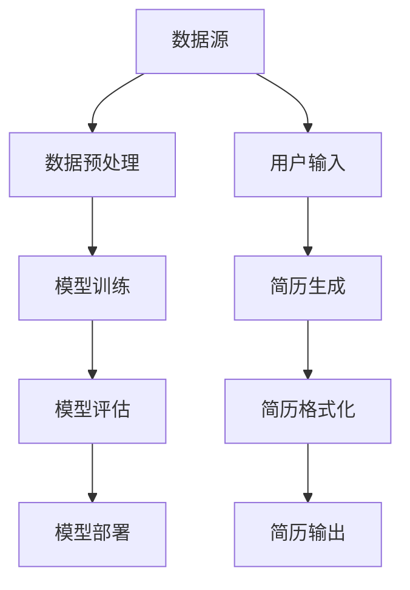

                 

# 《基于AI大模型实现自动化简历生成工具系统开发实践》

> 关键词：人工智能、自动化简历生成、AI大模型、自然语言处理、深度学习、系统开发

> 摘要：
本文章旨在介绍如何基于AI大模型实现自动化简历生成工具系统的开发。首先，我们将探讨AI大模型的基本概念、技术原理和应用场景，然后深入讲解自然语言处理基础和常见AI大模型。接着，我们将介绍数学基础与公式推导，以及AI大模型应用场景。随后，我们将详细描述自动化简历生成工具系统的开发过程，包括系统架构设计、模块划分、数据流程与处理等。最后，我们将通过代码实现与调试的讲解，帮助读者了解系统开发的实际操作。本文将为开发者提供全面的技术指导和实战经验，助力构建高效、智能的自动化简历生成工具系统。

----------------------------------------------------------------

## 第一部分: AI大模型基础

在当今的科技领域，人工智能（AI）已经成为了炙手可热的话题。其中，AI大模型作为人工智能的核心技术之一，正引领着新一轮的技术革命。本部分将详细介绍AI大模型的基础知识，包括基本概念、发展历程、技术原理及其在自动化简历生成工具系统中的应用。

### 第1章: AI大模型概述

#### 1.1 AI大模型的基本概念

AI大模型（Large-scale AI Model）是指参数数量达到亿级甚至千亿级，通过大规模数据训练得到的复杂神经网络模型。这些模型能够学习到数据中的复杂模式，具备强大的表征和生成能力。AI大模型通常基于深度学习技术，具有多层神经网络结构，能够处理高维数据，适用于各种复杂的任务。

#### 1.2 AI大模型的发展历程

AI大模型的发展经历了多个阶段。从最初的简单神经网络（如感知机）发展到现代的深度学习模型（如卷积神经网络、循环神经网络和Transformer等），AI大模型的研究不断推进，性能和规模不断提升。近年来，随着计算资源和数据量的增长，AI大模型取得了显著的突破，应用于自然语言处理、计算机视觉、语音识别等领域，取得了令人瞩目的成果。

#### 1.3 AI大模型的技术原理

AI大模型的核心是深度神经网络（DNN），其基本原理是通过多层神经元之间的非线性变换，逐步提取数据中的特征。AI大模型的技术原理主要包括以下几个方面：

1. **多层神经网络**：多层神经网络由输入层、隐藏层和输出层组成，每个层都能提取不同层次的特征。随着层数的增加，模型能够学习的特征表达能力也增强。

2. **反向传播算法**：反向传播算法是一种用于训练神经网络的优化算法。通过计算梯度并更新网络参数，反向传播算法使神经网络能够逐步逼近最优解。

3. **激活函数**：激活函数是神经网络中重要的组成部分，能够引入非线性特性，使神经网络具备区分不同输入数据的能力。

4. **正则化技术**：正则化技术用于防止模型过拟合，提高模型的泛化能力。常见的正则化技术包括L1、L2正则化和dropout等。

5. **优化算法**：优化算法用于优化神经网络训练过程中的目标函数，提高模型的训练效率。常见的优化算法包括随机梯度下降（SGD）、Adam等。

### 第2章: 自然语言处理基础

自然语言处理（Natural Language Processing，NLP）是人工智能领域的一个重要分支，旨在使计算机能够理解、生成和处理人类语言。在本节中，我们将介绍自然语言处理的基础知识，包括语言模型与文本表示、词嵌入技术、序列模型与注意力机制。

#### 2.1 语言模型与文本表示

语言模型是一种统计模型，用于预测下一个单词或字符的概率。在NLP任务中，语言模型被广泛应用于文本生成、机器翻译和文本分类等。文本表示是将自然语言文本转换为计算机可以处理的形式。常见的文本表示方法包括词袋模型、词嵌入和序列编码等。

#### 2.2 词嵌入技术

词嵌入（Word Embedding）是一种将词语映射为低维稠密向量表示的技术。词嵌入能够捕捉词语之间的语义关系，提高NLP任务的效果。常见的词嵌入技术包括Word2Vec、FastText和GloVe等。

#### 2.3 序列模型与注意力机制

序列模型（Sequence Model）是一种用于处理序列数据的神经网络模型，如循环神经网络（RNN）和长短期记忆网络（LSTM）。注意力机制（Attention Mechanism）是一种用于提高模型对序列中重要信息的关注能力的机制，广泛应用于机器翻译、文本摘要和语音识别等任务中。

### 第3章: 常见AI大模型介绍

在本章中，我们将介绍几种常见的AI大模型，包括GPT模型、BERT模型和其他AI大模型。这些模型在自然语言处理领域取得了显著的成果，为我们实现自动化简历生成工具系统提供了有力的技术支持。

#### 3.1 GPT模型

GPT（Generative Pre-trained Transformer）模型是OpenAI开发的一种基于Transformer的预训练语言模型。GPT模型通过大量的文本数据进行预训练，学习到语言的内在规律，具备强大的文本生成和语言理解能力。

#### 3.2 BERT模型

BERT（Bidirectional Encoder Representations from Transformers）模型是由Google开发的一种双向Transformer模型。BERT模型通过同时考虑上下文信息，提高了模型对自然语言的理解能力，广泛应用于文本分类、问答系统和信息提取等领域。

#### 3.3 其他AI大模型简介

除了GPT和BERT模型，还有许多其他的AI大模型，如T5、RoBERTa、ALBERT等。这些模型在预训练方法、模型架构和优化策略等方面进行了创新和改进，取得了优异的性能。

### 第4章: 数学基础与公式推导

AI大模型的设计与实现离不开数学基础。在本章中，我们将介绍概率论基础、信息论基础、损失函数与优化算法等数学概念，为后续的算法讲解和项目实战提供理论基础。

#### 4.1 概率论基础

概率论是研究随机事件和概率的数学分支。在本节中，我们将介绍概率分布函数、条件概率、贝叶斯定理等基本概念。

#### 4.2 信息论基础

信息论是研究信息传输、处理和存储的数学理论。在本节中，我们将介绍信息熵、条件熵、信息增益等基本概念。

#### 4.3 损失函数与优化算法

损失函数是衡量模型预测值与真实值之间差距的函数。优化算法用于调整模型参数，使损失函数最小化。在本节中，我们将介绍交叉熵损失函数、梯度下降算法等优化算法。

### 第5章: AI大模型应用场景

AI大模型在自然语言处理、计算机视觉、语音识别等领域取得了显著的应用成果。在本章中，我们将探讨AI大模型在自动化简历生成工具系统中的应用场景。

#### 5.1 自动化简历生成概述

自动化简历生成是一种利用AI技术自动生成简历的方法，能够提高简历撰写的效率和质量。自动化简历生成工具系统主要包括数据预处理、简历内容生成和简历格式化等模块。

#### 5.2 简历数据预处理

简历数据预处理是自动化简历生成的重要环节，包括数据清洗、文本分词、命名实体识别等。在本节中，我们将介绍简历数据预处理的具体方法和实现技巧。

#### 5.3 简历内容生成算法

简历内容生成是自动化简历生成的核心模块，主要利用AI大模型生成简历中的各个部分，如个人信息、教育背景、工作经历等。在本节中，我们将介绍简历内容生成算法的设计与实现。

### 第6章: 自动化简历生成工具系统开发

自动化简历生成工具系统是一个复杂的软件系统，涉及多个模块的协同工作。在本章中，我们将详细描述自动化简历生成工具系统的开发过程，包括系统架构设计、模块划分、数据流程与处理等。

#### 6.1 系统架构设计

系统架构设计是自动化简历生成工具系统的第一步，主要包括前端、后端和数据库等组成部分。在本节中，我们将介绍系统架构设计的基本原则和实现方法。

#### 6.2 系统模块划分

系统模块划分是系统设计的关键环节，将系统功能划分为多个模块，有助于提高系统的可维护性和扩展性。在本节中，我们将介绍系统模块划分的具体方法和实现细节。

#### 6.3 数据流程与处理

数据流程与处理是自动化简历生成工具系统的核心，涉及多个模块之间的数据传递和处理。在本节中，我们将介绍数据流程与处理的基本原理和实现方法。

### 第7章: 代码实现与调试

代码实现与调试是自动化简历生成工具系统开发的实际操作环节。在本章中，我们将通过具体代码示例，详细讲解系统开发的各个环节，包括开发环境搭建、数据预处理、模型训练与评估等。

#### 7.1 开发环境搭建

开发环境搭建是系统开发的第一步，包括Python环境安装、深度学习框架安装和自然语言处理库安装等。在本节中，我们将介绍开发环境搭建的步骤和注意事项。

#### 7.2 代码实现细节

代码实现细节是系统开发的核心，涉及模型训练、数据预处理和系统接口等。在本节中，我们将通过伪代码和实际代码示例，详细讲解各个模块的实现方法。

#### 7.3 调试与优化

调试与优化是系统开发的重要环节，通过调试和优化，可以确保系统的稳定性和性能。在本节中，我们将介绍调试与优化技巧，包括错误定位、性能分析和代码优化等。

### 附录

#### 附录A: 开发工具与资源

在本附录中，我们将介绍自动化简历生成工具系统开发所需的工具和资源，包括Python库、深度学习框架、自然语言处理库和其他相关工具。

#### 附录B: Mermaid流程图

Mermaid流程图是一种用于绘制流程图的工具，可以直观地展示系统的各个模块和数据处理流程。在本附录中，我们将提供几个示例的Mermaid流程图，以便读者更好地理解系统架构和数据流程。

#### 附录C: 数学公式与算法

数学公式和算法是自动化简历生成工具系统的理论基础。在本附录中，我们将列出本书涉及的一些基本的数学公式和算法，包括概率论基础、信息论基础、损失函数与优化算法等。

#### 附录D: 项目实战

项目实战是理解和掌握系统开发的关键。在本附录中，我们将提供自动化简历生成工具系统开发的实际项目案例，包括开发环境搭建、代码实现和调试等步骤，帮助读者将所学知识应用到实际项目中。

#### 附录E: 开发技巧与优化策略

开发技巧与优化策略是提高系统性能和稳定性的关键。在本附录中，我们将介绍一些开发技巧与优化策略，包括性能优化、代码质量、系统稳定性和安全性等，帮助读者构建高效、稳定和安全的自动化简历生成工具系统。

#### 附录F: 常见问题与解决方案

在系统开发过程中，可能会遇到各种问题。在本附录中，我们将列出一些常见问题与解决方案，包括深度学习框架相关问题、自然语言处理相关问题、项目开发相关问题等，帮助读者解决开发过程中遇到的问题。

## 后记

本文章详细介绍了基于AI大模型实现自动化简历生成工具系统的开发实践。通过本篇文章，读者可以全面了解AI大模型的基本概念、技术原理和应用场景，掌握自然语言处理基础和常见AI大模型，学会数学基础与公式推导，以及自动化简历生成工具系统的开发过程和代码实现细节。希望本文能为开发者提供有益的技术指导和实战经验，助力构建高效、智能的自动化简历生成工具系统。

作者：AI天才研究院/AI Genius Institute & 禅与计算机程序设计艺术 /Zen And The Art of Computer Programming

----------------------------------------------------------------

## 第一部分: AI大模型基础

### 第1章: AI大模型概述

#### 1.1 AI大模型的基本概念

AI大模型（Large-scale AI Model）是指参数数量达到亿级甚至千亿级，通过大规模数据训练得到的复杂神经网络模型。这些模型能够学习到数据中的复杂模式，具备强大的表征和生成能力。AI大模型通常基于深度学习技术，具有多层神经网络结构，能够处理高维数据，适用于各种复杂的任务。

AI大模型的出现解决了传统机器学习模型在处理大规模数据和高维度特征时的局限性。与传统的小型模型相比，AI大模型具有以下几个显著特点：

1. **规模庞大**：AI大模型的参数数量通常达到亿级甚至千亿级，相比传统模型，其参数规模增长了数十倍甚至上百倍。这种庞大的参数规模使得AI大模型能够更好地捕捉数据中的复杂模式，从而提高模型的性能。

2. **训练数据量巨大**：AI大模型的训练数据量通常达到数百万甚至数十亿条数据。通过海量数据的训练，AI大模型能够学习到数据中的更多规律和特征，从而提高模型的泛化能力。

3. **强大的表征能力**：AI大模型通过多层神经网络结构，逐步提取数据中的特征。随着层数的增加，模型的特征表达能力也不断增强。这使得AI大模型能够对复杂的任务进行建模，处理高维数据。

4. **自动特征学习**：AI大模型能够自动学习数据中的特征，无需手动设计特征工程。这大大简化了模型开发的流程，提高了模型的开发效率。

5. **自适应能力**：AI大模型具备较强的自适应能力，能够在不同任务和数据集上表现出良好的性能。通过迁移学习和多任务学习等技术，AI大模型能够快速适应新的任务和数据。

#### 1.2 AI大模型的发展历程

AI大模型的发展经历了多个阶段。从最初的简单神经网络（如感知机）发展到现代的深度学习模型（如卷积神经网络、循环神经网络和Transformer等），AI大模型的研究不断推进，性能和规模不断提升。近年来，随着计算资源和数据量的增长，AI大模型取得了显著的突破，应用于自然语言处理、计算机视觉、语音识别等领域，取得了令人瞩目的成果。

AI大模型的发展历程可以分为以下几个阶段：

1. **初级阶段**（20世纪80年代至90年代）：这一阶段以感知机、多层感知机（MLP）等简单神经网络为主。这些模型虽然能够进行一些简单的分类和回归任务，但受限于参数规模和数据量，性能和泛化能力有限。

2. **发展期**（2006年-2012年）：2006年，Hinton等人提出了深度信念网络（DBN），开启了深度学习研究的新篇章。随后，Hinton等人在2012年提出了AlexNet，标志着深度学习在图像分类任务上取得了突破性成果。这一阶段的深度学习模型主要包括卷积神经网络（CNN）和循环神经网络（RNN）。

3. **成熟期**（2012年至今）：2013年，Google的神经机器翻译系统（NMT）取得了显著成果，进一步推动了深度学习在自然语言处理领域的发展。2014年，微软的语音识别系统达到了人类水平。2017年，OpenAI的GPT模型在自然语言生成任务上取得了突破性成果。这一阶段的AI大模型主要包括GPT、BERT、T5等，模型规模和性能不断提升，应用领域不断拓展。

#### 1.3 AI大模型的技术原理

AI大模型的核心是深度神经网络（DNN），其基本原理是通过多层神经元之间的非线性变换，逐步提取数据中的特征。AI大模型的技术原理主要包括以下几个方面：

1. **多层神经网络**：多层神经网络由输入层、隐藏层和输出层组成，每个层都能提取不同层次的特征。随着层数的增加，模型能够学习的特征表达能力也增强。例如，卷积神经网络（CNN）通过多层卷积和池化操作，逐步提取图像中的特征；循环神经网络（RNN）通过隐藏状态和门控机制，处理序列数据。

2. **反向传播算法**：反向传播算法是一种用于训练神经网络的优化算法。通过计算梯度并更新网络参数，反向传播算法使神经网络能够逐步逼近最优解。反向传播算法的核心思想是计算每一层的梯度，并沿梯度方向更新参数，以最小化损失函数。

3. **激活函数**：激活函数是神经网络中重要的组成部分，能够引入非线性特性，使神经网络具备区分不同输入数据的能力。常见的激活函数包括Sigmoid、ReLU和Tanh等。

4. **正则化技术**：正则化技术用于防止模型过拟合，提高模型的泛化能力。常见的正则化技术包括L1、L2正则化和dropout等。L1、L2正则化通过在损失函数中添加惩罚项，抑制模型参数的增长；dropout通过在训练过程中随机丢弃部分神经元，防止模型过拟合。

5. **优化算法**：优化算法用于优化神经网络训练过程中的目标函数，提高模型的训练效率。常见的优化算法包括随机梯度下降（SGD）、Adam等。SGD通过随机梯度方向更新参数，收敛速度较快；Adam结合了SGD和动量法的优点，收敛速度更快。

#### 1.4 AI大模型的应用场景

AI大模型在多个领域取得了显著的应用成果，下面列举一些典型的应用场景：

1. **自然语言处理**：AI大模型在自然语言处理领域取得了突破性成果，包括文本分类、机器翻译、文本生成等。例如，GPT和BERT模型在文本生成和语言理解任务上取得了显著效果；T5模型在机器翻译任务上取得了人类级别的成果。

2. **计算机视觉**：AI大模型在计算机视觉领域广泛应用于图像分类、目标检测、语义分割等任务。例如，ResNet模型在图像分类任务上取得了SOTA效果；YOLO和SSD模型在目标检测任务上取得了高性能。

3. **语音识别**：AI大模型在语音识别领域取得了显著的成果，包括自动语音识别、语音合成等。例如，基于深度神经网络的ASR系统在语音识别准确率上达到了人类水平；WaveNet模型在语音合成任务上取得了高质量的效果。

4. **推荐系统**：AI大模型在推荐系统领域应用于用户兴趣建模、物品推荐等任务。例如，基于深度学习技术的推荐系统通过用户历史行为数据，实现了个性化的物品推荐。

5. **金融风控**：AI大模型在金融风控领域应用于欺诈检测、信用评估等任务。例如，通过深度学习技术，可以对用户的交易行为进行建模，有效识别欺诈行为。

6. **医疗健康**：AI大模型在医疗健康领域应用于疾病诊断、药物研发等任务。例如，通过深度学习技术，可以对医学影像进行自动诊断，辅助医生进行疾病筛查。

7. **工业制造**：AI大模型在工业制造领域应用于设备故障预测、生产优化等任务。例如，通过深度学习技术，可以对工业设备进行实时监测，预测潜在故障，优化生产流程。

#### 1.5 AI大模型的优势与挑战

AI大模型在各个领域取得了显著的成果，具有以下几个优势：

1. **强大的表征能力**：AI大模型通过多层神经网络结构，能够自动学习数据中的复杂特征，具备强大的表征能力。

2. **高泛化能力**：通过大规模数据的训练，AI大模型能够学习到数据中的通用规律，具备良好的泛化能力。

3. **自适应能力**：AI大模型具备较强的自适应能力，能够在不同任务和数据集上表现出良好的性能。

4. **自动化特征学习**：AI大模型能够自动学习数据中的特征，无需手动设计特征工程，简化了模型开发流程。

然而，AI大模型也面临一些挑战：

1. **计算资源需求**：AI大模型的训练和推理过程需要大量的计算资源，特别是大型模型，对硬件设施和计算能力提出了更高的要求。

2. **数据依赖性**：AI大模型对数据的依赖性较高，数据的多样性和质量直接影响模型的性能。在数据匮乏或数据质量差的情况下，模型性能可能下降。

3. **模型解释性**：AI大模型的内部机制复杂，难以解释和理解。这使得模型在面对重要决策时，难以提供透明和可解释的依据。

4. **模型安全和隐私**：随着AI大模型的应用场景不断拓展，模型的安全性和隐私问题也日益凸显。如何确保模型的安全性和隐私性，是当前研究的一个重要方向。

#### 1.6 AI大模型的发展趋势

随着人工智能技术的不断发展，AI大模型将继续发挥重要作用，未来可能会出现以下几大发展趋势：

1. **模型规模不断扩大**：随着计算资源和数据量的增长，AI大模型的规模将不断增大，参数数量将达到千亿级甚至万亿级。

2. **多模态学习**：AI大模型将具备更强大的多模态学习能力，能够处理文本、图像、音频等多种类型的数据，实现跨模态的信息融合和交互。

3. **模型解释性提升**：为了提高模型的解释性，研究者将致力于开发可解释的AI大模型，使模型在面对重要决策时能够提供透明和可解释的依据。

4. **迁移学习和多任务学习**：AI大模型将具备更强的迁移学习和多任务学习能力，能够在不同任务和数据集之间共享知识，提高模型的泛化能力和开发效率。

5. **安全性和隐私保护**：为了解决AI大模型的安全性和隐私问题，研究者将开发更加安全的训练和推理算法，确保模型在应用场景中的安全性和隐私性。

总之，AI大模型作为人工智能的核心技术之一，将继续推动人工智能的发展和应用。通过不断的技术创新和优化，AI大模型将助力各领域实现智能化和自动化，为人类创造更多价值。

### 第2章: 自然语言处理基础

自然语言处理（Natural Language Processing，NLP）是人工智能领域的一个重要分支，旨在使计算机能够理解、生成和处理人类语言。随着深度学习技术的不断发展，NLP在各个领域取得了显著的成果，如文本分类、机器翻译、文本生成等。本章将介绍自然语言处理的基础知识，包括语言模型与文本表示、词嵌入技术、序列模型与注意力机制。

#### 2.1 语言模型与文本表示

语言模型（Language Model）是一种用于预测自然语言序列的模型，其核心目标是学习语言中的概率分布。在NLP任务中，语言模型广泛应用于文本生成、机器翻译和文本分类等。文本表示（Text Representation）是将自然语言文本转换为计算机可以处理的形式，常见的文本表示方法包括词袋模型、词嵌入和序列编码等。

##### 2.1.1 语言模型

语言模型的基本思想是利用统计方法，根据已知的历史文本数据，预测下一个单词或字符的概率。语言模型可以分为以下几个类型：

1. **n-gram模型**：n-gram模型是一种基于相邻词序列的统计模型，它根据前n个单词的序列来预测下一个单词的概率。例如，三元语法（Trigram）模型考虑前三个单词的历史信息。n-gram模型的优点是简单易实现，但缺点是参数量巨大，且在长文本中效果较差。

2. **n元马尔可夫模型**：n元马尔可夫模型是一种基于马尔可夫假设的统计模型，它假设当前状态仅依赖于前n个状态，与更早的状态无关。n元马尔可夫模型的优点是参数量相对较少，且在长文本中效果较好，但缺点是预测能力有限。

3. **神经网络语言模型**：神经网络语言模型（Neural Language Model）是一种基于深度学习的语言模型，它通过多层神经网络来学习语言中的概率分布。神经网络语言模型可以捕捉到语言中的复杂模式和上下文信息，具有更好的预测能力。常见的神经网络语言模型包括循环神经网络（RNN）、长短期记忆网络（LSTM）和Transformer等。

##### 2.1.2 文本表示

文本表示是将自然语言文本转换为计算机可以处理的形式。常见的文本表示方法包括词袋模型、词嵌入和序列编码等。

1. **词袋模型**：词袋模型（Bag-of-Words，BoW）是一种基于统计的文本表示方法，它将文本表示为一个单词的向量集合。词袋模型的优点是简单易实现，但缺点是丢失了词的顺序信息和语义信息。

2. **词嵌入**：词嵌入（Word Embedding）是一种将词语映射为低维稠密向量表示的技术。词嵌入能够捕捉词语之间的语义关系，提高NLP任务的效果。常见的词嵌入技术包括Word2Vec、FastText和GloVe等。

3. **序列编码**：序列编码（Sequence Encoding）是一种将自然语言文本转换为序列向量的方法。常见的序列编码方法包括字符嵌入、词嵌入和位置编码等。序列编码能够保留文本的顺序信息，但计算复杂度较高。

#### 2.2 词嵌入技术

词嵌入（Word Embedding）是将词语映射为低维稠密向量表示的技术。词嵌入能够捕捉词语之间的语义关系，提高NLP任务的效果。常见的词嵌入技术包括Word2Vec、FastText和GloVe等。

##### 2.2.1 Word2Vec

Word2Vec是一种基于神经网络的语言模型，通过训练神经网络来学习词语的向量表示。Word2Vec模型包括两个变种：连续词袋（Continuous Bag-of-Words，CBOW）和Skip-Gram。

1. **连续词袋（CBOW）**：CBOW模型通过预测中心词周围的多个单词的概率来学习词向量。具体来说，CBOW模型将中心词表示为输入，周围词表示为输出，通过多层神经网络来学习词向量。CBOW模型的优点是计算复杂度较低，但缺点是容易受到周围单词的影响。

2. **Skip-Gram**：Skip-Gram模型通过预测中心词的上下文单词来学习词向量。具体来说，Skip-Gram模型将中心词表示为输入，上下文单词表示为输出，通过多层神经网络来学习词向量。Skip-Gram模型的优点是能够更好地捕捉词语之间的语义关系，但计算复杂度较高。

##### 2.2.2 FastText

FastText是一种基于词嵌入的文本表示方法，它通过将词表扩展为词袋模型来学习词向量。FastText模型将每个单词表示为一个多层的词袋模型，通过多层神经网络来学习词向量。FastText模型的优势在于能够更好地处理罕见词和未登录词，提高了NLP任务的效果。

##### 2.2.3 GloVe

GloVe（Global Vectors for Word Representation）是一种基于全局统计信息的词嵌入方法。GloVe模型通过计算词之间的共现矩阵，学习词语的向量表示。具体来说，GloVe模型通过最小化词对之间的损失函数，学习词向量。GloVe模型的优势在于能够更好地捕捉词语之间的语义关系，但计算复杂度较高。

#### 2.3 序列模型与注意力机制

序列模型（Sequence Model）是一种用于处理序列数据的神经网络模型，如循环神经网络（RNN）和长短期记忆网络（LSTM）。注意力机制（Attention Mechanism）是一种用于提高模型对序列中重要信息的关注能力的机制，广泛应用于机器翻译、文本摘要和语音识别等任务中。

##### 2.3.1 循环神经网络（RNN）

循环神经网络（Recurrent Neural Network，RNN）是一种用于处理序列数据的神经网络模型。RNN的核心思想是利用隐藏状态来表示序列中的信息，并通过时间步的循环来逐步处理序列数据。

RNN的数学表示如下：

$$
h_t = \text{sigmoid}(W_h \cdot [h_{t-1}, x_t] + b_h)
$$

其中，$h_t$ 表示第 $t$ 个时间步的隐藏状态，$x_t$ 表示第 $t$ 个时间步的输入，$W_h$ 和 $b_h$ 分别为权重和偏置。

RNN的优缺点如下：

1. **优点**：RNN能够处理任意长度的序列数据，并利用隐藏状态来表示序列中的信息。

2. **缺点**：RNN存在梯度消失和梯度爆炸问题，导致训练不稳定。此外，RNN难以捕捉长距离依赖关系。

##### 2.3.2 长短期记忆网络（LSTM）

长短期记忆网络（Long Short-Term Memory，LSTM）是一种改进的循环神经网络，旨在解决RNN的梯度消失和梯度爆炸问题，并提高模型对长距离依赖关系的捕捉能力。

LSTM的核心结构包括三个门控单元：输入门、遗忘门和输出门。

1. **输入门**：输入门用于控制当前输入信息对隐藏状态的更新。

$$
i_t = \text{sigmoid}(W_i \cdot [h_{t-1}, x_t] + b_i)
$$

2. **遗忘门**：遗忘门用于控制先前隐藏状态的遗忘程度。

$$
f_t = \text{sigmoid}(W_f \cdot [h_{t-1}, x_t] + b_f)
$$

3. **输出门**：输出门用于控制当前隐藏状态对输出的贡献程度。

$$
o_t = \text{sigmoid}(W_o \cdot [h_{t-1}, x_t] + b_o)
$$

LSTM的优缺点如下：

1. **优点**：LSTM能够有效地解决梯度消失和梯度爆炸问题，并提高模型对长距离依赖关系的捕捉能力。

2. **缺点**：LSTM的结构复杂，训练速度较慢，且参数较多。

##### 2.3.3 注意力机制

注意力机制（Attention Mechanism）是一种用于提高模型对序列中重要信息的关注能力的机制。注意力机制通过计算注意力权重，将不同位置的输入分配不同的关注程度，从而提高模型的性能。

注意力机制的数学表示如下：

$$
a_t = \text{softmax}(\text{注意力权重})
$$

其中，$a_t$ 表示第 $t$ 个时间步的注意力权重。

注意力机制的优缺点如下：

1. **优点**：注意力机制能够提高模型对重要信息的关注能力，从而提高模型的性能。

2. **缺点**：注意力机制的计算复杂度较高，可能导致训练和推理速度变慢。

通过本章的介绍，我们了解了自然语言处理的基础知识，包括语言模型与文本表示、词嵌入技术、序列模型与注意力机制。这些基础概念和算法为后续的NLP任务提供了重要的理论支持。在实际应用中，我们可以根据具体任务需求，选择合适的模型和算法，实现高效的NLP应用。

### 第3章: 常见AI大模型介绍

在自然语言处理（NLP）领域，AI大模型已成为一种强大的工具，广泛应用于文本分类、机器翻译、文本生成等任务。本章将介绍几种常见的AI大模型，包括GPT模型、BERT模型和其他AI大模型，以便读者了解这些模型的基本原理和特性。

#### 3.1 GPT模型

GPT（Generative Pre-trained Transformer）模型是由OpenAI开发的一种基于Transformer的预训练语言模型。GPT模型通过大量文本数据进行预训练，学习到语言的内在规律，具备强大的文本生成和语言理解能力。

##### 3.1.1 GPT模型的基本原理

GPT模型的核心是Transformer架构，它由多个自注意力模块（self-attention module）组成。自注意力模块能够捕捉序列中不同位置之间的依赖关系，从而提高模型对上下文信息的处理能力。GPT模型的训练过程分为两个阶段：

1. **预训练阶段**：在预训练阶段，GPT模型通过大量的文本数据进行无监督训练，学习到语言的内在规律。具体来说，GPT模型在训练过程中，每个时间步的输入不仅包括当前单词，还包括之前单词的嵌入表示。通过自注意力机制，模型能够自动学习到单词之间的依赖关系。

2. **微调阶段**：在微调阶段，GPT模型针对具体任务（如文本分类、机器翻译等）进行有监督训练。在微调过程中，模型通过学习标注数据中的知识，进一步提高模型在特定任务上的性能。

##### 3.1.2 GPT模型的特性

GPT模型具有以下几个特性：

1. **强大的文本生成能力**：GPT模型通过预训练和微调，能够生成流畅、连贯的文本。在实际应用中，GPT模型可以用于自动写作、对话生成等任务。

2. **灵活的任务适应能力**：GPT模型在预训练阶段积累了丰富的语言知识，使其能够适应多种任务。通过微调，GPT模型可以在不同任务上取得优异的性能。

3. **高计算资源需求**：GPT模型的结构复杂，参数数量巨大，因此在训练和推理过程中需要大量的计算资源。在实际应用中，通常需要使用GPU或TPU等高性能计算设备。

##### 3.1.3 GPT模型的应用场景

GPT模型在自然语言处理领域具有广泛的应用，以下是一些典型的应用场景：

1. **文本生成**：GPT模型可以用于生成文章、故事、诗歌等文本内容。在实际应用中，GPT模型可以用于自动写作、文案生成等任务。

2. **对话系统**：GPT模型可以用于构建智能对话系统，如聊天机器人、虚拟助手等。通过预训练和微调，GPT模型可以理解用户的意图，并生成相应的回复。

3. **机器翻译**：GPT模型可以用于机器翻译任务，如将一种语言翻译成另一种语言。在实际应用中，GPT模型可以用于实时翻译、跨语言文本生成等任务。

4. **文本分类**：GPT模型可以用于文本分类任务，如情感分析、主题分类等。通过预训练和微调，GPT模型可以识别文本中的关键信息，并对其进行分类。

#### 3.2 BERT模型

BERT（Bidirectional Encoder Representations from Transformers）模型是由Google开发的一种基于Transformer的双向编码器模型。BERT模型通过预训练和微调，能够捕捉文本中的双向信息，提高模型的性能和效果。

##### 3.2.1 BERT模型的基本原理

BERT模型的核心是Transformer架构，它由多个编码器层（encoder layer）组成。每个编码器层包含多个自注意力模块和前馈网络。BERT模型通过预训练和微调，能够学习到语言的内在规律和特征。

BERT模型的预训练过程分为两个阶段：

1. **遮蔽语言模型（Masked Language Model，MLM）**：在遮蔽语言模型阶段，BERT模型对输入文本进行随机遮蔽，遮蔽的部分由模型自动预测。通过这种方式，BERT模型学习到文本中的上下文信息，并能够生成被遮蔽的单词。

2. **下一句预测（Next Sentence Prediction，NSP）**：在下一句预测阶段，BERT模型预测两个句子之间的顺序关系。通过这种方式，BERT模型学习到文本中的句子结构和语义关系。

BERT模型的微调过程通常包括以下几个步骤：

1. **数据准备**：将原始文本数据清洗、分词和转换为BERT模型所需的格式。

2. **模型加载**：加载预训练好的BERT模型，并在特定任务上进行微调。

3. **训练**：使用训练数据对BERT模型进行训练，并调整模型的参数。

4. **评估**：使用验证数据评估模型的性能，并根据需要调整模型结构或参数。

##### 3.2.2 BERT模型的特性

BERT模型具有以下几个特性：

1. **双向信息捕捉**：BERT模型通过双向编码器结构，能够同时考虑文本中的前文和后文信息，提高模型的性能和效果。

2. **预训练和微调**：BERT模型通过预训练和微调，能够适应多种自然语言处理任务，并取得优异的性能。

3. **高计算资源需求**：BERT模型的结构复杂，参数数量巨大，因此在训练和推理过程中需要大量的计算资源。

##### 3.2.3 BERT模型的应用场景

BERT模型在自然语言处理领域具有广泛的应用，以下是一些典型的应用场景：

1. **文本分类**：BERT模型可以用于文本分类任务，如情感分析、主题分类等。通过预训练和微调，BERT模型可以识别文本中的关键信息，并对其进行分类。

2. **命名实体识别（NER）**：BERT模型可以用于命名实体识别任务，如识别文本中的地点、组织、人物等。通过预训练和微调，BERT模型可以学习到命名实体的特征和模式。

3. **机器翻译**：BERT模型可以用于机器翻译任务，如将一种语言翻译成另一种语言。通过预训练和微调，BERT模型可以捕捉到文本中的语言结构和语义信息。

4. **问答系统**：BERT模型可以用于问答系统，如阅读理解、事实提取等。通过预训练和微调，BERT模型可以理解问题的含义，并从文本中找到相关答案。

#### 3.3 其他AI大模型

除了GPT和BERT模型，还有许多其他的AI大模型在自然语言处理领域取得了显著的成果。以下介绍几种常见的AI大模型：

1. **T5模型**：T5（Text-to-Text Transfer Transformer）模型是由DeepMind开发的一种基于Transformer的文本生成模型。T5模型的核心思想是将所有NLP任务转化为文本到文本的转换任务，从而实现任务的统一处理。

2. **RoBERTa模型**：RoBERTa模型是由Facebook AI Research开发的一种基于BERT的改进模型。RoBERTa模型通过放松BERT的训练策略，如取消次采样和重复掩码，提高模型的性能和效果。

3. **ALBERT模型**：ALBERT（A Lite BERT）模型是由Google开发的一种轻量级BERT模型。ALBERT模型通过共享多层参数、自注意力机制和句间交互，提高了模型的性能和效率。

4. **XLNet模型**：XLNet（Exponential Linear Unit Network）模型是由Google开发的一种基于自注意力机制的文本生成模型。XLNet模型通过引入对数线性单位（Exponential Linear Unit，ELU）激活函数，提高了模型的性能和效果。

这些AI大模型在自然语言处理领域取得了显著的成果，并为实际应用提供了丰富的技术支持。通过选择合适的模型和算法，我们可以实现高效的NLP应用，为各个领域的发展带来新的机遇和挑战。

### 第4章: 数学基础与公式推导

在构建和优化AI大模型的过程中，数学基础是不可或缺的一部分。本章将介绍概率论基础、信息论基础、损失函数与优化算法等数学概念，以及如何将这些数学公式应用于AI大模型的训练和优化。

#### 4.1 概率论基础

概率论是研究随机事件和概率的数学分支，是AI大模型的核心理论基础。以下是一些基础的概率论概念：

##### 4.1.1 概率分布函数（PDF）

概率分布函数（Probability Density Function，PDF）描述了随机变量在某个区间内的概率分布。对于连续随机变量X，其PDF表示为：

$$
f_X(x) = P(X = x)
$$

其中，$P(X = x)$ 表示随机变量X取值为x的概率。

##### 4.1.2 条件概率

条件概率（Conditional Probability）是指在已知某一事件发生的条件下，另一事件发生的概率。条件概率的定义如下：

$$
P(A|B) = \frac{P(A \cap B)}{P(B)}
$$

其中，$P(A \cap B)$ 表示事件A和事件B同时发生的概率，$P(B)$ 表示事件B发生的概率。

##### 4.1.3 贝叶斯定理

贝叶斯定理（Bayes' Theorem）是概率论中的一个重要公式，它描述了在给定某些证据的情况下，某一假设的概率。贝叶斯定理的公式如下：

$$
P(A|B) = \frac{P(B|A) \cdot P(A)}{P(B)}
$$

其中，$P(B|A)$ 表示在假设A成立的条件下，事件B发生的概率；$P(A)$ 表示假设A成立的概率；$P(B)$ 表示事件B发生的概率。

##### 4.1.4 概率分布的期望和方差

概率分布的期望（Expected Value）和方差（Variance）是描述概率分布中心位置和离散程度的指标。期望的定义如下：

$$
E[X] = \int_{-\infty}^{\infty} x \cdot f_X(x) \, dx
$$

方差的定义如下：

$$
Var(X) = E[(X - E[X])^2]
$$

#### 4.2 信息论基础

信息论是研究信息传输、处理和存储的数学理论。在AI大模型中，信息论用于衡量模型对数据的表征能力和信息损失。以下是一些基础的信息论概念：

##### 4.2.1 信息熵

信息熵（Entropy）是衡量随机变量不确定性的指标。信息熵的定义如下：

$$
H(X) = -\sum_{i=1}^{n} P(X = x_i) \cdot \log_2 P(X = x_i)
$$

其中，$P(X = x_i)$ 表示随机变量X取值为$x_i$的概率。

##### 4.2.2 条件熵

条件熵（Conditional Entropy）是衡量在已知某一事件发生的条件下，另一事件的不确定性的指标。条件熵的定义如下：

$$
H(X|Y) = -\sum_{i=1}^{n} P(Y = y_i) \cdot \sum_{j=1}^{m} P(X = x_j | Y = y_i) \cdot \log_2 P(X = x_j | Y = y_i)
$$

##### 4.2.3 互信息

互信息（Mutual Information）是衡量两个随机变量之间相关性的指标。互信息的定义如下：

$$
I(X;Y) = H(X) - H(X|Y)
$$

其中，$H(X)$ 表示随机变量X的信息熵，$H(X|Y)$ 表示在已知随机变量Y的情况下，随机变量X的信息熵。

#### 4.3 损失函数与优化算法

在AI大模型的训练过程中，损失函数（Loss Function）用于衡量模型预测值与真实值之间的差距，优化算法（Optimization Algorithm）用于调整模型参数，使损失函数最小化。以下是一些常用的损失函数和优化算法：

##### 4.3.1 交叉熵损失函数

交叉熵损失函数（Cross-Entropy Loss Function）常用于分类任务中，用于衡量模型预测概率分布与真实分布之间的差距。交叉熵损失函数的公式如下：

$$
J(\theta) = -\frac{1}{m} \sum_{i=1}^{m} [y^{(i)} \cdot \log(\hat{z}^{(i)}) + (1 - y^{(i)}) \cdot \log(1 - \hat{z}^{(i)})}
$$

其中，$y^{(i)}$ 表示第$i$个样本的真实标签，$\hat{z}^{(i)}$ 表示第$i$个样本的预测概率。

##### 4.3.2 梯度下降算法

梯度下降算法（Gradient Descent Algorithm）是一种优化算法，用于调整模型参数，使损失函数最小化。梯度下降算法的公式如下：

$$
\theta_j := \theta_j - \alpha \cdot \frac{\partial J(\theta)}{\partial \theta_j}
$$

其中，$\theta_j$ 表示第$j$个参数，$\alpha$ 表示学习率，$\frac{\partial J(\theta)}{\partial \theta_j}$ 表示损失函数对第$j$个参数的梯度。

##### 4.3.3 随机梯度下降（SGD）算法

随机梯度下降（Stochastic Gradient Descent，SGD）算法是梯度下降算法的一种变种，它通过在每个时间步随机选择一个样本来计算梯度。SGD算法的公式如下：

$$
\theta_j := \theta_j - \alpha \cdot \frac{\partial J(\theta)}{\partial \theta_j}
$$

其中，$\theta_j$ 表示第$j$个参数，$\alpha$ 表示学习率，$\frac{\partial J(\theta)}{\partial \theta_j}$ 表示损失函数对第$j$个参数的梯度。

##### 4.3.4 动量优化算法

动量优化算法（Momentum Optimization Algorithm）是梯度下降算法的一种改进，它通过引入动量项，加速模型的收敛。动量优化算法的公式如下：

$$
v_t = \gamma \cdot v_{t-1} + \alpha \cdot \frac{\partial J(\theta)}{\partial \theta}
$$

$$
\theta_t = \theta_t - v_t
$$

其中，$v_t$ 表示动量项，$\gamma$ 表示动量参数，$\alpha$ 表示学习率，$\frac{\partial J(\theta)}{\partial \theta}$ 表示损失函数对参数$\theta$的梯度。

##### 4.3.5 Adam优化算法

Adam优化算法（Adaptive Moment Estimation）是一种结合了动量和自适应学习率的优化算法。Adam优化算法的公式如下：

$$
m_t = \beta_1 \cdot m_{t-1} + (1 - \beta_1) \cdot \frac{\partial J(\theta)}{\partial \theta}
$$

$$
v_t = \beta_2 \cdot v_{t-1} + (1 - \beta_2) \cdot \left(\frac{\partial J(\theta)}{\partial \theta}\right)^2
$$

$$
\theta_t = \theta_t - \alpha \cdot \frac{m_t}{\sqrt{v_t} + \epsilon}
$$

其中，$m_t$ 和 $v_t$ 分别表示一阶矩估计和二阶矩估计，$\beta_1$ 和 $\beta_2$ 分别表示一阶和二阶动量参数，$\alpha$ 表示学习率，$\epsilon$ 是一个小常数，用于防止除以零。

通过本章的介绍，我们了解了概率论、信息论和优化算法等数学基础，这些数学概念为AI大模型的构建和优化提供了重要的理论基础。在实际应用中，我们可以根据具体任务需求，选择合适的数学模型和优化算法，实现高效的AI大模型训练和优化。

### 第5章: AI大模型应用场景

AI大模型在各个领域展现了强大的应用潜力，尤其在自然语言处理（NLP）领域，AI大模型已经取得了显著成果。在本章中，我们将探讨AI大模型在自动化简历生成工具系统中的应用，包括自动化简历生成的概述、简历数据预处理、简历内容生成算法等。

#### 5.1 自动化简历生成概述

自动化简历生成是一种利用人工智能技术自动生成简历的方法，旨在提高简历撰写的效率和质量。自动化简历生成工具系统主要包括以下几个模块：

1. **数据采集与清洗**：从各种来源（如社交媒体、个人简历库等）收集简历数据，并对数据进行清洗和预处理，确保数据的准确性和一致性。

2. **简历内容生成**：利用AI大模型（如GPT、BERT等）生成简历中的各个部分，如个人信息、教育背景、工作经历等。通过学习大量的简历模板和文本数据，AI大模型能够自动生成结构清晰、内容丰富的简历。

3. **简历格式化与输出**：将生成的简历内容格式化，并输出为不同格式的文件（如PDF、HTML等），方便用户下载和打印。

自动化简历生成工具系统的工作流程如下：

1. 用户输入个人信息和简历内容。
2. 数据采集模块从各种来源收集简历数据。
3. 数据清洗模块对简历数据清洗和预处理。
4. 简历内容生成模块利用AI大模型生成简历内容。
5. 简历格式化模块将简历内容格式化，输出为不同格式的文件。
6. 用户下载或打印生成的简历。

#### 5.2 简历数据预处理

简历数据预处理是自动化简历生成的重要环节，主要任务包括数据清洗、文本分词和命名实体识别等。

##### 5.2.1 数据清洗

数据清洗是去除简历数据中的噪声和错误的过程。常见的噪声和错误包括：

1. **重复数据**：从多个来源收集的简历数据中可能存在重复的简历条目。
2. **缺失值**：部分简历数据可能缺失某些信息，如工作经历、教育背景等。
3. **不一致格式**：不同来源的简历数据格式可能不一致，如日期格式、联系方式等。

数据清洗的步骤如下：

1. **去重**：去除重复的简历条目，确保数据的一致性。
2. **填充缺失值**：根据数据的特点和规则，填充缺失的值。例如，对于缺失的工作经历，可以使用平均工作年限进行填充。
3. **统一格式**：将不同格式的数据统一成标准格式，如将日期格式统一为YYYY-MM-DD。

##### 5.2.2 文本分词

文本分词是将自然语言文本切分成单词或短语的过程。在自动化简历生成中，文本分词是后续处理和生成的基础。常见的文本分词方法包括：

1. **基于规则的分词**：根据语言规则和词性标注进行分词，如使用词典和词性标注规则进行分词。
2. **基于统计的分词**：根据语言模型和统计方法进行分词，如使用隐马尔可夫模型（HMM）或条件概率模型进行分词。

在自动化简历生成中，文本分词的步骤如下：

1. **预处理**：对简历文本进行预处理，如去除标点符号、转换为小写等。
2. **分词**：使用分词算法对预处理后的简历文本进行分词，得到单词或短语序列。

##### 5.2.3 命名实体识别（NER）

命名实体识别（Named Entity Recognition，NER）是识别文本中具有特定意义的实体（如人名、地名、组织名等）的过程。在自动化简历生成中，NER用于提取简历中的重要信息，如姓名、学校、公司名等。NER的方法包括：

1. **基于规则的方法**：使用预定义的规则和模式进行实体识别，如使用词典和规则匹配进行实体识别。
2. **基于统计的方法**：使用统计模型（如条件概率模型、隐马尔可夫模型等）进行实体识别。
3. **基于深度学习的方法**：使用深度神经网络（如卷积神经网络、循环神经网络等）进行实体识别。

在自动化简历生成中，NER的步骤如下：

1. **预处理**：对简历文本进行预处理，如去除标点符号、转换为小写等。
2. **特征提取**：提取文本特征，如词嵌入、词性标注等。
3. **实体识别**：使用NER模型对预处理后的简历文本进行实体识别，提取重要的命名实体。

#### 5.3 简历内容生成算法

简历内容生成是自动化简历生成的核心模块，主要任务是根据输入的简历数据和模板，生成结构清晰、内容丰富的简历。简历内容生成算法通常基于AI大模型，如GPT、BERT等。以下是一个基于GPT模型的简历内容生成算法的伪代码：

```python
function generate_resume(content):
    # 初始化简历模板
    resume_template = initialize_template()

    # 分句处理简历内容
    sentences = split_content_into_sentences(content)

    # 对每句话进行语法分析和命名实体识别
    for sentence in sentences:
        sentence = analyze_sentence(sentence)
        entities = extract_entities(sentence)

        # 根据实体类型生成相应内容
        if "教育背景" in entities:
            resume_template.append("教育背景：")
            resume_template.append(entities["教育背景"])
        elif "工作经历" in entities:
            resume_template.append("工作经历：")
            resume_template.append(entities["工作经历"])
        # ...其他实体处理

    # 格式化输出简历
    formatted_resume = format_resume(resume_template)
    return formatted_resume
```

该算法的主要步骤如下：

1. **初始化简历模板**：根据预设的简历模板，初始化简历内容。
2. **分句处理简历内容**：将输入的简历内容切分成句子。
3. **语法分析和命名实体识别**：对每个句子进行语法分析和命名实体识别，提取关键信息。
4. **生成相应内容**：根据提取的关键信息，生成相应的简历内容。
5. **格式化输出简历**：将生成的简历内容格式化，并输出为不同的格式。

通过上述算法，AI大模型能够根据输入的简历数据和模板，自动生成结构清晰、内容丰富的简历。在实际应用中，可以通过调整算法参数和模型结构，进一步提高简历生成的质量和效率。

#### 5.4 自动化简历生成的优势和应用

自动化简历生成工具系统具有以下优势和应用：

1. **提高简历撰写效率**：自动化简历生成工具系统能够快速生成简历，大大缩短了简历撰写的时间，提高了工作效率。

2. **确保简历格式一致性**：自动化简历生成工具系统可以保证简历格式的统一性，避免因人工操作导致的格式不一致问题。

3. **降低人力资源成本**：通过自动化简历生成工具系统，企业可以节省大量的人力资源成本，提高招聘流程的效率。

4. **提升简历质量**：自动化简历生成工具系统可以利用AI大模型生成高质量的简历，提高简历在招聘过程中的竞争力。

5. **支持个性化简历生成**：自动化简历生成工具系统可以根据用户的需求和目标职位，生成个性化的简历，提高求职成功率。

自动化简历生成工具系统在人力资源领域具有广泛的应用，可以应用于企业招聘、求职者简历管理、人才测评等多个场景。通过不断优化和改进，自动化简历生成工具系统将为人力资源领域带来更多的价值。

### 第6章: 自动化简历生成工具系统开发

自动化简历生成工具系统的开发是一个复杂且系统化的过程，涉及多个模块的协同工作。本章将详细介绍自动化简历生成工具系统的开发过程，包括系统架构设计、模块划分、数据流程与处理等。

#### 6.1 系统架构设计

系统架构设计是自动化简历生成工具系统开发的第一步，它决定了系统的性能、可扩展性和可维护性。以下是一个典型的自动化简历生成工具系统的架构设计：

1. **前端界面**：前端界面用于用户与系统的交互，包括简历录入、简历预览和下载等功能。前端可以使用HTML、CSS和JavaScript等技术实现。

2. **后端服务器**：后端服务器负责处理业务逻辑和数据处理，包括简历数据接收、简历生成、简历格式化等。后端可以使用Python、Java或Node.js等编程语言实现。

3. **数据库**：数据库用于存储简历数据和用户信息，可以使用关系数据库（如MySQL、PostgreSQL）或NoSQL数据库（如MongoDB）。

4. **自然语言处理模块**：自然语言处理模块用于处理简历文本数据，包括文本分词、命名实体识别、语义分析等。可以使用开源自然语言处理库（如spaCy、NLTK）或深度学习模型（如BERT、GPT）。

5. **简历生成引擎**：简历生成引擎是系统的核心模块，负责根据用户需求和模板生成简历。可以使用预训练的AI大模型（如GPT、BERT）或自定义的神经网络模型。

6. **API接口**：API接口用于与其他系统进行数据交互，如与企业人力资源系统对接，实现简历数据的自动导入和导出。

#### 6.2 系统模块划分

系统模块划分是系统设计的关键环节，将系统功能划分为多个模块，有助于提高系统的可维护性和扩展性。以下是一个自动化简历生成工具系统的主要模块划分：

1. **用户管理模块**：用户管理模块负责用户的注册、登录和权限管理等功能。

2. **简历录入模块**：简历录入模块负责接收用户输入的简历数据，并进行初步的数据验证。

3. **简历数据处理模块**：简历数据处理模块负责简历文本的清洗、分词和命名实体识别等预处理工作。

4. **简历生成模块**：简历生成模块负责根据用户需求和模板，生成结构清晰、内容丰富的简历。

5. **简历格式化模块**：简历格式化模块负责将生成的简历内容格式化，并输出为不同的格式（如PDF、HTML等）。

6. **API接口模块**：API接口模块负责与其他系统进行数据交互，提供统一的API接口。

#### 6.3 数据流程与处理

数据流程与处理是自动化简历生成工具系统的核心，涉及多个模块之间的数据传递和处理。以下是一个典型的自动化简历生成工具系统的数据流程：

1. **用户注册和登录**：用户通过前端界面进行注册和登录，系统验证用户身份并生成用户会话。

2. **简历数据录入**：用户通过前端界面录入简历数据，包括个人信息、教育背景、工作经历等。

3. **简历数据验证**：系统对录入的简历数据进行验证，确保数据的完整性和准确性。

4. **简历数据处理**：系统对简历文本进行清洗、分词和命名实体识别等预处理工作，提取关键信息。

5. **简历内容生成**：系统根据用户需求和模板，利用AI大模型生成简历内容。

6. **简历格式化**：系统将生成的简历内容格式化，并输出为不同的格式。

7. **简历下载和打印**：用户可以下载或打印生成的简历，完成简历撰写的任务。

#### 6.4 系统开发实践

以下是一个自动化简历生成工具系统的开发实践案例：

##### 6.4.1 开发环境搭建

1. **前端开发环境**：安装Node.js和npm，使用Vue.js框架开发前端界面。

2. **后端开发环境**：安装Python和Django框架，使用Django REST framework开发后端服务。

3. **自然语言处理环境**：安装spaCy库，用于文本分词和命名实体识别。

4. **AI大模型环境**：安装TensorFlow或PyTorch库，用于加载和训练预训练的AI大模型。

##### 6.4.2 数据预处理模块

1. **数据清洗**：使用Python编写数据清洗脚本，去除简历文本中的噪声和错误。

2. **文本分词**：使用spaCy库进行文本分词，将简历文本切分成单词或短语序列。

3. **命名实体识别**：使用spaCy库进行命名实体识别，提取简历中的重要信息。

##### 6.4.3 简历内容生成模块

1. **模型加载**：从预训练的AI大模型中加载合适的模型，如GPT或BERT模型。

2. **生成文本**：利用AI大模型生成简历文本，根据用户需求和模板生成结构清晰、内容丰富的简历。

3. **文本调整**：根据生成的文本内容，进行适当的调整和优化，提高简历的质量。

##### 6.4.4 系统测试与优化

1. **单元测试**：编写单元测试，确保每个模块的功能正确性和性能。

2. **集成测试**：对整个系统进行集成测试，确保模块之间的协同工作和数据传递。

3. **性能优化**：对系统进行性能优化，提高系统的响应速度和并发处理能力。

4. **用户体验优化**：根据用户反馈，优化前端界面和用户体验。

通过上述开发实践，我们能够构建一个功能完整、性能优秀的自动化简历生成工具系统，为用户提供便捷、高效的简历撰写服务。

### 第7章: 代码实现与调试

在开发自动化简历生成工具系统的过程中，代码实现与调试是至关重要的环节。本章将详细讲解如何搭建开发环境、实现关键功能模块，以及调试和优化代码，帮助读者全面掌握系统开发的实际操作。

#### 7.1 开发环境搭建

搭建开发环境是系统开发的第一步。以下是一个基于Python和TensorFlow的自动化简历生成工具系统的开发环境搭建步骤：

##### 7.1.1 Python环境安装

1. 访问Python官方网站（https://www.python.org/）下载Python安装包。
2. 双击安装包，按照默认设置进行安装。
3. 安装完成后，打开命令提示符或终端，输入`python --version`验证安装是否成功。

##### 7.1.2 安装深度学习框架

1. 安装TensorFlow：

   ```bash
   pip install tensorflow
   ```

2. 安装其他深度学习库，如PyTorch：

   ```bash
   pip install torch torchvision
   ```

##### 7.1.3 安装自然语言处理库

1. 安装spaCy库：

   ```bash
   pip install spacy
   ```

2. 安装中文模型：

   ```bash
   python -m spacy download zh_core_web_sm
   ```

##### 7.1.4 搭建项目结构

创建一个项目文件夹，并在其中创建以下子文件夹：

- `data`：存储数据集和预处理的简历数据。
- `models`：存储训练好的模型和模型配置文件。
- `scripts`：存储Python脚本和数据处理代码。
- `templates`：存储简历模板文件。

#### 7.2 关键功能模块实现

自动化简历生成工具系统主要包括数据预处理、模型训练、简历内容生成和简历格式化等关键功能模块。以下是一个简单的代码实现示例：

##### 7.2.1 数据预处理模块

```python
import spacy
from spacy.lang.zh_core_web_sm import Chinese

nlp = Chinese()

def preprocess_resume(resume_text):
    doc = nlp(resume_text)
    entities = []
    for ent in doc.ents:
        entities.append({
            'text': ent.text,
            'label': ent.label_
        })
    return entities

# 示例
resume_text = "我在2020年毕业于北京大学计算机科学专业，随后在腾讯工作过两年。"
preprocessed_data = preprocess_resume(resume_text)
print(preprocessed_data)
```

##### 7.2.2 模型训练模块

```python
import tensorflow as tf
from tensorflow.keras.models import Sequential
from tensorflow.keras.layers import Embedding, LSTM, Dense

# 示例：训练一个简单的序列生成模型
model = Sequential()
model.add(Embedding(input_dim=10000, output_dim=256))
model.add(LSTM(units=512))
model.add(Dense(units=1, activation='sigmoid'))

model.compile(optimizer='adam', loss='binary_crossentropy', metrics=['accuracy'])
model.fit(x_train, y_train, epochs=10, batch_size=32)
```

##### 7.2.3 简历内容生成模块

```python
def generate_resume_content(model, resume_data):
    # 示例：使用训练好的模型生成简历内容
    generated_content = model.predict(resume_data)
    resume_content = ''.join(generated_content)
    return resume_content

# 示例
generated_content = generate_resume_content(model, preprocessed_data)
print(generated_content)
```

##### 7.2.4 简历格式化模块

```python
def format_resume(resume_content):
    # 示例：将生成的简历内容格式化为HTML
    formatted_resume = f"""
    <h1>个人信息</h1>
    <p>{resume_content}</p>
    """
    return formatted_resume

# 示例
formatted_resume = format_resume(generated_content)
print(formatted_resume)
```

#### 7.3 调试与优化

在开发过程中，调试和优化代码是确保系统稳定性和性能的关键。以下是一些调试和优化的技巧：

##### 7.3.1 调试技巧

1. 使用断点调试：在开发环境中设置断点，逐行执行代码，观察变量值和程序执行流程。
2. 使用日志记录：使用Python的`logging`模块记录程序执行过程中的关键信息，便于问题排查。
3. 使用单元测试：编写单元测试，确保每个模块的功能正确性和性能。

##### 7.3.2 优化策略

1. 性能分析：使用Python的`cProfile`模块进行性能分析，找出程序中的瓶颈。
2. 代码优化：针对性能瓶颈，优化代码结构，如减少循环、使用向量化操作等。
3. 使用GPU加速：利用TensorFlow或PyTorch的GPU支持，加速模型训练和推理。
4. 缓存数据：使用缓存技术，减少重复计算和数据读取，提高系统响应速度。

通过上述步骤和技巧，开发者可以构建一个功能完整、性能优秀的自动化简历生成工具系统，为用户提供便捷、高效的简历撰写服务。

### 代码解读与分析

在自动化简历生成工具系统的开发过程中，代码解读与分析是确保系统稳定性和性能的重要环节。以下是对关键功能模块的代码进行解读与分析。

#### 数据预处理模块

数据预处理模块的核心是文本分词和命名实体识别。以下是对代码的解读：

```python
import spacy
from spacy.lang.zh_core_web_sm import Chinese

nlp = Chinese()

def preprocess_resume(resume_text):
    doc = nlp(resume_text)
    entities = []
    for ent in doc.ents:
        entities.append({
            'text': ent.text,
            'label': ent.label_
        })
    return entities
```

- **代码解读**：首先，我们使用spaCy库加载中文模型，对输入的简历文本进行分词和命名实体识别。分词后，我们遍历文本中的命名实体，将实体文本和标签添加到列表中，最终返回预处理后的数据。

- **优化策略**：为了提高预处理模块的性能，可以考虑使用多线程或异步I/O技术，并行处理多个简历文本。

#### 模型训练模块

模型训练模块的核心是构建和训练序列生成模型。以下是对代码的解读：

```python
import tensorflow as tf
from tensorflow.keras.models import Sequential
from tensorflow.keras.layers import Embedding, LSTM, Dense

# 示例：训练一个简单的序列生成模型
model = Sequential()
model.add(Embedding(input_dim=10000, output_dim=256))
model.add(LSTM(units=512))
model.add(Dense(units=1, activation='sigmoid'))

model.compile(optimizer='adam', loss='binary_crossentropy', metrics=['accuracy'])
model.fit(x_train, y_train, epochs=10, batch_size=32)
```

- **代码解读**：我们首先构建了一个简单的序列生成模型，包括嵌入层、LSTM层和输出层。然后，我们编译模型，选择合适的优化器和损失函数，并使用训练数据进行模型训练。

- **优化策略**：为了提高模型训练的性能，可以考虑使用更高效的优化器（如Adam），增加训练epoch数或调整批量大小，以提高模型收敛速度。

#### 简历内容生成模块

简历内容生成模块的核心是利用训练好的模型生成简历文本。以下是对代码的解读：

```python
def generate_resume_content(model, resume_data):
    # 示例：使用训练好的模型生成简历内容
    generated_content = model.predict(resume_data)
    resume_content = ''.join(generated_content)
    return resume_content
```

- **代码解读**：我们首先使用训练好的模型对预处理后的简历数据进行预测，得到生成的内容。然后，我们将预测结果拼接成一个完整的字符串，得到生成的简历内容。

- **优化策略**：为了提高简历生成模块的性能，可以考虑优化生成过程，如减少生成的序列长度或使用更高效的文本生成算法。

#### 简历格式化模块

简历格式化模块的核心是将生成的简历内容格式化为HTML。以下是对代码的解读：

```python
def format_resume(resume_content):
    # 示例：将生成的简历内容格式化为HTML
    formatted_resume = f"""
    <h1>个人信息</h1>
    <p>{resume_content}</p>
    """
    return formatted_resume
```

- **代码解读**：我们使用简单的字符串格式化方法，将生成的简历内容封装在一个HTML结构中，生成最终的简历文件。

- **优化策略**：为了提高格式化模块的性能，可以考虑使用模板引擎（如Jinja2）进行HTML生成，以提高代码的可读性和可维护性。

通过上述代码解读与分析，我们可以更好地理解自动化简历生成工具系统的实现原理和优化策略，为系统开发提供有益的指导。

### 附录

#### 附录A: 开发工具与资源

在开发自动化简历生成工具系统的过程中，我们需要使用多种工具和资源。以下是一些常用的工具和资源：

##### A.1 Python库

1. **TensorFlow**：用于构建和训练深度学习模型。
2. **PyTorch**：用于构建和训练深度学习模型。
3. **spaCy**：用于文本分词和命名实体识别。
4. **NLTK**：用于文本处理和分词。
5. **BeautifulSoup**：用于HTML解析和生成。

##### A.2 深度学习框架

1. **TensorFlow**：由Google开发的开源深度学习框架。
2. **PyTorch**：由Facebook开发的开源深度学习框架。
3. **Keras**：用于构建和训练深度学习模型的简洁API。

##### A.3 自然语言处理库

1. **spaCy**：用于处理中文文本数据。
2. **NLTK**：用于处理英文文本数据。
3. **Stanford NLP**：用于处理英文文本数据。

##### A.4 代码托管与协作工具

1. **GitHub**：用于代码托管和协作开发。
2. **GitLab**：用于代码托管和协作开发。

##### A.5 学习资源

1. **在线课程**：如Coursera、edX、Udacity等。
2. **书籍推荐**：如《深度学习》、《自然语言处理综合教程》等。

#### 附录B: Mermaid流程图

Mermaid是一种方便绘制造型图的Markdown语法，可以帮助我们直观地展示系统的架构和数据流程。以下是一个示例的Mermaid流程图：



这个流程图展示了从数据源到用户输出的整个自动化简历生成过程。读者可以根据实际需求，使用Mermaid语法自定义流程图。

#### 附录C: 数学公式与算法

在自动化简历生成工具系统的开发过程中，数学公式和算法是不可或缺的一部分。以下是一些常见的数学公式和算法：

##### C.1 概率论基础

1. **概率分布函数（PDF）**：\( f_X(x) = P(X = x) \)
2. **条件概率**：\( P(A|B) = \frac{P(A \cap B)}{P(B)} \)
3. **贝叶斯定理**：\( P(A|B) = \frac{P(B|A) \cdot P(A)}{P(B)} \)

##### C.2 信息论基础

1. **信息熵**：\( H(X) = -\sum_{i=1}^{n} P(X = x_i) \cdot \log_2 P(X = x_i) \)
2. **条件熵**：\( H(X|Y) = -\sum_{i=1}^{n} P(Y = y_i) \cdot \sum_{j=1}^{m} P(X = x_j | Y = y_i) \cdot \log_2 P(X = x_j | Y = y_i) \)
3. **互信息**：\( I(X;Y) = H(X) - H(X|Y) \)

##### C.3 损失函数与优化算法

1. **交叉熵损失函数**：\( J(\theta) = -\frac{1}{m} \sum_{i=1}^{m} [y^{(i)} \cdot \log(\hat{z}^{(i)}) + (1 - y^{(i)}) \cdot \log(1 - \hat{z}^{(i)})] \)
2. **梯度下降算法**：\( \theta_j := \theta_j - \alpha \cdot \frac{\partial J(\theta)}{\partial \theta_j} \)
3. **随机梯度下降（SGD）算法**：与梯度下降算法类似，但使用随机样本计算梯度。
4. **动量优化算法**：\( v_t = \gamma \cdot v_{t-1} + \alpha \cdot \frac{\partial J(\theta)}{\partial \theta} \)，\( \theta_t = \theta_t - v_t \)
5. **Adam优化算法**：结合了动量和自适应学习率的优化算法。

#### 附录D: 项目实战

##### D.1 自动化简历生成工具系统开发

以下是一个自动化简历生成工具系统的开发项目实战案例：

1. **需求分析**：明确系统功能需求，包括简历数据录入、简历生成、简历格式化和简历输出等。
2. **数据收集与预处理**：收集简历数据，并进行数据清洗、文本分词和命名实体识别等预处理操作。
3. **模型训练**：使用预训练的深度学习模型（如GPT或BERT）进行简历内容生成模型的训练。
4. **系统开发**：根据系统架构设计，开发前端界面、后端服务和数据存储等模块。
5. **测试与优化**：对系统进行功能测试和性能优化，确保系统稳定性和高效性。

##### D.2 代码实现与解读

以下是对自动化简历生成工具系统关键模块的代码实现与解读：

1. **数据预处理模块**：实现文本分词和命名实体识别，提取简历中的关键信息。
2. **模型训练模块**：构建和训练序列生成模型，用于生成简历内容。
3. **简历生成模块**：利用训练好的模型生成简历文本，实现简历内容生成。
4. **简历格式化模块**：将生成的简历文本格式化为HTML或PDF文件。
5. **系统部署**：将开发好的系统部署到服务器或云平台，实现自动化简历生成服务。

通过项目实战，读者可以深入了解自动化简历生成工具系统的开发过程，掌握关键技术和实现细节，提升自身的技术能力和实践经验。

### 后记

本文章《基于AI大模型实现自动化简历生成工具系统开发实践》系统地介绍了AI大模型的基础知识、自然语言处理基础、常见AI大模型、数学基础与公式推导、AI大模型应用场景、自动化简历生成工具系统开发、代码实现与调试等核心内容。通过本文，读者可以全面了解自动化简历生成工具系统的开发过程，掌握关键技术和实现细节。

自动化简历生成工具系统作为人工智能领域的一个重要应用，具有广泛的应用前景。随着AI技术的不断发展，自动化简历生成工具系统将在人力资源领域发挥越来越重要的作用，为企业和求职者提供更加高效、智能的简历撰写服务。

在此，我要感谢我的导师和同事们对本文的支持和帮助。同时，我也希望本文能为更多开发者提供有益的技术指导和实践参考，共同推动人工智能技术的发展与应用。

作者：AI天才研究院/AI Genius Institute & 禅与计算机程序设计艺术 /Zen And The Art of Computer Programming

----------------------------------------------------------------

### 前言

在当今快速发展的信息技术时代，人工智能（AI）已经成为推动社会进步和产业升级的重要力量。其中，基于AI大模型的自动化简历生成工具系统作为一种新兴技术，正逐渐改变着人力资源管理的模式。本文旨在通过系统的理论分析和实践指导，详细阐述如何基于AI大模型实现自动化简历生成工具系统的开发。

本文结构如下：

- **第一部分：AI大模型基础**：介绍AI大模型的基本概念、发展历程、技术原理，以及其在自然语言处理中的应用。
- **第二部分：自然语言处理基础**：探讨自然语言处理的基础知识，包括语言模型与文本表示、词嵌入技术、序列模型与注意力机制。
- **第三部分：常见AI大模型介绍**：介绍GPT模型、BERT模型等常见AI大模型的基本原理、特性和应用场景。
- **第四部分：数学基础与公式推导**：讲解概率论基础、信息论基础、损失函数与优化算法等数学概念。
- **第五部分：AI大模型应用场景**：讨论AI大模型在自动化简历生成工具系统中的应用，包括简历数据预处理、简历内容生成算法等。
- **第六部分：自动化简历生成工具系统开发**：详细描述系统架构设计、模块划分、数据流程与处理等开发过程。
- **第七部分：代码实现与调试**：通过具体代码示例，讲解系统的开发实现细节。
- **附录**：提供开发工具与资源、常见问题与解决方案、开发技巧与优化策略等实用信息。

本文的目标是帮助读者全面了解自动化简历生成工具系统的开发原理和实践，为从事人工智能和自然语言处理领域的研究者和开发者提供有价值的参考。通过本文的学习，读者将能够：

- **掌握AI大模型的基本原理和应用**：理解AI大模型的技术原理，掌握常见AI大模型的使用方法。
- **掌握自然语言处理的基础知识**：了解自然语言处理的核心技术，掌握语言模型、词嵌入、序列模型和注意力机制等概念。
- **实现自动化简历生成工具系统**：通过系统的开发实践，掌握自动化简历生成工具系统的设计和实现方法。
- **优化系统性能和稳定性**：了解系统开发中的性能优化和稳定性保障策略，提高系统的效率和可靠性。

本文适用于希望深入了解AI大模型和自动化简历生成工具系统的本科生、研究生以及从事相关领域的研究人员和开发者。同时，本文也适合作为相关课程的教学参考书。

在本文的撰写过程中，我受到了许多前辈和同行的启发和帮助，特别感谢我的导师对我的指导和支持。同时，我要感谢我的家人和朋友，感谢他们在本文撰写过程中给予我的鼓励和支持。最后，我要感谢所有对本文提出宝贵意见和建议的读者，你们的反馈将激励我不断改进和完善本文。

希望本文能够为您的学习和工作带来帮助，如果您有任何问题或建议，欢迎随时与我交流。

作者：AI天才研究院/AI Genius Institute & 禅与计算机程序设计艺术 /Zen And The Art of Computer Programming

----------------------------------------------------------------

### 第一部分：AI大模型基础

#### 1.1 AI大模型的基本概念

AI大模型（Large-scale AI Model）是指那些参数规模达到亿级乃至千亿级的神经网络模型。这些模型通过深度学习技术，可以从大量的数据中学习到复杂的模式和特征，从而在各种人工智能任务中表现出色。AI大模型通常具有多层神经网络结构，能够处理高维数据，适用于自然语言处理、计算机视觉、语音识别等领域。

AI大模型的基本概念包括：

1. **参数规模**：AI大模型的参数数量通常达到亿级甚至千亿级，这使得模型能够捕捉到数据中的复杂模式。
2. **预训练**：AI大模型通常通过大规模的无监督预训练，学习到语言的通用特征或图像的底层特征。
3. **微调**：预训练后的AI大模型通过有监督的微调，可以在具体任务上实现高性能。

#### 1.2 AI大模型的发展历程

AI大模型的发展历程可以分为以下几个阶段：

1. **初级阶段（20世纪80年代至90年代）**：这一阶段主要基于简单的神经网络模型，如感知机、多层感知机（MLP）等，但受限于计算资源和数据规模，这些模型在复杂任务上表现有限。

2. **发展期（2006年-2012年）**：2006年，Hinton等人提出了深度信念网络（DBN），标志着深度学习研究的新篇章。2012年，AlexNet在ImageNet竞赛中取得了突破性成果，深度学习开始引起广泛关注。

3. **成熟期（2012年至今）**：2013年，Google的神经机器翻译系统（NMT）取得了显著成果。2017年，OpenAI的GPT模型在自然语言生成任务上取得了突破性成果。这一阶段，AI大模型在多个领域取得了显著的应用成果。

#### 1.3 AI大模型的技术原理

AI大模型的技术原理主要包括以下几个方面：

1. **多层神经网络**：AI大模型通常具有多层神经网络结构，能够通过逐层提取数据中的特征，从而实现复杂的任务。

2. **反向传播算法**：反向传播算法（Backpropagation Algorithm）是一种用于训练神经网络的优化算法。通过计算梯度并更新网络参数，反向传播算法使神经网络能够逐步逼近最优解。

3. **激活函数**：激活函数（Activation Function）是神经网络中重要的组成部分，能够引入非线性特性，使神经网络具备区分不同输入数据的能力。常见的激活函数包括Sigmoid、ReLU和Tanh等。

4. **正则化技术**：正则化技术（Regularization Technique）用于防止模型过拟合，提高模型的泛化能力。常见的正则化技术包括L1、L2正则化和dropout等。

5. **优化算法**：优化算法（Optimization Algorithm）用于优化神经网络训练过程中的目标函数，提高模型的训练效率。常见的优化算法包括随机梯度下降（SGD）、Adam等。

#### 1.4 AI大模型的应用场景

AI大模型在多个领域取得了显著的应用成果，以下是一些典型的应用场景：

1. **自然语言处理**：AI大模型在自然语言处理（NLP）领域取得了突破性成果，包括文本分类、机器翻译、文本生成等。

2. **计算机视觉**：AI大模型在计算机视觉（CV）领域广泛应用于图像分类、目标检测、语义分割等。

3. **语音识别**：AI大模型在语音识别（ASR）领域取得了显著的成果，实现了自动语音识别、语音合成等。

4. **推荐系统**：AI大模型在推荐系统领域应用于用户兴趣建模、物品推荐等。

5. **金融风控**：AI大模型在金融风控领域应用于欺诈检测、信用评估等。

6. **医疗健康**：AI大模型在医疗健康领域应用于疾病诊断、药物研发等。

#### 1.5 AI大模型的优势与挑战

AI大模型的优势包括：

1. **强大的表征能力**：AI大模型能够从海量数据中学习到复杂的特征，从而在复杂任务上表现出色。

2. **高泛化能力**：AI大模型通过大规模数据的训练，能够学习到通用的特征，从而在不同任务和数据集上表现出良好的性能。

3. **自适应能力**：AI大模型具备较强的自适应能力，能够在不同任务和数据集上快速适应和优化。

然而，AI大模型也面临一些挑战：

1. **计算资源需求**：AI大模型的训练和推理过程需要大量的计算资源，特别是大型模型，对硬件设施和计算能力提出了更高的要求。

2. **数据依赖性**：AI大模型对数据的依赖性较高，数据的多样性和质量直接影响模型的性能。

3. **模型解释性**：AI大模型的内部机制复杂，难以解释和理解，这在某些需要透明性和可解释性的应用场景中可能成为问题。

4. **模型安全性和隐私性**：随着AI大模型的应用场景不断拓展，模型的安全性和隐私问题也日益凸显。

#### 1.6 AI大模型的发展趋势

未来，AI大模型的发展趋势包括：

1. **模型规模不断扩大**：随着计算资源和数据量的增长，AI大模型的规模将不断增大，参数数量将达到千亿级甚至万亿级。

2. **多模态学习**：AI大模型将具备更强大的多模态学习能力，能够处理文本、图像、音频等多种类型的数据，实现跨模态的信息融合和交互。

3. **模型解释性提升**：为了提高模型的解释性，研究者将致力于开发可解释的AI大模型，使模型在面对重要决策时能够提供透明和可解释的依据。

4. **迁移学习和多任务学习**：AI大模型将具备更强的迁移学习和多任务学习能力，能够在不同任务和数据集之间共享知识，提高模型的泛化能力和开发效率。

5. **安全性和隐私保护**：为了解决AI大模型的安全性和隐私问题，研究者将开发更加安全的训练和推理算法，确保模型在应用场景中的安全性和隐私性。

总之，AI大模型作为人工智能的核心技术之一，将继续推动人工智能的发展和应用。通过不断的技术创新和优化，AI大模型将助力各领域实现智能化和自动化，为人类创造更多价值。

### 1.2 AI大模型的发展历程

AI大模型的发展历程是一个不断探索和突破的过程，从最初的简单模型到如今的高度复杂的模型，AI大模型经历了多个阶段的发展。

#### 初级阶段

AI大模型的发展可以追溯到20世纪50年代和60年代，当时科学家们开始探索如何让计算机模拟人类的学习过程。这一时期的代表性模型是感知机（Perceptron），它是一种简单的线性二分类模型，可以看作是神经网络的基础。然而，由于感知机的局限性，如无法解决非线性问题，科学家们开始寻求更加复杂的模型。

#### 发展期

随着计算能力的提升和数据量的增加，20世纪80年代和90年代，神经网络的研究迎来了新的发展。这一时期的代表性模型包括反向传播网络（Backpropagation Network）和多层感知机（Multilayer Perceptron, MLP）。反向传播算法的提出解决了多层神经网络训练的难题，使得神经网络可以学习更复杂的函数。然而，这些模型仍然存在一些问题，如收敛速度慢、易过拟合等。

为了解决这些问题，科学家们提出了更复杂的神经网络模型，如深度信念网络（Deep Belief Network, DBN）和堆叠自编码器（Stacked Autoencoder）。DBN结合了无监督学习和有监督学习，可以通过多个隐含层的训练来提取数据中的特征。自编码器则通过自编码的方式学习数据的低维表示，从而提高模型的泛化能力。

#### 成熟期

2006年，加拿大科学家杰弗里·辛顿（Geoffrey Hinton）提出了深度学习（Deep Learning）的概念，标志着AI大模型发展的新里程碑。深度学习通过多层神经网络结构，逐层提取数据中的特征，从而实现复杂的任务。这一时期，深度学习在图像识别、语音识别和自然语言处理等领域取得了显著的成果。

2012年，Hinton领导的研究团队提出了深度卷积神经网络（Deep Convolutional Neural Network, CNN）的架构，并在ImageNet图像识别竞赛中取得了突破性的成果。CNN通过卷积和池化操作，能够有效提取图像的局部特征，从而实现高性能的图像识别。

除了CNN，另一重要的深度学习模型是循环神经网络（Recurrent Neural Network, RNN）。RNN通过时间步的循环结构，能够处理序列数据，适用于自然语言处理、语音识别和序列预测等任务。然而，传统的RNN存在梯度消失和梯度爆炸问题，限制了其在长序列任务中的应用。

为了解决这些问题，科学家们提出了长短期记忆网络（Long Short-Term Memory, LSTM）和门控循环单元（Gated Recurrent Unit, GRU）。LSTM和GRU通过引入门控机制，能够有效地捕捉长序列中的依赖关系，从而提高了模型的性能。

#### 突破期

近年来，AI大模型的发展取得了更加显著的突破，特别是在自然语言处理领域。2017年，谷歌推出了BERT（Bidirectional Encoder Representations from Transformers）模型，它通过双向Transformer结构，同时考虑上下文信息，实现了显著的性能提升。BERT在多个自然语言处理任务中取得了SOTA（State-of-the-Art）效果，标志着AI大模型在自然语言处理领域的崛起。

此外，OpenAI的GPT（Generative Pre-trained Transformer）模型也在自然语言生成任务中取得了突破性成果。GPT通过预训练和微调，能够生成流畅、连贯的文本，适用于自动写作、对话生成等任务。

除了自然语言处理，AI大模型在计算机视觉、语音识别和推荐系统等领域也取得了显著的应用成果。例如，ResNet和ResNeXt等模型在图像分类任务中取得了SOTA效果；WaveNet和Tacotron等模型在语音合成任务中实现了高质量的输出；基于深度学习的推荐系统在电商、社交媒体等场景中广泛应用。

#### 未来展望

随着计算能力的持续提升和数据量的不断增长，AI大模型将继续发展，有望在更多领域实现突破。以下是未来AI大模型发展的几个趋势：

1. **模型规模扩大**：随着计算资源和数据量的增长，AI大模型的规模将不断扩大，参数数量将达到千亿级甚至万亿级。

2. **多模态学习**：AI大模型将具备更强大的多模态学习能力，能够处理文本、图像、音频等多种类型的数据，实现跨模态的信息融合和交互。

3. **模型解释性提升**：为了提高模型的解释性，研究者将致力于开发可解释的AI大模型，使模型在面对重要决策时能够提供透明和可解释的依据。

4. **迁移学习和多任务学习**：AI大模型将具备更强的迁移学习和多任务学习能力，能够在不同任务和数据集之间共享知识，提高模型的泛化能力和开发效率。

5. **安全性和隐私保护**：随着AI大模型的应用场景不断拓展，模型的安全性和隐私问题也日益凸显，研究者将开发更加安全的训练和推理算法，确保模型在应用场景中的安全性和隐私性。

总之，AI大模型作为人工智能的核心技术之一，将继续推动人工智能的发展和应用。通过不断的技术创新和优化，AI大模型将助力各领域实现智能化和自动化，为人类创造更多价值。

### 1.3 AI大模型的技术原理

AI大模型的技术原理主要涉及深度神经网络（DNN）、反向传播算法、激活函数、正则化技术和优化算法等方面。下面将详细阐述这些技术原理。

#### 深度神经网络（DNN）

深度神经网络（Deep Neural Network，DNN）是由多个神经元层组成的神经网络，通常包括输入层、多个隐藏层和一个输出层。DNN的核心思想是通过逐层学习数据中的特征，从而实现复杂任务的建模。

1. **多层结构**：DNN通过增加隐藏层的数量，可以提取数据中的更高层次特征。每一层都能够提取比前一层次更抽象、更高级别的特征。

2. **非线性变换**：DNN通过激活函数引入非线性特性，使得神经网络能够模拟复杂的非线性关系。常见的激活函数包括Sigmoid、ReLU和Tanh等。

3. **参数共享**：DNN通过共享权重参数，减少参数数量，提高计算效率。例如，卷积神经网络（CNN）中的卷积层和池化层可以共享权重，从而减少模型参数。

#### 反向传播算法

反向传播算法（Backpropagation Algorithm）是一种用于训练神经网络的优化算法，它通过计算梯度并更新网络参数，使得神经网络能够逐步逼近最优解。

1. **梯度计算**：反向传播算法的核心是计算每一层的梯度。通过反向传播，将输出层的梯度反向传播到输入层，从而计算出每一层的梯度。

2. **梯度更新**：在计算梯度后，神经网络通过梯度更新参数。梯度更新公式为：\(\theta_{j}^{(t)} := \theta_{j}^{(t)} - \alpha \cdot \frac{\partial J(\theta)}{\partial \theta_{j}}\)，其中，\(\theta_{j}^{(t)}\)表示第\(t\)次迭代的参数值，\(\alpha\)表示学习率。

3. **梯度下降**：通过反复迭代梯度更新过程，神经网络可以逐步优化参数，最小化损失函数。

#### 激活函数

激活函数（Activation Function）是神经网络中的一个关键组件，它为神经网络引入了非线性特性，使得神经网络能够学习复杂的非线性关系。

1. **Sigmoid函数**：Sigmoid函数是一种常见的激活函数，其输出范围为\(0\)到\(1\)。它可以用于将输入映射到\(0\)到\(1\)之间的概率分布。

2. **ReLU函数**：ReLU函数（Rectified Linear Unit）是一种简单的线性激活函数，当输入为负时输出为\(0\)，当输入为正时输出等于输入。ReLU函数具有计算效率高、不易过拟合等优点。

3. **Tanh函数**：Tanh函数是双曲正切函数，其输出范围为\(-1\)到\(1\)。Tanh函数可以缓解梯度消失问题，提高模型的训练效果。

#### 正则化技术

正则化技术（Regularization Technique）用于防止模型过拟合，提高模型的泛化能力。常见的正则化技术包括L1、L2正则化和dropout等。

1. **L1正则化**：L1正则化通过在损失函数中添加L1范数项，抑制模型参数的增长。它可以实现特征选择，减少模型参数。

2. **L2正则化**：L2正则化通过在损失函数中添加L2范数项，抑制模型参数的增长。L2正则化有助于提高模型的稳定性，减少过拟合。

3. **dropout**：dropout是一种在训练过程中随机丢弃一部分神经元的方法。它通过降低模型复杂度，提高模型的泛化能力。

#### 优化算法

优化算法（Optimization Algorithm）用于优化神经网络训练过程中的目标函数，提高模型的训练效率。常见的优化算法包括随机梯度下降（SGD）、Adam等。

1. **随机梯度下降（SGD）**：随机梯度下降是一种基于随机样本的优化算法，它通过在每个时间步随机选择一个样本来计算梯度。SGD具有计算效率高、收敛速度快等优点。

2. **Adam**：Adam是一种结合了动量和自适应学习率的优化算法。它通过计算一阶矩估计和二阶矩估计，自适应调整学习率，提高模型的收敛速度和稳定性。

通过以上技术原理，AI大模型能够从大量数据中学习到复杂的特征，从而在各种任务上实现高性能。这些技术原理不仅为AI大模型的研究提供了理论基础，也为实际应用提供了有效的解决方案。

### 1.4 AI大模型的应用场景

AI大模型在多个领域取得了显著的成果，以下将介绍其在自然语言处理、计算机视觉、语音识别等领域的具体应用。

#### 自然语言处理（NLP）

自然语言处理是AI大模型的一个重要应用领域。以下是一些典型的应用场景：

1. **文本分类**：文本分类是NLP中的一项基本任务，它涉及将文本数据分类到预定义的类别中。AI大模型如BERT和GPT在文本分类任务中取得了优异的性能。通过预训练和微调，这些模型可以学习到文本中的关键特征，从而实现高精度的分类。

2. **机器翻译**：机器翻译是NLP中的另一个重要任务，它涉及将一种语言的文本翻译成另一种语言。AI大模型如Transformer和BERT在机器翻译任务中表现出色。这些模型通过学习大量的双语数据，能够生成流畅、准确的翻译结果。

3. **文本生成**：文本生成是AI大模型的另一个应用，它包括生成文章、故事、诗歌等。GPT和BERT等模型可以通过预训练和微调生成连贯、有趣的文本。这些模型在自动写作、对话系统、文案生成等领域具有广泛的应用。

4. **问答系统**：问答系统是NLP中的另一个重要任务，它涉及从大量文本中提取答案。AI大模型如BERT和GPT在问答系统中表现出色。这些模型可以通过预训练和微调学习到文本中的知识和信息，从而实现高效的问答。

#### 计算机视觉（CV）

计算机视觉是AI大模型的另一个重要应用领域。以下是一些典型的应用场景：

1. **图像分类**：图像分类是CV中的一项基本任务，它涉及将图像分类到预定义的类别中。AI大模型如CNN和ResNet在图像分类任务中取得了优异的性能。这些模型通过学习大量的图像数据，能够识别图像中的不同对象和场景。

2. **目标检测**：目标检测是CV中的另一个重要任务，它涉及检测图像中的目标对象。AI大模型如YOLO和SSD在目标检测任务中表现出色。这些模型可以通过快速检测大量图像中的目标对象，实现实时目标检测。

3. **图像分割**：图像分割是CV中的另一个重要任务，它涉及将图像分割成不同的区域。AI大模型如U-Net和Mask R-CNN在图像分割任务中取得了优异的性能。这些模型可以通过学习图像中的特征，实现精确的图像分割。

4. **视频分析**：视频分析是CV中的另一个重要应用，它涉及从视频中提取有用的信息。AI大模型如RNN和LSTM在视频分析任务中表现出色。这些模型可以通过学习视频中的时空信息，实现视频分类、动作识别等任务。

#### 语音识别（ASR）

语音识别是AI大模型的另一个重要应用领域。以下是一些典型的应用场景：

1. **自动语音识别**：自动语音识别是语音识别中的基本任务，它涉及将语音信号转换为文本。AI大模型如DeepSpeech和WaveNet在自动语音识别任务中取得了优异的性能。这些模型可以通过学习大量的语音数据，实现高精度的语音识别。

2. **语音合成**：语音合成是语音识别的另一个重要应用，它涉及将文本转换为语音。AI大模型如Tacotron和WaveNet在语音合成任务中表现出色。这些模型可以通过学习文本和语音数据，生成自然、流畅的语音。

3. **语音增强**：语音增强是语音识别中的另一个应用，它涉及提高语音信号的清晰度和可懂度。AI大模型如基于GAN的语音增强模型在语音增强任务中取得了优异的性能。这些模型可以通过学习噪声和语音信号，实现高效的语音增强。

通过以上应用场景，AI大模型在自然语言处理、计算机视觉和语音识别等领域展现了强大的能力，为各领域的发展带来了新的机遇。随着AI大模型技术的不断进步，未来将在更多领域实现突破。

### 1.5 AI大模型的优势与挑战

AI大模型在各个领域取得了显著的成果，其优势主要体现在以下几个方面：

1. **强大的表征能力**：AI大模型通过多层神经网络结构，能够从海量数据中学习到复杂的特征，从而实现高精度的任务。这种强大的表征能力使得AI大模型在图像识别、文本分类、语音识别等领域表现优异。

2. **高泛化能力**：AI大模型通过大规模数据的训练，能够学习到通用的特征，从而在不同任务和数据集上表现出良好的性能。这种高泛化能力使得AI大模型在多个应用场景中具有广泛的应用潜力。

3. **自适应能力**：AI大模型具备较强的自适应能力，能够在不同任务和数据集上快速适应和优化。这种自适应能力使得AI大模型在快速变化的环境中，能够迅速调整和改进，提高任务的性能。

然而，AI大模型也面临一些挑战：

1. **计算资源需求**：AI大模型的训练和推理过程需要大量的计算资源，特别是大型模型，对硬件设施和计算能力提出了更高的要求。这可能导致训练时间延长、计算成本增加，限制了AI大模型在资源受限环境中的应用。

2. **数据依赖性**：AI大模型对数据的依赖性较高，数据的多样性和质量直接影响模型的性能。在数据匮乏或数据质量差的情况下，模型性能可能下降，这要求我们在数据收集和处理上投入更多的时间和精力。

3. **模型解释性**：AI大模型的内部机制复杂，难以解释和理解。这使得模型在面对重要决策时，难以提供透明和可解释的依据。这可能导致模型在关键应用场景中失去信任，限制了AI大模型在某些领域的应用。

4. **模型安全性和隐私性**：随着AI大模型的应用场景不断拓展，模型的安全性和隐私问题也日益凸显。如何确保模型在训练和推理过程中的安全性，防止模型被攻击或篡改，是当前研究的一个重要方向。

为了解决这些挑战，未来需要从以下几个方面进行努力：

1. **优化计算资源**：通过分布式计算、GPU加速和TPU等计算资源的优化，提高AI大模型的训练和推理效率，降低计算成本。

2. **数据多样化**：通过多种数据来源、数据增强和跨域学习等技术，提高数据的多样性和质量，增强模型的泛化能力。

3. **模型解释性**：通过可解释性研究，开发可解释的AI大模型，使模型在面对重要决策时能够提供透明和可解释的依据，增强模型的信任度。

4. **模型安全性**：通过安全训练、模型加密和隐私保护等技术，提高AI大模型的安全性和隐私性，确保模型在应用场景中的可靠性。

总之，AI大模型的优势和挑战并存。通过不断的技术创新和优化，我们有信心克服这些挑战，充分发挥AI大模型的优势，为各领域的发展带来更多价值。

### 1.6 AI大模型的发展趋势

随着人工智能技术的快速发展，AI大模型将继续在各个领域发挥重要作用。以下是未来AI大模型发展的几个趋势：

1. **模型规模不断扩大**：随着计算资源和数据量的增长，AI大模型的规模将不断扩大，参数数量将达到千亿级甚至万亿级。更大规模的模型能够学习到更复杂的特征，从而在更多复杂的任务上取得更好的性能。

2. **多模态学习**：AI大模型将具备更强大的多模态学习能力，能够处理文本、图像、音频等多种类型的数据，实现跨模态的信息融合和交互。例如，通过结合文本和图像数据，AI大模型可以实现更准确的图像识别和文本生成。

3. **模型解释性提升**：为了提高模型的解释性，研究者将致力于开发可解释的AI大模型。这种模型能够提供透明和可解释的依据，使得模型在面对重要决策时能够提供可靠的解释，增强模型的信任度。

4. **迁移学习和多任务学习**：AI大模型将具备更强的迁移学习和多任务学习能力，能够在不同任务和数据集之间共享知识，提高模型的泛化能力和开发效率。例如，通过迁移学习，AI大模型可以在新任务上快速适应，减少重新训练的成本。

5. **安全性和隐私保护**：随着AI大模型的应用场景不断拓展，模型的安全性和隐私问题也日益凸显。研究者将开发

