                 

# 基于AI大模型的智能情报分析平台

## 概述

随着人工智能技术的迅猛发展，特别是AI大模型的广泛应用，情报分析领域迎来了前所未有的变革。AI大模型，如GPT-3、BERT等，凭借其强大的数据处理和模式识别能力，正逐渐成为智能情报分析的核心驱动力。本文将详细探讨基于AI大模型的智能情报分析平台，包括其概念、技术基础、流程、应用场景、平台设计、安全与伦理问题以及未来展望。通过这一系统性的探讨，我们旨在为读者提供一个全面、深入的了解，从而为相关领域的研究和应用提供有价值的参考。

### 目录大纲

1. **AI大模型与智能情报分析基础**
    1.1 AI大模型概述
    1.2 智能情报分析的概念与挑战
    1.3 主流AI大模型简介
    1.4 AI大模型在企业中的应用前景
2. **AI大模型技术基础**
    2.1 深度学习基础
    2.2 大模型训练技术
    2.3 自然语言处理与文本分析
3. **智能情报分析流程**
    3.1 情报需求分析
    3.2 数据收集与预处理
    3.3 情报分析模型构建
    3.4 情报分析结果处理
4. **智能情报分析应用场景**
    4.1 政府安全情报分析
    4.2 商业情报分析
    4.3 社会治理情报分析
5. **智能情报分析平台设计与实现**
    5.1 智能情报分析平台架构设计
    5.2 平台功能模块设计
    5.3 平台实现与部署
    5.4 平台性能优化
6. **智能情报分析平台安全与伦理**
    6.1 平台安全体系设计
    6.2 情报分析伦理问题
    6.3 平台合规与法律挑战
7. **未来展望与趋势**
    7.1 智能情报分析技术发展趋势
    7.2 智能情报分析应用前景
    7.3 智能情报分析的未来影响
8. **附录**
    8.1 智能情报分析平台开发工具与资源
    8.2 案例分析与实战指南

## 关键词

AI大模型，智能情报分析，深度学习，文本分析，情报需求分析，政府安全，商业情报，社会治理，平台设计，安全与伦理

### 摘要

本文旨在探讨基于AI大模型的智能情报分析平台。首先，我们介绍了AI大模型的概念、发展历程及其核心技术，如深度学习、预训练与微调等。随后，详细分析了智能情报分析的概念、挑战与应用场景，包括政府安全、商业和社会治理等领域。接着，我们探讨了智能情报分析的平台架构设计、功能模块设计以及实现与部署方法。此外，文章还重点讨论了智能情报分析平台的安全与伦理问题，包括平台安全体系设计、隐私保护与合规性。最后，我们对智能情报分析技术的发展趋势、应用前景以及未来影响进行了展望。

---

接下来，我们将按照目录大纲的结构，逐步展开各个章节的内容。首先是AI大模型与智能情报分析基础部分。在接下来的章节中，我们将逐步深入探讨AI大模型的技术基础、智能情报分析的流程、应用场景、平台设计与实现，以及安全与伦理问题。最后，我们将对智能情报分析的未来趋势和应用前景进行展望。

---

### 第1章：AI大模型概述

#### 1.1 AI大模型的概念与历史

##### 1.1.1 大模型的起源与发展

AI大模型的起源可以追溯到2000年代初期，当时深度学习技术逐渐复兴。在1990年代，由于计算资源和数据量的限制，深度学习并没有得到广泛的应用。然而，随着硬件性能的提升和大数据的出现，深度学习技术开始迅速发展。

关键节点如下：

1. **2006年：Hinton提出深度信念网络（DBN）**
   Hinton在2006年提出了深度信念网络，这是一种通过逐层预训练和细粒度微调来学习表示的深度学习模型。DBN被认为是现代深度学习的基石之一。

2. **2012年：AlexNet的出现**
   在2012年，Hinton团队提出的AlexNet在ImageNet竞赛中取得了突破性的成绩，将错误率降低到15%左右。这一成果标志着深度学习在计算机视觉领域的崛起。

3. **2018年：BERT的提出**
   BERT（Bidirectional Encoder Representations from Transformers）是由Google在2018年提出的一种基于Transformer的预训练模型。BERT通过同时考虑文本的前后关系来生成高质量的词嵌入，大大提高了自然语言处理任务的效果。

4. **2020至今：GPT系列模型的发展**
   OpenAI在2020年推出的GPT-3模型，其参数规模达到1750亿，成为当时最大的预训练模型。GPT-3不仅在自然语言生成、问答系统等任务上取得了卓越的性能，还展示了强大的跨模态学习能力。

##### 1.1.2 大模型的核心技术

###### 1.1.2.1 机器学习与深度学习

机器学习（Machine Learning, ML）是一种使计算机系统能够从数据中学习并做出预测或决策的技术。深度学习（Deep Learning, DL）是机器学习的一个子领域，它使用多层神经网络来模拟人类大脑的决策过程。

核心概念包括：

1. **神经网络（Neural Networks）**
   神经网络由许多简单的计算单元（神经元）组成，通过权重和偏置来学习数据中的模式和关系。

2. **深度学习架构**
   常见的深度学习架构包括多层感知机（MLP）、卷积神经网络（CNN）、循环神经网络（RNN）、长短期记忆网络（LSTM）等。每种架构都有其特定的应用场景和优势。

   - **多层感知机（MLP）**
     MLP是一种前馈神经网络，它由输入层、多个隐藏层和输出层组成。输入通过权重矩阵传递到隐藏层，再通过激活函数进行非线性变换，最终传递到输出层。

     ```latex
     h_l = \sigma(W_l \cdot a_{l-1} + b_l)
     ```

   - **卷积神经网络（CNN）**
     CNN是一种专门用于处理图像数据的深度学习模型，它利用卷积层和池化层来提取图像的特征。

     ```latex
     h_l = \sigma(\sum_{k=1}^{K_l} W_{lk} \cdot h_{l-1,k} + b_l)
     ```

   - **循环神经网络（RNN）**
     RNN是一种能够处理序列数据的神经网络，它通过将隐藏状态循环传递到下一个时间步来捕获序列中的依赖关系。

     ```latex
     h_t = \sigma(W_h \cdot [h_{t-1}, x_t] + b_h)
     ```

   - **长短期记忆网络（LSTM）**
     LSTM是一种改进的RNN模型，通过引入门控机制来解决传统RNN中的长期依赖问题。

     ```latex
     h_t = \sigma(\frac{\sigma(W_h \cdot [h_{t-1}, x_t] + b_h) + W_f \cdot h_{t-1} + b_f}{1 + \sigma(W_i \cdot [h_{t-1}, x_t] + b_i)})
     ```

###### 1.1.2.2 预训练与微调

预训练（Pre-training）是一种在大规模未标注数据集上训练模型的方法，目的是让模型学习到丰富的特征表示。微调（Fine-tuning）是在预训练模型的基础上，在特定任务上使用标注数据进一步训练模型，以适应具体的应用场景。

预训练与微调的核心思想是通过迁移学习（Transfer Learning）来利用预训练模型在相关任务上的知识迁移能力，从而提高模型的性能。

###### 1.1.2.3 转移学习

转移学习是一种利用预训练模型在相关任务上的迁移能力来提高模型性能的方法。通过在大规模数据集上进行预训练，模型可以学习到通用特征表示，这些特征在不同任务上具有一定的适应性。

转移学习的核心优势包括：

1. **提高模型性能**：通过利用预训练模型的知识，新任务上的模型可以更快地收敛到更好的性能。

2. **减少训练数据需求**：预训练模型已经在大规模数据集上学习到了丰富的特征，因此在新任务上可能只需要少量的标注数据即可实现良好的性能。

3. **提高模型泛化能力**：预训练模型在大规模数据集上学习到的特征表示具有更强的泛化能力，可以减少过拟合现象。

##### 1.1.3 大模型与情报分析的关系

###### 1.1.3.1 大模型在情报分析中的应用

大模型在情报分析中发挥着重要作用，其应用领域广泛，包括但不限于：

1. **文本分类与情感分析**：通过分析大量的文本数据，大模型可以识别文本的主题、情感和意图，从而帮助情报分析人员快速筛选和分类信息。

2. **实体识别与关系抽取**：大模型可以自动识别文本中的实体（如人名、地名、组织等）及其之间的关系，从而构建出复杂的知识图谱，为情报分析提供丰富的背景信息。

3. **事件预测与趋势分析**：大模型可以分析历史数据和实时信息，预测未来的事件趋势和潜在风险，为情报分析提供前瞻性的指导。

4. **情报评估与决策支持**：大模型可以自动评估情报的可靠性和重要性，为情报分析人员提供决策支持，提高情报处理的效率和质量。

###### 1.1.3.2 大模型在情报分析中的优势

大模型在情报分析中具有以下优势：

1. **强大的数据处理能力**：大模型可以处理大规模的异构数据，包括文本、图像、音频等多模态数据，从而提供更全面的信息分析。

2. **丰富的特征表示**：通过预训练，大模型可以学习到丰富的特征表示，这些特征能够捕捉到数据中的复杂模式和关系。

3. **迁移学习与自适应能力**：大模型可以通过迁移学习将预训练的知识迁移到新任务上，从而降低新任务的训练成本，提高模型的泛化能力。

4. **高效的推理与预测能力**：大模型可以快速地进行推理和预测，提供实时性的情报分析结果。

#### 1.2 智能情报分析的概念与挑战

##### 1.2.1 智能情报分析的定义

智能情报分析（Intelligent Intelligence Analysis）是一种利用人工智能技术对大量信息进行分析、处理和解释的过程。它旨在从复杂的信息环境中提取有价值的信息，为决策者提供支持。

智能情报分析主要包括以下三个方面：

1. **自动化情报收集**：通过自动化工具和算法，从各种数据源中收集信息，如网络论坛、社交媒体、新闻网站等。

2. **半自动化情报处理**：利用机器学习和自然语言处理技术，对收集到的信息进行预处理、分类、标注等操作。

3. **智能化情报分析**：通过深度学习和复杂算法，对处理后的信息进行高级分析，如情感分析、关系抽取、事件预测等。

##### 1.2.2 智能情报分析的关键挑战

尽管智能情报分析具有巨大的潜力，但在实际应用过程中仍面临许多挑战：

###### 1.2.2.1 数据质量问题

数据质量是智能情报分析的关键因素。数据质量问题主要包括：

1. **准确性**：数据中的错误、缺失和噪声会影响模型的性能和结果的可靠性。

2. **完整性**：数据源的异构性和不一致性可能导致信息的缺失或冗余。

3. **一致性**：不同数据源之间的数据格式、单位和时间戳等可能不一致，需要统一处理。

###### 1.2.2.2 模型泛化能力

模型泛化能力是指模型在未知数据上的表现。智能情报分析中的模型需要具备较强的泛化能力，以应对实际应用中的多样化场景和不确定性。以下因素会影响模型泛化能力：

1. **过拟合问题**：模型在训练数据上表现良好，但在测试数据上表现较差，即模型对训练数据的“记忆”过于强烈。

2. **数据不平衡**：训练数据集中的样本分布不均匀，可能导致模型对某些类别或特征的偏好。

3. **外部干扰**：模型在现实世界中的表现可能受到各种外部因素的影响，如网络攻击、数据泄露等。

###### 1.2.2.3 伦理与法律问题

智能情报分析涉及到大量的个人隐私和敏感信息，因此需要遵守相关的伦理和法律规范。以下是一些关键问题：

1. **个人隐私保护**：如何保护个人隐私，避免数据泄露和滥用。

2. **数据滥用与误用**：如何防止智能情报分析技术被用于不正当目的，如网络监控、政治操纵等。

3. **伦理准则与法律监管**：如何制定和遵守伦理准则和法律规范，确保智能情报分析技术的合理、公正和透明。

#### 1.3 主流AI大模型简介

在智能情报分析领域，一些主流的AI大模型因其卓越的性能和广泛的适用性而备受关注。以下介绍几种具有代表性的模型：

##### 1.3.1 GPT系列模型

GPT系列模型是由OpenAI开发的一系列基于Transformer架构的预训练模型，其代表性模型包括GPT、GPT-2和GPT-3。

###### 1.3.1.1 GPT-3的核心特性

GPT-3是迄今为止参数规模最大的预训练模型，具有以下核心特性：

1. **大规模参数**：GPT-3拥有1750亿个参数，比GPT-2的15亿个参数提高了近120倍。

2. **上下文窗口扩展**：GPT-3的上下文窗口扩展到2548个tokens，使得模型能够处理更长的文本序列。

3. **多种语言支持**：GPT-3支持多种编程语言和自然语言，可以生成高质量的自然语言文本和代码。

4. **创新API接口**：GPT-3提供了丰富的API接口，使得开发者可以轻松地集成和使用模型。

###### 1.3.1.2 GPT-3的工作原理

GPT-3的工作原理基于Transformer架构，其核心思想是利用自注意力机制（Self-Attention）来捕捉文本序列中的长距离依赖关系。具体来说，GPT-3通过以下步骤进行文本生成：

1. **自注意力机制**：GPT-3使用多头自注意力机制（Multi-Head Self-Attention）来计算文本序列中每个词与其他词之间的权重。

2. **前馈神经网络**：在自注意力机制的基础上，GPT-3通过两个前馈神经网络来进一步处理和转换特征。

3. **序列生成**：GPT-3使用贪心搜索或采样方法来生成文本序列，使得生成的文本具有合理的语法和语义。

##### 1.3.2 BERT及其变体

BERT（Bidirectional Encoder Representations from Transformers）是由Google开发的基于Transformer架构的预训练模型，其代表性变体包括RoBERTa、ALBERT和XLNet。

###### 1.3.2.1 BERT的特点

BERT具有以下特点：

1. **双向编码表示**：BERT通过同时考虑文本的前后关系来生成高质量的词嵌入，提高了模型的性能。

2. **预训练与微调**：BERT在预训练阶段使用大量未标注的数据来学习通用特征表示，然后在特定任务上进行微调以适应具体应用。

3. **适用于多种NLP任务**：BERT在多种自然语言处理任务上取得了优异的性能，如文本分类、问答系统、命名实体识别等。

###### 1.3.2.2 BERT模型结构

BERT模型的结构包括两个主要部分：编码器（Encoder）和解码器（Decoder）。

1. **编码器**：编码器负责将输入文本映射为一个固定长度的向量表示。编码器由多个Transformer层组成，每个Transformer层包含自注意力机制和前馈神经网络。

2. **解码器**：解码器负责生成输出文本。解码器也由多个Transformer层组成，但在生成过程中，每个时间步只能依赖于前面的输出，而不能依赖于后续的输出。

##### 1.3.3 其他知名大模型介绍

除了GPT系列模型和BERT模型，还有一些其他知名的大模型，如T5和RoBERTa。

###### 1.3.3.1 T5

T5（Text-to-Text Transfer Transformer）是由DeepMind开发的基于Transformer架构的预训练模型，其核心思想是将所有自然语言处理任务转化为文本到文本的转换任务。

1. **统一任务表示**：T5通过将不同任务表示为输入文本和输出文本的转换，实现了任务的统一表示。

2. **端到端训练**：T5通过端到端训练方式，将编码器和解码器整合为一个统一的模型，简化了模型的训练和部署过程。

3. **适用于多种任务**：T5在多种自然语言处理任务上取得了优异的性能，如文本分类、机器翻译、问答系统等。

###### 1.3.3.2 RoBERTa

RoBERTa（A Robustly Optimized BERT Pretraining Approach）是BERT的一个变体，其通过改进训练策略和正则化方法，提高了模型的性能。

1. **正则化策略改进**：RoBERTa采用了新的正则化策略，如动态学习率、dropout等，提高了模型的鲁棒性和泛化能力。

2. **词干增强**：RoBERTa在训练过程中对词干进行了增强，从而提高了模型在低资源语言上的性能。

3. **实验效果提升**：RoBERTa在多种自然语言处理任务上取得了比BERT更好的实验效果，成为当时最先进的预训练模型之一。

#### 1.4 AI大模型在企业中的应用前景

AI大模型在企业中的应用前景广阔，具有以下潜在应用领域：

##### 1.4.1 政府安全领域

在政府安全领域，AI大模型可以应用于网络安全监测、反恐与情报分析、边境安全与监控等方面。

1. **网络安全监测**：AI大模型可以通过分析网络流量、日志和漏洞信息，实时监测网络安全事件，并提供预警和应急响应。

2. **反恐与情报分析**：AI大模型可以处理大量的社交媒体、论坛和新闻数据，提取有价值的信息，为反恐和情报分析提供支持。

3. **边境安全与监控**：AI大模型可以利用摄像头、传感器和卫星图像等数据，进行实时监控和异常检测，提高边境安全水平。

##### 1.4.2 商业领域

在商业领域，AI大模型可以应用于客户行为分析、市场趋势预测、供应链管理优化等方面。

1. **客户行为分析**：AI大模型可以通过分析客户的数据和行为，提供个性化的产品推荐和服务，提高客户满意度和忠诚度。

2. **市场趋势预测**：AI大模型可以分析大量的市场数据，预测未来的市场趋势和潜在风险，为企业的决策提供支持。

3. **供应链管理优化**：AI大模型可以通过优化供应链流程、预测供应链风险和提高库存管理效率，降低运营成本。

##### 1.4.3 社会治理领域

在社会治理领域，AI大模型可以应用于城市管理与规划、公共安全监测、公共卫生与应急管理等方面。

1. **城市管理与规划**：AI大模型可以通过分析城市数据，提供交通优化、环境监测和城市规划等解决方案。

2. **公共安全监测**：AI大模型可以利用摄像头、传感器和社交媒体数据，进行实时监控和异常检测，提高公共安全水平。

3. **公共卫生与应急管理**：AI大模型可以通过分析公共卫生数据，提供疾病监测、疫情预测和应急响应等支持。

#### 1.4.2 企业采用AI大模型的优势

企业采用AI大模型具有以下优势：

##### 1.4.2.1 提高决策效率

AI大模型可以快速处理和分析大量的数据，提供实时性的分析和预测结果，从而帮助企业管理层做出更准确的决策。

1. **实时数据分析**：AI大模型可以通过实时数据处理和分析，为企业的业务运营提供动态监控和预警。

2. **自动化报告生成**：AI大模型可以自动生成各种业务报告，减少人工工作量，提高工作效率。

3. **预测性分析**：AI大模型可以通过历史数据和趋势分析，预测未来的业务变化和潜在风险，帮助企业管理层制定更好的战略计划。

##### 1.4.2.2 增强业务创新能力

AI大模型可以帮助企业发现新的业务机会，优化现有业务流程，并推动业务模式创新。

1. **个性化服务与推荐**：AI大模型可以通过分析客户数据，提供个性化的产品推荐和服务，提高客户满意度和忠诚度。

2. **新产品设计与开发**：AI大模型可以通过分析市场趋势和用户需求，帮助企业快速设计和开发新产品。

3. **业务模式创新**：AI大模型可以帮助企业探索新的商业模式，如基于数据的订阅服务、个性化定制等，提高企业的市场竞争力。

##### 1.4.2.3 降低运营成本

AI大模型可以优化企业的业务流程，减少人工成本，提高运营效率。

1. **自动化流程优化**：AI大模型可以通过自动化技术，优化企业的业务流程，减少手工操作和重复劳动。

2. **人工成本减少**：AI大模型可以代替人工完成一些重复性高、劳动强度大的工作，降低人工成本。

3. **运维效率提升**：AI大模型可以通过实时监控和自动故障修复，提高企业的运维效率，减少系统故障和维护成本。

#### 1.4.3 AI大模型应用的挑战与机遇

虽然AI大模型在企业中具有广泛的应用前景，但在实际应用过程中也面临着一系列挑战和机遇：

##### 1.4.3.1 技术挑战

1. **大模型训练与优化**：训练大模型需要大量的计算资源和数据，且优化过程复杂，需要专业的技术和经验。

2. **数据处理与存储**：大模型需要处理和分析大量的数据，因此需要高效的数据处理和存储解决方案。

3. **模型安全性与可解释性**：大模型的复杂性和黑盒特性使得其安全性和可解释性成为重要问题。

##### 1.4.3.2 伦理挑战

1. **个人隐私保护**：AI大模型需要处理大量的个人数据，如何保护个人隐私成为重要问题。

2. **数据滥用与误用**：AI大模型可能被用于不当目的，如网络监控、政治操纵等，需要制定相应的法律法规和伦理准则。

3. **伦理准则与法律监管**：如何制定和遵守伦理准则和法律监管，确保AI大模型的合理、公正和透明，成为重要挑战。

##### 1.4.3.3 商业挑战

1. **技术壁垒与人才需求**：大模型技术具有较高门槛，需要专业的技术人才，企业需要投入大量资源进行人才引进和培训。

2. **商业模式的创新与转型**：企业需要探索新的商业模式，如数据服务、AI解决方案等，以适应AI大模型的应用需求。

3. **市场竞争与政策监管**：市场竞争激烈，政策监管日益严格，企业需要应对政策变化和合规要求。

##### 1.4.3.4 机遇

1. **技术创新与迭代**：AI大模型技术不断发展，为企业提供了创新的业务机会和技术手段。

2. **市场扩张与商业机会**：AI大模型在企业中的应用市场广阔，企业可以借此拓展市场，实现商业增长。

3. **跨界合作与生态构建**：企业可以通过跨界合作，构建AI大模型应用的生态系统，提高企业的竞争力和影响力。

### 第2章：AI大模型技术基础

#### 2.1 深度学习基础

##### 2.1.1 神经网络与深度学习

###### 2.1.1.1 神经网络的概念

神经网络（Neural Networks, NN）是一种模仿生物神经系统的计算模型，由许多简单的计算单元（神经元）组成。每个神经元都可以接受输入信号，通过加权求和和激活函数产生输出。

1. **神经元模型**：神经元模型包括输入层、权重层、偏置层和输出层。

   - **输入层**：接收外部输入信号。
   - **权重层**：神经元之间的连接权重。
   - **偏置层**：神经元自身的偏置值。
   - **输出层**：产生输出信号。

2. **激活函数**：激活函数用于对神经元的输出进行非线性变换，常用的激活函数包括 sigmoid、ReLU 和 tanh。

   ```latex
   f(x) = \sigma(x) = \frac{1}{1 + e^{-x}}
   ```

   ```latex
   f(x) = \max(0, x)
   ```

   ```latex
   f(x) = \tanh(x) = \frac{e^{2x} - 1}{e^{2x} + 1}
   ```

###### 2.1.1.2 深度学习的定义与特点

深度学习（Deep Learning, DL）是神经网络的一种高级形式，通过多层神经网络进行训练，可以自动提取数据的特征表示，具有以下特点：

1. **多层神经网络**：深度学习使用多层神经网络来学习数据中的复杂模式和依赖关系。
2. **自动特征学习**：深度学习模型可以在训练过程中自动学习数据的高层次特征，无需人工设计特征。
3. **端到端训练**：深度学习模型可以将输入数据直接映射到输出结果，无需中间手工特征工程。
4. **非线性变换**：深度学习通过非线性变换，能够捕捉数据中的复杂关系和模式。

##### 2.1.2 常见的深度学习架构

深度学习架构包括多种类型，每种架构都有其特定的应用场景和优势：

###### 2.1.2.1 前馈神经网络（FFN）

前馈神经网络（Feedforward Neural Network, FFN）是一种最简单的深度学习架构，由输入层、一个或多个隐藏层和输出层组成。信号从输入层传递到隐藏层，然后传递到输出层。

1. **输入层**：接收输入数据。
2. **隐藏层**：进行特征提取和变换。
3. **输出层**：产生最终输出。

前馈神经网络常用于回归和分类任务。

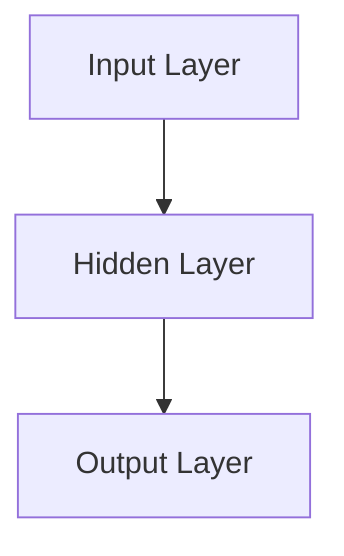

###### 2.1.2.2 卷积神经网络（CNN）

卷积神经网络（Convolutional Neural Network, CNN）是一种专门用于图像处理任务的深度学习模型，通过卷积层、池化层和全连接层进行特征提取和分类。

1. **卷积层**：通过卷积操作提取图像的特征。
2. **池化层**：通过池化操作减小特征图的大小，提高模型的泛化能力。
3. **全连接层**：将特征图映射到输出类别。

CNN在图像分类、目标检测和图像生成等领域有广泛应用。

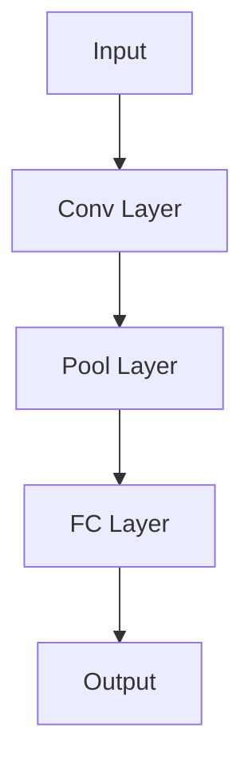

###### 2.1.2.3 循环神经网络（RNN）

循环神经网络（Recurrent Neural Network, RNN）是一种用于处理序列数据的深度学习模型，通过循环连接实现序列信息的记忆。

1. **基本RNN**：基本RNN通过将前一时刻的隐藏状态作为当前时刻的输入。
2. **长短期记忆网络（LSTM）**：LSTM是一种改进的RNN，通过门控机制解决长期依赖问题。
3. **门控循环单元（GRU）**：GRU是LSTM的简化版本，具有更简单的结构。

RNN在语音识别、机器翻译和时间序列预测等领域有广泛应用。

```mermaid
graph TB
A[Input] --> B[H(t-1)] --> C[H(t)]
```

###### 2.1.2.4 长短期记忆网络（LSTM）

LSTM（Long-Short Term Memory）是一种改进的RNN，通过引入门控机制来解决长期依赖问题。

1. **输入门**：控制当前输入的信息是否被保留。
2. **遗忘门**：控制之前的信息是否被遗忘。
3. **输出门**：控制当前隐藏状态是否被输出。

LSTM在文本生成、语音识别和时间序列预测等领域有广泛应用。

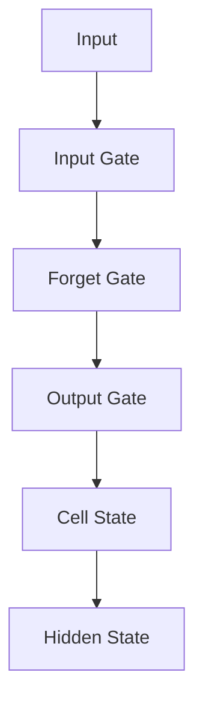

##### 2.1.3 深度学习优化算法

深度学习优化算法用于调整神经网络的参数，以最小化损失函数并提高模型性能。以下是一些常用的优化算法：

###### 2.1.3.1 梯度下降法（Gradient Descent）

梯度下降法是一种最基本的优化算法，通过计算损失函数的梯度来更新网络参数。

1. **批量梯度下降（Batch Gradient Descent）**：在每一步中使用所有样本的梯度进行更新。
2. **随机梯度下降（Stochastic Gradient Descent, SGD）**：在每一步中使用一个样本的梯度进行更新。
3. **小批量梯度下降（Mini-batch Gradient Descent）**：在每一步中使用一部分样本的梯度进行更新。

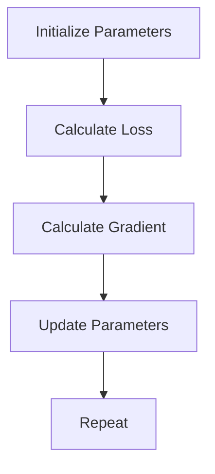

###### 2.1.3.2 随机梯度下降（SGD）

随机梯度下降（Stochastic Gradient Descent, SGD）是一种简化的梯度下降法，通过随机选择样本进行参数更新。

1. **随机选择样本**：从训练数据中随机选择一个样本。
2. **计算梯度**：计算该样本的梯度。
3. **更新参数**：根据梯度更新网络参数。

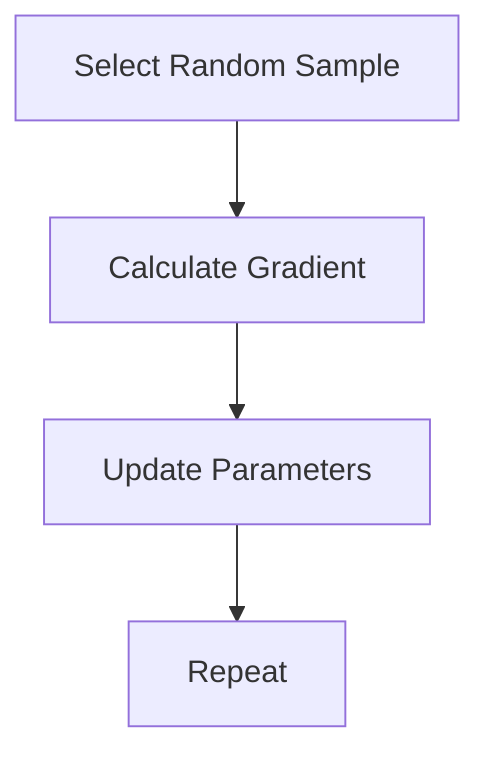

###### 2.1.3.3 Adam优化器

Adam优化器是一种基于SGD的优化算法，通过同时考虑一阶矩估计和二阶矩估计来提高收敛速度。

1. **一阶矩估计（Momentum）**：使用动量项减少参数的变动。
2. **二阶矩估计（RMSProp）**：使用自适应学习率来加速收敛。

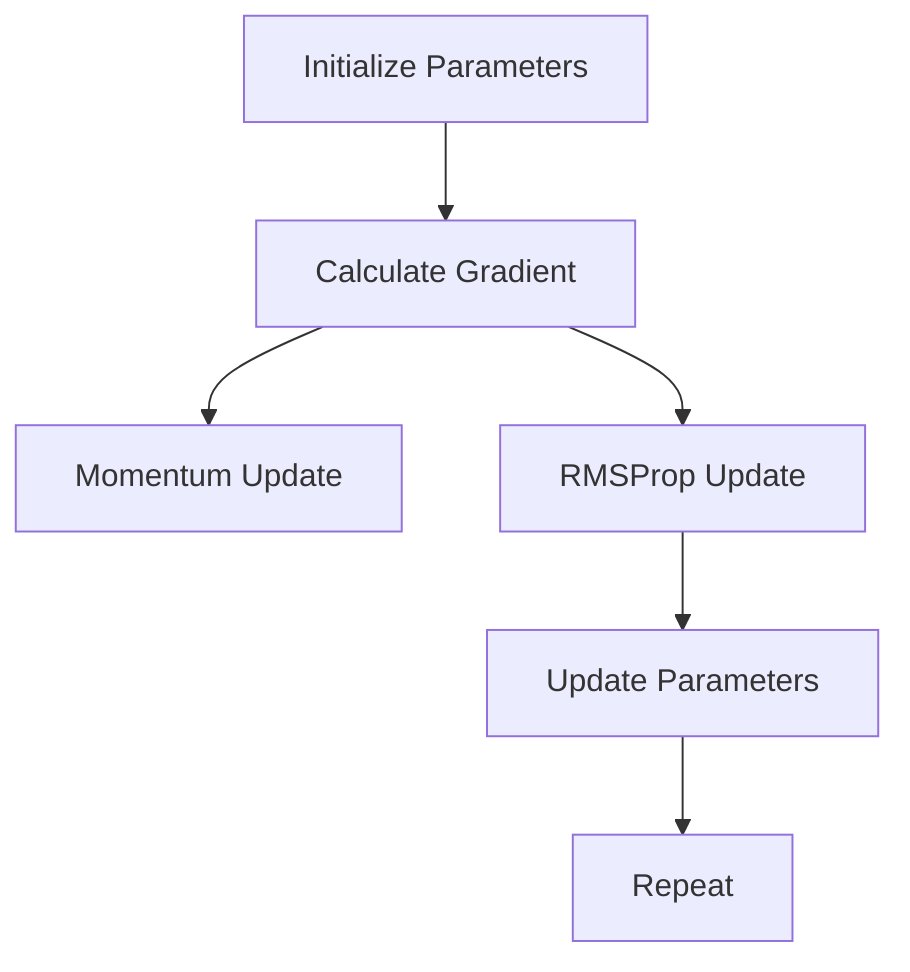

#### 2.2 大模型训练技术

##### 2.2.1 大规模数据处理

大模型通常需要处理大规模的数据集，这涉及到数据的收集、预处理和存储。

###### 2.2.1.1 数据预处理

数据预处理是大规模数据处理的关键步骤，包括以下任务：

1. **数据清洗**：去除数据中的噪声和异常值。
2. **数据标准化**：将数据转换为统一的格式和范围。
3. **数据分割**：将数据集分割为训练集、验证集和测试集。

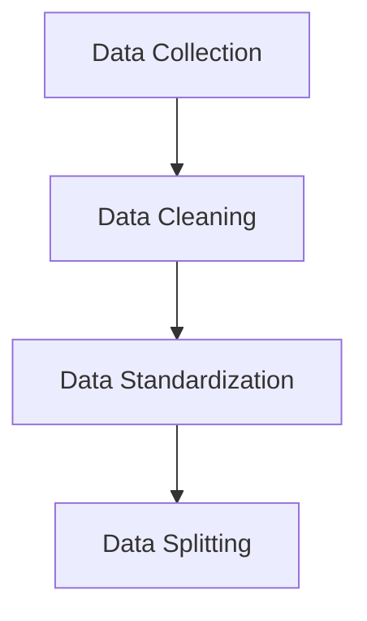

###### 2.2.1.2 分布式计算框架

分布式计算框架能够有效地处理大规模数据集，常见的框架包括Hadoop、Spark和Flink。

1. **Hadoop**：基于MapReduce模型，适合处理大规模批量数据。
2. **Spark**：基于内存计算，适合处理大规模实时数据。
3. **Flink**：实时流处理框架，支持批处理和流处理。

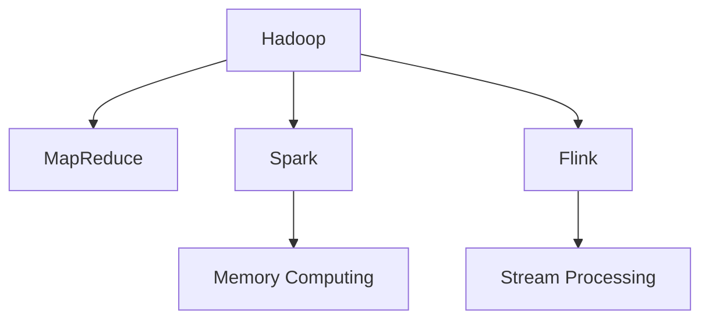

##### 2.2.2 大模型训练策略

大模型训练通常需要高效的策略来提高训练效率和模型性能。

###### 2.2.2.1 预训练与微调

预训练（Pre-training）是指在大量未标注数据上训练模型，提取通用特征表示。微调（Fine-tuning）是指在预训练模型的基础上，在特定任务上使用标注数据进行进一步训练。

1. **预训练**：在未标注数据上进行预训练，学习通用特征表示。
2. **微调**：在预训练模型的基础上，使用标注数据进行微调，使其适应特定任务。

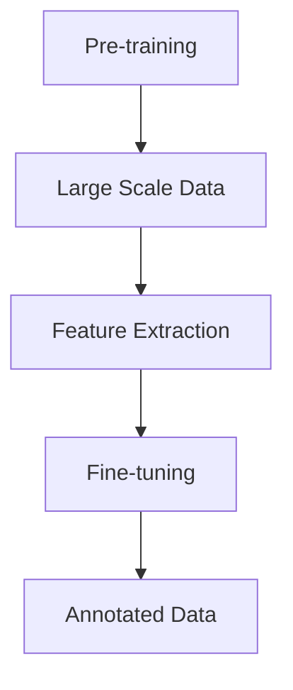

###### 2.2.2.2 早期停止与正则化

早期停止（Early Stopping）是一种防止过拟合的策略，通过在验证集上监控模型性能来停止训练。正则化（Regularization）是一种防止模型过拟合的方法，通过添加惩罚项来约束模型的复杂度。

1. **早期停止**：在验证集上监控模型性能，当性能不再提升时停止训练。
2. **正则化**：通过添加L1或L2正则化项来惩罚模型的权重。

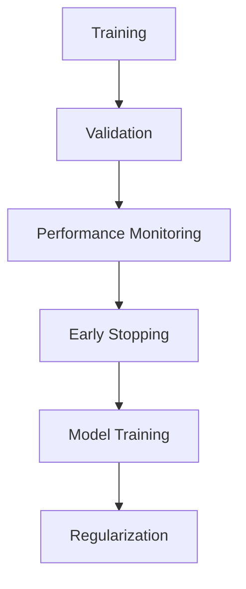

##### 2.2.3 大模型优化方法

大模型优化方法旨在提高模型性能和训练效率。

###### 2.2.3.1 学习率调整策略

学习率调整策略用于控制模型参数更新的速率，常见的策略包括固定学习率、学习率衰减和自适应学习率。

1. **固定学习率**：学习率在整个训练过程中保持不变。
2. **学习率衰减**：学习率随着训练过程的进行逐渐减小。
3. **自适应学习率**：通过自适应调整学习率来优化训练过程。

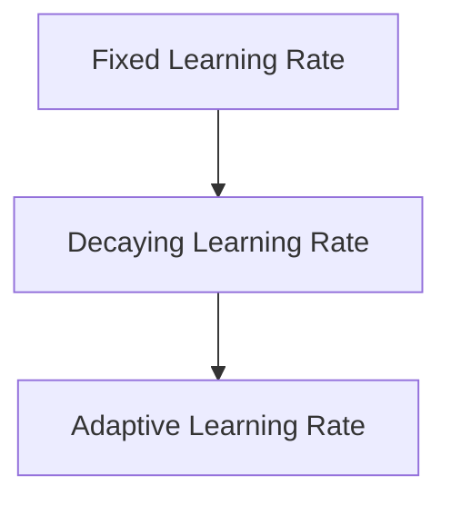

###### 2.2.3.2 模型压缩与加速

模型压缩与加速方法旨在减小模型大小和加速模型推理，常见的策略包括量化、剪枝和知识蒸馏。

1. **量化**：将模型参数从浮点数转换为低精度数值，降低模型大小。
2. **剪枝**：通过移除无关的神经元或连接来减少模型大小。
3. **知识蒸馏**：将大模型的知识迁移到小模型中，提高小模型的性能。

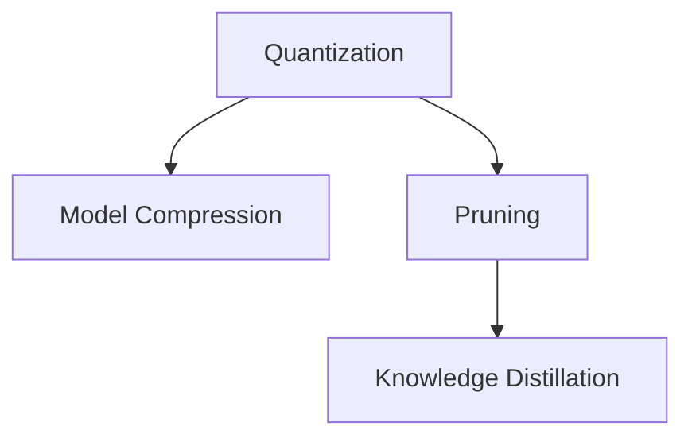

#### 2.3 自然语言处理技术概览

##### 2.3.1 词嵌入技术

词嵌入（Word Embedding）是将文本中的词语映射为稠密向量表示的技术，常用的方法包括Word2Vec、GloVe和BERT。

###### 2.3.1.1 Word2Vec

Word2Vec是一种基于神经网络的语言模型，通过预测邻近词来学习词嵌入。

1. **CBOW模型**：通过上下文词来预测中心词。
2. **Skip-gram模型**：通过中心词来预测上下文词。

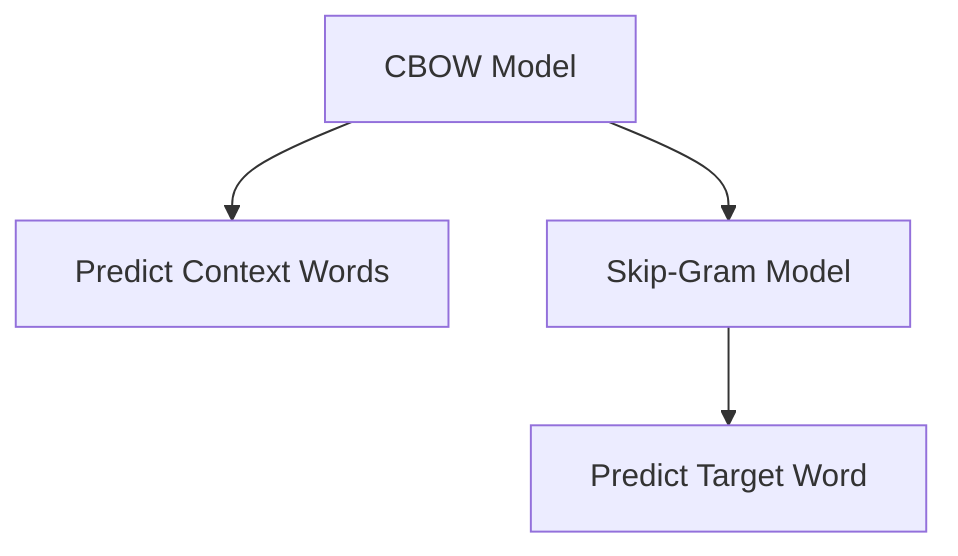

###### 2.3.1.2 GloVe

GloVe（Global Vectors for Word Representation）是一种基于全局矩阵分解的词嵌入方法。

1. **全局向量表示**：将词语映射为全局向量。
2. **矩阵分解**：通过矩阵分解学习词嵌入向量。

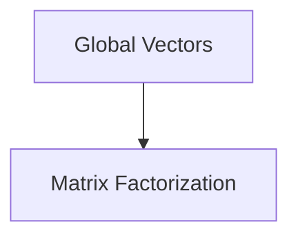

##### 2.3.2 序列模型与注意力机制

序列模型（Sequence Models）是处理序列数据的深度学习模型，常见的序列模型包括RNN、LSTM和GRU。

###### 2.3.2.1 RNN

RNN（Recurrent Neural Network）是一种处理序列数据的神经网络，通过循环连接实现序列信息的记忆。

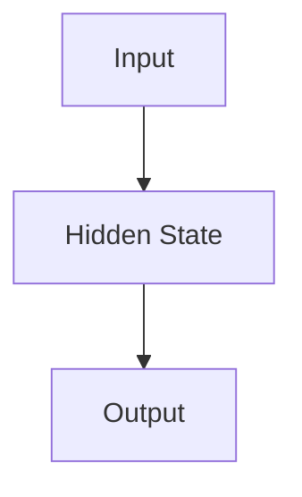

###### 2.3.2.2 LSTM

LSTM（Long-Short Term Memory）是一种改进的RNN，通过门控机制解决长期依赖问题。


###### 2.3.2.3 注意力机制

注意力机制（Attention Mechanism）是一种用于处理序列序列任务的深度学习模型，通过自注意力机制和多头注意力机制实现。

1. **自注意力机制**：计算序列中每个元素对当前元素的重要性。
2. **多头注意力机制**：将自注意力机制扩展到多个头，提高模型的表达能力。

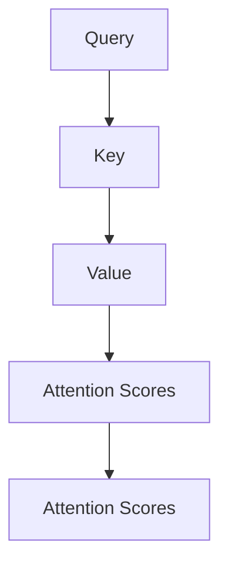

##### 2.3.3 转换器架构详解

转换器架构（Transformer Architecture）是一种用于处理序列序列任务的深度学习模型，通过编码器和解码器实现。

###### 2.3.3.1 Encoder-Decoder框架

Encoder-Decoder框架是一种标准的序列到序列模型，通过编码器和解码器实现。

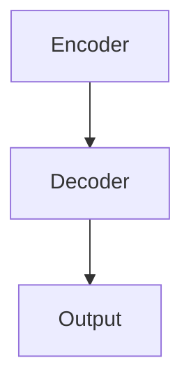

###### 2.3.3.2 Transformer模型

Transformer模型是一种基于自注意力机制的序列到序列模型，通过编码器和解码器实现。


### 第3章：企业AI战略规划

#### 3.1 AI在企业中的价值评估

AI技术在企业中的应用已经逐渐成为提高竞争力、优化业务流程和实现数字化转型的重要手段。评估AI在企业中的价值是一个复杂的过程，需要从多个维度进行综合考量。

##### 3.1.1 AI能力评估框架

AI能力评估框架可以帮助企业全面了解自身的AI应用能力，并为后续的AI战略规划提供依据。以下是一个常见的AI能力评估框架：

###### 3.1.1.1 能力维度

1. **技术能力**：评估企业在AI技术方面的储备，包括算法、模型、工具等。
2. **业务能力**：评估企业在AI应用场景中的业务理解和应用能力。
3. **管理能力**：评估企业在AI项目管理和运营方面的能力。

###### 3.1.1.2 能力评估方法

1. **关键绩效指标（KPI）**：通过设定具体的指标来衡量AI应用的效果，如准确率、效率、成本节约等。
2. **定量与定性分析**：结合定量数据和定性分析，全面评估AI应用的价值。
3. **标杆对比**：将企业AI能力与行业标杆进行对比，找出差距和改进方向。

##### 3.1.2 AI项目ROI分析方法

ROI（Return on Investment）分析是评估AI项目经济效益的重要方法。以下是一个常见的AI项目ROI分析方法：

###### 3.1.2.1 ROI计算方法

1. **收益计算**：计算AI项目为企业带来的直接和间接收益，如销售额增长、成本节约等。
2. **成本计算**：计算AI项目的总成本，包括技术开发成本、运维成本等。
3. **ROI计算公式**：

   ```latex
   ROI = \frac{\text{收益}}{\text{成本}} \times 100\%
   ```

   通过计算ROI，可以直观地了解AI项目的经济效益。

###### 3.1.2.2 ROI案例分析

以下是一个具体的ROI分析案例：

1. **企业A：自动化生产线**
   - **收益**：通过AI技术实现生产线的自动化，提高了生产效率，降低了人工成本。
   - **成本**：AI技术实施费用、设备更新费用等。
   - **ROI**：根据具体数据计算，假设ROI为150%，表明该项目具有很高的经济效益。

2. **企业B：智能客服系统**
   - **收益**：通过AI技术实现智能客服，提高了客户满意度，降低了客服成本。
   - **成本**：智能客服系统的开发费用、维护费用等。
   - **ROI**：根据具体数据计算，假设ROI为120%，表明该项目具有较好的经济效益。

3. **企业C：供应链优化**
   - **收益**：通过AI技术优化供应链管理，提高了供应链效率，降低了库存成本。
   - **成本**：AI技术实施费用、数据集成费用等。
   - **ROI**：根据具体数据计算，假设ROI为100%，表明该项目具有基本的经济效益。

##### 3.1.3 AI对企业业务流程的影响

AI技术可以显著改变企业的业务流程，带来以下几方面的变革：

###### 3.1.3.1 业务流程自动化

通过AI技术，企业可以实现业务流程的自动化，提高运营效率，降低人力成本。例如：

1. **销售与营销**：通过AI实现客户行为分析、个性化推荐等，提高销售转化率。
2. **生产与制造**：通过AI实现生产线的自动化控制、设备故障预测等，提高生产效率。
3. **物流与供应链**：通过AI实现物流路径优化、库存管理优化等，提高供应链效率。

###### 3.1.3.2 业务模式创新

AI技术可以帮助企业创新业务模式，开拓新的市场机会。例如：

1. **智能医疗服务**：通过AI实现个性化诊断、远程医疗服务等，创新医疗服务模式。
2. **智能金融**：通过AI实现智能投顾、反欺诈等，创新金融服务模式。
3. **智慧城市**：通过AI实现城市管理与规划、公共安全监测等，创新城市管理模式。

##### 3.1.4 AI战略规划的重要性

企业AI战略规划是企业利用AI技术实现长期发展的关键步骤。以下是一些重要原因：

1. **明确方向**：通过战略规划，明确企业AI发展的方向和目标，确保资源投入的合理性和高效性。
2. **提升竞争力**：通过AI战略规划，企业可以在竞争激烈的市场中保持领先地位，提高竞争力。
3. **实现数字化转型**：AI战略规划是企业实现数字化转型的重要组成部分，有助于提升企业的整体运营效率。

#### 3.2 AI战略规划步骤

企业AI战略规划的步骤如下：

##### 3.2.1 企业AI战略规划框架

1. **业务需求分析**：了解企业的业务需求和痛点，明确AI技术可以解决的问题。
2. **技术能力评估**：评估企业现有的AI技术能力，包括算法、模型、工具等。
3. **市场趋势分析**：分析AI技术的发展趋势和市场需求，把握AI技术应用的机遇。
4. **战略目标设定**：根据业务需求、技术能力和市场趋势，设定企业的AI战略目标。
5. **实施计划制定**：制定详细的AI项目实施计划，包括项目范围、时间表、预算等。
6. **持续监控与优化**：对AI项目进行持续监控和优化，确保项目的成功实施。

##### 3.2.2 AI战略实施关键点

1. **领导力与组织文化**：企业领导层需要具备AI战略眼光，推动AI项目在组织中的实施。
2. **数据与算法能力**：企业需要具备强大的数据管理和算法开发能力，支持AI项目的成功实施。
3. **人才队伍建设**：企业需要培养和引进AI专业人才，确保AI项目的顺利推进。
4. **技术基础设施**：企业需要建立完善的技术基础设施，包括计算资源、存储资源等，支持AI项目的运行。

##### 3.2.3 AI战略实施案例分析

以下是一个具体的AI战略实施案例分析：

1. **企业A：数字化转型**

   - **业务需求分析**：企业A面临生产效率低、库存管理困难等问题，希望通过AI技术提升生产效率和优化库存管理。

   - **技术能力评估**：企业A评估了自身在AI技术方面的储备，决定采用深度学习技术解决上述问题。

   - **市场趋势分析**：企业A分析了市场趋势，发现AI技术在工业领域具有广阔的应用前景。

   - **战略目标设定**：企业A设定了通过AI技术提高生产效率20%、降低库存成本10%的战略目标。

   - **实施计划制定**：企业A制定了详细的AI项目实施计划，包括数据收集、模型训练、模型部署等步骤。

   - **持续监控与优化**：企业A对AI项目进行持续监控和优化，确保项目的成功实施。

2. **企业B：智能供应链**

   - **业务需求分析**：企业B希望优化供应链管理，提高物流效率和降低库存成本。

   - **技术能力评估**：企业B评估了自身在AI技术方面的储备，决定采用强化学习技术解决上述问题。

   - **市场趋势分析**：企业B分析了市场趋势，发现AI技术在供应链管理领域具有广阔的应用前景。

   - **战略目标设定**：企业B设定了通过AI技术提高物流效率30%、降低库存成本15%的战略目标。

   - **实施计划制定**：企业B制定了详细的AI项目实施计划，包括数据收集、模型训练、模型部署等步骤。

   - **持续监控与优化**：企业B对AI项目

