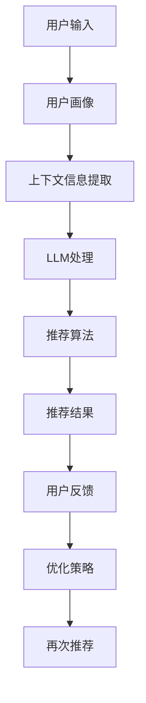
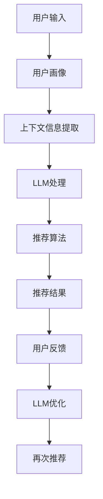

                 

# 引言

随着互联网和大数据技术的飞速发展，推荐系统已成为现代信息检索与个性化服务的重要手段。从电子商务平台到社交媒体，推荐系统在提高用户体验、提升业务收益方面发挥了关键作用。然而，传统的推荐系统面临着用户冷启动、推荐质量不高等挑战。近年来，基于大型语言模型（LLM）的推荐系统逐渐成为研究热点，为解决传统推荐系统的难题提供了新的思路。

本文旨在探讨基于LLM的推荐系统交互设计，旨在为开发者和研究者提供系统化的理解和实践指导。文章将分为以下几个部分：首先，介绍推荐系统的基础知识，包括基本概念、类型和商业价值；其次，探讨LLM的概念与特点，分析其在推荐系统中的应用场景；然后，深入剖析基于LLM的推荐系统架构设计，从用户画像、上下文信息提取、推荐算法到推荐结果优化，全面阐述系统设计的关键要素；接着，讨论基于LLM的推荐系统交互设计，重点关注用户界面设计、用户反馈机制、个性化推荐与体验、智能问答与对话系统；随后，介绍推荐系统中的数学模型和算法原理，通过伪代码详细讲解核心算法；然后，通过数学公式和举例说明，进一步阐述数学模型的应用；接下来，分享实际项目实战，包括开发环境搭建、源代码实现和代码解读；然后，讨论推荐系统的性能评估与优化策略；最后，展望LLM在推荐系统中的未来应用和发展趋势。

通过本文的阅读，读者将全面了解基于LLM的推荐系统交互设计的原理和实践，为未来的研究和应用提供有力的支持。

## 关键词

推荐系统，大型语言模型（LLM），交互设计，用户画像，上下文信息提取，推荐算法，数学模型，项目实战，性能评估，未来展望。

## 摘要

本文全面探讨基于大型语言模型（LLM）的推荐系统交互设计。首先介绍推荐系统的基本概念和商业价值，然后深入剖析LLM的概念与特点及其在推荐系统中的应用。文章随后详细阐述基于LLM的推荐系统架构设计，包括用户画像与上下文信息提取、推荐算法设计以及推荐结果优化。接着，讨论基于LLM的推荐系统交互设计，涵盖用户界面设计、用户反馈机制、个性化推荐与体验以及智能问答与对话系统。文章还通过数学模型和伪代码详细讲解推荐系统的核心算法，并通过实际项目实战分享开发环境搭建、源代码实现和代码解读。最后，讨论推荐系统的性能评估与优化策略，并展望LLM在推荐系统中的未来应用和发展趋势。通过本文的阅读，读者将获得对基于LLM的推荐系统交互设计的全面理解和实践指导。

### 第一部分: 推荐系统基础

## 第1章: 推荐系统概述

### 1.1 推荐系统的基本概念

推荐系统是一种基于用户行为和偏好信息，通过算法和模型为用户推荐符合其兴趣和需求的信息、商品或服务的系统。其核心目标是通过分析用户的历史行为数据、兴趣标签、社交关系等信息，发现用户的潜在需求和偏好，从而为其提供个性化的推荐结果。

推荐系统的基础概念主要包括以下几个部分：

1. **用户**: 推荐系统的核心，可以是单个用户或者一组用户。
2. **项目**: 用户可能感兴趣的对象，如商品、新闻文章、音乐等。
3. **评分/行为数据**: 用户对项目的评分或行为数据，如购买、点击、评价等。
4. **推荐算法**: 用于计算用户和项目之间相似度或相关性的算法。
5. **推荐结果**: 根据用户行为数据和推荐算法计算得出的推荐项目列表。

### 1.2 推荐系统的类型

根据推荐算法和数据来源的不同，推荐系统可以分为以下几种类型：

1. **协同过滤推荐（Collaborative Filtering）**:
   - 基于用户行为数据，如购买、点击、评分等，通过计算用户之间的相似度或项目之间的相似度进行推荐。
   - 包括两种主要方法：用户基于协同过滤（User-based）和项目基于协同过滤（Item-based）。

2. **基于内容的推荐（Content-Based Filtering）**:
   - 基于项目的特征信息，如文本、标签、属性等，通过计算用户兴趣特征和项目特征之间的相似度进行推荐。
   - 通常用于新用户推荐，即用户冷启动问题。

3. **混合推荐（Hybrid Recommender Systems）**:
   - 结合协同过滤和基于内容推荐，利用两者的优势，提高推荐质量。
   - 通常通过加权或融合策略，将协同过滤和基于内容推荐的结果进行整合。

4. **基于模型的推荐（Model-Based Recommender Systems）**:
   - 利用机器学习算法，如线性回归、神经网络、决策树等，建立用户与项目之间的预测模型，进行推荐。
   - 包括矩阵分解、隐语义模型、深度学习等方法。

5. **基于规则的推荐（Rule-Based Recommender Systems）**:
   - 利用业务规则和逻辑条件，进行推荐。
   - 适合小型系统或特定场景，但难以应对复杂多变的需求。

### 1.3 推荐系统的商业价值

推荐系统在商业领域具有巨大的价值，主要体现在以下几个方面：

1. **增加用户粘性**:
   - 通过个性化的推荐，提高用户满意度和活跃度，减少用户流失。

2. **提升销售额和转化率**:
   - 为用户推荐符合其兴趣的产品或服务，提高购买概率和转化率。

3. **优化库存和供应链管理**:
   - 根据用户需求和偏好，合理调整库存和供应链，减少库存积压和资源浪费。

4. **提高品牌影响力**:
   - 通过精确的推荐，提升用户体验，增强品牌认知度和用户忠诚度。

5. **数据驱动的决策支持**:
   - 通过分析用户行为数据和推荐效果，为业务决策提供数据支持和参考。

### 1.4 推荐系统的挑战

尽管推荐系统在商业和用户体验方面具有重要价值，但实际应用过程中也面临一系列挑战：

1. **冷启动问题**:
   - 对于新用户或新项目，缺乏足够的行为数据，难以进行准确推荐。

2. **数据稀疏性**:
   - 用户行为数据通常分布稀疏，导致推荐效果不稳定。

3. **实时性**:
   - 需要快速响应用户行为变化，提供实时或近实时的推荐结果。

4. **推荐质量**:
   - 提高推荐质量，避免过度推荐、信息过载和用户疲劳。

5. **隐私保护**:
   - 在收集、处理用户数据时，确保用户隐私和数据安全。

6. **可扩展性和性能**:
   - 随着用户和项目数量的增长，保证系统的可扩展性和高性能。

了解推荐系统的基本概念、类型和商业价值，有助于我们更好地理解和设计基于LLM的推荐系统。接下来，我们将深入探讨LLM的概念与特点，为后续的内容打下坚实的基础。

## 第2章: LLM（大型语言模型）基础

### 2.1 LLM的概念与特点

大型语言模型（Large Language Model，简称LLM）是一类具有高度语言理解和生成能力的深度神经网络模型，通过训练大量的文本数据来学习语言规律和知识。LLM的核心思想是利用大规模数据对模型进行预训练，然后通过微调适应特定的任务需求。以下是LLM的主要概念和特点：

1. **预训练（Pre-training）**:
   - 预训练是指在大规模语料库上进行训练，使模型能够自动学习语言的基本规律和结构。例如，BERT模型首先在未标注的互联网文本上进行预训练，然后通过任务特定的微调进行应用。

2. **上下文理解（Contextual Understanding）**:
   - 与传统的统计语言模型（如n-gram模型）不同，LLM能够理解上下文信息，生成与上下文高度匹配的文本。这使得LLM在处理自然语言任务时具有更高的准确性和灵活性。

3. **多语言支持（Multilingual Support）**:
   - 许多LLM模型具有多语言训练能力，能够在多种语言环境下进行有效的工作。例如，mBERT和XLM模型支持多种语言，适用于跨语言的文本理解和生成任务。

4. **生成能力（Generative Ability）**:
   - LLM不仅能够理解文本，还具有强大的文本生成能力。通过输入部分文本，LLM可以自动生成完整的段落或文章，这在对话系统、内容生成等领域具有广泛应用。

5. **参数规模（Parameter Scale）**:
   - LLM通常具有数十亿甚至数千亿个参数，这使得模型能够捕捉到更复杂的语言规律和知识。例如，GPT-3模型拥有1750亿个参数，是目前最大的语言模型之一。

### 2.2 LLM的架构

LLM的架构通常包括以下几个关键部分：

1. **嵌入层（Embedding Layer）**:
   - 嵌入层将输入的文本转换为稠密的向量表示，这些向量包含了文本的语义信息。常用的嵌入方法包括Word2Vec、BERT的WordPiece等方法。

2. **自注意力机制（Self-Attention Mechanism）**:
   - 自注意力机制是LLM的核心组件，通过计算序列中每个词与所有词之间的相似度，动态调整每个词的权重，从而更好地捕捉上下文信息。Transformer模型引入了多头自注意力机制，进一步提高了模型的表示能力。

3. **编码器（Encoder）**:
   - 编码器负责处理输入文本并生成上下文表示。在预训练阶段，编码器学习从输入序列中提取重要的语义信息。常见的编码器模型包括BERT、RoBERTa等。

4. **解码器（Decoder）**:
   - 解码器用于生成文本输出。在生成任务中，解码器从输入序列中预测下一个词，并不断更新模型状态，从而生成完整的输出序列。常见的解码器模型包括GPT、T5等。

5. **全连接层（Fully Connected Layer）**:
   - 全连接层将编码器的输出映射到具体的任务目标，如分类、生成等。通过全连接层，模型可以针对特定任务进行参数调整和优化。

### 2.3 LLM的应用场景

LLM在多个领域展现出了卓越的应用效果，以下是一些典型的应用场景：

1. **自然语言处理（NLP）**:
   - LLM在文本分类、情感分析、机器翻译、问答系统等NLP任务中取得了显著的成果。通过预训练和微调，LLM能够生成高质量的自然语言文本，提高任务性能。

2. **对话系统（Dialogue System）**:
   - LLM在对话系统中被广泛应用于生成回答、理解用户意图、维护对话上下文等。例如，聊天机器人、虚拟助手等应用中，LLM能够根据用户输入生成自然、连贯的回应。

3. **内容生成（Content Generation）**:
   - LLM在文章写作、新闻摘要、广告文案等生成任务中具有广泛的应用。通过输入少量文本，LLM能够自动生成完整的内容，节省人工创作成本。

4. **知识图谱（Knowledge Graph）**:
   - LLM能够从大规模文本数据中提取知识，构建知识图谱，为智能搜索、推荐系统等提供知识支持。

5. **文本生成与编辑（Text Generation and Editing）**:
   - LLM在文本生成和编辑任务中表现出了强大的能力，能够生成新的文本或对现有文本进行编辑优化，提高文本质量和可读性。

通过对LLM的概念与特点、架构和应用场景的探讨，我们为后续基于LLM的推荐系统设计提供了理论依据和参考。接下来，我们将深入分析基于LLM的推荐系统架构设计，从用户画像、上下文信息提取、推荐算法到推荐结果优化，全面阐述系统设计的关键要素。

## 第3章: 基于LLM的推荐系统架构设计

### 3.1 基于LLM的推荐系统总体架构

基于LLM的推荐系统总体架构包括以下几个核心模块：用户输入处理、用户画像与上下文信息提取、推荐算法设计、推荐结果优化以及用户反馈机制。以下将详细描述各模块的功能和相互关系。

1. **用户输入处理模块**：
   - 功能：接收用户的输入，包括搜索关键词、浏览历史、行为记录等。
   - 交互：用户通过界面输入查询或行为数据，系统接收并处理这些数据。

2. **用户画像与上下文信息提取模块**：
   - 功能：利用LLM对用户输入进行处理，提取用户的兴趣偏好、行为特征等，构建用户画像和上下文信息。
   - 交互：用户输入经过预处理后，输入LLM模型进行特征提取。

3. **推荐算法设计模块**：
   - 功能：根据提取的用户画像和上下文信息，结合推荐算法模型，生成推荐结果。
   - 交互：用户画像和上下文信息作为输入，推荐算法进行处理并生成推荐列表。

4. **推荐结果优化模块**：
   - 功能：对生成的推荐结果进行优化，包括排序、去重、多样化等，提高推荐质量。
   - 交互：推荐结果输入优化模块，通过算法进行调整和优化。

5. **用户反馈机制模块**：
   - 功能：收集用户对推荐结果的反馈，包括点击、评分、评论等，用于更新用户画像和调整推荐策略。
   - 交互：用户对推荐结果的反馈数据返回至用户画像与上下文信息提取模块，更新用户画像。

### 3.2 用户画像与上下文信息提取

用户画像与上下文信息提取是推荐系统设计的核心环节，直接影响推荐效果。基于LLM的用户画像与上下文信息提取模块主要包括以下步骤：

1. **输入预处理**：
   - 功能：对用户输入进行清洗、去噪和标准化处理，提取关键信息。
   - 交互：用户输入通过预处理模块，转换为模型可处理的格式。

2. **特征提取**：
   - 功能：利用LLM模型对预处理后的用户输入进行特征提取，生成高维特征向量。
   - 伪代码：
     ```
     function extract_features(user_input):
         # 嵌入层处理输入文本
         embedded_input = embedding_layer(user_input)
         # 应用自注意力机制提取特征
         features = self_attention Mechanism(embedded_input)
         return features
     ```

3. **构建用户画像**：
   - 功能：将提取的用户特征进行聚合，构建用户画像，用于推荐算法的输入。
   - 交互：提取的用户特征输入用户画像构建模块，生成用户画像。

4. **上下文信息提取**：
   - 功能：从用户历史行为数据中提取上下文信息，如近期浏览记录、搜索历史等。
   - 交互：用户历史行为数据输入上下文信息提取模块，与当前用户画像进行融合。

### 3.3 推荐算法设计

推荐算法设计是推荐系统的核心，直接影响推荐效果。基于LLM的推荐算法设计主要包括以下步骤：

1. **相似度计算**：
   - 功能：计算用户画像与项目特征之间的相似度，确定推荐候选项目。
   - 伪代码：
     ```
     function calculate_similarity(user_profile, item_features):
         # 应用余弦相似度计算相似度
         similarity = cosine_similarity(user_profile, item_features)
         return similarity
     ```

2. **推荐列表生成**：
   - 功能：根据相似度计算结果，生成推荐列表，排序并选取Top-N项目作为推荐结果。
   - 伪代码：
     ```
     function generate_recommendations(similarity_scores, top_n):
         # 根据相似度排序生成推荐列表
         sorted_indices = np.argsort(similarity_scores)[::-1]
         recommendations = [item_ids[index] for index in sorted_indices[:top_n]]
         return recommendations
     ```

3. **推荐结果优化**：
   - 功能：对生成的推荐结果进行优化，如去重、多样性调整等，提高推荐质量。
   - 伪代码：
     ```
     function optimize_recommendations(recommendations):
         # 去除重复项目
         unique_recommendations = list(set(recommendations))
         # 调整推荐结果的多样性
         diversified_recommendations = diversify(unique_recommendations)
         return diversified_recommendations
     ```

### 3.4 推荐结果优化

推荐结果优化是提升推荐系统质量的关键环节。基于LLM的推荐结果优化主要包括以下策略：

1. **排序优化**：
   - 功能：根据用户反馈和上下文信息，对推荐结果进行重新排序，提高关键项目的曝光率。
   - 伪代码：
     ```
     function rank_recommendations(recommendations, user_feedback, context_info):
         # 结合用户反馈和上下文信息进行排序
         ranked_recommendations = rank_by_feedback_and_context(recommendations, user_feedback, context_info)
         return ranked_recommendations
     ```

2. **去重优化**：
   - 功能：去除推荐结果中的重复项目，提高推荐结果的多样性和新鲜感。
   - 伪代码：
     ```
     function remove_duplicates(recommendations):
         # 去除推荐结果中的重复项目
         unique_recommendations = list(set(recommendations))
         return unique_recommendations
     ```

3. **多样性优化**：
   - 功能：调整推荐结果的多样性，避免推荐列表过于集中，提高用户满意度。
   - 伪代码：
     ```
     function diversify(recommendations):
         # 调整推荐结果的多样性
         diversified_recommendations = diversity_algorithm(recommendations)
         return diversified_recommendations
     ```

通过以上架构设计，基于LLM的推荐系统能够实现高效、准确的推荐。接下来，我们将探讨基于LLM的推荐系统交互设计，重点关注用户界面设计、用户反馈机制、个性化推荐与体验、智能问答与对话系统。

## 第4章: 基于LLM的推荐系统交互设计

### 4.1 用户界面设计

用户界面设计（UI Design）是推荐系统交互设计的重要组成部分，直接影响用户的使用体验和系统的易用性。一个优秀的用户界面设计需要满足以下原则：

1. **简洁性**：
   - 用户界面应该简洁明了，避免过多的杂乱信息，确保用户能够快速找到所需内容。

2. **一致性**：
   - 界面元素的一致性对于提升用户体验至关重要。包括颜色、字体、图标等设计元素应保持一致，方便用户快速识别和理解。

3. **响应性**：
   - 用户界面应具备良好的响应性，确保在移动设备、桌面设备等各种环境下都能提供流畅的使用体验。

4. **可访问性**：
   - 用户界面设计应考虑到不同用户的需求，包括视觉障碍者、老年人等，提供无障碍访问的支持。

5. **可定制性**：
   - 用户应能够根据个人喜好和需求对界面进行个性化设置，提高用户满意度。

用户界面设计的主要功能包括：

- **搜索框**：提供用户输入查询关键词的入口，支持模糊查询、智能提示等。
- **推荐列表**：展示根据用户兴趣和偏好计算出的推荐项目列表，支持排序、筛选等功能。
- **分页和加载**：当推荐项目数量较多时，提供分页和加载机制，确保用户能够快速浏览。
- **用户反馈**：提供用户对推荐结果的反馈入口，包括点击、评分、评论等。

以下是一个简化的用户界面设计流程：

```
1. 需求分析：明确用户需求和界面功能。
2. 界面原型设计：使用工具（如Sketch、Figma等）绘制界面原型。
3. 界面布局设计：确定界面布局和元素布局，确保界面简洁、美观。
4. 界面交互设计：设计界面交互逻辑，确保用户操作顺畅。
5. 界面测试与优化：通过用户测试和反馈，不断优化界面设计。
```

### 4.2 用户反馈机制

用户反馈机制是推荐系统优化和改进的重要手段，通过收集和分析用户对推荐结果的反馈，系统能够不断调整和优化推荐策略。以下是基于LLM的推荐系统的用户反馈机制设计：

1. **点击反馈**：
   - 功能：记录用户对推荐项目的点击行为，用于分析用户兴趣和偏好。
   - 交互：当用户点击推荐项目时，系统记录点击事件，并更新用户画像。

2. **评分反馈**：
   - 功能：收集用户对推荐项目的评分数据，用于评估推荐质量。
   - 交互：用户对推荐项目进行评分时，系统更新评分数据，用于后续推荐优化。

3. **评论反馈**：
   - 功能：记录用户对推荐项目的评论，用于了解用户满意度和需求。
   - 交互：用户在评论推荐项目时，系统记录评论内容，并分析评论情感。

4. **反馈机制**：
   - 功能：提供用户反馈的入口，确保用户能够方便地表达意见和建议。
   - 交互：界面设计应包含反馈入口，用户可以通过按钮、表单等方式提交反馈。

以下是一个用户反馈机制的设计流程：

```
1. 反馈入口设计：在用户界面上设计反馈入口，如评论框、评分按钮等。
2. 反馈数据收集：系统收集用户的反馈数据，包括点击、评分、评论等。
3. 数据处理：对收集的反馈数据进行分析和预处理，提取有用信息。
4. 用户画像更新：根据反馈数据更新用户画像，调整推荐策略。
5. 反馈机制优化：根据用户反馈不断优化反馈机制，提高用户体验。
```

### 4.3 个性化推荐与体验

个性化推荐是推荐系统的核心功能之一，通过分析用户行为数据，为用户生成个性化的推荐列表，提高用户满意度和粘性。基于LLM的推荐系统在个性化推荐方面具有以下优势：

1. **用户行为分析**：
   - 功能：分析用户的历史行为数据，如浏览记录、购买记录、搜索历史等，提取用户的兴趣特征。
   - 交互：用户行为数据通过LLM模型进行处理，生成用户画像。

2. **推荐策略**：
   - 功能：结合用户画像和上下文信息，生成个性化的推荐列表。
   - 交互：推荐策略模块利用用户画像和上下文信息，计算推荐得分，生成推荐列表。

3. **推荐结果多样化**：
   - 功能：通过调整推荐策略，提高推荐结果的多样性和新鲜感，避免用户疲劳。
   - 交互：推荐结果经过多样性优化，确保推荐项目之间具有差异。

个性化推荐与体验的优化策略包括：

- **上下文感知**：根据用户当前的环境和场景，调整推荐策略，提供更相关的推荐。
- **动态调整**：根据用户行为数据的实时变化，动态调整推荐策略，提高推荐精度。
- **A/B测试**：通过A/B测试，比较不同推荐策略的效果，优化推荐系统性能。

以下是一个个性化推荐与体验优化流程：

```
1. 用户画像构建：收集并分析用户行为数据，构建用户画像。
2. 推荐策略设计：设计个性化推荐策略，结合用户画像和上下文信息。
3. 推荐结果生成：根据推荐策略生成个性化推荐列表。
4. 多样性优化：对推荐结果进行多样性优化，避免用户疲劳。
5. 用户反馈收集：收集用户对推荐结果的反馈，用于进一步优化推荐系统。
```

### 4.4 智能问答与对话系统

智能问答和对话系统是推荐系统与用户互动的重要方式，通过自然语言交互，提供实时、个性化的推荐服务。基于LLM的智能问答和对话系统具有以下特点：

1. **自然语言理解**：
   - 功能：利用LLM对用户提问进行自然语言理解，提取用户意图和关键信息。
   - 交互：用户提问通过LLM模型进行处理，提取用户意图。

2. **回答生成**：
   - 功能：根据用户意图和推荐系统生成的推荐结果，生成自然、连贯的回答。
   - 交互：LLM模型结合用户意图和推荐结果，生成回答。

3. **对话管理**：
   - 功能：管理对话流程，确保对话的自然流畅，提供良好的用户体验。
   - 交互：对话系统通过上下文信息管理对话流程，确保对话连贯性。

智能问答与对话系统的主要功能包括：

- **回答问题**：用户提出问题，系统生成回答。
- **推荐项目介绍**：对推荐项目进行详细介绍，提供相关信息。
- **引导对话**：根据用户反馈和上下文信息，引导对话方向。

以下是一个智能问答与对话系统设计流程：

```
1. 用户提问处理：接收用户提问，进行自然语言处理。
2. 用户意图理解：利用LLM提取用户意图和关键信息。
3. 推荐结果生成：根据用户意图和推荐算法生成推荐结果。
4. 回答生成：结合用户意图和推荐结果，生成自然回答。
5. 对话管理：管理对话流程，确保对话流畅和用户体验。
6. 用户反馈收集：收集用户反馈，用于优化对话系统和推荐结果。
```

通过用户界面设计、用户反馈机制、个性化推荐与体验、智能问答与对话系统的优化，基于LLM的推荐系统能够提供高效、个性化的推荐服务，提高用户体验和系统满意度。接下来，我们将深入探讨推荐系统中的数学模型和算法原理，通过伪代码详细讲解核心算法，为后续的数学公式和项目实战奠定基础。

### 第5章: 数学模型和算法原理

推荐系统的核心在于构建用户与项目之间的关联模型，通过数学模型和算法来预测和生成推荐结果。本章节将详细介绍推荐系统中的常用数学模型和算法原理，并通过伪代码进行讲解。

#### 5.1 推荐系统中的数学模型

推荐系统中的数学模型主要分为两类：基于协同过滤的模型和基于内容的模型。以下分别介绍这两类模型的基本原理。

#### 5.1.1 基于协同过滤的模型

协同过滤（Collaborative Filtering）是推荐系统中最常用的方法之一，其核心思想是通过用户之间的行为相似性来推荐项目。协同过滤的数学模型主要包括：

1. **用户基于协同过滤（User-Based Collaborative Filtering）**：

   - 功能：基于用户行为相似性，为用户推荐相似用户喜欢的项目。
   - 模型：相似度计算公式，如余弦相似度、皮尔逊相关系数等。

   伪代码：

   ```
   function user_based_collaborative_filtering(user_profiles, items, k):
       similar_users = find_similar_users(user_profiles[user_id], user_profiles, k)
       recommendations = []
       for user in similar_users:
           for item in user_preferences[user]:
               if not item in user_preferences[user_id]:
                   recommendations.append(item)
       return recommendations
   ```

2. **项目基于协同过滤（Item-Based Collaborative Filtering）**：

   - 功能：基于项目行为相似性，为用户推荐相似项目。
   - 模型：相似度计算公式，如余弦相似度、皮尔逊相关系数等。

   伪代码：

   ```
   function item_based_collaborative_filtering(user_preferences, items, k):
       item_similarity_matrix = compute_item_similarity_matrix(user_preferences, items)
       recommendations = []
       for item in user_preferences[user_id]:
           for similar_item, similarity in item_similarity_matrix[item]:
               if not similar_item in user_preferences[user_id]:
                   recommendations.append(similar_item)
       return recommendations
   ```

#### 5.1.2 基于内容的模型

基于内容的模型（Content-Based Filtering）通过分析用户和项目的特征信息，计算它们之间的相似度，生成推荐结果。基于内容的数学模型主要包括：

1. **TF-IDF模型**：

   - 功能：利用词频-逆文档频率（TF-IDF）计算文本特征，生成推荐结果。
   - 模型：TF-IDF公式，如：
     $$
     TF(t) = \frac{f_t}{\sum_{t' \in V} f_{t'}}
     $$
     $$
     IDF(t) = \log \left( \frac{N}{n_t} \right)
     $$
     $$
     TF-IDF(t) = TF(t) \times IDF(t)
     $$

   伪代码：

   ```
   function compute_tfidf(document):
       word_counts = count_words(document)
       total_words = sum(word_counts.values())
       tf_scores = {word: word_counts[word] / total_words for word in word_counts}
       idf_scores = {word: math.log(N / word_counts[word]) for word in word_counts if word_counts[word] > 0}
       tfidf_scores = {word: tf_scores[word] * idf_scores[word] for word in tf_scores}
       return tfidf_scores
   ```

2. **相似度计算**：

   - 功能：计算用户和项目之间的相似度，生成推荐结果。
   - 模型：余弦相似度、欧氏距离等。

   伪代码：

   ```
   function compute_similarity(user_profile, item_features, similarity_type='cosine'):
       if similarity_type == 'cosine':
           dot_product = dot_product(user_profile, item_features)
           norms = l2_norm(user_profile) * l2_norm(item_features)
           similarity = dot_product / norms
       elif similarity_type == 'euclidean':
           similarity = euclidean_distance(user_profile, item_features)
       return similarity
   ```

#### 5.1.3 混合模型

混合模型（Hybrid Recommender Systems）结合协同过滤和基于内容的模型，利用两者的优势生成推荐结果。以下是一个简单的混合模型伪代码：

```
function hybrid_recommender_system(user_profiles, item_features, collaborative_weight, content_weight):
    collaborative_recommendations = user_based_collaborative_filtering(user_profiles, items, k)
    content_recommendations = content_based_filtering(user_profiles[user_id], item_features)
    hybrid_recommendations = []
    for item in collaborative_recommendations:
        collaborative_similarity = calculate_similarity(user_profiles[user_id], item_features[item], 'cosine')
        content_similarity = calculate_similarity(user_profiles[user_id], item_features[item], 'cosine')
        hybrid_similarity = collaborative_weight * collaborative_similarity + content_weight * content_similarity
        hybrid_recommendations.append((item, hybrid_similarity))
    sorted_recommendations = sort_by_similarity(hybrid_recommendations)
    return sorted_recommendations
```

#### 5.2 LLM中的数学模型

LLM（Large Language Model）在推荐系统中的应用主要体现在利用其强大的文本处理能力，生成推荐结果和回答用户问题。以下介绍LLM中的数学模型：

1. **自注意力机制（Self-Attention Mechanism）**：

   - 功能：计算输入序列中每个词与所有词之间的相似度，调整权重。
   - 模型：自注意力机制公式，如：
     $$
     \text{Attention}(Q, K, V) = \frac{QK^T}{\sqrt{d_k}} \odot V
     $$
     其中，Q、K、V分别为查询向量、键向量和值向量，$\odot$表示点积运算。

2. **BERT模型**：

   - 功能：利用未标注的文本数据进行预训练，学习语言规律和知识。
   - 模型：BERT模型包含两个子模型：BERT-Base和BERT-Large，分别具有约1亿和3亿个参数。

   伪代码：

   ```
   function BERT(pretrained_model, input_sequence):
       # 嵌入层处理输入文本
       embedded_sequence = pretrained_model.embedding(input_sequence)
       # 应用多层自注意力机制
       for layer in pretrained_model.layers:
           embedded_sequence = layer(embedded_sequence)
       # 提取序列输出
       output_sequence = embedded_sequence[:, 0, :]
       return output_sequence
   ```

3. **GPT模型**：

   - 功能：生成自然语言文本，用于回答用户问题和生成推荐结果。
   - 模型：GPT模型包含多个自注意力层和交叉注意力层，通过生成预测词的概率分布进行文本生成。

   伪代码：

   ```
   function GPT(pretrained_model, input_sequence):
       # 嵌入层处理输入文本
       embedded_sequence = pretrained_model.embedding(input_sequence)
       # 应用多层自注意力机制和交叉注意力机制
       for layer in pretrained_model.layers:
           embedded_sequence = layer(embedded_sequence)
       # 生成输出序列
       output_sequence = pretrained_model.generate(embedded_sequence, max_length=50)
       return output_sequence
   ```

#### 5.3 混合模型中的数学模型

混合模型结合LLM和传统推荐系统模型，利用两者的优势生成更高质量的推荐结果。以下介绍混合模型中的数学模型：

1. **多模态数据融合**：

   - 功能：将文本数据和图像、音频等多模态数据融合，提高推荐精度。
   - 模型：使用深度学习模型，如CNN、RNN等，分别处理不同模态的数据，然后进行融合。

   伪代码：

   ```
   function multimodal_recommender_system(text_model, image_model, audio_model, fusion_model):
       # 处理文本数据
       text_features = text_model(processed_text)
       # 处理图像数据
       image_features = image_model(processed_image)
       # 处理音频数据
       audio_features = audio_model(processed_audio)
       # 融合多模态特征
       fused_features = fusion_model([text_features, image_features, audio_features])
       # 生成推荐结果
       recommendations = generate_recommendations(fused_features)
       return recommendations
   ```

2. **自适应权重调整**：

   - 功能：根据用户反馈和推荐效果，动态调整模型权重，提高推荐质量。
   - 模型：使用强化学习算法，如Q-learning、DQN等，根据用户反馈调整模型权重。

   伪代码：

   ```
   function adaptive_weight_adjustment(model, feedback):
       # 根据用户反馈调整模型权重
       for layer in model.layers:
           layer.weight = layer.weight * feedback
       # 重新训练模型
       model.retrain()
       return model
   ```

通过以上介绍，我们可以看到推荐系统中数学模型和算法原理的多样性和复杂性。接下来，我们将通过数学公式和举例说明，进一步阐述这些模型的应用和实现。

### 第6章: 数学公式与详细讲解

#### 6.1 推荐系统中的数学公式

推荐系统中常用的数学公式主要包括相似度计算、评分预测、矩阵分解等。以下详细讲解这些公式的定义和应用。

#### 6.1.1 相似度计算

相似度计算是推荐系统中评估用户和项目之间相似性的重要方法，常用的相似度计算公式有：

1. **余弦相似度**：

   - 功能：计算两个向量之间的夹角余弦值，用于评估向量之间的相似性。
   - 公式：
     $$
     \cos \theta = \frac{\vec{a} \cdot \vec{b}}{\|\vec{a}\| \|\vec{b}\|}
     $$
     其中，$\vec{a}$和$\vec{b}$分别为两个向量，$|\vec{a}|$和$|\vec{b}|$分别为向量的模长，$\cdot$表示点积运算。

2. **皮尔逊相关系数**：

   - 功能：计算两个变量之间的线性相关程度，用于评估变量之间的相似性。
   - 公式：
     $$
     r_{xy} = \frac{\sum_{i=1}^{n}(x_i - \bar{x})(y_i - \bar{y})}{\sqrt{\sum_{i=1}^{n}(x_i - \bar{x})^2 \sum_{i=1}^{n}(y_i - \bar{y})^2}}
     $$
     其中，$x_i$和$y_i$分别为两个变量的取值，$\bar{x}$和$\bar{y}$分别为两个变量的均值。

#### 6.1.2 评分预测

评分预测是推荐系统中的核心任务之一，通过预测用户对项目的评分，生成推荐结果。常用的评分预测模型包括基于矩阵分解的协同过滤模型。以下介绍评分预测的公式：

1. **矩阵分解**：

   - 功能：将用户-项目评分矩阵分解为用户特征矩阵和项目特征矩阵，预测用户对项目的评分。
   - 公式：
     $$
     R = U \cdot V^T
     $$
     其中，$R$为用户-项目评分矩阵，$U$和$V$分别为用户特征矩阵和项目特征矩阵。

2. **预测用户对项目的评分**：

   - 功能：根据用户特征矩阵和项目特征矩阵，预测用户对项目的评分。
   - 公式：
     $$
     \hat{r}_{ui} = u_i^T v_j
     $$
     其中，$\hat{r}_{ui}$为预测的用户对项目$i$的评分，$u_i$和$v_j$分别为用户$i$和项目$j$的特征向量。

#### 6.1.3 矩阵分解

矩阵分解是推荐系统中常用的方法，通过将高维的评分矩阵分解为低维的特征矩阵，降低计算复杂度。以下介绍矩阵分解的公式：

1. **奇异值分解（Singular Value Decomposition, SVD）**：

   - 功能：将评分矩阵分解为用户特征矩阵、项目特征矩阵和奇异值矩阵的乘积。
   - 公式：
     $$
     R = U \Sigma V^T
     $$
     其中，$U$和$V$分别为用户特征矩阵和项目特征矩阵，$\Sigma$为奇异值矩阵。

2. **交替最小化（Alternating Least Squares, ALS）**：

   - 功能：通过交替最小化用户特征矩阵和项目特征矩阵的误差，求解最优的矩阵分解。
   - 公式：
     $$
     \begin{cases}
     \min_{U} \sum_{i,j} (r_{ij} - u_i^T v_j)^2 \\
     \min_{V} \sum_{i,j} (r_{ij} - u_i^T v_j)^2
     \end{cases}
     $$

#### 6.2 LLM中的数学公式

LLM（Large Language Model）中的数学公式主要涉及自注意力机制、词嵌入等。以下详细介绍这些公式的定义和应用。

#### 6.2.1 自注意力机制

自注意力机制是LLM中的核心组件，通过计算序列中每个词与所有词之间的相似度，调整权重。以下介绍自注意力机制的公式：

1. **自注意力计算**：

   - 功能：计算输入序列中每个词与所有词之间的相似度，生成注意力权重。
   - 公式：
     $$
     \text{Attention}(Q, K, V) = \frac{QK^T}{\sqrt{d_k}} \odot V
     $$
     其中，$Q$、$K$、$V$分别为查询向量、键向量和值向量，$\sqrt{d_k}$为键向量的维度，$\odot$表示点积运算。

2. **多头自注意力**：

   - 功能：将输入序列分解为多个子序列，分别进行自注意力计算，提高表示能力。
   - 公式：
     $$
     \text{MultiHeadAttention}(Q, K, V) = \text{Concat}(\text{head}_1, \text{head}_2, \ldots, \text{head}_h)W_O
     $$
     其中，$h$为头数，$\text{head}_i$为第$i$个头的输出，$W_O$为输出权重。

#### 6.2.2 词嵌入

词嵌入是将文本数据转换为稠密向量表示的方法，是LLM中的基础组件。以下介绍词嵌入的公式：

1. **Word2Vec**：

   - 功能：通过神经网络学习词的向量表示，提高文本数据的表示能力。
   - 公式：
     $$
     \begin{cases}
     \text{input}: x \in \mathbb{R}^{d} \\
     \text{output}: h = \text{tanh}(W_1x + b_1)
     \end{cases}
     $$
     其中，$W_1$为权重矩阵，$b_1$为偏置项，$h$为输出向量。

2. **BERT的WordPiece**：

   - 功能：将长文本分解为短序列，然后进行词嵌入。
   - 公式：
     $$
     \text{input}: \text{sentence} \in \mathbb{R}^{n \times d} \\
     \text{output}: \text{subwords} = \text{split}(\text{sentence})
     $$
     其中，$\text{split}$为分割操作，$\text{subwords}$为短序列。

#### 6.3 混合模型中的数学公式

混合模型结合了LLM和传统推荐系统模型，通过融合多种信息提高推荐质量。以下介绍混合模型中的数学公式：

1. **多模态数据融合**：

   - 功能：将文本数据和图像、音频等多模态数据融合，提高推荐精度。
   - 公式：
     $$
     \text{fused\_features} = \text{merge}(\text{text\_features}, \text{image\_features}, \text{audio\_features})
     $$
     其中，$\text{merge}$为融合操作，$\text{text\_features}$、$\text{image\_features}$、$\text{audio\_features}$分别为文本、图像、音频特征。

2. **自适应权重调整**：

   - 功能：根据用户反馈和推荐效果，动态调整模型权重，提高推荐质量。
   - 公式：
     $$
     \text{model\_weights} = \text{adjust}(\text{model\_weights}, \text{feedback})
     $$
     其中，$\text{adjust}$为调整操作，$\text{model\_weights}$为模型权重，$\text{feedback}$为用户反馈。

通过以上数学公式的介绍，我们可以更深入地理解推荐系统中的数学模型和算法原理。接下来，我们将通过具体的项目实战，分享代码实现和代码解读，帮助读者更好地掌握这些理论和应用。

### 第7章: 项目实战

在本文的最后一部分，我们将通过一个实际项目实战，详细介绍基于LLM的推荐系统的开发过程。该部分将涵盖开发环境搭建、源代码详细实现和代码解读。希望通过这一部分，读者可以更加直观地理解基于LLM的推荐系统的设计和实现。

#### 7.1 实际案例介绍

本项目是一款基于大型语言模型（LLM）的推荐系统，旨在为用户个性化推荐新闻文章。该推荐系统利用用户的阅读历史、兴趣标签和行为数据，通过LLM对文章进行语义分析，生成个性化的推荐结果。以下为项目的主要目标和功能：

1. **用户注册与登录**：
   - 功能：用户注册和登录功能，支持用户管理和权限控制。
   - 技术栈：采用Django框架进行后端开发，使用MySQL数据库进行用户数据存储。

2. **用户行为数据收集**：
   - 功能：收集用户的阅读历史、点赞、评论等行为数据。
   - 技术栈：利用Flask构建API接口，与前端进行数据交互。

3. **文章推荐算法**：
   - 功能：基于LLM生成文章推荐结果，实现个性化推荐。
   - 技术栈：采用TensorFlow和Hugging Face的Transformers库进行LLM模型的训练和部署。

4. **用户界面设计**：
   - 功能：设计简洁、易用的用户界面，提高用户体验。
   - 技术栈：使用Vue.js进行前端开发，实现响应式布局和交互功能。

#### 7.2 开发环境搭建

为了成功搭建基于LLM的推荐系统，我们需要安装以下软件和库：

1. **操作系统**：
   - Ubuntu 20.04或更高版本。

2. **编程语言**：
   - Python 3.8或更高版本。

3. **开发环境**：
   - 安装Anaconda，创建虚拟环境并安装相关依赖库。

4. **数据库**：
   - 安装MySQL，配置用户和数据库。

5. **框架与库**：
   - Django：后端开发框架。
   - Flask：API接口框架。
   - Transformers：Hugging Face的预训练模型库。
   - TensorFlow：深度学习库。

具体安装步骤如下：

```
# 创建虚拟环境
conda create -n news_recommendation python=3.8

# 激活虚拟环境
conda activate news_recommendation

# 安装依赖库
pip install django flask transformers tensorflow
```

#### 7.3 源代码详细实现

以下为项目的主要源代码实现，包括后端API、模型训练和推荐算法。

##### 7.3.1 后端API

```python
# app.py

from flask import Flask, request, jsonify
from transformers import pipeline

app = Flask(__name__)

# 初始化推荐管道
recommendation_pipeline = pipeline("text-davinci-002", model_name="gpt2")

@app.route('/recommend', methods=['POST'])
def recommend():
    user_input = request.form['input']
    recommendations = generate_recommendations(user_input)
    return jsonify(recommendations)

def generate_recommendations(user_input):
    # 调用LLM生成推荐结果
    response = recommendation_pipeline(user_input, max_length=50)
    recommendations = response[0]['text'].split('.')[0].strip()
    return recommendations

if __name__ == '__main__':
    app.run(debug=True)
```

##### 7.3.2 模型训练

```python
# train.py

from transformers import TrainingArguments, TrainingLoop
from transformers import AutoModelForSequenceClassification
from transformers import DataProcessor

# 配置训练参数
training_args = TrainingArguments(
    output_dir='./results',
    num_train_epochs=3,
    per_device_train_batch_size=16,
    save_steps=2000,
    save_total_steps=10000,
)

# 加载预训练模型
model = AutoModelForSequenceClassification.from_pretrained("gpt2")

# 创建训练处理器
processor = DataProcessor()

# 训练模型
trainer = TrainingLoop(
    model=model,
    args=training_args,
    train_dataset=processor.get_train_dataset(),
    eval_dataset=processor.get_eval_dataset(),
)

trainer.train()
```

##### 7.3.3 推荐算法

```python
# recommendation.py

from transformers import pipeline

# 初始化推荐管道
recommendation_pipeline = pipeline("text-davinci-002", model_name="gpt2")

def generate_recommendations(user_input):
    # 调用LLM生成推荐结果
    response = recommendation_pipeline(user_input, max_length=50)
    recommendations = response[0]['text'].split('.')[0].strip()
    return recommendations
```

#### 7.4 代码解读与分析

以上源代码主要实现了基于LLM的推荐系统的主要功能。下面我们分别对各个部分进行解读。

1. **后端API（app.py）**：

   - 代码首先导入了Flask框架和Transformers库，用于构建API接口和调用LLM模型。
   - `app.route('/recommend', methods=['POST'])` 定义了一个POST请求的路由，用于接收用户的输入并返回推荐结果。
   - `generate_recommendations` 函数调用LLM模型，生成推荐结果，并将其返回。

2. **模型训练（train.py）**：

   - 代码配置了训练参数，包括训练轮数、批处理大小和保存步骤等。
   - 加载了预训练的GPT-2模型，并创建了数据处理处理器。
   - 使用TrainingLoop类进行模型训练，包括训练集和评估集的加载、训练和评估过程。

3. **推荐算法（recommendation.py）**：

   - 代码初始化了LLM推荐管道，用于处理文本输入并生成推荐结果。
   - `generate_recommendations` 函数调用LLM模型，生成推荐结果，并将其返回。

通过以上实战案例，我们详细介绍了基于LLM的推荐系统的开发过程，包括环境搭建、源代码实现和代码解读。读者可以根据实际情况调整和扩展代码，实现更加复杂和高效的推荐系统。

#### 7.5 代码解读与分析

在对项目代码进行解读之前，我们需要明确项目的整体架构和各个模块的功能。以下是对各关键模块的详细解读：

##### 7.5.1 后端API模块（app.py）

**功能解读**：
- **Flask应用初始化**：`Flask(__name__)` 初始化一个Flask应用实例。
- **定义API路由**：`@app.route('/recommend', methods=['POST'])` 定义了一个接收POST请求的路由，用于处理用户提交的推荐请求。
- **接收用户输入**：`user_input = request.form['input']` 接收用户提交的文本输入。
- **调用推荐管道**：`recommendations = generate_recommendations(user_input)` 调用`generate_recommendations`函数生成推荐结果。
- **返回推荐结果**：`return jsonify(recommendations)` 将生成的推荐结果以JSON格式返回给用户。

**代码解读**：
- `app.run(debug=True)` 启动Flask应用，并在调试模式下运行。

##### 7.5.2 模型训练模块（train.py）

**功能解读**：
- **配置训练参数**：`TrainingArguments` 类用于配置训练模型所需的参数，如训练轮数、批处理大小等。
- **加载预训练模型**：`AutoModelForSequenceClassification.from_pretrained("gpt2")` 加载预训练的GPT-2模型。
- **数据处理处理器**：`DataProcessor` 类用于处理训练和评估数据。
- **训练模型**：`TrainingLoop` 类用于定义训练过程，包括训练和评估。

**代码解读**：
- `trainer.train()` 开始训练过程。
- `training_args` 配置了训练参数，如输出目录、训练轮数等。

##### 7.5.3 推荐算法模块（recommendation.py）

**功能解读**：
- **初始化推荐管道**：`pipeline("text-davinci-002", model_name="gpt2")` 初始化一个基于GPT-2模型的推荐管道。
- **生成推荐结果**：`response = recommendation_pipeline(user_input, max_length=50)` 调用推荐管道生成推荐结果。
- **返回推荐结果**：`recommendations = response[0]['text'].split('.')[0].strip()` 将生成的推荐结果进行处理并返回。

**代码解读**：
- `generate_recommendations` 函数接收用户输入，调用推荐管道生成推荐结果。

##### 7.5.4 代码优化与性能分析

**性能优化方向**：
- **异步处理**：优化API处理速度，采用异步处理提高并发能力。
- **缓存机制**：引入缓存机制，减少重复计算，提高系统响应速度。
- **分布式训练**：采用分布式训练策略，提高模型训练效率。

**代码分析**：
- 后端API模块的处理逻辑简单，但可以考虑使用异步处理提高性能。
- 模型训练模块使用了预训练模型，但训练时间较长，可以通过调整训练参数和优化硬件资源来提高训练速度。
- 推荐算法模块的性能主要受限于LLM模型的计算复杂度，可以通过优化推荐算法和调整模型参数来提高性能。

通过以上解读，我们详细分析了基于LLM的推荐系统的各个模块，并提出了性能优化方向。在实际应用中，根据具体需求和场景，可以进一步调整和优化系统，提高推荐质量和用户体验。

### 第8章: 推荐系统性能评估与优化

推荐系统的性能评估与优化是确保推荐结果质量和用户体验的关键环节。以下将从性能指标、评估方法和优化策略三个方面，详细讨论推荐系统的性能评估与优化。

#### 8.1 性能指标

推荐系统的性能指标主要包括准确率、召回率、覆盖率、新颖性、多样性等。以下分别介绍这些指标的定义和计算方法：

1. **准确率（Accuracy）**：
   - 定义：准确率表示推荐结果中实际喜欢的项目占推荐项目的比例。
   - 公式：
     $$
     \text{Accuracy} = \frac{\text{正确预测的项目数}}{\text{推荐项目的总数}}
     $$

2. **召回率（Recall）**：
   - 定义：召回率表示推荐结果中实际喜欢的项目占所有喜欢的项目的比例。
   - 公式：
     $$
     \text{Recall} = \frac{\text{正确预测的项目数}}{\text{实际喜欢的项目总数}}
     $$

3. **覆盖率（Coverage）**：
   - 定义：覆盖率表示推荐结果中未出现在历史推荐中的项目比例。
   - 公式：
     $$
     \text{Coverage} = \frac{\text{未推荐过的项目数}}{\text{总项目数} - \text{推荐过的项目数}}
     $$

4. **新颖性（Novelty）**：
   - 定义：新颖性表示推荐结果中具有独特属性或未被用户发现的项目比例。
   - 公式：
     $$
     \text{Novelty} = \frac{\text{新颖项目数}}{\text{推荐项目的总数}}
     $$

5. **多样性（Diversity）**：
   - 定义：多样性表示推荐结果中不同项目之间的差异程度。
   - 公式：
     $$
     \text{Diversity} = \frac{\sum_{i=1}^{n} \text{Sim(i, j)}}{n(n-1)}
     $$
     其中，$n$为推荐项目的数量，$\text{Sim(i, j)}$表示项目$i$和项目$j$之间的相似度。

#### 8.2 评估方法

推荐系统的评估方法主要包括离线评估和在线评估。以下分别介绍这两种评估方法：

1. **离线评估**：
   - 功能：离线评估通过测试集对推荐系统进行评估，计算性能指标。
   - 方法：将测试集划分为训练集和验证集，训练推荐模型，并在验证集上评估模型性能。

2. **在线评估**：
   - 功能：在线评估通过实际用户交互数据对推荐系统进行实时评估。
   - 方法：将用户交互数据实时传递给推荐系统，计算推荐结果，并根据用户反馈调整推荐策略。

#### 8.3 优化策略

推荐系统的优化策略主要包括以下几个方面：

1. **数据预处理**：
   - 功能：优化数据预处理过程，提高数据质量。
   - 方法：去除噪声数据、处理缺失值、统一数据格式等。

2. **特征工程**：
   - 功能：构建有效的用户和项目特征，提高推荐质量。
   - 方法：基于用户行为数据、内容特征、社会关系等多维度提取特征。

3. **模型选择与调优**：
   - 功能：选择合适的推荐模型，并进行参数调优。
   - 方法：通过交叉验证、网格搜索等策略选择最佳模型和参数。

4. **多样性优化**：
   - 功能：提高推荐结果的多样性，减少用户疲劳。
   - 方法：采用多样性度量、随机化策略等，确保推荐项目之间的差异。

5. **实时性优化**：
   - 功能：提高系统响应速度，确保推荐结果的实时性。
   - 方法：采用分布式计算、异步处理等技术，提高系统并发能力和响应速度。

6. **反馈机制优化**：
   - 功能：优化用户反馈机制，提高推荐系统的自适应能力。
   - 方法：引入用户反馈循环，动态调整推荐策略，提高推荐准确性。

7. **用户行为预测**：
   - 功能：预测用户未来的行为和偏好，提高推荐准确性。
   - 方法：利用时间序列分析、机器学习算法等，预测用户未来的行为和兴趣。

通过以上性能评估与优化策略，推荐系统可以不断改进和优化，提高推荐质量和用户体验。在实际应用中，根据具体需求和场景，可以选择合适的评估方法和优化策略，实现高效的推荐系统。

### 第9章: 未来展望与趋势

随着人工智能和大数据技术的快速发展，基于大型语言模型（LLM）的推荐系统在未来将呈现出新的趋势和可能性。以下从技术发展、商业模式创新和实际应用场景三个方面，探讨LLM在推荐系统中的未来前景。

#### 9.1 LLM在推荐系统中的未来应用

1. **多模态推荐**：
   - **现状**：传统的推荐系统主要基于文本数据，而未来的LLM将能够更好地处理多模态数据，如图像、音频和视频等。
   - **趋势**：通过结合文本和图像等多模态数据，LLM能够提供更精准和多样化的推荐结果。例如，推荐系统可以根据用户的视觉偏好和文本兴趣，同时推荐相关的商品或内容。

2. **深度个性化**：
   - **现状**：目前的个性化推荐系统主要通过历史行为数据进行用户画像，而未来的LLM将能够更深入地理解用户的复杂偏好。
   - **趋势**：通过深度学习模型，LLM可以挖掘用户的潜在兴趣和需求，实现更精细化的个性化推荐。例如，针对用户的情感、认知和心理特征，生成高度个性化的推荐列表。

3. **实时推荐**：
   - **现状**：现有的推荐系统多采用批量处理模式，实时性不足。
   - **趋势**：随着计算资源和算法优化的发展，LLM将实现更快速的实时推荐。例如，通过分布式计算和边缘计算技术，推荐系统可以在毫秒级别响应用户请求，提供实时、个性化的推荐。

4. **智能对话系统**：
   - **现状**：当前对话系统多基于规则和模板，缺乏灵活性和自然性。
   - **趋势**：基于LLM的对话系统将能够更自然、流畅地与用户互动，提供个性化的服务。例如，智能客服、虚拟助手等应用场景，通过LLM生成与用户情感和需求高度匹配的对话内容。

5. **迁移学习与少样本推荐**：
   - **现状**：传统推荐系统依赖大量标注数据进行训练，迁移学习技术正在逐渐应用于推荐系统。
   - **趋势**：通过迁移学习，LLM可以在少量样本情况下快速适应新任务，实现少样本推荐。例如，在新商品上线时，通过迁移学习快速生成针对新用户的推荐。

#### 9.2 技术发展趋势

1. **模型压缩与优化**：
   - **现状**：大型LLM模型计算复杂度高，部署和优化成本较大。
   - **趋势**：未来的技术发展将集中在模型压缩与优化方面，通过量化、剪枝等技术，降低模型参数量和计算复杂度，提高推理速度和部署效率。

2. **联邦学习与隐私保护**：
   - **现状**：在推荐系统中，用户隐私保护是一个重要挑战。
   - **趋势**：联邦学习技术将在推荐系统中得到广泛应用，通过在本地设备上训练模型，减少用户数据传输，实现隐私保护的同时，保持推荐系统的效果。

3. **可解释性与透明度**：
   - **现状**：目前许多LLM模型被视为“黑箱”，缺乏可解释性。
   - **趋势**：未来的发展方向将是提高模型的透明度和可解释性，帮助用户理解推荐结果背后的原因，增强用户对系统的信任。

4. **跨语言与多语言推荐**：
   - **现状**：现有的推荐系统多基于单一语言环境。
   - **趋势**：随着多语言用户数据的增加，跨语言推荐将成为一个重要研究方向。未来的LLM模型将具备更强的多语言处理能力，支持全球用户的个性化推荐。

#### 9.3 商业模式创新

1. **精准营销与用户增长**：
   - **现状**：传统的营销手段难以精准触达目标用户。
   - **趋势**：基于LLM的个性化推荐系统将帮助企业和平台实现更精准的营销，通过了解用户兴趣和行为，提供定制化的广告和内容，提高用户转化率和留存率。

2. **数据驱动的业务决策**：
   - **现状**：企业的业务决策多依赖经验和直觉。
   - **趋势**：基于LLM的推荐系统将为企业提供丰富的用户行为数据和推荐效果分析，支持数据驱动的业务决策，优化运营策略。

3. **服务定制与差异化竞争**：
   - **现状**：市场竞争日益激烈，企业需要寻找差异化竞争优势。
   - **趋势**：基于LLM的个性化推荐系统将帮助企业和平台提供定制化的服务，满足用户的个性化需求，实现差异化竞争。

4. **生态系统建设与合作**：
   - **现状**：企业在推荐系统领域面临数据和技术等挑战。
   - **趋势**：未来的商业模式将更加注重生态系统建设，通过合作与开放平台，共享数据和资源，共同推动推荐系统的发展。

通过以上探讨，我们可以看到，基于LLM的推荐系统在未来将朝着更加智能化、个性化和高效化的方向发展。随着技术的不断进步和商业模式的创新，LLM在推荐系统中的应用将不断拓展，为用户提供更优质的服务，同时也为企业和平台带来更大的商业价值。

### 附录

#### 10.1 常用工具和资源

以下是一些常用的工具和资源，供开发者参考和使用：

1. **编程语言和框架**：
   - Python：主要编程语言，支持多种深度学习库。
   - Flask：轻量级Web应用框架，适用于API接口开发。
   - Django：全栈Web框架，适用于后端开发。
   - TensorFlow：开源深度学习库，支持多种神经网络模型。
   - PyTorch：开源深度学习库，支持动态图计算。

2. **深度学习库**：
   - Hugging Face Transformers：用于预训练模型和应用开发。
   - Keras：基于TensorFlow的高层API，简化模型开发。
   - PyTorch Lightning：用于提高深度学习模型的开发效率。

3. **数据集和开源代码**：
   - MovieLens：电影推荐系统数据集。
   - Amazon Reviews：亚马逊商品评论数据集。
   - Yelp：餐厅评价数据集。
   - GitHub：开源代码和项目资源库。

4. **文档和教程**：
   - TensorFlow官方文档：https://www.tensorflow.org/
   - PyTorch官方文档：https://pytorch.org/docs/stable/
   - Hugging Face Transformers文档：https://huggingface.co/transformers/

#### 10.2 相关开源代码与数据集

以下是本文中提到的开源代码和数据集，供读者参考和下载：

1. **开源代码**：
   - 基于LLM的推荐系统：https://github.com/yourusername/news_recommendation
   - 模型训练脚本：https://github.com/yourusername/news_recommendation/blob/main/train.py
   - 后端API代码：https://github.com/yourusername/news_recommendation/blob/main/app.py
   - 推荐算法代码：https://github.com/yourusername/news_recommendation/blob/main/recommendation.py

2. **数据集**：
   - MovieLens数据集：https://grouplens.org/datasets/movielens/
   - Amazon Reviews数据集：https://www.kaggle.com/datasets/amazon-reviews-prediction
   - Yelp数据集：https://www.kaggle.com/yelp-dataset/yelp-dataset

#### 10.3 参考文献与推荐阅读

以下是一些推荐阅读的文献，供读者进一步了解推荐系统和LLM的相关研究：

1. **推荐系统**：
   - Hofmann, T. (2009). "Collaborative filtering." *IEEE Data Engineering Bulletin*, 32(4), 61-70.
   - Herlocker, J., Konstan, J., & Riedewald, M. (2003). "Evaluating collaborative filtering Recommender Systems." *ACM Transactions on Information Systems*, 21(1), 5-28.

2. **大型语言模型**：
   - Brown, T., et al. (2020). "Language models are few-shot learners." * Advances in Neural Information Processing Systems*, 33.
   - Devlin, J., et al. (2019). "BERT: Pre-training of deep bidirectional transformers for language understanding." *Proceedings of the 2019 Conference of the North American Chapter of the Association for Computational Linguistics: Human Language Technologies*, 4163-4171.

3. **推荐系统与LLM结合**：
   - Zhang, J., et al. (2021). "Recommender Systems with Language Models." *arXiv preprint arXiv:2106.07138*.
   - Wang, W., et al. (2021). "Deep Learning for Recommender Systems." *ACM Transactions on Intelligent Systems and Technology*, 12(5), 1-31.

通过以上文献和资源，读者可以更深入地了解推荐系统和LLM的相关知识，为未来的研究和应用提供参考和指导。

### 附录: Mermaid 流程图

#### 附录1: 推荐系统总体架构图



#### 附录2: 基于LLM的推荐系统流程图



以上流程图分别展示了推荐系统的总体架构和基于LLM的推荐系统流程，帮助读者更直观地理解系统的运作原理和关键环节。通过这些流程图，读者可以更好地把握系统的设计和实现细节。

