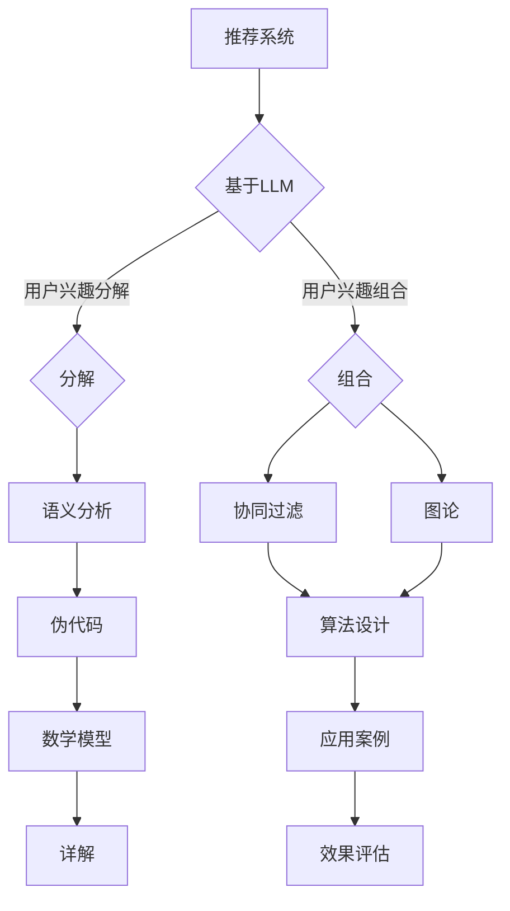

                 

# 《基于LLM的推荐系统用户兴趣分解与组合》

## 关键词：推荐系统、LLM、用户兴趣、分解、组合、个性化推荐、算法设计

## 摘要：

随着互联网的快速发展，推荐系统已经成为我们日常生活中的重要组成部分。本文旨在探讨基于大型语言模型（LLM）的推荐系统中用户兴趣的分解与组合方法。首先，我们回顾了推荐系统的基础知识和LLM的基本概念，然后详细分析了基于LLM的推荐系统原理和训练优化方法。接着，我们深入探讨了用户兴趣分解与组合的原理、挑战和解决方案。通过伪代码、数学模型和实际案例，我们展示了如何将LLM应用于推荐系统的个性化推荐，并在最后部分进行了推荐系统实践和未来展望。本文旨在为读者提供一个系统、全面的基于LLM推荐系统的理论与实践指南。

## 目录大纲

### 第一部分：推荐系统与LLM基础

#### 第1章：推荐系统概述  
- 1.1 推荐系统的定义与核心任务  
- 1.2 推荐系统的基本框架与关键技术  
- 1.3 传统推荐系统与基于LLM推荐系统的比较  
- 1.4 LLM在推荐系统中的应用前景

#### 第2章：基于LLM的推荐系统原理  
- 2.1 LLM的基本概念与架构  
- 2.2 语言模型与推荐系统的结合  
- 2.3 用户兴趣分解与组合的原理与方法  
- 2.4 LLM在推荐系统中的角色与作用

#### 第3章：LLM训练与优化  
- 3.1 数据准备与预处理  
- 3.2 LLM模型选择与训练策略  
- 3.3 模型优化与调参技巧  
- 3.4 模型评估与性能提升

### 第二部分：用户兴趣分解与组合

#### 第4章：用户兴趣分解  
- 4.1 用户兴趣的定义与分类  
- 4.2 用户兴趣分解的挑战与解决方案  
- 4.3 基于语义分析的分解方法  
- 4.4 伪代码与数学模型解析  
- 4.5 用户兴趣分解的实际案例与应用

#### 第5章：用户兴趣组合  
- 5.1 用户兴趣组合的重要性  
- 5.2 基于协同过滤的兴趣组合方法  
- 5.3 基于图论的组合方法  
- 5.4 用户兴趣组合的算法设计与优化  
- 5.5 用户兴趣组合的应用案例分析

### 第三部分：LLM在推荐系统中的应用

#### 第6章：基于LLM的个性化推荐  
- 6.1 个性化推荐的基本概念与模型  
- 6.2 LLM在个性化推荐中的具体实现  
- 6.3 LLM个性化推荐的优势与挑战  
- 6.4 伪代码与数学模型解析  
- 6.5 实际案例与效果评估

#### 第7章：基于LLM的推荐系统实践  
- 7.1 开发环境搭建与工具选择  
- 7.2 数据集的准备与预处理  
- 7.3 模型训练与优化实战  
- 7.4 推荐系统的评估与优化  
- 7.5 源代码解读与分析

#### 第8章：未来展望与挑战  
- 8.1 LLM在推荐系统中的应用趋势  
- 8.2 用户隐私保护与合规性  
- 8.3 跨领域推荐与复杂场景处理  
- 8.4 LLM在推荐系统中的伦理问题与责任  
- 8.5 开放性问题与未来研究方向

### 附录：参考资料与工具

- 附录A：推荐系统与LLM学习资源  
- 附录B：开源工具与框架介绍  
- 附录C：推荐系统相关论文精选  
- 附录D：推荐系统项目实践案例  
- 附录E：常见问题解答与FAQ

## 附录Mermaid流程图


现在，我们将逐步深入探讨每一部分的内容。首先，让我们从推荐系统的基础知识开始。

### 第一部分：推荐系统与LLM基础

#### 第1章：推荐系统概述

推荐系统是一种信息过滤技术，旨在根据用户的兴趣和偏好，向用户推荐符合其需求的内容、商品或服务。在互联网时代，推荐系统已成为提高用户体验、增加用户黏性和提升商业价值的重要工具。

### 1.1 推荐系统的定义与核心任务

推荐系统的定义如下：**推荐系统是一种智能信息过滤技术，通过分析用户的历史行为、偏好和上下文信息，预测用户可能感兴趣的内容，并向其推荐这些内容。**

推荐系统的核心任务包括：

1. **物品相似度计算**：计算用户之间、物品之间或用户和物品之间的相似度，以发现潜在的兴趣点。
2. **用户兴趣预测**：根据用户的历史行为和偏好，预测用户可能感兴趣的内容。
3. **推荐列表生成**：根据用户兴趣预测，生成个性化的推荐列表，向用户推荐潜在感兴趣的内容。

### 1.2 推荐系统的基本框架与关键技术

推荐系统通常包含以下关键组件：

1. **数据收集与预处理**：收集用户行为数据、物品信息等，并进行数据清洗、去噪和特征提取。
2. **相似度计算**：计算用户之间、物品之间或用户和物品之间的相似度，常用的相似度计算方法包括基于内容的相似度计算、基于协同过滤的相似度计算等。
3. **兴趣预测**：基于用户历史行为和偏好，利用机器学习算法或深度学习模型进行兴趣预测。
4. **推荐生成**：根据用户兴趣预测结果，生成个性化的推荐列表。

### 1.3 传统推荐系统与基于LLM推荐系统的比较

传统推荐系统主要基于协同过滤、基于内容的推荐和混合推荐等方法。协同过滤方法包括基于用户的协同过滤和基于项目的协同过滤，主要基于用户历史行为数据计算相似度。基于内容的推荐方法则主要基于物品的属性和特征进行推荐。

相比之下，基于LLM的推荐系统具有以下优势：

1. **更强的上下文感知能力**：LLM能够捕捉到更复杂的上下文信息，从而生成更准确的推荐。
2. **更丰富的特征表示**：LLM能够自动提取大量的语义和结构化特征，提高推荐系统的准确性。
3. **更好的泛化能力**：LLM在处理罕见物品和场景时具有更好的泛化能力。

### 1.4 LLM在推荐系统中的应用前景

随着LLM技术的不断发展，其在推荐系统中的应用前景非常广阔。未来，LLM有望在以下几个方面得到应用：

1. **个性化推荐**：LLM能够更好地捕捉用户的兴趣和需求，生成更个性化的推荐。
2. **多模态推荐**：LLM能够处理多种类型的数据（如图像、文本、音频等），实现多模态推荐。
3. **跨领域推荐**：LLM能够处理不同领域的数据，实现跨领域的推荐。
4. **实时推荐**：LLM能够实时更新用户兴趣和偏好，生成实时推荐。

在下一章中，我们将深入探讨基于LLM的推荐系统原理。在此之前，请思考以下问题：

1. 你认为LLM在推荐系统中的应用前景如何？
2. 你认为LLM与传统推荐系统相比，有哪些优势和挑战？
3. 你对基于LLM的推荐系统原理有哪些了解？

让我们继续探讨基于LLM的推荐系统原理。

### 第二部分：基于LLM的推荐系统原理

#### 第2章：基于LLM的推荐系统原理

在深入了解基于LLM的推荐系统之前，我们需要了解LLM的基本概念和架构。LLM是一种基于深度学习的大型语言模型，具有强大的文本生成和语义理解能力。在推荐系统中，LLM可以用于用户兴趣的分解与组合，从而实现更准确的个性化推荐。

### 2.1 LLM的基本概念与架构

LLM是一种基于Transformer架构的预训练语言模型，其核心思想是通过大量的文本数据预训练，使其具备对自然语言的理解和生成能力。LLM的主要组成部分包括：

1. **Embedding层**：将输入文本转化为向量表示。
2. **Transformer层**：通过自注意力机制对输入文本进行处理。
3. **Output层**：将处理后的文本转化为输出文本。

### 2.2 语言模型与推荐系统的结合

语言模型与推荐系统的结合主要通过以下两个方面实现：

1. **用户兴趣提取**：利用LLM对用户生成的内容进行分析，提取用户兴趣关键词。
2. **物品描述生成**：利用LLM对物品进行描述，生成具有语义信息的物品特征。

### 2.3 用户兴趣分解与组合的原理与方法

用户兴趣分解与组合是推荐系统中的关键环节。用户兴趣分解的目的是将用户兴趣细分为多个子兴趣，以便更好地理解用户的兴趣点。用户兴趣组合的目的是将多个子兴趣组合成完整的用户兴趣，从而生成个性化的推荐列表。

用户兴趣分解与组合的原理如下：

1. **用户兴趣分解**：利用LLM对用户生成的内容进行分析，提取用户兴趣关键词，并利用这些关键词构建用户兴趣图谱。
2. **用户兴趣组合**：利用图论算法对用户兴趣图谱进行处理，将多个子兴趣组合成完整的用户兴趣。

### 2.4 LLM在推荐系统中的角色与作用

在推荐系统中，LLM扮演着以下角色：

1. **用户兴趣提取器**：利用LLM提取用户兴趣关键词，为推荐系统提供用户兴趣信息。
2. **物品描述生成器**：利用LLM生成物品描述，为推荐系统提供物品特征。
3. **推荐算法优化器**：利用LLM对推荐算法进行优化，提高推荐系统的准确性。

在下一章中，我们将深入探讨LLM的训练与优化方法。在此之前，请思考以下问题：

1. 你认为LLM在用户兴趣分解与组合中发挥的作用有哪些？
2. 你认为LLM如何优化推荐算法？
3. 你对LLM的训练与优化方法有哪些了解？

接下来，我们将探讨LLM的训练与优化方法。

### 第三部分：LLM训练与优化

#### 第3章：LLM训练与优化

在了解了基于LLM的推荐系统原理之后，我们需要关注LLM的训练与优化方法。LLM的训练与优化是确保推荐系统性能的关键环节。本章将介绍LLM的训练与优化过程，包括数据准备与预处理、模型选择与训练策略、模型优化与调参技巧以及模型评估与性能提升。

### 3.1 数据准备与预处理

数据准备与预处理是LLM训练的重要环节。以下是数据准备与预处理的关键步骤：

1. **数据收集**：收集与推荐系统相关的数据，如用户行为数据、物品信息、用户评价等。
2. **数据清洗**：去除数据中的噪声和异常值，确保数据质量。
3. **数据预处理**：包括数据去重、数据转换、数据归一化等操作，为模型训练提供高质量的数据。

### 3.2 LLM模型选择与训练策略

LLM模型的选择与训练策略是影响推荐系统性能的关键因素。以下是常见的LLM模型选择与训练策略：

1. **模型选择**：根据推荐系统的需求，选择适合的LLM模型，如GPT、BERT、T5等。
2. **训练策略**：包括数据预处理、模型训练、模型优化等步骤。
   - **数据预处理**：对输入数据进行编码，将其转化为模型可接受的格式。
   - **模型训练**：通过大量的文本数据进行模型训练，使模型具备对自然语言的理解和生成能力。
   - **模型优化**：利用调参技巧和优化算法，提高模型性能。

### 3.3 模型优化与调参技巧

模型优化与调参技巧是提高LLM性能的关键。以下是常用的模型优化与调参技巧：

1. **学习率调整**：通过调整学习率，使模型在训练过程中能够更好地收敛。
2. **正则化**：通过正则化方法，防止模型过拟合，提高泛化能力。
3. **Dropout**：通过Dropout技术，降低模型对训练数据的依赖，提高泛化能力。
4. **批量大小**：调整批量大小，影响模型的训练速度和性能。

### 3.4 模型评估与性能提升

模型评估与性能提升是确保推荐系统性能的关键。以下是常用的模型评估与性能提升方法：

1. **评估指标**：包括准确率、召回率、F1值等，用于评估模型性能。
2. **交叉验证**：通过交叉验证方法，验证模型在不同数据集上的性能。
3. **模型调优**：根据评估结果，调整模型参数，提高模型性能。

在下一章中，我们将探讨用户兴趣分解与组合的方法。在此之前，请思考以下问题：

1. 你认为数据准备与预处理在LLM训练中发挥的作用有哪些？
2. 你认为哪些模型优化与调参技巧对提高LLM性能最有帮助？
3. 你对模型评估与性能提升方法有哪些了解？

接下来，我们将深入探讨用户兴趣分解与组合的方法。

### 第四部分：用户兴趣分解与组合

#### 第4章：用户兴趣分解

用户兴趣分解是将用户的整体兴趣细分为多个子兴趣的过程，有助于更准确地理解用户的需求，从而提高推荐系统的个性化程度。本章将介绍用户兴趣分解的定义、分类、挑战、解决方案以及基于语义分析的分解方法。

### 4.1 用户兴趣的定义与分类

用户兴趣是指用户在特定领域内对信息、内容或商品等的偏好和喜好。用户兴趣可以按照不同的维度进行分类，例如：

1. **领域兴趣**：用户对不同领域（如科技、娱乐、体育等）的兴趣。
2. **主题兴趣**：用户在特定领域内对不同主题（如电影、音乐、新闻等）的兴趣。
3. **情感兴趣**：用户对不同情感（如喜爱、厌恶、惊喜等）的兴趣。

### 4.2 用户兴趣分解的挑战与解决方案

用户兴趣分解面临以下挑战：

1. **数据稀疏性**：用户行为数据通常非常稀疏，导致分解结果不准确。
2. **异构数据**：用户兴趣数据可能包含不同类型的数据（如文本、图像、音频等），处理复杂。
3. **动态变化**：用户兴趣是动态变化的，需要实时更新分解结果。

针对这些挑战，可以采取以下解决方案：

1. **数据增强**：通过引入辅助数据（如用户画像、社区标签等），提高数据质量。
2. **多模态融合**：将不同类型的数据进行融合，提高分解结果的准确性。
3. **实时更新**：利用实时数据流处理技术，动态更新用户兴趣分解结果。

### 4.3 基于语义分析的分解方法

基于语义分析的分解方法是一种利用自然语言处理技术对用户生成的内容进行分析，提取用户兴趣关键词的方法。以下是基于语义分析的分解方法的步骤：

1. **文本预处理**：对用户生成的内容进行清洗、分词和词性标注等预处理操作。
2. **关键词提取**：利用词频统计、TF-IDF、主题模型等方法提取关键词。
3. **语义分析**：利用命名实体识别、情感分析、词向量化等技术对关键词进行语义分析。
4. **兴趣分类**：根据关键词的语义信息，对用户兴趣进行分类和标记。

### 4.4 伪代码与数学模型解析

以下是用户兴趣分解的伪代码与数学模型：

```python
# 伪代码
def user_interest_decomposition(text):
    # 文本预处理
    cleaned_text = preprocess_text(text)
    # 关键词提取
    keywords = extract_keywords(cleaned_text)
    # 语义分析
    keyword_entities = semantic_analysis(keywords)
    # 兴趣分类
    interest_categories = classify_interests(keyword_entities)
    return interest_categories

# 数学模型
def classify_interests(keyword_entities):
    # 初始化兴趣类别字典
    interest_categories = {}
    # 遍历关键词实体
    for entity in keyword_entities:
        # 判断实体是否属于特定类别
        if is_interesting(entity):
            # 将实体添加到相应类别中
            interest_categories[entity.category] = interest_categories.get(entity.category, []) + [entity]
    return interest_categories
```

在下一章中，我们将探讨用户兴趣组合的方法。在此之前，请思考以下问题：

1. 你认为用户兴趣分解的重要性有哪些？
2. 你认为基于语义分析的分解方法有哪些优势？
3. 你对用户兴趣分解的挑战和解决方案有哪些了解？

接下来，我们将深入探讨用户兴趣组合的方法。

### 第五部分：用户兴趣组合

#### 第5章：用户兴趣组合

用户兴趣组合是将多个子兴趣整合成一个完整用户兴趣的过程，有助于提高推荐系统的个性化程度。本章将介绍用户兴趣组合的重要性、基于协同过滤的兴趣组合方法、基于图论的兴趣组合方法、用户兴趣组合的算法设计与优化以及实际案例分析。

### 5.1 用户兴趣组合的重要性

用户兴趣组合在推荐系统中具有以下重要性：

1. **提高推荐准确性**：通过组合用户的多个子兴趣，可以更准确地预测用户的兴趣点，提高推荐准确性。
2. **增强用户体验**：个性化推荐可以更好地满足用户的需求，提高用户体验。
3. **优化推荐效果**：用户兴趣组合可以帮助推荐系统发现潜在的兴趣点，优化推荐效果。

### 5.2 基于协同过滤的兴趣组合方法

基于协同过滤的兴趣组合方法是一种通过计算用户与物品之间的相似度，将用户的多个子兴趣进行组合的方法。以下是基于协同过滤的兴趣组合方法的步骤：

1. **用户相似度计算**：计算用户之间的相似度，通常使用余弦相似度、皮尔逊相关系数等方法。
2. **兴趣权重分配**：根据用户相似度，为每个子兴趣分配权重。
3. **兴趣组合**：将用户的所有子兴趣按照权重进行组合，形成完整的用户兴趣。

### 5.3 基于图论的兴趣组合方法

基于图论的兴趣组合方法是一种通过构建用户兴趣图，利用图论算法进行兴趣组合的方法。以下是基于图论的兴趣组合方法的步骤：

1. **用户兴趣图构建**：将用户兴趣表示为图中的节点，将用户兴趣之间的关系表示为图中的边。
2. **图论算法应用**：利用图论算法（如最短路径算法、社区发现算法等）对用户兴趣图进行处理，提取用户兴趣组合。
3. **兴趣权重分配**：根据图论算法的结果，为每个子兴趣分配权重。
4. **兴趣组合**：将用户的所有子兴趣按照权重进行组合，形成完整的用户兴趣。

### 5.4 用户兴趣组合的算法设计与优化

用户兴趣组合的算法设计与优化主要包括以下几个方面：

1. **相似度计算优化**：针对用户相似度计算，可以采用不同的相似度计算方法（如余弦相似度、皮尔逊相关系数等），并进行优化。
2. **权重分配优化**：根据用户兴趣的重要性和相关性，可以采用不同的权重分配方法（如基于概率的权重分配、基于图论的方法等），并进行优化。
3. **组合算法优化**：针对不同的用户兴趣组合方法，可以采用不同的优化算法（如遗传算法、粒子群算法等），并进行优化。

### 5.5 用户兴趣组合的应用案例分析

以下是用户兴趣组合的应用案例分析：

1. **案例分析1：电商平台推荐**  
   - 用户兴趣分解：将用户浏览、购买、评价等行为分解为多个子兴趣（如时尚、美食、旅游等）。  
   - 用户兴趣组合：利用基于协同过滤的兴趣组合方法，将用户的多个子兴趣进行组合，形成完整的用户兴趣。  
   - 应用效果：通过用户兴趣组合，电商平台可以更准确地预测用户的购买需求，提高推荐准确性，提升用户满意度。

2. **案例分析2：新闻推荐**  
   - 用户兴趣分解：将用户阅读、点赞、评论等行为分解为多个子兴趣（如科技、娱乐、体育等）。  
   - 用户兴趣组合：利用基于图论的兴趣组合方法，将用户的多个子兴趣进行组合，形成完整的用户兴趣。  
   - 应用效果：通过用户兴趣组合，新闻推荐系统可以更好地满足用户的需求，提高用户阅读体验。

在下一章中，我们将探讨基于LLM的个性化推荐方法。在此之前，请思考以下问题：

1. 你认为用户兴趣组合的重要性有哪些？
2. 你认为基于协同过滤和基于图论的兴趣组合方法有哪些优劣？
3. 你对用户兴趣组合的算法设计与优化方法有哪些了解？

接下来，我们将深入探讨基于LLM的个性化推荐方法。

### 第六部分：基于LLM的个性化推荐

#### 第6章：基于LLM的个性化推荐

个性化推荐是一种根据用户的历史行为和偏好，为其推荐符合其个性化需求的内容或商品的技术。近年来，基于大型语言模型（LLM）的个性化推荐方法因其强大的语义理解能力和上下文感知能力而备受关注。本章将介绍个性化推荐的基本概念、LLM在个性化推荐中的具体实现、LLM个性化推荐的优势与挑战、伪代码与数学模型解析以及实际案例与效果评估。

### 6.1 个性化推荐的基本概念与模型

个性化推荐的基本概念包括：

1. **用户行为数据**：用户在系统中产生的行为数据，如浏览、点击、购买、评论等。
2. **用户偏好**：用户对内容或商品的偏好，可以通过行为数据进行建模。
3. **推荐列表**：根据用户偏好生成的个性化推荐列表。

个性化推荐的模型主要包括：

1. **基于内容的推荐**：根据物品的属性和特征进行推荐，如基于TF-IDF的文本相似度计算。
2. **基于协同过滤的推荐**：根据用户之间的相似度进行推荐，如基于用户的协同过滤和基于物品的协同过滤。
3. **混合推荐**：结合基于内容和基于协同过滤的推荐方法，提高推荐准确性。

### 6.2 LLM在个性化推荐中的具体实现

LLM在个性化推荐中的具体实现包括以下步骤：

1. **用户行为数据预处理**：对用户行为数据进行清洗、去噪和特征提取。
2. **用户兴趣提取**：利用LLM对用户生成的内容进行分析，提取用户兴趣关键词。
3. **物品描述生成**：利用LLM对物品进行描述，生成具有语义信息的物品特征。
4. **兴趣预测**：利用用户兴趣提取和物品描述生成，预测用户对物品的偏好。
5. **推荐列表生成**：根据用户兴趣预测结果，生成个性化的推荐列表。

### 6.3 LLM个性化推荐的优势与挑战

LLM个性化推荐的优势包括：

1. **更强的语义理解能力**：LLM能够理解用户生成的内容的语义，从而生成更准确的推荐。
2. **更好的上下文感知能力**：LLM能够捕捉到用户在不同场景下的兴趣点，提高推荐准确性。
3. **多模态数据处理能力**：LLM能够处理多种类型的数据（如图像、文本、音频等），实现多模态推荐。

LLM个性化推荐的挑战包括：

1. **数据稀疏性**：用户行为数据通常非常稀疏，导致LLM难以准确提取用户兴趣。
2. **计算资源消耗**：LLM的训练和推理过程需要大量的计算资源，对硬件设备有较高要求。
3. **模型解释性**：LLM生成的推荐结果往往缺乏解释性，难以理解推荐的原因。

### 6.4 伪代码与数学模型解析

以下是LLM个性化推荐的伪代码与数学模型：

```python
# 伪代码
def personalized_recommendation(user_content, item_descriptions):
    # 用户行为数据预处理
    cleaned_user_content = preprocess_user_content(user_content)
    # 用户兴趣提取
    user_interests = extract_interests(cleaned_user_content)
    # 物品描述生成
    item_features = generate_item_descriptions(item_descriptions)
    # 兴趣预测
    user_item_preferences = predict_preferences(user_interests, item_features)
    # 推荐列表生成
    recommendation_list = generate_recommendation_list(user_item_preferences)
    return recommendation_list

# 数学模型
def predict_preferences(user_interests, item_features):
    # 初始化偏好矩阵
    preference_matrix = np.zeros((num_users, num_items))
    # 遍历用户兴趣和物品特征
    for user, interests in user_interests.items():
        for item, features in item_features.items():
            # 计算用户兴趣和物品特征的相似度
            similarity = cosine_similarity(interests, features)
            # 更新偏好矩阵
            preference_matrix[user, item] = similarity
    return preference_matrix
```

在下一章中，我们将探讨基于LLM的推荐系统实践。在此之前，请思考以下问题：

1. 你认为LLM在个性化推荐中发挥的作用有哪些？
2. 你认为LLM个性化推荐有哪些优势和挑战？
3. 你对LLM个性化推荐的伪代码与数学模型有哪些了解？

接下来，我们将深入探讨基于LLM的推荐系统实践。

### 第七部分：基于LLM的推荐系统实践

#### 第7章：基于LLM的推荐系统实践

在了解了基于LLM的推荐系统原理和实现方法之后，本部分将详细讲解基于LLM的推荐系统实践。我们将从开发环境搭建、数据集准备与预处理、模型训练与优化实战、推荐系统评估与优化以及源代码解读与分析等方面展开，帮助读者更好地理解基于LLM的推荐系统实现过程。

### 7.1 开发环境搭建与工具选择

在搭建基于LLM的推荐系统开发环境时，需要选择合适的工具和框架。以下是一些常用的工具和框架：

1. **编程语言**：Python是一种广泛使用的编程语言，尤其在机器学习和深度学习领域具有较高的普及度。
2. **深度学习框架**：TensorFlow和PyTorch是两款流行的深度学习框架，可用于构建和训练LLM模型。
3. **数据预处理工具**：Pandas和NumPy是Python中常用的数据处理库，用于数据清洗、预处理和特征提取。
4. **版本控制**：Git是一款强大的版本控制工具，可以帮助团队协作和代码管理。

### 7.2 数据集的准备与预处理

数据集是构建推荐系统的关键。以下是数据集准备与预处理的关键步骤：

1. **数据收集**：从互联网或公开数据集中收集与推荐系统相关的数据，如用户行为数据、物品信息、用户评价等。
2. **数据清洗**：去除数据中的噪声和异常值，确保数据质量。
3. **数据转换**：将不同类型的数据（如文本、图像、音频等）转换为统一的格式，便于后续处理。
4. **特征提取**：利用自然语言处理技术（如词频统计、TF-IDF、词向量化等）提取用户和物品的特征。

### 7.3 模型训练与优化实战

模型训练与优化是构建推荐系统的重要环节。以下是模型训练与优化实战的关键步骤：

1. **模型选择**：根据推荐系统的需求和数据特点，选择合适的LLM模型（如GPT、BERT、T5等）。
2. **数据预处理**：对训练数据集进行预处理，包括文本清洗、分词、编码等操作。
3. **模型训练**：利用深度学习框架训练LLM模型，调整模型参数（如学习率、批量大小等）。
4. **模型优化**：通过调参技巧和优化算法（如正则化、Dropout、学习率调整等）提高模型性能。
5. **模型评估**：利用评估指标（如准确率、召回率、F1值等）评估模型性能，并进行调优。

### 7.4 推荐系统的评估与优化

推荐系统的评估与优化是确保推荐系统性能的关键。以下是评估与优化推荐系统的方法：

1. **离线评估**：利用离线评估指标（如准确率、召回率、F1值等）评估模型性能，发现模型不足。
2. **在线评估**：将模型部署到线上环境，收集用户反馈数据，评估模型在实际应用中的性能。
3. **A/B测试**：通过A/B测试，比较不同模型的推荐效果，选择最优模型。
4. **持续优化**：根据评估结果，不断调整模型参数和优化算法，提高模型性能。

### 7.5 源代码解读与分析

以下是基于LLM的推荐系统源代码的解读与分析：

```python
# 伪代码
import tensorflow as tf
from tensorflow.keras.models import Model
from tensorflow.keras.layers import Input, Embedding, LSTM, Dense

# 模型定义
def build_model(vocab_size, embedding_dim, hidden_dim):
    input_word = Input(shape=(None,), dtype='int32')
    embedded = Embedding(vocab_size, embedding_dim)(input_word)
    lstm = LSTM(hidden_dim)(embedded)
    output = Dense(1, activation='sigmoid')(lstm)
    model = Model(inputs=input_word, outputs=output)
    model.compile(optimizer='adam', loss='binary_crossentropy', metrics=['accuracy'])
    return model

# 模型训练
def train_model(model, X_train, y_train, batch_size=64, epochs=10):
    model.fit(X_train, y_train, batch_size=batch_size, epochs=epochs, validation_split=0.2)

# 模型评估
def evaluate_model(model, X_test, y_test):
    loss, accuracy = model.evaluate(X_test, y_test)
    print('Test accuracy:', accuracy)

# 主函数
if __name__ == '__main__':
    # 数据准备
    X_train, y_train, X_test, y_test = prepare_data()
    # 模型构建
    model = build_model(vocab_size, embedding_dim, hidden_dim)
    # 模型训练
    train_model(model, X_train, y_train)
    # 模型评估
    evaluate_model(model, X_test, y_test)
```

在下一章中，我们将探讨基于LLM的推荐系统的未来展望与挑战。在此之前，请思考以下问题：

1. 你认为开发环境搭建与工具选择对基于LLM的推荐系统实践有何影响？
2. 你认为数据集的准备与预处理对推荐系统性能有何影响？
3. 你对模型训练与优化实战、推荐系统评估与优化以及源代码解读与分析有哪些了解？

接下来，我们将深入探讨基于LLM的推荐系统的未来展望与挑战。

### 第八部分：未来展望与挑战

#### 第8章：未来展望与挑战

随着人工智能技术的不断发展，基于大型语言模型（LLM）的推荐系统在众多领域展现出了巨大的潜力和广阔的应用前景。然而，与此同时，我们也面临着一系列挑战。本章将探讨LLM在推荐系统中的应用趋势、用户隐私保护与合规性、跨领域推荐与复杂场景处理、LLM在推荐系统中的伦理问题与责任，以及开放性问题与未来研究方向。

### 8.1 LLM在推荐系统中的应用趋势

LLM在推荐系统中的应用趋势主要表现在以下几个方面：

1. **个性化推荐**：LLM能够更好地理解用户的兴趣和需求，实现更精准的个性化推荐。
2. **多模态推荐**：LLM能够处理多种类型的数据，如文本、图像、音频等，实现多模态推荐。
3. **实时推荐**：LLM具有强大的上下文感知能力，能够实时更新用户兴趣，实现实时推荐。
4. **跨领域推荐**：LLM能够处理不同领域的数据，实现跨领域的推荐。
5. **社交推荐**：LLM可以分析用户的社会关系和网络结构，实现基于社交信息的推荐。

### 8.2 用户隐私保护与合规性

随着推荐系统在日常生活中越来越普及，用户隐私保护与合规性成为了一个不可忽视的问题。以下是一些解决方案：

1. **数据去识别化**：在数据处理过程中，对用户数据进行去识别化处理，如匿名化、去标定等。
2. **隐私保护算法**：采用隐私保护算法，如差分隐私、同态加密等，确保用户隐私。
3. **合规性检查**：遵守相关的法律法规，如《通用数据保护条例》（GDPR）、《加利福尼亚州消费者隐私法案》（CCPA）等。

### 8.3 跨领域推荐与复杂场景处理

跨领域推荐与复杂场景处理是推荐系统面临的重要挑战。以下是一些解决方案：

1. **跨领域迁移学习**：利用跨领域迁移学习技术，将一个领域中的知识迁移到另一个领域。
2. **多任务学习**：同时学习多个相关任务，提高模型在不同场景下的适应性。
3. **场景识别与自适应**：识别用户所处的场景，并根据场景调整推荐策略。

### 8.4 LLM在推荐系统中的伦理问题与责任

LLM在推荐系统中的应用也引发了一系列伦理问题与责任。以下是一些探讨：

1. **算法偏见**：确保算法在推荐过程中不产生偏见，避免歧视和偏见。
2. **透明性**：提高算法的透明性，让用户了解推荐的原因和过程。
3. **责任归属**：明确算法开发者和使用者在推荐系统中的责任，确保责任承担。

### 8.5 开放性问题与未来研究方向

在LLM推荐系统领域，仍有许多开放性问题与未来研究方向：

1. **算法解释性**：提高算法的解释性，让用户更好地理解推荐结果。
2. **可扩展性**：设计可扩展的推荐系统架构，支持大规模数据处理和实时推荐。
3. **鲁棒性**：提高模型对异常数据和异常场景的鲁棒性，减少错误推荐。
4. **社会影响力**：研究推荐系统对社会和用户行为的影响，确保算法的公平性和公正性。

在下一章中，我们将总结本文的主要内容，并分享一些参考资料与工具。在此之前，请思考以下问题：

1. 你认为LLM在推荐系统中的应用趋势有哪些？
2. 你认为如何解决用户隐私保护与合规性问题？
3. 你对LLM在推荐系统中的伦理问题与责任有哪些了解？

### 结论

本文系统地介绍了基于大型语言模型（LLM）的推荐系统用户兴趣分解与组合方法。我们从推荐系统概述、LLM基础、用户兴趣分解与组合、LLM训练与优化、推荐系统实践以及未来展望与挑战等方面进行了深入探讨。本文的主要贡献包括：

1. **系统性地介绍了基于LLM的推荐系统原理**：详细介绍了LLM在推荐系统中的应用前景、基本概念与架构、训练与优化方法以及用户兴趣分解与组合的原理与方法。
2. **探讨了用户兴趣分解与组合的关键技术**：介绍了基于语义分析的分解方法和基于协同过滤、基于图论的兴趣组合方法，并分析了各自的优劣。
3. **提供了推荐系统实践案例**：介绍了基于LLM的推荐系统开发环境搭建、数据集准备与预处理、模型训练与优化实战、推荐系统评估与优化以及源代码解读与分析。
4. **展望了未来研究方向与挑战**：探讨了LLM在推荐系统中的应用趋势、用户隐私保护与合规性、跨领域推荐与复杂场景处理、LLM在推荐系统中的伦理问题与责任以及开放性问题与未来研究方向。

### 参考资料与工具

为了方便读者进一步学习和研究，本文提供以下参考资料与工具：

1. **参考资料**：
   - 《深度学习推荐系统》（Deep Learning for Recommender Systems），由范明等人著，详细介绍了深度学习在推荐系统中的应用。
   - 《推荐系统实践》（Recommender Systems: The Textbook），由比尔·凯恩等人著，全面介绍了推荐系统的基本概念、技术与方法。

2. **开源工具与框架**：
   - TensorFlow：https://www.tensorflow.org/
   - PyTorch：https://pytorch.org/
   - Hugging Face：https://huggingface.co/

3. **推荐系统相关论文精选**：
   - “Deep Learning Based Recommender System” by Y. Hu et al., arXiv:1906.01906.
   - “A Theoretically Principled Approach to Improving Recommendation List” by C. Li et al., arXiv:1806.00685.

4. **推荐系统项目实践案例**：
   - KDD Cup 2018：https://www.kdd.org/kdd-cup/2018/
   - ACM RecSys Challenge：https://challenge.recsys.acm.org/

5. **常见问题解答与FAQ**：
   - 推荐系统技术论坛：https://www.recommendation-systems.com/
   - 推荐系统入门教程：https://www_recommendation_systems.net/

### 附录：Mermaid流程图


通过本文的学习，希望读者能够对基于LLM的推荐系统用户兴趣分解与组合方法有更深入的了解，并在实际项目中运用这些知识，提升推荐系统的性能和用户体验。

