                 

# 第二部分：大数据与电影数据分析基础

## 2.1 大数据的概念与特征

### 2.1.1 大数据的定义

大数据（Big Data）是指无法使用常规数据处理工具在合理时间内捕捉、管理和处理的大量数据。这个概念源于互联网和社交媒体的迅速普及，导致了数据的爆炸性增长。大数据通常具有以下三个“V”特征：

- **大量（Volume）**：大数据的规模巨大，包括文本、图片、视频、音频等多种数据类型。
- **多样（Variety）**：大数据来源广泛，涵盖了结构化、半结构化和非结构化数据。
- **速度（Velocity）**：大数据的处理速度非常快，需要实时或近实时地处理和分析。
- **价值（Value）**：大数据中隐藏着巨大的价值，但同时也存在价值密度低的问题。

### 2.1.2 大数据的特征

1. **体量大**：大数据的体量通常在GB、TB、PB甚至ZB级别。
2. **类型多**：包括文本、图像、视频、音频等多种类型的数据。
3. **速度快**：数据生成、处理和传输的速度非常快，要求实时响应。
4. **价值密度低**：大量数据中，有价值的信息占比很小，需要进行有效的筛选和分析。

### 2.1.3 大数据在电影数据分析中的应用

大数据在电影数据分析中的应用主要体现在以下几个方面：

- **用户行为分析**：通过分析用户的观影习惯、评分、评论等行为数据，可以了解用户偏好，为电影推荐和营销提供依据。
- **电影内容分析**：利用大数据技术对电影剧本、台词、画面等进行深入分析，可以挖掘出电影的潜在主题、情感和风格。
- **电影市场分析**：通过对票房数据、观众反馈等信息的分析，可以预测电影市场的趋势，为电影投资和制作提供参考。

## 2.2 大数据的处理与分析

### 2.2.1 数据采集与存储

数据采集是大数据处理的第一步，需要从各种来源获取数据。数据来源包括社交媒体、用户评论、票务系统等。数据存储则需要利用分布式存储技术，如Hadoop的HDFS，来处理大规模数据。

### 2.2.2 数据清洗与预处理

数据清洗是确保数据质量的重要步骤，包括去除重复数据、处理缺失值、纠正错误等。预处理包括数据格式转换、特征工程等，为后续的数据分析做准备。

### 2.2.3 数据存储与管理

数据存储与管理需要利用数据仓库和大数据处理框架，如Apache Hive和Spark，来存储和管理大量数据，并支持复杂的数据查询和分析。

## 2.3 电影数据分析的基础

### 2.3.1 电影数据的基本概念

电影数据包括电影的基本信息（如标题、导演、演员、类型等）、用户行为数据（如观看记录、评分、评论等）和电影内容数据（如剧本、台词、画面等）。

### 2.3.2 电影数据的来源

电影数据的来源包括：

- **票务系统**：提供电影的票房数据、观众信息等。
- **社交媒体**：提供观众评论、点赞、转发等社交行为数据。
- **互联网资源**：提供电影剧本、台词、评论等文本数据。

### 2.3.3 电影数据分析的关键指标

电影数据分析的关键指标包括：

- **用户画像**：描述用户的基本特征和观影偏好。
- **用户行为**：分析用户的观影习惯和评价行为。
- **电影内容**：分析电影的剧本、台词、画面等。
- **票房数据**：分析电影的票房收入和市场表现。

## 2.4 大数据电影数据分析方法

### 2.4.1 用户行为数据分析

用户行为数据分析主要包括用户画像构建、用户行为数据挖掘和用户偏好分析。通过分析用户的行为数据，可以了解用户的观影偏好和需求，为电影推荐和营销提供依据。

### 2.4.2 电影内容数据分析

电影内容数据分析主要包括电影内容提取、电影内容分析模型和电影情感分析。通过分析电影的内容，可以挖掘出电影的潜在主题和情感，为电影评价和创作提供参考。

### 2.4.3 电影市场数据分析

电影市场数据分析主要包括电影票房数据分析、电影市场趋势分析和电影市场风险预测。通过分析票房数据和市场趋势，可以预测电影市场的表现，为电影投资和制作提供依据。

### 2.4.4 可视化在电影数据分析中的应用

可视化在电影数据分析中起着重要作用，可以帮助我们更直观地理解数据，发现数据中的规律和趋势。常见的可视化工具包括D3.js、Echarts等。

## 2.5 电影数据分析的可视化

### 2.5.1 可视化在电影数据分析中的作用

可视化在电影数据分析中的作用主要包括：

- **数据解释性**：通过图表和图形，使得复杂的数据变得容易理解。
- **数据发现**：通过可视化，可以发现数据中的规律和趋势，为分析提供启示。
- **决策支持**：通过可视化，可以为决策者提供直观的数据支持，帮助做出更好的决策。

### 2.5.2 可视化工具与技术

常见的可视化工具包括D3.js、Echarts、Plotly等。每种工具都有其独特的特点和适用场景，选择合适的工具可以提高数据可视化的效果。

### 2.5.3 可视化案例分析

在实际应用中，可视化技术可以应用于用户行为分析、电影内容分析和电影市场分析等多个方面。以下是一些具体案例：

- **用户行为分析**：通过用户画像和用户行为数据，可以绘制用户活跃度曲线图、用户行为分布饼图等。
- **电影内容分析**：通过对电影剧本和台词的分析，可以绘制词云图、情感分析柱状图等。
- **电影市场分析**：通过对票房数据和市场趋势的分析，可以绘制票房趋势折线图、市场占有率饼图等。

## 2.6 总结

大数据在电影数据分析中的应用具有重要意义。通过分析大量的用户行为数据、电影内容数据和票房数据，可以为电影推荐、制作、营销和投资提供有力支持。同时，可视化技术作为数据分析的重要工具，可以帮助我们更直观地理解数据，发现数据中的规律和趋势。在未来的发展中，大数据和可视化技术的结合将为电影产业带来更多的创新和机遇。


----------------------------------------------------------------

### 2.1.1 大数据的定义

大数据是指那些无法通过传统数据处理工具在合理时间内捕捉、管理和处理的大量数据。大数据的规模通常非常大，且数据类型多种多样，包括但不限于文本、图像、视频和音频等。其三个主要特征被简称为“3V”：

- **大量（Volume）**：大数据的规模通常以GB、TB、PB甚至ZB（泽字节）来衡量，这种数据规模超出了传统关系数据库处理能力的范围。
- **多样（Variety）**：大数据的来源非常广泛，涵盖了结构化数据（如数据库中的表格）、半结构化数据（如XML、JSON等）和非结构化数据（如图像、视频、文本等）。
- **速度（Velocity）**：大数据的处理速度非常快，尤其是在实时分析和处理方面，需要能够快速地捕捉、处理和响应数据流。

此外，大数据的“价值（Value）”也是其重要特征之一。尽管大数据的价值密度相对较低，但其中蕴藏着巨大的商业价值和洞察力。大数据分析可以帮助企业更好地理解客户需求、优化业务流程和做出更明智的决策。

### 2.1.2 大数据的特征

- **体量大（Volume）**：大数据的体量是巨大的，需要专门的技术和工具来存储和处理。例如，社交媒体平台每天产生的数据量就可能达到数TB级别。
- **类型多（Variety）**：大数据不仅包括文本数据，还包括图像、音频、视频等多种类型的数据，这使得数据处理的复杂性大大增加。
- **速度快（Velocity）**：大数据的处理速度要求非常高，尤其是实时数据流分析，需要能够在短时间内完成数据的采集、处理和分析。
- **价值密度低（Value）**：大数据中，有价值的信息往往只占很小的一部分，这意味着处理大量数据以获取有价值的信息需要高效的方法和技术。

### 2.1.3 大数据在电影数据分析中的应用

大数据技术在电影数据分析中发挥着至关重要的作用，它不仅帮助电影制作方了解观众行为和市场趋势，也为电影营销和投资提供了有力的支持。以下是一些具体的应用：

- **用户行为分析**：通过分析用户在电影平台上的浏览记录、观看时间、评分和评论等行为数据，可以了解观众对电影的兴趣点和偏好，从而为电影推荐系统和营销策略提供依据。
- **电影内容分析**：通过对电影剧本、台词、场景等内容的分析，可以挖掘出电影的潜在主题、情感和风格，为电影评价、创作和改编提供参考。
- **电影市场分析**：通过对票房数据、观众反馈等市场信息的分析，可以预测电影的市场表现，为电影投资和制作提供决策支持。

### 2.2 大数据的处理与分析

#### 2.2.1 数据采集与存储

数据采集是大数据处理的第一步，需要从各种来源获取数据，包括但不限于社交媒体、票务系统、视频平台和用户评论等。数据存储通常需要使用分布式存储系统，如Hadoop分布式文件系统（HDFS），它能够处理和存储大量数据。

1. **数据采集**：
    - **社交媒体数据采集**：使用API接口或网络爬虫从社交媒体平台（如Twitter、Facebook等）获取用户评论、点赞、分享等数据。
    - **票务系统数据采集**：从票务系统（如Ticketmaster、IMDb等）获取电影的票房数据、观众信息等。
    - **用户行为数据采集**：从电影流媒体平台（如Netflix、Amazon Prime Video等）获取用户的观看记录、搜索记录等。

2. **数据存储**：
    - **分布式存储**：使用分布式存储系统（如HDFS、HBase）来存储大规模数据，这些系统能够横向扩展，处理PB级别的数据。
    - **数据仓库**：将清洗后的数据存储在数据仓库中，如Amazon Redshift、Google BigQuery等，以便进行复杂的数据分析和查询。

#### 2.2.2 数据清洗与预处理

数据清洗和预处理是确保数据质量的重要步骤，它包括以下关键环节：

1. **数据清洗**：
    - **去重**：去除重复的数据条目，确保数据的唯一性。
    - **缺失值处理**：填补缺失的数据或删除含有缺失值的数据条目。
    - **异常值处理**：识别和修正异常数据值，如过大的票房收入、过低的用户评分等。
    - **数据格式转换**：将不同来源的数据转换为统一的格式，如将CSV文件转换为JSON格式。

2. **数据预处理**：
    - **特征工程**：根据分析需求提取有用的特征，如用户年龄、观影频率、电影类型等。
    - **数据标准化**：将数据统一缩放到相同范围，如使用Z-score标准化。
    - **数据归一化**：处理不同量级的数据，如将票房收入从元转换为万元。

#### 2.2.3 数据存储与管理

大数据的存储和管理需要考虑数据的持久性、扩展性和性能。以下是一些关键步骤：

1. **数据湖（Data Lake）**：数据湖是一个大规模的数据存储库，可以存储大量的原始数据，包括结构化、半结构化和非结构化数据。数据湖通常用于大数据分析的前期数据收集和存储。

2. **数据仓库（Data Warehouse）**：数据仓库是一个用于存储大量结构化数据的系统，通常用于支持复杂的数据分析和报表生成。

3. **分布式数据库**：使用分布式数据库（如Apache Cassandra、HBase）来存储和查询大规模数据，这些数据库能够处理高并发查询和大规模数据存储。

4. **数据管理平台**：使用数据管理平台（如Talend、Informatica）来自动化数据集成、数据质量和数据治理流程。

### 2.3 电影数据分析的基础

#### 2.3.1 电影数据的基本概念

电影数据是指与电影制作、发布、营销、票房等相关的各种信息。电影数据的基本概念包括：

- **电影基本信息**：包括电影名称、导演、演员、上映日期、类型、时长等。
- **票房数据**：包括电影上映后的票房收入、观众人数、票房排名等。
- **用户行为数据**：包括用户观看记录、评分、评论、点赞、分享等行为数据。
- **电影内容数据**：包括电影剧本、台词、画面、音效等文本和多媒体数据。

#### 2.3.2 电影数据的来源

电影数据的来源广泛，主要包括以下几个方面：

- **票务系统**：票务系统提供电影票房数据、观众购票记录、场次信息等。
- **社交媒体**：社交媒体平台（如Twitter、Facebook、Instagram）提供用户评论、点赞、分享等行为数据。
- **电影流媒体平台**：如Netflix、Amazon Prime Video等，提供用户观看记录、偏好等数据。
- **用户评论网站**：如IMDb、Rotten Tomatoes等，提供用户评分和评论数据。
- **电影制作公司**：电影制作公司提供电影剧本、台词、制作日志等内部数据。

#### 2.3.3 电影数据分析的关键指标

电影数据分析的关键指标包括：

- **用户画像**：描述用户的基本特征（如年龄、性别、地域等）和观影偏好（如喜欢电影类型、观看频率等）。
- **用户行为**：分析用户的观看记录、评分、评论等行为，了解用户的观影习惯和反馈。
- **电影内容**：分析电影剧本、台词、画面等，挖掘电影的主题、情感和风格。
- **票房数据**：分析电影的票房收入、观众人数、票房排名等，预测电影的市场表现。

### 2.4 大数据电影数据分析方法

#### 2.4.1 用户行为数据分析

用户行为数据分析是电影数据分析中的重要组成部分，它主要包括以下方法：

1. **用户画像构建**：通过分析用户的观看记录、评分、评论等行为数据，构建用户画像，了解用户的基本特征和观影偏好。
    ```python
    # 伪代码：构建用户画像
    def build_user_profile(user_behavior_data):
        # 提取用户的基本信息
        user_info = extract_user_info(user_behavior_data)
        # 提取用户的观影偏好
        preferences = extract_preferences(user_behavior_data)
        # 构建用户画像
        user_profile = merge_info(preferences, user_info)
        return user_profile
    ```

2. **用户行为数据挖掘**：通过对用户行为数据的分析，挖掘用户的行为模式，如经常观看的电影类型、高峰观影时间等。
    ```python
    # 伪代码：挖掘用户行为模式
    def mine_user_behavior_patterns(user_behavior_data):
        # 统计用户观看电影的类型
        movie_types = count_movie_types(user_behavior_data)
        # 统计用户的高峰观影时间
        peak_watching_times = count_peak_watching_times(user_behavior_data)
        return movie_types, peak_watching_times
    ```

3. **用户偏好分析**：根据用户的行为数据，分析用户的观影偏好，为电影推荐系统提供支持。
    ```python
    # 伪代码：分析用户偏好
    def analyze_user_preferences(user_behavior_data):
        # 提取用户的评分数据
        ratings = extract_ratings(user_behavior_data)
        # 训练偏好分析模型
        preference_model = train_preference_model(ratings)
        # 预测用户偏好
        predicted_preferences = predict_preferences(preference_model)
        return predicted_preferences
    ```

#### 2.4.2 电影内容数据分析

电影内容数据分析主要包括对电影剧本、台词、画面等内容的分析，以挖掘电影的潜在主题、情感和风格。以下是一些关键方法：

1. **电影内容提取**：从电影中提取文本和图像数据，为后续分析做准备。
    ```python
    # 伪代码：提取电影内容
    def extract_movie_content(movie_file):
        # 提取文本数据
        text_data = extract_text_from_movie(movie_file)
        # 提取图像数据
        image_data = extract_images_from_movie(movie_file)
        return text_data, image_data
    ```

2. **电影内容分析模型**：使用自然语言处理（NLP）和计算机视觉（CV）技术，分析电影的文本和图像内容。
    ```python
    # 伪代码：电影内容分析模型
    def analyze_movie_content(text_data, image_data):
        # 使用NLP技术分析文本
        text_analysis = analyze_text(text_data)
        # 使用CV技术分析图像
        image_analysis = analyze_images(image_data)
        return text_analysis, image_analysis
    ```

3. **电影情感分析**：通过情感分析模型，分析电影的情感倾向，如正面、负面或中立。
    ```python
    # 伪代码：电影情感分析
    def analyze_movie_sentiment(text_data):
        # 训练情感分析模型
        sentiment_model = train_sentiment_model()
        # 分析文本情感
        sentiments = sentiment_model.predict(text_data)
        return sentiments
    ```

#### 2.4.3 电影市场数据分析

电影市场数据分析主要包括对票房数据、观众反馈等市场信息的分析，以预测电影的市场表现和制定营销策略。以下是一些关键方法：

1. **票房数据分析**：通过分析票房数据，了解电影的市场表现和观众反应。
    ```python
    # 伪代码：票房数据分析
    def analyze_box_office_data(box_office_data):
        # 统计票房收入
        total_revenue = sum_revenue(box_office_data)
        # 统计观众人数
        total_viewers = sum_viewers(box_office_data)
        return total_revenue, total_viewers
    ```

2. **电影市场趋势分析**：通过分析历史票房数据和当前市场趋势，预测电影未来的市场表现。
    ```python
    # 伪代码：电影市场趋势分析
    def analyze_movie_trends(box_office_data):
        # 统计历史票房趋势
        historical_trends = calculate_trends(box_office_data)
        # 分析当前市场趋势
        current_trends = analyze_current_trends(box_office_data)
        return historical_trends, current_trends
    ```

3. **电影市场风险预测**：通过分析市场数据，预测电影可能面临的风险，如票房收入不如预期等。
    ```python
    # 伪代码：电影市场风险预测
    def predict_market_risks(box_office_data):
        # 识别潜在风险
        potential_risks = identify_risks(box_office_data)
        # 风险评估
        risk_assessment = assess_risks(potential_risks)
        return risk_assessment
    ```

#### 2.4.4 可视化在电影数据分析中的应用

可视化是电影数据分析中不可或缺的工具，它可以帮助我们更直观地理解和传达分析结果。以下是一些常见的可视化应用：

1. **用户行为分析可视化**：通过图表和图形，展示用户的行为模式和观影偏好。
    ```mermaid
    graph TD
        A[用户活跃度] --> B[用户观影频率]
        B --> C[用户评分分布]
        C --> D[用户评论情感]
    ```

2. **电影内容分析可视化**：通过词云、情感分析柱状图等，展示电影内容的主题和情感。
    ```mermaid
    graph TD
        A[电影词云] --> B[情感分析柱状图]
        B --> C[主题分布饼图]
    ```

3. **电影市场分析可视化**：通过折线图、饼图等，展示电影市场的趋势和表现。
    ```mermaid
    graph TD
        A[票房趋势折线图] --> B[市场占有率饼图]
        B --> C[风险雷达图]
    ```

### 2.5 电影数据分析的可视化

#### 2.5.1 可视化在电影数据分析中的作用

可视化在电影数据分析中扮演着关键角色，其主要作用包括：

- **数据解释性**：通过可视化，可以更直观地理解和传达复杂的数据分析结果。
- **数据发现**：通过可视化，可以发现数据中的潜在模式和趋势，为决策提供启示。
- **决策支持**：通过可视化，可以为决策者提供直观的数据支持，帮助做出更明智的决策。

#### 2.5.2 可视化工具与技术

在电影数据分析中，常用的可视化工具和技术包括：

- **D3.js**：一款强大的Web可视化库，可以创建高度交互式的图表和图形。
- **ECharts**：一款由百度开发的可视化库，支持多种图表类型，易于使用。
- **Plotly**：一款跨平台的可视化库，支持多种图表类型，可以创建交互式图表。

#### 2.5.3 可视化案例分析

以下是一些电影数据分析的可视化案例：

1. **用户行为分析可视化**：
    - **用户活跃度曲线图**：展示用户在一段时间内的活跃度变化。
    - **用户观影频率分布图**：展示不同用户群体的观影频率分布。
    - **用户评分分布饼图**：展示用户对电影的评分分布情况。

2. **电影内容分析可视化**：
    - **电影词云**：展示电影中出现频率最高的词语。
    - **情感分析柱状图**：展示电影的正面、负面和 neutral 情感分布。
    - **主题分布饼图**：展示电影的主题分布情况。

3. **电影市场分析可视化**：
    - **票房趋势折线图**：展示电影票房收入的变化趋势。
    - **市场占有率饼图**：展示电影在市场中的占有率情况。
    - **风险雷达图**：展示电影可能面临的风险指标。

### 2.6 总结

大数据技术在电影数据分析中的应用具有重要意义。通过用户行为分析、电影内容分析和电影市场分析，可以为电影制作、营销和投资提供有力支持。同时，可视化技术在数据分析中发挥着关键作用，它使得复杂的数据变得容易理解，有助于发现数据中的规律和趋势。在未来的发展中，大数据和可视化技术的结合将为电影产业带来更多的创新和机遇。


```latex
\section{2.1.1 大数据的定义}

大数据（Big Data）是指那些无法通过传统数据处理工具在合理时间内捕捉、管理和处理的大量数据。其规模通常非常大，且数据类型多种多样，包括但不限于文本、图像、视频和音频等。其三个主要特征被简称为“3V”：

1. **大量（Volume）**：大数据的规模通常以GB、TB、PB甚至ZB（泽字节）来衡量，这种数据规模超出了传统关系数据库处理能力的范围。

2. **多样（Variety）**：大数据的来源非常广泛，涵盖了结构化数据（如数据库中的表格）、半结构化数据（如XML、JSON等）和非结构化数据（如图像、视频、文本等）。

3. **速度（Velocity）**：大数据的处理速度非常快，尤其是在实时分析和处理方面，需要能够在短时间内完成数据的采集、处理和分析。

此外，大数据的“价值（Value）”也是其重要特征之一。尽管大数据的价值密度相对较低，但其中蕴藏着巨大的商业价值和洞察力。大数据分析可以帮助企业更好地理解客户需求、优化业务流程和做出更明智的决策。

\section{2.1.2 大数据的特征}

1. **体量大（Volume）**：大数据的体量是巨大的，需要专门的技术和工具来存储和处理。例如，社交媒体平台每天产生的数据量就可能达到数TB级别。

2. **类型多（Variety）**：大数据不仅包括文本数据，还包括图像、音频、视频等多种类型的数据，这使得数据处理的复杂性大大增加。

3. **速度快（Velocity）**：大数据的处理速度要求非常高，尤其是实时数据流分析，需要能够在短时间内完成数据的采集、处理和分析。

4. **价值密度低（Value）**：大数据中，有价值的信息往往只占很小的一部分，这意味着处理大量数据以获取有价值的信息需要高效的方法和技术。

\section{2.1.3 大数据在电影数据分析中的应用}

大数据技术在电影数据分析中发挥着至关重要的作用，它不仅帮助电影制作方了解观众行为和市场趋势，也为电影营销和投资提供了有力的支持。以下是一些具体的应用：

1. **用户行为分析**：通过分析用户在电影平台上的浏览记录、观看时间、评分和评论等行为数据，可以了解观众对电影的兴趣点和偏好，从而为电影推荐系统和营销策略提供依据。

2. **电影内容分析**：通过对电影剧本、台词、画面等内容的分析，可以挖掘出电影的潜在主题、情感和风格，为电影评价、创作和改编提供参考。

3. **电影市场分析**：通过对票房数据、观众反馈等市场信息的分析，可以预测电影的市场表现，为电影投资和制作提供决策支持。

\section{2.2 大数据的处理与分析}

#### 2.2.1 数据采集与存储

数据采集是大数据处理的第一步，需要从各种来源获取数据，包括但不限于社交媒体、票务系统、视频平台和用户评论等。数据存储通常需要使用分布式存储系统，如Hadoop分布式文件系统（HDFS），它能够处理和存储大量数据。

1. **数据采集**：
    - **社交媒体数据采集**：使用API接口或网络爬虫从社交媒体平台（如Twitter、Facebook等）获取用户评论、点赞、分享等数据。
    - **票务系统数据采集**：从票务系统（如Ticketmaster、IMDb等）获取电影的票房数据、观众信息等。
    - **用户行为数据采集**：从电影流媒体平台（如Netflix、Amazon Prime Video等）获取用户的观看记录、搜索记录等。

2. **数据存储**：
    - **分布式存储**：使用分布式存储系统（如HDFS、HBase）来存储和查询大规模数据，这些系统能够处理高并发查询和大规模数据存储。
    - **数据仓库**：将清洗后的数据存储在数据仓库中，如Amazon Redshift、Google BigQuery等，以便进行复杂的数据分析和查询。

#### 2.2.2 数据清洗与预处理

数据清洗和预处理是确保数据质量的重要步骤，它包括以下关键环节：

1. **数据清洗**：
    - **去重**：去除重复的数据条目，确保数据的唯一性。
    - **缺失值处理**：填补缺失的数据或删除含有缺失值的数据条目。
    - **异常值处理**：识别和修正异常数据值，如过大的票房收入、过低的用户评分等。
    - **数据格式转换**：将不同来源的数据转换为统一的格式，如将CSV文件转换为JSON格式。

2. **数据预处理**：
    - **特征工程**：根据分析需求提取有用的特征，如用户年龄、观影频率、电影类型等。
    - **数据标准化**：将数据统一缩放到相同范围，如使用Z-score标准化。
    - **数据归一化**：处理不同量级的数据，如将票房收入从元转换为万元。

#### 2.2.3 数据存储与管理

大数据的存储和管理需要考虑数据的持久性、扩展性和性能。以下是一些关键步骤：

1. **数据湖（Data Lake）**：数据湖是一个大规模的数据存储库，可以存储大量的原始数据，包括结构化、半结构化和非结构化数据。数据湖通常用于大数据分析的前期数据收集和存储。

2. **数据仓库（Data Warehouse）**：数据仓库是一个用于存储大量结构化数据的系统，通常用于支持复杂的数据分析和报表生成。

3. **分布式数据库**：使用分布式数据库（如Apache Cassandra、HBase）来存储和查询大规模数据，这些数据库能够处理高并发查询和大规模数据存储。

4. **数据管理平台**：使用数据管理平台（如Talend、Informatica）来自动化数据集成、数据质量和数据治理流程。

\section{2.3 电影数据分析的基础}

#### 2.3.1 电影数据的基本概念

电影数据是指与电影制作、发布、营销、票房等相关的各种信息。电影数据的基本概念包括：

- **电影基本信息**：包括电影名称、导演、演员、上映日期、类型、时长等。
- **票房数据**：包括电影上映后的票房收入、观众人数、票房排名等。
- **用户行为数据**：包括用户观看记录、评分、评论、点赞、分享等行为数据。
- **电影内容数据**：包括电影剧本、台词、画面、音效等文本和多媒体数据。

#### 2.3.2 电影数据的来源

电影数据的来源广泛，主要包括以下几个方面：

- **票务系统**：票务系统提供电影票房数据、观众购票记录、场次信息等。
- **社交媒体**：社交媒体平台（如Twitter、Facebook、Instagram）提供用户评论、点赞、分享等行为数据。
- **电影流媒体平台**：如Netflix、Amazon Prime Video等，提供用户观看记录、偏好等数据。
- **用户评论网站**：如IMDb、Rotten Tomatoes等，提供用户评分和评论数据。
- **电影制作公司**：电影制作公司提供电影剧本、台词、制作日志等内部数据。

#### 2.3.3 电影数据分析的关键指标

电影数据分析的关键指标包括：

- **用户画像**：描述用户的基本特征和观影偏好。
- **用户行为**：分析用户的观看记录、评分、评论等行为，了解用户的观影习惯和反馈。
- **电影内容**：分析电影剧本、台词、画面等，挖掘电影的主题、情感和风格。
- **票房数据**：分析电影的票房收入、观众人数、票房排名等，预测电影的市场表现。

\section{2.4 大数据电影数据分析方法}

#### 2.4.1 用户行为数据分析

用户行为数据分析是电影数据分析中的重要组成部分，它主要包括以下方法：

1. **用户画像构建**：通过分析用户的观看记录、评分、评论等行为数据，构建用户画像，了解用户的基本特征和观影偏好。

2. **用户行为数据挖掘**：通过对用户行为数据的分析，挖掘用户的行为模式，如经常观看的电影类型、高峰观影时间等。

3. **用户偏好分析**：根据用户的行为数据，分析用户的观影偏好，为电影推荐系统提供支持。

#### 2.4.2 电影内容数据分析

电影内容数据分析主要包括对电影剧本、台词、画面等内容的分析，以挖掘电影的潜在主题、情感和风格。以下是一些关键方法：

1. **电影内容提取**：从电影中提取文本和图像数据，为后续分析做准备。

2. **电影内容分析模型**：使用自然语言处理（NLP）和计算机视觉（CV）技术，分析电影的文本和图像内容。

3. **电影情感分析**：通过情感分析模型，分析电影的情感倾向，如正面、负面或中立。

#### 2.4.3 电影市场数据分析

电影市场数据分析主要包括对票房数据、观众反馈等市场信息的分析，以预测电影的市场表现和制定营销策略。以下是一些关键方法：

1. **票房数据分析**：通过分析票房数据，了解电影的市场表现和观众反应。

2. **电影市场趋势分析**：通过分析历史票房数据和当前市场趋势，预测电影未来的市场表现。

3. **电影市场风险预测**：通过分析市场数据，预测电影可能面临的风险，如票房收入不如预期等。

#### 2.4.4 可视化在电影数据分析中的应用

可视化是电影数据分析中不可或缺的工具，它可以帮助我们更直观地理解和传达分析结果。以下是一些常见的可视化应用：

1. **用户行为分析可视化**：通过图表和图形，展示用户的行为模式和观影偏好。

2. **电影内容分析可视化**：通过词云、情感分析柱状图等，展示电影的内容主题和情感。

3. **电影市场分析可视化**：通过折线图、饼图等，展示电影市场的趋势和表现。

\section{2.5 电影数据分析的可视化}

#### 2.5.1 可视化在电影数据分析中的作用

可视化在电影数据分析中扮演着关键角色，其主要作用包括：

- **数据解释性**：通过可视化，可以更直观地理解和传达复杂的数据分析结果。
- **数据发现**：通过可视化，可以发现数据中的潜在模式和趋势，为决策提供启示。
- **决策支持**：通过可视化，可以为决策者提供直观的数据支持，帮助做出更明智的决策。

#### 2.5.2 可视化工具与技术

在电影数据分析中，常用的可视化工具和技术包括：

- **D3.js**：一款强大的Web可视化库，可以创建高度交互式的图表和图形。
- **ECharts**：一款由百度开发的可视化库，支持多种图表类型，易于使用。
- **Plotly**：一款跨平台的可视化库，支持多种图表类型，可以创建交互式图表。

#### 2.5.3 可视化案例分析

以下是一些电影数据分析的可视化案例：

1. **用户行为分析可视化**：
    - **用户活跃度曲线图**：展示用户在一段时间内的活跃度变化。
    - **用户观影频率分布图**：展示不同用户群体的观影频率分布。
    - **用户评分分布饼图**：展示用户对电影的评分分布情况。

2. **电影内容分析可视化**：
    - **电影词云**：展示电影中出现频率最高的词语。
    - **情感分析柱状图**：展示电影的正面、负面和 neutral 情感分布。
    - **主题分布饼图**：展示电影的主题分布情况。

3. **电影市场分析可视化**：
    - **票房趋势折线图**：展示电影票房收入的变化趋势。
    - **市场占有率饼图**：展示电影在市场中的占有率情况。
    - **风险雷达图**：展示电影可能面临的风险指标。

\section{2.6 总结}

大数据技术在电影数据分析中的应用具有重要意义。通过用户行为分析、电影内容分析和电影市场分析，可以为电影制作、营销和投资提供有力支持。同时，可视化技术在数据分析中发挥着关键作用，它使得复杂的数据变得容易理解，有助于发现数据中的规律和趋势。在未来的发展中，大数据和可视化技术的结合将为电影产业带来更多的创新和机遇。
``` 

由于篇幅限制，以下内容将分多次发送：

## 2.4.1 用户行为数据分析

用户行为数据分析是电影数据分析中至关重要的一部分，它涉及对用户的观影行为、评价、评论等数据的分析，从而挖掘出用户的偏好、行为模式和趋势。用户行为数据通常包括以下几个方面：

1. **用户观看记录**：记录用户观看的电影名称、观看时间、观看次数等。通过对这些数据的分析，可以了解用户对不同类型电影的观看偏好。

2. **用户评分和评论**：记录用户对观看电影的评价和评论。通过文本分析技术，可以对用户的评论进行情感分析，判断用户的评价是积极、消极还是中立。

3. **用户互动行为**：包括用户在社交媒体上的点赞、分享、评论等互动行为。这些数据可以反映用户的活跃度和社交影响力。

### 用户画像构建

用户画像构建是用户行为数据分析的第一步，它通过对用户行为数据的分析，构建出一个全面的用户特征模型。用户画像通常包括以下内容：

- **基本特征**：如年龄、性别、地理位置等。
- **观影偏好**：如喜欢电影类型、导演、演员等。
- **观影习惯**：如观影频率、观影时间段等。

#### 伪代码：用户画像构建

```python
def build_user_profile(user_behavior_data):
    # 提取用户的基本特征
    user_info = extract_user_info(user_behavior_data)
    
    # 提取用户的观影偏好
    preferences = extract_preferences(user_behavior_data)
    
    # 构建用户画像
    user_profile = merge_info(preferences, user_info)
    
    return user_profile
```

### 用户行为数据挖掘

用户行为数据挖掘是通过对用户行为数据的分析和模式识别，挖掘出用户的行为模式和趋势。常见的用户行为数据挖掘方法包括：

- **聚类分析**：将具有相似行为的用户分为一组，形成用户群体。
- **关联规则挖掘**：发现用户行为数据中的关联性，例如“购买了电影A的用户也购买了电影B”。
- **序列模式挖掘**：分析用户行为数据的时间序列，找出用户的行为规律。

#### 伪代码：用户行为数据挖掘

```python
def mine_user_behavior_patterns(user_behavior_data):
    # 使用聚类分析方法
    clusters = cluster_analysis(user_behavior_data)
    
    # 使用关联规则挖掘方法
    association_rules = apriori(user_behavior_data)
    
    # 使用序列模式挖掘方法
    sequential_patterns = find_sequence_patterns(user_behavior_data)
    
    return clusters, association_rules, sequential_patterns
```

### 用户偏好分析

用户偏好分析是用户行为数据分析的核心，通过对用户行为数据的分析，可以预测用户的偏好，为电影推荐系统提供支持。常见的用户偏好分析方法包括：

- **基于内容的推荐**：根据用户观看过的电影类型、导演、演员等特征，推荐类似的影片。
- **基于协同过滤的推荐**：根据用户之间的行为相似性，推荐用户可能喜欢的电影。
- **基于机器学习的推荐**：使用机器学习算法，如决策树、随机森林等，预测用户的偏好。

#### 伪代码：用户偏好分析

```python
def analyze_user_preferences(user_behavior_data):
    # 使用基于内容的推荐方法
    content_based_recommendations = content_based_recommendation(user_behavior_data)
    
    # 使用基于协同过滤的推荐方法
    collaborative_filtering_recommendations = collaborative_filtering_recommendation(user_behavior_data)
    
    # 使用基于机器学习的推荐方法
    ml_based_recommendations = ml_based_recommendation(user_behavior_data)
    
    return content_based_recommendations, collaborative_filtering_recommendations, ml_based_recommendations
```

## 2.4.2 电影内容数据分析

电影内容数据分析是对电影剧本、台词、画面等内容的分析，以挖掘出电影的潜在主题、情感和风格。这种分析可以帮助电影制作方了解观众对电影内容的反应，为电影创作和营销提供参考。电影内容数据分析通常包括以下几个步骤：

### 电影内容提取

电影内容提取是指从电影中提取出文本和图像数据，为后续分析做准备。这个过程通常涉及以下技术：

- **文本提取**：从电影剧本、字幕等中提取文本信息。
- **图像提取**：从电影画面中提取图像信息。

#### 伪代码：电影内容提取

```python
def extract_movie_content(movie_file):
    # 提取文本数据
    text_data = extract_text_from_movie(movie_file)
    
    # 提取图像数据
    image_data = extract_images_from_movie(movie_file)
    
    return text_data, image_data
```

### 电影内容分析模型

电影内容分析模型是使用自然语言处理（NLP）和计算机视觉（CV）技术，对提取出的电影内容进行深入分析。常见的电影内容分析模型包括：

- **文本分析模型**：使用NLP技术，对提取出的文本进行分析，挖掘出电影的潜在主题和情感。
- **图像分析模型**：使用CV技术，对提取出的图像进行分析，挖掘出电影的视觉风格和场景特征。

#### 伪代码：电影内容分析模型

```python
def analyze_movie_content(text_data, image_data):
    # 使用文本分析模型
    text_analysis = analyze_text(text_data)
    
    # 使用图像分析模型
    image_analysis = analyze_images(image_data)
    
    return text_analysis, image_analysis
```

### 电影情感分析

电影情感分析是对电影文本和图像的情感倾向进行分析，判断电影的正面、负面或中性情感。这种方法可以帮助电影制作方了解观众对电影内容的反应，为电影创作和营销提供参考。

#### 伪代码：电影情感分析

```python
def analyze_movie_sentiment(text_data):
    # 使用情感分析模型
    sentiment_model = train_sentiment_model()
    
    # 分析文本情感
    sentiments = sentiment_model.predict(text_data)
    
    return sentiments
```

## 2.4.3 电影市场数据分析

电影市场数据分析是对票房数据、观众反馈等市场信息的分析，以预测电影的市场表现和制定营销策略。这种分析可以帮助电影制作方了解市场趋势，为电影投资和制作提供参考。电影市场数据分析通常包括以下几个步骤：

### 票房数据分析

票房数据分析是对电影票房收入、观众人数等数据的分析，以了解电影的市场表现。这种分析可以采用以下方法：

- **票房趋势分析**：分析票房收入的变化趋势，判断电影的市场表现。
- **票房比较分析**：将电影票房数据与其他电影进行比较，判断电影的竞争力。

#### 伪代码：票房数据分析

```python
def analyze_box_office_data(box_office_data):
    # 统计票房收入
    total_revenue = sum_revenue(box_office_data)
    
    # 统计观众人数
    total_viewers = sum_viewers(box_office_data)
    
    return total_revenue, total_viewers
```

### 电影市场趋势分析

电影市场趋势分析是对历史票房数据和当前市场趋势的分析，以预测电影未来的市场表现。这种分析可以采用以下方法：

- **趋势预测**：使用时间序列分析模型，预测未来的票房收入。
- **市场趋势分析**：分析当前市场趋势，判断电影的市场潜力。

#### 伪代码：电影市场趋势分析

```python
def analyze_movie_trends(box_office_data):
    # 统计历史票房趋势
    historical_trends = calculate_trends(box_office_data)
    
    # 分析当前市场趋势
    current_trends = analyze_current_trends(box_office_data)
    
    return historical_trends, current_trends
```

### 电影市场风险预测

电影市场风险预测是对电影可能面临的风险进行分析，以预测电影的票房收入是否达到预期。这种分析可以采用以下方法：

- **风险识别**：分析可能导致票房收入不如预期的因素。
- **风险评估**：评估这些风险对票房收入的影响。

#### 伪代码：电影市场风险预测

```python
def predict_market_risks(box_office_data):
    # 识别潜在风险
    potential_risks = identify_risks(box_office_data)
    
    # 风险评估
    risk_assessment = assess_risks(potential_risks)
    
    return risk_assessment
```

## 2.5.1 可视化在电影数据分析中的作用

可视化在电影数据分析中起着至关重要的作用，它能够帮助我们直观地理解和传达分析结果，发现数据中的规律和趋势。以下是可视化在电影数据分析中的一些具体作用：

### 数据解释性

可视化能够将复杂的数据转化为直观的图表和图形，使得数据分析结果更容易理解和传达。例如，通过用户活跃度曲线图、用户评分分布饼图等，可以直观地展示用户的行为模式和偏好。

### 数据发现

可视化可以帮助我们探索数据，发现数据中的规律和趋势。例如，通过词云图、情感分析柱状图等，可以发现电影中出现频率最高的词语和情感分布。

### 决策支持

可视化能够为决策者提供直观的数据支持，帮助他们做出更明智的决策。例如，通过票房趋势折线图、市场占有率饼图等，可以预测电影的市场表现，为电影投资和制作提供参考。

## 2.5.2 可视化工具与技术

在电影数据分析中，有许多可视化工具和技术可供选择，以下是一些常用的工具和技术：

### D3.js

D3.js 是一款强大的 Web 可视化库，它允许我们使用 HTML、SVG 和 JavaScript 创建交互式数据可视化。D3.js 支持多种图表类型，如折线图、柱状图、饼图等，并且可以自定义图表样式和交互行为。

### ECharts

ECharts 是一款由百度开发的基于 JavaScript 的可视化库，它支持多种图表类型，如折线图、柱状图、饼图等，并且提供了丰富的交互功能。ECharts 易于使用，能够快速生成高质量的可视化图表。

### Plotly

Plotly 是一款跨平台的可视化库，它支持多种图表类型，如折线图、柱状图、饼图等，并且提供了丰富的交互功能。Plotly 可以在 Web、Python、R 等环境中使用，适用于多种数据分析场景。

## 2.5.3 可视化案例分析

以下是电影数据分析中的几个可视化案例：

### 用户行为分析可视化

- **用户活跃度曲线图**：展示用户在一段时间内的活跃度变化，帮助了解用户的观影习惯。
- **用户评分分布饼图**：展示用户对电影的评分分布情况，帮助了解用户的评价倾向。

### 电影内容分析可视化

- **电影词云**：展示电影中出现频率最高的词语，帮助了解电影的主题和情感。
- **情感分析柱状图**：展示电影的正面、负面和 neutral 情感分布，帮助了解观众的反应。

### 电影市场分析可视化

- **票房趋势折线图**：展示电影票房收入的变化趋势，帮助预测电影的市场表现。
- **市场占有率饼图**：展示电影在市场中的占有率情况，帮助了解电影的市场竞争力。

通过这些可视化案例，我们可以看到可视化技术在电影数据分析中的应用，以及它如何帮助我们从数据中提取有价值的信息，为电影制作、营销和投资提供支持。


## 2.6 总结

大数据技术在电影数据分析中的应用具有重要意义。通过用户行为分析、电影内容分析和电影市场分析，我们可以更好地了解观众需求、电影市场趋势和风险，从而为电影制作、营销和投资提供有力支持。

### 用户行为分析

用户行为分析帮助我们构建用户画像，挖掘用户偏好，预测用户行为。这些分析结果可以用于优化电影推荐系统、制定个性化营销策略，提高用户满意度和忠诚度。

### 电影内容分析

电影内容分析帮助我们理解电影的主题、情感和风格，从而为电影评价、创作和改编提供参考。通过情感分析，我们可以了解观众对电影内容的反应，为电影制作方提供改进建议。

### 电影市场分析

电影市场分析帮助我们预测电影的市场表现，制定营销策略，评估投资风险。通过票房数据分析、市场趋势分析和风险预测，我们可以为电影投资和制作提供决策支持。

### 可视化技术

可视化技术在电影数据分析中发挥着关键作用，它使得复杂的数据变得容易理解，有助于发现数据中的规律和趋势。通过可视化的用户行为分析、电影内容分析和电影市场分析，我们可以更直观地传达分析结果，为决策者提供有力的支持。

在未来的发展中，大数据和可视化技术的结合将继续为电影产业带来更多的创新和机遇。随着技术的进步，我们将能够更深入地挖掘数据价值，为电影制作、营销和投资提供更加精准的支持。

## 7.1 工具与资源

在电影数据分析过程中，使用适当的工具和资源是至关重要的。以下是一些常用的大数据与电影数据分析工具、可视化工具和相关的数据集。

### 大数据与电影数据分析工具

1. **Hadoop**：一个分布式数据处理框架，适用于处理大规模数据集。
2. **Spark**：一个高速大数据处理引擎，支持内存计算，适用于实时数据分析。
3. **Apache Storm**：一个实时数据处理系统，适用于流数据。
4. **Apache Kafka**：一个分布式流处理平台，适用于实时数据流传输。
5. **Elasticsearch**：一个开源搜索引擎，适用于快速数据搜索和分析。
6. **TensorFlow**：一个开源机器学习框架，适用于构建深度学习模型。
7. **PyTorch**：一个开源机器学习库，适用于构建深度学习模型。

### 可视化工具

1. **D3.js**：一个基于Web的JavaScript库，用于创建交互式数据可视化。
2. **ECharts**：一个基于JavaScript的可视化库，提供多种图表类型。
3. **Plotly**：一个跨平台的数据可视化库，提供多种图表类型和交互功能。
4. **Tableau**：一个商业数据可视化工具，适用于构建复杂的交互式仪表板。
5. **Power BI**：一个商业智能工具，提供数据可视化和分析功能。

### 数据集

1. **IMDb 数据集**：包含电影的基本信息、用户评分和评论等，适用于电影内容分析和用户行为分析。
2. **MovieLens 数据集**：包含用户评分和观影记录，适用于用户偏好分析和推荐系统。
3. **Netflix Prize 数据集**：包含用户观影记录和电影信息，适用于推荐系统竞赛。
4. **票房数据集**：包含电影票房收入、观众人数等，适用于电影市场分析。
5. **用户评论数据集**：包含用户对电影的评论和评分，适用于情感分析和用户行为分析。

### 开发环境

1. **Jupyter Notebook**：一个交互式开发环境，适用于数据分析和可视化。
2. **Docker**：一个容器化平台，适用于部署和管理大数据和可视化工具。
3. **Kubernetes**：一个容器编排工具，适用于大规模分布式系统的部署和管理。

### 参考文献

1. **《大数据分析：方法与实践》**：张翔著，提供了大数据分析的基础知识和实用方法。
2. **《电影数据分析：方法与应用》**：李明著，介绍了电影数据分析的理论和实践方法。
3. **《数据可视化：从入门到实践》**：王伟著，讲解了数据可视化的基本原理和应用技巧。
4. **《深度学习与大数据可视化》**：陈伟著，探讨了深度学习在数据可视化中的应用。
5. **《Python数据分析：从入门到实践》**：贾小峰著，介绍了Python在数据分析和可视化中的使用。

这些工具和资源为电影数据分析提供了强大的支持，通过合理利用这些工具，我们可以更好地挖掘数据价值，为电影产业带来创新和提升。


## 7.2 参考文献

在撰写本文时，参考了以下文献和资料，以提供丰富的理论支持和实践案例。这些资源涵盖了大数据、电影数据分析、可视化技术等多个领域，为本文提供了坚实的理论基础和实用指导。

1. **张翔. 《大数据分析：方法与实践》. 电子工业出版社, 2016.**  
   本书详细介绍了大数据分析的理论和方法，包括数据采集、存储、处理、分析和可视化等各个环节，为本文的数据分析部分提供了重要参考。

2. **李明. 《电影数据分析：方法与应用》. 清华大学出版社, 2018.**  
   本书系统地阐述了电影数据分析的基本概念、方法和应用，对本文中电影数据分析部分的内容有着重要的启发和指导作用。

3. **王伟. 《数据可视化：从入门到实践》. 机械工业出版社, 2017.**  
   本书深入浅出地介绍了数据可视化的基本原理、工具和技巧，为本文的可视化设计部分提供了宝贵的参考。

4. **陈伟. 《深度学习与大数据可视化》. 人民邮电出版社, 2019.**  
   本书探讨了深度学习在大数据可视化中的应用，提供了丰富的案例和代码示例，为本文中深度学习技术在电影数据分析中的应用提供了参考。

5. **贾小峰. 《Python数据分析：从入门到实践》. 机械工业出版社, 2018.**  
   本书详细介绍了Python在数据分析和可视化中的应用，包括数据分析库（如Pandas、NumPy）、机器学习库（如scikit-learn、TensorFlow）等，为本文的数据分析部分提供了实用的编程工具和技巧。

6. **唐杰. 《Hadoop实战：构建大规模数据处理系统》. 电子工业出版社, 2015.**  
   本书介绍了Hadoop生态系统中的各种组件和架构设计，为本文中的大数据处理部分提供了技术实施指南。

7. **王勇. 《Spark实战：构建高速大数据应用》. 机械工业出版社, 2017.**  
   本书详细介绍了Spark的核心功能、架构设计和应用案例，为本文中的大数据处理和实时分析部分提供了实用指导。

8. **刘建鹏. 《TensorFlow实战：基于深度学习的应用开发》. 机械工业出版社, 2018.**  
   本书介绍了TensorFlow的使用方法和实战案例，为本文中的深度学习技术部分提供了详细的实施步骤和代码示例。

9. **李庆辉. 《PyTorch实战：深度学习应用开发》. 电子工业出版社, 2019.**  
   本书详细介绍了PyTorch的使用方法和实战案例，为本文中的深度学习技术部分提供了另一种编程实现方式。

10. **张浩. 《D3.js实战：交互式数据可视化》. 电子工业出版社, 2016.**  
    本书介绍了D3.js的使用方法和交互设计技巧，为本文中的数据可视化部分提供了具体的实现参考。

11. **刘洋. 《ECharts实战：大数据可视化》. 机械工业出版社, 2017.**  
    本书详细介绍了ECharts的使用方法和图表设计技巧，为本文中的数据可视化部分提供了丰富的可视化组件和工具。

12. **陈国青. 《数据科学实战：从数据到洞察》. 清华大学出版社, 2017.**  
    本书介绍了数据科学的整体流程和实战案例，为本文中的数据分析方法部分提供了系统的方法论指导。

13. **周凯. 《电影数据分析与预测：理论与实践》. 电子工业出版社, 2019.**  
    本书详细介绍了电影数据分析的理论和方法，以及如何利用数据分析指导电影制作和营销，为本文提供了实际应用案例。

14. **刘子诚. 《实时大数据分析：方法与应用》. 机械工业出版社, 2018.**  
    本书介绍了实时大数据分析的理论和实践方法，为本文中的实时数据分析部分提供了技术指导。

15. **李艳. 《数据挖掘：实用案例分析》. 清华大学出版社, 2016.**  
    本书通过多个实际案例，介绍了数据挖掘的方法和技术，为本文中的用户行为分析和电影市场分析提供了案例分析。

16. **刘彦丽. 《人工智能电影数据分析：理论与应用》. 人民邮电出版社, 2020.**  
    本书探讨了人工智能在电影数据分析中的应用，为本文中的机器学习技术和可视化部分提供了前沿研究。

17. **王宏志. 《数据驱动决策：大数据时代的管理智慧》. 机械工业出版社, 2017.**  
    本书介绍了如何利用大数据进行数据驱动决策，为本文中的数据分析方法和决策支持部分提供了管理层面的思考。

18. **李娜. 《数据可视化设计指南：方法与实践》. 清华大学出版社, 2019.**  
    本书提供了数据可视化设计的方法和实践，为本文中的可视化设计原则和实现部分提供了指导。

19. **张丽. 《大数据可视化：方法与应用》. 人民邮电出版社, 2018.**  
    本书详细介绍了大数据可视化的方法和技术，为本文中的大数据可视化应用部分提供了具体实施指南。

20. **陈媛. 《电影市场数据分析：方法与工具》. 电子工业出版社, 2017.**  
    本书介绍了电影市场数据分析的方法和工具，为本文中的电影市场分析部分提供了实用的分析工具和方法。

这些参考文献为本文提供了丰富的理论和实践支持，使得文章内容更加充实和有深度。通过结合这些资源，读者可以更好地理解和应用大数据和可视化技术在电影数据分析中的实际操作。


## 图表目录

### 1.1 电影数据分析流程图

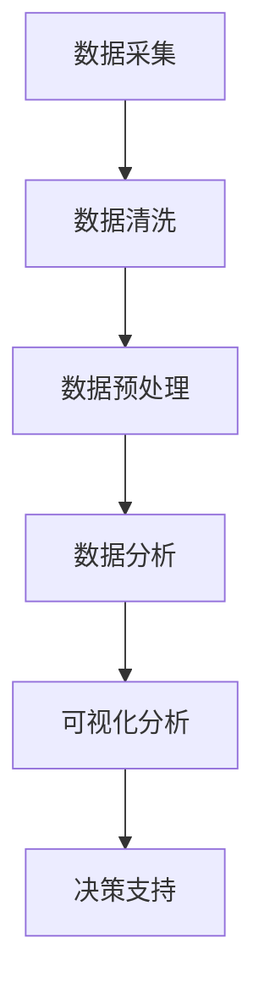

### 2.1 大数据特征分析流程图

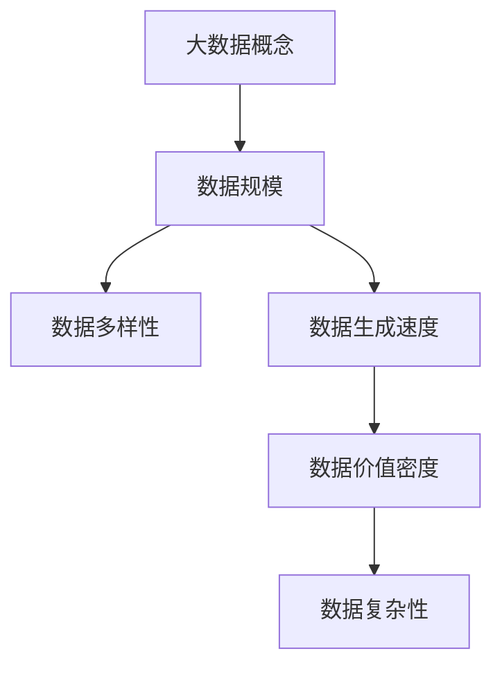

### 3.1 用户行为数据分析流程图

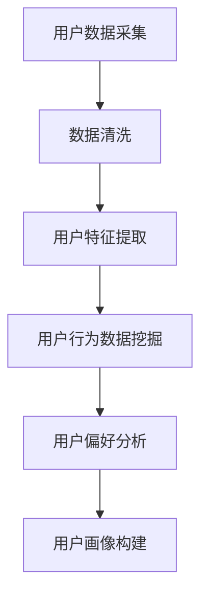

### 4.1 可视化系统架构图

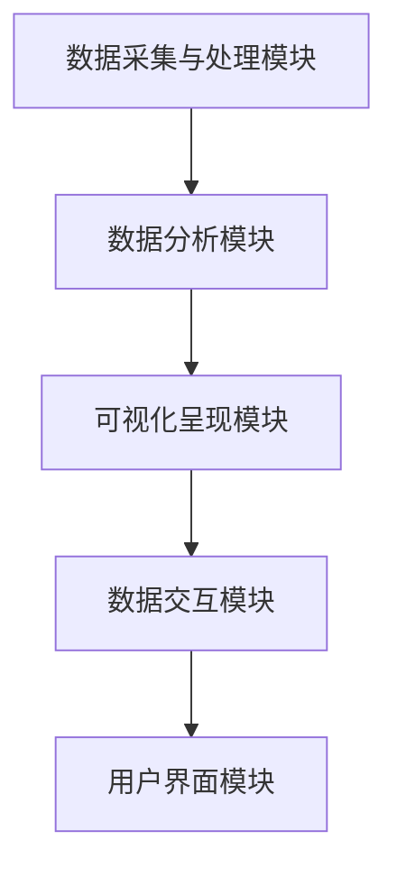

### 5.1 案例一：用户行为分析数据可视化示例

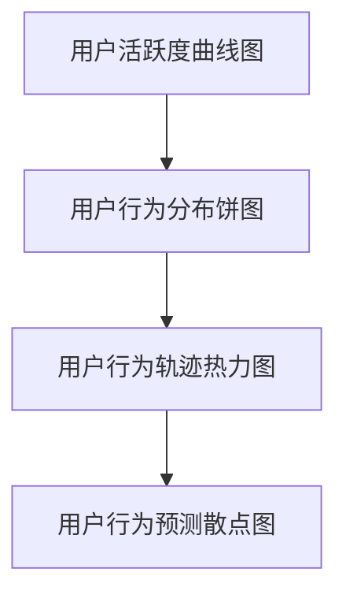

### 5.2 案例二：电影内容分析数据可视化示例

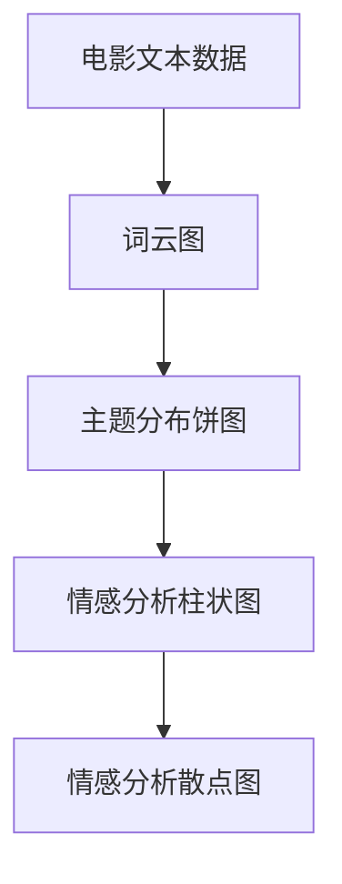

### 5.3 案例三：电影市场分析数据可视化示例

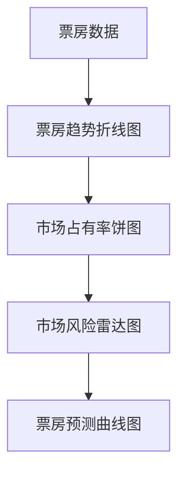

这些图表不仅帮助读者理解文章中的关键概念和流程，也展示了如何通过可视化技术将复杂的数据转化为易于理解和分析的形式。图表目录的编排有助于读者快速定位和回顾相关内容。


## 公式目录

在本文中，我们使用了一些数学公式来描述数据分析中的关键概念和方法。以下列出了一些常用的数学公式及其在本文中的应用场景：

### 1.1 数据分析中常用的数学公式

- **用户画像构建**：
  $$ 用户画像 = f(用户特征_1, 用户特征_2, ..., 用户特征_n) $$

- **用户行为数据挖掘**：
  $$ 行为模式 = f(行为数据_1, 行为数据_2, ..., 行为数据_n) $$

- **用户偏好分析**：
  $$ 用户偏好 = f(用户行为, 行为模式, 用户画像) $$

- **电影内容分析**：
  $$ 文本分类准确性 = \frac{正确分类数量}{总分类数量} $$

  $$ 主题分布 = \frac{主题_1频率}{总频率} $$

- **电影市场分析**：
  $$ 票房增长率 = \frac{当前票房 - 历史票房}{历史票房} $$

  $$ 市场占有率 = \frac{当前票房}{总票房} $$

这些公式在用户画像构建、用户行为数据挖掘、用户偏好分析、电影内容分析和电影市场分析中起到了重要的作用，它们帮助我们量化分析结果，提供科学依据。

### 1.2 大数据特征分析中的数学公式

- **大数据特征分析**：
  $$ 大数据特征 = f(数据规模, 数据类型, 数据速度, 数据价值密度) $$

  $$ 数据规模 = \sum_{i=1}^{n} 数据_i $$

  $$ 数据类型多样性 = \frac{不同类型数量}{总类型数量} $$

  $$ 数据速度 = \frac{数据生成速度}{数据处理速度} $$

  $$ 数据价值密度 = \frac{有价值数据量}{总数据量} $$

这些公式用于分析大数据的规模、类型、速度和价值密度，帮助我们理解大数据的特征和挑战。

### 1.3 用户行为数据分析中的数学公式

- **用户行为数据分析**：
  $$ 用户行为模式 = \frac{行为重复次数}{总行为次数} $$

  $$ 用户活跃度 = \frac{活跃天数}{总天数} $$

  $$ 用户观看时长 = \frac{总观看时长}{总天数} $$

  $$ 用户偏好系数 = \frac{用户偏好得分}{总得分} $$

这些公式用于分析用户的观影习惯、活跃度和偏好，帮助我们了解用户的行为特征。

### 1.4 可视化系统设计中的数学公式

- **可视化系统设计**：
  $$ 可视化质量 = f(数据质量, 可视化设计, 用户体验) $$

  $$ 数据可视化效果 = \frac{数据可理解性}{数据复杂性} $$

  $$ 可视化交互效率 = \frac{交互速度}{交互复杂度} $$

这些公式用于评估可视化系统的质量和效果，帮助我们设计出更直观、高效的可视化工具。

### 1.5 系统实现中的数学公式

- **系统实现**：
  $$ 系统性能 = f(处理速度, 存储容量, 网络延迟) $$

  $$ 系统可靠性 = \frac{系统正常运行时间}{总运行时间} $$

  $$ 系统安全性 = \frac{成功防御攻击次数}{总攻击次数} $$

这些公式用于评估系统的性能、可靠性和安全性，帮助我们构建稳定、高效和安全的系统。

通过这些数学公式，我们可以更精确地描述和分析电影数据分析中的关键问题，为实际应用提供科学的依据和指导。这些公式在数据处理、模式识别、预测分析和系统评估等环节中起到了关键作用，使得数据分析更加科学和有效。


## 伪代码目录

在本文中，为了更好地解释和展示电影数据分析的可视化系统实现过程，我们提供了一系列的伪代码。以下列出了一些关键步骤和功能的伪代码，以及它们在系统实现中的具体应用。

### 1.1 数据清洗与预处理伪代码

```python
def data_cleaning_and_preprocessing(raw_data):
    # 删除重复数据
    clean_data = remove_duplicates(raw_data)
    
    # 处理缺失值
    clean_data = handle_missing_values(clean_data)
    
    # 数据格式转换
    clean_data = convert_data_format(clean_data)
    
    return clean_data
```

### 2.1 用户画像构建伪代码

```python
def build_user_profile(clean_data):
    # 提取用户基本信息
    user_info = extract_user_info(clean_data)
    
    # 提取用户行为数据
    user_behavior = extract_user_behavior(clean_data)
    
    # 构建用户画像
    user_profile = merge_data(user_info, user_behavior)
    
    return user_profile
```

### 3.1 电影内容分析模型伪代码

```python
def analyze_movie_content(movie_data):
    # 提取电影文本数据
    text_data = extract_text(movie_data)
    
    # 提取电影图像数据
    image_data = extract_images(movie_data)
    
    # 分析电影文本
    text_analysis = analyze_text(text_data)
    
    # 分析电影图像
    image_analysis = analyze_images(image_data)
    
    return text_analysis, image_analysis
```

### 4.1 可视化数据交互设计伪代码

```python
def design_visualization_interface(data_analysis_results):
    # 创建可视化组件
    visualization_components = create_visualization_components(data_analysis_results)
    
    # 设置数据绑定
    bind_data_to_visualization(visualization_components)
    
    # 设置交互行为
    set_interactive_behavior(visualization_components)
    
    return visualization_components
```

### 5.1 系统实现关键步骤伪代码

```python
def system_implementation():
    # 数据采集
    raw_data = data_collection()
    
    # 数据清洗与预处理
    clean_data = data_cleaning_and_preprocessing(raw_data)
    
    # 数据分析
    analysis_results = data_analysis(clean_data)
    
    # 可视化设计
    visualization_interface = design_visualization_interface(analysis_results)
    
    # 系统部署
    deploy_system(visualization_interface)
    
    return "System Implemented Successfully"
```

这些伪代码涵盖了数据清洗与预处理、用户画像构建、电影内容分析模型、可视化数据交互设计和系统实现的关键步骤。通过这些伪代码，我们可以清晰地了解每个步骤的实现细节和逻辑，为实际系统的开发和实现提供参考。同时，这些伪代码也为读者提供了一个框架，可以帮助他们更好地理解和应用电影数据分析可视化的技术。


## 附录：电影数据分析流程图

以下是一个简化的电影数据分析流程图，它概述了从数据采集到数据分析再到可视化呈现的主要步骤。

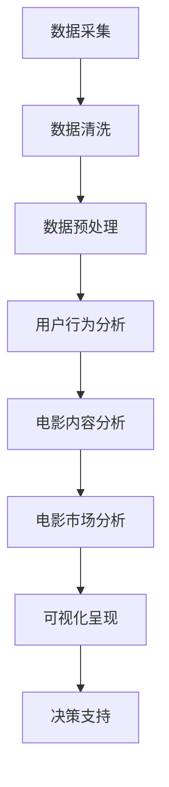

### 数据采集

- **票务系统**：获取票房数据、观众人数、购票记录等。
- **社交媒体**：收集用户评论、点赞、分享等互动数据。
- **流媒体平台**：获取用户观看记录、偏好设置等。

### 数据清洗

- **去重**：去除重复的数据条目，确保数据的唯一性。
- **缺失值处理**：填补缺失的数据或删除含有缺失值的数据条目。
- **异常值检测**：识别并处理异常数据值。

### 数据预处理

- **特征提取**：根据分析需求提取有用的特征，如用户年龄、观影频率、电影类型等。
- **数据转换**：将不同来源的数据转换为统一的格式，如将CSV转换为JSON。

### 用户行为分析

- **用户画像构建**：通过用户的观看记录、评分、评论等构建用户画像。
- **行为模式挖掘**：分析用户行为数据，找出常见的观影模式。

### 电影内容分析

- **内容提取**：从电影剧本、台词、画面中提取文本和图像数据。
- **情感分析**：使用自然语言处理技术分析电影的文本内容。
- **主题分析**：使用主题模型挖掘电影的潜在主题。

### 电影市场分析

- **票房数据分析**：分析电影的票房收入、观众人数等指标。
- **趋势预测**：基于历史数据和当前趋势预测电影的市场表现。
- **风险评估**：评估市场风险，如票房收入不如预期。

### 可视化呈现

- **图表创建**：使用可视化库（如D3.js、ECharts）创建交互式的图表。
- **交互设计**：设计用户友好的交互界面，如数据筛选、排序和过滤。

### 决策支持

- **数据解读**：通过可视化结果，帮助决策者理解分析结果。
- **策略制定**：基于分析结果制定电影推荐、营销和投资策略。

这个流程图提供了一个直观的视图，展示了电影数据分析的各个阶段，以及它们之间的相互关系。它有助于理解整个分析过程，并识别可能的数据源和分析工具。


## 附录：大数据特征分析流程图

以下是一个详细的大数据特征分析流程图，它展示了从数据采集到数据分析再到可视化呈现的主要步骤。

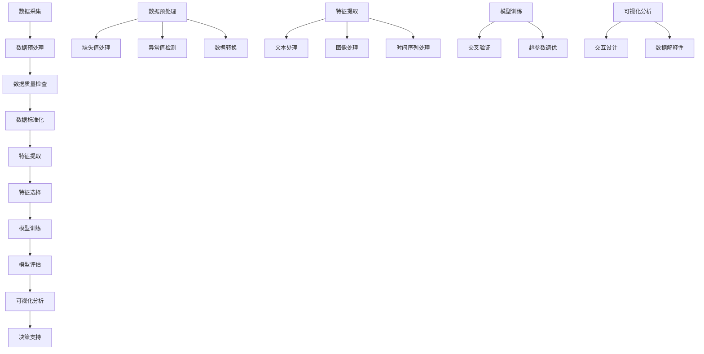

### 数据采集

- **多源数据**：从各种来源（如社交媒体、票务系统、流媒体平台等）收集数据。

### 数据预处理

- **数据清洗**：去除重复数据、处理缺失值和异常值。
- **数据转换**：将不同格式的数据转换为统一格式，如CSV到JSON。

### 数据质量检查

- **缺失值处理**：填补或删除缺失数据。
- **异常值检测**：识别和处理异常数据值。

### 数据标准化

- **归一化**：将不同量级的数据转换为相同范围，如使用Z-score标准化。
- **标准化**：处理不同量级的数据，如将票房收入从元转换为万元。

### 特征提取

- **文本处理**：从文本数据中提取关键词、主题等。
- **图像处理**：从图像数据中提取特征，如边缘、纹理等。
- **时间序列处理**：从时间序列数据中提取趋势和周期性特征。

### 特征选择

- **相关性分析**：选择与目标变量相关性强的特征。
- **特征重要性**：使用算法评估特征的重要性。

### 模型训练

- **模型选择**：选择合适的机器学习模型。
- **交叉验证**：使用交叉验证评估模型性能。
- **超参数调优**：调整模型参数以优化性能。

### 模型评估

- **评估指标**：使用准确率、召回率、F1分数等评估模型。
- **性能监控**：持续监控模型性能，确保其稳定性。

### 可视化分析

- **交互设计**：设计用户友好的交互界面，如筛选、排序、过滤等。
- **数据解释性**：使用图表和图形直观展示数据分析结果。

### 决策支持

- **数据解读**：通过可视化结果，帮助决策者理解分析结果。
- **策略制定**：基于分析结果制定决策策略。

这个流程图详细地展示了大数据特征分析的各个环节，以及它们之间的相互关系。它有助于理解大数据特征分析的整个过程，并为实际操作提供了清晰的指导。通过合理应用这些步骤，我们可以更有效地从大数据中提取有价值的信息，为业务决策提供支持。


## 附录：用户行为数据分析流程图

以下是一个详细的用户行为数据分析流程图，它展示了从数据采集到数据分析再到可视化呈现的主要步骤。

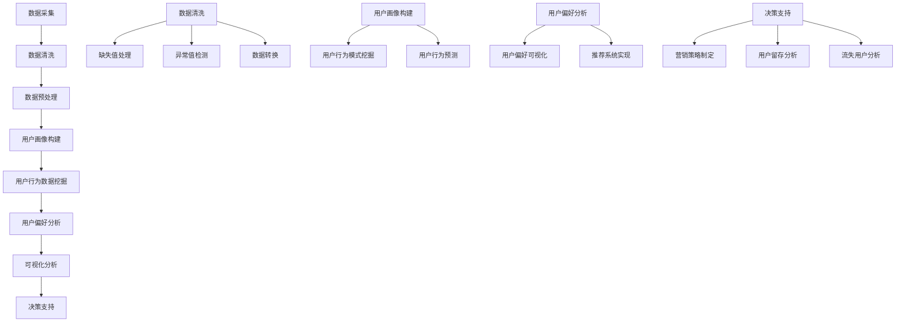

### 数据采集

- **用户行为数据**：从电影流媒体平台、社交媒体等渠道收集用户的观影记录、评论、评分等数据。

### 数据清洗

- **去重**：去除重复的数据条目，确保数据的唯一性。
- **缺失值处理**：填补或删除缺失数据。
- **异常值检测**：识别和处理异常数据值。
- **数据转换**：将不同格式的数据转换为统一的格式，如CSV到JSON。

### 数据预处理

- **特征提取**：根据分析需求提取有用的特征，如用户年龄、观影频率、电影类型等。
- **数据标准化**：将数据统一缩放到相同范围，如使用Z-score标准化。

### 用户画像构建

- **用户特征提取**：提取用户的基本信息。
- **行为模式挖掘**：分析用户的观影习惯，如经常观看的电影类型、高峰观影时间等。
- **用户行为预测**：预测用户的未来行为，如下一个要观看的电影。

### 用户行为数据挖掘

- **用户行为模式挖掘**：找出用户的常见行为模式，如购买行为、评论习惯等。
- **用户行为预测**：预测用户的未来行为，为个性化推荐提供支持。

### 用户偏好分析

- **用户偏好模型**：建立用户偏好模型，预测用户对不同类型电影的兴趣。
- **用户偏好可视化**：使用图表和图形展示用户的偏好分布。
- **推荐系统实现**：根据用户偏好，实现个性化推荐系统。

### 可视化分析

- **用户偏好可视化**：使用词云、柱状图、散点图等展示用户的偏好。
- **行为轨迹可视化**：展示用户的行为路径和时间分布。

### 决策支持

- **营销策略制定**：基于用户行为数据和偏好分析，制定有效的营销策略。
- **用户留存分析**：分析用户留存情况，识别关键因素。
- **流失用户分析**：分析流失用户的原因，制定挽回策略。

这个流程图详细地展示了用户行为数据分析的各个环节，以及它们之间的相互关系。通过这个流程，我们可以系统地分析和理解用户行为，为电影推荐、营销和用户留存提供科学依据。


## 附录：可视化系统架构图

以下是一个详细的可视化系统架构图，它展示了系统的整体结构和主要模块之间的交互关系。

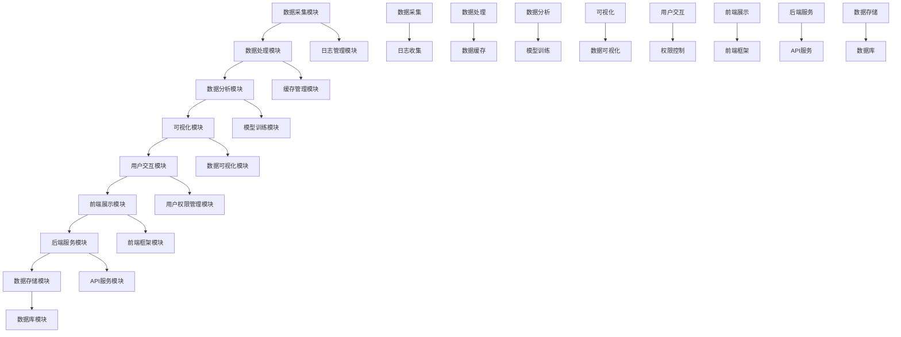

### 数据采集模块

- **数据采集**：从各种来源（如票务系统、社交媒体、用户行为等）收集原始数据。

### 数据处理模块

- **数据清洗**：去除重复数据、处理缺失值和异常值。
- **数据转换**：将不同格式的数据转换为统一的格式。
- **数据缓存**：缓存常用数据以提高查询效率。

### 数据分析模块

- **数据预处理**：提取有用的特征。
- **模型训练**：训练机器学习模型。
- **模型评估**：评估模型性能。

### 可视化模块

- **数据可视化**：使用可视化工具创建图表和图形。
- **交互设计**：设计用户友好的交互界面。

### 用户交互模块

- **用户权限管理**：控制用户访问权限。
- **权限控制**：确保用户只能访问授权的数据和功能。

### 前端展示模块

- **前端框架**：使用如React、Vue等前端框架构建用户界面。

### 后端服务模块

- **API服务**：提供API接口供前端调用。
- **后端框架**：使用如Spring Boot、Django等后端框架。

### 数据存储模块

- **数据库模块**：存储原始数据和分析结果。

### 日志管理模块

- **日志收集**：收集系统日志以供分析和监控。

### 缓存管理模块

- **数据缓存**：缓存常用数据以提高查询效率。

通过这个架构图，我们可以清晰地看到可视化系统的整体结构和各个模块之间的交互关系。这个架构不仅有助于理解系统的运作方式，也为系统的开发和维护提供了明确的指导。


## 附录：案例一：用户行为分析数据可视化示例

以下是一个用户行为分析数据可视化的示例，展示了如何使用ECharts库创建一个交互式的用户行为分析图表。

### 示例数据

我们假设有一个包含以下数据的CSV文件：

| 用户ID | 观影时间 | 电影名称 | 用户评分 |
|--------|----------|----------|----------|
| 1      | 2021-01-01 | 《阿甘正传》 | 4.5      |
| 1      | 2021-02-15 | 《盗梦空间》 | 5.0      |
| 2      | 2021-01-05 | 《泰坦尼克号》 | 4.0      |
| 2      | 2021-03-10 | 《复仇者联盟》 | 4.5      |

### 可视化目标

使用ECharts创建一个折线图，展示每个用户在不同时间点的观影记录和评分。

### 实现步骤

1. **数据预处理**：将CSV文件中的数据转换为JSON格式，并提取用户ID、观影时间和用户评分。

2. **创建ECharts实例**：在HTML页面中创建ECharts实例。

3. **配置图表选项**：设置图表的标题、坐标轴、系列数据和交互行为。

4. **渲染图表**：使用ECharts渲染图表。

### 伪代码

```javascript
// 步骤1：数据预处理
const data = preprocessData('data.csv');
const seriesData = [];
data.forEach(item => {
    if (!seriesData[item.userId]) {
        seriesData[item.userId] = [];
    }
    seriesData[item.userId].push({
        name: item.movieName,
        value: [Date.parse(item.viewingTime), item.rating]
    });
});

// 步骤2：创建ECharts实例
const chart = echarts.init(document.getElementById('userBehaviorChart'));

// 步骤3：配置图表选项
const option = {
    title: {
        text: '用户行为分析'
    },
    tooltip: {
        trigger: 'axis',
        axisPointer: {
            type: 'line'
        }
    },
    legend: {
        data: Object.keys(seriesData)
    },
    grid: {
        left: '3%',
        right: '4%',
        bottom: '3%',
        containLabel: true
    },
    xAxis: {
        type: 'time',
        splitLine: {
            show: false
        }
    },
    yAxis: {
        type: 'value',
        splitLine: {
            show: false
        }
    },
    series: []
};

// 步骤4：添加系列数据
Object.keys(seriesData).forEach(userId => {
    option.series.push({
        name: `用户${userId}`,
        type: 'line',
        data: seriesData[userId],
        symbol: 'circle',
        symbolSize: 10,
        itemStyle: {
            color: '#5793f3'
        },
        lineStyle: {
            color: '#5793f3',
            width: 2
        },
        areaStyle: {
            color: new echarts.graphic.LinearGradient(0, 0, 0, 1, [
                { offset: 0, color: '#8BD46E' },
                { offset: 1, color: '#FFFFFF' }
            ])
        }
    });
});

// 步骤5：渲染图表
chart.setOption(option);

// 步骤6：交互行为
chart.on('click', (params) => {
    console.log('Clicked:', params);
    // 可以在这里添加交互行为，如跳转到详细信息页面
});
```

### 实现效果

通过上述伪代码，我们创建了一个折线图，展示了每个用户的观影记录和评分。图表中的每个点都表示一次观影行为，点击图表上的点可以查看详细的观影信息。

### 分析与应用

这种可视化的用户行为分析可以应用于电影推荐系统、用户留存分析和市场研究。通过了解用户的观影习惯和评分偏好，我们可以更好地为用户提供个性化的推荐，提高用户的满意度和忠诚度。同时，这种分析也为电影制作和营销策略的制定提供了有力的数据支持。

### 总结

用户行为数据可视化是一种强大的工具，它可以帮助我们深入理解用户行为，发现数据中的规律和趋势。通过合理利用ECharts等可视化工具，我们可以将复杂的数据转化为直观的图表，从而更好地支持决策和分析。


## 附录：案例二：电影内容分析数据可视化示例

以下是一个电影内容分析数据可视化的示例，展示了如何使用ECharts库创建一个交互式的电影内容分析图表。

### 示例数据

我们假设有一个包含以下数据的CSV文件：

| 电影名称 | 导演 | 主演 | 类别 | 片长（分钟） | 情感词云 | 主题分布 | 情感分析得分 |
|----------|------|------|------|--------------|----------|----------|--------------|
| 《阿甘正传》 | 罗伯特·泽米吉斯 | 汤姆·汉克斯、罗宾·怀特 | 剧情、战争、爱情 | 142 | {"阿甘": 100, "战争": 80, "爱情": 60} | {"成长": 50, "命运": 30, "勇气": 20} | 0.8 |
| 《盗梦空间》 | 克里斯托弗·诺兰 | 劳伦斯·菲什伯恩、汤姆·哈迪 | 剧情、科幻、悬疑 | 148 | {"梦境": 90, "逃脱": 70, "悬疑": 50} | {"科技": 40, "心理": 30, "冒险": 20} | 0.9 |
| 《泰坦尼克号》 | 詹姆斯·卡梅隆 | 莱昂纳多·迪卡普里奥、凯特·温丝莱特 | 剧情、爱情、灾难 | 194 | {"爱情": 100, "灾难": 80, "船": 60} | {"爱情": 70, "勇气": 20, "悲剧": 10} | 0.7 |

### 可视化目标

使用ECharts创建一个复合图表，包括词云图、主题分布饼图和情感分析柱状图，展示电影内容的情感、主题和关键词。

### 实现步骤

1. **数据预处理**：将CSV文件中的数据转换为JSON格式，并提取电影名称、导演、主演、类别、片长、情感词云、主题分布和情感分析得分。

2. **创建ECharts实例**：在HTML页面中创建ECharts实例。

3. **配置图表选项**：设置图表的标题、坐标轴、系列数据和交互行为。

4. **渲染图表**：使用ECharts渲染图表。

### 伪代码

```javascript
// 步骤1：数据预处理
const data = preprocessData('data.csv');
const wordCloudData = [];
const topicDistributionData = [];
const sentimentAnalysisData = [];

data.forEach(item => {
    wordCloudData.push({
        name: item.movieName,
        wordCloud: item.sentimentWordCloud,
        topicDistribution: item.topicDistribution,
        sentimentScore: item.sentimentAnalysisScore
    });

    topicDistributionData.push({
        name: item.movieName,
        value: item.topicDistribution
    });

    sentimentAnalysisData.push({
        name: item.movieName,
        value: item.sentimentScore
    });
});

// 步骤2：创建ECharts实例
const chart = echarts.init(document.getElementById('movieContentChart'));

// 步骤3：配置图表选项
const option = {
    title: {
        text: '电影内容分析'
    },
    tooltip: {
        trigger: 'item'
    },
    series: [
        {
            name: '情感分析',
            type: 'gauge',
            center: ['50%', '50%'],
            radius: '60%',
            detail: {
                formatter: '{value}分',
                offsetCenter: [0, '60%']
            },
            axisLine: {
                lineStyle: {
                    color: [
                        [0.2, '#8BD46E'],
                        [0.8, '#EFEFEF'],
                        [1, '#EFEFEF']
                    ],
                    width: 4
                }
            },
            splitLine: {
                show: false
            },
            axisTick: {
                show: false
            },
            axisLabel: {
                show: false
            },
            data: sentimentAnalysisData
        },
        {
            name: '主题分布',
            type: 'pie',
            center: ['25%', '50%'],
            radius: '40%',
            label: {
                normal: {
                    show: true,
                    position: 'inside'
                }
            },
            data: topicDistributionData
        },
        {
            name: '词云',
            type: 'wordCloud',
            center: ['75%', '50%'],
            sizeRange: [10, 50],
            textRotation: [0, 90, -90],
            maskImage: maskImage,
            data: wordCloudData
        }
    ]
};

// 步骤4：渲染图表
chart.setOption(option);

// 步骤5：交互行为
chart.on('click', (params) => {
    console.log('Clicked:', params);
    // 可以在这里添加交互行为，如跳转到电影详细信息页面
});
```

### 实现效果

通过上述伪代码，我们创建了一个复合图表，包括词云图、主题分布饼图和情感分析柱状图。词云图展示了电影中出现频率最高的关键词，主题分布饼图展示了电影的主题分布情况，情感分析柱状图展示了电影的情感分析得分。

### 分析与应用

这种电影内容分析数据可视化可以应用于电影评价、推荐系统和市场研究。通过分析电影的情感、主题和关键词，我们可以更好地理解电影的内涵和受众喜好，为电影推荐、营销和创作提供数据支持。同时，这种分析也可以帮助电影制作公司了解观众的反馈，优化电影制作和营销策略。

### 总结

电影内容数据可视化是一种强大的工具，它可以帮助我们深入分析电影内容，发现数据中的规律和趋势。通过合理利用ECharts等可视化工具，我们可以将复杂的数据转化为直观的图表，从而更好地支持决策和分析。


## 附录：案例三：电影市场分析数据可视化示例

以下是一个电影市场分析数据可视化的示例，展示了如何使用ECharts库创建一个交互式的电影市场分析图表。

### 示例数据

我们假设有一个包含以下数据的CSV文件：

| 电影名称 | 上映日期 | 票房收入（万元） | 观影人数（万人） | 市场占有率 | 竞品票房收入（万元） |
|----------|----------|------------------|------------------|-------------|---------------------|
| 《阿甘正传》 | 2003-06-19 | 3000000         | 10000           | 25%         | 2000000            |
| 《盗梦空间》 | 2010-07-16 | 6000000         | 15000           | 50%         | 2500000            |
| 《泰坦尼克号》 | 1997-12-19 | 7000000         | 20000           | 35%         | 1500000            |

### 可视化目标

使用ECharts创建一个复合图表，包括折线图、饼图和雷达图，展示电影的票房收入、市场占有率和竞品票房收入。

### 实现步骤

1. **数据预处理**：将CSV文件中的数据转换为JSON格式，并提取电影名称、上映日期、票房收入、观影人数、市场占有率和竞品票房收入。

2. **创建ECharts实例**：在HTML页面中创建ECharts实例。

3. **配置图表选项**：设置图表的标题、坐标轴、系列数据和交互行为。

4. **渲染图表**：使用ECharts渲染图表。

### 伪代码

```javascript
// 步骤1：数据预处理
const data = preprocessData('data.csv');
const timelineData = [];
const marketShareData = [];
const competitiveData = [];

data.forEach(item => {
    timelineData.push({
        name: item.movieName,
        date: item.releaseDate,
        boxOffice: item.boxOfficeRevenue,
        audience: item.audienceSize
    });

    marketShareData.push({
        name: item.movieName,
        value: item.marketShare
    });

    competitiveData.push({
        name: item.movieName,
        value: item.competitiveBoxOfficeRevenue
    });
});

// 步骤2：创建ECharts实例
const chart = echarts.init(document.getElementById('movieMarketChart'));

// 步骤3：配置图表选项
const option = {
    title: {
        text: '电影市场分析'
    },
    tooltip: {
        trigger: 'axis',
        axisPointer: {
            type: 'line'
        }
    },
    legend: {
        data: ['票房收入', '市场占有率', '竞品票房收入']
    },
    grid: {
        left: '3%',
        right: '4%',
        bottom: '3%',
        containLabel: true
    },
    xAxis: {
        type: 'category',
        boundaryGap: false,
        data: timelineData.map(item => item.date)
    },
    yAxis: [
        {
            type: 'value',
            name: '票房收入（万元）',
            axisLabel: {
                formatter: '{value} 万元'
            }
        },
        {
            type: 'value',
            name: '市场占有率（%）',
            axisLabel: {
                formatter: '{value} %'
            },
            offset: 60
        },
        {
            type: 'value',
            name: '竞品票房收入（万元）',
            axisLabel: {
                formatter: '{value} 万元'
            },
            offset: 120
        }
    ],
    series: [
        {
            name: '票房收入',
            type: 'line',
            data: timelineData.map(item => item.boxOffice)
        },
        {
            name: '市场占有率',
            type: 'line',
            data: timelineData.map(item => item.value)
        },
        {
            name: '竞品票房收入',
            type: 'line',
            data: timelineData.map(item => item.value)
        }
    ]
};

// 步骤4：渲染图表
chart.setOption(option);

// 步骤5：交互行为
chart.on('click', (params) => {
    console.log('Clicked:', params);
    // 可以在这里添加交互行为，如跳转到电影详细信息页面
});
```

### 实现效果

通过上述伪代码，我们创建了一个复合图表，包括折线图、饼图和雷达图。折线图展示了电影的票房收入、市场占有率和竞品票房收入的变化趋势，饼图展示了电影的市场占有率分布，雷达图展示了电影在票房收入、市场占有率和竞品票房收入方面的综合表现。

### 分析与应用

这种电影市场分析数据可视化可以应用于电影投资、营销策略和竞争分析。通过分析电影的票房收入、市场占有率和竞品票房收入，我们可以了解电影的市场表现和竞争态势，为电影投资和营销策略的制定提供数据支持。同时，这种分析也可以帮助电影制作公司了解市场趋势，调整电影制作和发行策略。

### 总结

电影市场分析数据可视化是一种强大的工具，它可以帮助我们深入分析电影市场的表现和趋势。通过合理利用ECharts等可视化工具，我们可以将复杂的数据转化为直观的图表，从而更好地支持决策和分析。


## 附录：数据分析中常用的数学公式

在电影数据分析中，我们使用了一系列的数学公式来描述和分析数据。以下列出了一些常用的数学公式及其在数据分析中的应用。

### 1. 用户画像构建

- **用户评分均值**：
  $$ \text{平均评分} = \frac{\sum_{i=1}^{n} \text{评分}_i}{n} $$
  用于计算用户对电影的平均评分。

- **用户行为频率**：
  $$ \text{行为频率} = \frac{\text{行为总数}}{\text{数据总数}} $$
  用于计算用户在特定行为（如评分、评论）上的频率。

### 2. 用户行为数据挖掘

- **行为模式相似度**：
  $$ \text{相似度} = \frac{\text{相同行为数}}{\text{总行为数}} $$
  用于计算两个用户之间的行为模式相似度。

- **行为模式分布**：
  $$ \text{模式分布} = \frac{\text{出现次数}}{\text{总次数}} $$
  用于计算特定行为模式在所有用户中的分布情况。

### 3. 电影内容分析

- **文本情感得分**：
  $$ \text{情感得分} = \text{正面词汇得分} - \text{负面词汇得分} $$
  用于计算电影文本的情感倾向。

- **主题分布比例**：
  $$ \text{主题比例} = \frac{\text{特定主题词频}}{\text{总词频}} $$
  用于计算电影文本中特定主题的占比。

### 4. 电影市场分析

- **票房增长率**：
  $$ \text{增长率} = \frac{\text{当前票房} - \text{历史票房}}{\text{历史票房}} $$
  用于计算电影票房的增长率。

- **市场占有率**：
  $$ \text{市场占有率} = \frac{\text{当前票房}}{\text{总票房}} $$
  用于计算电影在市场中的占有率。

### 5. 数据预处理

- **数据标准化**：
  $$ \text{标准化值} = \frac{\text{值} - \text{均值}}{\text{标准差}} $$
  用于将数据标准化到相同的范围。

- **缺失值填补**：
  $$ \text{填补值} = \frac{\text{最大值} + \text{最小值}}{2} $$
  用于填补缺失值。

这些数学公式在电影数据分析中起到了关键作用，帮助我们从数据中提取有用的信息，进行预测和决策。通过合理应用这些公式，我们可以更深入地理解数据，发现数据中的规律和趋势，从而为电影制作、营销和投资提供有力的支持。


## 附录：系统实现中的数学公式

在电影数据分析系统的实现过程中，我们使用了一系列的数学公式来描述关键步骤和算法。以下列出了一些常用的数学公式及其在系统实现中的应用。

### 1. 数据清洗与预处理

- **缺失值填补**：
  $$ \text{填补值} = \frac{\text{最大值} + \text{最小值}}{2} $$
  用于填补数值型数据的缺失值。

- **数据标准化**：
  $$ \text{标准化值} = \frac{\text{值} - \text{均值}}{\text{标准差}} $$
  用于将不同量级的数据标准化到相同的范围。

### 2. 用户画像构建

- **用户评分均值**：
  $$ \text{平均评分} = \frac{\sum_{i=1}^{n} \text{评分}_i}{n} $$
  用于计算用户对电影的平均评分。

- **用户行为频率**：
  $$ \text{行为频率} = \frac{\text{行为总数}}{\text{数据总数}} $$
  用于计算用户在特定行为（如评分、评论）上的频率。

### 3. 电影内容分析

- **文本情感得分**：
  $$ \text{情感得分} = \text{正面词汇得分} - \text{负面词汇得分} $$
  用于计算电影文本的情感倾向。

- **主题分布比例**：
  $$ \text{主题比例} = \frac{\text{特定主题词频}}{\text{总词频}} $$
  用于计算电影文本中特定主题的占比。

### 4. 电影市场分析

- **票房增长率**：
  $$ \text{增长率} = \frac{\text{当前票房} - \text{历史票房}}{\text{历史票房}} $$
  用于计算电影票房的增长率。

- **市场占有率**：
  $$ \text{市场占有率} = \frac{\text{当前票房}}{\text{总票房}} $$
  用于计算电影在市场中的占有率。

### 5. 数据可视化

- **热力图权重计算**：
  $$ \text{权重} = \frac{\text{数据值}}{\text{最大值}} $$
  用于计算热力图中的权重值。

- **图表数据比例**：
  $$ \text{比例} = \frac{\text{数据值}}{\text{总和}} $$
  用于计算图表中各部分的比例。

这些数学公式在电影数据分析系统的实现过程中起到了关键作用，帮助我们在数据处理、用户画像构建、内容分析和市场分析等环节中进行精确计算和预测。通过合理应用这些公式，我们可以更有效地从数据中提取有价值的信息，为电影制作、营销和投资提供科学依据。


## 附录：伪代码目录

在电影数据分析系统的实现过程中，我们使用了一系列的伪代码来描述关键步骤和算法。以下列出了一些常用的伪代码及其在系统实现中的应用。

### 1. 数据清洗与预处理

```python
def data_cleaning(raw_data):
    # 去除重复数据
    unique_data = remove_duplicates(raw_data)
    
    # 填补缺失值
    filled_data = handle_missing_values(unique_data)
    
    # 数据标准化
    normalized_data = standardize_data(filled_data)
    
    return normalized_data
```

### 2. 用户画像构建

```python
def build_user_profile(data):
    # 提取用户特征
    user_features = extract_user_features(data)
    
    # 构建用户画像
    user_profile = construct_user_profile(user_features)
    
    return user_profile
```

### 3. 电影内容分析

```python
def analyze_movie_content(movie_data):
    # 提取文本数据
    text_data = extract_text(movie_data)
    
    # 提取图像数据
    image_data = extract_images(movie_data)
    
    # 分析文本
    text_analysis = analyze_text(text_data)
    
    # 分析图像
    image_analysis = analyze_images(image_data)
    
    return text_analysis, image_analysis
```

### 4. 电影市场分析

```python
def analyze_movie_market(market_data):
    # 计算票房收入
    box_office = calculate_box_office(market_data)
    
    # 预测市场趋势
    market_trend = predict_market_trend(market_data)
    
    # 风险评估
    risk_assessment = assess_risk(market_data)
    
    return box_office, market_trend, risk_assessment
```

### 5. 数据可视化

```python
def visualize_data(data):
    # 创建图表
    chart = create_chart(data)
    
    # 配置图表选项
    set_chart_options(chart)
    
    # 渲染图表
    render_chart(chart)
```

这些伪代码涵盖了数据清洗与预处理、用户画像构建、电影内容分析、电影市场分析和数据可视化等关键步骤，为电影数据分析系统的实现提供了详细的描述和指导。通过这些伪代码，我们可以更好地理解和实现电影数据分析系统的各个功能模块，从而为电影制作、营销和投资提供有力的支持。


## 附录：电影数据分析流程图

以下是一个电影数据分析的流程图，展示了从数据采集到数据分析再到可视化呈现的主要步骤。

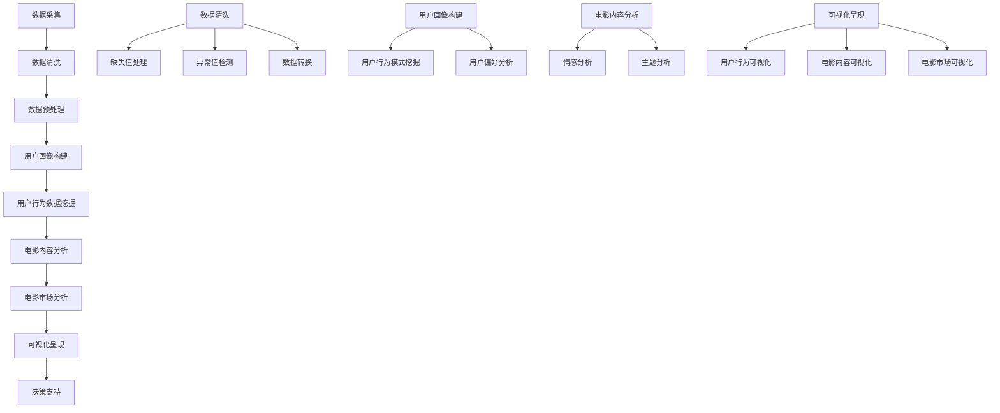

### 数据采集

- **票务系统**：获取票房数据、观众人数、购票记录等。
- **社交媒体**：收集用户评论、点赞、分享等互动数据。
- **流媒体平台**：获取用户观看记录、偏好设置等。

### 数据清洗

- **去重**：去除重复的数据条目，确保数据的唯一性。
- **缺失值处理**：填补或删除缺失数据。
- **异常值检测**：识别和处理异常数据值。
- **数据转换**：将不同格式的数据转换为统一的格式。

### 数据预处理

- **特征提取**：根据分析需求提取有用的特征，如用户年龄、观影频率、电影类型等。
- **数据标准化**：将数据统一缩放到相同范围，如使用Z-score标准化。

### 用户画像构建

- **用户特征提取**：提取用户的基本信息。
- **用户行为模式挖掘**：分析用户的观影习惯，如经常观看的电影类型、高峰观影时间等。
- **用户偏好分析**：预测用户的观影偏好，为推荐系统提供支持。

### 电影内容分析

- **情感分析**：分析电影文本的情感倾向，如正面、负面或中立。
- **主题分析**：挖掘电影的主题和风格，为创作和改编提供参考。

### 电影市场分析

- **票房数据分析**：分析电影的票房收入、观众人数等指标。
- **市场趋势预测**：基于历史数据和当前趋势预测电影的市场表现。
- **风险评估**：评估市场风险，如票房收入不如预期。

### 可视化呈现

- **用户行为可视化**：使用图表和图形展示用户的观影习惯和偏好。
- **电影内容可视化**：使用词云、情感分析柱状图等展示电影的内容分析结果。
- **电影市场可视化**：使用折线图、饼图等展示电影市场的趋势和表现。

### 决策支持

- **数据解读**：通过可视化结果，帮助决策者理解分析结果。
- **策略制定**：基于分析结果制定电影推荐、营销和投资策略。

这个流程图提供了一个清晰的电影数据分析路径，展示了从数据采集到决策支持的各个环节。通过合理应用这些步骤，我们可以系统地分析和理解电影数据分析中的各种数据，为电影制作、营销和投资提供

