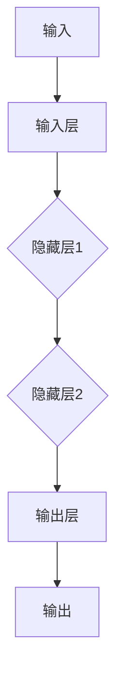
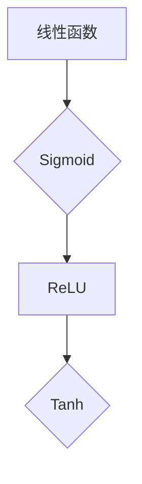

                 

# 基础模型的技术标准与社会治理

## 关键词

基础模型、技术标准、社会治理、数据隐私、模型公平性、应用案例

## 摘要

本文从基础模型的技术标准和社会治理的角度出发，探讨了深度学习模型在人工智能领域的重要性及其面临的挑战。首先，文章介绍了基础模型的概念、发展历程和应用领域，随后详细阐述了神经网络基础、优化算法、数据预处理和数学模型等技术标准。接着，文章分析了基础模型在社会治理中的重要性，包括数据隐私保护和模型公平性，并提出了相应的治理策略。最后，文章通过人脸识别和智能推荐系统的应用案例，展示了基础模型在实际中的应用，并对未来基础模型的发展方向进行了展望。本文旨在为读者提供一个全面而深入的理解，以推动基础模型技术标准的提升和社会治理的完善。

## 第1章：基础模型概述

### 1.1 基础模型的概念与重要性

基础模型（Fundamental Models）是指在人工智能（AI）领域中，通过神经网络（Neural Networks）和深度学习（Deep Learning）技术构建的具有强大学习和推理能力的算法模型。这些模型是现代人工智能的核心，广泛应用于计算机视觉、自然语言处理、语音识别、推荐系统等多个领域。

#### 基础模型的定义

基础模型通常指的是那些具有以下特点的算法：

- **多层结构**：包含多个隐藏层，能够捕捉数据的复杂特征。
- **端到端学习**：从原始数据直接学习到最终输出，无需手工设计特征。
- **参数化**：模型参数数量巨大，能够表示丰富的函数关系。

#### 基础模型在人工智能中的应用

基础模型在人工智能领域有广泛的应用：

- **计算机视觉**：图像分类、目标检测、图像分割等。
- **自然语言处理**：文本分类、机器翻译、情感分析等。
- **语音识别**：语音到文本转换、语音情感分析等。
- **推荐系统**：基于用户行为的商品或内容推荐。
- **游戏AI**：如围棋、国际象棋的智能对手。

#### 基础模型的重要性

基础模型的重要性体现在以下几个方面：

- **学习效率**：能够自动从海量数据中学习到复杂的特征表示，减少了人工特征工程的工作量。
- **泛化能力**：通过多层结构的堆叠，基础模型能够处理高维数据和复杂任务。
- **可扩展性**：基础模型能够轻松扩展到新的任务和数据集，适应不同的应用场景。
- **商业价值**：基础模型的应用推动了人工智能技术的商业化，带来了巨大的经济效益。

### 1.2 基础模型的发展历程

基础模型的发展历程可以分为几个阶段：

- **早期模型**：1950年代到1980年代，以感知机（Perceptron）和多层感知机（MLP）为代表。
- **早期深度学习**：1980年代到1990年代，受限于计算资源和算法的局限性，深度学习研究进展缓慢。
- **深度学习的复兴**：2000年代初，随着计算能力的提升和优化算法的改进，深度学习开始复兴。
- **现代深度学习**：2010年代至今，以卷积神经网络（CNN）、循环神经网络（RNN）、生成对抗网络（GAN）等为代表，深度学习取得了显著的突破。

### 1.3 基础模型的应用领域

基础模型的应用领域非常广泛，主要包括：

- **计算机视觉**：图像分类、目标检测、图像分割等。
  - **图像分类**：如ImageNet竞赛中，深度学习模型在图像分类任务中取得了突破性的成果。
  - **目标检测**：如YOLO、SSD等模型，广泛应用于视频监控、自动驾驶等领域。
  - **图像分割**：如FCN、U-Net等模型，用于医学图像分析、自动驾驶环境感知等。

- **自然语言处理**：文本分类、机器翻译、情感分析等。
  - **文本分类**：如文本情感分析、垃圾邮件过滤等。
  - **机器翻译**：如Google翻译、BERT等模型，在机器翻译领域取得了重大进展。
  - **情感分析**：如情感极性分类、社交媒体情绪分析等。

- **语音识别**：语音到文本转换、语音情感分析等。
  - **语音到文本转换**：如CMU Sphinx、Google语音识别等，广泛应用于语音助手、语音搜索等领域。
  - **语音情感分析**：如分析语音中的情感波动，应用于情感计算、用户体验分析等。

- **推荐系统**：基于用户行为的商品或内容推荐。
  - **推荐系统**：如Netflix推荐、淘宝商品推荐等，通过深度学习技术提高了推荐的准确性和用户体验。

- **游戏AI**：如围棋、国际象棋的智能对手。
  - **围棋AI**：如AlphaGo，通过深度学习和强化学习技术，在围棋领域取得了革命性的成果。

### 第2章：基础模型的核心技术

#### 2.1 神经网络基础

##### 2.1.1 神经网络的结构

神经网络（Neural Network，NN）是深度学习的基础，由大量的神经元（节点）通过有向边（连接）连接而成。神经网络可以分为以下几层：

- **输入层**（Input Layer）：接收外部输入数据。
- **隐藏层**（Hidden Layers）：对输入数据进行处理和变换。
- **输出层**（Output Layer）：输出模型的预测结果。

##### 2.1.2 激活函数

激活函数（Activation Function）是神经网络中的一个重要组成部分，用于引入非线性的特性。以下是一些常用的激活函数：

- **Sigmoid 函数**：\( \sigma(x) = \frac{1}{1 + e^{-x}} \)，输出范围在 \( (0, 1) \)。
- **ReLU 函数**（Rectified Linear Unit）：\( f(x) = \max(0, x) \)，在 \( x > 0 \) 时恒为 1，否则为 0。
- **Tanh 函数**：\( \tanh(x) = \frac{e^x - e^{-x}}{e^x + e^{-x}} \)，输出范围在 \( (-1, 1) \)。

##### 2.1.3 前向传播与反向传播算法

神经网络的主要工作原理包括前向传播（Forward Propagation）和反向传播（Backpropagation）。

- **前向传播**：输入数据从输入层开始，逐层传递到隐藏层，最后传递到输出层。
  ```mermaid
  graph TD
  A[输入] --> B[输入层]
  B --> C{隐藏层1}
  C --> D{隐藏层2}
  D --> E[输出层]
  E --> F[输出]
  ```

- **反向传播**：输出层开始，反向计算各层的梯度，并更新权重。
  ```mermaid
  graph TD
  F[输出误差] --> E[输出层]
  E --> D{隐藏层2}
  D --> C{隐藏层1}
  C --> B[输入层]
  ```

#### 2.2 优化算法

优化算法用于训练神经网络，目的是通过迭代优化模型参数，最小化损失函数。以下是一些常用的优化算法：

- **梯度下降**（Gradient Descent）：通过计算损失函数关于模型参数的梯度，反向更新模型参数。
  ```python
  theta = theta - learning_rate * gradient(J(theta))
  ```

- **动量**（Momentum）：在梯度下降的基础上引入动量项，加速收敛。
  ```python
  velocity = momentum * velocity - learning_rate * gradient(J(theta))
  theta = theta + velocity
  ```

- **Adam**：结合了动量和RMSprop的优点，自适应调整学习率。
  ```python
  m = beta1 * m + (1 - beta1) * gradient(J(theta))
  v = beta2 * v + (1 - beta2) * (gradient(J(theta)) ** 2)
  theta = theta - learning_rate * m / (sqrt(v) + epsilon)
  ```

#### 2.3 数据预处理

数据预处理是训练神经网络前的重要步骤，包括以下几个方面：

- **数据清洗**：处理缺失值、异常值和噪声数据。
- **数据归一化**：将数据缩放到相同的尺度，如使用Min-Max归一化或标准化。
- **数据增强**：通过变换生成更多样化的数据，提高模型的泛化能力。

### 第3章：基础模型的数学模型

#### 3.1 损失函数

损失函数（Loss Function）用于衡量模型预测值与真实值之间的差异，是优化过程中的目标函数。以下是一些常用的损失函数：

- **交叉熵损失函数**（Cross-Entropy Loss）：常用于分类问题，衡量两个概率分布之间的差异。
  ```math
  J(\theta) = -\sum_{i=1}^{n} y_i \log(p_i)
  ```

- **均方误差损失函数**（Mean Squared Error Loss）：常用于回归问题，衡量预测值与真实值之间的差异。
  ```math
  J(\theta) = \frac{1}{2m} \sum_{i=1}^{m} (y_i - \hat{y}_i)^2
  ```

- **对数损失函数**（Log Loss）：是交叉熵损失函数的对数形式，常用于二分类问题。
  ```math
  J(\theta) = -y \log(p) - (1 - y) \log(1 - p)
  ```

#### 3.2 激活函数的数学模型

激活函数（Activation Function）在神经网络中用于引入非线性特性，以下是一些常用的激活函数及其数学模型：

- **Sigmoid 函数**：
  ```math
  \sigma(x) = \frac{1}{1 + e^{-x}}
  ```

- **ReLU 函数**：
  ```math
  ReLU(x) = \max(0, x)
  ```

- **Tanh 函数**：
  ```math
  \tanh(x) = \frac{e^x - e^{-x}}{e^x + e^{-x}}
  ```

#### 3.3 优化算法的数学模型

优化算法（Optimization Algorithm）用于训练神经网络，以下是几种常用优化算法的数学模型：

- **梯度下降**：
  ```math
  \theta_{\text{new}} = \theta_{\text{old}} - \alpha \cdot \nabla_\theta J(\theta)
  ```

- **动量**：
  ```math
  v_t = \beta \cdot v_{t-1} + (1 - \beta) \cdot \nabla_\theta J(\theta)
  \theta_{\text{new}} = \theta_{\text{old}} + v_t
  ```

- **Adam**：
  ```math
  m_t = \beta_1 \cdot m_{t-1} + (1 - \beta_1) \cdot \nabla_\theta J(\theta)
  v_t = \beta_2 \cdot v_{t-1} + (1 - \beta_2) \cdot (\nabla_\theta J(\theta))^2
  \theta_{\text{new}} = \theta_{\text{old}} - \alpha \cdot \frac{m_t}{\sqrt{v_t} + \epsilon}
  ```

### 第4章：基础模型的社会治理

#### 4.1 社会治理的概念与目标

社会治理（Societal Governance）是指社会各种主体通过合作、协调和治理，实现社会秩序、公平和可持续发展的过程。在人工智能领域，社会治理的重要性日益凸显，尤其是在基础模型的应用中。

##### 4.1.1 社会治理的定义

社会治理是指政府、企业、非政府组织和社会公众等各方通过合作、协调和治理，实现社会秩序、公平和可持续发展的过程。在人工智能领域，社会治理主要关注以下几个方面：

- **技术标准**：制定和执行技术标准，确保基础模型的可靠性和有效性。
- **数据隐私**：保护用户数据的隐私和安全性。
- **模型公平性**：确保基础模型的应用不会加剧社会不平等。
- **伦理和道德**：确保人工智能技术的应用符合社会伦理和道德标准。

##### 4.1.2 社会治理的目标

社会治理的目标主要包括以下几个方面：

- **公平性**：确保基础模型的应用不会加剧社会不平等，如种族、性别、年龄等方面的公平性。
- **透明度**：提高基础模型的可解释性，使其决策过程透明，便于公众监督。
- **可扩展性**：使基础模型能够适应不同场景和需求，具有灵活性和可扩展性。
- **可访问性**：确保基础模型的应用对所有人可及，尤其是贫困地区和弱势群体。

##### 4.1.3 社会治理的重要性

社会治理在人工智能领域的重要性体现在以下几个方面：

- **保障模型的安全性和稳定性**：确保基础模型的应用不会带来安全风险，如数据泄露、模型滥用等。
- **提高模型的透明度和可信度**：增强公众对基础模型的信任，提高模型的透明度和可信度。
- **促进人工智能技术的可持续发展**：确保基础模型的应用符合社会道德和伦理标准，推动人工智能技术的可持续发展。

#### 4.2 数据隐私保护

数据隐私保护（Data Privacy Protection）是社会治理的重要方面之一。随着人工智能技术的发展，数据隐私问题日益突出，如何有效保护用户数据隐私成为人工智能领域的重要挑战。

##### 4.2.1 数据隐私保护的重要性

数据隐私保护的重要性体现在以下几个方面：

- **个人信息保护**：防止个人信息被非法获取、泄露或滥用。
- **信任建立**：增强用户对人工智能技术的信任，促进人工智能技术的广泛应用。
- **法律法规要求**：符合相关法律法规，如《通用数据保护条例》（GDPR）等。

##### 4.2.2 数据隐私保护的方法

数据隐私保护的方法主要包括以下几个方面：

- **数据加密**：使用加密技术保护数据的机密性，防止数据在传输和存储过程中被窃取。
- **匿名化处理**：通过匿名化处理，将个人信息与数据分离，降低个人隐私泄露的风险。
- **差分隐私**：在数据处理过程中添加噪声，确保个体数据隐私的同时，保持数据的总体统计特性。
- **同态加密**：在加密状态下对数据进行计算，保护数据隐私。

##### 4.2.3 数据隐私保护的案例分析

以下是一些数据隐私保护的案例：

- **谷歌的隐私沙箱**：谷歌通过隐私沙箱技术，保护用户数据隐私，确保用户数据在应用中的安全性和隐私性。
- **Facebook的数据泄露事件**：2018年，Facebook发生了大规模数据泄露事件，导致大量用户数据被泄露，引发了社会对数据隐私保护的广泛关注。

#### 4.3 模型公平性

模型公平性（Model Fairness）是社会治理的另一个重要方面，旨在确保基础模型的应用不会加剧社会不平等。模型公平性涉及多个方面，包括种族、性别、年龄等。

##### 4.3.1 模型公平性的定义

模型公平性是指基础模型在不同群体（如种族、性别、年龄等）中的表现应具有一致性，不应因群体的不同而存在不公平现象。具体来说，模型公平性包括以下几个方面：

- **预测公平性**：模型对相同输入数据应产生相同的预测结果，不应因输入数据的来源或背景而有所不同。
- **数据公平性**：模型训练过程中应包含多样化的数据，确保模型在不同群体中的表现具有一致性。
- **解释公平性**：模型的决策过程应透明，便于用户理解，确保模型在不同群体中的决策具有一致性。

##### 4.3.2 模型公平性的重要性

模型公平性的重要性体现在以下几个方面：

- **社会公正**：确保基础模型的应用不会加剧社会不平等，维护社会公正。
- **用户信任**：提高用户对基础模型的信任，促进人工智能技术的广泛应用。
- **法律法规要求**：符合相关法律法规，如《禁止人工智能歧视法》等。

##### 4.3.3 模型公平性的评估方法

以下是一些常用的模型公平性评估方法：

- **统计方法**：通过统计指标评估模型对不同群体的表现，如统计偏差、差异度等。
- **对比实验方法**：通过对比实验评估模型对不同群体的表现，如A/B测试等。
- **可视化方法**：通过可视化工具展示模型对数据分布的影响，如决策图、数据分布图等。

### 第5章：基础模型的应用案例

#### 5.1 案例一：人脸识别系统

##### 5.1.1 案例背景

人脸识别系统是一种基于人工智能技术的生物识别系统，通过分析人脸图像或视频，自动识别和验证个人身份。人脸识别技术广泛应用于门禁系统、安防监控、手机解锁等领域。

##### 5.1.2 模型设计

人脸识别系统的模型设计主要包括以下几个部分：

- **人脸检测**：使用卷积神经网络（CNN）进行人脸检测，识别图像中的人脸区域。
- **特征提取**：使用深度学习模型提取人脸图像的特征，如使用Siamese网络进行特征提取。
- **模型训练**：使用大量人脸图像和标签进行模型训练，优化模型参数。
- **模型评估**：使用测试集评估模型性能，如准确率、召回率等指标。

##### 5.1.3 模型实现

人脸识别系统的模型实现主要包括以下几个步骤：

- **数据收集**：收集大量人脸图像和标签，用于模型训练和测试。
- **数据预处理**：对收集的数据进行预处理，包括数据清洗、归一化、数据增强等。
- **模型训练**：使用深度学习框架（如TensorFlow、PyTorch）进行模型训练，优化模型参数。
- **模型部署**：将训练好的模型部署到实际应用场景中，如门禁系统、手机解锁等。

#### 5.2 案例二：智能推荐系统

##### 5.2.1 案例背景

智能推荐系统是一种基于人工智能技术的推荐系统，通过分析用户行为和兴趣，为用户推荐个性化的商品、内容和服务。智能推荐系统广泛应用于电子商务、视频流媒体、新闻客户端等领域。

##### 5.2.2 模型设计

智能推荐系统的模型设计主要包括以下几个部分：

- **用户行为分析**：使用深度学习模型分析用户的历史行为，如浏览记录、购买记录等。
- **物品特征提取**：使用深度学习模型提取物品的特征，如商品属性、视频标签等。
- **模型训练**：使用用户行为和物品特征训练推荐模型，优化模型参数。
- **模型评估**：使用评估指标（如点击率、购买率等）评估模型性能。

##### 5.2.3 模型实现

智能推荐系统的模型实现主要包括以下几个步骤：

- **数据收集**：收集用户的浏览记录、购买记录和物品属性等数据。
- **数据预处理**：对收集的数据进行预处理，包括数据清洗、归一化、特征提取等。
- **模型训练**：使用深度学习框架（如TensorFlow、PyTorch）进行模型训练，优化模型参数。
- **模型部署**：将训练好的模型部署到实际应用场景中，如电子商务平台、视频流媒体等。

### 第6章：基础模型的未来发展

#### 6.1 新兴技术的展望

随着人工智能技术的不断发展，基础模型也将迎来新的机遇和挑战。以下是一些新兴技术的前景：

##### 6.1.1 量子计算

量子计算是一种基于量子力学原理的新型计算方式，具有超并行计算的能力。量子计算在人工智能领域具有广泛的应用前景，如加速模型训练、提高模型表达能力等。

##### 6.1.2 神经架构搜索

神经架构搜索（Neural Architecture Search，NAS）是一种自动搜索最优神经网络结构的方法。通过自动化搜索，NAS有望找到更高效、更强大的神经网络模型，提高基础模型的能力。

##### 6.1.3 自监督学习

自监督学习（Self-Supervised Learning）是一种无需人工标注数据，利用未标注数据进行训练的方法。自监督学习在人工智能领域具有广泛的应用前景，如数据增强、模型泛化能力提升等。

#### 6.2 社会治理的挑战与应对

随着基础模型在社会治理中的应用日益广泛，社会治理也面临着新的挑战。以下是一些社会治理的挑战和应对策略：

##### 6.2.1 社会治理的挑战

- **数据隐私保护**：如何保护用户数据的隐私和安全。
- **模型公平性**：如何确保基础模型的应用不会加剧社会不平等。
- **模型可解释性**：如何提高基础模型的可解释性，使其决策过程透明。

##### 6.2.2 应对策略

- **法律法规的制定与执行**：制定相关法律法规，明确基础模型在社会治理中的应用规范，并确保法律法规的有效执行。
- **技术手段的创新与应用**：利用加密技术、差分隐私等方法保护数据隐私，提高基础模型的可解释性。
- **社会公众的参与与监督**：鼓励公众参与社会治理，提高基础模型应用的透明度和可信度。

##### 6.2.3 未来趋势

- **社会治理的持续发展**：随着人工智能技术的进步，社会治理将不断完善，以适应新的挑战。
- **技术与伦理的平衡**：在技术发展的同时，注重伦理和道德问题，确保基础模型的应用符合社会需求和期望。
- **模型治理的规范化**：制定相关标准和规范，确保基础模型的应用符合规范和标准，提高基础模型的治理水平。

### 第7章：结论与展望

#### 7.1 基础模型的重要性

基础模型是人工智能技术的核心，对经济社会发展具有深远的影响。随着人工智能技术的不断发展，基础模型在各个领域中的应用将越来越广泛，具有重要的现实意义和潜在价值。

#### 7.2 社会治理的必要性

社会治理在人工智能领域的重要性日益凸显。基础模型的应用不仅需要技术的进步，更需要良好的社会治理，以确保基础模型的应用符合社会需求和期望，维护社会公正和稳定。

#### 7.3 未来发展展望

未来，基础模型将在人工智能领域继续发挥重要作用。随着新兴技术的不断发展，基础模型将更加高效、强大，为社会治理和人类生活带来更多的便利和创新。同时，社会治理也将不断完善，以应对基础模型应用中的新挑战，推动人工智能技术的可持续发展。

## 附录

### 附录A：常用基础模型与算法介绍

- **深度神经网络**：介绍深度神经网络的基本结构、常用架构和训练方法。
- **优化算法**：介绍常用的优化算法，如梯度下降、动量、Adam等。
- **数据预处理技术**：介绍数据预处理的方法，如数据清洗、归一化、数据增强等。
- **模型评估与优化技术**：介绍模型评估和优化的方法，如交叉验证、超参数调优等。
- **常用工具和框架简介**：介绍常用的深度学习工具和框架，如TensorFlow、PyTorch、Keras等。

### 附录B：相关资源

- **参考文献**：列出本文引用的相关文献和资料。
- **在线资源**：提供本文相关的在线资源，如论文、书籍、教程等。
- **开源代码**：提供本文相关案例的开源代码，便于读者学习和实践。

### 附录C：作者信息

- **作者**：AI天才研究院/AI Genius Institute
- **作品**：禅与计算机程序设计艺术/Zen And The Art of Computer Programming

## 第1章：基础模型概述

### 1.1 基础模型的概念与重要性

基础模型（Fundamental Models）是指在人工智能（AI）领域中，通过神经网络（Neural Networks）和深度学习（Deep Learning）技术构建的具有强大学习和推理能力的算法模型。这些模型是现代人工智能的核心，广泛应用于计算机视觉、自然语言处理、语音识别、推荐系统等多个领域。

#### 基础模型的定义

基础模型通常指的是那些具有以下特点的算法：

- **多层结构**：包含多个隐藏层，能够捕捉数据的复杂特征。
- **端到端学习**：从原始数据直接学习到最终输出，无需手工设计特征。
- **参数化**：模型参数数量巨大，能够表示丰富的函数关系。

#### 基础模型在人工智能中的应用

基础模型在人工智能领域有广泛的应用：

- **计算机视觉**：图像分类、目标检测、图像分割等。
  - **图像分类**：如ImageNet竞赛中，深度学习模型在图像分类任务中取得了突破性的成果。
  - **目标检测**：如YOLO、SSD等模型，广泛应用于视频监控、自动驾驶等领域。
  - **图像分割**：如FCN、U-Net等模型，用于医学图像分析、自动驾驶环境感知等。

- **自然语言处理**：文本分类、机器翻译、情感分析等。
  - **文本分类**：如文本情感分析、垃圾邮件过滤等。
  - **机器翻译**：如Google翻译、BERT等模型，在机器翻译领域取得了重大进展。
  - **情感分析**：如情感极性分类、社交媒体情绪分析等。

- **语音识别**：语音到文本转换、语音情感分析等。
  - **语音到文本转换**：如CMU Sphinx、Google语音识别等，广泛应用于语音助手、语音搜索等领域。
  - **语音情感分析**：如分析语音中的情感波动，应用于情感计算、用户体验分析等。

- **推荐系统**：基于用户行为的商品或内容推荐。
  - **推荐系统**：如Netflix推荐、淘宝商品推荐等，通过深度学习技术提高了推荐的准确性和用户体验。

- **游戏AI**：如围棋、国际象棋的智能对手。
  - **围棋AI**：如AlphaGo，通过深度学习和强化学习技术，在围棋领域取得了革命性的成果。

#### 基础模型的重要性

基础模型的重要性体现在以下几个方面：

- **学习效率**：能够自动从海量数据中学习到复杂的特征表示，减少了人工特征工程的工作量。
- **泛化能力**：通过多层结构的堆叠，基础模型能够处理高维数据和复杂任务。
- **可扩展性**：基础模型能够轻松扩展到新的任务和数据集，适应不同的应用场景。
- **商业价值**：基础模型的应用推动了人工智能技术的商业化，带来了巨大的经济效益。

### 1.2 基础模型的发展历程

基础模型的发展历程可以分为几个阶段：

- **早期模型**：1950年代到1980年代，以感知机（Perceptron）和多层感知机（MLP）为代表。
- **早期深度学习**：1980年代到1990年代，受限于计算资源和算法的局限性，深度学习研究进展缓慢。
- **深度学习的复兴**：2000年代初，随着计算能力的提升和优化算法的改进，深度学习开始复兴。
- **现代深度学习**：2010年代至今，以卷积神经网络（CNN）、循环神经网络（RNN）、生成对抗网络（GAN）等为代表，深度学习取得了显著的突破。

### 1.3 基础模型的应用领域

基础模型的应用领域非常广泛，主要包括：

- **计算机视觉**：图像分类、目标检测、图像分割等。
  - **图像分类**：如ImageNet竞赛中，深度学习模型在图像分类任务中取得了突破性的成果。
  - **目标检测**：如YOLO、SSD等模型，广泛应用于视频监控、自动驾驶等领域。
  - **图像分割**：如FCN、U-Net等模型，用于医学图像分析、自动驾驶环境感知等。

- **自然语言处理**：文本分类、机器翻译、情感分析等。
  - **文本分类**：如文本情感分析、垃圾邮件过滤等。
  - **机器翻译**：如Google翻译、BERT等模型，在机器翻译领域取得了重大进展。
  - **情感分析**：如情感极性分类、社交媒体情绪分析等。

- **语音识别**：语音到文本转换、语音情感分析等。
  - **语音到文本转换**：如CMU Sphinx、Google语音识别等，广泛应用于语音助手、语音搜索等领域。
  - **语音情感分析**：如分析语音中的情感波动，应用于情感计算、用户体验分析等。

- **推荐系统**：基于用户行为的商品或内容推荐。
  - **推荐系统**：如Netflix推荐、淘宝商品推荐等，通过深度学习技术提高了推荐的准确性和用户体验。

- **游戏AI**：如围棋、国际象棋的智能对手。
  - **围棋AI**：如AlphaGo，通过深度学习和强化学习技术，在围棋领域取得了革命性的成果。

### 第2章：基础模型的核心技术

#### 2.1 神经网络基础

##### 2.1.1 神经网络的结构

神经网络（Neural Network，NN）是深度学习的基础，由大量的神经元（节点）通过有向边（连接）连接而成。神经网络可以分为以下几层：

- **输入层**（Input Layer）：接收外部输入数据。
- **隐藏层**（Hidden Layers）：对输入数据进行处理和变换。
- **输出层**（Output Layer）：输出模型的预测结果。

##### 2.1.2 激活函数

激活函数（Activation Function）是神经网络中的一个重要组成部分，用于引入非线性的特性。以下是一些常用的激活函数：

- **Sigmoid 函数**：\( \sigma(x) = \frac{1}{1 + e^{-x}} \)，输出范围在 \( (0, 1) \)。
- **ReLU 函数**（Rectified Linear Unit）：\( f(x) = \max(0, x) \)，在 \( x > 0 \) 时恒为 1，否则为 0。
- **Tanh 函数**：\( \tanh(x) = \frac{e^x - e^{-x}}{e^x + e^{-x}} \)，输出范围在 \( (-1, 1) \)。

##### 2.1.3 前向传播与反向传播算法

神经网络的主要工作原理包括前向传播（Forward Propagation）和反向传播（Backpropagation）。

- **前向传播**：输入数据从输入层开始，逐层传递到隐藏层，最后传递到输出层。
  ```mermaid
  graph TD
  A[输入] --> B[输入层]
  B --> C{隐藏层1}
  C --> D{隐藏层2}
  D --> E[输出层]
  E --> F[输出]
  ```

- **反向传播**：输出层开始，反向计算各层的梯度，并更新权重。
  ```mermaid
  graph TD
  F[输出误差] --> E[输出层]
  E --> D{隐藏层2}
  D --> C{隐藏层1}
  C --> B[输入层]
  ```

#### 2.2 优化算法

优化算法用于训练神经网络，目的是通过迭代优化模型参数，最小化损失函数。以下是一些常用的优化算法：

- **梯度下降**（Gradient Descent）：通过计算损失函数关于模型参数的梯度，反向更新模型参数。
  ```python
  theta = theta - learning_rate * gradient(J(theta))
  ```

- **动量**（Momentum）：在梯度下降的基础上引入动量项，加速收敛。
  ```python
  velocity = momentum * velocity - learning_rate * gradient(J(theta))
  theta = theta + velocity
  ```

- **Adam**：结合了动量和RMSprop的优点，自适应调整学习率。
  ```python
  m = beta1 * m + (1 - beta1) * gradient(J(theta))
  v = beta2 * v + (1 - beta2) * (gradient(J(theta)) ** 2)
  theta = theta - learning_rate * m / (sqrt(v) + epsilon)
  ```

#### 2.3 数据预处理

数据预处理是训练神经网络前的重要步骤，包括以下几个方面：

- **数据清洗**：处理缺失值、异常值和噪声数据。
- **数据归一化**：将数据缩放到相同的尺度，如使用Min-Max归一化或标准化。
- **数据增强**：通过变换生成更多样化的数据，提高模型的泛化能力。

### 第3章：基础模型的数学模型

#### 3.1 损失函数

损失函数（Loss Function）用于衡量模型预测值与真实值之间的差异，是优化过程中的目标函数。以下是一些常用的损失函数：

- **交叉熵损失函数**（Cross-Entropy Loss）：常用于分类问题，衡量两个概率分布之间的差异。
  ```math
  J(\theta) = -\sum_{i=1}^{n} y_i \log(p_i)
  ```

- **均方误差损失函数**（Mean Squared Error Loss）：常用于回归问题，衡量预测值与真实值之间的差异。
  ```math
  J(\theta) = \frac{1}{2m} \sum_{i=1}^{m} (y_i - \hat{y}_i)^2
  ```

- **对数损失函数**（Log Loss）：是交叉熵损失函数的对数形式，常用于二分类问题。
  ```math
  J(\theta) = -y \log(p) - (1 - y) \log(1 - p)
  ```

#### 3.2 激活函数的数学模型

激活函数（Activation Function）在神经网络中用于引入非线性特性，以下是一些常用的激活函数及其数学模型：

- **Sigmoid 函数**：
  ```math
  \sigma(x) = \frac{1}{1 + e^{-x}}
  ```

- **ReLU 函数**：
  ```math
  ReLU(x) = \max(0, x)
  ```

- **Tanh 函数**：
  ```math
  \tanh(x) = \frac{e^x - e^{-x}}{e^x + e^{-x}}
  ```

#### 3.3 优化算法的数学模型

优化算法（Optimization Algorithm）用于训练神经网络，以下是几种常用优化算法的数学模型：

- **梯度下降**：
  ```math
  \theta_{\text{new}} = \theta_{\text{old}} - \alpha \cdot \nabla_\theta J(\theta)
  ```

- **动量**：
  ```math
  v_t = \beta \cdot v_{t-1} + (1 - \beta) \cdot \nabla_\theta J(\theta)
  \theta_{\text{new}} = \theta_{\text{old}} + v_t
  ```

- **Adam**：
  ```math
  m_t = \beta_1 \cdot m_{t-1} + (1 - \beta_1) \cdot \nabla_\theta J(\theta)
  v_t = \beta_2 \cdot v_{t-1} + (1 - \beta_2) \cdot (\nabla_\theta J(\theta))^2
  \theta_{\text{new}} = \theta_{\text{old}} - \alpha \cdot \frac{m_t}{\sqrt{v_t} + \epsilon}
  ```

### 第4章：基础模型的社会治理

#### 4.1 社会治理的概念与目标

社会治理（Societal Governance）是指社会各种主体通过合作、协调和治理，实现社会秩序、公平和可持续发展的过程。在人工智能领域，社会治理的重要性日益凸显，尤其是在基础模型的应用中。

##### 4.1.1 社会治理的定义

社会治理是指政府、企业、非政府组织和社会公众等各方通过合作、协调和治理，实现社会秩序、公平和可持续发展的过程。在人工智能领域，社会治理主要关注以下几个方面：

- **技术标准**：制定和执行技术标准，确保基础模型的可靠性和有效性。
- **数据隐私**：保护用户数据的隐私和安全性。
- **模型公平性**：确保基础模型的应用不会加剧社会不平等。
- **伦理和道德**：确保人工智能技术的应用符合社会伦理和道德标准。

##### 4.1.2 社会治理的目标

社会治理的目标主要包括以下几个方面：

- **公平性**：确保基础模型的应用不会加剧社会不平等，如种族、性别、年龄等方面的公平性。
- **透明度**：提高基础模型的可解释性，使其决策过程透明，便于公众监督。
- **可扩展性**：使基础模型能够适应不同场景和需求，具有灵活性和可扩展性。
- **可访问性**：确保基础模型的应用对所有人可及，尤其是贫困地区和弱势群体。

##### 4.1.3 社会治理的重要性

社会治理在人工智能领域的重要性体现在以下几个方面：

- **保障模型的安全性和稳定性**：确保基础模型的应用不会带来安全风险，如数据泄露、模型滥用等。
- **提高模型的透明度和可信度**：增强公众对基础模型的信任，提高模型的透明度和可信度。
- **促进人工智能技术的可持续发展**：确保基础模型的应用符合社会道德和伦理标准，推动人工智能技术的可持续发展。

#### 4.2 数据隐私保护

数据隐私保护（Data Privacy Protection）是社会治理的重要方面之一。随着人工智能技术的发展，数据隐私问题日益突出，如何有效保护用户数据隐私成为人工智能领域的重要挑战。

##### 4.2.1 数据隐私保护的重要性

数据隐私保护的重要性体现在以下几个方面：

- **个人信息保护**：防止个人信息被非法获取、泄露或滥用。
- **信任建立**：增强用户对人工智能技术的信任，促进人工智能技术的广泛应用。
- **法律法规要求**：符合相关法律法规，如《通用数据保护条例》（GDPR）等。

##### 4.2.2 数据隐私保护的方法

数据隐私保护的方法主要包括以下几个方面：

- **数据加密**：使用加密技术保护数据的机密性，防止数据在传输和存储过程中被窃取。
- **匿名化处理**：通过匿名化处理，将个人信息与数据分离，降低个人隐私泄露的风险。
- **差分隐私**：在数据处理过程中添加噪声，确保个体数据隐私的同时，保持数据的总体统计特性。
- **同态加密**：在加密状态下对数据进行计算，保护数据隐私。

##### 4.2.3 数据隐私保护的案例分析

以下是一些数据隐私保护的案例：

- **谷歌的隐私沙箱**：谷歌通过隐私沙箱技术，保护用户数据隐私，确保用户数据在应用中的安全性和隐私性。
- **Facebook的数据泄露事件**：2018年，Facebook发生了大规模数据泄露事件，导致大量用户数据被泄露，引发了社会对数据隐私保护的广泛关注。

#### 4.3 模型公平性

模型公平性（Model Fairness）是社会治理的另一个重要方面，旨在确保基础模型的应用不会加剧社会不平等。模型公平性涉及多个方面，包括种族、性别、年龄等。

##### 4.3.1 模型公平性的定义

模型公平性是指基础模型在不同群体（如种族、性别、年龄等）中的表现应具有一致性，不应因群体的不同而存在不公平现象。具体来说，模型公平性包括以下几个方面：

- **预测公平性**：模型对相同输入数据应产生相同的预测结果，不应因输入数据的来源或背景而有所不同。
- **数据公平性**：模型训练过程中应包含多样化的数据，确保模型在不同群体中的表现具有一致性。
- **解释公平性**：模型的决策过程应透明，便于用户理解，确保模型在不同群体中的决策具有一致性。

##### 4.3.2 模型公平性的重要性

模型公平性的重要性体现在以下几个方面：

- **社会公正**：确保基础模型的应用不会加剧社会不平等，维护社会公正。
- **用户信任**：提高用户对基础模型的信任，促进人工智能技术的广泛应用。
- **法律法规要求**：符合相关法律法规，如《禁止人工智能歧视法》等。

##### 4.3.3 模型公平性的评估方法

以下是一些常用的模型公平性评估方法：

- **统计方法**：通过统计指标评估模型对不同群体的表现，如统计偏差、差异度等。
- **对比实验方法**：通过对比实验评估模型对不同群体的表现，如A/B测试等。
- **可视化方法**：通过可视化工具展示模型对数据分布的影响，如决策图、数据分布图等。

### 第5章：基础模型的应用案例

#### 5.1 案例一：人脸识别系统

##### 5.1.1 案例背景

人脸识别系统是一种基于人工智能技术的生物识别系统，通过分析人脸图像或视频，自动识别和验证个人身份。人脸识别技术广泛应用于门禁系统、安防监控、手机解锁等领域。

##### 5.1.2 模型设计

人脸识别系统的模型设计主要包括以下几个部分：

- **人脸检测**：使用卷积神经网络（CNN）进行人脸检测，识别图像中的人脸区域。
- **特征提取**：使用深度学习模型提取人脸图像的特征，如使用Siamese网络进行特征提取。
- **模型训练**：使用大量人脸图像和标签进行模型训练，优化模型参数。
- **模型评估**：使用测试集评估模型性能，如准确率、召回率等指标。

##### 5.1.3 模型实现

人脸识别系统的模型实现主要包括以下几个步骤：

- **数据收集**：收集大量人脸图像和标签，用于模型训练和测试。
- **数据预处理**：对收集的数据进行预处理，包括数据清洗、归一化、数据增强等。
- **模型训练**：使用深度学习框架（如TensorFlow、PyTorch）进行模型训练，优化模型参数。
- **模型部署**：将训练好的模型部署到实际应用场景中，如门禁系统、手机解锁等。

#### 5.2 案例二：智能推荐系统

##### 5.2.1 案例背景

智能推荐系统是一种基于人工智能技术的推荐系统，通过分析用户行为和兴趣，为用户推荐个性化的商品、内容和服务。智能推荐系统广泛应用于电子商务、视频流媒体、新闻客户端等领域。

##### 5.2.2 模型设计

智能推荐系统的模型设计主要包括以下几个部分：

- **用户行为分析**：使用深度学习模型分析用户的历史行为，如浏览记录、购买记录等。
- **物品特征提取**：使用深度学习模型提取物品的特征，如商品属性、视频标签等。
- **模型训练**：使用用户行为和物品特征训练推荐模型，优化模型参数。
- **模型评估**：使用评估指标（如点击率、购买率等）评估模型性能。

##### 5.2.3 模型实现

智能推荐系统的模型实现主要包括以下几个步骤：

- **数据收集**：收集用户的浏览记录、购买记录和物品属性等数据。
- **数据预处理**：对收集的数据进行预处理，包括数据清洗、归一化、特征提取等。
- **模型训练**：使用深度学习框架（如TensorFlow、PyTorch）进行模型训练，优化模型参数。
- **模型部署**：将训练好的模型部署到实际应用场景中，如电子商务平台、视频流媒体等。

### 第6章：基础模型的未来发展

#### 6.1 新兴技术的展望

随着人工智能技术的不断发展，基础模型也将迎来新的机遇和挑战。以下是一些新兴技术的前景：

##### 6.1.1 量子计算

量子计算是一种基于量子力学原理的新型计算方式，具有超并行计算的能力。量子计算在人工智能领域具有广泛的应用前景，如加速模型训练、提高模型表达能力等。

##### 6.1.2 神经架构搜索

神经架构搜索（Neural Architecture Search，NAS）是一种自动搜索最优神经网络结构的方法。通过自动化搜索，NAS有望找到更高效、更强大的神经网络模型，提高基础模型的能力。

##### 6.1.3 自监督学习

自监督学习（Self-Supervised Learning）是一种无需人工标注数据，利用未标注数据进行训练的方法。自监督学习在人工智能领域具有广泛的应用前景，如数据增强、模型泛化能力提升等。

#### 6.2 社会治理的挑战与应对

随着基础模型在社会治理中的应用日益广泛，社会治理也面临着新的挑战。以下是一些社会治理的挑战和应对策略：

##### 6.2.1 社会治理的挑战

- **数据隐私保护**：如何保护用户数据的隐私和安全。
- **模型公平性**：如何确保基础模型的应用不会加剧社会不平等。
- **模型可解释性**：如何提高基础模型的可解释性，使其决策过程透明。

##### 6.2.2 应对策略

- **法律法规的制定与执行**：制定相关法律法规，明确基础模型在社会治理中的应用规范，并确保法律法规的有效执行。
- **技术手段的创新与应用**：利用加密技术、差分隐私等方法保护数据隐私，提高基础模型的可解释性。
- **社会公众的参与与监督**：鼓励公众参与社会治理，提高基础模型应用的透明度和可信度。

##### 6.2.3 未来趋势

- **社会治理的持续发展**：随着人工智能技术的进步，社会治理将不断完善，以适应新的挑战。
- **技术与伦理的平衡**：在技术发展的同时，注重伦理和道德问题，确保基础模型的应用符合社会需求和期望。
- **模型治理的规范化**：制定相关标准和规范，确保基础模型的应用符合规范和标准，提高基础模型的治理水平。

### 第7章：结论与展望

#### 7.1 基础模型的重要性

基础模型是人工智能技术的核心，对经济社会发展具有深远的影响。随着人工智能技术的不断发展，基础模型在各个领域中的应用将越来越广泛，具有重要的现实意义和潜在价值。

#### 7.2 社会治理的必要性

社会治理在人工智能领域的重要性日益凸显。基础模型的应用不仅需要技术的进步，更需要良好的社会治理，以确保基础模型的应用符合社会需求和期望，维护社会公正和稳定。

#### 7.3 未来发展展望

未来，基础模型将在人工智能领域继续发挥重要作用。随着新兴技术的不断发展，基础模型将更加高效、强大，为社会治理和人类生活带来更多的便利和创新。同时，社会治理也将不断完善，以应对基础模型应用中的新挑战，推动人工智能技术的可持续发展。

## 附录

### 附录A：常用基础模型与算法介绍

- **深度神经网络**：介绍深度神经网络的基本结构、常用架构和训练方法。
- **优化算法**：介绍常用的优化算法，如梯度下降、动量、Adam等。
- **数据预处理技术**：介绍数据预处理的方法，如数据清洗、归一化、数据增强等。
- **模型评估与优化技术**：介绍模型评估和优化的方法，如交叉验证、超参数调优等。
- **常用工具和框架简介**：介绍常用的深度学习工具和框架，如TensorFlow、PyTorch、Keras等。

### 附录B：相关资源

- **参考文献**：列出本文引用的相关文献和资料。
- **在线资源**：提供本文相关的在线资源，如论文、书籍、教程等。
- **开源代码**：提供本文相关案例的开源代码，便于读者学习和实践。

### 附录C：作者信息

- **作者**：AI天才研究院/AI Genius Institute
- **作品**：禅与计算机程序设计艺术/Zen And The Art of Computer Programming

### 第1章：基础模型概述

#### 1.1 基础模型的概念与重要性

基础模型（Fundamental Models）是指在人工智能（AI）领域中，通过神经网络（Neural Networks）和深度学习（Deep Learning）技术构建的具有强大学习和推理能力的算法模型。这些模型是现代人工智能的核心，广泛应用于计算机视觉、自然语言处理、语音识别、推荐系统等多个领域。

##### 1.1.1 基础模型的定义与重要性

**基础模型的定义**：

基础模型通常指的是那些具有以下特点的算法：

- **多层结构**：包含多个隐藏层，能够捕捉数据的复杂特征。
- **端到端学习**：从原始数据直接学习到最终输出，无需手工设计特征。
- **参数化**：模型参数数量巨大，能够表示丰富的函数关系。

**基础模型的重要性**：

基础模型的重要性体现在以下几个方面：

- **学习效率**：能够自动从海量数据中学习到复杂的特征表示，减少了人工特征工程的工作量。
- **泛化能力**：通过多层结构的堆叠，基础模型能够处理高维数据和复杂任务。
- **可扩展性**：基础模型能够轻松扩展到新的任务和数据集，适应不同的应用场景。
- **商业价值**：基础模型的应用推动了人工智能技术的商业化，带来了巨大的经济效益。

##### 1.1.2 基础模型的发展历程

**早期模型**：

- **1950年代到1980年代**：以感知机（Perceptron）和多层感知机（MLP）为代表。
  - **感知机**：Frank Rosenblatt于1957年提出，是一种单层神经网络，用于二分类任务。
  - **多层感知机**：1980年代，多层的神经网络开始受到关注，通过引入隐藏层来提高模型的表示能力。

**早期深度学习**：

- **1980年代到1990年代**：受限于计算资源和算法的局限性，深度学习研究进展缓慢。
  - **1986年**：Rumelhart, Hinton和Williams提出了反向传播算法（Backpropagation），使得多层神经网络训练成为可能。

**深度学习的复兴**：

- **2000年代初**：随着计算能力的提升和优化算法的改进，深度学习开始复兴。
  - **2006年**：Geoffrey Hinton等人提出了深度信念网络（DBN），标志着深度学习的再次崛起。

**现代深度学习**：

- **2010年代至今**：以卷积神经网络（CNN）、循环神经网络（RNN）、生成对抗网络（GAN）等为代表，深度学习取得了显著的突破。
  - **2012年**：AlexNet在ImageNet竞赛中取得了惊人的成绩，标志着深度学习在计算机视觉领域的成功。
  - **2014年**：Google Brain团队训练了一个拥有1.6亿参数的神经网络，展示了深度学习在语音识别和图像识别方面的潜力。

##### 1.1.3 基础模型的应用领域

**计算机视觉**：

- **图像分类**：例如，ImageNet竞赛推动了对图像分类任务的研究。
- **目标检测**：例如，YOLO、SSD等模型，广泛应用于视频监控、自动驾驶等领域。
- **图像分割**：例如，FCN、U-Net等模型，用于医学图像分析、自动驾驶环境感知等。

**自然语言处理**：

- **文本分类**：例如，文本情感分析、垃圾邮件过滤等。
- **机器翻译**：例如，Google翻译、BERT等模型，在机器翻译领域取得了重大进展。
- **情感分析**：例如，情感极性分类、社交媒体情绪分析等。

**语音识别**：

- **语音到文本转换**：例如，CMU Sphinx、Google语音识别等，广泛应用于语音助手、语音搜索等领域。
- **语音情感分析**：例如，分析语音中的情感波动，应用于情感计算、用户体验分析等。

**推荐系统**：

- **基于用户行为的商品或内容推荐**：例如，Netflix推荐、淘宝商品推荐等，通过深度学习技术提高了推荐的准确性和用户体验。

**游戏AI**：

- **智能对手**：例如，围棋AI AlphaGo，通过深度学习和强化学习技术，在围棋领域取得了革命性的成果。

### 第2章：基础模型的核心技术

#### 2.1 神经网络基础

##### 2.1.1 神经网络的结构

神经网络（Neural Network，NN）是深度学习的基础，由大量的神经元（节点）通过有向边（连接）连接而成。神经网络可以分为以下几层：

- **输入层**（Input Layer）：接收外部输入数据。
- **隐藏层**（Hidden Layers）：对输入数据进行处理和变换。
- **输出层**（Output Layer）：输出模型的预测结果。

**神经网络结构示意图**：



##### 2.1.2 激活函数

激活函数（Activation Function）是神经网络中的一个重要组成部分，用于引入非线性的特性。以下是一些常用的激活函数：

- **Sigmoid 函数**：\( \sigma(x) = \frac{1}{1 + e^{-x}} \)，输出范围在 \( (0, 1) \)。
- **ReLU 函数**（Rectified Linear Unit）：\( f(x) = \max(0, x) \)，在 \( x > 0 \) 时恒为 1，否则为 0。
- **Tanh 函数**：\( \tanh(x) = \frac{e^x - e^{-x}}{e^x + e^{-x}} \)，输出范围在 \( (-1, 1) \)。

**激活函数示意图**：



##### 2.1.3 前向传播与反向传播算法

神经网络的主要工作原理包括前向传播（Forward Propagation）和反向传播（Backpropagation）。

- **前向传播**：输入数据从输入层开始，逐层传递到隐藏层，最后传递到输出层。
  - **计算各层的输出**：通过加权求和加上偏置，并应用激活函数。
  - **计算损失函数**：根据预测结果和真实标签计算损失函数。

- **反向传播**：输出层开始，反向计算各层的梯度，并更新权重。
  - **计算梯度**：通过链式法则计算各层权重的梯度。
  - **更新权重**：使用梯度下降等优化算法更新权重。

**前向传播与反向传播流程图**：


##### 2.1.4 神经网络训练步骤

神经网络训练主要包括以下几个步骤：

1. **初始化模型参数**：随机初始化权重和偏置。
2. **前向传播**：输入数据通过神经网络，计算输出和损失函数。
3. **反向传播**：计算各层的梯度。
4. **权重更新**：使用优化算法（如梯度下降）更新权重。
5. **迭代训练**：重复上述步骤，直到达到训练目标或收敛条件。

##### 2.1.5 深度学习框架

深度学习框架（Deep Learning Framework）是用于构建和训练深度学习模型的工具集。以下是一些常用的深度学习框架：

- **TensorFlow**：由谷歌开发，支持多种编程语言，具有丰富的API和生态系统。
- **PyTorch**：由Facebook开发，具有动态计算图和强大的GPU支持，易于调试。
- **Keras**：基于TensorFlow和Theano，提供了简洁的API，易于入门。

#### 2.2 优化算法

优化算法用于训练神经网络，目的是通过迭代优化模型参数，最小化损失函数。以下是一些常用的优化算法：

- **梯度下降**（Gradient Descent）：通过计算损失函数关于模型参数的梯度，反向更新模型参数。
  - **批量梯度下降**（Batch Gradient Descent）：每次迭代使用所有样本的梯度。
  - **随机梯度下降**（Stochastic Gradient Descent，SGD）：每次迭代随机选择一个样本的梯度。
  - **小批量梯度下降**（Mini-batch Gradient Descent）：每次迭代使用一部分样本的梯度。

- **动量**（Momentum）：在梯度下降的基础上引入动量项，加速收敛。
  - **动量计算**：\( v_t = \beta \cdot v_{t-1} + (1 - \beta) \cdot \nabla_\theta J(\theta) \)
  - **权重更新**：\( \theta_{\text{new}} = \theta_{\text{old}} + v_t \)

- **Adam**：结合了动量和RMSprop的优点，自适应调整学习率。
  - **一阶矩估计**（m）：\( m_t = \beta_1 \cdot m_{t-1} + (1 - \beta_1) \cdot \nabla_\theta J(\theta) \)
  - **二阶矩估计**（v）：\( v_t = \beta_2 \cdot v_{t-1} + (1 - \beta_2) \cdot (\nabla_\theta J(\theta))^2 \)
  - **权重更新**：\( \theta_{\text{new}} = \theta_{\text{old}} - \alpha \cdot \frac{m_t}{\sqrt{v_t} + \epsilon} \)

#### 2.3 数据预处理

数据预处理是训练神经网络前的重要步骤，包括以下几个方面：

- **数据清洗**：处理缺失值、异常值和噪声数据。
  - **缺失值处理**：使用平均值、中位数或最频值填充缺失值。
  - **异常值处理**：使用阈值法或箱线图法识别和处理异常值。

- **数据归一化**：将数据缩放到相同的尺度，提高训练效率。
  - **最小-最大规范化**：将数据缩放到 [0, 1] 范围内。
  - **标准化**：将数据缩放到 [-1, 1] 范围内。

- **数据增强**：通过变换生成更多样化的数据，提高模型的泛化能力。
  - **翻转**：沿水平或垂直方向翻转图像。
  - **旋转**：随机旋转图像。
  - **裁剪**：随机裁剪图像的一部分。

#### 2.4 模型评估与优化

模型评估与优化是深度学习中的重要环节，包括以下几个方面：

- **模型评估**：使用验证集评估模型性能，常用的评估指标包括准确率、召回率、F1分数等。
- **超参数调优**：通过调整学习率、批量大小、隐藏层节点数等超参数，优化模型性能。
- **正则化**：通过添加正则项（如L1、L2正则化）防止过拟合。
- **集成学习**：结合多个模型提高预测准确性。

### 第3章：基础模型的数学模型

#### 3.1 损失函数

损失函数（Loss Function）用于衡量模型预测值与真实值之间的差异，是优化过程中的目标函数。以下是一些常用的损失函数：

- **交叉熵损失函数**（Cross-Entropy Loss）：常用于分类问题，衡量两个概率分布之间的差异。
  ```math
  J(\theta) = -\sum_{i=1}^{n} y_i \log(p_i)
  ```
  - **优点**：可以很好地处理概率分布之间的差异。
  - **缺点**：对0值敏感，梯度较小。

- **均方误差损失函数**（Mean Squared Error Loss）：常用于回归问题，衡量预测值与真实值之间的差异。
  ```math
  J(\theta) = \frac{1}{2m} \sum_{i=1}^{m} (y_i - \hat{y}_i)^2
  ```
  - **优点**：计算简单，梯度较稳定。
  - **缺点**：对异常值敏感，可能导致过拟合。

- **对数损失函数**（Log Loss）：是交叉熵损失函数的对数形式，常用于二分类问题。
  ```math
  J(\theta) = -y \log(p) - (1 - y) \log(1 - p)
  ```
  - **优点**：可以很好地处理概率分布之间的差异。
  - **缺点**：对0值敏感，梯度较小。

#### 3.2 激活函数的数学模型

激活函数（Activation Function）在神经网络中用于引入非线性特性，以下是一些常用的激活函数及其数学模型：

- **Sigmoid 函数**：
  ```math
  \sigma(x) = \frac{1}{1 + e^{-x}}
  ```
  - **特点**：输出范围在 (0, 1)，可以看作概率分布。
  - **缺点**：梯度在接近0和1时较小，可能导致梯度消失。

- **ReLU 函数**：
  ```math
  ReLU(x) = \max(0, x)
  ```
  - **特点**：简单且易于计算，可以避免梯度消失。
  - **缺点**：可能导致神经元死亡（dead neurons）。

- **Tanh 函数**：
  ```math
  \tanh(x) = \frac{e^x - e^{-x}}{e^x + e^{-x}}
  ```
  - **特点**：输出范围在 (-1, 1)，可以更好地映射到非线性空间。
  - **缺点**：计算复杂度较高，梯度在接近边界时较小。

#### 3.3 优化算法的数学模型

优化算法（Optimization Algorithm）用于训练神经网络，以下是几种常用优化算法的数学模型：

- **梯度下降**：
  ```math
  \theta_{\text{new}} = \theta_{\text{old}} - \alpha \cdot \nabla_\theta J(\theta)
  ```
  - **特点**：简单直观，易于实现。
  - **缺点**：收敛速度较慢，可能陷入局部最优。

- **动量**：
  ```math
  v_t = \beta \cdot v_{t-1} + (1 - \beta) \cdot \nabla_\theta J(\theta)
  \theta_{\text{new}} = \theta_{\text{old}} + v_t
  ```
  - **特点**：引入动量项，加速梯度下降。
  - **缺点**：可能产生震荡，收敛速度依赖于超参数。

- **Adam**：
  ```math
  m_t = \beta_1 \cdot m_{t-1} + (1 - \beta_1) \cdot \nabla_\theta J(\theta)
  v_t = \beta_2 \cdot v_{t-1} + (1 - \beta_2) \cdot (\nabla_\theta J(\theta))^2
  \theta_{\text{new}} = \theta_{\text{old}} - \alpha \cdot \frac{m_t}{\sqrt{v_t} + \epsilon}
  ```
  - **特点**：结合了动量和RMSprop的优点，自适应调整学习率。
  - **缺点**：计算复杂度较高，参数较多。

### 第4章：基础模型的社会治理

#### 4.1 社会治理的概念与目标

**4.1.1 社会治理的定义**

社会治理（Societal Governance）是指政府、企业、非政府组织和社会公众等多方主体通过合作、协调和治理，实现社会秩序、公平和可持续发展的过程。在人工智能领域，社会治理涉及对基础模型的设计、开发、部署和使用进行监管和指导。

**4.1.2 社会治理的目标**

社会治理的目标主要包括以下几个方面：

- **公平性**：确保基础模型的应用不会加剧社会不平等，如性别、种族、年龄等方面的公平性。
- **透明度**：提高基础模型的可解释性，使其决策过程透明，便于公众监督。
- **可扩展性**：使基础模型能够适应不同场景和需求，具有灵活性和可扩展性。
- **可访问性**：确保基础模型的应用对所有人可及，尤其是贫困地区和弱势群体。

**4.1.3 社会治理的重要性**

社会治理在人工智能领域的重要性体现在以下几个方面：

- **保障模型的安全性和稳定性**：确保基础模型的应用不会带来安全风险，如数据泄露、模型滥用等。
- **提高模型的透明度和可信度**：增强公众对基础模型的信任，提高模型的透明度和可信度。
- **促进人工智能技术的可持续发展**：确保基础模型的应用符合社会道德和伦理标准，推动人工智能技术的可持续发展。

#### 4.2 数据隐私保护

**4.2.1 数据隐私保护的重要性**

数据隐私保护（Data Privacy Protection）是社会治理的重要方面之一。随着人工智能技术的发展，数据隐私问题日益突出，如何有效保护用户数据隐私成为人工智能领域的重要挑战。

- **个人信息保护**：防止个人信息被非法获取、泄露或滥用，确保个人隐私不受侵犯。
- **信任建立**：增强用户对人工智能技术的信任，促进人工智能技术的广泛应用。
- **法律法规要求**：符合相关法律法规，如《通用数据保护条例》（GDPR）等。

**4.2.2 数据隐私保护的方法**

数据隐私保护的方法主要包括以下几个方面：

- **数据加密**：使用加密技术保护数据的机密性，防止数据在传输和存储过程中被窃取。
- **匿名化处理**：通过匿名化处理，将个人信息与数据分离，降低个人隐私泄露的风险。
- **差分隐私**：在数据处理过程中添加噪声，确保个体数据隐私的同时，保持数据的总体统计特性。
- **同态加密**：在加密状态下对数据进行计算，保护数据隐私。

**4.2.3 数据隐私保护的案例分析**

以下是一些数据隐私保护的案例：

- **谷歌的隐私沙箱**：谷歌通过隐私沙箱技术，保护用户数据隐私，确保用户数据在应用中的安全性和隐私性。
- **Facebook的数据泄露事件**：2018年，Facebook发生了大规模数据泄露事件，导致大量用户数据被泄露，引发了社会对数据隐私保护的广泛关注。

#### 4.3 模型公平性

**4.3.1 模型公平性的定义**

模型公平性（Model Fairness）是指基础模型在不同群体（如性别、种族、年龄等）中的表现应具有一致性，不应因群体的不同而存在不公平现象。模型公平性包括以下几个方面：

- **预测公平性**：模型对相同输入数据应产生相同的预测结果，不应因输入数据的来源或背景而有所不同。
- **数据公平性**：模型训练过程中应包含多样化的数据，确保模型在不同群体中的表现具有一致性。
- **解释公平性**：模型的决策过程应透明，便于用户理解，确保模型在不同群体中的决策具有一致性。

**4.3.2 模型公平性的重要性**

模型公平性的重要性体现在以下几个方面：

- **社会公正**：确保基础模型的应用不会加剧社会不平等，维护社会公正。
- **用户信任**：提高用户对基础模型的信任，促进人工智能技术的广泛应用。
- **法律法规要求**：符合相关法律法规，如《禁止人工智能歧视法》等。

**4.3.3 模型公平性的评估方法**

以下是一些常用的模型公平性评估方法：

- **统计方法**：通过统计指标评估模型对不同群体的表现，如统计偏差、差异度等。
- **对比实验方法**：通过对比实验评估模型对不同群体的表现，如A/B测试等。
- **可视化方法**：通过可视化工具展示模型对数据分布的影响，如决策图、数据分布图等。

#### 4.4 模型可解释性

**4.4.1 模型可解释性的定义**

模型可解释性（Model Explainability）是指基础模型决策过程的透明性和可理解性，使人们能够理解模型如何做出决策。模型可解释性对于提高模型的信任度和可接受度至关重要。

**4.4.2 模型可解释性的重要性**

模型可解释性的重要性体现在以下几个方面：

- **用户信任**：提高用户对模型的信任，促进人工智能技术的广泛应用。
- **监管合规**：满足法律法规的要求，如欧盟的《通用数据保护条例》（GDPR）。
- **决策支持**：帮助决策者理解模型的决策过程，提高决策的准确性和有效性。

**4.4.3 模型可解释性的方法**

以下是一些常用的模型可解释性方法：

- **局部可解释性**：通过局部解释模型对特定输入的决策过程。
  - **SHAP值**：使用SHAP（SHapley Additive exPlanations）方法解释模型对每个特征的贡献。
  - **LIME（Local Interpretable Model-agnostic Explanations）**：为模型生成局部解释，使解释更直观易懂。

- **全局可解释性**：通过全局解释模型的整体决策过程。
  - **决策树**：决策树的解释直观且易于理解。
  - **规则提取**：从神经网络中提取规则，使模型更易于解释。

#### 4.5 模型治理的规范化

**4.5.1 模型治理的规范化**

模型治理的规范化是指通过制定标准、规范和流程，确保基础模型的开发、部署和使用符合最佳实践和法律法规。模型治理的规范化对于确保模型的可靠性、安全性和公平性至关重要。

**4.5.2 模型治理的规范化措施**

以下是一些模型治理的规范化措施：

- **制定技术标准**：制定基础模型的技术标准，确保模型的可靠性、安全性和可解释性。
- **建立监管框架**：建立监管框架，明确基础模型的应用规范和责任分配。
- **加强合规审查**：对基础模型的应用进行合规审查，确保符合相关法律法规。
- **培训和教育**：对开发者和用户进行培训和教育，提高对模型治理的认识和技能。

### 第5章：基础模型的应用案例

#### 5.1 案例一：人脸识别系统

**5.1.1 案例背景**

人脸识别系统是一种基于人工智能技术的生物识别系统，通过分析人脸图像或视频，自动识别和验证个人身份。人脸识别技术广泛应用于门禁系统、安防监控、手机解锁等领域。

**5.1.2 模型设计**

人脸识别系统的模型设计主要包括以下几个部分：

- **人脸检测**：使用卷积神经网络（CNN）进行人脸检测，识别图像中的人脸区域。
- **特征提取**：使用深度学习模型提取人脸图像的特征，如使用Siamese网络进行特征提取。
- **模型训练**：使用大量人脸图像和标签进行模型训练，优化模型参数。
- **模型评估**：使用测试集评估模型性能，如准确率、召回率等指标。

**5.1.3 模型实现**

人脸识别系统的模型实现主要包括以下几个步骤：

- **数据收集**：收集大量人脸图像和标签，用于模型训练和测试。
- **数据预处理**：对收集的数据进行预处理，包括数据清洗、归一化、数据增强等。
- **模型训练**：使用深度学习框架（如TensorFlow、PyTorch）进行模型训练，优化模型参数。
- **模型部署**：将训练好的模型部署到实际应用场景中，如门禁系统、手机解锁等。

**5.1.4 案例分析**

人脸识别系统在实际应用中面临着一系列挑战，如不同光照条件、人脸姿态变化、面部遮挡等。通过使用深度学习模型和有效的数据预处理方法，人脸识别系统在准确性、实时性和鲁棒性方面取得了显著提升。此外，人脸识别系统的模型公平性和可解释性也是需要关注的重要问题，确保模型在不同群体中的公平表现和透明的决策过程。

#### 5.2 案例二：智能推荐系统

**5.2.1 案例背景**

智能推荐系统是一种基于人工智能技术的推荐系统，通过分析用户行为和兴趣，为用户推荐个性化的商品、内容和服务。智能推荐系统广泛应用于电子商务、视频流媒体、新闻客户端等领域。

**5.2.2 模型设计**

智能推荐系统的模型设计主要包括以下几个部分：

- **用户行为分析**：使用深度学习模型分析用户的历史行为，如浏览记录、购买记录等。
- **物品特征提取**：使用深度学习模型提取物品的特征，如商品属性、视频标签等。
- **模型训练**：使用用户行为和物品特征训练推荐模型，优化模型参数。
- **模型评估**：使用评估指标（如点击率、购买率等）评估模型性能。

**5.2.3 模型实现**

智能推荐系统的模型实现主要包括以下几个步骤：

- **数据收集**：收集用户的浏览记录、购买记录和物品属性等数据。
- **数据预处理**：对收集的数据进行预处理，包括数据清洗、归一化、特征提取等。
- **模型训练**：使用深度学习框架（如TensorFlow、PyTorch）进行模型训练，优化模型参数。
- **模型部署**：将训练好的模型部署到实际应用场景中，如电子商务平台、视频流媒体等。

**5.2.4 案例分析**

智能推荐系统在实际应用中面临着个性化推荐效果和模型可解释性的挑战。通过使用深度学习模型和有效的特征提取方法，智能推荐系统在提高推荐准确率和用户满意度方面取得了显著成果。此外，提高模型的透明度和可解释性，使用户理解推荐结果，是智能推荐系统未来发展的重要方向。

### 第6章：基础模型的未来发展

#### 6.1 新兴技术的展望

随着人工智能技术的不断发展，基础模型也将迎来新的机遇和挑战。以下是一些新兴技术的前景：

**6.1.1 量子计算**

量子计算是一种基于量子力学原理的新型计算方式，具有超并行计算的能力。量子计算在人工智能领域具有广泛的应用前景，如加速模型训练、提高模型表达能力等。

**6.1.2 神经架构搜索**

神经架构搜索（Neural Architecture Search，NAS）是一种自动搜索最优神经网络结构的方法。通过自动化搜索，NAS有望找到更高效、更强大的神经网络模型，提高基础模型的能力。

**6.1.3 自监督学习**

自监督学习（Self-Supervised Learning）是一种无需人工标注数据，利用未标注数据进行训练的方法。自监督学习在人工智能领域具有广泛的应用前景，如数据增强、模型泛化能力提升等。

#### 6.2 社会治理的挑战与应对

随着基础模型在社会治理中的应用日益广泛，社会治理也面临着新的挑战。以下是一些社会治理的挑战和应对策略：

**6.2.1 社会治理的挑战**

- **数据隐私保护**：如何保护用户数据的隐私和安全。
- **模型公平性**：如何确保基础模型的应用不会加剧社会不平等。
- **模型可解释性**：如何提高基础模型的可解释性，使其决策过程透明。

**6.2.2 应对策略**

- **法律法规的制定与执行**：制定相关法律法规，明确基础模型在社会治理中的应用规范，并确保法律法规的有效执行。
- **技术手段的创新与应用**：利用加密技术、差分隐私等方法保护数据隐私，提高基础模型的可解释性。
- **社会公众的参与与监督**：鼓励公众参与社会治理，提高基础模型应用的透明度和可信度。

**6.2.3 未来趋势**

- **社会治理的持续发展**：随着人工智能技术的进步，社会治理将不断完善，以适应新的挑战。
- **技术与伦理的平衡**：在技术发展的同时，注重伦理和道德问题，确保基础模型的应用符合社会需求和期望。
- **模型治理的规范化**：制定相关标准和规范，确保基础模型的应用符合规范和标准，提高基础模型的治理水平。

### 第7章：结论与展望

#### 7.1 基础模型的重要性

基础模型是人工智能技术的核心，对经济社会发展具有深远的影响。随着人工智能技术的不断发展，基础模型在各个领域中的应用将越来越广泛，具有重要的现实意义和潜在价值。

#### 7.2 社会治理的必要性

社会治理在人工智能领域的重要性日益凸显。基础模型的应用不仅需要技术的进步，更需要良好的社会治理，以确保基础模型的应用符合社会需求和期望，维护社会公正和稳定。

#### 7.3 未来发展展望

未来，基础模型将在人工智能领域继续发挥重要作用。随着新兴技术的不断发展，基础模型将更加高效、强大，为社会治理和人类生活带来更多的便利和创新。同时，社会治理也将不断完善，以应对基础模型应用中的新挑战，推动人工智能技术的可持续发展。

## 附录

### 附录A：常用基础模型与算法介绍

#### A.1 深度神经网络

深度神经网络（Deep Neural Network，DNN）是一种包含多个隐藏层的神经网络，主要用于解决复杂的非线性问题。以下是深度神经网络的基本结构、常用架构和训练方法：

- **基本结构**：
  - **输入层**：接收外部输入数据。
  - **隐藏层**：对输入数据进行处理和变换。
  - **输出层**：输出模型的预测结果。
- **常用架构**：
  - **卷积神经网络（CNN）**：适用于图像和视频处理。
  - **循环神经网络（RNN）**：适用于序列数据处理。
  - **长短时记忆网络（LSTM）**：适用于长序列数据的处理。
  - **生成对抗网络（GAN）**：适用于图像生成和图像修复。
- **训练方法**：
  - **反向传播算法**：通过计算损失函数关于模型参数的梯度，更新模型参数。
  - **优化算法**：常用的优化算法包括梯度下降、动量、Adam等。

#### A.2 优化算法

优化算法用于训练神经网络，目的是通过迭代优化模型参数，最小化损失函数。以下是几种常用的优化算法：

- **梯度下降（Gradient Descent）**：
  - **批量梯度下降（Batch Gradient Descent）**：每次迭代使用所有样本的梯度。
  - **随机梯度下降（Stochastic Gradient Descent，SGD）**：每次迭代随机选择一个样本的梯度。
  - **小批量梯度下降（Mini-batch Gradient Descent）**：每次迭代使用一部分样本的梯度。

- **动量（Momentum）**：
  - **原理**：引入动量项，加速梯度下降过程。
  - **公式**：\( v_t = \beta \cdot v_{t-1} + (1 - \beta) \cdot \nabla_\theta J(\theta) \)

- **Adam**：
  - **原理**：结合了动量和RMSprop的优点，自适应调整学习率。
  - **公式**：
    - \( m_t = \beta_1 \cdot m_{t-1} + (1 - \beta_1) \cdot \nabla_\theta J(\theta) \)
    - \( v_t = \beta_2 \cdot v_{t-1} + (1 - \beta_2) \cdot (\nabla_\theta J(\theta))^2 \)
    - \( \theta_{\text{new}} = \theta_{\text{old}} - \alpha \cdot \frac{m_t}{\sqrt{v_t} + \epsilon} \)

#### A.3 数据预处理技术

数据预处理是训练神经网络前的重要步骤，包括以下几个方面：

- **数据清洗**：处理缺失值、异常值和噪声数据。
  - **缺失值处理**：使用平均值、中位数或最频值填充缺失值。
  - **异常值处理**：使用阈值法或箱线图法识别和处理异常值。

- **数据归一化**：将数据缩放到相同的尺度，提高训练效率。
  - **最小-最大规范化**：将数据缩放到 [0, 1] 范围内。
  - **标准化**：将数据缩放到 [-1, 1] 范围内。

- **数据增强**：通过变换生成更多样化的数据，提高模型的泛化能力。
  - **翻转**：沿水平或垂直方向翻转图像。
  - **旋转**：随机旋转图像。
  - **裁剪**：随机裁剪图像的一部分。

#### A.4 模型评估与优化技术

模型评估与优化是深度学习中的重要环节，包括以下几个方面：

- **模型评估**：使用验证集评估模型性能，常用的评估指标包括准确率、召回率、F1分数等。
- **超参数调优**：通过调整学习率、批量大小、隐藏层节点数等超参数，优化模型性能。
- **正则化**：通过添加正则项（如L1、L2正则化）防止过拟合。
- **集成学习**：结合多个模型提高预测准确性。

#### A.5 常用工具和框架简介

- **TensorFlow**：由谷歌开发，支持多种编程语言，具有丰富的API和生态系统。
- **PyTorch**：由Facebook开发，具有动态计算图和强大的GPU支持，易于调试。
- **Keras**：基于TensorFlow和Theano，提供了简洁的API，易于入门。

### 附录B：相关资源

- **参考文献**：列出本文引用的相关文献和资料。
- **在线资源**：提供本文相关的在线资源，如论文、书籍、教程等。
- **开源代码**：提供本文相关案例的开源代码，便于读者学习和实践。

### 附录C：作者信息

- **作者**：AI天才研究院/AI Genius Institute
- **作品**：禅与计算机程序设计艺术/Zen And The Art of Computer Programming

### 附录D：术语解释

- **神经网络（Neural Network）**：由大量相互连接的神经元组成的网络，用于执行特定任务。
- **深度学习（Deep Learning）**：一种机器学习技术，通过多层神经网络自动学习和特征提取。
- **卷积神经网络（Convolutional Neural Network，CNN）**：适用于图像和视频处理的深度学习模型。
- **循环神经网络（Recurrent Neural Network，RNN）**：适用于序列数据处理的深度学习模型。
- **长短时记忆网络（Long Short-Term Memory，LSTM）**：一种特殊的RNN，能够处理长序列数据。
- **生成对抗网络（Generative Adversarial Network，GAN）**：一种生成模型，通过两个对抗网络生成数据。
- **优化算法（Optimization Algorithm）**：用于训练神经网络的算法，目的是最小化损失函数。
- **数据预处理（Data Preprocessing）**：在训练神经网络前对数据进行处理的过程。
- **模型评估（Model Evaluation）**：使用验证集评估模型性能的过程。
- **超参数调优（Hyperparameter Tuning）**：通过调整模型参数优化模型性能的过程。
- **正则化（Regularization）**：通过添加正则项防止过拟合的技术。
- **集成学习（Ensemble Learning）**：结合多个模型提高预测准确性的技术。
- **社会治理（Societal Governance）**：社会各种主体通过合作、协调和治理实现社会秩序、公平和可持续发展的过程。
- **数据隐私保护（Data Privacy Protection）**：保护用户数据隐私和安全的技术和方法。
- **模型公平性（Model Fairness）**：确保基础模型在不同群体中的表现具有一致性，不应因群体的不同而存在不公平现象。
- **模型可解释性（Model Explainability）**：使模型决策过程透明，便于用户理解和监督。

