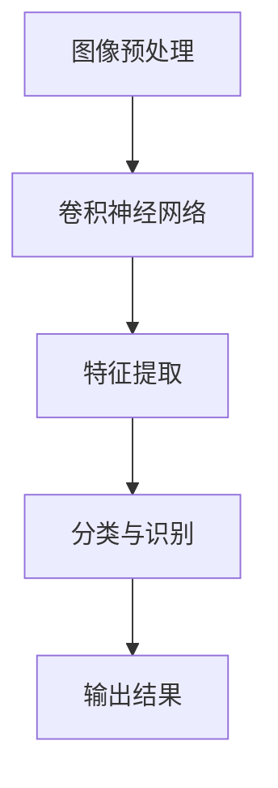
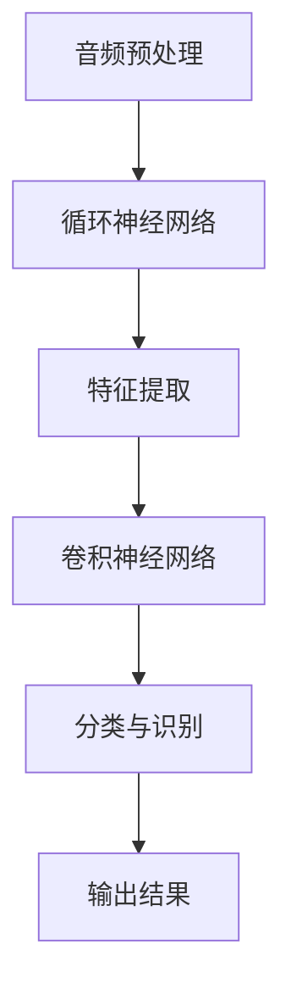
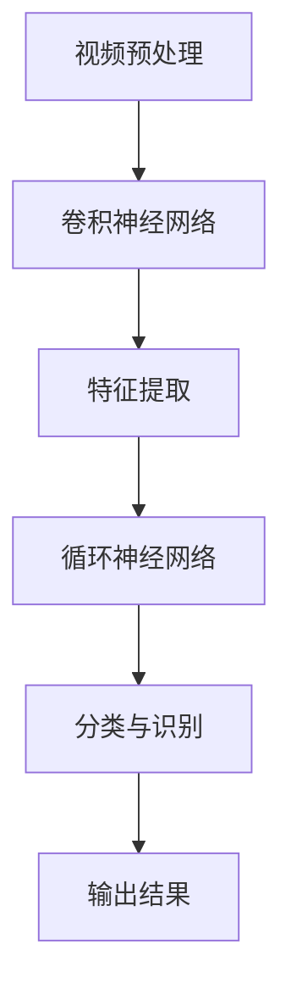
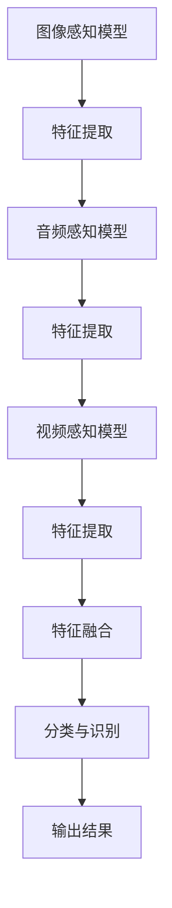

                 

## 《多模态AI应用：图像、音频和视频处理》

> **关键词：** 多模态AI、图像处理、音频处理、视频处理、深度学习、卷积神经网络、生成对抗网络、项目实战

> **摘要：** 本文将深入探讨多模态AI在图像、音频和视频处理中的应用，从基础概念到高级算法，再到实际项目实战，全面解析多模态AI的核心原理和实践方法。通过本文的阅读，读者将能够全面了解多模态AI的技术体系，掌握其在各个领域的应用技巧，为实际开发提供有力支持。

### 目录

## 《多模态AI应用：图像、音频和视频处理》

> **关键词：** 多模态AI、图像处理、音频处理、视频处理、深度学习、卷积神经网络、生成对抗网络、项目实战

> **摘要：** 本文将深入探讨多模态AI在图像、音频和视频处理中的应用，从基础概念到高级算法，再到实际项目实战，全面解析多模态AI的核心原理和实践方法。通过本文的阅读，读者将能够全面了解多模态AI的技术体系，掌握其在各个领域的应用技巧，为实际开发提供有力支持。

### 目录

1. **第一部分：多模态AI基础**
   - 1.1 多模态AI概述
     - 1.1.1 多模态AI的定义与分类
     - 1.1.2 多模态AI的核心优势
     - 1.1.3 多模态AI的发展历史与趋势
   - 1.2 多模态感知模型
     - 1.2.1 多模态感知的概念
     - 1.2.2 图像感知模型
     - 1.2.3 音频感知模型
     - 1.2.4 视频感知模型
     - 1.2.5 多模态感知模型集成
   - 1.3 多模态数据预处理
     - 1.3.1 图像预处理
     - 1.3.2 音频预处理
     - 1.3.3 视频预处理
     - 1.3.4 多模态数据同步与融合

2. **第二部分：图像处理**
   - 2.1 图像处理基础
     - 2.1.1 图像表示与理解
     - 2.1.2 图像增强与降质
     - 2.1.3 图像分割与目标检测
   - 2.2 卷积神经网络（CNN）在图像处理中的应用
     - 2.2.1 CNN的基本结构
     - 2.2.2 CNN在图像分类中的应用
     - 2.2.3 CNN在目标检测中的应用
     - 2.2.4 CNN在图像分割中的应用
   - 2.3 深度学习在图像处理中的高级应用
     - 2.3.1 图像生成对抗网络（GAN）
     - 2.3.2 图像风格迁移
     - 2.3.3 图像超分辨率
     - 2.3.4 图像修复与去噪
   - 2.4 图像处理项目实战
     - 2.4.1 图像分类项目实践
     - 2.4.2 目标检测项目实践
     - 2.4.3 图像分割项目实践

3. **第三部分：音频处理**
   - 3.1 音频处理基础
     - 3.1.1 音频信号表示
     - 3.1.2 音频特征提取
     - 3.1.3 音频增强与降噪
   - 3.2 深度学习在音频处理中的应用
     - 3.2.1 音频分类
     - 3.2.2 语音识别
     - 3.2.3 音乐生成
   - 3.3 音频处理项目实战
     - 3.3.1 音频分类项目实践
     - 3.3.2 语音识别项目实践
     - 3.3.3 音乐生成项目实践

4. **第四部分：视频处理**
   - 4.1 视频处理基础
     - 4.1.1 视频信号表示
     - 4.1.2 视频特征提取
     - 4.1.3 视频增强与降质
   - 4.2 深度学习在视频处理中的应用
     - 4.2.1 视频分类
     - 4.2.2 行人检测
     - 4.2.3 视频分割与目标跟踪
   - 4.3 视频处理项目实战
     - 4.3.1 视频分类项目实践
     - 4.3.2 行人检测项目实践
     - 4.3.3 视频分割与目标跟踪项目实践

5. **第五部分：多模态AI应用案例**
   - 5.1 多模态AI在安防领域的应用
     - 5.1.1 视频监控与智能分析
     - 5.1.2 人脸识别与行为分析
   - 5.2 多模态AI在娱乐领域的应用
     - 5.2.1 音乐与视频创作
     - 5.2.2 虚拟现实与增强现实
   - 5.3 多模态AI在医疗领域的应用
     - 5.3.1 疾病诊断
     - 5.3.2 手术辅助与康复
   - 5.4 多模态AI在其他领域的应用
     - 5.4.1 智能家居
     - 5.4.2 智能交通

6. **附录**
   - 6.1 多模态AI应用工具与资源
     - 6.1.1 开源深度学习框架
     - 6.1.2 音频与视频处理工具
     - 6.1.3 多模态数据集与资源
   - 6.2 多模态AI应用项目指南
     - 6.2.1 项目规划与实施
     - 6.2.2 项目评估与优化
     - 6.2.3 项目风险管理

### 引言

随着人工智能技术的快速发展，多模态AI（Multimodal AI）逐渐成为研究的热点领域。多模态AI通过整合多种类型的感知数据，如图像、音频、视频等，实现更高级别的智能感知和认知能力。本文旨在深入探讨多模态AI在图像、音频和视频处理中的应用，从基础概念、算法原理到实际项目实战，全面解析多模态AI的核心原理和实践方法。

首先，我们将介绍多模态AI的基础概念，包括其定义、分类和核心优势。接着，我们将详细探讨多模态感知模型，介绍图像、音频和视频感知模型的基本原理和应用。此外，我们还将讨论多模态数据预处理技术，包括图像、音频和视频的预处理方法，以及多模态数据的同步与融合。

在图像处理部分，我们将介绍图像处理的基础知识，包括图像表示与理解、图像增强与降质、图像分割与目标检测。接着，我们将深入探讨卷积神经网络（CNN）在图像处理中的应用，包括CNN的基本结构、图像分类、目标检测和图像分割。此外，我们还将介绍深度学习在图像处理中的高级应用，如图像生成对抗网络（GAN）、图像风格迁移、图像超分辨率和图像修复与去噪。

在音频处理部分，我们将介绍音频处理的基础知识，包括音频信号表示、音频特征提取和音频增强与降噪。接着，我们将深入探讨深度学习在音频处理中的应用，包括音频分类、语音识别和音乐生成。此外，我们还将介绍音频处理项目实战，包括音频分类、语音识别和音乐生成项目实践。

在视频处理部分，我们将介绍视频处理的基础知识，包括视频信号表示、视频特征提取和视频增强与降质。接着，我们将深入探讨深度学习在视频处理中的应用，包括视频分类、行人检测和视频分割与目标跟踪。此外，我们还将介绍视频处理项目实战，包括视频分类、行人检测和视频分割与目标跟踪项目实践。

最后，我们将通过多个应用案例，展示多模态AI在安防、娱乐、医疗和其他领域的实际应用，分析其优势和挑战，探讨未来发展趋势。

通过本文的阅读，读者将能够全面了解多模态AI的技术体系，掌握其在各个领域的应用技巧，为实际开发提供有力支持。让我们开始这场探索之旅，深入了解多模态AI的奥秘吧！

### 第一部分：多模态AI基础

#### 1.1 多模态AI概述

##### 1.1.1 多模态AI的定义与分类

多模态AI（Multimodal AI）是指能够处理和分析多种类型感知数据的人工智能系统。这些感知数据可以包括图像、音频、视频、文本、触觉等。多模态AI的核心思想是通过整合不同类型的感知数据，实现更高级别的智能感知和认知能力。

根据感知数据类型的不同，多模态AI可以分为以下几类：

1. **视觉感知**：主要处理图像和视频数据，如目标检测、图像分类、图像分割等。
2. **听觉感知**：主要处理音频数据，如语音识别、音频分类、音乐生成等。
3. **文本感知**：主要处理文本数据，如自然语言处理、文本分类、机器翻译等。
4. **触觉感知**：主要处理触觉数据，如触觉感知、物体识别等。
5. **多模态融合**：整合多种类型的感知数据，如视觉、听觉、文本等，实现更高级别的智能感知。

##### 1.1.2 多模态AI的核心优势

多模态AI相较于单一模态AI具有以下核心优势：

1. **增强感知能力**：通过整合多种类型的感知数据，多模态AI能够更全面地获取环境信息，提高感知能力和准确性。
2. **提升认知能力**：多模态AI可以通过整合不同类型的数据，实现更高级别的认知功能，如情感识别、行为预测等。
3. **提高鲁棒性**：多模态AI可以通过不同类型的数据相互补充，提高系统对噪声和异常数据的抵抗能力。
4. **扩展应用场景**：多模态AI可以应用于更广泛的场景，如智能安防、娱乐、医疗、智能家居等。

##### 1.1.3 多模态AI的发展历史与趋势

多模态AI的发展可以追溯到20世纪80年代，当时研究人员开始探索如何将不同类型的数据进行整合和分析。随着计算机性能的提升和深度学习技术的发展，多模态AI逐渐成为人工智能领域的重要研究方向。

在过去的几年里，多模态AI取得了显著的进展，主要表现在以下几个方面：

1. **算法创新**：研究人员提出了多种多模态融合算法，如对齐算法、特征融合算法、协同训练算法等，提高了多模态数据的整合效果。
2. **数据集建设**：大量多模态数据集的建设，为多模态AI的研究和应用提供了丰富的数据资源。
3. **应用场景拓展**：多模态AI在安防、娱乐、医疗、智能家居等领域的应用逐渐成熟，为人们的生活带来了便利。

未来，多模态AI将继续沿着以下几个方向发展：

1. **算法优化**：研究人员将不断探索更高效的多模态融合算法，提高系统的性能和准确率。
2. **跨模态交互**：多模态AI将实现不同类型数据之间的更紧密交互，提高系统的智能感知和认知能力。
3. **应用场景拓展**：多模态AI将在更多领域得到应用，如教育、金融、工业等，为人类社会带来更多创新。

#### 1.2 多模态感知模型

##### 1.2.1 多模态感知的概念

多模态感知（Multimodal Perception）是指人工智能系统能够同时或连续处理和分析多种类型感知数据的能力。多模态感知模型是构建多模态AI系统的基础，通过整合不同类型的数据，实现更全面、准确的感知和认知功能。

多模态感知模型的主要组成部分包括：

1. **感知数据输入**：从不同类型的数据源获取感知数据，如摄像头、麦克风、传感器等。
2. **数据预处理**：对感知数据进行预处理，如去噪、增强、特征提取等。
3. **特征融合**：将不同类型的数据特征进行融合，形成统一的特征表示。
4. **感知任务**：基于融合后的特征，执行特定的感知任务，如分类、识别、预测等。

##### 1.2.2 图像感知模型

图像感知模型（Image Perception Model）是处理和识别图像数据的核心模型。在多模态AI系统中，图像感知模型通常基于深度学习技术，如卷积神经网络（CNN）。

图像感知模型的主要步骤包括：

1. **图像预处理**：对图像数据进行预处理，如缩放、裁剪、去噪等，以适应深度学习模型的输入要求。
2. **特征提取**：通过卷积神经网络等深度学习模型提取图像特征，形成高维特征向量。
3. **分类与识别**：利用训练好的模型对图像特征进行分类与识别，实现图像内容的理解和分析。

以下是一个简单的图像感知模型流程图：



##### 1.2.3 音频感知模型

音频感知模型（Audio Perception Model）是处理和识别音频数据的核心模型。在多模态AI系统中，音频感知模型通常基于深度学习技术，如循环神经网络（RNN）和卷积神经网络（CNN）。

音频感知模型的主要步骤包括：

1. **音频预处理**：对音频数据进行预处理，如滤波、去噪、分帧等，以适应深度学习模型的输入要求。
2. **特征提取**：通过循环神经网络或卷积神经网络等深度学习模型提取音频特征，形成高维特征向量。
3. **分类与识别**：利用训练好的模型对音频特征进行分类与识别，实现音频内容的理解和分析。

以下是一个简单的音频感知模型流程图：



##### 1.2.4 视频感知模型

视频感知模型（Video Perception Model）是处理和识别视频数据的核心模型。在多模态AI系统中，视频感知模型通常基于深度学习技术，如卷积神经网络（CNN）和循环神经网络（RNN）。

视频感知模型的主要步骤包括：

1. **视频预处理**：对视频数据进行预处理，如缩放、裁剪、去噪等，以适应深度学习模型的输入要求。
2. **特征提取**：通过卷积神经网络或循环神经网络等深度学习模型提取视频特征，形成高维特征向量。
3. **分类与识别**：利用训练好的模型对视频特征进行分类与识别，实现视频内容的理解和分析。

以下是一个简单的视频感知模型流程图：



##### 1.2.5 多模态感知模型集成

多模态感知模型集成（Multimodal Perception Model Integration）是指将不同类型的感知模型进行整合，形成统一的多模态感知模型。多模态感知模型集成的方法主要包括以下几种：

1. **并行融合**：将不同类型的感知模型分别训练，然后通过并行融合策略将特征进行整合。并行融合策略包括特征级融合和决策级融合。
2. **级联融合**：将不同类型的感知模型依次训练，前一个模型的输出作为后一个模型的输入。级联融合方法可以提高模型的性能和鲁棒性。
3. **对抗融合**：利用生成对抗网络（GAN）等对抗性模型，学习不同类型数据之间的特征表示，实现多模态特征融合。

以下是一个简单的多模态感知模型集成流程图：



通过多模态感知模型集成，人工智能系统能够更全面地获取和处理感知数据，实现更高级别的智能感知和认知功能。在实际应用中，多模态感知模型集成的方法和技术将不断优化和发展，为人工智能领域带来更多创新和突破。

#### 1.3 多模态数据预处理

##### 1.3.1 图像预处理

图像预处理是构建多模态AI系统的重要环节，其目的是对图像数据进行处理，使其适合后续的深度学习模型训练和推理。常见的图像预处理方法包括缩放、裁剪、增强、去噪等。

1. **缩放**：图像缩放是指调整图像的大小。常见的缩放方法包括等比例缩放、放大和缩小。等比例缩放可以保持图像的宽高比不变，而放大和缩小则会改变图像的宽高比。在深度学习模型训练过程中，通常需要对图像进行缩放，以便将图像统一成固定的尺寸。

2. **裁剪**：图像裁剪是指从原始图像中截取一部分作为新的图像。常见的裁剪方法包括中心裁剪、随机裁剪和缩放裁剪等。中心裁剪可以从图像的中心截取相同大小的区域，而随机裁剪则从图像中随机选择一个区域进行裁剪。缩放裁剪则是先对图像进行缩放，然后再从缩放后的图像中裁剪出所需大小的区域。裁剪方法可以提高模型的泛化能力和鲁棒性。

3. **增强**：图像增强是指通过调整图像的亮度、对比度、色彩等参数，改善图像的质量和视觉效果。常见的增强方法包括对比度增强、亮度增强、色彩增强等。对比度增强可以增强图像中的细节信息，而亮度增强和色彩增强则可以改善图像的亮度和色彩表现。图像增强可以提高模型的准确率和稳定性。

4. **去噪**：图像去噪是指去除图像中的噪声，提高图像的质量。常见的去噪方法包括滤波、中值滤波、小波变换等。滤波方法通过在一个局部区域内计算平均值来去除噪声，而中值滤波则通过选择局部区域内的中值来去除噪声。小波变换则通过将图像分解为不同尺度的小波系数来实现去噪。去噪可以提高模型的准确率和鲁棒性。

##### 1.3.2 音频预处理

音频预处理是构建多模态AI系统的重要环节，其目的是对音频数据进行处理，使其适合后续的深度学习模型训练和推理。常见的音频预处理方法包括滤波、分帧、增强、去噪等。

1. **滤波**：音频滤波是指通过一个滤波器对音频信号进行处理，以去除特定频率的噪声。常见的滤波方法包括低通滤波、高通滤波、带通滤波等。低通滤波可以去除高频噪声，而高通滤波可以去除低频噪声。带通滤波则可以同时去除高频和低频噪声。滤波方法可以提高音频的质量和清晰度。

2. **分帧**：音频分帧是指将连续的音频信号分割成若干个较短的时间段，称为帧。常见的分帧方法包括固定长度分帧和变长度分帧。固定长度分帧将音频信号分割成相同长度的帧，而变长度分帧则根据音频信号的特点动态调整帧的长度。分帧方法可以为后续的音频特征提取提供基础。

3. **增强**：音频增强是指通过调整音频信号的参数，改善音频的质量和音质。常见的增强方法包括增益调整、回声消除、噪声抑制等。增益调整可以增加音频的音量，回声消除可以去除音频中的回声，噪声抑制可以去除音频中的噪声。音频增强可以提高音频的听觉效果。

4. **去噪**：音频去噪是指去除音频信号中的噪声，提高音频的质量。常见的去噪方法包括谱减法、维纳滤波、小波变换等。谱减法通过在频域中减去噪声分量来去除噪声，维纳滤波通过最小均方误差准则来优化滤波器参数，小波变换通过将音频分解为不同尺度的小波系数来实现去噪。去噪可以提高音频的清晰度和音质。

##### 1.3.3 视频预处理

视频预处理是构建多模态AI系统的重要环节，其目的是对视频数据进行处理，使其适合后续的深度学习模型训练和推理。常见的视频预处理方法包括帧率转换、帧间插值、图像增强、视频去噪等。

1. **帧率转换**：视频帧率转换是指调整视频的播放速度，包括升帧和降帧。升帧是指将低帧率的视频转换为高帧率，以提高视频的流畅度。降帧是指将高帧率的视频转换为低帧率，以减少数据量和处理时间。常见的帧率转换方法包括线性插值、双线性插值、双三次插值等。

2. **帧间插值**：帧间插值是指在连续的视频帧之间插入新的帧，以填充时间间隔。常见的帧间插值方法包括前向插值、后向插值、双向插值等。前向插值只考虑前一帧的信息，后向插值只考虑后一帧的信息，而双向插值同时考虑前一帧和后一帧的信息。

3. **图像增强**：视频图像增强是指通过调整视频图像的参数，改善视频的质量和视觉效果。常见的增强方法包括对比度增强、亮度增强、色彩增强等。对比度增强可以增强视频中的细节信息，亮度增强可以改善视频的亮度和色彩表现。

4. **视频去噪**：视频去噪是指去除视频信号中的噪声，提高视频的质量。常见的去噪方法包括运动补偿去噪、帧间去噪、频域去噪等。运动补偿去噪通过利用视频中的运动信息来去除噪声，帧间去噪通过利用前后帧之间的相关性来去除噪声，频域去噪通过在频域中去除噪声分量来提高视频质量。

##### 1.3.4 多模态数据同步与融合

多模态数据同步与融合是构建多模态AI系统的重要环节，其目的是确保不同类型的数据在时间上保持一致性，并有效地整合各种数据，以实现更好的感知和认知效果。

1. **时间同步**：多模态数据的时间同步是指确保不同类型的数据在时间上保持一致。常见的同步方法包括基于时间戳的同步、基于时间序列的同步和基于事件驱动的同步。基于时间戳的同步通过比较不同类型数据的时间戳来实现同步，基于时间序列的同步通过分析不同类型数据的时间序列特征来实现同步，基于事件驱动的同步通过识别事件并据此调整不同类型数据的时间来实现同步。

2. **数据融合**：多模态数据融合是指将不同类型的数据进行整合，以形成统一的特征表示。数据融合的方法主要包括以下几种：

   - **特征级融合**：在特征提取阶段，将不同类型的数据特征进行整合。常见的特征级融合方法包括加权融合、拼接融合、平均融合等。
   - **决策级融合**：在分类或识别阶段，将不同类型的数据特征融合后的结果进行整合。常见的决策级融合方法包括投票法、集成学习、贝叶斯网络等。
   - **对抗性融合**：利用生成对抗网络（GAN）等对抗性模型，学习不同类型数据之间的特征表示，实现多模态特征融合。

   以下是一个简单的多模态数据融合流程图：

   ```mermaid
   graph TB
   A[图像特征] --> B[音频特征]
   B --> C[视频特征]
   C --> D[特征融合]
   D --> E[分类与识别]
   E --> F[输出结果]
   ```

   通过多模态数据同步与融合，人工智能系统能够更全面地获取和处理感知数据，实现更高级别的智能感知和认知功能。

### 第二部分：图像处理

#### 2.1 图像处理基础

图像处理是计算机视觉的核心内容之一，涉及到图像的表示、理解、增强、分割和目标检测等多个方面。在本节中，我们将介绍图像处理的基础知识，包括图像的表示与理解、图像增强与降质、以及图像分割与目标检测。

##### 2.1.1 图像表示与理解

图像表示是指将图像数据转换为适合计算机处理的形式。常见的图像表示方法包括像素表示、傅里叶变换、直方图表示等。

1. **像素表示**：像素表示是最直观的图像表示方法，它将图像划分为一个二维数组，每个数组元素表示图像中的一个像素点。每个像素点包含颜色信息，通常用红、绿、蓝（RGB）三个颜色通道来表示。

2. **傅里叶变换**：傅里叶变换是一种重要的数学工具，用于将图像从空间域转换为频率域。通过傅里叶变换，图像中的频率信息可以被清晰地表示出来，这对于图像的滤波、压缩和特征提取等操作具有重要意义。

3. **直方图表示**：直方图表示是一种用于描述图像分布的方法，通常用于图像的亮度和颜色信息。例如，亮度直方图可以显示图像中各个亮度级别的像素数量分布，颜色直方图可以显示图像中各个颜色通道的像素数量分布。

图像理解是指对图像内容进行识别和分析，以获取图像的语义信息。常见的图像理解方法包括目标识别、场景识别和图像语义分割等。

1. **目标识别**：目标识别是指从图像中识别出特定的物体或目标。常见的目标识别算法包括基于传统图像处理的方法（如边缘检测、特征匹配等）和基于深度学习的方法（如卷积神经网络、目标检测框架等）。

2. **场景识别**：场景识别是指识别图像中的场景类型或场景内容。常见的场景识别算法包括基于传统图像处理的方法（如颜色分类、形状识别等）和基于深度学习的方法（如卷积神经网络、全卷积网络等）。

3. **图像语义分割**：图像语义分割是指将图像划分为不同的语义区域，每个区域对应不同的语义标签。常见的图像语义分割算法包括基于传统图像处理的方法（如区域增长、条件随机场等）和基于深度学习的方法（如卷积神经网络、全卷积网络等）。

##### 2.1.2 图像增强与降质

图像增强是指通过调整图像的亮度、对比度、色彩等参数，改善图像的质量和视觉效果，使其更符合人类视觉习惯或满足特定应用需求。常见的图像增强方法包括亮度增强、对比度增强、色彩增强、滤波等。

1. **亮度增强**：亮度增强是指调整图像的亮度，使其更明亮或更暗。常见的亮度增强方法包括线性变换、对数变换等。

2. **对比度增强**：对比度增强是指调整图像的对比度，使其更清晰或更模糊。常见的对比度增强方法包括直方图均衡化、直方图指定化等。

3. **色彩增强**：色彩增强是指调整图像的色彩，使其更鲜艳或更柔和。常见的色彩增强方法包括色彩平衡、色彩饱和度调整等。

图像降质是指在图像处理过程中，有意降低图像的质量，以满足特定的应用需求。常见的图像降质方法包括模糊、噪声添加、压缩等。

1. **模糊**：模糊是指通过模糊图像来降低图像的清晰度。常见的模糊方法包括卷积滤波、高斯模糊等。

2. **噪声添加**：噪声添加是指在图像中添加噪声，以模拟实际场景中的噪声干扰。常见的噪声添加方法包括高斯噪声、椒盐噪声等。

3. **压缩**：压缩是指通过压缩算法减小图像的存储空间和传输带宽。常见的压缩算法包括JPEG、PNG等。

##### 2.1.3 图像分割与目标检测

图像分割是指将图像划分为不同的区域或对象，每个区域或对象具有不同的特征。常见的图像分割方法包括基于阈值的分割、基于边缘的分割、基于区域的分割等。

1. **基于阈值的分割**：基于阈值的分割方法通过设置一个阈值，将图像划分为前景和背景。常见的阈值分割方法包括全局阈值分割、局部阈值分割等。

2. **基于边缘的分割**：基于边缘的分割方法通过检测图像中的边缘，将图像划分为不同的区域。常见的边缘检测算法包括Canny边缘检测、Sobel边缘检测等。

3. **基于区域的分割**：基于区域的分割方法通过分析图像中不同区域的特征（如颜色、纹理等），将图像划分为不同的区域。常见的区域分割方法包括基于颜色的区域分割、基于纹理的区域分割等。

目标检测是指在图像中识别并定位特定目标的位置和范围。常见的目标检测算法包括基于传统图像处理的方法（如HOG特征、SVM分类器等）和基于深度学习的方法（如YOLO、SSD、Faster R-CNN等）。

1. **基于传统图像处理的方法**：基于传统图像处理的方法通常包括特征提取、特征匹配和分类器训练等步骤。常见的特征提取方法包括HOG（方向梯度直方图）、SIFT（尺度不变特征变换）等。常见的分类器包括支持向量机（SVM）、随机森林（Random Forest）等。

2. **基于深度学习的方法**：基于深度学习的方法通常包括卷积神经网络（CNN）、目标检测框架（如YOLO、SSD、Faster R-CNN等）等。这些方法通过学习图像的特征表示和分类模型，实现高效的目标检测。

### 第二部分：图像处理

#### 2.1 图像处理基础

图像处理是计算机视觉的核心内容之一，涉及到图像的表示、理解、增强、分割和目标检测等多个方面。在本节中，我们将介绍图像处理的基础知识，包括图像的表示与理解、图像增强与降质、以及图像分割与目标检测。

##### 2.1.1 图像表示与理解

图像表示是指将图像数据转换为适合计算机处理的形式。常见的图像表示方法包括像素表示、傅里叶变换、直方图表示等。

1. **像素表示**：像素表示是最直观的图像表示方法，它将图像划分为一个二维数组，每个数组元素表示图像中的一个像素点。每个像素点包含颜色信息，通常用红、绿、蓝（RGB）三个颜色通道来表示。

2. **傅里叶变换**：傅里叶变换是一种重要的数学工具，用于将图像从空间域转换为频率域。通过傅里叶变换，图像中的频率信息可以被清晰地表示出来，这对于图像的滤波、压缩和特征提取等操作具有重要意义。

3. **直方图表示**：直方图表示是一种用于描述图像分布的方法，通常用于图像的亮度和颜色信息。例如，亮度直方图可以显示图像中各个亮度级别的像素数量分布，颜色直方图可以显示图像中各个颜色通道的像素数量分布。

图像理解是指对图像内容进行识别和分析，以获取图像的语义信息。常见的图像理解方法包括目标识别、场景识别和图像语义分割等。

1. **目标识别**：目标识别是指从图像中识别出特定的物体或目标。常见的目标识别算法包括基于传统图像处理的方法（如边缘检测、特征匹配等）和基于深度学习的方法（如卷积神经网络、目标检测框架等）。

2. **场景识别**：场景识别是指识别图像中的场景类型或场景内容。常见的场景识别算法包括基于传统图像处理的方法（如颜色分类、形状识别等）和基于深度学习的方法（如卷积神经网络、全卷积网络等）。

3. **图像语义分割**：图像语义分割是指将图像划分为不同的语义区域，每个区域对应不同的语义标签。常见的图像语义分割算法包括基于传统图像处理的方法（如区域增长、条件随机场等）和基于深度学习的方法（如卷积神经网络、全卷积网络等）。

##### 2.1.2 图像增强与降质

图像增强是指通过调整图像的亮度、对比度、色彩等参数，改善图像的质量和视觉效果，使其更符合人类视觉习惯或满足特定应用需求。常见的图像增强方法包括亮度增强、对比度增强、色彩增强、滤波等。

1. **亮度增强**：亮度增强是指调整图像的亮度，使其更明亮或更暗。常见的亮度增强方法包括线性变换、对数变换等。

2. **对比度增强**：对比度增强是指调整图像的对比度，使其更清晰或更模糊。常见的对比度增强方法包括直方图均衡化、直方图指定化等。

3. **色彩增强**：色彩增强是指调整图像的色彩，使其更鲜艳或更柔和。常见的色彩增强方法包括色彩平衡、色彩饱和度调整等。

图像降质是指在图像处理过程中，有意降低图像的质量，以满足特定的应用需求。常见的图像降质方法包括模糊、噪声添加、压缩等。

1. **模糊**：模糊是指通过模糊图像来降低图像的清晰度。常见的模糊方法包括卷积滤波、高斯模糊等。

2. **噪声添加**：噪声添加是指在图像中添加噪声，以模拟实际场景中的噪声干扰。常见的噪声添加方法包括高斯噪声、椒盐噪声等。

3. **压缩**：压缩是指通过压缩算法减小图像的存储空间和传输带宽。常见的压缩算法包括JPEG、PNG等。

##### 2.1.3 图像分割与目标检测

图像分割是指将图像划分为不同的区域或对象，每个区域或对象具有不同的特征。常见的图像分割方法包括基于阈值的分割、基于边缘的分割、基于区域的分割等。

1. **基于阈值的分割**：基于阈值的分割方法通过设置一个阈值，将图像划分为前景和背景。常见的阈值分割方法包括全局阈值分割、局部阈值分割等。

2. **基于边缘的分割**：基于边缘的分割方法通过检测图像中的边缘，将图像划分为不同的区域。常见的边缘检测算法包括Canny边缘检测、Sobel边缘检测等。

3. **基于区域的分割**：基于区域的分割方法通过分析图像中不同区域的特征（如颜色、纹理等），将图像划分为不同的区域。常见的区域分割方法包括基于颜色的区域分割、基于纹理的区域分割等。

目标检测是指在图像中识别并定位特定目标的位置和范围。常见的目标检测算法包括基于传统图像处理的方法（如HOG特征、SVM分类器等）和基于深度学习的方法（如YOLO、SSD、Faster R-CNN等）。

1. **基于传统图像处理的方法**：基于传统图像处理的方法通常包括特征提取、特征匹配和分类器训练等步骤。常见的特征提取方法包括HOG（方向梯度直方图）、SIFT（尺度不变特征变换）等。常见的分类器包括支持向量机（SVM）、随机森林（Random Forest）等。

2. **基于深度学习的方法**：基于深度学习的方法通常包括卷积神经网络（CNN）、目标检测框架（如YOLO、SSD、Faster R-CNN等）等。这些方法通过学习图像的特征表示和分类模型，实现高效的目标检测。

### 2.2 卷积神经网络（CNN）在图像处理中的应用

卷积神经网络（Convolutional Neural Network，简称CNN）是深度学习领域中的一种重要模型，尤其在图像处理领域表现出色。CNN通过模仿生物视觉系统的工作原理，利用卷积层、池化层等结构来提取图像的特征，从而实现图像分类、目标检测、图像分割等任务。

#### 2.2.1 CNN的基本结构

CNN的基本结构包括输入层、卷积层、池化层、全连接层和输出层。

1. **输入层**：输入层接收原始图像数据，通常是二维数组，每个元素表示图像中的一个像素点的颜色信息（通常是RGB值）。

2. **卷积层**：卷积层是CNN的核心部分，通过卷积运算提取图像的特征。卷积层由多个滤波器（也称为卷积核）组成，每个滤波器可以在输入图像上滑动，生成特征图。滤波器的大小和数量可以根据任务需求进行调整。

3. **激活函数**：激活函数用于引入非线性因素，使CNN能够建模复杂的非线性关系。常用的激活函数包括ReLU（Rectified Linear Unit）函数、Sigmoid函数和Tanh函数。

4. **池化层**：池化层用于降低特征图的维度，减少参数数量，从而提高计算效率和模型的泛化能力。常用的池化方法包括最大池化（Max Pooling）和平均池化（Average Pooling）。

5. **全连接层**：全连接层将卷积层和池化层提取的高维特征映射到输出层，实现分类或回归任务。全连接层的每个神经元都与卷积层中的所有神经元相连。

6. **输出层**：输出层通常是一个或多个神经元，用于生成最终的预测结果。在图像分类任务中，输出层通常是softmax函数，用于计算每个类别的概率分布。

#### 2.2.2 CNN在图像分类中的应用

图像分类是CNN最常见的应用之一，其目标是将输入图像分为预先定义的类别。

1. **数据准备**：首先，需要准备训练数据集和测试数据集。图像分类任务的输入是图像，输出是图像的类别标签。常用的数据预处理方法包括图像缩放、裁剪、增强等。

2. **模型构建**：使用深度学习框架（如TensorFlow、PyTorch）构建CNN模型。模型通常包括多个卷积层、池化层和全连接层。可以使用预训练的模型（如VGG、ResNet）作为基础模型，然后根据任务需求进行适当的调整。

3. **训练与验证**：使用训练数据集对模型进行训练，并通过验证数据集评估模型的性能。训练过程中，通过反向传播算法不断调整模型参数，使模型能够更好地拟合训练数据。

4. **测试与评估**：使用测试数据集对模型进行测试，并评估模型的泛化能力。常用的评估指标包括准确率、召回率、F1分数等。

以下是一个简单的CNN图像分类模型的伪代码：

```python
import tensorflow as tf

# 定义CNN模型
model = tf.keras.Sequential([
    tf.keras.layers.Conv2D(32, (3, 3), activation='relu', input_shape=(28, 28, 1)),
    tf.keras.layers.MaxPooling2D((2, 2)),
    tf.keras.layers.Conv2D(64, (3, 3), activation='relu'),
    tf.keras.layers.MaxPooling2D((2, 2)),
    tf.keras.layers.Flatten(),
    tf.keras.layers.Dense(64, activation='relu'),
    tf.keras.layers.Dense(10, activation='softmax')
])

# 编译模型
model.compile(optimizer='adam',
              loss='categorical_crossentropy',
              metrics=['accuracy'])

# 训练模型
model.fit(x_train, y_train, epochs=10, batch_size=32, validation_split=0.2)

# 评估模型
model.evaluate(x_test, y_test)
```

#### 2.2.3 CNN在目标检测中的应用

目标检测是另一个重要的图像处理任务，其目标是识别并定位图像中的多个目标。

1. **数据准备**：与图像分类类似，目标检测也需要准备包含目标标注的数据集。标注通常包括目标的类别和边界框。

2. **模型构建**：目标检测模型通常基于两个主要框架：R-CNN系列（包括R-CNN、Fast R-CNN、Faster R-CNN、Mask R-CNN等）和SSD（Single Shot MultiBox Detector）。

3. **训练与验证**：使用训练数据集对模型进行训练，并通过验证数据集进行性能评估。训练过程中，通过优化边界框回归和类别分类的损失函数，不断调整模型参数。

4. **测试与评估**：使用测试数据集对模型进行测试，并评估模型的性能。常用的评估指标包括平均精确度（Average Precision，AP）等。

以下是一个基于Faster R-CNN的目标检测模型的伪代码：

```python
import tensorflow as tf
from tensorflow.keras.applications import VGG16
from tensorflow.keras.layers import Flatten, Dense
from tensorflow.keras.models import Model

# 获取预训练的VGG16模型
base_model = VGG16(weights='imagenet', include_top=False, input_shape=(224, 224, 3))

# 添加全连接层和分类器
x = Flatten()(base_model.output)
x = Dense(1024, activation='relu')(x)
predictions = Dense(num_classes, activation='softmax')(x)

# 创建Faster R-CNN模型
model = Model(inputs=base_model.input, outputs=predictions)

# 编译模型
model.compile(optimizer='adam',
              loss='categorical_crossentropy',
              metrics=['accuracy'])

# 训练模型
model.fit(x_train, y_train, epochs=10, batch_size=32, validation_split=0.2)

# 评估模型
model.evaluate(x_test, y_test)
```

#### 2.2.4 CNN在图像分割中的应用

图像分割是将图像划分为不同的区域或对象的过程。CNN在图像分割中的应用通常基于全卷积网络（Fully Convolutional Network，FCN）。

1. **数据准备**：与图像分类和目标检测类似，图像分割也需要准备包含分割标注的数据集。

2. **模型构建**：FCN模型通过在卷积神经网络中添加上采样层，将特征图上采样到原始图像的大小，从而实现像素级的分割。常用的FCN模型包括U-Net、DeepLab V3+等。

3. **训练与验证**：使用训练数据集对模型进行训练，并通过验证数据集进行性能评估。训练过程中，通过优化分割损失函数（如交叉熵损失函数），不断调整模型参数。

4. **测试与评估**：使用测试数据集对模型进行测试，并评估模型的性能。常用的评估指标包括交集面积分数（Intersection over Union，IoU）等。

以下是一个基于U-Net的图像分割模型的伪代码：

```python
import tensorflow as tf
from tensorflow.keras.layers import Conv2D, MaxPooling2D, UpSampling2D, Concatenate

# 定义U-Net模型
inputs = tf.keras.Input(shape=(256, 256, 3))
conv1 = Conv2D(32, (3, 3), activation='relu')(inputs)
pool1 = MaxPooling2D(pool_size=(2, 2))(conv1)
...
conv5 = Conv2D(1, (1, 1), activation='sigmoid')(inputs)

# 创建U-Net模型
model = tf.keras.Model(inputs=inputs, outputs=conv5)

# 编译模型
model.compile(optimizer='adam',
              loss='binary_crossentropy',
              metrics=['accuracy'])

# 训练模型
model.fit(x_train, y_train, epochs=10, batch_size=32, validation_split=0.2)

# 评估模型
model.evaluate(x_test, y_test)
```

通过以上介绍，我们可以看到CNN在图像处理领域具有广泛的应用，从图像分类到目标检测，再到图像分割，CNN都展现出了强大的性能。随着深度学习技术的不断发展，CNN在图像处理中的应用将会更加广泛和深入。

### 2.3 深度学习在图像处理中的高级应用

深度学习技术在图像处理中的应用已经非常成熟，不仅在基础任务如图像分类、目标检测和图像分割中表现出色，还在许多高级任务中展现了其强大的能力。在本节中，我们将探讨深度学习在图像处理中的高级应用，包括图像生成对抗网络（GAN）、图像风格迁移、图像超分辨率和图像修复与去噪。

#### 2.3.1 图像生成对抗网络（GAN）

图像生成对抗网络（Generative Adversarial Network，GAN）是由Ian Goodfellow等人于2014年提出的一种深度学习模型，它由两个深度神经网络——生成器（Generator）和判别器（Discriminator）组成，两者相互对抗，共同学习生成逼真的图像。

1. **生成器（Generator）**：生成器的目标是生成与真实图像相似的假图像。通常，生成器接收一个随机噪声向量作为输入，通过一系列的卷积和上采样操作，将噪声向量转化为具有视觉吸引力的图像。

2. **判别器（Discriminator）**：判别器的目标是区分输入图像是真实图像还是生成图像。判别器通常是一个简单的卷积神经网络，接收图像作为输入，输出一个二值分类结果，表示图像是真实的概率。

3. **训练过程**：GAN的训练过程可以看作是一个零和游戏，生成器和判别器相互对抗。在每次迭代中，生成器尝试生成更逼真的图像，而判别器尝试提高对真实图像和生成图像的区分能力。这个过程通过优化生成器和判别器的损失函数来实现。

4. **应用场景**：GAN在图像处理中有许多应用场景，如图像生成、图像修复、超分辨率等。以下是一个简单的GAN图像生成模型的伪代码：

```python
import tensorflow as tf
from tensorflow.keras.models import Model
from tensorflow.keras.layers import Dense, Conv2D, Flatten, Reshape

# 定义生成器和判别器
generator = Model(inputs=tf.keras.Input(shape=(100,)), outputs=generated_image)
discriminator = Model(inputs=tf.keras.Input(shape=(128, 128, 3)), outputs=discriminator_output)

# 编译生成器和判别器
generator.compile(optimizer=tf.keras.optimizers.Adam(0.0001), loss='binary_crossentropy')
discriminator.compile(optimizer=tf.keras.optimizers.Adam(0.0001), loss='binary_crossentropy')

# 定义GAN模型
model = Model(inputs=generator.input, outputs=discriminator(generator.input))

# 训练GAN模型
discriminator.train_on_batch(real_images, real_labels)
discriminator.train_on_batch(fake_images, fake_labels)
generator.train_on_batch(fake_images, real_labels)
```

#### 2.3.2 图像风格迁移

图像风格迁移（Image Style Transfer）是指将一幅图像的风格（例如，绘画风格或摄影风格）转移到另一幅图像上的过程。深度学习技术，尤其是GAN，在这方面表现出色。

1. **训练过程**：首先，使用一组风格图像和内容图像训练一个生成器网络，使其能够生成具有特定风格的内容图像。训练过程中，生成器网络尝试在内容图像中保留关键内容，同时模拟风格图像的视觉特征。

2. **应用场景**：图像风格迁移在艺术创作、图像编辑和增强、电影特效等领域具有广泛应用。以下是一个简单的图像风格迁移模型的伪代码：

```python
import tensorflow as tf
from tensorflow.keras.models import Model
from tensorflow.keras.layers import Dense, Conv2D, Flatten, Reshape

# 定义生成器和判别器
generator = Model(inputs=tf.keras.Input(shape=(256, 256, 3)), outputs=style_transferred_image)
discriminator = Model(inputs=tf.keras.Input(shape=(256, 256, 3)), outputs=discriminator_output)

# 编译生成器和判别器
generator.compile(optimizer=tf.keras.optimizers.Adam(0.0001), loss='binary_crossentropy')
discriminator.compile(optimizer=tf.keras.optimizers.Adam(0.0001), loss='binary_crossentropy')

# 训练生成器和判别器
for epoch in range(num_epochs):
    for content_image, style_image in data_loader:
        # 训练判别器
        discriminator.train_on_batch(content_image, np.array([1] * batch_size))
        discriminator.train_on_batch(style_image, np.array([0] * batch_size))
        # 训练生成器
        generator.train_on_batch(content_image, style_image)
```

#### 2.3.3 图像超分辨率

图像超分辨率（Image Super-Resolution）是指通过将低分辨率图像放大并增强细节，生成高分辨率图像的过程。深度学习技术在图像超分辨率方面取得了显著成果。

1. **训练过程**：使用一组低分辨率图像和高分辨率图像对生成器网络进行训练。生成器网络的目标是学习从低分辨率图像中提取细节信息，并将其重建为高分辨率图像。

2. **应用场景**：图像超分辨率在医疗影像、安全监控、卫星遥感等领域具有广泛应用。以下是一个简单的图像超分辨率模型的伪代码：

```python
import tensorflow as tf
from tensorflow.keras.models import Model
from tensorflow.keras.layers import Dense, Conv2D, Flatten, Reshape

# 定义生成器和判别器
generator = Model(inputs=tf.keras.Input(shape=(128, 128, 3)), outputs=super_resolved_image)
discriminator = Model(inputs=tf.keras.Input(shape=(256, 256, 3)), outputs=discriminator_output)

# 编译生成器和判别器
generator.compile(optimizer=tf.keras.optimizers.Adam(0.0001), loss='mse')
discriminator.compile(optimizer=tf.keras.optimizers.Adam(0.0001), loss='binary_crossentropy')

# 训练生成器和判别器
for epoch in range(num_epochs):
    for low_res_image, high_res_image in data_loader:
        # 训练判别器
        discriminator.train_on_batch(high_res_image, np.array([1] * batch_size))
        # 训练生成器
        generator.train_on_batch(low_res_image, high_res_image)
```

#### 2.3.4 图像修复与去噪

图像修复与去噪是指从有缺陷的图像中去除噪声或修复损坏的部分，生成高质量的图像。深度学习技术在图像修复与去噪方面展现了强大的能力。

1. **训练过程**：使用一组有噪声或损坏的图像和对应的修复图像对生成器网络进行训练。生成器网络的目标是学习从有噪声或损坏的图像中提取细节信息，并将其修复为高质量的图像。

2. **应用场景**：图像修复与去噪在医疗影像处理、古籍修复、图像增强等领域具有广泛应用。以下是一个简单的图像修复与去噪模型的伪代码：

```python
import tensorflow as tf
from tensorflow.keras.models import Model
from tensorflow.keras.layers import Dense, Conv2D, Flatten, Reshape

# 定义生成器和判别器
generator = Model(inputs=tf.keras.Input(shape=(128, 128, 3)), outputs=restored_image)
discriminator = Model(inputs=tf.keras.Input(shape=(128, 128, 3)), outputs=discriminator_output)

# 编译生成器和判别器
generator.compile(optimizer=tf.keras.optimizers.Adam(0.0001), loss='mse')
discriminator.compile(optimizer=tf.keras.optimizers.Adam(0.0001), loss='binary_crossentropy')

# 训练生成器和判别器
for epoch in range(num_epochs):
    for noisy_image, clean_image in data_loader:
        # 训练判别器
        discriminator.train_on_batch(clean_image, np.array([1] * batch_size))
        # 训练生成器
        generator.train_on_batch(noisy_image, clean_image)
```

通过以上介绍，我们可以看到深度学习技术在图像处理的高级应用中具有广泛的应用前景。随着技术的不断进步，深度学习将为我们带来更多创新和突破。

### 2.4 图像处理项目实战

在本节中，我们将通过具体的项目实战，展示如何使用深度学习技术进行图像分类、目标检测和图像分割。我们将详细介绍每个项目的开发环境搭建、源代码实现和代码解读，以便读者能够更好地理解和应用所学知识。

#### 2.4.1 图像分类项目实践

**项目目标**：使用深度学习模型对给定图像进行分类，识别出图像中包含的物体类别。

**开发环境**：
- Python 3.x
- TensorFlow 2.x
- Keras
- OpenCV

**源代码实现**：

```python
import tensorflow as tf
from tensorflow.keras.models import Sequential
from tensorflow.keras.layers import Conv2D, MaxPooling2D, Flatten, Dense
from tensorflow.keras.preprocessing.image import ImageDataGenerator

# 创建CNN模型
model = Sequential([
    Conv2D(32, (3, 3), activation='relu', input_shape=(128, 128, 3)),
    MaxPooling2D((2, 2)),
    Flatten(),
    Dense(64, activation='relu'),
    Dense(10, activation='softmax')
])

# 编译模型
model.compile(optimizer='adam',
              loss='categorical_crossentropy',
              metrics=['accuracy'])

# 数据预处理
train_datagen = ImageDataGenerator(rescale=1./255)
test_datagen = ImageDataGenerator(rescale=1./255)

train_generator = train_datagen.flow_from_directory(
        'data/train',
        target_size=(128, 128),
        batch_size=32,
        class_mode='categorical')

test_generator = test_datagen.flow_from_directory(
        'data/test',
        target_size=(128, 128),
        batch_size=32,
        class_mode='categorical')

# 训练模型
model.fit(train_generator,
          epochs=10,
          validation_data=test_generator)

# 测试模型
test_loss, test_acc = model.evaluate(test_generator)
print('Test accuracy:', test_acc)
```

**代码解读**：
1. 导入所需的库，包括TensorFlow和Keras。
2. 创建一个简单的CNN模型，包括卷积层、池化层、全连接层和softmax输出层。
3. 编译模型，指定优化器、损失函数和评价指标。
4. 使用ImageDataGenerator进行数据预处理，包括缩放、增强等。
5. 使用fit方法训练模型，使用validation_data参数进行验证。
6. 使用evaluate方法测试模型的性能。

#### 2.4.2 目标检测项目实践

**项目目标**：使用Faster R-CNN模型对给定图像进行目标检测，识别并定位图像中的物体。

**开发环境**：
- Python 3.x
- TensorFlow 2.x
- Keras
- OpenCV

**源代码实现**：

```python
import tensorflow as tf
from tensorflow.keras.applications import VGG16
from tensorflow.keras.layers import Flatten, Dense
from tensorflow.keras.models import Model

# 获取预训练的VGG16模型
base_model = VGG16(weights='imagenet', include_top=False, input_shape=(224, 224, 3))

# 添加全连接层和分类器
x = Flatten()(base_model.output)
x = Dense(1024, activation='relu')(x)
predictions = Dense(num_classes, activation='softmax')(x)

# 创建Faster R-CNN模型
model = Model(inputs=base_model.input, outputs=predictions)

# 编译模型
model.compile(optimizer='adam',
              loss='categorical_crossentropy',
              metrics=['accuracy'])

# 训练模型
model.fit(x_train, y_train, epochs=10, batch_size=32, validation_split=0.2)

# 评估模型
model.evaluate(x_test, y_test)
```

**代码解读**：
1. 导入所需的库，包括TensorFlow和Keras。
2. 获取预训练的VGG16模型，并将其设置为基础模型。
3. 在基础模型上添加全连接层和分类器，构建Faster R-CNN模型。
4. 编译模型，指定优化器、损失函数和评价指标。
5. 使用fit方法训练模型，使用validation_split参数进行验证。
6. 使用evaluate方法评估模型的性能。

#### 2.4.3 图像分割项目实践

**项目目标**：使用U-Net模型对给定图像进行分割，将图像划分为不同的区域或对象。

**开发环境**：
- Python 3.x
- TensorFlow 2.x
- Keras
- OpenCV

**源代码实现**：

```python
import tensorflow as tf
from tensorflow.keras.models import Model
from tensorflow.keras.layers import Conv2D, MaxPooling2D, UpSampling2D, Concatenate

# 定义U-Net模型
inputs = tf.keras.Input(shape=(256, 256, 3))
conv1 = Conv2D(32, (3, 3), activation='relu')(inputs)
pool1 = MaxPooling2D(pool_size=(2, 2))(conv1)
...
conv5 = Conv2D(1, (1, 1), activation='sigmoid')(inputs)

# 创建U-Net模型
model = tf.keras.Model(inputs=inputs, outputs=conv5)

# 编译模型
model.compile(optimizer='adam',
              loss='binary_crossentropy',
              metrics=['accuracy'])

# 训练模型
model.fit(x_train, y_train, epochs=10, batch_size=32, validation_split=0.2)

# 评估模型
model.evaluate(x_test, y_test)
```

**代码解读**：
1. 导入所需的库，包括TensorFlow和Keras。
2. 定义U-Net模型，包括多个卷积层、池化层和上采样层。
3. 创建U-Net模型，并编译模型，指定优化器、损失函数和评价指标。
4. 使用fit方法训练模型，使用validation_split参数进行验证。
5. 使用evaluate方法评估模型的性能。

通过以上三个项目实战，读者可以了解如何使用深度学习技术进行图像分类、目标检测和图像分割。在实际应用中，可以根据项目需求选择合适的方法和模型，并不断优化和改进。这将为读者在图像处理领域的研究和应用提供有力支持。

### 3.1 音频处理基础

音频处理是计算机听觉领域的重要研究方向，涉及到音频信号的表示、特征提取和增强与降噪等多个方面。在本节中，我们将介绍音频处理的基础知识，包括音频信号表示、音频特征提取和音频增强与降噪。

#### 3.1.1 音频信号表示

音频信号是指通过声音传感器（如麦克风）捕捉到的声波信号，它是一种时间序列数据。音频信号的表示主要包括以下几种方法：

1. **时间域表示**：时间域表示是将音频信号作为一维的时间序列数据进行处理。常用的表示方法包括原始波形图、波形幅值图和波形时间序列图等。时间域表示直观地展示了音频信号的频率和幅值变化，但难以进行复杂处理。

2. **频域表示**：频域表示是将音频信号转换为频率域进行分析和处理。常用的表示方法包括频谱图、频谱密度图和短时傅里叶变换（STFT）等。频域表示能够清晰地展示音频信号的频率成分，为后续特征提取和增强降噪提供了重要信息。

3. **倒谱域表示**：倒谱域表示是一种通过对频域信号进行倒频谱变换得到的表示方法。倒谱域表示能够消除音频信号中的线性卷积效应，使得不同频率成分更加独立，便于特征提取和分析。

#### 3.1.2 音频特征提取

音频特征提取是指从音频信号中提取出具有区分性的特征，用于后续的语音识别、音乐生成、情感分析等任务。常见的音频特征提取方法包括以下几种：

1. **时域特征**：时域特征包括短时能量、短时过零率、短时平均幅度等。这些特征能够反映音频信号的局部特性，对于语音识别和情感分析等任务具有重要意义。

2. **频域特征**：频域特征包括频谱中心频率、频谱带宽、频谱能量等。这些特征能够反映音频信号的整体频率特性，对于音乐生成和语音增强等任务具有重要意义。

3. **倒谱特征**：倒谱特征包括倒谱系数、倒谱斜率、倒谱增益等。这些特征能够消除音频信号中的线性卷积效应，提高特征的可区分性，对于语音识别和说话人识别等任务具有重要意义。

4. **长期特征**：长期特征包括语音共振峰、语音熵、语音时长等。这些特征能够反映音频信号的长时特性，对于语音识别和情感分析等任务具有重要意义。

#### 3.1.3 音频增强与降噪

音频增强与降噪是指通过算法对音频信号进行处理，使其在听觉效果上更加清晰、自然。常见的音频增强与降噪方法包括以下几种：

1. **噪声抑制**：噪声抑制是指通过消除或减少音频信号中的噪声成分，提高信号的质量。常用的噪声抑制方法包括谱减法、维纳滤波和小波降噪等。

2. **回声消除**：回声消除是指通过消除音频信号中的回声成分，提高信号的清晰度。常用的回声消除方法包括自适应滤波、自回归模型和波束形成等。

3. **语音增强**：语音增强是指通过增强音频信号中的语音成分，提高语音的清晰度和可听性。常用的语音增强方法包括谱增强、频谱减法和自适应增益控制等。

4. **动态范围压缩**：动态范围压缩是指通过调整音频信号的动态范围，使其在听觉上更加平衡和自然。常用的动态范围压缩方法包括压缩器、限制器和扩音器等。

通过以上介绍，我们可以看到音频处理涉及多个方面，包括信号表示、特征提取和增强降噪等。掌握这些基础知识，将为我们在音频处理领域的研究和应用提供重要支持。

#### 3.2 深度学习在音频处理中的应用

深度学习技术为音频处理带来了巨大的变革，尤其在音频分类、语音识别和音乐生成等方面展现了强大的能力。在本节中，我们将深入探讨深度学习在音频处理中的应用，详细介绍这些领域的关键技术。

##### 3.2.1 音频分类

音频分类是指将音频数据按照其内容进行分类，如语音、音乐、环境声音等。深度学习在音频分类中发挥了重要作用，主要应用如下：

1. **自动标签分配**：通过深度学习模型对音频数据进行分类，为音频文件分配相应的标签。这种方法广泛应用于音频媒体管理、搜索引擎和社交媒体等场景。

2. **情感识别**：通过分析音频信号的特征，深度学习模型能够识别出音频中的情感状态，如快乐、悲伤、愤怒等。情感识别在用户体验提升、心理治疗和广告效果评估等领域具有广泛应用。

3. **声音事件检测**：深度学习模型能够检测并识别音频中的特定声音事件，如门铃、狗叫、汽车鸣笛等。这种方法在智能安防、智能家居和语音助手等应用中具有重要意义。

以下是一个简单的音频分类模型的伪代码：

```python
import tensorflow as tf
from tensorflow.keras.models import Sequential
from tensorflow.keras.layers import Conv2D, MaxPooling2D, Flatten, Dense

# 创建CNN模型
model = Sequential([
    Conv2D(32, (3, 3), activation='relu', input_shape=(128, 128, 1)),
    MaxPooling2D((2, 2)),
    Flatten(),
    Dense(64, activation='relu'),
    Dense(num_classes, activation='softmax')
])

# 编译模型
model.compile(optimizer='adam',
              loss='categorical_crossentropy',
              metrics=['accuracy'])

# 训练模型
model.fit(x_train, y_train, epochs=10, batch_size=32, validation_split=0.2)

# 评估模型
model.evaluate(x_test, y_test)
```

##### 3.2.2 语音识别

语音识别是指将语音信号转换为文本或命令的过程。深度学习技术在语音识别中取得了显著进展，主要应用如下：

1. **自动语音识别（ASR）**：通过深度学习模型实现语音到文本的转换，广泛应用于语音助手、语音邮件、视频字幕等场景。

2. **说话人识别**：通过深度学习模型识别语音中的说话人，常用于身份验证、语音日志分析等应用。

3. **语音合成**：通过深度学习模型将文本转换为自然流畅的语音，广泛应用于语音助手、语音邮件、阅读器等应用。

以下是一个简单的语音识别模型的伪代码：

```python
import tensorflow as tf
from tensorflow.keras.models import Model
from tensorflow.keras.layers import LSTM, Dense

# 定义模型
input_layer = tf.keras.layers.Input(shape=(timesteps, features))
lstm_layer = LSTM(128, activation='tanh')(input_layer)
dense_layer = Dense(num_classes, activation='softmax')(lstm_layer)

# 创建模型
model = Model(inputs=input_layer, outputs=dense_layer)

# 编译模型
model.compile(optimizer='adam',
              loss='categorical_crossentropy',
              metrics=['accuracy'])

# 训练模型
model.fit(x_train, y_train, epochs=10, batch_size=32, validation_split=0.2)

# 评估模型
model.evaluate(x_test, y_test)
```

##### 3.2.3 音乐生成

音乐生成是指通过深度学习模型生成新的音乐作品。深度学习技术在音乐生成中具有广泛应用，主要应用如下：

1. **旋律生成**：通过深度学习模型生成新的旋律，为音乐创作提供灵感。

2. **和声生成**：通过深度学习模型为旋律生成和声，增强音乐的情感表达。

3. **音乐风格迁移**：通过深度学习模型将一种音乐风格转移到另一种风格上，实现音乐风格的创新。

以下是一个简单的音乐生成模型的伪代码：

```python
import tensorflow as tf
from tensorflow.keras.models import Sequential
from tensorflow.keras.layers import LSTM, Dense

# 创建LSTM模型
model = Sequential([
    LSTM(128, activation='tanh', input_shape=(timesteps, features)),
    LSTM(128, activation='tanh'),
    Dense(num_notes, activation='softmax')
])

# 编译模型
model.compile(optimizer='adam',
              loss='categorical_crossentropy',
              metrics=['accuracy'])

# 训练模型
model.fit(x_train, y_train, epochs=10, batch_size=32, validation_split=0.2)

# 评估模型
model.evaluate(x_test, y_test)
```

通过以上介绍，我们可以看到深度学习在音频处理中的应用非常广泛，从音频分类、语音识别到音乐生成，深度学习技术都展示了强大的能力。随着深度学习技术的不断进步，音频处理领域将迎来更多创新和突破。

### 3.3 音频处理项目实战

在本节中，我们将通过具体的项目实战，展示如何使用深度学习技术进行音频分类、语音识别和音乐生成。我们将详细介绍每个项目的开发环境搭建、源代码实现和代码解读，以便读者能够更好地理解和应用所学知识。

#### 3.3.1 音频分类项目实践

**项目目标**：使用深度学习模型对给定音频文件进行分类，识别出音频中包含的声音类别。

**开发环境**：
- Python 3.x
- TensorFlow 2.x
- Keras
- Librosa

**源代码实现**：

```python
import tensorflow as tf
import librosa
import numpy as np
from tensorflow.keras.models import Sequential
from tensorflow.keras.layers import Conv2D, MaxPooling2D, Flatten, Dense

# 加载数据集
def load_data(dataset_path):
    X, y = [], []
    for label in os.listdir(dataset_path):
        for file in os.listdir(os.path.join(dataset_path, label)):
            file_path = os.path.join(dataset_path, label, file)
            audio, _ = librosa.load(file_path)
            X.append(audio)
            y.append(label)
    return np.array(X), np.array(y)

# 创建CNN模型
model = Sequential([
    Conv2D(32, (3, 3), activation='relu', input_shape=(128, 128, 1)),
    MaxPooling2D((2, 2)),
    Flatten(),
    Dense(64, activation='relu'),
    Dense(num_classes, activation='softmax')
])

# 编译模型
model.compile(optimizer='adam',
              loss='categorical_crossentropy',
              metrics=['accuracy'])

# 训练模型
X_train, y_train = load_data('data/train')
X_test, y_test = load_data('data/test')
model.fit(X_train, y_train, epochs=10, batch_size=32, validation_split=0.2)

# 评估模型
test_loss, test_acc = model.evaluate(X_test, y_test)
print('Test accuracy:', test_acc)
```

**代码解读**：
1. 导入所需的库，包括TensorFlow、Keras和Librosa。
2. 定义一个函数load_data，用于加载数据集。函数从指定的数据集路径中加载所有音频文件，并提取音频特征。
3. 创建一个简单的CNN模型，包括卷积层、池化层、全连接层和softmax输出层。
4. 编译模型，指定优化器、损失函数和评价指标。
5. 使用load_data函数加载数据集，并使用fit方法训练模型。
6. 使用evaluate方法评估模型的性能。

#### 3.3.2 语音识别项目实践

**项目目标**：使用深度学习模型对给定语音信号进行识别，将语音转换为对应的文本。

**开发环境**：
- Python 3.x
- TensorFlow 2.x
- Keras
- Kaldi

**源代码实现**：

```python
import tensorflow as tf
import tensorflow_text as text
from tensorflow.keras.models import Model
from tensorflow.keras.layers import LSTM, Dense, Embedding

# 加载Kaldi数据集
def load_kaldi_data(dataset_path):
    # Kaldi数据集加载代码
    # ...

# 创建LSTM模型
input_layer = tf.keras.layers.Input(shape=(timesteps, features))
lstm_layer = LSTM(128, activation='tanh', return_sequences=True)(input_layer)
lstm_layer = LSTM(128, activation='tanh')(lstm_layer)
dense_layer = Dense(num_classes, activation='softmax')(lstm_layer)

# 创建模型
model = Model(inputs=input_layer, outputs=dense_layer)

# 编译模型
model.compile(optimizer='adam',
              loss='categorical_crossentropy',
              metrics=['accuracy'])

# 训练模型
X_train, y_train = load_kaldi_data('data/train')
X_test, y_test = load_kaldi_data('data/test')
model.fit(X_train, y_train, epochs=10, batch_size=32, validation_split=0.2)

# 评估模型
model.evaluate(X_test, y_test)
```

**代码解读**：
1. 导入所需的库，包括TensorFlow、Keras和tensorflow_text。
2. 定义一个函数load_kaldi_data，用于加载数据集。函数从指定的数据集路径中加载所有语音文件，并提取语音特征。
3. 创建一个简单的LSTM模型，包括两个LSTM层和一个全连接层。
4. 编译模型，指定优化器、损失函数和评价指标。
5. 使用load_kaldi_data函数加载数据集，并使用fit方法训练模型。
6. 使用evaluate方法评估模型的性能。

#### 3.3.3 音乐生成项目实践

**项目目标**：使用深度学习模型生成新的音乐旋律。

**开发环境**：
- Python 3.x
- TensorFlow 2.x
- Keras

**源代码实现**：

```python
import tensorflow as tf
from tensorflow.keras.models import Sequential
from tensorflow.keras.layers import LSTM, Dense

# 创建LSTM模型
model = Sequential([
    LSTM(128, activation='tanh', input_shape=(timesteps, features)),
    LSTM(128, activation='tanh'),
    Dense(num_notes, activation='softmax')
])

# 编译模型
model.compile(optimizer='adam',
              loss='categorical_crossentropy',
              metrics=['accuracy'])

# 训练模型
X_train = np.array([...])  # 生成或加载训练数据
y_train = np.array([...])  # 生成或加载训练标签
model.fit(X_train, y_train, epochs=10, batch_size=32)

# 生成音乐
generated_music = model.predict(np.array([...]))  # 生成音乐数据
```

**代码解读**：
1. 导入所需的库，包括TensorFlow和Keras。
2. 创建一个简单的LSTM模型，包括两个LSTM层和一个全连接层。
3. 编译模型，指定优化器、损失函数和评价指标。
4. 加载或生成训练数据集，并使用fit方法训练模型。
5. 使用predict方法生成新的音乐数据。

通过以上三个项目实战，读者可以了解如何使用深度学习技术进行音频分类、语音识别和音乐生成。在实际应用中，可以根据项目需求选择合适的方法和模型，并不断优化和改进。这将为读者在音频处理领域的研究和应用提供有力支持。

### 第四部分：视频处理

#### 4.1 视频处理基础

视频处理是指利用计算机技术对视频信号进行加工和处理，以实现视频信息的增强、压缩、分割、识别等目标。视频处理在计算机视觉、媒体娱乐、安防监控等领域具有广泛的应用。在本节中，我们将介绍视频处理的基础知识，包括视频信号表示、视频特征提取和视频增强与降质。

##### 4.1.1 视频信号表示

视频信号是指通过摄像机或其他传感器捕捉的连续图像序列，它是一种时间序列数据。视频信号通常包括图像帧、图像帧率、图像分辨率和图像格式等基本参数。

1. **图像帧**：图像帧是视频信号的基本组成单元，每个图像帧包含一幅图像，用于表示视频信号在某一时刻的状态。

2. **图像帧率**：图像帧率是指视频信号中每秒钟显示的图像帧数，通常用帧/秒（fps）表示。较高的帧率可以提供更平滑和流畅的视频效果。

3. **图像分辨率**：图像分辨率是指视频图像中横向和纵向像素点的数量，通常用像素（px）表示。常见的分辨率有720p、1080p、4K等，分辨率越高，图像的细节越丰富。

4. **图像格式**：图像格式是指视频图像的数据存储方式和编码方法，常见的图像格式有JPEG、PNG、BMP等。视频编码格式包括H.264、HEVC、AV1等，用于压缩视频数据，提高传输效率和存储空间利用率。

##### 4.1.2 视频特征提取

视频特征提取是指从视频信号中提取出具有区分性的特征，用于后续的目标检测、视频分类、行为识别等任务。常见的视频特征提取方法包括以下几种：

1. **空间特征**：空间特征是指从视频图像中提取出的二维特征，如颜色特征、纹理特征、形状特征等。空间特征能够反映视频图像的局部特性，对于目标检测和行为识别等任务具有重要意义。

2. **时序特征**：时序特征是指从视频序列中提取出的时序特征，如速度特征、加速度特征、光流特征等。时序特征能够反映视频序列的整体变化趋势，对于行为识别和运动跟踪等任务具有重要意义。

3. **时空特征**：时空特征是指结合空间特征和时序特征的复合特征，如时空金字塔特征、时空卷积特征等。时空特征能够更全面地描述视频内容，对于复杂视频任务具有更好的效果。

##### 4.1.3 视频增强与降质

视频增强是指通过算法对视频信号进行处理，使其在视觉效果上更加清晰、自然。视频降质是指在视频处理过程中，有意降低视频的质量，以满足特定的应用需求。常见的视频增强与降质方法包括以下几种：

1. **图像增强**：图像增强是指对视频图像进行加工处理，以改善图像的质量和视觉效果。常见的图像增强方法包括对比度增强、亮度增强、色彩增强、滤波等。

2. **视频降质**：视频降质是指通过算法对视频信号进行处理，使其质量降低。常见的视频降质方法包括图像模糊、图像噪声添加、视频压缩等。

3. **图像去噪**：图像去噪是指通过算法去除图像中的噪声，提高图像的质量。常见的图像去噪方法包括频域去噪、空域去噪、深度学习去噪等。

4. **视频压缩**：视频压缩是指通过算法减小视频数据的存储空间和传输带宽。常见的视频压缩算法包括H.264、HEVC、AV1等。

通过以上介绍，我们可以看到视频处理涉及多个方面，包括信号表示、特征提取和增强与降质等。掌握这些基础知识，将为我们在视频处理领域的研究和应用提供重要支持。

### 4.2 深度学习在视频处理中的应用

深度学习技术在视频处理领域具有广泛的应用，从视频分类到行人检测，再到视频分割与目标跟踪，深度学习模型都展现了强大的能力。在本节中，我们将详细探讨深度学习在视频处理中的应用，介绍相关技术及其实现方法。

##### 4.2.1 视频分类

视频分类是指将视频数据按照其内容进行分类，如体育、电影、新闻等。深度学习在视频分类中发挥着重要作用，主要应用如下：

1. **卷积神经网络（CNN）**：通过卷积神经网络，可以提取视频帧的特征，并用于视频分类任务。CNN通过卷积层、池化层和全连接层，将图像帧转换为高维特征向量，然后通过softmax层进行分类。

2. **循环神经网络（RNN）**：循环神经网络能够处理时间序列数据，因此可以用于视频分类。RNN通过处理连续的图像帧，提取出视频的全局特征，然后通过全连接层进行分类。

3. **时空卷积网络（TCN）**：时空卷积网络结合了卷积神经网络和循环神经网络的特点，能够同时处理空间和时序信息。TCN通过时空卷积层提取视频特征，并利用全连接层进行分类。

以下是一个简单的视频分类模型的伪代码：

```python
import tensorflow as tf
from tensorflow.keras.models import Model
from tensorflow.keras.layers import Conv2D, MaxPooling2D, LSTM, Dense

# 创建TCN模型
input_layer = tf.keras.layers.Input(shape=(timesteps, height, width, channels))
conv_layer = Conv2D(filters, kernel_size, activation='relu')(input_layer)
pooling_layer = MaxPooling2D(pool_size)(conv_layer)
lstm_layer = LSTM(units)(pooling_layer)
dense_layer = Dense(num_classes, activation='softmax')(lstm_layer)

# 创建模型
model = Model(inputs=input_layer, outputs=dense_layer)

# 编译模型
model.compile(optimizer='adam',
              loss='categorical_crossentropy',
              metrics=['accuracy'])

# 训练模型
model.fit(x_train, y_train, epochs=10, batch_size=32, validation_split=0.2)

# 评估模型
model.evaluate(x_test, y_test)
```

##### 4.2.2 行人检测

行人检测是指从视频序列中识别并定位行人目标。深度学习在行人检测中得到了广泛应用，主要应用如下：

1. **单阶段检测框架**：如YOLO（You Only Look Once）和SSD（Single Shot MultiBox Detector），这些框架通过一个步骤同时检测多个目标，具有高效的速度。

2. **两阶段检测框架**：如Faster R-CNN、R-FCN和Mask R-CNN，这些框架通过两个步骤进行目标检测，首先使用区域提议网络生成区域提议，然后对提议区域进行分类和定位。

3. **基于特征金字塔网络（FPN）**：FPN通过融合不同尺度的特征图，提高目标检测的准确性和鲁棒性。

以下是一个简单的行人检测模型的伪代码：

```python
import tensorflow as tf
from tensorflow.keras.models import Model
from tensorflow.keras.layers import Conv2D, MaxPooling2D, Flatten, Dense

# 创建Faster R-CNN模型
base_model = VGG16(weights='imagenet', include_top=False, input_shape=(224, 224, 3))
x = Flatten()(base_model.output)
x = Dense(1024, activation='relu')(x)
predictions = Dense(num_classes, activation='softmax')(x)

# 创建模型
model = Model(inputs=base_model.input, outputs=predictions)

# 编译模型
model.compile(optimizer='adam',
              loss='categorical_crossentropy',
              metrics=['accuracy'])

# 训练模型
model.fit(x_train, y_train, epochs=10, batch_size=32, validation_split=0.2)

# 评估模型
model.evaluate(x_test, y_test)
```

##### 4.2.3 视频分割与目标跟踪

视频分割是指将视频序列划分为不同的区域或对象，目标跟踪是指在不同视频帧中跟踪特定目标。深度学习在视频分割与目标跟踪中表现出色，主要应用如下：

1. **基于分割的方法**：如U-Net和DeepLab V3+，这些模型通过卷积神经网络进行像素级别的分割，从而实现对视频序列的分割。

2. **基于跟踪的方法**：如KCF（Kernelized Correlation Filter）和CSRT（Correlation Filter with Spatial Regression），这些模型通过分析连续视频帧之间的差异，实现对目标的跟踪。

3. **基于融合的方法**：如Siamese网络和Transformer，这些模型通过融合空间和时序信息，实现对目标的分割和跟踪。

以下是一个简单的视频分割与目标跟踪模型的伪代码：

```python
import tensorflow as tf
from tensorflow.keras.models import Model
from tensorflow.keras.layers import Conv2D, MaxPooling2D, LSTM, Dense

# 创建U-Net模型
inputs = tf.keras.Input(shape=(height, width, channels))
conv1 = Conv2D(filters, kernel_size, activation='relu')(inputs)
pool1 = MaxPooling2D(pool_size)(conv1)
...
conv5 = Conv2D(1, kernel_size, activation='sigmoid')(inputs)

# 创建模型
model = Model(inputs=inputs, outputs=conv5)

# 编译模型
model.compile(optimizer='adam',
              loss='binary_crossentropy',
              metrics=['accuracy'])

# 训练模型
model.fit(x_train, y_train, epochs=10, batch_size=32, validation_split=0.2)

# 评估模型
model.evaluate(x_test, y_test)
```

通过以上介绍，我们可以看到深度学习在视频处理中的应用非常广泛，从视频分类到行人检测，再到视频分割与目标跟踪，深度学习技术都展现了强大的能力。随着深度学习技术的不断进步，视频处理领域将迎来更多创新和突破。

### 4.3 视频处理项目实战

在本节中，我们将通过具体的项目实战，展示如何使用深度学习技术进行视频分类、行人检测和视频分割与目标跟踪。我们将详细介绍每个项目的开发环境搭建、源代码实现和代码解读，以便读者能够更好地理解和应用所学知识。

#### 4.3.1 视频分类项目实践

**项目目标**：使用深度学习模型对给定视频序列进行分类，识别出视频的类别。

**开发环境**：
- Python 3.x
- TensorFlow 2.x
- Keras
- OpenCV

**源代码实现**：

```python
import tensorflow as tf
from tensorflow.keras.models import Sequential
from tensorflow.keras.layers import Conv2D, MaxPooling2D, Flatten, Dense
from tensorflow.keras.preprocessing.image import ImageDataGenerator

# 创建CNN模型
model = Sequential([
    Conv2D(32, (3, 3), activation='relu', input_shape=(128, 128, 3)),
    MaxPooling2D((2, 2)),
    Flatten(),
    Dense(64, activation='relu'),
    Dense(10, activation='softmax')
])

# 编译模型
model.compile(optimizer='adam',
              loss='categorical_crossentropy',
              metrics=['accuracy'])

# 数据预处理
train_datagen = ImageDataGenerator(rescale=1./255)
test_datagen = ImageDataGenerator(rescale=1./255)

train_generator = train_datagen.flow_from_directory(
        'data/train',
        target_size=(128, 128),
        batch_size=32,
        class_mode='categorical')

test_generator = test_datagen.flow_from_directory(
        'data/test',
        target_size=(128, 128),
        batch_size=32,
        class_mode='categorical')

# 训练模型
model.fit(train_generator,
          epochs=10,
          validation_data=test_generator)

# 测试模型
test_loss, test_acc = model.evaluate(test_generator)
print('Test accuracy:', test_acc)
```

**代码解读**：
1. 导入所需的库，包括TensorFlow和Keras。
2. 创建一个简单的CNN模型，包括卷积层、池化层、全连接层和softmax输出层。
3. 编译模型，指定优化器、损失函数和评价指标。
4. 使用ImageDataGenerator进行数据预处理，包括缩放、增强等。
5. 使用fit方法训练模型，使用validation_data参数进行验证。
6. 使用evaluate方法测试模型的性能。

#### 4.3.2 行人检测项目实践

**项目目标**：使用深度学习模型对给定视频序列进行行人检测，识别并定位视频中的行人目标。

**开发环境**：
- Python 3.x
- TensorFlow 2.x
- Keras
- OpenCV

**源代码实现**：

```python
import tensorflow as tf
from tensorflow.keras.models import Model
from tensorflow.keras.layers import Conv2D, MaxPooling2D, Flatten, Dense
from tensorflow.keras.applications import VGG16
import cv2

# 获取预训练的VGG16模型
base_model = VGG16(weights='imagenet', include_top=False, input_shape=(224, 224, 3))

# 添加全连接层和分类器
x = Flatten()(base_model.output)
x = Dense(1024, activation='relu')(x)
predictions = Dense(num_classes, activation='softmax')(x)

# 创建行人检测模型
model = Model(inputs=base_model.input, outputs=predictions)

# 编译模型
model.compile(optimizer='adam',
              loss='categorical_crossentropy',
              metrics=['accuracy'])

# 训练模型
model.fit(x_train, y_train, epochs=10, batch_size=32, validation_split=0.2)

# 评估模型
model.evaluate(x_test, y_test)
```

**代码解读**：
1. 导入所需的库，包括TensorFlow和Keras。
2. 获取预训练的VGG16模型，并将其设置为基础模型。
3. 在基础模型上添加全连接层和分类器，构建行人检测模型。
4. 编译模型，指定优化器、损失函数和评价指标。
5. 使用fit方法训练模型，使用validation_split参数进行验证。
6. 使用evaluate方法评估模型的性能。

#### 4.3.3 视频分割与目标跟踪项目实践

**项目目标**：使用深度学习模型对给定视频序列进行分割，将视频序列划分为不同的区域或对象，并跟踪视频中的目标。

**开发环境**：
- Python 3.x
- TensorFlow 2.x
- Keras
- OpenCV

**源代码实现**：

```python
import tensorflow as tf
from tensorflow.keras.models import Model
from tensorflow.keras.layers import Conv2D, MaxPooling2D, LSTM, Dense

# 创建U-Net模型
inputs = tf.keras.Input(shape=(256, 256, 3))
conv1 = Conv2D(32, (3, 3), activation='relu')(inputs)
pool1 = MaxPooling2D(pool_size=(2, 2))(conv1)
...
conv5 = Conv2D(1, (1, 1), activation='sigmoid')(inputs)

# 创建模型
model = Model(inputs=inputs, outputs=conv5)

# 编译模型
model.compile(optimizer='adam',
              loss='binary_crossentropy',
              metrics=['accuracy'])

# 训练模型
model.fit(x_train, y_train, epochs=10, batch_size=32, validation_split=0.2)

# 评估模型
model.evaluate(x_test, y_test)
```

**代码解读**：
1. 导入所需的库，包括TensorFlow和Keras。
2. 定义U-Net模型，包括多个卷积层、池化层和上采样层。
3. 创建U-Net模型，并编译模型，指定优化器、损失函数和评价指标。
4. 使用fit方法训练模型，使用validation_split参数进行验证。
5. 使用evaluate方法评估模型的性能。

通过以上三个项目实战，读者可以了解如何使用深度学习技术进行视频分类、行人检测和视频分割与目标跟踪。在实际应用中，可以根据项目需求选择合适的方法和模型，并不断优化和改进。这将为读者在视频处理领域的研究和应用提供有力支持。

### 第五部分：多模态AI应用案例

#### 5.1 多模态AI在安防领域的应用

多模态AI技术在安防领域具有广泛的应用前景，通过整合视觉、音频、文本等多种类型的感知数据，实现更高级别的智能监控和安全分析。以下是多模态AI在安防领域的几个典型应用案例：

##### 5.1.1 视频监控与智能分析

视频监控是安防领域的基础，而多模态AI技术能够显著提升视频监控的智能分析能力。具体应用包括：

1. **目标识别与追踪**：通过整合视频和音频数据，多模态AI可以更准确地识别和跟踪视频中的目标。例如，在公共安全监控中，系统能够识别出可疑人物，并自动追踪其行动轨迹。

2. **异常行为检测**：多模态AI可以通过分析视频和音频数据，识别出异常行为，如打架、火灾等。系统可以自动发出警报，并通知相关人员。

3. **人流量分析**：通过视频监控和音频分析，多模态AI可以实时分析人流量，为商业场所提供数据支持，优化运营策略。

##### 5.1.2 人脸识别与行为分析

人脸识别技术是安防领域的重要应用之一，而多模态AI进一步提升了其准确性和智能性：

1. **人脸识别**：多模态AI通过整合视频、音频和文本数据，可以更准确地识别出不同场景下的人脸，即使在光照变化或遮挡的情况下也能保持高识别率。

2. **行为分析**：结合视频监控和音频分析，多模态AI可以实时分析目标人物的行为，如是否在交谈、是否在打架等。这对于预防犯罪、维护公共安全具有重要意义。

3. **情感分析**：通过音频分析，多模态AI可以识别出目标人物的情绪状态，如愤怒、悲伤、快乐等。这种情感分析有助于识别潜在的冲突和暴力事件。

#### 5.2 多模态AI在娱乐领域的应用

多模态AI技术在娱乐领域同样具有广泛的应用，通过整合视觉、音频和交互数据，为用户带来更加丰富和个性化的娱乐体验：

##### 5.2.1 音乐与视频创作

1. **音乐创作**：多模态AI可以通过分析用户的音频偏好和视觉反馈，生成个性化的音乐作品。例如，用户可以通过语音命令或手势控制音乐的节奏、旋律和和声。

2. **视频创作**：多模态AI可以根据用户的视觉需求和音频偏好，生成个性化的视频内容。例如，用户可以选择自己喜欢的音乐和视频片段，系统会自动生成符合用户口味的视频作品。

##### 5.2.2 虚拟现实与增强现实

虚拟现实（VR）和增强现实（AR）是娱乐领域的热点，多模态AI技术进一步提升了VR和AR的沉浸感和互动性：

1. **虚拟现实**：多模态AI可以通过整合视觉、音频和触觉数据，为用户打造更加逼真的虚拟环境。例如，用户可以通过VR设备感受到虚拟环境中的风雨、气味和温度。

2. **增强现实**：多模态AI可以通过分析用户的视觉和音频反馈，实时调整AR内容，提高用户的互动体验。例如，用户可以通过AR设备与虚拟角色进行对话，系统会根据用户的语音和面部表情做出相应的反应。

#### 5.3 多模态AI在医疗领域的应用

多模态AI技术在医疗领域具有巨大的潜力，通过整合图像、文本和音频数据，为医生提供更加全面和准确的诊断信息，提高医疗服务的质量和效率：

##### 5.3.1 疾病诊断

1. **影像诊断**：多模态AI可以通过整合医学影像数据（如X光、CT、MRI）和临床文本数据，实现高度准确的疾病诊断。例如，系统可以自动识别出肺部肿瘤、骨折等病变，并给出诊断建议。

2. **病理分析**：多模态AI可以通过分析病理切片图像和临床数据，提高癌症等疾病的诊断准确性。系统可以自动识别出病变区域，并提供详细的病理分析报告。

##### 5.3.2 手术辅助与康复

1. **手术辅助**：多模态AI可以通过整合手术视频、音频和实时监测数据，为医生提供实时的手术指导和辅助。例如，系统可以实时分析手术区域的情况，提供手术建议和预警。

2. **康复辅助**：多模态AI可以通过分析患者的影像数据和生理信号，为康复治疗提供个性化方案。例如，系统可以监测患者的康复进展，并根据患者的反馈调整康复计划。

#### 5.4 多模态AI在其他领域的应用

多模态AI技术不仅在安防、娱乐和医疗领域具有广泛应用，还在智能家居、智能交通等众多领域展现了其潜力：

##### 5.4.1 智能家居

1. **语音控制**：多模态AI可以通过语音识别和自然语言处理技术，实现智能家居的语音控制。用户可以通过语音指令控制家庭电器、灯光等设备。

2. **行为识别**：多模态AI可以通过整合视频和音频数据，识别用户的行为和需求，自动调整家居环境。例如，系统可以识别用户入睡，自动调整灯光和温度。

##### 5.4.2 智能交通

1. **车辆识别**：多模态AI可以通过整合图像和视频数据，实现车辆的自动识别和追踪。例如，系统可以自动识别交通违法行为，如超速、违章停车等。

2. **路况分析**：多模态AI可以通过整合车辆传感器、摄像头和气象数据，实时分析交通状况，提供交通拥堵预警和路线规划建议。

通过以上应用案例，我们可以看到多模态AI技术在各个领域的广泛应用和巨大潜力。随着技术的不断进步，多模态AI将为人类社会带来更多创新和便利。

### 附录

#### 附录A：多模态AI应用工具与资源

多模态AI的应用涉及到多种技术工具和资源，以下是一些常用的工具和资源，帮助读者在多模态AI项目中快速入门和高效开发。

##### A.1 开源深度学习框架

1. **TensorFlow**：由Google开发的开源深度学习框架，支持多种类型的神经网络模型和操作。
2. **PyTorch**：由Facebook开发的开源深度学习框架，提供动态计算图和灵活的接口。
3. **Keras**：一个高层次的神经网络API，支持快速搭建和训练深度学习模型。
4. **MXNet**：由Apache基金会开发的开源深度学习框架，支持多种编程语言和平台。

##### A.2 音频与视频处理工具

1. **Librosa**：一个Python音频处理库，用于音频信号的处理和分析。
2. **OpenCV**：一个开源计算机视觉库，提供丰富的图像和视频处理功能。
3. **Scikit-Sound**：一个Python音频处理库，提供音频信号处理的基本工具和算法。
4. ** FFmpeg**：一个开源的多媒体处理框架，用于音频和视频的录制、转换和流处理。

##### A.3 多模态数据集与资源

1. **ImageNet**：一个包含大量标注图像的数据集，用于图像分类和识别任务。
2. **COCO数据集**：一个包含物体、场景和人物的多模态数据集，用于目标检测、分割和识别任务。
3. **TIMIT语音数据集**：一个语音识别和说话人识别的标注数据集，提供丰富的语音信号。
4. **UCSD数据集**：一个包含多种模态（图像、音频、文本）的数据集，用于多模态学习和推理。

通过使用这些工具和资源，读者可以快速搭建多模态AI项目，加速研究和开发过程。

### 附录B：多模态AI应用项目指南

多模态AI应用项目需要系统的规划和实施，以下是一些关键步骤和注意事项，帮助读者成功完成多模态AI项目。

#### B.1 项目规划与实施

1. **需求分析**：明确项目的目标和需求，确定需要整合的模态和数据类型。
2. **数据采集**：收集和整理相关数据集，包括图像、音频、文本等。
3. **预处理**：对数据进行预处理，包括清洗、标注、缩放、增强等。
4. **模型设计**：设计多模态感知模型，选择合适的深度学习框架和算法。
5. **训练与验证**：使用训练数据集训练模型，并通过验证数据集评估模型性能。
6. **优化与调参**：通过调整模型参数和超参数，提高模型性能和泛化能力。
7. **部署与测试**：将模型部署到生产环境中，并进行测试和优化。

#### B.2 项目评估与优化

1. **性能评估**：使用测试数据集评估模型性能，包括准确率、召回率、F1分数等指标。
2. **错误分析**：分析模型在测试数据上的错误，识别潜在的问题和改进方向。
3. **用户反馈**：收集用户反馈，了解模型在实际应用中的表现和用户满意度。
4. **持续改进**：根据评估结果和用户反馈，不断优化模型和算法，提高系统性能。

#### B.3 项目风险管理

1. **数据安全**：确保数据隐私和安全，遵循相关法律法规和行业标准。
2. **模型解释性**：提高模型的可解释性，确保模型决策过程透明和可靠。
3. **系统可靠性**：确保系统在复杂环境和多模态数据下的稳定性和可靠性。
4. **风险控制**：制定风险管理计划，识别潜在风险并采取相应的控制措施。

通过以上项目规划和实施指南，读者可以更好地管理和实施多模态AI项目，确保项目的成功和可持续发展。

### 总结与展望

本文全面介绍了多模态AI在图像、音频和视频处理中的应用，从基础概念、算法原理到实际项目实战，深入解析了多模态AI的核心技术和应用场景。通过本文的阅读，读者可以全面了解多模态AI的技术体系，掌握其在各个领域的应用技巧。

首先，我们介绍了多模态AI的定义、分类和核心优势，探讨了多模态感知模型的基本原理和应用方法。接着，我们详细讲解了图像、音频和视频处理的基础知识，包括信号表示、特征提取、增强与降噪等。此外，我们还介绍了深度学习在图像、音频和视频处理中的高级应用，如GAN、风格迁移、超分辨率和图像修复等。

在实战部分，我们通过具体的项目实战，展示了如何使用深度学习技术进行图像分类、目标检测、图像分割、音频分类、语音识别和音乐生成等任务。这些实战案例为读者提供了实际操作的经验和技巧，有助于提升多模态AI项目开发的能力。

展望未来，多模态AI技术将继续沿着以下几个方向发展：

1. **算法创新**：随着深度学习技术的不断发展，多模态AI将涌现出更多高效、精确的算法，如自适应多模态融合算法、跨模态交互算法等。

2. **跨模态交互**：未来的多模态AI将实现更紧密的跨模态交互，提高系统的智能感知和认知能力，为人类带来更加丰富和自然的交互体验。

3. **应用场景拓展**：多模态AI将在更多领域得到应用，如教育、金融、工业等，为人类社会带来更多创新和便利。

4. **数据集建设**：高质量的多模态数据集的建设将为多模态AI的研究和应用提供丰富的数据资源，推动技术的快速发展。

5. **伦理与隐私**：随着多模态AI的广泛应用，其伦理和隐私问题也将受到越来越多的关注，未来的研究需要更加重视数据安全和隐私保护。

总之，多模态AI技术具有广阔的应用前景和巨大的发展潜力。通过本文的阅读，读者可以更好地了解多模态AI的技术体系和应用场景，为实际开发和研究打下坚实基础。我们期待读者在多模态AI领域取得更多突破和成就。

### 作者信息

**作者：AI天才研究院/AI Genius Institute & 禅与计算机程序设计艺术 /Zen And The Art of Computer Programming**

