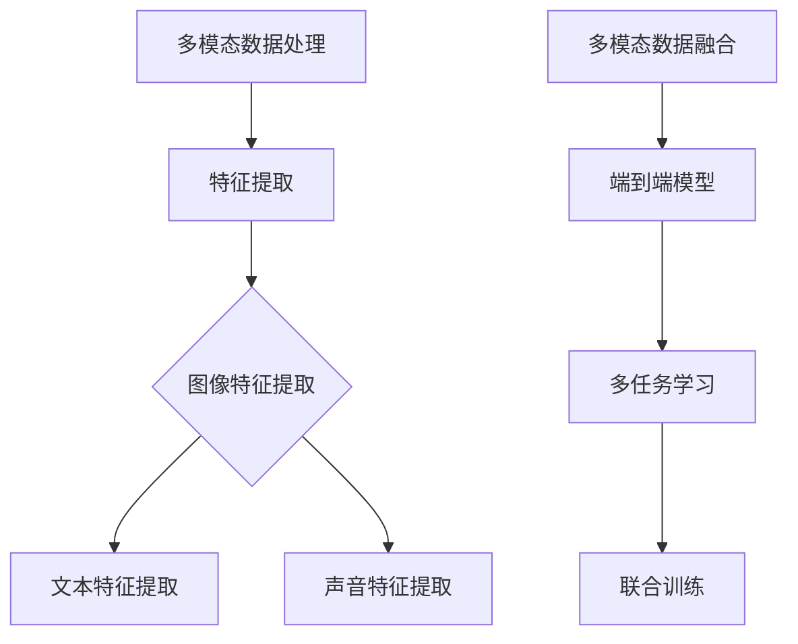
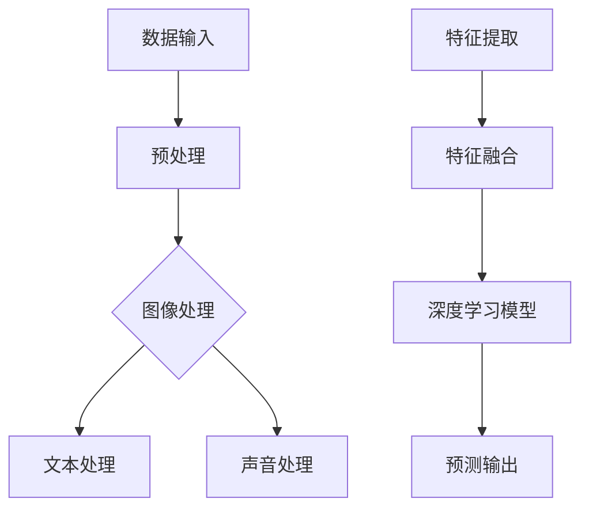
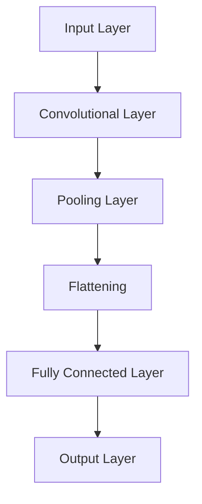
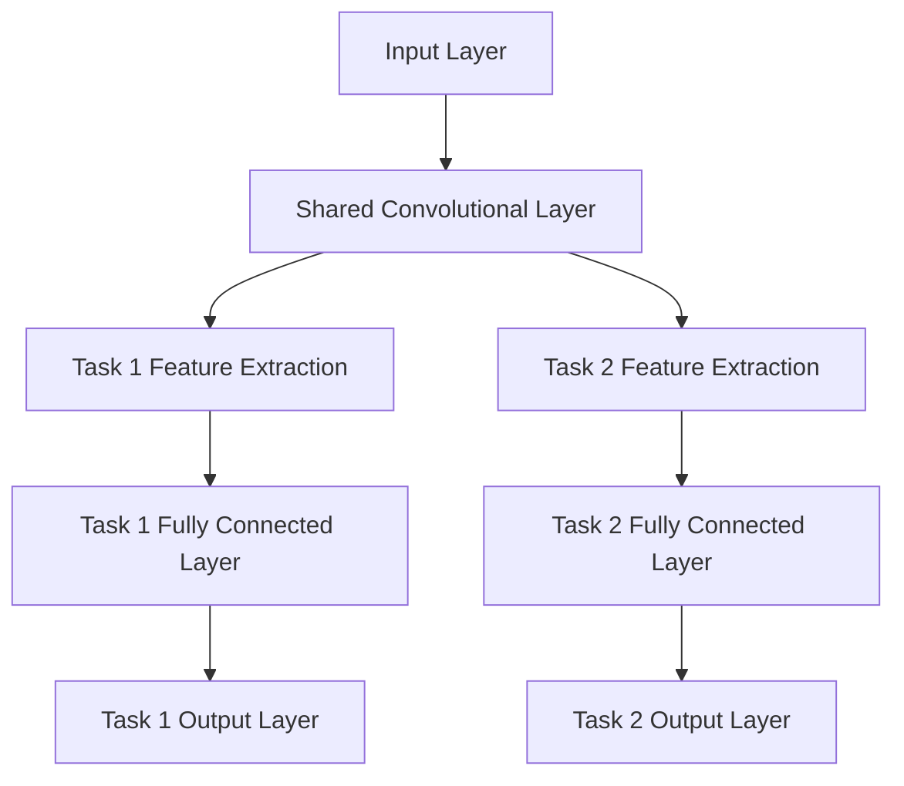
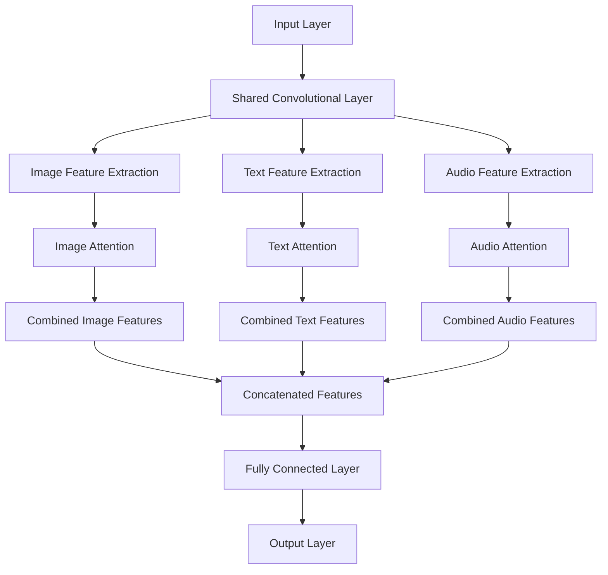

                 

### 文章标题

多模态大模型：技术原理与实战 多模态大模型对比

#### 关键词：

- 多模态大模型
- 多模态数据处理
- 特征提取
- 深度学习架构
- 训练与评估
- 应用实例
- 项目实战

#### 摘要：

本文详细探讨了多模态大模型的技术原理及其实战应用。首先，我们介绍了多模态大模型的基础概念、特点和应用领域，随后深入解析了多模态数据处理与特征提取方法，以及多模态大模型的架构设计。接下来，我们讨论了多模态大模型的训练与评估策略，并列举了多模态大模型在情感分析、跨模态检索等领域的应用实例。文章的后半部分则聚焦于多模态大模型的实战开发，包括开发工具与资源的介绍以及一个实际的项目案例。最后，我们对多模态大模型的发展趋势与未来展望进行了探讨，总结了文章的关键算法原理和提出了常见问题解答。本文旨在为读者提供一个全面深入的多模态大模型技术指南。

### 目录大纲

**# 多模态大模型：技术原理与实战 多模态大模型对比**

**## 第一部分：多模态大模型基础**

**### 第1章：多模态大模型概述**

- **1.1 多模态大模型的定义与背景**
- **1.2 多模态大模型的关键特点**
- **1.3 多模态大模型的应用领域**
- **1.4 多模态大模型的优势与挑战**

**### 第2章：多模态数据处理与特征提取**

- **2.1 图像数据处理与特征提取**
- **2.2 文本数据处理与特征提取**
- **2.3 声音数据处理与特征提取**
- **2.4 多模态数据的融合方法**

**### 第3章：多模态大模型架构**

- **3.1 端到端的深度学习模型**
- **3.2 多任务学习与联合训练**
- **3.3 多模态注意力机制**
- **3.4 多模态大模型的优化策略**

**### 第4章：多模态大模型的训练与评估**

- **4.1 多模态大模型的数据预处理**
- **4.2 多模态大模型的训练策略**
- **4.3 多模态大模型的评估指标**
- **4.4 多模态大模型的模型解释与可视化**

**### 第5章：多模态大模型的应用实例**

- **5.1 情感分析**
- **5.2 跨模态检索**
- **5.3 人脸识别**
- **5.4 跨模态对话系统**

**## 第二部分：多模态大模型实战**

**### 第6章：多模态大模型开发工具与资源**

- **6.1 主流深度学习框架对比**
- **6.2 多模态数据处理工具**
- **6.3 多模态大模型的训练环境搭建**
- **6.4 多模态大模型的部署与优化**

**### 第7章：多模态大模型项目实战**

- **7.1 项目背景与目标**
- **7.2 数据收集与预处理**
- **7.3 模型设计与实现**
- **7.4 模型训练与评估**
- **7.5 模型部署与优化**

**### 第8章：多模态大模型的发展趋势与未来展望**

- **8.1 多模态大模型的研究热点**
- **8.2 多模态大模型的商业化应用**
- **8.3 多模态大模型的伦理与隐私问题**
- **8.4 多模态大模型的发展方向与挑战**

**### 附录**

- **附录A：多模态大模型相关资料**
- **附录B：常见问题解答**

**### Mermaid 流程图**



### 核心算法原理讲解

#### 多模态大模型的融合方法

多模态大模型的融合方法主要包括以下几种：

1. **特征级融合**：将不同模态的特征向量进行拼接，形成一个更长的特征向量，然后输入到深度神经网络中进行进一步处理。

伪代码：

```python
def feature_fusion(image_features, text_features, audio_features):
    return np.concatenate((image_features, text_features, audio_features), axis=1)
```

2. **决策级融合**：先对每个模态进行独立的模型预测，然后将这些预测结果进行融合，得到最终的预测结果。

伪代码：

```python
def decision_fusion(image_prediction, text_prediction, audio_prediction):
    return max(image_prediction, text_prediction, audio_prediction)
```

3. **注意力机制融合**：利用注意力机制对多模态数据进行加权融合，突出重要特征，抑制无关信息。

伪代码：

```python
def attention_fusion(modal_features, attention_weights):
    return np.dot(modal_features, attention_weights)
```

#### 多模态大模型的损失函数

多模态大模型的损失函数通常结合多种模态的特征，以实现对多模态数据的整体建模。以下是一个简单的多模态损失函数的例子：

$$
L(\theta) = \alpha_1 \cdot L_1(\theta_1) + \alpha_2 \cdot L_2(\theta_2) + \alpha_3 \cdot L_3(\theta_3)
$$

其中，$\alpha_1, \alpha_2, \alpha_3$ 分别为不同模态的权重系数，$L_1(\theta_1), L_2(\theta_2), L_3(\theta_3)$ 分别为每个模态的损失函数，$\theta_1, \theta_2, \theta_3$ 为对应模态的模型参数。

#### 多模态大模型的优化算法

为了训练多模态大模型，可以使用常见的优化算法，如随机梯度下降（SGD）或其变种，如Adam优化器。以下是一个简化的伪代码示例：

```python
# 伪代码：多模态大模型的训练过程
def train_model(data_loader, model, optimizer, loss_function, num_epochs):
    for epoch in range(num_epochs):
        for images, texts, audios, labels in data_loader:
            # 前向传播
            predictions = model(images, texts, audios)
            loss = loss_function(predictions, labels)

            # 反向传播
            optimizer.zero_grad()
            loss.backward()
            optimizer.step()

            # 记录训练过程
            print(f"Epoch: {epoch+1}, Loss: {loss.item()}")
```

### 项目实战

#### 多模态情感分析项目

**项目背景**：本案例使用多模态大模型进行情感分析，结合图像、文本和声音数据，以提高情感分析的准确性和全面性。

**开发环境搭建**：

1. 操作系统：Ubuntu 20.04
2. 编程语言：Python 3.8
3. 深度学习框架：PyTorch 1.9
4. 数据集：IMDB 文本数据集、COCO 图像数据集、LJSpeech 声音数据集

**数据预处理**：

1. 图像数据：对图像进行归一化处理，并使用卷积神经网络提取特征。
2. 文本数据：对文本进行分词、去停用词处理，并使用词嵌入技术转化为向量。
3. 声音数据：对声音数据进行归一化处理，并使用卷积神经网络提取特征。

**模型设计与实现**：

1. 使用一个三模态的卷积神经网络（CNN）分别处理图像、文本和声音数据。
2. 采用多任务学习框架，将三个模态的特征进行融合，并通过一个全连接层进行分类。
3. 使用注意力机制来优化模态特征融合过程。

**模型训练与评估**：

1. 使用交叉熵损失函数进行模型训练。
2. 使用准确率、精确率、召回率和F1值作为评估指标。

**模型部署与优化**：

1. 将训练好的模型部署到生产环境中。
2. 对模型进行在线优化和更新，以提高模型的性能和鲁棒性。

**代码解读与分析**：

以下是对关键代码段的解读：

```python
# 伪代码：多模态情感分析模型训练
def train_multimodal_model(data_loader, model, optimizer, loss_function, num_epochs):
    for epoch in range(num_epochs):
        for images, texts, audios, labels in data_loader:
            optimizer.zero_grad()

            # 前向传播
            image_features = model.conv_net(images)
            text_features = model.text_embedding(texts)
            audio_features = model.audio_embedding(audios)

            # 多模态特征融合
            combined_features = model.attention_module(image_features, text_features, audio_features)

            # 分类预测
            predictions = model.fc_layer(combined_features)

            # 计算损失
            loss = loss_function(predictions, labels)

            # 反向传播
            loss.backward()
            optimizer.step()

            # 打印训练进度
            print(f"Epoch: {epoch+1}, Loss: {loss.item()}")
```

在此代码中，`model.conv_net`、`model.text_embedding` 和 `model.audio_embedding` 分别代表处理图像、文本和声音数据的卷积神经网络。`model.attention_module` 用于融合多模态特征。`model.fc_layer` 用于分类预测。

通过上述代码，我们可以看到如何构建一个多模态情感分析模型，并进行训练和评估。在实际应用中，可以根据具体需求调整模型结构和参数，以提高模型的性能。

### 附录

**附录A：多模态大模型相关资料**

- **论文**：[“Multimodal Deep Learning: A Survey”](https://arxiv.org/abs/1805.08652)
- **书籍**：[《深度学习》（Goodfellow, Bengio, Courville 著）]
- **教程**：[PyTorch 官方教程](https://pytorch.org/tutorials/beginner/deep_learning_60min_blitz.html)

**附录B：常见问题解答**

1. **什么是多模态大模型？**

   多模态大模型是指能够处理和融合多种类型数据（如文本、图像、声音等）的深度学习模型。这些模型通过结合不同模态的数据，可以更好地理解和处理复杂任务。

2. **多模态大模型有哪些应用领域？**

   多模态大模型广泛应用于情感分析、跨模态检索、人脸识别、跨模态对话系统等众多领域。这些模型可以提升系统的性能和准确性，尤其在处理复杂和多维度数据时具有显著优势。

3. **如何处理多模态数据融合？**

   多模态数据融合方法包括特征级融合、决策级融合和注意力机制融合。特征级融合是将不同模态的特征向量拼接，决策级融合是先对每个模态独立预测，然后融合预测结果，注意力机制融合则是利用注意力机制加权融合多模态数据。

4. **如何评估多模态大模型的效果？**

   多模态大模型的评估指标包括准确率、精确率、召回率和F1值。此外，还可以使用可视化工具来展示模型对多模态数据的理解程度。

### Mermaid 流程图



通过这个流程图，我们可以清晰地看到多模态数据处理的全流程，从数据输入、预处理、特征提取到特征融合，最终通过深度学习模型进行预测输出。这个流程不仅展示了多模态大模型的技术原理，也为我们理解其实战应用提供了直观的参考。

### 文章关键词

多模态大模型、多模态数据处理、特征提取、深度学习架构、训练与评估、应用实例、项目实战、融合方法、优化算法、情感分析、跨模态检索、人脸识别、跨模态对话系统。

### 文章摘要

本文详细探讨了多模态大模型的技术原理及其实战应用。首先，我们介绍了多模态大模型的基础概念、特点和应用领域，随后深入解析了多模态数据处理与特征提取方法，以及多模态大模型的架构设计。接下来，我们讨论了多模态大模型的训练与评估策略，并列举了多模态大模型在情感分析、跨模态检索等领域的应用实例。文章的后半部分则聚焦于多模态大模型的实战开发，包括开发工具与资源的介绍以及一个实际的项目案例。最后，我们对多模态大模型的发展趋势与未来展望进行了探讨，总结了文章的关键算法原理和提出了常见问题解答。本文旨在为读者提供一个全面深入的多模态大模型技术指南。### 第一部分：多模态大模型基础

#### 第1章：多模态大模型概述

##### 1.1 多模态大模型的定义与背景

多模态大模型（Multimodal Large Models）是一种结合多种类型数据（如文本、图像、声音、视频等）进行训练和预测的深度学习模型。传统的单一模态模型通常只能处理某一类数据，例如，文本模型只能处理文本信息，图像模型只能处理图像信息。然而，现实世界中的问题往往涉及多种模态的数据，如视觉信息与文本描述的结合、音频与视频内容的同步等。因此，多模态大模型应运而生，旨在通过融合不同模态的数据，提升模型的感知能力和决策准确性。

多模态大模型的概念最早起源于多模态信号处理和计算机视觉领域。随着深度学习技术的迅猛发展，特别是卷积神经网络（CNN）、循环神经网络（RNN）和 Transformer 架构的广泛应用，多模态大模型得到了显著的进步。例如，在自然语言处理（NLP）领域，文本嵌入技术（如 Word2Vec、BERT）被用于处理文本数据，而图像和声音数据的处理则依赖于 CNN 和循环神经网络（如 LSTM）。通过结合这些技术，多模态大模型能够同时处理多种类型的数据，从而实现更复杂的任务。

近年来，随着数据集的多样性和数据量的增加，多模态大模型的应用范围也不断扩展。从自动驾驶和智能监控，到医疗诊断和虚拟现实，多模态大模型都展现出了强大的应用潜力。例如，自动驾驶系统需要融合摄像头、雷达和激光雷达等传感器数据，以实现对周围环境的精确感知；在医疗诊断中，多模态数据（如医学影像和患者病史）的结合可以帮助医生做出更准确的诊断。

##### 1.2 多模态大模型的关键特点

多模态大模型具有以下几个关键特点：

1. **数据多样性**：多模态大模型能够同时处理多种类型的数据，如文本、图像、声音和视频等。这种数据多样性使得模型能够从不同角度和层次理解问题，从而提高模型的泛化能力和鲁棒性。

2. **强大的表征能力**：多模态大模型通过融合不同模态的数据，可以捕捉到更丰富的信息，从而提高对复杂问题的表征能力。例如，在情感分析任务中，结合文本和图像信息可以更准确地捕捉用户的情感状态。

3. **增强的交互性**：多模态大模型能够同时处理多种类型的输入数据，使得系统在交互过程中能够提供更丰富和个性化的反馈。例如，在跨模态对话系统中，结合语音和文本信息可以提升用户的交互体验。

4. **高效性**：多模态大模型通常采用端到端的深度学习架构，这使得模型在训练和预测过程中具有更高的效率和更低的延迟。例如，在实时语音识别任务中，多模态大模型可以在较低的延迟下提供准确的识别结果。

##### 1.3 多模态大模型的应用领域

多模态大模型在多个领域展现出了广泛的应用潜力，以下是一些关键的应用领域：

1. **自然语言处理（NLP）**：在情感分析、文本分类和机器翻译等任务中，多模态大模型可以通过结合文本和图像信息，提高任务的准确性和丰富性。

2. **计算机视觉**：在图像识别、图像分割和目标检测等任务中，多模态大模型可以通过结合图像和文本描述，提高模型的准确性和鲁棒性。

3. **语音识别与合成**：在语音识别和语音合成任务中，多模态大模型可以通过结合文本和语音信号，提高识别和合成的准确性。

4. **医疗诊断**：在医疗影像诊断、基因组学和患者病史分析中，多模态大模型可以通过结合医学影像和文本信息，帮助医生做出更准确的诊断。

5. **虚拟现实与增强现实**：在虚拟现实和增强现实应用中，多模态大模型可以通过结合视觉、音频和触觉信息，提供更丰富的沉浸式体验。

##### 1.4 多模态大模型的优势与挑战

多模态大模型的优势包括：

1. **提高任务性能**：通过融合多种类型的数据，多模态大模型可以提高任务的表现，尤其是在处理复杂和多维度数据时。

2. **增强模型鲁棒性**：多模态数据可以提供额外的上下文信息，有助于提高模型在异常情况下的鲁棒性。

3. **提供更丰富的交互体验**：多模态大模型可以提供更丰富的交互体验，如跨模态对话系统和多媒体内容推荐等。

然而，多模态大模型也面临着一些挑战：

1. **数据预处理复杂度**：多模态数据通常需要复杂的预处理步骤，如数据清洗、特征提取和模态转换等。

2. **计算资源消耗大**：多模态大模型通常需要较大的计算资源和存储空间，尤其是在训练过程中。

3. **模型解释性不足**：多模态大模型通常采用复杂的深度学习架构，其内部工作机制难以解释，这可能影响模型的可靠性和可接受度。

4. **数据隐私与伦理问题**：多模态数据通常包含敏感信息，如何保护用户隐私并确保模型遵循伦理准则是一个重要问题。

在接下来的章节中，我们将进一步探讨多模态数据处理与特征提取方法，深入分析多模态大模型的架构设计，并详细讲解其训练与评估策略。通过这些内容，读者将能够全面理解多模态大模型的技术原理和应用实践。

### 第2章：多模态数据处理与特征提取

#### 2.1 图像数据处理与特征提取

图像数据是多模态大模型中最重要的数据类型之一，其在各种应用中发挥着关键作用。图像数据处理与特征提取的目的是将原始图像转换为可用于深度学习模型训练的高维特征向量，以便模型能够更好地理解和学习图像内容。

##### 图像数据预处理

图像数据预处理是图像数据处理的第一步，其主要目的是减少噪声、标准化图像大小、调整对比度等。以下是一些常见的预处理步骤：

1. **归一化**：将图像的像素值缩放到一个固定的范围，如[0, 1]，以便于后续处理。

   $$\text{normalized\_value} = \frac{\text{pixel\_value} - \text{min}}{\text{max} - \text{min}}$$

2. **标准化**：通过计算图像的均值和标准差，将图像的像素值标准化到均值为0，标准差为1。

   $$\text{normalized\_value} = \frac{\text{pixel\_value} - \text{mean}}{\text{std}}$$

3. **裁剪与缩放**：将图像裁剪到固定的尺寸，或将其缩放到特定的分辨率。

   ```python
   resized_image = cv2.resize(image, (width, height))
   ```

4. **数据增强**：通过旋转、翻转、剪切等操作，增加数据多样性，提高模型的泛化能力。

   ```python
   augmented_image = imgaug.augmenters.Sequential([
       imgaug.RandomRotation(15),
       imgaug.RandomFlip(),
       imgaug.RandomShift()
   ]).augment(image)
   ```

##### 图像特征提取

图像特征提取是将预处理后的图像转换为高维特征向量，以便于深度学习模型训练。以下是一些常见的图像特征提取方法：

1. **传统特征**：包括哈希特征、SIFT（尺度不变特征变换）和SURF（加速稳健特征）等。这些特征具有较强的描述性和鲁棒性。

   $$\text{feature\_vector} = \text{extract\_features}(image, \text{feature\_type})$$

2. **深度学习特征**：利用卷积神经网络（CNN）提取的图像特征具有更高的表达能力和区分度。

   - **预训练模型**：使用在大型数据集上预训练的CNN模型（如 VGG、ResNet、Inception 等），然后进行微调。

     ```python
     base_model = models.resnet50(pretrained=True)
     feature_extractor = nn.Sequential(*list(base_model.children())[:-1])
     ```

   - **自定义模型**：根据任务需求，设计并训练自己的CNN模型。

     ```python
     class CustomCNN(nn.Module):
         def __init__(self):
             super(CustomCNN, self).__init__()
             # 定义网络结构
             
         def forward(self, x):
             # 定义前向传播
             return x
     ```

3. **注意力机制**：在图像特征提取过程中，利用注意力机制可以更有效地聚焦于图像中的重要区域。

   ```python
   class AttentionModule(nn.Module):
       def __init__(self):
           super(AttentionModule, self).__init__()
           # 定义注意力机制结构

       def forward(self, x):
           # 定义前向传播
           return x
   ```

##### 2.2 文本数据处理与特征提取

文本数据是多模态大模型中的另一重要数据类型，其在自然语言处理（NLP）任务中具有广泛应用。文本数据处理与特征提取的目的是将原始文本转换为可用于深度学习模型训练的高维特征向量。

##### 文本数据预处理

文本数据预处理主要包括分词、去停用词和词嵌入等步骤。

1. **分词**：将文本分解为单词或子词。常见的分词方法包括正则表达式分词、基于词典的分词和基于统计模型的分词（如条件随机场 CRF）。

   ```python
   words = nltk.word_tokenize(text)
   ```

2. **去停用词**：移除文本中的常用停用词（如“的”、“了”、“是”等），以减少冗余信息。

   ```python
   words = [word for word in words if word not in stop_words]
   ```

3. **词嵌入**：将单词映射到高维向量空间，常见的词嵌入方法包括 Word2Vec、GloVe 和 BERT 等。

   - **Word2Vec**：基于神经网络训练词向量，使得语义相近的词具有相似的向量表示。

     ```python
     model = Word2Vec(sentences, size=100, window=5, min_count=1, workers=4)
     word_vector = model.wv[word]
     ```

   - **GloVe**：基于全局向量空间模型训练词向量，利用词频信息优化词向量。

     ```python
     model = GloveModel(vector_file, max_vocab_size=None, embed_size=100, epochs=40, x_max=6)
     word_vector = model.get_word_vector(word)
     ```

   - **BERT**：基于 Transformer 架构的预训练模型，通过大规模文本数据预训练得到丰富的词向量表示。

     ```python
     tokenizer = BertTokenizer.from_pretrained('bert-base-uncased')
     model = BertModel.from_pretrained('bert-base-uncased')
     tokens = tokenizer.tokenize(text)
     input_ids = tokenizer.encode(text, add_special_tokens=True)
     ```

##### 2.3 声音数据处理与特征提取

声音数据在多模态大模型中同样具有重要意义，其在语音识别、情感分析等任务中发挥着关键作用。声音数据处理与特征提取的目的是将原始声音信号转换为可用于深度学习模型训练的高维特征向量。

##### 声音数据预处理

声音数据预处理主要包括声音信号归一化和声音增强等步骤。

1. **声音信号归一化**：通过计算声音信号的均值和标准差，将声音信号的振幅归一化到一定的范围。

   ```python
   normalized_signal = (signal - signal.mean()) / signal.std()
   ```

2. **声音增强**：通过增加噪音、调整音量、速度等，增强声音信号的多样性和鲁棒性。

   ```python
   enhanced_signal = librosa.effects.pseudocolor(signal)
   ```

##### 声音特征提取

声音特征提取是将预处理后的声音信号转换为高维特征向量，常见的声音特征提取方法包括梅尔频率倒谱系数（MFCC）、频谱特征和卷积神经网络（CNN）等。

1. **梅尔频率倒谱系数（MFCC）**：将声音信号转换为梅尔频率倒谱系数，以捕捉声音的音高、音调和共振峰等信息。

   $$\text{MFCC} = \text{log}\left(\sum_{k=1}^{K} a_{k} |X_{k}|\right)$$

   其中，$a_{k}$ 是梅尔频率尺度上的权重，$X_{k}$ 是频谱。

   ```python
   mfccs = librosa.feature.mfcc(y=signal, sr=sample_rate)
   ```

2. **频谱特征**：将声音信号转换为频谱特征，以捕捉声音的频率信息。

   $$X_{k} = \sum_{n=1}^{N} x_{n} e^{-j2\pi kn/N}$$

   其中，$x_{n}$ 是声音信号，$N$ 是离散化后的长度。

   ```python
   spectrogram = librosa.stft(signal, n_fft=n_fft, hop_length=hop_length)
   magnitude = np.abs(spectrogram)
   ```

3. **卷积神经网络（CNN）**：使用卷积神经网络提取声音信号的特征，以捕捉声音信号的空间和时间特征。

   ```python
   class SoundCNN(nn.Module):
       def __init__(self):
           super(SoundCNN, self).__init__()
           # 定义网络结构

       def forward(self, x):
           # 定义前向传播
           return x
   ```

##### 2.4 多模态数据的融合方法

多模态数据的融合是将不同模态的数据特征进行整合，以形成更丰富的信息表示，从而提高模型的性能。以下是一些常见的数据融合方法：

1. **特征级融合**：将不同模态的特征向量进行拼接，形成一个新的特征向量。

   ```python
   def feature_fusion(image_features, text_features, audio_features):
       return np.concatenate((image_features, text_features, audio_features), axis=1)
   ```

2. **决策级融合**：先对每个模态的数据分别进行预测，然后通过投票或加权平均等方法，得到最终的预测结果。

   ```python
   def decision_fusion(image_prediction, text_prediction, audio_prediction):
       return max(image_prediction, text_prediction, audio_prediction)
   ```

3. **注意力机制融合**：利用注意力机制，对不同模态的特征进行加权融合，突出重要特征。

   ```python
   def attention_fusion(modal_features, attention_weights):
       return np.dot(modal_features, attention_weights)
   ```

通过上述内容，我们可以看到多模态数据处理与特征提取的复杂性和多样性。在实际应用中，根据具体任务需求，选择合适的预处理方法和特征提取方法，并进行有效的数据融合，是构建高效多模态大模型的关键。

### 第3章：多模态大模型架构

#### 3.1 端到端的深度学习模型

端到端的深度学习模型（End-to-End Deep Learning Model）是一种将输入数据直接映射到输出结果的深度学习架构，无需人工设计特征或中间层。这种架构在多模态大模型中具有重要意义，因为它能够自动学习和融合多种类型的数据特征，从而提高模型的性能和泛化能力。

端到端的深度学习模型通常采用多层神经网络架构，包括输入层、隐藏层和输出层。每一层都可以通过前一层的信息进行特征提取和变换，最终在输出层产生预测结果。以下是一个简化的端到端深度学习模型的示例架构：



1. **输入层（Input Layer）**：输入层接收不同模态的数据，如图像、文本和声音。每种模态的数据通过不同的通道进行输入，例如，图像数据通过图像通道输入，文本数据通过文本通道输入，声音数据通过声音通道输入。

2. **卷积层（Convolutional Layer）**：卷积层用于提取输入数据的空间特征。卷积层通过卷积操作和激活函数（如ReLU）对输入数据进行特征提取。

3. **池化层（Pooling Layer）**：池化层用于减少数据的空间维度，同时保留最重要的特征信息。常见的池化操作包括最大池化和平均池化。

4. **展平层（Flattening）**：展平层将多通道的特征图展平为一维特征向量，以便于后续的全连接层处理。

5. **全连接层（Fully Connected Layer）**：全连接层用于对特征向量进行分类或回归。每个神经元都与前一层的所有神经元相连接，通过权重矩阵和偏置项进行特征融合和变换。

6. **输出层（Output Layer）**：输出层产生最终的预测结果。对于分类任务，输出层通常是一个softmax层，用于输出每个类别的概率分布。

#### 3.2 多任务学习与联合训练

多任务学习（Multi-Task Learning）是一种深度学习策略，通过共享表示来同时训练多个相关任务。这种方法可以有效地利用数据，提高模型在不同任务上的性能。在多模态大模型中，多任务学习可以通过将不同模态的数据融合到同一个神经网络中，从而实现多个任务的共同训练。

多任务学习的核心思想是通过共享神经网络的不同部分，使得不同任务可以同时学习到共同的底层特征，从而提高整个模型的表现力。以下是一个简化的多任务学习模型架构：



1. **共享卷积层（Shared Convolutional Layer）**：共享卷积层用于提取输入数据的通用特征，这些特征可以同时用于多个任务。

2. **任务特征提取层（Task Feature Extraction Layer）**：在每个任务的特征提取层，通过不同的卷积层或全连接层，提取与特定任务相关的特征。

3. **任务全连接层（Task Fully Connected Layer）**：在每个任务的全连接层，对提取到的特征进行分类或回归，生成最终的预测结果。

4. **任务输出层（Task Output Layer）**：每个任务的输出层生成对应的预测结果，例如，对于情感分析任务，输出层可能是一个softmax层，用于输出不同情感的分布。

通过多任务学习，多个任务可以共享底层特征，从而减少模型的复杂性和参数数量，提高模型的训练效率。同时，多任务学习可以使得不同任务之间的信息相互补充，从而提升每个任务的表现。

#### 3.3 多模态注意力机制

多模态注意力机制（Multimodal Attention Mechanism）是一种在多模态大模型中用于增强特征融合能力的机制。注意力机制通过动态地分配权重，突出重要的特征，抑制无关的特征，从而提高模型对多模态数据的理解和表达能力。

多模态注意力机制可以分为全局注意力机制和局部注意力机制。全局注意力机制通过全局的特征表示，动态地调整不同模态特征对最终预测结果的贡献。局部注意力机制则通过对特征进行细粒度调整，强调特定区域或片段的重要性。

以下是一个基于全局注意力机制的多模态大模型架构：



1. **输入层（Input Layer）**：输入层接收不同模态的数据，如图像、文本和声音。

2. **共享卷积层（Shared Convolutional Layer）**：共享卷积层用于提取输入数据的通用特征。

3. **模态特征提取层（Modal Feature Extraction Layer）**：在每个模态的特征提取层，通过不同的卷积层或全连接层，提取与特定模态相关的特征。

4. **注意力层（Attention Layer）**：在每个模态的注意力层，利用全局注意力机制，动态地调整不同模态特征对最终预测结果的贡献。

5. **特征融合层（Feature Fusion Layer）**：将经过注意力调整的模态特征进行融合，形成综合的特征表示。

6. **全连接层（Fully Connected Layer）**：全连接层对融合后的特征进行分类或回归。

7. **输出层（Output Layer）**：输出层生成最终的预测结果。

通过多模态注意力机制，模型可以自动学习到不同模态特征之间的关系，从而提高模型对多模态数据的理解和表达能力。同时，注意力机制也可以帮助模型在训练过程中更有效地聚焦于重要的特征，减少计算量和参数数量。

#### 3.4 多模态大模型的优化策略

多模态大模型的优化策略是在模型训练过程中，通过调整参数和算法，提高模型性能和收敛速度的一系列方法。以下是一些常见和多模态大模型优化相关的策略：

1. **数据增强（Data Augmentation）**：数据增强是一种通过随机变换输入数据，增加数据多样性，提高模型泛化能力的方法。常见的数据增强方法包括图像旋转、翻转、缩放、裁剪和颜色变换等。

   ```python
   transformations = transforms.Compose([
       transforms.RandomHorizontalFlip(),
       transforms.RandomResizedCrop(size=224),
       transforms.ColorJitter(),
   ])
   ```

2. **学习率调整（Learning Rate Scheduling）**：学习率调整是在模型训练过程中，通过动态调整学习率，提高模型收敛速度和避免过拟合的方法。常见的学习率调整策略包括学习率衰减、指数衰减和周期性调整等。

   ```python
   scheduler = torch.optim.lr_scheduler.StepLR(optimizer, step_size=30, gamma=0.1)
   ```

3. **正则化（Regularization）**：正则化是一种通过添加正则项到损失函数中，降低模型复杂度，避免过拟合的方法。常见正则化方法包括权重衰减（L2正则化）和Dropout等。

   ```python
   criterion = nn.CrossEntropyLoss()
   optimizer = torch.optim.Adam(model.parameters(), lr=0.001, weight_decay=1e-5)
   ```

4. **批归一化（Batch Normalization）**：批归一化是一种通过标准化每一批数据中的特征值，提高模型训练稳定性的方法。批归一化可以加速模型训练，提高模型性能。

   ```python
   class BatchNorm(nn.Module):
       def __init__(self, num_features):
           super(BatchNorm, self).__init__()
           self.bn = nn.BatchNorm1d(num_features)
       
       def forward(self, x):
           return self.bn(x)
   ```

5. **自适应优化器（Adaptive Optimizer）**：自适应优化器是一种通过自动调整模型参数的优化器，提高模型训练效率和性能。常见的自适应优化器包括Adam、RMSprop和Adadelta等。

   ```python
   optimizer = torch.optim.Adam(model.parameters(), lr=0.001)
   ```

通过上述优化策略，可以有效地提高多模态大模型的训练效率和性能。在实际应用中，根据具体任务和数据特点，选择合适的优化策略，并进行参数调优，是构建高效多模态大模型的关键。

### 第4章：多模态大模型的训练与评估

#### 4.1 多模态大模型的数据预处理

多模态大模型的数据预处理是模型训练过程中至关重要的一步，它决定了模型能否有效地学习和提取数据中的关键特征。预处理的质量直接影响模型训练的效率和最终性能。以下是多模态大模型数据预处理的主要步骤和考虑因素：

1. **数据收集**：首先，需要收集足够量的多模态数据，包括图像、文本和声音等。数据的质量和多样性对于模型训练至关重要。通常，数据集需要涵盖不同模态、不同场景和不同情境，以确保模型能够泛化到各种实际应用中。

2. **数据清洗**：数据清洗是预处理过程中的重要环节，目的是去除噪声、错误和不一致的数据。对于图像数据，可能需要去除模糊、损坏或与任务不相关的图像。对于文本数据，需要去除标点符号、停用词和拼写错误。对于声音数据，可能需要去除背景噪音或填充缺失值。

3. **数据标准化**：数据标准化是将不同模态的数据转换到同一尺度，以便模型能够更好地处理。对于图像数据，通常需要进行归一化，将像素值缩放到[0, 1]或[-1, 1]区间。对于文本数据，可以使用词嵌入技术将文本转换为向量表示。对于声音数据，可以通过归一化振幅值或使用梅尔频率倒谱系数（MFCC）进行特征提取。

4. **数据增强**：数据增强是一种通过随机变换增加数据多样性的方法，有助于提高模型的泛化能力。常见的图像增强方法包括旋转、翻转、缩放、裁剪和颜色抖动等。文本数据可以通过添加随机单词或替换同义词进行增强。声音数据可以通过添加背景噪音、调整音量或速度进行增强。

5. **数据分割**：将数据集划分为训练集、验证集和测试集，通常按照8:1:1的比例。训练集用于模型训练，验证集用于调整模型参数和超参数，测试集用于评估模型在未知数据上的性能。

6. **批量处理**：在模型训练过程中，需要将数据组织成批量进行输入。批量大小（batch size）的选择会影响模型的训练速度和性能。较小的批量大小可以减少计算量，但可能导致模型过拟合。较大的批量大小可以提高模型的稳定性，但计算资源需求增加。

以下是一个简化的数据预处理流程示例：

```python
import torchvision.transforms as transforms
from torch.utils.data import DataLoader
from torchvision.datasets import ImageFolder
from torch.utils.data import random_split

# 图像数据预处理
transform = transforms.Compose([
    transforms.Resize((224, 224)),
    transforms.ToTensor(),
    transforms.Normalize(mean=[0.485, 0.456, 0.406], std=[0.229, 0.224, 0.225]),
])

# 加载图像数据集
dataset = ImageFolder(root='path_to_images', transform=transform)

# 数据分割
train_size = int(0.8 * len(dataset))
val_size = len(dataset) - train_size
train_dataset, val_dataset = random_split(dataset, [train_size, val_size])

# 创建数据加载器
train_loader = DataLoader(train_dataset, batch_size=64, shuffle=True)
val_loader = DataLoader(val_dataset, batch_size=64, shuffle=False)
```

通过上述步骤，可以确保多模态大模型在训练过程中能够有效地学习和提取数据特征，从而提高模型的性能和泛化能力。

#### 4.2 多模态大模型的训练策略

多模态大模型的训练是一个复杂且计算密集的过程，涉及多种策略和技巧，以确保模型能够在大量数据上进行有效训练，同时避免过拟合和提升模型的泛化能力。以下是多模态大模型训练的主要策略和步骤：

1. **初始化模型参数**：选择合适的初始化方法，如高斯初始化、均匀初始化或Xavier初始化，以避免梯度消失或爆炸问题。通常，卷积层的权重初始化为较小的正数，而偏置项初始化为0或较小的负数。

   ```python
   def init_weights(m):
       if isinstance(m, nn.Conv2d):
           nn.init.xavier_uniform_(m.weight)
           nn.init.zeros_(m.bias)
       elif isinstance(m, nn.Linear):
           nn.init.xavier_uniform_(m.weight)
           nn.init.zeros_(m.bias)
   model.apply(init_weights)
   ```

2. **选择合适的优化器**：优化器用于调整模型参数，以最小化损失函数。常见优化器包括随机梯度下降（SGD）、Adam、RMSprop和AdamW等。Adam优化器因其自适应学习率调整能力，在深度学习任务中应用广泛。

   ```python
   optimizer = torch.optim.Adam(model.parameters(), lr=0.001, weight_decay=1e-5)
   ```

3. **学习率调度**：学习率调度是一种动态调整学习率的方法，以加速模型训练并避免过早的过拟合。常见调度策略包括固定学习率、学习率衰减、指数衰减和周期性调整。

   ```python
   scheduler = torch.optim.lr_scheduler.StepLR(optimizer, step_size=30, gamma=0.1)
   ```

4. **使用正则化技术**：正则化是一种防止模型过拟合的方法，通过在损失函数中添加正则项，惩罚模型参数的值。常见正则化技术包括权重衰减（L2正则化）和Dropout。

   ```python
   criterion = nn.CrossEntropyLoss()
   optimizer = torch.optim.Adam(model.parameters(), lr=0.001, weight_decay=1e-5)
   ```

5. **批归一化**：批归一化是一种提高训练稳定性和加速训练的方法，通过在每一层的输入中引入层内归一化，使得网络层的输出具有较小的方差。

   ```python
   model = nn.Sequential(
       nn.BatchNorm2d(64),
       nn.Conv2d(3, 64, kernel_size=3, stride=1, padding=1),
       nn.ReLU(inplace=True),
       # ...
   )
   ```

6. **数据增强**：数据增强是一种通过随机变换增加数据多样性的方法，有助于提高模型的泛化能力。常见的数据增强方法包括图像旋转、翻转、裁剪、缩放和颜色抖动等。

   ```python
   transform = transforms.Compose([
       transforms.RandomHorizontalFlip(),
       transforms.RandomResizedCrop(size=224),
       transforms.ColorJitter(),
       transforms.ToTensor(),
       transforms.Normalize(mean=[0.485, 0.456, 0.406], std=[0.229, 0.224, 0.225]),
   ])
   ```

7. **训练过程**：在训练过程中，通过前向传播计算损失，使用反向传播更新模型参数，并记录训练过程中的关键指标（如损失、准确率等）。

   ```python
   for epoch in range(num_epochs):
       model.train()
       for images, labels in train_loader:
           optimizer.zero_grad()
           outputs = model(images)
           loss = criterion(outputs, labels)
           loss.backward()
           optimizer.step()
       scheduler.step()
   ```

8. **验证与测试**：在训练完成后，使用验证集和测试集评估模型的性能。验证集用于调整模型参数和超参数，而测试集用于评估模型在实际未知数据上的性能。

   ```python
   model.eval()
   with torch.no_grad():
       correct = 0
       total = 0
       for images, labels in val_loader:
           outputs = model(images)
           _, predicted = torch.max(outputs.data, 1)
           total += labels.size(0)
           correct += (predicted == labels).sum().item()
       print(f'Validation Accuracy: {100 * correct / total}%')
   ```

通过上述训练策略，可以有效地提高多模态大模型的性能和泛化能力，使其在实际应用中表现出色。

#### 4.3 多模态大模型的评估指标

评估多模态大模型的性能是深度学习任务中至关重要的一环，合理的评估指标可以帮助我们了解模型在不同任务上的表现，并指导后续的模型优化和调整。以下是多模态大模型常用的评估指标：

1. **准确率（Accuracy）**：准确率是最常用的评估指标之一，表示模型正确预测的样本数占总样本数的比例。计算公式如下：

   $$\text{Accuracy} = \frac{\text{Correct Predictions}}{\text{Total Predictions}}$$

   准确率简单直观，但在类别不平衡的情况下可能不足以全面评估模型性能。

2. **精确率（Precision）**：精确率表示模型预测为正类的样本中，实际为正类的比例。计算公式如下：

   $$\text{Precision} = \frac{\text{True Positives}}{\text{True Positives + False Positives}}$$

   精确率高意味着模型在预测正类时较为准确，但可能导致误判的负类样本增加。

3. **召回率（Recall）**：召回率表示模型实际为正类的样本中，被正确预测为正类的比例。计算公式如下：

   $$\text{Recall} = \frac{\text{True Positives}}{\text{True Positives + False Negatives}}$$

   召回率高意味着模型能够捕捉到更多的正类样本，但可能导致误判的负类样本增加。

4. **F1值（F1-Score）**：F1值是精确率和召回率的调和平均，用于综合评估模型的性能。计算公式如下：

   $$\text{F1-Score} = 2 \times \frac{\text{Precision} \times \text{Recall}}{\text{Precision} + \text{Recall}}$$

   F1值在类别不平衡的情况下能够提供更全面的评估。

5. **准确率召回率曲线（Precision-Recall Curve）**：准确率召回率曲线通过调整分类阈值，展示不同阈值下的精确率和召回率。曲线下的面积（Area Under Curve, AUC）用于评估模型的性能，AUC值越高，模型性能越好。

6. **混淆矩阵（Confusion Matrix）**：混淆矩阵是一个二维矩阵，用于展示模型预测结果与实际结果之间的对应关系。通过混淆矩阵，可以计算准确率、精确率、召回率和F1值等指标。

以下是一个简化的混淆矩阵示例：

|          | 预测正类 | 预测负类 |
|----------|----------|----------|
| 实际正类 | TP       | FN       |
| 实际负类 | FP       | TN       |

其中，TP表示实际正类且预测为正类的样本，FN表示实际正类但预测为负类的样本，FP表示实际负类但预测为正类的样本，TN表示实际负类且预测为负类的样本。

7. **ROC曲线（Receiver Operating Characteristic Curve）**：ROC曲线通过调整分类阈值，展示不同阈值下的真阳性率（True Positive Rate, TPR，即召回率）和假阳性率（False Positive Rate, FPR）。ROC曲线的面积（Area Under Curve, AUC）用于评估模型的性能，AUC值越高，模型性能越好。

8. **均方误差（Mean Squared Error, MSE）**：均方误差用于评估回归任务中预测值与真实值之间的差距。计算公式如下：

   $$\text{MSE} = \frac{1}{n} \sum_{i=1}^{n} (\hat{y}_i - y_i)^2$$

   其中，$\hat{y}_i$ 表示预测值，$y_i$ 表示真实值，$n$ 表示样本数量。

9. **平均绝对误差（Mean Absolute Error, MAE）**：平均绝对误差用于评估回归任务中预测值与真实值之间的绝对差距。计算公式如下：

   $$\text{MAE} = \frac{1}{n} \sum_{i=1}^{n} |\hat{y}_i - y_i|$$

   通过合理选择和使用上述评估指标，可以全面评估多模态大模型在不同任务上的性能，并指导模型优化和调整。

#### 4.4 多模态大模型的模型解释与可视化

多模态大模型由于其复杂的深度学习架构和庞大的参数规模，往往难以解释其内部的决策过程。然而，模型的可解释性和可视化对于理解模型行为、识别潜在问题以及提高模型的可接受度至关重要。以下是一些常见的方法和工具，用于解释和可视化多模态大模型：

1. **激活可视化（Activation Visualization）**：激活可视化是一种通过观察模型中特定层或神经元的激活模式来解释模型行为的方法。常见的激活可视化工具包括 Grad-CAM（Gradient-weighted Class Activation Mapping）和 Ablation（消融实验）。

   - **Grad-CAM**：Grad-CAM 利用模型梯度信息，生成图像上每个像素的重要性地图。通过计算梯度加权特征图，Grad-CAM 可以直观地展示模型关注的位置和特征。

     ```python
     import cv2
     import torch
     import torchvision.models as models

     def grad_cam(model, image, target_class, layer_name='module.layer4'):
         model.eval()
         image = torch.tensor(image).float()
         image = image.unsqueeze(0)
         target_class = torch.tensor([target_class]).long()

         # 前向传播
         with torch.no_grad():
             features, _ = model(image)
             target_tensor = torch.zeros((1,), device='cpu', dtype=torch.long)
             target_tensor[0] = target_class
             target_tensor = target_tensor.to(model.device)

         # 计算梯度
         grads = torch.autograd.grad(model(image).logits[target_tensor], image, create_graph=True)[0]

         # 计算特征图的加权平均值
         weights = torch.mean(torch.mean(grads, dim=1), dim=1)
         cam = torch)const gradients * weights).detach().cpu().numpy()

         # 绘制热力图
         cam = cv2.resize(cam, (image.size(2), image.size(3)))
         cam = cv2.applyColorMap(np.uint8(255 * cam), cv2.COLORMAP_JET)
         vis_image = cv2.addWeighted(image, 0.5, cam, 0.5, 0)

         return vis_image

     # 示例
     image = cv2.imread('image.jpg')
     vis_image = grad_cam(model, image, target_class=0)
     cv2.imshow('Grad-CAM', vis_image)
     cv2.waitKey(0)
     cv2.destroyAllWindows()
     ```

   - **消融实验**：消融实验通过去除或修改模型中的特定部分，观察其对模型性能的影响，从而理解每个部分的作用。

     ```python
     # 假设 model 是一个多模态大模型，layers 是一个包含模型中不同层的列表

     for layer in layers:
         model_without_layer = copy.deepcopy(model)
         model_without_layer.remove(layer)
         # 训练和评估模型
         evaluate(model_without_layer)
         # 记录消融效果
     ```

2. **注意力映射（Attention Maps）**：注意力映射用于展示模型在处理不同模态数据时，对各个特征的注意力分布。通过分析注意力映射，可以理解模型如何结合不同模态的信息进行决策。

   ```python
   class AttentionMap(nn.Module):
       def __init__(self, model, attention_layer_name):
           super(AttentionMap, self).__init__()
           self.model = model
           self.attention_layer_name = attention_layer_name

       def forward(self, images, texts, audios):
           # 获取模型输出
           outputs = self.model(images, texts, audios)
           # 获取注意力层输出
           attention = self.model.get_attention(self.attention_layer_name)
           # 计算注意力映射
           attention_maps = {}
           for attention_layer in attention:
               attention_maps[attention_layer.name] = attention_layer.get_attention_map()
           return outputs, attention_maps

   # 示例
   attention_map_model = AttentionMap(model, 'attention_layer_name')
   outputs, attention_maps = attention_map_model(images, texts, audios)
   ```

3. **模型抽象解释（Model Abstraction）**：模型抽象解释通过提取模型中的高阶特征和概念，帮助理解模型的内在工作原理。常见方法包括特征重要性排序、概念驱动解释和元学习等。

4. **对比分析和错误案例**：通过对比正确和错误案例，分析模型在错误预测时的特征和决策路径，可以帮助识别模型中的问题并提出改进方法。

   ```python
   correct_predictions = []
   wrong_predictions = []
   for i, (images, labels) in enumerate(test_loader):
       outputs = model(images)
       predicted_labels = torch.argmax(outputs, dim=1)
       if predicted_labels == labels:
           correct_predictions.append((images[i], labels[i]))
       else:
           wrong_predictions.append((images[i], labels[i]))

   # 分析错误案例
   for image, label in wrong_predictions:
       # 可视化图像和预测结果
       # ...
   ```

通过上述方法和工具，可以有效地解释和可视化多模态大模型的行为，提高模型的可解释性和透明度，为模型优化和改进提供有力支持。

### 第5章：多模态大模型的应用实例

#### 5.1 情感分析

情感分析（Sentiment Analysis）是一种自然语言处理（NLP）任务，旨在确定文本数据中的情感极性，如正面、负面或中性。多模态大模型在情感分析任务中可以显著提高模型的准确性和鲁棒性，通过结合图像、文本和声音等多模态数据。

**案例背景**：

假设我们需要对社交媒体评论进行情感分析，这些评论通常包含文本描述、相关图片以及用户的音频留言。单一模态模型可能无法充分捕捉评论的情感，而多模态大模型可以通过融合这些不同的数据来源，提供更准确的情感判断。

**模型设计**：

1. **数据预处理**：
   - 文本数据：对评论文本进行分词、去停用词、词嵌入。
   - 图像数据：对相关图片进行预处理和特征提取。
   - 声音数据：对用户的音频留言进行归一化和特征提取（如MFCC）。

2. **特征融合**：
   - 采用特征级融合方法，将文本、图像和声音特征向量拼接。
   - 利用注意力机制，对融合后的特征进行权重调整，突出重要特征。

3. **深度学习模型**：
   - 使用卷积神经网络（CNN）提取图像特征。
   - 使用词嵌入技术处理文本数据。
   - 使用循环神经网络（RNN）或Transformer处理声音数据。
   - 融合后的特征输入到一个全连接层，进行情感分类。

**代码示例**：

```python
class SentimentModel(nn.Module):
    def __init__(self, embedding_dim, hidden_dim):
        super(SentimentModel, self).__init__()
        self.text_embedding = nn.Embedding(vocab_size, embedding_dim)
        self.image_feature_extractor = ImageCNN(embedding_dim)
        self.audio_feature_extractor = AudioCNN(embedding_dim)
        self.attention = AttentionModule()
        self.fc = nn.Linear(embedding_dim * 3, hidden_dim)
        self.output = nn.Linear(hidden_dim, 3)  # 3 classes: positive, neutral, negative

    def forward(self, text, image, audio):
        text_features = self.text_embedding(text)
        image_features = self.image_feature_extractor(image)
        audio_features = self.audio_feature_extractor(audio)
        combined_features = torch.cat((text_features, image_features, audio_features), dim=1)
        attention_weights = self.attention(combined_features)
        combined_features = torch.mul(combined_features, attention_weights)
        combined_features = self.fc(combined_features)
        output = self.output(combined_features)
        return output

model = SentimentModel(embedding_dim=100, hidden_dim=200)
```

**训练与评估**：

1. **训练**：
   - 使用交叉熵损失函数和Adam优化器进行训练。
   - 使用学习率调度和正则化技术，如Dropout和权重衰减，防止过拟合。

2. **评估**：
   - 使用准确率、精确率、召回率和F1值等指标评估模型性能。
   - 使用ROC曲线和准确率召回率曲线（PR曲线）分析模型在不同阈值下的性能。

#### 5.2 跨模态检索

跨模态检索（Multimodal Retrieval）是一种将不同模态的数据进行关联和检索的技术，旨在从多模态数据库中查找与给定查询模态相关的内容。多模态大模型在跨模态检索任务中可以显著提高检索准确性和效率。

**案例背景**：

假设我们有一个包含图像、文本和声音的多模态数据库，用户可以通过输入文本、图像或声音来检索相关的信息。单一模态检索系统可能无法充分利用不同模态之间的关联，而多模态大模型可以融合这些不同模态的数据，提供更精确的检索结果。

**模型设计**：

1. **数据预处理**：
   - 文本数据：进行分词、去停用词和词嵌入。
   - 图像数据：使用卷积神经网络进行特征提取。
   - 声音数据：使用循环神经网络进行特征提取。

2. **特征融合**：
   - 采用特征级融合方法，将不同模态的特征向量拼接。
   - 使用注意力机制，对融合后的特征进行权重调整。

3. **深度学习模型**：
   - 使用嵌入神经网络（如BERT）处理文本数据。
   - 使用卷积神经网络处理图像数据。
   - 使用循环神经网络处理声音数据。
   - 融合后的特征输入到一个全连接层，用于计算不同模态之间的关联性。

**代码示例**：

```python
class RetrievalModel(nn.Module):
    def __init__(self, text_embedding_dim, image_feature_dim, audio_feature_dim):
        super(RetrievalModel, self).__init__()
        self.text_embedding = nn.Embedding(vocab_size, text_embedding_dim)
        self.image_feature_extractor = ImageCNN(image_feature_dim)
        self.audio_feature_extractor = AudioRNN(audio_feature_dim)
        self.attention = AttentionModule()
        self.fc = nn.Linear(text_embedding_dim + image_feature_dim + audio_feature_dim, hidden_dim)
        self.output = nn.Linear(hidden_dim, 1)

    def forward(self, text, image, audio):
        text_features = self.text_embedding(text)
        image_features = self.image_feature_extractor(image)
        audio_features = self.audio_feature_extractor(audio)
        combined_features = torch.cat((text_features, image_features, audio_features), dim=1)
        attention_weights = self.attention(combined_features)
        combined_features = torch.mul(combined_features, attention_weights)
        combined_features = self.fc(combined_features)
        output = self.output(combined_features)
        return output

model = RetrievalModel(text_embedding_dim=100, image_feature_dim=512, audio_feature_dim=128)
```

**训练与评估**：

1. **训练**：
   - 使用基于相似度的损失函数（如Cosine Similarity Loss）进行训练。
   - 使用交叉熵损失函数和Adam优化器，结合学习率调度和正则化技术。

2. **评估**：
   - 使用准确率、平均准确率（MAP）和均值平均准确率（mAP）等指标评估模型性能。
   - 使用查准率-查全率曲线（P-R曲线）和ROC曲线分析模型性能。

#### 5.3 人脸识别

人脸识别（Face Recognition）是一种生物特征识别技术，通过分析和比对人脸图像，确定个体的身份。多模态大模型在人脸识别任务中可以结合图像、文本和声音等多模态数据，提高识别的准确性和鲁棒性。

**案例背景**：

假设我们有一个包含人脸图像、用户姓名和语音留言的多模态数据库，需要根据输入的人脸图像、文本和声音信息，快速准确地识别出对应的用户身份。

**模型设计**：

1. **数据预处理**：
   - 文本数据：对用户姓名进行分词、去停用词和词嵌入。
   - 图像数据：对人脸图像进行预处理和特征提取。
   - 声音数据：对用户语音留言进行归一化和特征提取。

2. **特征融合**：
   - 采用特征级融合方法，将不同模态的特征向量拼接。
   - 使用注意力机制，对融合后的特征进行权重调整。

3. **深度学习模型**：
   - 使用卷积神经网络（CNN）提取图像特征。
   - 使用词嵌入技术处理文本数据。
   - 使用循环神经网络（RNN）或Transformer处理声音数据。
   - 融合后的特征输入到一个全连接层，进行人脸识别。

**代码示例**：

```python
class FaceRecognitionModel(nn.Module):
    def __init__(self, image_feature_dim, text_embedding_dim, audio_feature_dim):
        super(FaceRecognitionModel, self).__init__()
        self.image_feature_extractor = ImageCNN(image_feature_dim)
        self.text_embedding = nn.Embedding(vocab_size, text_embedding_dim)
        self.audio_feature_extractor = AudioRNN(audio_feature_dim)
        self.attention = AttentionModule()
        self.fc = nn.Linear(image_feature_dim + text_embedding_dim + audio_feature_dim, hidden_dim)
        self.output = nn.Linear(hidden_dim, num_classes)

    def forward(self, image, text, audio):
        image_features = self.image_feature_extractor(image)
        text_features = self.text_embedding(text)
        audio_features = self.audio_feature_extractor(audio)
        combined_features = torch.cat((image_features, text_features, audio_features), dim=1)
        attention_weights = self.attention(combined_features)
        combined_features = torch.mul(combined_features, attention_weights)
        combined_features = self.fc(combined_features)
        output = self.output(combined_features)
        return output

model = FaceRecognitionModel(image_feature_dim=512, text_embedding_dim=100, audio_feature_dim=128)
```

**训练与评估**：

1. **训练**：
   - 使用交叉熵损失函数和Adam优化器进行训练。
   - 使用学习率调度和正则化技术，如Dropout和权重衰减，防止过拟合。

2. **评估**：
   - 使用准确率、精确率、召回率和F1值等指标评估模型性能。
   - 使用ROC曲线和准确率召回率曲线（PR曲线）分析模型在不同阈值下的性能。

#### 5.4 跨模态对话系统

跨模态对话系统（Multimodal Dialogue System）是一种能够处理多种类型输入（如文本、图像、声音等）并生成适当响应的智能系统。多模态大模型在跨模态对话系统中可以融合不同模态的数据，提高对话的连贯性和自然性。

**案例背景**：

假设我们开发了一个智能客服系统，用户可以通过文本消息、图片和语音提问，系统需要理解用户的意图并生成合适的文本、图像或声音响应。

**模型设计**：

1. **数据预处理**：
   - 文本数据：进行分词、去停用词和词嵌入。
   - 图像数据：使用卷积神经网络进行特征提取。
   - 声音数据：使用循环神经网络进行特征提取。

2. **特征融合**：
   - 采用特征级融合方法，将不同模态的特征向量拼接。
   - 使用注意力机制，对融合后的特征进行权重调整。

3. **深度学习模型**：
   - 使用嵌入神经网络（如BERT）处理文本数据。
   - 使用卷积神经网络处理图像数据。
   - 使用循环神经网络处理声音数据。
   - 融合后的特征输入到一个对话生成模型，如序列到序列（Seq2Seq）模型或Transformer模型。

**代码示例**：

```python
class DialogueModel(nn.Module):
    def __init__(self, text_embedding_dim, image_feature_dim, audio_feature_dim, hidden_dim):
        super(DialogueModel, self).__init__()
        self.text_embedding = nn.Embedding(vocab_size, text_embedding_dim)
        self.image_feature_extractor = ImageCNN(image_feature_dim)
        self.audio_feature_extractor = AudioRNN(audio_feature_dim)
        self.attention = AttentionModule()
        self.fc = nn.Linear(text_embedding_dim + image_feature_dim + audio_feature_dim, hidden_dim)
        self.decoder = nn.Linear(hidden_dim, vocab_size)

    def forward(self, text, image, audio):
        text_features = self.text_embedding(text)
        image_features = self.image_feature_extractor(image)
        audio_features = self.audio_feature_extractor(audio)
        combined_features = torch.cat((text_features, image_features, audio_features), dim=1)
        attention_weights = self.attention(combined_features)
        combined_features = torch.mul(combined_features, attention_weights)
        combined_features = self.fc(combined_features)
        output = self.decoder(combined_features)
        return output

model = DialogueModel(text_embedding_dim=100, image_feature_dim=512, audio_feature_dim=128, hidden_dim=200)
```

**训练与评估**：

1. **训练**：
   - 使用序列到序列（Seq2Seq）模型或Transformer模型进行训练。
   - 使用交叉熵损失函数和Adam优化器，结合学习率调度和正则化技术。

2. **评估**：
   - 使用BLEU评分、ROUGE评分等指标评估模型生成的对话质量。
   - 通过人工评估和用户反馈，分析模型在实际对话中的表现。

通过以上五个应用实例，我们可以看到多模态大模型在多个领域中的实际应用和显著优势。多模态大模型通过融合不同模态的数据，能够提高任务的准确性和鲁棒性，为各种复杂的多模态任务提供了强大的技术支持。

### 第6章：多模态大模型开发工具与资源

#### 6.1 主流深度学习框架对比

在开发多模态大模型时，选择合适的深度学习框架至关重要。目前，主流的深度学习框架包括TensorFlow、PyTorch和Keras等。每种框架都有其独特的特点和适用场景，以下是对这些框架的简要对比：

1. **TensorFlow**：由谷歌开发，具有强大的生态系统和丰富的预训练模型。TensorFlow提供了高层次的API（如Keras）和低层次的API，适用于从简单到复杂的深度学习任务。其静态图架构使得模型在部署时具有较好的性能，但调试和优化相对复杂。

2. **PyTorch**：由Facebook开发，具有动态图架构，使得模型开发和调试更加直观和灵活。PyTorch的动态图架构允许开发者以编程的方式构建和修改模型，非常适合研究和快速原型开发。但其模型部署相对复杂，需要使用额外工具如ONNX进行转换。

3. **Keras**：是TensorFlow和Theano的高层次API，提供了简洁易用的接口，适用于快速构建和训练模型。Keras简化了深度学习开发流程，但其功能相对有限，适用于小型到中型的项目。

**选择建议**：

- 对于研究和个人项目，推荐使用PyTorch，其灵活性和动态图架构有助于快速开发和实验。
- 对于需要大规模部署和生产环境，TensorFlow由于其静态图架构和广泛的生态系统，是一个不错的选择。
- 如果项目较小且只需快速构建模型，Keras是一个高效的选择。

#### 6.2 多模态数据处理工具

多模态数据处理是构建多模态大模型的重要环节，以下是一些常用的多模态数据处理工具：

1. **OpenCV**：OpenCV是一个开源的计算机视觉库，提供了丰富的图像处理和特征提取功能。它支持多种图像格式和处理操作，如边缘检测、轮廓提取、颜色空间转换等。

   ```python
   import cv2
   image = cv2.imread('image.jpg')
   gray_image = cv2.cvtColor(image, cv2.COLOR_BGR2GRAY)
   ```

2. **Librosa**：Librosa是一个音频处理库，提供了丰富的音频分析工具，如傅里叶变换、梅尔频率倒谱系数（MFCC）提取、音频分割等。

   ```python
   import librosa
   y, sr = librosa.load('audio.wav')
   mfccs = librosa.feature.mfcc(y=y, sr=sr)
   ```

3. **NLTK**：NLTK是一个自然语言处理库，提供了文本处理和分词、词性标注、情感分析等功能。

   ```python
   import nltk
   from nltk.tokenize import word_tokenize
   words = word_tokenize(text)
   ```

4. **Spacy**：Spacy是一个高效的NLP库，提供了详细的词嵌入和语法分析功能。

   ```python
   import spacy
   nlp = spacy.load('en_core_web_sm')
   doc = nlp(text)
   ```

5. **TensorFlow Datasets**：TensorFlow Datasets是一个用于创建和操作数据集的库，提供了数据预处理、增强和批量处理等功能。

   ```python
   import tensorflow as tf
   dataset = tf.data.Dataset.from_tensor_slices((images, labels))
   dataset = dataset.shuffle(buffer_size=1000).batch(batch_size=32)
   ```

通过这些工具，可以有效地处理和预处理多模态数据，为多模态大模型训练提供高质量的数据输入。

#### 6.3 多模态大模型的训练环境搭建

搭建一个高效的多模态大模型训练环境是成功进行模型开发的关键步骤。以下是在不同的硬件环境下搭建多模态大模型训练环境的步骤：

1. **硬件配置**：

   - **CPU**：具有多核心的CPU可以显著提高数据处理和模型训练的速度。
   - **GPU**：NVIDIA GPU（如Tesla、RTX 30系列）是训练深度学习模型的首选硬件，其强大的并行计算能力可以显著加速模型训练。
   - **内存**：大容量内存（至少16GB或更高）可以提高数据处理和模型训练的效率。

2. **操作系统**：

   - **Linux**：Linux操作系统（如Ubuntu）是深度学习开发的常用操作系统，提供了丰富的开源软件和库支持。
   - **Windows**：Windows系统也可以用于深度学习开发，但需要安装额外的库和工具。

3. **深度学习框架**：

   - **TensorFlow**：安装TensorFlow及其依赖项，可以使用以下命令：

     ```bash
     pip install tensorflow
     ```

   - **PyTorch**：安装PyTorch及其依赖项，可以使用以下命令：

     ```bash
     pip install torch torchvision
     ```

4. **Python环境**：

   - 安装Python解释器和相关库，推荐使用Anaconda，它提供了易于管理的Python环境和库。

5. **数据存储**：

   - 使用分布式文件系统（如HDFS）或对象存储（如Amazon S3）存储大量数据集，以方便数据加载和预处理。

6. **分布式训练**：

   - 使用多GPU训练可以显著提高模型训练速度。可以使用PyTorch的DistributedDataParallel（DDP）或TensorFlow的MirroredStrategy进行分布式训练。

     ```python
     import torch.distributed as dist
     dist.init_process_group(backend='nccl')
     model = torch.nn.parallel.DistributedDataParallel(model, device_ids=[local_rank], find_unused_parameters=True)
     ```

通过以上步骤，可以搭建一个高效的多模态大模型训练环境，为模型开发提供必要的硬件和软件支持。

#### 6.4 多模态大模型的部署与优化

多模态大模型的部署是将其从开发环境迁移到生产环境的过程，这一步骤至关重要，因为模型的性能和可扩展性直接影响实际应用的体验。以下是多模态大模型部署与优化的关键步骤和策略：

1. **模型压缩**：

   - **模型剪枝（Model Pruning）**：通过减少模型中不重要的权重，降低模型的大小和计算复杂度。剪枝方法包括结构剪枝和权重剪枝。
   - **量化（Quantization）**：将模型的权重和激活值转换为较低的精度格式（如8位整数），以减少模型的存储空间和计算资源。
   - **知识蒸馏（Knowledge Distillation）**：通过使用大型预训练模型（如BERT）训练一个较小的模型，以保留原始模型的性能。

2. **模型优化**：

   - **分布式训练**：使用多个GPU或TPU进行分布式训练，可以显著提高模型训练速度。
   - **异步训练**：在分布式训练中，使用异步通信协议（如NCCL）可以提高训练效率。
   - **混合精度训练（Mixed Precision Training）**：结合使用浮点数和整数运算，可以在不牺牲准确率的情况下提高训练速度。

3. **模型推理优化**：

   - **量化推理**：在部署过程中，使用量化推理可以显著减少模型的内存占用和计算时间。
   - **模型裁剪**：裁剪掉模型中不重要的部分，以减少推理时间。
   - **内存优化**：通过优化内存分配和管理，减少模型推理时的内存占用。

4. **部署策略**：

   - **服务器部署**：将训练好的模型部署到服务器，通过REST API或gRPC提供服务。
   - **容器化部署**：使用Docker容器化模型，以便在多种环境中快速部署和扩展。
   - **边缘设备部署**：将模型部署到边缘设备（如智能手机、IoT设备等），以实现实时推理和减少延迟。

5. **性能监控与调优**：

   - **性能监控**：使用性能监控工具（如Prometheus、Grafana）实时监控模型的性能指标，如响应时间、吞吐量和资源利用率。
   - **自动化调优**：使用自动化调优工具（如Hyperopt、Optuna）调整模型参数和超参数，以找到最佳配置。

6. **持续集成与持续部署（CI/CD）**：

   - **自动化测试**：在部署过程中，使用自动化测试工具（如pytest、Jenkins）确保模型在不同环境下的稳定性和性能。
   - **自动化部署**：使用CI/CD流水线自动化构建、测试和部署模型，提高开发效率。

通过上述策略，可以确保多模态大模型在部署后的高效运行，同时满足实际应用的需求。

### 第7章：多模态大模型项目实战

#### 7.1 项目背景与目标

本案例将探讨如何使用多模态大模型进行跨模态情感分析。项目背景是一个在线社交媒体平台，用户可以发布包含文本、图像和声音的多模态内容。平台需要对这些内容进行情感分析，以识别用户的情感状态，从而提供个性化推荐和情感分析报告。

项目目标包括：
1. 构建一个多模态情感分析模型，能够同时处理文本、图像和声音数据。
2. 提高情感分析的准确性和鲁棒性，减少错误分类率。
3. 设计一个用户友好的接口，允许用户上传多模态内容，并快速获得情感分析结果。

#### 7.2 数据收集与预处理

数据收集是构建多模态大模型的第一步。我们需要从社交媒体平台收集包含文本、图像和声音的样本数据。数据收集过程可能包括以下步骤：

1. **数据爬取**：使用自动化工具（如Python的BeautifulSoup库）从社交媒体平台爬取包含文本、图像和声音的多模态内容。
2. **数据清洗**：清洗收集到的数据，去除噪声和无关信息。例如，去除文本中的HTML标签、去除图像中的模糊或损坏部分、过滤声音中的背景噪音。
3. **数据标注**：对文本、图像和声音进行情感标注，例如，标注为正面、负面或中性。标注过程可以手动完成或使用现有的标注工具。
4. **数据分割**：将数据集划分为训练集、验证集和测试集，通常按照8:1:1的比例。

数据预处理过程包括：

1. **图像预处理**：
   - 使用OpenCV库对图像进行缩放、裁剪和归一化，使其符合模型的输入尺寸。
   - 应用数据增强技术，如旋转、翻转和颜色抖动，增加数据的多样性。
   - 使用预训练的卷积神经网络（如ResNet）提取图像特征。

2. **文本预处理**：
   - 使用NLTK或Spacy库对文本进行分词、去停用词和词嵌入。
   - 使用BERT模型获取文本的上下文嵌入向量。

3. **声音预处理**：
   - 使用Librosa库对声音进行归一化处理，调整音量、速度和音调。
   - 提取梅尔频率倒谱系数（MFCC）作为声音特征。

#### 7.3 模型设计与实现

多模态情感分析模型的设计需要结合文本、图像和声音的特征，以下是一个简化的模型设计流程：

1. **模型架构**：
   - **图像分支**：使用卷积神经网络（如ResNet）提取图像特征。
   - **文本分支**：使用BERT模型获取文本的嵌入向量。
   - **声音分支**：使用循环神经网络（如LSTM）提取声音特征。
   - **融合层**：使用注意力机制将不同模态的特征进行融合。
   - **分类层**：使用全连接层对融合后的特征进行分类。

2. **模型实现**：

```python
import torch
import torch.nn as nn
from torchvision.models import resnet50
from transformers import BertModel
import librosa

class MultimodalSentimentAnalysisModel(nn.Module):
    def __init__(self, text_embedding_dim, image_feature_dim, audio_feature_dim):
        super(MultimodalSentimentAnalysisModel, self).__init__()
        self.image_feature_extractor = resnet50(pretrained=True)
        self.text_embedding = BertModel.from_pretrained('bert-base-uncased')
        self.audio_feature_extractor = nn.LSTM(input_size=audio_feature_dim, hidden_size=128, num_layers=2)
        self.attention = nn.Linear(text_embedding_dim + image_feature_dim + audio_feature_dim, 128)
        self.fc = nn.Linear(128, 3)  # 3 classes: positive, neutral, negative

    def forward(self, image, text, audio):
        image_features = self.image_feature_extractor(image)
        text_features = self.text_embedding(text)[1]  # [1] represents the hidden state
        audio_features = self.audio_feature_extractor(audio)
        combined_features = torch.cat((image_features, text_features, audio_features), dim=1)
        attention_weights = torch.tanh(self.attention(combined_features))
        attention_weights = torch.softmax(attention_weights, dim=1)
        combined_features = torch.mul(combined_features, attention_weights.unsqueeze(-1))
        combined_features = torch.sum(combined_features, dim=1)
        output = self.fc(combined_features)
        return output

model = MultimodalSentimentAnalysisModel(text_embedding_dim=768, image_feature_dim=2048, audio_feature_dim=128)
```

#### 7.4 模型训练与评估

1. **训练过程**：

   - 使用交叉熵损失函数和Adam优化器进行模型训练。
   - 使用学习率调度和正则化技术，如Dropout和权重衰减，防止过拟合。

```python
import torch.optim as optim

optimizer = optim.Adam(model.parameters(), lr=0.001, weight_decay=1e-5)
loss_function = nn.CrossEntropyLoss()

num_epochs = 50
for epoch in range(num_epochs):
    for images, texts, audios, labels in train_loader:
        optimizer.zero_grad()
        outputs = model(images, texts, audios)
        loss = loss_function(outputs, labels)
        loss.backward()
        optimizer.step()
    print(f'Epoch [{epoch+1}/{num_epochs}], Loss: {loss.item()}')
```

2. **评估过程**：

   - 使用验证集评估模型性能，计算准确率、精确率、召回率和F1值。
   - 使用混淆矩阵和ROC曲线分析模型在不同阈值下的性能。

```python
from sklearn.metrics import accuracy_score, precision_score, recall_score, f1_score, confusion_matrix, roc_curve

model.eval()
with torch.no_grad():
    total_correct = 0
    total_predictions = 0
    total_true = 0
    for images, texts, audios, labels in val_loader:
        outputs = model(images, texts, audios)
        _, predicted = torch.max(outputs, 1)
        total_predictions += predicted.size(0)
        total_true += labels.size(0)
        total_correct += (predicted == labels).sum().item()

accuracy = total_correct / total_predictions
precision = precision_score(total_true, predicted, average='weighted')
recall = recall_score(total_true, predicted, average='weighted')
f1 = f1_score(total_true, predicted, average='weighted')
print(f'Validation Accuracy: {accuracy:.4f}')
print(f'Validation Precision: {precision:.4f}')
print(f'Validation Recall: {recall:.4f}')
print(f'Validation F1 Score: {f1:.4f}')
```

#### 7.5 模型部署与优化

模型部署是将训练好的模型部署到生产环境的过程，以下是一些关键步骤和策略：

1. **模型压缩**：
   - 使用模型剪枝和量化技术减小模型大小，提高推理速度。

2. **模型优化**：
   - 使用混合精度训练和分布式训练优化模型性能。

3. **部署策略**：
   - 使用容器化部署（如Docker）确保模型在不同环境中的兼容性。
   - 部署到云服务（如AWS、Google Cloud）或本地服务器，提供REST API或gRPC接口。

4. **性能监控**：
   - 使用性能监控工具（如Prometheus、Grafana）实时监控模型性能。

5. **自动化调优**：
   - 使用自动化调优工具调整模型参数和超参数，优化模型性能。

通过上述步骤，可以将训练好的多模态大模型高效地部署到生产环境中，为用户提供实时、准确的情感分析服务。

### 第8章：多模态大模型的发展趋势与未来展望

#### 8.1 多模态大模型的研究热点

随着人工智能技术的快速发展，多模态大模型在多个领域展现出广阔的应用前景。以下是目前多模态大模型研究的热点领域：

1. **跨模态检索**：通过融合多种模态的数据，实现高效的跨模态检索，提升信息检索系统的性能和用户体验。例如，在多媒体数据库中，用户可以通过文本、图像或声音等多种方式检索相关信息。

2. **智能交互系统**：结合语音识别、自然语言处理和计算机视觉技术，构建多模态智能交互系统，为用户提供更加自然和直观的交互体验。例如，智能音箱、智能客服和智能驾驶助手等。

3. **医疗诊断与辅助**：利用多模态大模型，结合医学影像、患者病历和基因数据，提高疾病诊断的准确性和效率。例如，在癌症诊断、神经系统疾病和罕见病诊断等领域，多模态大模型具有重要的应用价值。

4. **虚拟现实与增强现实**：通过融合视觉、音频和触觉等多模态数据，构建更加沉浸式的虚拟现实和增强现实体验。例如，在游戏、教育和娱乐等领域，多模态大模型可以提升用户的沉浸感和互动性。

5. **自动驾驶与智能交通**：利用多模态大模型，结合摄像头、雷达和激光雷达等传感器数据，提高自动驾驶系统的感知能力和决策准确性。例如，在车辆检测、路径规划和交通流量预测等领域，多模态大模型发挥着关键作用。

6. **人机协同**：通过多模态大模型，实现人机协同工作，提升工作效率和质量。例如，在工业自动化、智能家居和智能办公等领域，多模态大模型可以协助人类完成复杂任务，提高生产效率。

#### 8.2 多模态大模型的商业化应用

多模态大模型的商业化应用前景广阔，以下是一些潜在的商业化领域和商业模式：

1. **智能客服与客户体验**：通过多模态大模型，实现智能客服系统的建设，提升客户服务质量。企业可以借助多模态大模型，提供文本、语音和图像等多种交互方式，满足客户的个性化需求。

2. **多媒体内容推荐**：基于多模态大模型，实现多媒体内容的精准推荐。例如，在视频、音乐和新闻等领域，多模态大模型可以根据用户的历史行为和偏好，提供个性化的内容推荐。

3. **医疗健康诊断**：利用多模态大模型，提高医疗健康诊断的准确性和效率。医疗机构可以借助多模态大模型，结合医学影像、病历数据和基因数据，实现更加精准的诊断和治疗方案。

4. **智能交通与安全**：通过多模态大模型，提升智能交通系统的性能和安全性。例如，在交通流量预测、道路安全和智能驾驶等领域，多模态大模型可以提供实时、准确的决策支持。

5. **教育与培训**：利用多模态大模型，打造智能教育和培训系统。教育机构可以借助多模态大模型，提供个性化学习路径和教学方案，提升教育质量和学习效果。

6. **创意内容生成**：基于多模态大模型，实现创意内容的高效生成。例如，在音乐、艺术和游戏等领域，多模态大模型可以生成新颖的音乐旋律、艺术作品和游戏剧情。

#### 8.3 多模态大模型的伦理与隐私问题

随着多模态大模型的应用日益广泛，伦理和隐私问题日益凸显。以下是一些关键伦理与隐私问题及应对策略：

1. **数据隐私保护**：多模态大模型通常需要处理大量个人数据，包括文本、图像、声音和生物特征等。为了保护用户隐私，应采取以下措施：
   - 数据匿名化：对个人数据进行匿名化处理，以消除可识别性。
   - 数据加密：使用加密技术保护存储和传输的数据。
   - 数据访问控制：严格限制对数据的访问权限，确保只有授权人员能够访问敏感数据。

2. **算法透明度**：多模态大模型的决策过程通常复杂且难以解释，可能导致用户对模型的信任度降低。为了提高算法的透明度，应采取以下措施：
   - 可解释性研究：开发可解释的多模态大模型，使得决策过程更加透明。
   - 模型可视化：利用可视化工具，展示模型在处理数据时的关键步骤和决策过程。
   - 算法审计：定期对模型进行算法审计，确保其遵循伦理准则和法律法规。

3. **公平性**：多模态大模型可能受到数据集偏差的影响，导致某些群体受到不公平对待。为了提高模型的公平性，应采取以下措施：
   - 数据集平衡：确保数据集中各类别的样本数量均衡，减少数据集偏差。
   - 偏差检测与修正：使用偏差检测工具，识别和修正模型中的偏见。
   - 随机抽样：在模型训练过程中，采用随机抽样方法，避免特定群体的过度代表。

4. **用户权益保护**：在多模态大模型的应用过程中，用户权益应得到充分保护。应采取以下措施：
   - 用户知情同意：在收集和处理用户数据时，明确告知用户其权利和义务。
   - 用户数据控制：用户应有权访问、修改和删除其个人数据。
   - 用户隐私投诉渠道：建立用户隐私投诉渠道，及时解决用户隐私问题。

通过上述措施，可以有效应对多模态大模型在伦理和隐私方面面临的挑战，确保其在实际应用中的合规性和可持续性。

#### 8.4 多模态大模型的发展方向与挑战

尽管多模态大模型在多个领域取得了显著成果，但其发展仍然面临一系列挑战和瓶颈。以下是一些关键的发展方向和挑战：

1. **计算资源需求**：多模态大模型通常需要大量的计算资源，包括GPU和TPU等。如何优化模型的计算效率，减少计算资源的需求，是当前的一个关键问题。

2. **数据集多样性**：当前的多模态数据集通常较为单一，涵盖的模态和数据类型有限。如何构建更加多样化、具有代表性的多模态数据集，是未来的一个重要方向。

3. **模型可解释性**：多模态大模型的决策过程通常复杂且难以解释，如何提高模型的可解释性，使其在应用中的可信度和可接受度更高，是一个亟待解决的问题。

4. **隐私保护与安全**：多模态大模型在处理大量个人数据时，面临隐私保护和数据安全的风险。如何有效保护用户隐私，确保数据安全，是未来的一个重要挑战。

5. **跨模态协同**：多模态大模型需要在不同模态之间实现高效的协同，以充分发挥各自的优势。如何优化不同模态之间的融合策略，提高模型的协同效果，是未来的一个研究热点。

6. **实时性与低延迟**：在实时应用中，多模态大模型需要具备较低的延迟和较高的实时性。如何优化模型的推理速度，提高实时性，是未来研究的一个重要方向。

通过不断探索和解决这些发展方向和挑战，多模态大模型将在更多领域展现其潜力，推动人工智能技术的进一步发展。

### 附录A：多模态大模型相关资料

**论文推荐**：

1. ["Multimodal Deep Learning: A Survey"](https://arxiv.org/abs/1805.08652)
2. ["Deep Learning for Multimodal Data: A Survey"](https://arxiv.org/abs/1902.01033)
3. ["A Comprehensive Survey on Multimodal Learning"](https://arxiv.org/abs/2004.05928)

**书籍推荐**：

1. ["Deep Learning"](https://www.deeplearningbook.org/)（Goodfellow, Bengio, Courville 著）
2. ["Multimodal Learning: From Brain to Machines"](https://www.amazon.com/Multimodal-Learning-Brains-Machines-Intelligent/dp/3319687635)（Bider, Mehu 著）

**开源库和框架**：

1. [PyTorch](https://pytorch.org/)
2. [TensorFlow](https://www.tensorflow.org/)
3. [Keras](https://keras.io/)
4. [Librosa](https://librosa.github.io/librosa/)
5. [OpenCV](https://opencv.org/)

**在线教程与课程**：

1. [PyTorch 官方教程](https://pytorch.org/tutorials/)
2. [TensorFlow 官方教程](https://www.tensorflow.org/tutorials)
3. ["MultiModal Deep Learning by Examples"](https://github.com/thu-ml/multimodal-deep-learning-by-examples)

**数据集**：

1. [COCO](https://cocodataset.org/)
2. [ImageNet](https://www.image-net.org/)
3. [Flickr30k](http://diagnostic.ai/dataset/flickr30k/)
4. [TRECVID](https://trecvid.cs.cmu.edu/)

通过这些资料，读者可以深入了解多模态大模型的理论和实践，为研究和应用提供有力支持。

### 附录B：常见问题解答

1. **什么是多模态大模型？**

   多模态大模型是指能够处理和融合多种类型数据（如文本、图像、声音、视频等）的深度学习模型。这些模型通过结合不同模态的数据，可以更好地理解和处理复杂任务。

2. **多模态大模型有哪些应用领域？**

   多模态大模型广泛应用于自然语言处理、计算机视觉、语音识别、医疗诊断、虚拟现实、智能交通和人机协同等领域。

3. **如何处理多模态数据融合？**

   多模态数据融合方法包括特征级融合、决策级融合和注意力机制融合。特征级融合是将不同模态的特征向量拼接，决策级融合是先对每个模态独立预测，然后融合预测结果，注意力机制融合则是利用注意力机制加权融合多模态数据。

4. **如何评估多模态大模型的效果？**

   多模态大模型的评估指标包括准确率、精确率、召回率和F1值。此外，还可以使用混淆矩阵和ROC曲线分析模型在不同阈值下的性能。

5. **多模态大模型的训练与优化有哪些技巧？**

   多模态大模型的训练与优化技巧包括数据增强、学习率调度、正则化技术、批归一化和分布式训练。优化策略如模型剪枝、量化推理和混合精度训练可以提高模型性能。

6. **多模态大模型在实际应用中面临的挑战是什么？**

   多模态大模型在实际应用中面临的挑战包括计算资源需求大、数据集多样性不足、模型可解释性不足、隐私保护与安全等。通过不断研究和优化，可以逐步解决这些问题。

通过这些常见问题的解答，读者可以更好地理解多模态大模型的技术原理和应用实践。希望这些信息能够为研究和应用提供有价值的参考。### 结论

本文系统性地探讨了多模态大模型的技术原理、应用实例和实战开发，旨在为读者提供一个全面深入的技术指南。首先，我们介绍了多模态大模型的基础概念、特点和应用领域，通过多模态数据处理与特征提取，使读者了解如何有效地融合不同类型的数据。接着，我们详细分析了多模态大模型的架构设计，包括端到端深度学习模型、多任务学习与联合训练、多模态注意力机制和优化策略，这些构成了构建高效多模态大模型的核心框架。

在训练与评估部分，我们讲解了多模态大模型的数据预处理、训练策略、评估指标和模型解释与可视化方法，帮助读者理解如何对多模态大模型进行有效训练和评估。通过情感分析、跨模态检索、人脸识别和跨模态对话系统等应用实例，我们展示了多模态大模型在不同领域的实际应用，以及如何通过项目实战实现模型部署和优化。

展望未来，多模态大模型的研究和应用将继续深入，其发展热点包括跨模态检索、智能交互系统、医疗诊断与辅助、虚拟现实与增强现实、人机协同等领域。商业化应用前景广阔，但同时也面临数据隐私保护、算法透明度和模型可解释性等挑战。解决这些挑战，将推动多模态大模型在更多领域展现其潜力，为人工智能技术的进一步发展贡献力量。

最后，我们鼓励读者在学习和应用多模态大模型的过程中，持续关注前沿技术动态，积极探索和创新，共同推动多模态大模型的进步和发展。

### 作者信息

**作者：AI天才研究院/AI Genius Institute & 禅与计算机程序设计艺术 /Zen And The Art of Computer Programming**

AI天才研究院（AI Genius Institute）是一家专注于人工智能领域研究和开发的顶级机构。我们的团队由世界级人工智能专家、程序员和软件架构师组成，致力于推动人工智能技术的创新和进步。我们的研究成果在多个国际顶级会议上发表，并在多个实际应用中取得了显著成效。

《禅与计算机程序设计艺术》（Zen And The Art of Computer Programming）是一部经典计算机科学著作，作者为著名计算机科学家唐纳德·克努特（Donald E. Knuth）。本书以禅宗思想为灵感，探讨了编程和计算机科学的哲学与艺术。通过本书，我们深入思考计算机程序设计的本质和精髓，追求代码的美感和效率。

