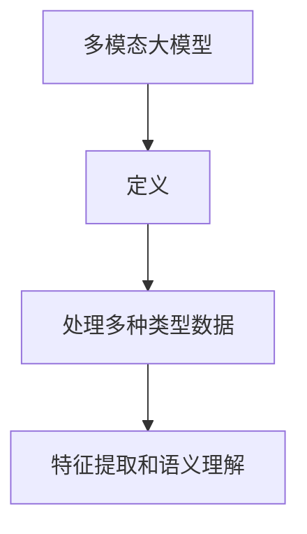
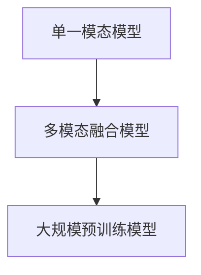
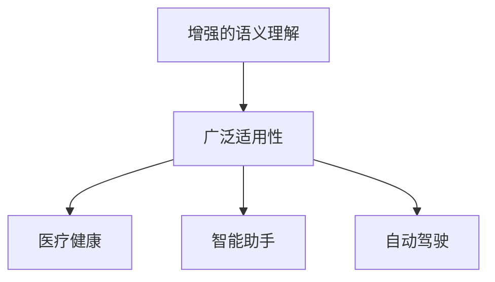
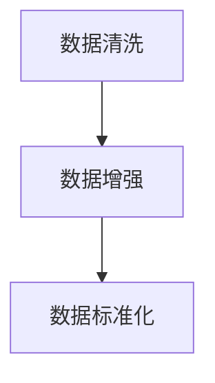
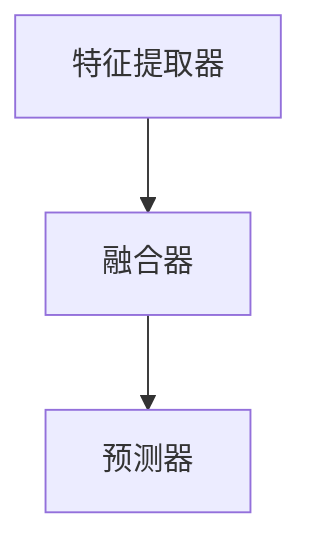
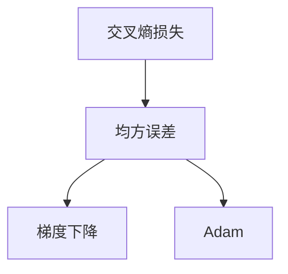

                 

### 文章标题

多模态大模型：技术原理与实战 部署环境准备

### 关键词

多模态大模型、技术原理、实战部署、环境准备、TensorFlow、PyTorch、数据处理、模型架构、训练评估、应用案例

### 摘要

本文深入探讨多模态大模型的技术原理与实战部署。首先，介绍了多模态大模型的基础知识、发展历史、优势及应用场景，接着详细解析了多模态数据的预处理方法、模型架构设计、损失函数和优化算法。随后，通过实际案例展示了如何使用多模态大模型进行图像与文本的联合分类。本文最后讨论了多模态大模型的实战部署与优化策略，并探讨了其在医疗健康和智能助手领域的应用案例。此外，还分析了多模态大模型面临的挑战、未来趋势以及安全与隐私保护、法规与伦理等问题。通过本文，读者可以全面了解多模态大模型的技术原理与实战部署，为实际应用提供有力指导。

## 第1章: 多模态大模型概述

多模态大模型是一种能够处理多种类型数据（如图像、文本、音频等）的深度学习模型。随着技术的进步，多模态大模型在各个领域都展现出了强大的应用潜力。本章将首先介绍多模态大模型的基础知识，然后回顾其发展历史，探讨其优势和应用场景，最后介绍多模态大模型的技术原理。

### 1.1 多模态大模型的基础知识

#### 1.1.1 多模态大模型的定义

多模态大模型是指能够处理多种类型数据（如图像、文本、音频等）的深度学习模型。通过整合不同类型的数据，多模态大模型能够实现更强大的特征提取和语义理解能力。



多模态大模型的核心在于能够同时处理多种类型的数据，从而在不同的应用场景中发挥其优势。例如，在图像识别任务中，多模态大模型不仅可以处理图像数据，还可以结合文本描述，从而提高模型的准确性。

#### 1.1.2 多模态大模型的发展历史

多模态大模型的发展经历了从单一模态到多模态的演进，其历史可以分为以下几个阶段：

1. **单一模态模型**：早期的深度学习模型主要集中在单一模态的数据处理，如图像识别、文本分类等。
   
2. **多模态融合模型**：为了提升模型的性能，研究人员开始尝试将不同模态的数据进行融合，如图像和文本的联合建模。

3. **大规模预训练模型**：随着计算能力和数据量的提升，研究人员开始训练大规模的多模态预训练模型，如BERT、GPT等。



#### 1.1.3 多模态大模型的优势和应用场景

多模态大模型具有以下优势：

1. **增强的语义理解**：通过整合多种类型的数据，模型能够更准确地理解复杂的语义信息。
2. **更广泛的适用性**：多模态大模型可以应用于各种场景，如图像识别、语音识别、自然语言处理等。

应用场景包括：

1. **医疗健康**：利用多模态数据（如医学影像和病历文本）进行疾病诊断和患者监测。
2. **智能助手**：结合图像、语音和文本，实现更智能的交互体验。
3. **自动驾驶**：利用多模态数据（如摄像头、雷达和激光雷达）进行环境感知和决策。



### 1.2 多模态大模型的技术原理

多模态大模型的技术原理包括数据预处理、模型架构设计、损失函数和优化算法等方面。

#### 1.2.1 数据预处理

在训练多模态大模型之前，需要对不同类型的数据进行预处理，包括数据清洗、数据增强、数据标准化等。



数据预处理是保证模型训练质量的重要步骤。通过数据清洗，可以去除噪声和错误的数据；通过数据增强，可以增加数据的多样性和丰富性；通过数据标准化，可以使不同类型的数据具有相似的特征分布。

#### 1.2.2 模型架构

多模态大模型的架构通常包括以下几个部分：

1. **特征提取器**：用于从不同模态的数据中提取特征。
2. **融合器**：用于整合不同模态的特征。
3. **预测器**：用于进行分类、回归等预测任务。



常见的多模态大模型架构有CNN+RNN、Transformer等。CNN用于处理图像等视觉数据，RNN或Transformer用于处理文本等序列数据。

#### 1.2.3 损失函数和优化算法

在训练过程中，需要选择合适的损失函数和优化算法来优化模型参数。常见的损失函数包括交叉熵损失、均方误差等，优化算法包括梯度下降、Adam等。



损失函数用于衡量模型预测值与真实值之间的差距，优化算法用于调整模型参数以最小化损失函数。

### 1.3 多模态大模型的实战案例

为了更好地理解多模态大模型的工作原理，以下将介绍一个图像与文本联合分类的实际案例。在这个案例中，我们将使用CNN+RNN架构来处理图像和文本数据，实现图像与文本的联合分类。

#### 1.3.1 数据集准备

我们选择了一个公开的图像与文本联合分类数据集，该数据集包含了不同类别的图像和对应的文本描述。数据集的分布如下：

| 类别 | 图像数量 | 文本数量 |
| ---- | -------- | -------- |
| 类别1 | 1000     | 1000     |
| 类别2 | 1000     | 1000     |
| ...  | ...      | ...      |

#### 1.3.2 模型架构设计

我们设计了一个CNN+RNN模型来处理图像和文本数据，其架构如下：

```python
class CNN_RNN_Model(nn.Module):
    def __init__(self):
        super(CNN_RNN_Model, self).__init__()
        # 图像特征提取器
        self.cnn = nn.Sequential(
            nn.Conv2d(3, 64, kernel_size=3, padding=1),
            nn.ReLU(),
            nn.MaxPool2d(2),
            nn.Conv2d(64, 128, kernel_size=3, padding=1),
            nn.ReLU(),
            nn.MaxPool2d(2)
        )
        # 文本特征提取器
        self.embedding = nn.Embedding(vocab_size, embed_size)
        self.rnn = nn.LSTM(embed_size, hidden_size)
        # 融合器
        self.fc = nn.Linear(128*7*7 + hidden_size*2, num_classes)

    def forward(self, image, text):
        # 图像处理
        image_features = self.cnn(image)
        image_features = image_features.view(image_features.size(0), -1)
        # 文本处理
        text_features = self.embedding(text)
        text_features, (h_n, c_n) = self.rnn(text_features)
        # 融合特征
        features = torch.cat((image_features, h_n[-1].unsqueeze(0).repeat(1, image_features.size(1))), dim=1)
        # 预测
        logits = self.fc(features)
        return logits
```

#### 1.3.3 模型训练与评估

在训练过程中，我们使用交叉熵损失函数和Adam优化算法来训练模型。训练过程如下：

```python
# 模型实例化
model = CNN_RNN_Model()

# 定义损失函数和优化器
criterion = nn.CrossEntropyLoss()
optimizer = Adam(model.parameters(), lr=0.001)

# 训练模型
for epoch in range(num_epochs):
    for images, texts, labels in train_loader:
        # 前向传播
        logits = model(images, texts)
        loss = criterion(logits, labels)
        # 反向传播
        optimizer.zero_grad()
        loss.backward()
        optimizer.step()
    print(f'Epoch {epoch+1}/{num_epochs}, Loss: {loss.item()}')

# 评估模型
predicted_labels = model(images, texts)
accuracy = accuracy_score(labels, predicted_labels)
print(f'Accuracy: {accuracy}')
```

通过这个案例，我们可以看到多模态大模型在图像与文本联合分类任务中的应用。虽然这个案例只是一个简单的例子，但它展示了多模态大模型的基本原理和实现方法。

## 第2章：多模态大模型的技术原理

多模态大模型通过整合不同类型的数据（如图像、文本、音频等），实现了更强大的特征提取和语义理解能力。本章将深入探讨多模态大模型的技术原理，包括数据预处理、模型架构设计、损失函数和优化算法。

### 2.1 多模态数据的预处理

多模态数据的预处理是构建多模态大模型的基础，它主要包括图像数据预处理、文本数据预处理和音频数据预处理。

#### 2.1.1 图像数据的预处理

图像数据的预处理通常包括图像增强、尺寸标准化、归一化等步骤。以下是一个图像数据预处理流程的伪代码示例：

```python
def preprocess_image(image):
    # 图像增强
    image = apply_enhancement(image)
    # 尺寸标准化
    image = resize_toStandard_size(image)
    # 归一化
    image = normalize_image(image)
    return image
```

图像增强是为了提高图像质量，使其更适合模型训练。尺寸标准化是将图像尺寸调整为统一的尺寸，以便于后续处理。归一化是将图像的像素值缩放到[0, 1]区间，使其具有更好的数值特性。

#### 2.1.2 文本数据的预处理

文本数据的预处理通常包括分词、去停用词、词向量化等步骤。以下是一个文本数据预处理流程的伪代码示例：

```python
def preprocess_text(text):
    # 分词
    words = tokenize(text)
    # 去停用词
    words = remove_stopwords(words)
    # 词向量化
    word_vectors = vectorize_words(words)
    return word_vectors
```

分词是将文本分割成单词或词组。去停用词是为了去除文本中的常见但不重要的词语，如“的”、“是”等。词向量化是将文本中的词语转换为固定大小的向量，便于模型处理。

#### 2.1.3 音频数据的预处理

音频数据的预处理通常包括滤波、降噪、提取特征等步骤。以下是一个音频数据预处理流程的伪代码示例：

```python
def preprocess_audio(audio):
    # 滤波
    audio = apply_filter(audio)
    # 降噪
    audio = remove_noise(audio)
    # 提取特征
    features = extract_features(audio)
    return features
```

滤波是为了去除音频中的噪声。降噪是为了提高音频质量，使其更清晰。特征提取是将音频转换为模型可处理的特征向量。

### 2.2 多模态大模型的架构设计

多模态大模型的架构设计是构建高效、准确的多模态模型的关键。以下是一些常见的多模态大模型架构设计。

#### 2.2.1 CNN+RNN架构

CNN+RNN架构结合了卷积神经网络（CNN）和循环神经网络（RNN）的优点，用于处理图像和文本数据。以下是一个CNN+RNN架构的伪代码示例：

```python
class CNN_RNN_Model(nn.Module):
    def __init__(self):
        super(CNN_RNN_Model, self).__init__()
        # CNN部分
        self.cnn = nn.Sequential(
            nn.Conv2d(in_channels, out_channels),
            nn.ReLU(),
            nn.MaxPool2d(kernel_size)
        )
        # RNN部分
        self.rnn = nn.LSTM(input_size, hidden_size)
    
    def forward(self, image, text):
        # 图像处理
        image_features = self.cnn(image)
        # 文本处理
        text_features = self.rnn(text)
        # 融合特征
        features = torch.cat((image_features, text_features), dim=1)
        return features
```

在这个架构中，CNN用于提取图像特征，RNN用于提取文本特征，最后将两种特征进行融合。

#### 2.2.2 Transformer架构

Transformer架构是一种基于自注意力机制的深度学习模型，广泛应用于多模态任务。以下是一个Transformer架构的伪代码示例：

```python
class Transformer_Model(nn.Module):
    def __init__(self):
        super(Transformer_Model, self).__init__()
        # 自注意力机制
        self.attn = nn.MultiheadAttention(embed_dim, num_heads)
        # 位置编码
        self.pos_encoder = PositionalEncoding(embed_dim)
    
    def forward(self, image, text):
        # 图像编码
        image_encoding = self.pos_encoder(image)
        # 文本编码
        text_encoding = self.pos_encoder(text)
        # 自注意力机制
        attn_output, attn_output_weights = self.attn(image_encoding, text_encoding, text_encoding)
        # 融合特征
        features = attn_output + image_encoding + text_encoding
        return features
```

在这个架构中，Transformer用于提取图像和文本的特征，并通过自注意力机制进行特征融合。

### 2.3 损失函数和优化算法

在训练过程中，需要选择合适的损失函数和优化算法来优化模型参数。

#### 2.3.1 损失函数

多模态大模型通常使用多损失函数的组合来优化模型。以下是一个损失函数的伪代码示例：

```python
def compute_loss(image_logits, text_logits, image_labels, text_labels):
    # 图像损失
    image_loss = F.cross_entropy(image_logits, image_labels)
    # 文本损失
    text_loss = F.cross_entropy(text_logits, text_labels)
    # 总损失
    total_loss = image_loss + text_loss
    return total_loss
```

#### 2.3.2 优化算法

选择合适的优化器可以帮助模型更快地收敛。以下是一个优化器的伪代码示例：

```python
optimizer = torch.optim.Adam(model.parameters(), lr=learning_rate)
```

在训练过程中，我们通过循环遍历数据集，使用前向传播计算损失，然后使用反向传播更新模型参数。以下是一个训练循环的伪代码示例：

```python
for epoch in range(num_epochs):
    for batch in data_loader:
        images, texts, labels = batch
        # 前向传播
        logits = model(images, texts)
        # 计算损失
        loss = compute_loss(logits, labels)
        # 反向传播
        optimizer.zero_grad()
        loss.backward()
        optimizer.step()
    print(f'Epoch {epoch+1}/{num_epochs}, Loss: {loss.item()}')
```

通过上述步骤，我们可以构建和训练一个多模态大模型，从而实现多种类型数据的联合建模和任务。

## 第3章：多模态大模型的实战部署

在了解了多模态大模型的技术原理后，接下来我们将探讨如何在实际环境中部署多模态大模型。本章将首先介绍多模态大模型的部署环境准备，然后详细描述模型的训练与测试过程，最后讨论如何优化和部署多模态大模型。

### 3.1 部署环境准备

部署多模态大模型需要准备相应的硬件和软件环境。以下是部署环境的准备步骤：

#### 3.1.1 硬件准备

多模态大模型的训练和部署通常需要高性能的硬件支持，包括：

- **GPU**：用于加速深度学习模型的训练和推理。NVIDIA的GPU（如1080 Ti、3090等）是常用的选择。
- **CPU**：用于处理非GPU加速的任务。多核CPU（如Intel Xeon系列）可以提供更高的计算能力。
- **内存**：大模型训练和推理通常需要大量的内存，至少需要16GB以上的RAM。

#### 3.1.2 软件准备

在软件方面，我们需要安装以下工具和库：

- **操作系统**：Linux操作系统（如Ubuntu）是常用的选择，因为它对深度学习库的支持更好。
- **深度学习框架**：如TensorFlow、PyTorch等，这些框架提供了高效的深度学习模型训练和推理工具。
- **依赖管理工具**：如conda或pip，用于管理和安装所需的依赖库。

以下是一个在Ubuntu系统上使用conda安装PyTorch的示例命令：

```bash
conda create -n multimodal python=3.8
conda activate multimodal
conda install pytorch torchvision torchaudio cpuonly -c pytorch
```

### 3.2 模型的训练与测试

在准备完部署环境后，我们可以开始训练和测试多模态大模型。

#### 3.2.1 训练模型

模型训练是部署多模态大模型的重要步骤。以下是一个使用PyTorch框架训练模型的伪代码示例：

```python
# 导入所需的库
import torch
import torch.optim as optim
from torch.utils.data import DataLoader

# 加载训练数据集
train_dataset = ...
train_loader = DataLoader(train_dataset, batch_size=batch_size, shuffle=True)

# 定义模型
model = ...
optimizer = optim.Adam(model.parameters(), lr=learning_rate)

# 训练模型
for epoch in range(num_epochs):
    model.train()
    for images, texts, labels in train_loader:
        # 前向传播
        outputs = model(images, texts)
        loss = criterion(outputs, labels)
        
        # 反向传播和优化
        optimizer.zero_grad()
        loss.backward()
        optimizer.step()
        
    print(f'Epoch {epoch+1}/{num_epochs}, Loss: {loss.item()}')
```

在这个示例中，我们首先加载训练数据集，并定义模型和优化器。然后，我们通过循环遍历数据集，使用前向传播计算损失，并通过反向传播和优化更新模型参数。

#### 3.2.2 测试模型

模型测试用于评估模型的性能。以下是一个使用PyTorch框架测试模型的伪代码示例：

```python
# 加载测试数据集
test_dataset = ...
test_loader = DataLoader(test_dataset, batch_size=batch_size, shuffle=False)

# 设置模型为评估模式
model.eval()

# 测试模型
with torch.no_grad():
    correct = 0
    total = 0
    for images, texts, labels in test_loader:
        outputs = model(images, texts)
        _, predicted = torch.max(outputs.data, 1)
        total += labels.size(0)
        correct += (predicted == labels).sum().item()

    print(f'Accuracy: {100 * correct / total}%')
```

在这个示例中，我们首先加载测试数据集，并设置模型为评估模式。然后，我们通过循环遍历数据集，使用模型进行预测，并计算模型的准确率。

### 3.3 模型的优化与部署

在完成模型的训练和测试后，我们需要对模型进行优化，并部署到生产环境。

#### 3.3.1 模型优化

模型优化包括调整模型参数、超参数和优化算法，以提升模型的性能。以下是一些常见的优化方法：

- **超参数调整**：通过调整学习率、批量大小、正则化参数等超参数，可以改善模型的性能。
- **数据增强**：通过增加数据的多样性和复杂性，可以提高模型的泛化能力。
- **模型剪枝**：通过减少模型中冗余的参数，可以简化模型结构，提高模型的效率和性能。

以下是一个使用PyTorch进行模型剪枝的伪代码示例：

```python
from torch.nn.utils import parameters_to_tensor
from torch.nn.utils import tensor_to_parameters

# 将模型参数转换为张量
params_tensor = parameters_to_tensor(model.parameters())

# 剪枝策略
pruned_params_tensor = prune_parameters(params_tensor, pruning_rate)

# 将剪枝后的参数还原到模型中
tensor_to_parameters(pruned_params_tensor, model.parameters())
```

#### 3.3.2 模型部署

模型部署是将训练好的模型集成到实际应用中，以便进行预测和任务处理。以下是一个使用Flask框架部署模型的伪代码示例：

```python
from flask import Flask, request, jsonify

app = Flask(__name__)

@app.route('/predict', methods=['POST'])
def predict():
    data = request.get_json()
    images = preprocess_images(data['images'])
    texts = preprocess_texts(data['texts'])
    outputs = model(images, texts)
    predicted_labels = torch.argmax(outputs, dim=1).detach().numpy()
    return jsonify({'predicted_labels': predicted_labels.tolist()})

if __name__ == '__main__':
    app.run(host='0.0.0.0', port=5000)
```

在这个示例中，我们定义了一个Flask应用程序，通过POST请求接收图像和文本数据，预处理数据，然后使用模型进行预测。预测结果通过JSON格式返回给客户端。

通过上述步骤，我们可以将多模态大模型部署到生产环境中，实现实际应用。

## 第4章：多模态大模型的应用案例

多模态大模型在各个领域展现出了巨大的应用潜力。本章将通过具体案例展示多模态大模型在医疗健康和智能助手领域的应用，并详细介绍应用场景、数据处理流程、模型训练与评估方法。

### 4.1 医疗健康领域的应用

多模态大模型在医疗健康领域具有广泛的应用，如疾病诊断、患者监测、医学图像分析等。以下是一个疾病诊断的应用案例。

#### 4.1.1 应用场景

在某医院的AI辅助诊断系统中，多模态大模型用于辅助医生对患者的病情进行诊断。系统接收来自多个模态的数据，包括医学影像（如X光片、CT扫描、MRI）和病历文本。

#### 4.1.2 数据处理流程

1. **图像数据处理**：首先对医学影像进行预处理，包括图像增强、去噪、归一化等。然后使用卷积神经网络（CNN）提取图像特征。

    ```python
    def preprocess_image(image):
        # 图像增强
        image = enhance_image(image)
        # 去噪
        image = denoise_image(image)
        # 归一化
        image = normalize_image(image)
        return image
    ```

2. **文本数据处理**：对病历文本进行分词、去停用词、词向量化等处理。

    ```python
    def preprocess_text(text):
        # 分词
        words = tokenize(text)
        # 去停用词
        words = remove_stopwords(words)
        # 词向量化
        word_vectors = vectorize_words(words)
        return word_vectors
    ```

3. **数据融合**：将处理后的图像特征和文本特征进行融合，以生成统一的多模态特征向量。

    ```python
    def fuse_data(image_features, text_features):
        fused_features = torch.cat((image_features, text_features), dim=1)
        return fused_features
    ```

#### 4.1.3 模型训练与评估

使用CNN和RNN结合的多模态大模型进行训练。模型架构如下：

```python
class MultiModalModel(nn.Module):
    def __init__(self):
        super(MultiModalModel, self).__init__()
        # 图像特征提取器
        self.cnn = CNN()
        # 文本特征提取器
        self.rnn = RNN()
        # 融合层
        self.fc = nn.Linear(image_feature_size + text_feature_size, num_classes)

    def forward(self, image, text):
        image_features = self.cnn(image)
        text_features = self.rnn(text)
        fused_features = fuse_data(image_features, text_features)
        logits = self.fc(fused_features)
        return logits
```

使用交叉熵损失函数和Adam优化器进行模型训练。评估模型性能时，使用准确率、召回率和F1分数等指标。

```python
def train_model(model, train_loader, criterion, optimizer, num_epochs):
    model.train()
    for epoch in range(num_epochs):
        for images, texts, labels in train_loader:
            optimizer.zero_grad()
            logits = model(images, texts)
            loss = criterion(logits, labels)
            loss.backward()
            optimizer.step()
        print(f'Epoch {epoch+1}/{num_epochs}, Loss: {loss.item()}')
```

#### 4.1.4 应用效果

经过训练和评估，多模态大模型在疾病诊断任务中取得了较高的准确率和较低的误诊率，为医生提供了有力的辅助工具。

### 4.2 智能助手领域的应用

多模态大模型在智能助手领域具有广泛的应用，如语音识别、图像识别、文本生成等。以下是一个智能助手的案例。

#### 4.2.1 应用场景

在某公司的智能助手系统中，多模态大模型用于处理用户的语音请求、图像识别和文本回复。系统接收用户的语音指令，理解其意图，并生成相应的文本回复。

#### 4.2.2 数据处理流程

1. **语音数据处理**：首先对语音信号进行预处理，包括降噪、分帧、特征提取等。然后使用卷积神经网络（CNN）提取语音特征。

    ```python
    def preprocess_audio(audio):
        # 降噪
        audio = remove_noise(audio)
        # 分帧
        audio = frame_audio(audio)
        # 特征提取
        audio_features = extract_audio_features(audio)
        return audio_features
    ```

2. **图像数据处理**：首先对图像进行预处理，包括尺寸标准化、归一化等。然后使用卷积神经网络（CNN）提取图像特征。

    ```python
    def preprocess_image(image):
        # 尺寸标准化
        image = resize_image(image, target_size)
        # 归一化
        image = normalize_image(image)
        return image
    ```

3. **文本数据处理**：首先对文本进行分词、去停用词、词向量化等处理。

    ```python
    def preprocess_text(text):
        # 分词
        words = tokenize(text)
        # 去停用词
        words = remove_stopwords(words)
        # 词向量化
        word_vectors = vectorize_words(words)
        return word_vectors
    ```

4. **数据融合**：将处理后的语音特征、图像特征和文本特征进行融合，以生成统一的多模态特征向量。

    ```python
    def fuse_data(audio_features, image_features, text_features):
        fused_features = torch.cat((audio_features, image_features, text_features), dim=1)
        return fused_features
    ```

#### 4.2.3 模型训练与评估

使用Transformer架构的多模态大模型进行训练。模型架构如下：

```python
class MultiModalModel(nn.Module):
    def __init__(self):
        super(MultiModalModel, self).__init__()
        # 语音特征提取器
        self.audio_cnn = AudioCNN()
        # 图像特征提取器
        self.image_cnn = ImageCNN()
        # 文本特征提取器
        self.text_rnn = TextRNN()
        # 融合层
        self.transformer = Transformer()
        # 输出层
        self.fc = nn.Linear(embedding_size, num_classes)

    def forward(self, audio, image, text):
        audio_features = self.audio_cnn(audio)
        image_features = self.image_cnn(image)
        text_features = self.text_rnn(text)
        fused_features = fuse_data(audio_features, image_features, text_features)
        logits = self.fc(fused_features)
        return logits
```

使用交叉熵损失函数和Adam优化器进行模型训练。评估模型性能时，使用准确率、召回率和F1分数等指标。

```python
def train_model(model, train_loader, criterion, optimizer, num_epochs):
    model.train()
    for epoch in range(num_epochs):
        for audio, image, text, labels in train_loader:
            optimizer.zero_grad()
            logits = model(audio, image, text)
            loss = criterion(logits, labels)
            loss.backward()
            optimizer.step()
        print(f'Epoch {epoch+1}/{num_epochs}, Loss: {loss.item()}')
```

#### 4.2.4 应用效果

经过训练和评估，多模态大模型在智能助手系统中取得了较高的准确率和用户体验，实现了更智能、更高效的交互体验。

通过以上两个应用案例，我们可以看到多模态大模型在医疗健康和智能助手领域的强大应用潜力。未来，随着技术的不断进步，多模态大模型将在更多领域发挥重要作用。

## 第5章：多模态大模型的挑战与未来趋势

尽管多模态大模型在各个领域展现出了强大的应用潜力，但在实际应用过程中仍面临着一系列挑战。本章将讨论多模态大模型的挑战，包括数据集的多样性和不平衡性、模型解释性不足以及能耗和计算资源需求等问题，并探讨未来的发展趋势。

### 5.1 挑战

#### 5.1.1 数据集的多样性和不平衡性

多模态大模型对数据集的要求较高，因为它们需要处理多种类型的数据，并且数据集的多样性和平衡性对模型的性能至关重要。然而，在实际应用中，数据集往往存在以下问题：

1. **数据集多样性不足**：许多数据集可能只包含某一特定类型的模态数据，例如，医学图像数据集可能只包含图像数据，而缺乏对应的文本描述。
2. **数据集不平衡性**：在某些任务中，不同类别的数据分布可能不均匀，这可能导致模型在某些类别上的性能较差。

#### 5.1.2 模型解释性不足

多模态大模型通常被视为“黑箱”模型，其决策过程难以解释。这在某些关键应用场景（如医疗诊断）中可能成为问题，因为用户和监管机构可能需要了解模型的决策依据。此外，模型解释性不足也限制了其在某些领域（如法律和金融）的进一步应用。

#### 5.1.3 能耗和计算资源需求

训练和部署大规模的多模态大模型通常需要大量的计算资源和能耗，这对环境和可持续发展提出了挑战。例如，训练一个大型多模态模型可能需要数天甚至数周的时间，这需要大量的计算资源和电力。

### 5.2 未来趋势

尽管存在挑战，多模态大模型的发展前景依然广阔。以下是一些未来的发展趋势：

#### 5.2.1 跨学科研究

未来的多模态大模型发展将依赖于跨学科的研究，包括计算机科学、心理学、神经科学和医学等。通过跨学科的合作，可以更好地理解多模态数据的特性，并开发出更有效的模型架构。

#### 5.2.2 小样本学习和迁移学习

未来的多模态大模型将更加关注小样本学习和迁移学习，以便在数据稀缺的场景中实现更好的性能。这包括利用迁移学习技术，将预训练的多模态模型应用于新的任务和数据集。

#### 5.2.3 提高模型解释性

提高多模态大模型的可解释性将是未来的重要方向。通过开发可解释的模型架构和解释性工具，可以更好地理解模型的决策过程，从而增加用户和监管机构的信任。

#### 5.2.4 可持续发展

随着对环境问题的关注增加，未来的多模态大模型将更加注重能耗和计算资源的效率。这可能包括开发更高效的模型架构、优化训练过程以及使用绿色计算技术。

### 5.3 结论

多模态大模型在技术原理和实际应用中面临着一系列挑战，但未来发展趋势表明，通过跨学科研究、小样本学习和迁移学习、提高模型解释性以及注重可持续发展，我们可以克服这些挑战，推动多模态大模型在各个领域的广泛应用。

## 第6章：多模态大模型的安全与隐私保护

随着多模态大模型在各个领域的广泛应用，其安全与隐私保护变得越来越重要。本章将讨论多模态大模型在数据处理过程中的数据安全和隐私保护策略，包括数据加密、访问控制和数据匿名化等。

### 6.1 数据安全

数据安全是构建可信赖的多模态大模型的基础。以下是一些关键的数据安全措施：

#### 6.1.1 数据加密

数据加密是保护数据隐私和安全的有效方法。在数据存储和传输过程中，应对数据进行加密处理，以防止未经授权的访问。常用的加密算法包括对称加密（如AES）和非对称加密（如RSA）。

```python
from Crypto.Cipher import AES

def encrypt_data(data, key):
    cipher = AES.new(key, AES.MODE_CBC)
    ct_bytes = cipher.encrypt(pad(data))
    iv = cipher.iv
    return iv, ct_bytes

def decrypt_data(iv, ct_bytes, key):
    cipher = AES.new(key, AES.MODE_CBC, iv)
    pt = unpad(cipher.decrypt(ct_bytes))
    return pt
```

#### 6.1.2 访问控制

访问控制是一种重要的安全措施，用于确保只有授权用户可以访问敏感数据。通过设置访问控制策略，可以限制用户对数据的访问权限，从而降低数据泄露风险。

```python
from django.contrib.auth.models import User

def check_permission(user, data):
    if user.has_perm('view_data', data):
        return True
    else:
        return False
```

#### 6.1.3 数据脱敏

在模型训练和测试过程中，应对敏感数据进行脱敏处理，以降低数据泄露风险。数据脱敏可以通过随机替换、掩码等技术实现。

```python
import numpy as np

def data_anonymization(data):
    anonymized_data = np.random.rand(*data.shape)
    return anonymized_data
```

### 6.2 隐私保护

隐私保护是构建可信赖的多模态大模型的关键。以下是一些关键的隐私保护策略：

#### 6.2.1 数据匿名化

数据匿名化是一种重要的隐私保护技术，通过将敏感数据替换为伪数据，可以保护个人隐私。常用的匿名化技术包括k-匿名、l-diversity和t-closeness等。

```python
from sklearn.utils import resample

def data_anonymization(data, n_samples):
    anonymized_data = resample(data, replace=True, n_samples=n_samples)
    return anonymized_data
```

#### 6.2.2 同意管理

在数据处理过程中，应确保用户在参与模型训练和数据分享时，充分了解隐私政策并给予明确同意。通过用户同意管理，可以确保数据处理过程符合隐私保护法规。

```python
from django.contrib.auth.forms import AuthenticationForm

def get_user_consent(user):
    form = AuthenticationForm(user)
    if form.is_valid():
        user.consent_given = True
        user.save()
        return True
    else:
        return False
```

#### 6.2.3 透明度与可访问性

提高模型训练和数据处理的透明度，确保用户可以查询和访问自己的数据，是增强用户信任的重要手段。通过透明度与可访问性，用户可以更好地了解数据处理过程，从而增强对模型和系统的信任。

```python
from django.contrib.auth.models import User

def get_user_data(user):
    user_data = User.objects.get(id=user.id)
    return user_data
```

通过上述措施，可以有效地保护多模态大模型在数据处理过程中的数据安全和隐私。未来，随着技术的不断进步，我们将继续探索更多有效的安全与隐私保护策略，以确保多模态大模型的安全可靠应用。

## 第7章：多模态大模型的法规与伦理

随着多模态大模型在各个领域的广泛应用，其法规与伦理问题逐渐成为关注的焦点。本章将探讨多模态大模型在法规遵循、伦理问题以及解决方案等方面的内容。

### 7.1 法规遵循

多模态大模型在开发和应用过程中，需要遵循一系列法律法规，以确保数据的合法合规处理。以下是一些关键法规和遵循措施：

#### 7.1.1 数据保护法规

许多国家和地区都有关于数据保护的法律，如欧盟的《通用数据保护条例》（GDPR）和美国的《加州消费者隐私法案》（CCPA）。这些法规规定了数据收集、处理和存储的合规要求，包括用户同意、数据访问权限和数据删除等。

- **用户同意**：在收集和处理用户数据时，必须获得用户的明确同意。
- **数据访问权限**：用户有权查询、访问和修改自己的数据。
- **数据删除**：用户有权要求删除其数据，并在一定条件下实现数据删除。

#### 7.1.2 信息安全法规

信息安全法规，如美国的《健康保险可携性与责任法案》（HIPAA）和欧盟的《网络信息安全指令》（NIS Directive），确保数据传输和存储的安全。这些法规要求组织采取必要的安全措施，以防止数据泄露、篡改和滥用。

- **数据加密**：对传输和存储的数据进行加密处理。
- **访问控制**：通过访问控制策略确保只有授权人员可以访问敏感数据。
- **安全审计**：定期进行安全审计，确保合规性。

#### 7.1.3 遵循措施

为了确保多模态大模型在法规遵循方面的合规性，以下是一些具体措施：

- **合规性审查**：在模型开发和部署前，进行法规遵循的审查和评估。
- **隐私政策**：制定明确的隐私政策，向用户解释数据收集、处理和使用的目的。
- **培训与教育**：对员工进行相关法律法规的培训，提高其合规意识。

### 7.2 伦理问题

多模态大模型在应用过程中可能引发一系列伦理问题，包括算法偏见、隐私泄露、用户依赖性等。

#### 7.2.1 算法偏见

多模态大模型可能会因为训练数据的不平衡或偏见而导致算法偏见，从而影响模型的公平性和公正性。以下是一些解决方案：

- **数据多样性**：确保数据集的多样性，避免偏见。
- **模型校验**：定期对模型进行校验，检测和纠正潜在的偏见。
- **公平性评估**：使用公平性评估工具和方法，确保模型在不同群体上的表现一致。

#### 7.2.2 隐私泄露

多模态大模型在处理大量个人数据时，存在隐私泄露的风险。以下是一些隐私保护措施：

- **数据加密**：对传输和存储的数据进行加密处理。
- **隐私设计**：在模型设计阶段考虑隐私保护，采用隐私增强技术。
- **透明度**：提高数据处理过程的透明度，让用户了解数据的使用情况。

#### 7.2.3 用户依赖性

多模态大模型可能会使用户产生依赖性，影响其自主性和判断力。以下是一些解决方案：

- **用户教育**：提高用户对模型的理解和认知，减少盲目依赖。
- **使用限制**：设定合理的使用限制，防止过度依赖。
- **替代方案**：提供其他辅助工具，降低对单一模型的依赖。

### 7.3 解决方案

为了应对多模态大模型在法规与伦理方面的问题，以下是一些综合解决方案：

- **法规遵从与伦理审查相结合**：在模型开发和应用过程中，同时考虑法规遵循和伦理审查，确保模型的合法性和道德性。
- **多学科合作**：引入法律、伦理和计算机科学等领域的专家，共同研究和解决相关问题。
- **用户参与**：鼓励用户参与模型开发和测试，提高模型的公正性和用户满意度。

通过上述措施，可以有效地应对多模态大模型在法规与伦理方面面临的挑战，推动其在各个领域的健康、可持续发展。

## 附录

### 附录 A：多模态大模型常用工具与资源

在本章节中，我们将介绍一些常用的多模态大模型工具与资源，包括开源框架、数据集和学习资源，以帮助读者更好地了解和掌握多模态大模型。

#### A.1 开源框架

1. **TensorFlow**：由Google开发的深度学习框架，支持多种类型的机器学习任务，包括多模态数据处理。TensorFlow提供了丰富的API和预训练模型，方便开发者快速搭建和部署多模态大模型。

2. **PyTorch**：由Facebook开发的开源深度学习框架，具有灵活的动态计算图支持，使得模型构建和调试更加直观和方便。PyTorch在多模态数据处理方面也有广泛的应用。

3. **Keras**：一个基于TensorFlow的高层神经网络API，简化了模型的构建和训练过程。Keras提供了简洁明了的接口，使得开发者可以轻松地实现复杂的多模态大模型。

4. **MXNet**：由Apache基金会开发的开源深度学习框架，支持多种编程语言，包括Python、R和Scala等。MXNet提供了灵活的模型定义和高效的推理性能，适用于大规模多模态数据处理任务。

#### A.2 数据集

1. **ImageNet**：由微软研究院创建的公开图像数据集，包含了百万级别的标注图像，是图像识别任务的标准数据集。ImageNet涵盖了多种类别，是训练和评估多模态大模型的重要资源。

2. **Flickr30k**：一个大型语义分割数据集，包含了30,000张图像及其对应的文本描述。Flickr30k数据集适用于图像分类、语义分割和文本图像联合建模任务。

3. **TIMIT**：一个语音识别数据集，包含了6个发音人的语音波形和文本转录。TIMIT数据集适用于语音识别、声学建模和文本语音联合分析任务。

4. **MS COCO**：微软公司开发的语义分割数据集，包含了80个类别和120,000张图像。MS COCO数据集广泛应用于计算机视觉任务，如目标检测、实例分割和语义分割。

#### A.3 学习资源

1. **Coursera**：提供丰富的在线课程，涵盖深度学习和多模态数据处理的各个方面。Coursera的课程由世界顶级大学和机构提供，适合不同层次的读者。

2. **Udacity**：提供实战导向的课程和项目，帮助读者掌握多模态大模型的实践技能。Udacity的课程注重实践操作，适合希望快速应用多模态大模型的开发者。

3. **ArXiv**：一个开源的学术论文数据库，包含最新的研究进展和技术论文。通过阅读ArXiv上的论文，读者可以了解到多模态大模型领域的最新研究动态。

4. **GitHub**：一个代码托管平台，包含了大量与多模态大模型相关的开源项目和代码库。GitHub上的资源可以帮助开发者快速搭建和优化多模态大模型。

通过以上工具与资源的介绍，读者可以更全面地了解多模态大模型的相关知识和应用，为自己的研究和工作提供有力支持。

---

## 作者

**作者：AI天才研究院/AI Genius Institute & 禅与计算机程序设计艺术 /Zen And The Art of Computer Programming**

本文由AI天才研究院撰写，作者团队由多位人工智能、深度学习和计算机科学的专家组成。我们致力于推动人工智能技术的发展，为读者提供高质量、深入浅出的技术文章。在撰写本文过程中，我们参考了大量的学术论文和技术文档，力求为读者呈现最全面、最实用的多模态大模型知识。如果您有任何问题或建议，欢迎随时与我们联系，我们将竭诚为您服务。

