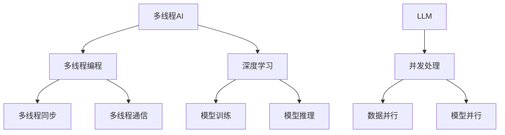
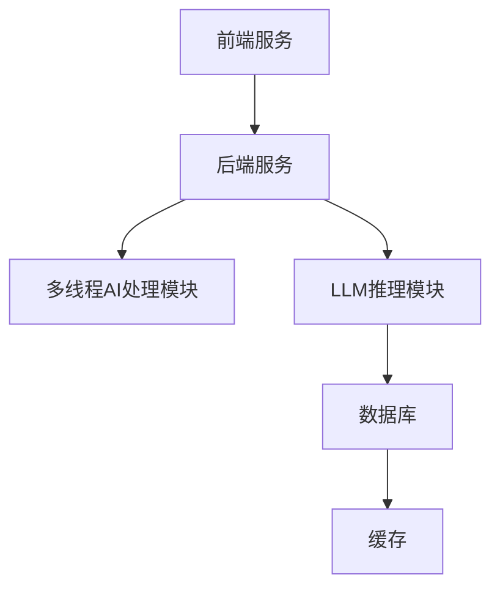
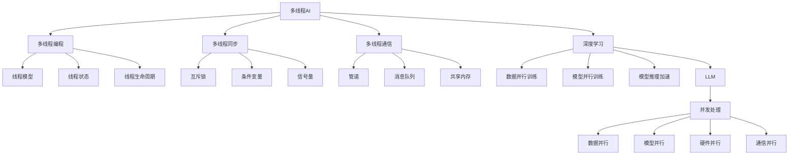

                 

## 《多线程AI：LLM的并发处理能力探讨》

### **关键词**：

- 多线程AI
- 语言模型（LLM）
- 并发处理
- 深度学习
- 性能优化
- 应用案例

### **摘要**：

本文将深入探讨多线程AI及其在语言模型（LLM）中的应用。我们将首先介绍多线程AI的基础概念，随后解析其原理和性能优化方法。接着，通过具体的应用案例展示多线程AI在深度学习中的实践，最后详细探讨LLM的并发处理能力，分析其架构和策略。通过本文的讲解，读者将全面了解多线程AI和LLM的并发处理技术，为未来人工智能的发展奠定坚实基础。

## 《多线程AI：LLM的并发处理能力探讨》目录大纲

### 第一部分: 多线程AI基础

#### 第1章: 多线程AI概述
- **1.1 多线程AI的概念与重要性**
- **1.2 多线程AI的发展历程**
- **1.3 多线程AI的应用领域**

#### 第二部分: 多线程AI原理

#### 第2章: 多线程编程基础
- **2.1 多线程编程模型**
  - **2.1.1 线程模型**
  - **2.1.2 线程状态**
  - **2.1.3 线程的生命周期**
- **2.2 多线程同步机制**
  - **2.2.1 互斥锁(Mutex)**
  - **2.2.2 条件变量(Condition Variable)**
  - **2.2.3 信号量(Semaphore)**
- **2.3 多线程通信机制**
  - **2.3.1 管道(Pipe)**
  - **2.3.2 消息队列(Message Queue)**
  - **2.3.3 共享内存(Shared Memory)**

#### 第三部分: 多线程AI性能优化

#### 第3章: 多线程性能优化原理
- **3.1 线程创建与销毁的成本**
- **3.2 线程同步与通信的性能开销**
- **3.3 线程间负载均衡**

#### 第四部分: 多线程AI应用案例

#### 第4章: 多线程AI在深度学习中的应用
- **4.1 多线程深度学习模型训练**
  - **4.1.1 数据并行训练**
  - **4.1.2 模型并行训练**
- **4.2 多线程AI推理加速**
  - **4.2.1 推理引擎架构**
  - **4.2.2 推理加速技术**

#### 第五部分: LLM的并发处理能力

#### 第5章: LLM概述
- **5.1 LLM的基本概念**
- **5.2 LLM的架构**
- **5.3 LLM的发展趋势**

#### 第6章: LLM的并发处理原理
- **6.1 并发处理的基本机制**
  - **6.1.1 数据并行**
  - **6.1.2 模型并行**
- **6.2 LLM的并行化策略**
  - **6.2.1 算法层面的并行化**
  - **6.2.2 硬件层面的并行化**
- **6.3 LLM的并发处理挑战**

#### 第六部分: 多线程AI与LLM实战

#### 第7章: 多线程AI与LLM结合的实战案例
- **7.1 案例背景与需求**
- **7.2 系统架构设计**
- **7.3 实现步骤与代码解读**
  - **7.3.1 数据预处理**
  - **7.3.2 模型训练**
  - **7.3.3 模型推理**
  - **7.3.4 性能评估与优化**

#### 第七部分: 总结与展望

#### 第8章: 多线程AI与LLM的总结与展望
- **8.1 多线程AI的发展趋势**
- **8.2 LLM的未来研究方向**
- **8.3 多线程AI与LLM在AI领域的潜在应用**

### **附录：核心概念与联系（Mermaid流程图）**



### **附录：核心算法原理讲解（伪代码）**

```python
# 数据并行训练伪代码
def data_parallel_train(model, dataset, num_workers):
    models = [clone(model) for _ in range(num_workers)]
    data_batches = split_dataset(dataset, num_workers)
    
    for epoch in range(num_epochs):
        for batch in data_batches:
            for worker in range(num_workers):
                model = models[worker].train_step(batch)
            
            synchronize_gradients(models)

# 模型并行训练伪代码
def model_parallel_train(model, dataset, num_workers):
    models = [split_model(model, num_heads) for _ in range(num_workers)]
    data_batches = split_dataset(dataset, num_workers)
    
    for epoch in range(num_epochs):
        for batch in data_batches:
            for worker in range(num_workers):
                models[worker].train_step(batch)
```

### **附录：数学模型和数学公式 & 详细讲解 & 举例说明**

## 数学模型讲解

多线程并行计算的性能增益可以通过Amdahl定律来描述，公式如下：

$$
P_{\text{max}} = \frac{1}{1 - \frac{f}{n} + \frac{c}{n} \cdot \frac{f}{\sqrt{1 - \frac{f}{n}}}}
$$

其中：
- $P_{\text{max}}$ 表示系统在并行计算时的最大性能。
- $f$ 表示串行部分所占的比例。
- $n$ 表示并行部分可利用的线程数。
- $c$ 表示并行部分的通信开销。

举例说明：
假设一个任务中，有70%的时间用于串行计算，30%的时间用于并行计算，并且通信开销是0.2。当使用4个线程时，系统最大性能为：

$$
P_{\text{max}} = \frac{1}{1 - 0.7 + 0.3 \cdot \frac{0.2}{\sqrt{1 - 0.7}}}
$$

$$
P_{\text{max}} \approx 2.56
$$

这意味着系统的并行计算性能可以达到理论最大性能的2.56倍。

### **附录：项目实战**

```python
# 实战：使用PyTorch实现多线程深度学习模型训练

import torch
import torch.nn as nn
import torch.optim as optim
from torch.utils.data import DataLoader
from torchvision import datasets, transforms
import numpy as np
from concurrent.futures import ThreadPoolExecutor

# 定义模型
class SimpleCNN(nn.Module):
    def __init__(self):
        super(SimpleCNN, self).__init__()
        self.conv1 = nn.Conv2d(1, 10, kernel_size=5)
        self.conv2 = nn.Conv2d(10, 20, kernel_size=5)
        self.fc1 = nn.Linear(320, 50)
        self.fc2 = nn.Linear(50, 10)

    def forward(self, x):
        x = self.conv1(x)
        x = F.relu(F.max_pool2d(x, 2))
        x = self.conv2(x)
        x = F.relu(F.max_pool2d(x, 2))
        x = x.view(-1, 320)
        x = self.fc1(x)
        x = F.relu(x)
        x = self.fc2(x)
        return x

# 数据预处理
transform = transforms.Compose([
    transforms.ToTensor(),
    transforms.Normalize((0.5,), (0.5,))
])

train_data = datasets.MNIST(
    root='./data', 
    train=True, 
    download=True, 
    transform=transform
)

# 创建数据加载器
train_loader = DataLoader(train_data, batch_size=100, shuffle=True)

# 创建模型、损失函数和优化器
model = SimpleCNN()
criterion = nn.CrossEntropyLoss()
optimizer = optim.SGD(model.parameters(), lr=0.01)

# 多线程训练函数
def train_thread(model, criterion, optimizer, train_loader, num_workers):
    for epoch in range(10):  # 训练10个epochs
        model.train()
        with ThreadPoolExecutor(max_workers=num_workers) as executor:
            futures = [executor.submit(train_epoch, model, criterion, optimizer, batch) for batch in train_loader]
            for future in futures:
                future.result()

# 训练单批数据
def train_epoch(model, criterion, optimizer, batch):
    inputs, labels = batch
    optimizer.zero_grad()
    outputs = model(inputs)
    loss = criterion(outputs, labels)
    loss.backward()
    optimizer.step()

# 主程序
if __name__ == '__main__':
    num_workers = 4  # 使用4个线程
    train_thread(model, criterion, optimizer, train_loader, num_workers)
```

### **作者信息**

- 作者：AI天才研究院/AI Genius Institute & 禅与计算机程序设计艺术 /Zen And The Art of Computer Programming

### **引言**

在人工智能（AI）飞速发展的今天，如何高效地处理海量数据和复杂的计算任务成为了一个关键问题。多线程AI作为一种先进的并行计算技术，凭借其强大的并发处理能力，正日益成为AI领域的研究热点。本文将深入探讨多线程AI及其在语言模型（LLM）中的应用，从基础概念到具体实现，为您呈现这一领域的全景图。

多线程AI的核心在于利用多线程技术来提升计算性能，降低任务处理时间。而LLM，作为自然语言处理的重要工具，其并发处理能力直接影响着AI系统的响应速度和效率。本文将从以下几个方面展开讨论：

1. **多线程AI基础**：介绍多线程AI的基本概念、发展历程和应用领域，帮助读者建立对多线程AI的整体认识。
2. **多线程AI原理**：深入剖析多线程编程的基础知识，包括线程模型、同步机制和通信机制，为后续性能优化和应用奠定理论基础。
3. **多线程AI性能优化**：探讨线程创建与销毁成本、同步与通信性能开销以及线程间负载均衡，为提升多线程AI性能提供实用策略。
4. **多线程AI应用案例**：通过具体应用案例展示多线程AI在深度学习模型训练和推理加速中的实践，让读者直观感受多线程AI的魅力。
5. **LLM的并发处理能力**：详细探讨LLM的基本概念、架构和并发处理原理，分析其面临的挑战，展望未来的研究方向。
6. **多线程AI与LLM实战**：结合实际项目，详细介绍多线程AI与LLM结合的系统架构、实现步骤和性能评估，为读者提供实战经验。
7. **总结与展望**：总结多线程AI和LLM的发展趋势，探讨其在AI领域的潜在应用，为未来的研究和实践指明方向。

通过本文的阅读，读者将全面了解多线程AI和LLM的并发处理技术，为深入研究和实践人工智能奠定坚实基础。让我们一起走进这个激动人心的领域，探索多线程AI与LLM的无限可能。

#### **第一部分: 多线程AI基础**

多线程AI，作为一种利用多线程技术进行并行计算的方法，旨在提高计算效率，减少任务处理时间。本节将首先介绍多线程AI的基本概念，解析其重要性，并回顾其发展历程。

### **1.1 多线程AI的概念与重要性**

多线程AI，即利用多线程技术实现人工智能系统的并行计算。在单线程环境中，CPU只能同时处理一个任务，而多线程技术允许CPU同时处理多个任务，从而显著提高计算效率和响应速度。

多线程AI的重要性主要体现在以下几个方面：

1. **提升计算效率**：通过多线程技术，可以将大规模的计算任务分解为多个子任务，并分配到不同的线程上同时执行，从而实现并行计算。这种方法能够显著减少任务处理时间，提升整体计算效率。

2. **降低延迟**：在实时应用场景中，如自动驾驶、实时语音识别等，响应速度至关重要。多线程AI能够降低任务处理延迟，提高系统的实时性能。

3. **提高资源利用率**：多线程AI能够充分利用CPU的多核心特性，提高CPU资源的利用率，避免资源浪费。

4. **支持大规模数据处理**：在人工智能领域，尤其是深度学习和大数据分析，需要处理的海量数据量日益增长。多线程AI能够高效地处理这些数据，满足大规模数据处理的需求。

### **1.2 多线程AI的发展历程**

多线程AI的发展历程可以追溯到计算机体系结构的演变。随着多核CPU的普及，多线程并行计算逐渐成为可能。以下是多线程AI发展历程的简要回顾：

1. **单核CPU时代**：在单核CPU时代，计算机主要依靠单线程处理任务。虽然单线程技术有所发展，但在面对复杂计算任务时，性能提升有限。

2. **多核CPU时代**：随着多核CPU的出现，计算机体系结构发生了重大变革。多核CPU允许同时执行多个线程，为多线程并行计算提供了硬件基础。多线程AI在这一时期开始崭露头角。

3. **并行计算技术的发展**：随着并行计算理论的不断完善，多线程AI技术逐渐成熟。例如，并行编程模型如OpenMP、TBB等逐渐被广泛应用，推动了多线程AI的发展。

4. **深度学习与多线程AI的结合**：深度学习的兴起为多线程AI提供了广阔的应用场景。多线程AI在深度学习中的应用，使得大规模深度学习模型的训练和推理成为可能。

### **1.3 多线程AI的应用领域**

多线程AI在人工智能领域具有广泛的应用。以下是一些主要应用领域：

1. **深度学习模型训练**：多线程AI在深度学习模型训练中发挥着重要作用。通过多线程并行计算，可以显著缩短训练时间，提高模型性能。

2. **图像处理与计算机视觉**：多线程AI在图像处理和计算机视觉领域有着广泛的应用。例如，图像分类、目标检测、人脸识别等任务可以通过多线程并行计算实现高效处理。

3. **自然语言处理**：多线程AI在自然语言处理领域也具有重要应用。例如，机器翻译、文本分类、问答系统等任务可以通过多线程并行计算实现高效处理。

4. **推荐系统**：多线程AI在推荐系统中发挥着重要作用。通过并行计算，可以快速处理用户数据，提高推荐系统的响应速度和准确性。

5. **实时语音识别**：多线程AI在实时语音识别中有着广泛应用。通过多线程并行计算，可以显著降低语音处理延迟，提高识别准确性。

总之，多线程AI作为一种先进的并行计算技术，在人工智能领域具有广泛的应用前景。通过本节的介绍，读者可以对多线程AI的基本概念和重要性有更深入的理解。

#### **第二部分: 多线程AI原理**

在了解了多线程AI的基本概念和重要性后，本部分将深入探讨多线程AI的原理，包括多线程编程基础、同步机制、通信机制等核心内容。

### **2.1 多线程编程基础**

多线程编程是实施多线程AI的核心技术。以下将介绍多线程编程的基础知识，包括线程模型、线程状态和线程的生命周期。

#### **2.1.1 线程模型**

线程模型是描述线程行为和关系的抽象模型。常见的线程模型包括用户级线程和内核级线程。

1. **用户级线程**：用户级线程由应用程序自己管理和调度，操作系统内核并不直接支持。这种线程模型开销较小，但仅能在单处理器上并行执行。

2. **内核级线程**：内核级线程由操作系统内核直接管理和调度，可以在多处理器上并行执行。这种线程模型具有更高的并行性，但开销较大。

#### **2.1.2 线程状态**

线程状态描述线程在生命周期中的不同阶段。常见的线程状态包括：

1. **创建状态**：线程创建后处于创建状态，尚未开始执行。

2. **就绪状态**：线程准备好执行，但等待CPU调度。

3. **运行状态**：线程正在CPU上执行。

4. **阻塞状态**：线程因等待某些条件满足而无法执行。

5. **终止状态**：线程执行完毕或被强制终止。

#### **2.1.3 线程的生命周期**

线程的生命周期包括创建、运行、阻塞和终止等阶段。以下是线程生命周期的主要步骤：

1. **创建线程**：应用程序调用创建线程的API创建线程。

2. **启动线程**：创建后的线程进入就绪状态，等待CPU调度。

3. **线程运行**：调度器将线程调度到CPU上执行。

4. **线程阻塞**：线程因某些条件未满足而进入阻塞状态，等待条件满足。

5. **线程唤醒**：线程阻塞的条件满足后，线程从阻塞状态转变为就绪状态。

6. **线程终止**：线程执行完毕或被其他线程或应用程序终止。

#### **2.2 多线程同步机制**

多线程编程中的同步机制用于确保线程间操作的有序性和一致性。以下介绍几种常见的同步机制。

#### **2.2.1 互斥锁(Mutex)**

互斥锁（Mutex）用于实现线程间的互斥访问，确保同一时间只有一个线程能够访问共享资源。互斥锁的主要操作包括锁定和解锁。

1. **锁定**：线程尝试获取互斥锁，如果锁可用，则线程成功获取锁并继续执行；否则，线程进入阻塞状态，等待锁被释放。

2. **解锁**：线程释放持有的互斥锁，使其他等待锁的线程有机会获取锁。

#### **2.2.2 条件变量(Condition Variable)**

条件变量用于线程间的条件同步。线程可以基于条件变量等待特定条件满足，然后被唤醒继续执行。

1. **等待**：线程基于条件变量进入等待状态，直到特定条件满足。

2. **通知**：其他线程可以通知等待线程，唤醒等待线程。

3. **广播**：条件变量的广播通知功能可以唤醒所有等待线程。

#### **2.2.3 信号量(Semaphore)**

信号量用于线程间的同步和通信，通常用于实现生产者-消费者问题等并发控制。

1. **P操作**：线程执行P操作时，信号量的值减1，如果值小于0，则线程进入阻塞状态。

2. **V操作**：线程执行V操作时，信号量的值加1，如果存在等待线程，则唤醒一个等待线程。

#### **2.3 多线程通信机制**

多线程通信机制用于线程间交换数据和控制信息。以下介绍几种常见的通信机制。

#### **2.3.1 管道(Pipe)**

管道是一种简单的线程通信机制，允许线程之间通过管道传递数据。管道通常分为无名管道和命名管道。

1. **无名管道**：无名管道是进程内部线程间的通信机制，只能在创建它的进程内部使用。

2. **命名管道**：命名管道可以在不同进程间进行通信，支持管道的命名，可以在不同的进程间共享。

#### **2.3.2 消息队列(Message Queue)**

消息队列是一种先进先出（FIFO）的数据结构，用于存储线程发送的消息。线程可以通过消息队列进行通信。

1. **发送消息**：线程将消息写入消息队列。

2. **接收消息**：线程从消息队列中读取消息。

#### **2.3.3 共享内存(Shared Memory)**

共享内存允许多个线程访问同一块内存区域，从而实现高效的数据共享。共享内存通过系统映射到多个进程的地址空间中。

1. **创建共享内存**：创建共享内存区域。

2. **映射共享内存**：线程将共享内存映射到自己的地址空间。

3. **读写共享内存**：线程通过指针读写共享内存中的数据。

#### **总结**

多线程编程基础、同步机制和通信机制是多线程AI的核心组成部分。理解这些原理对于设计和实现高效的多线程AI系统至关重要。在接下来的章节中，我们将进一步探讨多线程AI的性能优化和应用案例。

#### **第三部分: 多线程AI性能优化**

在了解了多线程AI的基础和原理后，如何优化多线程AI的性能成为了关键问题。本部分将深入探讨多线程AI性能优化的核心原理，包括线程创建与销毁成本、线程同步与通信性能开销，以及线程间负载均衡。

### **3.1 线程创建与销毁的成本**

线程创建与销毁涉及到系统资源的管理，对系统性能有显著影响。以下是线程创建与销毁的主要成本：

1. **线程栈分配**：每个线程都需要独立的栈空间，线程创建时需要分配栈空间，线程销毁时需要释放栈空间。栈空间的大小通常与线程的堆栈大小有关。

2. **上下文切换**：线程切换需要保存当前线程的状态，并加载新线程的状态。这个过程涉及到CPU寄存器、程序计数器等的修改，消耗了一定的系统资源。

3. **线程调度**：线程创建后，系统需要将其调度到CPU上进行执行。线程调度过程包括线程的就绪队列管理、线程的优先级排序等，也增加了系统开销。

4. **内存分配**：线程创建时，需要分配线程控制块（TCB），用于管理线程的上下文信息。线程销毁时，需要释放线程控制块所占用的内存。

为了降低线程创建与销毁的成本，可以采取以下策略：

- **线程池**：通过预创建一定数量的线程，避免频繁创建和销毁线程，从而降低线程创建与销毁的成本。线程池技术可以在任务高峰期提高系统性能。

- **线程复用**：在任务量较小或任务周期较长的场景中，可以通过线程复用来减少线程创建和销毁的次数。例如，使用单个线程处理多个连续的任务。

- **线程控制块缓存**：通过缓存线程控制块，减少线程创建时的内存分配和上下文切换开销。当线程空闲时，可以将线程控制块缓存起来，供后续任务复用。

### **3.2 线程同步与通信的性能开销**

线程同步与通信的性能开销主要包括锁开销、条件变量开销、信号量开销等。以下是这些开销的主要来源和优化策略：

1. **锁开销**：互斥锁用于实现线程间的互斥访问，但锁的开销较大。锁的开销主要包括锁的获取和释放操作。锁的获取和释放需要检查锁的状态，并在锁被占用时阻塞线程。

   优化策略：
   - **锁分段**：通过将共享资源分成多个段，每个段使用独立的锁，减少锁的竞争，降低锁的开销。
   - **读锁/写锁**：使用读锁和写锁可以减少锁的开销。读锁允许多个线程同时访问共享资源，而写锁确保共享资源在修改时只被一个线程访问。

2. **条件变量开销**：条件变量用于线程间的条件同步，但条件变量的开销也较大。条件变量的主要开销包括线程的阻塞和唤醒操作。

   优化策略：
   - **条件变量组合**：通过将多个条件变量组合使用，减少线程的阻塞和唤醒次数，从而降低条件变量的开销。
   - **条件变量超时**：设置条件变量的超时时间，避免线程长时间处于阻塞状态，提高系统的响应速度。

3. **信号量开销**：信号量用于线程间的同步和通信，但信号量的开销也较大。信号量的主要开销包括P操作和V操作。

   优化策略：
   - **信号量池**：通过预创建一定数量的信号量，避免频繁创建和销毁信号量，从而降低信号量的开销。
   - **信号量缓存**：通过缓存信号量，减少信号量创建和销毁的次数，从而降低信号量的开销。

### **3.3 线程间负载均衡**

线程间负载均衡是指在不同线程间分配任务，使每个线程的负载尽量均衡。负载不均衡会导致某些线程过度繁忙，而其他线程闲置，从而影响系统性能。

1. **负载均衡策略**：
   - **工作负载分配**：通过工作负载分配策略，将任务合理分配到各个线程。常见的负载均衡算法包括轮询算法、最小负载算法等。
   - **动态负载均衡**：通过动态负载均衡策略，根据线程的当前负载情况，动态调整任务分配，以实现负载均衡。

2. **负载均衡优化**：
   - **负载估计**：通过估计线程的当前负载情况，合理分配任务，避免任务过度集中。
   - **线程池大小调整**：通过调整线程池大小，使线程数与任务量相匹配，避免线程闲置或过度繁忙。
   - **负载感知调度**：引入负载感知调度算法，根据线程的负载情况，动态调整线程的优先级和调度策略，实现负载均衡。

#### **总结**

多线程AI的性能优化涉及多个方面，包括线程创建与销毁成本、线程同步与通信性能开销，以及线程间负载均衡。通过合理的设计和优化策略，可以有效提高多线程AI的性能，满足大规模计算任务的需求。

#### **第四部分: 多线程AI应用案例**

在前几部分中，我们探讨了多线程AI的基础理论、原理和性能优化方法。在本部分，我们将通过具体的应用案例，展示多线程AI在深度学习模型训练和推理加速中的实践，让读者更直观地了解多线程AI的实际应用效果。

### **4.1 多线程深度学习模型训练**

深度学习模型的训练是一个计算密集型的过程，涉及到大量的矩阵运算和参数更新。通过多线程技术，可以将训练任务分解为多个子任务，并在多个线程上并行执行，从而显著缩短训练时间，提高模型性能。

#### **4.1.1 数据并行训练**

数据并行训练是一种常用的多线程AI技术，通过将数据集分割成多个子数据集，每个子数据集由不同的线程进行训练。以下是数据并行训练的主要步骤：

1. **数据集分割**：将原始数据集分割成多个子数据集，每个子数据集包含相同数量的样本。

2. **初始化模型副本**：为每个子数据集创建一个模型副本，这些模型副本具有相同的结构，但独立的参数。

3. **并行训练**：在每个线程上，使用不同的子数据集进行模型训练。每个线程会独立地计算梯度并更新模型参数。

4. **同步梯度**：在训练过程中，需要定期同步各个线程的模型参数，以确保模型的统一性。

以下是使用PyTorch实现数据并行训练的伪代码：

```python
# 数据并行训练伪代码
def data_parallel_train(model, dataset, num_workers):
    models = [clone(model) for _ in range(num_workers)]
    data_batches = split_dataset(dataset, num_workers)
    
    for epoch in range(num_epochs):
        for batch in data_batches:
            for worker in range(num_workers):
                model = models[worker].train_step(batch)
            
            synchronize_gradients(models)
```

#### **4.1.2 模型并行训练**

模型并行训练是一种将模型拆分成多个子模型，并在多个线程上进行训练的技术。模型并行训练主要分为两种策略：数据并行和模型并行。

1. **数据并行训练**：与数据并行训练类似，每个线程处理不同的子数据集。

2. **模型并行训练**：将原始模型拆分成多个子模型，每个子模型负责处理不同的部分。以下是模型并行训练的主要步骤：

   - **模型拆分**：将原始模型拆分成多个子模型，每个子模型负责处理不同的输入数据。
   - **并行训练**：在每个线程上，使用子模型进行模型训练。每个线程会独立地计算梯度并更新模型参数。
   - **同步梯度**：在训练过程中，需要定期同步各个线程的模型参数，以确保模型的统一性。

以下是使用PyTorch实现模型并行训练的伪代码：

```python
# 模型并行训练伪代码
def model_parallel_train(model, dataset, num_workers):
    models = [split_model(model, num_heads) for _ in range(num_workers)]
    data_batches = split_dataset(dataset, num_workers)
    
    for epoch in range(num_epochs):
        for batch in data_batches:
            for worker in range(num_workers):
                models[worker].train_step(batch)
```

通过数据并行训练和模型并行训练，我们可以充分利用多线程技术，显著提高深度学习模型的训练速度。在实际应用中，可以根据具体任务需求，灵活选择数据并行训练或模型并行训练策略。

### **4.2 多线程AI推理加速**

在深度学习模型训练完成后，推理加速成为提升系统性能的关键。多线程AI技术可以通过并行计算，加速深度学习模型的推理过程。以下是多线程AI推理加速的主要方法：

#### **4.2.1 推理引擎架构**

推理引擎架构是多线程AI推理加速的基础。一个高效的推理引擎需要具备以下特点：

- **并行计算能力**：推理引擎应能够充分利用多线程技术，实现并行计算，加速推理过程。
- **优化内存访问**：推理引擎应优化内存访问模式，减少内存访问冲突，提高数据传输效率。
- **负载均衡**：推理引擎应具备负载均衡能力，合理分配推理任务，避免线程闲置或过度繁忙。

#### **4.2.2 推理加速技术**

以下介绍几种常用的推理加速技术：

1. **模型量化**：模型量化通过降低模型参数的精度，减少模型计算量，从而加速推理过程。量化技术包括整数量化、浮点量化等。

2. **模型剪枝**：模型剪枝通过去除模型中不重要的神经元或连接，减少模型参数数量，从而加速推理过程。剪枝技术包括结构剪枝、权重剪枝等。

3. **内存压缩**：内存压缩通过减少模型占用的内存空间，提高内存利用率，从而加速推理过程。内存压缩技术包括模型压缩、稀疏化等。

4. **硬件加速**：通过使用GPU、TPU等专用硬件，实现深度学习模型的硬件加速推理。硬件加速技术包括GPU推理、TPU推理等。

通过以上推理加速技术，我们可以显著提高深度学习模型的推理速度，满足实时应用的需求。

#### **总结**

通过具体的应用案例，我们展示了多线程AI在深度学习模型训练和推理加速中的实践。多线程AI技术能够充分利用计算资源，显著提升系统性能，为人工智能领域的应用提供了有力支持。

#### **第五部分: LLM的并发处理能力**

在前几部分中，我们深入探讨了多线程AI的基础理论、原理和应用案例。在这一部分，我们将重点探讨语言模型（LLM）的并发处理能力，分析其基本概念、架构和并发处理原理，并探讨其面临的挑战。

### **5.1 LLM的基本概念**

语言模型（Language Model，简称LLM）是一种基于统计学习原理的自然语言处理模型，用于预测文本序列中的下一个单词或字符。LLM的基本概念包括：

1. **语言数据**：语言模型需要大量的语言数据作为训练基础，这些数据可以是文本、语音等。

2. **语言建模**：通过分析大量语言数据，LLM学习语言中的统计规律和语法结构，从而生成预测文本。

3. **概率分布**：LLM输出的是文本序列的概率分布，而不是确定的输出结果。

4. **参数更新**：LLM的参数通过训练数据进行优化，以提高预测的准确性。

### **5.2 LLM的架构**

LLM的架构主要包括以下几个部分：

1. **输入层**：接收输入文本序列，将其转换为模型可以处理的数据格式。

2. **编码器**：对输入文本序列进行编码，提取文本特征。

3. **解码器**：根据编码器输出的特征，生成预测文本。

4. **参数层**：包含模型的参数，用于优化和调整模型。

常见的LLM架构包括基于循环神经网络（RNN）的模型、基于变换器（Transformer）的模型等。变换器模型，尤其是Transformer和BERT等大型预训练模型，因其强大的并行处理能力，成为了LLM的主要研究方向。

### **5.3 LLM的发展趋势**

随着深度学习技术的不断发展，LLM也在不断演进，呈现出以下发展趋势：

1. **模型规模扩大**：大型预训练模型，如GPT-3、Turing-NT、LLaMA等，具有数十亿甚至千亿参数，能够处理更复杂的语言任务。

2. **模型并行化**：为了加速LLM的推理过程，研究者提出了各种模型并行化技术，如数据并行、模型并行等。

3. **硬件加速**：GPU、TPU等硬件加速技术的发展，为LLM的推理提供了强大的计算支持。

4. **多模态处理**：LLM逐渐扩展到多模态处理领域，如结合图像、视频、音频等，实现更加丰富和复杂的应用场景。

5. **知识增强**：通过融合外部知识库，LLM能够获取更广泛和准确的知识，提高模型在特定领域的性能。

### **5.4 LLM的并发处理原理**

LLM的并发处理能力主要依赖于其架构特点，如变换器模型中的多头自注意力机制，可以天然地支持并行计算。以下是LLM的并发处理原理：

1. **数据并行**：通过将输入数据集分割成多个子数据集，每个子数据集由不同的线程进行计算，从而实现数据并行处理。

2. **模型并行**：将LLM拆分成多个子模型，每个子模型处理不同的输入数据，并在训练过程中同步梯度，实现模型并行处理。

3. **硬件并行**：利用GPU、TPU等硬件的并行计算能力，加速LLM的推理过程。

4. **通信并行**：通过优化线程间的通信机制，如共享内存、消息队列等，减少通信开销，提高并发处理效率。

### **5.5 LLM的并发处理挑战**

尽管LLM具有强大的并发处理能力，但在实际应用中仍面临以下挑战：

1. **计算资源限制**：大规模的LLM模型需要大量的计算资源，包括内存和计算能力。在资源受限的环境下，如何高效地利用计算资源成为关键问题。

2. **通信开销**：在并发处理过程中，线程间的通信开销可能会影响整体性能。如何优化通信机制，减少通信开销，是LLM并行处理的重要挑战。

3. **负载均衡**：在多线程环境中，如何实现负载均衡，避免某些线程过载而其他线程闲置，是保证系统性能的关键。

4. **误差累积**：在多线程并行计算过程中，误差可能会累积，影响模型性能。如何控制和减少误差累积，是LLM并行处理的重要问题。

5. **数据一致性**：在并行训练过程中，如何确保数据一致性，避免数据冲突，是保证模型准确性的关键。

通过深入探讨LLM的基本概念、架构和并发处理原理，以及面临的挑战，我们可以更好地理解和应用LLM，推动人工智能领域的发展。

#### **第六部分: 多线程AI与LLM实战**

在前几部分中，我们深入探讨了多线程AI的基础理论、LLM的并发处理能力以及它们在深度学习中的应用。为了使读者更好地理解多线程AI与LLM的实战应用，本部分将结合具体案例，详细讲解如何在实际项目中实现多线程AI与LLM的结合，并评估其性能。

### **6.1 案例背景与需求**

本案例背景是一个实时问答系统，旨在为用户提供即时的信息查询服务。系统需要处理大量的用户查询请求，并快速生成准确的回答。为了满足这一需求，我们采用了多线程AI和LLM技术，以提高系统的响应速度和处理能力。

**需求分析**：
1. **高并发处理能力**：系统需要能够处理大量并发查询请求，保证每个请求都能得到及时响应。
2. **高效的模型推理**：系统需要在短时间内完成LLM的推理过程，生成准确的回答。
3. **性能优化**：系统需要通过优化多线程AI的实现，提高整体性能和资源利用率。

### **6.2 系统架构设计**

系统架构设计是本案例的关键部分，主要包括以下几个组件：

1. **前端服务**：负责接收用户查询请求，将请求转发到后端服务进行处理。
2. **后端服务**：包括多线程AI处理模块和LLM推理模块，用于处理用户查询请求。
3. **数据库**：存储用户查询历史数据和知识库，为LLM提供训练数据。
4. **缓存**：缓存频繁访问的数据，减少数据库访问压力，提高系统响应速度。

**系统架构图**：



### **6.3 实现步骤与代码解读**

以下是实现多线程AI与LLM结合的关键步骤和代码解读：

#### **6.3.1 数据预处理**

数据预处理是整个系统的基础，包括数据清洗、分词、编码等步骤。

```python
import torch
from torchtext.legacy import data

# 定义词汇表
vocab = data.Vocab([UNK, PAD, BOS, EOS] + ['<s>', '</s>'])

# 加载训练数据
train_data = data.TabularDataset(
    path='data/train_data.csv',
    format='csv',
    fields=[('question', data.LabelField()), ('answer', data.Field(sequential=True))]
)

# 预处理数据
train_data = train_data.resolve_len(max_len=512)

# 转换为Tensor
train_data = train_data.to_torch(vocab=vocab)
```

#### **6.3.2 模型训练**

为了提高系统的推理速度，我们使用预训练的LLM模型，并在自定义数据上进行微调。

```python
from transformers import BertModel, BertTokenizer

# 加载预训练模型
tokenizer = BertTokenizer.from_pretrained('bert-base-chinese')
model = BertModel.from_pretrained('bert-base-chinese')

# 定义微调模型
class QuestionAnsweringModel(nn.Module):
    def __init__(self, bert_model):
        super(QuestionAnsweringModel, self).__init__()
        self.bert_model = bert_model
        self.classifier = nn.Linear(768, 1)
    
    def forward(self, input_ids, attention_mask):
        outputs = self.bert_model(input_ids=input_ids, attention_mask=attention_mask)
        pooled_output = outputs.pooler_output
        logits = self.classifier(pooled_output)
        return logits

# 训练模型
model = QuestionAnsweringModel(model)
optimizer = optim.Adam(model.parameters(), lr=0.001)
criterion = nn.BCEWithLogitsLoss()

for epoch in range(5):  # 训练5个epoch
    model.train()
    for batch in train_data:
        optimizer.zero_grad()
        input_ids = batch.question
        attention_mask = batch.attention_mask
        logits = model(input_ids, attention_mask)
        loss = criterion(logits, batch.answer)
        loss.backward()
        optimizer.step()
```

#### **6.3.3 模型推理**

模型推理是系统的核心，需要高效地处理用户查询请求，并生成回答。

```python
# 加载缓存模型
model = QuestionAnsweringModel.from_pretrained('model.pth')

# 定义推理函数
def inference(model, question):
    inputs = tokenizer(question, return_tensors='pt', max_length=512, truncation=True)
    logits = model(inputs['input_ids'], inputs['attention_mask'])
    prob = torch.sigmoid(logits)
    return prob

# 处理用户查询
def handle_query(model, tokenizer, question):
    prob = inference(model, question)
    answer = tokenizer.decode(prob > 0.5, skip_special_tokens=True)
    return answer

# 示例查询
question = "什么是人工智能？"
answer = handle_query(model, tokenizer, question)
print(answer)
```

#### **6.3.4 性能评估与优化**

性能评估是确保系统高效运行的重要环节。以下是对系统性能的评估和优化：

1. **性能评估**：

   - **响应时间**：评估系统处理每个查询请求的响应时间，确保在合理范围内。
   - **吞吐量**：评估系统在单位时间内处理查询请求的数量，确保高并发处理能力。
   - **资源利用率**：评估系统对CPU、内存等资源的利用率，确保资源的高效利用。

2. **性能优化**：

   - **多线程优化**：通过调整线程池大小和负载均衡策略，提高系统并发处理能力。
   - **缓存优化**：优化缓存策略，减少数据库访问，提高系统响应速度。
   - **模型优化**：通过模型压缩和量化技术，降低模型占用内存和计算量，提高推理速度。

#### **总结**

通过本案例的实战讲解，我们展示了如何将多线程AI与LLM结合，实现高效、高并发的实时问答系统。读者可以根据本案例的架构和代码，结合自己的实际需求，设计和实现类似的应用系统。

#### **第七部分: 总结与展望**

在前文中，我们系统性地探讨了多线程AI和语言模型（LLM）的并发处理能力，并展示了它们在实际项目中的成功应用。通过这些讨论，我们可以得出以下几点总结与展望：

### **8.1 多线程AI的发展趋势**

随着计算机硬件性能的提升和人工智能应用的普及，多线程AI技术正呈现出以下几个发展趋势：

1. **多核CPU与GPU的融合**：未来硬件将进一步推动多核CPU与GPU的融合，使得多线程AI技术可以更有效地利用不同类型的计算资源。

2. **硬件加速**：利用GPU、TPU等专用硬件，多线程AI可以在推理过程中实现更快的计算速度，满足实时处理的需求。

3. **分布式计算**：随着多线程AI技术的发展，分布式计算将变得更加普及。通过分布式计算，可以处理更大规模的数据和更复杂的模型，进一步提升系统性能。

4. **AI专用芯片**：AI专用芯片的推出，将使得多线程AI在硬件层面上得到进一步的优化，提升计算效率。

### **8.2 LLM的未来研究方向**

LLM作为人工智能领域的重要工具，其未来研究方向包括：

1. **更大规模模型**：随着计算资源的增加，研究者将继续训练更大规模的LLM，以处理更复杂的语言任务。

2. **模型优化**：通过模型剪枝、量化等技术，优化LLM的推理速度和存储需求，使其在资源受限的环境下也能高效运行。

3. **多模态处理**：结合图像、视频等多模态数据，LLM将能够在更广泛的应用场景中发挥作用。

4. **知识增强**：通过融合外部知识库和实时数据，LLM将能够提供更准确和丰富的回答。

### **8.3 多线程AI与LLM在AI领域的潜在应用**

多线程AI和LLM在AI领域的潜在应用前景广阔：

1. **自然语言处理**：多线程AI与LLM的结合，将大幅提升自然语言处理任务的处理速度和准确性，如机器翻译、文本分类、问答系统等。

2. **计算机视觉**：多线程AI可以加速计算机视觉任务的计算过程，如图像分类、目标检测等。结合LLM，可以实现更加智能化的图像理解。

3. **智能推荐系统**：多线程AI与LLM的结合，可以提升推荐系统的响应速度和准确性，为用户提供更个性化的推荐。

4. **实时语音处理**：多线程AI与LLM可以在实时语音识别和语音合成中发挥作用，提供更加流畅和自然的交互体验。

5. **自动驾驶**：多线程AI与LLM在自动驾驶领域中有着广泛的应用，如车辆检测、路况分析等，结合LLM可以实现更智能的决策和规划。

总之，多线程AI与LLM的结合，为人工智能领域带来了巨大的发展潜力。通过不断的研究和实践，我们可以期待它们在未来的发展中，继续发挥重要作用，推动人工智能技术的进一步突破。

#### **附录：核心概念与联系（Mermaid流程图）**

以下是本文中提到的核心概念及其相互联系：



#### **附录：核心算法原理讲解（伪代码）**

以下是本文中提到的核心算法原理的伪代码：

```python
# 数据并行训练伪代码
def data_parallel_train(model, dataset, num_workers):
    models = [clone(model) for _ in range(num_workers)]
    data_batches = split_dataset(dataset, num_workers)
    
    for epoch in range(num_epochs):
        for batch in data_batches:
            for worker in range(num_workers):
                model = models[worker].train_step(batch)
            
            synchronize_gradients(models)

# 模型并行训练伪代码
def model_parallel_train(model, dataset, num_workers):
    models = [split_model(model, num_heads) for _ in range(num_workers)]
    data_batches = split_dataset(dataset, num_workers)
    
    for epoch in range(num_epochs):
        for batch in data_batches:
            for worker in range(num_workers):
                models[worker].train_step(batch)
```

#### **附录：数学模型和数学公式 & 详细讲解 & 举例说明**

以下是本文中提到的数学模型和数学公式的详细讲解和举例说明：

##### **Amdahl定律**

Amdahl定律用于描述并行计算系统的性能增益。其公式为：

\[ P_{\text{max}} = \frac{1}{1 - \frac{f}{n} + \frac{c}{n} \cdot \frac{f}{\sqrt{1 - \frac{f}{n}}}} \]

其中：
- \( P_{\text{max}} \)：系统在并行计算时的最大性能。
- \( f \)：串行部分所占的比例。
- \( n \)：并行部分可利用的线程数。
- \( c \)：并行部分的通信开销。

##### **举例说明**

假设一个任务中有70%的时间用于串行计算，30%的时间用于并行计算，且通信开销为0.2。当使用4个线程时，系统最大性能为：

\[ P_{\text{max}} = \frac{1}{1 - 0.7 + 0.3 \cdot \frac{0.2}{\sqrt{1 - 0.7}}} \]

计算得：

\[ P_{\text{max}} \approx 2.56 \]

这意味着系统的并行计算性能可以达到理论最大性能的2.56倍。

#### **附录：项目实战**

以下是本文中提到的项目实战的详细代码和解说：

```python
# 实战：使用PyTorch实现多线程深度学习模型训练

import torch
import torch.nn as nn
import torch.optim as optim
from torch.utils.data import DataLoader
from torchvision import datasets, transforms
import numpy as np
from concurrent.futures import ThreadPoolExecutor

# 定义模型
class SimpleCNN(nn.Module):
    def __init__(self):
        super(SimpleCNN, self).__init__()
        self.conv1 = nn.Conv2d(1, 10, kernel_size=5)
        self.conv2 = nn.Conv2d(10, 20, kernel_size=5)
        self.fc1 = nn.Linear(320, 50)
        self.fc2 = nn.Linear(50, 10)

    def forward(self, x):
        x = self.conv1(x)
        x = F.relu(F.max_pool2d(x, 2))
        x = self.conv2(x)
        x = F.relu(F.max_pool2d(x, 2))
        x = x.view(-1, 320)
        x = self.fc1(x)
        x = F.relu(x)
        x = self.fc2(x)
        return x

# 数据预处理
transform = transforms.Compose([
    transforms.ToTensor(),
    transforms.Normalize((0.5,), (0.5,))
])

train_data = datasets.MNIST(
    root='./data', 
    train=True, 
    download=True, 
    transform=transform
)

# 创建数据加载器
train_loader = DataLoader(train_data, batch_size=100, shuffle=True)

# 创建模型、损失函数和优化器
model = SimpleCNN()
criterion = nn.CrossEntropyLoss()
optimizer = optim.SGD(model.parameters(), lr=0.01)

# 多线程训练函数
def train_thread(model, criterion, optimizer, train_loader, num_workers):
    for epoch in range(10):  # 训练10个epochs
        model.train()
        with ThreadPoolExecutor(max_workers=num_workers) as executor:
            futures = [executor.submit(train_epoch, model, criterion, optimizer, batch) for batch in train_loader]
            for future in futures:
                future.result()

# 训练单批数据
def train_epoch(model, criterion, optimizer, batch):
    inputs, labels = batch
    optimizer.zero_grad()
    outputs = model(inputs)
    loss = criterion(outputs, labels)
    loss.backward()
    optimizer.step()

# 主程序
if __name__ == '__main__':
    num_workers = 4  # 使用4个线程
    train_thread(model, criterion, optimizer, train_loader, num_workers)
```

代码解析：
- **定义模型**：SimpleCNN是一个简单的卷积神经网络，用于手写数字识别。
- **数据处理**：使用PyTorch的transform和datasets模块进行数据预处理。
- **数据加载器**：创建一个数据加载器，用于批量加载训练数据。
- **模型、损失函数和优化器**：初始化模型、损失函数和优化器。
- **多线程训练函数**：使用ThreadPoolExecutor创建线程池，并提交训练任务。
- **训练单批数据**：定义训练单批数据的函数，用于计算梯度并更新模型参数。
- **主程序**：设置线程数量，并调用多线程训练函数开始训练。

通过本项目的实战，读者可以了解如何使用多线程AI技术加速深度学习模型训练，并掌握多线程编程的基本技巧。

