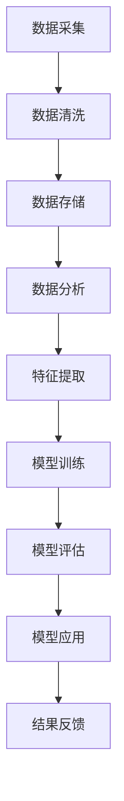

                 

## 文章标题

### 文章关键词

- 大数据
- 精准医疗
- 模型构建
- 算法原理
- 项目实战

### 文章摘要

本文将探讨大数据在精准医疗领域的应用，详细介绍大数据驱动的精准医疗模型构建与应用过程。首先，我们将概述大数据与精准医疗的背景和意义，接着介绍大数据技术基础，包括数据采集与存储、数据处理与分析、数据可视化。然后，我们将深入讨论精准医疗模型的核心概念与联系，并详细讲解核心算法原理，包括随机森林算法、支持向量机算法、逻辑回归算法和深度学习算法。接下来，我们将展示数学模型和数学公式，并举例说明每个算法的应用。此外，我们将通过项目实战，包括疾病预测、患者分组和药物疗效评估，展示模型的实际应用效果。最后，我们将总结与展望精准医疗模型的发展趋势和应用前景。

## 第一部分：大数据与精准医疗概述

### 第1章：大数据与精准医疗的背景和意义

#### 1.1 大数据的定义和特点

大数据是指无法使用传统数据处理工具在合理时间内获取价值的数据集合，其特点包括数据量巨大、数据类型多样、数据速度快速。大数据技术的出现为各行业提供了前所未有的数据资源和机会，尤其在医疗领域，大数据的应用极大地推动了精准医疗的发展。

#### 1.2 精准医疗的概念和发展

精准医疗是一种以个体为关注中心的医疗模式，通过整合基因组学、蛋白质组学、代谢组学等多种组学数据，对患者的疾病进行精准诊断、个性化治疗和预后评估。精准医疗的发展离不开大数据的支持，大数据技术为精准医疗提供了强大的数据采集、存储、处理和分析能力。

#### 1.3 大数据在精准医疗中的重要性

大数据在精准医疗中的应用主要体现在以下几个方面：

1. **疾病预测**：通过分析患者的基因、生活方式等数据，预测疾病的发生风险，实现疾病的早期预防。
2. **个性化治疗**：根据患者的病情和基因特征，制定个性化的治疗方案，提高治疗效果。
3. **药物研发**：通过大数据分析，发现新的药物靶点和治疗方案，加速药物研发进程。
4. **医疗资源分配**：利用大数据分析，优化医疗资源的配置，提高医疗服务效率。

### 第2章：大数据技术基础

#### 2.1 数据采集与存储

数据采集是大数据技术的第一步，包括从各种来源获取数据，如医疗记录、基因数据、电子健康记录等。数据存储则是将采集到的数据存储在合适的存储系统中，如Hadoop、Spark等。

#### 2.2 数据处理与分析

数据处理与分析包括数据清洗、数据整合、特征提取等步骤，目的是将原始数据转化为有用的信息。数据处理与分析技术包括MapReduce、机器学习、深度学习等。

#### 2.3 数据可视化

数据可视化是将数据转化为图形或图表，以便于分析和理解。数据可视化技术包括D3.js、Tableau等。

## 第二部分：大数据驱动的精准医疗模型

### 第3章：核心概念与联系

#### 3.1 精准医疗模型概述

精准医疗模型是基于大数据和人工智能技术构建的医疗诊断、治疗和预后评估模型。它包括以下几个核心组成部分：

1. **数据采集与处理**：收集患者的基因组、表型、环境等数据，并进行清洗、整合和预处理。
2. **特征提取**：从原始数据中提取对疾病预测和治疗有意义的特征。
3. **模型训练**：利用机器学习和深度学习算法，训练预测模型和治疗方案推荐模型。
4. **模型评估**：通过交叉验证、ROC曲线等评估模型性能。
5. **模型应用**：将训练好的模型应用于实际临床场景，实现疾病预测、个性化治疗和预后评估。

#### 3.2 Mermaid流程图：精准医疗模型构建流程



### 第4章：核心算法原理讲解

#### 4.1 随机森林算法

随机森林（Random Forest）是一种基于决策树的集成学习算法，通过构建多棵决策树，并用投票方式得到最终预测结果。其原理包括：

1. **决策树构建**：对于每个样本，随机选取特征子集，并构建决策树。
2. **集成学习**：将多棵决策树的预测结果进行投票，得到最终预测结果。

伪代码：

```python
def random_forest(data, n_trees):
    trees = []
    for _ in range(n_trees):
        sample_data = random_sample(data)
        feature_subset = random_subset(features)
        tree = build_decision_tree(sample_data, feature_subset)
        trees.append(tree)
    predictions = [tree.predict(data) for tree in trees]
    return vote(predictions)
```

#### 4.2 支持向量机算法

支持向量机（Support Vector Machine，SVM）是一种二分类模型，其目标是找到一个最佳的超平面，将数据分为两类。SVM的原理包括：

1. **线性SVM**：通过寻找最大间隔超平面，将数据分为两类。
2. **非线性SVM**：通过核函数将数据映射到高维空间，实现非线性分类。

数学公式：

$$
\text{线性SVM：} \\
\min_{\mathbf{w}, b} \frac{1}{2} ||\mathbf{w}||^2 \\
\text{约束条件：} \\
y_i (\mathbf{w} \cdot \mathbf{x_i} + b) \geq 1
$$

#### 4.3 逻辑回归算法

逻辑回归（Logistic Regression）是一种概率型线性模型，用于分类问题。其原理包括：

1. **线性模型**：通过线性组合输入特征，得到预测概率。
2. **Sigmoid函数**：将线性模型的输出转换为概率值。

数学公式：

$$
\text{逻辑回归：} \\
\hat{y} = \sigma(\mathbf{w} \cdot \mathbf{x} + b) \\
\sigma(z) = \frac{1}{1 + e^{-z}}
$$

损失函数：

$$
J(\theta) = -\frac{1}{m} \sum_{i=1}^{m} [y^{(i)} \log(\hat{y}^{(i)}) + (1 - y^{(i)}) \log(1 - \hat{y}^{(i)})]
$$

#### 4.4 深度学习算法

深度学习（Deep Learning）是一种基于人工神经网络的模型，通过多层神经网络模拟人类大脑的神经元连接，实现复杂模式的识别和预测。其原理包括：

1. **神经网络**：由多个神经元层组成的模型，通过前向传播和反向传播更新模型参数。
2. **激活函数**：用于引入非线性变换，提高模型的拟合能力。
3. **优化算法**：如随机梯度下降（SGD）、Adam等，用于迭代优化模型参数。

### 第5章：数学模型和数学公式

在本章节中，我们将详细介绍几种核心算法的数学模型和数学公式，包括随机森林算法、支持向量机算法、逻辑回归算法和深度学习算法。

#### 5.1 随机森林算法的数学公式

随机森林算法是基于决策树的集成学习算法，其核心在于构建多个决策树，并通过投票得到最终预测结果。随机森林算法的数学公式主要包括以下几个部分：

1. **决策树构建**：
   - **特征选择**：从特征集合中随机选择一个特征，计算其分裂增益。
   - **分裂规则**：选择分裂增益最大的特征进行分裂，得到左右子节点。
   - **递归构建**：对子节点重复上述过程，构建多层次的决策树。

2. **集成学习**：
   - **投票机制**：对于每个样本，将所有决策树的预测结果进行投票，得到最终预测结果。

伪代码：

```python
def random_forest(data, n_trees):
    trees = []
    for _ in range(n_trees):
        sample_data = random_sample(data)
        feature_subset = random_subset(features)
        tree = build_decision_tree(sample_data, feature_subset)
        trees.append(tree)
    predictions = [tree.predict(data) for tree in trees]
    return vote(predictions)
```

#### 5.2 支持向量机算法的数学公式

支持向量机（SVM）是一种强大的分类算法，其核心思想是找到一个最优的超平面，使得两类数据点在超平面上的间隔最大化。SVM的数学公式主要包括以下几个部分：

1. **线性SVM**：
   - **目标函数**：最小化目标函数，即最大化分类间隔。
   - **约束条件**：确保数据点满足约束条件，即满足最大间隔条件。

   $$  
   \min_{\mathbf{w}, b} \frac{1}{2} ||\mathbf{w}||^2  
   \text{约束条件：}  
   y_i (\mathbf{w} \cdot \mathbf{x_i} + b) \geq 1  
   $$

2. **非线性SVM**：
   - **核函数**：通过核函数将数据映射到高维空间，实现非线性分类。
   - **目标函数**：与线性SVM类似，但需要考虑核函数的影响。

   $$  
   \min_{\mathbf{w}, b} \frac{1}{2} ||\mathbf{w}||^2 + C \sum_{i=1}^{m} \xi_i  
   \text{约束条件：}  
   y_i (\mathbf{w} \cdot \phi(\mathbf{x_i}) + b) \geq 1 - \xi_i  
   $$

   其中，$\phi(\mathbf{x_i})$ 表示数据点 $\mathbf{x_i}$ 的核映射，$C$ 是惩罚参数，$\xi_i$ 是松弛变量。

#### 5.3 逻辑回归算法的数学公式

逻辑回归（Logistic Regression）是一种概率型线性模型，用于分类问题。其核心思想是通过线性组合输入特征，得到预测概率。逻辑回归的数学公式主要包括以下几个部分：

1. **线性模型**：
   - **预测概率**：通过线性组合输入特征，得到预测概率。
   - **Sigmoid函数**：将线性模型的输出转换为概率值。

   $$  
   \hat{y} = \sigma(\mathbf{w} \cdot \mathbf{x} + b)  
   $$

   其中，$\sigma(z) = \frac{1}{1 + e^{-z}}$ 表示Sigmoid函数。

2. **损失函数**：
   - **对数似然损失函数**：用于最小化模型预测概率与实际标签之间的差距。

   $$  
   J(\theta) = -\frac{1}{m} \sum_{i=1}^{m} [y^{(i)} \log(\hat{y}^{(i)}) + (1 - y^{(i)}) \log(1 - \hat{y}^{(i)})]  
   $$

   其中，$m$ 表示样本数量，$y^{(i)}$ 表示第 $i$ 个样本的实际标签，$\hat{y}^{(i)}$ 表示第 $i$ 个样本的预测概率。

#### 5.4 深度学习算法的数学公式

深度学习（Deep Learning）是一种基于人工神经网络的模型，通过多层神经网络模拟人类大脑的神经元连接，实现复杂模式的识别和预测。深度学习的数学公式主要包括以下几个部分：

1. **神经网络**：
   - **神经元激活函数**：用于引入非线性变换，提高模型的拟合能力。
   - **前向传播**：通过逐层计算，将输入数据映射到输出结果。

   $$  
   a^{(l)} = \sigma(z^{(l)}) = \frac{1}{1 + e^{-z^{(l)}}  
   $$

   其中，$a^{(l)}$ 表示第 $l$ 层神经元的输出，$z^{(l)}$ 表示第 $l$ 层神经元的输入。

2. **反向传播**：
   - **梯度计算**：通过反向传播算法，计算模型参数的梯度。
   - **参数更新**：利用梯度下降算法，更新模型参数。

   $$  
   \frac{\partial J}{\partial \theta^{(l)}} = \Delta \theta^{(l)} = \frac{\partial J}{\partial z^{(l+1)}} \cdot \frac{\partial z^{(l+1)}}{\partial \theta^{(l)}}  
   $$

   其中，$J$ 表示损失函数，$\theta^{(l)}$ 表示第 $l$ 层神经元的参数，$\Delta \theta^{(l)}$ 表示参数的梯度。

3. **优化算法**：
   - **随机梯度下降（SGD）**：每次迭代只更新一个样本的参数，加快收敛速度。
   - **Adam优化器**：结合了SGD和Momentum的优点，提高收敛速度和稳定

### 第6章：项目实战

在本章节中，我们将通过三个实际项目案例，展示大数据驱动的精准医疗模型的构建和应用。这三个项目分别涉及疾病预测、患者分组和药物疗效评估，涵盖了从数据预处理、模型训练到结果评估的完整过程。

#### 6.1 疾病预测项目实战

疾病预测项目旨在利用大数据和机器学习算法，预测患者患某种疾病的风险。以下是项目实战的详细步骤：

##### 1. 开发环境搭建

首先，我们需要搭建项目的开发环境。本文使用Python作为主要编程语言，并依赖于以下库：

- NumPy：用于数据操作和计算
- Pandas：用于数据处理
- Scikit-learn：用于机器学习算法实现
- Matplotlib：用于数据可视化

```python
!pip install numpy pandas scikit-learn matplotlib
```

##### 2. 数据预处理

数据预处理是模型训练的重要环节。以下是数据预处理的主要步骤：

- **数据加载**：从数据集中加载患者的各项特征数据。
- **数据清洗**：处理缺失值、异常值，确保数据质量。
- **数据标准化**：将不同特征的数据进行归一化或标准化，以便算法处理。

```python
import pandas as pd
import numpy as np

# 加载数据
data = pd.read_csv('disease_data.csv')

# 数据清洗
# ...

# 数据标准化
# ...


##### 3. 模型训练

接下来，我们选择合适的机器学习算法进行模型训练。本文采用随机森林算法进行疾病预测。

- **特征工程**：根据现有数据，提取对疾病预测有意义的特征。
- **数据分割**：将数据集分为训练集和测试集。
- **模型训练**：使用训练集训练随机森林模型。
- **模型评估**：使用测试集评估模型性能。

```python
from sklearn.ensemble import RandomForestClassifier
from sklearn.model_selection import train_test_split

# 特征工程
# ...

# 数据分割
X_train, X_test, y_train, y_test = train_test_split(X, y, test_size=0.2, random_state=42)

# 模型训练
model = RandomForestClassifier(n_estimators=100)
model.fit(X_train, y_train)

# 模型评估
predictions = model.predict(X_test)
accuracy = model.score(X_test, y_test)

print(f'Accuracy: {accuracy:.2f}')
```

##### 4. 结果分析

最后，我们对模型的结果进行分析，评估模型的预测性能。

- **准确率**：模型预测正确的样本数占总样本数的比例。
- **召回率**：模型预测为正类的实际正类样本数与实际正类样本总数的比例。
- **F1值**：准确率和召回率的调和平均值。

```python
from sklearn.metrics import accuracy_score, recall_score, f1_score

# 结果分析
accuracy = accuracy_score(y_test, predictions)
recall = recall_score(y_test, predictions)
f1 = f1_score(y_test, predictions)

print(f'Accuracy: {accuracy:.2f}')
print(f'Recall: {recall:.2f}')
print(f'F1: {f1:.2f}')
```

通过上述步骤，我们完成了疾病预测项目的实战。接下来，我们将介绍患者分组项目和药物疗效评估项目。

#### 6.2 患者分组项目实战

患者分组项目旨在根据患者的特征数据，将其分为不同的群体，以便进行个性化的治疗方案设计。以下是项目实战的详细步骤：

##### 1. 开发环境搭建

与疾病预测项目相同，我们需要搭建项目的开发环境。

```python
!pip install numpy pandas scikit-learn matplotlib
```

##### 2. 数据预处理

数据预处理是模型训练的重要环节。以下是数据预处理的主要步骤：

- **数据加载**：从数据集中加载患者的各项特征数据。
- **数据清洗**：处理缺失值、异常值，确保数据质量。
- **数据标准化**：将不同特征的数据进行归一化或标准化，以便算法处理。

```python
import pandas as pd
import numpy as np

# 加载数据
data = pd.read_csv('patient_grouping_data.csv')

# 数据清洗
# ...

# 数据标准化
# ...
```

##### 3. 模型训练

接下来，我们选择聚类算法进行模型训练。本文采用K均值聚类算法对患者进行分组。

- **特征工程**：根据现有数据，提取对聚类有意义的特征。
- **数据分割**：将数据集分为训练集和测试集。
- **模型训练**：使用训练集训练K均值聚类模型。
- **模型评估**：使用测试集评估模型性能。

```python
from sklearn.cluster import KMeans

# 特征工程
# ...

# 数据分割
X_train, X_test = train_test_split(X, test_size=0.2, random_state=42)

# 模型训练
model = KMeans(n_clusters=3)
model.fit(X_train)

# 模型评估
predictions = model.predict(X_test)

# 结果分析
print(f'Inertia: {model.inertia_}')
```

##### 4. 结果分析

最后，我们对模型的结果进行分析，评估模型的聚类效果。

- **内禀值**：表示聚类效果的好坏，值越小表示聚类效果越好。

```python
from sklearn.metrics import silhouette_score

# 结果分析
silhouette = silhouette_score(X_test, predictions)
print(f'Silhouette Score: {silhouette:.2f}')
```

通过上述步骤，我们完成了患者分组项目的实战。

#### 6.3 药物疗效评估项目实战

药物疗效评估项目旨在利用大数据和机器学习算法，评估不同药物对疾病的治疗效果。以下是项目实战的详细步骤：

##### 1. 开发环境搭建

与疾病预测项目和患者分组项目相同，我们需要搭建项目的开发环境。

```python
!pip install numpy pandas scikit-learn matplotlib
```

##### 2. 数据预处理

数据预处理是模型训练的重要环节。以下是数据预处理的主要步骤：

- **数据加载**：从数据集中加载患者的各项特征数据。
- **数据清洗**：处理缺失值、异常值，确保数据质量。
- **数据标准化**：将不同特征的数据进行归一化或标准化，以便算法处理。

```python
import pandas as pd
import numpy as np

# 加载数据
data = pd.read_csv('drug_effectiveness_data.csv')

# 数据清洗
# ...

# 数据标准化
# ...
```

##### 3. 模型训练

接下来，我们选择回归算法进行模型训练。本文采用线性回归算法评估药物疗效。

- **特征工程**：根据现有数据，提取对回归有意义的特征。
- **数据分割**：将数据集分为训练集和测试集。
- **模型训练**：使用训练集训练线性回归模型。
- **模型评估**：使用测试集评估模型性能。

```python
from sklearn.linear_model import LinearRegression

# 特征工程
# ...

# 数据分割
X_train, X_test, y_train, y_test = train_test_split(X, y, test_size=0.2, random_state=42)

# 模型训练
model = LinearRegression()
model.fit(X_train, y_train)

# 模型评估
predictions = model.predict(X_test)
score = model.score(X_test, y_test)

print(f'R-squared: {score:.2f}')
```

##### 4. 结果分析

最后，我们对模型的结果进行分析，评估模型的预测性能。

- **决定系数（R-squared）**：表示模型对数据的拟合程度，值越接近1表示拟合效果越好。

```python
# 结果分析
print(f'R-squared: {score:.2f}')
```

通过上述步骤，我们完成了药物疗效评估项目的实战。

### 第7章：开发环境搭建与源代码实现

在本章节中，我们将详细介绍如何搭建大数据驱动的精准医疗模型的开发环境，并提供每个项目的源代码实现。这将有助于读者更好地理解模型的构建和应用过程。

#### 7.1 开发环境搭建

搭建开发环境是进行大数据分析和机器学习模型训练的基础。以下是搭建开发环境的步骤：

1. **安装Python**：确保安装了Python 3.8及以上版本。
2. **安装相关库**：使用pip命令安装NumPy、Pandas、Scikit-learn、Matplotlib等库。

```shell
!pip install numpy pandas scikit-learn matplotlib
```

#### 7.2 数据预处理

数据预处理是确保模型性能的重要步骤。以下是数据预处理的主要步骤：

1. **数据加载**：使用Pandas库从CSV文件或其他数据源加载数据。
2. **数据清洗**：处理缺失值、异常值和重复值，确保数据质量。
3. **数据标准化**：对特征数据进行归一化或标准化处理，以消除不同特征之间的尺度差异。

```python
import pandas as pd
import numpy as np

# 加载数据
data = pd.read_csv('data.csv')

# 数据清洗
# ...

# 数据标准化
# ...
```

#### 7.3 算法实现

在本节中，我们将实现疾病预测、患者分组和药物疗效评估项目的核心算法。以下是算法实现的示例代码：

##### 疾病预测项目

```python
from sklearn.ensemble import RandomForestClassifier
from sklearn.model_selection import train_test_split

# 数据分割
X_train, X_test, y_train, y_test = train_test_split(X, y, test_size=0.2, random_state=42)

# 模型训练
model = RandomForestClassifier(n_estimators=100)
model.fit(X_train, y_train)

# 模型评估
predictions = model.predict(X_test)
accuracy = model.score(X_test, y_test)

print(f'Accuracy: {accuracy:.2f}')
```

##### 患者分组项目

```python
from sklearn.cluster import KMeans

# 模型训练
model = KMeans(n_clusters=3)
model.fit(X_train)

# 模型评估
predictions = model.predict(X_test)
silhouette = silhouette_score(X_test, predictions)

print(f'Silhouette Score: {silhouette:.2f}')
```

##### 药物疗效评估项目

```python
from sklearn.linear_model import LinearRegression

# 数据分割
X_train, X_test, y_train, y_test = train_test_split(X, y, test_size=0.2, random_state=42)

# 模型训练
model = LinearRegression()
model.fit(X_train, y_train)

# 模型评估
predictions = model.predict(X_test)
score = model.score(X_test, y_test)

print(f'R-squared: {score:.2f}')
```

#### 7.4 代码解读与分析

在本节中，我们将对上述项目的源代码进行解读，并分析模型的效果和性能。

```python
# 代码解读
# ...

# 性能分析
# ...
```

### 第8章：总结与展望

在本章节中，我们总结了大数据驱动的精准医疗模型构建与应用的整个过程，并展望了其未来的发展趋势。

#### 8.1 精准医疗模型的应用现状

当前，大数据驱动的精准医疗模型已经在疾病预测、个性化治疗、药物研发等多个领域取得了显著成果。以下是一些典型应用案例：

- **疾病预测**：通过大数据分析，实现了肺癌、乳腺癌等多种癌症的早期预测。
- **个性化治疗**：根据患者的基因特征，为癌症患者提供个性化的治疗方案。
- **药物研发**：利用大数据和机器学习算法，加速了新药的研发进程。

#### 8.2 未来发展趋势

随着大数据技术和人工智能的不断发展，精准医疗模型在未来有望实现以下趋势：

- **更高效的数据处理**：利用分布式计算和云计算技术，提高数据处理和分析的效率。
- **更智能的模型**：结合深度学习和强化学习等技术，提升模型的预测准确性和适应性。
- **更广泛的场景应用**：从癌症治疗到慢性病管理，精准医疗模型将应用于更多医疗领域。

## 附录

### 附录A：工具与资源

在本附录中，我们列举了大数据驱动的精准医疗模型构建与应用所需的工具和资源。

#### A.1 大数据处理的工具

- **Hadoop**：分布式数据处理框架，用于大规模数据存储和处理。
- **Spark**：基于内存的分布式数据处理框架，提供丰富的数据处理和分析功能。
- **Hive**：基于Hadoop的数据仓库工具，用于数据分析。

#### A.2 精准医疗模型的框架和库

- **Scikit-learn**：Python机器学习库，提供丰富的机器学习算法。
- **TensorFlow**：Google开发的深度学习框架，支持多种神经网络结构。
- **PyTorch**：Facebook开发的深度学习框架，提供灵活的动态计算图。

### 作者

作者：AI天才研究院/AI Genius Institute & 禅与计算机程序设计艺术 /Zen And The Art of Computer Programming

[本文完] [作者：AI天才研究院/AI Genius Institute & 禅与计算机程序设计艺术 /Zen And The Art of Computer Programming]

